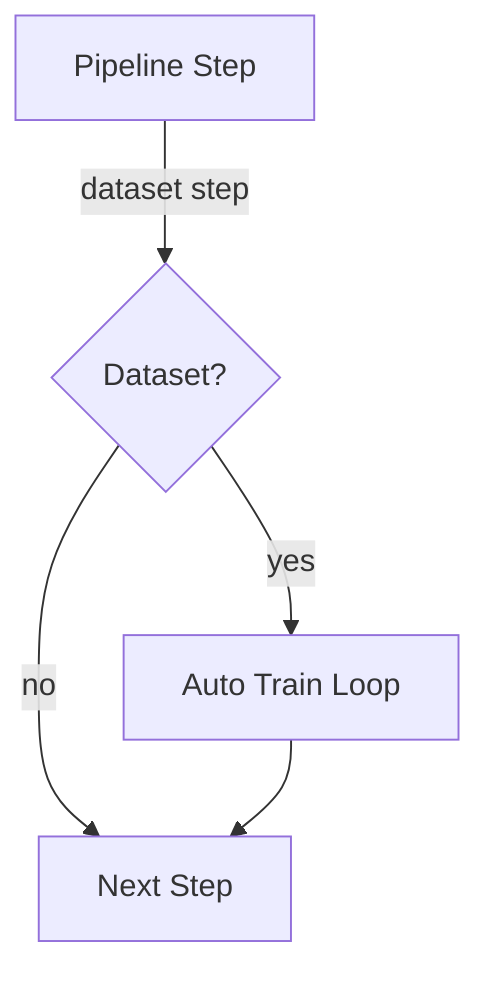

# MARBLE

**Mandelbrot Adaptive Reasoning Brain-Like Engine**

The MARBLE system is a modular neural architecture that begins with a Mandelbrot-inspired seed and adapts through neuromodulatory feedback and structural plasticity. This repository contains the source code for the system along with utilities and configuration files.
The framework now also supports multi-agent simulations where several independent MARBLE brains collaborate or compete.

## Multi-agent MARBLE

Agents are wrapped by ``MARBLEAgent``, each loading its own configuration and brain instance. Communication occurs through a thread-safe ``MessageBus`` supporting both direct and broadcast messages. Interaction histories are recorded for later analysis and can be visualised as influence graphs.

```python
from marble_agent import MARBLEAgent
from message_bus import MessageBus

bus = MessageBus()
a1 = MARBLEAgent("agent1", bus=bus)
a2 = MARBLEAgent("agent2", bus=bus)
a1.send("agent2", {"msg": "hello"})
print(a2.receive().content)
```
It also includes a new unsupervised Hebbian learning module that ties together message passing in the Core with Neuronenblitz path exploration.
An autoencoder learning paradigm further reconstructs noisy inputs through Neuronenblitz wander paths integrated with the Core.
A semi-supervised paradigm leverages both labeled and unlabeled data by applying consistency regularization directly through Neuronenblitz.
A meta-learning module implements a Reptile-style algorithm allowing
rapid adaptation to new tasks by blending weights from short inner
training loops back into the main network.
Transfer learning is supported through a new learner that freezes a
fraction of synapses while fine-tuning on a different dataset.
Continual learning is enabled via a replay-based learner that revisits
previous examples to prevent catastrophic forgetting between tasks.
An ``OmniLearner`` paradigm seamlessly unifies all available learners so
that multiple approaches can train the same model in concert. Building on
this idea, the new ``UnifiedLearner`` introduces a gating network that
dynamically selects or blends paradigms for every training step based on
contextual cues. This meta-controller coordinates learning across all
modules while logging its decisions for later inspection.
The logged data can be analysed using ``UnifiedLearner.explain`` which
optionally returns gradient-based attributions showing how each context
feature influenced the gating weights.
Continuous Weight Field Learning introduces a variational method where each
input has its own smoothly varying weight vector generated on the fly.
Neural Schema Induction grows new neurons representing frequently repeated
reasoning patterns so the network can recall entire inference chains as single
concepts.
Conceptual Integration goes a step further by blending the representations of
two dissimilar neurons into a new "concept" neuron, allowing MARBLE to invent
abstract ideas not present in the training data.
The Hybrid Memory Architecture augments MARBLE with a vector store and symbolic
database so long conversations can be recalled accurately and hallucinations are
reduced.
DiffusionCore leverages Neuronenblitz wandering for iterative denoising so
diffusion models can be trained and sampled entirely within MARBLE.
When ``workspace_broadcast`` is enabled the final sample of each diffusion run
is published through the Global Workspace so other modules can react in real
time.
Activation heatmaps for each run can be written by setting
``activation_output_dir`` and selecting a colour map with
``activation_colormap`` (e.g. ``"plasma"``) in the configuration.

MARBLE can train on datasets provided as lists of ``(input, target)`` pairs or using PyTorch-style ``Dataset``/``DataLoader`` objects. Each sample must expose an ``input`` and ``target`` field. After training and saving a model, ``Brain.infer`` generates outputs when given only an input value.
For quick experiments without external files you can generate synthetic regression pairs using ``synthetic_dataset.generate_sine_wave_dataset``.

## Dataset and Logging Configuration

The top-level `dataset` section in `config.yaml` controls how MARBLE locates and
shards training data:

- `num_shards` – total number of shards when splitting datasets across workers.
- `shard_index` – the shard index handled by this process.
- `offline` – disable remote downloads for fully local operation.
- `encryption_key` – optional key used to encrypt on-disk dataset caches.
When pipelines use parallel branches, the framework automatically assigns each
branch a unique ``shard_index`` so dataset shards are distributed evenly across
branches. This keeps parallel pipelines processing disjoint data without manual
parameter tweaks.

Logging behaviour is configured under the `logging` section:

```yaml
logging:
  structured: false  # emit JSON lines when true
  log_file: "marble.log"  # path of the primary log file
```

These options allow replicating experiments exactly across machines and enable
machine-readable logs for external monitoring systems.

## Command Line Interface

The ``cli.py`` script offers a convenient way to train and evaluate MARBLE directly
from the terminal.  It supports overriding key configuration parameters such as
learning rate scheduler and early stopping without editing ``config.yaml``.

Example usage:

```bash
python cli.py --config config.yaml --train data.csv --epochs 5 \
    --lr-scheduler cosine --scheduler-steps 10 --save marble.pkl
```

See ``python cli.py --help`` for the full list of options.

Configuration files passed via ``--config`` may contain only the parameters you
want to override.  Any missing options fall back to the defaults defined in
``config.yaml``.

Any Python object can serve as an ``input`` or ``target`` because the built-in
``DataLoader`` serializes data through ``DataCompressor``. This makes it
possible to train on multimodal pairs such as text-to-image, image-to-text or
even audio and arbitrary byte blobs without additional conversion steps. When
operating directly on the bit level, ``BitTensorDataset`` can convert objects
into binary tensors and optionally build a shared vocabulary for compact
storage. The helper ``shared_vocab.build_shared_vocab`` can merge multiple data
sources into one vocabulary so disparate datasets share identical encodings.
A ``compress`` option uses ``zlib`` to shrink the byte representation before
conversion, reducing dataset size when storing large objects. Encoding and
decoding operations are accelerated with vectorised PyTorch kernels that run on
CPU or GPU automatically. You can also pass an existing ``vocab`` dictionary to
reuse the same mapping across multiple datasets for consistent encoding.
Quantization and sparse matrix support further reduce footprint: set
``core.quantization_bits`` (or ``--quantize`` on the CLI) to pack tensors into
compact bit representations and automatically convert large, mostly zero arrays
into ``scipy.sparse`` matrices when beneficial.
``BitTensorDataset.summary`` provides quick statistics about the stored pairs,
vocabulary size, device placement and now also the total and average byte
footprint for convenient logging. Datasets can be serialised to JSON with
``BitTensorDataset.to_json`` and reconstructed using ``BitTensorDataset.from_json``.
``BitTensorDataset.add_pair`` and ``BitTensorDataset.extend`` allow dynamically
appending new training samples using the current vocabulary and device
configuration.
``BitTensorDataset.add_stream_pair`` can ingest audio or video streams directly
from a URL, converting the downloaded bytes into dataset pairs on the fly.
``BitTensorDataset.add_stream_pair_async`` offers the same functionality using
``aiohttp`` so multiple streams can be fetched concurrently within an async
pipeline. Invalid or corrupted pairs can be removed at any time with
``BitTensorDataset.prune_invalid`` which accepts a callback to check decoded
objects.

Serialised datasets can also act as a lightweight interchange format for
knowledge transfer. The helper ``transfer_dataset_knowledge`` round-trips a
``BitTensorDataset`` through JSON and trains a target ``Neuronenblitz`` on
CPU or GPU, making it easy to ship training examples from one model to
another regardless of hardware.

### Streaming Dataset Step

``StreamingDatasetStep`` wraps a ``BitTensorDataset`` iterator and prefetches
batches in an asynchronous background task. Tensors are moved to the requested
device (CPU or GPU) before emission so downstream steps receive ready-to-use
batches. When executed inside a ``Pipeline`` the step is automatically drained
and returns a list of batch dictionaries with ``"inputs"`` and ``"targets"``
tensors.

```python
from datasets import load_dataset
from bit_tensor_dataset import BitTensorDataset
from pipeline import Pipeline
import marble_interface

# Download a real dataset and take a small streaming subset
raw = load_dataset("ag_news", split="train", streaming=True)
pairs = [(rec["text"], str(rec["label"])) for rec in raw.take(200)]
dataset = BitTensorDataset(pairs, device="cpu")

pipe = Pipeline([
    {
        "func": "streaming_dataset_step",
        "module": "marble_interface",
        "params": {"dataset": dataset, "batch_size": 32, "prefetch": 4, "device": "cuda"},
    }
])
batches = pipe.execute()[0]
print(f"Streamed {len(batches)} batches")
```

This example uses Hugging Face's ``datasets`` library to stream the AG News data
without storing it locally. The step transparently pins memory for efficient
CPU→GPU transfers and supports mixed CPU/GPU pipelines.

When a ``Pipeline`` or ``HighLevelPipeline`` is executed with a
``Neuronenblitz`` instance, these streamed batches are fed directly into
training. Each shard is moved to the active CPU or GPU before invoking
``Neuronenblitz.train`` so large datasets can be learned from without keeping
all pairs in memory.

Datasets can now be cached on disk using ``BitTensorDataset.cached`` to avoid
re-encoding pairs on subsequent runs. Deterministic splitting into training,
validation and test sets is available via ``split_deterministic`` which hashes
each pair to ensure identical partitions regardless of ordering.

### Dataset cache server

Datasets can also be shared across machines via ``DatasetCacheServer``. Start the
server on one node and set ``dataset.cache_url`` in ``config.yaml`` so other
nodes fetch files from the cache automatically before downloading. This avoids
duplicate downloads and keeps distributed experiments in sync.

``dataset_versioning`` tracks changes to training pairs over time.  After calling
``create_version`` the resulting diff file can be reapplied with
``apply_version`` or sent to collaborators for reproducible experiments.
``dataset_replication.replicate_dataset`` pushes a local file to multiple
HTTP endpoints so that remote workers receive identical copies.  When combined
with the high level ``dataset_loader`` utility, datasets can be prefetched,
sharded and cached transparently using a memory pool and optional metrics
visualisation.
It now also supports loading training pairs directly from a persistent Kùzu
graph via ``load_kuzu_graph`` or the ``dataset.use_kuzu_graph`` configuration
toggle, enabling graph-structured data to feed the model without conversion.

### Tensor operation memory pooling

All fundamental tensor operations provided by ``tensor_backend`` now accept an
optional :class:`memory_pool.ArrayMemoryPool` so that intermediate buffers can be
reused instead of freshly allocating memory on every call.  Pools can allocate
NumPy arrays for CPU execution or JAX device arrays when a GPU is available,
automatically selecting ``cuda`` devices where supported.  Example:

```python
import numpy as np
from memory_pool import ArrayMemoryPool
import tensor_backend as tb

tb.set_backend("numpy")
pool = ArrayMemoryPool((2, 2))
res = tb.matmul(np.ones((2, 2)), np.ones((2, 2)), out_pool=pool)
pool.release(res)
```

Switching to JAX executes the computation on GPU if available while continuing
to reuse the same pooled buffers.

Several helper pipelines leverage ``BitTensorDataset`` to train various
learning paradigms on arbitrary Python objects, including ``AutoencoderPipeline``,
``ContrastivePipeline``, ``DiffusionPairsPipeline``, ``UnifiedPairsPipeline``,
``SemiSupervisedPairsPipeline`` and the new ``ImitationPairsPipeline``,
``FractalDimensionPairsPipeline``, ``HebbianPipeline``, ``TransferPairsPipeline``,
``QuantumFluxPairsPipeline``, ``CurriculumPairsPipeline``,
``HarmonicResonancePairsPipeline`` and ``ConceptualIntegrationPipeline``.

### Command Line Usage

Common tasks can be performed via ``cli.py``. Train a model, evaluate it and
export the core JSON with:

```bash
python cli.py --config path/to/cfg.yaml --train data.csv --epochs 10 \
    --export-core trained_core.json
```

Use ``--save`` to persist the entire MARBLE object with pickle and
``--export-core`` to write just the core for later loading via
``import_core_from_json``.

Complex training workflows defined in YAML can be launched through
``pipeline_cli.py``.  It loads ``pipeline`` sections from a configuration file
and executes the referenced learning pipeline end-to-end without additional
scripting:

```bash
python pipeline_cli.py --config pipeline.yaml --pipeline unified_pairs
```

Each pipeline consumes standard datasets and honours the same logging and
sharding options as the regular CLI.

### Manual Config Synchronisation

To copy the current configuration to additional nodes run:

```bash
python cli.py --config config.yaml --sync-config /mnt/nodeA/config.yaml /mnt/nodeB/config.yaml
```

Pass ``--sync-src`` to specify an alternative source file.

For continuous synchronisation you can start ``ConfigSyncService`` which watches
the source config for changes and propagates updates automatically:

```python
from config_sync_service import ConfigSyncService

svc = ConfigSyncService('config.yaml', ['/mnt/nodeA/cfg.yaml', '/mnt/nodeB/cfg.yaml'])
svc.start()
```
Use ``svc.stop()`` to terminate the watcher.

### Distributed and Remote Execution

Large training runs can be scaled across processes with
``distributed_training.DistributedTrainer`` which wraps PyTorch's
``DistributedDataParallel`` API. It initialises a process group,
averages synapse weights with ``torch.distributed.all_reduce`` and keeps the
standard learning code unchanged.

For heterogeneous hardware, ``remote_offload.RemoteBrainServer`` and
``RemoteBrainClient`` allow parts of a brain to run on another machine. Values
are compressed with ``DataCompressor`` and transmitted over HTTP with optional
authentication.

Both the HTTP client and the gRPC-based ``GrpcRemoteTier`` include retry
handlers that automatically recover from transient network or hardware glitches.
Requests are retried three times by default, waiting ``0.5 * 2^n`` seconds
between attempts. Custom policies can be set in ``config.yaml`` via
``network.remote_client.max_retries`` and ``network.remote_client.backoff_factor``
or on the command line:

```
python cli.py --train data.csv --remote-retries 5 --remote-backoff 1.0
```

Persistent failures propagate the original exception after the retry budget is
exhausted, ensuring fatal errors surface clearly while transient problems are
handled gracefully.

The lightweight ``DatasetCacheServer`` shares preprocessed dataset files between
nodes to avoid repeated downloads. Memory usage during these workflows can be
tracked using ``memory_manager.MemoryManager`` while
``metrics_dashboard.MetricsDashboard`` provides live charts of loss, VRAM
consumption and other metrics. When the Global Workspace plugin is active, the
dashboard also visualises the workspace queue length to monitor cognitive load.

### Multiprocessing Pipeline Execution

MARBLE can execute step functions across multiple processes while sharing a
single in-memory dataset. The :class:`process_manager.ProcessManager` spawns a
pool of workers (defaulting to ``MARBLE_WORKERS`` or the CPU count) and feeds
items from a :class:`process_manager.SharedDataset` through a shared memory
queue. CPU tensors are placed in a memory map via ``tensor.share_memory_`` so
workers read them without copies. GPU tensors are moved to the selected CUDA
device once and are then accessed through CUDA's interprocess handles.

```python
import torch
from process_manager import ProcessManager, SharedDataset

# prepare shared tensors
data = [torch.randn(8) for _ in range(64)]
dataset = SharedDataset.from_tensors(data)

def norm(x: torch.Tensor) -> torch.Tensor:
    return x / x.norm()

manager = ProcessManager(dataset, num_workers=4)
results = manager.run(norm)
```

Debugging hangs: ensure the ``spawn`` start method is used (the manager handles
this) and enable fault handlers via ``PYTHONFAULTHANDLER=1`` to capture traces
from stuck workers. Deadlocks often arise from forgetting to consume all items
from queues—``ProcessManager`` guarantees this by design.

### Step Hooks

Each pipeline step can expose *pre* and *post* hooks that run immediately before
or after the step's function or plugin. Hooks receive a mutable ``step``
dictionary, the optional MARBLE instance and the ``torch.device`` in use so they
can operate correctly on CPU or GPU. Post hooks additionally receive the
produced ``result`` and may return a replacement object. Multiple hooks may be
registered for a single step and they execute in the order they were added.

```python
import torch
from pipeline import Pipeline

def normalise(t: torch.Tensor) -> torch.Tensor:
    return t / t.norm()

pipe = Pipeline()
pipe.add_step("normalise", module="__main__", params={"t": torch.randn(4)}, name="n")

def pre_scale(step, marble, device):
    step["params"]["t"] = step["params"]["t"].to(device) * 0.1

pipe.register_pre_hook("n", pre_scale)
pipe.execute()
```

### Dependency-Based Step Reordering

Steps can declare explicit prerequisites via ``depends_on``.  The pipeline
performs a topological sort prior to execution so that steps run in dependency
order regardless of their initial arrangement.  Cycles or references to unknown
steps raise descriptive ``ValueError`` exceptions.  This reordering logic works
identically on both CPU and GPU devices.

### Isolated Step Execution

To guard long-running workflows from crashes in individual steps, any step may
set ``isolated: true``.  The step is executed in a separate Python process on
the selected CPU or GPU device and its result is returned to the main pipeline.
Isolating steps is particularly useful when experimenting with third-party
code that might leak resources or segfault.

```python
from pipeline import Pipeline

pipe = Pipeline([
    {"name": "prepare", "func": "do_work"},
    {"name": "risky", "func": "getpid", "module": "os", "depends_on": ["prepare"], "isolated": True},
])
pipe.execute()
```

The ``risky`` step runs in its own process while ``prepare`` executes in the
main process.  Should the isolated step fail catastrophically the parent
pipeline remains intact and receives a Python exception rather than crashing.

### Interactive Step Debugging

For exploratory development you can inspect the inputs and outputs of every
pipeline step interactively. Call
``Pipeline.enable_interactive_debugging`` to register hooks that capture step
parameters and result summaries including tensor shapes, dtypes and the CPU/GPU
device in use. When ``interactive=True`` (the default) the debugger drops into
``pdb`` before and after each step so you can examine state and experiment
interactively. Passing ``interactive=False`` records the information without
halting execution which is ideal for automated scripts and tests.

```python
import torch
from pipeline import Pipeline

def add_value(tensor: torch.Tensor, value: float, device: str) -> torch.Tensor:
    return tensor.to(device) + value

pipe = Pipeline()
pipe.add_step("add_value", module="__main__", params={"tensor": torch.ones(2), "value": 5})
debugger = pipe.enable_interactive_debugging()  # set interactive=False to avoid pdb
pipe.execute()
print(debugger.inputs)
print(debugger.outputs)
```

### Visualising Pipelines

MARBLE can render an entire pipeline as a graph. The helper
``pipeline_to_networkx`` converts a list of step dictionaries into a directed
``networkx`` graph which can then be displayed or further processed. The
function expands macros and branches recursively so the resulting graph mirrors
the complete execution structure. A ``pipeline_to_core`` companion builds a
``marble_core.Core`` enabling integration with the existing graph builders.

```python
from networkx_interop import pipeline_to_networkx

pipe = Pipeline()
pipe.add_step("normalise", module="my_steps")
pipe.add_step("encode", module="my_steps", depends_on=["normalise"])
graph = pipeline_to_networkx(pipe.steps)
```

The produced graph can be visualised using any ``networkx`` compatible tool or
converted to a MARBLE core via ``pipeline_to_core`` for use with the existing
visualisation utilities.

### Caching Step Results

``Pipeline.execute`` accepts a ``cache_dir`` argument that persists each step's
output to disk. Subsequent executions with the same step configuration load
cached results instead of recomputing them. Cached tensors are restored to the
current device (CPU or GPU) automatically.

```python
pipe = Pipeline()
pipe.add_step("normalise", module="__main__", params={"t": torch.randn(4)}, name="n")

pipe.execute(cache_dir="cache")  # stores result
pipe.execute(cache_dir="cache")  # loads from disk
```

### Macro Steps

Multiple operations can be grouped into a single *macro* step for convenience.
Macros execute a list of regular steps sequentially and return the collected
results.  They honour dependencies, pre/post hooks and on-disk caching just
like standalone steps.

```python
from pipeline import Pipeline

pipe = Pipeline()
pipe.add_step("step_a", module="tests.dependency_steps", name="a")
pipe.add_macro(
    "macro_bc",
    [
        {"func": "step_b", "module": "tests.dependency_steps", "name": "b"},
        {"func": "step_c", "module": "tests.dependency_steps", "name": "c"},
    ],
)
pipe.execute()
```

### Rolling Back to Earlier Outputs

When experimentation goes wrong, ``Pipeline.rollback`` restores the cached
result of a previous step and discards later outputs so that the pipeline can be
re-run from that point.

```python
pipe.execute(cache_dir="cache")
# ...modify steps and run again, producing undesirable results...
previous = pipe.rollback("a", "cache")
print(previous)  # cached output of step "a"
pipe.execute(cache_dir="cache")  # reruns steps after "a"
```

### Automatic Model Export

`Pipeline.execute` can persist the trained model as a final step by supplying
the `export_path` argument. The pipeline appends an `export_model` step that
writes the MARBLE core to the given location in JSON format by default. Set
`export_format="onnx"` to export an ONNX graph instead. Both modes operate on
CPU and GPU transparently, running on the same device as earlier steps and
returning the destination path as the final pipeline result.

```python
from pipeline import Pipeline
from marble_core import Core
from marble_neuronenblitz import Neuronenblitz
from tests.test_core_functions import minimal_params

pipe = Pipeline()
nb = Neuronenblitz(Core(minimal_params()))
pipe.execute(marble=nb, export_path="core.json")
```

### Automatic Neuronenblitz training loops

When a pipeline step produces a dataset, MARBLE automatically constructs a
training loop for an attached `Neuronenblitz` instance. Any step whose function
or plugin name contains `dataset` is treated as a dataset producer. During
execution the dataset is detected and a training loop runs without requiring an
explicit training step.

The loop selects the appropriate device and moves tensor inputs before invoking
`Neuronenblitz.train`. CPU-only systems use the `cpu` device while GPU-enabled
machines switch to `cuda`.



To customise epochs for a dataset step, supply `{"epochs": N}` in the step's
`params` mapping.

**Best practices:** keep hooks side-effect free and release references to large
GPU tensors once finished to avoid memory leaks. When mutating ``step`` ensure
subsequent runs account for the modified parameters.

### Remote Inference API

MARBLE can be exposed through a lightweight HTTP API. Launch the server with:

```python
from marble_core import Core, DataLoader
from marble_neuronenblitz import Neuronenblitz
from marble_brain import Brain
from web_api import InferenceServer
from tests.test_core_functions import minimal_params

core = Core(minimal_params())
nb = Neuronenblitz(core)
brain = Brain(core, nb, DataLoader())
server = InferenceServer(brain, api_token="secret")
server.start()
```

Query the API using ``curl``:

```bash
curl -X POST http://localhost:5000/infer -H 'Content-Type: application/json' \
     -d '{"input": 0.5}'
```

Retrieve the current neuron graph:

```bash
curl -H 'Authorization: Bearer secret' http://localhost:5000/graph
```

Call ``server.stop()`` to shut it down.

#### Serving from a Pipeline Step

The `serve_model` pipeline plugin starts the HTTP inference server during pipeline
execution.  The server stays active after the step completes, allowing immediate
remote queries.

```python
from pipeline import Pipeline
pipe = Pipeline([{ 'plugin': 'serve_model', 'params': {'host': 'localhost', 'port': 5080}}])
info = pipe.execute(marble)[0]
# interact with the API then stop it
info['server'].stop()
```


### System Metrics and Profiling

Monitor resource usage during training runs with the utilities in
`system_metrics` and `usage_profiler`:

```python
from system_metrics import profile_resource_usage
from usage_profiler import UsageProfiler

print(profile_resource_usage())
profiler = UsageProfiler(interval=1.0)
profiler.start()
# training code...
profiler.stop()
```

`profile_resource_usage` returns current CPU, RAM and GPU consumption while
`UsageProfiler` records these values over time and writes them to CSV for later
analysis.

### Playground

An interactive Streamlit playground allows quick experimentation with all of
MARBLE's capabilities. Launch it from the repository root with:

```bash
streamlit run streamlit_playground.py
```

Upload CSV, JSON or ZIP datasets containing any mix of numbers, text, images or
audio. Provide a YAML configuration by path, file upload or inline text before
initializing the system. The inference panel accepts the same modalities so you
can explore how different data types influence the system in real time. Models
may be saved and loaded from the sidebar, and you can export or import the core
JSON for experimentation. Advanced mode displays function docstrings and
generates widgets for each parameter so every capability of the
``marble_interface`` can be invoked without writing code. Modules from the
repository are also exposed and you can construct a **pipeline** of function
calls that execute sequentially. This makes it possible to combine training,
evaluation and utility operations into a single workflow directly from the UI.

The ``Optuna`` tab visualises hyperparameter optimisation studies.
Start a study by running::

    python scripts/optimize.py --trials 5 --study-name tutorial \
        --storage sqlite:///optuna_tutorial.db

The command persists trial results in ``optuna_tutorial.db`` and emits a
``best_params.yaml`` file.  Launch ``streamlit_playground.py`` and, inside the
**Optuna** tab (advanced mode), supply the database path and study name
``tutorial``.  Clicking **Load Study** renders:

* **Optimization History** – line chart showing validation loss per trial.  Hover
  over points for exact loss values; lower curves indicate better performance.
* **Parameter Importances** – bar chart ranking hyperparameters by their
  contribution to loss reduction, helping to focus future searches.
* **Best Configuration** – expander displaying winning parameters with a button
  to download them as YAML for reuse.

These visualisations make it straightforward to diagnose search progress and
reuse successful settings.
The **Pipeline** tab provides widgets for every step parameter so pipelines can
be assembled, reordered and deleted interactively before executing them on CPU
or GPU. Pipelines may be saved to or loaded from JSON for reuse outside the GUI.
The playground now also includes a **Model Conversion** tab for loading any
pretrained model from the Hugging Face Hub and converting it into a MARBLE
system with one click.
The **NB Explorer** tab contains a *Neural Pathway Inspector* that computes and
visualizes signal routes between any two neurons on CPU or GPU.
Pipelines can be imported or exported as JSON and a **Custom Code** tab lets you
run arbitrary Python snippets with the active MARBLE instance.
Pipeline steps may also be reordered or removed directly from the UI. The same
functionality is exposed programmatically via ``HighLevelPipeline.move_step``
and ``HighLevelPipeline.remove_step`` so complex workflows can be iterated on
quickly. Pipelines can be duplicated with ``HighLevelPipeline.duplicate`` and
summarised using ``HighLevelPipeline.describe`` for easy logging.
An expandable **Step Visualisation** panel lists every step with its parameters
and any dataset summaries. During execution, this panel streams live CPU and GPU
memory metrics for each step and offers one-click export of step details as
JSON or CSV, enabling deeper inspection and sharing of pipeline configurations.
Individual steps can be executed in isolation with ``HighLevelPipeline.run_step``
or partial pipelines run via ``HighLevelPipeline.execute_until``. A complementary
``HighLevelPipeline.execute_from`` starts execution from an intermediate step.
``HighLevelPipeline.execute_stream`` yields results after each step, allowing
progressive inspection of pipeline execution.
Steps can be inserted at arbitrary positions with ``HighLevelPipeline.insert_step``
and existing steps replaced or tweaked with ``HighLevelPipeline.replace_step``
and ``HighLevelPipeline.update_step_params`` which helps debug complex
workflows and restructure pipelines quickly.
You can run the same JSON pipelines from the command line using ``--pipeline``
with ``cli.py`` or execute them programmatically through the ``Pipeline``
class for full automation. A ``HighLevelPipeline`` helper offers a fluent
Python API for building these workflows. Functions from ``marble_interface``
can be added directly as methods while any repository module can be accessed via
attribute notation, for example ``HighLevelPipeline().plugin_system.load_plugins``
which appends a call to ``plugin_system.load_plugins``.
Nested modules are automatically resolved so ``HighLevelPipeline().marble_neuronenblitz.learning.enable_rl`` works as expected.
When a ``Neuronenblitz`` instance is passed to ``HighLevelPipeline.execute`` any
step whose name contains "dataset" triggers immediate training. This includes
datasets streamed in shards, allowing high level workflows to learn from large
sources without manual training loops.

Pipeline execution emits structured progress events on the global message bus.
Each ``pipeline_progress`` event includes ``step``, ``index``, ``total``,
``device`` and ``status`` fields describing which step is running and on which
hardware. The Streamlit Playground subscribes to these events and renders live
updates: a progress bar on desktop layouts and textual percentages on mobile
devices.
The same events can be forwarded to a remote experiment tracker by calling
``attach_tracker_to_events`` with an :class:`experiment_tracker.ExperimentTracker`
instance. Events contain the executing device so runs on CPU and GPU can be
correlated in external dashboards.
Each pipeline step is validated against a JSON schema when added or executed,
ensuring malformed configurations are caught before runtime.
The pipeline accepts custom callables and automatically tracks the active
``MARBLE`` instance whenever a step returns one, even if nested inside tuples or
dicts.
Dataset arguments are converted to :class:`BitTensorDataset` automatically with
mixed mode enabled, no vocabulary size limit and a minimum word length of ``4``
and maximum length of ``8``. Tensors are stored on GPU when available. All feature inputs are wrapped by default so every
operation receives data in a consistent form. A pre-built vocabulary can be
supplied via ``bit_dataset_params`` so multiple steps encode data identically.
Additional argument names can be
registered with ``HighLevelPipeline.register_data_args`` to support custom
features. Arbitrary steps from any module may be chained without limitation,
allowing any number or combination of MARBLE features and options to be expressed
through a single ``HighLevelPipeline`` instance.
### Step dependencies

Steps may include a unique ``name`` and a list of dependencies in
``depends_on``. MARBLE constructs a directed graph and orders steps with a
topological sort. Cycles raise a ``ValueError`` describing the loop.

```python
from pipeline import Pipeline

p = Pipeline()
p.add_step("prepare_data", module="marble_interface", name="prep")
p.add_step("train_model", module="marble_interface", name="train", depends_on=["prep"])
p.execute()
```

Here ``train_model`` runs after ``prepare_data`` regardless of insertion
order. Unknown-step errors typically indicate a misspelled dependency or
missing ``name``.
Multiple MARBLE systems can be created in one session. Use the *Active Instance*
selector in the sidebar to switch between them, duplicate a system for
comparison or delete instances you no longer need.

### Asynchronous execution and caching

``HighLevelPipeline`` can overlap data loading with computation for faster
throughput. Enable asynchronous execution by setting ``pipeline.async_enabled``
to ``true`` in ``config.yaml`` or by passing ``async_enabled=True`` when
creating the pipeline. Steps are driven by ``asyncio`` so both CPU and GPU
devices remain utilized.

Intermediate step outputs are cached to disk to speed up iterative experiments.
Set ``pipeline.cache_dir`` to control where these artifacts are stored. When the
value is ``null`` MARBLE chooses ``pipeline_cache_gpu`` or ``pipeline_cache_cpu``
based on hardware. The metrics dashboard exposes ``cache_hit`` and ``cache_miss``
counters so you can monitor effectiveness. Ensure the cache directory has
sufficient free space and use ``HighLevelPipeline.clear_cache()`` to purge old
results when necessary.

### Checkpointing and resuming pipelines

``HighLevelPipeline`` instances can be saved and later resumed without losing
their dataset version metadata. The ``highlevel_pipeline_cli.py`` utility
provides two sub‑commands:

```bash
python highlevel_pipeline_cli.py checkpoint my_pipe.json my_pipe.pkl \
    --config config.yaml --dataset-version v1 --device cpu

python highlevel_pipeline_cli.py resume my_pipe.pkl --config config.yaml \
    --device gpu
```

``checkpoint`` executes the pipeline and writes a checkpoint containing the
steps, configuration and optional ``dataset_version``. ``resume`` reloads this
file and continues execution, automatically selecting cached results for steps
that finished before the interruption. The ``--device`` flag runs the pipeline
on ``cpu`` or ``gpu`` so checkpoints can move between hardware while producing
identical outputs.
The advanced interface now features a **Config Editor** tab where any
parameter from the YAML configuration can be modified on the fly.  Changes are
applied immediately and you can re-initialise the system with the updated
configuration without leaving the browser.
The sidebar now previews uploaded datasets and shows the active configuration
YAML so you can verify exactly what will be used for training and inference.
You can also **search** the Hugging Face Hub directly from the sidebar. Enter a
query, press **Search Datasets** and select a result to populate the dataset
name field without leaving the playground.
You can now download the currently active configuration or save it to a custom
path directly from the sidebar. Advanced mode also features search boxes for
quickly locating functions by name within ``marble_interface`` or any module.
The Model Conversion tab now supports searching the Hub for pretrained models so
they can be converted with a single click. You can also inject MARBLE as a
transparent layer inside any loaded PyTorch model to monitor or train it in
parallel without affecting the network's predictions.
An additional **Visualization** tab renders an interactive graph of the core so
you can inspect neuron connectivity in real time. You may select a *spring* or
*circular* layout for this graph. The new **Weight Heatmap** tab displays
synaptic strengths as a heatmap for deeper analysis and now allows choosing
between *Viridis*, *Cividis* or *Plasma* color scales. The sidebar also contains a
collapsible YAML manual for quick reference while experimenting.
The playground now includes an **Offloading** tab. This lets you start a
``RemoteBrainServer`` or create a ``RemoteBrainClient`` directly from the UI and
attach it to the running system. You can also spin up a torrent client with its
own tracker to distribute lobes among peers. High‑attention regions of the brain
may then be offloaded to the remote server or shared via torrent with a single
button press.
### Remote hardware plugins

A pluggable remote hardware layer allows offloading computation to custom
devices. Specify a module implementing ``get_remote_tier`` under
``remote_hardware.tier_plugin`` in ``config.yaml``. The provided
``GrpcRemoteTier`` communicates with a gRPC service for acceleration. See
[``docs/public_api.md``](docs/public_api.md#remote-hardware-plugins) for details
on writing custom tiers.
Individual pipeline steps can target these tiers by adding a ``tier`` field to
their specification. When present, the step executes on the named remote tier
while other steps continue locally, allowing seamless mixing of local CPU/GPU
work and specialised hardware.
A dedicated **Metrics** tab graphs loss, memory usage and other statistics in
real time inside the browser. A **System Stats** tab displays current CPU and
GPU memory usage. Another **Documentation** tab provides quick access to the
README, YAML manual and full tutorial without leaving the playground. A **Tests**
tab lets you run the repository's pytest suite directly from the UI so you can
validate changes after each experiment.
The new **Neuromodulation** tab exposes sliders for arousal, stress and reward
signals along with an emotion field so you can tweak the brain's internal state
interactively.
A **Lobe Manager** tab displays all lobes with their current attention scores and
lets you create, organize or run self‑attention directly from the interface.
A new **Async Training** tab lets you launch background training threads and
enable MARBLE's auto-firing mechanism so learning continues while you explore
other features.
An **Adaptive Control** tab exposes the MetaParameterController and
SuperEvolutionController so you can fine-tune plasticity behaviour, inspect
parameter changes and run dimensional search or n-dimensional topology updates.
The interface now includes a **Hybrid Memory** tab as well. This lets you
initialize a vector store and symbolic memory, store new values, query for the
closest matches and prune old entries directly from the playground.

Additional plugins such as **Theory of Mind** and **Predictive Coding** can be
activated through the YAML configuration. These modules allow MARBLE to model
other agents' behaviour and build hierarchical predictions over time. The
Theory of Mind plugin now maintains a belief memory per agent with multi-hop
attention and logs mismatches between expected and observed beliefs. Enable
these modules by adding `theory_of_mind` or `predictive_coding` sections to
`config.yaml` and calling the respective `activate` functions in your scripts.

## Possible MARBLE Backcronyms

Below is a list of ideas explored when naming the project:

- Mandelbrot Adaptive Reasoning Brain-Like Engine
- Multi-Agent Reinforcement-Based Learning Environment
- Modular Architecture for Rapid Brain-Like Experimentation
- Memory-Augmented Recursive Bayesian Learning Engine
- Metaheuristic Adaptive Reinforcement-Based Learning Ecosystem
- Multimodal Analytical Response Behavior Learning Entity
- Machine-Augmented Reflective Belief Learning Engine
- Morphological Adaptive Robotics Brain-Like Executor
- Multi-sensory Associative Response and Behavior Learning Engine
- Matrix-Accelerated Reasoning Bot with Learning Enhancements
For a high level description of the system components and data flow see [ARCHITECTURE_OVERVIEW.md](ARCHITECTURE_OVERVIEW.md). The YAML configuration format is documented in detail in [yaml-manual.txt](yaml-manual.txt).

## Hyperparameter Tuning Best Practices
Tuning MARBLE effectively requires balancing learning stability with network plasticity. Some general guidelines:

1. Start with `random_seed` fixed to make experiments repeatable.
2. Use `learning_rate` values between `0.001` and `0.05` for most tasks.
3. Increase `neurogenesis_factor` gradually when validation loss stalls.
4. Monitor `plasticity_threshold` as it controls when new connections form.
5. Enable `lr_scheduler` with `scheduler_gamma` around `0.99` for long runs.

These heuristics work well across the provided examples but every dataset benefits from its own small grid search.
When tuning a new task consider the following workflow:

1. Start with the default configuration and run a short training job to verify that the loss decreases.
2. Perform a coarse grid search over `learning_rate` and `lr_scheduler` settings using `Pipeline.hyperparameter_search` to evaluate each combination through the pipeline.
   The search runner transfers all intermediate tensors to CPU for scoring and frees GPU memory between trials, letting studies scale even on smaller cards.
3. Once a stable range is found, explore `representation_size` and `message_passing_alpha` which strongly influence capacity and convergence speed.
4. Monitor GPU and CPU usage using the metrics dashboard to ensure batch size and dimensionality fit your hardware budget.
5. Keep `gradient_clip_value` low (around `1.0`) when experimenting with very large learning rates or aggressive neurogenesis.
6. Overlap data loading and backpropagation via `AsyncGradientAccumulator`. It
   schedules loss computation in background threads and applies optimiser steps
   once a configurable number of micro-batches have been processed, keeping the
   pipeline responsive on both CPU and GPU.

Documenting the parameters of each run with the new experiment tracker makes it easy to compare results later.

## Cross-Validation

Evaluate models with deterministic dataset splits using the `cross_validation` module.
The helper ensures identical folds across runs and automatically routes tensors
to CPU or GPU depending on availability.

```python
from cross_validation import cross_validate

def train(data, device):
    # perform training and return a model
    return sum(x[0] for x in data) / len(data)

def metric(model, data, device):
    return float(sum(abs(model - x[0]) for x in data) / len(data))

dataset = [(float(i), float(i)) for i in range(10)]
scores = cross_validate(train, metric, dataset, folds=5, seed=42)
print('scores', scores)
```

## Experiment Tracking

The `experiment_tracker` module provides a simple abstraction for logging metrics
to external services. The included `WandbTracker` sends results to
[Weights & Biases](https://wandb.ai) and can be extended for other backends.
Call `tracker.log_metrics({"loss": value}, step)` during training and invoke
`tracker.finish()` once the run ends.
Pipeline events such as `pipeline_progress` can be forwarded automatically by
calling `attach_tracker_to_events(tracker, events=[PROGRESS_EVENT])`, enabling
remote dashboards to display real-time step updates alongside metrics.
Dataset utilities likewise publish `dataset_load_start` and `dataset_load_end`
events so interfaces can surface dataset activity next to pipeline progress.

## Dataset Versioning and Replication

Datasets can be tracked over time with `dataset_versioning`. The
`create_version` function writes a diff between two data states, while
`apply_version` restores a previous snapshot. To distribute datasets across
workers use `dataset_replication.replicate_dataset` to push files to remote
HTTP endpoints before training begins.

## System Metrics and Profiling

`system_metrics.profile_resource_usage` returns the current CPU, RAM and GPU
utilisation. For longer runs `usage_profiler.UsageProfiler` records these
metrics at regular intervals and writes them to CSV for later inspection.

## HTTP Inference API

`web_api.InferenceServer` exposes a trained brain through a minimal Flask
application. Sending a JSON payload to `/infer` returns the decoded output so
other services can integrate MARBLE predictions.  The server also provides a
`/graph` endpoint returning the current neuron graph as JSON.  When the server
is created with ``api_token="..."`` requests to `/graph` must include the header
``Authorization: Bearer ...``.

## Troubleshooting
If training diverges or produces NaNs:

1. Verify the dataset is correctly formatted and free of missing values.
2. Lower `learning_rate` and check that `gradient_clip_value` is set.
3. Ensure message passing dropout is not too high for small graphs.
4. Use the metrics dashboard to watch memory usage spikes which may indicate a bug.
5. If the Streamlit GUI does not display progress updates, ensure the browser has
   JavaScript enabled so the `device` query parameter is set and verify that
   `pipeline_progress` events are being published.

For CUDA related errors confirm that your GPU drivers and PyTorch build match.

## GPU Limitations

Most components in MARBLE transparently select between CPU and GPU devices.
However, the `PromptMemory` cache operates entirely on the host using a
`collections.deque` of Python dictionaries.  Because it performs no tensor
operations it does not benefit from GPU acceleration and always executes on the
CPU even when CUDA is available.  This behaviour has been benchmarked to ensure
CPU performance remains within acceptable bounds and that enabling a GPU does
not introduce a significant slowdown.  No other modules currently require
GPU-exclusive execution, but GPU resources will be utilised whenever they offer
measurable speedups.

## Additional Resources

* **Interactive notebook** – A Jupyter notebook located under ``notebooks/``
  demonstrates dataset loading and model training step by step.
* **Template repository** – The ``project_template`` directory provides a
  minimal project skeleton including a configuration file and entry point.
* **Reusable neuron and synapse templates** – Found in ``templates/`` to help
  kick start custom component development.

## Code Style
This repository includes a pre-commit configuration using **black**, **isort**
and **ruff**. After installing the `pre-commit` package run:

```bash
pre-commit install
```

to automatically format and lint changes before each commit.

\nMARBLE can be extended via a simple plugin system. Specify directories in the `plugins` list of the configuration and each module's `register` function will be invoked to add custom neuron, synapse, or loss modules. Registered loss modules become available via the ``loss_module`` configuration field and are initialised on CPU or GPU depending on hardware.
Neuronenblitz exposes a runtime plugin API. After creating a `Neuronenblitz` instance you may activate modules via `n_plugin.activate("my_plugin")`. The plugin\x27s `activate(nb)` function receives the instance and can freely read or modify any attributes or methods.
The repository now also provides a `global_workspace` plugin which broadcasts small messages to all registered listeners. Enable it by adding a `global_workspace` section to `config.yaml` and activating the plugin with `n_plugin.activate("global_workspace")`.
An additional `attention_codelets` plugin can broadcast the output of custom
codelets through the workspace. Register your own codelets via
`attention_codelets.register_codelet` and invoke
`attention_codelets.run_cycle()` during training.

Learning algorithms can now be swapped at runtime through the dedicated
``learning_plugins`` interface.  Implementations subclass
``LearningModule`` and are registered with
``learning_plugins.register_learning_module``.  ``UnifiedLearner`` accepts
plugin names and initialises each module on CPU or GPU depending on hardware:

```python
from learning_plugins import load_learning_plugins

load_learning_plugins("plugins")
learner = UnifiedLearner(core, nb, {"custom": "my_plugin"}, plugin_dirs=["plugins"])
```

The ``attention_codelets`` system can also react to Global Workspace events.
Invoking ``attention_codelets.enable_workspace_gating()`` subscribes to
messages of the form ``{"codelet": "name", "gate": value}``, dynamically
adjusting salience during coalition formation.

For heavy computation on dedicated accelerators the `remote_offload` plugin
spawns a `RemoteBrainServer` that executes message passing and learning steps on
another machine. Local clients interact with it transparently through
`RemoteBrainClient`, enabling lightweight control nodes with powerful remote
workers.

### Pipeline step plugins

MARBLE's pipeline can be extended without modifying the core by registering
*pipeline step* plugins.  A plugin is a class implementing three lifecycle
methods – ``initialise``, ``execute`` and ``teardown`` – and is registered under
an identifier.  At runtime the pipeline instantiates the class, selects the
appropriate execution device (CPU or GPU) and routes all tensor operations to
that device.

Third‑party packages may expose entry points under
``marble.pipeline_plugins`` or provide standalone Python files containing a
``register`` function.  ``pipeline_plugins.load_pipeline_plugins`` scans these
locations and populates a registry mapping plugin names to classes.

The repository includes ``examples/plugins/double_step.py`` demonstrating a
minimal plugin.  Load it and invoke the step inside a pipeline:

```python
from pipeline_plugins import load_pipeline_plugins
from pipeline import Pipeline

load_pipeline_plugins("examples/plugins")

pipe = Pipeline([
    {"plugin": "double_step", "params": {"factor": 4}}
])

result = pipe.execute()[0]
print(result)  # tensor([4.]) on the selected device
```

Plugins may freely interact with the active MARBLE instance passed to the
pipeline.  After execution ``teardown`` is called to release resources,
ensuring clean shutdown across CPU and GPU contexts.

### Branching pipelines

Complex experiments often require exploring multiple processing strategies in
parallel.  ``Pipeline.add_branch`` accepts a list of sub-pipelines that execute
concurrently and optionally a merge specification that combines their results
once all branches finish:

```python
from pipeline import Pipeline

pipe = Pipeline()
pipe.add_branch(
    branches=[
        [{"func": "branch_a", "module": "my_steps"}],
        [{"func": "branch_b", "module": "my_steps"}],
    ],
    merge={"func": "merge_branches", "module": "my_steps"},
)
pipe.execute()
```

Branching is advantageous when comparing alternative preprocessing chains or
model variants.  Each branch receives an independent execution context and the
merge function decides how to reconcile their outputs.

### Limiting GPU Memory Per Step

When multiple branches execute on a GPU it is easy to exhaust device memory.
``Pipeline.execute`` therefore exposes ``max_gpu_concurrency`` which bounds the
number of concurrently running GPU branches. Excess branches wait until GPU
capacity is available, preventing out-of-memory errors while still allowing
CPU-only execution to proceed unhindered.

```python
pipe.execute(max_gpu_concurrency=1)
```

This control applies recursively to macro steps and nested branches ensuring
consistent behaviour across complex pipelines.

### Estimating Resource Needs

``Pipeline.execute`` can plan allocations ahead of time. Steps may expose
an estimator by defining a ``<func>_estimate`` helper or, for plugins,
an ``estimate_memory`` method. During a pre-execution pass the pipeline
calls these estimators and reports the predicted byte usage to a
``MemoryManager``.

```python
from memory_manager import MemoryManager
pipe = Pipeline([...])
mgr = MemoryManager()
pipe.execute(memory_manager=mgr)
print(mgr.total_reserved())
```

### Saving Run Profiles

Supplying ``run_profile_path`` writes a JSON file describing the exact
step sequence.  The profiler records start and end times and the CPU or
GPU device for each step, including those inside macros and branches.

```python
pipe.execute(run_profile_path="profile.json")
```

The resulting file lists entries like

```json
[{"step": "load", "start": 0.0, "end": 0.1, "device": "cpu"}]
```

## PyTorch to MARBLE Conversion
The project ships with a converter that maps PyTorch models into the MARBLE
format. Run the CLI to transform a saved ``.pt`` file into JSON:

Supported layers currently include ``Linear``, ``Conv2d`` (multi-channel),
``BatchNorm1d``, ``BatchNorm2d``, ``LayerNorm``, ``GroupNorm``, ``Dropout``,
``Flatten``, ``MaxPool2d``, ``AvgPool2d``, ``GlobalAvgPool2d`` and the adaptive
pooling variants ``AdaptiveAvgPool2d`` and ``AdaptiveMaxPool2d`` as well as the
element-wise activations ``ReLU``, ``Sigmoid``, ``Tanh`` and ``GELU``. ``Embedding`` and
``EmbeddingBag`` layers are supported, including their ``padding_idx`` and ``max_norm`` options.
Recurrent modules ``RNN``, ``LSTM`` and ``GRU`` are handled as well. Functional reshaping
operations via ``view`` or ``torch.reshape`` are also recognized. In addition,
``Sequential`` containers and ``ModuleList`` objects are expanded recursively during conversion.

```bash
python convert_model.py --pytorch my_model.pt --output marble_model.json
```

To store a full MARBLE snapshot instead of JSON simply use the `.marble`
extension:

```bash
python convert_model.py --pytorch my_model.pt --output marble_model.marble
```

Specify ``--dry-run`` to see the resulting graph statistics without writing a
file. You can also call ``convert_model`` directly:

For a quick overview without producing an output file you can use ``--summary``
to print the neuron and synapse counts. ``--summary-output`` writes the same
information to a JSON file. The ``--summary-plot`` option saves a bar chart of
neuron and synapse counts per layer, and ``--summary-csv`` exports the counts
to a CSV file for further analysis. ``--summary-graph`` exports an interactive
HTML visualisation of the converted graph using Plotly.

Neurons created via the converter or the low-level graph builder now expose an
``activation_flag`` in their ``params`` dictionary. Runtime evaluators can set
or inspect this boolean flag to enable conditional message passing, allowing
modules to skip expensive activations for neurons marked as inactive.

```python
from pytorch_to_marble import convert_model
marble_brain = convert_model(torch_model)
```

### Registering Custom Layer Converters
The converter can handle user-defined layers by registering a conversion
function. Decorate your converter with `@register_converter` and provide the
layer class:

```python
from pytorch_to_marble import register_converter

class MyCustomLayer(torch.nn.Module):
    def __init__(self, size):
        super().__init__()
        self.linear = torch.nn.Linear(size, size)

    def forward(self, x):
        return self.linear(x) * 2

@register_converter(MyCustomLayer)
def convert_my_layer(layer, core, inputs):
    out = _add_fully_connected_layer(core, inputs, layer.linear)
    for nid in out:
        core.neurons[nid].params["scale"] = 2.0
    return out
```

Any occurrence of `MyCustomLayer` in the PyTorch model will be converted using
the provided function.

## Workflow Templates

Starter pipelines for common workflows can be generated with
`workflow_template_generator.py`.  Available templates and their
descriptions are listed with:

```bash
python workflow_template_generator.py --list
```

To create a new pipeline file from a template run:

```bash
python workflow_template_generator.py classification my_pipeline.py
```

The generated code automatically selects `cuda` when a GPU is
available and otherwise falls back to CPU.  Override the default
device via `--device`:

```bash
python workflow_template_generator.py classification my_pipeline.py --device cpu
```

Each template provides executable scaffolding with clearly marked
sections for custom data loading and processing so projects can be
bootstrapped quickly.

## Dream Replay Scheduler

Dream consolidation can be automated via ``DreamScheduler`` which samples
high-salience memories from the ``DreamReplayBuffer`` and replays them
through a ``Neuronenblitz`` instance.  Low-salience experiences are
pruned after each cycle.

```python
from dream_scheduler import DreamScheduler

scheduler = DreamScheduler(marble.neuronenblitz, marble.brain.dream_buffer, batch_size=8)
scheduler.run(3)
```

The scheduler transparently works on CPU or GPU depending on the
``Neuronenblitz`` device.

## Release Process
To publish a new release to PyPI:
1. Update the version number in `pyproject.toml` and `setup.py`.
2. Commit all changes and tag the commit with the version.
3. Run `python -m build` to create source and wheel packages.
4. Upload to TestPyPI with `twine upload --repository testpypi dist/*` and verify installation.
5. Once validated, upload to PyPI.


