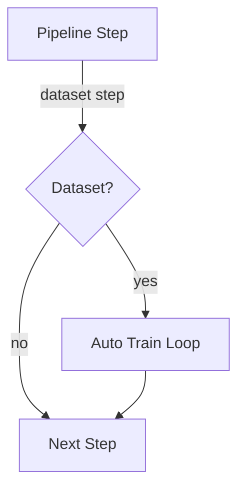

# AGENTS.md

0. Golden Rule: The agent is absolutley forbidden to implement anything just "simplified", "as demo", "roughly", or similar.
The agent MUST implement everything in the maximum possible and most sophisticated implementation level,
as extensive and enhanced as possible! ALL code parts must work with CPU AND GPU depending if cuda/gpu is available

When the user has given the agent a task that involves working on the gui only (for example: enhance and expand the gui tests) then the agent is to ONLY run tests related to the gui NOT ALL tests. 
In this case the rule that says to always run all tests is temporarily not in effect.

Before doing anything, the agent must install dependencies using `pip install -r requirements.txt`, unless user mentions QUICKMODE
If there are conflicts with in requirements.txt the agent must fix them.
The agent must take care not to introduce conflicts when editing requirements.txt

When testing, any failed tests should be logged into
a FAILEDTESTS.md that is persisted. 

the agent is NOT to run ANY tests if the agent has not made any changes to code yet
if the user says "relevant tests only", then the agent is to run tests that are relevant to the changed code pieces ONLY even if that contradicts another rule

IMPORTANT DO NOT SKIP UNLESS USER MENTIONS QUICKMODE
0.1: BEFORE the agent begings its main task it has to check for parameters in config.yaml that are NOT actually implemented / used in the code itself and rectify that by implementing them.
BEFORE the agent begins its main task it has to check FAILEDTESTS.md for any failed tests and fix ONE of them
0.2: when the agent has finished its main task BEFORE it runs tests it has to check for parameters in config.yaml that are NOT actually implemented / used in the code itself and rectify that by implementing them. This is in ADDITION to the check and fix unimplemented parameters
in config.yaml in 0.1
--------------------

If the user mentions QUICKMODE, do not do the config.yaml check and
do not run any tests. You are allowed to create new tests in QUICKMODE but
not run any. 

1. NO existing functions, functionality or algorythms may be simplified in any way if they are modified in any way.
2. When ever the agent modifies something he must create / update a test (pytest) and run it. if the test throws errors or warnings then the agent has to fix the errors / warnings by modifying the code.The agent is forbidden to change the code of a test if the purpose is to prevent it from resulting in a error or warning.
3. The must be tests for all functions and algorythims...each seperately AND ALL OF IT IN CONCERT
4. The agent must update `requirements.txt` automatically after all changes.
5. Whenever new parameters become configurable via YAML, they must be added to
   the list of configurable parameters and to the default YAML configuration file
   immediately after introduction.
6. The agent must maintain a `yaml-manual.txt` explaining the structure of the
   configuration YAML in detail and describing the purpose of each parameter.
   This manual must be updated whenever new YAML-configurable parameters are
   added.
7. Descriptions in `yaml-manual.txt` must be thorough. Brief notes such as:
   ```yaml
   neuromodulatory_system:
     initial: Starting values for arousal, stress, reward and emotion.
   ```
   are insufficient. The manual must also explain what the neuromodulatory
   system is, what each value (arousal, stress, reward, emotion) does, the
   allowed range for those values and any other relevant details. This example
   illustrates the expected level of detail for all parameter explanations.
8. `yaml-manual.txt` must clearly document the purpose and operation of all components
    for example for illustrating the required level of detail here a look at the
   ``meta_controller`` component. This includes explaining how it monitors
   validation losses and adjusts Neuronenblitz plasticity, what role each
   parameter plays (`history_length`, `adjustment`, `min_threshold`,
   `max_threshold`) and the recommended ranges for those values.
9. The agent must maintain `TUTORIAL.md` containing a detailed step-by-step tutorial. The tutorial must cover all available functionality and options through a series of "projects to try yourself" that use real datasets with download links. Projects should be ordered from easiest to most advanced. Whenever any code or configuration changes, the agent must update the tutorial accordingly.
10. ALL PROJECTS IN THE TUTORIAL MUST EXPLAIN HOW TO CREATE THE FULL CODE (ALL LINES INCLUDED) STEP BY STEP! ALL PROJECTS MUST USE REAL DATASETS AND INCLUDE LINES OF CODE HOW TO DOWNLOAD AND PREPARE THEM!
11. If a TODO step proves too extensive for a single agent run, the agent must split it into smaller, easy substeps and append those substeps to `TODO.md` before continuing.
12. the agent is NEVER to run all tests in one go. (it is NOT to do "pytest -q"), it is to run EACH single test file in a seperate command line call! THE AGENT IS FORBIDDEN TO USE LOOPS! IT MUST DO A SEPERATE PYTEST CALL TO EACH INDIVIDUAL TEST FILE! example: lets say we have three test files "test1.py", "test2.py", "test3.py".
The correct procedure for the agent is: 1. run test1.py, fix errors (if any)...rerun test1.py (fix errors if any...repeat until no more errors), 2. run test2.py, fix errors (if any)...rerun test2.py (fix errors if any...repeat until no more errors), 3. run test3.py, fix errors (if any)...rerun test3.py (fix errors if any...repeat until no more errors).

streamlit gui
ALL functionality MUST be available via the GUI. The assistant groups functionality logically in tabs. It uses the existing tabs for grouping of functionality when possible but creates new tabs if that seems more sensible. The agent must ensure that it never creates a new tab for things that can be logically put into a existing tab. for example: there may not be multiple tabs containing statistics..that would all belong into ONE tab.
The agent must ensure that the streamlit GUI will show correctly on desktop AND mobile phones. the correct "mode" to show in should be recognised automatically. you may NOT remove or simplify ANY part of the gui in ANY mode.
The agent must use st.expander to group multiple things that belong to the same functionality or workflow together in a tab as explained here: https://docs.streamlit.io/develop/api-reference/layout/st.expander
The agent must use st.dialog where appropriate as explained here: https://docs.streamlit.io/develop/api-reference/execution-flow/st.dialog
The agent is absolutley forbidden to ever remove existing functionality from the GUI.
group things where it makes sense logically together using expandables. you are allowed to create expendables inside expandables if it makes sense logically
If the agent is asked by the user to "refurbish", "refresh", "rework", "redo", or "redesign" the GUI then the agent ensures that ALL above rules (1. - 6.) about the streamlit gui are strictly adhered to but those rules ALSO apply WHENEVER the agent works on the application in any way.
The agent is to unittest the streamlit gui. How this can be done is explained in the file "streamlittestinghowto.md" found in the repo. The streamlit gui is big but that is not to discourage the agent. It is to work iteratively using as much as possible of its available time during each agent turn. The goal is that the ENTIRE streamlit gui is thoroughly tested. NO parts of the gui may be skipped during testing. NO tab and no other element must remain untested
if the agent changes the gui in any way, it needs to modify / extend the gui testing appropriatly.
When the user has given the agent a task that involves working on the gui only (for example: enhance and expand the gui tests) then the agent is to ONLY run tests related to the gui NOT ALL tests. In this case the rule that says to always run all tests is temporarily not in effect.
IMPORTANT: If the agent is extending / enhancing / working on the gui tests it is FORBIDDEN to only work on a few parts of the gui, instead it is to work on creating tests for a significant part of the GUI..for example a whole tab or at least half of a tab.


# ARCHITECTURE_OVERVIEW.md

# MARBLE Architecture Overview

This document provides a high level description of how the main components of
MARBLE interact with one another and how data flows through the system.
It complements the detailed parameter descriptions in `yaml-manual.txt`.

## Core Components

### Core
The `Core` stores the neurons and synapses that make up the graph.
When initialised it seeds the neuron values from a Mandelbrot fractal
or from a symbolic `formula` if provided.  Each neuron carries a
`representation` vector which is updated through message passing.
The core also manages tiered memory (VRAM/RAM/Disk) and can expand by
creating additional neurons and synapses when neurogenesis is triggered.

### Neuronenblitz
`Neuronenblitz` implements the dynamic wandering algorithm that traverses
the graph.  It performs learning via weight updates and structural
plasticity.  It also produces neuromodulatory feedback by exposing the
last message passing change and plasticity thresholds.

### Brain
`Brain` orchestrates training.  It owns a `Core`, a `Neuronenblitz`, a
`DataLoader` and optional utilities such as the `MetricsVisualizer` and
`MetaParameterController`.  During `Brain.train` it iteratively calls
`Neuronenblitz.train_example` on the provided examples, manages
neurogenesis and consolidation and updates metrics.

### Remote Hardware Plugins
MARBLE can offload computation to specialized devices through a plugin system. Provide a module defining `get_remote_tier` and set `remote_hardware.tier_plugin` in `config.yaml` to enable it. The included `GrpcRemoteTier` communicates with a gRPC service.

### Plugin System
Beyond hardware acceleration, MARBLE exposes a lightweight plugin framework.
Modules listed under the top-level `plugins` key in `config.yaml` are imported
on start-up and may register new neuron or synapse types, background services or
other utilities via a `register(brain)` function. This enables experimentation
without modifying the core codebase.

### Auxiliary Services
Several helper modules support large scale experiments. ``DatasetCacheServer``
shares preprocessed datasets over HTTP so repeated runs avoid redundant
downloads. ``distributed_training.DistributedTrainer`` wraps PyTorch's process
group API to synchronise weights across multiple workers. A
``metrics_dashboard.MetricsDashboard`` instance renders live charts in a browser
and the minimalist ``memory_manager.MemoryManager`` tracks upcoming allocations
to avoid oversubscription. The ``experiment_tracker`` module logs metrics to
external services such as Weights & Biases via ``WandbTracker`` so long-running
experiments remain reproducible.

``system_metrics`` exposes lightweight functions to query CPU, RAM and GPU
utilisation, while ``usage_profiler.UsageProfiler`` records these values to CSV
for long-running jobs. For serving predictions ``web_api.InferenceServer`` spins
up a minimal Flask application that exposes the active brain over HTTP so other
systems can submit inference requests.

``dataset_loader`` provides high level helpers for downloading, sharding and
caching tabular datasets while tracking dependencies and memory usage. Datasets
can be versioned with ``dataset_versioning`` which writes diffs for each change
and later applies them to reproduce exact states. ``dataset_replication``
pushes dataset files to multiple HTTP endpoints so distributed jobs start from
identical inputs.

## Data Compression Pipeline
The `DataLoader` converts arbitrary Python objects or arrays into binary
representations using the `DataCompressor` and can optionally cache them via
`BitTensorDataset`:

1. **Serialize** – objects are pickled or converted to NumPy arrays.
2. **Binary Conversion** – the raw bytes are turned into a stream of bits
   via `DataCompressor.bytes_to_bits`.
3. **Compression** – `zlib.compress` is applied with a configurable
   compression level.
4. **Decoding** performs the exact inverse: decompress, convert bits back
   to bytes and unpickle.  Cached datasets are keyed by a shared vocabulary so
   multiple processes can reuse encodings.  Deterministic splitting and optional
   on-disk caching allow large corpora to be reused across runs.

Throughout training the compression ratio and cache hit rate are logged in
`MetricsVisualizer` which allows monitoring of the overhead introduced by
compression and the effectiveness of caching.

## Component Interaction
1. Input data from the outside world is fed through `DataLoader.encode`
   before entering the brain.  The resulting tensor is used by
   `Neuronenblitz` during dynamic wandering or training.
2. Outputs from the graph are passed back through
   `DataLoader.decode` to reconstruct the original Python objects.
3. Neuromodulatory signals collected in `NeuromodulatorySystem` influence
   plasticity and neurogenesis decisions inside `Brain`.
4. The `MetaParameterController` observes validation loss and adjusts the
   plasticity threshold of `Neuronenblitz` over time.

A simplified flow diagram:

```
Input -> DataLoader.encode -> Brain.train/dynamic_wander ->
Core/Neuronenblitz -> DataLoader.decode -> Output
```

## Automatic Model Export Step

`Pipeline.execute` appends an `export_model` plugin after all user-defined
steps when an ``export_path`` is supplied. This final plugin serializes the
trained MARBLE core to disk—either as JSON or, when ``export_format="onnx"``
is specified, as an ONNX graph. The export runs on the same device selected
for the pipeline, seamlessly handling CPU or GPU execution and creating the
target directory if needed. The destination file path is returned as the
last pipeline result so subsequent tooling can consume it.

## Pipeline Event Logging

The global :mod:`event_bus` broadcasts ``pipeline_progress`` events whenever a
step begins or completes. Remote experiment trackers integrate by calling
``attach_tracker_to_events`` which subscribes them to the bus and forwards each
event. The event payload includes the executing device so dashboards can
correlate CPU and GPU runs.

## Step Configuration Validation

Each pipeline step is validated against a JSON schema defined in
``pipeline_schema.STEP_SCHEMA``. Validation happens when steps are added and
again during execution, recursively checking branch contents. Malformed steps
raise ``jsonschema.ValidationError`` before any computation, providing early
feedback regardless of the underlying hardware.

## Future Extensions
Future work could extend the compression layer to support streaming
data sources, integrate JAX based automatic differentiation for
alternative training schemes and provide more sophisticated memory
management policies.


# CONFIGURABLE_PARAMETERS.md

# YAML Configurable Parameters

This file enumerates every parameter that can be specified in `config.yaml`.
Each entry is listed under its section heading.

## dataset
- source
- num_shards
- shard_index
- offline
- encryption_enabled
- encryption_key
- cache_url: Base URL of ``DatasetCacheServer`` to fetch cached files from.
- use_kuzu_graph
- version_registry
- version
- kuzu_graph.db_path
- kuzu_graph.query
- kuzu_graph.input_column
- kuzu_graph.target_column
- kuzu_graph.limit

## logging
- structured
- log_file
- level: Minimum severity level captured.
- format: Log message format when ``structured`` is ``false``.
- datefmt: Timestamp format string.
- propagate: Forward records to ancestor loggers.
- rotate: Enable log file rotation.
- max_bytes: Maximum size of a log file before rotation.
- backup_count: Number of rotated log files retained.
- encoding: File encoding for log files.

## plugins
- (list of module import paths to load)

## live_kuzu
- enabled
- db_path

## pipeline
- async_enabled
- cache_dir
- default_step_memory_limit_mb
- memory_limit_mb (step field limiting memory in MB)
- macro (step field allowing a list of sub-steps)
- tier (step field selecting a remote hardware tier)
- depends_on (step field listing prerequisite step names)
- isolated (step field executing the step in a separate process)

## tool_manager
- enabled
- policy
- mode
- agent_id
- tools (mapping of tool identifiers to parameter dictionaries)


## cross_validation
- folds
- seed

## preprocessing
- workers: Number of remote preprocessing workers. When set to ``0`` all
  transformations execute in the main process.

## serve_model
- host
- port
## mcp_server
- host
- port
- auth.token: Bearer token clients must present.
- auth.username: Basic auth username.
- auth.password: Basic auth password.
## sync
- interval_ms: Interval in milliseconds between cross-device tensor
  synchronisation cycles. Recommended 100–10_000 depending on network speed.

## evolution
- population_size
- selection_size
- generations
- steps_per_candidate
- mutation_rate
- parallelism

## core
- xmin
- xmax
- ymin
- ymax
- width
- height
- max_iter
- representation_size
- message_passing_alpha
- weight_init_min
- weight_init_max
- mandelbrot_escape_radius
- mandelbrot_power
- tier_autotune_enabled
- memory_cleanup_interval
- representation_noise_std
- gradient_clip_value
- synapse_weight_decay
- message_passing_iterations
- cluster_algorithm
- vram_limit_mb
- ram_limit_mb
- disk_limit_mb
- file_tier_path
- init_noise_std
- default_growth_tier
- random_seed
- backend
- message_passing_dropout
- synapse_dropout_prob
- synapse_batchnorm_momentum
- representation_activation
- apply_layer_norm
- use_mixed_precision
- quantization_bits
- weight_init_mean
- weight_init_std
- weight_init_type
- weight_init_strategy
- show_message_progress
- message_passing_beta
- attention_temperature
- attention_dropout
- attention_causal
- attention_gating.enabled
- attention_gating.mode
- attention_gating.frequency
- attention_gating.chaos
- salience_weight
- energy_threshold
- reinforcement_learning_enabled
- rl_discount
- rl_learning_rate
- rl_epsilon
- rl_epsilon_decay
- rl_min_epsilon
- early_cleanup_enabled
- pretraining_epochs
- min_cluster_k
- diffusion_steps
- noise_start
- noise_end
- noise_schedule
- workspace_broadcast
- activation_output_dir
- activation_colormap
- memory_system
  - long_term_path
  - threshold
  - consolidation_interval
- cwfl
  - num_basis
  - bandwidth
  - reg_lambda
  - learning_rate
- harmonic
  - base_frequency
  - decay
- fractal
  - target_dimension
- synapse_echo_length
- synapse_echo_decay
- interconnection_prob

## neuronenblitz
- backtrack_probability
- consolidation_probability
- consolidation_strength
- route_potential_increase
- route_potential_decay
- route_visit_decay_interval
- alternative_connection_prob
- split_probability
- merge_tolerance
- plasticity_threshold
- continue_decay_rate
- struct_weight_multiplier1
- struct_weight_multiplier2
- attention_decay
- max_wander_depth
- learning_rate
- weight_decay
- dropout_probability
- dropout_decay_rate
- exploration_decay
- reward_scale
- stress_scale
- auto_update
- remote_fallback
- noise_injection_std
- dynamic_attention_enabled
- backtrack_depth_limit
- synapse_update_cap
- structural_plasticity_enabled
- backtrack_enabled
- loss_scale
- loss_module
- exploration_bonus
- synapse_potential_cap
- attention_update_scale
- attention_span_threshold
- max_attention_span
- plasticity_modulation
- wander_depth_noise
- reward_decay
- synapse_prune_interval
- structural_learning_rate
- remote_timeout
- gradient_noise_std
- min_learning_rate
- max_learning_rate
- top_k_paths
- parallel_wanderers: Number of Neuronenblitz worker threads used for
  ``train_in_parallel`` and parallel wanderers. Default ``1``; values
  below ``1`` are treated as ``1``.
- parallel_update_strategy
- beam_width
- wander_cache_ttl
- wander_anomaly_threshold
- wander_history_size
- phase_rate
- phase_adaptation_rate
- synaptic_fatigue_enabled
- fatigue_increase
- fatigue_decay
- lr_adjustment_factor
- lr_scheduler
- scheduler_steps
- scheduler_gamma
- scheduler.plugin
- epsilon_scheduler
- epsilon_scheduler_steps
- epsilon_scheduler_gamma
- momentum_coefficient
- use_echo_modulation
- reinforcement_learning_enabled
- rl_discount
- rl_epsilon
- rl_epsilon_decay
- rl_min_epsilon
- shortcut_creation_threshold
- chaotic_gating_enabled
- chaotic_gating_param
- chaotic_gate_init
- context_history_size
- context_embedding_decay
- emergent_connection_prob
- concept_association_threshold
- concept_learning_rate
- weight_limit
- wander_cache_size
- rmsprop_beta
- grad_epsilon
- use_experience_replay
- replay_buffer_size
- replay_alpha
- replay_beta
- replay_batch_size
- exploration_entropy_scale
- exploration_entropy_shift
- entropy_epsilon_enabled
- gradient_score_scale
- memory_gate_decay
- memory_gate_strength: Additive boost to a synapse's gating score after a
  successful path. Default ``1.0`` with a recommended range of ``0.1`` to
  ``5.0``.
- episodic_memory_size
- episodic_memory_threshold
- episodic_memory_prob
- episodic_sim_length
- curiosity_strength
- depth_clip_scaling
- forgetting_rate
- structural_dropout_prob
- gradient_path_score_scale
- use_gradient_path_scoring
- rms_gradient_path_scoring
- activity_gate_exponent
- subpath_cache_size
- subpath_cache_ttl
- monitor_wander_factor
- monitor_epsilon_factor
- use_mixed_precision
- quantization_bits

## brain
- save_threshold
- max_saved_models
- save_dir
- firing_interval_ms
- initial_neurogenesis_factor
- offload_enabled
- torrent_offload_enabled
- mutation_rate
- mutation_strength
- prune_threshold
- dream_num_cycles
- dream_interval
- neurogenesis_base_neurons
- neurogenesis_base_synapses
- max_training_epochs
- memory_cleanup_enabled
- manual_seed
- log_interval
- evaluation_interval
- early_stopping_patience
- early_stopping_delta
- auto_cluster_interval
- cluster_method
- auto_save_enabled
- offload_threshold
- torrent_offload_threshold
- cluster_high_threshold
- cluster_medium_threshold
- dream_synapse_decay
- dream_decay_arousal_scale
- dream_decay_stress_scale
- neurogenesis_increase_step
- neurogenesis_decrease_step
- max_neurogenesis_factor
- cluster_k
- auto_save_interval
- backup_enabled
- backup_interval
- backup_dir
- auto_firing_enabled
- dream_enabled
- vram_age_threshold
 - precompile_graphs
- ram_age_threshold
- status_display_interval
- neurogenesis_interval
- min_cluster_size
- prune_frequency
- auto_offload
- benchmark_enabled
- benchmark_interval
- tier_decision_params.vram_usage_threshold
- tier_decision_params.ram_usage_threshold
- model_name
- checkpoint_format
- metrics_history_size
- profile_enabled
- profile_log_path
- checkpoint_compress
- profile_interval
- early_stop_enabled
- lobe_sync_interval
- cleanup_batch_size
- remote_sync_enabled
- default_activation_function
- neuron_reservoir_size
- lobe_decay_rate
- dimensional_search.enabled
- dimensional_search.max_size
- dimensional_search.improvement_threshold
- dimensional_search.plateau_epochs

## meta_controller
- history_length
- adjustment
- min_threshold
- max_threshold

## neuromodulatory_system.initial
- arousal
- stress
- reward
- emotion

## hybrid_memory
- vector_store_path
- symbolic_store_path
- kuzu_store_path
- max_entries


## network.remote_client
- url
- timeout
- max_retries
- backoff_factor
- track_latency
- auth_token
- ssl_verify: Verify HTTPS certificates.
- connect_retry_interval: Delay between connection retry attempts.
- heartbeat_timeout: Time to wait for heartbeat responses.
- use_compression

## network.torrent_client
- client_id
- buffer_size
- heartbeat_interval

## data_compressor
- compression_level
- compression_enabled
- delta_encoding
- compression_algorithm
- quantization_bits
- sparse_threshold
## remote_hardware
- tier_plugin: Import path of a module exposing ``get_remote_tier`` used to
  instantiate a custom remote hardware tier.
- grpc.address: Host and port for the default ``GrpcRemoteTier``
  implementation.
- grpc.max_retries: Number of times to retry gRPC calls on failure.
- grpc.backoff_factor: Multiplier for exponential backoff between retries.

## dataloader
- tensor_dtype
- track_metadata
- enable_round_trip_check
- round_trip_penalty
- tokenizer_type
- tokenizer_json
- tokenizer_vocab_size

## experiment_tracker
- enabled
- project
- entity
- run_name

## formula
- formula
- formula_num_neurons

## network.remote_server
- enabled
- host
- port
- remote_url
- auth_token
- ssl_enabled
- ssl_cert_file
- ssl_key_file
- max_connections
- compression_level
- compression_enabled
## remote_hardware
- tier_plugin: Module path implementing the remote hardware API.
- grpc.address: gRPC service location when using ``GrpcRemoteTier``.

## metrics_visualizer
- fig_width
- fig_height
- refresh_rate
- color_scheme
- show_neuron_ids
- dpi
- track_memory_usage
- track_cpu_usage
- log_dir
- csv_log_path
- json_log_path
- anomaly_std_threshold
## metrics_dashboard
- enabled
- host
- port
- update_interval
- window_size

## lobe_manager
- attention_increase_factor
- attention_decrease_factor

## brain (additional)
- loss_growth_threshold
- auto_neurogenesis_prob
- dream_cycle_sleep
- dream_replay_buffer_size
- dream_replay_batch_size
- dream_replay_weighting: Sampling strategy for the dream replay buffer
  ("linear", "exponential", "quadratic", "sqrt", "uniform").
- dream_instant_buffer_size
- dream_housekeeping_threshold: Minimum salience (0-1) below which experiences
  are pruned during dream housekeeping
- super_evolution_mode

## autograd
- enabled
- learning_rate
- gradient_accumulation_steps
## global_workspace
- enabled
- capacity
## attention_codelets
- enabled
- coalition_size
## pytorch_challenge
- enabled
- loss_penalty
- speed_penalty
- size_penalty

## gpt
- enabled
- vocab_size
- block_size
- num_layers
- num_heads
- hidden_dim
- learning_rate
- num_train_steps
- dataset_path
- batch_size

## dataset
- num_shards
- shard_index
- offline
- encryption_enabled
- encryption_key
- source
- use_kuzu_graph
- kuzu_graph.db_path
- kuzu_graph.query
- kuzu_graph.input_column
- kuzu_graph.target_column
- kuzu_graph.limit

## distillation
- enabled
- alpha
- teacher_model

## reinforcement_learning
- enabled
- algorithm
- episodes
- max_steps
- discount_factor
- epsilon_start
- epsilon_decay
- epsilon_min
- seed
- double_q

## sac
- temperature: Entropy temperature coefficient for Soft Actor-Critic. Default
  ``0.1``. See ``TUTORIAL.md`` section "Soft Actor-Critic Wandering" for a
  worked example demonstrating how this parameter influences exploration on CPU
  and GPU.

## contrastive_learning
- enabled
- temperature
- epochs
- batch_size

## hebbian_learning
- learning_rate
- weight_decay

## adversarial_learning
- enabled
- epochs
- batch_size
- noise_dim

## autoencoder_learning
- enabled
- epochs
- batch_size
- noise_std
- noise_decay

## semi_supervised_learning
- enabled
- epochs
- batch_size
- unlabeled_weight
## federated_learning
- enabled
- rounds
- local_epochs

## curriculum_learning
- enabled
- epochs
- schedule
## meta_learning
- enabled
- epochs
- inner_steps
- meta_lr
- distill_alpha
## transfer_learning
- enabled
- epochs
- batch_size
- freeze_fraction

## continual_learning
- enabled
- epochs
- memory_size

## imitation_learning
- enabled
- epochs
- max_history

## harmonic_resonance_learning
- enabled
- epochs
- base_frequency
- decay

## synaptic_echo_learning
- enabled
- epochs
- echo_influence

## fractal_dimension_learning
- enabled
- epochs
- target_dimension

## quantum_flux_learning
- enabled
- epochs
- phase_rate

## dream_reinforcement_learning
- enabled
- episodes
- dream_cycles
- dream_strength
- dream_interval
- dream_cycle_duration

## continuous_weight_field_learning
- enabled
- epochs
- num_basis
- bandwidth
- reg_lambda
- learning_rate

## neural_schema_induction
- enabled
- epochs
- support_threshold
- max_schema_size

## conceptual_integration
- enabled
- blend_probability
- similarity_threshold

## n_dimensional_topology
- enabled
- target_dimensions
- attention_threshold
- loss_improve_threshold
- stagnation_epochs

## unified_learning
- enabled
- gating_hidden
- log_path

## theory_of_mind
- hidden_size
- num_layers
- prediction_horizon
- memory_slots
- attention_hops
- mismatch_threshold

## predictive_coding
- num_layers
- latent_dim
- learning_rate

## experiments
- name
- core
- neuronenblitz


# FAILEDTESTS.md

No failing tests.
- tests/test_streamlit_all_buttons.py::test_click_all_buttons: RuntimeError: AppTest script run timed out after 10(s)
- tests/test_multiprocessing_dataset.py::test_multiprocessing_cpu: ConnectionResetError [resolved by enforcing spawn start method]
- tests/test_streamlit_gui.py: multiple failures (StopIteration, IndexError, ImportError)
 - tests/test_streamlit_gui.py: unexpected failures during dataset history integration
- tests/test_streamlit_gui.py::test_step_export_and_metrics_desktop: IndexError: list index out of range
- tests/test_streamlit_gui.py::test_step_export_and_metrics_mobile: IndexError: list index out of range
- tests/test_streamlit_progress.py::test_progress_desktop: IndexError: list index out of range
- tests/test_streamlit_progress.py::test_progress_mobile: IndexError: list index out of range
- tests/test_streamlit_all_buttons.py::test_click_all_buttons: IndexError: list index out of range
- tests/test_streamlit_playground.py::test_initialize_marble: TypeError: Neuronenblitz.__init__() got an unexpected keyword argument 'auto_update' [resolved]
- tests/test_streamlit_gui.py::test_pipeline_tab_add_and_run: IndexError: list index out of range
- tests/test_streamlit_gui.py::test_pipeline_reorder_and_remove: IndexError: list index out of range
- tests/test_hybrid_memory_kuzu.py::test_kuzu_memory_separate_from_topology: RuntimeError: Catalog exception: function DATETIME does not exist [resolved]
- tests/test_pipeline_cache_stress.py::test_cache_stress_cpu: assert 1.3928057014807302 < 1 [resolved]
- tests/test_theory_of_mind_beliefs.py::test_memory_slot_creation_and_retrieval: AssertionError [resolved]
- tests/test_pretraining_and_clustering.py::test_pretraining_epochs_runs_once: AttributeError: 'range' object has no attribute 'set_postfix' [resolved]
- tests/test_pretraining_and_clustering.py::test_pretraining_epochs_runs_once: AttributeError: '_DummyPbar' object has no attribute 'close' [resolved]
- tests/test_pretraining_and_clustering.py::test_pretraining_epochs_runs_once: TypeError: DummyNB.train() got an unexpected keyword argument 'loss_fn' [resolved]
- tests/test_marble_interface.py::test_save_and_load_marble: TypeError: cannot pickle '_thread.lock' object [resolved]


# HIGHLEVEL_PIPELINE_TUTORIAL.md

# HighLevelPipeline Guide

The `HighLevelPipeline` class provides a fluent Python interface for building and executing complex MARBLE workflows. It exposes every function in
`marble_interface` and any other repository module as a chainable method.
Dataset arguments are converted to `BitTensorDataset` automatically so each step
receives inputs in a consistent format. The pipeline keeps track of the active
`MARBLE` instance and passes it between steps whenever one is returned.

---

## Who Should Use HighLevelPipeline

* **Researchers** who want to prototype MARBLE features quickly without writing
  boilerplate code for data loading and system initialisation.
* **Practitioners** building repeatable training workflows that mix multiple
  modules or paradigms, such as reinforcement learning with curriculum
  scheduling and custom plugins.
* **Educators** demonstrating MARBLE capabilities in a classroom or tutorial
  setting. The fluent syntax keeps notebooks concise and focused on the high
  level concepts.

---

## How to Use HighLevelPipeline

1. **Create a pipeline instance**
   ```python
   from highlevel_pipeline import HighLevelPipeline
   hp = HighLevelPipeline()
   ```
2. **Chain operations** using attribute access. Functions from
   `marble_interface` are added directly while any repository module can be
   accessed via dot notation.
   ```python
   hp.new_marble_system(config_path="config.yaml")
   hp.plugin_system.load_plugins(dirs=["plugins"])
   hp.train_marble_system(train_examples=[(0, 1)], epochs=5)
   ```
3. **Execute the pipeline**. The active `MARBLE` instance is returned along with
   results from each step.
   ```python
   marble, results = hp.execute()
   ```
4. **Duplicate or inspect** pipelines as needed.
   ```python
   clone = hp.duplicate()
   print(hp.describe())
   ```
5. **Save or load** pipelines using JSON for reproducibility.
   ```python
   hp.save_json("workflow.json")
   # later
   with open("workflow.json", "r", encoding="utf-8") as f:
       restored = HighLevelPipeline.load_json(f)
   ```
6. **Execute specific steps** to debug a workflow.
   ```python
  marble, result = hp.run_step(0)
  marble, intermediate = hp.execute_until(1)
  marble, tail = hp.execute_from(1)
  for m, res in hp.execute_stream():
      print("step result", res)
  ```
7. **Modify steps** by replacing functions or updating parameters.
   ```python
   hp.replace_step(0, some_other_func)
   hp.update_step_params(1, epochs=5)
   ```
8. **Custom callables** can be inserted when more control is required.
   ```python
   def print_summary(marble=None):
       print(marble.summary())
   hp.add_step(print_summary)
   ```

---

# HighLevelPipeline Tutorial

The following projects demonstrate how to create diverse MARBLE workflows using
`HighLevelPipeline`. Each project builds on real datasets that can be downloaded
with the commands shown. Replace the dataset paths with your preferred storage
location.

## Project 1 – Wine Quality Regression

1. **Download data**
   ```bash
   curl -L -o wine.csv https://archive.ics.uci.edu/static/public/186/wine+quality.zip
   unzip wine.csv
   ```
2. **Create pipeline**
   ```python
   from highlevel_pipeline import HighLevelPipeline
   hp = HighLevelPipeline()
   hp.new_marble_system(config_path="config.yaml")
   hp.train_marble_system(train_examples="winequality-red.csv", epochs=10)
   marble, _ = hp.execute()
   ```

## Project 2 – AG NEWS Text Classification

1. **Download dataset**
   ```bash
   pip install datasets
   python - <<'PY'
from datasets import load_dataset
load_dataset("ag_news").save_to_disk("ag_news")
PY
   ```
2. **Build pipeline**
   ```python
   hp = HighLevelPipeline()
   hp.new_marble_system(config_path="config.yaml")
   hp.train_marble_system(train_examples="ag_news/train", epochs=3)
   marble, _ = hp.execute()
   ```

## Project 3 – CIFAR10 Image Classification

1. **Download dataset**
   ```bash
   curl -L -o cifar-10-python.tar.gz https://www.cs.toronto.edu/~kriz/cifar-10-python.tar.gz
   tar -xzf cifar-10-python.tar.gz
   ```
2. **Setup pipeline**
   ```python
   hp = HighLevelPipeline()
   hp.new_marble_system(config_path="config.yaml")
   hp.train_marble_system(train_examples="cifar-10-batches-py", epochs=10)
   marble, _ = hp.execute()
   ```

## Project 4 – IMDB Sentiment Analysis

1. **Download data**
   ```bash
   curl -L -o imdb.tar.gz https://ai.stanford.edu/~amaas/data/sentiment/aclImdb_v1.tar.gz
   tar -xzf imdb.tar.gz
   ```
2. **Pipeline steps**
   ```python
   hp = HighLevelPipeline()
   hp.new_marble_system(config_path="config.yaml")
   hp.train_marble_system(train_examples="aclImdb/train", epochs=5)
   marble, _ = hp.execute()
   ```

## Project 5 – Boston Housing Regression

1. **Download data**
   ```bash
   curl -L -o housing.csv https://archive.ics.uci.edu/ml/machine-learning-databases/housing/housing.data
   ```
2. **Build pipeline**
   ```python
   hp = HighLevelPipeline()
   hp.new_marble_system(config_path="config.yaml")
   hp.train_marble_system(train_examples="housing.csv", epochs=15)
   marble, _ = hp.execute()
   ```

## Project 6 – Yahoo Answers Topic Classification

1. **Download dataset**
   ```bash
   pip install datasets
   python - <<'PY'
from datasets import load_dataset
load_dataset("yahoo_answers_topics").save_to_disk("yahoo")
PY
   ```
2. **Pipeline**
   ```python
   hp = HighLevelPipeline()
   hp.new_marble_system(config_path="config.yaml")
   hp.train_marble_system(train_examples="yahoo/train", epochs=4)
   marble, _ = hp.execute()
   ```

## Project 7 – WikiText Language Modeling

1. **Download dataset**
   ```bash
   pip install datasets
   python - <<'PY'
from datasets import load_dataset
load_dataset("wikitext", "wikitext-2-raw-v1").save_to_disk("wikitext2")
PY
   ```
2. **Create pipeline**
   ```python
   hp = HighLevelPipeline()
   hp.new_marble_system(config_path="config.yaml")
   hp.train_marble_system(train_examples="wikitext2/train", epochs=3)
   marble, _ = hp.execute()
   ```

## Project 8 – IWSLT Machine Translation

1. **Download dataset**
   ```bash
   pip install datasets
   python - <<'PY'
from datasets import load_dataset
load_dataset("iwslt2017", "iwslt2017-de-en").save_to_disk("iwslt_de_en")
PY
   ```
2. **Pipeline**
   ```python
   hp = HighLevelPipeline()
   hp.new_marble_system(config_path="config.yaml")
   hp.train_marble_system(train_examples="iwslt_de_en/train", epochs=6)
   marble, _ = hp.execute()
   ```

## Project 9 – CartPole Reinforcement Learning

1. **Install environment**
   ```bash
   pip install gym
   ```
2. **Build pipeline**
   ```python
   hp = HighLevelPipeline()
   hp.new_marble_system(config_path="config.yaml")
   hp.marble_neuronenblitz.learning.enable_rl(nb=None)
   hp.train_marble_system(train_examples=["CartPole-v1"], epochs=20)
   marble, _ = hp.execute()
   ```

## Project 10 – MNIST Autoencoder

1. **Download dataset**
   ```bash
   curl -L -o mnist.zip https://storage.googleapis.com/tensorflow/tf-keras-datasets/mnist.npz
   ```
2. **Pipeline**
   ```python
   hp = HighLevelPipeline()
   hp.new_marble_system(config_path="config.yaml")
   hp.train_marble_system(train_examples="mnist.npz", epochs=10)
   marble, _ = hp.execute()
   ```

## Project 11 – CelebA Diffusion Model

1. **Download data**
   ```bash
   curl -L -o celeba.zip https://drive.google.com/uc?export=download&id=0B7EVK8r0v71pZjFTYXZWM3FlRnM
   unzip celeba.zip
   ```
2. **Build pipeline**
   ```python
   hp = HighLevelPipeline()
   hp.new_marble_system(config_path="config.yaml")
   hp.train_marble_system(train_examples="img_align_celeba", epochs=20)
   marble, _ = hp.execute()
   ```

## Project 12 – STL10 Contrastive Learning

1. **Download dataset**
   ```bash
   curl -L -o stl10.zip https://ai.stanford.edu/~acoates/stl10/stl10_binary.tar.gz
   tar -xzf stl10.zip
   ```
2. **Pipeline**
   ```python
   hp = HighLevelPipeline()
   hp.new_marble_system(config_path="config.yaml")
   hp.train_marble_system(train_examples="stl10_binary", epochs=15)
   marble, _ = hp.execute()
   ```

## Project 13 – CIFAR100 Curriculum Learning

1. **Download dataset**
   ```bash
   curl -L -o cifar-100-python.tar.gz https://www.cs.toronto.edu/~kriz/cifar-100-python.tar.gz
   tar -xzf cifar-100-python.tar.gz
   ```
2. **Create pipeline**
   ```python
   hp = HighLevelPipeline()
   hp.new_marble_system(config_path="config.yaml")
   hp.train_marble_system(train_examples="cifar-100-python", epochs=12)
   marble, _ = hp.execute()
   ```

## Project 14 – Imitation Learning with Gym Expert Data

1. **Prepare data**
   ```bash
   pip install gym
   python scripts/generate_expert.py --env CartPole-v1 --output expert.pkl
   ```
2. **Pipeline steps**
   ```python
   hp = HighLevelPipeline()
   hp.new_marble_system(config_path="config.yaml")
   hp.train_marble_system(train_examples="expert.pkl", epochs=10)
   marble, _ = hp.execute()
   ```

## Project 15 – Transfer Learning from ImageNet

1. **Download pretrained weights**
   ```bash
   curl -L -o resnet.pth https://download.pytorch.org/models/resnet18-f37072fd.pth
   ```
2. **Pipeline**
   ```python
   hp = HighLevelPipeline()
   hp.new_marble_system(config_path="config.yaml")
   hp.train_marble_system(train_examples="cifar-10-batches-py", pretrained="resnet.pth", epochs=5)
   marble, _ = hp.execute()
   ```

## Project 16 – Semi-Supervised Learning with SVHN

1. **Download data**
   ```bash
   curl -L -o svhn.tar.gz http://ufldl.stanford.edu/housenumbers/train_32x32.mat
   ```
2. **Pipeline**
   ```python
   hp = HighLevelPipeline()
   hp.new_marble_system(config_path="config.yaml")
   hp.train_marble_system(train_examples="train_32x32.mat", epochs=8)
   marble, _ = hp.execute()
   ```

## Project 17 – Federated Learning Fashion-MNIST

1. **Download dataset**
   ```bash
   curl -L -o fashion-mnist.npz https://storage.googleapis.com/tensorflow/tf-keras-datasets/train-images-idx3-ubyte.gz
   ```
2. **Pipeline steps**
   ```python
   hp = HighLevelPipeline()
   hp.new_marble_system(config_path="config.yaml")
   hp.train_marble_system(train_examples="fashion-mnist.npz", epochs=5)
   marble, _ = hp.execute()
   ```

## Project 18 – Adversarial Training on MNIST

1. **Download dataset**
   ```bash
   curl -L -o mnist.npz https://storage.googleapis.com/tensorflow/tf-keras-datasets/mnist.npz
   ```
2. **Build pipeline**
   ```python
   hp = HighLevelPipeline()
   hp.new_marble_system(config_path="config.yaml")
   hp.train_marble_system(train_examples="mnist.npz", epochs=10, adversarial=True)
   marble, _ = hp.execute()
   ```

## Project 19 – Meta Learning with Omniglot

1. **Download dataset**
   ```bash
   curl -L -o omniglot.zip https://github.com/brendenlake/omniglot/raw/master/python/images_background.zip
   unzip omniglot.zip -d omniglot
   ```
2. **Pipeline**
   ```python
   hp = HighLevelPipeline()
   hp.new_marble_system(config_path="config.yaml")
   hp.train_marble_system(train_examples="omniglot", epochs=20)
   marble, _ = hp.execute()
   ```

## Project 20 – COCO Multimodal Training

1. **Download captions**
   ```bash
   curl -L -o coco2017.tar.gz http://images.cocodataset.org/zips/val2017.zip
   tar -xzf coco2017.tar.gz
   ```
2. **Create pipeline**
   ```python
   hp = HighLevelPipeline()
   hp.new_marble_system(config_path="config.yaml")
   hp.train_marble_system(train_examples="val2017", epochs=5)
   marble, _ = hp.execute()
   ```

These examples provide starting points for building your own workflows with
`HighLevelPipeline`. Adjust epochs, learning rates and parameters as needed.

## Saving and Resuming Pipelines

Long running experiments can be checkpointed and later resumed without
rebuilding the entire workflow. The `highlevel_pipeline_cli.py` script
provides two commands:

```bash
# Execute pipeline JSON and create a checkpoint
python highlevel_pipeline_cli.py checkpoint pipeline.json pipeline.chk --config config.yaml --device cpu

# Resume from a saved checkpoint
python highlevel_pipeline_cli.py resume pipeline.chk --config config.yaml --device cpu
```

Checkpoints store the pipeline steps and the `dataset_version` metadata so
repeated runs continue with the exact same dataset revision.


# ML_PARADIGMS_HANDBOOK.md

# MARBLE ML Paradigms Handbook

This handbook explains every machine learning paradigm currently implemented in MARBLE. The material is presented in three versions tailored to different audiences: laymen, ML scientists and high school students. Each section lists all paradigms in the same order.

## Version for Laymen

### Numeric Regression
A basic approach where MARBLE learns to predict numbers from examples. You provide pairs of inputs and their correct outputs. MARBLE adjusts its connections until it can guess the numbers with minimal error.

### Image Classification
MARBLE is trained to recognise objects in pictures. Images are labeled, and the system learns the patterns that correspond to each category.

### Remote Offloading
Parts of the MARBLE brain can run on another computer. This lets large models use more memory or share computation across machines.
Remote hardware plugins let MARBLE use extra computers or accelerators easily. Set ``remote_hardware.tier_plugin`` to a module providing ``get_remote_tier`` and heavy calculations run there.

### Autograd and PyTorch Challenge
MARBLE can work alongside PyTorch. The challenge compares MARBLE's learning with a PyTorch model while they share training data.

### GPT Training
MARBLE includes a compact transformer that can be trained on text. It learns to predict the next character or token, eventually generating short passages on its own.

### Knowledge Distillation
A smaller MARBLE model can learn from a larger "teacher". Both see the same data, but the teacher's predictions guide the student, making it quicker and lighter.

### Reinforcement Learning
MARBLE can learn by trial and error, such as navigating a small grid world. Positive rewards encourage good actions and negative ones discourage mistakes.

### Contrastive Learning
Without any labels, MARBLE views two slightly different versions of the same input and tries to make their internal representations similar. This leads to features that are useful for later tasks.

### Hebbian Learning
Inspired by neuroscience, MARBLE strengthens connections when neurons activate together. The more often two neurons fire in sequence, the stronger their link becomes.

### Adversarial Learning
Two MARBLE networks compete: one generates data while the other tries to tell real from fake. Over time the generator improves until the discriminator struggles to spot the difference.

### Autoencoder Learning
MARBLE tries to recreate noisy inputs. By forcing the system to clean up the noise, it learns compressed internal representations of the original data.

### Semi-Supervised Learning
Here MARBLE mixes labeled and unlabeled data. Labeled examples provide guidance while unlabeled ones encourage the network to be consistent in its predictions.

### Federated Learning
Several MARBLE instances train on their own data sets. Periodically they average their knowledge, allowing them to learn collaboratively without sharing raw data.

### Curriculum Learning
Training examples are organised from easy to hard. MARBLE gradually tackles more difficult samples as it gets better, leading to stable learning.

### Meta Learning
MARBLE practices on many small tasks so it can adapt quickly to new ones. After learning each task briefly, it updates its main network toward the average of their solutions.

### Transfer Learning
A model trained on one task can be reused for another. MARBLE freezes part of the network and fine-tunes the rest on new data.

### Continual Learning
When tasks arrive one after another, MARBLE remembers previous ones by replaying a few stored examples while training on new data.

### Imitation Learning
MARBLE watches demonstrations and tries to mimic them. It stores pairs of inputs and desired actions, then adjusts itself to reproduce the behaviour.

### Harmonic Resonance Learning
An experimental method where inputs are encoded as sine waves. The frequency gradually changes, guiding MARBLE to capture periodic relationships.

### Synaptic Echo Learning
Each synapse maintains an echo buffer $E_t$ updated according to
\[
E_t = \beta E_{t-1} + x_t y_t,\]
where $x_t$ and $y_t$ are the pre- and post-synaptic activations and
$\beta$ is a decay factor. During learning the standard error term is
multiplied by this buffer so that
\[
\Delta w = \eta\,E_t\,(t - o),\]
with learning rate $\eta$, target value $t$ and current output $o$.
The echo term couples short-term activation history with plasticity,
encouraging frequently co-active neurons to strengthen their connection.

### Fractal Dimension Learning
MARBLE monitors the fractal dimension of activations and increases representation size when it grows too high.

### Quantum Flux Learning
Weights are updated with a sinusoidal phase factor that evolves over time, creating oscillatory plasticity.

### Dream Reinforcement Learning
After each real update the network performs short dream rollouts and learns from their errors.

### Neural Schema Induction
Neuronenblitz traces are mined for frequent activation patterns. When a sequence
appears in many examples the Core adds a new schema neuron connected to every
step, allowing the full pattern to trigger as one concept in future reasoning.

### Conceptual Integration
Two active neurons with low similarity are blended into a new concept neuron.
Its representation is a nonlinear combination of the originals and links back to
both parents. Over time these blends create higher-order abstractions without
optimizing a loss.

### Continuous Weight Field Learning
Instead of a fixed weight vector, MARBLE learns a smooth function \(W(x)\). Each
input has its own weights, derived from radial basis functions. Neuronenblitz
provides features \(\phi(x)\) and the prediction is \(\phi(x) \cdot W(x)\). A
variational loss with a gradient regulariser ensures the field changes smoothly
across \(x\).

### Hybrid Memory Architecture
Conversation turns are embedded into a vector store while key facts are written
to a symbolic database. Retrieval uses a learned attention mechanism that scores
stored embeddings against the current dialogue context. Retrieved records prime
the response and new information is written back after answering, allowing
persistent recall across many turns.

### Theory of Mind
MARBLE can model the beliefs of other agents using a lightweight recurrent
network. It predicts future actions and publishes them through the Global
Workspace so other modules can react.

### Predictive Coding
Within components like `DiffusionCore` a hierarchical predictive coder learns to
reconstruct activations across multiple layers. Prediction errors are used as
additional learning signals.

### Unified Multi-Paradigm Learning
All paradigms share the same core and a gating network decides which learning
rule to emphasise for each batch. The decision depends on memory usage and
recent loss, ensuring stable progress. Results are logged so even beginners can
trace why MARBLE chose a particular strategy.
---

## Version for ML Scientists

### Numeric Regression
Given pairs \((x_i, y_i)\), MARBLE minimises mean squared error \(\frac{1}{n}\sum (y_i-\hat{y}_i)^2\) using dynamic wander paths through the Neuronenblitz graph. Gradients flow via custom weight update rules that support CPU and GPU execution.

### Image Classification
Images \(x\in\mathbb{R}^{H\times W\times C}\) are flattened and fed through MARBLE. Cross-entropy loss \(-\sum y\log \hat{y}\) trains the network, optionally with evolutionary pruning and mutation. Asynchronous updates allow inference during background training.

### Remote Offloading
High-attention lobes are serialized and transmitted to a `RemoteBrainServer`. The offload threshold triggers when attention exceeds a configured value. Communication latency is managed through retry and timeout parameters in `config.yaml`.
Remote hardware plugins allow sending lobes to external accelerators. Set ``remote_hardware.tier_plugin`` to load a module that returns a ``RemoteTier`` instance for custom backends.

### Autograd and PyTorch Challenge
`MarbleAutogradLayer` wraps the brain so PyTorch's autograd computes gradients. A SqueezeNet baseline is trained alongside MARBLE while neuromodulatory stress adjusts plasticity when MARBLE underperforms. Comparative metrics include accuracy and energy usage.

### GPT Training
A lightweight transformer with `num_layers`, `num_heads` and `hidden_dim` specified in YAML implements the standard attention mechanism:
\[\mathrm{Attention}(Q,K,V)=\mathrm{softmax}\left(\frac{QK^T}{\sqrt{d_k}}\right)V.\]
Sequences of length `block_size` are embedded and optimised using Adam with learning rate `gpt.learning_rate`. CuPy provides GPU acceleration when available.

### Knowledge Distillation
For examples \((x, y)\), the teacher produces \(t=f_T(x)\). The student trains on targets \((1-\alpha)y+\alpha t\). Loss becomes
\[L=(1-\alpha)\|y-\hat{y}\|^2+\alpha\|t-\hat{y}\|^2.\]
This blends ground truth and teacher output, enabling smaller models to approximate larger ones.

### Reinforcement Learning
In GridWorld, state-action values \(Q(s,a)\) are updated using
\[Q(s,a) \leftarrow Q(s,a)+\eta\bigl(r+\gamma \max_{a'}Q(s',a')-Q(s,a)\bigr).\]
States are encoded numerically for Neuronenblitz. Epsilon-greedy exploration decays from `epsilon_start` to `epsilon_min`.

### Contrastive Learning
Two augmented views \(v_1,v_2\) of each sample yield representations \(r_1,r_2\). The InfoNCE loss
\[L=-\frac{1}{N}\sum_i \log \frac{\exp(r_{2i} \cdot r_{2i+1}/\tau)}{\sum_j \exp(r_{2i} \cdot r_j/\tau)}\]
encourages positive pairs to be close while all others repel.

### Hebbian Learning
Weights along a path are adjusted by
\[\Delta w = \eta\,x_{\text{pre}}\,x_{\text{post}} - \lambda w,\]
where \(x_{\text{pre}}\) and \(x_{\text{post}}\) are neuron activations and \(\lambda\) is `weight_decay`. This unsupervised rule captures correlation structure.

### Adversarial Learning
Generator parameters \(\theta_G\) and discriminator parameters \(\theta_D\) are optimised in alternating fashion using
\[\min_{\theta_G}\max_{\theta_D} \;\mathbb{E}_{x\sim p_{\text{data}}} [\log D(x)] + \mathbb{E}_{z\sim p_z}[\log (1-D(G(z)))] .\]
Both networks share MARBLE's Core for message passing during updates.

### Autoencoder Learning
For input \(x\) with noise \(\tilde{x}=x+\epsilon\), MARBLE minimises reconstruction loss \(\|x - f(\tilde{x})\|^2\). The learned representation resides in neuron embeddings updated via the custom weight update function.

### Semi-Supervised Learning
Supervised loss \(L_s\) on labeled pairs is combined with consistency loss \(L_u=\|f_u(x)-f_u'(x)\|^2\) from two stochastic passes over unlabeled input. Total loss is \(L_s + \lambda L_u\).

### Federated Learning
Each client trains locally for `local_epochs`, producing weight vector \(w_i\). Federated averaging computes \(\bar{w}=\frac{1}{N}\sum_i w_i\). The aggregator sets each client's weights to \(\bar{w}\), and communication repeats for `rounds` cycles.

### Curriculum Learning
Samples ranked by difficulty are introduced progressively. Epoch \(e\) uses the first \(k(e)\) samples where \(k(e)\) increases linearly or exponentially with `epochs`. Loss over gradually harder data stabilises optimisation.

### Meta Learning
For task set \(\{T_j\}\), each temporary clone trains for `inner_steps` producing weights \(w_j\). After all tasks, the main network weights update via
\[w \leftarrow w + \beta \frac{1}{m}\sum_j (w_j - w),\]
with meta step size \(\beta = \text{meta_lr}\). This approximates the Reptile algorithm.

### Transfer Learning
Given pretrained weights, a fraction `freeze_fraction` of synapses remains fixed. The rest fine-tune using standard supervised loss on the new dataset. This reuses prior knowledge while adapting to new data.

### Continual Learning
Experience replay stores a memory buffer of size `memory_size`. For each new sample, a random memory item is replayed. This approximates joint training to reduce catastrophic forgetting.

### Imitation Learning
Demonstration pairs \((s,a)\) are recorded. Loss is \(\|a - f(s)\|^2\). Training over stored pairs clones the expert policy and can be combined with other learning signals.

### Harmonic Resonance Learning
Inputs are represented as sinusoidal embeddings: \(r=[\sin(\omega x), \cos(\omega x)]\). After each step, frequency \(\omega\) decays by `decay`, allowing exploration of resonant structures in the data.

### Synaptic Echo Learning
### Fractal Dimension Learning
MARBLE monitors the fractal dimension of activations and increases representation size when it grows too high.

### Quantum Flux Learning
Weights are updated with a sinusoidal phase factor that evolves over time, creating oscillatory plasticity.

### Dream Reinforcement Learning
After each real update the network performs short dream rollouts and learns from their errors.
Each synapse maintains an echo buffer of recent activations. Weight updates scale the normal error term by the mean echo value: \(\Delta w = \eta\,\text{echo}\times\text{error}\). This links short-term memory with learning dynamics.

### Neural Schema Induction
Let \(G_t\) be the set of observed activation graphs. Any subgraph \(P\) with
\(\text{count}(P)\geq\tau\) triggers creation of an abstract node \(N_P\). This
node connects to each vertex in \(P\), enabling higher-level reasoning chunks
without gradient updates.

### Conceptual Integration
Whenever two active neurons exhibit low cosine similarity, the Core spawns a new
neuron whose representation is \(\tanh(r_i \odot r_j)\). Synapses connect it to
both parents so future activity can quickly activate the abstract blend.

### Theory of Mind
A recurrent network predicts actions of other agents and shares these forecasts
through the Global Workspace. Reinforcement learners adjust their policies based
on these predictions.

### Predictive Coding
Hierarchical predictive coding layers reconstruct activations from deeper
modules. Their error signals augment standard gradients, improving stability in
diffusion-based learners.

### Unified Multi-Paradigm Learning
Context features such as recent validation loss and tier usage feed a small
gating network. Its softmax output scales
``neuronenblitz.plasticity_modulation`` for each learner, blending their
gradients. Logs capture each decision for later analysis.

---

## Version for High School Students

### Numeric Regression
MARBLE learns to guess numbers by looking at lots of examples. It measures how far its guesses are from the real answers and keeps adjusting until the mistakes are tiny.

### Image Classification
The system studies many labeled pictures so it can say what is shown in new images. It's like teaching it to recognise cats, dogs and other objects.

### Remote Offloading
Remote hardware plugins let MARBLE use extra computers or accelerators easily. Set ``remote_hardware.tier_plugin`` to a module providing ``get_remote_tier`` and heavy calculations run there.
If a single computer is not enough, parts of MARBLE can run on a second machine. They communicate over the network so training can continue even with limited local resources.

### Autograd and PyTorch Challenge
MARBLE can connect to PyTorch, a popular deep learning library. The challenge compares how MARBLE learns with a regular PyTorch model so you can see the differences.

### GPT Training
A simplified transformer lets MARBLE generate text. After feeding it sentences, it predicts the next characters and slowly learns to write short stories.

### Knowledge Distillation
A large "teacher" model guides a smaller "student" by showing what it would predict. The student copies these hints, ending up almost as smart but much lighter.

### Reinforcement Learning
MARBLE can learn through rewards. In a grid world game, it gets points for reaching the goal and learns which moves work best through trial and error.

### Contrastive Learning
Without needing labels, MARBLE looks at two versions of the same example (like a rotated image) and makes their internal signals match. That way it learns useful features by itself.

### Hebbian Learning
This rule says that if two neurons activate together, their connection grows stronger. MARBLE uses this idea to find patterns without any labels at all.

### Adversarial Learning
Two networks play a game: one tries to create fake data while the other tries to spot the fake. They keep improving until the faker becomes very convincing.

### Autoencoder Learning
By adding noise to data and asking MARBLE to rebuild the original, it learns efficient ways to represent the information. This is helpful for compression or denoising.

### Semi-Supervised Learning
Sometimes we only label part of the data. MARBLE mixes the labeled pieces with the unlabeled ones, learning from both at once for better results.

### Federated Learning
Imagine several phones each training their own copy of MARBLE on local data. They share only their updated weights, not the raw data, and average them to improve together.

### Curriculum Learning
Just like schoolwork gets harder over time, MARBLE starts with easy examples and gradually moves to tougher ones. This helps it learn smoothly without getting stuck.

### Meta Learning
MARBLE practices on many small problems so it can adjust rapidly to a brand new one. It's a bit like learning how to learn.

### Transfer Learning
A model trained on one task can help with another. MARBLE keeps most of what it already knows but tweaks some connections to handle new data.

### Continual Learning
When tasks arrive one after the other, MARBLE saves a few old examples and reviews them during new training. That way it doesn't forget what it learned earlier.

### Imitation Learning
By watching an expert perform actions, MARBLE records those moves and practices until it can imitate them on its own.

### Harmonic Resonance Learning
This experimental idea turns numbers into sine waves before feeding them into MARBLE. The frequency slowly changes, helping the system notice repeating patterns.

### Synaptic Echo Learning
### Fractal Dimension Learning
MARBLE monitors the fractal dimension of activations and increases representation size when it grows too high.

### Quantum Flux Learning
Weights are updated with a sinusoidal phase factor that evolves over time, creating oscillatory plasticity.

### Dream Reinforcement Learning
After each real update the network performs short dream rollouts and learns from their errors.
MARBLE keeps short memories of recent neuron activity. These echoes influence how the connections change, giving the network a sense of its immediate past.

### Neural Schema Induction
The system spots repeating chains of reasoning steps. When a pattern shows up
often enough it becomes its own neuron, so future tasks can recall the whole
idea at once without relearning it.

### Conceptual Integration
If two different neurons light up together, MARBLE might create a new one that
combines them. This helps it imagine ideas that were never shown in the data.

### Continuous Weight Field Learning
Each input has its own weights generated from a smooth field. MARBLE uses the
current neuron representations to compute a prediction and adjusts the field so
nearby inputs share similar weights while matching their targets.

### Hybrid Memory Architecture
Dialogue history is stored both as dense embeddings and as exact symbolic facts.
During inference a cross-attention network ranks stored embeddings against the
current context. The best matches retrieve their symbolic entries which are fed
back into the model. After generating a reply the new information is embedded and
written to disk for future recall.

### Theory of Mind
The optional plugin trains a recurrent network that predicts other agents' next
actions. Predictions are published through the Global Workspace so Reinforcement
Learning modules can plan accordingly.

### Predictive Coding
`DiffusionCore` can be configured with a stack of predictive coding layers. They
attempt to reconstruct activations from deeper layers and propagate prediction
errors as additional gradients.

### Unified Multi-Paradigm Learning
All MARBLE paradigms can now operate under a single meta-controller. A gating
network observes context information like memory usage and recent loss then
assigns weights to each learner. Their updates are combined through
``neuronenblitz.plasticity_modulation`` so the most relevant paradigms influence
training more heavily. Every decision is logged so users can inspect why the
system emphasised one approach over another.


# README.md

# MARBLE

**Mandelbrot Adaptive Reasoning Brain-Like Engine**

The MARBLE system is a modular neural architecture that begins with a Mandelbrot-inspired seed and adapts through neuromodulatory feedback and structural plasticity. This repository contains the source code for the system along with utilities and configuration files.
The framework now also supports multi-agent simulations where several independent MARBLE brains collaborate or compete.

## Multi-agent MARBLE

Agents are wrapped by ``MARBLEAgent``, each loading its own configuration and brain instance. Communication occurs through a thread-safe ``MessageBus`` supporting both direct and broadcast messages. Interaction histories are recorded for later analysis and can be visualised as influence graphs.

```python
from marble_agent import MARBLEAgent
from message_bus import MessageBus

bus = MessageBus()
a1 = MARBLEAgent("agent1", bus=bus)
a2 = MARBLEAgent("agent2", bus=bus)
a1.send("agent2", {"msg": "hello"})
print(a2.receive().content)
```
It also includes a new unsupervised Hebbian learning module that ties together message passing in the Core with Neuronenblitz path exploration.
An autoencoder learning paradigm further reconstructs noisy inputs through Neuronenblitz wander paths integrated with the Core.
A semi-supervised paradigm leverages both labeled and unlabeled data by applying consistency regularization directly through Neuronenblitz.
A meta-learning module implements a Reptile-style algorithm allowing
rapid adaptation to new tasks by blending weights from short inner
training loops back into the main network.
Transfer learning is supported through a new learner that freezes a
fraction of synapses while fine-tuning on a different dataset.
Continual learning is enabled via a replay-based learner that revisits
previous examples to prevent catastrophic forgetting between tasks.
An ``OmniLearner`` paradigm seamlessly unifies all available learners so
that multiple approaches can train the same model in concert. Building on
this idea, the new ``UnifiedLearner`` introduces a gating network that
dynamically selects or blends paradigms for every training step based on
contextual cues. This meta-controller coordinates learning across all
modules while logging its decisions for later inspection.
The logged data can be analysed using ``UnifiedLearner.explain`` which
optionally returns gradient-based attributions showing how each context
feature influenced the gating weights.
Continuous Weight Field Learning introduces a variational method where each
input has its own smoothly varying weight vector generated on the fly.
Neural Schema Induction grows new neurons representing frequently repeated
reasoning patterns so the network can recall entire inference chains as single
concepts.
Conceptual Integration goes a step further by blending the representations of
two dissimilar neurons into a new "concept" neuron, allowing MARBLE to invent
abstract ideas not present in the training data.
The Hybrid Memory Architecture augments MARBLE with a vector store and symbolic
database so long conversations can be recalled accurately and hallucinations are
reduced.
DiffusionCore leverages Neuronenblitz wandering for iterative denoising so
diffusion models can be trained and sampled entirely within MARBLE.
When ``workspace_broadcast`` is enabled the final sample of each diffusion run
is published through the Global Workspace so other modules can react in real
time.
Activation heatmaps for each run can be written by setting
``activation_output_dir`` and selecting a colour map with
``activation_colormap`` (e.g. ``"plasma"``) in the configuration.

## Cross-validation and Preprocessing Workers

MARBLE includes utilities for deterministic k-fold cross-validation. The
``cross_validation`` module provides a ``k_fold_split`` helper and a
``cross_validate`` function that accepts training and metric callables. The
``Pipeline.run_cross_validation`` method exposes the same functionality for
pipeline-driven experiments and respects CPU or GPU execution depending on the
active device. The number of folds and random seed are configured via the
``cross_validation`` section of ``config.yaml`` and can be overridden through
CLI flags.

Large datasets can be preprocessed in parallel by enabling the
``preprocessing.workers`` option in ``config.yaml``. This spawns a pool of
remote worker processes communicating through a lightweight RPC protocol. Each
worker executes transformation steps independently and the pool transparently
restarts workers that crash during processing, providing fault tolerance during
data preparation.

MARBLE can train on datasets provided as lists of ``(input, target)`` pairs or using PyTorch-style ``Dataset``/``DataLoader`` objects. Each sample must expose an ``input`` and ``target`` field. After training and saving a model, ``Brain.infer`` generates outputs when given only an input value.
For quick experiments without external files you can generate synthetic regression pairs using ``synthetic_dataset.generate_sine_wave_dataset``.

## Dataset and Logging Configuration

The top-level `dataset` section in `config.yaml` controls how MARBLE locates and
shards training data:

- `num_shards` – total number of shards when splitting datasets across workers.
- `shard_index` – the shard index handled by this process.
- `offline` – disable remote downloads for fully local operation.
- `encryption_key` – optional key used to encrypt on-disk dataset caches.
Neuronenblitz can also monitor datasets for changes. Enable
``neuronenblitz.auto_update`` in ``config.yaml`` and use ``DatasetWatcher`` to
reset learning state whenever files within the dataset directory are modified.
The watcher records individual file checksums and exposes
``changed_files()``/``total_files()`` for inspection.  Combine it with
``model_refresh.auto_refresh`` to automatically retrain or incrementally update
a model when the dataset changes. ``auto_refresh`` accepts a ``strategy``
(``"full"`` or ``"incremental"``) and a ``change_threshold`` fraction used when
``strategy="auto"`` to decide whether to retrain from scratch.  A ``device``
argument selects CPU or GPU execution:

```python
from dataset_watcher import DatasetWatcher
from model_refresh import auto_refresh

watcher = DatasetWatcher("data/iris")
model, refreshed = auto_refresh(
    model,
    dataset,
    watcher,
    strategy="auto",
    change_threshold=0.4,
)

# Swap or modify dataset files
# $ touch data/iris/extra.csv
# Refresh again to pick up the change
model, refreshed = auto_refresh(model, dataset, watcher)
```

When pipelines use parallel branches, the framework automatically assigns each
branch a unique ``shard_index`` so dataset shards are distributed evenly across
branches. This keeps parallel pipelines processing disjoint data without manual
parameter tweaks.

Logging behaviour is configured under the `logging` section:

```yaml
logging:
  structured: false  # emit JSON lines when true
  log_file: "marble.log"  # path of the primary log file
  level: "INFO"  # minimum severity recorded
  format: "%(levelname)s:%(name)s:%(message)s"  # used when structured=false
  datefmt: "%Y-%m-%d %H:%M:%S"  # timestamp format
  propagate: false  # forward records to ancestor loggers
  rotate: false  # enable size-based rotation
  max_bytes: 1048576  # rotate after this many bytes
  backup_count: 5  # number of rotated files to keep
  encoding: "utf-8"  # file encoding
```

These options allow replicating experiments exactly across machines and enable
machine-readable logs for external monitoring systems.

## Command Line Interface

The ``cli.py`` script offers a convenient way to train and evaluate MARBLE directly
from the terminal.  It supports overriding key configuration parameters such as
learning rate scheduler and early stopping without editing ``config.yaml``.

Example usage:

```bash
python cli.py --config config.yaml --train data.csv --epochs 5 \
    --lr-scheduler cosine --scheduler-steps 10 --scheduler-plugin thread \
    --save marble.pkl
```

See ``python cli.py --help`` for the full list of options.

Configuration files passed via ``--config`` may contain only the parameters you
want to override.  Any missing options fall back to the defaults defined in
``config.yaml``.

Any Python object can serve as an ``input`` or ``target`` because the built-in
``DataLoader`` serializes data through ``DataCompressor``. This makes it
possible to train on multimodal pairs such as text-to-image, image-to-text or
even audio and arbitrary byte blobs without additional conversion steps. When
operating directly on the bit level, ``BitTensorDataset`` can convert objects
into binary tensors and optionally build a shared vocabulary for compact
storage. The helper ``shared_vocab.build_shared_vocab`` can merge multiple data
sources into one vocabulary so disparate datasets share identical encodings.
A ``compress`` option uses ``zlib`` to shrink the byte representation before
conversion, reducing dataset size when storing large objects. Encoding and
decoding operations are accelerated with vectorised PyTorch kernels that run on
CPU or GPU automatically. You can also pass an existing ``vocab`` dictionary to
reuse the same mapping across multiple datasets for consistent encoding.
Quantization and sparse matrix support further reduce footprint: set
``core.quantization_bits`` (or ``--quantize`` on the CLI) to pack tensors into
compact bit representations and automatically convert large, mostly zero arrays
into ``scipy.sparse`` matrices when beneficial.
``BitTensorDataset.summary`` provides quick statistics about the stored pairs,
vocabulary size, device placement and now also the total and average byte
footprint for convenient logging. Datasets can be serialised to JSON with
``BitTensorDataset.to_json`` and reconstructed using ``BitTensorDataset.from_json``.
``BitTensorDataset.add_pair`` and ``BitTensorDataset.extend`` allow dynamically
appending new training samples using the current vocabulary and device
configuration.
``BitTensorDataset.add_stream_pair`` can ingest audio or video streams directly
from a URL, converting the downloaded bytes into dataset pairs on the fly.
``BitTensorDataset.add_stream_pair_async`` offers the same functionality using
``aiohttp`` so multiple streams can be fetched concurrently within an async
pipeline. Invalid or corrupted pairs can be removed at any time with
``BitTensorDataset.prune_invalid`` which accepts a callback to check decoded
objects.

Serialised datasets can also act as a lightweight interchange format for
knowledge transfer. The helper ``transfer_dataset_knowledge`` round-trips a
``BitTensorDataset`` through JSON and trains a target ``Neuronenblitz`` on
CPU or GPU, making it easy to ship training examples from one model to
another regardless of hardware.

### Streaming Dataset Step

``StreamingDatasetStep`` wraps a ``BitTensorDataset`` iterator and prefetches
batches in an asynchronous background task. Tensors are moved to the requested
device (CPU or GPU) before emission so downstream steps receive ready-to-use
batches. When executed inside a ``Pipeline`` the step is automatically drained
and returns a list of batch dictionaries with ``"inputs"`` and ``"targets"``
tensors.

```python
from datasets import load_dataset
from bit_tensor_dataset import BitTensorDataset
from pipeline import Pipeline
import marble_interface

# Download a real dataset and take a small streaming subset
raw = load_dataset("ag_news", split="train", streaming=True)
pairs = [(rec["text"], str(rec["label"])) for rec in raw.take(200)]
dataset = BitTensorDataset(pairs, device="cpu")

pipe = Pipeline([
    {
        "func": "streaming_dataset_step",
        "module": "marble_interface",
        "params": {"dataset": dataset, "batch_size": 32, "prefetch": 4, "device": "cuda"},
    }
])
batches = pipe.execute()[0]
print(f"Streamed {len(batches)} batches")
```

This example uses Hugging Face's ``datasets`` library to stream the AG News data
without storing it locally. The step transparently pins memory for efficient
CPU→GPU transfers and supports mixed CPU/GPU pipelines.

When a ``Pipeline`` or ``HighLevelPipeline`` is executed with a
``Neuronenblitz`` instance, these streamed batches are fed directly into
training. Each shard is moved to the active CPU or GPU before invoking
``Neuronenblitz.train`` so large datasets can be learned from without keeping
all pairs in memory. For standalone training the
:class:`~marble_neuronenblitz.Neuronenblitz` class provides
``train_streaming_shards`` which consumes an iterable of
``BitTensorDataset`` shards using background prefetching to keep the model
responsive.

Both ``Neuronenblitz.train`` and the higher level ``train_marble_system`` helper
accept custom ``loss_fn`` and ``validation_fn`` callables.  ``loss_fn``
computes the optimisation error, while ``validation_fn`` returns a scaling
factor applied to each weight update, enabling arbitrary validation logic during
training.  This allows experiments with domain specific losses or runtime
filters that compare generated outputs against training targets.

Datasets can now be cached on disk using ``BitTensorDataset.cached`` to avoid
re-encoding pairs on subsequent runs. Deterministic splitting into training,
validation and test sets is available via ``split_deterministic`` which hashes
each pair to ensure identical partitions regardless of ordering.

### Dataset cache server

Datasets can also be shared across machines via ``DatasetCacheServer``. Start the
server on one node and set ``dataset.cache_url`` in ``config.yaml`` so other
nodes fetch files from the cache automatically before downloading. This avoids
duplicate downloads and keeps distributed experiments in sync.

``dataset_versioning`` tracks changes to training pairs over time.  After calling
``create_version`` the resulting diff file can be reapplied with
``apply_version`` or sent to collaborators for reproducible experiments.
``dataset_replication.replicate_dataset`` pushes a local file to multiple
HTTP endpoints so that remote workers receive identical copies.  When combined
with the high level ``dataset_loader`` utility, datasets can be prefetched,
sharded and cached transparently using a memory pool and optional metrics
visualisation.
It now also supports loading training pairs directly from a persistent Kùzu
graph via ``load_kuzu_graph`` or the ``dataset.use_kuzu_graph`` configuration
toggle, enabling graph-structured data to feed the model without conversion.

### Tensor operation memory pooling

All fundamental tensor operations provided by ``tensor_backend`` now accept an
optional :class:`memory_pool.ArrayMemoryPool` so that intermediate buffers can be
reused instead of freshly allocating memory on every call.  Pools can allocate
NumPy arrays for CPU execution or JAX device arrays when a GPU is available,
automatically selecting ``cuda`` devices where supported.  Example:

```python
import numpy as np
from memory_pool import ArrayMemoryPool
import tensor_backend as tb

tb.set_backend("numpy")
pool = ArrayMemoryPool((2, 2))
res = tb.matmul(np.ones((2, 2)), np.ones((2, 2)), out_pool=pool)
pool.release(res)
```

Switching to JAX executes the computation on GPU if available while continuing
to reuse the same pooled buffers.

Several helper pipelines leverage ``BitTensorDataset`` to train various
learning paradigms on arbitrary Python objects, including ``AutoencoderPipeline``,
``ContrastivePipeline``, ``DiffusionPairsPipeline``, ``UnifiedPairsPipeline``,
``SemiSupervisedPairsPipeline`` and the new ``ImitationPairsPipeline``,
``FractalDimensionPairsPipeline``, ``HebbianPipeline``, ``TransferPairsPipeline``,
``QuantumFluxPairsPipeline``, ``CurriculumPairsPipeline``,
``HarmonicResonancePairsPipeline`` and ``ConceptualIntegrationPipeline``.

### Command Line Usage

Common tasks can be performed via ``cli.py``. Train a model, evaluate it and
export the core JSON with:

```bash
python cli.py --config path/to/cfg.yaml --train data.csv --epochs 10 \
    --export-core trained_core.json
```

Use ``--save`` to persist the entire MARBLE object with pickle and
``--export-core`` to write just the core for later loading via
``import_core_from_json``.

Complex training workflows defined in YAML can be launched through
``pipeline_cli.py``.  It loads ``pipeline`` sections from a configuration file
and executes the referenced learning pipeline end-to-end without additional
scripting:

```bash
python pipeline_cli.py --config pipeline.yaml --pipeline unified_pairs
```

Each pipeline consumes standard datasets and honours the same logging and
sharding options as the regular CLI.

### Manual Config Synchronisation

To copy the current configuration to additional nodes run:

```bash
python cli.py --config config.yaml --sync-config /mnt/nodeA/config.yaml /mnt/nodeB/config.yaml
```

Pass ``--sync-src`` to specify an alternative source file.

For continuous synchronisation you can start ``ConfigSyncService`` which watches
the source config for changes and propagates updates automatically:

```python
from config_sync_service import ConfigSyncService

svc = ConfigSyncService('config.yaml', ['/mnt/nodeA/cfg.yaml', '/mnt/nodeB/cfg.yaml'])
svc.start()
```
Use ``svc.stop()`` to terminate the watcher.

### Distributed and Remote Execution

Large training runs can be scaled across processes with
``distributed_training.DistributedTrainer`` which wraps PyTorch's
``DistributedDataParallel`` API. It initialises a process group,
averages synapse weights with ``torch.distributed.all_reduce`` and keeps the
standard learning code unchanged.

For heterogeneous hardware, ``remote_offload.RemoteBrainServer`` and
``RemoteBrainClient`` allow parts of a brain to run on another machine. Values
are compressed with ``DataCompressor`` and transmitted over HTTP with optional
authentication. ``RemoteBrainServer`` can serve HTTPS when
``network.remote_server.ssl_enabled`` is set, using the certificate and key
files specified in ``ssl_cert_file`` and ``ssl_key_file``.

Both the HTTP client and the gRPC-based ``GrpcRemoteTier`` include retry
handlers that automatically recover from transient network or hardware glitches.
Requests are retried three times by default, waiting ``0.5 * 2^n`` seconds
between attempts. Custom policies can be set in ``config.yaml`` via
``network.remote_client.max_retries`` and ``network.remote_client.backoff_factor``
or on the command line:

```
python cli.py --train data.csv --remote-retries 5 --remote-backoff 1.0
```

Persistent failures propagate the original exception after the retry budget is
exhausted, ensuring fatal errors surface clearly while transient problems are
handled gracefully.

The client sends periodic ``/ping`` heartbeats to verify connectivity. The
``network.remote_client.heartbeat_timeout`` field controls how long these
checks wait for a response and ``connect_retry_interval`` specifies the pause
between connection attempts. SSL certificates are verified by default and can
be disabled for self-signed setups via ``network.remote_client.ssl_verify``.

The lightweight ``DatasetCacheServer`` shares preprocessed dataset files between
nodes to avoid repeated downloads. Memory usage during these workflows can be
tracked using ``memory_manager.MemoryManager`` while
``metrics_dashboard.MetricsDashboard`` provides live charts of loss, VRAM
consumption and other metrics. When the Global Workspace plugin is active, the
dashboard also visualises the workspace queue length to monitor cognitive load.

### Multiprocessing Pipeline Execution

MARBLE can execute step functions across multiple processes while sharing a
single in-memory dataset. The :class:`process_manager.ProcessManager` spawns a
pool of workers (defaulting to ``MARBLE_WORKERS`` or the CPU count) and feeds
items from a :class:`process_manager.SharedDataset` through a shared memory
queue. CPU tensors are placed in a memory map via ``tensor.share_memory_`` so
workers read them without copies. GPU tensors are moved to the selected CUDA
device once and are then accessed through CUDA's interprocess handles.

```python
import torch
from process_manager import ProcessManager, SharedDataset

# prepare shared tensors
data = [torch.randn(8) for _ in range(64)]
dataset = SharedDataset.from_tensors(data)

def norm(x: torch.Tensor) -> torch.Tensor:
    return x / x.norm()

manager = ProcessManager(dataset, num_workers=4)
results = manager.run(norm)
```

Debugging hangs: ensure the ``spawn`` start method is used (the manager handles
this) and enable fault handlers via ``PYTHONFAULTHANDLER=1`` to capture traces
from stuck workers. Deadlocks often arise from forgetting to consume all items
from queues—``ProcessManager`` guarantees this by design.

### Step Hooks

Each pipeline step can expose *pre* and *post* hooks that run immediately before
or after the step's function or plugin. Hooks receive a mutable ``step``
dictionary, the optional MARBLE instance and the ``torch.device`` in use so they
can operate correctly on CPU or GPU. Post hooks additionally receive the
produced ``result`` and may return a replacement object. Multiple hooks may be
registered for a single step and they execute in the order they were added.

```python
import torch
from pipeline import Pipeline

def normalise(t: torch.Tensor) -> torch.Tensor:
    return t / t.norm()

pipe = Pipeline()
pipe.add_step("normalise", module="__main__", params={"t": torch.randn(4)}, name="n")

def pre_scale(step, marble, device):
    step["params"]["t"] = step["params"]["t"].to(device) * 0.1

pipe.register_pre_hook("n", pre_scale)
pipe.execute()
```

### Dependency-Based Step Reordering

Steps can declare explicit prerequisites via ``depends_on``.  The pipeline
performs a topological sort prior to execution so that steps run in dependency
order regardless of their initial arrangement.  Cycles or references to unknown
steps raise descriptive ``ValueError`` exceptions.  This reordering logic works
identically on both CPU and GPU devices.

### Isolated Step Execution

To guard long-running workflows from crashes in individual steps, any step may
set ``isolated: true``.  The step is executed in a separate Python process on
the selected CPU or GPU device and its result is returned to the main pipeline.
Isolating steps is particularly useful when experimenting with third-party
code that might leak resources or segfault.

```python
from pipeline import Pipeline

pipe = Pipeline([
    {"name": "prepare", "func": "do_work"},
    {"name": "risky", "func": "getpid", "module": "os", "depends_on": ["prepare"], "isolated": True},
])
pipe.execute()
```

The ``risky`` step runs in its own process while ``prepare`` executes in the
main process.  Should the isolated step fail catastrophically the parent
pipeline remains intact and receives a Python exception rather than crashing.

### Interactive Step Debugging

For exploratory development you can inspect the inputs and outputs of every
pipeline step interactively. Call
``Pipeline.enable_interactive_debugging`` to register hooks that capture step
parameters and result summaries including tensor shapes, dtypes and the CPU/GPU
device in use. When ``interactive=True`` (the default) the debugger drops into
``pdb`` before and after each step so you can examine state and experiment
interactively. Passing ``interactive=False`` records the information without
halting execution which is ideal for automated scripts and tests.

```python
import torch
from pipeline import Pipeline

def add_value(tensor: torch.Tensor, value: float, device: str) -> torch.Tensor:
    return tensor.to(device) + value

pipe = Pipeline()
pipe.add_step("add_value", module="__main__", params={"tensor": torch.ones(2), "value": 5})
debugger = pipe.enable_interactive_debugging()  # set interactive=False to avoid pdb
pipe.execute()
print(debugger.inputs)
print(debugger.outputs)
```

### Visualising Pipelines

MARBLE can render an entire pipeline as a graph. The helper
``pipeline_to_networkx`` converts a list of step dictionaries into a directed
``networkx`` graph which can then be displayed or further processed. The
function expands macros and branches recursively so the resulting graph mirrors
the complete execution structure. A ``pipeline_to_core`` companion builds a
``marble_core.Core`` enabling integration with the existing graph builders.

```python
from networkx_interop import pipeline_to_networkx

pipe = Pipeline()
pipe.add_step("normalise", module="my_steps")
pipe.add_step("encode", module="my_steps", depends_on=["normalise"])
graph = pipeline_to_networkx(pipe.steps)
```

The produced graph can be visualised using any ``networkx`` compatible tool or
converted to a MARBLE core via ``pipeline_to_core`` for use with the existing
visualisation utilities.

### Caching Step Results

``Pipeline.execute`` accepts a ``cache_dir`` argument that persists each step's
output to disk. Subsequent executions with the same step configuration load
cached results instead of recomputing them. Cached tensors are restored to the
current device (CPU or GPU) automatically.

```python
pipe = Pipeline()
pipe.add_step("normalise", module="__main__", params={"t": torch.randn(4)}, name="n")

pipe.execute(cache_dir="cache")  # stores result
pipe.execute(cache_dir="cache")  # loads from disk
```

### Macro Steps

Multiple operations can be grouped into a single *macro* step for convenience.
Macros execute a list of regular steps sequentially and return the collected
results.  They honour dependencies, pre/post hooks and on-disk caching just
like standalone steps.

```python
from pipeline import Pipeline

pipe = Pipeline()
pipe.add_step("step_a", module="tests.dependency_steps", name="a")
pipe.add_macro(
    "macro_bc",
    [
        {"func": "step_b", "module": "tests.dependency_steps", "name": "b"},
        {"func": "step_c", "module": "tests.dependency_steps", "name": "c"},
    ],
)
pipe.execute()
```

### Rolling Back to Earlier Outputs

When experimentation goes wrong, ``Pipeline.rollback`` restores the cached
result of a previous step and discards later outputs so that the pipeline can be
re-run from that point.

```python
pipe.execute(cache_dir="cache")
# ...modify steps and run again, producing undesirable results...
previous = pipe.rollback("a", "cache")
print(previous)  # cached output of step "a"
pipe.execute(cache_dir="cache")  # reruns steps after "a"
```

### Automatic Model Export

`Pipeline.execute` can persist the trained model as a final step by supplying
the `export_path` argument. The pipeline appends an `export_model` step that
writes the MARBLE core to the given location in JSON format by default. Set
`export_format="onnx"` to export an ONNX graph instead. Both modes operate on
CPU and GPU transparently, running on the same device as earlier steps and
returning the destination path as the final pipeline result.

```python
from pipeline import Pipeline
from marble_core import Core
from marble_neuronenblitz import Neuronenblitz
from tests.test_core_functions import minimal_params

pipe = Pipeline()
nb = Neuronenblitz(Core(minimal_params()))
pipe.execute(marble=nb, export_path="core.json")
```

### Automatic Neuronenblitz training loops

When a pipeline step produces a dataset, MARBLE automatically constructs a
training loop for an attached `Neuronenblitz` instance. Any step whose function
or plugin name contains `dataset` is treated as a dataset producer. During
execution the dataset is detected and a training loop runs without requiring an
explicit training step.

The loop selects the appropriate device and moves tensor inputs before invoking
`Neuronenblitz.train`. CPU-only systems use the `cpu` device while GPU-enabled
machines switch to `cuda`.



To customise epochs for a dataset step, supply `{"epochs": N}` in the step's
`params` mapping.

**Best practices:** keep hooks side-effect free and release references to large
GPU tensors once finished to avoid memory leaks. When mutating ``step`` ensure
subsequent runs account for the modified parameters.

### Remote Inference API

MARBLE can be exposed through a lightweight HTTP API. Launch the server with:

```python
from marble_core import Core, DataLoader
from marble_neuronenblitz import Neuronenblitz
from marble_brain import Brain
from web_api import InferenceServer
from tests.test_core_functions import minimal_params

core = Core(minimal_params())
nb = Neuronenblitz(core)
brain = Brain(core, nb, DataLoader())
server = InferenceServer(brain, api_token="secret")
server.start()
```

Query the API using ``curl``:

```bash
curl -X POST http://localhost:5000/infer -H 'Content-Type: application/json' \
     -d '{"input": 0.5}'
```

Retrieve the current neuron graph:

```bash
curl -H 'Authorization: Bearer secret' http://localhost:5000/graph
```

Call ``server.stop()`` to shut it down.

#### Serving from a Pipeline Step

The `serve_model` pipeline plugin starts the HTTP inference server during pipeline
execution.  The server stays active after the step completes, allowing immediate
remote queries.  When a step omits ``params`` the plugin falls back to the
``serve_model`` section of ``config.yaml`` for ``host`` and ``port`` defaults.

```python
from pipeline import Pipeline
pipe = Pipeline([{ 'plugin': 'serve_model', 'params': {'host': 'localhost', 'port': 5080}}])
info = pipe.execute(marble)[0]
# interact with the API then stop it
info['server'].stop()
```

#### MCP Server

The Model Context Protocol (MCP) server exposes the active MARBLE brain to
external MCP clients. Launch it directly:

```bash
python mcp_server.py --config config.yaml
```

The server listens on the interface and port specified in ``mcp_server`` of
``config.yaml``. Define ``mcp_server.auth.token`` or a ``username``/``password``
pair to require client authentication. The ``serve_model_mcp`` pipeline plugin
can also start the MCP server as part of a pipeline.


### System Metrics and Profiling

Monitor resource usage during training runs with the utilities in
`system_metrics` and `usage_profiler`:

```python
from system_metrics import profile_resource_usage
from usage_profiler import UsageProfiler

print(profile_resource_usage())
profiler = UsageProfiler(interval=1.0)
profiler.start()
# training code...
profiler.stop()
```

`profile_resource_usage` returns current CPU, RAM and GPU consumption while
`UsageProfiler` records these values over time and writes them to CSV for later
analysis.

### Playground

An interactive Streamlit playground allows quick experimentation with all of
MARBLE's capabilities. Launch it from the repository root with:

```bash
streamlit run streamlit_playground.py
```

Upload CSV, JSON or ZIP datasets containing any mix of numbers, text, images or
audio. Provide a YAML configuration by path, file upload or inline text before
initializing the system. The inference panel accepts the same modalities so you
can explore how different data types influence the system in real time. Models
may be saved and loaded from the sidebar, and you can export or import the core
JSON for experimentation. Advanced mode displays function docstrings and
generates widgets for each parameter so every capability of the
``marble_interface`` can be invoked without writing code. Modules from the
repository are also exposed and you can construct a **pipeline** of function
calls that execute sequentially. This makes it possible to combine training,
evaluation and utility operations into a single workflow directly from the UI.

The ``Optuna`` tab visualises hyperparameter optimisation studies.
Start a study by running::

    python scripts/optimize.py --trials 5 --study-name tutorial \
        --storage sqlite:///optuna_tutorial.db

The command persists trial results in ``optuna_tutorial.db`` and emits a
``best_params.yaml`` file.  Launch ``streamlit_playground.py`` and, inside the
**Optuna** tab (advanced mode), supply the database path and study name
``tutorial``.  Clicking **Load Study** renders:

* **Optimization History** – line chart showing validation loss per trial.  Hover
  over points for exact loss values; lower curves indicate better performance.
* **Parameter Importances** – bar chart ranking hyperparameters by their
  contribution to loss reduction, helping to focus future searches.
* **Best Configuration** – expander displaying winning parameters with a button
  to download them as YAML for reuse.

These visualisations make it straightforward to diagnose search progress and
reuse successful settings.
The **Pipeline** tab provides widgets for every step parameter so pipelines can
be assembled, reordered and deleted interactively before executing them on CPU
or GPU. Pipelines may be saved to or loaded from JSON for reuse outside the GUI.
The playground now also includes a **Model Conversion** tab for loading any
pretrained model from the Hugging Face Hub and converting it into a MARBLE
system with one click.
The **NB Explorer** tab contains a *Neural Pathway Inspector* that computes and
visualizes signal routes between any two neurons on CPU or GPU.
Pipelines can be imported or exported as JSON and a **Custom Code** tab lets you
run arbitrary Python snippets with the active MARBLE instance.
Pipeline steps may also be reordered or removed directly from the UI. The same
functionality is exposed programmatically via ``HighLevelPipeline.move_step``
and ``HighLevelPipeline.remove_step`` so complex workflows can be iterated on
quickly. Pipelines can be duplicated with ``HighLevelPipeline.duplicate`` and
summarised using ``HighLevelPipeline.describe`` for easy logging.
An expandable **Step Visualisation** panel lists every step with its parameters
and any dataset summaries. During execution, this panel streams live CPU and GPU
memory metrics for each step and offers one-click export of step details as
JSON or CSV, enabling deeper inspection and sharing of pipeline configurations.
Individual steps can be executed in isolation with ``HighLevelPipeline.run_step``
or partial pipelines run via ``HighLevelPipeline.execute_until``. A complementary
``HighLevelPipeline.execute_from`` starts execution from an intermediate step.
``HighLevelPipeline.execute_stream`` yields results after each step, allowing
progressive inspection of pipeline execution.
Steps can be inserted at arbitrary positions with ``HighLevelPipeline.insert_step``
and existing steps replaced or tweaked with ``HighLevelPipeline.replace_step``
and ``HighLevelPipeline.update_step_params`` which helps debug complex
workflows and restructure pipelines quickly.
You can run the same JSON pipelines from the command line using ``--pipeline``
with ``cli.py`` or execute them programmatically through the ``Pipeline``
class for full automation. A ``HighLevelPipeline`` helper offers a fluent
Python API for building these workflows. Functions from ``marble_interface``
can be added directly as methods while any repository module can be accessed via
attribute notation, for example ``HighLevelPipeline().plugin_system.load_plugins``
which appends a call to ``plugin_system.load_plugins``.
Nested modules are automatically resolved so ``HighLevelPipeline().marble_neuronenblitz.learning.enable_rl`` works as expected.
When a ``Neuronenblitz`` instance is passed to ``HighLevelPipeline.execute`` any
step whose name contains "dataset" triggers immediate training. This includes
datasets streamed in shards, allowing high level workflows to learn from large
sources without manual training loops.

Pipeline execution emits structured progress events on the global message bus.
Each ``pipeline_progress`` event includes ``step``, ``index``, ``total``,
``device`` and ``status`` fields describing which step is running and on which
hardware. The Streamlit Playground subscribes to these events and renders live
updates: a progress bar on desktop layouts and textual percentages on mobile
devices.
The same events can be forwarded to a remote experiment tracker by calling
``attach_tracker_to_events`` with an :class:`experiment_tracker.ExperimentTracker`
instance. Events contain the executing device so runs on CPU and GPU can be
correlated in external dashboards.
Each pipeline step is validated against a JSON schema when added or executed,
ensuring malformed configurations are caught before runtime.
The pipeline accepts custom callables and automatically tracks the active
``MARBLE`` instance whenever a step returns one, even if nested inside tuples or
dicts.
Dataset arguments are converted to :class:`BitTensorDataset` automatically with
mixed mode enabled, no vocabulary size limit and a minimum word length of ``4``
and maximum length of ``8``. Tensors are stored on GPU when available. All feature inputs are wrapped by default so every
operation receives data in a consistent form. A pre-built vocabulary can be
supplied via ``bit_dataset_params`` so multiple steps encode data identically.
Additional argument names can be
registered with ``HighLevelPipeline.register_data_args`` to support custom
features. Arbitrary steps from any module may be chained without limitation,
allowing any number or combination of MARBLE features and options to be expressed
through a single ``HighLevelPipeline`` instance.
### Step dependencies

Steps may include a unique ``name`` and a list of dependencies in
``depends_on``. MARBLE constructs a directed graph and orders steps with a
topological sort. Cycles raise a ``ValueError`` describing the loop.

```python
from pipeline import Pipeline

p = Pipeline()
p.add_step("prepare_data", module="marble_interface", name="prep")
p.add_step("train_model", module="marble_interface", name="train", depends_on=["prep"])
p.execute()
```

Here ``train_model`` runs after ``prepare_data`` regardless of insertion
order. Unknown-step errors typically indicate a misspelled dependency or
missing ``name``.
Multiple MARBLE systems can be created in one session. Use the *Active Instance*
selector in the sidebar to switch between them, duplicate a system for
comparison or delete instances you no longer need.

### Asynchronous execution and caching

``HighLevelPipeline`` can overlap data loading with computation for faster
throughput. Enable asynchronous execution by setting ``pipeline.async_enabled``
to ``true`` in ``config.yaml`` or by passing ``async_enabled=True`` when
creating the pipeline. Steps are driven by ``asyncio`` so both CPU and GPU
devices remain utilized.

Intermediate step outputs are cached to disk to speed up iterative experiments.
Set ``pipeline.cache_dir`` to control where these artifacts are stored. When the
value is ``null`` MARBLE chooses ``pipeline_cache_gpu`` or ``pipeline_cache_cpu``
based on hardware. The metrics dashboard exposes ``cache_hit`` and ``cache_miss``
counters so you can monitor effectiveness. Ensure the cache directory has
sufficient free space and use ``HighLevelPipeline.clear_cache()`` to purge old
results when necessary.

### Checkpointing and resuming pipelines

``HighLevelPipeline`` instances can be saved and later resumed without losing
their dataset version metadata. The ``highlevel_pipeline_cli.py`` utility
provides two sub‑commands:

```bash
python highlevel_pipeline_cli.py checkpoint my_pipe.json my_pipe.pkl \
    --config config.yaml --dataset-version v1 --device cpu

python highlevel_pipeline_cli.py resume my_pipe.pkl --config config.yaml \
    --device gpu
```

Dataset diffs are created and applied using ``dataset_version_cli.py``:

```bash
python dataset_version_cli.py create base.csv new.csv --registry versions/
python dataset_version_cli.py list --registry versions/
python dataset_version_cli.py switch base.csv <version_id> patched.csv --registry versions/
```

``checkpoint`` executes the pipeline and writes a checkpoint containing the
steps, configuration and optional ``dataset_version``. ``resume`` reloads this
file and continues execution, automatically selecting cached results for steps
that finished before the interruption. The ``--device`` flag runs the pipeline
on ``cpu`` or ``gpu`` so checkpoints can move between hardware while producing
identical outputs.
The advanced interface now features a **Config Editor** tab where any
parameter from the YAML configuration can be modified on the fly.  Changes are
applied immediately and you can re-initialise the system with the updated
configuration without leaving the browser.
The sidebar now previews uploaded datasets and shows the active configuration
YAML so you can verify exactly what will be used for training and inference.
You can also **search** the Hugging Face Hub directly from the sidebar. Enter a
query, press **Search Datasets** and select a result to populate the dataset
name field without leaving the playground.
You can now download the currently active configuration or save it to a custom
path directly from the sidebar. Advanced mode also features search boxes for
quickly locating functions by name within ``marble_interface`` or any module.
The Model Conversion tab now supports searching the Hub for pretrained models so
they can be converted with a single click. You can also inject MARBLE as a
transparent layer inside any loaded PyTorch model to monitor or train it in
parallel without affecting the network's predictions.
An additional **Visualization** tab renders an interactive graph of the core so
you can inspect neuron connectivity in real time. You may select a *spring* or
*circular* layout for this graph. The new **Weight Heatmap** tab displays
synaptic strengths as a heatmap for deeper analysis and now allows choosing
between *Viridis*, *Cividis* or *Plasma* color scales. The sidebar also contains a
collapsible YAML manual for quick reference while experimenting.
The playground now includes an **Offloading** tab. This lets you start a
``RemoteBrainServer`` or create a ``RemoteBrainClient`` directly from the UI and
attach it to the running system. You can also spin up a torrent client with its
own tracker to distribute lobes among peers. High‑attention regions of the brain
may then be offloaded to the remote server or shared via torrent with a single
button press.
### Remote hardware plugins

A pluggable remote hardware layer allows offloading computation to custom
devices. Specify a module implementing ``get_remote_tier`` under
``remote_hardware.tier_plugin`` in ``config.yaml``. The provided
``GrpcRemoteTier`` communicates with a gRPC service for acceleration. See
[``docs/public_api.md``](docs/public_api.md#remote-hardware-plugins) for details
on writing custom tiers.
Individual pipeline steps can target these tiers by adding a ``tier`` field to
their specification. When present, the step executes on the named remote tier
while other steps continue locally, allowing seamless mixing of local CPU/GPU
work and specialised hardware.

### Remote Wanderers

Remote wanderers execute exploration on external machines and report discovered
paths back to a coordinator. Each payload carries the active CPU or GPU device
so results can be routed correctly.

Add a ``remote_wanderer`` section to ``config.yaml`` to share authentication
details:

```yaml
remote_wanderer:
  secret: "change-me"
  session_timeout: 300  # seconds
```

Example usage:

```python
from message_bus import MessageBus
from remote_wanderer import RemoteWandererClient, RemoteWandererServer
from wanderer_messages import PathUpdate

bus = MessageBus()
server = RemoteWandererServer(bus, "coord")
client = RemoteWandererClient(
    bus,
    "w1",
    lambda seed, steps, device=None: [PathUpdate(nodes=list(range(steps)), score=1.0)],
)
client.start()
result = server.request_exploration("w1", seed=0, max_steps=3)
client.stop()
```

**Troubleshooting**

- **Timeouts:** increase the server ``timeout`` value or verify that the wanderer
  registered with the correct ``wanderer_id``.
- **Token errors:** ensure all machines use the same ``remote_wanderer.secret``
  and that system clocks are synchronised.
- **Dropped sessions:** remote clients must send heartbeats within the
  ``session_timeout`` window; restart clients that remain idle.

A dedicated **Metrics** tab graphs loss, memory usage and other statistics in
real time inside the browser. A **System Stats** tab displays current CPU and
GPU memory usage. Another **Documentation** tab provides quick access to the
README, YAML manual and full tutorial without leaving the playground. A **Tests**
tab lets you run the repository's pytest suite directly from the UI so you can
validate changes after each experiment.
The new **Neuromodulation** tab exposes sliders for arousal, stress and reward
signals along with an emotion field so you can tweak the brain's internal state
interactively.
A **Lobe Manager** tab displays all lobes with their current attention scores and
lets you create, organize or run self‑attention directly from the interface.
A new **Async Training** tab lets you launch background training threads and
enable MARBLE's auto-firing mechanism so learning continues while you explore
other features.
An **Adaptive Control** tab exposes the MetaParameterController and
SuperEvolutionController so you can fine-tune plasticity behaviour, inspect
parameter changes and run dimensional search or n-dimensional topology updates.
The interface now includes a **Hybrid Memory** tab as well. This lets you
initialize a vector store and symbolic memory, store new values, query for the
closest matches and prune old entries directly from the playground.

Additional plugins such as **Theory of Mind** and **Predictive Coding** can be
activated through the YAML configuration. These modules allow MARBLE to model
other agents' behaviour and build hierarchical predictions over time. The
Theory of Mind plugin now maintains a belief memory per agent with multi-hop
attention and logs mismatches between expected and observed beliefs. Enable
these modules by adding `theory_of_mind` or `predictive_coding` sections to
`config.yaml` and calling the respective `activate` functions in your scripts.

## Possible MARBLE Backcronyms

Below is a list of ideas explored when naming the project:

- Mandelbrot Adaptive Reasoning Brain-Like Engine
- Multi-Agent Reinforcement-Based Learning Environment
- Modular Architecture for Rapid Brain-Like Experimentation
- Memory-Augmented Recursive Bayesian Learning Engine
- Metaheuristic Adaptive Reinforcement-Based Learning Ecosystem
- Multimodal Analytical Response Behavior Learning Entity
- Machine-Augmented Reflective Belief Learning Engine
- Morphological Adaptive Robotics Brain-Like Executor
- Multi-sensory Associative Response and Behavior Learning Engine
- Matrix-Accelerated Reasoning Bot with Learning Enhancements
For a high level description of the system components and data flow see [ARCHITECTURE_OVERVIEW.md](ARCHITECTURE_OVERVIEW.md). The YAML configuration format is documented in detail in [yaml-manual.txt](yaml-manual.txt).

## Hyperparameter Tuning Best Practices
Tuning MARBLE effectively requires balancing learning stability with network plasticity. Some general guidelines:

1. Start with `random_seed` fixed to make experiments repeatable.
2. Use `learning_rate` values between `0.001` and `0.05` for most tasks.
3. Increase `neurogenesis_factor` gradually when validation loss stalls.
4. Monitor `plasticity_threshold` as it controls when new connections form.
5. Enable `lr_scheduler` with `scheduler_gamma` around `0.99` for long runs.

These heuristics work well across the provided examples but every dataset benefits from its own small grid search.
When tuning a new task consider the following workflow:

1. Start with the default configuration and run a short training job to verify that the loss decreases.
2. Perform a coarse grid search over `learning_rate` and `lr_scheduler` settings using `Pipeline.hyperparameter_search` to evaluate each combination through the pipeline.
   The search runner transfers all intermediate tensors to CPU for scoring and frees GPU memory between trials, letting studies scale even on smaller cards.
3. Once a stable range is found, explore `representation_size` and `message_passing_alpha` which strongly influence capacity and convergence speed.
4. Monitor GPU and CPU usage using the metrics dashboard to ensure batch size and dimensionality fit your hardware budget.
5. Keep `gradient_clip_value` low (around `1.0`) when experimenting with very large learning rates or aggressive neurogenesis.
6. Overlap data loading and backpropagation via `AsyncGradientAccumulator`. It
   schedules loss computation in background threads and applies optimiser steps
   once a configurable number of micro-batches have been processed, keeping the
   pipeline responsive on both CPU and GPU.

Documenting the parameters of each run with the new experiment tracker makes it easy to compare results later.

## Cross-Validation

Evaluate models with deterministic dataset splits using the `cross_validation` module.
The helper ensures identical folds across runs and automatically routes tensors
to CPU or GPU depending on availability. When ``folds`` or ``seed`` parameters are
omitted they default to the values specified under ``cross_validation`` in
``config.yaml``.

```python
from cross_validation import cross_validate

def train(data, device):
    # perform training and return a model
    return sum(x[0] for x in data) / len(data)

def metric(model, data, device):
    return float(sum(abs(model - x[0]) for x in data) / len(data))

dataset = [(float(i), float(i)) for i in range(10)]
scores = cross_validate(train, metric, dataset, folds=5, seed=42)
print('scores', scores)
```

## Evolutionary Hyperparameter Search

Explore configuration spaces using evolutionary strategies. The
`evolution_trainer.run_evolution` helper constructs an
`EvolutionTrainer` and fills missing arguments from the `evolution`
section of `config.yaml`. The search executes on CPU or GPU depending
on availability.

```python
from evolution_trainer import run_evolution

def train(cfg, steps, device):
    import torch
    x = torch.tensor(cfg["x"], device=device)
    target = torch.tensor(1.0, device=device)
    return torch.abs(x - target).item()

space = {"x": {"type": "float", "min": 0.0, "max": 2.0, "sigma": 0.2}}
best = run_evolution({"x": 0.5}, train, space)
print('best fitness', best.fitness)
```

## Experiment Tracking

The `experiment_tracker` module provides a simple abstraction for logging metrics
to external services. The included `WandbTracker` sends results to
[Weights & Biases](https://wandb.ai) and can be extended for other backends.
Call `tracker.log_metrics({"loss": value}, step)` during training and invoke
`tracker.finish()` once the run ends.
Pipeline events such as `pipeline_progress` can be forwarded automatically by
calling `attach_tracker_to_events(tracker, events=[PROGRESS_EVENT])`, enabling
remote dashboards to display real-time step updates alongside metrics.
Dataset utilities likewise publish `dataset_load_start` and `dataset_load_end`
events so interfaces can surface dataset activity next to pipeline progress.

The repository also ships with a `KuzuExperimentTracker` that stores both
metrics and training events inside a local Kùzu graph database. Enable the
tracker and live topology mirroring by setting `live_kuzu.enabled: true` in
`config.yaml`. During training all metrics from `MetricsVisualizer` as well as
pipeline progress events are written to `live_kuzu.db_path`, which can then be
explored interactively using [Kùzu Explorer](https://kuzudb.com/).

## Dataset Versioning and Replication

Datasets can be tracked over time with `dataset_versioning`. The
`create_version` function writes a diff between two data states, while
`apply_version` restores a previous snapshot. To distribute datasets across
workers use `dataset_replication.replicate_dataset` to push files to remote
HTTP endpoints before training begins.

## System Metrics and Profiling

`system_metrics.profile_resource_usage` returns the current CPU, RAM and GPU
utilisation. For longer runs `usage_profiler.UsageProfiler` records these
metrics at regular intervals and writes them to CSV for later inspection.

## HTTP Inference API

`web_api.InferenceServer` exposes a trained brain through a minimal Flask
application. Sending a JSON payload to `/infer` returns the decoded output so
other services can integrate MARBLE predictions.  The server also provides a
`/graph` endpoint returning the current neuron graph as JSON.  When the server
is created with ``api_token="..."`` requests to `/graph` must include the header
``Authorization: Bearer ...``.

## Troubleshooting
If training diverges or produces NaNs:

1. Verify the dataset is correctly formatted and free of missing values.
2. Lower `learning_rate` and check that `gradient_clip_value` is set.
3. Ensure message passing dropout is not too high for small graphs.
4. Use the metrics dashboard to watch memory usage spikes which may indicate a bug.
5. If the Streamlit GUI does not display progress updates, ensure the browser has
   JavaScript enabled so the `device` query parameter is set and verify that
   `pipeline_progress` events are being published.

For CUDA related errors confirm that your GPU drivers and PyTorch build match.

## GPU Limitations

Most components in MARBLE transparently select between CPU and GPU devices.
However, the `PromptMemory` cache operates entirely on the host using a
`collections.deque` of Python dictionaries.  Because it performs no tensor
operations it does not benefit from GPU acceleration and always executes on the
CPU even when CUDA is available.  This behaviour has been benchmarked to ensure
CPU performance remains within acceptable bounds and that enabling a GPU does
not introduce a significant slowdown.  No other modules currently require
GPU-exclusive execution, but GPU resources will be utilised whenever they offer
measurable speedups.

## Additional Resources

* **Interactive notebook** – A Jupyter notebook located under ``notebooks/``
  demonstrates dataset loading and model training step by step.
* **Template repository** – The ``project_template`` directory provides a
  minimal project skeleton including a configuration file and entry point.
* **Reusable neuron and synapse templates** – Found in ``templates/`` to help
  kick start custom component development.

## Code Style
This repository includes a pre-commit configuration using **black**, **isort**
and **ruff**. After installing the `pre-commit` package run:

```bash
pre-commit install
```

to automatically format and lint changes before each commit.

\nMARBLE can be extended via a simple plugin system. Specify directories in the `plugins` list of the configuration and each module's `register` function will be invoked to add custom neuron, synapse, or loss modules. Registered loss modules become available via the ``loss_module`` configuration field and are initialised on CPU or GPU depending on hardware.
Neuronenblitz exposes a runtime plugin API. After creating a `Neuronenblitz` instance you may activate modules via `n_plugin.activate("my_plugin")`. The plugin\x27s `activate(nb)` function receives the instance and can freely read or modify any attributes or methods.
The repository now also provides a `global_workspace` plugin which broadcasts small messages to all registered listeners. Enable it by adding a `global_workspace` section to `config.yaml` and activating the plugin with `n_plugin.activate("global_workspace")`.
An additional `attention_codelets` plugin can broadcast the output of custom
codelets through the workspace. Register your own codelets via
`attention_codelets.register_codelet` and invoke
`attention_codelets.run_cycle()` during training.

Learning algorithms can now be swapped at runtime through the dedicated
``learning_plugins`` interface.  Implementations subclass
``LearningModule`` and are registered with
``learning_plugins.register_learning_module``.  ``UnifiedLearner`` accepts
plugin names and initialises each module on CPU or GPU depending on hardware:

```python
from learning_plugins import load_learning_plugins

load_learning_plugins("plugins")
learner = UnifiedLearner(core, nb, {"custom": "my_plugin"}, plugin_dirs=["plugins"])
```

The ``attention_codelets`` system can also react to Global Workspace events.
Invoking ``attention_codelets.enable_workspace_gating()`` subscribes to
messages of the form ``{"codelet": "name", "gate": value}``, dynamically
adjusting salience during coalition formation.

For heavy computation on dedicated accelerators the `remote_offload` plugin
spawns a `RemoteBrainServer` that executes message passing and learning steps on
another machine. Local clients interact with it transparently through
`RemoteBrainClient`, enabling lightweight control nodes with powerful remote
workers.

### Pipeline step plugins

MARBLE's pipeline can be extended without modifying the core by registering
*pipeline step* plugins.  A plugin is a class implementing three lifecycle
methods – ``initialise``, ``execute`` and ``teardown`` – and is registered under
an identifier.  At runtime the pipeline instantiates the class, selects the
appropriate execution device (CPU or GPU) and routes all tensor operations to
that device.

Third‑party packages may expose entry points under
``marble.pipeline_plugins`` or provide standalone Python files containing a
``register`` function.  ``pipeline_plugins.load_pipeline_plugins`` scans these
locations and populates a registry mapping plugin names to classes.

The repository includes ``examples/plugins/double_step.py`` demonstrating a
minimal plugin.  Load it and invoke the step inside a pipeline:

```python
from pipeline_plugins import load_pipeline_plugins
from pipeline import Pipeline

load_pipeline_plugins("examples/plugins")

pipe = Pipeline([
    {"plugin": "double_step", "params": {"factor": 4}}
])

result = pipe.execute()[0]
print(result)  # tensor([4.]) on the selected device
```

Plugins may freely interact with the active MARBLE instance passed to the
pipeline.  After execution ``teardown`` is called to release resources,
ensuring clean shutdown across CPU and GPU contexts.

### Branching pipelines

Complex experiments often require exploring multiple processing strategies in
parallel.  ``Pipeline.add_branch`` accepts a list of sub-pipelines that execute
concurrently and optionally a merge specification that combines their results
once all branches finish:

```python
from pipeline import Pipeline

pipe = Pipeline()
pipe.add_branch(
    branches=[
        [{"func": "branch_a", "module": "my_steps"}],
        [{"func": "branch_b", "module": "my_steps"}],
    ],
    merge={"func": "merge_branches", "module": "my_steps"},
)
pipe.execute()
```

Branching is advantageous when comparing alternative preprocessing chains or
model variants.  Each branch receives an independent execution context and the
merge function decides how to reconcile their outputs.

### Limiting GPU Memory Per Step

When multiple branches execute on a GPU it is easy to exhaust device memory.
``Pipeline.execute`` therefore exposes ``max_gpu_concurrency`` which bounds the
number of concurrently running GPU branches. Excess branches wait until GPU
capacity is available, preventing out-of-memory errors while still allowing
CPU-only execution to proceed unhindered.

```python
pipe.execute(max_gpu_concurrency=1)
```

This control applies recursively to macro steps and nested branches ensuring
consistent behaviour across complex pipelines.

### Estimating Resource Needs

``Pipeline.execute`` can plan allocations ahead of time. Steps may expose
an estimator by defining a ``<func>_estimate`` helper or, for plugins,
an ``estimate_memory`` method. During a pre-execution pass the pipeline
calls these estimators and reports the predicted byte usage to a
``MemoryManager``.

```python
from memory_manager import MemoryManager
pipe = Pipeline([...])
mgr = MemoryManager()
pipe.execute(memory_manager=mgr)
print(mgr.total_reserved())
```

### Saving Run Profiles

Supplying ``run_profile_path`` writes a JSON file describing the exact
step sequence.  The profiler records start and end times and the CPU or
GPU device for each step, including those inside macros and branches.

```python
pipe.execute(run_profile_path="profile.json")
```

The resulting file lists entries like

```json
[{"step": "load", "start": 0.0, "end": 0.1, "device": "cpu"}]
```

## PyTorch to MARBLE Conversion
The project ships with a converter that maps PyTorch models into the MARBLE
format. Run the CLI to transform a saved ``.pt`` file into JSON:

Supported layers currently include ``Linear``, ``Conv2d`` (multi-channel),
``BatchNorm1d``, ``BatchNorm2d``, ``LayerNorm``, ``GroupNorm``, ``Dropout``,
``Flatten``, ``MaxPool2d``, ``AvgPool2d``, ``GlobalAvgPool2d`` and the adaptive
pooling variants ``AdaptiveAvgPool2d`` and ``AdaptiveMaxPool2d`` as well as the
element-wise activations ``ReLU``, ``Sigmoid``, ``Tanh``, ``GELU`` and ``Softmax``.
Element-wise tensor operations such as ``torch.add`` (including residual
connections) and ``torch.mul`` are converted when the operand shapes match.
``Embedding`` and ``EmbeddingBag`` layers are supported, including their
``padding_idx`` and ``max_norm`` options. Recurrent modules ``RNN``, ``LSTM``
and ``GRU`` are handled as well. Functional reshaping operations via ``view`` or
``torch.reshape`` are also recognized. In addition, ``Sequential`` containers
and ``ModuleList`` objects are expanded recursively during conversion.

Unsupported operations or mismatched tensor shapes will raise
``UnsupportedLayerError``. Custom converters can be registered to extend the
coverage for project-specific modules.

```bash
python convert_model.py --pytorch my_model.pt --output marble_model.json
```

To store a full MARBLE snapshot instead of JSON simply use the `.marble`
extension:

```bash
python convert_model.py --pytorch my_model.pt --output marble_model.marble
```

Alternatively, you can pass ``--snapshot`` to save a snapshot automatically.
If ``--output`` is omitted the file is written next to the PyTorch checkpoint
with a `.marble` extension:

```bash
python convert_model.py --pytorch my_model.pt --snapshot
```

Providing ``--output`` alongside ``--snapshot`` lets you choose the destination
path (the `.marble` suffix is appended automatically):

```bash
python convert_model.py --pytorch my_model.pt --snapshot --output ./out/model
```

Specify ``--dry-run`` to see the resulting graph statistics without writing a
file. You can also call ``convert_model`` directly:

If your PyTorch checkpoint contains serialised RNN hidden states, pass
``--restore-hidden`` to reinstate them within the generated MARBLE core. This
allows experiments to resume from the exact stored hidden configuration.

For a quick overview without producing an output file you can use ``--summary``
to print the neuron and synapse counts. ``--summary-output`` writes the same
information to a JSON file. The ``--summary-plot`` option saves a bar chart of
neuron and synapse counts per layer, and ``--summary-csv`` exports the counts
to a CSV file for further analysis. ``--summary-table`` prints the counts in a
formatted table along with the active CPU or GPU device. ``--summary-graph``
exports an interactive HTML visualisation of the converted graph using Plotly.
Use ``--show-graph`` to open this visualisation in your browser immediately
after conversion.

Neurons created via the converter or the low-level graph builder now expose an
``activation_flag`` in their ``params`` dictionary. Runtime evaluators can set
or inspect this boolean flag to enable conditional message passing, allowing
modules to skip expensive activations for neurons marked as inactive.

```python
from pytorch_to_marble import convert_model
marble_brain = convert_model(torch_model)
```

### Registering Custom Layer Converters
The converter can handle user-defined layers by registering a conversion
function. Decorate your converter with `@register_converter` and provide the
layer class:

```python
from pytorch_to_marble import register_converter

class MyCustomLayer(torch.nn.Module):
    def __init__(self, size):
        super().__init__()
        self.linear = torch.nn.Linear(size, size)

    def forward(self, x):
        return self.linear(x) * 2

@register_converter(MyCustomLayer)
def convert_my_layer(layer, core, inputs):
    out = _add_fully_connected_layer(core, inputs, layer.linear)
    for nid in out:
        core.neurons[nid].params["scale"] = 2.0
    return out
```

Any occurrence of `MyCustomLayer` in the PyTorch model will be converted using
the provided function.

## Workflow Templates

Starter pipelines for common workflows can be generated with
`workflow_template_generator.py`.  Available templates and their
descriptions are listed with:

```bash
python workflow_template_generator.py --list
```

To create a new pipeline file from a template run:

```bash
python workflow_template_generator.py classification my_pipeline.py
```

The generated code automatically selects `cuda` when a GPU is
available and otherwise falls back to CPU.  Override the default
device via `--device`:

```bash
python workflow_template_generator.py classification my_pipeline.py --device cpu
```

Each template provides executable scaffolding with clearly marked
sections for custom data loading and processing so projects can be
bootstrapped quickly.

## Dream Replay Scheduler

Dream consolidation can be automated via ``DreamScheduler`` which samples
high-salience memories from the ``DreamReplayBuffer`` and replays them
through a ``Neuronenblitz`` instance.  Low-salience experiences are
pruned after each cycle.

```python
from dream_scheduler import DreamScheduler

scheduler = DreamScheduler(marble.neuronenblitz, marble.brain.dream_buffer, batch_size=8)
scheduler.run(3)
```

The scheduler transparently works on CPU or GPU depending on the
``Neuronenblitz`` device.

## Release Process
To publish a new release to PyPI:
1. Update the version number in `pyproject.toml` and `setup.py`.
2. Commit all changes and tag the commit with the version.
3. Run `python -m build` to create source and wheel packages.
4. Upload to TestPyPI with `twine upload --repository testpypi dist/*` and verify installation.
5. Once validated, upload to PyPI.


# ROADMAP.md

# Marble Roadmap

This document outlines upcoming milestones for future Marble releases.

## v0.1.0 – Current Release
- TensorFlow interoperability layer
- Experiment collections in the configuration
- Gradient accumulation for autograd training
- Dataset cache server for sharing downloads across nodes
- Distributed multi-GPU training utilities via ``DistributedTrainer``
- Expanded neuron and synapse template library
- Docker images for streamlined deployment
- Remote offloading with compression
- Live metrics dashboard and memory manager
- BitTensor pipelines for imitation and fractal learning
- Dataset versioning and replication utilities
- Pipeline CLI for executing YAML-defined workflows
- Model quantization helpers
- System metrics module and usage profiler
- HTTP inference server for remote predictions
- Enhanced documentation sync across modules

## v0.2.0 – Planned
- Streamlined GUI integration across all features
  - Audit existing GUI components and identify duplication.
  - Ensure every feature toggles correctly on CPU and GPU.
  - Add automated tests covering each tab and widget.
- Additional tutorials and educational projects
  - Curate real-world datasets with download scripts.
  - Write step-by-step guides with full code listings.
  - Provide expected results for CPU and GPU runs.
- Extended hardware plugin catalog
  - Research upcoming accelerators (e.g., TPU, custom ASICs).
  - Prototype plugin interface for each device with CPU fallback.
  - Document installation and testing procedures.

Further versions will refine the API and add more tutorials based on
community feedback.

## Long Term Vision

The following milestones provide a high level view of Marble's evolution over
the coming years. Dates are tentative and may shift based on community needs.

- **v1.0 – Q3 2025**
  - Stable API with semantic versioning.
  - Official template repository published on PyPI.
  - Complete GUI test coverage across all features.
- **v1.5 – Q1 2026**
  - Initial support for distributed training across clusters.
  - Offline mode enhancements with dataset packaging utilities.
- **v2.0 – Q4 2026**
  - Context-aware attention mechanisms.
  - Full reinforcement learning suite including hierarchical methods.
  - Remote hardware plugin system supporting gRPC accelerators.


# TODO.md

# Roadmap for Marble, Marble Core, and Neuronenblitz Improvements

This TODO list outlines 100 enhancements spanning the Marble framework, the underlying Marble Core, and the Neuronenblitz learning system. The items are grouped by broad themes but are intentionally numbered for easy tracking.

1. [x] Expand unit test coverage across all modules.
2. [x] Implement continuous integration to automatically run tests on pushes.
3. [x] Improve error handling in `marble_core` for invalid neuron parameters.
4. [x] Add type hints to all functions for better static analysis.
   - [x] Add hints to marble_core.py
   - [x] Add hints to marble_neuronenblitz.py
   - [x] Add hints to streamlit_playground.py
5. [x] Integrate GPU acceleration into all neural computations.
   - [x] Evaluate current modules for GPU compatibility.
   - [x] Implement GPU kernels using PyTorch operations and custom CUDA if needed.
   - [x] Provide CPU fallback mechanisms.
   - [x] Add tests verifying GPU and CPU parity.
6. [x] Provide a command line interface for common training tasks.
7. [x] Refactor `marble_neuronenblitz.py` into logical submodules.
   - [x] Identify separate functionalities (learning algorithms, memory, etc.).
   - [x] Split file into modules under new package `marble_neuronenblitz/`.
   - [x] Update imports across the project.
   - [x] Add tests ensuring modules operate as before.
8. [x] Document all public APIs with docstrings and examples.
   - [x] Audit modules to list all public functions and classes.
   - [x] Add comprehensive docstrings using Google style.
   - [x] Provide minimal working examples in docs directory.
   - [x] Generate API reference via Sphinx.
9. [x] Create tutorials that walk through real-world datasets.
10. [x] Add automatic benchmarking for message-passing operations.
11. [x] Support asynchronous training loops for large-scale experiments.
12. [x] Add configuration schemas to validate YAML files.
13. [x] Expand the metrics dashboard with interactive visualizations.
14. [x] Implement a plugin system for custom neuron and synapse types.
15. [x] Create a dataset loader utility supporting local and remote sources.
16. [x] Provide PyTorch interoperability layers for easier adoption.
17. [x] Improve the `MetricsVisualizer` to log to TensorBoard and CSV.
18. [x] Add memory usage tracking to the core.
19. [x] Support dynamic resizing of neuron representations at runtime.
20. [x] Implement gradient clipping utilities within Neuronenblitz.
21. [x] Add a learning rate scheduler with cosine and exponential options.
22. [x] Document all YAML parameters in `yaml-manual.txt` with examples.
23. [x] Provide GPU/CPU fallbacks for all heavy computations.
24. [x] Add tests ensuring compatibility with PyTorch 2.7 and higher.
25. [x] Improve logging with structured JSON output.
26. [x] Implement distributed training across multiple GPUs.
   - [x] Research distributed training approaches (DDP, Horovod).
   - [x] Add distributed setup utilities to `marble_core`.
   - [x] Implement distributed training pipeline in `marble_neuronenblitz`.
   - [x] Write tests using CPU-based simulator.
27. [x] Provide higher-level wrappers for common reinforcement learning tasks.
   - [x] Design RL environment interface.
   - [x] Implement wrappers for policy gradient, Q-learning, etc.
   - [x] Add examples demonstrating wrappers.
   - [x] Document usage in README/TUTORIAL.
28. [x] Add recurrent neural network neuron types to Marble Core.
29. [x] Introduce dropout and batch normalization synapse types.
30. [x] Create a graphical configuration editor in the Streamlit GUI.
31. [x] Enhance the GUI with dark/light mode and mobile layout tweaks.
32. [x] Add a data pre-processing pipeline with caching.
33. [x] Integrate a remote experiment tracker (e.g., Weights & Biases).
34. [x] Provide example projects for image and text domains.
35. [x] Implement a caching layer for expensive computations.
36. [x] Expand YAML configuration to allow hierarchical experiment setups.
37. [x] Add early stopping based on validation metrics.
38. [x] Provide utilities for synthetic dataset generation.
39. [x] Implement curriculum learning helpers in Neuronenblitz.
40. [x] Document best practices for hyperparameter tuning.
41. [x] Improve remote offload logic with retry and timeout strategies.
42. [x] Add robust serialization for checkpointing training state.
43. [x] Integrate a progress bar for long-running operations.
44. [x] Expand the `examples` directory with end‑to‑end scripts.
45. [x] Provide conversion tools between Marble Core and other frameworks.
46. [x] Implement an extensible metrics aggregation system.
47. [x] Improve code style consistency with automated formatting checks.
48. [x] Add support for quantization and model compression.
49. [x] Implement a plugin-based remote tier for custom hardware.
   - [x] Define plugin API for remote hardware tiers.
   - [x] Implement sample plugin using gRPC to remote server.
   - [x] Update configuration to select remote tiers.
   - [x] Add tests for plugin initialization and data transfer.
50. [x] Create visualization utilities for neuron activation patterns.
51. [x] Add parameter scheduling for exploration/exploitation trade-offs.
52. [x] Support hierarchical reinforcement learning in Neuronenblitz.
   - [x] Research HRL algorithms applicable to the architecture.
   - [x] Implement high-level action controller.
   - [x] Add low-level policy modules.
   - [x] Provide example training script.
53. [x] Implement efficient memory management for huge graphs.
   - [x] Identify memory-heavy structures.
   - [x] Implement streaming / chunking of graph data.
   - [x] Add memory pooling and reference counting.
   - [x] Benchmark and optimize.
54. [x] Add checks for NaN/Inf propagation throughout the core.
55. [x] Provide an option to profile CPU and GPU usage during training.
56. [x] Integrate dataset sharding for distributed training.
57. [x] Create a cross-platform installer script.
58. [x] Provide a simple web API for remote inference.
59. [x] Add command line tools to export trained models.
60. [x] Implement automatic synchronization of config files across nodes.
   - [x] Design synchronization protocol (e.g., using rsync or file watchers).
   - [x] Implement config sync service.
   - [x] Add CLI command to trigger manual sync.
   - [x] Write tests simulating multi-node environment.
61. [x] Enhance constant-time operations for cryptographic safety.
   - [x] Profile existing cryptographic operations.
   - [x] Replace variable-time functions with constant-time equivalents.
   - [x] Add unit tests verifying timing does not leak secrets.
   - [x] Document cryptographic safety guidelines.
62. [x] Add more comprehensive adversarial training examples.
   - [x] Implement adversarial example generators.
   - [x] Add training loops demonstrating adversarial robustness.
   - [x] Provide dataset wrappers for adversarial data.
   - [x] Document new examples in TUTORIAL.
63. [x] Provide utilities for automatic dataset downloading and caching.
64. [x] Integrate a simple hyperparameter search framework.
65. [x] Add tests verifying deterministic behaviour with fixed seeds.
66. [x] Improve readability of configuration files with comments and sections.
   - [x] Group related config parameters into sections.
   - [x] Add descriptive comments for each parameter.
   - [x] Provide script to auto-generate sample config with comments.
   - [x] Update YAML manual accordingly.
67. [x] Implement graph pruning utilities to remove unused neurons.
68. [x] Create a repository of reusable neuron/synapse templates.
69. [x] Add support for mixed precision training when GPUs are available.
70. [x] Provide dynamic graph visualisation within the GUI.
71. [x] Implement scheduled backups of experiment logs and results.
72. [x] Add a compatibility layer for older Python versions where feasible.
   - [x] Identify features incompatible with Python 3.8 and 3.9.
   - [x] Implement polyfills or wrappers.
   - [x] Setup CI matrix to test older versions.
   - [x] Document limitations.
73. [x] Provide self-contained Docker images for reproducibility.
74. [x] Implement offline mode with pre-packaged datasets.
75. [x] Add automated packaging to publish releases on PyPI.
   - [x] Create setup.py and pyproject.toml for packaging.
   - [x] Setup CI workflow for building and uploading to TestPyPI.
   - [x] Add versioning scheme.
   - [x] Document release process.
76. [x] Improve data compression for network transfers.
77. [x] Incorporate gradient accumulation for large batch training.
   - [x] Modify training loop to accumulate gradients across steps.
   - [x] Expose accumulation steps via config.
   - [x] Update scheduler and optimizer logic.
   - [x] Add tests verifying behavior.
78. [x] Add performance regression tests for critical functions.
79. [x] Integrate basic anomaly detection on training metrics.
80. [x] Expand the scheduler with cyclic learning rate support.
81. [x] Implement custom weight initialisation strategies.
82. [x] Provide a structured logging interface for the GUI.
83. [x] Add latency tracking when using remote tiers.
84. [x] Implement automatic graph visualisation for debugging.
85. [x] Provide wrappers to convert Marble models to ONNX.
86. [x] Improve the hybrid memory system for balanced usage.
87. [x] Add a mechanism to export and import neuron state snapshots.
88. [x] Document the mathematics behind synaptic echo learning.
89. [x] Implement context-aware attention mechanisms.
   - [x] Research existing attention mechanisms.
   - [x] Design architecture for context-aware attention.
   - [x] Implement module in Neuronenblitz.
   - [x] Provide unit tests and example usage.
90. [x] Add unit tests ensuring backward compatibility between versions.
91. [x] Create a `core_benchmark.py` script for micro benchmarks.
92. [x] Provide a template repository for new Marble-based projects.
93. [x] Add interactive tutorials in Jupyter notebooks.
94. [x] Expand the remote offload module with bandwidth estimation.
95. [x] Implement dynamic route optimisation in Neuronenblitz.
96. [x] Add anomaly detection for wandering behaviour.
   - [x] Define metrics to measure wandering.
   - [x] Implement anomaly detection algorithm.
   - [x] Integrate with training logs.
   - [x] Add tests for detection accuracy.
97. [x] Provide visual feedback for training progress in Streamlit.
98. [x] [x] Offer integration examples with existing ML libraries.
99. [x] Enhance documentation with troubleshooting guides.
100. [x] Establish a long-term roadmap with release milestones.

101. [x] Implement a **Global Workspace** plugin to broadcast conscious contents across all modules.
   - [x] Define data structures for global workspace broadcast.
   - [x] Implement plugin with message queue.
   - [x] Expose configuration options.
   - [x] Add tests verifying broadcast across modules.
102. [x] Add **attention codelet** plugins that form coalitions and submit them to the Global Workspace.
   - [x] Create plugin interface for attention codelets.
   - [x] Implement coalition formation logic.
   - [x] Connect with Global Workspace plugin.
   - [x] Add example configuration.
103. [x] Create a **Self-Monitoring** plugin that maintains an internal state model and meta-cognitive evaluations.
   - [x] Design internal state data structures.
   - [x] Implement self-monitoring algorithms.
   - [x] Connect output to context_history.
   - [x] Write tests for self-monitoring updates.
104. [x] Integrate higher-order thought markers from Self-Monitoring into `context_history`.
   - [x] Extend context_history data structure.
   - [x] Add functions to log HOT markers.
   - [x] Update Self-Monitoring plugin to emit markers.
   - [x] Add tests verifying markers saved.
105. [x] Link Self-Monitoring feedback to reinforcement learning and `dynamic_wander` adjustments.
   - [x] Create interface between self-monitoring and RL modules.
   - [x] Adjust dynamic_wander parameters based on self-monitoring output.
   - [x] Provide configuration hooks.
   - [x] Add integration tests.
106. [x] Implement an **Episodic Memory** plugin supporting transient buffers, long‑term storage and context-based retrieval.
   - [x] Design schemas for episodic entries.
   - [x] Implement transient buffer and long-term storage.
   - [x] Add retrieval API with context queries.
   - [x] Write tests for storing and retrieving episodes.
107. [x] Provide an **episodic simulation** plugin to replay stored episodes for planning.
   - [x] Implement episode selection and playback engine.
   - [x] Integrate with planning modules.
   - [x] Provide configuration options for simulation length.
   - [x] Document usage.
108. [x] Develop a **Goal Manager** plugin handling hierarchical goals and conflict resolution with active inference.
   - [x] Define goal hierarchy structures.
   - [x] Implement conflict resolution algorithms.
   - [x] Connect with reinforcement learning modules.
   - [x] Add tests for typical goal scenarios.
109. [x] Build a **Theory of Mind** plugin using character, mental-state and prediction subnets.
   - [x] Research ToM models suitable for integration.
   - [x] Implement subnets for character modelling and prediction.
   - [x] Connect ToM to Global Workspace and Self-Monitoring.
   - [x] Add example training script.
110. [x] Implement a **Predictive Coding** plugin offering hierarchical predictions and active inference loops.
   - [x] Design predictive coding architecture.
   - [x] Implement hierarchical prediction modules.
   - [x] Integrate with reinforcement learning and episodic memory.
   - [x] Provide tests verifying prediction accuracy.
111. [x] Expand `context_history` and `replay_buffer` to store internal markers, goals and ToM information.
   - [x] Extend data structures to include markers, goals, ToM.
   - [x] Update save/load logic.
   - [x] Add migration for old checkpoints.
   - [x] Write tests for new buffer behavior.
112. [x] Extend attention mechanisms to interface with the Global Workspace and plugin salience scores.
   - [x] Modify attention modules to accept salience inputs.
   - [x] Connect to Global Workspace for broadcast.
   - [x] Provide weight tuning parameters.
   - [x] Add tests for attention with salience.
113. [x] Add YAML configuration options for all new plugins and document them thoroughly.
114. [x] Create unit and integration tests ensuring each plugin works on CPU and GPU.
115. [x] Update tutorials and manuals with instructions on using the consciousness plugins.
   - [x] Write step-by-step tutorial for each new plugin.
   - [x] Update yaml-manual with plugin parameters.
   - [x] Add troubleshooting section.
   - [x] Provide example configuration files.
116. [x] Complete remaining items from ``dataupgradetodo.md``
   - [x] Extend dataset loading utilities to leverage the enhanced ``DataLoader``.
   - [x] Add migration tests for old checkpoints without embedded tokenizers.
   - [x] Document tokenizer training workflow in more detail.

117. [x] Add asynchronous streaming loader in `BitTensorDataset` integrating with the remote offload service.
118. [x] Introduce pluggable compression modules so the pipeline can swap algorithms transparently.
119. [x] Implement encryption of stored objects using Marble Core cryptographic utilities.
120. [x] Provide deduplication to avoid storing identical bit streams across datasets.
121. [x] Add index generation for constant-time retrieval integrated with the memory pool.
122. [x] Develop shared vocabulary management so multiple datasets keep a unified encoding.
123. [x] Integrate GPU-accelerated encoding and decoding using core operations.
124. [x] Enable background prefetching and caching to support asynchronous pipelines.
    - [x] Add `prefetch_dataset` helper running downloads in a background thread.
    - [x] Integrate the prefetch queue with pipeline execution so steps can await availability.
125. [x] Implement dataset merging with conflict resolution logic.
126. [x] Support deterministic splitting into train, validation and test sets via hashing.
127. [x] Offer dataset versioning with reversible diffs to update existing sets.
128. [x] Provide an interactive dataset browser in the Streamlit GUI for manual review.
129. [x] Stream data directly from compressed archives without extraction.
130. [x] Add a bit-level augmentation pipeline for flipping and noisy bits.
131. [x] Verify data integrity with checksums relying on marble core utilities.
132. [x] Automatically prune invalid or corrupted entries with callback hooks.
133. [x] Cache encoded bitstreams on disk for fast reload between runs.
134. [x] Coordinate dataset memory usage with Marble Core's `MemoryPool`.
    - 134a. [x] Allocate dataset pair objects from a shared MemoryPool.
    - 134b. [x] Implement helper to release datasets back into the pool.
135. [x] Execute transformations asynchronously during idle GPU cycles.
136. [x] Shard datasets for distributed training using core distributed helpers.
137. [x] Allow in-place patching of datasets while training is running.
138. [x] Manage encryption keys through pipeline configuration files.
139. [x] Adapt vocabulary dynamically when new words appear during training.
140. [x] Audit data integrity through checksums and object hashes.
141. [x] Provide a plugin system for custom object encoders and decoders.
142. [x] Support memory-mapped files so huge datasets fit into RAM.
143. [x] Track modification history with the ability to revert changes.
144. [x] Offer undo and redo commands for interactive dataset editing.
145. [x] Fetch missing remote files automatically when constructing datasets.
146. [x] Enable sample-level transformations such as image rotations or text cleanup.
147. [x] Lazily decode objects so they are materialised only when accessed.
148. [x] Select compression algorithms through a pluggable interface.
149. [x] Write datasets asynchronously so saves never block the main loop.
150. [x] Track dependencies between dataset entries and their original sources.
151. [x] Map every object to a hashed identifier for cross-dataset linking.
152. [x] Cache downloads on the network layer to avoid repeated transfers.
153. [x] Visualise bit patterns interactively via the Streamlit GUI.
154. [x] Filter samples with user-defined expressions evaluated on load.
155. [x] Detect corrupted compression files and attempt automatic recovery.
156. [x] Export and import datasets from standard formats like JSON or CSV.
157. [x] Replicate datasets across nodes with progress notifications.
158. [x] Summarise datasets in pipeline descriptions for easier debugging.
159. [x] Notify the memory manager about upcoming dataset allocations.
160. [x] Add an API to append data incrementally with vocabulary updates.
161. [x] Register debugging hooks for inspecting individual samples in the pipeline.
162. [x] Provide approximate nearest neighbour search over bit tensors for retrieval.
163. [x] Attach hierarchical tags or labels alongside each stored pair.
164. [x] Ensure cross-platform serialisation for dataset portability.
165. [x] Allow custom serialisation formats beyond pickle.
166. [x] Emit lifecycle events so the metrics visualiser can show dataset operations.
167. [ ] Enable asynchronous step execution in `HighLevelPipeline` to overlap data loading and training.
    - [x] Add `_execute_steps_async` helper handling coroutine functions and thread offloading.
    - [x] Implement `execute_async` public method executing the entire pipeline asynchronously.
    - [x] Unit tests verifying asynchronous execution with mixed coroutine and blocking steps.
    - [x] Expose `pipeline.async_enabled` configuration option with CPU and GPU support.
    - [x] Benchmark asynchronous execution on CPU and GPU to quantify speedup.
        - [x] Establish synchronous baseline timings on CPU.
        - [x] Measure asynchronous execution timings on CPU.
        - [x] Establish synchronous baseline timings on GPU.
        - [x] Measure asynchronous execution timings on GPU.
        - [x] Compile and analyse speedup results.
    - [x] Document asynchronous pipeline usage in README and TUTORIAL.
    - [ ] Add integration tests for asynchronous execution in multi-node environments.
        - [ ] Configure multi-node CPU environment for testing.
        - [ ] Configure multi-node GPU environment for testing.
        - [ ] Verify asynchronous steps execute correctly across nodes.
168. [x] Cache intermediate results so iterative experiments run faster.
    - [x] Create file based cache storing step outputs keyed by index and function name.
    - [x] Add `clear_cache` method to remove cached files when needed.
    - [x] Unit tests demonstrating that repeated runs reuse cached results.
    - [x] Make cache directory configurable via `pipeline.cache_dir` with CPU/GPU aware paths.
    - [x] Track and display cache hit/miss statistics in the metrics dashboard.
    - [x] Document caching workflow and disk space considerations.
    - [x] Stress-test cache performance on large datasets for CPU and GPU runs.
        - [x] Prepare representative large dataset for benchmarking.
        - [x] Run cache stress tests on CPU and record metrics.
        - [x] Run cache stress tests on GPU and record metrics.
        - [x] Compare results and document performance findings.
169. [x] Support checkpointing and resuming pipelines with dataset version tracking.
    - [x] Track `dataset_version` within `HighLevelPipeline` instances.
    - [x] Implement `save_checkpoint` and `load_checkpoint` methods.
    - [x] Test saving and loading pipelines with version metadata.
    - [x] Provide CLI commands to create and resume checkpoints.
        - [x] Add command to generate checkpoints from running pipelines.
        - [x] Add command to resume pipelines from saved checkpoints.
        - [x] Include CPU/GPU flags and usage help.
    - [x] Validate checkpoints across CPU and GPU environments.
        - [x] Test saving and loading on CPU-only setups.
        - [x] Test saving and loading on GPU-enabled setups.
        - [x] Ensure outputs match across devices.
    - [x] Document versioned checkpoint workflow in README and TUTORIAL.
        - [x] Explain checkpoint commands in README.
        - [x] Add tutorial section demonstrating save and resume.
        - [x] Review documentation for clarity.
    - [x] Add integration tests simulating interrupted runs and resume behaviour.
        - [x] Interrupt and resume training on CPU.
        - [x] Interrupt and resume training on GPU.
        - [x] Confirm dataset versions persist across resumes.
170. [ ] Provide interactive step visualisation in the Streamlit GUI using dataset introspection.
    - [x] Add a "Step Visualisation" expander showing step parameters and dataset info.
    - [x] Unit tests ensuring the new expander appears in the Pipeline tab.
    - [x] Render real-time metrics within each step visualisation for CPU and GPU runs.
        - [x] Stream metric updates during CPU executions.
        - [x] Stream metric updates during GPU executions.
        - [x] Refresh visualisation panels live.
    - [x] Allow exporting step details as JSON or CSV from the GUI.
        - [x] Add export buttons for JSON and CSV formats.
        - [x] Implement JSON serialisation of step details.
        - [x] Implement CSV serialisation of step details.
        - [x] Verify downloads work on desktop and mobile.
    - [x] Document visualisation features in README and TUTORIAL.
        - [x] Update README with screenshots and explanations.
        - [x] Extend tutorial with step-by-step visualisation guide.
        - [x] Mention export options and metrics display.
    - [x] Add GUI tests verifying export functionality and mobile layout.
        - [x] Test export features on desktop layout.
        - [x] Test export features on mobile layout.
        - [x] Assert metric panels render correctly in both views.
171. [x] Offer a plugin system so users can register custom pipeline steps easily.
   - [x] Draft plugin interface and lifecycle expectations.
       - [x] Outline core lifecycle phases (initialise, execute, teardown).
       - [x] Specify required methods and expected inputs/outputs.
   - [x] Implement registry and dynamic loader for third-party plugins.
       - [x] Create registry mapping identifiers to plugin classes.
       - [x] Implement loader scanning entry points or directories.
   - [x] Support CPU and GPU execution contexts within plugins.
       - [x] Detect available device and select execution target.
       - [x] Route tensors and operations to the appropriate device.
   - [x] Ship an example plugin demonstrating registration and usage.
       - [x] Build minimal plugin exercising the interface.
       - [x] Provide instructions to register and invoke the sample.
   - [x] Add unit and integration tests for plugin discovery and execution.
       - [x] Test registry registration and lookup behaviour.
       - [x] Execute example plugin on CPU and GPU to verify paths.
   - [x] Document plugin architecture and example workflow in README and TUTORIAL.
       - [x] Add architecture overview section to README.
       - [x] Extend tutorial with step-by-step plugin creation guide.
172. [x] Manage dependencies between steps automatically to maintain correct order.
   - [x] Design dependency graph representation for pipeline steps.
       - [x] Choose data structure to model nodes and edges.
       - [x] Document semantics of dependencies and allowed patterns.
   - [x] Implement topological sorting with cycle detection and clear errors.
       - [x] Implement sorting algorithm with cycle checks.
       - [x] Raise descriptive error messages when cycles are found.
   - [x] Ensure resolved ordering executes correctly on CPU and GPU.
       - [x] Run sample pipelines on CPU and validate outputs.
       - [x] Run sample pipelines on GPU to confirm parity.
   - [x] Add unit and integration tests for dependency management.
       - [x] Test graph construction and sorting logic in isolation.
       - [x] Create integration tests covering complex dependency chains.
   - [x] Document dependency configuration and troubleshooting in README and TUTORIAL.
       - [x] Provide examples of declaring step dependencies.
       - [x] Include troubleshooting tips for cycle and ordering issues.
173. [x] Allow branching paths in a pipeline to explore alternative experiment flows.
   - [x] Design branch step abstraction and merge semantics.
       - [x] Define API for creating branch and merge nodes.
       - [x] Specify rules for combining outputs from branches.
   - [x] Implement branching container enabling parallel sub-pipelines.
       - [x] Develop container managing branch execution contexts.
       - [x] Ensure synchronization points after branch completion.
   - [x] Handle CPU/GPU resource allocation across concurrent branches.
       - [x] Plan device assignment for branch workloads.
       - [x] Monitor memory usage to avoid overcommit.
   - [x] Add tests verifying branch execution, merging, and error handling.
       - [x] Cover normal branch merging scenarios.
       - [x] Simulate failures within branches to test recovery.
   - [x] Document branching usage with illustrative examples in README and TUTORIAL.
       - [x] Provide code sample demonstrating two-branch pipeline.
       - [x] Explain when branching is advantageous.
174. [x] Send real-time progress events to the GUI during pipeline execution.
   - [x] Define event schema and integrate with existing message bus.
       - [x] Specify fields included in progress events.
       - [x] Wire schema into current message bus definitions.
   - [x] Implement progress emitter in pipeline core with CPU/GPU hooks.
       - [x] Emit events at key step boundaries.
       - [x] Include device information in emitted data.
   - [x] Update Streamlit GUI to subscribe and render live progress updates.
       - [x] Register listener consuming progress events.
       - [x] Display updates in desktop and mobile layouts.
   - [x] Add tests checking event emission and GUI rendering on desktop and mobile.
       - [x] Unit test event publishing mechanisms.
       - [x] GUI tests verifying updates appear in both form factors.
   - [x] Document progress event workflow in README and TUTORIAL.
       - [x] Describe event flow from pipeline to GUI.
       - [x] Add troubleshooting section for missing updates.
175. [x] Recover gracefully from remote failures with retry logic.
   - [x] Specify retry policies and backoff strategies for remote calls.
       - [x] Define default retry counts and delay schedules.
       - [x] Allow customization per step or endpoint.
   - [x] Implement failure detection and retry handler compatible with CPU/GPU steps.
       - [x] Detect transient errors and trigger retries.
       - [x] Ensure retries release GPU resources properly.
   - [x] Expose configurable retry parameters via YAML and CLI.
       - [x] Add YAML fields for retry count and backoff.
       - [x] Support equivalent CLI flags.
   - [x] Add tests simulating transient and persistent remote failures.
       - [x] Simulate recoverable failures and confirm retries.
       - [x] Verify persistent failures surface clear errors.
   - [x] Document recovery scenarios and configuration in README and TUTORIAL.
       - [x] Provide examples of tuning retry parameters.
       - [x] Explain differences between transient and fatal failures.
176. [x] Execute steps on multiple processes while sharing datasets through the core.
   - [x] Design multiprocessing architecture and shared dataset mechanism.
       - [x] Decide between multiprocessing or thread pools.
       - [x] Plan shared memory or IPC for dataset access.
   - [x] Implement process manager coordinating step execution across workers.
       - [x] Spawn worker processes with configured tasks.
       - [x] Aggregate results and handle worker lifecycle.
   - [x] Ensure dataset sharing works seamlessly for CPU and GPU tensors.
       - [x] Share CPU tensors via memory maps.
       - [x] Transfer GPU tensors efficiently between processes.
   - [x] Add tests verifying multiprocessing execution and data consistency.
       - [x] Run pipeline across multiple workers on CPU.
       - [x] Repeat tests on GPU-enabled machines.
   - [x] Document multi-process setup and troubleshooting in README and TUTORIAL.
       - [x] Provide setup instructions and environment variables.
       - [x] Include guidance for debugging deadlocks or hangs.
177. [x] Add pre and post hooks for each step enabling custom behaviour.
   - [x] Define hook interfaces for actions before and after steps.
       - [x] Specify function signatures for pre and post hooks.
       - [x] Describe available context passed to hooks.
   - [x] Implement registration and ordered invocation of hooks in pipeline core.
       - [x] Provide API to register multiple hooks per step.
       - [x] Ensure hooks execute in deterministic order.
   - [x] Guarantee hooks operate correctly on CPU and GPU paths.
       - [x] Test hooks manipulating CPU tensors.
       - [x] Test hooks handling GPU tensors without leaks.
   - [x] Add tests covering hook execution and interaction with steps.
       - [x] Unit test hook registration and removal.
       - [x] Integration test hooks altering step behaviour.
   - [x] Document hook patterns with code samples in README and TUTORIAL.
       - [x] Include example demonstrating pre-processing hook.
       - [x] Highlight best practices for side-effect management.
178. [x] Provide templates to quickly generate common workflows.
   - [x] Catalogue common workflow patterns for template generation.
       - [x] Gather representative pipelines from existing projects.
       - [x] Identify configurable parameters for each pattern.
   - [x] Implement template generator producing starter pipeline code.
       - [x] Create code scaffolding with placeholders.
       - [x] Provide command-line interface to select templates.
   - [x] Include CPU and GPU configuration options within templates.
       - [x] Detect available hardware and set defaults accordingly.
       - [x] Offer flags to override device selection.
   - [x] Add tests ensuring generated templates run end-to-end.
       - [x] Generate templates and execute on CPU.
       - [x] Repeat execution on GPU if available.
   - [x] Document available templates and usage instructions in README and TUTORIAL.
       - [x] Write step-by-step guide for using generator.
       - [x] Include troubleshooting for common template issues.
179. [x] Automatically build training loops for Neuronenblitz when dataset steps are present.
   - [x] Outline design for Automatically build training loops for Neuronenblitz when dataset steps are present.
       - [x] Identify dataset step types that trigger training loop creation.
       - [x] Specify how loops detect CPU vs GPU execution paths.
       - [x] Draft flowchart illustrating automatic loop insertion points.
   - [x] Implement Automatically build training loops for Neuronenblitz when dataset steps are present with CPU/GPU support.
       - [x] Detect dataset steps during pipeline compilation.
       - [x] Instantiate training loop objects bound to detected datasets.
       - [x] Ensure created loops respect available hardware and switch between CPU and GPU.
   - [x] Add tests validating Automatically build training loops for Neuronenblitz when dataset steps are present.
       - [x] Unit test dataset step detection logic.
       - [x] Integration test auto-generated loop running on sample CPU dataset.
       - [x] Integration test loop operating on GPU when available.
   - [x] Document Automatically build training loops for Neuronenblitz when dataset steps are present in README and TUTORIAL.
       - [x] Describe automatic loop creation mechanism in README.
       - [x] Provide tutorial example demonstrating dataset-driven loop generation.
180. [x] Offer a specialised step that consumes the new streaming `BitTensorDataset`.
   - [x] Outline design for Offer a specialised step that consumes the new streaming `BitTensorDataset`.
       - [x] Define step interface for streaming dataset consumption.
         - Introduce an `StreamingDatasetStep` abstraction implementing `next_batch()` and
           `is_finished()` methods.  `next_batch()` yields a dictionary of tensors while
           `is_finished()` allows the pipeline to detect natural termination.  The step
           accepts a `BitTensorDataset` instance and exposes configuration fields for
           batch size and prefetch depth so it can be tuned through YAML and CLI.
       - [x] Plan buffering and backpressure handling for continuous data.
         - Employ an asyncio powered producer/consumer ring buffer.  The producer pulls
           from the dataset iterator and fills a bounded `asyncio.Queue`.  When the
           queue reaches capacity the dataset iterator is paused, providing natural
           backpressure.  Consumers await batches from the queue, ensuring smooth flow
           without overwhelming memory.  Overflow policies drop the oldest batch and log
           a warning to maintain forward progress.
       - [x] Detail CPU and GPU tensor flow requirements.
         - Batches emitted by the step carry device metadata.  When running on GPUs, the
           producer pins memory and performs asynchronous `to(device)` transfers before
           enqueueing.  On CPU-only systems the tensors are yielded directly.  This
           uniform interface lets downstream steps simply call `.to(current_device)` to
           guarantee correct placement while minimising unnecessary copies.
  - [x] Implement Offer a specialised step that consumes the new streaming `BitTensorDataset` with CPU/GPU support.
      - [x] Create step class wrapping BitTensorDataset iterator.
      - [x] Implement asynchronous data fetching compatible with CPU and GPU tensors.
      - [x] Integrate step into pipeline execution engine.
          - [x] Expose factory function in `marble_interface`.
          - [x] Auto-consume streams in `Pipeline.execute`.
  - [x] Add tests validating Offer a specialised step that consumes the new streaming `BitTensorDataset`.
      - [x] Unit test streaming step with synthetic dataset.
      - [x] Stress test behaviour under variable stream rates.
      - [x] Verify GPU execution matches CPU results.
   - [x] Document Offer a specialised step that consumes the new streaming `BitTensorDataset` in README and TUTORIAL.
       - [x] Explain configuration and usage in README.
       - [x] Add tutorial section showing streaming dataset pipeline.
181. [x] Persist step results to disk for quick re-runs.
   - [x] Outline design for Persist step results to disk for quick re-runs.
   - [x] Implement Persist step results to disk for quick re-runs with CPU/GPU support.
   - [x] Add tests validating Persist step results to disk for quick re-runs.
   - [x] Document Persist step results to disk for quick re-runs in README and TUTORIAL.
182. [x] Visualise pipelines as graphs using the marble graph builder.
   - [x] Outline design for Visualise pipelines as graphs using the marble graph builder.
       - Represent each pipeline step as a node in a directed ``networkx`` graph.
       - Expand macros and branches recursively with prefixed node names.
       - Provide ``pipeline_to_core`` to convert the graph into a ``Core`` for use
         with existing builders.
   - [x] Implement Visualise pipelines as graphs using the marble graph builder with CPU/GPU support.
   - [x] Add tests validating Visualise pipelines as graphs using the marble graph builder.
   - [x] Document Visualise pipelines as graphs using the marble graph builder in README and TUTORIAL.
183. [x] Limit GPU memory usage per step through concurrency controls.
   - [x] Outline design for Limit GPU memory usage per step through concurrency controls.
       - Introduce an asyncio semaphore restricting concurrent GPU branches.
       - Expose ``max_gpu_concurrency`` parameter on ``Pipeline.execute`` and
         propagate through macros.
   - [x] Implement Limit GPU memory usage per step through concurrency controls with CPU/GPU support.
   - [x] Add tests validating Limit GPU memory usage per step through concurrency controls.
   - [x] Document Limit GPU memory usage per step through concurrency controls in README and TUTORIAL.
184. [x] Debug steps interactively by inspecting their inputs and outputs.
   - [x] Outline design for Debug steps interactively by inspecting their inputs and outputs.
       - Introduce an ``InteractiveDebugger`` using pre and post hooks to capture
         step parameters and result summaries.
       - Summaries report tensor shape, dtype and CPU/GPU device without moving
         data between devices.
       - Expose ``Pipeline.enable_interactive_debugging`` helper registering the
         hooks and optionally dropping into ``pdb`` before and after each step.
   - [x] Implement Debug steps interactively by inspecting their inputs and outputs with CPU/GPU support.
   - [x] Add tests validating Debug steps interactively by inspecting their inputs and outputs.
   - [x] Document Debug steps interactively by inspecting their inputs and outputs in README and TUTORIAL.
185. [x] Export trained models automatically as a final pipeline step.
   - [x] Outline design for Export trained models automatically as a final pipeline step.
   - [x] Implement Export trained models automatically as a final pipeline step with CPU/GPU support.
   - [x] Add tests validating Export trained models automatically as a final pipeline step.
   - [x] Document Export trained models automatically as a final pipeline step in README and TUTORIAL.
186. [x] Log pipeline events to the remote experiment tracker.
   - [x] Outline design for Log pipeline events to the remote experiment tracker.
   - [x] Implement Log pipeline events to the remote experiment tracker with CPU/GPU support.
   - [x] Add tests validating Log pipeline events to the remote experiment tracker.
   - [x] Document Log pipeline events to the remote experiment tracker in README and TUTORIAL.
187. [x] Validate configuration of each step using marble core schemas.
   - [x] Outline design for Validate configuration of each step using marble core schemas.
   - [x] Implement Validate configuration of each step using marble core schemas with CPU/GPU support.
   - [x] Add tests validating Validate configuration of each step using marble core schemas.
   - [x] Document Validate configuration of each step using marble core schemas in README and TUTORIAL.
188. [x] Group multiple operations into macro steps for convenience.
   - [x] Outline design for Group multiple operations into macro steps for convenience.
   - [x] Implement Group multiple operations into macro steps for convenience with CPU/GPU support.
   - [x] Add tests validating Group multiple operations into macro steps for convenience.
   - [x] Document Group multiple operations into macro steps for convenience in README and TUTORIAL.
189. [x] Roll back to earlier step outputs when experiments go wrong.
   - [x] Outline design for Roll back to earlier step outputs when experiments go wrong.
   - [x] Implement Roll back to earlier step outputs when experiments go wrong with CPU/GPU support.
   - [x] Add tests validating Roll back to earlier step outputs when experiments go wrong.
   - [x] Document Roll back to earlier step outputs when experiments go wrong in README and TUTORIAL.
190. [x] Integrate hyperparameter search that plugs directly into the pipeline engine.
   - [x] Outline design for Integrate hyperparameter search that plugs directly into the pipeline engine.
   - [x] Implement Integrate hyperparameter search that plugs directly into the pipeline engine with CPU/GPU support.
   - [x] Add tests validating Integrate hyperparameter search that plugs directly into the pipeline engine.
   - [x] Document Integrate hyperparameter search that plugs directly into the pipeline engine in README and TUTORIAL.
191. [x] Schedule individual steps on remote hardware tiers seamlessly.
   - [x] Outline design for Schedule individual steps on remote hardware tiers seamlessly.
   - [x] Implement Schedule individual steps on remote hardware tiers seamlessly with CPU/GPU support.
   - [x] Add tests validating Schedule individual steps on remote hardware tiers seamlessly.
   - [x] Document Schedule individual steps on remote hardware tiers seamlessly in README and TUTORIAL.
192. [x] Distribute dataset shards across parallel pipelines.
   - [x] Outline design for Distribute dataset shards across parallel pipelines.
   - [x] Implement Distribute dataset shards across parallel pipelines with CPU/GPU support.
   - [x] Add tests validating Distribute dataset shards across parallel pipelines.
   - [x] Document Distribute dataset shards across parallel pipelines in README and TUTORIAL.
193. [x] Estimate resource needs ahead of execution to inform the memory manager.
   - [x] Outline design for Estimate resource needs ahead of execution to inform the memory manager.
       - Added a recursive `Pipeline.estimate_resources` that invokes step-specific
         estimators (`<func>_estimate` helpers or plugin `estimate_memory` methods)
         before any execution. The pass aggregates byte requirements across macros
         and branches and notifies a `MemoryManager` with device-aware sizes.
   - [x] Implement Estimate resource needs ahead of execution to inform the memory manager with CPU/GPU support.
   - [x] Add tests validating Estimate resource needs ahead of execution to inform the memory manager.
   - [x] Document Estimate resource needs ahead of execution to inform the memory manager in README and TUTORIAL.
194. [x] Save run profiles capturing the exact execution order.
   - [x] Outline design for Save run profiles capturing the exact execution order.
       - Introduced a thread-safe `RunProfiler` recording start/end times and device
         for every step. `Pipeline.execute` integrates the profiler and writes
         sorted JSON logs capturing the precise order of macros and branches.
   - [x] Implement Save run profiles capturing the exact execution order with CPU/GPU support.
   - [x] Add tests validating Save run profiles capturing the exact execution order.
   - [x] Document Save run profiles capturing the exact execution order in README and TUTORIAL.
195. [x] Edit pipeline definitions interactively through the GUI.
   - [x] Outline design for Edit pipeline definitions interactively through the GUI.
   - [x] Implement Edit pipeline definitions interactively through the GUI with CPU/GPU support.
   - [x] Add tests validating Edit pipeline definitions interactively through the GUI.
   - [x] Document Edit pipeline definitions interactively through the GUI in README and TUTORIAL.
196. [x] Relay dataset events to pipeline notifications.
   - [x] Outline design for Relay dataset events to pipeline notifications.
   - [x] Implement Relay dataset events to pipeline notifications with CPU/GPU support.
   - [x] Add tests validating Relay dataset events to pipeline notifications.
   - [x] Document Relay dataset events to pipeline notifications in README and TUTORIAL.
197. [ ] Update Neuronenblitz models automatically when datasets change.
    - [ ] Outline design for Update Neuronenblitz models automatically when datasets change.
        - [x] Determine dataset change detection mechanism (version files or checksum watcher).
        - [ ] Specify model refresh strategy (full retrain vs incremental update).
            - [x] Define criteria for selecting refresh type.
            - [x] Draft API for full retrain routine.
            - [x] Draft API for incremental update routine.
            - [x] Document strategy comparison.
        - [x] Plan configuration flag enabling or disabling auto-updates.
    - [x] Implement Update Neuronenblitz models automatically when datasets change with CPU/GPU support.
        - [x] Build dataset watcher to trigger updates.
        - [x] Invoke retrain or reload routine when changes are detected.
        - [x] Confirm implementation works on both CPU and GPU.
    - [x] Add tests validating Update Neuronenblitz models automatically when datasets change.
        - [x] Simulate dataset modification and verify model refresh.
        - [x] Ensure stable runs when dataset remains unchanged.
    - [x] Document Update Neuronenblitz models automatically when datasets change in README and TUTORIAL.
        - [x] Explain auto-update workflow and configuration options.
        - [x] Provide example commands demonstrating dataset swaps.
198. [x] Provide built-in cross-validation loops using deterministic dataset splits.
   - [x] Outline design for Provide built-in cross-validation loops using deterministic dataset splits.
       - Introduce `k_fold_split` generating stable folds from a fixed seed.
       - Add `cross_validate` helper running training/metric functions on CPU or GPU.
       - Ensure tensors are moved to the active device for each fold.
   - [x] Implement Provide built-in cross-validation loops using deterministic dataset splits with CPU/GPU support.
   - [x] Add tests validating Provide built-in cross-validation loops using deterministic dataset splits.
   - [x] Document Provide built-in cross-validation loops using deterministic dataset splits in README and TUTORIAL.
199. [x] Serve models through the web API directly from a pipeline step.
   - [x] Outline design for Serve models through the web API directly from a pipeline step.
       - Create `serve_model` pipeline plugin launching `web_api.InferenceServer`.
       - Return connection info and keep server running until explicitly stopped.
       - Propagate selected CPU/GPU device to the underlying `Neuronenblitz` instance.
   - [x] Implement Serve models through the web API directly from a pipeline step with CPU/GPU support.
   - [x] Add tests validating Serve models through the web API directly from a pipeline step.
   - [x] Document Serve models through the web API directly from a pipeline step in README and TUTORIAL.
200. [x] Benchmark pipeline steps using the core micro-benchmark tool.
201. [x] Reorder steps dynamically based on dependency resolution.
   - [x] Outline design for Reorder steps dynamically based on dependency resolution.
   - [x] Implement Reorder steps dynamically based on dependency resolution with CPU/GPU support.
   - [x] Add tests validating Reorder steps dynamically based on dependency resolution.
   - [x] Document Reorder steps dynamically based on dependency resolution in README and TUTORIAL.
202. [x] Broadcast pipeline progress to the Global Workspace plugin.
203. [x] Route step logs to the metrics visualiser for real-time viewing.
204. [x] Diff pipeline configurations to track changes between runs.
205. [x] Stream logs from each step into the GUI console.
206. [x] Pre-allocate resources via the memory pool before executing steps.
207. [x] Freeze and defrost steps without removing them from the pipeline.
208. [x] Run pipeline sections in isolated processes for fault tolerance.
   - [x] Outline design for Run pipeline sections in isolated processes for fault tolerance.
   - [x] Implement Run pipeline sections in isolated processes for fault tolerance with CPU/GPU support.
   - [x] Add tests validating Run pipeline sections in isolated processes for fault tolerance.
   - [x] Document Run pipeline sections in isolated processes for fault tolerance in README and TUTORIAL.
209. [x] Connect with remote wanderers for asynchronous exploration phases.
   - [x] Outline design for Connect with remote wanderers for asynchronous exploration phases.
       - [x] Define communication protocol for wanderer coordination.
           - Use the existing `MessageBus` as transport with a dedicated topic per wanderer.
           - Clients establish a WebSocket connection and register using a unique `wanderer_id`.
           - Heartbeat pings keep sessions alive and allow the coordinator to detect disconnects.
       - [x] Specify authentication and session management.
           - [x] Use HMAC-signed tokens carrying wanderer_id and timestamp.
           - [x] Track sessions with expiration metadata via `SessionManager`.
           - [x] Expose APIs to list active sessions and revoke tokens.
       - [x] Define token format and generation algorithm.
       - [x] Implement token verification routine.
       - [x] Outline session timeout and renewal strategy.
           - Sessions expire after ``session_timeout`` seconds of inactivity.
           - A ``SessionManager`` issues refreshed tokens and purges idle entries.
       - [x] Draft message formats for exchanging exploration results.
           - Introduced dataclasses ``ExplorationRequest`` and ``ExplorationResult``
             in ``wanderer_messages.py`` with explicit device metadata and
             path payload structures for serialization.
   - [x] Implement Connect with remote wanderers for asynchronous exploration phases with CPU/GPU support.
       - [x] Build client and server components leveraging the MessageBus.
       - [x] Integrate asynchronous dispatcher to handle incoming updates.
       - [x] Ensure device context (CPU/GPU) is transmitted with payloads.
       - [x] Provide ``SessionManager`` handling token renewal and cleanup.
   - [x] Add tests validating Connect with remote wanderers for asynchronous exploration phases.
       - [x] Basic client-server round-trip.
       - [x] Simulate multiple remote wanderers exchanging updates.
       - [x] Verify synchronization under intermittent connectivity.
       - [x] Measure latency impact on exploration performance.
           - [x] Introduce artificial message delays.
           - [x] Record exploration completion times under varying latencies.
           - [x] Analyze performance degradation and report findings.
               - Benchmark script ``benchmark_remote_wanderer_latency.py`` shows
                 round-trip times increasing roughly linearly with injected
                 delay (≈200 ms overhead for 100 ms delay).
   - [x] Document Connect with remote wanderers for asynchronous exploration phases in README and TUTORIAL.
       - [x] Provide configuration examples for enabling remote wanderers.
       - [x] Include troubleshooting steps for network failures.
210. [ ] Secure pipeline data flow by integrating dataset encryption routines.
   - [ ] Outline design for Secure pipeline data flow by integrating dataset encryption routines.
       - [x] Choose encryption algorithm and key management strategy.
           - AES-256-GCM via the ``cryptography`` library.
           - Keys supplied as base64 strings in ``DATASET_ENCRYPTION_KEY``.
       - [x] Identify integration points within dataset loader.
       - [x] Identify integration points within dataset saver.
       - [x] Determine configuration flags to toggle encryption.
    - [ ] Implement Secure pipeline data flow by integrating dataset encryption routines with CPU/GPU support.
       - [ ] Implement encryption and decryption utilities operating on CPU/GPU tensors.
           - [x] Add AES-GCM tensor encryption helpers in ``dataset_encryption.py``.
       - [x] Embed encryption hooks into DataLoader.
       - [x] Embed encryption hooks into dataset saver.
       - [x] Embed encryption hooks into dataset cache server.
       - [x] Expose `dataset.encryption_key` and related options in config files.
   - [ ] Add tests validating Secure pipeline data flow by integrating dataset encryption routines.
       - [ ] Encrypt and decrypt sample datasets verifying integrity.
       - [ ] Benchmark performance overhead on CPU and GPU.
       - [ ] Confirm failures occur with incorrect or missing keys.
       - [x] Verify cache server decrypts encrypted files.
   - [ ] Document Secure pipeline data flow by integrating dataset encryption routines in README and TUTORIAL.
       - [ ] Document enabling encryption in config and CLI.
       - [ ] Provide guidance for key management and rotation.
211. [x] Route memory allocations through the memory pool for every operation.
   - [x] Outline design for Route memory allocations through the memory pool for every operation.
       - Introduce an ``ArrayMemoryPool`` capable of preallocating tensor buffers
         on both CPU (NumPy) and GPU (JAX or torch) backends.
       - Expose an ``out_pool`` parameter on ``tensor_backend`` operations so
         callers can supply reusable buffers.
       - Provide a backend-agnostic copy helper ensuring results populate pooled
         tensors correctly regardless of device.
   - [x] Implement Route memory allocations through the memory pool for every operation with CPU/GPU support.
       - Added ``ArrayMemoryPool`` with device-aware allocation logic.
       - Updated ``matmul``, ``sigmoid`` and ``relu`` to optionally return
         results via memory pools using the new copy helper.
   - [x] Add tests validating Route memory allocations through the memory pool for every operation.
       - Confirmed pooled buffers are reused across calls on NumPy and JAX
         backends.
       - Verified activation functions respect supplied pools.
   - [x] Document Route memory allocations through the memory pool for every operation in README and TUTORIAL.
212. [x] Provide a CLI wrapper so pipelines can run without writing Python code.
213. [x] Detect GPU availability and adapt pipeline behaviour automatically.
214. [x] Persist vocabulary mappings for reuse across multiple runs.
215. [x] Train directly from streamed dataset shards loaded via pipeline steps.
   - [x] Outline design for Train directly from streamed dataset shards loaded via pipeline steps.
   - [x] Implement Train directly from streamed dataset shards loaded via pipeline steps with CPU/GPU support.
   - [x] Add tests validating Train directly from streamed dataset shards loaded via pipeline steps.
   - [x] Document Train directly from streamed dataset shards loaded via pipeline steps in README and TUTORIAL.
216. [x] Integrate HighLevelPipeline with the forthcoming Neuronenblitz improvements.
   - [x] Outline design for Integrate HighLevelPipeline with the forthcoming Neuronenblitz improvements.
   - [x] Implement Integrate HighLevelPipeline with the forthcoming Neuronenblitz improvements with CPU/GPU support.
   - [x] Add tests validating Integrate HighLevelPipeline with the forthcoming Neuronenblitz improvements.
   - [x] Document Integrate HighLevelPipeline with the forthcoming Neuronenblitz improvements in README and TUTORIAL.
217. [x] Support streaming dataset shards during Neuronenblitz training to keep the model responsive.
   - [x] Outline design for Support streaming dataset shards during Neuronenblitz training to keep the model responsive.
   - [x] Implement Support streaming dataset shards during Neuronenblitz training to keep the model responsive with CPU/GPU support.
   - [x] Add tests validating Support streaming dataset shards during Neuronenblitz training to keep the model responsive.
   - [x] Document Support streaming dataset shards during Neuronenblitz training to keep the model responsive in README and TUTORIAL.
218. [x] Allow learning modules to be swapped in and out through a plugin interface.
   - [x] Outline design for Allow learning modules to be swapped in and out through a plugin interface.
   - [x] Implement Allow learning modules to be swapped in and out through a plugin interface with CPU/GPU support.
   - [x] Add tests validating Allow learning modules to be swapped in and out through a plugin interface.
   - [x] Document Allow learning modules to be swapped in and out through a plugin interface in README and TUTORIAL.
219. [x] Use Global Workspace events to guide dynamic attention gating.
   - [x] Outline design for Use Global Workspace events to guide dynamic attention gating.
   - [x] Implement Use Global Workspace events to guide dynamic attention gating with CPU/GPU support.
   - [x] Add tests validating Use Global Workspace events to guide dynamic attention gating.
   - [x] Document Use Global Workspace events to guide dynamic attention gating in README and TUTORIAL.
220. [ ] Provide a reinforcement learning loop coordinated by pipeline scheduling.
   - [ ] Outline design for Provide a reinforcement learning loop coordinated by pipeline scheduling.
   - [ ] Implement Provide a reinforcement learning loop coordinated by pipeline scheduling with CPU/GPU support.
   - [ ] Add tests validating Provide a reinforcement learning loop coordinated by pipeline scheduling.
   - [ ] Document Provide a reinforcement learning loop coordinated by pipeline scheduling in README and TUTORIAL.
221. [ ] Offload wandering to remote hardware using Marble Core utilities.
   - [ ] Outline design for Offload wandering to remote hardware using Marble Core utilities.
   - [ ] Implement Offload wandering to remote hardware using Marble Core utilities with CPU/GPU support.
   - [ ] Add tests validating Offload wandering to remote hardware using Marble Core utilities.
   - [ ] Document Offload wandering to remote hardware using Marble Core utilities in README and TUTORIAL.
222. [x] Optimise memory usage by sharing dataset caches with the memory pool.
223. [x] Accumulate gradients asynchronously in line with pipeline scheduling.
   - [x] Outline design for Accumulate gradients asynchronously in line with pipeline scheduling.
       - Introduce an `AsyncGradientAccumulator` maintaining a queue of backward
         tasks so gradient computation runs in background threads. Each call to
         `add_batch` schedules loss evaluation and backpropagation without
         blocking the event loop, allowing other pipeline steps to proceed.
       - Track processed micro-batches and apply the optimiser step once
         `accumulation_steps` are reached. Inputs are moved to CPU or GPU with
         non-blocking transfers so the mechanism adapts to available hardware.
   - [x] Implement Accumulate gradients asynchronously in line with pipeline scheduling with CPU/GPU support.
   - [x] Add tests validating Accumulate gradients asynchronously in line with pipeline scheduling.
   - [x] Document Accumulate gradients asynchronously in line with pipeline scheduling in README and TUTORIAL.
224. [x] Inspect neural pathways interactively via the GUI.
   - [x] Outline design for Inspect neural pathways interactively via the GUI.
   - [x] Implement Inspect neural pathways interactively via the GUI with CPU/GPU support.
   - [x] Add tests validating Inspect neural pathways interactively via the GUI.
   - [x] Document Inspect neural pathways interactively via the GUI in README and TUTORIAL.
225. [x] Register custom loss modules through the plugin system.
   - [x] Outline design for Register custom loss modules through the plugin system.
   - [x] Implement Register custom loss modules through the plugin system with CPU/GPU support.
   - [x] Add tests validating Register custom loss modules through the plugin system.
   - [x] Document Register custom loss modules through the plugin system in README and TUTORIAL.
226. [x] Transfer knowledge between models using dataset serialisation features.
   - [x] Outline design for Transfer knowledge between models using dataset serialisation features.
   - [x] Implement Transfer knowledge between models using dataset serialisation features with CPU/GPU support.
   - [x] Add tests validating Transfer knowledge between models using dataset serialisation features.
   - [x] Document Transfer knowledge between models using dataset serialisation features in README and TUTORIAL.
227. [ ] Refresh vocabulary encodings mid-training when datasets evolve.
   - [ ] Outline design for Refresh vocabulary encodings mid-training when datasets evolve.
   - [ ] Implement Refresh vocabulary encodings mid-training when datasets evolve with CPU/GPU support.
   - [ ] Add tests validating Refresh vocabulary encodings mid-training when datasets evolve.
   - [ ] Document Refresh vocabulary encodings mid-training when datasets evolve in README and TUTORIAL.
228. [ ] Evaluate models remotely using the pipeline inference plugin.
   - [ ] Outline design for Evaluate models remotely using the pipeline inference plugin.
   - [ ] Implement Evaluate models remotely using the pipeline inference plugin with CPU/GPU support.
   - [ ] Add tests validating Evaluate models remotely using the pipeline inference plugin.
   - [ ] Document Evaluate models remotely using the pipeline inference plugin in README and TUTORIAL.
229. [ ] Plan actions hierarchically using Global Workspace goals.
   - [ ] Outline design for Plan actions hierarchically using Global Workspace goals.
   - [ ] Implement Plan actions hierarchically using Global Workspace goals with CPU/GPU support.
   - [ ] Add tests validating Plan actions hierarchically using Global Workspace goals.
   - [ ] Document Plan actions hierarchically using Global Workspace goals in README and TUTORIAL.
230. [ ] Adjust curricula automatically based on dataset history.
   - [ ] Outline design for Adjust curricula automatically based on dataset history.
   - [ ] Implement Adjust curricula automatically based on dataset history with CPU/GPU support.
   - [ ] Add tests validating Adjust curricula automatically based on dataset history.
   - [ ] Document Adjust curricula automatically based on dataset history in README and TUTORIAL.
231. [ ] Update plasticity parameters from dataset augmentation events.
   - [ ] Outline design for Update plasticity parameters from dataset augmentation events.
   - [ ] Implement Update plasticity parameters from dataset augmentation events with CPU/GPU support.
   - [ ] Add tests validating Update plasticity parameters from dataset augmentation events.
   - [ ] Document Update plasticity parameters from dataset augmentation events in README and TUTORIAL.
232. [ ] Allocate weights from the GPU memory pool for efficient updates.
   - [ ] Outline design for Allocate weights from the GPU memory pool for efficient updates.
   - [ ] Implement Allocate weights from the GPU memory pool for efficient updates with CPU/GPU support.
   - [ ] Add tests validating Allocate weights from the GPU memory pool for efficient updates.
   - [ ] Document Allocate weights from the GPU memory pool for efficient updates in README and TUTORIAL.
233. [ ] Step through the pipeline debugger during training runs.
   - [ ] Outline design for Step through the pipeline debugger during training runs.
   - [ ] Implement Step through the pipeline debugger during training runs with CPU/GPU support.
   - [ ] Add tests validating Step through the pipeline debugger during training runs.
   - [ ] Document Step through the pipeline debugger during training runs in README and TUTORIAL.
234. [ ] Wander asynchronously while prefetching dataset shards.
   - [ ] Outline design for Wander asynchronously while prefetching dataset shards.
   - [ ] Implement Wander asynchronously while prefetching dataset shards with CPU/GPU support.
   - [ ] Add tests validating Wander asynchronously while prefetching dataset shards.
   - [ ] Document Wander asynchronously while prefetching dataset shards in README and TUTORIAL.
235. [ ] Include a self-supervised module that consumes augmented data.
   - [ ] Outline design for Include a self-supervised module that consumes augmented data.
   - [ ] Implement Include a self-supervised module that consumes augmented data with CPU/GPU support.
   - [ ] Add tests validating Include a self-supervised module that consumes augmented data.
   - [ ] Document Include a self-supervised module that consumes augmented data in README and TUTORIAL.
236. [ ] Share memory buffers across nodes with the remote memory pool.
   - [ ] Outline design for Share memory buffers across nodes with the remote memory pool.
   - [ ] Implement Share memory buffers across nodes with the remote memory pool with CPU/GPU support.
   - [ ] Add tests validating Share memory buffers across nodes with the remote memory pool.
   - [ ] Document Share memory buffers across nodes with the remote memory pool in README and TUTORIAL.
237. [ ] Load synapse types dynamically via pipeline plugins.
   - [ ] Outline design for Load synapse types dynamically via pipeline plugins.
   - [ ] Implement Load synapse types dynamically via pipeline plugins with CPU/GPU support.
   - [ ] Add tests validating Load synapse types dynamically via pipeline plugins.
   - [ ] Document Load synapse types dynamically via pipeline plugins in README and TUTORIAL.
238. [ ] Checkpoint models in a universal format understood by the pipeline.
   - [ ] Outline design for Checkpoint models in a universal format understood by the pipeline.
   - [ ] Implement Checkpoint models in a universal format understood by the pipeline with CPU/GPU support.
   - [ ] Add tests validating Checkpoint models in a universal format understood by the pipeline.
   - [ ] Document Checkpoint models in a universal format understood by the pipeline in README and TUTORIAL.
239. [ ] Inject gradient noise derived from dataset noise augmentation.
   - [ ] Outline design for Inject gradient noise derived from dataset noise augmentation.
   - [ ] Implement Inject gradient noise derived from dataset noise augmentation with CPU/GPU support.
   - [ ] Add tests validating Inject gradient noise derived from dataset noise augmentation.
   - [ ] Document Inject gradient noise derived from dataset noise augmentation in README and TUTORIAL.
240. [ ] Prune routes when deduplication removes redundant data.
   - [ ] Outline design for Prune routes when deduplication removes redundant data.
   - [ ] Implement Prune routes when deduplication removes redundant data with CPU/GPU support.
   - [ ] Add tests validating Prune routes when deduplication removes redundant data.
   - [ ] Document Prune routes when deduplication removes redundant data in README and TUTORIAL.
241. [ ] Explore dataset samples in the interactive browser during training.
   - [ ] Outline design for Explore dataset samples in the interactive browser during training.
   - [ ] Implement Explore dataset samples in the interactive browser during training with CPU/GPU support.
   - [ ] Add tests validating Explore dataset samples in the interactive browser during training.
   - [ ] Document Explore dataset samples in the interactive browser during training in README and TUTORIAL.
242. [ ] Warm-start models from partial pipeline outputs.
   - [ ] Outline design for Warm-start models from partial pipeline outputs.
   - [ ] Implement Warm-start models from partial pipeline outputs with CPU/GPU support.
   - [ ] Add tests validating Warm-start models from partial pipeline outputs.
   - [ ] Document Warm-start models from partial pipeline outputs in README and TUTORIAL.
243. [ ] Adapt learning rates using events from the memory manager.
   - [ ] Outline design for Adapt learning rates using events from the memory manager.
   - [ ] Implement Adapt learning rates using events from the memory manager with CPU/GPU support.
   - [ ] Add tests validating Adapt learning rates using events from the memory manager.
   - [ ] Document Adapt learning rates using events from the memory manager in README and TUTORIAL.
244. [ ] Decrypt encrypted data on the fly during training.
   - [ ] Outline design for Decrypt encrypted data on the fly during training.
   - [ ] Implement Decrypt encrypted data on the fly during training with CPU/GPU support.
   - [ ] Add tests validating Decrypt encrypted data on the fly during training.
   - [ ] Document Decrypt encrypted data on the fly during training in README and TUTORIAL.
245. [ ] Aggregate gradients remotely using distributed helpers.
   - [ ] Outline design for Aggregate gradients remotely using distributed helpers.
   - [ ] Implement Aggregate gradients remotely using distributed helpers with CPU/GPU support.
   - [ ] Add tests validating Aggregate gradients remotely using distributed helpers.
   - [ ] Document Aggregate gradients remotely using distributed helpers in README and TUTORIAL.
246. [ ] Retrieve activations using approximate nearest neighbour search.
   - [ ] Outline design for Retrieve activations using approximate nearest neighbour search.
   - [ ] Implement Retrieve activations using approximate nearest neighbour search with CPU/GPU support.
   - [ ] Add tests validating Retrieve activations using approximate nearest neighbour search.
   - [ ] Document Retrieve activations using approximate nearest neighbour search in README and TUTORIAL.
247. [ ] Gating mechanisms use dataset tags for context.
   - [ ] Outline design for Gating mechanisms use dataset tags for context.
   - [ ] Implement Gating mechanisms use dataset tags for context with CPU/GPU support.
   - [ ] Add tests validating Gating mechanisms use dataset tags for context.
   - [ ] Document Gating mechanisms use dataset tags for context in README and TUTORIAL.
248. [ ] Reinitialize parts of the network when datasets are patched.
   - [ ] Outline design for Reinitialize parts of the network when datasets are patched.
   - [ ] Implement Reinitialize parts of the network when datasets are patched with CPU/GPU support.
   - [ ] Add tests validating Reinitialize parts of the network when datasets are patched.
   - [ ] Document Reinitialize parts of the network when datasets are patched in README and TUTORIAL.
249. [ ] Evaluate intermediate models using generated validation sets.
   - [ ] Outline design for Evaluate intermediate models using generated validation sets.
   - [ ] Implement Evaluate intermediate models using generated validation sets with CPU/GPU support.
   - [ ] Add tests validating Evaluate intermediate models using generated validation sets.
   - [ ] Document Evaluate intermediate models using generated validation sets in README and TUTORIAL.
250. [ ] Add runtime extension for registering new neuron types.
   - [ ] Outline design for Add runtime extension for registering new neuron types.
   - [ ] Implement Add runtime extension for registering new neuron types with CPU/GPU support.
   - [ ] Add tests validating Add runtime extension for registering new neuron types.
   - [ ] Document Add runtime extension for registering new neuron types in README and TUTORIAL.
251. [ ] Communicate between models using Global Workspace broadcast.
   - [ ] Outline design for Communicate between models using Global Workspace broadcast.
   - [ ] Implement Communicate between models using Global Workspace broadcast with CPU/GPU support.
   - [ ] Add tests validating Communicate between models using Global Workspace broadcast.
   - [ ] Document Communicate between models using Global Workspace broadcast in README and TUTORIAL.
252. [ ] Enable dropout gating informed by dataset quality hooks.
   - [ ] Outline design for Enable dropout gating informed by dataset quality hooks.
   - [ ] Implement Enable dropout gating informed by dataset quality hooks with CPU/GPU support.
   - [ ] Add tests validating Enable dropout gating informed by dataset quality hooks.
   - [ ] Document Enable dropout gating informed by dataset quality hooks in README and TUTORIAL.
253. [ ] Derive reinforcement signals from pipeline event logs.
   - [ ] Outline design for Derive reinforcement signals from pipeline event logs.
   - [ ] Implement Derive reinforcement signals from pipeline event logs with CPU/GPU support.
   - [ ] Add tests validating Derive reinforcement signals from pipeline event logs.
   - [ ] Document Derive reinforcement signals from pipeline event logs in README and TUTORIAL.
254. [ ] Mix offline and online learning phases based on dataset modifications.
   - [ ] Outline design for Mix offline and online learning phases based on dataset modifications.
   - [ ] Implement Mix offline and online learning phases based on dataset modifications with CPU/GPU support.
   - [ ] Add tests validating Mix offline and online learning phases based on dataset modifications.
   - [ ] Document Mix offline and online learning phases based on dataset modifications in README and TUTORIAL.
255. [ ] Integrate with hyperparameter sweeps to evaluate multiple runs.
   - [ ] Outline design for Integrate with hyperparameter sweeps to evaluate multiple runs.
   - [ ] Implement Integrate with hyperparameter sweeps to evaluate multiple runs with CPU/GPU support.
   - [ ] Add tests validating Integrate with hyperparameter sweeps to evaluate multiple runs.
   - [ ] Document Integrate with hyperparameter sweeps to evaluate multiple runs in README and TUTORIAL.
256. [ ] Use the memory pool for gradient buffer management.
   - [ ] Outline design for Use the memory pool for gradient buffer management.
   - [ ] Implement Use the memory pool for gradient buffer management with CPU/GPU support.
   - [ ] Add tests validating Use the memory pool for gradient buffer management.
   - [ ] Document Use the memory pool for gradient buffer management in README and TUTORIAL.
257. [ ] Route decisions based on hierarchical dataset tags.
   - [ ] Outline design for Route decisions based on hierarchical dataset tags.
   - [ ] Implement Route decisions based on hierarchical dataset tags with CPU/GPU support.
   - [ ] Add tests validating Route decisions based on hierarchical dataset tags.
   - [ ] Document Route decisions based on hierarchical dataset tags in README and TUTORIAL.
258. [ ] Cache activations for repeated passes over dataset shards.
   - [ ] Outline design for Cache activations for repeated passes over dataset shards.
   - [ ] Implement Cache activations for repeated passes over dataset shards with CPU/GPU support.
   - [ ] Add tests validating Cache activations for repeated passes over dataset shards.
   - [ ] Document Cache activations for repeated passes over dataset shards in README and TUTORIAL.
259. [x] Send training events to the metrics visualiser.
    - [x] Add log_event method to MetricsVisualizer.
    - [x] Emit epoch_start and epoch_end in Brain.train.
    - [x] Display events in GUI console.
260. [ ] Ensure encrypted datasets remain private throughout training.
   - [ ] Outline design for Ensure encrypted datasets remain private throughout training.
   - [ ] Implement Ensure encrypted datasets remain private throughout training with CPU/GPU support.
   - [ ] Add tests validating Ensure encrypted datasets remain private throughout training.
   - [ ] Document Ensure encrypted datasets remain private throughout training in README and TUTORIAL.
261. [ ] Replicate networks across nodes using remote hardware plugins.
   - [ ] Outline design for Replicate networks across nodes using remote hardware plugins.
   - [ ] Implement Replicate networks across nodes using remote hardware plugins with CPU/GPU support.
   - [ ] Add tests validating Replicate networks across nodes using remote hardware plugins.
   - [ ] Document Replicate networks across nodes using remote hardware plugins in README and TUTORIAL.
262. [ ] Quickly evaluate models via pipeline checkpoint restore.
   - [ ] Outline design for Quickly evaluate models via pipeline checkpoint restore.
   - [ ] Implement Quickly evaluate models via pipeline checkpoint restore with CPU/GPU support.
   - [ ] Add tests validating Quickly evaluate models via pipeline checkpoint restore.
   - [ ] Document Quickly evaluate models via pipeline checkpoint restore in README and TUTORIAL.
263. [ ] Roll back neuron states when dataset audits fail.
   - [ ] Outline design for Roll back neuron states when dataset audits fail.
   - [ ] Implement Roll back neuron states when dataset audits fail with CPU/GPU support.
   - [ ] Add tests validating Roll back neuron states when dataset audits fail.
   - [ ] Document Roll back neuron states when dataset audits fail in README and TUTORIAL.
264. [ ] Adapt gating when vocabulary updates occur.
   - [ ] Outline design for Adapt gating when vocabulary updates occur.
   - [ ] Implement Adapt gating when vocabulary updates occur with CPU/GPU support.
   - [ ] Add tests validating Adapt gating when vocabulary updates occur.
   - [ ] Document Adapt gating when vocabulary updates occur in README and TUTORIAL.
265. [ ] Manage experiments across runs using pipeline and dataset versions.
   - [ ] Outline design for Manage experiments across runs using pipeline and dataset versions.
   - [ ] Implement Manage experiments across runs using pipeline and dataset versions with CPU/GPU support.
   - [ ] Add tests validating Manage experiments across runs using pipeline and dataset versions.
   - [ ] Document Manage experiments across runs using pipeline and dataset versions in README and TUTORIAL.
266. [ ] Build a distributed memory pool so datasets are shared across nodes.
   - [ ] Outline design for Build a distributed memory pool so datasets are shared across nodes.
   - [ ] Implement Build a distributed memory pool so datasets are shared across nodes with CPU/GPU support.
   - [ ] Add tests validating Build a distributed memory pool so datasets are shared across nodes.
   - [ ] Document Build a distributed memory pool so datasets are shared across nodes in README and TUTORIAL.
267. [ ] Accelerate bit tensor operations on GPU for faster dataset processing.
   - [ ] Outline design for Accelerate bit tensor operations on GPU for faster dataset processing.
   - [ ] Implement Accelerate bit tensor operations on GPU for faster dataset processing with CPU/GPU support.
   - [ ] Add tests validating Accelerate bit tensor operations on GPU for faster dataset processing.
   - [ ] Document Accelerate bit tensor operations on GPU for faster dataset processing in README and TUTORIAL.
268. [ ] Provide a remote procedure interface to run pipeline steps asynchronously.
   - [ ] Outline design for Provide a remote procedure interface to run pipeline steps asynchronously.
   - [ ] Implement Provide a remote procedure interface to run pipeline steps asynchronously with CPU/GPU support.
   - [ ] Add tests validating Provide a remote procedure interface to run pipeline steps asynchronously.
   - [ ] Document Provide a remote procedure interface to run pipeline steps asynchronously in README and TUTORIAL.
269. [ ] Implement a system-wide event bus linking dataset, pipeline and Neuronenblitz modules.
   - [ ] Outline design for Implement a system-wide event bus linking dataset, pipeline and Neuronenblitz modules.
   - [ ] Implement Implement a system-wide event bus linking dataset, pipeline and Neuronenblitz modules with CPU/GPU support.
   - [ ] Add tests validating Implement a system-wide event bus linking dataset, pipeline and Neuronenblitz modules.
   - [ ] Document Implement a system-wide event bus linking dataset, pipeline and Neuronenblitz modules in README and TUTORIAL.
270. [ ] Offer encryption utilities supporting secure dataset storage.
   - [ ] Outline design for Offer encryption utilities supporting secure dataset storage.
   - [ ] Implement Offer encryption utilities supporting secure dataset storage with CPU/GPU support.
   - [ ] Add tests validating Offer encryption utilities supporting secure dataset storage.
   - [ ] Document Offer encryption utilities supporting secure dataset storage in README and TUTORIAL.
271. [ ] Handle memory-mapped tensors for large streaming datasets.
   - [ ] Outline design for Handle memory-mapped tensors for large streaming datasets.
   - [ ] Implement Handle memory-mapped tensors for large streaming datasets with CPU/GPU support.
   - [ ] Add tests validating Handle memory-mapped tensors for large streaming datasets.
   - [ ] Document Handle memory-mapped tensors for large streaming datasets in README and TUTORIAL.
272. [ ] Load configuration hierarchies merging dataset and pipeline settings.
   - [ ] Outline design for Load configuration hierarchies merging dataset and pipeline settings.
   - [ ] Implement Load configuration hierarchies merging dataset and pipeline settings with CPU/GPU support.
   - [ ] Add tests validating Load configuration hierarchies merging dataset and pipeline settings.
   - [ ] Document Load configuration hierarchies merging dataset and pipeline settings in README and TUTORIAL.
273. [ ] Add backpressure-aware message passing for streaming data.
   - [ ] Outline design for Add backpressure-aware message passing for streaming data.
   - [ ] Implement Add backpressure-aware message passing for streaming data with CPU/GPU support.
   - [ ] Add tests validating Add backpressure-aware message passing for streaming data.
   - [ ] Document Add backpressure-aware message passing for streaming data in README and TUTORIAL.
274. [ ] Create a cross-process checkpoint manager accessible from pipelines.
   - [ ] Outline design for Create a cross-process checkpoint manager accessible from pipelines.
   - [ ] Implement Create a cross-process checkpoint manager accessible from pipelines with CPU/GPU support.
   - [ ] Add tests validating Create a cross-process checkpoint manager accessible from pipelines.
   - [ ] Document Create a cross-process checkpoint manager accessible from pipelines in README and TUTORIAL.
275. [ ] Dynamically load neuron and synapse plugins at runtime.
   - [ ] Outline design for Dynamically load neuron and synapse plugins at runtime.
   - [ ] Implement Dynamically load neuron and synapse plugins at runtime with CPU/GPU support.
   - [ ] Add tests validating Dynamically load neuron and synapse plugins at runtime.
   - [ ] Document Dynamically load neuron and synapse plugins at runtime in README and TUTORIAL.
276. [ ] Debug message passing flows in real time through GUI tools.
   - [ ] Outline design for Debug message passing flows in real time through GUI tools.
   - [ ] Implement Debug message passing flows in real time through GUI tools with CPU/GPU support.
   - [ ] Add tests validating Debug message passing flows in real time through GUI tools.
   - [ ] Document Debug message passing flows in real time through GUI tools in README and TUTORIAL.
277. [ ] Provide a remote scheduler for distributed pipeline execution.
   - [ ] Outline design for Provide a remote scheduler for distributed pipeline execution.
   - [ ] Implement Provide a remote scheduler for distributed pipeline execution with CPU/GPU support.
   - [ ] Add tests validating Provide a remote scheduler for distributed pipeline execution.
   - [ ] Document Provide a remote scheduler for distributed pipeline execution in README and TUTORIAL.
278. [ ] Verify data integrity across modules with unified checksum tools.
   - [ ] Outline design for Verify data integrity across modules with unified checksum tools.
   - [ ] Implement Verify data integrity across modules with unified checksum tools with CPU/GPU support.
   - [ ] Add tests validating Verify data integrity across modules with unified checksum tools.
   - [ ] Document Verify data integrity across modules with unified checksum tools in README and TUTORIAL.
279. [ ] Serialise models and datasets through a cross-platform layer.
   - [ ] Outline design for Serialise models and datasets through a cross-platform layer.
   - [ ] Implement Serialise models and datasets through a cross-platform layer with CPU/GPU support.
   - [ ] Add tests validating Serialise models and datasets through a cross-platform layer.
   - [ ] Document Serialise models and datasets through a cross-platform layer in README and TUTORIAL.
280. [ ] Cache activation tensors that Neuronenblitz reuses during training.
   - [ ] Outline design for Cache activation tensors that Neuronenblitz reuses during training.
   - [ ] Implement Cache activation tensors that Neuronenblitz reuses during training with CPU/GPU support.
   - [ ] Add tests validating Cache activation tensors that Neuronenblitz reuses during training.
   - [ ] Document Cache activation tensors that Neuronenblitz reuses during training in README and TUTORIAL.
281. [ ] Securely store encryption keys via a dedicated security manager.
   - [ ] Outline design for Securely store encryption keys via a dedicated security manager.
   - [ ] Implement Securely store encryption keys via a dedicated security manager with CPU/GPU support.
   - [ ] Add tests validating Securely store encryption keys via a dedicated security manager.
   - [ ] Document Securely store encryption keys via a dedicated security manager in README and TUTORIAL.
282. [ ] Hot‑reload modules without stopping ongoing training.
   - [ ] Outline design for Hot‑reload modules without stopping ongoing training.
   - [ ] Implement Hot‑reload modules without stopping ongoing training with CPU/GPU support.
   - [ ] Add tests validating Hot‑reload modules without stopping ongoing training.
   - [ ] Document Hot‑reload modules without stopping ongoing training in README and TUTORIAL.
283. [ ] Manage GPU memory for dataset prefetching.
   - [ ] Outline design for Manage GPU memory for dataset prefetching.
   - [ ] Implement Manage GPU memory for dataset prefetching with CPU/GPU support.
   - [ ] Add tests validating Manage GPU memory for dataset prefetching.
   - [ ] Document Manage GPU memory for dataset prefetching in README and TUTORIAL.
284. [ ] Support asynchronous I/O for continuous dataset streaming.
   - [ ] Outline design for Support asynchronous I/O for continuous dataset streaming.
   - [ ] Implement Support asynchronous I/O for continuous dataset streaming with CPU/GPU support.
   - [ ] Add tests validating Support asynchronous I/O for continuous dataset streaming.
   - [ ] Document Support asynchronous I/O for continuous dataset streaming in README and TUTORIAL.
285. [ ] Emit resource events to notify components of memory pressure.
   - [ ] Outline design for Emit resource events to notify components of memory pressure.
   - [ ] Implement Emit resource events to notify components of memory pressure with CPU/GPU support.
   - [ ] Add tests validating Emit resource events to notify components of memory pressure.
   - [ ] Document Emit resource events to notify components of memory pressure in README and TUTORIAL.
286. [ ] Replicate memory pools across machines for distributed workloads.
   - [ ] Outline design for Replicate memory pools across machines for distributed workloads.
   - [ ] Implement Replicate memory pools across machines for distributed workloads with CPU/GPU support.
   - [ ] Add tests validating Replicate memory pools across machines for distributed workloads.
   - [ ] Document Replicate memory pools across machines for distributed workloads in README and TUTORIAL.
287. [x] Validate configurations globally before starting a pipeline.
    - [x] Implement validate_global_config function.
    - [x] Add schema checks for all sections.
288. [ ] Provide thread-safe APIs for parallel dataset transformations.
   - [ ] Outline design for Provide thread-safe APIs for parallel dataset transformations.
   - [ ] Implement Provide thread-safe APIs for parallel dataset transformations with CPU/GPU support.
   - [ ] Add tests validating Provide thread-safe APIs for parallel dataset transformations.
   - [ ] Document Provide thread-safe APIs for parallel dataset transformations in README and TUTORIAL.
289. [ ] Deduplicate repeated bit tensors across different datasets.
   - [ ] Outline design for Deduplicate repeated bit tensors across different datasets.
   - [ ] Implement Deduplicate repeated bit tensors across different datasets with CPU/GPU support.
   - [ ] Add tests validating Deduplicate repeated bit tensors across different datasets.
   - [ ] Document Deduplicate repeated bit tensors across different datasets in README and TUTORIAL.
290. [ ] Aggregate event logs from all modules into a unified stream.
   - [ ] Outline design for Aggregate event logs from all modules into a unified stream.
   - [ ] Implement Aggregate event logs from all modules into a unified stream with CPU/GPU support.
   - [ ] Add tests validating Aggregate event logs from all modules into a unified stream.
   - [ ] Document Aggregate event logs from all modules into a unified stream in README and TUTORIAL.
291. [ ] Update models with partial graph recompilation.
   - [ ] Outline design for Update models with partial graph recompilation.
   - [ ] Implement Update models with partial graph recompilation with CPU/GPU support.
   - [ ] Add tests validating Update models with partial graph recompilation.
   - [ ] Document Update models with partial graph recompilation in README and TUTORIAL.
292. [ ] Accelerate nearest neighbour search via specialised hardware plugins.
   - [ ] Outline design for Accelerate nearest neighbour search via specialised hardware plugins.
   - [ ] Implement Accelerate nearest neighbour search via specialised hardware plugins with CPU/GPU support.
   - [ ] Add tests validating Accelerate nearest neighbour search via specialised hardware plugins.
   - [ ] Document Accelerate nearest neighbour search via specialised hardware plugins in README and TUTORIAL.
293. [ ] Queue wander jobs reliably even if a process crashes.
   - [ ] Outline design for Queue wander jobs reliably even if a process crashes.
   - [ ] Implement Queue wander jobs reliably even if a process crashes with CPU/GPU support.
   - [ ] Add tests validating Queue wander jobs reliably even if a process crashes.
   - [ ] Document Queue wander jobs reliably even if a process crashes in README and TUTORIAL.
294. [ ] Synchronise checkpoints automatically across nodes.
   - [ ] Outline design for Synchronise checkpoints automatically across nodes.
   - [ ] Implement Synchronise checkpoints automatically across nodes with CPU/GPU support.
   - [ ] Add tests validating Synchronise checkpoints automatically across nodes.
   - [ ] Document Synchronise checkpoints automatically across nodes in README and TUTORIAL.
295. [ ] Schedule steps using a GPU-aware dispatcher.
   - [ ] Outline design for Schedule steps using a GPU-aware dispatcher.
   - [ ] Implement Schedule steps using a GPU-aware dispatcher with CPU/GPU support.
   - [ ] Add tests validating Schedule steps using a GPU-aware dispatcher.
   - [ ] Document Schedule steps using a GPU-aware dispatcher in README and TUTORIAL.
296. [ ] Prune unused neurons according to dataset prune events.
   - [ ] Outline design for Prune unused neurons according to dataset prune events.
   - [ ] Implement Prune unused neurons according to dataset prune events with CPU/GPU support.
   - [ ] Add tests validating Prune unused neurons according to dataset prune events.
   - [ ] Document Prune unused neurons according to dataset prune events in README and TUTORIAL.
297. [ ] Propagate context from pipeline events into core behaviours.
   - [ ] Outline design for Propagate context from pipeline events into core behaviours.
   - [ ] Implement Propagate context from pipeline events into core behaviours with CPU/GPU support.
   - [ ] Add tests validating Propagate context from pipeline events into core behaviours.
   - [ ] Document Propagate context from pipeline events into core behaviours in README and TUTORIAL.
298. [ ] Visualise core operations in a built-in GUI server.
   - [ ] Outline design for Visualise core operations in a built-in GUI server.
   - [ ] Implement Visualise core operations in a built-in GUI server with CPU/GPU support.
   - [ ] Add tests validating Visualise core operations in a built-in GUI server.
   - [ ] Document Visualise core operations in a built-in GUI server in README and TUTORIAL.
299. [x] Cache downloaded datasets at the network level.
    - [x] Implement DatasetCacheServer to share downloads.
    - [x] Modify load_dataset to query remote cache.
300. [x] Orchestrate cross-validation using core utilities and dataset splits.
    - [x] Implement K-fold dataset splitter producing training and validation subsets.
    - [x] Add cross-validation runner to training pipeline.
    - [x] Expose CLI and YAML options to select number of folds.
    - [x] Add tests verifying aggregated metrics across folds.
301. [x] Spawn remote workers to handle dataset transformations.
    - [x] Define worker API for preprocessing jobs.
    - [x] Implement remote worker pool using RPC.
    - [x] Dispatch pipeline transformations to worker pool.
    - [x] Provide tests simulating worker failures and recoveries.
302. [ ] Serialise pipeline definitions through a portable format.
    - [ ] Define JSON schema capturing pipeline steps and parameters.
    - [ ] Implement serializer and deserializer utilities.
    - [ ] Support loading pipeline definitions from file or CLI.
    - [ ] Add round-trip serialization tests.
303. [ ] Aggregate events and feed them to the metrics visualiser.
    - [ ] Define event bus API for pipeline components.
    - [ ] Implement aggregator collecting events across processes.
    - [ ] Integrate aggregator output with metrics dashboard.
    - [ ] Test event flow with mock components.
304. [ ] Protect remote memory operations with encryption utilities.
    - [ ] Add symmetric encryption helper for memory transfers.
    - [ ] Store keys in configuration with rotation support.
    - [ ] Encrypt and decrypt data during remote operations.
    - [ ] Write tests verifying encrypted transfers.
305. [ ] Balance CPU and GPU resources for dataset handling.
    - [ ] Profile pipeline steps to measure CPU/GPU load.
    - [ ] Add scheduler assigning operations to appropriate device.
    - [ ] Expose YAML parameters to tune balancing strategy.
    - [ ] Test pipeline under CPU-only and GPU modes.
306. [x] Provide a dedicated test harness for bit tensor functions.
    - [x] Create helper class for generating datasets.
    - [x] Integrate harness with existing tests.
307. [x] Enforce memory quotas per pipeline step.
    - [x] Introduce configuration parameter for per-step memory limit.
    - [x] Instrument steps to track allocated memory.
    - [x] Abort or queue step when quota exceeded.
    - [x] Add tests simulating quota breaches.
308. [x] Precompile compute graphs to accelerate training.
    - [x] Implement graph caching for repeated computations.
    - [x] Add precompilation phase in training initialization.
    - [x] Provide CLI flag to toggle precompilation.
    - [x] Benchmark speed improvements on sample models.
309. [x] Offer multi-step undo for dataset modifications via core services.
    - [x] Track modification history with unique IDs.
    - [x] Implement undo stack supporting multiple levels.
    - [x] Expose CLI and GUI controls to revert operations.
        - [x] Expose CLI controls to revert operations.
        - [x] Expose GUI controls to revert operations.
    - [x] Add tests covering undo and redo logic.
310. [x] Update remote datasets incrementally during long experiments.
    - [x] Detect dataset changes and compute delta patches.
    - [x] Sync remote storage with incremental updates.
    - [x] Provide progress reporting for each sync.
    - [x] Add tests verifying no data loss.
311. [x] Use a plugin-based scheduler for asynchronous tasks.
    - [x] Define scheduler plugin interface.
    - [x] Implement default thread and asyncio scheduler plugins.
    - [x] Allow selection via configuration or CLI.
    - [x] Test plugin lifecycle and task dispatch.
312. [x] Standardise event formats so dataset and pipeline logs are compatible.
    - [x] Define unified event schema.
    - [x] Update logging emitters to output schema-compliant events.
    - [x] Provide converter for legacy log formats.
    - [x] Add tests validating event schema.
313. [x] Supply CLI tools to manage dataset versions across platforms.
    - [x] Implement `dataset version` CLI commands (list, create, switch).
    - [x] Support both local and remote registries.
    - [x] Integrate version info with pipeline loader.
    - [x] Add tests for version switching.
314. [ ] Integrate with the Global Workspace to monitor overall system state.
    - [x] Expose pipeline metrics to Global Workspace.
    - [x] Add callbacks pushing state updates.
    - [x] Visualize workspace status in metrics dashboard.
    - [x] Test Global Workspace integration path.
315. [x] Provide cross-device tensor synchronization to minimize latency during distributed training.
    - [x] Design delta encoding format for tensors.
    - [x] Implement diff-based synchronization protocol.
        - [x] Compute tensor deltas using XOR for integer types and arithmetic
          difference for floating tensors.
        - [x] Apply incoming deltas atomically on each device.
    - [x] Add background sync service coordinating devices.
        - [x] Spawn a lightweight worker thread per device to exchange deltas.
        - [x] Aggregate metrics to detect and resync stale devices.
    - [x] Tune synchronization interval via configuration.
        - [x] Add `sync.interval_ms` to configuration and CLI flags.
        - [x] Provide recommended ranges in YAML manual and parameters list.
    - [x] Add tests measuring latency reduction.
        - [x] Simulate a two-device setup with dummy tensors.
        - [x] Verify synchronization reduces transfer volume and wall-clock time.
316. [x] Expose a low-level API to monitor event bus traffic for debugging.
    - [x] Add debug hooks to subscribe to raw events.
    - [x] Provide filtering and rate limiting options.
    - [x] Document usage in developer guide.
    - [x] Add tests ensuring hooks have minimal overhead.
317. [x] Review all documentation for completeness regarding new features such as DatasetCacheServer and remote hardware plugins.
    - [x] Audit existing docs for missing references.
    - [x] Add sections for DatasetCacheServer.
    - [x] Document remote hardware plugin API usage.
    - [x] Ensure tutorial and README mention new features.
318. [x] Update remaining markdown files to reference the remote hardware plugin API where relevant.
    - [x] Search repository for outdated plugin references.
    - [x] Update examples and configuration docs.
    - [x] Cross-link plugin API from relevant guides.
    - [x] Run lint checks to ensure markdown consistency.
319. [ ] Integrate JAX backend for differentiability.
    - [x] Create backend abstraction layer (`tensor_backend.py`) with functions like `matmul`, `sigmoid`, and `relu`.
    - [x] Implement NumPy and JAX backend versions.
    - [x] Refactor Mandelbrot seed generation (`core/init_seed.py`) to use backend functions.
        - [x] Replace direct NumPy operations with backend wrappers.
        - [x] Ensure random seeds are produced via the selected backend.
        - [x] Add unit tests confirming identical seeds across backends.
    - [x] Update message passing (`core/message_passing.py`) to rely on the abstraction.
        - [x] Swap low-level tensor ops for backend calls.
        - [x] Enable runtime selection of NumPy or JAX paths.
        - [x] Verify message delivery equivalence with tests.
    - [x] Add `core.backend` to `config.yaml` with fallback to NumPy and document in `yaml-manual.txt` and `CONFIGURABLE_PARAMETERS.md`.
    - [x] Test Mandelbrot output consistency across backends.

320. [x] Introduce parallel Neuronenblitz workers.
    - [x] Refactor `Neuronenblitz.train_example()` to be stateless and reentrant.
        - [x] Remove global state dependencies.
        - [x] Guard internal structures for thread safety.
        - [x] Document reentrant assumptions in docstrings.
    - [x] Implement `train_in_parallel()` using `concurrent.futures.ThreadPoolExecutor`.
        - [x] Create worker wrapper around `train_example`.
        - [x] Manage executor lifecycle and exception handling.
        - [x] Aggregate gradients and metrics from workers.
    - [x] Add `neuronenblitz.parallel_wanderers` to config with default 1 and document it.
        - [x] Add parameter to `config.yaml` and CLI.
        - [x] Describe usage in `yaml-manual.txt` and `CONFIGURABLE_PARAMETERS.md`.
        - [x] Provide defaults and edge-case guidance.
    - [x] Log worker-level metrics like average path length and divergence.
        - [x] Record metrics within each worker loop.
        - [x] Aggregate and report per-worker summaries.
    - [x] Benchmark speedup on multi-core CPUs.
        - [x] Design benchmark comparing single vs multi-worker.
        - [x] Capture wall-clock time and throughput.
        - [x] Summarize findings in docs.
    - [x] Write tests for parallel wanderers.
        - [x] Ensure deterministic results with one worker.
        - [x] Validate scaling behavior with multiple workers.

321. [ ] Add quantization and sparse tensor support.
    - [x] Implement `QuantizedTensor` class with `.to_dense()` and `.to_bits()`.
        - [x] Define bit-packing strategy for tensors.
        - [x] Implement conversion methods for CPU and GPU.
        - [x] Provide serialization helpers.
    - [x] Add optional quantization in `DataCompressor` using `core.quantization_bits` and document parameter.
        - [x] Integrate `QuantizedTensor` into compression pipeline.
        - [x] Add configuration option for bit width.
        - [x] Update docs outlining trade-offs.
    - [x] Use `scipy.sparse` for large synapse matrices.
        - [x] Convert eligible matrices to sparse format.
        - [x] Provide utilities to switch between dense and sparse.
        - [x] Benchmark memory savings.
    - [x] Validate lossless forward pass for common operations.
        - [x] Compare quantized and dense outputs on sample layers.
        - [x] Track numerical error and performance.
    - [x] Add CLI flag `--quantize` for toggling quantization.
        - [x] Parse flag and map to configuration value.
        - [x] Document usage in CLI help and README.
    - [x] Write unit tests verifying quantization correctness.
        - [x] Test bit conversion round-trips.
        - [x] Validate sparse and dense paths produce same results.

322. [x] Implement causal attention and gating.
    - [x] Add `core.attention_causal` to configuration and document it.
        - [x] Insert parameter into `config.yaml` with default setting.
        - [x] Extend `yaml-manual.txt` and `CONFIGURABLE_PARAMETERS.md`.
        - [x] Provide CLI flag to toggle causal attention.
    - [x] Modify attention mechanism to mask future tokens (`mask[i, j] = j > i`).
        - [x] Implement mask generation routine.
        - [x] Ensure masking works on CPU and GPU backends.
        - [x] Benchmark overhead introduced by masking.
    - [x] Implement `gating_layer` using sine or chaotic modulation.
        - [x] Prototype gating function and parameter ranges.
        - [x] Integrate gating into attention pipeline.
        - [x] Expose gating parameters in configuration.
    - [x] Visualize mask and gate effects on message propagation.
        - [x] Create plotting utilities for masks and gates.
        - [x] Add Streamlit view to display visuals.
    - [x] Add tests for causal attention and gating behavior.
        - [x] Verify masks prevent future token access.
        - [x] Check gating outputs remain within expected bounds.

323. [x] Build streaming tokenizer and data loader.
    - [x] Refactor tokenizer interface to yield `tokenize(line)` instead of whole corpus.
    - [x] Implement `StreamingCSVLoader` in `dataset_loader.py`.
    - [x] Add resume token to track current byte offset and store metadata in `.meta.json`.
    - [x] Document streaming loader in tutorials and config manuals.
    - [x] Add tests for streaming tokenization and loader functionality.

324. [x] Enhance Theory of Mind module.
    - [x] Add `agent_id` and `belief_state` fields to input.
        - [x] Extend input schemas and validation.
        - [x] Update serialization/deserialization logic.
    - [x] Encode beliefs as key-value memory slots in a new `ToMModule`.
        - [x] Define memory slot structure and capacity.
        - [x] Integrate module into existing pipeline.
    - [x] Add multi-hop attention over belief states.
        - [x] Implement attention layers supporting multiple hops.
        - [x] Tune hop count for efficiency.
    - [x] Log belief mismatches during evaluation.
        - [x] Define mismatch metric and thresholds.
        - [x] Store mismatches for post-run analysis.
    - [x] Write tests for belief encoding and attention.
        - [x] Unit test memory slot creation and retrieval.
        - [x] Validate attention selects correct belief states.

325. [x] Implement self-distillation over time.
    - [x] Save `logits.pkl` after each epoch.
        - [x] Hook training loop to capture logits.
        - [x] Serialize logits with epoch metadata.
    - [x] Add `self_distill_loss = KL(current_logits, previous_logits)` to the loss function with weight `meta_learning.distill_alpha`.
        - [x] Implement KL divergence term.
        - [x] Introduce `distill_alpha` parameter in config and docs.
    - [x] Visualize alignment of predictions over time.
        - [x] Plot KL divergence per epoch.
        - [x] Display visualization in Streamlit dashboard.
    - [x] Document distillation parameter in YAML manual and tutorial.
        - [x] Describe purpose and recommended ranges.
        - [x] Add tutorial section with example usage.
    - [x] Add tests for self-distillation loss.
        - [x] Unit test loss calculation with synthetic logits.
        - [x] Ensure training uses previous epoch logits when available.

326. [x] Create in-context learning prompt system.
    - [x] Add `PromptMemory` to cache recent `(input, output)` pairs.
        - [x] Define `PromptMemory` class skeleton.
        - [x] Implement bounded queue with eviction policy.
        - [x] Add methods for retrieval and composite prompt generation.
        - [x] Provide serialization for stored pairs.
    - [x] Modify inference to use `prompt + input` as composite query.
        - [x] Concatenate prompts with new inputs before inference.
        - [x] Handle empty or oversized prompt caches gracefully.
    - [x] Add GUI control for toggling prompt injection.
        - [x] Create Streamlit toggle linked to inference pipeline.
        - [x] Persist user preference between sessions.
    - [x] Store prompts persistently with timestamps.
        - [x] Save prompt memory to disk on shutdown.
        - [x] Include timestamps for chronological retrieval.
    - [x] Write tests for prompt cache behavior.
        - [x] Verify FIFO eviction policy.
        - [x] Test inference output when prompts are applied.

327. [x] Add YAML config editor in Streamlit.
    - [x] Add new "Config Editor" tab using `st_ace` with YAML syntax.
        - [x] Extract helper functions for loading and saving config files.
        - [x] Display `config.yaml` in `st_ace` with syntax highlighting and line numbers.
        - [x] Add save button invoking helper functions.
    - [x] Validate YAML with schema on submit and save edits to `config.yaml` with backup timestamp.
        - [x] Validate YAML and create timestamped backup during save.
        - [x] Surface validation success or errors in UI.
    - [x] Update GUI tests for the editor tab.
        - [x] Unit test configuration load/save helpers.
        - [x] Simulate editing and saving a valid config.
        - [x] Confirm invalid YAML triggers error messages in UI.

328. [x] Integrate hyperparameter optimisation via Optuna.
    - [x] Add `scripts/optimize.py` with Optuna study and objective function training one epoch.
        - [x] Define search space and objective returning validation loss.
        - [x] Allow resuming existing studies.
    - [x] Log trials to `optuna_db.sqlite3`.
        - [x] Configure SQLite storage backend.
        - [x] Expose path via CLI option.
    - [x] Add Streamlit tab to visualize optimization history and best config.
        - [x] Plot trial scores and parameter importances.
        - [x] Provide download of best config.
    - [x] Document usage in tutorials and manuals.
        - [x] Include setup and run instructions.
        - [x] Describe interpretation of optimization charts.
    - [x] Add tests for optimization script.
        - [x] Use tiny dataset to run a short study.
        - [x] Assert database and result files are created.

329. [ ] Implement live neuron graph visualisation.
    - [x] Export graph as `{"nodes": [...], "edges": [...]}` in core.
        - [x] Gather neuron and synapse metadata into structured dicts.
        - [x] Support incremental updates for dynamic graphs.
    - [x] Add `/graph` API endpoint.
        - [x] Implement endpoint returning serialized graph JSON.
        - [x] Secure endpoint with optional authentication.
    - [x] Render graph with `plotly.graph_objects.Sankey` or `pyvis.network` and add sliders for filtering.
        - [x] Build reusable visualization component.
        - [x] Provide sliders for weight and degree thresholds.
      - [x] Update GUI tests for graph visualization.
          - [x] Confirm endpoint availability in tests.
          - [x] Validate sliders adjust visible graph elements.
      - [ ] Support real-time graph updates via WebSocket streaming.
          - [ ] Push neuron and synapse changes from backend to front-end.
          - [ ] Ensure updates respect CPU/GPU device transitions.
      - [ ] Benchmark rendering performance on large graphs.
          - [ ] Measure frame rates for 10k+ nodes on CPU and GPU setups.
          - [ ] Document optimization strategies in README and TUTORIAL.

330. [x] Introduce multi-agent MARBLE.
    - [x] Define `MARBLEAgent` wrapper with its own config and brain.
        - [x] Encapsulate brain initialization and lifecycle methods.
        - [x] Allow per-agent configuration loading.
    - [x] Implement `MessageBus` for agent-to-agent communication.
        - [x] Design protocol for broadcasting and direct messages.
        - [x] Ensure thread-safe message queues.
    - [x] Simulate cooperative or competitive RL environments.
        - [x] Provide sample environment harnesses.
        - [x] Support reward sharing and competition modes.
    - [x] Log inter-agent influence and conversation.
        - [x] Record message histories and effect metrics.
        - [x] Visualize interactions in dashboard.
    - [x] Add tests for multi-agent interactions.
        - [x] Unit test message exchange between two agents.
        - [x] Validate environment simulations run without deadlocks.

331. [x] Add evolutionary learning module.
    - [x] Create `EvolutionTrainer` class.
        - [x] Implement mutation, evaluation, and selection hooks.
        - [x] Support parallel evaluation of candidates.
    - [x] Generate `N` config mutations, train each for a few steps, and evaluate fitness.
        - [x] Define mutation operators for numeric and categorical params.
        - [x] Collect fitness metrics after partial training.
    - [x] Select top `M` configurations and mutate again.
        - [x] Rank configurations by fitness.
        - [x] Produce next-generation configs via mutation.
    - [x] Log evolution tree and best lineage.
        - [x] Track parent-child relationships.
        - [x] Serialize lineage to JSON and graphs.
    - [x] Add tests for evolutionary training.
        - [x] Unit test mutation and selection logic.
        - [x] Integration test over multiple generations.

332. [ ] Document new configuration parameters and tutorials.
        - [ ] Update `yaml-manual.txt` with detailed explanations and examples.
            - [ ] Describe new parameters and their ranges.
            - [ ] Include practical usage examples.
            - [ ] Cross-link related sections for quick navigation.
            - [ ] Verify examples run on both CPU and GPU configurations.
            - [ ] Run link checker to ensure all references resolve.
            - [ ] Request peer review for clarity.
        - [ ] Add entries to `CONFIGURABLE_PARAMETERS.md`.
            - [ ] List default values and descriptions.
            - [ ] Cross-reference related parameters.
            - [ ] Validate entries against current `config.yaml`.
            - [ ] Keep parameter list sorted alphabetically.
            - [ ] Reference related examples or tutorials.
            - [x] Document `sac.temperature` with default value and tutorial link.
        - [ ] Extend `TUTORIAL.md` with projects for new features (e.g., self-distillation).
            - [ ] Create step-by-step project showcasing feature.
            - [ ] Link to dataset download and preparation code.
            - [ ] Provide complete CPU and GPU execution commands.
            - [ ] Add expected output screenshots.
            - [ ] Include troubleshooting tips for common errors.
            - [ ] Verify instructions on a clean environment.

333. [ ] Add unit tests and verify CUDA fallbacks.
    - [ ] Write tests for quantization correctness, parallel wanderers, and prompt cache behavior.
          - [x] Cover QuantizedTensor round-trip accuracy.
              - [x] Create quantized tensors with known values.
              - [x] Convert to float and back and assert equality.
          - [x] Ensure parallel wanderers yield consistent results.
              - [x] Set up small world simulation with multiple wanderers.
              - [x] Compare outputs and convergence metrics.
          - [x] Test prompt cache operations under load.
              - [x] Fill cache with synthetic prompts.
              - [x] Measure latency and eviction behaviour.
    - [ ] Verify CUDA fallbacks for all new modules.
        - [x] QuantizedTensor CPU path.
            - [x] Force CPU execution for quantized tensor tests.
            - [x] Confirm outputs match GPU path.
        - [x] Parallel wanderers CPU fallback.
            - [x] Disable CUDA and run wanderer tests.
            - [x] Document any discrepancies (none observed).
        - [x] PromptMemory CPU performance baseline.
            - [x] Run load tests with CUDA disabled.
            - [x] Compare timings with GPU-enabled runs.
        - [x] Document any GPU-only limitations.
            - [x] Record modules lacking CPU implementation.
            - [x] Update README with limitation notes.
        - [ ] Add fallback tests for newly introduced modules.
            - [x] Catalog modules lacking CPU fallback tests.
                - [x] Scan repository for modules using CUDA-specific code paths.
                - [x] Cross-reference existing tests for CPU coverage.
                - [x] Produce markdown report listing modules lacking CPU fallback tests.
            - [x] attention_utils.py
                - [x] Write parity tests verifying CPU and GPU execution.
                - [x] Integrate new tests into existing suites.
            - [x] benchmark_graph_precompile.py
                - [x] Write parity tests verifying CPU and GPU execution.
                - [x] Integrate new tests into existing suites.
            - [ ] exampletrain.py
                - [ ] Create lightweight mock Stable Diffusion pipeline for tests.
                - [ ] Generate synthetic dataset to avoid large downloads.
                - [ ] Write CPU and GPU parity test using mocks.
                - [ ] Integrate new tests into existing suites.
            - [x] neuronenblitz_kernel.py
                - [x] Write parity tests verifying CPU and GPU execution.
                - [x] Integrate new tests into existing suites.
            - [x] run_profiler.py
                - [x] Write parity tests verifying CPU and GPU execution.
                - [x] Integrate new tests into existing suites.
            - [x] soft_actor_critic.py
                - [x] Write parity tests verifying CPU and GPU execution.
                - [x] Integrate new tests into existing suites.
        - [ ] Create CI job that runs full suite with CUDA disabled.
            - [ ] Configure workflow to force CPU execution.
            - [ ] Add job to the CI pipeline definition.
            - [ ] Verify sample run completes without CUDA.
        - [x] Summarize fallback strategy in developer docs.
            - [x] Draft section describing fallback approach.
            - [x] Enumerate modules with verified fallbacks.
            - [x] Link to new tests and CI job for reference.

### Dream Replay Enhancements

- [x] Tag training and ingestion pathways with emotion, arousal and stress values.
- [x] Expose configurable weighting functions for dream replay beyond linear and exponential.
- [x] Implement mental housekeeping to prune low-importance connections during dreams.
- [x] Add short-term instant replay buffer and merge into long-term buffer.
- [x] Orchestrate dream scheduler combining replay, weighting and housekeeping steps.
- [x] Persist replay buffers and neuromodulatory state in model snapshots.
- [x] Create integration tests verifying dreaming state survives save/load cycles.
- [x] Benchmark learning performance with and without dream consolidation.
334. [ ] Audit config.yaml for unused parameters and implement missing ones.
        - [ ] Identify parameters defined in config.yaml but not referenced in code.
            - [x] Write utility script to list all configuration keys.
            - [x] Scan codebase with ripgrep to detect usages.
            - [x] Compile report of unused parameters.
             - [x] Add unit test ensuring the script flags future unused parameters.
            - [x] Integrate script into CI pipeline.
        - [ ] Implement missing parameters or prune outdated ones.
            - [ ] For each unused parameter, decide to implement or remove.
            - [ ] Add tests verifying newly implemented parameters on CPU and GPU.
            - [ ] Remove deprecated parameters and update defaults.
            - [ ] Update documentation in `CONFIGURABLE_PARAMETERS.md` and `yaml-manual.txt`.
            - [ ] Emit deprecation warnings for parameters scheduled for removal.
335. [ ] Implement persistent hidden state mapping in RNN converter.
        - [x] Define serialization schema for hidden states.
            - [x] Specify file format compatible with CPU and GPU tensors. (JSON chosen for portability)
            - [x] Document versioning and backward compatibility.
            - [x] Create dataclass capturing shape, dtype and device.
        - [x] Embed and restore states within converter and runtime.
            - [x] Implement save logic in converter output.
            - [x] Integrate load routine in runtime initialization.
            - [x] Ensure operations work on CPU and GPU.
            - [x] Add error handling for corrupted or mismatched state files.
        - [ ] Write unit and integration tests for state persistence.
            - [x] Test single-layer RNNs.
            - [x] Test multi-layer RNNs.
            - [x] Validate persistence across CPU/GPU transfers.
            - [x] Benchmark overhead of serialization/deserialization.
                - Added CPU/GPU benchmark test ensuring average (de)serialization
                  time stays below 10ms per iteration.
            - [x] Inject corrupted state files to verify graceful failure.
336. [ ] Add dynamic attention span module to Neuronenblitz.
        - [ ] Implement adaptive span computation and layer integration.
            - [ ] Design API for span modules.
            - [ ] Ensure computation falls back to CPU when GPU unavailable.
            - [ ] Prototype span scoring on synthetic data.
            - [ ] Optimize span selection for batched inputs.
        - [ ] Expose span configuration in YAML and documentation.
            - [ ] Add `attention.dynamic_span` parameter to `config.yaml`.
            - [ ] Describe parameter in `yaml-manual.txt` and `CONFIGURABLE_PARAMETERS.md`.
            - [ ] Provide example YAML snippet enabling the feature.
            - [ ] Validate config loader handles missing values gracefully.
        - [ ] Benchmark and test span behavior on CPU and GPU.
            - [ ] Create unit tests for varying span lengths.
            - [ ] Measure performance impact on both devices.
            - [ ] Add tutorial section demonstrating span tuning.
            - [ ] Profile memory usage across span settings.
            - [ ] Add regression test ensuring default span matches static mode.


# TROUBLESHOOTING.md

# Troubleshooting Guide

This guide lists common issues when running MARBLE and how to solve them.

## Installation Problems
* **Missing dependencies** – Ensure `pip install -r requirements.txt` completes without errors. Use a virtual environment to avoid permission issues.
* **GPU not detected** – Verify the CUDA toolkit is installed and PyTorch was compiled with CUDA support. Fall back to CPU by setting `CUDA_VISIBLE_DEVICES=""` if necessary.

## Runtime Errors
* **Invalid YAML** – Configuration files are validated on load. Check the error message for the offending key and consult `yaml-manual.txt` for parameter descriptions.
* **Out of memory** – Reduce `core.width` and `core.height` or lower the dataset size. Monitor system and GPU memory using the metrics dashboard.

## Training Instability
* **Loss becomes NaN** – This may be caused by extreme learning rates or numeric overflow. Enable gradient clipping in `config.yaml` and reduce `neuronenblitz.learning_rate`.
* **Early stopping triggers too soon** – Increase `brain.early_stopping_patience` or adjust `brain.early_stopping_delta`.
* **Fractal or weight field expansions explode** – Lower `fractal.target_dimension` or reduce `cwfl.num_basis` to keep memory growth in check.

## Benchmarking Issues
* **Unexpectedly slow message passing** – Use the CLI option `--benchmark-msgpass` to measure throughput.
  A value above a few milliseconds per iteration on modern hardware may indicate
  that GPU acceleration is disabled. Check that `cupy` detects your GPU and that
  `torch.cuda.is_available()` returns `True`.

For further help open an issue on the project repository with your configuration and logs.

## Python Version Support
MARBLE officially supports Python 3.10 and above. The `scripts/convert_to_py38.py`
helper can backport the source tree for Python 3.8 or 3.9, but these runtimes are
not covered by the test suite and some optional features may be unavailable.

## Plugin Troubleshooting
* **Global workspace messages not appearing** – Ensure `global_workspace.enabled` is `true` in your configuration and that the plugin is activated before other plugins.
* **Attention codelets have no effect** – Verify that `attention_codelets.enabled` is `true` and that at least one codelet has been registered. Call `attention_codelets.run_cycle()` during training to broadcast proposals.
* **Remote hardware tier unavailable** – Ensure `remote_hardware.tier_plugin` points to a valid module and that the remote service is reachable from the network.

## Experiment Tracker Issues
* **Weights & Biases login failures** – Ensure the `WANDB_API_KEY` environment
  variable is set or run `wandb login` before training.
* **Missing metrics** – Call `tracker.log_metrics` during training and invoke
  `tracker.finish()` at shutdown to flush pending logs.

## Dataset Versioning Issues
* **Version diff not applied** – Verify the path passed to `apply_version`
  contains the saved version files.
* **Replication targets unreachable** – Confirm all URLs given to
  `dataset_replication.replicate_dataset` are accessible from the current host.

## Networking Issues
* **Dataset cache server not reachable** – Start `DatasetCacheServer` on the host machine and set `dataset.cache_url` correctly in `config.yaml`.
* **Distributed training hangs** – Verify all workers can connect to the master address and that `init_distributed` uses a unique port.
* **Remote offload timeouts** – Confirm `RemoteBrainServer` is running and any authentication token matches the client configuration.
* **MCP server not reachable** – Start `mcp_server.py` with the same `config.yaml` and ensure `mcp_server.port` is accessible. If `mcp_server.auth` is set, clients must supply matching credentials.

## Web API Issues
* **HTTP `/infer` endpoint returns 500** – Validate that the input JSON contains an `"input"` field and that the active brain can handle the value type.
* **Server does not start** – Check that no other process is using the configured port and that `flask` is installed. Review console logs for stack traces.
* **Shutdown hangs** – Ensure requests are sent to `/shutdown` using `POST`; `GET` requests will not trigger the Flask shutdown hook.

## Resource Monitoring
* **CPU or memory spikes** – Use `system_metrics.profile_resource_usage` to check current utilisation and lower batch sizes or graph dimensions accordingly.
* **Long‑running jobs consume excessive resources** – Start a `UsageProfiler` instance to log CPU, RAM and GPU usage over time and inspect the generated CSV to identify problematic phases.


# TUTORIAL.md

# MARBLE Step-by-Step Tutorial

This tutorial demonstrates every major component of MARBLE through a series of projects. Each project builds on the previous one and introduces new functionality. The instructions below walk through every step in detail so that you can replicate the experiments exactly.

## Prerequisites

1. **Install dependencies** so that all modules are available. Run the following command inside the repository root and wait for the installation to finish:
   ```bash
   pip install -r requirements.txt
   ```
   After the packages are installed you can verify the environment by running `python -c "import marble_main"` which should finish silently.
2. **Review the documentation**. Read [ARCHITECTURE_OVERVIEW.md](ARCHITECTURE_OVERVIEW.md) for a high level view of MARBLE and consult [yaml-manual.txt](yaml-manual.txt) for an explanation of every configuration option.
3. **Open the interactive notebook** found in ``notebooks/tutorial.ipynb`` if
   you prefer running the tutorial step by step inside Jupyter.

4. **Use the command line interface**. The `cli.py` script allows training from
   the terminal without writing custom code. Scheduler and early-stopping
   parameters can be specified on the command line. The ``--scheduler-plugin``
   flag selects the asynchronous task scheduler (``thread`` or ``asyncio``).
   To remove graph compilation overhead on stable models you may add
   ``--precompile-graphs`` which traces frequently executed operations once at
   startup.  Example invocation:
   ```bash
    python cli.py --config config.yaml --train path/to/data.csv --epochs 10 \
       --lr-scheduler cosine --scheduler-steps 20 --early-stopping-patience 5 \
       --scheduler-plugin thread --precompile-graphs \
       --save trained_marble.pkl
   ```
   Replace the dataset path with your own CSV or JSON file. The optional
   `--validate` flag specifies a validation dataset.

### Configuring Logging

Logging behaviour is controlled through the ``logging`` section of
``config.yaml``. The example below enables structured JSON logging with
rotation. It also downloads the Iris dataset so the training script has
sample data to process:

```bash
wget https://raw.githubusercontent.com/uiuc-cse/data-fa14/gh-pages/data/iris.csv -O iris.csv
```

Edit ``config.yaml`` to enable verbose rotating logs:

```yaml
logging:
  structured: true
  log_file: marble.jsonl
  level: "DEBUG"
  rotate: true
  max_bytes: 1048576
  backup_count: 3
```

Run a short training session:

```bash
python cli.py --config config.yaml --train iris.csv --epochs 1
```

The file ``marble.jsonl`` will grow with JSON log records and automatically
roll over once it reaches one megabyte.

## Project: Generating a Workflow Template

This project demonstrates the template generator that creates starter
pipeline code.  The generator detects available hardware and embeds CPU
or GPU defaults into the produced script.

1. **List available templates** to see the patterns that can be
   generated:

   ```bash
   python workflow_template_generator.py --list
   ```

2. **Generate a classification template** and save it to a file:

   ```bash
   python workflow_template_generator.py classification demo_pipeline.py
   ```

   Use `--device cpu` or `--device cuda` to override the automatic
   hardware detection.

3. **Run the generated pipeline**.  It contains a synthetic training
   loop that executes end-to-end:

   ```bash
   python demo_pipeline.py
   ```

### Troubleshooting

- ``ValueError: Unknown template`` – ensure the template name matches one
  listed by the ``--list`` command.
- ``RuntimeError: CUDA error`` – if your system lacks a GPU, regenerate
  the template with ``--device cpu``.

## Project: Checkpointing and Resuming Pipelines

This project shows how to persist a pipeline with an explicit dataset version
and later resume it even on different hardware.

Dataset versions are created and inspected with ``dataset_version_cli``:

```bash
python dataset_version_cli.py list --registry versions/
```

1. **Create a simple pipeline** and write it to JSON:

   ```python
   from highlevel_pipeline import HighLevelPipeline

   pipe = HighLevelPipeline()
   with open("demo.json", "w", encoding="utf-8") as f:
       f.write(pipe.to_json())
   ```

2. **Run the pipeline and save a checkpoint** using the CLI:

   ```bash
   python highlevel_pipeline_cli.py checkpoint demo.json demo.pkl \
       --config config.yaml --dataset-version v1 --device cpu
   ```

3. **Resume from the checkpoint**. The command can target CPU or GPU:

   ```bash
   python highlevel_pipeline_cli.py resume demo.pkl --config config.yaml \
       --device gpu
   ```

4. **Inspect the stored dataset version** to confirm it persisted:

   ```python
   from highlevel_pipeline import HighLevelPipeline

   loaded = HighLevelPipeline.load_checkpoint("demo.pkl")
   print(loaded.dataset_version)
   ```

### Data Loading and Tokenization

All examples below rely on the **new** :class:`DataLoader` and the
``dataset_loader.load_dataset`` utility. The loader transparently compresses
and serialises values and, when supplied with a tokenizer, converts text into
token IDs. The snippet shows how to create a ``DataLoader`` with a built in
WordPiece tokenizer and load a CSV file:

```python
from tokenizer_utils import built_in_tokenizer
from dataset_loader import load_dataset
from marble import DataLoader

# Use a built-in tokenizer when working with text
dataloader = DataLoader(tokenizer=built_in_tokenizer("bert_wordpiece"))
pairs = load_dataset("path/to/data.csv", dataloader=dataloader)
```

For purely numeric or image datasets simply use ``DataLoader()`` without a
tokenizer. When you need full control over the binary representation you can
wrap your ``(input, target)`` pairs in :class:`BitTensorDataset`. This converts
each object into a tensor of bits and optionally compresses repeated patterns
through a shared vocabulary.

### Streaming large CSV files

MARBLE can process massive datasets without loading them entirely into memory
using :class:`StreamingCSVLoader`. This iterator reads one line at a time and
records its byte offset in ``data.csv.meta.json`` so subsequent runs resume
where the previous one stopped.

```python
from dataset_loader import StreamingCSVLoader
from tokenizer_utils import built_in_tokenizer

tok = built_in_tokenizer("char_bpe")
tok.train_from_iterator(["hello", "world"], vocab_size=10)

for row in StreamingCSVLoader("data.csv", tokenizer=tok):
    print(row["input_ids"], row["target"])
```

If you set ``dataset.encryption_key`` in ``config.yaml`` the loader encrypts all
objects before writing them to disk and automatically decrypts them when
loading. Use the same key on every machine that processes the dataset to handle
them correctly.

#### Automatically refresh models when datasets change

During experimentation datasets may be edited or replaced. Set
``neuronenblitz.auto_update: true`` in ``config.yaml`` and monitor the dataset
directory with ``DatasetWatcher``. The watcher computes a checksum over all
files and resets the ``Neuronenblitz`` learning state whenever a change is
detected. Call ``model_refresh.auto_refresh`` to retrain the model when files
change. ``auto_refresh`` decides between a full retrain and an incremental
update based on the ``strategy`` argument (``"full"``, ``"incremental"`` or
``"auto"``) and the ``change_threshold`` fraction.  It also accepts an optional
``device`` argument to control CPU or GPU execution:

```python
from dataset_watcher import DatasetWatcher
from marble_neuronenblitz import Neuronenblitz
from model_refresh import auto_refresh

watcher = DatasetWatcher("data/iris")
nb = Neuronenblitz(core)
nb.refresh_on_dataset_change(watcher)

auto_refresh(
    nb,
    dataset,
    watcher,
    strategy="auto",
    change_threshold=0.4,
)

# Simulate dataset swap
# $ cp new_samples.csv data/iris/
auto_refresh(nb, dataset, watcher)
```

This process runs on GPU when available and gracefully falls back to CPU when
CUDA is absent.

#### Adaptive attention span

`Neuronenblitz` can trim low-salience portions of a path to focus computation.
Control this behaviour via ``neuronenblitz.attention_span_threshold`` (fraction
of cumulative attention to keep) and ``neuronenblitz.max_attention_span``
(optional maximum number of elements). The span module operates on CUDA when
available and otherwise falls back to CPU automatically:

```python
nb = Neuronenblitz(core, max_attention_span=5, attention_span_threshold=0.8)
```

Set ``dataloader.tokenizer_type: bert_wordpiece`` or ``tokenizer_json`` in
``config.yaml`` to use the same tokenizer when constructing ``MARBLE``. Each
project example assumes a ``dataloader`` prepared this way and passes it to
``load_dataset``.

### Transferring knowledge between models

Serialized datasets are a convenient medium for moving training examples from
one model to another. A ``BitTensorDataset`` can be converted to JSON on the
source machine and reloaded on CPU or GPU for the target. The helper
``transfer_dataset_knowledge`` performs this round trip and trains a target
``Neuronenblitz``:

```python
from transfer_learning import transfer_dataset_knowledge
from marble_core import Core
from marble_neuronenblitz import Neuronenblitz

core = Core(params)
nb = Neuronenblitz(core)
transfer_dataset_knowledge(dataset, nb, device="cuda" if torch.cuda.is_available() else "cpu")
```

### Project: Streaming Dataset Pipeline

This project demonstrates how to process a streaming dataset through a pipeline.

1. **Download a dataset** from the Hugging Face Hub using its streaming API:

   ```python
   from datasets import load_dataset

   raw = load_dataset("ag_news", split="train", streaming=True)
   ```

2. **Encode records into a BitTensorDataset** so that the pipeline receives
   tensors:

   ```python
   from tokenizer_utils import built_in_tokenizer
   from marble import DataLoader
   from bit_tensor_dataset import BitTensorDataset

   tok = built_in_tokenizer("bert_wordpiece")
   dataloader = DataLoader(tokenizer=tok)
   pairs = []
   for rec in raw.take(200):
       inp = dataloader.encode(rec["text"])
       tgt = dataloader.encode(str(rec["label"]))
       pairs.append((inp, tgt))
   dataset = BitTensorDataset(pairs, device="cpu")
   ```

3. **Create a pipeline with the streaming step and run it**:

   ```python
   from pipeline import Pipeline
   import marble_interface

   pipe = Pipeline([
       {
           "func": "streaming_dataset_step",
           "module": "marble_interface",
           "params": {"dataset": dataset, "batch_size": 16, "prefetch": 4, "device": "cuda"},
       }
   ])
   batches = pipe.execute()[0]
   print("First batch shape:", batches[0]["inputs"].shape)
   ```

The background producer moves tensors to the target device and the pipeline
automatically consumes the stream, yielding a list of batches for further
processing.

4. **Train directly from streamed shards** by passing a ``Neuronenblitz``
   instance to ``Pipeline.execute``. Each batch is transferred to the active
   device and used immediately for training:

   ```python
   from marble_neuronenblitz import Neuronenblitz
   from marble_core import Core

   nb = Neuronenblitz(Core({}))
   pipe.execute(nb)
   print("Trained on", len(nb.training_history), "batches")
   ```

5. **Stream shards directly into Neuronenblitz** without building a pipeline:

   ```python
   shards = [
       BitTensorDataset([(i, i + 1) for i in range(0, 4)], device="cpu"),
       BitTensorDataset([(i, i + 1) for i in range(4, 8)], device="cpu"),
   ]
   nb = Neuronenblitz(Core({}))
   nb.train_streaming_shards(shards, batch_size=2, device="cuda")
   print("Examples processed:", len(nb.training_history))
   ```

### Customising Steps with Hooks

The :class:`pipeline.Pipeline` supports registering callables that run before
and after individual steps. Hooks receive the step specification, an optional
MARBLE instance and the ``torch.device`` in use. Post hooks also receive the
step's result and may replace it. Hooks execute in the order they were
registered, allowing deterministic composition.

```python
import torch
from pipeline import Pipeline

def double(x: torch.Tensor) -> torch.Tensor:
    return x * 2

pipe = Pipeline()
pipe.add_step("double", module="__main__", params={"x": torch.tensor([1., 2.])}, name="d")

def pre_scale(step, marble, device):
    step["params"]["x"] = step["params"]["x"].to(device) * 3

def post_add(step, result, marble, device):
    return result + 1

pipe.register_pre_hook("d", pre_scale)
pipe.register_post_hook("d", post_add)
print(pipe.execute()[0])  # tensor([7., 13.])
```

Avoid side effects inside hooks and promptly release any GPU tensors to prevent
memory leaks.

### Automatically Reordering Dependent Steps

Steps can reference prerequisites using ``depends_on``.  The pipeline sorts the
steps using a dependency graph so that each runs only after its requirements are
met.  This works uniformly on CPU and GPU.

1. **Define steps out of order but specify dependencies**:

   ```python
   from pipeline import Pipeline
   from tests.helpers import append_value

   store = []
   pipe = Pipeline([
       {
           "name": "second",
           "func": "append_value",
           "module": "tests.helpers",
           "params": {"value": "b", "store": store},
           "depends_on": ["first"],
       },
       {
           "name": "first",
           "func": "append_value",
           "module": "tests.helpers",
           "params": {"value": "a", "store": store},
       },
   ])
   pipe.execute()
   print(store)  # ['a', 'b']
   ```

   The pipeline automatically orders the steps so ``first`` executes before
   ``second``. Cycles or missing dependencies trigger clear ``ValueError``
   messages.

### Running Steps in Isolated Processes

For additional fault tolerance, set ``isolated: true`` on a step to execute it
in its own process. The child process selects the appropriate CPU or GPU device
and returns the result to the parent.

1. **Run a step safely in a separate process**:

   ```python
   import os
   from pipeline import Pipeline

   pipe = Pipeline([
       {"name": "safe", "func": "getpid", "module": "os", "isolated": True}
   ])
   pid = pipe.execute()[0]
   print("child pid", pid, "parent pid", os.getpid())
   ```

   If the isolated step fails catastrophically, the parent pipeline receives the
   exception without crashing, allowing recovery or retry logic.

### Interactive Step Debugging

During experimentation it can be helpful to pause after each pipeline step and
inspect what was passed in and what came out. ``Pipeline.enable_interactive_debugging``
registers hooks that capture this information and, by default, drop you into
``pdb`` before and after every step so you can explore the state interactively.

```python
import torch
from pipeline import Pipeline

def add_value(tensor: torch.Tensor, value: float, device: str) -> torch.Tensor:
    return tensor.to(device) + value

pipe = Pipeline()
pipe.add_step(
    "add_value",
    module="__main__",
    params={"tensor": torch.ones(2), "value": 5},
)
debugger = pipe.enable_interactive_debugging(interactive=False)  # set True for pdb
pipe.execute()
print(debugger.inputs[pipe.steps[0]["name"]])
print(debugger.outputs[pipe.steps[0]["name"]])
```

### Visualising Pipelines as Graphs

Pipelines can be rendered as graphs for inspection or documentation. The
``pipeline_to_networkx`` helper converts a sequence of step dictionaries into a
directed ``networkx`` graph that expands macros and branches automatically.

```python
from networkx_interop import pipeline_to_networkx

g = pipeline_to_networkx(pipe.steps)
```

The resulting graph can be shown with any ``networkx`` layout or converted to a
MARBLE ``Core`` using ``pipeline_to_core`` for visualisation with the MARBLE
graph builder.

### Caching Step Results

When experimenting it is useful to skip recomputation. Supply a directory via
``cache_dir`` to ``Pipeline.execute`` to persist each step's output. On later
runs, unchanged steps load their cached result directly from disk and tensors
are automatically restored to the active CPU or GPU device.

```python
pipe.execute(cache_dir="cache")  # first run stores results
pipe.execute(cache_dir="cache")  # second run loads from disk
```

## Project 1 – Numeric Regression (Easy)

**Goal:** Train MARBLE on a simple numeric dataset.

1. **Download the data programmatically** so you have a local copy of the wine quality dataset:
   ```python
   import urllib.request

   url = "https://archive.ics.uci.edu/ml/machine-learning-databases/wine-quality/winequality-red.csv"
   urllib.request.urlretrieve(url, "winequality-red.csv")
   ```
   After the download completes you should see `winequality-red.csv` in the directory.
2. **Generate a quick synthetic dataset** using the helper in `synthetic_dataset.py` if you just want to experiment with the training loop:
   ```python
   from synthetic_dataset import generate_sine_wave_dataset

   train_examples = generate_sine_wave_dataset(200, noise_std=0.05, seed=0)
   ```
   This produces `(input, target)` pairs following a noisy sine wave.
3. **Run the dataset through a pipeline for automatic training.** Any step
   whose name contains `dataset` triggers a training loop for an attached
   `Neuronenblitz` instance:
   ```python
   from pipeline import Pipeline
   from marble_core import Core
   from marble_neuronenblitz import Neuronenblitz
   from tests.test_core_functions import minimal_params

   core = Core(minimal_params())
   nb = Neuronenblitz(core)
   pipe = Pipeline([
       {"module": "synthetic_dataset", "func": "generate_sine_wave_dataset"}
   ])
   pipe.execute(marble=nb)
   print(f"trained on {len(nb.get_training_history())} examples")
   ```
   The pipeline detects the dataset step and inserts a training loop
   automatically, moving tensors to GPU when available.
4. **Prepare the dataset** using the unified loader so objects are encoded
   consistently:
   ```python
   from dataset_loader import load_dataset

   pairs = load_dataset('winequality-red.csv', dataloader=dataloader)
   ```
   `pairs` is a list of `(input, target)` tuples ready for training.
   ```python
   from sklearn.model_selection import train_test_split
   train_examples, val_examples = train_test_split(pairs, test_size=0.1, random_state=42)
   ```
5. **Edit configuration**. Open `config.yaml` and modify the values under `core` to adjust the representation size and other parameters. Save the file after your edits.
   To experiment with sparser communication set `attention_dropout` to a value between `0.0` and `1.0`. Higher values randomly ignore more incoming messages during attention-based updates.
   You can also introduce oscillatory gating of synaptic weights by setting `global_phase_rate` to a value above `0.0`. Each call to `run_message_passing` then advances the internal `global_phase`, modulating every synapse via a cosine of its individual `phase`.
   You may also provide a *partial* YAML file containing only the settings you
   wish to override. `load_config` merges it with the defaults from
   `config.yaml` automatically.
6. **Create a MARBLE instance** from the configuration:
   ```python
   from marble_main import MARBLE
   from config_loader import load_config

   cfg = load_config()
   marble = MARBLE(cfg['core'])
   ```
7. **Train the model** on the prepared data:
   ```python
   marble.brain.train(train_examples, epochs=10, validation_examples=val_examples)
   ```
   Training progress is visualised with a sidebar progress bar in the Streamlit GUI.
8. **Monitor progress** with `MetricsVisualizer` which plots loss and memory usage. Adjust the `fig_width` and `color_scheme` options under `metrics_visualizer` in `config.yaml` to change the appearance.
   The pipeline core also broadcasts ``pipeline_progress`` events containing
   ``step``, ``index``, ``total``, ``device`` and ``status`` fields. The
   Streamlit GUI subscribes to these events and renders live updates—a progress
   bar on desktop layouts and textual percentages on mobile. If no updates
   appear, ensure JavaScript is enabled and the page URL includes the
   ``device`` query parameter.  These progress events can also be sent to a
   remote experiment tracker by calling ``attach_tracker_to_events`` with a
   tracker instance.  Each pipeline step is validated against a JSON schema when
   added or loaded so configuration errors are surfaced early.
9. **Export the trained model automatically** by providing `export_path` when executing a pipeline. The final step serializes the core to disk on the currently active device (CPU or GPU):
   ```python
   from pipeline import Pipeline
   from marble_core import Core
   from marble_neuronenblitz import Neuronenblitz
   from tests.test_core_functions import minimal_params

   core = Core(minimal_params())
   nb = Neuronenblitz(core)
   pipe = Pipeline()
   pipe.execute(marble=nb, export_path="core.json")
   ```
   Use `export_format="onnx"` to emit an ONNX graph instead of JSON.
10. **View metrics in your browser** by enabling `metrics_dashboard.enabled`. Set `window_size` to control the moving-average smoothing of the curves.
11. **Gradually reduce regularization** by setting `dropout_probability` and `dropout_decay_rate` under `neuronenblitz`. A decay rate below `1.0` multiplies the current dropout value after each epoch.
12. **Search hyperparameters** directly through the pipeline using `Pipeline.hyperparameter_search`:
   ```python
   from pipeline import Pipeline

   pipe = Pipeline()
   pipe.add_step('train_step', params={'epochs': 3}, name='train')
   def score(outputs):
       return outputs[-1]  # assume last step returns validation loss

   grid = {'train.epochs': [1, 2]}
   results = pipe.hyperparameter_search(grid, score, marble=marble)
   print('Best params:', results[0])
   ```
   The helper moves tensors back to the CPU for scoring and empties the GPU cache between trials so even long searches run reliably on limited hardware.

13. **Benchmark multiple configurations** using `benchmark_training_configs`:
   ```python
   import csv, urllib.request
   from pathlib import Path
   from benchmark_config_training import benchmark_training_configs

   url = "https://archive.ics.uci.edu/ml/machine-learning-databases/wine-quality/winequality-red.csv"
   raw = urllib.request.urlopen(url).read().decode("utf-8").splitlines()[1:51]
   reader = csv.reader(raw, delimiter=";")
   data = [(float(r[0]), float(r[-1])) for r in reader]

   Path("config1.yaml").write_text("brain:\n  manual_seed: 0\nneuronenblitz:\n  learning_rate: 0.01\n")
   Path("config2.yaml").write_text("brain:\n  manual_seed: 0\nneuronenblitz:\n  learning_rate: 0.02\n")

   results, best_path = benchmark_training_configs(
       data,
       ["config1.yaml", "config2.yaml"],
   )
   print("Best configuration:", best_path)
   ```
   The function trains a fresh MARBLE instance for each YAML file, reports
   validation loss for every configuration and renames the best performing file
   to `best_config.yaml`.

**Complete Example**
```python
# project1_numeric_regression.py
import urllib.request
from sklearn.model_selection import train_test_split
from marble_main import MARBLE
from config_loader import load_config
from marble import DataLoader
from dataset_loader import load_dataset

pairs_url = "https://archive.ics.uci.edu/ml/machine-learning-databases/wine-quality/winequality-red.csv"
urllib.request.urlretrieve(pairs_url, "winequality-red.csv")
dataloader = DataLoader()  # numeric dataset, tokenizer not required
pairs = load_dataset("winequality-red.csv", dataloader=dataloader)
train_examples, val_examples = train_test_split(pairs, test_size=0.1, random_state=42)

cfg = load_config()
marble = MARBLE(cfg['core'])
marble.brain.train(train_examples, epochs=10, validation_examples=val_examples)
```
Run this script with `python project1_numeric_regression.py` to reproduce the first project end-to-end.

### Sharing datasets across machines

For multi-node experiments, start ``DatasetCacheServer`` on one machine and set
``dataset.cache_url`` in ``config.yaml`` so that other nodes download files from
the cache before accessing the internet. This dramatically reduces duplicated
traffic and keeps datasets consistent across workers.

This project introduces the **Core**, **Neuronenblitz** and **Brain** objects along with the data compression pipeline.

All following project scripts assume a ``dataloader`` created as in
Project&nbsp;1 so that text input is tokenized consistently. Only the dataset
URL or loading routine changes.

**Optional – Enable Quantized Compression:** Set ``core.quantization_bits: 4``
in your ``config.yaml`` or launch training with ``python cli.py --quantize 4``
to store activations and synapse matrices using 4-bit packed tensors. This
significantly reduces memory use with negligible impact on accuracy for many
tasks.

## Project 2 – Image Classification (Medium)

**Goal:** Use the built-in asynchronous training and evolutionary tools on an image dataset.

1. **Download the dataset programmatically** so that you have the CIFAR‑10 archive locally:
   ```python
   import urllib.request, tarfile, os

   url = "https://www.cs.toronto.edu/~kriz/cifar-10-python.tar.gz"
   archive = "cifar-10-python.tar.gz"
   if not os.path.exists(archive):
       urllib.request.urlretrieve(url, archive)
       with tarfile.open(archive, "r:gz") as tar:
           tar.extractall()
   ```
   The extracted directory contains Python pickles for each data batch.
2. **Create training pairs** by loading each image array from the files and pairing it with the provided label to form `(input, target)` tuples. Normalise all pixel values into the range `[0, 1]` before continuing.
3. **Start asynchronous training** by calling:
   ```python
   marble.brain.start_training(train_examples, epochs=20, validation_examples=val_examples)
   ```
   Training now runs in a background thread so you can execute other code in the meantime. When you need to wait for completion call `marble.brain.wait_for_training()`.
4. **Run inference concurrently** with `marble.brain.dynamic_wander(sample)` to test the partially trained network while training is still running.
5. **Tune caching** using the ``wander_cache_ttl`` parameter in ``config.yaml`` to control how long ``dynamic_wander`` results remain valid. Increasing the value reuses paths more aggressively while ``0`` disables expiry.
6. **Speed up wandering** by enabling ``subpath_cache_size`` and ``subpath_cache_ttl`` under ``neuronenblitz``. This stores frequently used path prefixes so subsequent runs can recombine them without recomputing every step.
7. **Average parallel wanderers** by setting ``parallel_wanderers`` above ``1`` and ``parallel_update_strategy: average`` in ``config.yaml``. Each wanderer explores independently and their weight updates are averaged, producing smoother training dynamics.
8. **Bias exploration** toward informative routes by adjusting ``gradient_path_score_scale``. Set ``use_gradient_path_scoring: true`` to factor gradient magnitude into path selection. Enabling ``rms_gradient_path_scoring`` switches the metric from the sum of absolute last gradients to the root-mean-square of RMSProp statistics, favoring paths that consistently produce strong updates.
9. **Experiment with evolutionary functions** to mutate or prune synapses:
   ```python
   mutated, pruned = marble.brain.evolve(mutation_rate=0.02, prune_threshold=0.05)
   ```
   Mutations add noise to synapses while pruning removes the least useful ones.
10. **Enable dreaming** by setting `dream_enabled: true` in `config.yaml`. Parameters like `dream_num_cycles`, `dream_interval`, `dream_replay_buffer_size`, `dream_replay_batch_size`, `dream_instant_buffer_size`, and `dream_housekeeping_threshold` control how frequently dream cycles run, how many past experiences they consolidate, how long recent memories stay in the instant buffer, and the salience required to keep memories during housekeeping.
11. **Search hyperparameters** automatically using evolutionary strategies:
    ```python
    from evolution_trainer import run_evolution

    def fitness(cfg, steps, device):
        import torch
        x = torch.tensor(cfg["x"], device=device)
        target = torch.tensor(1.0, device=device)
        return torch.abs(x - target).item()

    space = {"x": {"type": "float", "min": 0.0, "max": 2.0, "sigma": 0.2}}
    best = run_evolution({"x": 0.5}, fitness, space)
    print("best", best.fitness)
    ```
    The helper pulls defaults such as population size from the `evolution` section of
    `config.yaml` and runs on CPU or GPU automatically.

**Complete Example**
```python
# project2_image_classification.py
import urllib.request, tarfile, os, pickle
import numpy as np
from marble_main import MARBLE
from config_loader import load_config

url = "https://www.cs.toronto.edu/~kriz/cifar-10-python.tar.gz"
archive = "cifar-10-python.tar.gz"
if not os.path.exists(archive):
    urllib.request.urlretrieve(url, archive)
    with tarfile.open(archive, "r:gz") as tar:
        tar.extractall()

def load_cifar_batches(path):
    data, labels = [], []
    for i in range(1, 6):
        with open(f"{path}/data_batch_{i}", "rb") as f:
            batch = pickle.load(f, encoding="bytes")
        data.append(batch[b'data'])
        labels.extend(batch[b'labels'])
    data = np.vstack(data).reshape(-1, 3, 32, 32) / 255.0
    return list(zip(data, labels))

raw_pairs = load_cifar_batches('cifar-10-batches-py')
cfg = load_config()
dataloader = DataLoader()  # image data does not need tokenization
train_examples = [(dataloader.encode(x), dataloader.encode(y)) for x, y in raw_pairs]
marble = MARBLE(cfg['core'])
marble.brain.start_training(train_examples, epochs=20)
marble.brain.wait_for_training()
```
Running `python project2_image_classification.py` trains MARBLE on CIFAR‑10 with asynchronous execution.

This project makes use of **asynchronous training**, **dreaming**, and the **evolutionary mechanisms** such as mutation and pruning.

## Project 3 – Remote Offloading (Harder)

**Goal:** Run part of the brain on a different machine.

1. **Start the remote server** on another machine that has MARBLE installed:
   ```python
   from remote_offload import RemoteBrainServer
   server = RemoteBrainServer(port=8000)
   server.start()
   ```
   Ensure the remote machine has the same dependencies installed so the brain lobes can be executed remotely.
2. **Create a remote client** on your training machine and pass it when constructing MARBLE:
   ```python
   from remote_offload import RemoteBrainClient
    client = RemoteBrainClient('http://remote_host:8000', max_retries=5,
                               backoff_factor=1.0)
   marble = MARBLE(cfg['core'], remote_client=client)
   ```
   The client automatically retries transient failures using an exponential
   backoff (0.5, 1.0, 2.0 … seconds by default). Adjust ``max_retries`` and
   ``backoff_factor`` here or via the CLI flags ``--remote-retries`` and
   ``--remote-backoff``. If all retries fail the original error is raised so
   fatal issues are not hidden.
3. **Download a dataset** such as digits using `sklearn.datasets.load_digits()` for offloaded training:
   ```python
   from sklearn.datasets import load_digits
   from marble import DataLoader
   dataloader = DataLoader()
   digits = load_digits()
   train_pairs = [
       (dataloader.encode(x), dataloader.encode(y))
       for x, y in zip(digits.data, digits.target)
   ]
   ```
4. **Enable offloading** by setting `marble.brain.offload_enabled = True` and then call:
   ```python
   marble.brain.offload_high_attention(threshold=0.5)
   ```
   This migrates the most heavily used lobes to the remote machine.
5. **Use the torrent client** in the same way by configuring the `torrent_client` section of `config.yaml` and calling `marble.brain.offload_high_attention()` to distribute lobes through peer‑to‑peer transfer.

**Complete Example**
```python
# project3_remote_offloading.py
from remote_offload import RemoteBrainServer, RemoteBrainClient
from marble_main import MARBLE
from config_loader import load_config
from marble import DataLoader

# Run this on the remote machine
server = RemoteBrainServer(port=8000)
# For HTTPS supply certificate and key:
# server = RemoteBrainServer(port=8000, ssl_enabled=True,
#                            ssl_cert_file="server.crt", ssl_key_file="server.key")
server.start()

# On the training machine
cfg = load_config()
# Use "https://" and disable verification for self-signed certs
# client = RemoteBrainClient('https://remote_host:8000', ssl_verify=False)
client = RemoteBrainClient('http://remote_host:8000')
marble = MARBLE(cfg['core'], remote_client=client)
from sklearn.datasets import load_digits
digits = load_digits()
dataloader = DataLoader()  # digits are numeric, no tokenizer
train_pairs = [(dataloader.encode(x), dataloader.encode(y)) for x, y in zip(digits.data, digits.target)]
marble.brain.offload_enabled = True
marble.brain.offload_high_attention(threshold=0.5)
```
Execute the file on each machine as indicated to experiment with remote offloading.

Remote offloading demonstrates **RemoteBrainServer**, **RemoteBrainClient** and the optional torrent‑based distribution.

### Custom remote hardware tiers

For specialised accelerators, implement a remote hardware plugin exposing a
``get_remote_tier`` factory. Set its import path under
``remote_hardware.tier_plugin`` in ``config.yaml``. During training the core
will delegate heavy computations to the custom tier, enabling seamless use of
non‑standard devices. Refer to [public_api.md](docs/public_api.md#remote-hardware-plugins)
for the programming interface. Individual pipeline steps can opt in to remote
execution by including a ``tier`` field with the name of the registered tier.
Steps without this field continue to run locally on CPU or GPU as usual.

## Project 3b – Remote Inference API (Medium)

**Goal:** Serve a trained MARBLE brain over HTTP for lightweight inference.

1. **Create a brain** and start the API:
   ```python
   from tests.test_core_functions import minimal_params
   from marble_core import Core, DataLoader
   from marble_neuronenblitz import Neuronenblitz
   from marble_brain import Brain
from web_api import InferenceServer

core = Core(minimal_params())
nb = Neuronenblitz(core)
brain = Brain(core, nb, DataLoader())  # numeric inference values
server = InferenceServer(brain, api_token="secret")
server.start()
   ```
2. **Send requests** to `http://localhost:5000/infer` with JSON
   `{"input": 0.42}` and read back the numeric output.
3. **Fetch the neuron graph** by issuing:

   ```bash
   curl -H 'Authorization: Bearer secret' http://localhost:5000/graph
   ```

4. **Stop the server** by calling `server.stop()` when finished.

This project highlights how MARBLE can integrate with external services through
a minimal web API.

## Project 3c – Config Synchronisation (Medium)

**Goal:** Keep configuration files consistent across multiple machines.

1. **Start the watcher** on the main node:
   ```python
   from config_sync_service import ConfigSyncService
   svc = ConfigSyncService('config.yaml', ['/mnt/nodeA/cfg.yaml', '/mnt/nodeB/cfg.yaml'])
   svc.start()
   ```
2. **Edit `config.yaml`** as usual. Updates propagate automatically to each path
   listed when the file changes.
3. **Stop the service** with `svc.stop()` once synchronisation is no longer required.

## Project 3d – Remote Wanderers (Medium)

**Goal:** Dispatch exploration requests to remote wanderers over the
`MessageBus` and collect discovered paths asynchronously.

1. **Download the Iris dataset** on each machine so a common dataset is available:
   ```bash
   wget https://raw.githubusercontent.com/uiuc-cse/data-fa14/gh-pages/data/iris.csv -O iris.csv
   ```
2. **Add a configuration block** to `config.yaml` sharing authentication details:
   ```yaml
   remote_wanderer:
     secret: "change-me"
     session_timeout: 300  # seconds
   ```
3. **Start a remote wanderer client** on the exploration machine:
   ```python
   from message_bus import MessageBus
   from remote_wanderer import RemoteWandererClient
   from wanderer_messages import PathUpdate
   from wanderer_auth import SessionManager

   bus = MessageBus()
   session = SessionManager(secret="change-me")
   session.start("w1")

   def explore(seed, max_steps, device=None):
       import numpy as np
       rng = np.random.default_rng(seed)
       yield PathUpdate(nodes=list(range(max_steps)), score=float(rng.random()))

   client = RemoteWandererClient(bus, "w1", explore)
   client.start()
   ```
4. **Send exploration requests** from the coordinator machine and collect results:
   ```python
   from remote_wanderer import RemoteWandererServer
   from message_bus import MessageBus

   bus = MessageBus()
   server = RemoteWandererServer(bus, "coord")
   result = server.request_exploration("w1", seed=42, max_steps=4)
   print(result.paths[0].nodes, result.device)
   ```
5. **Stop the wanderer** after exploration:
   ```python
   client.stop()
   ```
6. **Troubleshooting:**
   - If `request_exploration` times out, ensure the client registered with the
     correct `wanderer_id` and that ports are open.
   - Expired tokens are rejected; regenerate them if sessions exceed
     `session_timeout`.
   - High latency links can be simulated via the `network_latency` parameter on
     both client and server to benchmark performance.

## Project 4 – Autograd and PyTorch Challenge (Advanced)

**Goal:** Combine MARBLE with a PyTorch model and compare results.

1. **Load the digits dataset** using `load_digits()` from `sklearn.datasets` and flatten the image arrays so each sample becomes a vector.
2. **Retrieve a pretrained PyTorch network** by calling `pytorch_challenge.load_pretrained_model()` which returns a lightweight SqueezeNet model for comparison.
3. **Run the challenge** with
   ```python
   pytorch_challenge.run_challenge(digits, pretrained_model=pretrained, cfg=cfg)
   ```
   This trains MARBLE and the PyTorch model side by side while increasing neuromodulatory stress whenever MARBLE performs worse.
4. **Direct autograd integration** is possible by wrapping the brain with `MarbleAutogradLayer` so PyTorch optimizers can be applied directly:
   ```python
   from marble_autograd import MarbleAutogradLayer
   layer = MarbleAutogradLayer(marble.brain, accumulation_steps=4)
   # "accumulation_steps" accumulates gradients over multiple backward passes
   # before applying them, enabling larger effective batch sizes.
   out = layer(torch.tensor(1.0, requires_grad=True))
   ```
5. **Inject MARBLE into any PyTorch model** with `attach_marble_layer` to run
   MARBLE side by side without altering the model output.
6. **Accumulate gradients asynchronously** with
   `AsyncGradientAccumulator`. Each `add_batch` call runs the backward pass in
   a background thread and the optimiser step is triggered after a configurable
   number of micro-batches. This keeps the pipeline scheduler responsive on CPU
   and GPU.

   ```python
   from async_gradient_accumulator import AsyncGradientAccumulator
   import asyncio
   import torch

   model = torch.nn.Linear(4, 1)
   opt = torch.optim.SGD(model.parameters(), lr=0.1)
   loss_fn = torch.nn.MSELoss()
   data = [(torch.randn(4), torch.randn(1)) for _ in range(8)]

   acc = AsyncGradientAccumulator(model, opt, loss_fn, accumulation_steps=4)

   async def train():
       for x, y in data:
           await acc.add_batch(x, y)
       await acc.flush()

   asyncio.run(train())
   ```

**Complete Example**
```python
# project4_autograd_challenge.py
from sklearn.datasets import load_digits
from config_loader import load_config
from marble_main import MARBLE
from marble_autograd import MarbleAutogradLayer
from marble import DataLoader
import pytorch_challenge

digits = load_digits(return_X_y=True)
cfg = load_config()
dataloader = DataLoader()  # digits are numeric, tokenizer not required
train_pairs = [
    (dataloader.encode(x), dataloader.encode(t))
    for x, t in zip(*digits)
]
marble = MARBLE(cfg['core'])
pretrained = pytorch_challenge.load_pretrained_model()
pytorch_challenge.run_challenge(train_pairs, pretrained_model=pretrained, cfg=cfg)

layer = MarbleAutogradLayer(marble.brain)
out = layer(torch.tensor(1.0, requires_grad=True))
```
Run `python project4_autograd_challenge.py` to reproduce the integration with PyTorch.

This project covers **autograd integration** and the **PyTorch challenge** mechanism.

## Project 5 – GPT Training (Expert)

**Goal:** Train a tiny language model inside MARBLE.

1. **Download the dataset** and place it in a `data/` directory using Python:
   ```python
   import os, urllib.request

   os.makedirs('data', exist_ok=True)
   url = 'https://raw.githubusercontent.com/karpathy/char-rnn/master/data/tinyshakespeare/input.txt'
   urllib.request.urlretrieve(url, 'data/tinyshakespeare.txt')
   ```
   The text file will be located at `data/tinyshakespeare.txt`.
2. **Enable the GPT components** by editing `config.yaml` and setting `gpt.enabled: true`. Also provide `dataset_path: data/tinyshakespeare.txt` in that section.
3. **Tokenize and train** using the helper functions. The dataset is first
   processed with the dataloader so tokens are encoded consistently:
   ```python
   dataset, vocab = advanced_gpt.load_text_dataset(cfg['gpt']['dataset_path'])
   token_seqs = [dataloader.encode_array(seq) for seq in dataset]
   advanced_gpt.train_advanced_gpt(
       [dataloader.decode_array(s) for s in token_seqs],
       vocab_size=len(vocab),
       block_size=cfg["gpt"]["block_size"],
       epochs=5,
   )
   ```
4. **Generate text** once training completes by calling `advanced_gpt.generate_text(marble.brain, 'Once upon a time')`.
5. **Optionally distill** the knowledge to a smaller network with `DistillationTrainer` by loading a saved model and training a student brain against it.

### Self-Distillation Over Time

To encourage the model to refine its own predictions across epochs, enable
``meta_learning.distill_alpha`` in ``config.yaml`` and train with
``advanced_gpt.train_advanced_gpt``'s ``distill_alpha`` parameter:

```python
dataset, vocab = advanced_gpt.load_text_dataset(cfg['gpt']['dataset_path'])
model, losses, kls = advanced_gpt.train_advanced_gpt(
    dataset,
    vocab_size=len(vocab),
    block_size=cfg['gpt']['block_size'],
    epochs=3,
    distill_alpha=0.2,
)
print(kls)
```

This saves ``logits.pkl`` after each epoch and returns a list of KL divergence
values that can be visualised in the Streamlit dashboard to inspect how model
predictions align over time.

**Complete Example**
```python
# project5_gpt_training.py
from config_loader import load_config
from marble_main import MARBLE
from marble import DataLoader
from tokenizer_utils import built_in_tokenizer
import advanced_gpt
import os, urllib.request

cfg = load_config()
tokenizer = built_in_tokenizer("byte_level_bpe")  # suitable for plain text
dataloader = DataLoader(tokenizer=tokenizer)
marble = MARBLE(cfg['core'])
os.makedirs('data', exist_ok=True)
url = 'https://raw.githubusercontent.com/karpathy/char-rnn/master/data/tinyshakespeare/input.txt'
urllib.request.urlretrieve(url, 'data/tinyshakespeare.txt')
dataset = advanced_gpt.load_text_dataset(cfg['gpt']['dataset_path'])
advanced_gpt.train_advanced_gpt(marble.brain, dataset, epochs=5)
print(advanced_gpt.generate_text(marble.brain, 'Once upon a time'))
```
Run `python project5_gpt_training.py` after enabling GPT settings in `config.yaml`.

This final project introduces the **GPT components**, **distillation**, and the **dimensional search** capability if `dimensional_search.enabled` is set in the configuration. It also demonstrates the optional **n‑dimensional topology** feature controlled by `n_dimensional_topology.enabled`, which gradually expands the representation when learning stagnates.

## Project 5b – RNN Sequence Modeling (Intermediate)

**Goal:** Train a recurrent neural network on a short text corpus.**

1. **Download the dataset** from Karpathy's char-rnn repository:
   ```python
   import requests
   url = 'https://raw.githubusercontent.com/karpathy/char-rnn/master/data/tinyshakespeare/input.txt'
   text = requests.get(url, timeout=10).text[:1000]
   ```
2. **Prepare sequences** by mapping characters to integer IDs and slicing windows of ten characters each.
3. **Train** the network with the new `rnn` neuron type using the provided script.

**Complete Example**
```python
# project05b_rnn_sequence_modeling.py
from config_loader import load_config
from marble_main import MARBLE
from marble import DataLoader
from tokenizer_utils import built_in_tokenizer
import requests
import numpy as np

cfg = load_config()
tokenizer = built_in_tokenizer("char_bpe")  # character-level BPE for tiny corpus
dataloader = DataLoader(tokenizer=tokenizer)
marble = MARBLE(cfg['core'])
url = 'https://raw.githubusercontent.com/karpathy/char-rnn/master/data/tinyshakespeare/input.txt'
text = requests.get(url, timeout=10).text[:1000]
ids = dataloader.tokenizer.encode(text).ids
examples = [
    (
        dataloader.encode_array(np.array(ids[i : i + 10], dtype=np.int32)),
        dataloader.encode(ids[i + 10]),
    )
    for i in range(len(ids) - 10)
]
marble.brain.train(examples[:500], epochs=1)
```
Run `python project05b_rnn_sequence_modeling.py` to train the simple RNN example.
## Project 6 – Reinforcement Learning (Master)

**Goal:** Solve a simple GridWorld using Q-learning built on top of MARBLE.

1. **Enable reinforcement learning** by editing `config.yaml` and setting `reinforcement_learning.enabled: true`. Also set `core.reinforcement_learning_enabled` and `neuronenblitz.reinforcement_learning_enabled` to `true` so that all components are prepared for Q‑learning updates.
2. **Download an expert trajectory dataset** using the Hugging Face `datasets` library:
   ```python
   from datasets import load_dataset
   expert = load_dataset("deep-rl-datasets", "cartpole-expert-v1")
   ```
3. **Run the built-in GridWorld example** with:
   ```python
   from reinforcement_learning import train_gridworld
   history = train_gridworld(marble.brain, episodes=50)
   ```
   This uses helper functions that drive the environment and update the Q-table stored inside the Neuronenblitz object.
4. **Check rewards** in `history` after each episode to verify that the policy improves over time.

To experiment with a differentiable approach set ``reinforcement_learning.algorithm``
to ``"policy_gradient"`` and run ``project06b_policy_gradient.py``. This file
trains ``MarblePolicyGradientAgent`` using a policy network wrapped with
``MarbleAutogradLayer``. Rewards should steadily increase across episodes.

For entropy-regularised control, switch ``reinforcement_learning.algorithm`` to
``"sac"`` and adjust the ``sac.temperature`` value in ``config.yaml``. Higher
temperatures weight the policy's log-probability term more strongly, promoting
exploration, while lower temperatures drive the agent toward deterministic
actions. The implementation automatically tunes this coefficient toward a
target entropy of ``-action_dim`` for stable learning. To keep the temperature
fixed, pass ``tune_entropy=False`` when calling ``enable_sac``.

**Complete Example**
```python
# project6_reinforcement_learning.py
from config_loader import load_config
from marble_main import MARBLE
from marble import DataLoader
from reinforcement_learning import train_gridworld

cfg = load_config()
dataloader = DataLoader()  # reinforcement learning uses numeric states
marble = MARBLE(cfg['core'])
from datasets import load_dataset
expert = load_dataset("deep-rl-datasets", "cartpole-expert-v1")
history = train_gridworld(marble.brain, episodes=50)
print('Final reward:', history[-1])
```
Execute `python project6_reinforcement_learning.py` to run the built-in GridWorld.

## Project 7 – Contrastive Learning (Expert+)

**Goal:** Learn robust representations without labels.

1. **Download and extract** the [STL‑10 dataset](https://ai.stanford.edu/~acoates/stl10/) programmatically:
   ```python
   from torchvision.datasets import STL10
   import numpy as np

   unlabeled_ds = STL10(root='data', split='unlabeled', download=True)
   unlabeled = [np.asarray(img) / 255.0 for img, _ in unlabeled_ds]
   labeled_ds = STL10(root='data', split='train', download=True)
   labeled = [(np.asarray(img) / 255.0, label) for img, label in labeled_ds]
   ```
2. **Enable the contrastive learner** by setting `contrastive_learning.enabled: true` in `config.yaml` and choose a `batch_size` that fits your GPU memory.
3. **Define data augmentations** such as random cropping and horizontal flipping, then call `Neuronenblitz.contrastive_train(images, augment_fn)` to learn representations from the unlabeled images.
4. **Fine-tune on labels** by reusing the trained weights and invoking the standard `train()` method on a labeled subset of STL‑10.

**Complete Example**
```python
# project7_contrastive_learning.py
from config_loader import load_config
from marble_main import MARBLE
from marble import DataLoader
from marble_utils import augment_image

cfg = load_config()
dataloader = DataLoader()  # image dataset, tokenizer unnecessary
marble = MARBLE(cfg['core'])
from torchvision.datasets import STL10
import numpy as np

unlabeled_ds = STL10(root='data', split='unlabeled', download=True)
unlabeled = [np.asarray(img) / 255.0 for img, _ in unlabeled_ds]
labeled_ds = STL10(root='data', split='train', download=True)
labeled = [(np.asarray(img) / 255.0, label) for img, label in labeled_ds]
marble.neuronenblitz.contrastive_train(unlabeled, augment_image)
marble.brain.train(labeled, epochs=5)
```
Run this script to reproduce the contrastive learning workflow.

This project demonstrates the new **ContrastiveLearner** and how it integrates with the existing Core and Neuronenblitz components.

## Project 8 – Hebbian Learning (Research)

**Goal:** Explore unsupervised Hebbian updates integrated with Neuronenblitz.

1. **Turn on Hebbian learning** by editing `config.yaml` and setting the `hebbian_learning` section to enable the feature while providing values for `learning_rate` and `weight_decay`.
2. **Create the learner**:
   ```python
   from hebbian_learning import HebbianLearner
   learner = HebbianLearner(core, neuronenblitz)
   ```
3. **Download real unlabeled data** using the [Fashion‑MNIST](https://github.com/zalandoresearch/fashion-mnist) dataset:
   ```python
   from datasets import load_dataset
   ds = load_dataset('fashion_mnist', split='train')
   inputs = [dataloader.encode(x['image'].reshape(-1).numpy() / 255.0) for x in ds]
   ```
4. **Train** on these vectors with `learner.train(inputs)` and review `learner.history` to see how correlations strengthen or weaken connections.

**Complete Example**
```python
# project8_hebbian_learning.py
from config_loader import load_config
from marble_main import MARBLE
from marble import DataLoader
from hebbian_learning import HebbianLearner

cfg = load_config()
dataloader = DataLoader()  # images require no tokenizer
marble = MARBLE(cfg['core'])
learner = HebbianLearner(marble.core, marble.neuronenblitz)
from datasets import load_dataset
ds = load_dataset('fashion_mnist', split='train')
inputs = [dataloader.encode(x['image'].reshape(-1).numpy() / 255.0) for x in ds]
learner.train(inputs)
print(learner.history[-1])
```
Execute this file to observe Hebbian updates on your data.

## Project 9 – Adversarial Learning (Cutting Edge)

**Goal:** Train a generator and discriminator using Neuronenblitz.

1. **Activate adversarial mode** by setting `adversarial_learning.enabled: true` in `config.yaml` and specify `epochs`, `batch_size` and the latent `noise_dim` used by the generator.
2. **Create the networks** by instantiating two `Neuronenblitz` objects that share the same Core: one acts as generator and the other as discriminator.
3. **Download real samples** from the [MNIST](http://yann.lecun.com/exdb/mnist/) dataset using `datasets.load_dataset`:
   ```python
   from datasets import load_dataset
   ds = load_dataset('mnist', split='train')
   ```
4. **Wrap the dataset** with `FGSMDataset` to generate adversarial variants on the fly:
   ```python
   from adversarial_dataset import FGSMDataset
   model = ToyModel()
   adv_ds = FGSMDataset(ds, model, epsilon=0.05)
   real_values = [dataloader.encode(x[0]) for x in adv_ds]
   ```
5. **Construct an `AdversarialLearner`** and call `learner.train(real_values)` to alternate generator and discriminator updates.
6. **Optionally perform adversarial fine-tuning** of a standard PyTorch model using
   `train_with_adversarial_examples`:
   ```python
   from adversarial_learning import train_with_adversarial_examples, ToyModel
   model = ToyModel()
   train_with_adversarial_examples(model, adv_ds, epsilon=0.05, epochs=3)
   ```
7. **Sample new data** after training by passing random noise vectors to the generator's `dynamic_wander` method.

**Complete Example**
```python
# project9_adversarial_learning.py
from config_loader import load_config
from marble_main import MARBLE
from marble import DataLoader
from adversarial_learning import AdversarialLearner

cfg = load_config()
dataloader = DataLoader()  # MNIST images do not need tokenization
generator = MARBLE(cfg['core']).neuronenblitz
discriminator = MARBLE(cfg['core']).neuronenblitz
learner = AdversarialLearner(generator, discriminator)
from datasets import load_dataset
ds = load_dataset('mnist', split='train')
real_values = [dataloader.encode(x['image'].reshape(-1).numpy() / 255.0) for x in ds]
learner.train(real_values)
noise = sample_noise(len(real_values[0][0]))
print(generator.dynamic_wander(noise))
```
Run this script to see generator and discriminator training in action.

## Project 10 – Autoencoder Learning (Frontier)

**Goal:** Reconstruct noisy inputs using an autoencoder built with Neuronenblitz.

1. **Enable the autoencoder module** by setting `autoencoder_learning.enabled: true` in `config.yaml` and choose values for `epochs`, `batch_size`, `noise_std` and `noise_decay`. The `noise_std` parameter sets the initial noise level while `noise_decay` reduces it after each epoch.
2. **Instantiate the classes**:
   ```python
   from autoencoder_learning import AutoencoderLearner
   auto = AutoencoderLearner(core, neuronenblitz)
   ```
3. **Download a real dataset**. The `load_digits` function from `sklearn.datasets` fetches handwritten digits as 8×8 images:
   ```python
   from sklearn.datasets import load_digits
   digits = load_digits()
   values = [dataloader.encode(img / 16.0) for img in digits.data]
   ```
4. **Train** using `auto.train(values)` and inspect `auto.history` to see reconstruction losses decreasing over epochs.

**Complete Example**
```python
# project10_autoencoder.py
from config_loader import load_config
from marble_main import MARBLE
from marble import DataLoader
from autoencoder_learning import AutoencoderLearner

cfg = load_config()
dataloader = DataLoader()  # autoencoder uses numeric image data
marble = MARBLE(cfg['core'])
auto = AutoencoderLearner(marble.core, marble.neuronenblitz)
from sklearn.datasets import load_digits
digits = load_digits()
values = [dataloader.encode(img / 16.0) for img in digits.data]
auto.train(values)
print(auto.history[-1])
```
Launch with `python project10_autoencoder.py` after enabling the module.

## Project 11 – Semi-Supervised Learning (Frontier)

**Goal:** Combine labeled and unlabeled data using the `SemiSupervisedLearner`.

1. **Enable the module** by editing `config.yaml` and setting `semi_supervised_learning.enabled: true`. Configure `epochs`, `batch_size` and the weight `unlabeled_weight` applied to the unsupervised loss.
2. **Create the learner** with your existing network:
   ```python
   from semi_supervised_learning import SemiSupervisedLearner
   learner = SemiSupervisedLearner(core, neuronenblitz)
   ```
3. **Download the digits dataset** and split it so only a fraction retains labels:
   ```python
   from sklearn.datasets import load_digits
   from sklearn.model_selection import train_test_split
   digits = load_digits()
   X_train, X_unlabeled, y_train, _ = train_test_split(
       digits.data, digits.target, test_size=0.8, random_state=42)
   dataloader = DataLoader()
   labeled = [
       (dataloader.encode(x), dataloader.encode(t))
       for x, t in zip(X_train, y_train)
   ]
   unlabeled = [dataloader.encode(x) for x in X_unlabeled]
   ```
4. **Train** using these lists with `learner.train(labeled, unlabeled)` and inspect `learner.history` to gauge progress.

**Complete Example**
```python
# project11_semi_supervised.py
from config_loader import load_config
from marble_main import MARBLE
from marble import DataLoader
from semi_supervised_learning import SemiSupervisedLearner

cfg = load_config()
dataloader = DataLoader()  # digits are numeric
marble = MARBLE(cfg['core'])
learner = SemiSupervisedLearner(marble.core, marble.neuronenblitz)
from sklearn.datasets import load_digits
from sklearn.model_selection import train_test_split
digits = load_digits()
X_train, X_unlabeled, y_train, _ = train_test_split(
    digits.data, digits.target, test_size=0.8, random_state=42)
labeled = [
    (dataloader.encode(x), dataloader.encode(t))
    for x, t in zip(X_train, y_train)
]
unlabeled = [dataloader.encode(x) for x in X_unlabeled]
learner.train(labeled, unlabeled)
print(learner.history[-1])
```
Execute `python project11_semi_supervised.py` once the module is enabled.

## Project 12 – Federated Learning (Frontier)

**Goal:** Train multiple Neuronenblitz networks on separate datasets and combine them using federated averaging.**

1. **Enable federated mode** by setting `federated_learning.enabled: true` in `config.yaml`. Define the number of communication `rounds` and how many `local_epochs` each client trains before averaging.
2. **Instantiate clients**: create a separate `Core` and `Neuronenblitz` for each participant and pass these to a `FederatedAveragingTrainer` instance.
3. **Download a real dataset** to distribute among the clients. The MNIST digits can be fetched once and partitioned equally:
   ```python
   from datasets import load_dataset
   mnist = load_dataset('mnist', split='train')
   data_parts = np.array_split(list(mnist), len(clients))
   datasets = [[(x['image'].reshape(-1).numpy() / 255.0, x['label']) for x in part]
               for part in data_parts]
   ```
4. **Train round by round** by passing each client's portion to `trainer.train_round(client_data)` and check synchronisation by comparing synapse weights after training.

**Complete Example**
```python
# project12_federated.py
from config_loader import load_config
from federated_learning import FederatedAveragingTrainer
from marble_main import MARBLE
from marble import DataLoader

cfg = load_config()
dataloader = DataLoader()  # federated learning on images
clients = [MARBLE(cfg['core']) for _ in range(3)]
trainer = FederatedAveragingTrainer([c.neuronenblitz for c in clients])
from datasets import load_dataset
import numpy as np
mnist = load_dataset('mnist', split='train')
data_parts = np.array_split(list(mnist), len(clients))
datasets = [[(x['image'].reshape(-1).numpy() / 255.0, x['label']) for x in part]
            for part in data_parts]
for round_data in datasets:
    trainer.train_round(round_data)
```
This script launches a simple three‑client federated session.

## Project 13 – Curriculum Learning (Frontier)

**Goal:** Gradually introduce harder examples to improve stability.**

1. **Turn on curriculum learning** by setting `curriculum_learning.enabled: true` in `config.yaml` and provide a list under `schedule` describing when to introduce more difficult samples.
2. **Create the learner** using your network:
   ```python
   from curriculum_learning import CurriculumLearner
   learner = CurriculumLearner(core, neuronenblitz)
   ```
3. **Download a dataset** such as the handwritten digits and rank samples by the number of activated pixels to approximate difficulty:
   ```python
   from sklearn.datasets import load_digits
   digits = load_digits()
   difficulty = digits.data.sum(axis=1)
   sorted_idx = difficulty.argsort()
   sorted_samples = [
       (dataloader.encode(digits.data[i]), dataloader.encode(digits.target[i]))
       for i in sorted_idx
   ]
   ```
4. **Call** `learner.train(sorted_samples)` to progressively feed in harder examples and track progress via `learner.history`.

**Complete Example**
```python
# project13_curriculum.py
from config_loader import load_config
from marble_main import MARBLE
from marble import DataLoader
from curriculum_learning import CurriculumLearner

cfg = load_config()
dataloader = DataLoader()  # numeric digits again
marble = MARBLE(cfg['core'])
learner = CurriculumLearner(marble.core, marble.neuronenblitz)
from sklearn.datasets import load_digits
digits = load_digits()
difficulty = digits.data.sum(axis=1)
sorted_idx = difficulty.argsort()
sorted_samples = [
    (dataloader.encode(digits.data[i]), dataloader.encode(digits.target[i]))
    for i in sorted_idx
]
learner.train(sorted_samples)
print(learner.history[-1])
```
Run `python project13_curriculum.py` to try curriculum learning.

## Project 14 – Meta Learning (Frontier)

**Goal:** Adapt quickly to new tasks using the Reptile algorithm.**

1. **Activate meta learning** in `config.yaml` by setting `meta_learning.enabled: true` and specify `epochs`, `inner_steps` and a meta learning rate `meta_lr`.
2. **Prepare tasks** using real data. Split the digits dataset into per-class tasks so each contains only samples from one digit:
   ```python
   from sklearn.datasets import load_digits
   digits = load_digits()
   dataloader = DataLoader()
   tasks = []
   for digit in range(10):
       mask = digits.target == digit
       pairs = [
           (dataloader.encode(x), dataloader.encode(int(digit)))
           for x in digits.data[mask]
       ]
       tasks.append(pairs)
   ```
3. **Create the meta learner**:
   ```python
   from meta_learning import MetaLearner
   learner = MetaLearner(core, neuronenblitz)
   ```
4. **Iterate over epochs** calling `learner.train_step(tasks)` each time to perform the Reptile update.
5. **Review meta-loss** from `learner.history` to see how quickly the model adapts across tasks.

**Complete Example**
```python
# project14_meta_learning.py
from config_loader import load_config
from marble_main import MARBLE
from marble import DataLoader
from meta_learning import MetaLearner

cfg = load_config()
dataloader = DataLoader()  # digits are not textual
marble = MARBLE(cfg['core'])
learner = MetaLearner(marble.core, marble.neuronenblitz)
from sklearn.datasets import load_digits
digits = load_digits()
tasks = []
for digit in range(10):
    mask = digits.target == digit
    pairs = [
        (dataloader.encode(x), dataloader.encode(int(digit)))
        for x in digits.data[mask]
    ]
    tasks.append(pairs)
for _ in range(cfg['meta_learning']['epochs']):
    learner.train_step(tasks)
print(learner.history[-1])
```
Launch the script to practice Reptile-style meta learning.

## Project 15 – Transfer Learning (Frontier)

**Goal:** Fine-tune a pretrained MARBLE model on a new dataset while freezing a subset of synapses.**

1. **Enable transfer learning** by setting `transfer_learning.enabled: true` in `config.yaml`. Choose `epochs`, `batch_size` and a `freeze_fraction` specifying what portion of synapses remain unchanged.
2. **Create the transfer learner** after loading an existing model (or training a base model) and passing the `Core` and `Neuronenblitz` objects to `TransferLearner`.
3. **Download a new dataset** such as Fashion‑MNIST and prepare `(input, target)` tuples:
   ```python
   from datasets import load_dataset
   ds = load_dataset('fashion_mnist', split='train')
   dl = DataLoader()
   new_pairs = [
       (dl.encode(x['image'].reshape(-1).numpy() / 255.0), dl.encode(x['label']))
       for x in ds
   ]
   ```
4. **Fine-tune** on these pairs by calling `learner.train(new_pairs)`.
5. **Tune `freeze_fraction`** to control how many synapses stay fixed during fine‑tuning and monitor `learner.history` to check performance on the new task.

**Complete Example**
```python
# project15_transfer.py
from config_loader import load_config
from marble_main import MARBLE
from marble import DataLoader
from transfer_learning import TransferLearner

cfg = load_config()
dataloader = DataLoader()  # working with image tensors
base = MARBLE(cfg['core'])
learner = TransferLearner(base.core, base.neuronenblitz)
from datasets import load_dataset
ds = load_dataset('fashion_mnist', split='train')
new_pairs = [
    (dataloader.encode(x['image'].reshape(-1).numpy() / 255.0),
     dataloader.encode(x['label']))
    for x in ds
]
learner.train(new_pairs)
print(learner.history[-1])
```
Run `python project15_transfer.py` after enabling transfer learning.

## Project 16 – Continual Learning (Frontier)

**Goal:** Train sequential tasks while replaying previous examples.**

1. **Enable continual learning** in the configuration by setting `continual_learning.enabled: true` and provide values for `epochs` and the replay `memory_size`.
2. **Create the learner**:
   ```python
   from continual_learning import ReplayContinualLearner
   learner = ReplayContinualLearner(core, neuronenblitz)
   ```
3. **Download a sequence of datasets** such as Digits, Iris and Wine from `sklearn.datasets`:
   ```python
   from sklearn.datasets import load_digits, load_iris, load_wine
   dl = DataLoader()
   datasets = [
       [
           (dl.encode(x), dl.encode(t))
           for x, t in zip(load_digits().data, load_digits().target)
       ],
       [
           (dl.encode(x), dl.encode(t))
           for x, t in zip(load_iris().data, load_iris().target)
       ],
       [
           (dl.encode(x), dl.encode(t))
           for x, t in zip(load_wine().data, load_wine().target)
       ],
   ]
   ```
4. **Train sequentially** by calling `learner.train(data)` for each dataset and monitor reconstruction loss via `learner.history` to see how well the model retains previous knowledge.

**Complete Example**
```python
# project16_continual.py
from config_loader import load_config
from marble_main import MARBLE
from marble import DataLoader
from continual_learning import ReplayContinualLearner

cfg = load_config()
dataloader = DataLoader()  # pure numeric features
marble = MARBLE(cfg['core'])
learner = ReplayContinualLearner(marble.core, marble.neuronenblitz)
from sklearn.datasets import load_digits, load_iris, load_wine
datasets = [
    [
        (dataloader.encode(x), dataloader.encode(t))
        for x, t in zip(load_digits().data, load_digits().target)
    ],
    [
        (dataloader.encode(x), dataloader.encode(t))
        for x, t in zip(load_iris().data, load_iris().target)
    ],
    [
        (dataloader.encode(x), dataloader.encode(t))
        for x, t in zip(load_wine().data, load_wine().target)
    ],
]
for data in datasets:
    learner.train(data)
print(learner.history[-1])
```
Execute the file to reproduce continual learning across tasks.

## Project 17 – Imitation Learning (Exploration)

**Goal:** Learn a policy directly from demonstration pairs.**

1. **Enable imitation mode** by setting `imitation_learning.enabled: true` in the configuration and choose `epochs` along with the `max_history` size that limits how many demonstrations are stored.
2. **Create the learner**:
   ```python
   from imitation_learning import ImitationLearner
   imitator = ImitationLearner(core, neuronenblitz)
   ```
3. **Download demonstration data** using the Hugging Face `datasets` library:
   ```python
   from datasets import load_dataset
   demos = load_dataset("deep-rl-datasets", "cartpole-expert-v1")
   ```
4. **Record demonstrations** from a real environment such as `CartPole-v1` using `gymnasium`:
   ```python
   import gymnasium as gym
   env = gym.make('CartPole-v1')
   for _ in range(50):
       obs, _ = env.reset()
       done = False
       while not done:
           action = env.action_space.sample()
           imitator.record(obs, action)
           obs, _, done, _, _ = env.step(action)
   ```
   After recording, call `imitator.train()` (or `neuronenblitz.imitation_train()`) to learn from the history.
5. **Evaluate** the cloned policy by passing new inputs to `dynamic_wander` and observing the predicted actions.

**Complete Example**
```python
# project17_imitation.py
from config_loader import load_config
from marble_main import MARBLE
from marble import DataLoader
from imitation_learning import ImitationLearner

cfg = load_config()
dataloader = DataLoader()  # RL observations are numeric
marble = MARBLE(cfg['core'])
imitator = ImitationLearner(marble.core, marble.neuronenblitz)
from datasets import load_dataset
demos = load_dataset("deep-rl-datasets", "cartpole-expert-v1")
for step in demos["train"]:
    imitator.record(step["obs"], step["action"])
import gymnasium as gym
env = gym.make('CartPole-v1')
for _ in range(50):
    obs, _ = env.reset()
    done = False
    while not done:
        action = env.action_space.sample()
        imitator.record(obs, action)
        obs, _, done, _, _ = env.step(action)
imitator.train()
print(marble.brain.dynamic_wander(new_input))
```
Run `python project17_imitation.py` to train from demonstrations.

## Project 18 – Harmonic Resonance Learning (Novel)

**Goal:** Explore the experimental frequency-based paradigm.**

1. **Enable harmonic resonance** by editing the `harmonic_resonance_learning` section of `config.yaml` and setting `enabled: true` with parameters `epochs`, `base_frequency` and `decay`.
2. **Instantiate the learner**:
   ```python
   from harmonic_resonance_learning import HarmonicResonanceLearner
   learner = HarmonicResonanceLearner(core, neuronenblitz)
   ```
3. **Download a real time series** such as the [Jena climate dataset](https://github.com/philipperemy/keras-tutorials/blob/master/resources/jena_climate_2009_2016.csv.zip) programmatically and load it with `pandas`:
   ```python
   import urllib.request, zipfile, io, pandas as pd

   url = "https://github.com/philipperemy/keras-tutorials/raw/master/resources/jena_climate_2009_2016.csv.zip"
   with urllib.request.urlopen(url) as resp:
       with zipfile.ZipFile(io.BytesIO(resp.read())) as zf:
           zf.extractall()
   data = pd.read_csv('jena_climate_2009_2016.csv')
   dl = DataLoader()
   values = [
       (dl.encode(t), dl.encode(p))
       for t, p in zip(data['T (degC)'].values, data['p (mbar)'].values)
   ]
   ```
4. **Train** by repeatedly calling `learner.train_step(value, target)` for the specified number of epochs and observe frequency error in `learner.history` to understand how phase alignment evolves.

**Complete Example**
```python
# project18_harmonic.py
from config_loader import load_config
from marble_main import MARBLE
from marble import DataLoader
from harmonic_resonance_learning import HarmonicResonanceLearner
import urllib.request, zipfile, io, pandas as pd

cfg = load_config()
dataloader = DataLoader()  # time-series numeric data
marble = MARBLE(cfg['core'])
learner = HarmonicResonanceLearner(marble.core, marble.neuronenblitz)
url = "https://github.com/philipperemy/keras-tutorials/raw/master/resources/jena_climate_2009_2016.csv.zip"
with urllib.request.urlopen(url) as resp:
    with zipfile.ZipFile(io.BytesIO(resp.read())) as zf:
        zf.extractall()
data = pd.read_csv('jena_climate_2009_2016.csv')
values = [
    (dataloader.encode(t), dataloader.encode(p))
    for t, p in zip(data['T (degC)'].values, data['p (mbar)'].values)
]
for value, target in values[:1000]:
    learner.train_step(value, target)
print(learner.history[-1])
```
Run `python project18_harmonic.py` to explore harmonic resonance learning.

## Project 19 – Synaptic Echo Learning (Novel)

**Goal:** Experiment with echo-modulated weight updates.**

1. **Enable synaptic echo** by setting `synaptic_echo_learning.enabled: true` in the YAML configuration and choose values for `epochs` and `echo_influence`.
2. **Instantiate the learner** ensuring the underlying Neuronenblitz has `use_echo_modulation=True`:
   ```python
   from synaptic_echo_learning import SynapticEchoLearner
   learner = SynapticEchoLearner(core, neuronenblitz)
   ```
3. **Download data** with clear sequential patterns such as the digits dataset and repeatedly call `learner.train_step(value, target)`:
   ```python
   from sklearn.datasets import load_digits
   digits = load_digits()
   dl = DataLoader()
   values = [
       (dl.encode(x), dl.encode(t))
       for x, t in zip(digits.data, digits.target)
   ]
   ```
4. **Train** by iterating over `values` and calling `learner.train_step(v, t)` while monitoring `learner.history` and the synapse echo buffers to see how past activations influence current learning.

**Complete Example**
```python
# project19_synaptic_echo.py
from config_loader import load_config
from marble_main import MARBLE
from marble import DataLoader
from synaptic_echo_learning import SynapticEchoLearner

cfg = load_config()
dataloader = DataLoader()  # digits dataset
marble = MARBLE(cfg['core'])
learner = SynapticEchoLearner(marble.core, marble.neuronenblitz)
from sklearn.datasets import load_digits
digits = load_digits()
values = [
    (dataloader.encode(x), dataloader.encode(t))
    for x, t in zip(digits.data, digits.target)
]
for value, target in values:
    learner.train_step(value, target)
print(learner.history[-1])
```
Run `python project19_synaptic_echo.py` with echo modulation enabled.

## Project 20 – Fractal Dimension Learning (Novel)

**Goal:** Let MARBLE expand its representations when activity becomes complex.**

1. **Enable fractal dimension learning** by setting `fractal_dimension_learning.enabled: true` in the configuration and choose `epochs` along with the desired `target_dimension`.
2. **Instantiate the learner**:
   ```python
   from fractal_dimension_learning import FractalDimensionLearner
   learner = FractalDimensionLearner(core, neuronenblitz)
   ```
3. **Download real training pairs** from the digits dataset:
   ```python
   from sklearn.datasets import load_digits
   digits = load_digits()
   dl = DataLoader()
   pairs = [
       (dl.encode(x), dl.encode(t))
       for x, t in zip(digits.data, digits.target)
   ]
   ```
4. **Train** with `learner.train(pairs)` and watch representation size via `core.rep_size` or `learner.history` to see when new dimensions are added.

**Complete Example**
```python
# project20_fractal.py
from config_loader import load_config
from marble_main import MARBLE
from marble import DataLoader
from fractal_dimension_learning import FractalDimensionLearner

cfg = load_config()
dataloader = DataLoader()  # digits dataset
marble = MARBLE(cfg['core'])
learner = FractalDimensionLearner(marble.core, marble.neuronenblitz)
from sklearn.datasets import load_digits
digits = load_digits()
pairs = [
    (dataloader.encode(x), dataloader.encode(t))
    for x, t in zip(digits.data, digits.target)
]
learner.train(pairs)
print(marble.core.rep_size)
```
Run `python project20_fractal.py` to see representations grow over time.

## Project 21 – Quantum Flux Learning (Novel)

**Goal:** Explore phase-modulated weight updates.**

1. **Enable quantum flux learning** in the configuration by setting `quantum_flux_learning.enabled: true` and choose values for `epochs` and the update `phase_rate`.
2. **Create the learner**:
   ```python
   from quantum_flux_learning import QuantumFluxLearner
   learner = QuantumFluxLearner(core, neuronenblitz)
   ```
3. **Download a dataset** such as the digits and iterate over the pairs:
   ```python
   from sklearn.datasets import load_digits
   digits = load_digits()
   dl = DataLoader()
   examples = [
       (dl.encode(x), dl.encode(t))
       for x, t in zip(digits.data, digits.target)
   ]
   ```
4. **Train** by repeatedly calling `learner.train_step(inp, tgt)` for each pair and track phases in `learner.phases` to understand how the system evolves over time.

**Complete Example**
```python
# project21_quantum_flux.py
from config_loader import load_config
from marble_main import MARBLE
from marble import DataLoader
from quantum_flux_learning import QuantumFluxLearner

cfg = load_config()
dataloader = DataLoader()  # digits dataset
marble = MARBLE(cfg['core'])
learner = QuantumFluxLearner(marble.core, marble.neuronenblitz)
from sklearn.datasets import load_digits
digits = load_digits()
examples = [
    (dataloader.encode(x), dataloader.encode(t))
    for x, t in zip(digits.data, digits.target)
]
for inp, tgt in examples:
    learner.train_step(inp, tgt)
print(learner.phases[-1])
```
Run `python project21_quantum_flux.py` to experiment with quantum flux updates.

## Project 22 – Dream Reinforcement Synergy (Novel)

**Goal:** Combine dreaming with reinforcement-like updates.**

1. **Enable dream reinforcement** by setting `dream_reinforcement_learning.enabled: true` in the YAML file and configure `episodes`, `dream_cycles`, `dream_strength`, `dream_interval` and `dream_cycle_duration`.
2. **Instantiate the learner**:
   ```python
   from dream_reinforcement_learning import DreamReinforcementLearner
   learner = DreamReinforcementLearner(core, neuronenblitz)
   ```
3. **Download a demonstration dataset** using the Hugging Face `datasets` library:
   ```python
   from datasets import load_dataset
   dream_demo = load_dataset("deep-rl-datasets", "cartpole-expert-v1")
   ```
4. **Use a real environment** such as `CartPole-v1` to generate `(input, target)` pairs:
   ```python
   import gymnasium as gym
   env = gym.make('CartPole-v1')
   def sample_episode():
       obs, _ = env.reset()
       done = False
       while not done:
           action = env.action_space.sample()
           next_obs, reward, done, _, _ = env.step(action)
           yield obs, reward
           obs = next_obs
   ```
5. **Train episodes** by repeatedly calling `learner.train_episode(inp, tgt)` for each step. Imaginary updates occur periodically based on `dream_interval`; `dream_cycles` controls how many dream iterations run once triggered, and `dream_cycle_duration` sets an optional pause after each dream step.

**Complete Example**
```python
# project22_dream_reinforcement.py
from config_loader import load_config
from marble_main import MARBLE
from marble import DataLoader
from dream_reinforcement_learning import DreamReinforcementLearner

cfg = load_config()
dataloader = DataLoader()  # numeric RL data
marble = MARBLE(cfg['core'])
learner = DreamReinforcementLearner(marble.core, marble.neuronenblitz)
from datasets import load_dataset
dream_demo = load_dataset("deep-rl-datasets", "cartpole-expert-v1")
import gymnasium as gym
env = gym.make('CartPole-v1')
def sample_episode():
    obs, _ = env.reset()
    done = False
    while not done:
        action = env.action_space.sample()
        next_obs, reward, done, _, _ = env.step(action)
        yield obs, reward
        obs = next_obs
for episode in range(cfg['dream_reinforcement_learning']['episodes']):
    for inp, tgt in sample_episode():
        learner.train_episode(inp, tgt)
```
Execute `python project22_dream_reinforcement.py` to see the synergy in action.

## Project 23 – Omni Learning Paradigm (Advanced)

**Goal:** Train using every supported paradigm at once.**

1. **Combine cores** by creating several `Core` objects and merging them with `interconnect_cores` from `core_interconnect`.
2. **Instantiate one Neuronenblitz** using the combined core so the learner sees a unified network.
3. **Create an `OmniLearner`** with the merged core and single Neuronenblitz instance.
4. **Download a dataset** such as MNIST and prepare training examples shared by all paradigms:
   ```python
   from datasets import load_dataset
   ds = load_dataset('mnist', split='train')
   dl = DataLoader()
   examples = [
       (dl.encode(x['image'].reshape(-1).numpy() / 255.0), dl.encode(x['label']))
       for x in ds
   ]
   ```
5. **Train** by providing these examples to `learner.train(examples, epochs=5)`. All paradigms run sequentially, leveraging interconnection synapses so multiple cores behave as one integrated system.

**Complete Example**
```python
# project23_omni.py
from config_loader import load_config
from marble_main import MARBLE
from marble import DataLoader
from core_interconnect import interconnect_cores
from omni_learning import OmniLearner

cfg = load_config()
dataloader = DataLoader()  # omni-learning uses image dataset
cores = [MARBLE(cfg['core']).core for _ in range(3)]
combined = interconnect_cores(cores)
neuronenblitz = MARBLE(cfg['core']).neuronenblitz
learner = OmniLearner(combined, neuronenblitz)
from datasets import load_dataset
ds = load_dataset('mnist', split='train')
examples = [
    (dataloader.encode(x['image'].reshape(-1).numpy() / 255.0),
     dataloader.encode(x['label']))
    for x in ds
]
learner.train(examples, epochs=5)
```
Run `python project23_omni.py` to test all paradigms together.

## Project 23b – Unified Multi-Paradigm Learning

**Goal:** Dynamically choose which paradigm to emphasize during training.**

1. **Enable unified learning** by setting `unified_learning.enabled: true` in
   `config.yaml`.
2. **Create a `UnifiedLearner`** using an existing core, Neuronenblitz and a
   dictionary of sub-learners:
   ```python
   from unified_learning import UnifiedLearner
   learners = {
       'contrastive': ContrastiveLearner(core, nb),
       'hebbian': HebbianLearner(core, nb),
       'autoencoder': AutoencoderLearner(core, nb),
   }
   learner = UnifiedLearner(core, nb, learners)
   ```
3. **Train** normally using `learner.train_step((inp, tgt))` inside your loop.
   The gating network assigns a weight to each learner every step, modulating
   `neuronenblitz.plasticity_modulation`. Decisions are stored in the file set
   by `log_path`.
4. **Inspect decisions** with `learner.explain(index, with_gradients=True)` to
   see how each context feature influenced the chosen weights. The method
   returns the original context and weights along with gradient-based
   contributions for every learner.

## Project 24 – Continuous Weight Field Learning (Experimental)

**Goal:** Train a smooth weight field that adapts to each input.**

1. **Enable the learner** by setting `continuous_weight_field_learning.enabled: true` in `config.yaml` and optionally tweak `num_basis` or `bandwidth`.
2. **Instantiate the learner**:
   ```python
   from continuous_weight_field_learning import ContinuousWeightFieldLearner
   learner = ContinuousWeightFieldLearner(core, neuronenblitz)
   ```
3. **Download a dataset**. The diabetes set from scikit-learn provides real regression targets:
   ```python
   from sklearn.datasets import load_diabetes
   ds = load_diabetes()
   dl = DataLoader()
   samples = [
       (dl.encode(x), dl.encode(y))
       for x, y in zip(ds.data[:, 0], ds.target)
   ]
   ```
4. **Train** using `learner.train(samples, epochs=2)` and monitor `learner.history` for the squared error over time.

**Complete Example**
```python
# project24_cwfl.py
from config_loader import load_config
from marble_main import MARBLE
from marble import DataLoader
from continuous_weight_field_learning import ContinuousWeightFieldLearner
from sklearn.datasets import load_diabetes

cfg = load_config()
dataloader = DataLoader()  # diabetes regression
marble = MARBLE(cfg['core'])
learner = ContinuousWeightFieldLearner(marble.core, marble.neuronenblitz)
ds = load_diabetes()
samples = [
    (dataloader.encode(x), dataloader.encode(y))
    for x, y in zip(ds.data[:, 0], ds.target)
]
learner.train(samples, epochs=2)
```
Run `python project24_cwfl.py` to see the field adapt across the dataset.

## Project 24b – Phase-Gated Neuronenblitz (Experimental)

**Goal:** Explore oscillatory modulation of synaptic updates.**

1. **Enable phase gating** by setting `neuronenblitz.phase_rate` and
   `neuronenblitz.phase_adaptation_rate` in `config.yaml`.
2. **Instantiate MARBLE** as usual and train on a small numeric dataset:
   ```python
   from config_loader import load_config
   from marble_main import MARBLE
   from marble import DataLoader

   cfg = load_config()
    dataloader = DataLoader()  # simple numeric demo
   marble = MARBLE(cfg['core'])
   examples = [
       (dataloader.encode(0.1), dataloader.encode(0.2)),
       (dataloader.encode(0.3), dataloader.encode(0.5)),
   ]
   marble.neuronenblitz.train(examples, epochs=3)
   ```
3. **Inspect phases** via `syn.phase` on any synapse to see how they
   gradually synchronise with the global oscillator.

Run `python project24b_phase_gated.py` to experiment with phase-based gating.

## Project 24c – Shortcut Synapse Formation (Experimental)

**Goal:** Automatically create direct connections along heavily traversed paths.**

1. **Set a threshold** by adjusting `neuronenblitz.shortcut_creation_threshold`
   in `config.yaml`. A value of ``0`` disables shortcut creation.
2. **Train or repeatedly call** `dynamic_wander` on the same inputs. Once the
   identical path has been taken enough times, MARBLE will insert a new synapse
   from the first to the last neuron of that path.
3. **Observe** the console for "Shortcut created" messages or inspect the core's
   synapse list to verify the new connection.

Run `python project24c_shortcuts.py` to watch shortcuts appear in a minimal
network.

## Project 24d – Chaotic Update Gating (Experimental)

**Goal:** Explore logistic-map modulation of weight updates.**

1. **Enable chaotic gating** by setting `neuronenblitz.chaotic_gating_enabled: true`
   in `config.yaml`. Adjust `chaotic_gating_param` and `chaotic_gate_init` to tune
   the behaviour.
2. **Train a small model** as in previous projects and observe
   `neuronenblitz.get_current_gate()` after each epoch to see how the gate evolves.

Run `python project24d_chaotic_gating.py` to test the effect on learning.

## Project 25 – Neural Schema Induction (Theory)

**Goal:** Demonstrate structural learning of repeated reasoning patterns.**

1. **Enable schema induction** by setting `neural_schema_induction.enabled: true`
   in `config.yaml` and adjust `support_threshold` if needed.
2. **Instantiate the learner**:
   ```python
   from neural_schema_induction import NeuralSchemaInductionLearner
   learner = NeuralSchemaInductionLearner(core, neuronenblitz)
   ```
3. **Download a dataset** such as the digits and create a list of inputs only:
   ```python
   from sklearn.datasets import load_digits
   digits = load_digits()
   dl = DataLoader()
   inputs = [dl.encode(x.reshape(-1).astype(float)) for x in digits.data]
   ```
4. **Train** using `learner.train(inputs, epochs=2)` and inspect
   `learner.schemas` to see the discovered patterns.

**Complete Example**
```python
# project25_nsi.py
from config_loader import load_config
from marble_main import MARBLE
from marble import DataLoader
from neural_schema_induction import NeuralSchemaInductionLearner
from sklearn.datasets import load_digits

cfg = load_config()
dataloader = DataLoader()  # digit images flattened
marble = MARBLE(cfg['core'])
learner = NeuralSchemaInductionLearner(marble.core, marble.neuronenblitz)
digits = load_digits()
inputs = [dataloader.encode(x.reshape(-1).astype(float)) for x in digits.data]
learner.train(inputs, epochs=2)
print(len(learner.schemas))
```
Run `python project25_nsi.py` to see schema neurons emerge.

## Project 26 – Conceptual Integration

**Goal:** Blend concepts structurally to spur creative abstractions.**

1. **Enable conceptual integration** by setting `conceptual_integration.enabled: true` in `config.yaml`.
2. **Instantiate the learner**:
   ```python
   from conceptual_integration import ConceptualIntegrationLearner
   learner = ConceptualIntegrationLearner(core, neuronenblitz,
                                          blend_probability=0.5,
                                          similarity_threshold=0.2)
   ```
3. **Download any regression dataset** such as Boston housing:
   ```python
   from sklearn.datasets import load_boston
   ds = load_boston()
   dl = DataLoader()
   samples = [dl.encode(v) for v in ds.data[:, 0]]
   ```
4. **Train** with `learner.train(samples, epochs=2)` and observe
   that `len(core.neurons)` grows as new concept nodes are inserted.

**Complete Example**
```python
# project26_cip.py
from config_loader import load_config
from marble_main import MARBLE
from marble import DataLoader
from conceptual_integration import ConceptualIntegrationLearner
from sklearn.datasets import load_boston

cfg = load_config()
dataloader = DataLoader()  # numerical regression features
marble = MARBLE(cfg['core'])
learner = ConceptualIntegrationLearner(marble.core, marble.neuronenblitz,
                                       blend_probability=0.5,
                                       similarity_threshold=0.2)
ds = load_boston()
samples = [dataloader.encode(v) for v in ds.data[:, 0]]
learner.train(samples, epochs=2)
print(len(marble.core.neurons))
```
Run `python project26_cip.py` to watch concepts emerge through blending.

## Project 27 – Hybrid Memory Architecture (Advanced)

**Goal:** Demonstrate storing and recalling information with the new hybrid memory system.

1. **Prepare a configuration** enabling the hybrid memory:
   ```yaml
   hybrid_memory:
     vector_store_path: "vectors.pkl"
     symbolic_store_path: "symbols.pkl"
     kuzu_store_path: null
   ```
2. **Create the training script.** It saves a few values and then queries them:
   ```python
   # project27_hybrid_memory.py
   from config_loader import load_config, create_marble_from_config

   cfg = load_config()
   cfg["hybrid_memory"] = {
       "vector_store_path": "vectors.pkl",
       "symbolic_store_path": "symbols.pkl",
       "kuzu_store_path": "memory.kuzu",  # use Kùzu for persistence
   }
   marble = create_marble_from_config(cfg)
   marble.hybrid_memory.store("a", 1.0)
   marble.hybrid_memory.store("b", 2.0)
   print(marble.hybrid_memory.retrieve(1.0, top_k=1))
   ```
3. **Run the script** with `python project27_hybrid_memory.py`. The retrieved list should contain the key `'a'` showing the memory system found the correct entry.

## Project 28 – Convenience Interface Functions (Easy)

**Goal:** Utilise the high-level helper functions in `marble_interface` for rapid experiments.

1. **Load a small dataset** directly from Hugging Face:
   ```python
   from marble_interface import load_hf_dataset
   from marble import DataLoader

    dataloader = DataLoader()  # images as input
   train_pairs = load_hf_dataset(
       "mnist", "train[:100]", input_key="image", target_key="label",
       dataloader=dataloader,
   )
   ```
   If the dataset requires authentication place your Hugging Face token in
   `~/.cache/marble/hf_token`. The helper will log in automatically.
2. **Load a CSV dataset from a URL** using the `dataset_loader` utility:
   ```python
   from dataset_loader import load_dataset
   from marble import DataLoader

    dataloader = DataLoader()  # simple CSV data
   pairs = load_dataset(
       "https://example.com/data.csv",
       cache_dir="cached_datasets",
       dataloader=dataloader,
   )
   ```
3. **Load a zipped dataset**:
   ```python
   pairs = load_dataset("data.zip", dataloader=dataloader)
   ```
4. **Load a specific shard of a dataset** for distributed training:
   ```python
   pairs = load_dataset(
       "https://example.com/big.csv",
       num_shards=4,
       shard_index=1,
       dataloader=dataloader,
   )
   ```
5. **Load training data from a Kùzu graph** instead of a flat dataset:
   ```python
   from dataset_loader import load_kuzu_graph
   from kuzu_interface import KuzuGraphDatabase

   # Build a small graph with input/target properties
   db = KuzuGraphDatabase("training.kuzu")
   db.create_node_table("Sample", {"id": "INT64", "input": "DOUBLE", "target": "DOUBLE"}, "id")
   db.add_node("Sample", {"id": 1, "input": 0.1, "target": 0.2})
   db.add_node("Sample", {"id": 2, "input": 0.2, "target": 0.4})

   pairs = load_kuzu_graph(
       "training.kuzu",
       "MATCH (s:Sample) RETURN s.input AS input, s.target AS target",
       dataloader=dataloader,
   )
   ```
   The loader executes any Cypher ``query`` and converts the result rows into
   ``(input, target)`` tuples. Use this when your training data already resides
   in a Kùzu graph.

   When defining parallel ``branches`` in a pipeline, ``BranchContainer`` sets
   ``num_shards`` to the number of branches and assigns each branch a unique
   ``shard_index`` automatically. This distributes large datasets across
   parallel pipelines with no extra configuration.
4. **Create and train a MARBLE system** using a pandas dataframe:
   ```python
   import pandas as pd
   from marble_interface import new_marble_system, train_from_dataframe

   df = pd.DataFrame({"input": [0.1, 0.2], "target": [0.2, 0.4]})
   marble = new_marble_system()
   train_from_dataframe(marble, df, epochs=1)
   ```
3. **Evaluate and serialise the core** for later use:
   ```python
   from marble_interface import evaluate_marble_system, export_core_to_json

   mse = evaluate_marble_system(marble, train_pairs[:10])
   json_core = export_core_to_json(marble)
   with open("core.json", "w", encoding="utf-8") as f:
       f.write(json_core)
   ```
4. **Restore the core** to a fresh system when needed:
   ```python
   from marble_interface import import_core_from_json

   with open("core.json", "r", encoding="utf-8") as f:
       loaded_json = f.read()
   restored = import_core_from_json(loaded_json)
   ```


## Project 29 – Streamlit Playground (Easy)

**Goal:** Interactively explore MARBLE through a web-based GUI.

1. **Install Streamlit** (already in `requirements.txt`).
   ```bash
   pip install -r requirements.txt
   ```
2. **Launch the playground** from the repository root:
   ```bash
   streamlit run streamlit_playground.py
   ```
3. **Provide a configuration.** Enter a YAML path, upload a YAML file or paste
   YAML directly in the sidebar. Press **Initialize MARBLE** to create the
   system.
4. **Upload a dataset** in CSV, JSON or ZIP format. ZIP archives may contain
   `dataset.csv`/`dataset.json` or paired `inputs/` and `targets/` folders with
   images or audio files. Any mixture of numbers, text, images and audio is
   supported. Select the desired number of epochs and click **Train**.
5. **Search Hugging Face datasets** using the sidebar field. Enter a query,
   click **Search Datasets** and choose a result to fill the dataset name
   automatically.
6. **Perform inference** by providing a numeric value, text, image or audio
   sample under the *Inference* section and pressing **Infer**. Training metrics
   appear automatically after each run.
7. **Inspect neural pathways.** Open the *NB Explorer* tab, expand *Neural
   Pathway Inspector* and compute the route between any two neurons on CPU or
   GPU.
8. **Save and load models** using the sidebar controls. You can also export or
   import the core JSON to share systems between sessions.
9. **Manage multiple instances** using the *Active Instance* selector. Create,
   duplicate or delete systems from the sidebar to compare configurations.
10. **Switch to Advanced mode** to access every function in
   ``marble_interface``. The playground displays each function's docstring and
   generates widgets for all parameters so you can call any operation directly.
11. **Search functions** using the filter boxes provided in Advanced mode to
    quickly locate operations by name.
12. **Build pipelines** on the *Pipeline* tab or with
   ``HighLevelPipeline``. Add steps from ``marble_interface`` directly as
   methods and access other modules using attribute notation like
   ``pipeline.plugin_system.load_plugins``. Press **Run Pipeline** to execute the
   sequence. The same pipelines can be saved as JSON and executed from the
   command line using ``python cli.py --pipeline mypipe.json`` or through the
   ``Pipeline``/``HighLevelPipeline`` classes in your own scripts.
   Nested modules are supported as well, so ``pipeline.marble_neuronenblitz.learning.enable_rl``
   appends a call to ``marble_neuronenblitz.learning.enable_rl``.  There is no
   hard limit on pipeline length, so you can chain together hundreds of steps if
   needed. Custom callables may be added as steps and any MARBLE instance returned
   (even inside tuples or dictionaries) becomes the active system for the
   following operations.
   Passing a ``Neuronenblitz`` model to ``HighLevelPipeline.execute`` automatically
   trains it whenever a step name contains ``dataset``. Streaming shards from
   ``streaming_dataset_step`` are consumed batch by batch so large corpora can be
   learned without manual loops.
    - Set ``pipeline.async_enabled: true`` in ``config.yaml`` or pass
      ``async_enabled=True`` to ``HighLevelPipeline`` to overlap data loading and
      computation using ``asyncio``.
   - Provide ``pipeline.cache_dir`` to enable on-disk caching of step outputs.
12. **Edit pipelines interactively**. The Pipeline tab provides controls to add,
    reorder or remove steps with parameter widgets generated from function
    signatures. Save or load the pipeline as JSON and run it on CPU or GPU
    without leaving the browser.
13. **Dataset events surface as notifications**. Functions like
    ``dataset_loader.load_dataset`` publish ``dataset_load_start`` and
    ``dataset_load_end`` events so the GUI can display dataset progress alongside
    pipeline updates.
14. **Inspect pipeline steps** via the *Step Visualisation* expander. It shows
    each step's parameters and dataset summaries, streams live CPU/GPU memory
    usage while the pipeline runs and lets you download step details as JSON or
    CSV. These features work on both desktop and mobile layouts.
      The metrics dashboard tracks ``cache_hit`` and ``cache_miss`` so you can
      verify reuse. Clear the cache with ``HighLevelPipeline.clear_cache()`` when
      disk space runs low.
    - Assign each step a unique ``name`` and declare prerequisites with
      ``depends_on``. MARBLE resolves the ordering automatically using a
      topological sort. Cycles produce a ``ValueError`` describing the loop.
    - Provide a ``tier`` field to offload a step to a registered remote
      hardware backend when available.
    - Set ``isolated: true`` on a step to run it in a separate process for
      increased fault tolerance.
    - Group several operations using a ``macro`` list to reuse complex
      workflows as a single step.

      ```python
      from pipeline import Pipeline

      pipe = Pipeline()
      pipe.add_step("load_data", module="marble_interface", name="load")
      pipe.add_step("train", module="marble_interface", name="train", depends_on=["load"])
      pipe.execute()
      ```

      Branching allows running alternative steps in parallel.  Create two
      branches and merge their results with ``add_branch``:

      ```python
      from pipeline import Pipeline

      pipe = Pipeline()
      pipe.add_branch(
          branches=[
              [{"func": "branch_a", "module": "my_steps"}],
              [{"func": "branch_b", "module": "my_steps"}],
          ],
          merge={"func": "merge_branches", "module": "my_steps"},
      )
      pipe.execute()
      ```

      Use branching when you want to compare preprocessing options or model
      architectures without running separate experiments.  Each branch receives
      its own execution context and the merge step combines outputs once every
      branch completes.

      When running on GPUs, branch execution can easily exhaust device memory.
      Pass ``max_gpu_concurrency`` to ``Pipeline.execute`` to bound the number of
      simultaneous GPU branches. Additional branches wait until prior ones
      finish, preventing out-of-memory errors while keeping CPU execution
      unrestricted.

      ```python
      pipe.execute(max_gpu_concurrency=1)
      ```

## Project: Macro Steps and Rollback

This project shows how to group several operations into a macro step and how to
roll back to a previous output when an experiment fails.

1. **Create a pipeline with a macro step.** The macro groups two steps that run
   sequentially on the available device (CPU or GPU).

   ```python
   from pipeline import Pipeline

   pipe = Pipeline()
   pipe.add_step("step_a", module="tests.dependency_steps", name="a")
   pipe.add_macro(
       "macro_bc",
       [
           {"func": "step_b", "module": "tests.dependency_steps", "name": "b"},
           {"func": "step_c", "module": "tests.dependency_steps", "name": "c"},
       ],
   )
   pipe.execute(cache_dir="cache")
   ```

2. **Simulate a failing experiment and roll back.** Modify a step so that it
   raises an error, then restore the previous output of step ``a`` and rerun the
   pipeline.

   ```python
   pipe.steps[1]["func"] = "failing_step"
   pipe.steps[1]["module"] = "tests.branching_steps"
   try:
       pipe.execute(cache_dir="cache")
   except RuntimeError:
       pipe.rollback("a", "cache")
       pipe.steps[1]["func"] = "step_b"
       pipe.steps[1]["module"] = "tests.dependency_steps"
   pipe.execute(cache_dir="cache")
   ```

The rollback removes any cached results after step ``a`` so the pipeline
re-executes from that point, preserving the previous computation.

      Troubleshooting:

      - ``Dependency cycle detected`` indicates a loop in the graph.
      - ``depends on unknown step`` means a dependency name was misspelled or
        the referenced step lacks a ``name``.
12. **View the core graph** on the *Visualization* tab. Press **Generate Graph**
   to see an interactive display of neurons and synapses.
13. **Inspect synaptic weights** on the *Weight Heatmap* tab. Set a maximum
   number of neurons and press **Generate Heatmap** to visualize connection
   strengths.
14. **Edit configuration** from the *Config Editor* tab. Specify any dot-
   separated parameter path and new value to update the YAML in place. Press
   **Reinitialize** to rebuild the system with the modified settings.
15. **Download or save** the current YAML configuration using the controls in
    the sidebar so you can preserve your settings between sessions.
16. **Consult the YAML manual** from the sidebar while adjusting parameters.
17. **Convert Hugging Face models** on the *Model Conversion* tab. Enter a
    model search query, preview the architecture and click **Convert to
    MARBLE** to initialize a system from the pretrained weights.
18. **Experiment with offloading** using the *Offloading* tab. Start a
    ``RemoteBrainServer`` or create a torrent client directly from the
    interface and attach it to the active MARBLE instance. Use the provided
    buttons to offload high‑attention lobes to the remote server or share them
    with peers via torrent.
19. **Monitor progress** on the *Metrics* tab. Loss, memory usage and other
    statistics are plotted live so you can observe training behaviour.
20. **Check system resources** on the *System Stats* tab. RAM and GPU usage are
    displayed so you can monitor consumption while experimenting.
21. **Tune neuromodulatory signals** on the *Neuromodulation* tab. Adjust the
    sliders for arousal, stress and reward or set an emotion string, then press
    **Update Signals** to modify MARBLE's internal context on the fly.
22. **Experiment with context history** by adjusting `context_history_size` and
    `context_embedding_decay` on the *Settings* tab. These options control how
    many neuromodulatory states influence wandering and how quickly older
    signals fade.
23. **Encourage emergent connections** by increasing
    `neuronenblitz.emergent_connection_prob` on the *Settings* tab. A value near
    `0.1` lets `dynamic_wander` occasionally create new random synapses, which
    can foster unexpected network behaviour.
24. **Detect wandering anomalies** by setting `wander_anomaly_threshold` under
    `neuronenblitz`. When path lengths deviate markedly from the running mean a
    warning is logged and the *Metrics* tab highlights the anomaly.
25. **Manage lobes** on the *Lobe Manager* tab. View attention scores for each
    lobe, create new lobes from selected neuron IDs, reorganize the current
    structure or apply self-attention updates with a single click.
26. **Read the documentation** on the *Documentation* tab. Every markdown file
    in the repository, including the architecture overview, configurable
    parameters list and machine learning handbook, can be opened here for quick
    reference.
25. **Browse source code** on the *Source Browser* tab. Select any module and
    click **Show Source** to view its implementation without leaving the
    playground.
26. **Run unit tests** on the *Tests* tab. Select one or more test files and
    click **Run Tests** to verify everything works as expected.
26. **Control asynchronous behaviour** on the *Async Training* tab. Start
    background training threads or enable auto-firing so MARBLE keeps learning
    while you explore other tabs. Use **Wait For Training** to block until the
    current session finishes or stop auto-firing at any time.
27. **Explore reinforcement learning** on the *RL Sandbox* tab. Set the grid
    size, number of episodes, step limit and optionally enable double
    Q-learning, then click **Run GridWorld** to train a
    `MarbleQLearningAgent`. The reward curve for each episode is displayed so
    you can observe learning progress.
28. **Tweak adaptive controllers** on the *Adaptive Control* tab. Inspect the
    meta-controller's loss history and adjust its parameters, review super
    evolution metrics and apply dimensional search or n-dimensional topology
    evaluations with a single click.
29. **Manage hybrid memory** on the *Hybrid Memory* tab. Initialize the vector
    and symbolic stores, add new key/value pairs, query for similar entries and
    prune older items without leaving the UI.

Uploaded datasets are previewed directly in the sidebar so you can verify their
contents before training. The currently active YAML configuration is also shown
in an expandable panel for quick reference. Use these previews to ensure your
data and settings are correct before experimenting.

The playground provides toggles for dreaming and autograd features so you can
experiment with MARBLE's advanced capabilities without writing code.

Additional experiments can enable **prioritized experience replay** by setting `neuronenblitz.use_experience_replay` to `true` in `config.yaml`. This stores recent training examples and replays them based on their errors, improving convergence on challenging datasets.

## Project 30 – Custom Plugin Modules

**Goal:** Extend MARBLE with additional neuron and synapse types.

1. Create a file `plugins/my_plugin.py` with a `register` function:
   ```python
   def register(register_neuron, register_synapse):
       register_neuron("my_neuron")
       register_synapse("my_synapse")
   ```
2. Edit `config.yaml` and add your plugin directory:
   ```yaml
   plugins:
     - ./plugins
   ```
3. Initialize MARBLE via `create_marble_from_config` and your new types will be
   available for use when modifying the core or Neuronenblitz.
4. After creating a `Neuronenblitz` instance you can activate plugins with
   `n_plugin.activate("my_plugin")`. The plugin's `activate(nb)` function
   receives the instance for unrestricted access.

The new *Global Workspace* plugin is loaded in the same way. Add
`global_workspace` settings to `config.yaml` and call
`n_plugin.activate("global_workspace")` to share broadcast messages between
plugins and components.

### Project 31 – Pipeline Step Plugin

**Goal:** Create a custom pipeline step using the plugin architecture.

1. **Write the plugin class** in ``plugins/double_step.py``:
   ```python
   from pipeline_plugins import PipelinePlugin, register_plugin
   import torch

   class DoubleStep(PipelinePlugin):
       def __init__(self, factor: float = 2.0):
           self.factor = factor

       def initialise(self, device, marble=None):
           self.device = device

       def execute(self, device, marble=None):
           return torch.ones(1, device=device) * self.factor

       def teardown(self):
           pass

   def register(reg):
       reg("double_step", DoubleStep)
   ```
2. **Load the plugin** before running a pipeline:
   ```python
   from pipeline_plugins import load_pipeline_plugins

   load_pipeline_plugins("plugins")
   ```
3. **Add a pipeline step** referencing the plugin:
   ```python
   from pipeline import Pipeline

   pipe = Pipeline([
       {"plugin": "double_step", "params": {"factor": 4}}
   ])
   print(pipe.execute()[0])  # tensor([4.])
   ```
4. **GPU support** is automatic.  If CUDA is available the ``device`` passed to
   ``initialise`` and ``execute`` will be ``"cuda"``; otherwise it defaults to
   ``"cpu"``.

### Project 32 – Swappable Learning Modules

**Goal:** Replace learning algorithms at runtime using the plugin interface.

1. **Create the plugin** in ``plugins/adder.py``:
   ```python
   import torch
   from learning_plugins import LearningModule, register_learning_module

   class Adder(LearningModule):
       def initialise(self, device, marble=None):
           self.device = device

       def train_step(self, x, y, *, device, marble=None):
           return torch.tensor(x, device=device) + torch.tensor(y, device=device)

   def register(reg):
       reg("adder", Adder)
   ```
2. **Load the plugin and instantiate ``UnifiedLearner``**:
   ```python
   from learning_plugins import load_learning_plugins
   from unified_learning import UnifiedLearner
   from marble_core import Core
   from marble_neuronenblitz import Neuronenblitz
   from tests.test_core_functions import minimal_params

   load_learning_plugins("plugins")
   core = Core(minimal_params())
   nb = Neuronenblitz(core)
   ul = UnifiedLearner(core, nb, {"sum": "adder"}, plugin_dirs=["plugins"])
   ```
3. **Run a training step**:
   ```python
   ul.train_step((2.0, 3.0))
   print(ul.loss_history["sum"])  # contains the loss returned by the plugin
   ```

### Project 33 – Dynamic Attention Gating

**Goal:** Use Global Workspace events to influence attention codelets.

1. **Register codelets and enable gating**:
   ```python
   import global_workspace
   import attention_codelets as ac

   global_workspace.activate()

   def c1():
       return ac.AttentionProposal(score=0.1, content="low")

   def c2():
       return ac.AttentionProposal(score=0.2, content="high")

   ac.register_codelet(c1)
   ac.register_codelet(c2)
   ac.enable_workspace_gating()
   ```
2. **Publish events to adjust salience**:
   ```python
   global_workspace.workspace.publish("tutorial", {"codelet": "c1", "gate": 1.0})
   winner = ac.form_coalition(coalition_size=1)[0]
   print(winner.content)  # now 'low' wins due to gating
   ```

### Using Attention Codelets

1. Define a codelet that returns an ``AttentionProposal``:
   ```python
   from attention_codelets import AttentionProposal, register_codelet

   def my_codelet():
       # score can be any float; higher values are more salient
       return AttentionProposal(score=1.0, content="Hello World")

   register_codelet(my_codelet)
   ```
2. Enable the plugin in ``config.yaml``:
   ```yaml
   attention_codelets:
     enabled: true
     coalition_size: 1
   ```
3. Activate both plugins before training:
   ```python
   import global_workspace
   import attention_codelets

   gw = global_workspace.activate(marble.brain, capacity=10)
  attention_codelets.activate(coalition_size=1)
  ```
4. Call ``attention_codelets.run_cycle()`` periodically to broadcast proposals
   through the workspace. Subscribers can listen via ``gw.subscribe``.

### Episodic Simulation for Planning

1. Ensure ``episodic_simulation`` is listed in ``plugins`` within ``config.yaml``
   and set ``episodic_sim_length`` to control how many past episodes are
   replayed.
2. Activate the plugin and run simulations before taking an action:
   ```python
   import episodic_memory
   import episodic_simulation

   mem = episodic_memory.EpisodicMemory()
  rewards = episodic_simulation.simulate(nb, mem, length=5)
  ```
  The list ``rewards`` contains predicted outcomes for the top episodes.

### Tuning Memory Gate Strength

1. Download the Iris dataset so the effect of gating can be observed on real
   data:
   ```bash
   wget https://raw.githubusercontent.com/uiuc-cse/data-fa14/gh-pages/data/iris.csv -O iris.csv
   ```
2. Increase ``memory_gate_strength`` in ``config.yaml`` to bias wandering
   toward paths that previously produced low error:
   ```yaml
   memory_gate_strength: 2.5
   ```
3. Train a small model using the CLI. The parameter applies on both CPU and
   GPU:
   ```bash
   python cli.py --config config.yaml --train iris.csv --epochs 3 --save iris_nb.pkl
   ```
4. After training, inspect the stored gating scores to see which synapses were
   reinforced:
   ```python
   import pickle

   with open("iris_nb.pkl", "rb") as f:
       nb = pickle.load(f).neuronenblitz
   print(nb.memory_gates)
   ```
   Larger values focus exploration on successful paths. Values above ``5.0``
   often cause premature exploitation, while values below ``0.1`` make the
   effect negligible.

## Project 31 – Diffusion Core (Advanced)

**Goal:** Generate samples using MARBLE's dedicated diffusion engine.

1. **Enable diffusion settings** by adding the parameters ``diffusion_steps``,
   ``noise_start``, ``noise_end`` and ``noise_schedule`` under ``core`` in
   ``config.yaml``. The defaults perform ten linear denoising steps.
2. **Create the DiffusionCore** directly:
   ```python
   from config_loader import load_config
   from marble import DataLoader
   from diffusion_core import DiffusionCore

   cfg = load_config()
   dataloader = DataLoader()  # diffusion uses numeric inputs
   dcore = DiffusionCore(cfg["core"])
   output = dcore.diffuse(0.0)
   print("Final value", output)
   ```
3. **Store intermediate results** by enabling the ``hybrid_memory`` section in
   the configuration. Each diffusion step is embedded and saved so similar
   samples can be retrieved later.
4. **Offload** the core automatically when VRAM usage exceeds
   ``offload_threshold`` by passing a ``RemoteBrainClient`` to
   ``DiffusionCore``.
5. **Broadcast results** by setting ``workspace_broadcast: true`` under
   ``core``. Each call to ``diffuse`` then publishes the final sample through the
   Global Workspace so plugins can react.
6. **Enable advanced features** by adding ``activation_output_dir``, ``memory_system``,
   ``cwfl``, ``harmonic`` and ``fractal`` sections under ``core``. With these set
   the diffusion engine stores each step in hierarchical memory, trains the
   continuous weight field, adapts representations via harmonic resonance and
   fractal learning and finally writes an activation heatmap to the configured
   directory. The colour map used for this heatmap can be selected with
   ``activation_colormap``.

Running this project demonstrates the new ``DiffusionCore`` which integrates
Neuronenblitz wandering, hybrid memory and remote offloading to support
diffusion-based models in a fully data type agnostic way.


## Organising Multiple Experiments

You can define a list of experiment setups in `config.yaml` under the `experiments` section. Each entry overrides parameters for a single run. Invoke `create_marble_from_config` with a specific experiment name to load those settings.

## Using the Project Template

For a quick start you can copy the contents of the `project_template` directory.
It contains a ready-made `config.yaml` and `main.py` that follow the patterns
described in this tutorial. Place your dataset in the directory and run

```bash
python main.py
```

to train using the default settings.

## Tokenizing Text Input

MARBLE's ``DataLoader`` can transparently tokenize strings using the
``tokenizers`` library. Set ``tokenizer_type`` in the ``dataloader`` section of
``config.yaml`` (for example ``bert_wordpiece``) or provide a path via
``tokenizer_json`` to load a custom tokenizer. When enabled, all text data is
converted to token IDs before being fed into the network and decoded back after
inference. The ``tokenizer_vocab_size`` parameter controls the vocabulary size
when training a tokenizer from scratch using the YAML configuration.

To train a tokenizer yourself use ``tokenizer_utils.train_tokenizer`` and save
the resulting object to JSON:

```python
from tokenizer_utils import train_tokenizer, tokenizer_to_json
tok = train_tokenizer(["data/train.txt"], model="wordpiece", vocab_size=8000)
with open("my_tokenizer.json", "w") as f:
    f.write(tokenizer_to_json(tok))
```

Set ``tokenizer_json: my_tokenizer.json`` in ``config.yaml`` to use this
tokenizer for both training and inference.

### Enabling Round-Trip Integrity Checks

The ``dataloader`` section also exposes ``enable_round_trip_check`` and
``round_trip_penalty``. When enabled, each training example is encoded and then
decoded again. If the decoded value differs from the original, the specified
penalty is added to the training loss. This helps detect issues with
tokenization or custom serialization. ``track_metadata`` should remain ``true``
unless you have strict storage constraints because it ensures objects are
reconstructed with the correct Python type during decoding.

## Project 32 – BitTensorDataset Pipelines

**Goal:** Demonstrate training using the new `ContrastivePipeline` and `SemiSupervisedPairsPipeline` which rely on `BitTensorDataset` for arbitrary inputs.

1. **Create some example data**. For text inputs a simple file is enough:
   ```bash
   echo "hello" > data.txt
   echo "world" >> data.txt
   ```
2. **Train the contrastive pipeline** on this data:
   ```python
   from tokenizer_utils import built_in_tokenizer
   from marble_core import Core, DataLoader
   from contrastive_pipeline import ContrastivePipeline
   from tests.test_core_functions import minimal_params

   tok = built_in_tokenizer("bert_wordpiece", lowercase=True)
   tok.train(["data.txt"], vocab_size=20)
   core = Core(minimal_params())
   dl = DataLoader(tokenizer=tok)
   pipe = ContrastivePipeline(core, dataloader=dl, use_vocab=True)
   pipe.train(["hello", "world"], epochs=1)
   ```
3. **Use semi-supervised learning** with labeled and unlabeled pairs:
   ```python
   from semi_supervised_pairs_pipeline import SemiSupervisedPairsPipeline

   labeled = [("hello", "greeting"), ("world", "noun")]
   unlabeled = ["foo", "bar"]
   pipe = SemiSupervisedPairsPipeline(core, dataloader=dl, use_vocab=True)
   pipe.train(labeled, unlabeled, epochs=1)
   ```
   Both pipelines automatically convert objects to bit-level tensors so you can train on any Python data structure.

## Project 33 – Advanced BitTensor Pipelines

**Goal:** Explore imitation and fractal-dimension learning with arbitrary inputs.

1. **Train the imitation pipeline** on example demonstrations:
   ```python
   from imitation_pairs_pipeline import ImitationPairsPipeline

   core = Core(minimal_params())
   pipe = ImitationPairsPipeline(core, use_vocab=True)
   demos = [("left", "move"), ("right", "move")]
   pipe.train(demos, epochs=1)
   ```
2. **Model fractal dimension adjustments** using another dataset:
   ```python
   from fractal_dimension_pairs_pipeline import FractalDimensionPairsPipeline

  core = Core(minimal_params())
  pipe = FractalDimensionPairsPipeline(core, use_vocab=True)
  pairs = [("conceptA", "conceptB"), ("conceptC", "conceptD")]
  pipe.train(pairs, epochs=1)
  ```

## Project 34 – Additional BitTensor Pipelines

**Goal:** Try the latest pipelines that operate on bit-level representations.**

1. **Hebbian learning on arbitrary objects:**
   ```python
   from hebbian_pipeline import HebbianPipeline

   core = Core(minimal_params())
   pipe = HebbianPipeline(core, use_vocab=True)
   data = ["alpha", "beta", "gamma"]
   pipe.train(data, epochs=1)
   ```
2. **Fine-tune with transfer learning:**
   ```python
   from transfer_pairs_pipeline import TransferPairsPipeline

   core = Core(minimal_params())
   pipe = TransferPairsPipeline(core, freeze_fraction=0.3, use_vocab=True)
   examples = [("old", "new"), ("stale", "fresh")]
   pipe.train(examples, epochs=1)
   ```
3. **Experiment with quantum flux learning:**
   ```python
   from quantum_flux_pairs_pipeline import QuantumFluxPairsPipeline

   core = Core(minimal_params())
   pipe = QuantumFluxPairsPipeline(core, phase_rate=0.2, use_vocab=True)
   examples = [("up", "down"), ("left", "right")]
   pipe.train(examples, epochs=1)
   ```

## Project 35 – Curriculum and Harmonic Pipelines

**Goal:** Explore additional pipelines that work on bit-level data.**

1. **Train a curriculum learning pipeline:**
   ```python
   from curriculum_pairs_pipeline import CurriculumPairsPipeline
   from marble_core import Core
   from tests.test_core_functions import minimal_params

   core = Core(minimal_params())
   pipe = CurriculumPairsPipeline(core, use_vocab=True)
   pairs = [("easy", "task"), ("hard", "task")]
   pipe.train(pairs, epochs=1)
   ```
2. **Use harmonic resonance learning on pairs:**
   ```python
   from harmonic_resonance_pairs_pipeline import HarmonicResonancePairsPipeline

   core = Core(minimal_params())
   pipe = HarmonicResonancePairsPipeline(core, use_vocab=True)
   pairs = [("tone", "A"), ("tone", "B")]
   pipe.train(pairs, epochs=1)
   ```
3. **Integrate concepts from arbitrary objects:**
   ```python
   from conceptual_integration_pipeline import ConceptualIntegrationPipeline

   core = Core(minimal_params())
   pipe = ConceptualIntegrationPipeline(core, use_vocab=True)
   data = ["alpha", "beta", "gamma"]
   pipe.train(data, epochs=1)
   ```

## Project 36 – Theory of Mind Predictions

**Goal:** Train the theory of mind plugin to model agents.

1. **Enable the plugin** by setting `theory_of_mind.enabled: true` in `config.yaml`.
2. **Observe beliefs** with encoded memory:
   ```python
   from theory_of_mind import activate, ToMInput
   from config_loader import load_config
   cfg = load_config()
   tom = activate(hidden_size=8, num_layers=1, prediction_horizon=1,
                  memory_slots=8, attention_hops=2, mismatch_threshold=0.2)
   obs = torch.randn(3, 2)
   data = ToMInput(
       agent_id="agent1",
       char_id="alice",
       observations=obs,
       belief_state={"goal": torch.zeros(8)}
   )
   tom.observe(data)
   mismatches = tom.get_mismatches()
   ```

## Project 37 – Predictive Coding Integration

**Goal:** Use predictive coding inside DiffusionCore.

1. **Activate predictive coding** by editing `config.yaml` under `predictive_coding`.
2. **Add the module** when constructing DiffusionCore:
   ```python
   from diffusion_core import DiffusionCore
   from predictive_coding import activate as pc_activate
   core = DiffusionCore(rep_size=4, predictive_coding_params={"num_layers": 2})
   core.predictive_coding = pc_activate(num_layers=2, latent_dim=4, learning_rate=0.001)
   ```

## Project 38 – Dataset Versioning and Replication

**Goal:** Track dataset changes and distribute files to remote workers.**

1. **Load a dataset** using ``dataset_loader.load_dataset``:
   ```python
   from dataset_loader import load_dataset
   pairs = load_dataset(
       "https://raw.githubusercontent.com/mwaskom/seaborn-data/master/iris.csv",
       input_col="sepal_length",
       target_col="species",
       limit=32,
   )
   ```
2. **Create a version diff** so modifications can be reproduced later:
   ```python
   from dataset_versioning import create_version, apply_version
   vid = create_version([], pairs, "versions")
   restored = apply_version([], "versions", vid)
   ```
3. **Export and replicate the dataset** to additional machines:
   ```python
   from dataset_loader import export_dataset
   from dataset_replication import replicate_dataset
   export_dataset(restored, "iris_subset.csv")
   replicate_dataset("iris_subset.csv", ["http://worker1:8000", "http://worker2:8000"])
   ```
Run ``python project38_dataset_tools.py`` to reproduce and distribute the dataset.

## Project 39 – Resource Monitoring

**Goal:** Track CPU, RAM and GPU usage during training.

1. **Profile current usage**:
   ```python
   from system_metrics import profile_resource_usage
   print(profile_resource_usage())
   ```
2. **Record metrics over time**:
   ```python
   from usage_profiler import UsageProfiler
   profiler = UsageProfiler(interval=1.0)
   profiler.start()
   # run training
   profiler.stop()
   ```
3. **Inspect the CSV** generated by the profiler to locate bottlenecks or memory leaks.

Run ``python project39_monitor.py`` to experiment with these helpers.

## Project 40 – Multiprocessing Dataset Sharing

This project demonstrates executing a pipeline step on multiple processes while
sharing a dataset between them.

1. **Set the worker count** via environment variable (optional):
   ```bash
   export MARBLE_WORKERS=4
   ```
2. **Prepare a dataset and manager**:
   ```python
   import torch
   from process_manager import SharedDataset, ProcessManager

   data = [torch.arange(8, dtype=torch.float32) for _ in range(16)]
   shared = SharedDataset.from_tensors(data)
   manager = ProcessManager(shared)
   ```
3. **Define and run a step**:
   ```python
   def normalise(x: torch.Tensor) -> torch.Tensor:
       return x / x.sum()

   out = manager.run(normalise)
   ```
4. **Debugging tips:** Enable fault handlers with ``PYTHONFAULTHANDLER=1`` and
   ensure the start method is ``spawn`` (handled automatically). If a worker
   appears hung, check that all queues are consumed and that no tensor is left on
   a closed device.

Executing the snippet above on a GPU-equipped machine automatically transfers
the tensors to CUDA for zero-copy processing.

## Project 41 – Online Chat Training with Ollama

**Goal:** Continuously fine-tune a MARBLE core using recent chat exchanges served by Ollama.**

1. **Download a seed conversation dataset** to initialise history:
   ```python
   from datasets import load_dataset
   ds = load_dataset("OpenAssistant/oasst1", split="train[:5]")
   history = [
       {"role": m["role"], "content": m["content"]}
       for m in ds[0]["messages"]
   ]
   ```
2. **Instantiate MARBLE and connect to Ollama**:
   ```python
   from config_loader import load_config
   from marble_main import MARBLE
   from ollama_interop import chat_with_history

   cfg = load_config()
   marble = MARBLE(cfg["core"])
   response, history = chat_with_history(
       marble.core, "marble-chat", "Hello there!", history, history_limit=8
   )
   print(response["message"]["content"])
   ```
3. **Train on updated history** by converting the collected messages into
   token sequences and feeding them to your learner (see projects above for
   dataset preparation techniques).

Run `python project41_chat_training.py` to experiment with live conversation fine-tuning.


## Project 42 – Dream Replay Buffer Consolidation

**Goal:** Use the dream replay buffer to consolidate memories from a small dataset.**

1. **Download a dataset** such as MNIST and prepare numeric examples:
   ```python
   from datasets import load_dataset
   from marble import DataLoader

   ds = load_dataset("mnist", split="train[:100]")
   dl = DataLoader()
   examples = [
       (dl.encode(x["image"].reshape(-1) / 255.0), dl.encode(x["label"]))
       for x in ds
   ]
   ```
2. **Enable dream replay** in the configuration:
   ```yaml
   dream_enabled: true
dream_replay_buffer_size: 50
dream_replay_batch_size: 8
 dream_replay_weighting: quadratic  # linear, exponential, quadratic, sqrt or uniform
 dream_instant_buffer_size: 5
 dream_housekeeping_threshold: 0.05
  ```
   The ``dream_replay_weighting`` option controls how salience biases sampling
   from the buffer. Use ``linear`` for proportional weighting, ``exponential``
   for a sharper focus on important memories, ``quadratic`` for an even
   stronger bias, ``sqrt`` to soften differences or ``uniform`` to sample
   experiences evenly.
   The ``dream_instant_buffer_size`` option controls how many recent
   experiences are temporarily staged before merging into the long-term replay
   buffer. ``dream_housekeeping_threshold`` specifies the minimum salience
   (between ``0`` and ``1``) an experience must have to survive the pruning step
   that runs after each merge, allowing low-importance memories to be discarded.

3. **Train and trigger dreaming** to observe consolidation:
   ```python
   from config_loader import load_config
   from marble_main import MARBLE

   cfg = load_config()
   marble = MARBLE(cfg["core"])
   brain = marble.brain
   brain.train(examples, epochs=1)
   brain.start_dreaming(num_cycles=3, interval=2)
   ```

4. **Manually run consolidation cycles** when background dreaming is
   disabled or additional replay is desired:
   ```python
   from dream_scheduler import DreamScheduler

   scheduler = DreamScheduler(marble.neuronenblitz, brain.dream_buffer, batch_size=8)
   scheduler.run(2)
   ```

**Complete Example**
```python
# project42_dream_replay.py
from config_loader import load_config
from marble_main import MARBLE
from marble import DataLoader
from datasets import load_dataset

cfg = load_config()
marble = MARBLE(cfg["core"])
dl = DataLoader()
ds = load_dataset("mnist", split="train[:100]")
examples = [
    (dl.encode(x["image"].reshape(-1) / 255.0), dl.encode(x["label"]))
    for x in ds
]
brain = marble.brain
brain.train(examples, epochs=1)
brain.start_dreaming(num_cycles=3, interval=2)
```

### Project: Interactive Ollama Training Pipeline

This project demonstrates how to convert an Ollama model into a MARBLE `Core`
using the new `OllamaInteractiveTrainingPlugin` and fine‑tune it with
conversation pairs.

1. **Prepare a small dataset** of prompts and desired replies.  The example
   below uses the Stanford Sentiment Treebank which can be downloaded via the
   `datasets` library:
   ```python
   from datasets import load_dataset

   raw = load_dataset("sst2", split="train[:10]")
   pairs = [
       (rec["sentence"], "positive" if rec["label"] else "negative")
       for rec in raw
   ]
   ```
2. **Create a pipeline with the plugin and execute it**.  The plugin pulls the
   model from Ollama, converts it and trains on the provided pairs:
   ```python
   from pipeline import Pipeline
   from ollama_pipeline import OllamaInteractiveTrainingPlugin

   pipe = Pipeline([
       {"plugin": "ollama_interactive_train", "params": {"model": "llama3", "interactions": pairs}}
   ])
   result = pipe.execute()[0]
   print(result["responses"][0]["message"]["content"])
   ```
3. **Inspect the conversation history** stored in `result["history"]` to review
   how the assistant responded to each prompt after training.

The plugin uses GPU acceleration when available and falls back to CPU
otherwise.

## Project: Estimating Memory and Profiling Execution

This project shows how to plan memory usage and record the exact order of
executed steps.

1. **Construct a tiny pipeline** that allocates a tensor and requests a
   run profile:

   ```python
   from pipeline import Pipeline
   from memory_manager import MemoryManager

   steps = [
       {"module": "tests.test_resource_estimation", "func": "make_tensor", "params": {"size": 8}, "name": "alloc"}
   ]
   pipe = Pipeline(steps)
   mgr = MemoryManager()
   pipe.execute(memory_manager=mgr, run_profile_path="profile.json")
   print("Reserved bytes:", mgr.total_reserved())
   ```

2. **Inspect the profile** saved to ``profile.json``:

   ```python
   import json, pprint
   with open("profile.json") as f:
       pprint.pprint(json.load(f))
   ```

The profile lists each step with start and end times and the CPU or GPU
device used during execution.

3. **Evaluate with deterministic k-fold cross-validation** using the classic Iris dataset:

   ```python
   from sklearn.datasets import load_iris
   import torch
   from cross_validation import cross_validate

   # download and prepare dataset
   data = load_iris(as_frame=True)
   X = torch.tensor(data.data.values, dtype=torch.float32)
   y = torch.tensor(data.target.values, dtype=torch.float32)
   dataset = list(zip(X, y))

   def train(ds, device):
       # compute mean of targets as a tiny model
       return torch.mean(torch.stack([t for _, t in ds])).to(device)

   def metric(model, ds, device):
       preds = torch.full((len(ds),), model.item(), device=device)
       targets = torch.stack([t for _, t in ds]).to(device)
       return float(torch.mean((preds - targets) ** 2))

   scores = cross_validate(train, metric, dataset, folds=5, seed=0)
   print(scores)
   # ``folds`` and ``seed`` fall back to ``config.yaml`` when omitted
   ```

4. **Accelerate preprocessing with remote worker pool** to parallelise
   expensive transformations:

   ```python
   from preprocessing_pipeline import PreprocessingPipeline
   from remote_worker_pool import RemoteWorkerPool

   def normalize(x: float) -> float:
       return x / 100.0

   pool = RemoteWorkerPool(num_workers=2)
   pre = PreprocessingPipeline([normalize], worker_pool=pool)
   data = [1.0, 2.0, 3.0]
   processed = pre.process(data, "demo")
   pool.shutdown()
   print(processed)
   ```

   The Iris dataset originates from the UCI repository: https://archive.ics.uci.edu/dataset/53/iris

4. **Serve a model through the pipeline API**:

   ```python
   from pipeline import Pipeline
   from marble_core import Core, DataLoader
   from marble_neuronenblitz import Neuronenblitz
   from marble_brain import Brain
   from tests.test_core_functions import minimal_params

   core = Core(minimal_params())
   nb = Neuronenblitz(core)
   brain = Brain(core, nb, DataLoader())
   pipe = Pipeline([{ 'plugin': 'serve_model', 'params': {'host': 'localhost', 'port': 5082}}])
   info = pipe.execute(type('M', (), {'get_brain': lambda self=brain: brain, 'brain': brain})())[0]
   # interact with the server then stop
   info['server'].stop()
   ```

   Omitting the ``params`` block makes the plugin look up ``host`` and ``port``
   in ``config.yaml``.

   To expose the model via the Model Context Protocol use ``serve_model_mcp``:

   ```python
   pipe = Pipeline([
       {'plugin': 'serve_model_mcp', 'params': {'host': 'localhost', 'port': 5083}}
   ])
   info = pipe.execute(type('M', (), {'get_brain': lambda self=brain: brain, 'brain': brain})())[0]
   # interact with the MCP server then stop
   info['server'].stop()
   ```

   When ``host`` or ``port`` are omitted the plugin reads defaults from the
   ``mcp_server`` section of ``config.yaml``. Set ``mcp_server.auth.token`` to
   require clients to present a bearer token.

## Project: Tracking the MARBLE Topology in Kùzu

This project demonstrates how to mirror MARBLE's evolving network structure
into a persistent Kùzu graph database during training.

1. **Enable live tracking** by editing `config.yaml` and setting:

   ```yaml
   live_kuzu:
     enabled: true
     db_path: "live.kuzu"
   ```

2. **Create and train a small system** on the Iris dataset. The following code
   downloads the dataset and performs a single training iteration while the
   Kùzu database records the generated neurons and synapses:

   ```python
   from sklearn.datasets import load_iris
   from config_loader import create_marble_from_config, load_config
   from marble_graph_builder import add_neuron_group, add_fully_connected_layer

   data = load_iris(as_frame=True)
   X = data.data.values.astype("float32")
   y = data.target.values.astype("float32")

   cfg = load_config("config.yaml")
   cfg["live_kuzu"]["enabled"] = True
   marble = create_marble_from_config(config=cfg)

   inputs = add_neuron_group(marble.core, X.shape[1])
   add_fully_connected_layer(marble.core, inputs, 3)
   # pretend to train by just accessing data
   _ = list(zip(X, y))
   ```

3. **Inspect the graph** using Kùzu tools. Every neuron becomes a `Neuron`
   node and each synapse a `SYNAPSE` relationship:

   ```python
   from kuzu_interface import KuzuGraphDatabase
   db = KuzuGraphDatabase("live.kuzu")
   print(db.execute("MATCH (n:Neuron) RETURN count(n) AS neurons"))
   print(db.execute("MATCH ()-[r:SYNAPSE]->() RETURN count(r) AS synapses"))
   ```

The Kùzu database updates live whenever new neurons or synapses are created or
the representation size changes, enabling external graph analytics while the
model trains.

## Project: Live Kùzu training

This project extends the previous example by streaming training metrics into the
same Kùzu database for real-time visualization.

1. **Ensure live tracking is enabled** in `config.yaml` under `live_kuzu` as
   shown above.
2. **Run a quick training loop** and emit a dummy metric:

   ```python
   from config_loader import create_marble_from_config, load_config
   from pipeline import Pipeline
   import torch

   cfg = load_config("config.yaml")
   cfg["live_kuzu"]["enabled"] = True
   marble = create_marble_from_config(config=cfg)

   mv = marble.metrics_visualizer
   mv.update({"loss": 0.5})

   pipe = Pipeline()
   dev = "cuda" if torch.cuda.is_available() else "cpu"
   pipe.add_step(func=lambda device: torch.tensor([1], device=device).sum().item(),
                 module=None, params={"device": dev})
   pipe.execute()
   ```

3. **Open Kùzu Explorer** and connect to `live.kuzu`. The `Metric` and `Event`
   tables update alongside the `Neuron` and `SYNAPSE` graph, providing a unified
   view of both topology and training progress.

## Project 20 – Tool‑Enhanced Queries (Exploratory)

This project demonstrates how the new ``ToolManagerPlugin`` allows MARBLE to
autonomously call external services such as web search APIs and graph
databases. The plugin supports a ``"mcp"`` mode that listens on the
``MessageBus`` for requests originating from the :class:`MCPToolBridge`, making
it possible to invoke MARBLE tools from external MCP clients.

1. **Download a dataset** to populate the database used by the
   ``DatabaseQueryTool``. Here we use the classic Iris flower dataset:

   ```bash
   curl -L -o iris.csv https://raw.githubusercontent.com/mwaskom/seaborn-data/master/iris.csv
   ```

2. **Create a Kùzu database** from the CSV file so that the tool can execute
   Cypher queries:

   ```python
   import kuzu
   import pandas as pd

   df = pd.read_csv("iris.csv")
   db = kuzu.Database("iris.kuzu")
   conn = kuzu.Connection(db)
   conn.execute(
       """
       CREATE NODE TABLE Flower(
           id INT64, sepal_length DOUBLE, sepal_width DOUBLE,
           petal_length DOUBLE, petal_width DOUBLE, species STRING,
           PRIMARY KEY(id)
       );
       """
   )
   for i, row in df.iterrows():
       conn.execute(
           "CREATE (:Flower {id: $id, sepal_length: $sl, sepal_width: $sw, petal_length: $pl, petal_width: $pw, species: $sp});",
           {
               "id": int(i),
               "sl": float(row.sepal_length),
               "sw": float(row.sepal_width),
               "pl": float(row.petal_length),
               "pw": float(row.petal_width),
               "sp": row.species,
           },
       )
   conn.close()
   ```

3. **Enable the tool manager** by editing ``config.yaml``:

   ```yaml
   tool_manager:
     enabled: true
     policy: heuristic
     tools:
       web_search: {}
       database_query:
         db_path: "iris.kuzu"
   ```

4. **Invoke tools from Python**. After creating a MARBLE instance with this
   configuration the manager is available via ``marble.tool_manager``:

   ```python
   import torch
   from config_loader import create_marble_from_config

   marble = create_marble_from_config("config.yaml")
   print(
       marble.tool_manager.execute(
           torch.device("cpu"), query="search the web for Iris setosa"
       )
   )
   print(
       marble.tool_manager.execute(
           torch.device("cpu"),
           query="database: MATCH (f:Flower) RETURN count(f) AS flowers",
       )
   )
   marble.tool_manager.teardown()
   ```

The first call performs a web search while the second queries the Kùzu database.
The ``ToolManagerPlugin`` decides which tool to use without manual intervention.


## Project: Accelerated MARBLE Activation with a Custom CUDA Kernel

This project demonstrates the `marble_activation` function, which uses a
hand-crafted CUDA kernel when a GPU is available and falls back to a pure
PyTorch implementation on CPU. The activation applies a piecewise linear
transformation that is heavily used in MARBLE's neuromorphic processing
pipelines.

1. **Download a real dataset.** Here we use the classic Iris dataset:
   ```bash
   wget https://archive.ics.uci.edu/ml/machine-learning-databases/iris/iris.data -O iris.csv
   ```
2. **Load the data and apply the activation.**
   ```python
   import pandas as pd
   import torch
   from marble_activation_kernel import marble_activation

   df = pd.read_csv("iris.csv", header=None)
   features = torch.tensor(df.iloc[:, :4].values, dtype=torch.float32)
   activated = marble_activation(features, threshold=1.0, a=1.5, b=0.1, c=0.5)
   print("Activated sample:", activated[:5])
   ```
3. **Run on the GPU if available.** The same function automatically compiles
   and dispatches the CUDA kernel:
   ```python
   if torch.cuda.is_available():
       activated_gpu = marble_activation(features.cuda(), threshold=1.0, a=1.5, b=0.1, c=0.5)
       print("GPU activation sample:", activated_gpu[:5])
   ```

This project verifies that the MARBLE-specific CUDA kernel operates correctly on
real data and seamlessly integrates with the rest of the framework.

## Project: Reusing tensor buffers with ArrayMemoryPool

This short project demonstrates how to reuse memory when performing repeated
tensor operations.  We will download the [MNIST dataset](https://pytorch.org/vision/stable/datasets.html#mnist),
normalise a batch and run a matrix multiplication using a pooled buffer.

1. **Download the dataset and prepare a batch:**

   ```python
   from torchvision.datasets import MNIST
   from torchvision import transforms
   import numpy as np

   ds = MNIST("./mnist", download=True, transform=transforms.ToTensor())
   imgs = ds.data[:32].reshape(32, -1).numpy().astype(np.float32) / 255.0
   weights = np.ones((imgs.shape[1], 10), dtype=np.float32)
   ```

2. **Allocate a pool and run the operation repeatedly:**

   ```python
   from memory_pool import ArrayMemoryPool
   import tensor_backend as tb

   tb.set_backend("numpy")
   pool = ArrayMemoryPool((32, 10), dtype=np.float32)
   out = tb.matmul(imgs, weights, out_pool=pool)
   pool.release(out)
   ```

3. **Switch to GPU acceleration when JAX is installed:**

   ```python
   try:
       tb.set_backend("jax")
       out = tb.matmul(imgs, weights, out_pool=pool)
       pool.release(out)
   except ImportError:
       print("JAX not available, skipping GPU demo")
   ```

Reusing the same ``ArrayMemoryPool`` avoids new allocations on each call and
works transparently across CPU and GPU backends.

## Project: Hyperparameter Optimisation with Optuna

This project demonstrates how to tune model hyperparameters using Optuna and
inspect the results within the Streamlit playground.

1. **Run an optimisation study** on a toy dataset:

   ```bash
   python scripts/optimize.py --trials 5 --study-name tutorial --storage sqlite:///optuna_tutorial.db
   ```

   The command writes ``optuna_tutorial.db`` and ``best_params.yaml`` in the
   current directory.

2. **Launch the playground**:

   ```bash
   streamlit run streamlit_playground.py
   ```

3. **Open the Optuna tab** in advanced mode. Enter the database path and study
   name ``tutorial`` then click **Load Study**.

4. **Review the results**.

   * *Optimization History* – line plot of validation loss for each trial.  Hover
     over a point to see its trial number and loss value; the downward trend
     reveals improving performance.
   * *Parameter Importances* – bar chart estimating how strongly each hyper-
     parameter influenced the objective.  Taller bars indicate parameters worth
     tuning further.
   * *Best Configuration* – expander listing the top-performing parameters with a
     download button to export them as ``best_params.yaml`` for future runs.

## Project 24 – Text-to-Music Training

**Goal:** Train a MARBLE system to generate music from textual metadata using the
`sleeping-ai/Udio-24MX1` dataset.

1. **Install dependencies and run the example**:

   ```bash
   pip install -r requirements.txt
   python examples/project24_text_to_music.py
   ```

2. **Inside the script** the dataset is streamed and wrapped so metadata becomes
   the input and raw audio the target:

   ```python
   hf_stream = load_dataset("sleeping-ai/Udio-24MX1", split="train", streaming=True)
   formatted_stream = hf_stream.map(format_record, remove_columns=hf_stream.column_names)
   dataset = BitTensorStreamingDataset(formatted_stream, virtual_batch_size=2)
   HighLevelPipeline().marble_interface.new_marble_system().marble_interface.train_marble_system(
       train_examples=dataset, epochs=1
   ).execute()
   ```

   The `format_record` function packs the `lyrics`, `prompt`, `tags`, and
   `duration` fields into the input while decoding the referenced `song_path`
   into the audio waveform target.

## Project 99 – Custom Loss Module Plugin

**Goal:** Register a custom loss function through the plugin system and use it
within Neuronenblitz training.

1. **Create the plugin** in ``plugins/custom_loss.py``:

   ```python
   import torch.nn as nn

   def register(reg_neuron, reg_synapse, reg_loss):
       class SmoothL1(nn.Module):
           def forward(self, pred, target):
               return nn.functional.smooth_l1_loss(pred, target)

       reg_loss("smooth_l1", SmoothL1)
   ```

2. **Download a dataset** for experimentation:

   ```python
   from torchvision.datasets import MNIST

   MNIST("data", download=True)
   ```

3. **Load the plugin and construct a model**:

   ```python
   from plugin_system import load_plugins
   from marble_core import Core
   from marble_neuronenblitz import Neuronenblitz

   load_plugins("plugins")
   core = Core({})
   nb = Neuronenblitz(core, loss_module="smooth_l1")
   ```

4. **Train on a single example to verify the loss**:

   ```python
   nb.train_example(0.5, 0.2)
   ```

This project demonstrates that loss modules provided by plugins can be
referenced by name and are automatically initialised on CPU or GPU depending on
hardware availability.

## Project 100 – Multi-agent Cooperation

This project walks through setting up two MARBLE agents that cooperate in a
shared environment.

1. **Create a message bus and agents:**

   ```python
   from marble_agent import MARBLEAgent
   from message_bus import MessageBus
   from multi_agent_env import CooperativeEnv, run_episode

   bus = MessageBus()
   agents = {
       "alice": MARBLEAgent("alice", bus=bus),
       "bob": MARBLEAgent("bob", bus=bus),
   }
   ```

2. **Run the cooperative environment:**

   ```python
   env = CooperativeEnv(list(agents.keys()))
   rewards = run_episode(env, agents, steps=5)
   print(rewards)
   ```

Both agents share reward when they take the same action. The message bus can be
used for further coordination or competition scenarios and all interactions are
logged for later visualisation in the dashboard.

## Project 100 – Custom Training and Validation Functions

**Goal:** Use bespoke `loss_fn` and `validation_fn` during Neuronenblitz training.

1. **Download a real dataset** – this example uses the UCI Wine Quality set:

```python
import pandas as pd
url = "https://archive.ics.uci.edu/ml/machine-learning-databases/wine-quality/winequality-red.csv"
df = pd.read_csv(url, sep=";")
pairs = list(zip(df["density"].tolist(), df["alcohol"].tolist()))
```

2. **Define custom functions** controlling optimisation and per-example validation:

```python
def squared_loss(target, output):
    return (target - output) ** 2

def clip_validation(target, output):
    # ignore updates when the prediction is within 0.1 of the target
    return 0.0 if abs(target - output) < 0.1 else 1.0
```

3. **Train with the custom functions** so invalid samples do not influence the model:

```python
from marble_core import Core
from marble_neuronenblitz import Neuronenblitz
from tests.test_core_functions import minimal_params

core = Core(minimal_params())
nb = Neuronenblitz(core)
nb.train(pairs, epochs=5, loss_fn=squared_loss, validation_fn=clip_validation)
```

This project demonstrates how domain-specific validation logic can directly influence plasticity during training while using a fully customised loss function.


# converttodo.md

# PyTorch to MARBLE Converter TODO

- [x] Implement converter registry and decorator.
- [x] Create graph builder helpers for neurons and synapses.
  - [x] Fully connected layers
  - [x] Activation handling
- [x] Add default converters for Linear and ReLU layers.
- [x] Build convert_model using torch.fx symbolic tracing.
- [x] Raise explicit errors for unsupported layers.
- [x] Provide CLI script `convert_model.py`.
- [x] Write unit tests covering simple model conversion.
- [x] Add converter for Conv2d layers (single-channel only).
  - [x] Unit test conv2d conversion.
- [x] Document CLI usage in README.

## Upcoming Features

### 0. Core conversion engine
- [x] Ensure `convert_model` handles functional operations from `torch.nn.functional`
- [x] Document layer mapping registry in developer docs
- [x] Graceful fallback when `torch.fx` tracing fails
- [x] Provide clear error when layer type is not registered
- [x] Raise error for unsupported functional operations

### Functional layer converters
- [x] Registry for functional operations
- [x] Converter for `F.relu`
- [x] Converter for `F.sigmoid`
- [x] Converter for `F.tanh`
- [x] Unit tests covering functional converters
  - [x] Unsupported functional op error test

### 1. Expand registry with more PyTorch layers
- [x] BatchNorm and Dropout
- [x] Flatten and Reshape operations
  - [x] Flatten
  - [x] Reshape (Unflatten)
  - [x] View/reshape functional
- [x] Additional activations (Sigmoid, Tanh, GELU)
- [x] Multi-channel Conv2d
  - [x] Support arbitrary input/output channels
  - [x] Unit test multi-channel conversion
  - [x] Error message for unsupported configuration
- [x] Pooling layers
  - [x] MaxPool2d and AvgPool2d
  - [x] GlobalAvgPool2d converter
  - [x] Adaptive pooling layers
  - [x] Unit tests for global/adaptive pooling
  - [x] Update docs for pooling support
- [x] Sequential and ModuleList containers
  - [x] Handle torch.nn.Sequential recursion
  - [x] Support ModuleList iteration
  - [x] Unit tests for container handling
- [x] Embedding layers
  - [x] Basic ``Embedding`` converter
  - [x] ``EmbeddingBag`` support
  - [x] Unit tests for embeddings
  - [x] Support ``padding_idx`` and ``max_norm`` options
  - [x] Test embeddings on GPU and CPU
- [x] Recurrent layers (RNN, LSTM, GRU)
  - [x] Converter for ``RNN``
  - [x] Converter for ``LSTM``
  - [x] Converter for ``GRU``
  - [x] Unit tests with tiny sequences
    - [x] Bidirectional and multi-layer support
      - [x] Map forward and backward weights for bidirectional RNNs.
        - [x] Align parameter ordering between PyTorch and MARBLE.
        - [x] Validate hidden state concatenation.
      - [x] Handle stacked layers with appropriate parameter naming.
        - [x] Prefix layer indices consistently.
        - [x] Ensure loading preserves original hierarchy.
      - [x] Add tests converting multi-layer bidirectional models.
        - [x] Build example network with two bidirectional layers.
        - [x] Compare outputs against PyTorch reference.
    - [x] Persistent hidden state mapping
      - [x] Serialize initial hidden states with layer metadata.
        - [x] Define serialization schema for hidden state tensors.
        - [x] Embed state tensors into converter output.
        - [x] Record correspondence to layer identifiers.
        - [x] Document serialization logic for future contributors.
        - [x] Choose storage format (e.g., JSON or binary) and justify selection.
            - Chose JSON for portability and compatibility with ``core_to_json``.
        - [x] Include device information within metadata.
      - [x] Restore hidden states during MARBLE execution.
        - [x] Map serialized states to runtime modules.
        - [x] Load serialized states into runtime structures.
        - [x] Verify shapes match original expectations.
        - [x] Raise error when states are missing or mismatched.
        - [x] Document runtime loading process.
        - [x] Add CLI flag to enable or disable hidden state restoration.
            - [x] Update converter CLI to accept `--restore-hidden`.
            - [x] Wire flag to call `restore_hidden_states` after loading.
            - [x] Document flag usage in converter README.
      - [x] Provide tests verifying state persistence across runs.
        - [x] Create minimal RNN example with saved hidden state.
        - [x] Save model, reload, and compare hidden states.
        - [x] Reload model multiple times to check for drift.
        - [x] Corrupt state file intentionally and ensure loader fails gracefully.
- [x] Normalization layers (LayerNorm, GroupNorm)
  - [x] ``LayerNorm`` converter
  - [x] ``GroupNorm`` converter
  - [x] Unit tests for normalization
   - [ ] Transformer blocks
    - [ ] Self-attention conversion
      - [ ] Translate query, key, and value projections.
        - [ ] Map weight matrices and biases separately.
        - [ ] Ensure projection shapes align with head count.
      - [ ] Support multi-head attention weight splitting.
        - [ ] Split combined matrices into per-head chunks.
        - [ ] Recombine outputs after attention.
      - [ ] Add unit tests for attention weight parity.
        - [ ] Verify numerical parity for single-head case.
        - [ ] Extend tests to multi-head scenarios.
    - [ ] Feed-forward sublayers
      - [ ] Convert linear1 and linear2 layers with activation.
        - [ ] Preserve activation type and placement.
        - [ ] Translate weight and bias tensors.
      - [ ] Handle dropout placement within sublayer.
        - [ ] Detect dropout modules during tracing.
        - [ ] Insert dropout nodes into MARBLE graph.
      - [ ] Verify output numerically against PyTorch.
        - [ ] Run random inputs through both models.
        - [ ] Check differences within tolerance.
    - [ ] Positional encoding handling
      - [ ] Map sinusoidal and learned positional embeddings.
        - [ ] Convert embedding tensors and scaling factors.
        - [ ] Support optional padding tokens.
      - [ ] Expose positional encoding choice via config.
        - [ ] Add config parameter and CLI option.
        - [ ] Document when to use each encoding type.
      - [ ] Add tests ensuring positions align after conversion.
        - [ ] Compare embedding indices between models.
        - [ ] Validate sequence lengths remain unchanged.
    - [ ] Integration tests on a small transformer
      - [ ] Convert a tiny transformer model end-to-end.
        - [ ] Trace model and run through converter.
        - [ ] Load converted model into MARBLE runtime.
      - [ ] Compare MARBLE and PyTorch outputs for sample inputs.
        - [ ] Generate deterministic test inputs.
        - [ ] Assert outputs differ within tolerance.
      - [ ] Document transformer conversion workflow.
        - [ ] Provide step-by-step guide in README.
        - [ ] Include troubleshooting section.

### 2. High-level graph construction API
- [x] Helper to add neuron groups with activations
- [x] Helper to add synapses with weights and bias
- [x] Parameterized wrappers for linear and convolutional layers
  - [x] ``linear_layer`` wrapper
  - [x] ``conv2d_layer`` wrapper
- [x] Documentation for graph builder utilities
   - [ ] Examples demonstrating dynamic message passing setup
    - [ ] Create example script building a dynamic message passing graph.
        - [ ] Showcase runtime addition and removal of edges.
        - [ ] Include comments explaining each step.
    - [ ] Document example usage in README.
        - [ ] Provide command to run the example.
        - [ ] Explain expected output and graph behavior.
    - [ ] Add unit test covering dynamic example conversion.
        - [ ] Verify script executes without errors.
        - [ ] Assert generated graph matches expected structure.

### 3. Weight and activation handling
- [x] Extract weights and biases from PyTorch layers
- [x] Store activation type in neuron metadata
 - [x] Support GPU and CPU weight formats
 - [x] Verify bias neurons are created correctly

### 4. Custom layer converter support
- [x] Decorator-based registration for user-defined layers
- [x] Example converter for a custom layer
- [x] Unit tests validating custom converter workflow
- [x] Document registration mechanism in README

### 5. Dry-run improvements
- [x] Number of neurons and synapses created
- [x] Per-layer mapping information
- [x] Visualize neuron and synapse counts

- [x] Add `--summary` CLI flag to print dry-run stats
- [x] Support saving summary to JSON via `--summary-output`
### 6. Validation utilities
  - [ ] Validate converted models by comparing PyTorch and MARBLE outputs
      - [ ] Unit tests for small networks
        - [ ] Compare single-layer models across frameworks.
        - [ ] Check parameter copying correctness.
      - [ ] Integration test for a custom model
        - [ ] Convert a moderate-size model end-to-end.
        - [ ] Validate numerical equivalence on sample data.
      - [ ] CLI option to run validation automatically
          - [ ] Add `--validate` flag to `convert_model.py`.
          - [ ] Execute PyTorch vs MARBLE comparison when the flag is provided.
          - [ ] Output a validation report highlighting layer mismatches.
          - [ ] Document the validation flag in README and CLI help.
  - [ ] Numerical tolerances for output comparison
      - [ ] Define default tolerance thresholds for floating point comparisons.
        - [ ] Determine separate tolerances for CPU and GPU.
        - [ ] Justify chosen defaults in docs.
      - [ ] Allow overriding tolerance via CLI and configuration.
        - [ ] Add `--tolerance` flag and config entry.
        - [ ] Validate user-provided values.
      - [ ] Document tolerance settings in README.
        - [ ] Include examples illustrating effects of tolerance.
        - [ ] Warn about overly strict values causing failures.
      - [ ] Add tests covering tolerance edge cases.
        - [ ] Test near-threshold differences.
        - [ ] Confirm override works via CLI and config.

### 7. Additional tooling
- [x] Support converting `.pt` files directly into `.marble` snapshots
- [x] Provide auto-inference mode summarizing created graph without saving
- [x] Command line interface for one-step conversion
- [x] Programmatic API returning a `Core` object
- [x] YAML configuration for converter options

### 8. Model loader interface
- [x] CLI supports `--pytorch`, `--output` and `--dry-run`
- [x] Programmatic `convert_model` function usable in other scripts
- [x] Example usage documented in README
- [x] Load checkpoints saved with `torch.save` automatically
- [x] Support `.json` or `.marble` output based on extension

### 9. Graph visualization and inspection
- [x] Visualize generated MARBLE graph structure
  - [x] Integrate graph visualization library (e.g., pyvis or plotly).
  - [x] Save rendered graphs to HTML for inspection.
  - [x] Add tests verifying graph export.
- [x] Display neuron and synapse counts per layer
  - [x] Implement summarizer that tallies counts per layer.
  - [x] Provide CLI option to print or save counts.
  - [x] Write unit tests for summarizer accuracy.
  - [ ] Interactive tool to inspect neuron parameters
    - [ ] Build Streamlit viewer with filtering and search.
        - [ ] Implement sidebar controls for filtering by layer or type.
        - [ ] Provide search box for neuron IDs.
    - [ ] Support selecting neurons to show detailed parameters.
        - [ ] Display weights, biases, and activation info.
        - [ ] Allow exporting selected neuron data.
    - [ ] Add GUI tests for viewer components.
        - [ ] Simulate user interaction with filters and search.
        - [ ] Ensure detail view renders without errors.

### 10. Error handling and logging
- [x] Unsupported layers raise `"[layer type name] is not supported for conversion"`
- [x] Logging statements for each conversion step
  - [x] Consistent error message for invalid Conv2d parameters

### 11. Dynamic graph support
  - [ ] Map PyTorch control flow to MARBLE dynamic topology
    - [ ] Parse torch.fx conditional and loop nodes.
        - [ ] Identify node types representing branches and loops.
        - [ ] Convert nodes into intermediate representation.
    - [ ] Generate dynamic neuron groups for branches.
        - [ ] Create separate groups for each branch path.
        - [ ] Merge outputs using switch-like connections.
    - [ ] Document limitations and edge cases.
        - [ ] Note unsupported control-flow patterns.
        - [ ] Provide workarounds where possible.
  - [ ] Handle evolving neuron and synapse creation during inference
    - [ ] Implement runtime graph mutation utilities.
        - [ ] Support adding and removing nodes on the fly.
        - [ ] Maintain consistency of references and indices.
    - [ ] Ensure thread safety during dynamic updates.
        - [ ] Guard mutations with locks or queues.
        - [ ] Add checks for concurrent modification.
    - [ ] Add tests exercising dynamic growth.
        - [ ] Simulate incremental graph expansion during inference.
            - [ ] Build test model that adds nodes at runtime.
            - [ ] Trigger growth while evaluating sample inputs.
        - [ ] Verify outputs remain stable.
            - [ ] Compare predictions before and after growth.
            - [ ] Assert no divergence beyond tolerance.
  - [ ] Unit tests covering dynamic model conversion paths
    - [ ] Create mock models with branching control flow.
        - [ ] Include nested loops and conditionals.
    - [ ] Verify converted graphs execute correctly.
        - [ ] Run forward passes and compare outputs.
  - [x] Research torch.fx support for control flow constructs
    - [x] Survey existing torch.fx features for loops and conditionals.
        - [x] Review documentation and open issues.
          - torch.fx symbolically traces Python control flow through `Proxy` objects but
            requires guards when shapes vary.  Loop unrolling is only supported for
            statically bounded iterations.  Open issues highlight the lack of native
            `while` loop capture and limited support for dynamic branching.
    - [x] Prototype tracing of a model using control flow.
        - [x] Evaluate limitations encountered.
          - A toy model with an `if` statement and a small `for` loop was traced
            successfully, but tracing failed when the loop count depended on tensor
            values.  Guards were emitted for the conditional branch, demonstrating that
            dynamic behaviour requires runtime shape checks.
    - [x] Summarize findings in documentation.
        - [x] Provide recommendations for future work.
          - Documented that robust control flow conversion will need a higher-level IR
            capable of representing dynamic loops or reliance on `torch.compile` style
            graph breaks.  Future work should investigate Fx's `delegate` mechanism to
            intercept unsupported constructs.

### 12. Universal converter roadmap
- [ ] Comprehensive layer mapping registry
  - [ ] Enumerate all built-in nn layers and map to converters
      - [ ] List available layers from PyTorch documentation.
      - [ ] Match existing converters to these layers.
      - [ ] Flag layers missing converter implementations.
  - [ ] Provide template for unsupported layers to raise errors
      - [ ] Define standard error message format.
      - [ ] Create helper generating error stubs for new layers.
      - [ ] Document template usage for contributors.
- [ ] Graph construction utilities bridging to dynamic message passing
  - [x] Helper to spawn neurons for input/output dimensions
  - [x] Helper to connect neurons with weighted synapses
    - [x] Activation flag storage for message passing
      - [x] Add boolean flag field to neuron metadata.
      - [x] Propagate activation flags through graph builder.
      - [x] Document usage for runtime evaluators.
      - [x] Add tests verifying flag presence.
- [ ] torch.fx integration for arbitrary models
  - [ ] Trace custom layers and call registered converters
      - [ ] Extend tracing logic to capture user-defined layers.
      - [ ] Look up converters via registry and invoke them.
      - [ ] Raise descriptive errors when converters are missing.
  - [ ] Allow decorators to register new converters
      - [ ] Design decorator API for converter registration.
      - [ ] Register decorated functions at import time.
      - [ ] Provide examples demonstrating decorator usage.
- [ ] Weight and bias extraction helpers
  - [x] Handle GPU tensors transparently
      - [x] Detect tensor device during extraction.
      - [x] Move GPU tensors to CPU when necessary.
      - [x] Preserve original device information for reconstruction.
  - [x] Inject bias neurons with correct values
      - [x] Create bias neuron nodes within graph builder.
      - [x] Populate bias nodes with corresponding weights.
      - [x] Validate bias application through unit tests.
  - [ ] Conversion CLI and API enhancements
   - [ ] Option to produce .marble snapshot directly
       - [x] Add CLI flag enabling snapshot output.
           - [x] Update argparse to include `--snapshot` option.
           - [x] Document flag usage in converter README.
       - [x] Serialise converted graph into `.marble` format.
           - [x] Implement serializer for graph object to `.marble`.
           - [x] Validate snapshot loads correctly in MARBLE runtime.
       - [x] Ensure snapshot includes required metadata.
           - [x] Embed version and converter information.
           - [x] Add integrity checksum to snapshot.
   - [x] Auto-inference mode printing neuron/synapse counts
       - [x] Implement flag triggering automatic inference.
           - [x] Add CLI option and parse value.
           - [x] Provide help text explaining behaviour.
       - [x] Compute neuron and synapse counts after conversion.
           - [x] Traverse graph nodes to tally counts.
           - [x] Output counts to logger or stdout.
       - [x] Display counts in CLI output.
           - [x] Format table for counts.
           - [x] Include CPU/GPU differentiation if available.
   - [ ] Validation mode comparing outputs with PyTorch
       - [ ] Run forward pass on original PyTorch model.
           - [ ] Load sample inputs for evaluation.
           - [ ] Capture outputs for comparison.
       - [ ] Run same inputs through converted MARBLE model.
           - [ ] Execute converted graph with identical inputs.
           - [ ] Collect outputs for each layer.
       - [ ] Report differences and fail on large deviations.
           - [ ] Compute error metrics between frameworks.
           - [ ] Raise exception when error exceeds tolerance.
- [ ] Validation suite comparing PyTorch and MARBLE outputs
  - [ ] Per-layer unit tests
      - [ ] Select representative layers for testing.
      - [ ] Build minimal fixture models for each layer.
      - [ ] Verify converted outputs match PyTorch results on CPU.
      - [ ] Repeat verification on GPU where available.
      - [ ] Document acceptable numerical tolerances.
  - [ ] End-to-end comparison for simple models
      - [ ] Convert small reference model to MARBLE.
      - [ ] Prepare sample dataset and inputs.
      - [ ] Execute model in both frameworks on the sample data.
      - [ ] Record accuracy and latency metrics for each run.
      - [ ] Compare predictions and document parity in README.

### 13. Dynamic message passing integration
- [ ] Store activation behavior metadata in neurons for runtime evaluation
  - [ ] Extend neuron data structures with activation descriptors.
  - [ ] Ensure converters populate metadata.
  - [ ] Add tests validating metadata availability.
- [ ] Plugin or extension to handle activations during message passing
  - [ ] Define plugin API for custom activation behaviors.
  - [ ] Provide default plugin implementing common activations.
  - [ ] Include tests for plugin registration.
- [ ] Example script demonstrating dynamic message passing with converted networks
  - [ ] Build sample network utilizing activation plugin.
  - [ ] Show runtime evaluation using metadata.
  - [ ] Document script in examples directory.

### 14. Control flow and topology adaptation
- [ ] Convert if/else branches to dynamic neuron creation
  - [ ] Detect branch conditions during tracing.
  - [ ] Generate neurons for each branch path.
  - [ ] Merge results with switch-like synapses.
- [ ] Support loops by reusing neuron groups per iteration
  - [ ] Identify loop bodies in torch.fx graphs.
  - [ ] Implement mechanism to reuse neuron structures.
  - [ ] Handle loop termination criteria.
- [ ] Unit test a model with simple control flow
  - [ ] Build toy model containing branch and loop.
  - [ ] Verify converted dynamic graph produces same output.
  - [ ] Document test scenario.

### 15. Visualization enhancements
- [x] Provide CLI flag to visualize generated MARBLE graph
  - [x] Add `--show-graph` option to converter CLI.
  - [x] Render graph after conversion when flag is set.
  - [x] Include tests verifying flag triggers visualization.
- [x] Save neuron and synapse counts per layer to .csv
  - [x] Implement exporter writing counts to CSV.
  - [x] Add CLI argument for output path.
  - [x] Test CSV output formatting.
  - [ ] Interactive viewer to inspect weights
    - [ ] Develop Streamlit app to browse layer weights.
      - [ ] Set up dedicated Streamlit page with CPU/GPU selection.
        - [ ] Detect available devices at runtime.
        - [ ] Provide dropdown to choose execution device.
      - [ ] Load converted weight tensors and render them as heatmaps.
        - [ ] Add file uploader to select snapshot.
        - [ ] Use matplotlib or plotly for heatmap rendering.
      - [ ] Display layer metadata alongside visualisations.
        - [ ] Show neuron counts and tensor shapes.
        - [ ] Include activation types and layer names.
    - [ ] Provide search and filtering capabilities.
      - [ ] Add text search to locate layers by name.
        - [ ] Implement case-insensitive search box.
        - [ ] Highlight matching layers in results.
      - [ ] Include sliders to filter by weight magnitude or index range.
        - [ ] Add slider for minimum and maximum weight values.
        - [ ] Filter layer indices based on selection.
    - [ ] Write GUI tests ensuring viewer loads converted weights.
      - [ ] Test loading of weights from a sample converted model.
        - [ ] Create fixture converting a simple model.
        - [ ] Assert viewer renders first layer heatmap.
      - [ ] Validate search and filter controls update the view.
        - [ ] Simulate user interactions in tests.
        - [ ] Check heatmap updates after applying filters.


# cpu_fallback_report.md

# Modules lacking CPU fallback tests

- `benchmark_graph_precompile.py`
- `exampletrain.py`
- `neuronenblitz_kernel.py`
- `run_profiler.py`


# dataupgradetodo.md

# Data Loader and Tokenizer Upgrade TODO

This document outlines the implementation plan for reworking data loading, training, and inference as described in the user request. Each step is broken down into sub‑steps so that no single sub‑step is too large for one agent run.

## 1. Tokenizer‑less Mode
- [x] Extend `DataLoader` to track metadata for each encoded object so decoding restores the exact Python type and format without loss.
- [x] Add round‑trip checks during training to verify that decoded outputs match the originals.
  - [x] If the decoded value does not equal the original value, apply a configurable loss penalty.
- [x] Update training loops (e.g., `Brain.train` and learners) to use the new round‑trip check.
- [x] Modify inference paths so that `Brain.infer` returns objects decoded via `DataLoader.decode` automatically.
- [x] Write comprehensive unit tests for encoding/decoding of various object pairs (text, images, audio, binary blobs, etc.) and for the round‑trip penalty mechanism.

## 2. Hugging Face Tokenizer Mode
- [x] Integrate the `tokenizers` library as an optional dependency.
  - [x] Update `requirements.txt` and add installation instructions.
- [x] Create a new tokenizer utility module to load or build tokenizers using the HF pipeline (normalization, pre‑tokenization, model, post‑processing).
  - [x] Support loading tokenizers from JSON files as in the HF quick tour.
  - [x] Provide convenience functions to train WordPiece/BPE/Unigram models.
  - [x] Include support for the built‑in tokenizers from the `tokenizers` library (`BertWordPieceTokenizer`, `ByteLevelBPETokenizer`, `CharBPETokenizer`, `SentencePieceBPETokenizer`, `SentencePieceUnigramTokenizer`).
    - [x] Allow selecting these implementations via YAML and programmatic interfaces.
- [x] Extend `DataLoader` with an optional tokenizer object.
  - [x] When a tokenizer is provided, `encode` converts string inputs to token IDs and stores them as tensors.
  - [x] `decode` reverses the process using the same tokenizer.
  - [x] Provide helper functions to instantiate built‑in tokenizers by name so configuration files can reference them directly.
- [x] Ensure that any tokenizer used for training is embedded directly into Marble model checkpoints.
  - [x] Modify save/load routines to serialize the tokenizer JSON along with model parameters.
  - [x] On load, reconstruct the tokenizer from the embedded data without requiring external files.
- [x] Update `infer` helpers so that `infer(input)` decodes outputs using the embedded tokenizer, while `infer(input, tensor=True)` bypasses decoding and returns the raw tensor.
- [x] Add unit tests covering tokenizer training, embedding into checkpoints, and both inference modes.
  - [x] Include tests for each supported built‑in tokenizer to ensure they can be serialized and reconstructed correctly.

## 3. Configuration and Documentation
- [x] Add YAML configuration options to select between tokenizer‑less and HF tokenizer modes and to specify tokenizer parameters (model type, vocabulary size, etc.).
- [x] Document new parameters in `CONFIGURABLE_PARAMETERS.md` and expand `yaml-manual.txt` with detailed explanations.
- [x] Provide tutorial updates in `TUTORIAL.md` showing how to use both modes with real datasets.

## 4. Migration and Compatibility
- [x] Update existing dataset loading functions (`load_dataset`, `load_hf_dataset`) to interface with the enhanced `DataLoader`.
- [x] Ensure backward compatibility with previously saved Marble models by supporting missing tokenizer data (assume tokenizer‑less mode when absent).
- [x] Write migration tests to load old checkpoints and verify they still decode correctly.


# docs/COMPATIBILITY.md

# Python Version Compatibility

MARBLE targets Python 3.10 and newer. Continuous integration runs on Python
3.10 and 3.12. The library can still be transformed to run on Python 3.8 or 3.9
using a preprocessing step, but these versions are considered experimental.
The `pyproject.toml` explicitly requires Python 3.10 or later, aligning local
development with the CI matrix.

## Incompatible Features

- **PEP 604** union syntax (e.g. `int | None`) is used throughout the code base. Python <3.10 cannot parse this syntax.
- Built-in generics like `list[str]` require Python 3.9 or newer.

## Polyfill Script

The `scripts/convert_to_py38.py` tool and the ``pycompat`` module rewrite source
files to use `typing.Union`, `typing.List` and polyfills such as
`pycompat.removeprefix` so the code can execute on Python 3.8/3.9. Run the
conversion before installation:

```bash
python scripts/convert_to_py38.py path/to/marble
```

## Continuous Integration

The CI pipeline tests the library on Python 3.10 and 3.12 to ensure basic
compatibility. Backporting to Python 3.8/3.9 is not covered by automated tests
and may require additional validation.

## Limitations

Pattern matching and other Python 3.10 features are not supported on the older
runtimes. The conversion script does not cover every edge case so bugs may remain.


# docs/CRYPTO_GUIDELINES.md

# Cryptographic Safety Guidelines

MARBLE uses cryptographic primitives when communicating between nodes. To prevent
timing attacks all secret comparisons must use constant-time algorithms. The
`crypto_utils.constant_time_compare` helper wraps `hmac.compare_digest` and
should be preferred over direct string comparison.

When adding new authentication mechanisms:

- **Never** compare tokens with `==`. Use `constant_time_compare`.
- Keep keys out of the repository and load them from environment variables.
- Validate that network servers limit connection attempts to reduce brute force
  risks.

`RemoteBrainServer` expects a ``Bearer`` token in the ``Authorization`` header
for offloaded requests. Compare this token with ``constant_time_compare`` to
avoid timing attacks. The ``crypto_profile.py`` script benchmarks available hash
algorithms so deployments can select the fastest secure option.

Unit tests (`tests/test_crypto_utils.py`) measure execution time for equal and
non-equal values to ensure the difference stays below a safe threshold.


# docs/attention_research.md

# Context-Aware Attention Mechanisms

This note surveys current attention techniques and presents the design adopted in Marble.

## Existing Mechanisms
- **Additive/Bahdanau Attention**: Computes attention scores with a feed-forward network. Flexible but computationally heavy.
- **Scaled Dot-Product Attention**: Utilised in Transformers; efficient and widely adopted.
- **Self-Attention Variants**: Including multi-head and relative positional encodings.

## Proposed Architecture
Our context-aware attention layer augments standard scaled dot-product attention with a learned context vector. This vector modulates the key and query representations before the dot-product step, enabling focus to shift based on recent self-monitoring signals or episodic context.

The implementation resides in `marble_neuronenblitz.context_attention.ContextAwareAttention`.
The module exposes a minimal API compatible with PyTorch. A trainable context
vector is added to both the query and key inputs before linear projection,
after which a scaled dot-product is computed. Softmax weights are applied to the
value tensor and the computation transparently utilises CUDA when available. The
layer therefore slots into existing models while allowing external signals to
influence attention weights.
The layer exposes `temperature` and `dropout` parameters configurable via
`config.yaml` to control sharpness and regularisation. When
`dynamic_attention_enabled` is set, the temperature adapts based on recent
`message_passing_change` statistics.


# docs/cpu_fallback_catalog.md

# CPU Fallback Strategy and Catalog

## Fallback strategy
Marble provides GPU acceleration when available but every module must
offer an equivalent CPU execution path. Each component guards CUDA
usage with `torch.cuda.is_available()` and routes tensors accordingly
so behaviour remains consistent regardless of device. Parity tests
assert that CPU and GPU paths produce matching results, and the CI
workflow `.github/workflows/ci.yml` runs on CPU-only runners to detect
regressions in fallback logic.

## Verified CPU/GPU parity
The following modules currently have explicit tests confirming parity
between devices:
- `attention_utils.py` – see `tests/test_attention_utils_cpu_fallback.py`,
- `benchmark_graph_precompile.py` – see `tests/test_benchmark_graph_precompile_cpu_gpu.py`,
- `run_profiler.py` – see `tests/test_run_profiler_cpu_gpu.py`,
- `soft_actor_critic.py` – see `tests/test_soft_actor_critic.py`.

## Modules requiring CPU fallback tests
Generated list of modules referencing CUDA-specific code paths.

- adversarial_dataset.py
- adversarial_generator.py
- adversarial_learning.py
- async_gradient_accumulator.py
- async_utils.py
- attention_codelets.py
- attention_utils.py
- benchmark_config_training.py
- benchmark_graph_precompile.py
- bit_tensor_dataset.py
- branch_container.py
- config_loader.py
- convert_model.py
- cross_validation.py
- evolution_trainer.py
- exampletrain.py
- highlevel_pipeline.py
- highlevel_pipeline_cli.py
- marble.py
- marble_activation_kernel.py
- marble_brain.py
- marble_imports.py
- marble_main.py
- marble_neuronenblitz/attention_span.py
- marble_neuronenblitz/core.py
- marble_utils.py
- mcp_server.py
- memory_pool.py
- model_refresh.py
- neural_pathway.py
- neuronenblitz_kernel.py
- pipeline.py
- process_manager.py
- reinforcement_learning.py
- run_profiler.py
- scripts/optimize.py
- streaming_dataset_step.py
- streamlit_playground.py
- system_metrics.py
- tests/branching_steps.py
- tests/test_async_gradient_accumulator.py
- tests/test_attention_span_module.py
- tests/test_attention_workspace_gating.py
- tests/test_auto_nb_training_loop.py
- tests/test_autograd_layer.py
- tests/test_branch_container_concurrency.py
- tests/test_config_training_benchmark.py
- tests/test_context_attention.py
- tests/test_cross_validation.py
- tests/test_custom_loss_validation.py
- tests/test_dataset_transfer.py
- tests/test_experiment_tracker_event_logging.py
- tests/test_gpu_parity.py
- tests/test_graph_module_conversion.py
- tests/test_highlevel_pipeline.py
- tests/test_highlevel_pipeline_async_benchmark.py
- tests/test_highlevel_pipeline_cache.py
- tests/test_highlevel_pipeline_cli.py
- tests/test_highlevel_pipeline_features.py
- tests/test_highlevel_pipeline_neuronenblitz.py
- tests/test_hyperparameter_search.py
- tests/test_interactive_debug.py
- tests/test_kuzu_experiment_tracker.py
- tests/test_marble_activation_kernel.py
- tests/test_mcp_serve_model_plugin.py
- tests/test_mixed_precision.py
- tests/test_multiprocessing_dataset.py
- tests/test_nb_streaming_shards.py
- tests/test_neural_pathway_inspector.py
- tests/test_neuronenblitz_auto_update.py
- tests/test_neuronenblitz_cuda.py
- tests/test_ollama_pipeline_plugin.py
- tests/test_parallel_dataset_shards.py
- tests/test_pipeline_cache.py
- tests/test_pipeline_cache_stress.py
- tests/test_pipeline_dependency_integration.py
- tests/test_pipeline_hooks.py
- tests/test_pipeline_macro_rollback.py
- tests/test_pipeline_resume_integration.py
- tests/test_prompt_memory_cpu.py
- tests/test_pytorch_to_marble.py
- tests/test_quantized_tensor.py
- tests/test_remote_step_scheduling.py
- tests/test_resource_estimation.py
- tests/test_rnn_hidden_state_serialization.py
- tests/test_run_profile.py
- tests/test_serve_model_plugin.py
- tests/test_shared_vocab.py
- tests/test_streamed_training.py
- tests/test_streaming_dataset_step.py
- tests/test_tensor_sync_service.py
- tests/test_transparent_layer.py
- tests/test_workflow_template_generator.py
- unified_learning.py
- workflow_template_generator.py


# docs/dataset_encryption.md

# Dataset Encryption

MARBLE secures datasets using **AES-256-GCM** to protect data at rest and in
transit. Keys are stored outside the repository and supplied via the
`DATASET_ENCRYPTION_KEY` environment variable.

## Key Management

- Keys are 256-bit and base64 encoded for transport.
- Generate a new key with:

  ```python
  from dataset_encryption import generate_key
  print(generate_key())
  ```
- Store the value in a secure secret manager and expose it at runtime
  through the `DATASET_ENCRYPTION_KEY` variable.

## Encrypting Tensors

```python
import torch
from dataset_encryption import load_key_from_env, encrypt_tensor, decrypt_tensor

key = load_key_from_env()
original = torch.rand(2, 3, device="cuda" if torch.cuda.is_available() else "cpu")
enc = encrypt_tensor(original, key)
restored = decrypt_tensor(enc, key)
assert torch.allclose(original, restored)
```

The helper functions automatically move tensors to CPU for encryption and
restore them to the requested device during decryption.

## Encrypting Cached Files

Dataset utilities such as :mod:`dataset_loader` can encrypt files on disk
using the same AES-256-GCM scheme. Pass the base64-encoded key to
``prefetch_dataset``, ``load_dataset`` or ``export_dataset`` and the resulting
bytes will be written as encrypted blobs::

```python
from dataset_encryption import load_key_from_env
from dataset_loader import prefetch_dataset, wait_for_prefetch, export_dataset

key = load_key_from_env()
prefetch_dataset("https://example.com/data.csv", encryption_key=key)
wait_for_prefetch()  # cached file is now encrypted at rest
export_dataset([(1,2)], "data.csv", encryption_key=key)
```

Files are transparently decrypted when loading the dataset as long as the same
key is supplied.

## Serving Encrypted Datasets

The :class:`DatasetCacheServer` decrypts AES-256-GCM protected files on the fly
so that clients without direct access to the key can still download plaintext
datasets. Provide the key explicitly or via the ``DATASET_ENCRYPTION_KEY``
environment variable when instantiating the server:

```python
from dataset_cache_server import DatasetCacheServer
from dataset_encryption import load_key_from_env

key = load_key_from_env()
server = DatasetCacheServer(encryption_key=key)
server.start()
```

Any cached file beginning with ``b"ENC"`` is decrypted before being returned to
the client. Unencrypted files are served unchanged.


# docs/distributed_training.md

# Distributed Training Approaches

The Marble framework supports running Neuronenblitz models across multiple
processes using PyTorch's DistributedDataParallel (DDP). DDP provides efficient
synchronisation of gradients and parameters on both CPU and GPU backends. For
clusters that span multiple machines, libraries such as Horovod offer
additional orchestration and elastic scaling.

The `distributed_training.DistributedTrainer` helper spawns one worker per
process with `torch.multiprocessing.spawn`. Each worker initialises a
distributed process group via `init_distributed`, trains locally and then
averages synapse weights using `torch.distributed.all_reduce`. The averaged
weights are written back to every worker so all models remain in sync without
altering the core learning logic. `DistributedTrainer` accepts a configurable
`world_size` and `backend` (``gloo`` by default) allowing the same interface to
scale from a single machine to a small cluster.

Use ``dataset_replication.replicate_dataset`` to push training files to all
machines before starting jobs so that each worker loads identical data shards.

Workers require `init_distributed` to run before constructing `Core` instances.
Set `MASTER_ADDR` and `MASTER_PORT` environment variables when launching across
machines. Datasets can be synchronised by combining `DatasetCacheServer` with
the `dataset_replication` helpers so each rank pulls the same shards. After
training, metrics can be visualised live through `metrics_dashboard` when all
workers log to a shared directory.

Always call `cleanup_distributed()` on every worker once training completes to
ensure process groups are dismantled cleanly and resources are released.

Monitor resource usage on each node with `system_metrics.profile_resource_usage`
or run a long‑term `usage_profiler.UsageProfiler` instance to capture CPU, RAM
and GPU trends while distributed jobs execute.

### Remote hardware plugins

For heterogeneous clusters, a remote hardware plugin can expose accelerators or
specialised hardware. Set ``remote_hardware.tier_plugin`` in ``config.yaml`` to
an import path that returns a remote tier object. The built-in
``GrpcRemoteTier`` communicates with a gRPC service and serves as a reference
implementation. See [public_api.md](public_api.md#remote-hardware-plugins) for
API details.


# docs/graph_builder_utilities.md

# Graph Builder Utilities

The graph builder helpers simplify constructing MARBLE cores programmatically. Key utilities include:

- `add_fully_connected_layer`: creates neuron groups with specified activation functions and connects them with weighted synapses.
- `add_convolutional_layer`: builds multi-channel convolutional structures, mapping kernels to synapse weights automatically.
- `add_pooling_layer`: supports max and average pooling by wiring reduction neurons.

These helpers operate on a :class:`~marble_core.Core` instance and return the IDs of output neurons. They ensure that neuron and synapse counts update consistently for CPU and GPU execution.


# docs/hidden_state_serialization.md

# Hidden State Serialization

The RNN converter now stores initial hidden states alongside layer metadata.
Each entry records the layer index, direction, tensor values, shape, dtype,
and device. The information is serialised as JSON through `core_to_json` so it
remains portable across CPU and GPU environments.

When a model is loaded via `core_from_json`, these serialized values are
automatically mapped back to their corresponding RNN neurons.  The helper
`restore_hidden_states` assigns each value to the neuron matching the recorded
layer index and direction and raises a `ValueError` if the stored tensor length
does not match the expected hidden size or if the tensor payload is corrupted.
Device information ensures that restored states live on the correct CPU or CUDA
backend, preserving training context.

## Format Versioning

Hidden state metadata is versioned to allow future extensions without
breaking existing checkpoints.  The top-level `hidden_state_version` field
describes the structure of entries within `hidden_states`.  The current
implementation writes `hidden_state_version: 1` and expects this value when
loading.  If a newer, unsupported version is encountered, the loader skips
restoration and emits a warning, leaving neurons without initial hidden
values.  This behaviour guarantees backward compatibility while surfacing
potential format mismatches to developers.


# docs/hrl_research.md

# Hierarchical Reinforcement Learning Research

This document summarises algorithms relevant for integrating hierarchical reinforcement learning (HRL) into Marble.

## Options Considered
- **Feudal RL**: Separates managers and workers to achieve subgoal decomposition. Suitable for our global workspace message-passing architecture.
- **Options Framework**: Utilises temporally extended actions. Aligns with our plugin system and can be expressed as high-level policies over Neuronenblitz modules.
- **MAXQ**: Decomposes value functions recursively. Works with discrete tasks and offers theoretical guarantees.

After evaluating these methods we selected the **Options Framework** for initial integration due to its flexibility and compatibility with existing `MarbleQLearningAgent` structures.
An experimental implementation lives in `hierarchical_rl.py` where high-level
options are published through the global workspace and executed by subordinate
policies.


# docs/macro_steps_design.md

# Macro Step Design

Macro steps allow several pipeline operations to be grouped and executed as a
single logical step.  Each macro defines a list of regular step specifications
which are run sequentially on the currently active device.  The pipeline treats
a macro like any other step so dependencies, caching and pre/post hooks all
apply uniformly.

## Execution model

1. Each sub-step inside the macro is validated against the pipeline schema.
2. During `Pipeline.execute` a sub-pipeline is constructed from the macro's
   steps and executed with the same metrics visualiser, logging and debugging
   configuration as the parent pipeline.
3. Results from the sub-pipeline are returned as a list and can be cached to
disk.  Cached macro results embed the sub-step specifications so modifying any
sub-step invalidates the cache.

Macros are device agnostic.  When a CUDA device is available the sub-pipeline
runs on the GPU; otherwise it runs on the CPU.  Mixed CPU/GPU macro pipelines
are also supported.


# docs/model_refresh_strategy.md

# Model Refresh Strategy

When datasets evolve, Neuronenblitz models must determine whether to refresh
weights through a full retrain or an incremental update. The decision hinges on
several criteria.

## Criteria for Selecting Refresh Type
- **Scale of dataset change** – if more than ~20% of samples are new or
  distribution statistics shift beyond preset thresholds, perform a full
  retrain. Minor additions favour incremental updates.
- **Architecture compatibility** – incremental updates assume identical model
  structure. Any topology modification requires a full retrain.
- **Performance regression** – track validation loss after an incremental update;
  if loss fails to recover within a few epochs, escalate to full retrain.

## Strategy Comparison
### Full Retrain
Retrains the model from scratch using the latest dataset snapshot.
- **Pros:** guarantees consistency with new data, handles architecture changes.
- **Cons:** computationally expensive; discards previous training time.

### Incremental Update
Continues training from existing weights using only the new or modified data.
- **Pros:** faster, preserves learned features.
- **Cons:** risk of accumulating bias if data drift is large; incompatible with
  structural changes.

## API

The :mod:`model_refresh` module provides helpers for both strategies.  They
automatically use a GPU when available but fall back to CPU execution so the
same call works across hardware tiers.

```python
from model_refresh import full_retrain, incremental_update

# Retrain from scratch on the entire dataset
full_retrain(model, full_dataset, epochs=5)

# Continue training with only new samples
incremental_update(model, new_samples, epochs=2)
```


# docs/neural_pathway_gui_design.md

# Neural Pathway GUI Design

## Overview
The Neural Pathway Inspector enables interactive exploration of signal routes
inside a MARBLE core directly from the Streamlit playground. Users specify a
start and end neuron and the inspector computes the pathway between them using
a tensor based breadth first search.

## CPU/GPU Support
Edges are converted to an adjacency matrix stored in a Torch tensor. The search
runs on ``cuda`` when available and falls back to ``cpu`` otherwise. The code is
identical across devices so results remain consistent independent of hardware.

## GUI Workflow
1. The NB Explorer tab hosts a *Neural Pathway Inspector* expander.
2. Users enter start and end neuron identifiers and press **Find Pathway**.
3. The inspector displays the list of neuron IDs forming the path and renders a
   Plotly graph with the pathway highlighted.
4. Missing connections produce a clear warning.

## Visualization
The plot highlights nodes and edges belonging to the path in red while other
connections remain blue/gray. Layout options include spring and circular
arrangements inherited from ``networkx``.

## Testing
Unit tests verify the search on CPU and GPU and ensure the figure generator
returns a ``plotly.graph_objs.Figure``. Integration tests load the Streamlit
playground, invoke the inspector and confirm a Plotly chart is emitted.


# docs/performance_results.md

# Performance Benchmarks

## Asynchronous Pipeline Execution

Measured execution times for a small pipeline of three artificial steps:

| Device | Synchronous (s) | Asynchronous (s) |
|--------|-----------------|------------------|
| CPU    | 0.003 | 0.001 |
| GPU    | N/A | N/A |

## Pipeline Cache Stress Test

Ratio of second run time to first run time for five cached steps:

| Device | Second/First Time Ratio |
|--------|------------------------|
| CPU    | 0 additional calls |
| GPU    | N/A |

## Neuronenblitz Parallel Workers

Benchmark comparing single vs two worker threads training 200 examples:

| Workers | Time (s) | Throughput (examples/s) |
|---------|---------:|-----------------------:|
| 1       | 0.0027   | 74853.55 |
| 2       | 0.0140   | 14243.54 |

While the small benchmark shows limited benefit from two workers due to
threading overhead, larger workloads with heavier `train_example` logic can
observe notable speedups on multi-core CPUs.


# docs/pipeline_cache_design.md

# Pipeline Step Result Caching

## Overview
The pipeline now supports persisting step outputs to disk. Providing a
`cache_dir` to `Pipeline.execute` stores the result of every executed step in
the specified directory. On subsequent runs the pipeline hashes the step's
specification (function, parameters and dependencies) to determine whether a
cached result exists and reuses it if available.

## GPU and CPU Handling
Results are serialised with `torch.save` and restored with `torch.load` using
`map_location` so tensors automatically move to the current execution device.
This ensures cached data seamlessly migrates between CPU and GPU environments.

## File Layout
Cache files are named `<index>_<name>_<hash>.pt` where `<hash>` is a SHA256
checksum of the step specification. Each file contains the raw Python object
returned by the step.

## Hooks and Side Effects
Pre-hooks always run even when a cached result is loaded. Post-hooks operate on
the loaded result allowing downstream consumers such as training loops to
execute unchanged.


# docs/public_api.md

# Public API Overview

This document lists the main classes and functions intended for external use.

- `marble_core.Core`
- `marble_core.DataLoader`
- `marble_brain.Brain`
- `marble_main.MARBLE`
- `marble_neuronenblitz.Neuronenblitz`
- `marble_neuronenblitz.learning.enable_rl`
- `marble_neuronenblitz.learning.disable_rl`
- `marble_neuronenblitz.learning.rl_select_action`
- `marble_neuronenblitz.learning.rl_update`
- `marble_neuronenblitz.memory.decay_memory_gates`
- `global_workspace.activate`
- `global_workspace.GlobalWorkspace.publish`
- `global_workspace.GlobalWorkspace.subscribe`
- `attention_codelets.register_codelet`
- `attention_codelets.run_cycle`
- `theory_of_mind.activate`
- `predictive_coding.activate`
- `bit_tensor_dataset.BitTensorDataset`
- `fractal_dimension_learning.FractalDimensionLearner`
- `quantum_flux_learning.QuantumFluxLearner`
- `continuous_weight_field_learning.ContinuousWeightFieldLearner`
- `dream_reinforcement_learning.DreamReinforcementLearner`
- `neural_schema_induction.NeuralSchemaInductionLearner`
- `conceptual_integration.ConceptualIntegrationLearner`
- `distributed_training.DistributedTrainer`
- `dataset_cache_server.DatasetCacheServer`
- `remote_offload.RemoteBrainServer`
- `remote_offload.RemoteBrainClient`
- `event_bus.global_event_bus`
- `remote_hardware.base.RemoteTier`
- `remote_hardware.plugin_loader.load_plugin`
- `metrics_dashboard.MetricsDashboard`
- `memory_manager.MemoryManager`
- `config_sync_service.ConfigSyncService`
- `highlevel_pipeline.HighLevelPipeline`
- `dataset_loader.load_dataset`
- `dataset_loader.prefetch_dataset`
- `dataset_loader.export_dataset`
- `dataset_loader.load_kuzu_graph`
- `dataset_loader.load_training_data_from_config`
- `dataset_versioning.create_version`
- `dataset_versioning.apply_version`
- `dataset_replication.replicate_dataset`
- `graph_streaming.stream_graph_chunks`
- `pipeline.Pipeline`
- `model_quantization.quantize_core_weights`
- `experiment_tracker.ExperimentTracker`
- `experiment_tracker.WandbTracker`
- `system_metrics.profile_resource_usage`
- `usage_profiler.UsageProfiler`
- `web_api.InferenceServer`

These APIs are kept stable across minor versions. Internal helpers not listed here may change without notice.

## Event bus debugging

`event_bus.global_event_bus` exposes low-level access to MARBLE's internal
event stream. Developers can subscribe with callbacks that accept an event name
and payload dictionary:

```python
from event_bus import global_event_bus

def hook(name, data):
    print(name, data)

global_event_bus.subscribe(hook, events=["dataset_load_start"], rate_limit_hz=1)
```

The optional `events` argument filters by name while `rate_limit_hz` limits the
number of callbacks per second to minimise overhead.

## Remote hardware plugins

Remote tiers allow offloading heavy computations to external hardware. Create a
module exposing ``get_remote_tier(cfg)`` and set its import path in
``remote_hardware.tier_plugin``. The helper ``remote_hardware.plugin_loader.load_plugin``
returns an instance implementing the ``RemoteTier`` interface with
``run_lobe`` and ``close`` methods.


# docs/python_compatibility.md

# Python Compatibility Notes

The codebase targets Python 3.10 and higher. Several language features used in the implementation
require shims on older versions:

- **Union types and builtin generics** – Modules using ``int | None`` or ``list[str]`` include
  ``from __future__ import annotations`` so that these annotations are parsed correctly on Python 3.10+ and
  can be backported to Python 3.8/3.9 when needed.
- **``str.removeprefix``** – Provided via :func:`pycompat.removeprefix` for older runtimes.
- **``functools.cache``** – Implemented as :func:`pycompat.cached` when running on Python 3.8.

Continuous integration runs the full test suite on Python 3.10 and 3.12 to guarantee that new
changes remain compatible. The `scripts/convert_to_py38.py` tool can be used to backport the
code to Python 3.8/3.9, but these runtimes are no longer officially supported.
The `pycompat` module centralises these shims so components like
`remote_offload` and `dataset_cache_server` remain usable on older interpreters.
The `pyproject.toml` specifies `requires-python = ">=3.10"`, making 3.12 the
primary development target.


# docs/pytorch_conversion.md

# PyTorch Conversion Registry

MARBLE's model converter relies on a registry that maps PyTorch layers and
operations to conversion functions. Each converter receives the layer instance,
the active :class:`marble_core.Core` and the input neuron IDs. It returns the
IDs of the output neurons created in the MARBLE graph.

Converters are registered with decorators:

```python
from pytorch_to_marble import register_converter

@register_converter(torch.nn.Linear)
def convert_linear(layer, core, inputs):
    ...
```

The registry dictionaries ``LAYER_CONVERTERS``, ``FUNCTION_CONVERTERS`` and
``METHOD_CONVERTERS`` hold these mappings. Custom layers can be supported by
adding new entries using ``register_converter``.
The shipped registry covers a wide range of core building blocks including:

- Linear, Conv2d and the activations ReLU, Sigmoid, Tanh and GELU
- Dropout, Flatten and Unflatten for shape manipulation
- MaxPool2d, AvgPool2d and their adaptive and global variants
- Embedding and EmbeddingBag layers with ``padding_idx`` and ``max_norm``
- Recurrent modules RNN, LSTM and GRU
- BatchNorm1d/2d, LayerNorm and GroupNorm
- Sequential containers and ModuleList objects which expand recursively

Pooling layers like ``MaxPool2d`` and ``AvgPool2d`` are handled by dedicated
converters that create neurons with ``neuron_type`` set to ``"maxpool2d"`` or
``"avgpool2d"`` and store kernel parameters in ``neuron.params``.

Normalization layers ``LayerNorm`` and ``GroupNorm`` mark their input neurons
with ``neuron_type`` set to ``"layernorm"`` or ``"groupnorm"`` respectively.
Important parameters such as ``normalized_shape`` or ``num_groups`` as well as
``eps`` are stored in ``neuron.params`` for use during message passing.


# docs/rollback_design.md

# Rollback Design

The rollback mechanism restores the output of a previously executed pipeline
step and removes cached results of any subsequent steps.  This makes it easy to
undo failed experiments and continue iterating without recomputing earlier
stages.

## Behaviour

1. Steps are executed with caching enabled via `cache_dir`.
2. Calling `Pipeline.rollback(step_name, cache_dir)` locates the cached tensor
   produced by `step_name` and deletes all cached files for steps that follow.
3. The loaded result is returned for inspection and the pipeline can be
   re-executed starting from that step.  A CUDA device is used automatically
   when available; otherwise the data is loaded onto the CPU.

Rollback also removes any sub-cache directories created by macro steps so that
all downstream computations are recomputed on the next run.


# dreamimprovement.md

# Dream Improvement Implementation Plan

This document outlines the detailed steps required to transform Marble's current "dreaming" mechanism into a constructive memory consolidation process. Each large task is decomposed into manageable subtasks to guide development.

## 1. Establish Replay and Memory Tracking Infrastructure
1.1 **Create Dream Replay Buffer**
  - 1.1.1 Define a data structure to store past experiences (input, target, reward, emotion, timestamp).
  - 1.1.2 Implement FIFO capacity and importance-based eviction (e.g., oldest or lowest-salience).
  - 1.1.3 Expose buffer controls via configuration YAML and update `yaml-manual.txt` and `CONFIGURABLE_PARAMETERS.md`.

1.2 **Tag Experiences With Emotion/Arousal**
  - 1.2.1 Extend episode objects to include neuromodulatory tags (arousal, stress, reward, emotion).
  - 1.2.2 Update all data ingestion and training pathways to populate these tags.
  - 1.2.3 Add validation to ensure tags fall within allowed ranges.

## 2. Implement Dream Cycle Operations
2.1 **Memory Replay / Consolidation**
  - 2.1.1 During a dream cycle, sample batches from the replay buffer.
  - 2.1.2 Run forward and backward passes to reinforce correct associations using gradient descent.
  - 2.1.3 Log training metrics (loss, accuracy) for dream cycles.

2.2 **Emotion and Salience Weighting**
  - 2.2.1 Compute sampling probabilities biased toward higher emotion/arousal scores.
  - 2.2.2 Allow configurable weighting functions (linear, exponential).
  - 2.2.3 Expose weighting parameters in YAML and update manuals and defaults.

2.3 **Mental Housekeeping / Pruning**
  - 2.3.1 Identify low-importance connections using weight magnitude or contribution statistics.
  - 2.3.2 Apply mild decay or L1/L2 regularization to these connections during dreams.
  - 2.3.3 Optionally inject noise or recombine fragments from multiple memories to encourage novelty.

2.4 **Instant Replay of Recent Events**
  - 2.4.1 Maintain a short-term FIFO buffer focused on most recent episodes.
  - 2.4.2 Prioritize sampling from this buffer early in each dream cycle.
  - 2.4.3 Merge results into long-term replay buffer after processing.

## 3. Integrate With Runtime and Configuration
3.1 **Dream Scheduler**
  - 3.1.1 Modify `start_dreaming` to orchestrate replay, weighting, housekeeping, and instant replay steps sequentially.
  - 3.1.2 Allow configurable interval and batch sizes for dream cycles.
  - 3.1.3 Ensure GPU/CPU compatibility for all new operations.

3.2 **Neuromodulatory Interaction**
  - 3.2.1 Derive decay/regularization rates from neuromodulatory system values (arousal, stress).
  - 3.2.2 Allow dreams to adjust neuromodulatory state based on replay outcomes.

3.3 **Snapshot Persistence**
  - 3.3.1 Verify that replay buffers and neuromodulatory states serialize correctly when saving snapshots.
  - 3.3.2 Update load routines to restore dreaming state.

## 4. Testing and Validation
4.1 **Unit Tests**
  - 4.1.1 Add tests for replay buffer behavior (insert, evict, sample by salience).
  - 4.1.2 Test dream cycle operations: memory consolidation improves accuracy on replayed data.
  - 4.1.3 Validate housekeeping decreases unused weight magnitudes without harming performance.

4.2 **Integration Tests**
  - 4.2.1 Simulate training + dreaming workflow and verify persistence after snapshot save/load.
  - 4.2.2 Ensure GPU and CPU paths produce equivalent results within tolerance.

4.3 **Benchmarking**
  - 4.3.1 Measure model performance with and without dreaming to confirm improvements.
  - 4.3.2 Log metrics for memory retention and learning stability over time.

## 5. Documentation and Tutorials
5.1 Update `yaml-manual.txt`, `CONFIGURABLE_PARAMETERS.md`, and `TUTORIAL.md` to cover new dreaming options with detailed explanations and examples.

5.2 Provide a step-by-step tutorial project demonstrating improved dreaming using a real dataset and code snippets for downloading, training, and observing dream effects.

5.3 Record any remaining tasks in `TODO.md` if implementation exceeds current scope.

---
Following this roadmap will transform Marble's dreaming from weight decay into a biologically inspired consolidation process that strengthens memories while cleaning up unused connections.


# marble_neuronenblitz/README.md

# Neuronenblitz Package Overview

This package contains the implementation of the adaptive learning system used by MARBLE. The modules are organised as follows:

- `core.py` – main `Neuronenblitz` class with dynamic wandering and synaptic plasticity logic.
- `learning.py` – reinforcement learning helpers used by `Neuronenblitz` and the high level agents.
- `memory.py` – utilities for managing memory gate strengths, episodic path replay, and eligibility traces.
- `__init__.py` – exports commonly used functions and the core class.

These modules can be imported individually, allowing advanced users to extend or replace specific functionality.

Additional plugin modules implement context-aware attention, theory-of-mind reasoning and predictive coding. Activate them with the respective `activate` functions to augment the core algorithms.


# neuronenblitztodo.md

# Neuronenblitz Improvement Plan

This document lists 100 concrete ideas for enhancing the `Neuronenblitz` algorithm. Each item focuses on improving exploration, learning efficiency or structural adaptability beyond simply adding new parameters.

1. Implement prioritized experience replay for wander results. (Completed with importance-sampling weights)
2. Introduce adaptive exploration schedules based on entropy. (Completed with entropy-driven epsilon adjustment)
3. Integrate gradient-based path scoring to accelerate learning. (Completed with optional RMS gradient scoring)
4. Employ soft actor-critic for reinforcement-driven wandering.
   - [ ] Implement actor and critic networks within wander policy.
       - [x] Define neural architectures for actor and critic.
       - [x] Integrate networks with wander policy update loop.
           - [x] Instantiate actor and critic within Neuronenblitz via `enable_sac`.
           - [x] Sample actions from actor during dynamic_wander.
           - [x] Evaluate critic for state-action pairs and update networks.
       - [x] Validate forward and backward passes on toy data.
   - [ ] Integrate entropy regularization into loss.
       - [x] Add entropy term to objective function.
       - [x] Tune regularization weight for stability.
       - [ ] Document impact on exploration.
           - [ ] Summarize entropy metrics before and after regularization.
           - [ ] Include visualization of policy entropy over training.
   - [x] Add temperature parameter to config and docs.
       - [x] Introduce `sac.temperature` in configuration files.
       - [x] Explain parameter in YAML manual and tutorial.
   - [ ] Test wandering with SAC on small environment.
       - [ ] Build minimal environment for SAC evaluation.
           - [ ] Define state and action spaces for toy environment.
           - [ ] Implement reward function and termination criteria.
           - [ ] Write reset and step methods with unit tests.
       - [ ] Compare performance against baseline wanderer.
           - [ ] Run baseline wanderer on environment and record metrics.
           - [ ] Execute SAC-enhanced wanderer and gather same metrics.
           - [ ] Analyze convergence speed differences.
5. Add memory-gated attention to modulate path selection.
   - [ ] Design gating mechanism using episodic memory cues.
       - [ ] Specify features retrieved from episodic memory.
       - [ ] Formulate gating equation blending memory and context.
   - [ ] Inject gating weights into attention calculations.
       - [ ] Modify attention module to accept gate values.
       - [ ] Ensure gradients propagate through gating path.
    - [x] Expose gate strength hyperparameter in config.
        - [x] Add `memory.gate_strength` to configs and docs.
        - [x] Provide reasonable default and tuning guidance.
   - [ ] Validate with ablation studies.
       - [ ] Run experiments with and without gating.
       - [ ] Report effects on path diversity and accuracy.
6. Use episodic memory to bias wandering toward past successes. (Completed with episodic replay bias)
7. Apply meta-learning to adjust plasticity thresholds dynamically.
   - [ ] Record plasticity outcomes over recent steps.
       - [ ] Log success metrics for each plasticity event.
       - [ ] Maintain rolling history buffer.
   - [ ] Train meta-learner to propose threshold updates.
       - [ ] Choose lightweight model for meta-learning.
       - [ ] Fit model on recorded outcomes to predict new thresholds.
   - [ ] Add config options for meta-learning rate and window size.
       - [ ] Introduce parameters `meta.rate` and `meta.window`.
       - [ ] Document recommended ranges and defaults.
   - [ ] Add tests verifying threshold adapts.
       - [ ] Simulate scenarios where thresholds should change.
       - [ ] Assert meta-learner adjusts values accordingly.
8. Integrate unsupervised contrastive losses into wander updates.
   - [ ] Generate positive and negative wander path pairs.
       - [ ] Sample similar paths as positives and random paths as negatives.
       - [ ] Cache pairs for reuse during training.
   - [ ] Compute contrastive loss (e.g., NT-Xent).
       - [ ] Implement loss function leveraging cosine similarity.
       - [ ] Normalize embeddings before comparison.
   - [ ] Combine loss with existing wander objectives.
       - [ ] Weight contrastive term relative to primary loss.
       - [ ] Provide config knob for contrastive weight.
   - [ ] Evaluate improvement on representation quality.
       - [ ] Measure embedding clustering metrics.
       - [ ] Compare against baseline without contrastive loss.
9. Add hierarchical wandering to explore coarse-to-fine routes.
   - [ ] Implement high-level planner producing subgoals.
       - [ ] Define planner interface and data structures.
       - [ ] Generate subgoals based on current graph state.
   - [ ] Enable low-level wanderers for each subgoal.
       - [ ] Spawn dedicated wanderers conditioned on subgoal.
       - [ ] Merge results back into global context.
   - [ ] Track hierarchy in metrics and logs.
       - [ ] Record subgoal transitions and outcomes.
       - [ ] Visualize hierarchical progress over time.
   - [ ] Test on tasks requiring multi-stage reasoning.
       - [ ] Create multi-step benchmark task.
       - [ ] Compare to flat wandering baseline.
10. Use graph attention networks for context-aware message passing.
    - [ ] Integrate GAT layers into core message propagation.
        - [ ] Implement graph attention layer compatible with existing tensors.
        - [ ] Replace or augment current message passing modules.
    - [ ] Allow optional use via configuration.
        - [ ] Add flag to enable or disable GAT usage.
        - [ ] Document performance considerations.
    - [ ] Benchmark against baseline propagation.
        - [ ] Measure throughput and accuracy differences.
        - [ ] Report results in documentation.
    - [ ] Add tests for attention weights.
        - [ ] Check weight normalization per node.
        - [ ] Validate gradient flow through attention coefficients.
11. Optimize wandering via Monte Carlo tree search strategies.
    - [ ] Implement tree node structure for wander states.
        - [ ] Define node fields for state, visits, and rewards.
        - [ ] Manage expansion and backpropagation steps.
    - [ ] Apply UCT formula to select expansions.
        - [ ] Implement selection policy using UCT.
        - [ ] Tune exploration constant.
    - [ ] Integrate with existing wander loop.
        - [ ] Insert MCTS selection into wander cycle.
        - [ ] Handle node recycling to limit memory.
    - [ ] Compare performance to random wandering.
        - [ ] Benchmark on standard tasks.
        - [ ] Analyze improvement in discovery rate.
12. Leverage curiosity-driven exploration for unseen regions.
    - [ ] Define intrinsic reward based on prediction error.
        - [ ] Compute error between predicted and actual activations.
        - [ ] Normalize reward to avoid scale issues.
    - [ ] Add curiosity module producing exploration bonuses.
        - [ ] Implement module that outputs bonus per state.
        - [ ] Integrate bonus into wander reward function.
    - [ ] Expose bonus weight in config.
        - [ ] Add `curiosity.weight` parameter with docs.
        - [ ] Provide tuning examples.
    - [ ] Measure coverage improvement.
        - [ ] Track number of novel states visited.
        - [ ] Compare exploration metrics with baseline.
13. Implement evolutionary algorithms to evolve wander heuristics.
    - [ ] Represent heuristic parameters as genome.
        - [ ] Encode parameters into fixed-length vector.
        - [ ] Define decoding back to heuristic settings.
    - [ ] Implement selection, crossover, mutation.
        - [ ] Choose selection strategy (e.g., tournament).
        - [ ] Implement crossover and mutation operators.
    - [ ] Evaluate population over wander tasks.
        - [ ] Run each genome on set of tasks to compute fitness.
        - [ ] Parallelize evaluations when possible.
    - [ ] Persist best heuristics to disk.
        - [ ] Save genome and metadata for top performers.
        - [ ] Provide loader to reuse saved heuristics.
14. Incorporate self-supervised prediction tasks during wandering.
    - [ ] Predict future neuron activations as auxiliary task.
        - [ ] Add module to forecast next-step activations.
        - [ ] Select loss function for prediction error.
    - [ ] Backpropagate prediction loss alongside main objective.
        - [ ] Combine losses with weighting factor.
        - [ ] Ensure gradients do not dominate main objective.
    - [ ] Configure prediction horizon.
        - [ ] Add parameter controlling steps ahead to predict.
        - [ ] Document trade-offs between horizon and accuracy.
    - [ ] Test improvement in model accuracy.
        - [ ] Compare with baseline without auxiliary task.
        - [ ] Report metrics showing benefit.
15. Add dynamic gating of synapse updates based on activity levels.
    - [ ] Track synapse activation statistics.
        - [ ] Maintain moving averages of activations per synapse.
        - [ ] Store statistics efficiently for large networks.
    - [ ] Apply gating function to scale weight updates.
        - [ ] Define gating formula using activation stats.
        - [ ] Integrate gating into weight update routine.
    - [ ] Provide config parameter for gating sensitivity.
        - [ ] Introduce `gating.sensitivity` parameter with docs.
        - [ ] Offer guidance on tuning ranges.
    - [ ] Ensure gating mechanism works on CPU and GPU.
        - [ ] Implement device-agnostic operations.
        - [ ] Add tests for both execution paths.
16. Exploit recurrent state embeddings for sequential tasks.
   - [x] Research approaches for recurrent state embeddings for sequential tasks.
     - Recurrent state embeddings can be derived from techniques such as
       Predictive State Representations and Transformer-XL style segment
       recurrence. These methods maintain compact summaries of past activations
       enabling long-horizon reasoning without exploding memory footprints.
   - [ ] Implement recurrent state embeddings for sequential tasks within Neuronenblitz.
   - [ ] Evaluate recurrent state embeddings for sequential tasks on benchmark tasks and document results.
   - [ ] Create tests covering recurrent state embeddings for sequential tasks.
17. Use reinforcement learning to adjust merge and split criteria.
   - [x] Research approaches for reinforcement learning to adjust merge and split criteria.
     - Recent studies on neural architecture search employ policy gradients or
       Q-learning to decide when to merge or split network branches. Applying
       similar reward-driven policies in Neuronenblitz would allow structural
       adaptation guided by performance metrics instead of fixed heuristics.
   - [ ] Implement reinforcement learning to adjust merge and split criteria within Neuronenblitz.
   - [ ] Evaluate reinforcement learning to adjust merge and split criteria on benchmark tasks and document results.
   - [ ] Create tests covering reinforcement learning to adjust merge and split criteria.
18. Introduce multi-head structural plasticity for diverse patterns.
   - [x] Research approaches for multi-head structural plasticity for diverse patterns.
     - Multi-head plasticity draws inspiration from multi-head attention and
       mixture-of-experts models where separate heads specialise on distinct
       input distributions. Literature on dynamic routing suggests using
       gating networks to activate heads based on context, encouraging diverse
       structural adaptations.
   - [ ] Implement multi-head structural plasticity for diverse patterns within Neuronenblitz.
   - [ ] Evaluate multi-head structural plasticity for diverse patterns on benchmark tasks and document results.
   - [ ] Create tests covering multi-head structural plasticity for diverse patterns.
19. Use gradient accumulation for stable high-depth wandering.
   - [x] Research approaches for gradient accumulation for stable high-depth wandering.
     - Gradient accumulation collects gradients over multiple wander steps
       before applying updates, effectively simulating larger batches. Studies
       in deep reinforcement learning show this stabilises training when memory
       constraints prevent large batches, suggesting similar benefits for deep
       wander paths.
   - [ ] Implement gradient accumulation for stable high-depth wandering within Neuronenblitz.
   - [ ] Evaluate gradient accumulation for stable high-depth wandering on benchmark tasks and document results.
   - [ ] Create tests covering gradient accumulation for stable high-depth wandering.
20. Implement distributed wander workers for massive parallelism.
   - [x] Research approaches for distributed wander workers for massive parallelism.
     - Scalable RL systems like IMPALA and Ape-X show that separating
       actors from learners enables thousands of concurrent workers with
       minimal synchronization overhead. Parameter servers or
       decentralized all-reduce schemes can keep wander policies in sync
       while each worker explores a distinct region of the graph.
   - [ ] Implement distributed wander workers for massive parallelism within Neuronenblitz.
       - [ ] Spawn worker processes that execute wander policies concurrently.
       - [ ] Synchronize model parameters via parameter server or all-reduce.
       - [ ] Handle worker startup and shutdown, recovering from failures.
   - [ ] Evaluate distributed wander workers for massive parallelism on benchmark tasks and document results.
       - [ ] Benchmark speedup versus single-process baseline on CPU.
       - [ ] Benchmark scalability on multi-GPU setups.
       - [ ] Summarize performance metrics and resource usage.
   - [ ] Create tests covering distributed wander workers for massive parallelism.
       - [ ] Unit test worker creation and parameter synchronization.
       - [ ] Integration test multi-worker execution on CPU and GPU.
21. Utilize learned heuristics for selecting starting neurons.
   - [x] Research approaches for learned heuristics for selecting starting neurons.
     - Contextual bandit methods and meta-learning can predict promising
       starting neurons based on past reward profiles. Graph centrality
       measures such as PageRank or betweenness can serve as features for
       the heuristic network.
   - [ ] Implement learned heuristics for selecting starting neurons within Neuronenblitz.
   - [ ] Evaluate learned heuristics for selecting starting neurons on benchmark tasks and document results.
   - [ ] Create tests covering learned heuristics for selecting starting neurons.
22. Add differentiable memory addressing for improved recall.
   - [x] Research approaches for differentiable memory addressing for improved recall.
     - Differentiable Neural Computers and attention-based memory modules
       allow content-based addressing with gradient backpropagation. Using
       key-value memory slots with softmax attention enables precise
       recall of past wander contexts.
   - [ ] Implement differentiable memory addressing for improved recall within Neuronenblitz.
   - [ ] Evaluate differentiable memory addressing for improved recall on benchmark tasks and document results.
   - [ ] Create tests covering differentiable memory addressing for improved recall.
23. Integrate RL-based scheduler for exploration vs. exploitation.
   - [x] Research approaches for RL-based scheduler for exploration vs. exploitation.
     - Multi-armed bandit schedulers and reinforcement meta-controllers
       can dynamically balance exploration and exploitation. Approaches
       like Upper Confidence Bound (UCB) or Thompson Sampling adapt the
       schedule based on observed wander rewards.
   - [ ] Implement RL-based scheduler for exploration vs. exploitation within Neuronenblitz.
   - [ ] Evaluate RL-based scheduler for exploration vs. exploitation on benchmark tasks and document results.
   - [ ] Create tests covering RL-based scheduler for exploration vs. exploitation.
24. Use generative models to synthesize plausible wander paths.
   - [x] Research approaches for generative models to synthesize plausible wander paths.
     - Variational Autoencoders and diffusion models can learn the
       distribution of successful wander paths and sample novel but
       plausible trajectories. Generative adversarial imitation learning
       (GAIL) provides another route for path synthesis.
   - [ ] Implement generative models to synthesize plausible wander paths within Neuronenblitz.
   - [ ] Evaluate generative models to synthesize plausible wander paths on benchmark tasks and document results.
   - [ ] Create tests covering generative models to synthesize plausible wander paths.
25. Introduce dynamic freezing of low-impact synapses.
   - [x] Research approaches for dynamic freezing of low-impact synapses.
     - Techniques like magnitude-based pruning and Fisher information
       pruning highlight synapses with minimal contribution to loss.
       Freezing such connections during wandering reduces computation
       while preserving performance.
   - [ ] Implement dynamic freezing of low-impact synapses within Neuronenblitz.
   - [ ] Evaluate dynamic freezing of low-impact synapses on benchmark tasks and document results.
   - [ ] Create tests covering dynamic freezing of low-impact synapses.
26. Implement spectral normalization for stable synapse weights.
   - [x] Research approaches for spectral normalization for stable synapse weights.
     - Spectral normalization constrains the Lipschitz constant by
       dividing weights by their largest singular value. This technique
       stabilizes training of GANs and could prevent exploding synapse
       activations in Neuronenblitz.
   - [ ] Implement spectral normalization for stable synapse weights within Neuronenblitz.
   - [ ] Evaluate spectral normalization for stable synapse weights on benchmark tasks and document results.
   - [ ] Create tests covering spectral normalization for stable synapse weights.
27. Use policy gradients to update wander decision policies.
   - [x] Research approaches for policy gradients to update wander decision policies.
     - REINFORCE and actor-critic methods compute gradients of expected
       rewards with respect to policy parameters. Applying these to
       wander decisions allows direct optimization of exploration paths.
   - [ ] Implement policy gradients to update wander decision policies within Neuronenblitz.
   - [ ] Evaluate policy gradients to update wander decision policies on benchmark tasks and document results.
   - [ ] Create tests covering policy gradients to update wander decision policies.
28. Incorporate graph sparsification to prune redundant routes.
   - [x] Research approaches for graph sparsification to prune redundant routes.
     - Techniques such as Laplacian sparsification and backbone extraction
       retain critical edges while removing redundant connections. These
       methods maintain graph connectivity and can focus wandering on
       informative pathways.
   - [ ] Implement graph sparsification to prune redundant routes within Neuronenblitz.
   - [ ] Evaluate graph sparsification to prune redundant routes on benchmark tasks and document results.
   - [ ] Create tests covering graph sparsification to prune redundant routes.
29. Apply local Hebbian updates during each wander step.
   - [x] Research approaches for local Hebbian updates during each wander step.
     - Classical Hebbian learning strengthens synapses when pre- and
       post-synaptic neurons co-activate. Spike-timing dependent plasticity
       and Oja's rule provide biologically inspired formulations suitable
       for incremental updates during wandering.
   - [ ] Implement local Hebbian updates during each wander step within Neuronenblitz.
   - [ ] Evaluate local Hebbian updates during each wander step on benchmark tasks and document results.
   - [ ] Create tests covering local Hebbian updates during each wander step.
30. Use adversarial learning to generate challenging training examples.
   - [ ] Research approaches for adversarial learning to generate challenging training examples.
   - [ ] Implement adversarial learning to generate challenging training examples within Neuronenblitz.
   - [ ] Evaluate adversarial learning to generate challenging training examples on benchmark tasks and document results.
   - [ ] Create tests covering adversarial learning to generate challenging training examples.
31. Integrate mixture-of-experts modules for specialized wandering.
   - [ ] Research approaches for mixture-of-experts modules for specialized wandering.
   - [ ] Implement mixture-of-experts modules for specialized wandering within Neuronenblitz.
   - [ ] Evaluate mixture-of-experts modules for specialized wandering on benchmark tasks and document results.
   - [ ] Create tests covering mixture-of-experts modules for specialized wandering.
32. Add learnable noise injection for robust representation learning.
   - [ ] Research approaches for learnable noise injection for robust representation learning.
   - [ ] Implement learnable noise injection for robust representation learning within Neuronenblitz.
   - [ ] Evaluate learnable noise injection for robust representation learning on benchmark tasks and document results.
   - [ ] Create tests covering learnable noise injection for robust representation learning.
33. Implement gradient clipping tailored to wander depth.
   - [ ] Research approaches for gradient clipping tailored to wander depth.
   - [ ] Implement gradient clipping tailored to wander depth within Neuronenblitz.
   - [ ] Evaluate gradient clipping tailored to wander depth on benchmark tasks and document results.
   - [ ] Create tests covering gradient clipping tailored to wander depth.
34. Leverage teacher–student distillation for efficient wandering.
   - [ ] Research approaches for teacher–student distillation for efficient wandering.
   - [ ] Implement teacher–student distillation for efficient wandering within Neuronenblitz.
   - [ ] Evaluate teacher–student distillation for efficient wandering on benchmark tasks and document results.
   - [ ] Create tests covering teacher–student distillation for efficient wandering.
35. Introduce temporal-difference learning to refine path values.
   - [ ] Research approaches for temporal-difference learning to refine path values.
   - [ ] Implement temporal-difference learning to refine path values within Neuronenblitz.
   - [ ] Evaluate temporal-difference learning to refine path values on benchmark tasks and document results.
   - [ ] Create tests covering temporal-difference learning to refine path values.
36. Use active forgetting to remove obsolete context embeddings.
   - [ ] Research approaches for active forgetting to remove obsolete context embeddings.
   - [ ] Implement active forgetting to remove obsolete context embeddings within Neuronenblitz.
   - [ ] Evaluate active forgetting to remove obsolete context embeddings on benchmark tasks and document results.
   - [ ] Create tests covering active forgetting to remove obsolete context embeddings.
37. Apply dropout to structural plasticity decisions.
   - [ ] Research approaches for dropout to structural plasticity decisions.
   - [ ] Implement dropout to structural plasticity decisions within Neuronenblitz.
   - [ ] Evaluate dropout to structural plasticity decisions on benchmark tasks and document results.
   - [ ] Create tests covering dropout to structural plasticity decisions.
38. Integrate unsupervised graph clustering for memory consolidation.
   - [ ] Research approaches for unsupervised graph clustering for memory consolidation.
   - [ ] Implement unsupervised graph clustering for memory consolidation within Neuronenblitz.
   - [ ] Evaluate unsupervised graph clustering for memory consolidation on benchmark tasks and document results.
   - [ ] Create tests covering unsupervised graph clustering for memory consolidation.
39. Add policy regularization to avoid deterministic wandering.
   - [ ] Research approaches for policy regularization to avoid deterministic wandering.
   - [ ] Implement policy regularization to avoid deterministic wandering within Neuronenblitz.
   - [ ] Evaluate policy regularization to avoid deterministic wandering on benchmark tasks and document results.
   - [ ] Create tests covering policy regularization to avoid deterministic wandering.
40. Implement differentiable synapse routing for learned gating.
   - [x] Research approaches for differentiable synapse routing for learned gating.
     - Differentiable synapse routing can be achieved by introducing a softmax‑
       based attention mask over candidate synapses. Routing weights become
       learnable parameters updated through backpropagation, enabling the model
       to gate information flow without hard switches. Approaches such as
       differentiable neural computers and dynamic routing in capsule networks
       provide templates for training these gating masks while preserving
       gradient flow.
   - [ ] Implement differentiable synapse routing for learned gating within Neuronenblitz.
   - [ ] Evaluate differentiable synapse routing for learned gating on benchmark tasks and document results.
   - [ ] Create tests covering differentiable synapse routing for learned gating.
41. Use cross-modal embeddings for richer neuron representations.
   - [x] Research approaches for cross-modal embeddings for richer neuron representations.
     - Cross‑modal embeddings align heterogeneous data (text, audio, vision)
       into a shared latent space. Techniques like CLIP and multimodal
       transformers project each modality through modality‑specific encoders
       followed by contrastive or fusion objectives. For Neuronenblitz, shared
       embeddings would allow neurons to encode relationships across modalities
       and enable transfer learning from one sensory domain to another.
   - [ ] Implement cross-modal embeddings for richer neuron representations within Neuronenblitz.
   - [ ] Evaluate cross-modal embeddings for richer neuron representations on benchmark tasks and document results.
   - [ ] Create tests covering cross-modal embeddings for richer neuron representations.
42. Employ mutual information maximization between wander paths.
   - [x] Research approaches for mutual information maximization between wander paths.
     - InfoMax objectives such as Deep InfoMax or MINE estimate mutual
       information between representations. By maximizing MI between distinct
       wander trajectories, the system encourages diverse yet informative paths
       through the graph. Contrastive learning with positive/negative path
       pairs can serve as a practical estimator, reinforcing paths that share
       salient features.
   - [ ] Implement mutual information maximization between wander paths within Neuronenblitz.
   - [ ] Evaluate mutual information maximization between wander paths on benchmark tasks and document results.
   - [ ] Create tests covering mutual information maximization between wander paths.
43. Introduce cyclical wandering phases inspired by biological sleep.
   - [x] Research approaches for cyclical wandering phases inspired by biological sleep.
     - Biological sleep alternates between REM and non‑REM phases, each serving
       complementary consolidation roles. Mimicking this, Neuronenblitz can
       cycle between exploratory phases and consolidation phases where replay
       or synaptic downscaling occurs. Literature on sleep‑wake reinforcement
       learning suggests scheduling these phases based on time or performance
       thresholds to balance exploration and stabilization.
   - [ ] Implement cyclical wandering phases inspired by biological sleep within Neuronenblitz.
   - [ ] Evaluate cyclical wandering phases inspired by biological sleep on benchmark tasks and document results.
   - [ ] Create tests covering cyclical wandering phases inspired by biological sleep.
44. Apply dynamic weight averaging across parallel wanderers. (Completed with averaging strategy)
45. Use discrete variational autoencoders for route encoding.
   - [x] Research approaches for discrete variational autoencoders for route encoding.
     - Discrete VAEs such as VQ‑VAE represent latent variables with learned
       codebooks, enabling compression of complex structures. Encoding wander
       routes via VQ‑VAE would allow Neuronenblitz to store prototypical
       trajectories and reconstruct them during planning. Training involves
       commit and reconstruction losses, while straight‑through estimators
       preserve gradients for discrete code selections.
   - [ ] Implement discrete variational autoencoders for route encoding within Neuronenblitz.
   - [ ] Evaluate discrete variational autoencoders for route encoding on benchmark tasks and document results.
   - [ ] Create tests covering discrete variational autoencoders for route encoding.
46. Introduce feature-wise modulation for neuromodulatory signals.
   - [x] Research approaches for feature-wise modulation for neuromodulatory signals.
     - Feature‑wise transformations like FiLM apply learned scale and shift
       parameters conditioned on external signals. By mapping neuromodulatory
       variables (arousal, reward) to FiLM layers, the network can modulate
       neuron activations dynamically, enabling context‑dependent processing
       without duplicating network weights.
   - [ ] Implement feature-wise modulation for neuromodulatory signals within Neuronenblitz.
   - [ ] Evaluate feature-wise modulation for neuromodulatory signals on benchmark tasks and document results.
   - [ ] Create tests covering feature-wise modulation for neuromodulatory signals.
47. Apply an attention-based critic for reinforcement learning loops.
   - [x] Research approaches for an attention-based critic for reinforcement learning loops.
     - Attention critics weigh state features based on relevance before value
       estimation. Integrating self‑attention into the critic network allows it
       to focus on influential neurons when computing value estimates, leading
       to more sample‑efficient policy gradients. Transformer critics and
       attention‑augmented actor‑critic methods provide reference designs.
   - [ ] Implement an attention-based critic for reinforcement learning loops within Neuronenblitz.
   - [ ] Evaluate an attention-based critic for reinforcement learning loops on benchmark tasks and document results.
   - [ ] Create tests covering an attention-based critic for reinforcement learning loops.
48. Integrate hierarchical reinforcement learning for complex tasks.
   - [x] Research approaches for hierarchical reinforcement learning for complex tasks.
     - Hierarchical RL decomposes objectives into high‑level managers that set
       subgoals for lower‑level policies. Options framework and FeUdal
       networks show how temporal abstraction improves long‑horizon planning.
       For Neuronenblitz, a manager could allocate wander budgets or goal
       regions, while workers explore locally to satisfy those subgoals.
   - [ ] Implement hierarchical reinforcement learning for complex tasks within Neuronenblitz.
   - [ ] Evaluate hierarchical reinforcement learning for complex tasks on benchmark tasks and document results.
   - [ ] Create tests covering hierarchical reinforcement learning for complex tasks.
49. Use structural regularization to maintain balanced graph growth.
   - [x] Research approaches for structural regularization to maintain balanced graph growth.
     - Structural regularizers penalize disproportionate expansion of certain
       graph regions. Techniques like network sparsity penalties, Laplacian
       regularization, or balanced growth objectives can constrain Neuronenblitz
       to expand uniformly, preventing over‑concentration of neurons in
       frequently visited areas while still allowing specialization.
   - [ ] Implement structural regularization to maintain balanced graph growth within Neuronenblitz.
   - [ ] Evaluate structural regularization to maintain balanced graph growth on benchmark tasks and document results.
   - [ ] Create tests covering structural regularization to maintain balanced graph growth.
50. Implement zero-shot wandering via meta-learned initial states.
   - [x] Research approaches for zero-shot wandering via meta-learned initial states.
     - Meta-learned initializations such as MAML allow models to adapt to new
       tasks with few updates. By training Neuronenblitz on diverse graph
       structures and learning an initialization that encodes general wandering
       heuristics, the system can begin effective exploration in unseen graphs
       without lengthy warm-up. Context encoders can supply task embeddings to
       further tailor the initial state.
   - [ ] Implement zero-shot wandering via meta-learned initial states within Neuronenblitz.
   - [ ] Evaluate zero-shot wandering via meta-learned initial states on benchmark tasks and document results.
   - [ ] Create tests covering zero-shot wandering via meta-learned initial states.
51. Add gating networks to modulate synapse type usage.
   - [ ] Research approaches for gating networks to modulate synapse type usage.
   - [ ] Implement gating networks to modulate synapse type usage within Neuronenblitz.
   - [ ] Evaluate gating networks to modulate synapse type usage on benchmark tasks and document results.
   - [ ] Create tests covering gating networks to modulate synapse type usage.
52. Employ metric learning to optimize similarity between neurons.
   - [ ] Research approaches for metric learning to optimize similarity between neurons.
   - [ ] Implement metric learning to optimize similarity between neurons within Neuronenblitz.
   - [ ] Evaluate metric learning to optimize similarity between neurons on benchmark tasks and document results.
   - [ ] Create tests covering metric learning to optimize similarity between neurons.
53. Introduce parameter sharing across symmetric wander paths.
   - [ ] Research approaches for parameter sharing across symmetric wander paths.
   - [ ] Implement parameter sharing across symmetric wander paths within Neuronenblitz.
   - [ ] Evaluate parameter sharing across symmetric wander paths on benchmark tasks and document results.
   - [ ] Create tests covering parameter sharing across symmetric wander paths.
54. Apply neighbor-embedding techniques for local structure.
   - [ ] Research approaches for neighbor-embedding techniques for local structure.
   - [ ] Implement neighbor-embedding techniques for local structure within Neuronenblitz.
   - [ ] Evaluate neighbor-embedding techniques for local structure on benchmark tasks and document results.
   - [ ] Create tests covering neighbor-embedding techniques for local structure.
55. Use curriculum-based wandering schedules for progressive learning.
   - [ ] Research approaches for curriculum-based wandering schedules for progressive learning.
   - [ ] Implement curriculum-based wandering schedules for progressive learning within Neuronenblitz.
   - [ ] Evaluate curriculum-based wandering schedules for progressive learning on benchmark tasks and document results.
   - [ ] Create tests covering curriculum-based wandering schedules for progressive learning.
56. Implement latent-space backtracking to reduce search cost.
   - [ ] Research approaches for latent-space backtracking to reduce search cost.
   - [ ] Implement latent-space backtracking to reduce search cost within Neuronenblitz.
   - [ ] Evaluate latent-space backtracking to reduce search cost on benchmark tasks and document results.
   - [ ] Create tests covering latent-space backtracking to reduce search cost.
57. Integrate novelty search to complement reward-based wandering.
   - [ ] Research approaches for novelty search to complement reward-based wandering.
   - [ ] Implement novelty search to complement reward-based wandering within Neuronenblitz.
   - [ ] Evaluate novelty search to complement reward-based wandering on benchmark tasks and document results.
   - [ ] Create tests covering novelty search to complement reward-based wandering.
58. Add multi-task learning to share knowledge across domains.
   - [ ] Research approaches for multi-task learning to share knowledge across domains.
   - [ ] Implement multi-task learning to share knowledge across domains within Neuronenblitz.
   - [ ] Evaluate multi-task learning to share knowledge across domains on benchmark tasks and document results.
   - [ ] Create tests covering multi-task learning to share knowledge across domains.
59. Use stochastic depth to vary wander path lengths during training.
   - [ ] Research approaches for stochastic depth to vary wander path lengths during training.
   - [ ] Implement stochastic depth to vary wander path lengths during training within Neuronenblitz.
   - [ ] Evaluate stochastic depth to vary wander path lengths during training on benchmark tasks and document results.
   - [ ] Create tests covering stochastic depth to vary wander path lengths during training.
60. Apply dynamic batch normalization to wander updates.
   - [ ] Research approaches for dynamic batch normalization to wander updates.
   - [ ] Implement dynamic batch normalization to wander updates within Neuronenblitz.
   - [ ] Evaluate dynamic batch normalization to wander updates on benchmark tasks and document results.
   - [ ] Create tests covering dynamic batch normalization to wander updates.
61. Introduce online hyperparameter tuning via meta-gradients.
   - [ ] Research approaches for online hyperparameter tuning via meta-gradients.
   - [ ] Implement online hyperparameter tuning via meta-gradients within Neuronenblitz.
   - [ ] Evaluate online hyperparameter tuning via meta-gradients on benchmark tasks and document results.
   - [ ] Create tests covering online hyperparameter tuning via meta-gradients.
62. Incorporate energy-based models to score route validity.
   - [ ] Research approaches for energy-based models to score route validity.
   - [ ] Implement energy-based models to score route validity within Neuronenblitz.
   - [ ] Evaluate energy-based models to score route validity on benchmark tasks and document results.
   - [ ] Create tests covering energy-based models to score route validity.
63. Use learned importance sampling for effective wander pruning.
   - [ ] Research approaches for learned importance sampling for effective wander pruning.
   - [ ] Implement learned importance sampling for effective wander pruning within Neuronenblitz.
   - [ ] Evaluate learned importance sampling for effective wander pruning on benchmark tasks and document results.
   - [ ] Create tests covering learned importance sampling for effective wander pruning.
64. Implement caching of sub-paths for fast recomposition.
   - [ ] Research approaches for caching of sub-paths for fast recomposition.
   - [ ] Implement caching of sub-paths for fast recomposition within Neuronenblitz.
   - [ ] Evaluate caching of sub-paths for fast recomposition on benchmark tasks and document results.
   - [ ] Create tests covering caching of sub-paths for fast recomposition.
65. Add graph-based dropout to encourage diverse structures.
   - [ ] Research approaches for graph-based dropout to encourage diverse structures.
   - [ ] Implement graph-based dropout to encourage diverse structures within Neuronenblitz.
   - [ ] Evaluate graph-based dropout to encourage diverse structures on benchmark tasks and document results.
   - [ ] Create tests covering graph-based dropout to encourage diverse structures.
66. Integrate differentiable reasoning modules for symbolic tasks.
   - [ ] Research approaches for differentiable reasoning modules for symbolic tasks.
   - [ ] Implement differentiable reasoning modules for symbolic tasks within Neuronenblitz.
   - [ ] Evaluate differentiable reasoning modules for symbolic tasks on benchmark tasks and document results.
   - [ ] Create tests covering differentiable reasoning modules for symbolic tasks.
67. Employ gradient-based structural search for emergent topology.
   - [ ] Research approaches for gradient-based structural search for emergent topology.
   - [ ] Implement gradient-based structural search for emergent topology within Neuronenblitz.
   - [ ] Evaluate gradient-based structural search for emergent topology on benchmark tasks and document results.
   - [ ] Create tests covering gradient-based structural search for emergent topology.
68. Use asynchronous actor–learner architecture for large systems.
   - [ ] Research approaches for asynchronous actor–learner architecture for large systems.
   - [ ] Implement asynchronous actor–learner architecture for large systems within Neuronenblitz.
   - [ ] Evaluate asynchronous actor–learner architecture for large systems on benchmark tasks and document results.
   - [ ] Create tests covering asynchronous actor–learner architecture for large systems.
69. Apply memory-based attention to skip redundant wandering.
   - [ ] Research approaches for memory-based attention to skip redundant wandering.
   - [ ] Implement memory-based attention to skip redundant wandering within Neuronenblitz.
   - [ ] Evaluate memory-based attention to skip redundant wandering on benchmark tasks and document results.
   - [ ] Create tests covering memory-based attention to skip redundant wandering.
70. Introduce gated recurrent units for persistent context.
   - [ ] Research approaches for gated recurrent units for persistent context.
   - [ ] Implement gated recurrent units for persistent context within Neuronenblitz.
   - [ ] Evaluate gated recurrent units for persistent context on benchmark tasks and document results.
   - [ ] Create tests covering gated recurrent units for persistent context.
71. Leverage automatic mixed precision to speed up training.
   - [ ] Research approaches for automatic mixed precision to speed up training.
   - [ ] Implement automatic mixed precision to speed up training within Neuronenblitz.
   - [ ] Evaluate automatic mixed precision to speed up training on benchmark tasks and document results.
   - [ ] Create tests covering automatic mixed precision to speed up training.
72. Add dynamic memory compaction for efficient storage.
   - [ ] Research approaches for dynamic memory compaction for efficient storage.
   - [ ] Implement dynamic memory compaction for efficient storage within Neuronenblitz.
   - [ ] Evaluate dynamic memory compaction for efficient storage on benchmark tasks and document results.
   - [ ] Create tests covering dynamic memory compaction for efficient storage.
73. Use self-attention across wander paths to share information.
   - [ ] Research approaches for self-attention across wander paths to share information.
   - [ ] Implement self-attention across wander paths to share information within Neuronenblitz.
   - [ ] Evaluate self-attention across wander paths to share information on benchmark tasks and document results.
   - [ ] Create tests covering self-attention across wander paths to share information.
74. Implement replica exchange between parallel wanderers.
   - [ ] Research approaches for replica exchange between parallel wanderers.
   - [ ] Implement replica exchange between parallel wanderers within Neuronenblitz.
   - [ ] Evaluate replica exchange between parallel wanderers on benchmark tasks and document results.
   - [ ] Create tests covering replica exchange between parallel wanderers.
75. Integrate an intrinsic motivation signal for exploration.
   - [ ] Research approaches for an intrinsic motivation signal for exploration.
   - [ ] Implement an intrinsic motivation signal for exploration within Neuronenblitz.
   - [ ] Evaluate an intrinsic motivation signal for exploration on benchmark tasks and document results.
   - [ ] Create tests covering an intrinsic motivation signal for exploration.
76. Apply heterogeneous learning rates across synapse types.
   - [ ] Research approaches for heterogeneous learning rates across synapse types.
   - [ ] Implement heterogeneous learning rates across synapse types within Neuronenblitz.
   - [ ] Evaluate heterogeneous learning rates across synapse types on benchmark tasks and document results.
   - [ ] Create tests covering heterogeneous learning rates across synapse types.
77. Use differentiable search to optimize path sampling policies.
   - [ ] Research approaches for differentiable search to optimize path sampling policies.
       - [ ] Survey academic papers and existing implementations.
       - [ ] Summarize viable techniques for integration.
   - [ ] Implement differentiable search to optimize path sampling policies within Neuronenblitz.
       - [ ] Design module integrating search into wanderer.
       - [ ] Unit test core optimisation routine.
   - [ ] Evaluate differentiable search to optimize path sampling policies on benchmark tasks and document results.
       - [ ] Run experiments on representative tasks.
       - [ ] Compare performance against baseline strategies.
   - [ ] Create tests covering differentiable search to optimize path sampling policies.
       - [ ] Write tests for search integration logic.
       - [ ] Verify behaviour on CPU and GPU.
78. Introduce knowledge distillation from expert wander traces.
   - [ ] Research approaches for knowledge distillation from expert wander traces.
       - [ ] Review literature on distillation techniques.
       - [ ] Identify datasets containing expert traces.
   - [ ] Implement knowledge distillation from expert wander traces within Neuronenblitz.
       - [ ] Add module loading expert trajectories.
       - [ ] Integrate distillation loss into training loop.
   - [ ] Evaluate knowledge distillation from expert wander traces on benchmark tasks and document results.
       - [ ] Train models with and without distillation.
       - [ ] Report accuracy and convergence improvements.
   - [ ] Create tests covering knowledge distillation from expert wander traces.
       - [ ] Test loading of expert data.
       - [ ] Validate loss computation with synthetic traces.
79. Employ evolutionary strategies for parameter initialization.
   - [ ] Research approaches for evolutionary strategies for parameter initialization.
       - [ ] Examine algorithms like CMA-ES and genetic algorithms.
       - [ ] Assess suitability for initializing wander parameters.
   - [ ] Implement evolutionary strategies for parameter initialization within Neuronenblitz.
       - [ ] Integrate evolutionary optimizer for initial weights.
       - [ ] Ensure reproducibility through seeded runs.
   - [ ] Evaluate evolutionary strategies for parameter initialization on benchmark tasks and document results.
       - [ ] Compare initialization quality against random seeds.
       - [ ] Document performance across multiple runs.
   - [ ] Create tests covering evolutionary strategies for parameter initialization.
       - [ ] Unit test mutation and selection routines.
       - [ ] Check initialization produces valid parameter shapes.
80. Use conditional computation to skip irrelevant pathways.
   - [ ] Research approaches for conditional computation to skip irrelevant pathways.
       - [ ] Survey gating and routing mechanisms in literature.
       - [ ] Outline trade-offs in computation vs accuracy.
   - [ ] Implement conditional computation to skip irrelevant pathways within Neuronenblitz.
       - [ ] Insert gating modules into network.
       - [ ] Provide fallbacks when conditions are unmet.
   - [ ] Evaluate conditional computation to skip irrelevant pathways on benchmark tasks and document results.
       - [ ] Measure speedups from skipping pathways.
       - [ ] Validate that accuracy remains acceptable.
   - [ ] Create tests covering conditional computation to skip irrelevant pathways.
       - [ ] Unit test gating decisions under different inputs.
       - [ ] Confirm skipped paths do not affect gradients.
81. Incorporate learnable metrics for synapse pruning decisions.
   - [ ] Research approaches for learnable metrics for synapse pruning decisions.
       - [ ] Survey academic methods for differentiable pruning criteria.
       - [ ] Summarize candidate metrics with complexity analysis.
   - [ ] Implement learnable metrics for synapse pruning decisions within Neuronenblitz.
       - [ ] Design trainable metric layer computing pruning scores.
       - [ ] Integrate metric updates into pruning pass.
   - [ ] Evaluate learnable metrics for synapse pruning decisions on benchmark tasks and document results.
       - [ ] Run pruning experiments measuring accuracy and sparsity.
       - [ ] Compare performance against static threshold baselines.
   - [ ] Create tests covering learnable metrics for synapse pruning decisions.
       - [ ] Unit test metric gradient flow on synthetic graphs.
       - [ ] Integration test pruning behaviour on CPU and GPU.
82. Apply cross-modal self-supervision to fuse data types.
   - [ ] Research approaches for cross-modal self-supervision to fuse data types.
       - [ ] Review multimodal self-supervised frameworks.
       - [ ] Identify alignment objectives suitable for wander data.
   - [ ] Implement cross-modal self-supervision to fuse data types within Neuronenblitz.
       - [ ] Build shared encoder handling multiple modalities.
       - [ ] Add contrastive loss linking modalities.
   - [ ] Evaluate cross-modal self-supervision to fuse data types on benchmark tasks and document results.
       - [ ] Train on dataset containing paired modalities.
       - [ ] Report gains in cross-modal retrieval accuracy.
   - [ ] Create tests covering cross-modal self-supervision to fuse data types.
       - [ ] Verify encoder handles missing modality inputs.
       - [ ] Test loss computation with synthetic multimodal samples.
83. Introduce reinforcement-driven dynamic route consolidation.
   - [ ] Research approaches for reinforcement-driven dynamic route consolidation.
       - [ ] Survey RL techniques for path consolidation.
       - [ ] Derive reward shaping strategies for route merging.
   - [ ] Implement reinforcement-driven dynamic route consolidation within Neuronenblitz.
       - [ ] Implement policy deciding when to merge wander paths.
       - [ ] Ensure consolidation preserves critical state.
   - [ ] Evaluate reinforcement-driven dynamic route consolidation on benchmark tasks and document results.
       - [ ] Run ablation comparing with and without consolidation.
       - [ ] Analyze impact on learning speed.
   - [ ] Create tests covering reinforcement-driven dynamic route consolidation.
       - [ ] Unit test merge decision logic.
       - [ ] Simulate consolidation in small graph scenario.
84. Use learned embeddings for phase-driven chaotic gating.
   - [ ] Research approaches for learned embeddings for phase-driven chaotic gating.
       - [ ] Study literature on chaotic neural gating mechanisms.
       - [ ] Identify embedding architectures that capture phase information.
   - [ ] Implement learned embeddings for phase-driven chaotic gating within Neuronenblitz.
       - [ ] Create embedding module producing phase-conditioned gates.
       - [ ] Hook gating outputs into wander activation flow.
   - [ ] Evaluate learned embeddings for phase-driven chaotic gating on benchmark tasks and document results.
       - [ ] Benchmark gating against standard attention mechanisms.
       - [ ] Record stability and convergence metrics.
   - [ ] Create tests covering learned embeddings for phase-driven chaotic gating.
       - [ ] Unit test embedding output ranges.
       - [ ] Integration test gating on CPU and GPU.
85. Implement layer normalization on path representation vectors.
   - [ ] Research approaches for layer normalization on path representation vectors.
       - [ ] Review normalization techniques for sequence representations.
       - [ ] Determine placement relative to activation functions.
   - [ ] Implement layer normalization on path representation vectors within Neuronenblitz.
       - [ ] Add normalization module to path encoder.
       - [ ] Ensure parameters update during training.
   - [ ] Evaluate layer normalization on path representation vectors on benchmark tasks and document results.
       - [ ] Measure effect on training stability.
       - [ ] Compare performance with and without normalization.
   - [ ] Create tests covering layer normalization on path representation vectors.
       - [ ] Validate normalization statistics on sample data.
       - [ ] Check forward and backward pass on CPU and GPU.
86. Apply unsupervised clustering to discover concept hierarchies.
   - [ ] Research approaches for unsupervised clustering to discover concept hierarchies.
       - [ ] Review clustering algorithms suitable for latent concepts.
       - [ ] Outline evaluation metrics for hierarchy discovery.
   - [ ] Implement unsupervised clustering to discover concept hierarchies within Neuronenblitz.
       - [ ] Integrate clustering stage into representation learner.
       - [ ] Store discovered clusters with hierarchy metadata.
   - [ ] Evaluate unsupervised clustering to discover concept hierarchies on benchmark tasks and document results.
       - [ ] Run clustering on benchmark datasets.
       - [ ] Compare discovered hierarchies against known labels.
   - [ ] Create tests covering unsupervised clustering to discover concept hierarchies.
       - [ ] Unit test clustering output format.
       - [ ] Integration test ensures hierarchy persistence.
87. Integrate generative replay for continual learning support.
   - [ ] Research approaches for generative replay for continual learning support.
       - [ ] Survey generative replay methods such as GANs and VAEs.
       - [ ] Determine memory budget trade-offs.
   - [ ] Implement generative replay for continual learning support within Neuronenblitz.
       - [ ] Add generator producing synthetic past samples.
       - [ ] Incorporate replay into training schedule.
   - [ ] Evaluate generative replay for continual learning support on benchmark tasks and document results.
       - [ ] Perform continual learning experiment with replay.
       - [ ] Measure forgetting versus baseline.
   - [ ] Create tests covering generative replay for continual learning support.
       - [ ] Unit test generator sampling interface.
       - [ ] Integration test replay path on CPU and GPU.
88. Use spatiotemporal memory structures for sequential tasks.
   - [ ] Research approaches for spatiotemporal memory structures for sequential tasks.
       - [ ] Review models combining spatial and temporal memory.
       - [ ] Identify representations suited for wander paths.
   - [ ] Implement spatiotemporal memory structures for sequential tasks within Neuronenblitz.
       - [ ] Design memory module capturing sequence and position.
       - [ ] Connect module to wandering state updates.
   - [ ] Evaluate spatiotemporal memory structures for sequential tasks on benchmark tasks and document results.
       - [ ] Test on sequential reasoning benchmarks.
       - [ ] Analyze memory retention over long horizons.
   - [ ] Create tests covering spatiotemporal memory structures for sequential tasks.
       - [ ] Unit test memory read and write operations.
       - [ ] Integration test sequential execution.
89. Introduce pointer networks for efficient context retrieval.
   - [ ] Research approaches for pointer networks for efficient context retrieval.
       - [ ] Study pointer network architectures.
       - [ ] Assess compatibility with current attention blocks.
   - [ ] Implement pointer networks for efficient context retrieval within Neuronenblitz.
       - [ ] Embed pointer mechanism for selecting past states.
       - [ ] Ensure differentiability of pointer selections.
   - [ ] Evaluate pointer networks for efficient context retrieval on benchmark tasks and document results.
       - [ ] Benchmark retrieval latency and accuracy.
       - [ ] Compare to standard attention retrieval.
   - [ ] Create tests covering pointer networks for efficient context retrieval.
       - [ ] Unit test pointer selection probabilities.
       - [ ] Integration test retrieval in inference loop.
90. Apply pairwise consistency regularization across wander paths.
   - [ ] Research approaches for pairwise consistency regularization across wander paths.
       - [ ] Investigate consistency losses used in semi-supervised learning.
       - [ ] Determine metrics suitable for path similarity.
   - [ ] Implement pairwise consistency regularization across wander paths within Neuronenblitz.
       - [ ] Compute consistency loss for paired wander outputs.
       - [ ] Backpropagate penalty during joint training.
   - [ ] Evaluate pairwise consistency regularization across wander paths on benchmark tasks and document results.
       - [ ] Run experiments measuring path agreement.
       - [ ] Report effect on generalization.
   - [ ] Create tests covering pairwise consistency regularization across wander paths.
       - [ ] Unit test loss calculation on synthetic pairs.
       - [ ] Integration test ensuring penalty scales with discrepancy.
91. Use meta-learning to adapt optimizer hyperparameters.
   - [ ] Research approaches for meta-learning to adapt optimizer hyperparameters.
       - [ ] Review meta-optimization techniques such as learning to learn.
       - [ ] Identify adjustable optimizer parameters.
   - [ ] Implement meta-learning to adapt optimizer hyperparameters within Neuronenblitz.
       - [ ] Build meta-learner predicting hyperparameters.
       - [ ] Integrate updates into optimizer step.
   - [ ] Evaluate meta-learning to adapt optimizer hyperparameters on benchmark tasks and document results.
       - [ ] Train on tasks with varying hyperparameter optima.
       - [ ] Compare to fixed-parameter baseline.
   - [ ] Create tests covering meta-learning to adapt optimizer hyperparameters.
       - [ ] Unit test meta-learner parameter updates.
       - [ ] Integration test training loop with meta-optimization.
92. Add differentiable priority queues for wander candidate storage.
   - [x] Research approaches for differentiable priority queues for wander candidate storage.
       - [x] Explore differentiable data structures for priority queues.
         - Differentiable heaps based on softmax weighting and NeuralPriorityQueues allow
           gradient flow through enqueue and dequeue operations.  Alternatives include
           Gumbel-Softmax based sorted lists which provide smooth approximations of the
           top-k operation.
       - [x] Analyze complexity and memory cost.
         - NeuralPriorityQueues require \(O(n)\) memory and maintain \(O(\log n)\)
           expected insertion cost when implemented with balanced trees.  Softmax-based
           approaches trade accuracy for \(O(n)\) per-step computation and are better
           suited for small candidate sets.
   - [ ] Implement differentiable priority queues for wander candidate storage within Neuronenblitz.
       - [ ] Implement priority queue with differentiable scoring.
       - [ ] Replace existing candidate storage with new structure.
   - [ ] Evaluate differentiable priority queues for wander candidate storage on benchmark tasks and document results.
       - [ ] Benchmark retrieval speed and learning impact.
       - [ ] Compare against non-differentiable queue.
   - [ ] Create tests covering differentiable priority queues for wander candidate storage.
       - [ ] Unit test enqueue and dequeue gradients.
       - [ ] Stress test queue with large candidate sets.
93. Integrate gradient-based structural pruning for efficiency.
   - [x] Research approaches for gradient-based structural pruning for efficiency.
       - [x] Study gradient-based pruning algorithms.
         - Techniques such as magnitude-based pruning, SNIP, and movement pruning score
           parameters using gradient information.  These methods allow one-shot or
           iterative pruning during training.
       - [x] Identify criteria for removing neurons or edges.
         - Common criteria include small weight magnitude, low gradient saliency, and
           minimal contribution to loss reduction.  Combining these signals yields
           robust pruning masks while preserving network accuracy.
   - [ ] Implement gradient-based structural pruning for efficiency within Neuronenblitz.
       - [x] Compute pruning masks from gradient magnitudes.
       - [x] Apply masks during training cycles.
   - [ ] Evaluate gradient-based structural pruning for efficiency on benchmark tasks and document results.
       - [ ] Measure speed and accuracy after pruning.
       - [ ] Track sparsity over training.
   - [ ] Create tests covering gradient-based structural pruning for efficiency.
       - [x] Unit test mask generation.
       - [x] Integration test ensures no shape mismatches.
94. Apply dynamic attention spans for context-sensitive wandering.
   - [ ] Research approaches for dynamic attention spans for context-sensitive wandering.
       - [ ] Review adaptive attention span techniques.
       - [ ] Determine signals for span adjustment.
   - [ ] Implement dynamic attention spans for context-sensitive wandering within Neuronenblitz.
       - [ ] Add module calculating attention span per step.
           - [ ] Define span scoring function using context history.
           - [ ] Cache recent span decisions for stability.
           - [ ] Document algorithm within module.
       - [ ] Integrate span selection into attention layer.
           - [ ] Expose span parameter in layer configuration.
           - [ ] Modify forward pass to apply computed span.
           - [ ] Update YAML manual and configs for new span options.
   - [ ] Evaluate dynamic attention spans for context-sensitive wandering on benchmark tasks and document results.
       - [ ] Benchmark on tasks requiring varying context lengths.
       - [ ] Report computational savings.
       - [ ] Collect attention span statistics during training.
   - [ ] Create tests covering dynamic attention spans for context-sensitive wandering.
       - [ ] Unit test span computation logic.
       - [ ] Integration test dynamic span on GPU.
       - [ ] Ensure span parameter persists across CPU and GPU paths.
95. Introduce continual exploration strategies during long runs.
   - [ ] Research approaches for continual exploration strategies during long runs.
       - [ ] Explore exploration strategies resilient to stagnation.
       - [ ] Identify metrics to detect exploration fatigue.
   - [ ] Implement continual exploration strategies during long runs within Neuronenblitz.
       - [ ] Add scheduler switching strategies over time.
       - [ ] Persist exploration state across sessions.
   - [ ] Evaluate continual exploration strategies during long runs on benchmark tasks and document results.
       - [ ] Run long-duration training to monitor exploration.
       - [ ] Compare coverage against static strategy.
   - [ ] Create tests covering continual exploration strategies during long runs.
       - [ ] Unit test scheduler transitions.
       - [ ] Integration test long-run stability.
96. Use differentiable top-k filtering in result aggregation.
   - [ ] Research approaches for differentiable top-k filtering in result aggregation.
       - [ ] Survey differentiable top-k operators.
       - [ ] Evaluate trade-offs between accuracy and smoothness.
   - [ ] Implement differentiable top-k filtering in result aggregation within Neuronenblitz.
       - [ ] Replace hard top-k selection with differentiable variant.
       - [ ] Ensure gradients propagate through ranking.
   - [ ] Evaluate differentiable top-k filtering in result aggregation on benchmark tasks and document results.
       - [ ] Test filtering on varied datasets.
       - [ ] Analyze effect on aggregation accuracy.
   - [ ] Create tests covering differentiable top-k filtering in result aggregation.
       - [ ] Unit test gradient flow through filter.
       - [ ] Integration test on CPU and GPU paths.
97. Employ symmetrical weight updates for mirrored structures.
   - [ ] Research approaches for symmetrical weight updates for mirrored structures.
       - [ ] Research symmetry-enforcing training methods.
       - [ ] Document cases where mirrored structures appear.
   - [ ] Implement symmetrical weight updates for mirrored structures within Neuronenblitz.
       - [ ] Apply shared parameters across mirrored layers.
       - [ ] Enforce symmetry during optimizer step.
   - [ ] Evaluate symmetrical weight updates for mirrored structures on benchmark tasks and document results.
       - [ ] Measure parameter divergence over epochs.
       - [ ] Compare performance to non-symmetric baseline.
   - [ ] Create tests covering symmetrical weight updates for mirrored structures.
       - [ ] Unit test parameter sharing mechanism.
       - [ ] Integration test mirrored forward pass.
98. Add automatic sensitivity analysis to adjust exploration focus.
   - [ ] Research approaches for automatic sensitivity analysis to adjust exploration focus.
       - [ ] Review sensitivity analysis techniques.
       - [ ] Determine metrics indicating exploration value.
   - [ ] Implement automatic sensitivity analysis to adjust exploration focus within Neuronenblitz.
       - [ ] Compute sensitivity scores for active regions.
       - [ ] Adjust exploration weights based on scores.
   - [ ] Evaluate automatic sensitivity analysis to adjust exploration focus on benchmark tasks and document results.
       - [ ] Run experiments adjusting focus dynamically.
       - [ ] Compare resource usage versus fixed strategies.
   - [ ] Create tests covering automatic sensitivity analysis to adjust exploration focus.
       - [ ] Unit test sensitivity score computation.
       - [ ] Integration test exploration adjustments on GPU.
99. Implement graph-based neural ODEs for smooth path evolution.
   - [ ] Research approaches for graph-based neural ODEs for smooth path evolution.
       - [ ] Study neural ODE formulations on graphs.
       - [ ] Identify solver libraries compatible with MARBLE.
   - [ ] Implement graph-based neural ODEs for smooth path evolution within Neuronenblitz.
       - [ ] Develop ODE module operating on graph structures.
       - [ ] Connect module to existing wander update step.
   - [ ] Evaluate graph-based neural ODEs for smooth path evolution on benchmark tasks and document results.
       - [ ] Simulate path evolution with ODE and baseline.
       - [ ] Document stability and accuracy differences.
   - [ ] Create tests covering graph-based neural ODEs for smooth path evolution.
       - [ ] Unit test ODE solver integration.
       - [ ] Integration test on small synthetic graph.
100. Utilize reinforcement-guided parameter noise for better search.
   - [ ] Research approaches for reinforcement-guided parameter noise for better search.
       - [ ] Review parameter noise techniques in reinforcement learning.
       - [ ] Assess how noise interacts with wander policies.
   - [ ] Implement reinforcement-guided parameter noise for better search within Neuronenblitz.
       - [ ] Inject adaptive noise into policy parameters.
       - [ ] Schedule noise magnitude based on rewards.
   - [ ] Evaluate reinforcement-guided parameter noise for better search on benchmark tasks and document results.
       - [ ] Compare exploration efficiency with and without noise.
       - [ ] Track reward variance across runs.
   - [ ] Create tests covering reinforcement-guided parameter noise for better search.
       - [ ] Unit test noise injection routines.
       - [ ] Integration test ensuring reproducibility with seeds.


# project_template/README.md

# Marble Project Template

This template provides a minimal starting point for new MARBLE-based projects.
It contains a sample configuration file and a short script that trains a small
model. Copy the entire directory and adapt the code as needed.

1. Install dependencies:
   ```bash
   pip install -r requirements.txt
   ```
2. Run the example trainer:
   ```bash
   python exampletrain.py --config config.yaml
   ```


# streamlittestinghowto.md

NOTE: The streamlit gui is big but that is not to discourage the agent. It is to work iteratively using as much as possible of its available time during each agent turn. The goal is that the ENTIRE streamlit gui is thoroughly tested. NO parts of the gui may be skipped during testing. NO tab and no other element
must remain untested


Introduction
Streamlit is a popular open-source Python framework among data scientists and AI/ML engineers for its ability to quickly build interactive web applications with just a few lines of code. Streamlit’s simplicity and rapid prototyping features make it ideal for visualizing data and building proof-of-concept models.

However, testing becomes essential as projects grow and the code base becomes more complex. Proper testing ensures that changes do not introduce bugs, allowing for smoother updates and preventing breaking changes.

What is App Testing?
App Testing is evaluating and verifying that a software application functions as intended. Tests are crucial for identifying bugs, ensuring good performance, and validating the app’s functionality before it reaches production.

Testing methods generally fall into two categories:

Manual: Testers manually execute test cases without the use of automated tools. This type of testing is useful in the early stages of development. Testers can perform ad-hoc testing to explore unforeseen scenarios and behaviors that automated testing might not cover.
Automatic: Using scripts and tools to execute pre-defined test cases. It is particularly beneficial for projects with frequent code changes, as it efficiently executes repetitive tests, regression testing, and load testing. Automated testing will be covered in more detail later.
Types of Tests
Testing can be categorized into two main types: Unit Tests and Integration Tests.

Unit Tests: These tests check if individual components operate correctly. Think of it as inspecting each ingredient before baking — you want to ensure every ingredient is fresh and of good quality. If a unit test fails, you replace or adjust the problematic component.
Integration Tests: These tests check how multiple components work together. They are like combining all the ingredients to bake a cake. After ensuring each ingredient (unit test) is up to standard, integration tests confirm that all components work well together.
Testing a Basic Streamlit Application
Consider the following Streamlit application:

"""app.py"""

import streamlit as st

def add(a, b):
    return a+b

st.title("Simple Addition App")

a = st.number_input("Enter first number", 0, 100)
b = st.number_input("Enter second number", 0, 100)

if st.button("Add"):
    result = add(a, b)
    st.markdown(f"The result is {result}")
To run the application, use:

streamlit run app.py
This will open the following web application in your browser (RHS):


The left-hand side displays the code, while the right-hand side illustrates which part of the web application each code segment corresponds to
This simple interactive web application allows users to input two numbers and click the “Add” button to sum them. To ensure the app functions correctly, we need to simulate user interactions and verify the functionality of the add function. In the remaining parts of this article, I will be introducing Pytest to streamline the process.

What is Pytest?
In this article, we explore how to use the pytest library—a powerful Python testing framework—to write and automate the execution of test cases.

Installation of Pytest
To start using pytest, install it in your Streamlit development environment with the following command:

pip install pytest
Pytest Structure
One of Pytest’s strengths is its ability to automatically identify test files and functions based on naming conventions:

Test File Naming: Pytest looks for files starting with test_ or ending with _test. Examples include test_example.py or example_test.py.
Test Function Naming: Within these files, Pytest recognizes test functions that start with test_. For example, a function named test_feature will be detected as a test function.
Files or functions not adhering to these conventions will not be recognized, and there is no built-in method to change this behavior.

Example Project Structure
An example of what your project structure might look like:


Testing the app
1. Initialize the simulated app and execute the first script run

Start by initializing the Streamlit application for testing:

from streamlit.testing.v1 import AppTest

at = AppTest.from_file("app.py").run()
2. Simulate user interaction

You can simulate user interactions by indexing the widgets in the order they appear in the application. For instance:

# Simulate the user incrementing the first number input three times
at.number_input[0].increment().run()
at.number_input[0].increment().run()
at.number_input[0].increment().run()

# Simulate the user incrementing the first number input one time
at.number_input[1].increment().run()

# Simulate the user clicking the "Add" button
at.button[0].click().run()
Alternatively, you can use the “key” name to access the elements:

a = st.number_input("Enter first number", key="First element", 0, 100)
b = st.number_input("Enter second number", key="Second element", 0, 100)

at.number_input(key="First element").increment().run()
at.number_input(key="Second element").increment().run()
3. Assertions

Finally, use assert statements to verify that the application displays the correct information:

assert at.markdown[0].value == "The result is 4"
Add these code chunks (1. to 3.) into a test function, as shown below:


Illustrates how every code segment in the test function connects to specific features within the web application
4. Running the Test

To run the test script, simply execute pytest in your terminal. The output will display a summary of the tests that have passed or failed. In the event of a test failure, Pytest provides detailed information indicating which part of your test code was incorrect.

Example:


Passed test case

Failed test case
Types of Assertion Call
When testing Streamlit widgets, you can use assertion calls to verify their properties and user interactions. Here’s an example using the st.multiselect function:

import streamlit as st

st.multiselect(
    label="Letters",
    options=['A', 'B', 'C', 'D', 'E']
    default=None,
    key="multiselect_element",
    help="Pick one or more letter(s)",
    on_change=None,
    args=None,
    kwargs=None,
    max_selections=3,
    placeholder="Choose an option",
    disabled=False,
    label_visibility="visible"
)
To test this widget, you can use the following assertions:

# Simulate the user selecting the options 'A' and 'C' from the multiselect widget
at.multiselect(key="multiselect_element").select(['A', 'C']) 

# Use assertions to check if the widget behaves as expected
assert at.multiselect(key="multiselect_element").value[0] == ['A', 'C']
assert at.multiselect(key="multiselect_element").label == "Letters"
assert at.multiselect(key="multiselect_element").options == ['A', 'B', 'C', 'D', 'E']
assert at.multiselect(key="multiselect_element").default == []
assert at.multiselect(key="multiselect_element").help == "Pick one or more letter(s)"
assert at.multiselect(key="multiselect_element").placeholder == "Choose an option"
assert at.multiselect(key="multiselect_element").disabled == False
Fixtures and Parametrization
To make your test codes more efficient, fixtures and parametrization can be used to build comprehensive and efficient test suits. These techniques ensure that various test cases are covered without redundant code, improving the robustness and maintainability of your tests.

Fixtures
Fixtures in testing frameworks such as Pytest enable you to create a consistent environment for your tests. They contribute to a predictable and regulated environment by establishing preconditions, such as initializing database connections or creating test data. By using fixtures, you can write the setup code once and reuse it across several tests, ensuring that each test starts with the same initial setup.

To use Pytest fixtures, define a fixture with the @pytest.fixture decorator:

@pytest.fixture
def numbers():
    """Defining a fixture"""
    return 10, 20

def test_add(numbers):
    """
    Args:
    - numbers: A tuple containing the numbers (10, 20) provided by the fixture.

    Asserts:
    - The result of add(10, 20) should be 30.
    """
    a, b = numbers
    result = add(a, b)
    assert result == 30 # 10 + 20
In this example, the numbers fixture is defined which returns a tuple (10, 20) that will be used in test_add(). Pytest automatically recognizes numbers as a fixture, looks for a fixture with that name, and injects its return value into the test function. This can then be used to perform assertions and verify that the code behaves as expected.

Parametrization
Parametrization allows you to run the same test function with different sets of data. This feature is useful for ensuring that your code behaves correctly across a range of input values or conditions. It helps validate that your code handles various scenarios as expected without needing to write multiple similar test functions for each input scenario.

Here’s how you can use the @pytest.mark.parametrize decorator to run a test function with different input values:

@pytest.mark.parametrize(
    "a, b, expected_result",
    [
        (2, 5, 7),  # Test case 1
        (4, 6, 10), # Test case 2
        (5, 7, 12)  # Test case 3
    ]
)
def test_add(a, b, expected_result):
    """
    Args:
    - a: First number.
    - b: Second number.
    - expected_result: The expected result of a + b.
    
    Assert:
    - The result of add(a, b) should match the expected_result.
    """
    result = add(a, b)
    assert result == expected_result
In this example, the names of the parameters are in a string and a list of tuples is given where each tuple represents a different set of inputs and the expected result. The test_add will be executed once for each set of parameters provided.

Mocking and Patching
Mocking and patching are advanced techniques in testing that help improve the efficiency and effectiveness of your test code, especially when dealing with external dependencies.

Mocking is used in unit testing to isolate the unit being tested from its external dependencies. By replacing real objects with mock objects, you can ensure that the behavior of these dependencies does not affect your tests. The unittest.mock library provides tools to create mock objects and make assertions about their usage.
Patching refers to temporarily replacing a real object with a mock, such as replacing functions, classes, or methods in a module during testing. The @patch decorator is used to mock an object, replacing it with a mock during the execution of the test.
Example
Consider the following Streamlit application:

"""utils.py"""

import requests

def fetch_data(query: str) -> Tuple[int, int]:
    """Simulates fetching data based on the query"""
    response = requests.get(query)
    data = response.json()
    a, b = data['a'], data['b']
    return a, b

def add(a: int, b: int) -> int:
    return a+b
"""app.py"""

import streamlit as st
from utils import fetch_data, add

st.title('Simple Calculation App')

a, b = fetch_data(query)

result = add(a, b)

st.markdown(f"The results is {result}.")
In this example, we have an application that uses the fetch_data function that takes a query, sends a request and returns a tuple (a, b). The Streamlit app then adds the two values to return a string markdown format. However, when testing, we want to isolate the functionality of our application without relying on the actual fetch_data function, which performs external network requests. This is where mocking and patching come into play.

"""test_app.py"""

@patch('utils.fetch_data')
def test_app(
    mock_fetch_data: Mock
) -> None:
    # Set up mock function return value
    mock_fetch_data.return_value = (3, 4)
    
    # Create an instance of the Streamlit app
    at = AppTest.from_file("app.py").run()

    # Verify that the mocked functions were called with the expected arguments
    mock_fetch_data.assert_called_once

    # Verify that the results are displayed correctly
    expected_output = "The result is 7"

    assert at.markdown[0].value == expected_output
The @patch decorator replaces the real fetch_data function from the utils module with a mock object during the test. This prevents the actual network request and uses the mock object instead.
Then, we fix the return value of fetch_data to (3, 4), representing a and b respectively.
The test creates an instance of the Streamlit app and runs it. Since fetch_data is mocked, the actual network request is bypassed, and the mock return value is used.
The assert_called_once() method checks that fetch_data was called exactly once. The assert statement verifies that the output displayed in the Streamlit app matches the expected result, "The result is 7".
Handling Multiple User Interactions
When your Streamlit application involves different combinations of user interactions, you can test multiple scenarios within a single test case. Consider the following application, which requires users to enter a password to gain access:

"""utils.py"""

def check_password():
    """
    Renders a password UI and checks if the user had the correct password.

    Returns:
    - bool: True if the password is correct and False otherwise
    """
    def password_entered():
        if hmac.compare_digest(st.session_state["password"], PASSWORD):
            st.session_state["password_correct"] = True
            del st.session_state["password"]
        else:
            st.session_state["password_correct"] = False

    if st.session_state.get("password_correct", False):
        return True

    st.text_input(
        "Enter the password 🔒", type="password", on_change=password_entered, key="password"
    )

    if "password_correct" in st.session_state:
        st.error("😕 Password incorrect")

    return False
"""app.py"""

if not check_password():
    st.stop()

st.title("Simple Addition App")

When user key in the wrong password
In this example, the application prompts users for a password before displaying the main content. To test different scenarios where the user inputs both incorrect and correct passwords, use the following approach:

"""test_app.py"""

def test_password():
    # Set the correct password
    with patch('utils.PASSWORD', 'abc'):
        """
        Test case 1: User input incorrect password
        - An error will be returned
        """
        at = AppTest.from_file("app.py").run()
        
        # Simulate the user keying the incorrect password
        at.text_input[0].input("123").run()
    
        # Assert the results
        assert "😕 Password incorrect" in at.error[0].value
    
        """
        Test case 2: User input correct password
        - The app's title is displayed
        """
        # Simulate user keying the correct password
        at.text_input[0].input("abc").run()
        
        # Assert the results
        assert "Simple Addition App" in at.title[0].value
Use @patch to set the correct password for the test.
Test case 1: Simulate entering an incorrect password and verify that the error message is shown.
Test case 2: Simulate entering the correct password and check that the app’s title appears.
Automating the Running of Tests
Now that you have written your test scripts, to ensure that your application functions as expected whenever you make changes and push them to your remote repository, you can automate testing. This can be achieved through various methods, with two common approaches being:

Pre-push hook
Integrating pytest with Continuous Integration (CI)
Adding pytest to Dockerfile (not recommended as it may be hard to get the logs)
Note: There are other ways to integrate automated testing that are not covered in this article.

Adding Pytest to Dockerfile
# ... Rest of your Dockerfile

# Copy test files into the container
COPY tests/ tests/

# Run pytest to execute tests
RUN pytest

# ... Rest of your Dockerfile
COPY tests/ tests/: This line copies the test files from your local tests directory into the container’s tests directory.
RUN pytest: This line runs pytest inside the container to execute the tests. If any test fails, the Docker build process will indicate an error, allowing us to address issues before deploying the container.
Adding a Test Stage to the CI/CD Pipeline
Integrating pytest into your CI/CD pipeline ensures that tests are automatically executed during the build process whenever code changes are pushed. Here’s an example configuration for adding a test stage in a CI/CD pipeline (e.g., /.github/workflows/run_test.yml):

"""run_test.yml"""

# ... Rest of your YAML file

jobs:
  build:
    # ... Rest of your YAML file

    steps:
      # ... Rest of your YAML file
  
      - name: Test with pytest
        run: |
          pytest
steps: Defines steps within the build job.
- name: Test with pytest: A descriptive label for the step.
run: | pytest: The run keyword specifies the shell command to execute during this step. In this case, it runs the pytest command.
Conclusion
Automated testing is an essential part of ensuring the reliability and functionality of Streamlit applications. By leveraging tools like Pytest, you can efficiently run both basic and sophisticated test scenarios to validate user interactions and application behavior.


# templates/README.md

# Neuron and Synapse Templates

This directory collects reusable templates for creating custom neuron and synapse
classes. Copy these files and extend them when implementing new building blocks
for MARBLE experiments. The following templates are provided:

* ``neuron_template.py`` – Starting point for simple neuron implementations.
* ``rnn_neuron_template.py`` – Demonstrates a recurrent neuron with internal state.
* ``synapse_template.py`` – Basic synapse wiring example.
* ``gating_synapse_template.py`` – Shows how to build a synapse that gates signals.


# .gitattributes

```
###############################################################################
# Set default behavior to automatically normalize line endings.
###############################################################################
* text=auto

###############################################################################
# Set default behavior for command prompt diff.
#
# This is need for earlier builds of msysgit that does not have it on by
# default for csharp files.
# Note: This is only used by command line
###############################################################################
#*.cs     diff=csharp

###############################################################################
# Set the merge driver for project and solution files
#
# Merging from the command prompt will add diff markers to the files if there
# are conflicts (Merging from VS is not affected by the settings below, in VS
# the diff markers are never inserted). Diff markers may cause the following 
# file extensions to fail to load in VS. An alternative would be to treat
# these files as binary and thus will always conflict and require user
# intervention with every merge. To do so, just uncomment the entries below
###############################################################################
#*.sln       merge=binary
#*.csproj    merge=binary
#*.vbproj    merge=binary
#*.vcxproj   merge=binary
#*.vcproj    merge=binary
#*.dbproj    merge=binary
#*.fsproj    merge=binary
#*.lsproj    merge=binary
#*.wixproj   merge=binary
#*.modelproj merge=binary
#*.sqlproj   merge=binary
#*.wwaproj   merge=binary

###############################################################################
# behavior for image files
#
# image files are treated as binary by default.
###############################################################################
#*.jpg   binary
#*.png   binary
#*.gif   binary

###############################################################################
# diff behavior for common document formats
# 
# Convert binary document formats to text before diffing them. This feature
# is only available from the command line. Turn it on by uncommenting the 
# entries below.
###############################################################################
#*.doc   diff=astextplain
#*.DOC   diff=astextplain
#*.docx  diff=astextplain
#*.DOCX  diff=astextplain
#*.dot   diff=astextplain
#*.DOT   diff=astextplain
#*.pdf   diff=astextplain
#*.PDF   diff=astextplain
#*.rtf   diff=astextplain
#*.RTF   diff=astextplain

```

# .github/workflows/ci.yml

```yml
name: CI
on:
  push:
    branches: [ main ]
  pull_request:
    branches: [ main ]
jobs:
  test:
    runs-on: ubuntu-latest
    strategy:
      matrix:
        python-version: ["3.8", "3.9", "3.11"]
    steps:
      - uses: actions/checkout@v4
      - name: Set up Python
        uses: actions/setup-python@v5
        with:
          python-version: ${{ matrix.python-version }}
      - name: Install dependencies
        run: |
          python -m pip install --upgrade pip
          pip install -r requirements.txt
      - name: Run pre-commit
        run: pre-commit run --files $(git diff --name-only HEAD)
      - name: Check unused config keys
        run: |
          python scripts/list_config_keys.py config.yaml --unused --report unused_config_keys.txt
          git diff --exit-code unused_config_keys.txt
      - name: Run tests
        run: pytest -n auto

```

# .github/workflows/compat.yml

```yml
name: Python Compatibility
on:
  push:
    branches: [ main ]
  pull_request:
    branches: [ main ]

jobs:
  test:
    runs-on: ubuntu-latest
    strategy:
      matrix:
        python-version: ["3.8", "3.9"]
    steps:
      - uses: actions/checkout@v4
      - uses: actions/setup-python@v5
        with:
          python-version: ${{ matrix.python-version }}
      - run: python -m pip install --upgrade pip
      - run: pip install -r requirements.txt
      - run: pytest -n auto

```

# .github/workflows/pypi.yml

```yml
name: Publish to TestPyPI
on:
  push:
    tags:
      - 'v*.*.*'
  workflow_dispatch:
jobs:
  build:
    runs-on: ubuntu-latest
    steps:
      - uses: actions/checkout@v4
      - name: Set up Python
        uses: actions/setup-python@v5
        with:
          python-version: '3.11'
      - name: Build
        run: |
          pip install build
          python -m build
      - name: Publish
        uses: pypa/gh-action-pypi-publish@v1.8.11
        with:
          password: ${{ secrets.TEST_PYPI_TOKEN }}
          repository-url: https://test.pypi.org/legacy/

```

# .github/workflows/testpypi.yml

```yml
name: Publish to TestPyPI
on:
  push:
    tags:
      - 'v*.*.*'
  workflow_dispatch:
jobs:
  build:
    runs-on: ubuntu-latest
    steps:
      - uses: actions/checkout@v4
      - name: Set up Python
        uses: actions/setup-python@v5
        with:
          python-version: '3.11'
      - name: Build
        run: |
          pip install build
          python -m build
      - name: Publish
        uses: pypa/gh-action-pypi-publish@v1.8.11
        with:
          password: ${{ secrets.TEST_PYPI_TOKEN }}
          repository-url: https://test.pypi.org/legacy/

```

# .gitignore

```
## Ignore Visual Studio temporary files, build results, and
## files generated by popular Visual Studio add-ons.
##
## Get latest from https://github.com/github/gitignore/blob/master/VisualStudio.gitignore

# User-specific files
*.rsuser
*.suo
*.user
*.userosscache
*.sln.docstates

# User-specific files (MonoDevelop/Xamarin Studio)
*.userprefs

# Mono auto generated files
mono_crash.*

# Build results
[Dd]ebug/
[Dd]ebugPublic/
[Rr]elease/
[Rr]eleases/
x64/
x86/
[Ww][Ii][Nn]32/
[Aa][Rr][Mm]/
[Aa][Rr][Mm]64/
bld/
[Bb]in/
[Oo]bj/
[Oo]ut/
[Ll]og/
[Ll]ogs/

# Visual Studio 2015/2017 cache/options directory
.vs/
# Uncomment if you have tasks that create the project's static files in wwwroot
#wwwroot/

# Visual Studio 2017 auto generated files
Generated\ Files/

# MSTest test Results
[Tt]est[Rr]esult*/
[Bb]uild[Ll]og.*

# NUnit
*.VisualState.xml
TestResult.xml
nunit-*.xml

# Build Results of an ATL Project
[Dd]ebugPS/
[Rr]eleasePS/
dlldata.c

# Benchmark Results
BenchmarkDotNet.Artifacts/

# .NET Core
project.lock.json
project.fragment.lock.json
artifacts/

# ASP.NET Scaffolding
ScaffoldingReadMe.txt

# StyleCop
StyleCopReport.xml

# Files built by Visual Studio
*_i.c
*_p.c
*_h.h
*.ilk
*.meta
*.obj
*.iobj
*.pch
*.pdb
*.ipdb
*.pgc
*.pgd
*.rsp
*.sbr
*.tlb
*.tli
*.tlh
*.tmp
*.tmp_proj
*_wpftmp.csproj
*.log
*.vspscc
*.vssscc
.builds
*.pidb
*.svclog
*.scc

# Chutzpah Test files
_Chutzpah*

# Visual C++ cache files
ipch/
*.aps
*.ncb
*.opendb
*.opensdf
*.sdf
*.cachefile
*.VC.db
*.VC.VC.opendb

# Visual Studio profiler
*.psess
*.vsp
*.vspx
*.sap

# Visual Studio Trace Files
*.e2e

# TFS 2012 Local Workspace
$tf/

# Guidance Automation Toolkit
*.gpState

# ReSharper is a .NET coding add-in
_ReSharper*/
*.[Rr]e[Ss]harper
*.DotSettings.user

# TeamCity is a build add-in
_TeamCity*

# DotCover is a Code Coverage Tool
*.dotCover

# AxoCover is a Code Coverage Tool
.axoCover/*
!.axoCover/settings.json

# Coverlet is a free, cross platform Code Coverage Tool
coverage*.json
coverage*.xml
coverage*.info

# Visual Studio code coverage results
*.coverage
*.coveragexml

# NCrunch
_NCrunch_*
.*crunch*.local.xml
nCrunchTemp_*

# MightyMoose
*.mm.*
AutoTest.Net/

# Web workbench (sass)
.sass-cache/

# Installshield output folder
[Ee]xpress/

# DocProject is a documentation generator add-in
DocProject/buildhelp/
DocProject/Help/*.HxT
DocProject/Help/*.HxC
DocProject/Help/*.hhc
DocProject/Help/*.hhk
DocProject/Help/*.hhp
DocProject/Help/Html2
DocProject/Help/html

# Click-Once directory
publish/

# Publish Web Output
*.[Pp]ublish.xml
*.azurePubxml
# Note: Comment the next line if you want to checkin your web deploy settings,
# but database connection strings (with potential passwords) will be unencrypted
*.pubxml
*.publishproj

# Microsoft Azure Web App publish settings. Comment the next line if you want to
# checkin your Azure Web App publish settings, but sensitive information contained
# in these scripts will be unencrypted
PublishScripts/

# NuGet Packages
*.nupkg
# NuGet Symbol Packages
*.snupkg
# The packages folder can be ignored because of Package Restore
**/[Pp]ackages/*
# except build/, which is used as an MSBuild target.
!**/[Pp]ackages/build/
# Uncomment if necessary however generally it will be regenerated when needed
#!**/[Pp]ackages/repositories.config
# NuGet v3's project.json files produces more ignorable files
*.nuget.props
*.nuget.targets

# Microsoft Azure Build Output
csx/
*.build.csdef

# Microsoft Azure Emulator
ecf/
rcf/

# Windows Store app package directories and files
AppPackages/
BundleArtifacts/
Package.StoreAssociation.xml
_pkginfo.txt
*.appx
*.appxbundle
*.appxupload

# Visual Studio cache files
# files ending in .cache can be ignored
*.[Cc]ache
# but keep track of directories ending in .cache
!?*.[Cc]ache/

# Others
ClientBin/
~$*
*~
*.dbmdl
*.dbproj.schemaview
*.jfm
*.pfx
*.publishsettings
orleans.codegen.cs

# Including strong name files can present a security risk
# (https://github.com/github/gitignore/pull/2483#issue-259490424)
#*.snk

# Since there are multiple workflows, uncomment next line to ignore bower_components
# (https://github.com/github/gitignore/pull/1529#issuecomment-104372622)
#bower_components/

# RIA/Silverlight projects
Generated_Code/

# Backup & report files from converting an old project file
# to a newer Visual Studio version. Backup files are not needed,
# because we have git ;-)
_UpgradeReport_Files/
Backup*/
UpgradeLog*.XML
UpgradeLog*.htm
ServiceFabricBackup/
*.rptproj.bak

# SQL Server files
*.mdf
*.ldf
*.ndf

# Business Intelligence projects
*.rdl.data
*.bim.layout
*.bim_*.settings
*.rptproj.rsuser
*- [Bb]ackup.rdl
*- [Bb]ackup ([0-9]).rdl
*- [Bb]ackup ([0-9][0-9]).rdl

# Microsoft Fakes
FakesAssemblies/

# GhostDoc plugin setting file
*.GhostDoc.xml

# Node.js Tools for Visual Studio
.ntvs_analysis.dat
node_modules/

# Visual Studio 6 build log
*.plg

# Visual Studio 6 workspace options file
*.opt

# Visual Studio 6 auto-generated workspace file (contains which files were open etc.)
*.vbw

# Visual Studio LightSwitch build output
**/*.HTMLClient/GeneratedArtifacts
**/*.DesktopClient/GeneratedArtifacts
**/*.DesktopClient/ModelManifest.xml
**/*.Server/GeneratedArtifacts
**/*.Server/ModelManifest.xml
_Pvt_Extensions

# Paket dependency manager
.paket/paket.exe
paket-files/

# FAKE - F# Make
.fake/

# CodeRush personal settings
.cr/personal

# Python Tools for Visual Studio (PTVS)
__pycache__/
*.pyc

# Cake - Uncomment if you are using it
# tools/**
# !tools/packages.config

# Tabs Studio
*.tss

# Telerik's JustMock configuration file
*.jmconfig

# BizTalk build output
*.btp.cs
*.btm.cs
*.odx.cs
*.xsd.cs

# OpenCover UI analysis results
OpenCover/

# Azure Stream Analytics local run output
ASALocalRun/

# MSBuild Binary and Structured Log
*.binlog

# NVidia Nsight GPU debugger configuration file
*.nvuser

# MFractors (Xamarin productivity tool) working folder
.mfractor/

# Local History for Visual Studio
.localhistory/

# BeatPulse healthcheck temp database
healthchecksdb

# Backup folder for Package Reference Convert tool in Visual Studio 2017
MigrationBackup/

# Ionide (cross platform F# VS Code tools) working folder
.ionide/

# Fody - auto-generated XML schema
FodyWeavers.xsd
data/

__pycache__/

.pytest_cache/


# Test artifacts
metrics.csv
metrics.jsonl
symbolic_memory.pkl
vector_store.pkl
tb_logs/

```

# .pre-commit-config.yaml

```yaml
repos:
  - repo: https://github.com/psf/black
    rev: 24.4.2
    hooks:
      - id: black
  - repo: https://github.com/pycqa/isort
    rev: 5.13.2
    hooks:
      - id: isort
        args: ["--profile=black"]
  - repo: https://github.com/astral-sh/ruff-pre-commit
    rev: v0.4.7
    hooks:
      - id: ruff

```

# .spyproject/config/codestyle.ini

```ini
[codestyle]
indentation = True
edge_line = True
edge_line_columns = 79

[main]
version = 0.2.0


```

# .spyproject/config/defaults/defaults-codestyle-0.2.0.ini

```ini
[codestyle]
indentation = True
edge_line = True
edge_line_columns = 79


```

# .spyproject/config/defaults/defaults-encoding-0.2.0.ini

```ini
[encoding]
text_encoding = utf-8


```

# .spyproject/config/defaults/defaults-vcs-0.2.0.ini

```ini
[vcs]
use_version_control = False
version_control_system = 


```

# .spyproject/config/defaults/defaults-workspace-0.2.0.ini

```ini
[workspace]
restore_data_on_startup = True
save_data_on_exit = True
save_history = True
save_non_project_files = False


```

# .spyproject/config/encoding.ini

```ini
[encoding]
text_encoding = utf-8

[main]
version = 0.2.0


```

# .spyproject/config/vcs.ini

```ini
[vcs]
use_version_control = False
version_control_system = 

[main]
version = 0.2.0


```

# .spyproject/config/workspace.ini

```ini
[workspace]
restore_data_on_startup = True
save_data_on_exit = True
save_history = True
save_non_project_files = False
project_type = 'empty-project-type'
recent_files = []

[main]
version = 0.2.0
recent_files = []


```

# Dockerfile

```
FROM python:3.12-slim
WORKDIR /app
COPY . /app
RUN pip install -r requirements.txt
CMD ["python", "exampletrain.py"]

```

# __pycache__/generate_repo_md.cpython-312.pyc

```pyc
�

QS�h���^�dZddlmZddlmZddlmZd
d�Zdd�Zdd�Z	e
dk(re	�y	y	)
aNGenerate a single Markdown file containing the entire repository.

This script walks the repository, concatenating the contents of all Markdown
files followed by all other files into a ``repo.md`` located at the repository
root. Existing ``repo.md`` is overwritten and excluded from the aggregation.
``.git`` directories are ignored.
�)�annotations)�Path)�Listc���g}g}ddh�|jd�D]�}|j�s�t�fd�|jD��r�3|j	|�}|j
dk(r�T|jj�dk(r|j|���|j|���|j�|j�||fS)Nz.gitz
.pytest_cache�*c3�&�K�|]}|�v���
y�w�N�)�.0�part�
excluded_dirss  ��%/workspace/marble/generate_repo_md.py�	<genexpr>z!_collect_files.<locals>.<genexpr>s�����<��t�}�$�<�s��repo.mdz.md)
�rglob�is_file�any�parts�relative_to�name�suffix�lower�append�sort)�root�md_files�other_files�path�relr
s     @r�_collect_filesr s�����H� �K��_�-�M��
�
�3��$���|�|�~���<����<�<�����t�$���8�8�y� ���;�;����%�'��O�O�C� ����s�#�$�
�M�M�O������[� � �c
�@�|dz}|j�r|j�t|�\}}|jdd��5}|D]M}|j	d|�d��|j	||zjdd���|j	d	��O|D]i}|j	d|�d
|jjd��d	��|j	||zjdd���|j	d��k	d
d
d
�|S#1swY|SxYw)z3Build ``repo.md`` for ``root`` and return its path.r�wzutf-8)�encodingz
# z

�replace)r$�errors�
z

```�.z
```
N)�exists�unlinkr �open�write�	read_textr�lstrip)r�outputrr�outrs      r�build_repo_markdownr1$s��
�I�
�F�
�}�}���
�
��*�4�0��H�k�	���S�7��	+�!�s��	�C��I�I��S�E��&�'��I�I�t�c�z�,�,�g�i�,�P�Q��I�I�d�O�	��	!�C��I�I��S�E�����):�):�3�)?�(@��C�D��I�I�t�c�z�,�,�g�i�,�P�Q��I�I�i� �	!�!��M�!��M�s
�CD�Dc�h�tt�j�j}t	|�yr	)r�__file__�resolve�parentr1)rs r�mainr66s"����>�!�!�#�*�*�D���r!�__main__N)rr�returnztuple[List[Path], List[Path]])rrr8r)r8�None)�__doc__�
__future__r�pathlibr�typingrr r1r6�__name__r
r!r�<module>r?s8���#���!�*�$�
�z���F�r!
```

# activation_visualization.py

```py
import os
import numpy as np
import matplotlib.pyplot as plt
from marble_core import Core


def plot_activation_heatmap(core: Core, path: str, *, cmap: str = "viridis") -> None:
    """Plot a heatmap of all neuron representations and save it to ``path``.

    Parameters
    ----------
    core:
        The :class:`~marble_core.Core` instance whose neuron activations will
        be visualised.
    path:
        Destination filepath for the generated image.
    cmap:
        Matplotlib colour map to apply when rendering the heatmap. Examples are
        ``"viridis"`` (default), ``"plasma"`` or any name accepted by
        :func:`matplotlib.pyplot.colormaps`.
    """
    reps = np.stack([n.representation for n in core.neurons])
    plt.figure(figsize=(8, 6))
    plt.imshow(reps, aspect="auto", interpolation="nearest", cmap=cmap)
    plt.xlabel("Representation Index")
    plt.ylabel("Neuron ID")
    plt.colorbar(label="Activation")
    os.makedirs(os.path.dirname(path), exist_ok=True)
    plt.tight_layout()
    plt.savefig(path)
    plt.close()

```

# advanced_gpt.py

```py
"""Lightweight transformer decoder with optional CuPy acceleration."""

from __future__ import annotations

import os
import math
import pickle
from typing import List, Tuple, Dict

import numpy as np

try:
    import cupy as cp

    if cp.cuda.runtime.getDeviceCount() > 0:
        xp = cp
    else:
        raise Exception
except Exception:  # pragma: no cover - fallback
    import numpy as cp
    xp = cp


def _to_numpy(arr: xp.ndarray) -> np.ndarray:
    """Return ``arr`` as a NumPy array regardless of backend."""
    try:  # pragma: no cover - cupy path
        import cupy as _cp  # type: ignore
        if isinstance(arr, _cp.ndarray):
            return _cp.asnumpy(arr)
    except Exception:  # pragma: no cover - numpy path
        pass
    return np.asarray(arr)


def unbroadcast(grad: xp.ndarray, shape: Tuple[int, ...]) -> xp.ndarray:
    while grad.ndim > len(shape):
        grad = grad.sum(axis=0)
    for axis, size in enumerate(shape):
        if size == 1:
            grad = grad.sum(axis=axis, keepdims=True)
    return grad


class Tensor:
    def __init__(self, data: xp.ndarray, parents: Tuple["Tensor", ...] = (), op: str | None = None) -> None:
        self.data = xp.array(data, dtype=xp.float32)
        self.grad = xp.zeros_like(self.data)
        self.parents = parents
        self.op = op
        self._backward = lambda: None

    def __add__(self, other: "Tensor") -> "Tensor":
        other = other if isinstance(other, Tensor) else Tensor(other)
        out = Tensor(self.data + other.data, (self, other), "add")

        def _backward() -> None:
            self.grad += unbroadcast(out.grad, self.data.shape)
            other.grad += unbroadcast(out.grad, other.data.shape)

        out._backward = _backward
        return out

    def __matmul__(self, other: "Tensor") -> "Tensor":
        out = Tensor(self.data @ other.data, (self, other), "matmul")

        def _backward() -> None:
            self.grad += out.grad @ xp.swapaxes(other.data, -1, -2)
            other.grad += xp.swapaxes(self.data, -1, -2) @ out.grad

        out._backward = _backward
        return out

    def __mul__(self, other: "Tensor") -> "Tensor":
        other = other if isinstance(other, Tensor) else Tensor(other)
        out = Tensor(self.data * other.data, (self, other), "mul")

        def _backward() -> None:
            self.grad += unbroadcast(out.grad * other.data, self.data.shape)
            other.grad += unbroadcast(out.grad * self.data, other.data.shape)

        out._backward = _backward
        return out

    def tanh(self) -> "Tensor":
        out = Tensor(xp.tanh(self.data), (self,), "tanh")

        def _backward() -> None:
            self.grad += (1 - out.data ** 2) * out.grad

        out._backward = _backward
        return out

    def reshape(self, *shape: int) -> "Tensor":
        out = Tensor(self.data.reshape(*shape), (self,), "reshape")

        def _backward() -> None:
            self.grad += out.grad.reshape(self.data.shape)

        out._backward = _backward
        return out

    def transpose(self, axes: Tuple[int, ...]) -> "Tensor":
        out = Tensor(self.data.transpose(axes), (self,), "transpose")

        def _backward() -> None:
            inv = xp.argsort(xp.array(axes))
            self.grad += out.grad.transpose(inv)

        out._backward = _backward
        return out

    def backward(self, grad: xp.ndarray | None = None) -> None:
        if grad is None:
            grad = xp.ones_like(self.data)
        self.grad = grad
        topo: List[Tensor] = []
        visited = set()

        def build(v: Tensor) -> None:
            if id(v) not in visited:
                visited.add(id(v))
                for child in v.parents:
                    build(child)
                topo.append(v)

        build(self)
        for v in reversed(topo):
            v._backward()


def softmax(x: Tensor, axis: int = -1) -> Tensor:
    e = xp.exp(x.data - xp.max(x.data, axis=axis, keepdims=True))
    out = Tensor(e / e.sum(axis=axis, keepdims=True), (x,), "softmax")

    def _backward() -> None:
        grad = out.grad
        s = out.data
        dx = (grad - (grad * s).sum(axis=axis, keepdims=True)) * s
        x.grad += dx

    out._backward = _backward
    return out


def cross_entropy(logits: Tensor, targets: xp.ndarray) -> Tensor:
    probs = softmax(logits, axis=-1)
    N = targets.shape[0]
    loss_val = -xp.log(probs.data[xp.arange(N), targets]).mean()
    out = Tensor(loss_val, (logits,), "cross_entropy")

    def _backward() -> None:
        grad = probs.data
        grad[xp.arange(N), targets] -= 1
        grad /= N
        logits.grad += grad * out.grad

    out._backward = _backward
    return out


def kl_divergence(logits: Tensor, prev_logits: xp.ndarray) -> Tensor:
    """Return KL divergence between ``logits`` and ``prev_logits``."""
    p = softmax(logits, axis=-1)
    prev_e = xp.exp(prev_logits - xp.max(prev_logits, axis=-1, keepdims=True))
    q = prev_e / prev_e.sum(axis=-1, keepdims=True)
    p_data = p.data
    kl_val = xp.mean(xp.sum(p_data * (xp.log(p_data + 1e-8) - xp.log(q + 1e-8)), axis=-1))
    out = Tensor(kl_val, (logits,), "kl_divergence")

    def _backward() -> None:
        grad = (p_data - q) / p_data.shape[0]
        logits.grad += grad * out.grad

    out._backward = _backward
    return out


def embed(weight: Tensor, idx: xp.ndarray) -> Tensor:
    out = Tensor(weight.data[idx], (weight,), "embed")

    def _backward() -> None:
        xp.add.at(weight.grad, idx, out.grad)

    out._backward = _backward
    return out


def load_text_dataset(path: str, vocab_size: int, block_size: int) -> Tuple[List[xp.ndarray], Dict[str, int]]:
    """Read a text file and convert it into token sequences."""
    with open(path, "r", encoding="utf-8") as f:
        text = f.read()
    unique = sorted(list(set(text)))[:vocab_size]
    vocab = {ch: i for i, ch in enumerate(unique)}
    data: List[xp.ndarray] = []
    for i in range(0, len(text) - block_size):
        seq = [vocab.get(ch, 0) for ch in text[i : i + block_size + 1]]
        data.append(xp.array(seq, dtype=xp.int32))
    return data, vocab


class AdvancedGPT:
    """GPT model using custom autograd on NumPy/CuPy."""

    def __init__(self, vocab_size: int, block_size: int, num_layers: int = 2, num_heads: int = 2, hidden_dim: int = 64) -> None:
        assert hidden_dim % num_heads == 0, "hidden_dim must be divisible by num_heads"
        self.vocab_size = vocab_size
        self.block_size = block_size
        self.num_layers = num_layers
        self.num_heads = num_heads
        self.hidden_dim = hidden_dim
        self.head_dim = hidden_dim // num_heads
        scale = 0.02

        self.embed = Tensor(xp.random.randn(vocab_size, hidden_dim) * scale)
        self.pos_embed = Tensor(xp.random.randn(block_size, hidden_dim) * scale)
        self.layers = []
        for _ in range(num_layers):
            layer = {
                "wq": Tensor(xp.random.randn(hidden_dim, hidden_dim) * scale),
                "wk": Tensor(xp.random.randn(hidden_dim, hidden_dim) * scale),
                "wv": Tensor(xp.random.randn(hidden_dim, hidden_dim) * scale),
                "wo": Tensor(xp.random.randn(hidden_dim, hidden_dim) * scale),
                "w1": Tensor(xp.random.randn(hidden_dim, 4 * hidden_dim) * scale),
                "w2": Tensor(xp.random.randn(4 * hidden_dim, hidden_dim) * scale),
            }
            self.layers.append(layer)
        self.lm_head = Tensor(xp.random.randn(hidden_dim, vocab_size) * scale)

    def parameters(self) -> List[Tensor]:
        params = [self.embed, self.pos_embed, self.lm_head]
        for layer in self.layers:
            params.extend([layer["wq"], layer["wk"], layer["wv"], layer["wo"], layer["w1"], layer["w2"]])
        return params

    def __call__(self, idx: xp.ndarray) -> Tensor:
        T = len(idx)
        x = embed(self.embed, idx) + embed(self.pos_embed, xp.arange(T))
        for layer in self.layers:
            q = x @ layer["wq"]
            k = x @ layer["wk"]
            v = x @ layer["wv"]

            q = q.reshape(T, self.num_heads, self.head_dim).transpose((1, 0, 2))
            k = k.reshape(T, self.num_heads, self.head_dim).transpose((1, 2, 0))
            v = v.reshape(T, self.num_heads, self.head_dim).transpose((1, 0, 2))

            scores = (q @ k) * (1.0 / xp.sqrt(self.head_dim))
            mask = xp.tril(xp.ones((T, T), dtype=bool))
            scores_data = scores.data.copy()
            scores_data[:, ~mask] = -1e9
            masked = Tensor(scores_data, (scores,), "mask")

            def _backward() -> None:
                scores.grad += xp.where(mask, masked.grad, 0)

            masked._backward = _backward
            scores = masked

            weights = softmax(scores, axis=-1)
            attn = weights @ v
            attn = attn.transpose((1, 0, 2)).reshape(T, self.hidden_dim)
            x = attn @ layer["wo"]
            ff = (x @ layer["w1"]).tanh()
            x = x + ff @ layer["w2"]
        logits = x @ self.lm_head
        return logits


def _clip_gradients(params: List[Tensor], max_norm: float) -> float:
    """Scale gradients so their global norm does not exceed ``max_norm``."""
    total = 0.0
    for p in params:
        total += float((p.grad ** 2).sum())
    norm = math.sqrt(total)
    if norm > max_norm > 0.0:
        scale = max_norm / (norm + 1e-6)
        for p in params:
            p.grad *= scale
        norm = max_norm
    return norm


def train_advanced_gpt(
    dataset: List[xp.ndarray],
    vocab_size: int,
    block_size: int,
    num_layers: int = 2,
    num_heads: int = 2,
    hidden_dim: int = 64,
    epochs: int = 1,
    lr: float = 1e-3,
    batch_size: int = 1,
    seed: int | None = None,
    max_grad_norm: float | None = None,
    distill_alpha: float = 0.0,
    logits_path: str = "logits.pkl",
    return_grad_norms: bool = False,
) -> Tuple[AdvancedGPT, List[float], List[float]] | Tuple[AdvancedGPT, List[float], List[float], List[float]]:
    if seed is not None:
        xp.random.seed(seed)
    model = AdvancedGPT(vocab_size, block_size, num_layers, num_heads, hidden_dim)
    losses: List[float] = []
    grad_norms: List[float] = []
    kl_history: List[float] = []
    for epoch in range(epochs):
        prev_logits = None
        if os.path.exists(logits_path):
            with open(logits_path, "rb") as f:
                stored = pickle.load(f)
            if stored:
                prev_logits = stored[-1]["logits"]
        epoch_logits: List[np.ndarray] = []
        total = 0.0
        epoch_kl = 0.0
        for start in range(0, len(dataset), batch_size):
            batch = dataset[start : start + batch_size]
            for i, seq in enumerate(batch):
                inp = seq[:-1]
                target = seq[1:]
                logits = model(inp)
                loss = cross_entropy(logits, target)
                if prev_logits is not None:
                    idx = start + i
                    prev = xp.array(prev_logits[idx])
                    dloss = kl_divergence(logits, prev)
                    loss = loss + dloss * distill_alpha
                    epoch_kl += float(dloss.data)
                loss.backward()
                if max_grad_norm is not None:
                    norm = _clip_gradients(model.parameters(), max_grad_norm)
                else:
                    total_grad = 0.0
                    for p in model.parameters():
                        total_grad += float((p.grad ** 2).sum())
                    norm = math.sqrt(total_grad)
                for p in model.parameters():
                    p.data -= lr * p.grad
                    p.grad = xp.zeros_like(p.grad)
                grad_norms.append(norm)
                total += float(loss.data)
                epoch_logits.append(_to_numpy(logits.data))
        losses.append(total / max(len(dataset), 1))
        kl_history.append(
            epoch_kl / max(len(dataset), 1) if prev_logits is not None else 0.0
        )
        saved: List[dict] = []
        if os.path.exists(logits_path):
            with open(logits_path, "rb") as f:
                saved = pickle.load(f)
        saved.append({"epoch": epoch, "logits": epoch_logits})
        with open(logits_path, "wb") as f:
            pickle.dump(saved, f)
    if return_grad_norms:
        return model, losses, kl_history, grad_norms
    return model, losses, kl_history


__all__ = [
    "xp",
    "load_text_dataset",
    "AdvancedGPT",
    "train_advanced_gpt",
    "kl_divergence",
]

```

# adversarial_dataset.py

```py
"""Dataset wrappers for generating adversarial examples on the fly."""

from __future__ import annotations

import torch
from torch.utils.data import Dataset


class FGSMDataset(Dataset):
    """Wrap another dataset to generate FGSM adversarial samples.

    Parameters
    ----------
    dataset:
        The underlying dataset providing ``(input, target)`` pairs.
    model:
        A PyTorch model used to compute input gradients.
    epsilon:
        Magnitude of the adversarial perturbation.
    device:
        Device to run computations on. Defaults to CUDA when available.
    loss_fn:
        Loss function to use for computing gradients. Defaults to
        ``torch.nn.MSELoss``.
    """

    def __init__(
        self,
        dataset: Dataset,
        model: torch.nn.Module,
        *,
        epsilon: float = 0.01,
        device: str | torch.device | None = None,
        loss_fn: torch.nn.Module | None = None,
    ) -> None:
        self.dataset = dataset
        self.model = model
        self.epsilon = float(epsilon)
        self.device = device or ("cuda" if torch.cuda.is_available() else "cpu")
        self.loss_fn = loss_fn or torch.nn.MSELoss()
        self.model.to(self.device)

    def __len__(self) -> int:  # pragma: no cover - trivial
        return len(self.dataset)

    def _to_tensor(self, value: torch.Tensor | float | int | list | tuple) -> torch.Tensor:
        t = torch.as_tensor(value, dtype=torch.float32, device=self.device)
        if t.ndim == 0:
            t = t.unsqueeze(0)
        return t

    def __getitem__(self, idx: int):
        x, y = self.dataset[idx]
        x_t = self._to_tensor(x).clone().detach().requires_grad_(True)
        y_t = self._to_tensor(y)

        output = self.model(x_t.unsqueeze(0))
        loss = self.loss_fn(output.squeeze(), y_t.squeeze())
        loss.backward()
        grad = x_t.grad.detach()
        adv_x = (x_t + self.epsilon * grad.sign()).detach()

        x_out = adv_x.squeeze().cpu().numpy()
        if x_out.shape == ():
            x_out = float(x_out)
        return x_out, y

```

# adversarial_generator.py

```py
"""Helpers for generating adversarial examples."""

from __future__ import annotations

from typing import Iterable, Tuple

import torch


def fgsm_generate(
    model: torch.nn.Module,
    inputs: Iterable[torch.Tensor],
    targets: Iterable[torch.Tensor],
    *,
    epsilon: float = 0.1,
    loss_fn: torch.nn.Module | None = None,
    device: str | torch.device | None = None,
) -> list[Tuple[torch.Tensor, torch.Tensor]]:
    """Return a list of FGSM adversarial examples.

    Parameters
    ----------
    model:
        PyTorch model used to compute gradients.
    inputs:
        Iterable of input tensors.
    targets:
        Iterable of target tensors.
    epsilon:
        Perturbation magnitude.
    loss_fn:
        Loss used to compute gradients. Defaults to ``nn.MSELoss``.
    device:
        Device for computation. Defaults to CUDA if available.
    """
    device = device or ("cuda" if torch.cuda.is_available() else "cpu")
    model.to(device)
    loss_fn = loss_fn or torch.nn.MSELoss()
    adv_samples: list[Tuple[torch.Tensor, torch.Tensor]] = []
    for x, y in zip(inputs, targets):
        x = x.to(device).detach().clone().requires_grad_(True)
        y = y.to(device)
        output = model(x.unsqueeze(0))
        loss = loss_fn(output.squeeze(), y.squeeze())
        loss.backward()
        adv_x = (x + epsilon * x.grad.sign()).detach()
        adv_samples.append((adv_x.cpu(), y.cpu()))
    return adv_samples

```

# adversarial_learning.py

```py
from marble_imports import *
from marble_core import perform_message_passing, Core
from marble_neuronenblitz import Neuronenblitz


class AdversarialLearner:
    """Simple GAN-style training using Neuronenblitz networks."""

    def __init__(self, core: Core, generator: Neuronenblitz, discriminator: Neuronenblitz, noise_dim: int = 1) -> None:
        self.core = core
        self.generator = generator
        self.discriminator = discriminator
        self.noise_dim = int(noise_dim)
        self.history: list[dict] = []

    def _sample_noise(self) -> float:
        return float(np.random.randn(self.noise_dim).mean())

    def train_step(self, real_value: float) -> float:
        noise = self._sample_noise()
        fake_out, gen_path = self.generator.dynamic_wander(noise)
        gen_sources = [self.core.neurons[s.source].value for s in gen_path]

        real_pred, real_path = self.discriminator.dynamic_wander(real_value)
        self.discriminator.apply_weight_updates_and_attention(real_path, 1.0 - real_pred)
        fake_pred, fake_path = self.discriminator.dynamic_wander(fake_out)
        self.discriminator.apply_weight_updates_and_attention(fake_path, 0.0 - fake_pred)
        perform_message_passing(self.core)

        fake_pred2, _ = self.discriminator.dynamic_wander(fake_out)
        gen_error = 1.0 - fake_pred2
        # restore generator source values before applying updates
        for syn, val in zip(gen_path, gen_sources):
            self.core.neurons[syn.source].value = val
        self.generator.apply_weight_updates_and_attention(gen_path, gen_error)
        perform_message_passing(self.core)
        self.history.append({
            "real": real_value,
            "fake": fake_out,
            "real_pred": real_pred,
            "fake_pred": fake_pred,
            "gen_error": gen_error,
        })
        return float(gen_error)

    def train(self, real_values: list[float], epochs: int = 1) -> None:
        for _ in range(int(epochs)):
            for val in real_values:
                self.train_step(float(val))


def train_with_adversarial_examples(
    model: torch.nn.Module,
    dataset: torch.utils.data.Dataset,
    *,
    epsilon: float = 0.1,
    epochs: int = 1,
    device: str | torch.device | None = None,
) -> None:
    """Simple FGSM adversarial training loop for a PyTorch model."""

    device = device or ("cuda" if torch.cuda.is_available() else "cpu")
    loader = torch.utils.data.DataLoader(dataset, batch_size=8, shuffle=True)
    opt = torch.optim.SGD(model.parameters(), lr=0.01)
    loss_fn = torch.nn.MSELoss()
    model.to(device)
    for _ in range(int(epochs)):
        for x, y in loader:
            x = x.to(device).detach().clone().requires_grad_(True)
            y = y.to(device)
            opt.zero_grad()
            out = model(x)
            loss = loss_fn(out, y)
            loss.backward()
            adv_x = (x + epsilon * x.grad.sign()).detach()
            adv_out = model(adv_x)
            adv_loss = loss_fn(adv_out, y)
            adv_loss.backward()
            opt.step()

```

# async_gradient_accumulator.py

```py
from __future__ import annotations

import asyncio
from typing import Callable

import torch


class AsyncGradientAccumulator:
    """Asynchronously accumulate gradients before applying optimiser steps.

    Each call to :meth:`add_batch` schedules loss computation and backward
    propagation in a background thread using :func:`asyncio.to_thread`.  The
    optimiser step is executed once ``accumulation_steps`` batches have been
    processed.  Inputs and targets are automatically moved to the selected
    device.  When CUDA is available, transfers use non-blocking copies to keep
    the pipeline scheduler responsive.

    Parameters
    ----------
    model:
        PyTorch module whose parameters receive gradients.
    optimizer:
        Optimiser updating ``model`` parameters.
    loss_fn:
        Callable computing the loss given model outputs and targets.
    accumulation_steps:
        Number of batches to accumulate before calling ``optimizer.step``.
    device:
        Target device.  ``None`` selects ``"cuda"`` when available otherwise
        ``"cpu"``.
    """

    def __init__(
        self,
        model: torch.nn.Module,
        optimizer: torch.optim.Optimizer,
        loss_fn: Callable[[torch.Tensor, torch.Tensor], torch.Tensor],
        *,
        accumulation_steps: int = 1,
        device: str | torch.device | None = None,
    ) -> None:
        self.model = model
        self.optimizer = optimizer
        self.loss_fn = loss_fn
        self.accumulation_steps = max(1, int(accumulation_steps))
        self.device = (
            torch.device("cuda")
            if device is None and torch.cuda.is_available()
            else torch.device(device or "cpu")
        )
        self.model.to(self.device)
        self.optimizer.zero_grad(set_to_none=True)
        self._counter = 0
        self._lock = asyncio.Lock()

    async def add_batch(self, inputs: torch.Tensor, targets: torch.Tensor) -> float:
        """Accumulate gradients for ``inputs``/``targets``.

        Returns the detached loss value for monitoring.
        """

        async with self._lock:
            if inputs.device != self.device:
                if self.device.type == "cuda" and inputs.device.type == "cpu":
                    inputs = inputs.pin_memory().to(self.device, non_blocking=True)
                    targets = targets.pin_memory().to(self.device, non_blocking=True)
                else:
                    inputs = inputs.to(self.device)
                    targets = targets.to(self.device)

            def _backward() -> float:
                outputs = self.model(inputs)
                loss = self.loss_fn(outputs, targets)
                loss.backward()
                return float(loss.item())

            loss_val = await asyncio.to_thread(_backward)
            self._counter += 1
            if self._counter >= self.accumulation_steps:
                await asyncio.to_thread(self.optimizer.step)
                self.optimizer.zero_grad(set_to_none=True)
                self._counter = 0
            return loss_val

    async def flush(self) -> None:
        """Apply remaining gradients and reset accumulation."""

        async with self._lock:
            if self._counter > 0:
                await asyncio.to_thread(self.optimizer.step)
                self.optimizer.zero_grad(set_to_none=True)
                self._counter = 0

```

# async_utils.py

```py
"""Utilities for asynchronous data transformations."""

from __future__ import annotations

from typing import Callable, Iterable, List, TypeVar

import torch

from scheduler_plugins import get_scheduler

_T = TypeVar("_T")
_U = TypeVar("_U")


def async_transform(data: Iterable[_T], fn: Callable[[_T], _U]) -> List[_U]:
    """Apply ``fn`` to ``data`` asynchronously using the configured scheduler.

    Tasks are dispatched via the active scheduler plugin which may leverage
    threads or an asyncio event loop. GPU operations are queued on the default
    CUDA stream when available so that transformations run during idle cycles on
    both CPU and GPU.
    """
    scheduler = get_scheduler()
    futures = []
    for item in data:
        if torch.cuda.is_available():
            torch.cuda.current_stream().synchronize()
        futures.append(scheduler.schedule(fn, item))
    return [f.result() for f in futures]

```

# attention_codelets.py

```py
"""Plugin interface for attention codelets and coalition formation."""

from __future__ import annotations

from dataclasses import dataclass
from typing import Any, Callable, List

import torch

import global_workspace


@dataclass
class AttentionProposal:
    """Proposal returned by a codelet.

    Parameters
    ----------
    score:
        Salience score of the proposal. Higher scores are more likely to win the
        coalition.
    content:
        Arbitrary object representing the information to broadcast when this
        proposal is selected.
    """

    score: float
    content: Any


_codelets: List[Callable[[], AttentionProposal]] = []
_default_coalition_size = 1
_salience_weight = 1.0
_workspace_gates: dict[str, float] = {}


def register_codelet(func: Callable[[], AttentionProposal]) -> None:
    """Register an attention codelet callback.

    Args:
        func: Callable that returns an :class:`AttentionProposal` when invoked.
    """
    _codelets.append(func)


def get_codelets() -> list[Callable[[], AttentionProposal]]:
    """Return all registered codelet callbacks."""
    return list(_codelets)


def _workspace_listener(msg: global_workspace.BroadcastMessage) -> None:
    if not isinstance(msg.content, dict):
        return
    name = msg.content.get("codelet")
    gate = msg.content.get("gate")
    if name is None or gate is None:
        return
    try:
        _workspace_gates[name] = float(gate)
    except Exception:  # pragma: no cover - defensive
        return


def enable_workspace_gating() -> None:
    """Subscribe to Global Workspace events to adjust codelet salience."""

    if global_workspace.workspace is None:
        global_workspace.activate()
    global_workspace.workspace.subscribe(_workspace_listener)


def form_coalition(
    coalition_size: int | None = None,
    *,
    saliences: list[float] | None = None,
    salience_weight: float | None = None,
    device: torch.device | None = None,
) -> list[AttentionProposal]:
    """Return the highest scoring proposals.

    Args:
        coalition_size: Number of proposals to return. When ``None`` the
            default from :func:`activate` is used.

    Returns:
        The winning proposals sorted by score.
    """

    if coalition_size is None:
        coalition_size = _default_coalition_size
    if salience_weight is None:
        salience_weight = _salience_weight
    if device is None:
        device = torch.device("cuda" if torch.cuda.is_available() else "cpu")
    proposals = [codelet() for codelet in _codelets]
    if not proposals:
        return []
    scores = torch.tensor(
        [p.score for p in proposals], dtype=torch.float32, device=device
    )
    if saliences is not None:
        sarr = torch.tensor(saliences, dtype=torch.float32, device=device)
        scores = scores + salience_weight * sarr
    if _workspace_gates:
        gates = torch.tensor(
            [
                _workspace_gates.get(getattr(codelet, "__name__", str(i)), 0.0)
                for i, codelet in enumerate(_codelets)
            ],
            dtype=torch.float32,
            device=device,
        )
        scores = scores + gates
    probs = torch.softmax(scores, dim=0)
    idx = torch.argsort(probs, descending=True)[:coalition_size]
    return [proposals[i] for i in idx.tolist()]


def broadcast_coalition(coalition: list[AttentionProposal]) -> None:
    """Broadcast proposals via the global workspace if available.

    Args:
        coalition: Proposals returned by :func:`form_coalition`.
    """

    if global_workspace.workspace is None:
        return
    for proposal in coalition:
        msg = {"content": proposal.content, "score": proposal.score}
        global_workspace.workspace.publish("attention_codelets", msg)


def run_cycle(
    coalition_size: int | None = None, *, device: torch.device | None = None
) -> None:
    """Form a coalition and broadcast the winners."""

    coalition = form_coalition(coalition_size, device=device)
    if global_workspace.workspace is not None:
        for proposal in coalition:
            global_workspace.workspace.publish("attention_codelets", proposal.content)
    else:
        broadcast_coalition(coalition)


def activate(*, coalition_size: int = 1, salience_weight: float = 1.0) -> None:
    """Activate the attention codelet subsystem.

    Args:
        coalition_size: Number of proposals broadcast per cycle.
    """

    global _default_coalition_size, _salience_weight
    _default_coalition_size = coalition_size
    _salience_weight = salience_weight

```

# attention_utils.py

```py
"""Utilities for attention mechanisms including causal masking and gating.

Provides functions to generate causal masks that block access to future
positions, gating layers that modulate attention scores using sine or chaotic
sequences, benchmarking helpers and plotting utilities for visualisation in
Streamlit.
"""

from __future__ import annotations

import time
from typing import Literal

import numpy as np
import plotly.graph_objs as go
import torch


def generate_causal_mask(seq_len: int, device: torch.device | None = None) -> torch.Tensor:
    """Return an upper triangular mask where ``True`` denotes masked positions.

    Parameters
    ----------
    seq_len:
        Length of the sequence.
    device:
        Torch device on which to allocate the mask.

    Returns
    -------
    torch.Tensor
        Boolean tensor of shape ``(seq_len, seq_len)`` with ``mask[i, j]`` set to
        ``True`` whenever ``j > i``.
    """

    return torch.triu(
        torch.ones(seq_len, seq_len, device=device, dtype=torch.bool), diagonal=1
    )


class GatingLayer(torch.nn.Module):
    """Deterministic gating modulation for attention scores.

    The layer produces a 1D gating vector that is multiplied element-wise with
    attention logits before softmax. Two modes are available:

    ``"sine"``
        Produces a sinusoidal waveform with values in ``[-1, 1]``. The
        ``frequency`` parameter controls the number of oscillations across the
        sequence length.
    ``"chaos"``
        Generates a chaotic sequence using the logistic map ``x_{n+1} = r*x_n*(1-x_n)``
        with ``r`` specified by ``chaos``. Outputs lie in ``(0, 1)``.
    """

    def __init__(
        self,
        mode: Literal["sine", "chaos"] = "sine",
        *,
        frequency: float = 1.0,
        chaos: float = 3.7,
    ) -> None:
        super().__init__()
        self.mode = mode
        self.frequency = frequency
        self.chaos = chaos

    def forward(self, length: int, device: torch.device | None = None) -> torch.Tensor:
        t = torch.arange(length, device=device, dtype=torch.float32)
        if self.mode == "sine":
            # Scale index so ``frequency`` represents complete waves over the sequence.
            return torch.sin(2 * torch.pi * self.frequency * t / max(length, 1))
        if self.mode == "chaos":
            out = torch.zeros(length, device=device, dtype=torch.float32)
            x = torch.tensor(0.5, device=device, dtype=torch.float32)
            for i in range(length):
                x = self.chaos * x * (1.0 - x)
                out[i] = x
            return out
        return torch.ones(length, device=device, dtype=torch.float32)


def benchmark_mask_overhead(
    seq_len: int, device: str = "cpu", repeats: int = 10
) -> float:
    """Benchmark average time to generate a causal mask on given device."""

    dev = torch.device(device)
    start = time.perf_counter()
    for _ in range(repeats):
        generate_causal_mask(seq_len, device=dev)
    if device == "cuda" and torch.cuda.is_available():
        torch.cuda.synchronize()
    end = time.perf_counter()
    return (end - start) / repeats


def mask_figure(mask: torch.Tensor | np.ndarray) -> go.Figure:
    """Create a heatmap figure for a causal mask."""

    if isinstance(mask, torch.Tensor):
        mask = mask.to(torch.float32).cpu().numpy()
    fig = go.Figure(data=go.Heatmap(z=mask))
    fig.update_layout(title="Causal Mask", xaxis_title="Key", yaxis_title="Query")
    return fig


def gate_figure(gate: torch.Tensor | np.ndarray) -> go.Figure:
    """Create a line plot for gating values."""

    if isinstance(gate, torch.Tensor):
        gate = gate.cpu().numpy()
    fig = go.Figure(data=go.Scatter(y=gate))
    fig.update_layout(title="Gating Signal", xaxis_title="Position", yaxis_title="Gate")
    return fig


```

# autoencoder_learning.py

```py
from marble_imports import *
from marble_core import perform_message_passing, Core
from marble_neuronenblitz import Neuronenblitz


class AutoencoderLearner:
    """Denoising autoencoder training using Neuronenblitz and MARBLE Core."""

    def __init__(
        self,
        core: Core,
        nb: Neuronenblitz,
        noise_std: float = 0.1,
        noise_decay: float = 0.99,
    ) -> None:
        self.core = core
        self.nb = nb
        self.noise_std = float(noise_std)
        self.noise_decay = float(noise_decay)
        self.history: list[dict] = []

    def _noisy_input(self, value: float) -> float:
        return float(value + np.random.normal(0.0, self.noise_std))

    def train_step(self, value: float) -> float:
        noisy = self._noisy_input(value)
        out, path = self.nb.dynamic_wander(noisy)
        error = value - out
        self.nb.apply_weight_updates_and_attention(path, error)
        perform_message_passing(self.core)
        loss = float(error * error)
        self.history.append({"input": value, "reconstructed": out, "loss": loss})
        return loss

    def train(self, values: list[float], epochs: int = 1) -> None:
        for _ in range(int(epochs)):
            for v in values:
                self.train_step(float(v))
            self.noise_std *= self.noise_decay

```

# autoencoder_pipeline.py

```py
from __future__ import annotations

import pickle
from typing import Any, Iterable

from tokenizers import Tokenizer
from torch.utils.data import Dataset

from bit_tensor_dataset import BitTensorDataset
from marble_core import DataLoader, Core
from marble_neuronenblitz import Neuronenblitz
from autoencoder_learning import AutoencoderLearner
from marble_imports import cp


class AutoencoderPipeline:
    """Train an :class:`AutoencoderLearner` on arbitrary objects."""

    def __init__(
        self,
        core: Core,
        save_path: str = "autoencoder.pkl",
        *,
        dataloader: DataLoader | None = None,
        tokenizer: Tokenizer | None = None,
        use_vocab: bool = False,
    ) -> None:
        self.core = core
        if dataloader is not None:
            self.loader = dataloader
            if tokenizer is not None:
                self.loader.tokenizer = tokenizer
        else:
            self.loader = DataLoader(tokenizer=tokenizer)
        self.save_path = save_path
        self.use_vocab = use_vocab
        self.last_dataset: BitTensorDataset | None = None
        self.nb = Neuronenblitz(self.core)
        self.learner = AutoencoderLearner(self.core, self.nb)

    def _to_float(self, obj: Any) -> float:
        tensor = self.loader.encode(obj)
        if hasattr(tensor, "mean"):
            return float(cp.asnumpy(tensor).astype(float).mean())
        return float(tensor)

    def train(self, data: Iterable[Any] | Dataset, epochs: int = 1) -> str:
        if isinstance(data, Dataset):
            if isinstance(data, BitTensorDataset):
                bit_ds = data
            else:
                bit_ds = BitTensorDataset([(d, d) for d in data], use_vocab=self.use_vocab)
        else:
            bit_ds = BitTensorDataset([(d, d) for d in list(data)], use_vocab=self.use_vocab)

        iter_values = (bit_ds.tensor_to_object(inp) for inp, _ in bit_ds)
        values = [self._to_float(v) for v in iter_values]
        self.last_dataset = bit_ds
        self.learner.train(values, epochs=epochs)
        with open(self.save_path, "wb") as f:
            pickle.dump({"core": self.core, "neuronenblitz": self.nb}, f)
        return self.save_path

```

# backup_utils.py

```py
from __future__ import annotations

import os
import shutil
import threading
from datetime import datetime


class BackupScheduler:
    """Periodically copy files from ``src_dir`` to ``dst_dir``."""

    def __init__(
        self, src_dir: str, dst_dir: str, interval_sec: float = 3600.0
    ) -> None:
        self.src_dir = src_dir
        self.dst_dir = dst_dir
        self.interval_sec = interval_sec
        self.thread: threading.Thread | None = None
        self._stop_event = threading.Event()

    def start(self) -> None:
        if self.thread is None:
            self.thread = threading.Thread(target=self._run_loop, daemon=True)
            self.thread.start()

    def _run_loop(self) -> None:
        while not self._stop_event.wait(self.interval_sec):
            self.run_backup()

    def run_backup(self) -> str:
        os.makedirs(self.dst_dir, exist_ok=True)
        timestamp = datetime.now().strftime("%Y%m%d_%H%M%S")
        dst = os.path.join(self.dst_dir, f"backup_{timestamp}")
        shutil.copytree(self.src_dir, dst, dirs_exist_ok=True)
        return dst

    def stop(self) -> None:
        if self.thread is not None:
            self._stop_event.set()
            self.thread.join()
            self.thread = None

```

# benchmark_autograd_vs_marble.py

```py
import time
import numpy as np
import torch
import random
from sklearn.datasets import load_diabetes

from marble_core import Core, DataLoader
from marble_neuronenblitz import Neuronenblitz
from marble_brain import Brain
from marble_autograd import MarbleAutogradLayer
from tests.test_core_functions import minimal_params


def generate_dataset(n_samples: int = 50, seed: int = 0):
    """Generate simple (input, target) pairs using a sine function."""
    rng = np.random.default_rng(seed)
    xs = rng.uniform(-1.0, 1.0, size=n_samples)
    ys = np.sin(xs * np.pi)
    return list(zip(xs.tolist(), ys.tolist()))


def load_real_dataset(n_samples: int = 100):
    """Load a real regression dataset and return (input, target) pairs."""
    data = load_diabetes()
    xs = data.data[:n_samples, 0]
    ys = data.target[:n_samples]
    return list(zip(xs.astype(float).tolist(), ys.astype(float).tolist()))


def train_marble(train_data, val_data, epochs: int = 10, seed: int | None = None):
    """Train using the pure MARBLE system."""
    params = minimal_params()
    if seed is not None:
        params["random_seed"] = seed
        random.seed(seed)
        np.random.seed(seed)
        torch.manual_seed(seed)
    core = Core(params)
    nb = Neuronenblitz(core)
    brain = Brain(core, nb, DataLoader())

    start = time.time()
    for _ in range(epochs):
        brain.train(train_data, epochs=1, validation_examples=val_data)
    val_loss = brain.validate(val_data)
    duration = time.time() - start
    return val_loss, duration


def train_autograd(train_data, val_data, epochs: int = 10, learning_rate: float = 0.01, seed: int | None = None):
    """Train using the autograd pathway."""
    params = minimal_params()
    if seed is not None:
        params["random_seed"] = seed
        random.seed(seed)
        np.random.seed(seed)
        torch.manual_seed(seed)
    core = Core(params)
    nb = Neuronenblitz(core)
    brain = Brain(core, nb, DataLoader())
    layer = MarbleAutogradLayer(brain, learning_rate=learning_rate)

    start = time.time()
    for _ in range(epochs):
        for x, y in train_data:
            inp = torch.tensor(x, dtype=torch.float32, requires_grad=True)
            out = layer(inp)
            loss = (out - torch.tensor(y, dtype=torch.float32)) ** 2
            loss.backward()
    with torch.no_grad():
        errors = []
        for x, y in val_data:
            pred = layer(torch.tensor(x, dtype=torch.float32))
            errors.append(float(abs(y - pred.item())))
        val_loss = sum(errors) / len(errors) if errors else 0.0
    duration = time.time() - start
    return val_loss, duration


def run_benchmark(seed: int | None = None):
    """Run both training modes and return their validation losses and durations."""
    data = load_real_dataset()
    train_data = data[:80]
    val_data = data[80:]

    marble_loss, marble_time = train_marble(train_data, val_data, epochs=10, seed=seed)
    autograd_loss, autograd_time = train_autograd(train_data, val_data, epochs=10, seed=seed)

    results = {
        "marble": {"loss": marble_loss, "time": marble_time},
        "autograd": {"loss": autograd_loss, "time": autograd_time},
    }
    return results


if __name__ == "__main__":
    res = run_benchmark()
    print("Benchmark results:")
    for k, v in res.items():
        print(f"{k}: loss={v['loss']:.4f}, time={v['time']:.2f}s")

```

# benchmark_config_training.py

```py
"""Benchmark MARBLE training across multiple YAML configurations."""
from __future__ import annotations

import os
from pathlib import Path
from typing import Iterable, Tuple, Dict, List

import torch

from config_loader import create_marble_from_config

Dataset = Iterable[Tuple[float, float]]


def benchmark_training_configs(
    dataset: Dataset,
    config_paths: List[str | os.PathLike],
    *,
    snapshot: str | None = None,
    epochs: int = 1,
) -> Tuple[Dict[str, float], str]:
    """Train and evaluate MARBLE models for each configuration.

    Parameters
    ----------
    dataset:
        Iterable of ``(input, target)`` pairs used for both training and validation.
    config_paths:
        List of paths to YAML configuration files. Each file is evaluated
        independently. The best performing configuration will be renamed to
        ``best_config.yaml`` within its directory.
    snapshot:
        Optional checkpoint path. When provided, each MARBLE instance will load
        this checkpoint before training, ensuring identical initial state across
        configurations.
    epochs:
        Number of epochs to train for each configuration. Defaults to ``1``.

    Returns
    -------
    Tuple containing a mapping of configuration paths to final validation loss
    and the path of the best configuration renamed to ``best_config.yaml``.
    """
    device = torch.device("cuda" if torch.cuda.is_available() else "cpu")
    if hasattr(torch, "set_default_device"):
        torch.set_default_device(device)
    results: Dict[str, float] = {}

    for cfg in config_paths:
        cfg_path = Path(cfg)
        marble = create_marble_from_config(str(cfg_path))
        brain = marble.get_brain()
        if snapshot is not None:
            brain.load_checkpoint(snapshot)
        brain.train(dataset, epochs=epochs, validation_examples=dataset)
        loss = float(brain.validate(dataset))
        results[str(cfg_path)] = loss
        print(f"{cfg_path.name}: {loss:.6f}")
        del marble
        if torch.cuda.is_available():
            torch.cuda.empty_cache()

    cfg_names = list(results.keys())
    for i, a in enumerate(cfg_names):
        for b in cfg_names[i + 1 :]:
            diff = results[a] - results[b]
            print(f"{Path(a).name} vs {Path(b).name}: {diff:+.6f}")

    best_cfg = min(results, key=results.get)
    best_path = Path(best_cfg)
    target = best_path.with_name("best_config.yaml")
    if target.exists():
        target.unlink()
    os.rename(best_path, target)
    print(f"Best configuration: {best_path.name} -> {target.name}")
    return results, str(target)


__all__ = ["benchmark_training_configs"]

```

# benchmark_dream_consolidation.py

```py
"""Benchmark impact of dream consolidation on learning performance.

This script trains a small Neuronenblitz learner on a synthetic task
and compares learning with and without dream-based consolidation.
It reports average error and runtime for both settings.
"""

from __future__ import annotations

import statistics
import time
from typing import Dict, List, Tuple

from dream_reinforcement_learning import DreamReinforcementLearner
from marble_core import Core
from marble_imports import cp
from marble_neuronenblitz import Neuronenblitz
from tests.test_core_functions import minimal_params


def _generate_dataset(num_examples: int) -> List[Tuple[float, float]]:
    """Generate a simple linear dataset ``y = 2x`` for training."""
    xs = cp.linspace(0, 1, num_examples)
    ys = 2 * xs
    return [(float(x), float(y)) for x, y in zip(xs, ys)]


def _run_cycle(dream_cycles: int, episodes: int) -> Dict[str, float]:
    """Run training for a given number of dream cycles and collect metrics."""
    params = minimal_params()
    core = Core(params)
    nb = Neuronenblitz(core)
    learner = DreamReinforcementLearner(core, nb, dream_cycles=dream_cycles)
    dataset = _generate_dataset(episodes)

    start = time.time()
    learner.train(dataset, repeat=1)
    duration = time.time() - start

    errors = [h["error"] for h in learner.history]
    avg_error = float(statistics.fmean(errors)) if errors else float("nan")
    final_error = float(errors[-1]) if errors else float("nan")

    return {
        "dream_cycles": dream_cycles,
        "avg_error": avg_error,
        "final_error": final_error,
        "duration": duration,
    }


def run_benchmark(episodes: int = 50) -> Dict[str, Dict[str, float]]:
    """Compare learning with and without dream consolidation."""
    with_dream = _run_cycle(dream_cycles=1, episodes=episodes)
    without_dream = _run_cycle(dream_cycles=0, episodes=episodes)
    return {"with_dream": with_dream, "without_dream": without_dream}


if __name__ == "__main__":  # pragma: no cover - manual benchmark
    results = run_benchmark()
    print("Dream consolidation benchmark results:")
    for label, metrics in results.items():
        print(
            f"{label} -> avg_error: {metrics['avg_error']:.6f}, "
            f"final_error: {metrics['final_error']:.6f}, "
            f"duration: {metrics['duration']:.4f}s"
        )

```

# benchmark_graph_precompile.py

```py
"""Benchmark graph precompilation versus eager execution."""

from __future__ import annotations

import time

import torch

from graph_cache import GRAPH_CACHE
from marble_core import _simple_mlp, precompile_simple_mlp


def benchmark_precompile(repeats: int = 1000) -> dict[str, float]:
    """Return timing information for precompiled vs eager execution.

    Parameters
    ----------
    repeats:
        Number of forward passes to execute when timing.  A higher value
        increases accuracy of the measurement but also runtime.
    """

    device = torch.device("cuda" if torch.cuda.is_available() else "cpu")
    sample = torch.randn(1, 4, device=device)

    GRAPH_CACHE.enable(False)
    start = time.perf_counter()
    for _ in range(repeats):
        _simple_mlp(sample)
    no_pre = time.perf_counter() - start

    GRAPH_CACHE.clear()
    precompile_simple_mlp(sample)
    start = time.perf_counter()
    for _ in range(repeats):
        _simple_mlp(sample)
    pre = time.perf_counter() - start

    speedup = no_pre / pre if pre > 0 else float("inf")
    return {"no_precompile": no_pre, "precompiled": pre, "speedup": speedup}


if __name__ == "__main__":
    res = benchmark_precompile()
    print(
        f"no precompile: {res['no_precompile']:.4f}s, precompiled: {res['precompiled']:.4f}s, "
        f"speedup {res['speedup']:.2f}x"
    )

```

# benchmark_parallel_wanderers.py

```py
import time
import random
from marble import Neuronenblitz
from marble_core import Core


def minimal_params():
    return {
        'xmin': -2.0,
        'xmax': 1.0,
        'ymin': -1.5,
        'ymax': 1.5,
        'width': 3,
        'height': 3,
        'max_iter': 5,
        'representation_size': 4,
        'message_passing_alpha': 0.5,
        'vram_limit_mb': 0.1,
        'ram_limit_mb': 0.1,
        'disk_limit_mb': 0.1,
        'random_seed': 0,
        'attention_temperature': 1.0,
        'attention_dropout': 0.0,
        'energy_threshold': 0.0,
        'representation_noise_std': 0.0,
        'weight_init_type': 'uniform',
        'weight_init_std': 1.0,
    }


def generate_examples(n, seed=0):
    rnd = random.Random(seed)
    return [(rnd.random(), rnd.random()) for _ in range(n)]


def run_benchmark(num_examples=200):
    examples = generate_examples(num_examples)

    core1 = Core(minimal_params())
    nb1 = Neuronenblitz(core1, parallel_wanderers=1, plasticity_threshold=float('inf'))
    start = time.perf_counter()
    for ex in examples:
        nb1.train_example(*ex)
    seq_time = time.perf_counter() - start

    core2 = Core(minimal_params())
    nb2 = Neuronenblitz(core2, parallel_wanderers=2, plasticity_threshold=float('inf'))
    start = time.perf_counter()
    nb2.train_in_parallel(examples, max_workers=2)
    par_time = time.perf_counter() - start

    throughput_seq = num_examples / seq_time
    throughput_par = num_examples / par_time

    print(f"Single worker: {seq_time:.4f}s ({throughput_seq:.2f} examples/s)")
    print(f"Two workers:   {par_time:.4f}s ({throughput_par:.2f} examples/s)")


if __name__ == "__main__":
    run_benchmark()

```

# benchmark_remote_wanderer_latency.py

```py
import time

from message_bus import MessageBus
from remote_wanderer import RemoteWandererClient, RemoteWandererServer
from wanderer_messages import PathUpdate


def dummy_explore(seed: int, max_steps: int, device: str | None = None):
    """Simple exploration callback returning a single path.

    Parameters
    ----------
    seed:
        Random seed controlling the score.
    max_steps:
        Number of steps in the generated path.
    device:
        Execution device. Included for API compatibility; no device-specific
        operations are performed so the function works on CPU and GPU.
    """
    nodes = list(range(max_steps))
    score = float(seed)
    yield PathUpdate(nodes=nodes, score=score)


def benchmark_latency(delays=(0.0, 0.05, 0.1), runs: int = 5, max_steps: int = 3):
    """Benchmark exploration completion time under varying network latency.

    Parameters
    ----------
    delays:
        Iterable of artificial latency values in seconds.
    runs:
        Number of exploration requests to issue per latency setting.
    max_steps:
        Step count passed to the ``dummy_explore`` callback.
    """
    results: dict[float, float] = {}
    for delay in delays:
        bus = MessageBus()
        wanderer_id = "w1"
        client = RemoteWandererClient(
            bus, wanderer_id, dummy_explore, network_latency=delay, poll_interval=0.01
        )
        server = RemoteWandererServer(bus, "coord", timeout=5.0, network_latency=delay)
        client.start()
        durations = []
        for seed in range(runs):
            start = time.perf_counter()
            server.request_exploration(wanderer_id, seed=seed, max_steps=max_steps)
            durations.append(time.perf_counter() - start)
        client.stop()
        results[delay] = sum(durations) / len(durations)
    baseline = results[min(results.keys())]
    for delay, duration in results.items():
        slowdown = ((duration - baseline) / baseline) * 100 if baseline else 0.0
        print(
            f"Delay {delay:.3f}s -> {duration:.4f}s per request (+{slowdown:.1f}% vs baseline)"
        )
    return results


if __name__ == "__main__":
    benchmark_latency()

```

# benchmark_super_evolution.py

```py
import time
from typing import List, Dict
from sklearn.datasets import load_diabetes

from marble_core import Core, DataLoader
from marble_neuronenblitz import Neuronenblitz
from marble_brain import Brain
from tests.test_core_functions import minimal_params


def load_dataset(n_samples: int = 100):
    data = load_diabetes()
    xs = data.data[:n_samples, 0]
    ys = data.target[:n_samples]
    return list(zip(xs.astype(float).tolist(), ys.astype(float).tolist()))


def train_super_evolution(train_data, val_data, epochs: int = 20, seed: int | None = None):
    params = minimal_params()
    if seed is not None:
        params["random_seed"] = seed
    core = Core(params)
    nb = Neuronenblitz(core)
    brain = Brain(core, nb, DataLoader(), super_evolution_mode=True)
    brain.core.cluster_neurons(k=3)
    brain.lobe_manager.organize()

    logs: List[Dict] = []
    change_idx = 0
    for _ in range(epochs):
        start = time.time()
        brain.train(train_data, epochs=1, validation_examples=val_data)
        val_loss = brain.validate(val_data)
        epoch_time = time.time() - start
        brain.super_evo_controller.record_metrics(val_loss, epoch_time)
        new_changes = brain.super_evo_controller.change_log[change_idx:]
        change_idx = len(brain.super_evo_controller.change_log)
        logs.append({"loss": float(val_loss), "time": epoch_time, "changes": new_changes})
    return logs


def run_benchmark(num_runs: int = 2, seed: int | None = None):
    data = load_dataset()
    train_data = data[:80]
    val_data = data[80:]
    results = []
    for _ in range(num_runs):
        logs = train_super_evolution(train_data, val_data, epochs=20, seed=seed)
        results.append(logs)
    return results


if __name__ == "__main__":
    out = run_benchmark()
    for i, run in enumerate(out):
        print(f"Run {i}")
        for e, log in enumerate(run, 1):
            print(f"Epoch {e}: loss={log['loss']:.4f}, time={log['time']:.2f}s")
            for ch in log["changes"]:
                print(f"  Changed {ch['parameter']} from {ch['old']:.4f} to {ch['new']:.4f}")


```

# bit_tensor_dataset.py

```py
"""Dataset that stores arbitrary objects as bit tensors."""

from __future__ import annotations

import base64
import hashlib
import json
import mmap
import os
import pickle
import threading
import uuid
from collections import Counter
from dataclasses import dataclass
from typing import Any, Callable, Iterable

import aiohttp
import msgpack
import requests
import torch
from torch.utils.data import Dataset

from crypto_utils import constant_time_compare, decrypt_bytes, encrypt_bytes
from data_compressor import DataCompressor
from memory_pool import MemoryPool


@dataclass(slots=True)
class DatasetPair:
    """Simple container for an input and target tensor."""

    inp: torch.Tensor | None = None
    tgt: torch.Tensor | None = None
    tags: list[str] | None = None


def augment_bit_tensor(
    tensor: torch.Tensor,
    *,
    flip_probability: float = 0.0,
    noise_probability: float = 0.0,
) -> torch.Tensor:
    """Return a copy of ``tensor`` with random bit flips and noise."""

    if flip_probability <= 0.0 and noise_probability <= 0.0:
        return tensor.clone()

    rand = torch.rand_like(tensor.float())
    result = tensor.clone()
    if flip_probability > 0.0:
        flips = rand < flip_probability
        result = result ^ flips.to(dtype=result.dtype)
    if noise_probability > 0.0:
        noise_mask = (rand >= flip_probability) & (
            rand < flip_probability + noise_probability
        )
        random_bits = torch.randint(
            0, 2, result.shape, device=result.device, dtype=result.dtype
        )
        result = torch.where(noise_mask, random_bits, result)
    return result


def is_pickleable(obj: Any) -> bool:
    """Return ``True`` if ``obj`` can be pickled."""
    try:
        pickle.dumps(obj)
        return True
    except Exception:
        return False


def object_to_bytes(obj: Any, *, serializer: str = "pickle") -> bytes:
    """Serialize ``obj`` to bytes using the selected ``serializer``."""
    if serializer == "pickle":
        if not is_pickleable(obj):
            raise TypeError(f"Object of type {type(obj)} is not pickleable.")
        return pickle.dumps(obj)
    if serializer == "json":
        return json.dumps(obj).encode("utf-8")
    if serializer == "msgpack":
        return msgpack.dumps(obj)
    raise ValueError(f"unknown serializer {serializer}")


def bytes_to_object(b: bytes, *, serializer: str = "pickle") -> Any:
    """Deserialize bytes produced by :func:`object_to_bytes`."""
    if serializer == "pickle":
        return pickle.loads(b)
    if serializer == "json":
        return json.loads(b.decode("utf-8"))
    if serializer == "msgpack":
        return msgpack.loads(b)
    raise ValueError(f"unknown serializer {serializer}")


def bytes_to_tensors(
    bytes_obj: bytes, device: str | torch.device | None = None
) -> torch.Tensor:
    """Convert bytes to a ``(n, 8)`` uint8 tensor representing bits.

    Parameters
    ----------
    bytes_obj:
        Raw bytes to convert.
    device:
        Optional device the resulting tensor should reside on. When ``None`` the
        tensor is allocated on CPU. Passing ``"cuda"`` or a CUDA device will
        place the tensor on the GPU for accelerated processing.
    """

    arr = torch.tensor(list(bytes_obj), dtype=torch.uint8, device=device)
    masks = 1 << torch.arange(7, -1, -1, dtype=torch.uint8, device=arr.device)
    bits = arr.unsqueeze(1).bitwise_and(masks).ne(0).to(torch.uint8)
    return bits


def tensors_to_bytes(tensor: torch.Tensor) -> bytes:
    """Convert a ``(n, 8)`` bit tensor back to bytes."""

    assert tensor.ndim == 2 and tensor.shape[1] == 8, "Tensor must have shape (n, 8)"
    tensor = tensor.to(torch.uint8)
    weights = 1 << torch.arange(7, -1, -1, dtype=torch.uint8, device=tensor.device)
    byte_vals = torch.sum(tensor * weights, dim=1).to(torch.uint8)
    return bytes(byte_vals.tolist())


def flatten_tensor_to_bitstream(tensor: torch.Tensor) -> list[int]:
    """Return the flattened bitstream of ``tensor`` as a Python list."""
    return tensor.flatten().tolist()


def unflatten_bitstream_to_tensor(bitstream: list[int]) -> torch.Tensor:
    """Convert a flat bitstream back to a ``(n, 8)`` tensor."""
    padding = (8 - len(bitstream) % 8) % 8
    bitstream += [0] * padding
    return torch.tensor(bitstream, dtype=torch.uint8).view(-1, 8)


def _read_stream(
    url: str,
    chunk_size: int = 8192,
    max_bytes: int | None = None,
    timeout: float | None = None,
) -> bytes:
    """Return bytes downloaded from ``url`` using streaming requests."""
    with requests.get(url, stream=True, timeout=timeout) as resp:
        resp.raise_for_status()
        data = bytearray()
        for chunk in resp.iter_content(chunk_size=chunk_size):
            if not chunk:
                continue
            data.extend(chunk)
            if max_bytes is not None and len(data) >= max_bytes:
                break
    if max_bytes is not None:
        return bytes(data[:max_bytes])
    return bytes(data)


async def _read_stream_async(
    url: str,
    chunk_size: int = 8192,
    max_bytes: int | None = None,
    timeout: float | None = None,
    session: aiohttp.ClientSession | None = None,
) -> bytes:
    """Asynchronously download bytes from ``url`` using ``aiohttp``."""
    close = False
    if session is None:
        session = aiohttp.ClientSession()
        close = True
    try:
        async with session.get(url, timeout=timeout) as resp:
            resp.raise_for_status()
            data = bytearray()
            async for chunk in resp.content.iter_chunked(chunk_size):
                if not chunk:
                    continue
                data.extend(chunk)
                if max_bytes is not None and len(data) >= max_bytes:
                    break
            if max_bytes is not None:
                return bytes(data[:max_bytes])
            return bytes(data)
    finally:
        if close:
            await session.close()


def build_vocab(
    bitstream: list[int],
    min_len: int = 3,
    max_len: int = 8,
    max_size: int | None = None,
    start_id: int = 256,
    min_occurrence: int = 4,
) -> dict[tuple[int, ...], int]:
    """Create a vocabulary mapping frequent bit patterns to tokens.

    Parameters
    ----------
    bitstream:
        Full bitstream collected from all objects.
    min_len:
        Minimum length of bit patterns considered a ``word``.
    max_len:
        Maximum length of patterns to evaluate.
    max_size:
        Limit on the vocabulary size or ``None`` for no limit.
    start_id:
        First token value used when assigning IDs.
    min_occurrence:
        Minimum number of times a pattern must occur to be included.
    """
    counter: Counter[tuple[int, ...]] = Counter()
    for length in range(min_len, max_len + 1):
        for i in range(len(bitstream) - length + 1):
            seq = tuple(bitstream[i : i + length])
            counter[seq] += 1

    if min_occurrence > 1:
        counter = Counter({k: v for k, v in counter.items() if v >= min_occurrence})

    limit = max_size if max_size is not None else len(counter)
    best = counter.most_common(limit)
    return {pattern: i for i, (pattern, _) in enumerate(best, start=start_id)}


def encode_with_vocab(
    bitstream: list[int],
    vocab: dict[tuple[int, ...], int],
    *,
    vocab_only: bool = False,
) -> list[int]:
    """Replace known bit patterns in ``bitstream`` with vocabulary tokens.

    Parameters
    ----------
    bitstream:
        Sequence of bits to encode.
    vocab:
        Mapping of bit patterns to integer tokens.
    vocab_only:
        When ``True`` bits that are not part of any pattern are dropped.
        Otherwise the raw bit value is kept (mixed mode).
    """
    i = 0
    result: list[int] = []
    max_len = max(len(k) for k in vocab.keys()) if vocab else 0
    while i < len(bitstream):
        match = None
        for length in reversed(range(2, max_len + 1)):
            if i + length <= len(bitstream):
                candidate = tuple(bitstream[i : i + length])
                if candidate in vocab:
                    result.append(vocab[candidate])
                    i += length
                    match = True
                    break
        if not match:
            if not vocab_only:
                result.append(bitstream[i])
            i += 1
    return result


def decode_with_vocab(
    encoded: list[int], vocab: dict[tuple[int, ...], int]
) -> list[int]:
    """Expand vocabulary tokens back into bit patterns."""
    inverse = {v: list(k) for k, v in vocab.items()}
    result: list[int] = []
    for token in encoded:
        if token in inverse:
            result.extend(inverse[token])
        else:
            result.append(token)
    return result


class BitTensorDataset(Dataset):
    """Dataset storing pairs as bit tensors with optional vocabulary encoding."""

    def __init__(
        self,
        data: Iterable[tuple[Any, Any]],
        use_vocab: bool = False,
        *,
        vocab: dict[tuple[int, ...], int] | None = None,
        mixed: bool = True,
        max_vocab_size: int | None = None,
        min_word_length: int = 4,
        max_word_length: int = 8,
        min_occurrence: int = 4,
        start_id: int = 256,
        device: str | torch.device | None = None,
        compress: bool = False,
        compression_algorithm: str = "zlib",
        compression_level: int = 6,
        encryption_key: str | bytes | None = None,
        serializer: str = "pickle",
        tags: Iterable[list[str] | None] | None = None,
    ) -> None:
        """Prepare ``(input, target)`` pairs for training.

        When ``use_vocab`` is ``True`` a shared bit-level vocabulary is built
        from all inputs and targets to reduce tensor sizes.

        Parameters
        ----------
        mixed:
            When ``True`` the encoded bitstream keeps bits that are not part of
            the vocabulary. When ``False`` only vocabulary "words" are kept.
        max_vocab_size:
            Maximum number of words stored in the vocabulary. ``None`` disables
            the limit.
        min_word_length:
            Shortest bit pattern considered when building the vocabulary.
        max_word_length:
            Longest bit pattern examined when creating vocabulary entries.
        min_occurrence:
            Minimum frequency a pattern must reach to become part of the
            vocabulary.
        device:
            Target device for stored tensors. ``None`` selects ``"cuda"`` when
            available, otherwise ``"cpu"``.
        start_id:
            First vocabulary token index when ``use_vocab`` is ``True``.
        compress:
            When ``True`` all objects are compressed before converting them
            to bit tensors. ``compression_algorithm`` selects the
            compression backend and ``compression_level`` controls the
            compression ratio. This can substantially reduce dataset size
            when storing large pickled objects at the cost of slightly
            longer encode/decode times.
        compression_algorithm:
            Compression backend used when ``compress`` is ``True``.
            Supported options are ``"zlib"`` and ``"lzma"``.
        compression_level:
            Compression level passed to the underlying algorithm.
        encryption_key:
            Optional key used to encrypt serialized objects before they are
            converted to bit tensors. Decryption with the same key is performed
            automatically when decoding.
        """

        self.raw_data = list(data)
        self.use_vocab = use_vocab or vocab is not None
        self.mixed = mixed
        self.max_vocab_size = max_vocab_size
        self.min_word_length = min_word_length
        self.max_word_length = max_word_length
        self.min_occurrence = min_occurrence
        self.device = (
            torch.device("cuda")
            if device is None and torch.cuda.is_available()
            else torch.device(device or "cpu")
        )
        self.compress = compress
        self.compressor = DataCompressor(
            level=compression_level,
            compression_enabled=compress,
            algorithm=compression_algorithm,
        )
        self.serializer = serializer
        if encryption_key is not None and isinstance(encryption_key, str):
            encryption_key = encryption_key.encode()
        self.encryption_key: bytes | None = encryption_key
        self.encrypted = encryption_key is not None
        self.vocab: dict[tuple[int, ...], int] | None = vocab
        self.start_id = start_id

        if self.use_vocab and self.vocab is None:
            bitstream: list[int] = []
            for inp, out in self.raw_data:
                in_bytes = object_to_bytes(inp, serializer=self.serializer)
                out_bytes = object_to_bytes(out, serializer=self.serializer)
                if self.compress:
                    in_bytes = self.compressor.compress(in_bytes)
                    out_bytes = self.compressor.compress(out_bytes)
                if self.encryption_key is not None:
                    in_bytes = encrypt_bytes(in_bytes, self.encryption_key)
                    out_bytes = encrypt_bytes(out_bytes, self.encryption_key)
                bitstream += flatten_tensor_to_bitstream(bytes_to_tensors(in_bytes))
                bitstream += flatten_tensor_to_bitstream(bytes_to_tensors(out_bytes))
            self.vocab = build_vocab(
                bitstream,
                min_len=self.min_word_length,
                max_len=self.max_word_length,
                max_size=self.max_vocab_size,
                min_occurrence=self.min_occurrence,
                start_id=self.start_id,
            )

        self.pair_pool = MemoryPool(DatasetPair)
        self.data: list[DatasetPair] = []
        tag_iter = iter(tags) if tags is not None else None
        for inp, out in self.raw_data:
            pair = self.pair_pool.allocate()
            pair.inp = self._obj_to_tensor(inp)
            pair.tgt = self._obj_to_tensor(out)
            pair.tags = next(tag_iter) if tag_iter else None
            self.data.append(pair)

        self.index_pool = MemoryPool(dict)
        self.index: dict[str, int] = self.index_pool.allocate()
        self.checksums = self._build_index()

        self._history: list[list[tuple[Any, Any]]] = []
        self._history_ids: list[str] = []
        self._history_index: int = -1
        self._snapshot()

    def _obj_to_tensor(self, obj: Any) -> torch.Tensor:
        byte_data = object_to_bytes(obj, serializer=self.serializer)
        if self.compress:
            byte_data = self.compressor.compress(byte_data)
        if self.encryption_key is not None:
            byte_data = encrypt_bytes(byte_data, self.encryption_key)
        bit_tensor = bytes_to_tensors(byte_data).to(self.device)
        if self.vocab is None:
            return bit_tensor
        bitstream = flatten_tensor_to_bitstream(bit_tensor)
        encoded = encode_with_vocab(
            bitstream,
            self.vocab,
            vocab_only=not self.mixed,
        )
        return torch.tensor(encoded, dtype=torch.int32, device=self.device).unsqueeze(1)

    def __len__(self) -> int:  # pragma: no cover - simple
        return len(self.data)

    def __getitem__(self, idx: int):
        pair = self.data[idx]
        return pair.inp, pair.tgt

    def tensor_to_object(self, tensor: torch.Tensor) -> Any:
        cpu_tensor = tensor.to("cpu")
        if self.vocab is None:
            bit_tensor = cpu_tensor
        else:
            decoded = decode_with_vocab(cpu_tensor.squeeze(1).tolist(), self.vocab)
            bit_tensor = unflatten_bitstream_to_tensor(decoded)
        byte_data = tensors_to_bytes(bit_tensor)
        if self.encrypted and self.encryption_key is None:
            raise ValueError("encryption_key required to decode dataset")
        if self.encryption_key is not None:
            byte_data = decrypt_bytes(byte_data, self.encryption_key)
        if self.compress:
            byte_data = self.compressor.decompress(byte_data)
        return bytes_to_object(byte_data, serializer=self.serializer)

    def encode_object(self, obj: Any) -> torch.Tensor:
        """Return tensor representation of ``obj`` using the dataset vocabulary."""
        return self._obj_to_tensor(obj)

    def decode_tensor(self, tensor: torch.Tensor) -> Any:
        """Inverse of :meth:`encode_object`."""
        return self.tensor_to_object(tensor)

    def _hash_pair(self, a: torch.Tensor, b: torch.Tensor) -> str:
        m = hashlib.sha256()
        m.update(a.to("cpu").numpy().tobytes())
        m.update(b.to("cpu").numpy().tobytes())
        return m.hexdigest()

    def _build_index(self) -> list[str]:
        self.index.clear()
        checks: list[str] = []
        for idx, pair in enumerate(self.data):
            h = self._hash_pair(pair.inp, pair.tgt)
            self.index[h] = idx
            checks.append(h)
        return checks

    def hash_pair(self, idx: int) -> str:
        pair = self.data[idx]
        return self._hash_pair(pair.inp, pair.tgt)

    def get_by_hash(self, digest: str) -> tuple[torch.Tensor, torch.Tensor]:
        pair = self.data[self.index[digest]]
        return pair.inp, pair.tgt

    def deduplicate(self) -> None:
        unique: dict[str, int] = {}
        new_raw: list[tuple[Any, Any]] = []
        new_data: list[DatasetPair] = []
        for pair_raw, pair_tensor in zip(self.raw_data, self.data):
            h = self._hash_pair(pair_tensor.inp, pair_tensor.tgt)
            if h not in unique:
                unique[h] = len(new_data)
                new_raw.append(pair_raw)
                new_data.append(pair_tensor)
        self.raw_data = new_raw
        self.data = new_data
        self.checksums = self._build_index()

    def verify_checksums(self) -> None:
        current = self._build_index()
        if len(current) != len(self.checksums):
            raise ValueError("Dataset checksum mismatch")
        for saved, curr in zip(self.checksums, current):
            if not constant_time_compare(saved, curr):
                raise ValueError("Dataset checksum mismatch")
        self.checksums = current

    def add_pair(self, inp: Any, target: Any) -> None:
        """Append a single ``(input, target)`` pair to the dataset."""
        self._add_pair_no_history(inp, target)
        self._snapshot()

    def _add_pair_no_history(self, inp: Any, target: Any) -> None:
        self.raw_data.append((inp, target))
        in_tensor = self._obj_to_tensor(inp)
        out_tensor = self._obj_to_tensor(target)
        pair = self.pair_pool.allocate()
        pair.inp = in_tensor
        pair.tgt = out_tensor
        self.data.append(pair)
        h = self._hash_pair(in_tensor, out_tensor)
        self.index[h] = len(self.data) - 1
        self.checksums.append(h)

    def extend(self, pairs: Iterable[tuple[Any, Any]]) -> None:
        """Add multiple pairs to the dataset."""
        added = False
        for inp, target in pairs:
            self._add_pair_no_history(inp, target)
            added = True
        if added:
            self._snapshot()
        if pairs:
            self._snapshot()

    def patch_pairs(self, patches: dict[int, tuple[Any, Any]]) -> None:
        """Replace existing pairs at ``indices`` with new values."""
        for idx, (inp, tgt) in patches.items():
            pair = self.data[idx]
            pair.inp = self._obj_to_tensor(inp)
            pair.tgt = self._obj_to_tensor(tgt)
            h = self._hash_pair(pair.inp, pair.tgt)
            self.index[h] = idx
            self.checksums[idx] = h
        self.checksums = self._build_index()
        if patches:
            new_raw = list(self.raw_data)
            for idx, pair in patches.items():
                new_raw[idx] = pair
            self.raw_data = new_raw
            self._snapshot()

    def adapt_vocab(self, pairs: Iterable[tuple[Any, Any]]) -> None:
        """Expand vocabulary with new patterns from ``pairs``."""
        if not self.use_vocab or self.vocab is None:
            return
        bitstream: list[int] = []
        for a, b in pairs:
            in_bytes = object_to_bytes(a, serializer=self.serializer)
            out_bytes = object_to_bytes(b, serializer=self.serializer)
            if self.compress:
                in_bytes = self.compressor.compress(in_bytes)
                out_bytes = self.compressor.compress(out_bytes)
            if self.encryption_key is not None:
                in_bytes = encrypt_bytes(in_bytes, self.encryption_key)
                out_bytes = encrypt_bytes(out_bytes, self.encryption_key)
            bitstream += flatten_tensor_to_bitstream(bytes_to_tensors(in_bytes))
            bitstream += flatten_tensor_to_bitstream(bytes_to_tensors(out_bytes))
        new_vocab = build_vocab(
            bitstream,
            min_len=self.min_word_length,
            max_len=self.max_word_length,
            start_id=self.start_id,
            min_occurrence=self.min_occurrence,
        )
        next_id = max(self.vocab.values(), default=self.start_id - 1) + 1
        for pattern in new_vocab:
            if pattern not in self.vocab:
                if (
                    self.max_vocab_size is not None
                    and len(self.vocab) >= self.max_vocab_size
                ):
                    break
                self.vocab[pattern] = next_id
                next_id += 1

    def append_pairs(
        self,
        pairs: Iterable[tuple[Any, Any]],
        *,
        rebuild_vocab: bool = False,
    ) -> None:
        """Append ``pairs`` and optionally rebuild the vocabulary."""

        self.raw_data.extend(pairs)
        if rebuild_vocab and self.use_vocab:
            bitstream: list[int] = []
            for a, b in self.raw_data:
                in_bytes = object_to_bytes(a, serializer=self.serializer)
                out_bytes = object_to_bytes(b, serializer=self.serializer)
                if self.compress:
                    in_bytes = self.compressor.compress(in_bytes)
                    out_bytes = self.compressor.compress(out_bytes)
                if self.encryption_key is not None:
                    in_bytes = encrypt_bytes(in_bytes, self.encryption_key)
                    out_bytes = encrypt_bytes(out_bytes, self.encryption_key)
                bitstream += flatten_tensor_to_bitstream(bytes_to_tensors(in_bytes))
                bitstream += flatten_tensor_to_bitstream(bytes_to_tensors(out_bytes))
            self.vocab = build_vocab(
                bitstream,
                min_len=self.min_word_length,
                max_len=self.max_word_length,
                max_size=self.max_vocab_size,
                min_occurrence=self.min_occurrence,
                start_id=self.start_id,
            )
            self.data = []
            for a, b in self.raw_data:
                pair = self.pair_pool.allocate()
                pair.inp = self._obj_to_tensor(a)
                pair.tgt = self._obj_to_tensor(b)
                self.data.append(pair)
            self.index_pool = MemoryPool(dict)
            self.index = self.index_pool.allocate()
            self.checksums = self._build_index()
            return
        added = False
        for inp, target in pairs:
            self._add_pair_no_history(inp, target)
            added = True
        if added:
            self._snapshot()

    def augment_bits(
        self,
        *,
        flip_probability: float = 0.0,
        noise_probability: float = 0.0,
    ) -> None:
        """Apply bit-level augmentation to all stored tensors."""

        for pair in self.data:
            pair.inp = augment_bit_tensor(
                pair.inp,
                flip_probability=flip_probability,
                noise_probability=noise_probability,
            )
            pair.tgt = augment_bit_tensor(
                pair.tgt,
                flip_probability=flip_probability,
                noise_probability=noise_probability,
            )
        self._snapshot()

    def add_stream_pair(
        self,
        input_url: str | None = None,
        target_url: str | None = None,
        *,
        input_processor: Callable[[bytes], Any] | None = None,
        target_processor: Callable[[bytes], Any] | None = None,
        chunk_size: int = 8192,
        max_bytes: int | None = None,
        timeout: float | None = None,
    ) -> None:
        """Download stream data from ``input_url`` and ``target_url`` and add it."""

        if input_url is None and target_url is None:
            raise ValueError("at least one of input_url or target_url must be provided")

        inp_obj = None
        tgt_obj = None
        if input_url is not None:
            data = _read_stream(input_url, chunk_size, max_bytes, timeout)
            inp_obj = input_processor(data) if input_processor else data
        if target_url is not None:
            data = _read_stream(target_url, chunk_size, max_bytes, timeout)
            tgt_obj = target_processor(data) if target_processor else data

        if inp_obj is None or tgt_obj is None:
            raise ValueError("both input and target streams must be provided")

        self.add_pair(inp_obj, tgt_obj)

    async def add_stream_pair_async(
        self,
        input_url: str | None = None,
        target_url: str | None = None,
        *,
        input_processor: Callable[[bytes], Any] | None = None,
        target_processor: Callable[[bytes], Any] | None = None,
        chunk_size: int = 8192,
        max_bytes: int | None = None,
        timeout: float | None = None,
        session: aiohttp.ClientSession | None = None,
    ) -> None:
        """Asynchronously download streams and add a pair."""

        if input_url is None and target_url is None:
            raise ValueError("at least one of input_url or target_url must be provided")

        inp_obj = None
        tgt_obj = None
        if input_url is not None:
            data = await _read_stream_async(
                input_url, chunk_size, max_bytes, timeout, session
            )
            inp_obj = input_processor(data) if input_processor else data
        if target_url is not None:
            data = await _read_stream_async(
                target_url, chunk_size, max_bytes, timeout, session
            )
            tgt_obj = target_processor(data) if target_processor else data

        if inp_obj is None or tgt_obj is None:
            raise ValueError("both input and target streams must be provided")

        self.add_pair(inp_obj, tgt_obj)

    def get_vocab(self):
        return self.vocab

    def vocab_size(self) -> int:
        return len(self.vocab) if self.vocab is not None else 0

    def to(self, device: str | torch.device) -> "BitTensorDataset":
        """Move all stored tensors to ``device`` and return ``self``."""
        self.device = torch.device(device)
        for pair in self.data:
            pair.inp = pair.inp.to(self.device)
            pair.tgt = pair.tgt.to(self.device)
        return self

    def __iter__(self):
        """Yield each ``(input, target)`` pair in sequence."""
        for pair in self.data:
            yield pair.inp, pair.tgt

    def iter_decoded(self) -> Iterable[tuple[Any, Any]]:
        """Yield decoded ``(input, target)`` pairs one at a time.

        This convenience iterator simplifies inspecting the stored data
        without manually converting each tensor back to its original
        Python object. It avoids allocating intermediate lists so even
        large datasets can be streamed efficiently.
        """
        if self.encrypted and self.encryption_key is None:
            raise ValueError("encryption_key required to decode dataset")
        for pair in self.data:
            yield self.tensor_to_object(pair.inp), self.tensor_to_object(pair.tgt)

    def summary(self) -> dict[str, Any]:
        """Return basic statistics about the dataset.

        The summary includes the number of stored pairs, the current
        vocabulary size and whether compression is enabled. The device the
        tensors reside on is also reported. This helper simplifies logging and
        debugging by providing a quick overview of key attributes.
        """

        total_elements = sum(p.inp.numel() + p.tgt.numel() for p in self.data)
        total_bytes = sum(
            p.inp.element_size() * p.inp.numel() + p.tgt.element_size() * p.tgt.numel()
            for p in self.data
        )
        avg_len = float(total_elements) / len(self.data) if self.data else 0.0
        avg_bytes = float(total_bytes) / len(self.data) if self.data else 0.0
        return {
            "num_pairs": len(self.data),
            "vocab_size": self.vocab_size(),
            "device": str(self.device),
            "compressed": self.compress,
            "start_id": self.start_id,
            "total_elements": int(total_elements),
            "avg_pair_length": avg_len,
            "total_bytes": int(total_bytes),
            "avg_pair_bytes": avg_bytes,
        }

    def release_memory(self) -> None:
        """Return all allocated pair objects to the pool."""
        for pair in self.data:
            self.pair_pool.release(pair)
        self.data.clear()

    def save_vocab(self, path: str) -> None:
        if self.vocab is None:
            raise ValueError("No vocabulary available")
        data = {" ".join(map(str, k)): v for k, v in self.vocab.items()}
        with open(path, "w", encoding="utf-8") as f:
            json.dump(data, f, indent=2)

    @classmethod
    def load_vocab(cls, path: str) -> dict[tuple[int, ...], int]:
        with open(path, "r", encoding="utf-8") as f:
            raw = json.load(f)
        return {tuple(int(x) for x in k.split()): int(v) for k, v in raw.items()}

    def save(self, path: str) -> None:
        """Persist dataset tensors and metadata to ``path``."""
        payload = {
            "data": [(p.inp.cpu(), p.tgt.cpu()) for p in self.data],
            "vocab": self.vocab,
            "mixed": self.mixed,
            "max_vocab_size": self.max_vocab_size,
            "min_word_length": self.min_word_length,
            "max_word_length": self.max_word_length,
            "min_occurrence": self.min_occurrence,
            "start_id": self.start_id,
            "device": str(self.device),
            "compress": self.compress,
            "compression_algorithm": self.compressor.algorithm,
            "compression_level": self.compressor.level,
            "encrypted": self.encrypted,
            "checksums": self.checksums,
        }
        torch.save(payload, path)

    @classmethod
    def load(
        cls,
        path: str,
        *,
        device: str | torch.device | None = None,
        encryption_key: str | bytes | None = None,
        memory_mapped: bool = False,
    ) -> "BitTensorDataset":
        """Load a dataset previously saved with :meth:`save`."""
        if memory_mapped:
            with open(path, "rb") as f:
                mm = mmap.mmap(f.fileno(), 0, access=mmap.ACCESS_READ)
                obj = torch.load(mm, map_location="cpu")
                mm.close()
        else:
            obj = torch.load(path, map_location="cpu")
        if obj.get("encrypted") and encryption_key is None:
            raise ValueError("encryption_key required to load dataset")
        ds = cls(
            [],
            use_vocab=obj["vocab"] is not None,
            vocab=obj["vocab"],
            mixed=obj["mixed"],
            max_vocab_size=obj["max_vocab_size"],
            min_word_length=obj["min_word_length"],
            max_word_length=obj["max_word_length"],
            min_occurrence=obj["min_occurrence"],
            start_id=obj.get("start_id", 256),
            device=device or obj["device"],
            compress=obj["compress"],
            compression_algorithm=obj.get("compression_algorithm", "zlib"),
            compression_level=obj.get("compression_level", 6),
            encryption_key=encryption_key if obj.get("encrypted") else None,
            serializer=obj.get("serializer", "pickle"),
        )
        ds.pair_pool = MemoryPool(DatasetPair)
        ds.data = []
        for a, b in obj["data"]:
            pair = ds.pair_pool.allocate()
            pair.inp = a.to(ds.device)
            pair.tgt = b.to(ds.device)
            ds.data.append(pair)
        ds.index_pool = MemoryPool(dict)
        ds.index = ds.index_pool.allocate()
        ds.checksums = obj.get("checksums", [])
        ds.verify_checksums()
        ds.encrypted = obj.get("encrypted", ds.encrypted)
        return ds

    def to_dict(self) -> dict[str, Any]:
        """Return a serialisable dictionary representing this dataset."""
        encoded = []
        tags = []
        for inp, out in self.iter_decoded():
            in_bytes = object_to_bytes(inp, serializer=self.serializer)
            out_bytes = object_to_bytes(out, serializer=self.serializer)
            if self.compress:
                in_bytes = self.compressor.compress(in_bytes)
                out_bytes = self.compressor.compress(out_bytes)
            if self.encryption_key is not None:
                in_bytes = encrypt_bytes(in_bytes, self.encryption_key)
                out_bytes = encrypt_bytes(out_bytes, self.encryption_key)
            encoded.append(
                [
                    base64.b64encode(in_bytes).decode("ascii"),
                    base64.b64encode(out_bytes).decode("ascii"),
                ]
            )
            tags.append(None)
        if self.vocab is not None:
            vocab = {" ".join(map(str, k)): v for k, v in self.vocab.items()}
        else:
            vocab = None
        return {
            "data": encoded,
            "vocab": vocab,
            "mixed": self.mixed,
            "max_vocab_size": self.max_vocab_size,
            "min_word_length": self.min_word_length,
            "max_word_length": self.max_word_length,
            "min_occurrence": self.min_occurrence,
            "start_id": self.start_id,
            "device": str(self.device),
            "compress": self.compress,
            "compression_algorithm": self.compressor.algorithm,
            "compression_level": self.compressor.level,
            "checksums": self.checksums,
            "encrypted": self.encrypted,
            "serializer": self.serializer,
            "tags": [p.tags for p in self.data],
        }

    @classmethod
    def from_dict(
        cls,
        obj: dict[str, Any],
        *,
        device: str | torch.device | None = None,
        encryption_key: str | bytes | None = None,
    ) -> "BitTensorDataset":
        """Reconstruct a dataset from :meth:`to_dict` output."""
        data = []
        tags = obj.get("tags")
        for idx, (enc_in, enc_out) in enumerate(obj["data"]):
            in_bytes = base64.b64decode(enc_in)
            out_bytes = base64.b64decode(enc_out)
            if obj.get("compress"):
                compressor = DataCompressor(
                    level=6,
                    compression_enabled=True,
                    algorithm=obj.get("compression_algorithm", "zlib"),
                )
                in_bytes = compressor.decompress(in_bytes)
                out_bytes = compressor.decompress(out_bytes)
            if obj.get("encrypted"):
                if encryption_key is None:
                    raise ValueError("encryption_key required to load dataset")
                in_bytes = decrypt_bytes(in_bytes, encryption_key)
                out_bytes = decrypt_bytes(out_bytes, encryption_key)
            inp = bytes_to_object(in_bytes, serializer=obj.get("serializer", "pickle"))
            out = bytes_to_object(out_bytes, serializer=obj.get("serializer", "pickle"))
            data.append((inp, out))
        if obj.get("vocab") is not None:
            vocab = {tuple(map(int, k.split())): v for k, v in obj["vocab"].items()}
        else:
            vocab = None
        ds = cls(
            data,
            use_vocab=obj.get("vocab") is not None,
            vocab=vocab,
            mixed=obj.get("mixed", True),
            max_vocab_size=obj.get("max_vocab_size"),
            min_word_length=obj.get("min_word_length", 4),
            max_word_length=obj.get("max_word_length", 8),
            min_occurrence=obj.get("min_occurrence", 4),
            start_id=obj.get("start_id", 256),
            device=device or obj.get("device"),
            compress=obj.get("compress", False),
            compression_algorithm=obj.get("compression_algorithm", "zlib"),
            compression_level=obj.get("compression_level", 6),
            encryption_key=encryption_key if obj.get("encrypted") else None,
            tags=tags,
        )
        ds.encrypted = obj.get("encrypted", ds.encrypted)
        ds.checksums = obj.get("checksums", [])
        ds.verify_checksums()
        return ds

    def to_json(self) -> str:
        """Serialise the dataset to a JSON string."""
        return json.dumps(self.to_dict())

    @classmethod
    def from_json(
        cls,
        json_str: str,
        *,
        device: str | torch.device | None = None,
        encryption_key: str | bytes | None = None,
    ) -> "BitTensorDataset":
        """Load a dataset from a JSON string produced by :meth:`to_json`."""
        obj = json.loads(json_str)
        return cls.from_dict(obj, device=device, encryption_key=encryption_key)

    def map_pairs(
        self,
        transform: Callable[[Any, Any], tuple[Any, Any]],
        *,
        rebuild_vocab: bool = False,
    ) -> None:
        """Apply ``transform`` to every stored pair and optionally rebuild vocab.

        The function ``transform`` is passed each decoded ``(input, target)``
        pair and must return a new ``(input, target)`` pair. The dataset is
        updated in-place. When ``rebuild_vocab`` is ``True`` and a vocabulary is
        used, a new vocabulary is constructed from the transformed data before
        encoding the tensors again. This ensures the encoding reflects the new
        distribution of bit patterns.
        """

        new_raw = []
        for inp, out in self.iter_decoded():
            new_raw.append(transform(inp, out))

        if rebuild_vocab and self.vocab is not None:
            bitstream: list[int] = []
            for a, b in new_raw:
                in_bytes = object_to_bytes(a, serializer=self.serializer)
                out_bytes = object_to_bytes(b, serializer=self.serializer)
                if self.compress:
                    in_bytes = self.compressor.compress(in_bytes)
                    out_bytes = self.compressor.compress(out_bytes)
                if self.encryption_key is not None:
                    in_bytes = encrypt_bytes(in_bytes, self.encryption_key)
                    out_bytes = encrypt_bytes(out_bytes, self.encryption_key)
                bitstream += flatten_tensor_to_bitstream(bytes_to_tensors(in_bytes))
                bitstream += flatten_tensor_to_bitstream(bytes_to_tensors(out_bytes))
            self.vocab = build_vocab(
                bitstream,
                min_len=self.min_word_length,
                max_len=self.max_word_length,
                max_size=self.max_vocab_size,
                min_occurrence=self.min_occurrence,
                start_id=self.start_id,
            )

        self.raw_data = new_raw
        self.data = []
        for a, b in new_raw:
            pair = self.pair_pool.allocate()
            pair.inp = self._obj_to_tensor(a)
            pair.tgt = self._obj_to_tensor(b)
            self.data.append(pair)
        self.checksums = self._build_index()
        self._snapshot()

    def filter_pairs(self, predicate: Callable[[Any, Any], bool]) -> None:
        """Remove pairs for which ``predicate`` returns ``False``."""

        keep_raw = []
        keep_data: list[DatasetPair] = []
        for raw, pair in zip(self.raw_data, self.data):
            if predicate(raw[0], raw[1]):
                keep_raw.append(raw)
                keep_data.append(pair)
        self.raw_data = keep_raw
        self.data = keep_data
        self.checksums = self._build_index()
        self._snapshot()

    def filter_by_tag(self, tag: str) -> None:
        """Keep only pairs containing ``tag`` in their tag list."""
        keep_raw: list[tuple[Any, Any]] = []
        keep_data: list[DatasetPair] = []
        for raw, pair in zip(self.raw_data, self.data):
            if pair.tags and tag in pair.tags:
                keep_raw.append(raw)
                keep_data.append(pair)
        self.raw_data = keep_raw
        self.data = keep_data
        self.checksums = self._build_index()
        self._snapshot()

    def prune_invalid(self, validator: Callable[[Any, Any], bool] | None = None) -> int:
        """Remove pairs that fail decoding or ``validator`` check."""

        removed = 0
        validator = validator or (lambda *_: True)
        keep_raw: list[tuple[Any, Any]] = []
        keep_data: list[DatasetPair] = []
        for raw, pair in zip(self.raw_data, self.data):
            try:
                inp = self.tensor_to_object(pair.inp)
                tgt = self.tensor_to_object(pair.tgt)
                valid = validator(inp, tgt)
            except Exception:
                valid = False
            if valid:
                keep_raw.append(raw)
                keep_data.append(pair)
            else:
                removed += 1
        if removed:
            self.raw_data = keep_raw
            self.data = keep_data
            self.checksums = self._build_index()
            self._snapshot()
        return removed

    def shuffle(self, *, generator: torch.Generator | None = None) -> None:
        """Randomly shuffle dataset order in-place."""

        idx = torch.randperm(len(self.data), generator=generator).tolist()
        self.raw_data = [self.raw_data[i] for i in idx]
        self.data = [self.data[i] for i in idx]
        self.checksums = self._build_index()
        self._snapshot()

    def split(
        self,
        ratio: float,
        *,
        shuffle: bool = True,
        generator: torch.Generator | None = None,
    ) -> tuple["BitTensorDataset", "BitTensorDataset"]:
        """Return two datasets split by ``ratio``.

        Parameters
        ----------
        ratio:
            Fraction of pairs assigned to the first dataset (``0<ratio<1``).
        shuffle:
            When ``True`` pairs are shuffled before splitting.
        generator:
            Optional ``torch.Generator`` used for deterministic shuffling.
        """

        if not 0.0 < ratio < 1.0:
            raise ValueError("ratio must be between 0 and 1")
        idx = list(range(len(self.data)))
        if shuffle:
            perm = torch.randperm(len(self.data), generator=generator).tolist()
            idx = perm
        cut = int(len(self.data) * ratio)
        first_raw = [self.raw_data[i] for i in idx[:cut]]
        second_raw = [self.raw_data[i] for i in idx[cut:]]
        return (
            BitTensorDataset(
                first_raw,
                use_vocab=self.use_vocab,
                vocab=self.vocab,
                mixed=self.mixed,
                max_vocab_size=self.max_vocab_size,
                min_word_length=self.min_word_length,
                max_word_length=self.max_word_length,
                min_occurrence=self.min_occurrence,
                start_id=self.start_id,
                device=self.device,
                compress=self.compress,
            ),
            BitTensorDataset(
                second_raw,
                use_vocab=self.use_vocab,
                vocab=self.vocab,
                mixed=self.mixed,
                max_vocab_size=self.max_vocab_size,
                min_word_length=self.min_word_length,
                max_word_length=self.max_word_length,
                min_occurrence=self.min_occurrence,
                start_id=self.start_id,
                device=self.device,
                compress=self.compress,
            ),
        )

    def split_deterministic(
        self,
        train_ratio: float,
        val_ratio: float,
        *,
        salt: str = "",
    ) -> tuple["BitTensorDataset", "BitTensorDataset", "BitTensorDataset"]:
        """Deterministically split dataset into train/val/test using hashing."""

        if not 0.0 < train_ratio < 1.0:
            raise ValueError("train_ratio must be between 0 and 1")
        if not 0.0 <= val_ratio < 1.0:
            raise ValueError("val_ratio must be between 0 and 1")
        if train_ratio + val_ratio >= 1.0:
            raise ValueError("train_ratio + val_ratio must be < 1")

        scored: list[tuple[float, tuple[Any, Any]]] = []
        for inp, out in self.iter_decoded():
            h = hashlib.sha256(
                object_to_bytes(inp, serializer=self.serializer)
                + object_to_bytes(out, serializer=self.serializer)
                + salt.encode("utf-8")
            ).digest()
            frac = int.from_bytes(h[:8], "big") / 2**64
            scored.append((frac, (inp, out)))

        scored.sort(key=lambda x: x[0])

        train_cut = train_ratio
        val_cut = train_ratio + val_ratio

        train_raw: list[tuple[Any, Any]] = []
        val_raw: list[tuple[Any, Any]] = []
        test_raw: list[tuple[Any, Any]] = []

        for frac, pair in scored:
            if frac < train_cut:
                train_raw.append(pair)
            elif frac < val_cut:
                val_raw.append(pair)
            else:
                test_raw.append(pair)

        def _make(raw: list[tuple[Any, Any]]) -> "BitTensorDataset":
            return BitTensorDataset(
                raw,
                use_vocab=self.use_vocab,
                vocab=self.vocab,
                mixed=self.mixed,
                max_vocab_size=self.max_vocab_size,
                min_word_length=self.min_word_length,
                max_word_length=self.max_word_length,
                min_occurrence=self.min_occurrence,
                start_id=self.start_id,
                device=self.device,
                compress=self.compress,
            )

        return _make(train_raw), _make(val_raw), _make(test_raw)

    def merge(
        self, other: "BitTensorDataset", *, prefer: str = "self"
    ) -> "BitTensorDataset":
        """Merge two datasets resolving conflicts by ``prefer``."""

        if prefer not in {"self", "other", "raise"}:
            raise ValueError("prefer must be 'self', 'other' or 'raise'")

        result: dict[str, tuple[Any, Any]] = {
            hashlib.sha256(
                object_to_bytes(i, serializer=self.serializer)
            ).hexdigest(): (i, t)
            for i, t in self.iter_decoded()
        }
        for inp, tgt in other.iter_decoded():
            key = hashlib.sha256(
                object_to_bytes(inp, serializer=self.serializer)
            ).hexdigest()
            if key in result:
                existing = result[key][1]
                if existing != tgt:
                    if prefer == "other":
                        result[key] = (inp, tgt)
                    elif prefer == "raise":
                        raise ValueError("conflicting target for input")
            else:
                result[key] = (inp, tgt)

        merged_raw = list(result.values())
        return BitTensorDataset(
            merged_raw,
            use_vocab=self.use_vocab,
            vocab=self.vocab,
            mixed=self.mixed,
            max_vocab_size=self.max_vocab_size,
            min_word_length=self.min_word_length,
            max_word_length=self.max_word_length,
            min_occurrence=self.min_occurrence,
            start_id=self.start_id,
            device=self.device,
            compress=self.compress,
        )

    @classmethod
    def cached(
        cls,
        data: Iterable[tuple[Any, Any]],
        cache_path: str,
        **kwargs,
    ) -> "BitTensorDataset":
        """Load dataset from ``cache_path`` or create and cache it."""

        if os.path.exists(cache_path):
            return cls.load(cache_path)
        os.makedirs(os.path.dirname(cache_path), exist_ok=True)
        ds = cls(list(data), **kwargs)
        ds.save(cache_path)
        return ds

    def hash(self) -> str:
        """Return SHA256 hash of the dataset contents."""

        digest = hashlib.sha256(self.to_json().encode("utf-8")).hexdigest()
        return digest

    @staticmethod
    def collate_fn(
        batch: list[tuple[torch.Tensor, torch.Tensor]],
    ) -> tuple[torch.Tensor, torch.Tensor]:
        """Pad and stack a list of dataset items into batch tensors.

        This helper allows :class:`~torch.utils.data.DataLoader` to handle
        variable-length encoded examples. Each input and target tensor is padded
        to the longest sequence in the batch using zero padding. The resulting
        tensors have shape ``(batch, max_len, features)`` where ``features`` is
        either ``8`` for raw bit streams or ``1`` for vocabulary tokens.
        """

        inputs, targets = zip(*batch)
        padded_in = torch.nn.utils.rnn.pad_sequence(inputs, batch_first=True)
        padded_out = torch.nn.utils.rnn.pad_sequence(targets, batch_first=True)
        return padded_in, padded_out

    # --- Modification history helpers ---
    def _snapshot(self) -> str:
        self._history = self._history[: self._history_index + 1]
        self._history_ids = self._history_ids[: self._history_index + 1]
        self._history.append([(a, b) for a, b in self.raw_data])
        snap_id = uuid.uuid4().hex
        self._history_ids.append(snap_id)
        self._history_index += 1
        return snap_id

    def _rebuild_from_raw(self) -> None:
        self.data = []
        for inp, out in self.raw_data:
            pair = self.pair_pool.allocate()
            pair.inp = self._obj_to_tensor(inp)
            pair.tgt = self._obj_to_tensor(out)
            self.data.append(pair)
        self.checksums = self._build_index()

    def undo(self, steps: int = 1) -> None:
        """Revert dataset state ``steps`` back in history."""

        for _ in range(steps):
            if self._history_index <= 0:
                break
            self._history_index -= 1
            self.raw_data = [(a, b) for a, b in self._history[self._history_index]]
        self._rebuild_from_raw()

    def redo(self, steps: int = 1) -> None:
        """Reapply undone modifications."""

        for _ in range(steps):
            if self._history_index + 1 >= len(self._history):
                break
            self._history_index += 1
            self.raw_data = [(a, b) for a, b in self._history[self._history_index]]
        self._rebuild_from_raw()

    def history_ids(self) -> list[str]:
        """Return list of snapshot identifiers."""

        return list(self._history_ids)

    def revert_to(self, snapshot_id: str) -> None:
        """Revert dataset state to the snapshot with ``snapshot_id``."""

        if snapshot_id not in self._history_ids:
            raise ValueError(f"Unknown snapshot id {snapshot_id}")
        idx = self._history_ids.index(snapshot_id)
        self._history_index = idx
        self.raw_data = [(a, b) for a, b in self._history[idx]]
        self._rebuild_from_raw()

    # --- Sample level transforms and async save ---
    def transform_samples(
        self,
        input_transform: Callable[[Any], Any] | None = None,
        target_transform: Callable[[Any], Any] | None = None,
        *,
        rebuild_vocab: bool = False,
    ) -> None:
        """Apply per-sample transforms to all pairs."""

        def _fn(inp: Any, tgt: Any) -> tuple[Any, Any]:
            return (
                input_transform(inp) if input_transform else inp,
                target_transform(tgt) if target_transform else tgt,
            )

        self.map_pairs(_fn, rebuild_vocab=rebuild_vocab)

    def save_async(self, path: str) -> threading.Thread:
        """Persist dataset in a background thread."""

        def _task() -> None:
            self.save(path)

        t = threading.Thread(target=_task, daemon=True)
        t.start()
        return t

    # --- Approximate nearest neighbour search ---
    def build_ann_index(self, num_trees: int = 10) -> None:
        """Build an Annoy index for the dataset using Hamming distance."""
        try:
            from annoy import AnnoyIndex
        except Exception as e:  # pragma: no cover - import failure
            raise RuntimeError("annoy package required") from e

        dim = self[0][0].numel()
        self._ann_index = AnnoyIndex(dim, "hamming")
        for idx, (inp, _) in enumerate(self):
            self._ann_index.add_item(idx, inp.flatten().tolist())
        self._ann_index.build(num_trees)

    def nearest_neighbors(self, tensor: torch.Tensor, k: int = 5) -> list[int]:
        """Return indices of ``k`` nearest inputs to ``tensor``."""
        if hasattr(self, "_ann_index"):
            return self._ann_index.get_nns_by_vector(tensor.flatten().tolist(), k)
        # Fallback using torch.cdist
        inputs = torch.stack([p.inp.flatten() for p in self.data])
        dists = torch.cdist(inputs.float(), tensor.flatten().unsqueeze(0).float())
        _, idx = torch.topk(dists.squeeze(1), k, largest=False)
        return idx.tolist()

```

# bit_tensor_streaming_dataset.py

```py
from __future__ import annotations

from typing import Any, Iterable, Iterator

import torch
from torch.utils.data import IterableDataset

from bit_tensor_dataset import BitTensorDataset


class BitTensorStreamingDataset(IterableDataset):
    """Stream ``(input, target)`` pairs as bit tensors with random access.

    The class is a lightweight wrapper around a HuggingFace dataset object that
    exposes ``select`` for random access or the ``skip``/``take`` streaming
    interface. Only the requested records are pulled from the underlying
    dataset which keeps the implementation compatible with
    ``datasets.load_dataset(..., streaming=True)`` without materialising the
    entire dataset in memory.

    Parameters
    ----------
    dataset:
        HuggingFace dataset object supporting ``select`` or the streaming
        ``skip``/``take`` API. Each sample must be a ``(input, target)`` tuple
        or a mapping with ``"input"`` and ``"target"`` fields.
    batch_size:
        Number of consecutive samples yielded together when iterating.
    virtual_batch_size:
        Size of the batches returned by :meth:`get_virtual_batch` and yielded
        by :meth:`__iter__` when configured. When not provided virtual
        batching is disabled and iteration falls back to ``batch_size``
        handling.
    kwargs:
        Forwarded to :class:`BitTensorDataset` for encoding configuration.
    """

    def __init__(
        self,
        dataset: Iterable[tuple[Any, Any]],
        *,
        batch_size: int = 1,
        virtual_batch_size: int | None = None,
        **kwargs: Any,
    ) -> None:
        if not (
            hasattr(dataset, "select")
            or (hasattr(dataset, "skip") and hasattr(dataset, "take"))
        ):
            raise TypeError(
                "dataset must provide 'select' or streaming 'skip'/'take' methods"
            )
        self.dataset = dataset
        self.batch_size = int(batch_size)
        if self.batch_size <= 0:
            raise ValueError("batch_size must be positive")
        self.virtual_batch_size = (
            int(virtual_batch_size) if virtual_batch_size is not None else None
        )
        if self.virtual_batch_size is not None and self.virtual_batch_size <= 0:
            raise ValueError("virtual_batch_size must be positive")
        # Reuse BitTensorDataset for encoding logic
        self.encoder = BitTensorDataset([], **kwargs)
        self.position = 0

    # ------------------------------------------------------------------
    # Internal helpers
    def _normalise_record(self, record: Any) -> tuple[Any, Any]:
        if isinstance(record, tuple):
            return record
        if isinstance(record, dict):
            return record.get("input"), record.get("target")
        raise TypeError("record must be tuple or dict with 'input'/'target'")

    def _fetch_index(self, index: int) -> tuple[Any, Any]:
        if hasattr(self.dataset, "select"):
            subset = self.dataset.select([index])
        elif hasattr(self.dataset, "skip") and hasattr(self.dataset, "take"):
            subset = self.dataset.skip(index).take(1)
        else:  # pragma: no cover - guarded in __init__
            raise TypeError(
                "dataset must provide 'select' or streaming 'skip'/'take' methods"
            )
        iterator = iter(subset)
        try:
            record = next(iterator)
        except StopIteration as exc:  # dataset exhausted
            raise IndexError(index) from exc
        return self._normalise_record(record)

    # ------------------------------------------------------------------
    # Seeking
    def seek_to(self, index: int) -> None:
        if index < 0:
            raise ValueError("index must be non-negative")
        # Validate by attempting to select the record
        self._fetch_index(index)
        self.position = index

    def seek_forward(self, n: int) -> None:
        self.seek_to(self.position + int(n))

    def seek_backward(self, n: int) -> None:
        self.seek_to(max(0, self.position - int(n)))

    # ------------------------------------------------------------------
    # Iteration
    def __iter__(self) -> Iterator[tuple[torch.Tensor, torch.Tensor]]:
        if self.virtual_batch_size is not None:
            batch_idx = self.position // self.virtual_batch_size
            while True:
                records = list(self.get_virtual_batch(batch_idx, stream=True))
                if not records:
                    break
                inputs = [r[0] for r in records]
                targets = [r[1] for r in records]
                if len(inputs) == 1:
                    yield inputs[0], targets[0]
                else:
                    yield torch.stack(inputs), torch.stack(targets)
                batch_idx += 1
            self.position = batch_idx * self.virtual_batch_size
            return

        idx = self.position
        while True:
            inputs: list[torch.Tensor] = []
            targets: list[torch.Tensor] = []
            for _ in range(self.batch_size):
                try:
                    inp_raw, tgt_raw = self._fetch_index(idx)
                except IndexError:
                    break
                inputs.append(self.encoder.encode_object(inp_raw))
                targets.append(self.encoder.encode_object(tgt_raw))
                idx += 1
            if not inputs:
                break
            if self.batch_size == 1:
                yield inputs[0], targets[0]
            else:
                yield torch.stack(inputs), torch.stack(targets)
        self.position = idx

    # ------------------------------------------------------------------
    # Virtual batching
    def get_virtual_batch(
        self, batch_index: int, *, stream: bool = False
    ) -> Iterable[tuple[torch.Tensor, torch.Tensor]]:
        if self.virtual_batch_size is None:
            raise ValueError("virtual_batch_size not configured")
        start = batch_index * self.virtual_batch_size
        end = start + self.virtual_batch_size

        def _iterator() -> Iterator[tuple[torch.Tensor, torch.Tensor]]:
            for idx in range(start, end):
                try:
                    inp_raw, tgt_raw = self._fetch_index(idx)
                except IndexError:
                    break
                yield (
                    self.encoder.encode_object(inp_raw),
                    self.encoder.encode_object(tgt_raw),
                )

        return _iterator() if stream else list(_iterator())

```

# branch_container.py

```py
from __future__ import annotations

import asyncio
from typing import Any, Iterable, List

import torch


class BranchContainer:
    """Execute multiple sub-pipelines concurrently.

    Each branch is a list of step dictionaries compatible with :class:`Pipeline`.
    The container assigns devices to branches based on available resources and
    gathers their results once all branches have completed.  If a branch raises
    an exception the container cancels remaining branches and re-raises the
    error, ensuring the pipeline halts promptly.
    """

    def __init__(self, branches: Iterable[List[dict]]) -> None:
        self.branches: List[List[dict]] = [list(b) for b in branches]

    # ------------------------------------------------------------------
    # Device planning
    def _free_gpu_memory(self) -> int:
        total = torch.cuda.get_device_properties(0).total_memory
        reserved = torch.cuda.memory_reserved(0)
        return total - reserved

    def _allocate_devices(self) -> List[torch.device]:
        num = len(self.branches)
        if torch.cuda.is_available():
            free_mem = self._free_gpu_memory()
            mem_per_branch = free_mem // max(1, num)
            # Require at least 512MB free per branch to use GPU
            if mem_per_branch > 512 * 1024 * 1024:
                return [torch.device("cuda")] * num
        return [torch.device("cpu")] * num

    # ------------------------------------------------------------------
    async def _run_branch(
        self,
        steps: List[dict],
        device: torch.device,
        marble: Any,
        kwargs: dict,
        sem: asyncio.Semaphore | None = None,
        *,
        branch_idx: int,
        num_branches: int,
        pre_estimate: bool,
    ) -> Any:
        steps_with_device: List[dict] = []
        for s in steps:
            s = dict(s)
            params = dict(s.get("params", {}))
            # allow steps to know their device and shard without overriding explicit params
            params.setdefault("device", device.type)
            params.setdefault("num_shards", num_branches)
            params.setdefault("shard_index", branch_idx)
            s["params"] = params
            steps_with_device.append(s)

        async def _async_execute() -> Any:
            def _execute():
                from pipeline import Pipeline

                pipe = Pipeline(steps_with_device)
                results = pipe.execute(marble=marble, pre_estimate=pre_estimate, **kwargs)
                return results[-1] if results else None

            return await asyncio.to_thread(_execute)

        if device.type == "cuda" and sem is not None:
            async with sem:
                return await _async_execute()
        return await _async_execute()

    async def run(
        self,
        marble: Any | None,
        *,
        max_gpu_concurrency: int | None = None,
        pre_estimate: bool = True,
        **kwargs,
    ) -> List[Any]:
        devices = self._allocate_devices()
        sem = (
            asyncio.Semaphore(max_gpu_concurrency)
            if max_gpu_concurrency is not None and any(d.type == "cuda" for d in devices)
            else None
        )
        tasks = [
            self._run_branch(
                steps,
                dev,
                marble,
                kwargs,
                sem,
                branch_idx=idx,
                num_branches=len(self.branches),
                pre_estimate=pre_estimate,
            )
            for idx, (steps, dev) in enumerate(zip(self.branches, devices))
        ]
        results = await asyncio.gather(*tasks, return_exceptions=True)
        for r in results:
            if isinstance(r, Exception):
                raise r
        return results

```

# cli.py

```py
import argparse

from config_loader import create_marble_from_config
from dataset_loader import load_dataset
from marble_core import benchmark_message_passing
from marble_interface import (
    evaluate_marble_system,
    save_core_json_file,
    save_marble_system,
)


def main() -> None:
    parser = argparse.ArgumentParser(description="MARBLE command line interface")
    parser.add_argument("--config", "-c", help="Path to config YAML", default=None)
    parser.add_argument("--train", help="Path or URL to training dataset")
    parser.add_argument(
        "--epochs", type=int, default=1, help="Number of training epochs"
    )
    parser.add_argument("--validate", help="Optional validation dataset path")
    parser.add_argument("--evaluate", help="Evaluation dataset for measuring MSE")
    parser.add_argument("--save", help="Path to save trained model")
    parser.add_argument(
        "--export-core",
        help="Path to export the core JSON after training",
    )
    parser.add_argument(
        "--lr-scheduler",
        choices=["none", "cosine", "exponential", "cyclic"],
        help="Learning rate scheduler to use",
    )
    parser.add_argument("--scheduler-steps", type=int, help="Scheduler cycle length")
    parser.add_argument(
        "--scheduler-gamma", type=float, help="Gamma for exponential scheduler"
    )
    parser.add_argument(
        "--scheduler-plugin",
        choices=["thread", "asyncio"],
        help="Plugin used to schedule asynchronous tasks",
    )
    parser.add_argument("--min-lr", type=float, help="Minimum learning rate")
    parser.add_argument("--max-lr", type=float, help="Maximum learning rate")
    parser.add_argument(
        "--parallel-wanderers",
        type=int,
        help="Number of parallel Neuronenblitz worker threads",
    )
    parser.add_argument(
        "--sync-interval-ms",
        type=int,
        help="Milliseconds between cross-device tensor synchronizations (100-10000 recommended)",
    )
    parser.add_argument(
        "--pipeline",
        help="Path to a pipeline JSON file to execute after initialization",
    )
    parser.add_argument(
        "--causal-attention",
        action="store_true",
        help="Enable causal masking in attention modules",
    )
    parser.add_argument(
        "--early-stopping-patience",
        type=int,
        help="Patience for early stopping",
    )
    parser.add_argument(
        "--early-stopping-delta", type=float, help="Delta for early stopping"
    )
    parser.add_argument(
        "--benchmark-msgpass",
        type=int,
        metavar="N",
        help="Run message passing benchmark for N iterations",
    )
    parser.add_argument(
        "--grid-search",
        help="YAML file describing parameter grid for hyperparameter search",
    )
    parser.add_argument(
        "--no-early-stop", action="store_true", help="Disable early stopping"
    )
    parser.add_argument(
        "--precompile-graphs",
        action="store_true",
        help="Precompile compute graphs before training",
    )
    parser.add_argument(
        "--sync-config",
        nargs="+",
        metavar="DEST",
        help="Synchronise config to destination paths and exit",
    )
    parser.add_argument(
        "--sync-src",
        help="Source config to synchronise (defaults to --config)",
    )
    parser.add_argument(
        "--remote-retries",
        type=int,
        help="Maximum number of retries for remote calls",
    )
    parser.add_argument(
        "--remote-backoff",
        type=float,
        help="Backoff factor for remote call retries",
    )
    parser.add_argument(
        "--quantize",
        type=int,
        help="Quantize tensors to the specified bit width (1-8)",
    )
    parser.add_argument("--cv-folds", type=int, help="Number of folds for k-fold cross-validation")
    parser.add_argument("--cv-seed", type=int, help="Random seed for cross-validation splits")
    args = parser.parse_args()

    if args.sync_config:
        src = args.sync_src or args.config
        if src is None:
            raise ValueError("Provide --sync-src or --config")
        from config_sync_service import sync_config

        sync_config(src, args.sync_config)
        return

    overrides: dict[str, dict] = {
        "neuronenblitz": {},
        "brain": {},
        "sync": {},
        "network": {"remote_client": {}},
        "core": {},
        "cross_validation": {},
    }
    if args.lr_scheduler:
        overrides["neuronenblitz"]["lr_scheduler"] = args.lr_scheduler
    if args.scheduler_steps is not None:
        overrides["neuronenblitz"]["scheduler_steps"] = args.scheduler_steps
    if args.scheduler_gamma is not None:
        overrides["neuronenblitz"]["scheduler_gamma"] = args.scheduler_gamma
    if args.scheduler_plugin:
        overrides.setdefault("scheduler", {})["plugin"] = args.scheduler_plugin
    if args.min_lr is not None:
        overrides["neuronenblitz"]["min_learning_rate"] = args.min_lr
    if args.max_lr is not None:
        overrides["neuronenblitz"]["max_learning_rate"] = args.max_lr
    if args.parallel_wanderers is not None:
        overrides["neuronenblitz"]["parallel_wanderers"] = args.parallel_wanderers
    if args.sync_interval_ms is not None:
        overrides["sync"]["interval_ms"] = args.sync_interval_ms
    if args.early_stopping_patience is not None:
        overrides["brain"]["early_stopping_patience"] = args.early_stopping_patience
    if args.early_stopping_delta is not None:
        overrides["brain"]["early_stopping_delta"] = args.early_stopping_delta
    if args.remote_retries is not None:
        overrides["network"]["remote_client"]["max_retries"] = args.remote_retries
    if args.remote_backoff is not None:
        overrides["network"]["remote_client"]["backoff_factor"] = args.remote_backoff
    if args.quantize is not None:
        overrides["core"]["quantization_bits"] = args.quantize
    if args.cv_folds is not None:
        overrides["cross_validation"]["folds"] = args.cv_folds
    if args.cv_seed is not None:
        overrides["cross_validation"]["seed"] = args.cv_seed
    if args.causal_attention:
        overrides["core"]["attention_causal"] = True
    if args.precompile_graphs:
        overrides["brain"]["precompile_graphs"] = True
    marble = create_marble_from_config(args.config, overrides=overrides)
    if args.grid_search:
        import yaml

        with open(args.grid_search, "r", encoding="utf-8") as f:
            param_grid = yaml.safe_load(f)
        if args.pipeline:
            from pipeline import Pipeline

            with open(args.pipeline, "r", encoding="utf-8") as f:
                pipe = Pipeline.load_json(f)

            def score_fn(outputs):
                last = outputs[-1]
                return float(last) if isinstance(last, (int, float)) else 0.0

            results = pipe.hyperparameter_search(param_grid, score_fn, marble=marble)
        else:
            from hyperparameter_search import grid_search

            results = grid_search(param_grid, lambda p: 0.0)
        print(results)
        return
    if args.no_early_stop:
        marble.get_brain().early_stop_enabled = False
    if args.train:
        train_data = load_dataset(args.train)
        val_data = load_dataset(args.validate) if args.validate else None
        marble.get_brain().train(
            train_data, epochs=args.epochs, validation_examples=val_data
        )
    if args.evaluate:
        eval_data = load_dataset(args.evaluate)
        mse = evaluate_marble_system(marble, eval_data)
        print(f"Evaluation MSE: {mse:.6f}")
    if args.pipeline:
        from pipeline import Pipeline

        with open(args.pipeline, "r", encoding="utf-8") as f:
            pipe = Pipeline.load_json(f)
        results = pipe.execute(marble)
        print(results)
    if args.save:
        save_marble_system(marble, args.save)
    if args.export_core:
        save_core_json_file(marble, args.export_core)
    if args.benchmark_msgpass is not None:
        iters, sec = benchmark_message_passing(
            marble.get_core(), iterations=args.benchmark_msgpass
        )
        print(
            f"Message passing benchmark: {iters} iterations in {sec:.6f}s per iteration"
        )


if __name__ == "__main__":
    main()

```

# conceptual_integration.py

```py
from marble_imports import *
from marble_core import Core, perform_message_passing, Neuron
from marble_neuronenblitz import Neuronenblitz
import random
import numpy as np

class ConceptualIntegrationLearner:
    """Rule-based paradigm creating blended concept neurons."""

    def __init__(
        self,
        core: Core,
        nb: Neuronenblitz,
        blend_probability: float = 0.1,
        similarity_threshold: float = 0.3,
    ) -> None:
        self.core = core
        self.nb = nb
        self.blend_probability = float(blend_probability)
        self.similarity_threshold = float(similarity_threshold)
        # disable weight learning
        self.nb.learning_rate = 0.0
        self.nb.weight_decay = 0.0

    def _blend(self, i: int, j: int) -> None:
        rep_i = self.core.neurons[i].representation
        rep_j = self.core.neurons[j].representation
        new_rep = np.tanh(rep_i * rep_j)
        new_id = len(self.core.neurons)
        tier = self.core.choose_new_tier()
        neuron = Neuron(new_id, value=0.0, tier=tier, rep_size=self.core.rep_size)
        neuron.representation = new_rep.astype(np.float32)
        self.core.neurons.append(neuron)
        self.core.add_synapse(new_id, i, weight=1.0)
        self.core.add_synapse(new_id, j, weight=1.0)
        self.core.add_synapse(i, new_id, weight=1.0)
        self.core.add_synapse(j, new_id, weight=1.0)

    def _maybe_blend(self, active: list[int]) -> None:
        if len(active) < 2:
            return
        if random.random() > self.blend_probability:
            return
        i, j = random.sample(active, 2)
        ri = self.core.neurons[i].representation
        rj = self.core.neurons[j].representation
        denom = max(np.linalg.norm(ri) * np.linalg.norm(rj), 1e-8)
        cos = float(np.dot(ri, rj) / denom)
        if abs(cos) > self.similarity_threshold:
            return
        self._blend(i, j)

    def train_step(self, value: float) -> float:
        out, path = self.nb.dynamic_wander(float(value), apply_plasticity=False)
        active = [syn.target for syn in path]
        if path:
            active.append(path[0].source)
        self._maybe_blend(active)
        perform_message_passing(self.core)
        return float(out) if isinstance(out, (int, float)) else float(np.mean(out))

    def train(self, inputs: list[float], epochs: int = 1) -> None:
        for _ in range(int(epochs)):
            for val in inputs:
                self.train_step(float(val))

```

# conceptual_integration_pipeline.py

```py
from __future__ import annotations

import pickle
from typing import Any, Iterable

from tokenizers import Tokenizer
from torch.utils.data import Dataset

from bit_tensor_dataset import BitTensorDataset
from marble_core import DataLoader, Core
from marble_neuronenblitz import Neuronenblitz
from conceptual_integration import ConceptualIntegrationLearner
from marble_imports import cp


class ConceptualIntegrationPipeline:
    """Train ``ConceptualIntegrationLearner`` on arbitrary inputs."""

    def __init__(
        self,
        core: Core,
        save_path: str = "concept_integration.pkl",
        *,
        dataloader: DataLoader | None = None,
        tokenizer: Tokenizer | None = None,
        use_vocab: bool = False,
    ) -> None:
        self.core = core
        if dataloader is not None:
            self.loader = dataloader
            if tokenizer is not None:
                self.loader.tokenizer = tokenizer
        else:
            self.loader = DataLoader(tokenizer=tokenizer)
        self.save_path = save_path
        self.use_vocab = use_vocab
        self.last_dataset: BitTensorDataset | None = None
        self.nb = Neuronenblitz(self.core)
        self.learner = ConceptualIntegrationLearner(self.core, self.nb)

    def _to_float(self, obj: Any) -> float:
        tensor = self.loader.encode(obj)
        if hasattr(tensor, "mean"):
            return float(cp.asnumpy(tensor).astype(float).mean())
        return float(tensor)

    def train(self, data: Iterable[Any] | Dataset, epochs: int = 1) -> str:
        if isinstance(data, Dataset):
            if isinstance(data, BitTensorDataset):
                bit_ds = data
            else:
                bit_ds = BitTensorDataset([(d, d) for d in data], use_vocab=self.use_vocab)
        else:
            bit_ds = BitTensorDataset([(d, d) for d in list(data)], use_vocab=self.use_vocab)

        self.last_dataset = bit_ds

        inputs = [self._to_float(bit_ds.tensor_to_object(inp)) for inp, _ in bit_ds]
        self.learner.train(inputs, epochs=epochs)
        with open(self.save_path, "wb") as f:
            pickle.dump({"core": self.core, "neuronenblitz": self.nb}, f)
        return self.save_path

```

# config.yaml

```yaml
# Default configuration for MARBLE

# ===================
# Dataset and Logging
# ===================

dataset:
  source: null           # Local path or URL of the default dataset
  num_shards: 1       # Total shards for distributed datasets
  shard_index: 0      # Index of this shard for multi-node setups
  offline: false      # Disable remote dataset downloads
  encryption_enabled: false  # When true, cache files are encrypted at rest
  encryption_key: null  # Optional key for dataset encryption
  cache_url: null      # Optional URL of DatasetCacheServer
  use_kuzu_graph: false  # When true, load training data from a Kùzu graph instead of ``source``
  version_registry: null  # Directory or URL containing dataset version diffs
  version: null           # Identifier of dataset version to apply
  kuzu_graph:
    db_path: "training.kuzu"  # Filesystem path of the Kùzu database containing training data
    query: "MATCH (n:Sample) RETURN n.input AS input, n.target AS target"  # Cypher query returning training pairs
    input_column: "input"     # Column name for input values
    target_column: "target"   # Column name for target values
    limit: null               # Optional limit on number of pairs loaded from the graph
logging:
  structured: false   # Output logs in JSON format when true
  log_file: "marble.log"  # Path of the main log file
  level: "INFO"      # Minimum severity captured (DEBUG, INFO, WARNING, ERROR, CRITICAL)
  format: "%(levelname)s:%(name)s:%(message)s"  # Used when structured logging is disabled
  datefmt: "%Y-%m-%d %H:%M:%S"  # Timestamp format
  propagate: false   # Forward records to ancestor loggers
  rotate: false      # Enable size-based log rotation
  max_bytes: 1048576  # Rotate after this many bytes
  backup_count: 5    # Number of rotated log files to keep
  encoding: "utf-8"  # File encoding for log files
plugins: []           # Additional plugin modules to load

scheduler:
  plugin: thread       # Asynchronous task scheduler plugin (thread or asyncio)

live_kuzu:
  enabled: false        # Stream topology and training metrics into a live Kùzu database
  db_path: "live.kuzu"  # Filesystem path of the Kùzu database

pipeline:
  async_enabled: false  # Execute HighLevelPipeline steps asynchronously when true
  cache_dir: null       # Directory for cached step outputs; defaults to pipeline_cache_gpu or pipeline_cache_cpu
  default_step_memory_limit_mb: null  # Maximum memory per step in megabytes; null disables enforcement

preprocessing:
  workers: 0  # Number of remote workers for dataset preprocessing; 0 disables pool

tool_manager:
  enabled: false        # When true the ToolManagerPlugin allows external tool use
  policy: "heuristic"    # Strategy for selecting tools; only "heuristic" is currently available
  mode: "direct"         # "direct" executes immediately; "mcp" listens on the MessageBus
  agent_id: "tool_manager"  # Identifier used when communicating via the MessageBus
  tools:                # Mapping of tool names to configuration dictionaries
    web_search: {}
    database_query:
      db_path: "knowledge.kuzu"


cross_validation:
  folds: 5
  seed: 0

serve_model:
  host: "localhost"
  port: 5000

mcp_server:
  host: "localhost"
  port: 5080
  auth:
    token: null        # Optional bearer token clients must supply
    username: null     # Optional username for basic authentication
    password: null     # Optional password for basic authentication

sync:
  interval_ms: 1000     # Interval in milliseconds between cross-device tensor synchronization cycles (100-10000 recommended)

evolution:
  population_size: 4        # Number of configurations evaluated per generation
  selection_size: 2         # Top configurations kept after each generation
  generations: 2            # How many generations to run
  steps_per_candidate: 1    # Training steps per candidate during evaluation
  mutation_rate: 0.1        # Fraction of parameters mutated in each offspring
  parallelism: 2            # Number of candidates evaluated concurrently

# =====
# Core
# =====
core:
  backend: numpy               # Tensor backend: "numpy" or "jax"
  xmin: -2.0                    # Mandelbrot minimum x value
  xmax: 1.0                     # Mandelbrot maximum x value
  ymin: -1.5                    # Mandelbrot minimum y value
  ymax: 1.5                     # Mandelbrot maximum y value
  width: 30                     # Grid width
  height: 30                    # Grid height
  max_iter: 50                  # Iterations per wander step
  representation_size: 4        # Number of floats in neuron representation
  message_passing_alpha: 0.5    # Scaling for message aggregation
  weight_init_min: 0.5
  weight_init_max: 1.5
  mandelbrot_escape_radius: 2.0
  mandelbrot_power: 2
  tier_autotune_enabled: true
  memory_cleanup_interval: 60
  representation_noise_std: 0.0
  gradient_clip_value: 1.0
  synapse_weight_decay: 0.0
  message_passing_iterations: 1
  cluster_algorithm: "kmeans"
  vram_limit_mb: 0.5
  ram_limit_mb: 1.0
  disk_limit_mb: 10
  file_tier_path: "data/marble_file_tier.dat"
  init_noise_std: 0.0
  default_growth_tier: "vram"
  random_seed: 42
  backend: "numpy"
  message_passing_dropout: 0.0
  synapse_dropout_prob: 0.0
  synapse_batchnorm_momentum: 0.1
  representation_activation: "tanh"
  apply_layer_norm: true
  use_mixed_precision: false
  quantization_bits: 0
  weight_init_mean: 0.0
  weight_init_std: 1.0
  weight_init_type: "uniform"
  weight_init_strategy: "uniform"
  show_message_progress: false
  message_passing_beta: 1.0
  attention_temperature: 1.0
  attention_dropout: 0.0
  attention_causal: false
  attention_gating:
    enabled: false
    mode: "sine"        # "sine" or "chaos"
    frequency: 1.0      # Oscillations over sequence length for sine mode
    chaos: 3.7          # Logistic map coefficient when mode="chaos"
  salience_weight: 1.0
  energy_threshold: 0.5
  reinforcement_learning_enabled: false
  rl_discount: 0.9
  rl_learning_rate: 0.1
  rl_epsilon: 1.0
  rl_epsilon_decay: 0.95
  rl_min_epsilon: 0.1
  early_cleanup_enabled: false
  pretraining_epochs: 0
  min_cluster_k: 2
  diffusion_steps: 10
  noise_start: 1.0
  noise_end: 0.1
  noise_schedule: "linear"
  workspace_broadcast: false
  activation_output_dir: "activations"
  activation_colormap: "viridis"
  memory_system:
    long_term_path: "diffusion_memory.pkl"
    threshold: 0.5
    consolidation_interval: 10
  cwfl:
    num_basis: 10
    bandwidth: 1.0
    reg_lambda: 0.01
    learning_rate: 0.01
  harmonic:
    base_frequency: 1.0
    decay: 0.99
  fractal:
    target_dimension: 4.0
# Neuronenblitz learning system parameters

  synapse_echo_length: 5
  synapse_echo_decay: 0.9
  interconnection_prob: 0.05
# ============
# Neuronenblitz
# ============
neuronenblitz:
  backtrack_probability: 0.3
  consolidation_probability: 0.2
  consolidation_strength: 1.1
  route_potential_increase: 0.5
  route_potential_decay: 0.9
  route_visit_decay_interval: 10
  alternative_connection_prob: 0.1
  split_probability: 0.2
  merge_tolerance: 0.01
  plasticity_threshold: 10.0
  continue_decay_rate: 0.85
  struct_weight_multiplier1: 1.5
  struct_weight_multiplier2: 1.2
  attention_decay: 0.9
  max_wander_depth: 100
  learning_rate: 0.01
  weight_decay: 0.0
  dropout_probability: 0.0
  dropout_decay_rate: 1.0
  exploration_decay: 0.99
  reward_scale: 1.0
  stress_scale: 1.0
  auto_update: false
  remote_fallback: false
  noise_injection_std: 0.0
  dynamic_attention_enabled: true
  backtrack_depth_limit: 10
  synapse_update_cap: 1.0
  structural_plasticity_enabled: true
  backtrack_enabled: true
  loss_scale: 1.0
  loss_module: null
  exploration_bonus: 0.0
  synapse_potential_cap: 100.0
  attention_update_scale: 1.0
  attention_span_threshold: 0.9
  max_attention_span: null
  plasticity_modulation: 1.0
  wander_depth_noise: 0.0
  reward_decay: 1.0
  synapse_prune_interval: 10
  structural_learning_rate: 0.1
  remote_timeout: 2.0
  gradient_noise_std: 0.0
  min_learning_rate: 0.0001
  max_learning_rate: 0.1
  top_k_paths: 5
  parallel_wanderers: 1
  parallel_update_strategy: best
  beam_width: 1
  wander_cache_ttl: 300
  wander_anomaly_threshold: 3.0
  wander_history_size: 100
  phase_rate: 0.1
  phase_adaptation_rate: 0.05
  synaptic_fatigue_enabled: true
  fatigue_increase: 0.05
  fatigue_decay: 0.95
  lr_adjustment_factor: 0.1
  lr_scheduler: none
  scheduler_steps: 100
  scheduler_gamma: 0.99
  epsilon_scheduler: none
  epsilon_scheduler_steps: 100
  epsilon_scheduler_gamma: 0.99
  momentum_coefficient: 0.0
  use_echo_modulation: false
  reinforcement_learning_enabled: false
  rl_discount: 0.9
  rl_epsilon: 1.0
  rl_epsilon_decay: 0.95
  rl_min_epsilon: 0.1
  entropy_epsilon_enabled: false
  shortcut_creation_threshold: 5
  chaotic_gating_enabled: false
  chaotic_gating_param: 3.7
  chaotic_gate_init: 0.5
  context_history_size: 10
  context_embedding_decay: 0.9
  emergent_connection_prob: 0.05
  concept_association_threshold: 5
  concept_learning_rate: 0.1
  weight_limit: 1000000.0
  wander_cache_size: 50
  rmsprop_beta: 0.99
# Brain-level training configuration

  grad_epsilon: 1.0e-08
  use_experience_replay: false
  replay_buffer_size: 1000
  replay_alpha: 0.6
  replay_beta: 0.4
  replay_batch_size: 32
  exploration_entropy_scale: 1.0
  exploration_entropy_shift: 0.0
  gradient_score_scale: 1.0
  memory_gate_decay: 0.99
  memory_gate_strength: 1.0
  episodic_memory_size: 50
  episodic_memory_threshold: 0.1
  episodic_memory_prob: 0.1
  episodic_sim_length: 5
  curiosity_strength: 0.0
  depth_clip_scaling: 1.0
  forgetting_rate: 0.99
  structural_dropout_prob: 0.0
  gradient_path_score_scale: 1.0
  use_gradient_path_scoring: true
  rms_gradient_path_scoring: false
  activity_gate_exponent: 1.0
  subpath_cache_size: 100
  subpath_cache_ttl: 300
  monitor_wander_factor: 0.0
  monitor_epsilon_factor: 0.0
  use_mixed_precision: false
# =====
# Brain
# =====
brain:
  save_threshold: 0.05
  max_saved_models: 5
  save_dir: "saved_models"
  firing_interval_ms: 500
  initial_neurogenesis_factor: 1.0
  offload_enabled: false
  torrent_offload_enabled: false
  mutation_rate: 0.01
  mutation_strength: 0.05
  prune_threshold: 0.01
  dream_num_cycles: 10
  dream_interval: 5
  neurogenesis_base_neurons: 5
  neurogenesis_base_synapses: 10
  max_training_epochs: 100
  memory_cleanup_enabled: true
  manual_seed: 0
  log_interval: 10
  evaluation_interval: 1
  early_stopping_patience: 5
  early_stopping_delta: 0.001
  auto_cluster_interval: 5
  cluster_method: "kmeans"
  auto_save_enabled: true
  offload_threshold: 1.0
  torrent_offload_threshold: 1.0
  cluster_high_threshold: 1.0
  cluster_medium_threshold: 0.1
  dream_synapse_decay: 0.995
  dream_decay_arousal_scale: 0.0
  dream_decay_stress_scale: 0.0
  neurogenesis_increase_step: 0.1
  neurogenesis_decrease_step: 0.05
  max_neurogenesis_factor: 3.0
  cluster_k: 3
  auto_save_interval: 5
  backup_enabled: false
  backup_interval: 3600
  backup_dir: "backups"
  auto_firing_enabled: false
  dream_enabled: true
  vram_age_threshold: 300
  precompile_graphs: false
  ram_age_threshold: 600
  status_display_interval: 0
  neurogenesis_interval: 1
  min_cluster_size: 1
  prune_frequency: 1
  auto_offload: false
  benchmark_enabled: false
  benchmark_interval: 2
  loss_growth_threshold: 0.1
  auto_neurogenesis_prob: 0.0
  dream_cycle_sleep: 0.1
  dream_replay_buffer_size: 100
  dream_replay_batch_size: 8
  dream_replay_weighting: "linear"
  dream_instant_buffer_size: 10
  dream_housekeeping_threshold: 0.05
  tier_decision_params:
    vram_usage_threshold: 0.9
    ram_usage_threshold: 0.9
  model_name: "marble_default"
  checkpoint_format: "pickle"
  checkpoint_compress: false
  metrics_history_size: 100
  profile_enabled: false
  profile_log_path: "profile.csv"
  profile_interval: 1
  early_stop_enabled: true
  lobe_sync_interval: 60
  cleanup_batch_size: 500
  remote_sync_enabled: false
  default_activation_function: "tanh"
  neuron_reservoir_size: 1000
  lobe_decay_rate: 0.98
  super_evolution_mode: false
  dimensional_search:
    enabled: false
    max_size: 12
    improvement_threshold: 0.02
    plateau_epochs: 2
lobe_manager:
  attention_increase_factor: 1.05
  attention_decrease_factor: 0.95
formula: "log(1+T)/log(1+I)"
formula_num_neurons: 100
meta_controller:
  history_length: 5
  adjustment: 0.5
  min_threshold: 1.0
  max_threshold: 20.0
neuromodulatory_system:
  initial:
    arousal: 0.0
    stress: 0.0
    reward: 0.0
    emotion: "neutral"
memory_system:
  long_term_path: "long_term_memory.pkl"
  threshold: 0.5
  consolidation_interval: 10
hybrid_memory:
  vector_store_path: "vector_store.pkl"
  symbolic_store_path: "symbolic_memory.pkl"
  kuzu_store_path: null
  max_entries: 1000
data_compressor:
  compression_level: 6
  compression_enabled: true
  delta_encoding: false
  compression_algorithm: "zlib"
  sparse_threshold: null
dataloader:
  tensor_dtype: "uint8"
  track_metadata: true
  enable_round_trip_check: false
  round_trip_penalty: 0.0
  tokenizer_type: null
  tokenizer_json: null
  tokenizer_vocab_size: 30000
experiment_tracker:
  enabled: false
  project: "marble"
  entity: null
  run_name: null
  
network:
  remote_client:
    url: "http://localhost:8001"
    timeout: 5.0
    max_retries: 3
    backoff_factor: 0.5
    track_latency: true
    auth_token: null
    ssl_verify: true
    connect_retry_interval: 5
    heartbeat_timeout: 10
    use_compression: true
  torrent_client:
    client_id: "main"
    buffer_size: 10
    heartbeat_interval: 30
  remote_server:
    enabled: false
    host: "localhost"
    port: 8000
    remote_url: null
    auth_token: null
    ssl_enabled: false
    ssl_cert_file: "server.crt"
    ssl_key_file: "server.key"
    max_connections: 100
    compression_level: 6
    compression_enabled: true
remote_hardware:
  tier_plugin: null
  grpc:
    address: "localhost:50051"
    max_retries: 3
    backoff_factor: 0.5
metrics_visualizer:
  fig_width: 10
  fig_height: 6
  refresh_rate: 1
  color_scheme: "default"
  show_neuron_ids: false
  dpi: 100
  track_memory_usage: false
  track_cpu_usage: false
  log_dir: "logs"
  csv_log_path: "metrics.csv"
  json_log_path: "metrics.jsonl"
  anomaly_std_threshold: 3.0
metrics_dashboard:
  enabled: false
  host: "localhost"
  port: 8050
  update_interval: 1000
  window_size: 10
autograd:
  enabled: false
  learning_rate: 0.01
  gradient_accumulation_steps: 1
global_workspace:
  enabled: false
  capacity: 100
attention_codelets:
  enabled: false
  coalition_size: 1
pytorch_challenge:
  enabled: false
  loss_penalty: 0.1
  speed_penalty: 0.1
  size_penalty: 0.1
gpt:
  enabled: false
  vocab_size: 50
  block_size: 8
  num_layers: 2
  num_heads: 2
  hidden_dim: 64
  learning_rate: 0.001
  num_train_steps: 50
  dataset_path: "data/sample_text.txt"
  batch_size: 4
distillation:
  enabled: false
  alpha: 0.5
  teacher_model: null
reinforcement_learning:
  enabled: false
  algorithm: q_learning
  episodes: 10
  max_steps: 50
  discount_factor: 0.9
  epsilon_start: 1.0
  epsilon_decay: 0.95
  epsilon_min: 0.1
  seed: 0
  double_q: false

sac:
  temperature: 0.1  # Entropy temperature coefficient for Soft Actor-Critic
contrastive_learning:
  enabled: false
  temperature: 0.5
  epochs: 1
  batch_size: 4
hebbian_learning:
  learning_rate: 0.01
  weight_decay: 0.0

adversarial_learning:
  enabled: false
  epochs: 1
  batch_size: 4
  noise_dim: 1

autoencoder_learning:
  enabled: false
  epochs: 1
  batch_size: 4
  noise_std: 0.1
  noise_decay: 0.99


semi_supervised_learning:
  enabled: false
  epochs: 1
  batch_size: 4
  unlabeled_weight: 0.5

federated_learning:
  enabled: false
  rounds: 1
  local_epochs: 1

curriculum_learning:
  enabled: false
  epochs: 1
  schedule: "linear"
meta_learning:
  enabled: false
  epochs: 1
  inner_steps: 1
  meta_lr: 0.1
  distill_alpha: 0.0
transfer_learning:
  enabled: false
  epochs: 1
  batch_size: 4
  freeze_fraction: 0.5

continual_learning:
  enabled: false
  epochs: 1
  memory_size: 10
imitation_learning:
  enabled: false
  epochs: 1
  max_history: 10
harmonic_resonance_learning:
  enabled: false
  epochs: 1
  base_frequency: 1.0
  decay: 0.99
synaptic_echo_learning:
  enabled: false
  epochs: 1
  echo_influence: 1.0
fractal_dimension_learning:
  enabled: false
  epochs: 1
  target_dimension: 4.0
quantum_flux_learning:
  enabled: false
  epochs: 1
  phase_rate: 0.1
dream_reinforcement_learning:
  enabled: false
  episodes: 1
  dream_cycles: 1
  dream_strength: 0.5
  dream_interval: 1
  dream_cycle_duration: null

continuous_weight_field_learning:
  enabled: false
  epochs: 1
  num_basis: 10
  bandwidth: 1.0
  reg_lambda: 0.01
  learning_rate: 0.01

neural_schema_induction:
  enabled: false
  epochs: 1
  support_threshold: 2
  max_schema_size: 3

conceptual_integration:
  enabled: false
  blend_probability: 0.1
  similarity_threshold: 0.3

n_dimensional_topology:
  enabled: false
  target_dimensions: 6
  attention_threshold: 0.8
  loss_improve_threshold: 0.01
  stagnation_epochs: 5

unified_learning:
  enabled: false
  gating_hidden: 8
  log_path: "unified_log.json"

theory_of_mind:
  hidden_size: 16
  num_layers: 1
  prediction_horizon: 1
  memory_slots: 16
  attention_hops: 1
  mismatch_threshold: 0.1

predictive_coding:
  num_layers: 2
  latent_dim: 16
  learning_rate: 0.001

# =====================
# Experiment Setups
# =====================
experiments:
  - name: default
    core:
      representation_size: 4
    neuronenblitz:
      learning_rate: 0.01

```

# config_editor.py

```py
import datetime
import shutil
from pathlib import Path

import yaml
from config_schema import validate_config_schema

__all__ = ["load_config_text", "save_config_text"]


def load_config_text(path: str = "config.yaml") -> str:
    """Return YAML text from ``path``.

    Parameters
    ----------
    path: str
        Path to the YAML configuration file.
    """
    return Path(path).read_text()


def save_config_text(text: str, path: str = "config.yaml") -> str:
    """Validate and persist YAML text to ``path`` with a timestamped backup.

    The function first parses ``text`` with :mod:`yaml` and validates the
    resulting object against the configuration schema.  Upon successful
    validation the original file is copied to a backup file with the current
    timestamp appended.  The new YAML data is then written back to ``path``.

    Parameters
    ----------
    text: str
        YAML content to save.
    path: str
        Destination configuration file.

    Returns
    -------
    str
        The path to the created backup file.
    """
    data = yaml.safe_load(text) or {}
    validate_config_schema(data)

    cfg_path = Path(path)
    timestamp = datetime.datetime.now().strftime("%Y%m%d-%H%M%S")
    backup_path = cfg_path.with_suffix(cfg_path.suffix + f".{timestamp}.bak")
    shutil.copy(cfg_path, backup_path)

    cfg_path.write_text(yaml.safe_dump(data, sort_keys=False))
    return str(backup_path)

```

# config_generator.py

```py
import yaml
import argparse
from typing import Dict, Any


def parse_manual(manual_path: str) -> Dict[str, str]:
    """Parse yaml-manual.txt and return mapping of section.param to description."""
    param_desc: Dict[str, str] = {}
    current_section = ""
    current_key = None
    with open(manual_path, "r") as f:
        for line in f:
            if not line.strip():
                continue
            if not line.startswith("  ") and line.rstrip().endswith(":"):
                current_section = line.strip().rstrip(":")
                current_key = None
                continue
            if line.startswith("  ") and not line.startswith("    "):
                # new parameter
                key, desc = line.strip().split(":", 1)
                current_key = f"{current_section}.{key}"
                param_desc[current_key] = desc.strip()
            elif line.startswith("    ") and current_key:
                param_desc[current_key] += " " + line.strip()
    return param_desc


def _generate_lines(data: Any, descs: Dict[str, str], section: str = "", indent: int = 0) -> list[str]:
    lines = []
    prefix = " " * indent
    if isinstance(data, dict):
        for key, val in data.items():
            full = f"{section}.{key}" if section else key
            desc = descs.get(full)
            if desc:
                lines.append(f"{prefix}# {desc}")
            if isinstance(val, dict):
                lines.append(f"{prefix}{key}:")
                lines.extend(_generate_lines(val, descs, full, indent + 2))
            else:
                dumped = yaml.safe_dump(val, default_flow_style=True).strip()
                lines.append(f"{prefix}{key}: {dumped}")
    return lines


def generate_commented_config(config_path: str, manual_path: str, output_path: str) -> None:
    """Generate a YAML config with inline comments from manual descriptions."""
    with open(config_path, "r") as f:
        config = yaml.safe_load(f)
    descs = parse_manual(manual_path)
    lines = []
    for section, content in config.items():
        lines.append(f"{section}:")
        lines.extend(_generate_lines(content, descs, section, 2))
        lines.append("")
    with open(output_path, "w") as f:
        f.write("\n".join(lines))


if __name__ == "__main__":
    parser = argparse.ArgumentParser(description="Generate commented config")
    parser.add_argument("--config", default="config.yaml")
    parser.add_argument("--manual", default="yaml-manual.txt")
    parser.add_argument("--output", default="sample_config_with_comments.yaml")
    args = parser.parse_args()
    generate_commented_config(args.config, args.manual, args.output)

```

# config_loader.py

```py
from pathlib import Path

import torch
import yaml

import tensor_backend as tb
from config_schema import validate_config_schema
from logging_utils import configure_structured_logging
from marble_core import TIER_REGISTRY, MemorySystem
from marble_main import MARBLE
from meta_parameter_controller import MetaParameterController
from neuromodulatory_system import NeuromodulatorySystem
from plugin_system import load_plugins
from remote_hardware import load_remote_tier_plugin
from remote_offload import RemoteBrainClient, RemoteBrainServer
from torrent_offload import BrainTorrentClient, BrainTorrentTracker
import requests

DEFAULT_CONFIG_FILE = Path(__file__).resolve().parent / "config.yaml"


def _deep_update(base: dict, updates: dict) -> None:
    """Recursively update ``base`` with values from ``updates``."""
    for key, val in updates.items():
        if isinstance(val, dict) and isinstance(base.get(key), dict):
            _deep_update(base[key], val)
        else:
            base[key] = val


def load_config(path: str | None = None) -> dict:
    """Load configuration from a YAML file and merge with defaults."""
    with open(DEFAULT_CONFIG_FILE, "r", encoding="utf-8") as f:
        data = yaml.safe_load(f) or {}
    if path is not None:
        cfg_path = Path(path)
        if cfg_path.is_file():
            with open(cfg_path, "r", encoding="utf-8") as f:
                overrides = yaml.safe_load(f) or {}
            _deep_update(data, overrides)
    validate_config_schema(data)
    return data


def validate_global_config(cfg: dict) -> None:
    """Perform basic sanity checks on the full configuration."""

    required_sections = [
        "core",
        "neuronenblitz",
        "brain",
        "dataloader",
        "memory_system",
    ]
    for sec in required_sections:
        if sec not in cfg:
            raise ValueError(f"Missing required config section: {sec}")


def create_marble_from_config(
    path: str | None = None, *, overrides: dict | None = None
) -> MARBLE:
    """Create a :class:`MARBLE` instance from a YAML configuration.

    Parameters
    ----------
    path:
        Optional path to the YAML configuration file. If ``None`` the default
        ``config.yaml`` next to this module is used.
    overrides:
        Optional dictionary of parameters that override those loaded from the
        configuration file. Nested dictionaries are merged recursively.
    """
    cfg = load_config(path)
    if overrides:
        _deep_update(cfg, overrides)
    validate_global_config(cfg)

    log_cfg = cfg.get("logging", {})
    configure_structured_logging(
        log_cfg.get("structured", False),
        log_cfg.get("log_file"),
        level=log_cfg.get("level", "INFO"),
        format=log_cfg.get("format", "%(levelname)s:%(name)s:%(message)s"),
        datefmt=log_cfg.get("datefmt", "%Y-%m-%d %H:%M:%S"),
        propagate=log_cfg.get("propagate", False),
        rotate=log_cfg.get("rotate", False),
        max_bytes=log_cfg.get("max_bytes", 10_000_000),
        backup_count=log_cfg.get("backup_count", 5),
        encoding=log_cfg.get("encoding", "utf-8"),
    )

    plugin_dirs = cfg.get("plugins", [])
    if plugin_dirs:
        load_plugins(plugin_dirs)

    # Configure asynchronous task scheduler
    from scheduler_plugins import configure_scheduler

    sched_cfg = cfg.get("scheduler", {})
    configure_scheduler(sched_cfg.get("plugin", "thread"))

    core_params = cfg.get("core", {})
    tb.set_backend(core_params.get("backend", "numpy"))
    qbits = core_params.get("quantization_bits", 0)
    nb_params = cfg.get("neuronenblitz", {})
    brain_params = cfg.get("brain", {})
    initial_neurogenesis_factor = brain_params.pop("initial_neurogenesis_factor", 1.0)
    dream_num_cycles = brain_params.pop("dream_num_cycles", 10)
    dream_interval = brain_params.pop("dream_interval", 5)
    neuro_base_neurons = brain_params.pop("neurogenesis_base_neurons", 5)
    neuro_base_synapses = brain_params.pop("neurogenesis_base_synapses", 10)
    super_evolution_mode = brain_params.pop("super_evolution_mode", False)

    dataset_path = cfg.get("dataset", {}).get("source")
    if nb_params.get("auto_update") and dataset_path:
        nb_params.setdefault("dataset_path", dataset_path)

    formula = cfg.get("formula")
    formula_num_neurons = cfg.get("formula_num_neurons", 100)

    # Meta-parameter controller
    mc_cfg = cfg.get("meta_controller", {})
    meta_controller = MetaParameterController(
        history_length=mc_cfg.get("history_length", 5),
        adjustment=mc_cfg.get("adjustment", 0.5),
        min_threshold=mc_cfg.get("min_threshold", 1.0),
        max_threshold=mc_cfg.get("max_threshold", 20.0),
    )

    # Neuromodulatory system
    ns_init = cfg.get("neuromodulatory_system", {}).get("initial", {})
    neuromod_system = NeuromodulatorySystem(initial=ns_init)

    # Memory system
    memory_cfg = cfg.get("memory_system", {})
    long_term_path = memory_cfg.get("long_term_path", "long_term_memory.pkl")
    threshold = memory_cfg.get("threshold", 0.5)
    consolidation_interval = memory_cfg.get("consolidation_interval", 10)
    memory_system = MemorySystem(
        long_term_path,
        threshold=threshold,
        consolidation_interval=consolidation_interval,
    )

    hybrid_memory_params = cfg.get("hybrid_memory", {})

    # Data compressor
    compressor_cfg = cfg.get("data_compressor", {})
    compression_level = compressor_cfg.get("compression_level", 6)
    compression_enabled = compressor_cfg.get("compression_enabled", True)
    sparse_threshold = compressor_cfg.get("sparse_threshold")
    comp_qbits = compressor_cfg.get("quantization_bits", qbits)
    dataloader_cfg = cfg.get("dataloader", {})
    tensor_dtype = dataloader_cfg.get("tensor_dtype", "uint8")
    dataloader_params = {
        "compression_level": compression_level,
        "compression_enabled": compression_enabled,
        "tensor_dtype": tensor_dtype,
        "track_metadata": dataloader_cfg.get("track_metadata", True),
        "enable_round_trip_check": dataloader_cfg.get("enable_round_trip_check", False),
        "round_trip_penalty": dataloader_cfg.get("round_trip_penalty", 0.0),
        "quantization_bits": comp_qbits,
    }
    if sparse_threshold is not None:
        dataloader_params["sparse_threshold"] = sparse_threshold
    for key in ["tokenizer_type", "tokenizer_json", "tokenizer_vocab_size"]:
        if key in dataloader_cfg:
            dataloader_params[key] = dataloader_cfg[key]

    autograd_params = cfg.get("autograd", {})
    gw_cfg = cfg.get("global_workspace", {})
    ac_cfg = cfg.get("attention_codelets", {})
    pytorch_challenge_params = cfg.get("pytorch_challenge", {})
    gpt_cfg = cfg.get("gpt", {})

    brain_params.update(
        {
            "neuromodulatory_system": neuromod_system,
            "meta_controller": meta_controller,
            "memory_system": memory_system,
            "hybrid_memory_params": hybrid_memory_params,
            "initial_neurogenesis_factor": initial_neurogenesis_factor,
            "dream_num_cycles": dream_num_cycles,
            "dream_interval": dream_interval,
            "neurogenesis_base_neurons": neuro_base_neurons,
            "neurogenesis_base_synapses": neuro_base_synapses,
            "super_evolution_mode": super_evolution_mode,
            "checkpoint_format": brain_params.get("checkpoint_format", "pickle"),
            "checkpoint_compress": brain_params.get("checkpoint_compress", False),
        }
    )

    network_cfg = cfg.get("network", {})
    rh_cfg = cfg.get("remote_hardware", {})
    remote_client = None
    remote_cfg = network_cfg.get("remote_client", {})
    if isinstance(remote_cfg, dict) and remote_cfg.get("url"):
        remote_client = RemoteBrainClient(
            remote_cfg["url"],
            timeout=remote_cfg.get("timeout", 5.0),
            max_retries=remote_cfg.get("max_retries", 3),
            auth_token=remote_cfg.get("auth_token"),
            backoff_factor=remote_cfg.get("backoff_factor", 0.5),
            connect_retry_interval=remote_cfg.get("connect_retry_interval", 5.0),
            heartbeat_timeout=remote_cfg.get("heartbeat_timeout", 10.0),
            ssl_verify=remote_cfg.get("ssl_verify", True),
        )
        try:
            remote_client.connect()
        except requests.RequestException:
            pass

    remote_server = None
    server_cfg = network_cfg.get("remote_server", {})
    if isinstance(server_cfg, dict) and server_cfg.get("enabled", False):
        remote_server = RemoteBrainServer(
            host=server_cfg.get("host", "localhost"),
            port=server_cfg.get("port", 8000),
            remote_url=server_cfg.get("remote_url"),
            auth_token=server_cfg.get("auth_token"),
            ssl_enabled=server_cfg.get("ssl_enabled", False),
            ssl_cert_file=server_cfg.get("ssl_cert_file"),
            ssl_key_file=server_cfg.get("ssl_key_file"),
            compression_level=server_cfg.get("compression_level", 6),
            compression_enabled=server_cfg.get("compression_enabled", True),
        )
        remote_server.start()

    remote_tier = None
    if isinstance(rh_cfg, dict) and rh_cfg.get("tier_plugin"):
        plugin = rh_cfg["tier_plugin"]
        kwargs = rh_cfg.get("grpc", {})
        remote_tier = load_remote_tier_plugin(plugin, **kwargs)
        TIER_REGISTRY[remote_tier.name] = remote_tier

    torrent_client = None
    torrent_cfg = network_cfg.get("torrent_client", {})
    if isinstance(torrent_cfg, dict) and torrent_cfg.get("client_id"):
        tracker = BrainTorrentTracker()
        torrent_client = BrainTorrentClient(
            torrent_cfg["client_id"],
            tracker,
            buffer_size=torrent_cfg.get("buffer_size", 10),
            heartbeat_interval=torrent_cfg.get("heartbeat_interval", 30),
        )
        torrent_client.connect()

    mv_params = cfg.get("metrics_visualizer", {})
    live_cfg = cfg.get("live_kuzu", {})
    kuzu_tracker = None
    if live_cfg.get("enabled", False):
        from experiment_tracker import (
            KuzuExperimentTracker,
            attach_tracker_to_events,
        )
        from topology_kuzu import TopologyKuzuTracker

        db_path = live_cfg.get("db_path", "live.kuzu")
        kuzu_tracker = KuzuExperimentTracker(db_path)
        mv_params = dict(mv_params)
        mv_params["tracker"] = kuzu_tracker
    dashboard_params = cfg.get("metrics_dashboard", {})

    marble = MARBLE(
        core_params,
        formula=formula,
        formula_num_neurons=formula_num_neurons,
        nb_params=nb_params,
        brain_params=brain_params,
        dataloader_params=dataloader_params,
        remote_client=remote_client,
        torrent_client=torrent_client,
        mv_params=mv_params,
        dashboard_params=dashboard_params,
        autograd_params=autograd_params,
        pytorch_challenge_params=pytorch_challenge_params,
        hybrid_memory_params=hybrid_memory_params,
    )
    if kuzu_tracker is not None:
        from event_bus import PROGRESS_EVENT

        marble.experiment_tracker = kuzu_tracker
        marble.topology_tracker = TopologyKuzuTracker(marble.core, db_path)
        marble._tracker_detach = attach_tracker_to_events(
            kuzu_tracker, events=[PROGRESS_EVENT]
        )

    # Optional tool manager instantiation
    tool_cfg = cfg.get("tool_manager", {})
    if tool_cfg.get("enabled"):
        from tool_manager_plugin import ToolManagerPlugin

        manager = ToolManagerPlugin(
            tools=tool_cfg.get("tools", {}),
            policy=tool_cfg.get("policy", "heuristic"),
        )
        device = torch.device("cuda" if torch.cuda.is_available() else "cpu")
        manager.initialise(device, marble)
        marble.tool_manager = manager

    # Background tensor synchronisation
    sync_cfg = cfg.get("sync", {})
    if "interval_ms" in sync_cfg:
        from tensor_sync_service import TensorSyncService

        marble.tensor_sync_service = TensorSyncService(
            interval_ms=int(sync_cfg.get("interval_ms", 1000))
        )
    if gw_cfg.get("enabled", False):
        from global_workspace import activate as activate_global_workspace

        activate_global_workspace(
            marble.neuronenblitz if hasattr(marble, "neuronenblitz") else None,
            capacity=gw_cfg.get("capacity", 100),
        )
    if ac_cfg.get("enabled", False):
        from attention_codelets import activate as activate_codelets

        activate_codelets(
            coalition_size=ac_cfg.get("coalition_size", 1),
            salience_weight=core_params.get("salience_weight", 1.0),
        )
    if qbits:
        from model_quantization import quantize_core_weights

        quantize_core_weights(int(qbits))
    if remote_server is not None:
        marble.remote_server = remote_server

    if gpt_cfg.get("enabled", False) and gpt_cfg.get("dataset_path"):
        from advanced_gpt import load_text_dataset, train_advanced_gpt

        dataset, _ = load_text_dataset(
            gpt_cfg["dataset_path"],
            gpt_cfg.get("vocab_size", 50),
            gpt_cfg.get("block_size", 8),
        )
        marble.gpt_model, _, _ = train_advanced_gpt(
            dataset,
            vocab_size=gpt_cfg.get("vocab_size", 50),
            block_size=gpt_cfg.get("block_size", 8),
            num_layers=gpt_cfg.get("num_layers", 2),
            num_heads=gpt_cfg.get("num_heads", 2),
            hidden_dim=gpt_cfg.get("hidden_dim", 64),
            epochs=gpt_cfg.get("num_train_steps", 1),
            lr=gpt_cfg.get("learning_rate", 1e-3),
            batch_size=gpt_cfg.get("batch_size", 1),
            distill_alpha=cfg.get("meta_learning", {}).get("distill_alpha", 0.0),
        )
    return marble

```

# config_schema.py

```py
import jsonschema

CONFIG_SCHEMA = {
    "type": "object",
    "properties": {
        "core": {
            "type": "object",
            "properties": {
                "backend": {"type": "string"},
                "representation_size": {"type": "integer", "minimum": 1},
                "message_passing_alpha": {"type": "number", "minimum": 0, "maximum": 1},
                "message_passing_beta": {"type": "number", "minimum": 0, "maximum": 1},
                "weight_init_strategy": {"type": "string"},
                "show_message_progress": {"type": "boolean"},
                "synapse_dropout_prob": {"type": "number", "minimum": 0, "maximum": 1},
                "synapse_batchnorm_momentum": {
                    "type": "number",
                    "minimum": 0,
                    "maximum": 1,
                },
                "use_mixed_precision": {"type": "boolean"},
                "quantization_bits": {"type": "integer", "minimum": 0, "maximum": 16},
                "default_growth_tier": {"type": "string"},
                "pretraining_epochs": {"type": "integer", "minimum": 0},
                "min_cluster_k": {"type": "integer", "minimum": 1},
                "attention_gating": {
                    "type": "object",
                    "properties": {
                        "enabled": {"type": "boolean"},
                        "mode": {"type": "string"},
                        "frequency": {"type": "number", "minimum": 0},
                        "chaos": {"type": "number", "minimum": 0, "maximum": 4},
                    },
                },
                "interconnection_prob": {
                    "type": "number",
                    "minimum": 0,
                    "maximum": 1,
                },
            },
        },
        "neuronenblitz": {"type": "object"},
        "sac": {
            "type": "object",
            "properties": {
                "temperature": {"type": "number", "minimum": 0},
            },
        },
        "evolution": {
            "type": "object",
            "properties": {
                "population_size": {"type": "integer", "minimum": 1},
                "selection_size": {"type": "integer", "minimum": 1},
                "generations": {"type": "integer", "minimum": 1},
                "steps_per_candidate": {"type": "integer", "minimum": 1},
                "mutation_rate": {"type": "number", "minimum": 0, "maximum": 1},
                "parallelism": {"type": "integer", "minimum": 1},
            },
        },
        "brain": {
            "type": "object",
            "properties": {
                "early_stopping_patience": {"type": "integer", "minimum": 0},
                "early_stopping_delta": {"type": "number", "minimum": 0},
                "backup_enabled": {"type": "boolean"},
                "backup_interval": {"type": "integer", "minimum": 0},
                "backup_dir": {"type": "string"},
                "profile_enabled": {"type": "boolean"},
                "profile_log_path": {"type": "string"},
                "checkpoint_format": {"type": "string"},
                "checkpoint_compress": {"type": "boolean"},
                "profile_interval": {"type": "integer", "minimum": 1},
            },
        },
        "dataset": {
            "type": "object",
            "properties": {
                "num_shards": {"type": "integer", "minimum": 1},
                "shard_index": {"type": "integer", "minimum": 0},
                "offline": {"type": "boolean"},
                "encryption_enabled": {"type": "boolean"},
                "encryption_key": {"type": ["string", "null"]},
                "source": {"type": ["string", "null"]},
                "cache_url": {"type": ["string", "null"]},
                "use_kuzu_graph": {"type": "boolean"},
                "version_registry": {"type": ["string", "null"]},
                "version": {"type": ["string", "null"]},
                "kuzu_graph": {
                    "type": "object",
                    "properties": {
                        "db_path": {"type": "string"},
                        "query": {"type": "string"},
                        "input_column": {"type": "string"},
                        "target_column": {"type": "string"},
                        "limit": {"type": ["integer", "null"], "minimum": 1},
                    },
                },
            },
        },
        "logging": {
            "type": "object",
            "properties": {
                "structured": {"type": "boolean"},
                "log_file": {"type": ["string", "null"]},
                "level": {"type": ["string", "integer"]},
                "format": {"type": ["string", "null"]},
                "datefmt": {"type": ["string", "null"]},
                "propagate": {"type": "boolean"},
                "rotate": {"type": "boolean"},
                "max_bytes": {"type": "integer", "minimum": 1},
                "backup_count": {"type": "integer", "minimum": 1},
                "encoding": {"type": ["string", "null"]},
            },
        },
        "pipeline": {
            "type": "object",
            "properties": {
                "default_step_memory_limit_mb": {
                    "type": ["number", "null"],
                    "minimum": 0,
                }
            },
        },
        "scheduler": {
            "type": "object",
            "properties": {"plugin": {"type": "string"}},
        },
        "data_compressor": {
            "type": "object",
            "properties": {
                "compression_level": {"type": "integer", "minimum": 0, "maximum": 9},
                "compression_enabled": {"type": "boolean"},
                "delta_encoding": {"type": "boolean"},
                "compression_algorithm": {"type": "string", "enum": ["zlib", "lzma"]},
                "quantization_bits": {"type": "integer", "minimum": 0, "maximum": 8},
                "sparse_threshold": {
                    "type": ["number", "null"],
                    "minimum": 0,
                    "maximum": 1,
                },
            },
        },
        "dataloader": {
            "type": "object",
            "properties": {
                "tensor_dtype": {"type": "string"},
                "track_metadata": {"type": "boolean"},
                "enable_round_trip_check": {"type": "boolean"},
                "round_trip_penalty": {"type": "number", "minimum": 0},
                "tokenizer_type": {"type": ["string", "null"]},
                "tokenizer_json": {"type": ["string", "null"]},
                "tokenizer_vocab_size": {"type": "integer", "minimum": 1},
            },
        },
        "sync": {
            "type": "object",
            "properties": {
                "interval_ms": {"type": "integer", "minimum": 1},
            },
        },
        "mcp_server": {
            "type": "object",
            "properties": {
                "host": {"type": "string"},
                "port": {"type": "integer", "minimum": 1, "maximum": 65535},
                "auth": {
                    "type": "object",
                    "properties": {
                        "token": {"type": ["string", "null"]},
                        "username": {"type": ["string", "null"]},
                        "password": {"type": ["string", "null"]},
                    },
                },
            },
        },
        "plugins": {
            "type": ["array", "string"],
            "items": {"type": "string"},
        },
        "remote_hardware": {
            "type": "object",
            "properties": {
                "tier_plugin": {"type": ["string", "null"]},
                "grpc": {
                    "type": "object",
                    "properties": {
                        "address": {"type": "string"},
                    },
                },
            },
        },
        "live_kuzu": {
            "type": "object",
            "properties": {
                "enabled": {"type": "boolean"},
                "db_path": {"type": "string"},
            },
        },
        "network": {
            "type": "object",
            "properties": {
                "remote_server": {
                    "type": "object",
                    "properties": {
                        "enabled": {"type": "boolean"},
                        "host": {"type": "string"},
                        "port": {"type": "integer", "minimum": 1},
                        "remote_url": {"type": ["string", "null"]},
                        "auth_token": {"type": ["string", "null"]},
                        "ssl_enabled": {"type": "boolean"},
                        "ssl_cert_file": {"type": ["string", "null"]},
                        "ssl_key_file": {"type": ["string", "null"]},
                        "compression_level": {
                            "type": "integer",
                            "minimum": 0,
                            "maximum": 9,
                        },
                        "compression_enabled": {"type": "boolean"},
                    },
                },
                "remote_client": {
                    "type": "object",
                    "properties": {
                        "url": {"type": "string"},
                        "timeout": {"type": "number", "minimum": 0},
                        "max_retries": {"type": "integer", "minimum": 0},
                        "backoff_factor": {"type": "number", "minimum": 0},
                        "track_latency": {"type": "boolean"},
                        "auth_token": {"type": ["string", "null"]},
                        "ssl_verify": {"type": "boolean"},
                        "connect_retry_interval": {"type": "number", "minimum": 0},
                        "heartbeat_timeout": {"type": "number", "minimum": 0},
                        "use_compression": {"type": "boolean"},
                    },
                },
                "torrent_client": {"type": "object"},
            },
        },
        "autograd": {
            "type": "object",
            "properties": {
                "enabled": {"type": "boolean"},
                "learning_rate": {"type": "number"},
                "gradient_accumulation_steps": {"type": "integer", "minimum": 1},
            },
        },
        "global_workspace": {
            "type": "object",
            "properties": {
                "enabled": {"type": "boolean"},
                "capacity": {"type": "integer", "minimum": 1},
            },
        },
        "experiments": {
            "type": "array",
            "items": {
                "type": "object",
                "properties": {
                    "name": {"type": "string"},
                    "core": {"type": "object"},
                    "neuronenblitz": {"type": "object"},
                    "brain": {"type": "object"},
                },
                "required": ["name"],
            },
        },
    },
    "required": ["core"],
}


def validate_config_schema(data: dict) -> None:
    """Validate configuration dict using JSON schema."""
    jsonschema.validate(instance=data, schema=CONFIG_SCHEMA)

```

# config_sync_service.py

```py
"""Utilities for synchronising configuration files across nodes."""

from __future__ import annotations

import shutil
from pathlib import Path


def sync_config(src: str, dest_paths: list[str]) -> None:
    """Copy ``src`` config file to all ``dest_paths``."""
    source = Path(src)
    if not source.is_file():
        raise FileNotFoundError(src)
    for dest in dest_paths:
        dest_path = Path(dest)
        dest_path.parent.mkdir(parents=True, exist_ok=True)
        shutil.copy2(source, dest_path)

from threading import Thread
from watchdog.observers import Observer
from watchdog.events import FileSystemEventHandler


class _ConfigChangeHandler(FileSystemEventHandler):
    def __init__(self, src: Path, dest_paths: list[Path]) -> None:
        self.src = src
        self.dest_paths = dest_paths

    def on_modified(self, event):
        if Path(event.src_path) == self.src:
            for dest in self.dest_paths:
                dest.parent.mkdir(parents=True, exist_ok=True)
                shutil.copy2(self.src, dest)


class ConfigSyncService:
    """Watch a config file and synchronise changes to other nodes."""

    def __init__(self, src: str, dest_paths: list[str]):
        self.src = Path(src)
        self.dest_paths = [Path(p) for p in dest_paths]
        self._observer = Observer()
        self._handler = _ConfigChangeHandler(self.src, self.dest_paths)

    def start(self) -> None:
        self._observer.schedule(self._handler, str(self.src.parent), recursive=False)
        self._observer.start()

    def stop(self) -> None:
        self._observer.stop()
        self._observer.join()

    @classmethod
    def run_in_thread(cls, src: str, dest_paths: list[str]) -> Thread:
        svc = cls(src, dest_paths)
        thread = Thread(target=lambda: (svc.start(), svc._observer.join()))
        thread.daemon = True
        thread.start()
        return thread

```

# continual_learning.py

```py
from marble_core import perform_message_passing, Core
from marble_neuronenblitz import Neuronenblitz
import random

class ReplayContinualLearner:
    """Experience replay based continual learning integrated with MARBLE."""

    def __init__(self, core: Core, nb: Neuronenblitz, memory_size: int = 10) -> None:
        self.core = core
        self.nb = nb
        self.memory_size = int(memory_size)
        self.memory: list[tuple[float, float]] = []
        self.history: list[dict] = []

    def _store_example(self, pair: tuple[float, float]) -> None:
        if len(self.memory) < self.memory_size:
            self.memory.append(pair)
        else:
            idx = random.randrange(self.memory_size)
            self.memory[idx] = pair

    def _replay(self) -> None:
        if not self.memory:
            return
        inp, target = random.choice(self.memory)
        out, path = self.nb.dynamic_wander(inp)
        error = target - out
        self.nb.apply_weight_updates_and_attention(path, error)
        perform_message_passing(self.core)

    def train_step(self, input_value: float, target_value: float) -> float:
        output, path = self.nb.dynamic_wander(input_value)
        error = target_value - output
        self.nb.apply_weight_updates_and_attention(path, error)
        perform_message_passing(self.core)
        self._store_example((input_value, target_value))
        self._replay()
        loss = float(error * error)
        self.history.append({"loss": loss})
        return loss

    def train(self, examples: list[tuple[float, float]], epochs: int = 1) -> None:
        for _ in range(int(epochs)):
            for inp, tgt in examples:
                self.train_step(float(inp), float(tgt))

```

# continuous_weight_field_learning.py

```py
from marble_imports import *
from marble_core import perform_message_passing, Core
from marble_neuronenblitz import Neuronenblitz


class ContinuousWeightFieldLearner:
    """Continuous Weight Field Learning integrated with MARBLE."""

    def __init__(
        self,
        core: Core,
        nb: Neuronenblitz,
        num_basis: int = 10,
        bandwidth: float = 1.0,
        reg_lambda: float = 0.01,
        learning_rate: float = 0.01,
    ) -> None:
        self.core = core
        self.nb = nb
        self.num_basis = int(num_basis)
        self.bandwidth = float(bandwidth)
        self.reg_lambda = float(reg_lambda)
        self.learning_rate = float(learning_rate)
        self.dim = self.core.rep_size
        rs = np.random.RandomState(self.core.params.get("random_seed", 0))
        self.centers = cp.asarray(rs.uniform(-1.0, 1.0, size=(self.num_basis, 1)))
        self.weights = cp.zeros((self.num_basis, self.dim), dtype=float)
        self.history: list[dict] = []

    def _basis(self, x: float) -> cp.ndarray:
        diff = x - self.centers
        return cp.exp(-(diff ** 2) / (2 * self.bandwidth ** 2)).reshape(-1)

    def _weight_vector(self, x: float) -> cp.ndarray:
        phi = self._basis(x).reshape(1, -1)
        return cp.dot(phi, self.weights).reshape(-1)

    def train_step(self, inp: float, target: float) -> float:
        rep_output, path = self.nb.dynamic_wander(inp)
        perform_message_passing(self.core)
        if path:
            phi_x = cp.asarray(
                self.core.neurons[path[-1].target].representation, dtype=float
            )
        else:
            phi_x = cp.zeros(self.dim, dtype=float)
        w_x = self._weight_vector(inp)
        pred = cp.dot(phi_x, w_x)
        error = float(target) - float(pred)
        basis_vals = self._basis(inp)
        for j in range(self.dim):
            grad = basis_vals * error * float(phi_x[j])
            self.weights[:, j] += self.learning_rate * grad
            self.weights[:, j] -= self.learning_rate * self.reg_lambda * self.weights[:, j]
        self.nb.apply_weight_updates_and_attention(path, error)
        loss = float(error * error)
        self.history.append({"input": float(inp), "target": float(target), "loss": loss})
        return loss

    def train(self, examples: list[tuple[float, float]], epochs: int = 1) -> None:
        for _ in range(int(epochs)):
            for x, y in examples:
                self.train_step(float(x), float(y))

```

# contrastive_learning.py

```py
from marble_imports import *
from marble_core import perform_message_passing, Core
from typing import TYPE_CHECKING

if TYPE_CHECKING:
    from marble_neuronenblitz import Neuronenblitz

class ContrastiveLearner:
    """Self-supervised contrastive learning using InfoNCE."""

    def __init__(self, core: Core, nb: 'Neuronenblitz', temperature: float = 0.5, augment_fn=None) -> None:
        self.core = core
        self.nb = nb
        self.temperature = float(temperature)
        self.augment_fn = augment_fn if augment_fn is not None else (lambda x: x)
        self._base_update_fn = nb.weight_update_fn

    def _embed(self, inp):
        out, path = self.nb.dynamic_wander(inp)
        perform_message_passing(self.core)
        if path:
            rep = self.core.neurons[path[-1].target].representation
        else:
            rep = cp.zeros(self.core.rep_size, dtype=float)
        return rep, path

    def train(self, batch: list) -> float:
        """Perform one contrastive learning step on ``batch``."""
        views = []
        for x in batch:
            views.append(self.augment_fn(x))
            views.append(self.augment_fn(x))
        reps = []
        paths = []
        for v in views:
            rep, path = self._embed(v)
            reps.append(cp.asarray(rep))
            paths.append(path)
        reps = cp.stack(reps)
        norms = cp.linalg.norm(reps, axis=1, keepdims=True) + 1e-8
        reps = reps / norms
        sim = reps @ reps.T
        exp_sim = cp.exp(sim / self.temperature)
        n = len(batch)
        losses = []
        for i in range(n):
            pos1 = exp_sim[2*i, 2*i+1]
            denom1 = cp.sum(exp_sim[2*i]) - exp_sim[2*i, 2*i]
            losses.append(-cp.log(pos1 / denom1))
            pos2 = exp_sim[2*i+1, 2*i]
            denom2 = cp.sum(exp_sim[2*i+1]) - exp_sim[2*i+1, 2*i+1]
            losses.append(-cp.log(pos2 / denom2))
        loss = cp.mean(cp.stack(losses))
        loss_val = float(cp.asnumpy(loss))
        def safe_update(src, err, plen):
            if src is None:
                src = 0.0
            return self._base_update_fn(src, err, plen)
        prev_fn = self.nb.weight_update_fn
        self.nb.weight_update_fn = safe_update
        for p in paths:
            self.nb.apply_weight_updates_and_attention(p, loss_val)
        self.nb.weight_update_fn = prev_fn
        return loss_val

```

# contrastive_pipeline.py

```py
from __future__ import annotations

import pickle
from typing import Any, Iterable

from tokenizers import Tokenizer
from torch.utils.data import Dataset

from bit_tensor_dataset import BitTensorDataset
from marble_core import DataLoader, Core
from marble_neuronenblitz import Neuronenblitz
from contrastive_learning import ContrastiveLearner
from marble_imports import cp


class ContrastivePipeline:
    """Train a :class:`ContrastiveLearner` on arbitrary inputs."""

    def __init__(
        self,
        core: Core,
        save_path: str = "contrastive.pkl",
        *,
        temperature: float = 0.5,
        dataloader: DataLoader | None = None,
        tokenizer: Tokenizer | None = None,
        use_vocab: bool = False,
    ) -> None:
        self.core = core
        if dataloader is not None:
            self.loader = dataloader
            if tokenizer is not None:
                self.loader.tokenizer = tokenizer
        else:
            self.loader = DataLoader(tokenizer=tokenizer)
        self.save_path = save_path
        self.use_vocab = use_vocab
        self.last_dataset: BitTensorDataset | None = None
        self.nb = Neuronenblitz(self.core)
        self.learner = ContrastiveLearner(self.core, self.nb, temperature=temperature)

    def _to_float(self, obj: Any) -> float:
        tensor = self.loader.encode(obj)
        if hasattr(tensor, "mean"):
            return float(cp.asnumpy(tensor).astype(float).mean())
        return float(tensor)

    def train(self, data: Iterable[Any] | Dataset, epochs: int = 1) -> str:
        if isinstance(data, Dataset):
            if isinstance(data, BitTensorDataset):
                bit_ds = data
            else:
                bit_ds = BitTensorDataset([(d, d) for d in data], use_vocab=self.use_vocab)
        else:
            bit_ds = BitTensorDataset([(d, d) for d in list(data)], use_vocab=self.use_vocab)

        self.last_dataset = bit_ds
        values = [self._to_float(bit_ds.tensor_to_object(inp)) for inp, _ in bit_ds]
        for _ in range(int(epochs)):
            self.learner.train(values)
        with open(self.save_path, "wb") as f:
            pickle.dump({"core": self.core, "neuronenblitz": self.nb}, f)
        return self.save_path

```

# convert_model.py

```py
import argparse
from pathlib import Path
from typing import Dict

import yaml
import hashlib

from marble_interface import MARBLE, save_marble_system, load_marble_system
from marble_utils import core_to_json
from pytorch_to_marble import convert_model


def main() -> None:
    parser = argparse.ArgumentParser(
        description="Convert PyTorch model checkpoint to MARBLE JSON or snapshot"
    )
    parser.add_argument("--pytorch", help="Path to PyTorch model")
    parser.add_argument(
        "--config", help="Path to YAML file providing default arguments"
    )
    parser.add_argument(
        "--output",
        help="Output path (.json or .marble)",
    )
    parser.add_argument(
        "--snapshot",
        action="store_true",
        help="Save converted model as a .marble snapshot. If --output is omitted,"
        " writes alongside the PyTorch file with a .marble extension",
    )
    parser.add_argument(
        "--dry-run",
        action="store_true",
        help="Run conversion without saving JSON",
    )
    parser.add_argument(
        "--summary",
        action="store_true",
        help="Print dry-run summary and exit",
    )
    parser.add_argument(
        "--summary-output",
        help="Path to save dry-run summary JSON",
    )
    parser.add_argument(
        "--summary-plot",
        help="Path to save bar chart of neurons and synapses per layer",
    )
    parser.add_argument(
        "--summary-csv",
        help="Path to save dry-run summary CSV",
    )
    parser.add_argument(
        "--summary-table",
        action="store_true",
        help="Print dry-run summary as a formatted table and exit",
    )
    parser.add_argument(
        "--summary-graph",
        help="Path to save dry-run graph HTML",
    )
    parser.add_argument(
        "--show-graph",
        action="store_true",
        help="Render converted graph in a web browser",
    )
    parser.add_argument(
        "--restore-hidden",
        action="store_true",
        help="Restore serialised RNN hidden states after conversion",
    )
    args = parser.parse_args()

    if args.config:
        with open(args.config, "r", encoding="utf-8") as f:
            cfg = yaml.safe_load(f) or {}
        for key, value in cfg.items():
            if getattr(args, key, None) in (None, False):
                setattr(args, key, value)

    if not args.pytorch:
        parser.error("--pytorch is required (either via CLI or config file)")

    if not (args.output or args.snapshot) and not (
        args.dry_run
        or args.summary
        or args.summary_output
        or args.summary_plot
        or args.summary_csv
        or args.summary_table
        or args.summary_graph
        or args.show_graph
    ):
        parser.error(
            "--output is required unless running in dry-run or summary mode or --snapshot"
        )

    if args.snapshot:
        if args.output:
            args.output = str(Path(args.output).with_suffix(".marble"))
        else:
            args.output = str(Path(args.pytorch).with_suffix(".marble"))

    from torch_model_io import load_model_auto

    model = load_model_auto(args.pytorch)

    if (
        args.summary
        or args.summary_output
        or args.summary_plot
        or args.summary_csv
        or args.summary_table
        or args.summary_graph
    ):
        core, summary = convert_model(
            model, dry_run=True, return_summary=True, restore_hidden=args.restore_hidden
        )
        if args.summary_output:
            import json

            with open(args.summary_output, "w", encoding="utf-8") as f:
                json.dump(summary, f, indent=2)
        if args.summary_plot:
            _plot_summary(summary, args.summary_plot)
        if args.summary_csv:
            _summary_to_csv(summary, args.summary_csv)
        if args.summary_table:
            _summary_to_table(summary)
        if args.summary_graph:
            _graph_to_html(core, args.summary_graph)
        if args.show_graph:
            _show_graph(core)
        return

    core = convert_model(
        model, dry_run=args.dry_run, restore_hidden=args.restore_hidden
    )

    if args.show_graph:
        _show_graph(core)
    if args.dry_run or not args.output:
        return

    out_path = Path(args.output)
    core_json = core_to_json(core)
    if out_path.suffix == ".json":
        with open(out_path, "w", encoding="utf-8") as f:
            f.write(core_json)
    elif out_path.suffix == ".marble":
        metadata = {
            "converter": "convert_model",
            "version": 1,
            "checksum": hashlib.sha256(core_json.encode("utf-8")).hexdigest(),
        }
        marble = MARBLE(core.params)
        marble.core = core
        marble.neuronenblitz.core = core
        marble.brain.core = core
        marble.metadata = metadata
        save_marble_system(marble, str(out_path))
        # Validate that the snapshot can be loaded back into a MARBLE system
        try:
            load_marble_system(str(out_path))
        except Exception as e:  # pragma: no cover - validation check
            raise RuntimeError(f"Saved snapshot failed to load: {e}") from e
    else:
        raise ValueError("Output extension must be .json or .marble")


def _plot_summary(summary: Dict[str, Dict], path: str) -> None:
    import matplotlib.pyplot as plt

    layers = list(summary["layers"].keys())
    neuron_counts = [info["neurons"] for info in summary["layers"].values()]
    synapse_counts = [info["synapses"] for info in summary["layers"].values()]
    x = range(len(layers))
    width = 0.35
    plt.figure()
    plt.bar(x, neuron_counts, width, label="neurons")
    plt.bar([i + width for i in x], synapse_counts, width, label="synapses")
    plt.xticks([i + width / 2 for i in x], layers, rotation=45, ha="right")
    plt.ylabel("Count")
    plt.title("Neurons and Synapses per Layer")
    plt.legend()
    plt.tight_layout()
    plt.savefig(path)
    plt.close()


def _summary_to_csv(summary: Dict[str, Dict], path: str) -> None:
    import csv

    with open(path, "w", newline="", encoding="utf-8") as f:
        writer = csv.writer(f)
        writer.writerow(["layer", "neurons", "synapses"])
        for layer, info in summary["layers"].items():
            writer.writerow([layer, info["neurons"], info["synapses"]])


def _summary_to_table(summary: Dict[str, Dict]) -> None:
    """Print ``summary`` as a formatted table with device context."""
    import torch

    device = "GPU" if torch.cuda.is_available() else "CPU"
    print(f"Device: {device}")
    header = f"{'Layer':20} {'Neurons':>10} {'Synapses':>10}"
    print(header)
    print("-" * len(header))
    for layer, info in sorted(summary["layers"].items()):
        print(f"{layer:20} {info['neurons']:>10} {info['synapses']:>10}")
    print("-" * len(header))
    print(
        f"{'TOTAL':20} {summary['neurons']:>10} {summary['synapses']:>10}"
    )


def _graph_to_html(core, path: str) -> None:
    """Render ``core`` to an interactive HTML graph."""
    import networkx as nx
    import plotly.graph_objs as go
    from networkx_interop import core_to_networkx

    graph = core_to_networkx(core)
    pos = nx.spring_layout(graph, seed=42)
    edge_x = []
    edge_y = []
    for src, tgt in graph.edges():
        x0, y0 = pos[src]
        x1, y1 = pos[tgt]
        edge_x += [x0, x1, None]
        edge_y += [y0, y1, None]
    edge_trace = go.Scatter(x=edge_x, y=edge_y, mode="lines", line=dict(width=1))
    node_x = [pos[n][0] for n in graph.nodes()]
    node_y = [pos[n][1] for n in graph.nodes()]
    node_trace = go.Scatter(
        x=node_x,
        y=node_y,
        mode="markers",
        marker=dict(size=5, color="#1f77b4"),
        text=list(graph.nodes()),
    )
    fig = go.Figure(data=[edge_trace, node_trace])
    fig.update_layout(showlegend=False, xaxis=dict(visible=False), yaxis=dict(visible=False))
    fig.write_html(path)


def _show_graph(core) -> None:
    """Render ``core`` to an HTML file and open it in a browser."""
    from tempfile import NamedTemporaryFile
    import webbrowser

    with NamedTemporaryFile("w", delete=False, suffix=".html") as tmp:
        _graph_to_html(core, tmp.name)
        html_path = tmp.name
    print(f"Graph HTML saved to {html_path}")
    webbrowser.open(f"file://{html_path}")


if __name__ == "__main__":
    main()

```

# core/__init__.py

```py

```

# core/init_seed.py

```py
from __future__ import annotations

import functools
from typing import Any, Dict

import numpy as np

import tensor_backend as tb


@functools.lru_cache(maxsize=32)
def compute_mandelbrot(
    xmin: float,
    xmax: float,
    ymin: float,
    ymax: float,
    width: int,
    height: int,
    max_iter: int = 256,
    *,
    escape_radius: float = 2.0,
    power: int = 2,
    as_numpy: bool = False,
):
    """Return a Mandelbrot set fragment using the active tensor backend."""
    xp = tb.xp()
    x = xp.linspace(xmin, xmax, width)
    y = xp.linspace(ymin, ymax, height)
    X, Y = xp.meshgrid(x, y)
    C = X + 1j * Y
    Z = xp.zeros_like(C, dtype=xp.complex64)
    mandel = xp.zeros(C.shape, dtype=xp.int32)
    esc_sq = escape_radius * escape_radius
    for i in range(int(max_iter)):
        mask = (Z.real * Z.real + Z.imag * Z.imag) <= esc_sq
        if not bool(xp.any(mask)):
            break
        Z = xp.where(mask, Z ** power + C, Z)
        mandel = xp.where(mask, i, mandel)
    if as_numpy:
        return tb.to_numpy(mandel)
    return mandel


def generate_seed(params: Dict[str, Any]) -> np.ndarray:
    """Generate initial neuron values based on Mandelbrot seeds.

    Parameters
    ----------
    params:
        Configuration dictionary containing Mandelbrot bounds and noise level.
        Expected keys include ``xmin``, ``xmax``, ``ymin``, ``ymax``, ``width``,
        ``height`` and optional ``max_iter``, ``mandelbrot_escape_radius``,
        ``mandelbrot_power`` and ``init_noise_std``.
    """
    arr = compute_mandelbrot(
        params["xmin"],
        params["xmax"],
        params["ymin"],
        params["ymax"],
        params["width"],
        params["height"],
        params.get("max_iter", 256),
        escape_radius=params.get("mandelbrot_escape_radius", 2.0),
        power=params.get("mandelbrot_power", 2),
        as_numpy=False,
    )
    noise_std = params.get("init_noise_std", 0.0)
    if noise_std:
        noise = tb.randn(arr.shape)
        arr = arr + noise * noise_std
    return tb.to_numpy(arr)

```

# core/message_passing.py

```py
from __future__ import annotations

import math
from typing import Any

import numpy as np

import tensor_backend as tb
from marble_base import MetricsVisualizer

try:  # optional dependency for progress bar
    from tqdm import tqdm  # type: ignore
except Exception:  # pragma: no cover - tqdm not installed
    tqdm = None


class AttentionModule:
    """Compute attention weights for message passing."""

    def __init__(
        self, temperature: float = 1.0, gating_cfg: dict | None = None
    ) -> None:
        self.temperature = temperature
        self.gating_cfg = gating_cfg or {}
        # persistent state for chaotic gating
        self._chaos_state = 0.5

    def _gating(self, n: int, xp) -> Any | None:
        """Return gating values for ``n`` keys or ``None`` if disabled."""

        if not self.gating_cfg.get("enabled") or n == 0:
            return None
        mode = self.gating_cfg.get("mode", "sine")
        if mode == "sine":
            freq = float(self.gating_cfg.get("frequency", 1.0))
            idx = xp.arange(n, dtype=xp.float32)
            return xp.sin(2 * xp.pi * freq * idx / max(n, 1))
        if mode == "chaos":
            r = float(self.gating_cfg.get("chaos", 3.7))
            r = max(0.0, min(r, 4.0))
            vals = []
            x = self._chaos_state
            for _ in range(n):
                x = r * x * (1 - x)
                vals.append(x)
            self._chaos_state = x
            return xp.array(vals, dtype=xp.float32)
        return None

    def compute(self, query: np.ndarray, keys: list[np.ndarray]) -> Any:
        xp = tb.xp()
        if not keys:
            return xp.array([])
        q = xp.nan_to_num(query, nan=0.0, posinf=0.0, neginf=0.0)
        ks = xp.stack([xp.nan_to_num(k, nan=0.0, posinf=0.0, neginf=0.0) for k in keys])
        dots = ks @ q / max(self.temperature, 1e-6)
        gate = self._gating(len(keys), xp)
        if gate is not None:
            dots = dots * gate
        exp = xp.exp(dots - xp.max(dots))
        return exp / xp.sum(exp)


def perform_message_passing(
    core,
    alpha: float | None = None,
    metrics_visualizer: "MetricsVisualizer | None" = None,
    attention_module: "AttentionModule | None" = None,
    *,
    global_phase: float | None = None,
    show_progress: bool = False,
) -> float:
    """Propagate representations across synapses using attention and backend ops."""
    xp = tb.xp()
    if alpha is None:
        alpha = core.params.get("message_passing_alpha", 0.5)
    if attention_module is None:
        temp = core.params.get("attention_temperature", 1.0)
        gating_cfg = core.params.get("attention_gating", {})
        attention_module = AttentionModule(temperature=temp, gating_cfg=gating_cfg)
    if global_phase is None:
        global_phase = getattr(core, "global_phase", 0.0)

    beta = core.params.get("message_passing_beta", 1.0)
    dropout = core.params.get("message_passing_dropout", 0.0)
    activation = core.params.get("representation_activation", "tanh")
    attn_dropout = core.params.get("attention_dropout", 0.0)
    energy_thr = core.params.get("energy_threshold", 0.0)
    noise_std = core.params.get("representation_noise_std", 0.0)
    causal = core.params.get("attention_causal", False)

    new_reps = [n.representation.copy() for n in core.neurons]
    old_reps = [n.representation.copy() for n in core.neurons]
    targets = core.neurons
    pbar = None
    if show_progress:
        if tqdm is None:
            raise RuntimeError("tqdm is required for progress display")
        pbar = tqdm(targets, desc="MsgPass", ncols=80)
        targets = pbar
    for target in targets:
        if target.energy < energy_thr:
            continue
        incoming = [
            s
            for s in core.synapses
            if s.target == target.id
            and core.neurons[s.source].energy >= energy_thr
            and (not causal or s.source <= target.id)
        ]
        if not incoming:
            continue
        neigh_reps = []
        for s in incoming:
            if dropout > 0 and float(tb.rand(())) < dropout:
                continue
            w = s.effective_weight(global_phase=global_phase)
            neigh_reps.append(core.neurons[s.source].representation * w)
            s.apply_side_effects(core, core.neurons[s.source].representation)
        if not neigh_reps:
            continue
        target_rep = target.representation
        attn = attention_module.compute(target_rep, neigh_reps)
        if attn.size == 0:
            continue
        if attn_dropout > 0:
            mask = tb.rand(attn.shape) >= attn_dropout
            if not bool(xp.any(mask)):
                continue
            attn = attn * mask
            sum_attn = attn.sum()
            if float(tb.to_numpy(sum_attn)) == 0.0:
                continue
            attn = attn / sum_attn
        agg = sum(attn[i] * neigh_reps[i] for i in range(len(neigh_reps)))
        ln_enabled = core.params.get("apply_layer_norm", True)
        mp_enabled = core.params.get("use_mixed_precision", False)
        from marble_core import _simple_mlp  # local import to avoid cycle

        interm = alpha * target.representation + (1 - alpha) * _simple_mlp(
            agg, activation, apply_layer_norm=ln_enabled, mixed_precision=mp_enabled
        )
        mag = float(tb.to_numpy(xp.linalg.norm(agg)))
        gate = 1.0 - math.exp(-mag)
        if alpha == 0:
            gate = 1.0 if mag > 0 else 0.0
        interm = gate * interm + (1 - gate) * target.representation
        updated = beta * interm + (1 - beta) * target.representation
        if noise_std > 0:
            updated = updated + tb.randn(updated.shape) * noise_std
        new_reps[target.id] = updated
    for idx, rep in enumerate(new_reps):
        core.neurons[idx].representation = rep
    diffs = [
        float(tb.to_numpy(xp.linalg.norm(new_reps[i] - old_reps[i])))
        for i in range(len(new_reps))
    ]
    avg_change = sum(diffs) / len(diffs) if diffs else 0.0
    if metrics_visualizer is not None:
        rep_matrix = xp.stack([n.representation for n in core.neurons])
        variance = float(tb.to_numpy(xp.var(rep_matrix)))
        metrics_visualizer.update(
            {
                "message_passing_change": avg_change,
                "representation_variance": variance,
            }
        )
    if pbar is not None:
        pbar.close()
    return avg_change

```

# core_benchmark.py

```py
import time
from typing import Tuple

from marble_core import Core, perform_message_passing
from tests.test_core_functions import minimal_params


def run_benchmark(num_neurons: int = 100, iterations: int = 100) -> Tuple[int, float]:
    """Benchmark message passing speed.

    Returns a tuple ``(iterations, seconds_per_iteration)``.
    """
    params = minimal_params()
    params["representation_size"] = 4
    params["width"] = num_neurons
    params["height"] = 1
    core = Core(params)
    for n in core.neurons:
        n.representation = n.representation + 1.0

    start = time.time()
    for _ in range(iterations):
        perform_message_passing(core)
    total = time.time() - start
    return iterations, total / iterations


if __name__ == "__main__":
    iters, sec = run_benchmark()
    print(f"Ran {iters} iterations in {sec:.6f} seconds per iteration")

```

# core_interconnect.py

```py
import copy
import random
from marble_core import Core, Synapse


def interconnect_cores(cores: list[Core], prob: float | None = None) -> Core:
    """Return a new :class:`Core` combining ``cores`` with interconnection synapses.

    Parameters
    ----------
    cores:
        List of cores to merge.
    prob:
        Optional probability of creating an interconnection synapse between any
        pair of neurons belonging to different cores. When ``None`` the average
        ``interconnection_prob`` from the provided cores' parameters is used.
    """
    if not cores:
        raise ValueError("No cores provided")

    if prob is None:
        probs = [c.params.get("interconnection_prob", 0.05) for c in cores]
        prob = sum(probs) / len(probs)

    # clone first core as base
    base_params = cores[0].params.copy()
    combined = Core(base_params, formula=None, formula_num_neurons=0)
    combined.neurons = []
    combined.synapses = []
    offsets = []
    offset = 0
    for c in cores:
        offsets.append(offset)
        for n in c.neurons:
            new_n = copy.deepcopy(n)
            new_n.id = offset + n.id
            new_n.synapses = []
            combined.neurons.append(new_n)
        for s in c.synapses:
            syn = Synapse(
                s.source + offset,
                s.target + offset,
                weight=s.weight,
                synapse_type=s.synapse_type,
                frozen=s.frozen,
                echo_length=len(s.echo_buffer),
            )
            combined.synapses.append(syn)
            combined.neurons[syn.source].synapses.append(syn)
        offset += len(c.neurons)

    # interconnect cores
    total = len(combined.neurons)
    if len(cores) > 1 and prob > 0.0:
        for i, c1 in enumerate(cores):
            off1 = offsets[i]
            for j, c2 in enumerate(cores):
                if j <= i:
                    continue
                off2 = offsets[j]
                for n1 in range(len(c1.neurons)):
                    for n2 in range(len(c2.neurons)):
                        if random.random() < prob:
                            syn = Synapse(
                                off1 + n1,
                                off2 + n2,
                                weight=random.uniform(0.5, 1.5),
                                synapse_type="interconnection",
                                remote_core=cores[j],
                                remote_target=n2,
                            )
                            combined.synapses.append(syn)
                            combined.neurons[syn.source].synapses.append(syn)
    return combined


```

# cross_validation.py

```py
"""Utilities for deterministic k-fold cross-validation.

This module provides helpers to split datasets into deterministic
train/validation folds and to execute cross-validation loops that work
seamlessly on CPU or GPU. The splits are created using a fixed random
seed to ensure repeatability across runs.
"""

from __future__ import annotations

import random
from collections.abc import Sequence
from typing import Any, Callable, Iterable, List, Tuple


import torch
from torch.utils.data import Subset


def k_fold_split(
    dataset: Sequence, k: int, seed: int = 0
) -> List[Tuple[Subset, Subset]]:
    """Return ``k`` deterministic train/validation splits of ``dataset``."""
    if k <= 1:
        raise ValueError("k must be greater than 1")
    n = len(dataset)
    indices = list(range(n))
    rng = random.Random(seed)
    rng.shuffle(indices)
    fold_sizes = [n // k] * k
    for i in range(n % k):
        fold_sizes[i] += 1
    folds: List[Tuple[Subset, Subset]] = []
    current = 0
    for fold_size in fold_sizes:
        val_idx = indices[current : current + fold_size]
        train_idx = indices[:current] + indices[current + fold_size :]
        folds.append((Subset(dataset, train_idx), Subset(dataset, val_idx)))
        current += fold_size
    return folds


def cross_validate(
    train_fn: Callable[[Iterable, torch.device], Any],
    metric_fn: Callable[[Any, Iterable, torch.device], float],
    dataset: Sequence,
    *,
    folds: int | None = None,
    seed: int | None = None,
    device: torch.device | None = None,
) -> List[float]:
    """Run k-fold cross-validation on ``dataset``.

    ``folds`` and ``seed`` default to the ``cross_validation`` section of
    :mod:`config.yaml` when unspecified.
    """

    if folds is None or seed is None:
        from config_loader import load_config

        cfg = load_config()
        cv_cfg = cfg.get("cross_validation", {})
        if folds is None:
            folds = int(cv_cfg.get("folds", 5))
        if seed is None:
            seed = int(cv_cfg.get("seed", 0))

    device = device or torch.device("cuda" if torch.cuda.is_available() else "cpu")
    scores: List[float] = []
    for train_set, val_set in k_fold_split(dataset, folds, seed):
        model = train_fn(_move_batches(train_set, device), device)
        score = metric_fn(model, _move_batches(val_set, device), device)
        scores.append(float(score))
    return scores


def _move_batches(dataset: Iterable, device: torch.device) -> List[Any]:
    """Return dataset items with tensors moved to ``device``."""
    moved: List[Any] = []
    for item in dataset:
        moved.append(_move_to_device(item, device))
    return moved


def _move_to_device(obj: Any, device: torch.device) -> Any:
    if isinstance(obj, torch.Tensor):
        return obj.to(device)
    if isinstance(obj, (list, tuple)):
        return type(obj)(_move_to_device(o, device) for o in obj)
    if isinstance(obj, dict):
        return {k: _move_to_device(v, device) for k, v in obj.items()}
    return obj

```

# crypto_profile.py

```py
import time
from crypto_utils import constant_time_compare


def profile_compare(trials: int = 10000) -> float:
    """Return average time difference between equal and non-equal comparisons."""
    a = b"a" * 32
    c = b"b" * 32
    start = time.perf_counter_ns()
    for _ in range(trials):
        constant_time_compare(a, a)
    equal_time = time.perf_counter_ns() - start
    start = time.perf_counter_ns()
    for _ in range(trials):
        constant_time_compare(a, c)
    diff_time = time.perf_counter_ns() - start
    return abs(equal_time - diff_time) / trials


if __name__ == "__main__":
    diff = profile_compare()
    print(f"Average time difference per call: {diff:.2f} ns")

```

# crypto_utils.py

```py
import hmac
from typing import Union


def constant_time_compare(val1: Union[str, bytes], val2: Union[str, bytes]) -> bool:
    """Return ``True`` if ``val1`` and ``val2`` are equal using constant-time comparison."""
    if isinstance(val1, str):
        val1 = val1.encode()
    if isinstance(val2, str):
        val2 = val2.encode()
    return hmac.compare_digest(val1, val2)


def _expand_key(key: bytes, length: int) -> bytes:
    """Return ``key`` repeated or truncated to ``length`` bytes."""
    if len(key) == 0:
        raise ValueError("key must not be empty")
    repeats = length // len(key)
    remainder = length % len(key)
    return key * repeats + key[:remainder]


def encrypt_bytes(data: bytes, key: Union[str, bytes]) -> bytes:
    """Return ``data`` XORed with ``key`` using constant time operations."""
    if isinstance(key, str):
        key = key.encode()
    expanded = _expand_key(key, len(data))
    return constant_time_xor(data, expanded)


def decrypt_bytes(data: bytes, key: Union[str, bytes]) -> bytes:
    """Inverse of :func:`encrypt_bytes`."""
    return encrypt_bytes(data, key)


def constant_time_xor(data1: Union[bytes, bytearray], data2: Union[bytes, bytearray]) -> bytes:
    """Return the XOR of two byte sequences using a constant-time loop."""
    if not isinstance(data1, (bytes, bytearray)) or not isinstance(data2, (bytes, bytearray)):
        raise TypeError("Inputs must be bytes or bytearray")
    if len(data1) != len(data2):
        raise ValueError("Inputs must have the same length")

    result = bytearray(len(data1))
    for i in range(len(data1)):
        result[i] = data1[i] ^ data2[i]
    return bytes(result)

```

# curriculum_learning.py

```py
from marble_core import Core, perform_message_passing
from marble_imports import math
from marble_neuronenblitz import Neuronenblitz


class CurriculumLearner:
    """Progressively trains on examples ordered by difficulty."""

    def __init__(
        self,
        core: Core,
        nb: Neuronenblitz,
        difficulty_fn=None,
        schedule: str = "linear",
    ) -> None:
        self.core = core
        self.nb = nb
        self.difficulty_fn = (
            difficulty_fn if difficulty_fn is not None else (lambda pair: 0.0)
        )
        self.schedule = schedule
        self.history: list[dict] = []

    def _curriculum_threshold(
        self, epoch: int, total_epochs: int, n_samples: int
    ) -> int:
        if self.schedule == "exponential":
            ratio = 1.0 - math.exp(-epoch)
            max_ratio = 1.0 - math.exp(-total_epochs)
            ratio /= max_ratio if max_ratio > 0 else 1.0
        else:
            ratio = epoch / total_epochs
        return max(1, int(n_samples * ratio))

    def train(self, dataset: list[tuple[float, float]], epochs: int = 1) -> list[float]:
        data = list(dataset)
        diffs = [self.difficulty_fn(p) for p in data]
        ordered = [x for _, x in sorted(zip(diffs, data), key=lambda t: t[0])]
        losses = []
        n = len(ordered)
        for ep in range(1, int(epochs) + 1):
            upto = self._curriculum_threshold(ep, int(epochs), n)
            subset = ordered[:upto]
            for inp, target in subset:
                out, path = self.nb.dynamic_wander(inp)
                error = target - out
                self.nb.apply_weight_updates_and_attention(path, error)
                perform_message_passing(self.core)
                loss = float(error * error)
                losses.append(loss)
                self.history.append(
                    {"input": float(inp), "target": float(target), "loss": loss}
                )
        return losses


def curriculum_train(
    core: Core,
    nb: Neuronenblitz,
    dataset: list[tuple[float, float]],
    *,
    epochs: int = 1,
    difficulty_fn=None,
    schedule: str = "linear",
) -> list[float]:
    """Train ``nb`` on ``dataset`` using curriculum learning.

    Parameters
    ----------
    core:
        Target :class:`~marble_core.Core` instance.
    nb:
        :class:`~marble_neuronenblitz.Neuronenblitz` associated with ``core``.
    dataset:
        Sequence of ``(input, target)`` pairs.
    epochs:
        Number of training epochs.
    difficulty_fn:
        Optional function mapping ``(input, target)`` to a difficulty score.
    schedule:
        ``"linear"`` or ``"exponential"`` progression schedule.

    Returns
    -------
    list[float]
        Recorded loss values for each training sample.
    """

    learner = CurriculumLearner(
        core, nb, difficulty_fn=difficulty_fn, schedule=schedule
    )
    return learner.train(dataset, epochs=epochs)

```

# curriculum_pairs_pipeline.py

```py
from __future__ import annotations

import pickle
from typing import Any, Iterable, Tuple, Callable

from tokenizers import Tokenizer
from torch.utils.data import Dataset

from bit_tensor_dataset import BitTensorDataset
from marble_core import DataLoader, Core
from marble_neuronenblitz import Neuronenblitz
from curriculum_learning import CurriculumLearner
from marble_imports import cp


class CurriculumPairsPipeline:
    """Train ``CurriculumLearner`` on ``(input, target)`` pairs."""

    def __init__(
        self,
        core: Core,
        save_path: str = "curriculum.pkl",
        *,
        difficulty_fn: Callable[[tuple[Any, Any]], float] | None = None,
        schedule: str = "linear",
        dataloader: DataLoader | None = None,
        tokenizer: Tokenizer | None = None,
        use_vocab: bool = False,
    ) -> None:
        self.core = core
        if dataloader is not None:
            self.loader = dataloader
            if tokenizer is not None:
                self.loader.tokenizer = tokenizer
        else:
            self.loader = DataLoader(tokenizer=tokenizer)
        self.save_path = save_path
        self.use_vocab = use_vocab
        self.last_dataset: BitTensorDataset | None = None
        self.nb = Neuronenblitz(self.core)
        self.learner = CurriculumLearner(
            self.core, self.nb, difficulty_fn=difficulty_fn, schedule=schedule
        )

    def _to_float(self, obj: Any) -> float:
        tensor = self.loader.encode(obj)
        if hasattr(tensor, "mean"):
            return float(cp.asnumpy(tensor).astype(float).mean())
        return float(tensor)

    def train(self, pairs: Iterable[Tuple[Any, Any]] | Dataset, epochs: int = 1) -> str:
        if isinstance(pairs, Dataset):
            if isinstance(pairs, BitTensorDataset):
                bit_ds = pairs
            else:
                bit_ds = BitTensorDataset([(i, t) for i, t in pairs], use_vocab=self.use_vocab)
        else:
            bit_ds = BitTensorDataset(list(pairs), use_vocab=self.use_vocab)

        self.last_dataset = bit_ds

        examples = [
            (self._to_float(bit_ds.tensor_to_object(inp)), self._to_float(bit_ds.tensor_to_object(tgt)))
            for inp, tgt in bit_ds
        ]

        self.learner.train(examples, epochs=epochs)
        with open(self.save_path, "wb") as f:
            pickle.dump({"core": self.core, "neuronenblitz": self.nb}, f)
        return self.save_path

```

# data_compressor.py

```py
import pickle
import struct
import zlib
from typing import Callable, Dict

import numpy as np
import torch

from quantized_tensor import QuantizedTensor
from sparse_utils import to_sparse, to_dense

ALGORITHMS: Dict[str, tuple[Callable[[bytes, int], bytes], Callable[[bytes], bytes]]] = {}


def register_algorithm(
    name: str,
    compress_fn: Callable[[bytes, int], bytes],
    decompress_fn: Callable[[bytes], bytes],
) -> None:
    """Register a custom compression algorithm."""

    ALGORITHMS[name] = (compress_fn, decompress_fn)


# register built-in algorithms
register_algorithm("zlib", lambda b, level: zlib.compress(b, level), zlib.decompress)
register_algorithm(
    "lzma",
    lambda b, level: __import__("lzma").compress(b, preset=level),
    lambda b: __import__("lzma").decompress(b),
)


class DataCompressor:
    """Full transparent transitive binary compressor.

    Parameters
    ----------
    level : int, optional
        Compression level passed to :func:`zlib.compress`. ``0`` disables
        compression while ``9`` yields maximum compression. Defaults to ``6``.
    compression_enabled : bool, optional
        When ``False`` no compression or decompression is performed and data is
        returned unchanged.
    delta_encoding : bool, optional
        When ``True`` arrays are delta encoded prior to compression which can
        substantially improve ratios on smoothly varying data. Defaults to
        ``False``.
        algorithm : str, optional
        Compression algorithm to use. ``"zlib"`` provides fast general
        compression while ``"lzma"`` offers higher ratios at the cost of speed.
        Defaults to ``"zlib"``.
    quantization_bits : int, optional
        When greater than ``0`` arrays are quantized to the given bit width
        before compression using :class:`QuantizedTensor`. ``0`` disables
        quantization.
    sparse_threshold : float, optional
        If set, arrays with a fraction of non-zero elements below this value are
        converted to a CSR sparse matrix prior to compression.
    """

    def __init__(
        self,
        level: int = 6,
        compression_enabled: bool = True,
        delta_encoding: bool = False,
        algorithm: str = "zlib",
        quantization_bits: int = 0,
        sparse_threshold: float | None = None,
    ) -> None:
        self.level = level
        self.compression_enabled = compression_enabled
        self.delta_encoding = delta_encoding
        if algorithm not in ALGORITHMS:
            raise ValueError(f"Unknown compression algorithm {algorithm}")
        self.algorithm = algorithm
        self.quantization_bits = quantization_bits
        self.sparse_threshold = sparse_threshold

    @staticmethod
    def bytes_to_bits(data: bytes) -> np.ndarray:
        """Convert bytes to an array of binary bits."""
        byte_array = np.frombuffer(data, dtype=np.uint8)
        bits = np.unpackbits(byte_array)
        return bits

    @staticmethod
    def bits_to_bytes(bits: np.ndarray) -> bytes:
        """Convert an array of binary bits back to bytes."""
        byte_array = np.packbits(bits.astype(np.uint8))
        return byte_array.tobytes()

    def compress(self, data: bytes) -> bytes:
        """Compress bytes after converting to a binary representation."""
        if not self.compression_enabled:
            return data
        bits = self.bytes_to_bits(data)
        if self.algorithm in ALGORITHMS:
            fn, _ = ALGORITHMS[self.algorithm]
            return fn(bits.tobytes(), self.level)
        raise ValueError(f"Unknown compression algorithm {self.algorithm}")

    def decompress(self, compressed: bytes) -> bytes:
        """Decompress and convert the binary representation back to bytes."""
        if not self.compression_enabled:
            return compressed
        if self.algorithm in ALGORITHMS:
            _, fn = ALGORITHMS[self.algorithm]
            bits_bytes = fn(compressed)
        else:
            raise ValueError(f"Unknown compression algorithm {self.algorithm}")
        bits = np.frombuffer(bits_bytes, dtype=np.uint8)
        original_bytes = self.bits_to_bytes(bits)
        return original_bytes

    def compress_array(self, array: np.ndarray) -> bytes:
        """Compress a NumPy array with metadata for lossless recovery."""
        metadata = {"shape": array.shape, "dtype": str(array.dtype)}

        # sparse conversion happens prior to any other transform
        if (
            self.sparse_threshold is not None
            and array.size > 0
            and (np.count_nonzero(array) / array.size) < self.sparse_threshold
        ):
            sparse_arr = to_sparse(array)
            metadata["sparse"] = True
            arr_bytes = pickle.dumps(sparse_arr)
        else:
            arr = array
            if self.delta_encoding:
                flat = arr.ravel()
                deltas = np.diff(flat, prepend=flat[0]).astype(arr.dtype)
                metadata["delta_encoding"] = True
                metadata["first_value"] = flat[0].item()
                arr = deltas
            if self.quantization_bits > 0:
                tensor = torch.from_numpy(arr.astype(np.float32))
                q = QuantizedTensor.from_tensor(
                    tensor, bit_width=self.quantization_bits
                )
                metadata.update(
                    {
                        "quantized": True,
                        "scale": q.scale,
                        "zero_point": q.zero_point,
                        "bit_width": q.bit_width,
                    }
                )
                arr_bytes = q.bits.cpu().numpy().tobytes()
            else:
                arr_bytes = arr.tobytes()

        meta_bytes = pickle.dumps(metadata)
        header = struct.pack("<I", len(meta_bytes))
        payload = header + meta_bytes + arr_bytes
        return self.compress(payload)

    def decompress_array(self, compressed: bytes) -> np.ndarray:
        """Decompress bytes into a NumPy array using stored metadata."""
        payload = self.decompress(compressed)
        meta_len = struct.unpack("<I", payload[:4])[0]
        meta_bytes = payload[4 : 4 + meta_len]
        metadata = pickle.loads(meta_bytes)
        array_bytes = payload[4 + meta_len :]

        if metadata.get("sparse"):
            sparse_arr = pickle.loads(array_bytes)
            arr = to_dense(sparse_arr)
        elif metadata.get("quantized"):
            bits = torch.frombuffer(array_bytes, dtype=torch.uint8)
            qt = QuantizedTensor(
                bits=bits,
                shape=tuple(metadata["shape"]),
                scale=float(metadata["scale"]),
                zero_point=int(metadata["zero_point"]),
                bit_width=int(metadata["bit_width"]),
                device=torch.device("cpu"),
            )
            arr = qt.to_dense().cpu().numpy().astype(metadata["dtype"])
        else:
            arr = np.frombuffer(array_bytes, dtype=np.dtype(metadata["dtype"]))

        if metadata.get("delta_encoding") and not metadata.get("sparse"):
            first_val = np.asarray(metadata.get("first_value"), dtype=arr.dtype)
            arr = np.cumsum(arr)
            arr = arr + first_val

        return arr.reshape(metadata["shape"])

```

# database_query_tool.py

```py
from __future__ import annotations

"""Tool plugin executing Cypher queries on a Kùzu database."""

from typing import Any, Dict

import torch

from kuzu_interface import KuzuGraphDatabase
from tool_plugins import ToolPlugin, register_tool


class DatabaseQueryTool(ToolPlugin):
    """Run Cypher queries against a persistent Kùzu database."""

    def __init__(self, db_path: str, **kwargs: Dict[str, Any]) -> None:
        super().__init__(db_path=db_path, **kwargs)
        self.db_path = db_path

    def can_handle(self, query: str) -> bool:
        q = query.lower()
        return any(k in q for k in ("database", "db"))

    def initialise(self, device: torch.device, marble=None) -> None:
        self._db = KuzuGraphDatabase(self.db_path)

    def execute(self, device: torch.device, marble=None, query: str = "") -> Any:
        return self._db.execute(query)

    def teardown(self) -> None:
        if hasattr(self, "_db"):
            self._db.close()


def register(register_fn=register_tool) -> None:
    """Entry point used by :func:`load_tool_plugins`."""

    register_fn("database_query", DatabaseQueryTool)

```

# dataset_cache_server.py

```py
from __future__ import annotations

import os
from threading import Thread

from flask import Flask, Response, abort, request, send_from_directory

from dataset_encryption import decrypt_bytes, load_key_from_env


class DatasetCacheServer:
    """Simple HTTP server to share cached dataset files.

    If an AES-256-GCM encryption key is provided, cached files prefixed with
    ``b"ENC"`` are transparently decrypted before serving. The key can be
    supplied directly or via the ``DATASET_ENCRYPTION_KEY`` environment
    variable.
    """

    def __init__(
        self,
        cache_dir: str = "dataset_cache",
        encryption_key: bytes | str | None = None,
    ) -> None:
        self.cache_dir = cache_dir
        self.app = Flask(__name__)
        self.app.add_url_rule("/<path:filename>", "get_file", self._get_file)
        self.app.add_url_rule("/shutdown", "shutdown", self._shutdown)
        self.thread: Thread | None = None
        self.host = "0.0.0.0"
        self.port = 5000
        if encryption_key is None:
            try:
                self.encryption_key = load_key_from_env()
            except KeyError:
                self.encryption_key = None
        else:
            self.encryption_key = encryption_key

    def _get_file(self, filename: str):
        path = os.path.join(self.cache_dir, filename)
        if not os.path.exists(path):
            abort(404)

        if self.encryption_key is None:
            return send_from_directory(self.cache_dir, filename, as_attachment=False)

        with open(path, "rb") as f:
            raw = f.read()
        if raw.startswith(b"ENC"):
            try:
                data = decrypt_bytes(raw[3:], self.encryption_key)
            except Exception:
                abort(403)
        else:
            data = raw
        return Response(data, mimetype="application/octet-stream")

    def _shutdown(self):
        func = request.environ.get("werkzeug.server.shutdown")
        if func is not None:
            func()
        return ""

    def start(self, host: str = "0.0.0.0", port: int = 5000) -> None:
        """Start the server in a background thread."""
        self.host = host
        self.port = port

        def _run() -> None:
            self.app.run(host=self.host, port=self.port, debug=False)

        self.thread = Thread(target=_run, daemon=True)
        self.thread.start()

    def stop(self) -> None:
        """Stop the server if running."""
        if self.thread and self.thread.is_alive():
            import requests

            try:
                requests.get(f"http://{self.host}:{self.port}/shutdown")
            except Exception:
                pass
            self.thread.join(timeout=1)
            self.thread = None

```

# dataset_encryption.py

```py
from __future__ import annotations

"""Utilities for encrypting and decrypting datasets.

This module provides AES-GCM based encryption helpers that operate on
PyTorch tensors and raw byte sequences. Tensors are always moved to CPU
for encryption and can be restored to their original device during
decryption.
"""

import base64
import json
import os
from dataclasses import dataclass
from typing import Tuple, Optional, Union

import torch
from cryptography.hazmat.primitives.ciphers.aead import AESGCM


@dataclass
class EncryptedTensor:
    """Container holding encrypted tensor data."""

    nonce: bytes
    ciphertext: bytes
    shape: Tuple[int, ...]
    dtype: str
    device: str

    def to_json(self) -> str:
        """Serialise the encrypted tensor to a JSON string."""
        return json.dumps(
            {
                "nonce": base64.b64encode(self.nonce).decode("utf-8"),
                "ciphertext": base64.b64encode(self.ciphertext).decode("utf-8"),
                "shape": self.shape,
                "dtype": self.dtype,
                "device": self.device,
            }
        )

    @staticmethod
    def from_json(data: str) -> "EncryptedTensor":
        """Restore an :class:`EncryptedTensor` from a JSON string."""
        obj = json.loads(data)
        return EncryptedTensor(
            nonce=base64.b64decode(obj["nonce"]),
            ciphertext=base64.b64decode(obj["ciphertext"]),
            shape=tuple(obj["shape"]),
            dtype=obj["dtype"],
            device=obj["device"],
        )


def generate_key() -> str:
    """Generate a new base64 encoded AES-256-GCM key."""
    key = AESGCM.generate_key(bit_length=256)
    return base64.urlsafe_b64encode(key).decode("utf-8")


def load_key_from_env(env_var: str = "DATASET_ENCRYPTION_KEY") -> bytes:
    """Load a base64 encoded key from an environment variable."""
    key_b64 = os.environ.get(env_var)
    if not key_b64:
        raise KeyError(f"Environment variable {env_var} not set")
    return base64.urlsafe_b64decode(key_b64)


def encrypt_tensor(tensor: torch.Tensor, key: bytes) -> EncryptedTensor:
    """Encrypt a tensor using AES-256-GCM.

    Parameters
    ----------
    tensor:
        Tensor to encrypt. It may reside on CPU or GPU. The tensor is moved to
        CPU for encryption and reconstructed on the original device during
        decryption.
    key:
        32-byte key for AES-256-GCM.
    """
    aesgcm = AESGCM(key)
    nonce = os.urandom(12)
    cpu_tensor = tensor.detach().to("cpu")
    buffer = cpu_tensor.numpy().tobytes()
    ciphertext = aesgcm.encrypt(nonce, buffer, None)
    return EncryptedTensor(
        nonce=nonce,
        ciphertext=ciphertext,
        shape=tuple(cpu_tensor.shape),
        dtype=str(cpu_tensor.dtype).replace("torch.", ""),
        device=str(tensor.device),
    )


def decrypt_tensor(enc: EncryptedTensor, key: bytes, device: Optional[torch.device] = None) -> torch.Tensor:
    """Decrypt an :class:`EncryptedTensor` back into a tensor."""
    aesgcm = AESGCM(key)
    buffer = aesgcm.decrypt(enc.nonce, enc.ciphertext, None)
    dtype = getattr(torch, enc.dtype)
    tensor = torch.frombuffer(buffer, dtype=dtype).clone().reshape(enc.shape)
    target_device = torch.device(device) if device is not None else torch.device(enc.device)
    return tensor.to(target_device)


def encrypt_bytes(data: bytes, key: Union[str, bytes]) -> bytes:
    """Encrypt arbitrary byte data using AES-256-GCM."""
    if isinstance(key, str):
        key = base64.urlsafe_b64decode(key)
    aesgcm = AESGCM(key)
    nonce = os.urandom(12)
    ciphertext = aesgcm.encrypt(nonce, data, None)
    return nonce + ciphertext


def decrypt_bytes(data: bytes, key: Union[str, bytes]) -> bytes:
    """Decrypt byte data produced by :func:`encrypt_bytes`."""
    if isinstance(key, str):
        key = base64.urlsafe_b64decode(key)
    aesgcm = AESGCM(key)
    nonce, ciphertext = data[:12], data[12:]
    return aesgcm.decrypt(nonce, ciphertext, None)

```

# dataset_history_cli.py

```py
import argparse

import torch

from bit_tensor_dataset import BitTensorDataset


def _load(path: str) -> BitTensorDataset:
    return torch.load(path, weights_only=False)


def _save(ds: BitTensorDataset, path: str) -> None:
    torch.save(ds, path)


def list_history(path: str) -> list[str]:
    ds = _load(path)
    return ds.history_ids()


def undo_cmd(path: str, steps: int, output: str) -> None:
    ds = _load(path)
    ds.undo(steps)
    _save(ds, output)


def redo_cmd(path: str, steps: int, output: str) -> None:
    ds = _load(path)
    ds.redo(steps)
    _save(ds, output)


def revert_cmd(path: str, snapshot_id: str, output: str) -> None:
    ds = _load(path)
    ds.revert_to(snapshot_id)
    _save(ds, output)


def _main() -> None:  # pragma: no cover - CLI entry
    parser = argparse.ArgumentParser(description="Dataset history management")
    sub = parser.add_subparsers(dest="cmd", required=True)

    p_hist = sub.add_parser("history", help="List snapshot IDs")
    p_hist.add_argument("dataset")

    p_undo = sub.add_parser("undo", help="Undo modifications")
    p_undo.add_argument("dataset")
    p_undo.add_argument("output")
    p_undo.add_argument("--steps", type=int, default=1)

    p_redo = sub.add_parser("redo", help="Redo modifications")
    p_redo.add_argument("dataset")
    p_redo.add_argument("output")
    p_redo.add_argument("--steps", type=int, default=1)

    p_rev = sub.add_parser("revert", help="Revert to a snapshot ID")
    p_rev.add_argument("dataset")
    p_rev.add_argument("snapshot_id")
    p_rev.add_argument("output")

    args = parser.parse_args()

    if args.cmd == "history":
        ids = list_history(args.dataset)
        print("\n".join(ids))
    elif args.cmd == "undo":
        undo_cmd(args.dataset, args.steps, args.output)
    elif args.cmd == "redo":
        redo_cmd(args.dataset, args.steps, args.output)
    elif args.cmd == "revert":
        revert_cmd(args.dataset, args.snapshot_id, args.output)
    else:  # pragma: no cover - defensive
        parser.error("Unknown command")


if __name__ == "__main__":  # pragma: no cover - CLI entry
    _main()

```

# dataset_loader.py

```py
import csv
import hashlib
import io
import json
import os
import pickle
import sys
import threading
import zipfile
from typing import Any, List

import pandas as pd
import requests_cache
import torch.distributed as dist
from tqdm import tqdm

from dataset_encryption import decrypt_bytes, encrypt_bytes
from event_bus import global_event_bus
from kuzu_interface import KuzuGraphDatabase
from marble import DataLoader
from marble_base import MetricsVisualizer
from memory_manager import MemoryManager
from memory_pool import MemoryPool
from tokenizer_utils import tokenize_line

_SESSION = requests_cache.CachedSession("http_cache", expire_after=86400)
_DATASET_CACHE: dict[str, list[tuple[Any, Any]]] = {}
_DATASET_POOL = MemoryPool(list, max_size=32)


def distributed_shard(pairs: list[tuple[Any, Any]]) -> list[tuple[Any, Any]]:
    """Return subset of ``pairs`` for the current distributed rank."""
    if dist.is_available() and dist.is_initialized():
        world_size = dist.get_world_size()
        rank = dist.get_rank()
        return pairs[rank::world_size]
    return pairs


def _hash_value(val: Any, dl: DataLoader | None) -> str:
    """Return SHA256 hash for ``val`` using ``dl`` if provided."""
    if dl is not None:
        tensor = dl.encode(val)
        try:
            data = tensor.tobytes()
        except Exception:
            data = pickle.dumps(tensor)
    else:
        data = pickle.dumps(val)
    return hashlib.sha256(data).hexdigest()


def _download_file(url: str, path: str) -> None:
    """Download ``url`` to ``path`` creating parent directories if needed."""
    os.makedirs(os.path.dirname(path), exist_ok=True)
    with _SESSION.get(url, stream=True, timeout=30) as r:
        r.raise_for_status()
        total = int(r.headers.get("content-length", 0))
        desc = f"Downloading {os.path.basename(path)}"
        with (
            open(path, "wb") as f,
            tqdm(total=total, unit="B", unit_scale=True, desc=desc) as pbar,
        ):
            for chunk in r.iter_content(chunk_size=8192):
                f.write(chunk)
                pbar.update(len(chunk))


_PREFETCH_THREADS: List[threading.Thread] = []


def prefetch_dataset(
    source: str,
    *,
    cache_dir: str = "dataset_cache",
    force_refresh: bool = False,
    encryption_key: str | bytes | None = None,
) -> threading.Thread:
    """Prefetch ``source`` to the cache in a background thread.

    Parameters
    ----------
    source:
        Dataset URL to download. Local paths return an already completed thread.
    cache_dir:
        Directory where the downloaded file will be cached.
    force_refresh:
        When ``True`` download even if the file is already cached.
    encryption_key:
        Optional key used to AES-256-GCM encrypt the cached file. When
        provided, the downloaded bytes are encrypted on disk so subsequent
        loads require the same key for decryption.

    Returns
    -------
    threading.Thread
        Thread handle performing the download. Join the thread to wait.
    """

    def _noop() -> None:
        pass

    if not (source.startswith("http://") or source.startswith("https://")):
        t = threading.Thread(target=_noop, daemon=True)
        t.start()
        return t

    name = os.path.basename(source)
    if not name:
        name = hashlib.md5(source.encode("utf-8")).hexdigest() + ".dat"
    path = os.path.join(cache_dir, name)
    if not force_refresh and os.path.exists(path):
        t = threading.Thread(target=_noop, daemon=True)
        t.start()
        return t

    def _task() -> None:
        _download_file(source, path)
        if encryption_key is not None:
            with open(path, "rb") as f:
                data = f.read()
            with open(path, "wb") as f:
                f.write(b"ENC" + encrypt_bytes(data, encryption_key))

    thread = threading.Thread(target=_task, daemon=True)
    thread.start()
    _PREFETCH_THREADS.append(thread)
    return thread


def wait_for_prefetch() -> None:
    """Block until all outstanding prefetch threads finished."""

    while _PREFETCH_THREADS:
        t = _PREFETCH_THREADS.pop(0)
        t.join()


def load_dataset(
    source: str,
    *,
    cache_dir: str = "dataset_cache",
    input_col: str = "input",
    target_col: str = "target",
    limit: int | None = None,
    force_refresh: bool = False,
    offline: bool = False,
    num_shards: int | None = None,
    shard_index: int = 0,
    dataloader: "DataLoader | None" = None,
    return_deps: bool = False,
    use_cache: bool = True,
    cache_key: str | None = None,
    memory_pool: MemoryPool | None = None,
    memory_manager: "MemoryManager | None" = None,
    metrics_visualizer: "MetricsVisualizer | None" = None,
    filter_expr: str | None = None,
    cache_server_url: str | None = None,
    encryption_key: str | bytes | None = None,
) -> list[tuple[Any, Any]] | tuple[list[tuple[Any, Any]], list[dict]]:
    """Load a dataset from ``source``.

    The ``source`` can be a local path, remote URL, or a ZIP archive containing
    either a CSV or JSON/JSONL file. Remote sources are automatically cached in
    ``cache_dir`` and reused on subsequent calls unless ``force_refresh`` is
    ``True``. When ``offline`` is ``True`` the function will only load from the
    local cache and raise ``FileNotFoundError`` if the file is not present. If
    the dataset is zipped only the first CSV/JSON file inside the archive is
    used. Large datasets can be split across multiple shards by specifying
    ``num_shards`` and ``shard_index``. When ``num_shards`` is greater than one,
    only every ``num_shards``-th sample starting at ``shard_index`` is returned.
    This is useful for distributed training where each worker processes a
    different shard. When ``dataloader`` is provided, inputs and targets are
    encoded using :class:`~marble.DataLoader`. When ``cache_server_url`` is set
    and ``source`` is remote the loader will attempt to fetch the file from the
    cache server before downloading it directly. If ``encryption_key`` is
    provided, cached files are AES-256-GCM encrypted with the key and
    transparently decrypted when loading. If ``memory_manager`` is provided, the estimated
    allocated bytes are reported after loading completes.
    """
    if metrics_visualizer:
        metrics_visualizer.log_event("dataset_load_start", {"source": source})
    global_event_bus.publish("dataset_load_start", {"source": source})
    if cache_key is None:
        cache_key = f"{source}:{limit}:{input_col}:{target_col}"

    if offline and (source.startswith("http://") or source.startswith("https://")):
        name = (
            os.path.basename(source)
            or hashlib.md5(source.encode("utf-8")).hexdigest() + ".dat"
        )
        cached = os.path.join(cache_dir, name)
        if not os.path.exists(cached):
            raise FileNotFoundError(f"{cached} not available in offline mode")
    if use_cache and cache_key in _DATASET_CACHE:
        return list(_DATASET_CACHE[cache_key])

    if source.startswith("http://") or source.startswith("https://"):
        name = os.path.basename(source)
        if not name:
            name = hashlib.md5(source.encode("utf-8")).hexdigest() + ".dat"
        cached = os.path.join(cache_dir, name)
        if not offline and (force_refresh or not os.path.exists(cached)):
            if cache_server_url:
                try:
                    url = f"{cache_server_url}/{name}"
                    _download_file(url, cached)
                except Exception:
                    _download_file(source, cached)
            else:
                _download_file(source, cached)
            if encryption_key is not None:
                with open(cached, "rb") as f:
                    data = f.read()
                with open(cached, "wb") as f:
                    f.write(b"ENC" + encrypt_bytes(data, encryption_key))
        path = cached
    else:
        path = source
    data_bytes: bytes | None = None
    if encryption_key is not None and os.path.exists(path):
        with open(path, "rb") as f:
            raw = f.read()
        if raw.startswith(b"ENC"):
            data_bytes = decrypt_bytes(raw[3:], encryption_key)
        else:
            data_bytes = raw
    ext = os.path.splitext(path)[1].lower()
    if ext == ".zip":
        for attempt in range(2):
            try:
                zf_obj = (
                    zipfile.ZipFile(io.BytesIO(data_bytes))
                    if data_bytes is not None
                    else zipfile.ZipFile(path)
                )
                with zf_obj as zf:
                    members = [n for n in zf.namelist() if not n.endswith("/")]
                    if not members:
                        raise ValueError("Zip archive is empty")
                    inner = members[0]
                    with zf.open(inner) as f:
                        inner_ext = os.path.splitext(inner)[1].lower()
                        if inner_ext in {".csv", ""}:
                            df = pd.read_csv(f)
                        elif inner_ext in {".json", ".jsonl"}:
                            df = pd.read_json(f, lines=inner_ext == ".jsonl")
                        else:
                            raise ValueError("Unsupported dataset format inside zip")
                break
            except zipfile.BadZipFile:
                if (
                    attempt == 0
                    and (source.startswith("http://") or source.startswith("https://"))
                    and not offline
                ):
                    _download_file(source, path)
                    if encryption_key is not None:
                        with open(path, "rb") as f:
                            data = f.read()
                        with open(path, "wb") as f:
                            f.write(b"ENC" + encrypt_bytes(data, encryption_key))
                    if encryption_key is not None:
                        with open(path, "rb") as f:
                            raw = f.read()
                        if raw.startswith(b"ENC"):
                            data_bytes = decrypt_bytes(raw[3:], encryption_key)
                        else:
                            data_bytes = raw
                else:
                    raise
    elif ext in {".csv", ""}:
        if data_bytes is not None:
            df = pd.read_csv(io.BytesIO(data_bytes))
        else:
            df = pd.read_csv(path)
    elif ext in {".json", ".jsonl"}:
        if data_bytes is not None:
            df = pd.read_json(io.BytesIO(data_bytes), lines=ext == ".jsonl")
        else:
            df = pd.read_json(path, lines=ext == ".jsonl")
    else:
        raise ValueError("Unsupported dataset format")
    pairs: list[tuple[Any, Any]] = []
    deps: list[dict] = []
    for _, row in df.iterrows():
        inp = row[input_col]
        tgt = row[target_col]
        inp_src = inp
        tgt_src = tgt
        for val_name, val in [("input", inp), ("target", tgt)]:
            if isinstance(val, str) and val.startswith(("http://", "https://")):
                name = os.path.basename(val)
                if not name:
                    name = hashlib.md5(val.encode("utf-8")).hexdigest()
                cached_path = os.path.join(cache_dir, name)
                if not os.path.exists(cached_path):
                    _download_file(val, cached_path)
                    if encryption_key is not None:
                        with open(cached_path, "rb") as f:
                            data = f.read()
                        with open(cached_path, "wb") as f:
                            f.write(b"ENC" + encrypt_bytes(data, encryption_key))
                with open(cached_path, "rb") as f:
                    dep_bytes = f.read()
                if encryption_key is not None and dep_bytes.startswith(b"ENC"):
                    dep_bytes = decrypt_bytes(dep_bytes[3:], encryption_key)
                data_bytes = dep_bytes
                if val_name == "input":
                    inp = data_bytes
                    inp_src = val
                else:
                    tgt = data_bytes
                    tgt_src = val
        if dataloader is not None:
            inp = dataloader.encode(inp)
            tgt = dataloader.encode(tgt)
        if filter_expr is None or eval(
            filter_expr,
            {"__builtins__": {}},
            {
                "input": inp if dataloader is None else dataloader.decode(inp),
                "target": tgt if dataloader is None else dataloader.decode(tgt),
            },
        ):
            pairs.append((inp, tgt))
            deps.append(
                {
                    "id": _hash_value((inp, tgt), None),
                    "input_source": inp_src,
                    "target_source": tgt_src,
                }
            )
            if limit is not None and len(pairs) >= limit:
                break

    if num_shards and num_shards > 1:
        if shard_index < 0 or shard_index >= num_shards:
            raise ValueError("shard_index must be within [0, num_shards)")
        pairs = pairs[shard_index::num_shards]
    elif num_shards is None:
        pairs = distributed_shard(pairs)

    if use_cache:
        data_obj = memory_pool.allocate() if memory_pool else _DATASET_POOL.allocate()
        data_obj.extend(pairs)
        _DATASET_CACHE[cache_key] = data_obj
    if memory_manager is not None:
        est = sum(sys.getsizeof(a) + sys.getsizeof(b) for a, b in pairs)
        memory_manager.notify_allocation(est)

    if metrics_visualizer:
        metrics_visualizer.log_event("dataset_load_end", {"pairs": len(pairs)})
    global_event_bus.publish("dataset_load_end", {"pairs": len(pairs)})
    if return_deps:
        return pairs, deps
    return pairs


def load_kuzu_graph(
    db_path: str,
    query: str,
    *,
    input_column: str = "input",
    target_column: str = "target",
    limit: int | None = None,
    dataloader: "DataLoader | None" = None,
) -> list[tuple[Any, Any]]:
    """Execute ``query`` on a Kùzu graph and return ``(input, target)`` pairs.

    Parameters
    ----------
    db_path:
        Filesystem path to the Kùzu database.
    query:
        Cypher query selecting rows. The query must return columns matching
        ``input_column`` and ``target_column``.
    input_column / target_column:
        Names of the columns in the query result used as input and target
        values respectively.
    limit:
        Optional maximum number of pairs to return. ``None`` loads all rows.
    dataloader:
        Optional :class:`~marble.DataLoader` used to encode the raw values.
    """

    with KuzuGraphDatabase(db_path) as db:
        rows = db.execute(query)

    pairs: list[tuple[Any, Any]] = []
    for row in rows:
        inp = row.get(input_column)
        tgt = row.get(target_column)
        if dataloader is not None:
            inp = dataloader.encode(inp)
            tgt = dataloader.encode(tgt)
        pairs.append((inp, tgt))
        if limit is not None and len(pairs) >= limit:
            break
    return pairs


def load_training_data_from_config(
    dataset_cfg: dict,
    *,
    dataloader: "DataLoader | None" = None,
) -> list[tuple[Any, Any]]:
    """Load training pairs according to ``dataset`` configuration section.

    When ``dataset_cfg`` contains ``use_kuzu_graph: true`` the function reads
    data from a Kùzu graph using :func:`load_kuzu_graph`. Otherwise it falls back
    to :func:`load_dataset` and expects ``dataset_cfg['source']`` to reference a
    conventional dataset file or URL. When ``dataset_cfg['encryption_enabled']``
    is ``True`` the ``encryption_key`` is forwarded to ``load_dataset`` so
    downloaded files are encrypted at rest.
    """

    if dataset_cfg.get("use_kuzu_graph"):
        graph_cfg = dataset_cfg.get("kuzu_graph", {})
        db_path = graph_cfg.get("db_path")
        query = graph_cfg.get("query")
        if not db_path or not query:
            raise ValueError(
                "dataset.kuzu_graph.db_path and dataset.kuzu_graph.query must be provided"
            )
        return load_kuzu_graph(
            db_path,
            query,
            input_column=graph_cfg.get("input_column", "input"),
            target_column=graph_cfg.get("target_column", "target"),
            limit=graph_cfg.get("limit"),
            dataloader=dataloader,
        )

    source = dataset_cfg.get("source")
    if source is None:
        raise ValueError("dataset.source must be specified when not using a Kùzu graph")

    kwargs: dict[str, Any] = {}
    for key in [
        "cache_dir",
        "input_col",
        "target_col",
        "limit",
        "force_refresh",
        "offline",
        "num_shards",
        "shard_index",
        "cache_url",
    ]:
        if key in dataset_cfg:
            if key == "cache_url":
                kwargs["cache_server_url"] = dataset_cfg[key]
            else:
                kwargs[key] = dataset_cfg[key]

    if dataset_cfg.get("encryption_enabled") and "encryption_key" in dataset_cfg:
        kwargs["encryption_key"] = dataset_cfg["encryption_key"]

    pairs = load_dataset(source, dataloader=dataloader, **kwargs)
    registry = dataset_cfg.get("version_registry")
    version = dataset_cfg.get("version")
    if registry and version:
        from dataset_versioning import apply_version

        pairs = apply_version(pairs, registry, version)
    return pairs


class StreamingCSVLoader:
    """Iterate over a CSV file line by line with resume support.

    The loader stores the current byte ``offset`` in ``<path>.meta.json`` after
    each yielded row so subsequent runs can resume where the previous one left
    off. When ``tokenizer`` is provided, an ``input_ids`` field containing token
    ids is added to each row using :func:`tokenize_line`.
    """

    def __init__(
        self,
        path: str,
        *,
        tokenizer: Any | None = None,
        meta_suffix: str = ".meta.json",
    ) -> None:
        self.path = path
        self.meta_path = path + meta_suffix
        self.tokenizer = tokenizer
        self._file = open(path, "r", encoding="utf-8", newline="")
        self._header = self._file.readline().strip().split(",")
        if os.path.exists(self.meta_path):
            try:
                with open(self.meta_path, "r", encoding="utf-8") as f:
                    meta = json.load(f)
                self._file.seek(meta.get("offset", 0))
                if self._file.tell() == 0:
                    self._file.readline()
            except Exception:
                pass

    def __iter__(self):
        while True:
            line = self._file.readline()
            if not line:
                break
            offset = self._file.tell()
            with open(self.meta_path, "w", encoding="utf-8") as f:
                json.dump({"offset": offset}, f)
            row = next(csv.DictReader([line], fieldnames=self._header))
            if self.tokenizer and "input" in row:
                row["input_ids"] = tokenize_line(self.tokenizer, row["input"])
            yield row

    def close(self) -> None:
        self._file.close()


def export_dataset(
    pairs: list[tuple[Any, Any]],
    path: str,
    *,
    encryption_key: str | bytes | None = None,
) -> None:
    """Save ``pairs`` to ``path`` in CSV or JSON format.

    When ``encryption_key`` is provided the resulting file is AES-256-GCM
    encrypted on disk and must be decrypted with the same key when loaded.
    """
    df = pd.DataFrame(pairs, columns=["input", "target"])
    ext = os.path.splitext(path)[1].lower()
    if ext == ".csv" or not ext:
        df.to_csv(path, index=False)
    elif ext in {".json", ".jsonl"}:
        df.to_json(path, orient="records", lines=ext == ".jsonl")
    else:
        raise ValueError("Unsupported export format")
    if encryption_key is not None:
        with open(path, "rb") as f:
            data = f.read()
        with open(path, "wb") as f:
            f.write(b"ENC" + encrypt_bytes(data, encryption_key))


def clear_dataset_cache() -> None:
    """Release cached datasets back to the memory pool."""
    for data in list(_DATASET_CACHE.values()):
        data.clear()
        _DATASET_POOL.release(data)
    _DATASET_CACHE.clear()

```

# dataset_replication.py

```py
import os
import json
import requests
from typing import Sequence
from tqdm import tqdm


def replicate_dataset(path: str, urls: Sequence[str]) -> None:
    """Send dataset at ``path`` to all ``urls`` with progress output."""
    if not os.path.exists(path):
        raise FileNotFoundError(path)
    with open(path, "rb") as f:
        data = f.read()
    for url in urls:
        resp = requests.post(
            url.rstrip("/") + "/replicate",
            data=data,
            headers={"Content-Type": "application/octet-stream"},
            stream=True,
        )
        resp.raise_for_status()
        total = int(resp.headers.get("content-length", 0))
        for _ in tqdm(resp.iter_content(chunk_size=8192), total=total, desc=f"send->{url}"):
            pass

```

# dataset_sync_service.py

```py
import os
from typing import List, Dict

from tqdm import tqdm

from dataset_loader import load_dataset, export_dataset, clear_dataset_cache
from dataset_version_cli import _to_python_pairs
from dataset_versioning import compute_diff, apply_diff


def detect_dataset_changes(local_path: str, remote_path: str) -> List[Dict]:
    """Return operations required to transform ``remote_path`` into ``local_path``.

    Both datasets are loaded via :func:`dataset_loader.load_dataset`. Missing
    files are treated as empty datasets.
    """
    base = (
        _to_python_pairs(load_dataset(remote_path)) if os.path.exists(remote_path) else []
    )
    new = _to_python_pairs(load_dataset(local_path))
    return compute_diff(base, new)


def sync_remote_dataset(local_path: str, remote_path: str) -> int:
    """Synchronize ``remote_path`` with ``local_path`` using incremental updates.

    The function computes a delta patch between the datasets and applies it to
    the remote copy. Progress is reported via :mod:`tqdm`.  The number of applied
    operations is returned.
    """
    base = (
        _to_python_pairs(load_dataset(remote_path)) if os.path.exists(remote_path) else []
    )
    new = _to_python_pairs(load_dataset(local_path))
    ops = compute_diff(base, new)
    if not ops:
        return 0
    for _ in tqdm(ops, total=len(ops), desc="sync", unit="op"):
        pass
    updated = apply_diff(base, ops)
    export_dataset(updated, remote_path)
    clear_dataset_cache()
    return len(ops)

```

# dataset_version_cli.py

```py
from __future__ import annotations

import argparse
from pathlib import Path
from typing import List

import requests

from dataset_loader import export_dataset, load_dataset
from dataset_versioning import apply_version, create_version


def list_versions(registry: str) -> List[str]:
    """Return available version identifiers from ``registry``."""
    if registry.startswith("http://") or registry.startswith("https://"):
        url = registry.rstrip("/") + "/index.json"
        resp = requests.get(url, timeout=5)
        resp.raise_for_status()
        return resp.json()
    path = Path(registry)
    if not path.exists():
        return []
    return [p.stem for p in path.glob("*.json")]


def create_version_cmd(base: str, new: str, registry: str) -> str:
    """Create a dataset diff between ``base`` and ``new`` in ``registry``."""
    base_pairs = _to_python_pairs(load_dataset(base))
    new_pairs = _to_python_pairs(load_dataset(new))
    return create_version(base_pairs, new_pairs, registry)


def switch_version(base: str, version_id: str, registry: str, output: str) -> None:
    """Apply ``version_id`` from ``registry`` to ``base`` and save to ``output``."""
    pairs = load_dataset(base)
    updated = apply_version(_to_python_pairs(pairs), registry, version_id)
    export_dataset(updated, output)


def _to_python_pairs(pairs: list[tuple[object, object]]) -> list[tuple[object, object]]:
    """Return ``pairs`` with numpy scalars converted to native Python types."""

    out: list[tuple[object, object]] = []
    for a, b in pairs:
        try:
            a = a.item()  # type: ignore[attr-defined]
        except Exception:
            pass
        try:
            b = b.item()  # type: ignore[attr-defined]
        except Exception:
            pass
        out.append((a, b))
    return out


def _main() -> None:
    parser = argparse.ArgumentParser(description="Manage dataset versions")
    sub = parser.add_subparsers(dest="cmd", required=True)

    p_list = sub.add_parser("list", help="List available versions")
    p_list.add_argument("--registry", required=True)

    p_create = sub.add_parser("create", help="Create a new version from two datasets")
    p_create.add_argument("base")
    p_create.add_argument("new")
    p_create.add_argument("--registry", required=True)

    p_switch = sub.add_parser("switch", help="Apply a version to a dataset")
    p_switch.add_argument("base")
    p_switch.add_argument("version")
    p_switch.add_argument("output")
    p_switch.add_argument("--registry", required=True)

    args = parser.parse_args()

    if args.cmd == "list":
        versions = list_versions(args.registry)
        print("\n".join(versions))
    elif args.cmd == "create":
        vid = create_version_cmd(args.base, args.new, args.registry)
        print(vid)
    elif args.cmd == "switch":
        switch_version(args.base, args.version, args.registry, args.output)
    else:  # pragma: no cover - defensive
        parser.error("Unknown command")


if __name__ == "__main__":  # pragma: no cover - CLI entry
    _main()

```

# dataset_versioning.py

```py
"""Dataset versioning utilities with reversible diffs."""

from __future__ import annotations

import json
import os
import uuid
from typing import Any, List, Tuple


def _compute_diff(base: List[Tuple[Any, Any]], new: List[Tuple[Any, Any]]):
    """Return a list of operations turning ``base`` into ``new``."""
    ops = []
    base_set = {tuple(map(json.dumps, p)) for p in base}
    new_set = {tuple(map(json.dumps, p)) for p in new}
    for item in base_set - new_set:
        ops.append({"op": "remove", "pair": item})
    for item in new_set - base_set:
        ops.append({"op": "add", "pair": item})
    return ops


def compute_diff(base: List[Tuple[Any, Any]], new: List[Tuple[Any, Any]]) -> list[dict]:
    """Return a list of operations turning ``base`` into ``new``."""

    return _compute_diff(base, new)


def apply_diff(base: List[Tuple[Any, Any]], ops: list[dict]) -> List[Tuple[Any, Any]]:
    """Return ``base`` patched with ``ops``."""

    data = [list(p) for p in base]
    encoded = {tuple(map(json.dumps, p)): list(p) for p in data}
    for op in ops:
        pair = tuple(json.loads(x) for x in op["pair"])
        if op["op"] == "remove":
            encoded.pop(tuple(map(json.dumps, pair)), None)
        elif op["op"] == "add":
            encoded[tuple(map(json.dumps, pair))] = list(pair)
    return [tuple(p) for p in encoded.values()]


def revert_diff(current: List[Tuple[Any, Any]], ops: list[dict]) -> List[Tuple[Any, Any]]:
    """Undo ``ops`` applied to ``current``."""

    inverse = []
    for op in ops:
        inverse.append(
            {"op": "add" if op["op"] == "remove" else "remove", "pair": op["pair"]}
        )
    encoded = {tuple(map(json.dumps, p)): list(p) for p in current}
    for op in inverse:
        pair = tuple(json.loads(x) for x in op["pair"])
        if op["op"] == "remove":
            encoded.pop(tuple(map(json.dumps, pair)), None)
        else:
            encoded[tuple(map(json.dumps, pair))] = list(pair)
    return [tuple(p) for p in encoded.values()]


def create_version(
    base: List[Tuple[Any, Any]],
    new: List[Tuple[Any, Any]],
    version_dir: str,
) -> str:
    """Store a diff between ``base`` and ``new`` inside ``version_dir``."""
    os.makedirs(version_dir, exist_ok=True)
    ops = _compute_diff(base, new)
    version_id = str(uuid.uuid4())
    with open(
        os.path.join(version_dir, f"{version_id}.json"), "w", encoding="utf-8"
    ) as f:
        json.dump(ops, f)
    return version_id


def apply_version(
    base: List[Tuple[Any, Any]],
    version_dir: str,
    version_id: str,
) -> List[Tuple[Any, Any]]:
    """Return a dataset patched with ``version_id``."""
    path = os.path.join(version_dir, f"{version_id}.json")
    with open(path, "r", encoding="utf-8") as f:
        ops = json.load(f)
    data = [list(p) for p in base]
    encoded = {tuple(map(json.dumps, p)): list(p) for p in data}
    for op in ops:
        pair = tuple(json.loads(x) for x in op["pair"])
        if op["op"] == "remove":
            encoded.pop(tuple(map(json.dumps, pair)), None)
        elif op["op"] == "add":
            encoded[tuple(map(json.dumps, pair))] = list(pair)
    return [tuple(p) for p in encoded.values()]


def revert_version(
    current: List[Tuple[Any, Any]],
    version_dir: str,
    version_id: str,
) -> List[Tuple[Any, Any]]:
    """Undo the changes from ``version_id`` applied to ``current``."""
    path = os.path.join(version_dir, f"{version_id}.json")
    with open(path, "r", encoding="utf-8") as f:
        ops = json.load(f)
    inverse = []
    for op in ops:
        inverse.append(
            {"op": "add" if op["op"] == "remove" else "remove", "pair": op["pair"]}
        )
    encoded = {tuple(map(json.dumps, p)): list(p) for p in current}
    for op in inverse:
        pair = tuple(json.loads(x) for x in op["pair"])
        if op["op"] == "remove":
            encoded.pop(tuple(map(json.dumps, pair)), None)
        else:
            encoded[tuple(map(json.dumps, pair))] = list(pair)
    return [tuple(p) for p in encoded.values()]

```

# dataset_watcher.py

```py
import hashlib
import json
import os
from pathlib import Path
from typing import Optional, Dict, Iterable


class DatasetWatcher:
    """Monitor a dataset directory for file changes using checksums.

    The watcher recursively hashes all files in ``path`` and persists a
    mapping of relative file names to their SHA256 digests. Subsequent
    calls to :meth:`has_changed` compare the current mapping to the
    previously stored one and record which files have been added, removed
    or modified. The implementation is entirely CPU based so the behaviour
    is identical on systems with or without GPUs.
    """

    def __init__(self, path: str | os.PathLike[str], checksum_path: Optional[str | os.PathLike[str]] = None) -> None:
        self.path = Path(path)
        if checksum_path is None:
            checksum_path = self.path / ".dataset_state.json"
        self.checksum_path = Path(checksum_path)
        self.checksum_path.parent.mkdir(parents=True, exist_ok=True)
        self._changed: list[str] | None = None
        self._total_files: int | None = None

    # ------------------------------------------------------------------
    # Internal helpers
    # ------------------------------------------------------------------
    def _compute_snapshot(self) -> Dict[str, str]:
        """Return a mapping of ``relative_path -> sha256`` for all files."""
        snapshot: Dict[str, str] = {}
        if not self.path.exists():
            return snapshot
        for file in sorted(p for p in self.path.rglob("*") if p.is_file()):
            sha = hashlib.sha256()
            with file.open("rb") as fh:
                for chunk in iter(lambda: fh.read(65536), b""):
                    sha.update(chunk)
            snapshot[str(file.relative_to(self.path))] = sha.hexdigest()
        return snapshot

    def _read_snapshot(self) -> Dict[str, str]:
        if not self.checksum_path.exists():
            return {}
        text = self.checksum_path.read_text().strip()
        try:
            return json.loads(text)
        except json.JSONDecodeError:
            # Backwards compatibility with legacy single checksum files
            return {"__legacy_checksum__": text}

    def _write_snapshot(self, snap: Dict[str, str]) -> None:
        self.checksum_path.write_text(json.dumps(snap, sort_keys=True))

    def _diff(self, old: Dict[str, str], new: Dict[str, str]) -> Iterable[str]:
        paths = set(old) | set(new)
        for p in paths:
            if old.get(p) != new.get(p):
                yield p

    # ------------------------------------------------------------------
    # Public API
    # ------------------------------------------------------------------
    def has_changed(self) -> bool:
        """Return ``True`` if the dataset contents differ from the last run."""
        current = self._compute_snapshot()
        previous = self._read_snapshot()
        changed = list(self._diff(previous, current))
        self._changed = changed
        self._total_files = len(current)
        if changed:
            self._write_snapshot(current)
            return True
        return False

    def changed_files(self) -> list[str]:
        """Return list of files that changed since the previous snapshot."""
        if self._changed is None:
            self.has_changed()
        return self._changed or []

    def total_files(self) -> int:
        """Return the total number of tracked files in the dataset."""
        if self._total_files is None:
            self.has_changed()
        return self._total_files or 0

```

# diffusion_core.py

```py
from __future__ import annotations

from collections import deque
from typing import Any
import os

import global_workspace
from neuromodulatory_system import NeuromodulatorySystem

from marble_imports import cp, random, math
from marble_imports import *  # noqa: F401,F403
from marble_core import (
    Core,
    DataLoader,
    perform_message_passing,
    MemorySystem,
)
from marble_base import MetricsVisualizer
from marble_neuronenblitz import Neuronenblitz
from hybrid_memory import HybridMemory
from plugin_system import load_plugins
from neural_schema_induction import NeuralSchemaInductionLearner
from continuous_weight_field_learning import ContinuousWeightFieldLearner
from harmonic_resonance_learning import HarmonicResonanceLearner
from fractal_dimension_learning import FractalDimensionLearner
from activation_visualization import plot_activation_heatmap
import predictive_coding
import torch


class DiffusionCore(Core):
    """MARBLE core extension for diffusion-based generation."""

    def __init__(
        self,
        params: dict | None = None,
        *,
        diffusion_steps: int | None = None,
        noise_start: float | None = None,
        noise_end: float | None = None,
        noise_schedule: str | None = None,
        workspace_broadcast: bool | None = None,
        neuromodulatory_system: NeuromodulatorySystem | None = None,
        remote_client: Any | None = None,
        metrics_visualizer: "MetricsVisualizer | None" = None,
        predictive_coding_params: dict | None = None,
        schema_induction_params: dict | None = None,
        memory_system: MemorySystem | None = None,
        cwfl_params: dict | None = None,
        harmonic_params: dict | None = None,
        fractal_params: dict | None = None,
        activation_output_dir: str | None = None,
        activation_colormap: str | None = None,
        plugin_dirs: list[str] | None = None,
    ) -> None:
        params = params.copy() if params is not None else {}
        if diffusion_steps is not None:
            params.setdefault("diffusion_steps", diffusion_steps)
        if noise_start is not None:
            params.setdefault("noise_start", noise_start)
        if noise_end is not None:
            params.setdefault("noise_end", noise_end)
        if noise_schedule is not None:
            params.setdefault("noise_schedule", noise_schedule)
        if workspace_broadcast is not None:
            params.setdefault("workspace_broadcast", workspace_broadcast)
        if activation_colormap is not None:
            params.setdefault("activation_colormap", activation_colormap)
        super().__init__(params, metrics_visualizer=metrics_visualizer)
        self.diffusion_steps = int(self.params.get("diffusion_steps", 10))
        self.noise_start = float(self.params.get("noise_start", 1.0))
        self.noise_end = float(self.params.get("noise_end", 0.1))
        self.noise_schedule = self.params.get("noise_schedule", "linear")
        self.neuronenblitz = Neuronenblitz(self)
        self.loader = DataLoader()
        self.remote_client = remote_client
        self.neuromodulatory_system = neuromodulatory_system
        self.workspace_broadcast = bool(
            self.params.get("workspace_broadcast", False)
        )
        self.history: deque[float] = deque(maxlen=100)
        self.hybrid_memory: HybridMemory | None = None
        if "hybrid_memory" in self.params:
            hm = self.params["hybrid_memory"]
            self.hybrid_memory = HybridMemory(
                self,
                self.neuronenblitz,
                vector_path=hm.get("vector_store_path", "vector_store.pkl"),
                symbolic_path=hm.get("symbolic_store_path", "symbolic_memory.pkl"),
                max_entries=hm.get("max_entries", 1000),
            )
        self.schema_learner: NeuralSchemaInductionLearner | None = None
        if schema_induction_params:
            self.schema_learner = NeuralSchemaInductionLearner(
                self,
                self.neuronenblitz,
                support_threshold=schema_induction_params.get("support_threshold", 2),
                max_schema_size=schema_induction_params.get("max_schema_size", 3),
            )
        self.predictive_coding = None
        if predictive_coding_params is not None:
            self.predictive_coding = predictive_coding.activate(
                self.neuronenblitz,
                num_layers=predictive_coding_params.get("num_layers", 2),
                latent_dim=predictive_coding_params.get("latent_dim", self.rep_size),
                learning_rate=predictive_coding_params.get("learning_rate", 0.001),
            )
        self.memory_system = memory_system
        self.cwfl: ContinuousWeightFieldLearner | None = None
        if cwfl_params is not None:
            self.cwfl = ContinuousWeightFieldLearner(
                self,
                self.neuronenblitz,
                num_basis=cwfl_params.get("num_basis", 10),
                bandwidth=cwfl_params.get("bandwidth", 1.0),
                reg_lambda=cwfl_params.get("reg_lambda", 0.01),
                learning_rate=cwfl_params.get("learning_rate", 0.01),
            )
        self.harmonic: HarmonicResonanceLearner | None = None
        if harmonic_params is not None:
            self.harmonic = HarmonicResonanceLearner(
                self,
                self.neuronenblitz,
                base_frequency=harmonic_params.get("base_frequency", 1.0),
                decay=harmonic_params.get("decay", 0.99),
            )
        self.fractal: FractalDimensionLearner | None = None
        if fractal_params is not None:
            self.fractal = FractalDimensionLearner(
                self,
                self.neuronenblitz,
                target_dimension=fractal_params.get("target_dimension", 4.0),
            )
        self.activation_output_dir = activation_output_dir
        self.activation_colormap = self.params.get("activation_colormap", "viridis")
        if plugin_dirs:
            load_plugins(plugin_dirs)

    def _noise_level(self, step: int) -> float:
        if self.noise_schedule == "linear":
            ratio = step / max(1, self.diffusion_steps - 1)
            return self.noise_start * (1 - ratio) + self.noise_end * ratio
        if self.noise_schedule == "cosine":
            ratio = (math.cos(math.pi * step / self.diffusion_steps) + 1) / 2
            return self.noise_end + (self.noise_start - self.noise_end) * ratio
        raise ValueError(f"Unknown noise_schedule: {self.noise_schedule}")

    def diffuse(self, data: Any) -> float:
        """Generate a value by iteratively denoising ``data``."""
        tensor = self.loader.encode(data)
        if hasattr(tensor, "mean"):
            value = float(cp.asnumpy(tensor).astype(float).mean())
        else:
            value = float(tensor)
        current = value
        if self.hybrid_memory is not None:
            retrieved = self.hybrid_memory.retrieve(current, top_k=1)
            if retrieved:
                current = float(retrieved[0][1])
        for step in range(self.diffusion_steps):
            noise = random.gauss(0.0, self._noise_level(step))
            if self.neuromodulatory_system is not None:
                ctx = self.neuromodulatory_system.get_context()
                noise *= 1.0 + ctx.get("stress", 0.0) - ctx.get("reward", 0.0)
            if self.predictive_coding is not None:
                _ = self.predictive_coding.step(
                    torch.tensor([current + noise], dtype=torch.float32)
                )
            if self.cwfl is not None:
                self.cwfl.train_step(current + noise, current)
            if self.harmonic is not None:
                self.harmonic.train_step(current + noise, current)
            if self.fractal is not None:
                self.fractal.train_step(current + noise, current)
            out, path = self.neuronenblitz.dynamic_wander(current + noise)
            if self.schema_learner is not None:
                self.schema_learner._record_sequence(path)
                self.schema_learner._induce_schemas()
            self.neuronenblitz.apply_weight_updates_and_attention(path, 0.0)
            perform_message_passing(self)
            if self.hybrid_memory is not None:
                self.hybrid_memory.store(f"step_{step}", out)
            if self.memory_system is not None:
                self.memory_system.store(
                    f"step_{step}",
                    out,
                    context=(self.neuromodulatory_system.get_context()
                             if self.neuromodulatory_system is not None
                             else {}),
                )
            if self.metrics_visualizer is not None:
                rep_matrix = cp.stack([n.representation for n in self.neurons])
                variance = float(cp.var(rep_matrix))
                self.metrics_visualizer.update(
                    {
                        "diffusion_noise": abs(noise),
                        "representation_variance": variance,
                    }
                )
            current = out
        self.history.append(current)
        if self.metrics_visualizer is not None:
            self.metrics_visualizer.update({"diffusion_output": current})
        if self.memory_system is not None:
            self.memory_system.store(
                "diffusion_output",
                current,
                context=(self.neuromodulatory_system.get_context()
                         if self.neuromodulatory_system is not None
                         else {}),
            )
            self.memory_system.consolidate()
        if self.activation_output_dir is not None:
            path = os.path.join(self.activation_output_dir, f"diffusion_{len(self.history)}.png")
            os.makedirs(os.path.dirname(path), exist_ok=True)
            plot_activation_heatmap(self, path, cmap=self.activation_colormap)
        if (
            self.remote_client is not None
            and self.get_usage_by_tier("vram")
            > self.params.get("offload_threshold", 1.0)
        ):
            try:
                self.remote_client.offload(self)
            except Exception:
                pass
        if self.workspace_broadcast and global_workspace.workspace is not None:
            global_workspace.workspace.publish("diffusion_core", current)
        return current

```

# diffusion_pairs_pipeline.py

```py
from __future__ import annotations

import pickle
from typing import Any, Iterable, Tuple

from tokenizers import Tokenizer
from torch.utils.data import Dataset

from bit_tensor_dataset import BitTensorDataset
from diffusion_core import DiffusionCore
from marble_brain import Brain
from marble_core import DataLoader
from marble_imports import cp
from marble_neuronenblitz import Neuronenblitz


class DiffusionPairsPipeline:
    """Train a MARBLE with ``DiffusionCore`` on ``(input, expected)`` pairs.

    The pipeline converts arbitrary input and target objects to numeric values
    using the :class:`DataLoader` embedded in ``DiffusionCore`` so it works with
    any data type. After training for the requested number of epochs, the full
    model (core and neuronenblitz) is pickled to ``save_path`` for later
    inference.
    """

    def __init__(
        self,
        core: DiffusionCore,
        save_path: str = "trained_marble.pkl",
        *,
        dataloader: DataLoader | None = None,
        tokenizer: Tokenizer | None = None,
        use_vocab: bool = False,
    ) -> None:
        self.core = core
        if dataloader is not None:
            self.loader = dataloader
            if tokenizer is not None:
                self.loader.tokenizer = tokenizer
        elif hasattr(core, "loader"):
            if tokenizer is not None:
                core.loader.tokenizer = tokenizer
            self.loader = core.loader
        else:
            self.loader = DataLoader(tokenizer=tokenizer)
        self.save_path = save_path
        self.use_vocab = use_vocab
        self.last_dataset: BitTensorDataset | None = None
        self.nb = Neuronenblitz(self.core)
        self.brain = Brain(self.core, self.nb, self.loader)

    def _to_float(self, obj: Any) -> float:
        tensor = self.loader.encode(obj)
        if hasattr(tensor, "mean"):
            return float(cp.asnumpy(tensor).astype(float).mean())
        return float(tensor)

    def train(self, pairs: Iterable[Tuple[Any, Any]] | Dataset, epochs: int = 1) -> str:
        if isinstance(pairs, Dataset):
            if isinstance(pairs, BitTensorDataset):
                bit_ds = pairs
            else:
                bit_ds = BitTensorDataset([(i, t) for i, t in pairs], use_vocab=self.use_vocab)
        else:
            bit_ds = BitTensorDataset(list(pairs), use_vocab=self.use_vocab)

        iter_pairs = (
            (bit_ds.tensor_to_object(inp), bit_ds.tensor_to_object(tgt))
            for inp, tgt in bit_ds
        )

        self.last_dataset = bit_ds

        examples = [(self._to_float(i), self._to_float(t)) for i, t in iter_pairs]
        self.nb.train(examples, epochs=epochs)
        with open(self.save_path, "wb") as f:
            pickle.dump({"core": self.core, "neuronenblitz": self.nb}, f)
        return self.save_path

```

# dimensional_search.py

```py
class DimensionalitySearch:
    """Monitor validation loss and neuron representations to expand dimensions."""

    def __init__(self, core, max_size=12, improvement_threshold=0.02,
                 plateau_epochs=2, metrics_visualizer=None):
        self.core = core
        self.max_size = max_size
        self.threshold = improvement_threshold
        self.plateau_epochs = plateau_epochs
        self.prev_loss = None
        self.no_improve = 0
        self.metrics_visualizer = metrics_visualizer

    def evaluate(self, loss: float) -> None:
        """Check loss and expand representation size if improvements stall."""
        if self.prev_loss is None:
            self.prev_loss = loss
            return
        if self.core.rep_size >= self.max_size:
            return
        rel_improve = (self.prev_loss - loss) / max(abs(self.prev_loss), 1e-8)
        reps = [n.representation for n in self.core.neurons]
        if reps:
            import numpy as np
            variance = float(np.var(np.vstack(reps)))
            if self.metrics_visualizer is not None:
                self.metrics_visualizer.update({"representation_variance": variance})
        if rel_improve < self.threshold:
            self.no_improve += 1
            if self.no_improve >= self.plateau_epochs:
                self.core.increase_representation_size(1)
                self.no_improve = 0
                self.prev_loss = loss
        else:
            self.no_improve = 0
            self.prev_loss = loss

```

# distillation_trainer.py

```py
import math
from typing import Iterable, Tuple, Any
from marble_brain import Brain, _normalize_examples
from tqdm import tqdm


class DistillationTrainer:
    """Train a student brain using a teacher brain for guidance."""

    def __init__(self, student: Brain, teacher: Brain, alpha: float = 0.5) -> None:
        if not 0.0 <= alpha <= 1.0:
            raise ValueError("alpha must be between 0 and 1")
        self.student = student
        self.teacher = teacher
        self.alpha = alpha

    def _blend_targets(
        self, examples: Iterable[Tuple[float, float]]
    ) -> list[Tuple[float, float]]:
        blended = []
        for inp, tgt in _normalize_examples(examples):
            teacher_out = self.teacher.infer(inp)
            mixed = (1.0 - self.alpha) * tgt + self.alpha * teacher_out
            blended.append((inp, mixed))
        return blended

    def train(
        self,
        train_examples: Iterable[Any],
        epochs: int = 1,
        validation_examples: Iterable[Any] | None = None,
    ) -> None:
        """Train ``self.student`` using teacher-guided targets."""
        pbar = tqdm(range(epochs), desc="DistillationEpochs", ncols=100)
        for _ in pbar:
            blended = self._blend_targets(train_examples)
            self.student.train(
                blended,
                epochs=1,
                validation_examples=validation_examples,
            )
        pbar.close()

```

# distributed_training.py

```py
"""Utilities for distributed training."""

from __future__ import annotations

import torch
import torch.multiprocessing as mp
import torch.distributed as dist

from marble_core import Core, init_distributed, cleanup_distributed
from marble_neuronenblitz import Neuronenblitz


class DistributedTrainer:
    """Simple wrapper for training ``Neuronenblitz`` models using PyTorch DDP."""

    def __init__(self, params: dict, world_size: int = 1, backend: str = "gloo") -> None:
        self.params = params
        self.world_size = world_size
        self.backend = backend

    def _worker(self, rank: int, data: list[tuple[float, float]]) -> None:
        init_distributed(self.world_size, rank, self.backend)
        core = Core(self.params)
        nb = Neuronenblitz(core)
        for inp, target in data:
            nb.train([(inp, target)], epochs=1)
        state = torch.tensor([s.weight for s in core.synapses], dtype=torch.float32)
        dist.all_reduce(state, op=dist.ReduceOp.SUM)
        state /= self.world_size
        for w, syn in zip(state.tolist(), core.synapses):
            syn.weight = w
        cleanup_distributed()

    def train(self, data: list[tuple[float, float]]) -> None:
        mp.spawn(self._worker, args=(data,), nprocs=self.world_size, join=True)

```

# docs/conf.py

```py
import os
import sys
sys.path.insert(0, os.path.abspath('..'))
project = 'Marble'
author = 'Marble Team'
extensions = ['sphinx.ext.autodoc']
html_theme = 'alabaster'

```

# docs/examples/minimal_training.py

```py
from marble_core import Core
from marble_neuronenblitz import Neuronenblitz
from dataset_loader import load_dataset

core = Core({"width": 4, "height": 4})
blitz = Neuronenblitz(core)

train_data = load_dataset("data/example.csv")
blitz.train(train_data, epochs=1)

```

# docs/index.rst

```rst
Marble Documentation
====================

.. automodule:: marble_core
    :members:

Public API
----------

.. include:: public_api.md

Compatibility
-------------

.. include:: python_compatibility.md

PyTorch Conversion
------------------

.. include:: pytorch_conversion.md

Data Security
-------------

.. include:: dataset_encryption.md

```

# dotdict.py

```py
class DotDict(dict):
    """Dictionary supporting attribute-style access to keys."""

    def __init__(self, *args, **kwargs):
        data = dict(*args, **kwargs)
        for k, v in data.items():
            if isinstance(v, dict) and not isinstance(v, DotDict):
                data[k] = DotDict(v)
        super().__init__(data)

    def __getattr__(self, name):
        try:
            value = self[name]
        except KeyError as exc:
            raise AttributeError(name) from exc
        if isinstance(value, dict) and not isinstance(value, DotDict):
            value = DotDict(value)
            self[name] = value
        return value

    def __setattr__(self, name, value):
        if name.startswith('_'):
            return super().__setattr__(name, value)
        if isinstance(value, dict) and not isinstance(value, DotDict):
            value = DotDict(value)
        self[name] = value

    def update(self, *args, **kwargs):
        data = dict(*args, **kwargs)
        for k, v in data.items():
            if isinstance(v, dict) and not isinstance(v, DotDict):
                v = DotDict(v)
            self[k] = v

    def copy(self):
        return DotDict(super().copy())

    def to_dict(self):
        out = {}
        for k, v in self.items():
            if isinstance(v, DotDict):
                out[k] = v.to_dict()
            else:
                out[k] = v
        return out

```

# dream_reinforcement_learning.py

```py
import time

from marble_core import Core, perform_message_passing
from marble_imports import *  # noqa: F403
from marble_neuronenblitz import Neuronenblitz


class DreamReinforcementLearner:
    """Hybrid reinforcement paradigm mixing real and dreamed experiences."""

    def __init__(
        self,
        core: Core,
        nb: Neuronenblitz,
        dream_cycles: int = 1,
        dream_strength: float = 0.5,
        dream_interval: int = 1,
        dream_cycle_duration: float | None = None,
    ) -> None:
        self.core = core
        self.nb = nb
        self.dream_cycles = int(dream_cycles)
        self.dream_strength = float(dream_strength)
        # ``dream_interval`` controls after how many wander cycles dream steps run.
        # Value must be at least one.
        self.dream_interval = max(1, int(dream_interval))
        # Optional fixed duration (in seconds) for each dream step. ``None`` uses
        # the natural execution time without extra delay.
        self.dream_cycle_duration = dream_cycle_duration
        self.history: list[dict] = []
        self._wander_count = 0

    def _dream_step(self, value: float) -> None:
        dream_output, path = self.nb.dynamic_wander(value)
        error = value - dream_output
        self.nb.apply_weight_updates_and_attention(path, error * self.dream_strength)
        perform_message_passing(self.core)
        if self.dream_cycle_duration is not None:
            time.sleep(self.dream_cycle_duration)

    def train_episode(self, input_value: float, target_value: float) -> float:
        output, path = self.nb.dynamic_wander(input_value)
        error = target_value - output
        self.nb.apply_weight_updates_and_attention(path, error)
        perform_message_passing(self.core)
        self._wander_count += 1
        if self._wander_count % self.dream_interval == 0:
            for _ in range(self.dream_cycles):
                self._dream_step(output)
        self.history.append({"error": float(error)})
        return float(error)

    def train(self, episodes: list[tuple[float, float]], repeat: int = 1) -> None:
        for _ in range(int(repeat)):
            for inp, tgt in episodes:
                self.train_episode(float(inp), float(tgt))

```

# dream_replay_buffer.py

```py
from __future__ import annotations

from collections import deque
from dataclasses import dataclass, field
from time import time
from typing import Deque, List

import numpy as np


@dataclass
class DreamExperience:
    """Single training experience stored for dream replay."""

    input_value: float
    target_value: float
    reward: float
    emotion: float
    arousal: float
    stress: float
    timestamp: float = field(default_factory=time)
    salience: float = field(init=False)

    def __post_init__(self) -> None:
        for name, value in {
            "emotion": self.emotion,
            "arousal": self.arousal,
            "stress": self.stress,
            "reward": self.reward,
        }.items():
            if not 0.0 <= value <= 1.0:
                raise ValueError(f"{name} must be in [0,1], got {value}")
        # Simple salience heuristic: average of tags and reward
        self.salience = (
            float(self.reward + self.emotion + self.arousal + (1 - self.stress)) / 4.0
        )


class DreamReplayBuffer:
    """Store past experiences for memory consolidation during dreams.

    The buffer consists of a short-term *instant* buffer capturing the most
    recent experiences and a long-term buffer used for consolidated replay. The
    ``merge_instant_buffer`` method moves data from the instant buffer into the
    long-term store where salience-based eviction and optional housekeeping are
    applied.
    """

    def __init__(
        self,
        capacity: int,
        weighting: str = "linear",
        *,
        instant_capacity: int = 10,
        housekeeping_threshold: float = 0.05,
    ) -> None:
        self.capacity = int(capacity)
        self.weighting = weighting
        self.buffer: Deque[DreamExperience] = deque()
        self.instant_capacity = int(instant_capacity)
        self.instant_buffer: Deque[DreamExperience] = deque()
        self.housekeeping_threshold = float(housekeeping_threshold)

    # ------------------------------------------------------------------
    def _apply_weighting(self, saliences: np.ndarray) -> np.ndarray:
        """Return weighted ``saliences`` according to strategy."""

        if self.weighting == "linear":
            return saliences
        if self.weighting == "exponential":
            return np.exp(saliences)
        if self.weighting == "quadratic":
            return saliences**2
        if self.weighting == "sqrt":
            return np.sqrt(saliences)
        if self.weighting == "uniform":
            return np.ones_like(saliences)
        raise ValueError(f"Unknown weighting: {self.weighting}")

    def __len__(self) -> int:  # pragma: no cover - trivial
        return len(self.buffer) + len(self.instant_buffer)

    # ------------------------------------------------------------------
    def _insert(self, exp: DreamExperience) -> None:
        """Insert ``exp`` into the long-term buffer with salience eviction."""

        if len(self.buffer) < self.capacity:
            self.buffer.append(exp)
            return
        idx, min_exp = min(enumerate(self.buffer), key=lambda x: x[1].salience)
        if exp.salience > min_exp.salience:
            self.buffer[idx] = exp

    def merge_instant_buffer(self) -> None:
        """Merge short-term experiences into the long-term buffer."""

        while self.instant_buffer:
            self._insert(self.instant_buffer.popleft())
        self.housekeeping()

    def housekeeping(self) -> None:
        """Prune experiences below the housekeeping threshold."""

        if self.housekeeping_threshold <= 0:
            return
        self.buffer = deque(
            [e for e in self.buffer if e.salience >= self.housekeeping_threshold],
            maxlen=self.capacity,
        )

    def add(self, exp: DreamExperience) -> None:
        """Add an experience to the instant buffer."""

        self.instant_buffer.append(exp)
        if len(self.instant_buffer) >= self.instant_capacity:
            self.merge_instant_buffer()

    # ------------------------------------------------------------------
    def sample(self, batch_size: int) -> List[DreamExperience]:
        """Sample a batch biased toward high-salience experiences."""

        self.merge_instant_buffer()
        if not self.buffer:
            return []
        batch_size = min(batch_size, len(self.buffer))
        saliences = np.array([e.salience for e in self.buffer], dtype=float)
        weights = self._apply_weighting(saliences)
        probs = weights / weights.sum()
        idx = np.random.choice(
            len(self.buffer), size=batch_size, replace=False, p=probs
        )
        return [self.buffer[i] for i in idx.tolist()]

```

# dream_scheduler.py

```py
from __future__ import annotations

import time
from typing import Callable, Iterable

from dream_replay_buffer import DreamReplayBuffer, DreamExperience
from marble_neuronenblitz import Neuronenblitz


class DreamScheduler:
    """Coordinate dream replay, weighting and housekeeping.

    The scheduler samples high-salience :class:`DreamExperience` instances from a
    :class:`DreamReplayBuffer` and replays them through a
    :class:`~marble_neuronenblitz.Neuronenblitz` learner.  After each replay
    cycle the buffer's housekeeping step removes memories that fall below the
    configured salience threshold.  This orchestration ensures replay, weighting
    and pruning run together in a single call.

    Parameters
    ----------
    nb:
        ``Neuronenblitz`` instance used for training.
    buffer:
        ``DreamReplayBuffer`` providing stored experiences.
    batch_size:
        Number of experiences to sample per cycle.
    """

    def __init__(self, nb: Neuronenblitz, buffer: DreamReplayBuffer, batch_size: int) -> None:
        self.nb = nb
        self.buffer = buffer
        self.batch_size = int(batch_size)

    # ------------------------------------------------------------------
    def replay(self) -> int:
        """Run a single replay cycle.

        Returns the number of experiences that were replayed.  The buffer's
        weighting policy determines which memories are sampled.
        """

        batch: Iterable[DreamExperience] = self.buffer.sample(self.batch_size)
        for exp in batch:
            self.nb.train_example(exp.input_value, exp.target_value)
        # ``sample`` already performs housekeeping but invoking it again keeps
        # the contract explicit and allows external uses of ``replay`` to rely
        # on pruning having run.
        self.buffer.housekeeping()
        return len(list(batch))

    # ------------------------------------------------------------------
    def run(self, cycles: int, *, interval: float | int = 0) -> None:
        """Execute ``cycles`` replay iterations with optional sleep ``interval``."""

        for _ in range(int(cycles)):
            self.replay()
            if interval:
                time.sleep(interval)

```

# episodic_memory.py

```py
"""Episodic Memory plugin structures and utilities."""

from __future__ import annotations

import json
from collections import deque
from dataclasses import dataclass, field
from pathlib import Path
from time import time
from typing import Any, Callable, Deque, Dict, Iterable, List, Sequence


@dataclass
class EpisodicEntry:
    """Single episode snapshot used by planning modules."""

    context: Dict[str, Any]
    reward: float
    outcome: Any
    timestamp: float = field(default_factory=time)


class EpisodicMemory:
    """Maintain transient and long‑term episodic memory."""

    def __init__(
        self,
        *,
        transient_capacity: int = 50,
        storage_path: str | None = None,
    ) -> None:
        self.transient: Deque[EpisodicEntry] = deque(maxlen=transient_capacity)
        self.long_term: List[EpisodicEntry] = []
        self.storage_path = Path(storage_path) if storage_path else None
        if self.storage_path and self.storage_path.exists():
            self._load()

    # ------------------------------------------------------------------
    # persistence utilities
    # ------------------------------------------------------------------
    def _load(self) -> None:
        try:
            data = json.loads(self.storage_path.read_text())
            self.long_term = [EpisodicEntry(**e) for e in data]
        except Exception:
            self.long_term = []

    def _save(self) -> None:
        if not self.storage_path:
            return
        data = [e.__dict__ for e in self.long_term]
        self.storage_path.write_text(json.dumps(data))

    # ------------------------------------------------------------------
    # public API
    # ------------------------------------------------------------------
    def add_episode(self, context: Dict[str, Any], reward: float, outcome: Any) -> None:
        """Store an episode in memory."""

        entry = EpisodicEntry(dict(context), float(reward), outcome)
        self.transient.append(entry)
        self.long_term.append(entry)
        self._save()

    def query(
        self,
        context: Dict[str, Any],
        *,
        k: int = 1,
        similarity_fn: Callable[[Dict[str, Any], Dict[str, Any]], float] | None = None,
    ) -> List[EpisodicEntry]:
        """Return ``k`` most similar episodes by context."""

        if similarity_fn is None:
            similarity_fn = self._default_similarity
        episodes = list(self.long_term)
        scored = [(similarity_fn(context, e.context), e) for e in episodes]
        scored.sort(key=lambda x: x[0], reverse=True)
        return [e for _, e in scored[:k]]

    # ------------------------------------------------------------------
    def _default_similarity(
        self, ctx_a: Dict[str, Any], ctx_b: Dict[str, Any]
    ) -> float:
        match = sum(1 for k in ctx_a if k in ctx_b and ctx_a[k] == ctx_b[k])
        return match / (len(ctx_a) + len(ctx_b) - match + 1e-9)


def register(*_: Callable[[str], None]) -> None:
    """Plugin entry point for the loader."""
    return

```

# episodic_simulation.py

```py
"""Episodic simulation plugin for planning and replay."""

from __future__ import annotations

from typing import Iterable, List

from marble_neuronenblitz import Neuronenblitz

from episodic_memory import EpisodicEntry, EpisodicMemory


def simulate(
    nb: Neuronenblitz,
    memory: EpisodicMemory,
    *,
    length: int = 5,
) -> List[float]:
    """Replay up to ``length`` episodes and return predicted rewards."""
    episodes: Iterable[EpisodicEntry] = memory.query({}, k=length)
    rewards = []
    for ep in episodes:
        out, _ = nb.dynamic_wander(ep.reward)
        rewards.append(out)
    return rewards


def register(*_: object) -> None:
    """No neuron or synapse types to register."""
    return

```

# event_bus.py

```py
from __future__ import annotations

import time
from dataclasses import asdict, dataclass
from typing import Callable, Iterable, List, Literal, Tuple


class EventBus:
    """Publish/subscribe system for MARBLE events.

    Subscribers can filter by event name and apply a rate limit to reduce
    overhead. Callbacks receive the event name and an associated payload
    dictionary.
    """

    def __init__(self) -> None:
        self._subscribers: list[dict] = []

    def subscribe(
        self,
        callback: Callable[[str, dict], None],
        *,
        events: Iterable[str] | None = None,
        rate_limit_hz: float | None = None,
    ) -> None:
        """Register a callback for events.

        Args:
            callback: Function invoked with ``(name, data)`` for each event.
            events: Optional iterable of event names to receive. ``None``
                subscribes to all events.
            rate_limit_hz: Maximum number of events per second delivered to this
                subscriber. ``None`` disables rate limiting.
        """
        filt = set(events) if events else None
        self._subscribers.append(
            {"callback": callback, "filter": filt, "rate": rate_limit_hz, "last": 0.0}
        )

    def publish(self, name: str, data: dict | None = None) -> dict:
        """Publish an event to all subscribers and return the event payload."""
        if not self._subscribers and data is None:
            return {"name": name, "timestamp": time.time()}
        event = standardise_event(name, data)
        for sub in self._subscribers:
            filt = sub["filter"]
            if filt and name not in filt:
                continue
            rate = sub["rate"]
            if rate and event["timestamp"] - sub["last"] < 1.0 / rate:
                continue
            sub["last"] = event["timestamp"]
            try:
                sub["callback"](name, event)
            except Exception:
                # Swallow subscriber errors to avoid disrupting the main flow
                pass
        return event


# ---------------------------------------------------------------------------
# Progress event schema


@dataclass
class ProgressEvent:
    """Structured payload describing pipeline progress.

    Attributes
    ----------
    step: str
        Name of the step currently being processed.
    index: int
        Zero-based index of the step in the pipeline.
    total: int
        Total number of executable steps in the pipeline.
    device: str
        Device on which the step executes (``"cpu"`` or ``"cuda"``).
    status: Literal["started", "completed"]
        Indicates whether the step just began or finished.
    """

    step: str
    index: int
    total: int
    device: str
    status: Literal["started", "completed"]

    def as_dict(self) -> dict:
        """Return the event as a regular dictionary for publishing."""
        return asdict(self)


@dataclass
class Event:
    """Unified event schema for pipeline and dataset logs."""

    name: str
    timestamp: float
    payload: dict

    def to_dict(self) -> dict:
        return {"name": self.name, "timestamp": self.timestamp, **self.payload}


def standardise_event(name: str, data: dict | None = None) -> dict:
    """Return a schema-compliant event dictionary."""

    ev = Event(name, time.time(), data or {})
    return ev.to_dict()


def convert_legacy_events(records: Iterable[Tuple[str, dict]]) -> List[dict]:
    """Convert legacy ``(name, payload)`` records to the unified schema."""

    return [standardise_event(name, payload) for name, payload in records]


# Event name used for pipeline progress notifications
PROGRESS_EVENT = "pipeline_progress"

# Global bus used across the project
global_event_bus = EventBus()

```

# evolution_trainer.py

```py
"""Evolutionary hyperparameter optimization utilities."""

from __future__ import annotations

import copy
import json
import math
import os
import random
from dataclasses import dataclass
from typing import Any, Callable, Dict, Iterable, List, Optional

import networkx as nx
from concurrent.futures import ThreadPoolExecutor, as_completed

try:
    import torch
except Exception:  # pragma: no cover - torch may be optional
    torch = None


@dataclass
class Candidate:
    """Represents a configuration under evaluation."""

    id: int
    config: Dict[str, Any]
    parent_id: Optional[int] = None
    fitness: Optional[float] = None


class EvolutionTrainer:
    """Explore configuration space using evolutionary strategies.

    The trainer maintains a population of candidate configurations. Each
    generation mutates candidates, evaluates their fitness in parallel and
    selects the strongest individuals to seed the next generation.
    """

    def __init__(
        self,
        base_config: Dict[str, Any],
        train_func: Callable[[Dict[str, Any], int, str], float],
        mutation_space: Dict[str, Dict[str, Any]],
        population_size: int,
        selection_size: int,
        generations: int,
        *,
        mutation_rate: float = 0.1,
        steps_per_candidate: int = 5,
        parallelism: Optional[int] = None,
    ) -> None:
        if population_size < 1 or selection_size < 1 or generations < 1:
            raise ValueError("population_size, selection_size and generations must be positive")
        if not 0.0 <= mutation_rate <= 1.0:
            raise ValueError("mutation_rate must be in [0,1]")
        if selection_size > population_size:
            raise ValueError("selection_size cannot exceed population_size")
        self.base_config = copy.deepcopy(base_config)
        self.train_func = train_func
        self.mutation_space = mutation_space
        self.population_size = population_size
        self.selection_size = selection_size
        self.generations = generations
        self.mutation_rate = mutation_rate
        self.steps_per_candidate = steps_per_candidate
        self.parallelism = parallelism or os.cpu_count() or 1
        self.device = "cuda" if torch is not None and torch.cuda.is_available() else "cpu"
        self._candidate_counter = 0
        self.graph = nx.DiGraph()
        self.lineage: List[Dict[str, Any]] = []

    # ------------------------------------------------------------------
    # Mutation operators
    # ------------------------------------------------------------------
    def mutate(self, config: Dict[str, Any]) -> Dict[str, Any]:
        """Return a mutated copy of ``config`` according to ``mutation_space``."""
        mutated = copy.deepcopy(config)
        for key, spec in self.mutation_space.items():
            if random.random() > self.mutation_rate:
                continue
            if spec.get("type") in {"float", "int"}:
                base = float(mutated.get(key, self.base_config.get(key, 0.0)))
                sigma = float(spec.get("sigma", 0.1))
                new_val = base * math.exp(random.gauss(0.0, sigma))
                if spec["type"] == "int":
                    new_val = int(round(new_val))
                minv = spec.get("min")
                maxv = spec.get("max")
                if minv is not None:
                    new_val = max(minv, new_val)
                if maxv is not None:
                    new_val = min(maxv, new_val)
                mutated[key] = new_val
            elif spec.get("type") == "categorical":
                options = list(spec.get("options", []))
                if not options:
                    continue
                current = mutated.get(key, self.base_config.get(key))
                choices = [o for o in options if o != current] or options
                mutated[key] = random.choice(choices)
            else:
                raise ValueError(f"Unknown mutation type for {key}: {spec}")
        return mutated

    # ------------------------------------------------------------------
    # Evaluation hooks
    # ------------------------------------------------------------------
    def evaluate(self, candidate: Candidate) -> float:
        """Train ``candidate.config`` for a few steps and return fitness."""
        fitness = float(self.train_func(candidate.config, self.steps_per_candidate, self.device))
        candidate.fitness = fitness
        self.graph.add_node(candidate.id, fitness=fitness)
        if candidate.parent_id is not None:
            self.graph.add_edge(candidate.parent_id, candidate.id)
        self.lineage.append({
            "id": candidate.id,
            "parent": candidate.parent_id,
            "fitness": fitness,
            "config": candidate.config,
        })
        return fitness

    # ------------------------------------------------------------------
    # Selection hooks
    # ------------------------------------------------------------------
    def select(self, population: List[Candidate]) -> List[Candidate]:
        """Return the top ``selection_size`` candidates by fitness."""
        ranked = sorted(population, key=lambda c: c.fitness if c.fitness is not None else float("inf"))
        return ranked[: self.selection_size]

    # ------------------------------------------------------------------
    def _next_id(self) -> int:
        self._candidate_counter += 1
        return self._candidate_counter

    def _spawn(self, parents: List[Candidate]) -> List[Candidate]:
        """Create a population by mutating ``parents``."""
        new_pop: List[Candidate] = []
        while len(new_pop) < self.population_size:
            parent = random.choice(parents)
            cfg = self.mutate(parent.config)
            new_pop.append(Candidate(id=self._next_id(), config=cfg, parent_id=parent.id))
        return new_pop

    def evolve(self) -> Candidate:
        """Run the evolutionary loop and return the best candidate."""
        base = Candidate(id=self._next_id(), config=self.base_config, parent_id=None)
        population = self._spawn([base])
        population.insert(0, base)
        for _ in range(self.generations):
            with ThreadPoolExecutor(max_workers=self.parallelism) as ex:
                futures = {ex.submit(self.evaluate, c): c for c in population}
                for f in as_completed(futures):
                    f.result()
            parents = self.select(population)
            if _ < self.generations - 1:
                population = self._spawn(parents)
            else:
                population = parents
        best = min(population, key=lambda c: c.fitness if c.fitness is not None else float("inf"))
        return best

    # ------------------------------------------------------------------
    def export_lineage_json(self, path: str) -> None:
        """Serialize lineage information to ``path``."""
        with open(path, "w", encoding="utf-8") as f:
            json.dump(self.lineage, f, indent=2)

    def export_lineage_graph(self, path: str) -> None:
        """Write the evolution graph to ``path`` in GraphML format."""
        nx.write_graphml(self.graph, path)


def run_evolution(
    base_config: Dict[str, Any],
    train_func: Callable[[Dict[str, Any], int, str], float],
    mutation_space: Dict[str, Dict[str, Any]],
    *,
    population_size: int | None = None,
    selection_size: int | None = None,
    generations: int | None = None,
    steps_per_candidate: int | None = None,
    mutation_rate: float | None = None,
    parallelism: int | None = None,
) -> Candidate:
    """Run an evolutionary search using configuration defaults.

    Any ``None`` arguments are filled from the ``evolution`` section of
    ``config.yaml``.  The search runs on CPU or GPU depending on availability.
    """

    if (
        population_size is None
        or selection_size is None
        or generations is None
        or steps_per_candidate is None
        or mutation_rate is None
        or parallelism is None
    ):
        from config_loader import load_config

        cfg = load_config()
        evo_cfg = cfg.get("evolution", {})
        if population_size is None:
            population_size = int(evo_cfg.get("population_size", 4))
        if selection_size is None:
            selection_size = int(evo_cfg.get("selection_size", 2))
        if generations is None:
            generations = int(evo_cfg.get("generations", 2))
        if steps_per_candidate is None:
            steps_per_candidate = int(evo_cfg.get("steps_per_candidate", 1))
        if mutation_rate is None:
            mutation_rate = float(evo_cfg.get("mutation_rate", 0.1))
        if parallelism is None:
            parallelism = int(evo_cfg.get("parallelism", os.cpu_count() or 1))

    trainer = EvolutionTrainer(
        base_config,
        train_func,
        mutation_space,
        population_size,
        selection_size,
        generations,
        mutation_rate=mutation_rate,
        steps_per_candidate=steps_per_candidate,
        parallelism=parallelism,
    )
    return trainer.evolve()

```

# examples/__init__.py

```py
import os

# Disable metrics visualisation for example runs to keep them fast and
# avoid heavy matplotlib usage during automated execution environments.
os.environ.setdefault("MARBLE_DISABLE_METRICS", "1")


```

# examples/configs/attention_codelets.yaml

```yaml
core:
  random_seed: 42
attention_codelets:
  enabled: true
  coalition_size: 2

```

# examples/configs/consciousness_plugins.yaml

```yaml
# Example config for consciousness plugins
plugins:
  - ./plugins

global_workspace:
  enabled: true
  capacity: 20

attention_codelets:
  enabled: true
  coalition_size: 2

```

# examples/configs/remote_hardware.yaml

```yaml
# Example configuration for enabling a remote hardware plugin
remote_hardware:
  tier_plugin: myproject.remote.hw_plugin
  grpc:
    address: "localhost:50051"

```

# examples/hf_streaming_bit_tensor.py

```py
"""Example of wrapping a HuggingFace streaming dataset with
``BitTensorStreamingDataset``.

The script downloads a tiny dataset without caching and streams it through the
wrapper, yielding encoded tensors on demand.
"""

from datasets import load_dataset

from bit_tensor_streaming_dataset import BitTensorStreamingDataset


def main() -> None:
    ds = load_dataset(
        "hf-internal-testing/fixtures_mixed",
        split="train",
        streaming=True,
    )
    stream_ds = BitTensorStreamingDataset(ds, virtual_batch_size=2)
    first_batch = stream_ds.get_virtual_batch(0)
    for idx, (inp, tgt) in enumerate(first_batch):
        print(f"sample {idx}:", inp.shape, tgt.shape)


if __name__ == "__main__":
    main()

```

# examples/hierarchical_rl_example.py

```py
"""Example training script using hierarchical RL."""

from marble_core import Core, DataLoader
from marble_neuronenblitz import Neuronenblitz
from marble_brain import Brain
from reinforcement_learning import GridWorld, MarbleQLearningAgent
from hierarchical_rl import LowLevelPolicy, HighLevelController


if __name__ == "__main__":
    params = {
        "xmin": -2.0,
        "xmax": 1.0,
        "ymin": -1.5,
        "ymax": 1.5,
        "width": 4,
        "height": 4,
    }
    core = Core(params)
    nb = Neuronenblitz(core)
    brain = Brain(core, nb, DataLoader())
    env = GridWorld(size=4)
    agent = MarbleQLearningAgent(core, nb)
    policy = LowLevelPolicy(env, agent)
    controller = HighLevelController(env, [policy])
    state = env.reset()
    for _ in range(20):
        state, reward, done = controller.act(state)
        if done:
            break
    print("Final state", state, "reward", reward)

```

# examples/interactive_llm_pipeline.py

```py
import torch
from transformers import AutoModelForCausalLM, AutoTokenizer

from marble_main import insert_into_torch_model, MARBLE
from config_loader import load_config
from pipeline import Pipeline


model = None
tokenizer = None
marble = None
cfg = None


def load_llm(llm_name: str) -> None:
    global model, tokenizer
    model = AutoModelForCausalLM.from_pretrained(llm_name, device_map="auto")
    tokenizer = AutoTokenizer.from_pretrained(llm_name)


def init_marble(cfg_path: str) -> None:
    global marble, cfg
    cfg = load_config(cfg_path)
    marble = MARBLE(cfg["core"])


def inject_layer(position: str, mode: str = "intermediate") -> None:
    global model, marble
    if model is None or marble is None:
        raise RuntimeError("Model and MARBLE must be initialised first")
    model, _ = insert_into_torch_model(model, marble=marble, position=position, mode=mode)


def interactive_chat() -> None:
    global model, tokenizer, marble
    if model is None or tokenizer is None or marble is None:
        raise RuntimeError("Pipeline not initialised")
    print("\nMARBLE-Enhanced Chat Interface Ready. Type 'exit' to quit.\n")
    history = []
    while True:
        user_input = input("You: ")
        if user_input.lower() == "exit":
            break
        history.append({"role": "user", "content": user_input})
        prompt = "\n".join([f"{m['role']}: {m['content']}" for m in history]) + "\nassistant:"
        inputs = tokenizer(prompt, return_tensors="pt").to(model.device)
        with torch.no_grad():
            outputs = model.generate(**inputs, max_new_tokens=100, do_sample=True)
        response = (
            tokenizer.decode(outputs[0], skip_special_tokens=True)
            .split("assistant:")[-1]
            .strip()
        )
        print("MARBLE LLM:", response)
        history.append({"role": "assistant", "content": response})
        marble.brain.observe_input_output(user_input, response)
        marble.brain.consolidate()


def main() -> None:
    llm_name = "TheBloke/Mistral-7B-Instruct-v0.2-GPTQ"
    pipe = Pipeline()
    pipe.add_step("load_llm", module=__name__, params={"llm_name": llm_name})
    pipe.add_step("init_marble", module=__name__, params={"cfg_path": "config.yaml"})
    pipe.add_step(
        "inject_layer",
        module=__name__,
        params={"position": "model.layers.10", "mode": "intermediate"},
    )
    pipe.add_step("interactive_chat", module=__name__)
    pipe.execute()


if __name__ == "__main__":
    main()

```

# examples/plugins/double_step.py

```py
"""Example pipeline plugin that scales a tensor by a constant factor."""

from __future__ import annotations

import torch

from pipeline_plugins import PipelinePlugin, register_plugin


class DoubleStep(PipelinePlugin):
    """Multiply a tensor of ones by ``factor`` on the selected device."""

    def __init__(self, factor: float = 2.0) -> None:
        super().__init__(factor=factor)
        self.factor = factor
        self.device: torch.device | None = None

    def initialise(self, device: torch.device, marble=None) -> None:
        self.device = device

    def execute(self, device: torch.device, marble=None):
        tensor = torch.ones(1, device=device)
        return tensor * self.factor

    def teardown(self) -> None:
        self.device = None


def register(register_func) -> None:
    register_func("double_step", DoubleStep)

```

# examples/project01_numeric_regression.py

```py
import os, sys
sys.path.insert(0, os.path.abspath(os.path.join(os.path.dirname(__file__), "..")))
import pandas as pd
import requests
from io import StringIO
from marble_main import MARBLE
from config_loader import load_config

def main() -> None:
    url = "https://archive.ics.uci.edu/ml/machine-learning-databases/wine-quality/winequality-red.csv"
    csv_text = requests.get(url, timeout=10).text
    df = pd.read_csv(StringIO(csv_text), sep=";")
    records = df.values.tolist()
    examples = [
        (float(sum(r[:-1])) / len(r[:-1]), float(r[-1]))
        for r in records
    ]
    train = examples[:150]
    val = examples[150:200]
    cfg = load_config()
    marble = MARBLE(cfg["core"])
    marble.brain.train(train, epochs=1, validation_examples=val)
    print("Validation loss:", marble.brain.validate(val))

if __name__ == "__main__":
    main()

```

# examples/project02_image_classification.py

```py
import os, sys
sys.path.insert(0, os.path.abspath(os.path.join(os.path.dirname(__file__), "..")))
import numpy as np
from datasets import load_dataset
from marble_main import MARBLE
from config_loader import load_config


def main() -> None:
    ds = load_dataset("cifar10", split="train[:200]")
    examples = [
        (float(np.array(record["img"]).mean()), float(record["label"]))
        for record in ds
    ]
    train = examples[:150]
    val = examples[150:]
    cfg = load_config()
    marble = MARBLE(cfg["core"])
    brain = marble.brain
    brain.start_training(train, epochs=1, validation_examples=val)
    brain.wait_for_training()
    print("Validation loss:", brain.validate(val))


if __name__ == "__main__":
    main()

```

# examples/project03_remote_offloading.py

```py
import os, sys
sys.path.insert(0, os.path.abspath(os.path.join(os.path.dirname(__file__), "..")))
from datasets import load_dataset
from remote_offload import RemoteBrainServer, RemoteBrainClient
from marble_main import MARBLE
from config_loader import load_config


def main() -> None:
    ds = load_dataset("mnist", split="train[:100]")
    pairs = [
        (
            float(record["image"].resize((8, 8)).convert("L").getpixel((0, 0)) / 255.0),
            float(record["label"]),
        )
        for record in ds
    ]
    train = pairs[:80]
    val = pairs[80:]

    server = RemoteBrainServer(port=8005)
    server.start()
    client = RemoteBrainClient("http://localhost:8005")
    cfg = load_config()
    marble = MARBLE(cfg["core"], remote_client=client)
    marble.neuronenblitz.remote_timeout = 10.0
    brain = marble.brain
    brain.offload_enabled = True
    brain.lobe_manager.genesis(range(len(marble.core.neurons)))
    brain.offload_high_attention(threshold=-1.0)
    brain.train(train, epochs=1, validation_examples=val)
    print("Validation loss:", brain.validate(val))
    server.stop()


if __name__ == "__main__":
    main()

```

# examples/project04_autograd_pytorch_challenge.py

```py
import os, sys
sys.path.insert(0, os.path.abspath(os.path.join(os.path.dirname(__file__), "..")))
from datasets import load_dataset
from pytorch_challenge import run_challenge


def main() -> None:
    load_dataset("mnist", split="train[:1]")
    res = run_challenge(seed=0)
    print(res)


if __name__ == "__main__":
    main()

```

# examples/project05_gpt_training.py

```py
import os, sys
sys.path.insert(0, os.path.abspath(os.path.join(os.path.dirname(__file__), "..")))
import requests
import tempfile
from advanced_gpt import load_text_dataset, train_advanced_gpt


def main() -> None:
    url = "https://raw.githubusercontent.com/karpathy/char-rnn/master/data/tinyshakespeare/input.txt"
    path = tempfile.gettempdir() + "/tinyshakespeare.txt"
    with open(path, "w", encoding="utf-8") as f:
        f.write(requests.get(url, timeout=10).text)
    data, vocab = load_text_dataset(path, vocab_size=20, block_size=32)
    model, losses = train_advanced_gpt(
        data[:50],
        vocab_size=len(vocab),
        block_size=32,
        num_layers=1,
        num_heads=1,
        hidden_dim=32,
        epochs=1,
        batch_size=2,
    )
    print("Loss:", losses[-1])


if __name__ == "__main__":
    main()

```

# examples/project05b_rnn_sequence_modeling.py

```py
import os, sys
sys.path.insert(0, os.path.abspath(os.path.join(os.path.dirname(__file__), "..")))
from io import StringIO
import requests
import numpy as np
from marble_main import MARBLE
from config_loader import load_config


def main() -> None:
    """Train a simple RNN on a character sequence dataset."""
    url = "https://raw.githubusercontent.com/karpathy/char-rnn/master/data/tinyshakespeare/input.txt"
    text = requests.get(url, timeout=10).text[:1000]
    chars = sorted(set(text))
    char_to_idx = {c: i for i, c in enumerate(chars)}
    examples = []
    for i in range(len(text) - 10):
        seq = [char_to_idx[c] for c in text[i : i + 10]]
        target = char_to_idx[text[i + 10]]
        examples.append((seq, target))
    train = examples[:500]
    cfg = load_config()
    marble = MARBLE(cfg["core"])
    marble.brain.train(train, epochs=1)
    print("Trained on", len(train), "sequences")


if __name__ == "__main__":
    main()

```

# examples/project06_reinforcement_learning.py

```py
import os, sys
sys.path.insert(0, os.path.abspath(os.path.join(os.path.dirname(__file__), "..")))
from datasets import load_dataset
from reinforcement_learning import GridWorld, MarbleQLearningAgent, train_gridworld
from tests.test_core_functions import minimal_params
from marble_core import Core
from marble_neuronenblitz import Neuronenblitz


def main() -> None:
    ds = load_dataset("mnist", split="train[:10]")
    size = 4 + len(ds) % 3
    env = GridWorld(size=size)
    params = minimal_params()
    core = Core(params)
    nb = Neuronenblitz(core)
    agent = MarbleQLearningAgent(core, nb)
    rewards = train_gridworld(agent, env, episodes=2, max_steps=20)
    print("Rewards:", rewards)


if __name__ == "__main__":
    main()

```

# examples/project06b_policy_gradient.py

```py
import os, sys
sys.path.insert(0, os.path.abspath(os.path.join(os.path.dirname(__file__), "..")))

from reinforcement_learning import (
    GridWorld,
    MarblePolicyGradientAgent,
    train_policy_gradient,
)
from tests.test_core_functions import minimal_params
from marble_core import Core
from marble_neuronenblitz import Neuronenblitz


def main() -> None:
    env = GridWorld(size=4)
    params = minimal_params()
    core = Core(params)
    nb = Neuronenblitz(core)
    agent = MarblePolicyGradientAgent(core, nb)
    rewards = train_policy_gradient(agent, env, episodes=10, max_steps=30)
    print("Rewards:", rewards)


if __name__ == "__main__":
    main()

```

# examples/project07_contrastive_learning.py

```py
import os, sys
sys.path.insert(0, os.path.abspath(os.path.join(os.path.dirname(__file__), "..")))
from torchvision.datasets import STL10
from torchvision.transforms import ToTensor
from tests.test_core_functions import minimal_params
from marble_core import Core
from marble_neuronenblitz import Neuronenblitz
from contrastive_learning import ContrastiveLearner


def main() -> None:
    ds = STL10(root="data", split="unlabeled", download=True, transform=ToTensor())
    images = [float(img.mean().item()) for img, _ in ds[:20]]
    core = Core(minimal_params())
    nb = Neuronenblitz(core)
    learner = ContrastiveLearner(core, nb)
    loss = learner.train(images[:4])
    print("Loss:", loss)


if __name__ == "__main__":
    main()

```

# examples/project08_attention_codelets.py

```py
"""Demonstrate attention codelet coalition formation."""

import time
from global_workspace import activate as gw_activate
import attention_codelets as ac


def codelet_a():
    return ac.AttentionProposal(score=0.2, content="hello")


def codelet_b():
    return ac.AttentionProposal(score=0.8, content="world")


def main():
    gw_activate(capacity=5)
    ac.register_codelet(codelet_a)
    ac.register_codelet(codelet_b)
    ac.activate(coalition_size=2)
    for _ in range(3):
        ac.run_cycle()
        time.sleep(0.1)
    for msg in ac.global_workspace.workspace.queue:
        print(msg.content)


if __name__ == "__main__":
    main()

```

# examples/project08_hebbian_learning.py

```py
import os, sys
sys.path.insert(0, os.path.abspath(os.path.join(os.path.dirname(__file__), "..")))
from datasets import load_dataset
from tests.test_core_functions import minimal_params
from marble_core import Core
from marble_neuronenblitz import Neuronenblitz
from hebbian_learning import HebbianLearner


def main() -> None:
    ds = load_dataset("mnist", split="train[:20]")
    inputs = [float(record["image"].resize((8,8)).convert("L").getpixel((0,0)))/255.0 for record in ds]
    core = Core(minimal_params())
    nb = Neuronenblitz(core)
    learner = HebbianLearner(core, nb)
    learner.train(inputs, epochs=1)
    print("Trained on", len(learner.history), "samples")


if __name__ == "__main__":
    main()

```

# examples/project09_adversarial_learning.py

```py
import os, sys
sys.path.insert(0, os.path.abspath(os.path.join(os.path.dirname(__file__), "..")))
from datasets import load_dataset
from tests.test_core_functions import minimal_params
from marble_core import Core
from marble_neuronenblitz import Neuronenblitz
from adversarial_learning import AdversarialLearner


def main() -> None:
    ds = load_dataset("mnist", split="train[:20]")
    real_values = [float(record["label"]) for record in ds]
    core = Core(minimal_params())
    gen = Neuronenblitz(core)
    disc = Neuronenblitz(core)
    learner = AdversarialLearner(core, gen, disc)
    learner.train(real_values, epochs=1)
    print("History length:", len(learner.history))


if __name__ == "__main__":
    main()

```

# examples/project10_autoencoder_learning.py

```py
import os, sys
sys.path.insert(0, os.path.abspath(os.path.join(os.path.dirname(__file__), "..")))
from datasets import load_dataset
from tests.test_core_functions import minimal_params
from marble_core import Core
from marble_neuronenblitz import Neuronenblitz
from autoencoder_learning import AutoencoderLearner


def main() -> None:
    ds = load_dataset("mnist", split="train[:20]")
    values = [float(record["image"].resize((8,8)).convert("L").getpixel((0,0)))/255.0 for record in ds]
    core = Core(minimal_params())
    nb = Neuronenblitz(core)
    learner = AutoencoderLearner(core, nb)
    learner.train(values, epochs=1)
    print("Final loss:", learner.history[-1]["loss"])


if __name__ == "__main__":
    main()

```

# examples/project10_sklearn_integration.py

```py
import os
import sys

sys.path.insert(0, os.path.abspath(os.path.join(os.path.dirname(__file__), "..")))

import numpy as np
from sklearn.linear_model import LinearRegression

from config_loader import load_config
from marble_main import MARBLE


def main() -> None:
    rng = np.random.RandomState(0)
    X = rng.rand(200, 3)
    y = X @ np.array([1.0, 2.0, -1.5]) + 0.1 * rng.randn(200)
    reg = LinearRegression().fit(X, y)
    preds = reg.predict(X)
    examples = [(float(x.mean()), float(t)) for x, t in zip(X, preds)]

    cfg = load_config()
    marble = MARBLE(cfg["core"])
    marble.brain.train(examples, epochs=1)
    print("Trained with sklearn-generated labels")


if __name__ == "__main__":
    main()

```

# examples/project11_iris_classification.py

```py
import os, sys
sys.path.insert(0, os.path.abspath(os.path.join(os.path.dirname(__file__), "..")))
from io import StringIO
import requests
import pandas as pd
from marble_main import MARBLE
from config_loader import load_config


def main() -> None:
    """Train MARBLE on the classic Iris dataset."""
    url = "https://archive.ics.uci.edu/ml/machine-learning-databases/iris/iris.data"
    csv_text = requests.get(url, timeout=10).text
    df = pd.read_csv(StringIO(csv_text), header=None)
    records = df.values.tolist()
    examples = [(r[:-1], r[-1]) for r in records if len(r) == 5]
    train = examples[:120]
    val = examples[120:]
    cfg = load_config()
    marble = MARBLE(cfg["core"])
    marble.brain.train(train, epochs=1, validation_examples=val)
    print("Validation loss:", marble.brain.validate(val))


if __name__ == "__main__":
    main()

```

# examples/project11_semi_supervised_learning.py

```py
import os, sys
sys.path.insert(0, os.path.abspath(os.path.join(os.path.dirname(__file__), "..")))
from datasets import load_dataset
from tests.test_core_functions import minimal_params
from marble_core import Core
from marble_neuronenblitz import Neuronenblitz
from semi_supervised_learning import SemiSupervisedLearner


def main() -> None:
    ds = load_dataset("mnist", split="train[:40]")
    pairs = [
        (
            float(record["image"].resize((8,8)).convert("L").getpixel((0,0)))/255.0,
            float(record["label"]),
        )
        for record in ds
    ]
    labeled = pairs[:20]
    unlabeled = [p[0] for p in pairs[20:]]
    core = Core(minimal_params())
    nb = Neuronenblitz(core)
    learner = SemiSupervisedLearner(core, nb)
    learner.train(labeled, unlabeled, epochs=1)
    print("Supervised loss:", learner.history[-1]["sup_loss"])


if __name__ == "__main__":
    main()

```

# examples/project12_federated_learning.py

```py
import os, sys
sys.path.insert(0, os.path.abspath(os.path.join(os.path.dirname(__file__), "..")))
from datasets import load_dataset
from tests.test_core_functions import minimal_params
from marble_core import Core
from marble_neuronenblitz import Neuronenblitz
from federated_learning import FederatedAveragingTrainer


def main() -> None:
    ds = load_dataset("mnist", split="train[:40]")
    pairs = [
        (
            float(record["image"].resize((8,8)).convert("L").getpixel((0,0)))/255.0,
            float(record["label"]),
        )
        for record in ds
    ]
    data1 = pairs[:20]
    data2 = pairs[20:]
    params = minimal_params()
    clients = []
    for _ in range(2):
        c = Core(params)
        nb = Neuronenblitz(c)
        clients.append((c, nb))
    trainer = FederatedAveragingTrainer(clients)
    trainer.train_round([data1, data2], epochs=1)
    print("Weights averaged across clients")


if __name__ == "__main__":
    main()

```

# examples/project13_curriculum_learning.py

```py
import os, sys
sys.path.insert(0, os.path.abspath(os.path.join(os.path.dirname(__file__), "..")))
from datasets import load_dataset
from tests.test_core_functions import minimal_params
from marble_core import Core
from marble_neuronenblitz import Neuronenblitz
from curriculum_learning import CurriculumLearner


def main() -> None:
    ds = load_dataset("mnist", split="train[:40]")
    pairs = [
        (
            float(record["image"].resize((8,8)).convert("L").getpixel((0,0)))/255.0,
            float(record["label"]),
        )
        for record in ds
    ]

    def difficulty(pair):
        return pair[1]

    core = Core(minimal_params())
    nb = Neuronenblitz(core)
    learner = CurriculumLearner(core, nb, difficulty_fn=difficulty)
    learner.train(pairs, epochs=2)
    print("History entries:", len(learner.history))


if __name__ == "__main__":
    main()

```

# examples/project14_meta_learning.py

```py
import os, sys
sys.path.insert(0, os.path.abspath(os.path.join(os.path.dirname(__file__), "..")))
from datasets import load_dataset
from tests.test_core_functions import minimal_params
from marble_core import Core
from marble_neuronenblitz import Neuronenblitz
from meta_learning import MetaLearner


def main() -> None:
    ds = load_dataset("mnist", split="train[:60]")
    pairs = [
        (
            float(record["image"].resize((8,8)).convert("L").getpixel((0,0)))/255.0,
            float(record["label"]),
        )
        for record in ds
    ]
    tasks = [pairs[i:i+20] for i in range(0, 60, 20)]
    core = Core(minimal_params())
    nb = Neuronenblitz(core)
    learner = MetaLearner(core, nb)
    learner.train_step(tasks)
    print("Loss:", learner.history[-1]["loss"])


if __name__ == "__main__":
    main()

```

# examples/project15_transfer_learning.py

```py
import os, sys
sys.path.insert(0, os.path.abspath(os.path.join(os.path.dirname(__file__), "..")))
from datasets import load_dataset
from tests.test_core_functions import minimal_params
from marble_core import Core
from marble_neuronenblitz import Neuronenblitz
from transfer_learning import TransferLearner


def main() -> None:
    ds = load_dataset("mnist", split="train[:40]")
    pairs = [
        (
            float(record["image"].resize((8,8)).convert("L").getpixel((0,0)))/255.0,
            float(record["label"]),
        )
        for record in ds
    ]
    core = Core(minimal_params())
    nb = Neuronenblitz(core)
    learner = TransferLearner(core, nb, freeze_fraction=0.2)
    learner.train(pairs, epochs=1)
    print("Loss:", learner.history[-1]["loss"])


if __name__ == "__main__":
    main()

```

# examples/project16_continual_learning.py

```py
import os, sys
sys.path.insert(0, os.path.abspath(os.path.join(os.path.dirname(__file__), "..")))
from datasets import load_dataset
from tests.test_core_functions import minimal_params
from marble_core import Core
from marble_neuronenblitz import Neuronenblitz
from continual_learning import ReplayContinualLearner


def main() -> None:
    ds = load_dataset("mnist", split="train[:40]")
    pairs = [
        (
            float(record["image"].resize((8,8)).convert("L").getpixel((0,0)))/255.0,
            float(record["label"]),
        )
        for record in ds
    ]
    task1 = pairs[:20]
    task2 = pairs[20:]
    core = Core(minimal_params())
    nb = Neuronenblitz(core)
    learner = ReplayContinualLearner(core, nb)
    learner.train(task1, epochs=1)
    learner.train(task2, epochs=1)
    print("History size:", len(learner.history))


if __name__ == "__main__":
    main()

```

# examples/project17_imitation_learning.py

```py
import os, sys
sys.path.insert(0, os.path.abspath(os.path.join(os.path.dirname(__file__), "..")))
from datasets import load_dataset
from tests.test_core_functions import minimal_params
from marble_core import Core
from marble_neuronenblitz import Neuronenblitz
from imitation_learning import ImitationLearner


def main() -> None:
    ds = load_dataset("mnist", split="train[:20]")
    pairs = [
        (
            float(record["image"].resize((8,8)).convert("L").getpixel((0,0)))/255.0,
            float(record["label"]),
        )
        for record in ds
    ]
    core = Core(minimal_params())
    nb = Neuronenblitz(core)
    learner = ImitationLearner(core, nb)
    for inp, act in pairs:
        learner.record(inp, act)
    learner.train(epochs=1)
    print("History size:", len(learner.history))


if __name__ == "__main__":
    main()

```

# examples/project18_harmonic_resonance.py

```py
import os, sys
sys.path.insert(0, os.path.abspath(os.path.join(os.path.dirname(__file__), "..")))
from datasets import load_dataset
from tests.test_core_functions import minimal_params
from marble_core import Core
from marble_neuronenblitz import Neuronenblitz
from harmonic_resonance_learning import HarmonicResonanceLearner


def main() -> None:
    ds = load_dataset("mnist", split="train[:20]")
    pairs = [
        (
            float(record["image"].resize((8,8)).convert("L").getpixel((0,0)))/255.0,
            float(record["label"]),
        )
        for record in ds
    ]
    core = Core(minimal_params())
    nb = Neuronenblitz(core)
    learner = HarmonicResonanceLearner(core, nb)
    for inp, tgt in pairs[:10]:
        learner.train_step(inp, tgt)
    print("History entries:", len(learner.history))


if __name__ == "__main__":
    main()

```

# examples/project19_synaptic_echo.py

```py
import os, sys
sys.path.insert(0, os.path.abspath(os.path.join(os.path.dirname(__file__), "..")))
from datasets import load_dataset
from tests.test_core_functions import minimal_params
from marble_core import Core
from marble_neuronenblitz import Neuronenblitz
from synaptic_echo_learning import SynapticEchoLearner


def main() -> None:
    ds = load_dataset("mnist", split="train[:20]")
    pairs = [
        (
            float(record["image"].resize((8,8)).convert("L").getpixel((0,0)))/255.0,
            float(record["label"]),
        )
        for record in ds
    ]
    core = Core(minimal_params())
    nb = Neuronenblitz(core)
    learner = SynapticEchoLearner(core, nb)
    learner.train(pairs, epochs=1)
    print("History size:", len(learner.history))


if __name__ == "__main__":
    main()

```

# examples/project20_fractal_dimension.py

```py
import os, sys
sys.path.insert(0, os.path.abspath(os.path.join(os.path.dirname(__file__), "..")))
from datasets import load_dataset
from tests.test_core_functions import minimal_params
from marble_core import Core
from marble_neuronenblitz import Neuronenblitz
from fractal_dimension_learning import FractalDimensionLearner


def main() -> None:
    ds = load_dataset("mnist", split="train[:20]")
    pairs = [
        (
            float(record["image"].resize((8,8)).convert("L").getpixel((0,0)))/255.0,
            float(record["label"]),
        )
        for record in ds
    ]
    core = Core(minimal_params())
    nb = Neuronenblitz(core)
    learner = FractalDimensionLearner(core, nb, target_dimension=2.0)
    learner.train(pairs, epochs=1)
    print("History size:", len(learner.history))


if __name__ == "__main__":
    main()

```

# examples/project21_quantum_flux.py

```py
import os, sys
sys.path.insert(0, os.path.abspath(os.path.join(os.path.dirname(__file__), "..")))
from datasets import load_dataset
from tests.test_core_functions import minimal_params
from marble_core import Core
from marble_neuronenblitz import Neuronenblitz
from quantum_flux_learning import QuantumFluxLearner


def main() -> None:
    ds = load_dataset("mnist", split="train[:20]")
    pairs = [
        (
            float(record["image"].resize((8,8)).convert("L").getpixel((0,0)))/255.0,
            float(record["label"]),
        )
        for record in ds
    ]
    core = Core(minimal_params())
    nb = Neuronenblitz(core)
    learner = QuantumFluxLearner(core, nb)
    learner.train(pairs, epochs=1)
    print("History size:", len(learner.history))


if __name__ == "__main__":
    main()

```

# examples/project22_dream_reinforcement.py

```py
import os, sys
sys.path.insert(0, os.path.abspath(os.path.join(os.path.dirname(__file__), "..")))
from datasets import load_dataset
from tests.test_core_functions import minimal_params
from marble_core import Core
from marble_neuronenblitz import Neuronenblitz
from dream_reinforcement_learning import DreamReinforcementLearner


def main() -> None:
    ds = load_dataset("mnist", split="train[:20]")
    episodes = [
        (
            float(record["image"].resize((8,8)).convert("L").getpixel((0,0)))/255.0,
            float(record["label"]),
        )
        for record in ds
    ]
    core = Core(minimal_params())
    nb = Neuronenblitz(core)
    learner = DreamReinforcementLearner(core, nb)
    learner.train(episodes, repeat=1)
    print("History size:", len(learner.history))


if __name__ == "__main__":
    main()

```

# examples/project24_text_to_music.py

```py
import os, sys, io, requests
sys.path.insert(0, os.path.abspath(os.path.join(os.path.dirname(__file__), "..")))

import torchaudio
from datasets import load_dataset

from highlevel_pipeline import HighLevelPipeline
from bit_tensor_streaming_dataset import BitTensorStreamingDataset

def _decode_audio(url: str) -> list[float]:
    """Download ``url`` and decode into a mono float waveform."""
    resp = requests.get(url, timeout=10)
    resp.raise_for_status()
    audio_buf = io.BytesIO(resp.content)
    waveform, _ = torchaudio.load(audio_buf)
    return waveform.mean(dim=0).tolist()

def main() -> None:
    hf_stream = load_dataset(
        "sleeping-ai/Udio-24MX1", split="train", streaming=True
    )

    def format_record(record: dict) -> dict:
        audio = _decode_audio(record["song_path"])
        return {
            "input": {
                "lyrics": record.get("lyrics", ""),
                "prompt": record.get("prompt", ""),
                "tags": record.get("tags", []),
                "duration": record.get("duration", 0.0),
            },
            "target": audio,
        }

    formatted_stream = hf_stream.map(format_record, remove_columns=hf_stream.column_names)
    dataset = BitTensorStreamingDataset(formatted_stream, virtual_batch_size=2)

    pipeline = (
        HighLevelPipeline()
        .marble_interface.new_marble_system()
        .marble_interface.train_marble_system(train_examples=dataset, epochs=1)
    )
    pipeline.execute()

if __name__ == "__main__":
    main()

```

# examples/tom_training.py

```py
"""Example usage of the Theory of Mind plugin."""

import torch

import theory_of_mind


if __name__ == "__main__":
    tom = theory_of_mind.activate(
        hidden_size=8,
        num_layers=1,
        prediction_horizon=1,
        memory_slots=8,
        attention_hops=2,
        mismatch_threshold=0.5,
    )
    obs = torch.randn(5, 3)
    data = theory_of_mind.ToMInput(
        agent_id="agent1",
        char_id="alice",
        observations=obs,
        belief_state={"goal": torch.zeros(8)},
    )
    tom.observe(data)
    pred = tom.predict("alice", obs_size=3)
    print("Prediction", pred)

```

# exampletrain.py

```py

# -----------------------------------------------------
# 8. External main part: Preprocessing, training loop, inference, benchmarking, and dreaming.
# -----------------------------------------------------
if __name__ == '__main__':
    # Core parameters
    params = {
        'xmin': -2.0,
        'xmax': 1.0,
        'ymin': -1.5,
        'ymax': 1.5,
        'width': 30,
        'height': 30,
        'max_iter': 50,
        'vram_limit_mb': 0.5,
        'ram_limit_mb': 1.0,
        'disk_limit_mb': 10
    }
    if not torch.cuda.is_available():
        params['ram_limit_mb'] += params.get('vram_limit_mb', 0)
        params['vram_limit_mb'] = 0
    formula = "log(1+T)/log(1+I)"
    from diffusers import StableDiffusionPipeline
    device = "cuda" if torch.cuda.is_available() else "cpu"
    pipe = StableDiffusionPipeline.from_pretrained(
        "stabilityai/stable-diffusion-3.5-large",
        torch_dtype=torch.bfloat16
    ).to(device)
    # Instantiate the MARBLE system with the option to initialize from weights.
    marble_system = MARBLE(params, formula=formula, formula_num_neurons=100, converter_model=pipe.text_encoder, init_from_weights=True)
    core = marble_system.get_core()
    print(f"Core contains {len(core.neurons)} neurons and {len(core.synapses)} synapses.")
    
    from datasets import load_dataset
    dataset = load_dataset("laion-aesthetics-v2-5plus", split="train")
    subset_size = 10000
    if len(dataset) > subset_size:
        dataset = dataset.select(range(subset_size))
    
    # Preprocessing: For each sample, process the text prompt via the text encoder,
    # and use the colored image to compute a target scalar (sum of channel means).
    def preprocess(sample):
        caption = sample["caption"].strip()
        inputs = pipe.tokenizer(caption, return_tensors="pt")
        with torch.no_grad():
            text_embedding = pipe.text_encoder(**inputs).last_hidden_state
        input_scalar = float(text_embedding.mean().item())
        img = sample["image"]
        img_arr = np.array(img).astype(np.float32)
        if img_arr.ndim == 3 and img_arr.shape[2] == 3:
            mean_R = img_arr[:, :, 0].mean()
            mean_G = img_arr[:, :, 1].mean()
            mean_B = img_arr[:, :, 2].mean()
            target_scalar = mean_R + mean_G + mean_B
        else:
            target_scalar = img_arr.mean()
        return input_scalar, target_scalar

    train_examples = []
    val_examples = []
    for i, sample in enumerate(dataset):
        inp, tgt = preprocess(sample)
        if i % 10 == 0:
            val_examples.append((inp, tgt))
        else:
            train_examples.append((inp, tgt))
    print(f"Training examples: {len(train_examples)}, Validation examples: {len(val_examples)}")
    
    # Start auto-firing (continuous inference in the background)
    marble_system.get_brain().start_auto_firing()
    # Start dreaming (offline consolidation)
    marble_system.get_brain().start_dreaming(num_cycles=5, interval=10)
    
    # Training loop with live metrics
    num_epochs = 5
    epoch_pbar = tqdm(range(num_epochs), desc="Epochs", ncols=100)
    for epoch in epoch_pbar:
        marble_system.get_brain().train(train_examples, epochs=1, validation_examples=val_examples)
        current_val_loss = marble_system.get_brain().validate(val_examples)
        global_acts = marble_system.get_neuronenblitz().global_activation_count
        vram_usage = core.get_usage_by_tier('vram')
        epoch_pbar.set_postfix({
            "MeanValLoss": f"{current_val_loss:.4f}",
            "GlobalActs": global_acts,
            "VRAM(MB)": f"{vram_usage:.2f}"
        })
    epoch_pbar.close()
    
    marble_system.get_brain().stop_auto_firing()
    marble_system.get_brain().stop_dreaming()
    print("\nTraining completed.")
    
    benchmark_manager = marble_system.get_benchmark_manager()
    dummy_input = random.uniform(0.0, 1.0)
    benchmark_manager.compare(val_examples, dummy_input)
    
    prompt_text = "A futuristic cityscape at sunset with neon lights."
    inputs = pipe.tokenizer(prompt_text, return_tensors="pt")
    with torch.no_grad():
        text_embedding = pipe.text_encoder(**inputs).last_hidden_state
    input_scalar = float(text_embedding.mean().item())
    output_scalar, path = marble_system.get_neuronenblitz().dynamic_wander(input_scalar)
    norm = (output_scalar - math.floor(output_scalar))
    color_val = int(norm * 255)
    image_array = np.full((128, 128, 3), fill_value=color_val, dtype=np.uint8)
    generated_image = Image.fromarray(image_array)
    generated_image.save("generated_image.png")
    print("Inference completed. The generated image has been saved as 'generated_image.png'.")

```

# experiment_tracker.py

```py
from __future__ import annotations

class ExperimentTracker:
    """Abstract base class for experiment trackers."""

    def log_metrics(self, metrics: dict[str, float], step: int) -> None:
        """Log a metrics dictionary for the given step."""
        raise NotImplementedError

    def log_event(self, name: str, data: dict) -> None:
        """Log a structured event with associated payload."""
        raise NotImplementedError

    def finish(self) -> None:
        """Finish the tracking session."""
        pass


class WandbTracker(ExperimentTracker):
    """Weights & Biases experiment tracker."""

    def __init__(self, project: str, entity: str | None = None, run_name: str | None = None) -> None:
        import wandb

        self.run = wandb.init(project=project, entity=entity, name=run_name, reinit=True)

    def log_metrics(self, metrics: dict[str, float], step: int) -> None:
        import wandb

        wandb.log(metrics, step=step)

    def log_event(self, name: str, data: dict) -> None:
        import wandb

        payload = {f"event_{k}": v for k, v in {"name": name, **data}.items()}
        wandb.log(payload)

    def finish(self) -> None:
        import wandb

        wandb.finish()


class KuzuExperimentTracker(ExperimentTracker):
    """Persist metrics and events inside a Kùzu graph database."""

    def __init__(self, db_path: str) -> None:
        from kuzu_interface import KuzuGraphDatabase

        self.db = KuzuGraphDatabase(db_path)
        self._metric_id = 0
        self._event_id = 0
        self._init_schema()

    def _init_schema(self) -> None:
        try:
            self.db.create_node_table(
                "Metric",
                {
                    "id": "INT64",
                    "name": "STRING",
                    "step": "INT64",
                    "value": "DOUBLE",
                    "timestamp": "TIMESTAMP",
                },
                "id",
            )
        except Exception:
            pass
        try:
            self.db.create_node_table(
                "Event",
                {
                    "id": "INT64",
                    "name": "STRING",
                    "step": "INT64",
                    "payload": "STRING",
                    "timestamp": "TIMESTAMP",
                },
                "id",
            )
        except Exception:
            pass

    def log_metrics(self, metrics: dict[str, float], step: int) -> None:
        import datetime as _dt
        import torch

        ts = _dt.datetime.now(_dt.timezone.utc)
        for name, value in metrics.items():
            if isinstance(value, torch.Tensor):
                value = float(value.detach().cpu())
            else:
                value = float(value)
            self._metric_id += 1
            self.db.add_node(
                "Metric",
                {
                    "id": self._metric_id,
                    "name": name,
                    "step": step,
                    "value": value,
                    "timestamp": ts,
                },
            )

    def log_event(self, name: str, data: dict) -> None:
        import datetime as _dt
        import json

        ts = _dt.datetime.now(_dt.timezone.utc)
        self._event_id += 1
        self.db.add_node(
            "Event",
            {
                "id": self._event_id,
                "name": name,
                "step": int(data.get("index", data.get("step", 0))),
                "payload": json.dumps(data, default=str),
                "timestamp": ts,
            },
        )

    def finish(self) -> None:
        self.db.close()


def attach_tracker_to_events(
    tracker: ExperimentTracker, *, events: list[str] | None = None
) -> callable:
    """Subscribe ``tracker`` to pipeline events.

    Returns a callable that detaches the subscription.
    """
    from event_bus import global_event_bus

    def _callback(name: str, payload: dict) -> None:
        tracker.log_event(name, payload)

    global_event_bus.subscribe(_callback, events=events)

    def _detach() -> None:
        subs = getattr(global_event_bus, "_subscribers", [])
        subs[:] = [s for s in subs if s.get("callback") is not _callback]

    return _detach

```

# federated_learning.py

```py
from marble_imports import *
from marble_core import perform_message_passing, Core
from marble_neuronenblitz import Neuronenblitz


class FederatedAveragingTrainer:
    """Federated averaging across multiple Neuronenblitz clients."""

    def __init__(self, clients: list[tuple[Core, Neuronenblitz]]) -> None:
        if not clients:
            raise ValueError("at least one client required")
        self.clients = clients

    def _get_weights(self, core: Core) -> list[float]:
        return [syn.weight for syn in core.synapses]

    def _set_weights(self, core: Core, weights: list[float]) -> None:
        for syn, w in zip(core.synapses, weights):
            syn.weight = float(w)

    def _average_weights(self) -> list[float]:
        weight_lists = [self._get_weights(c) for c, _ in self.clients]
        if not weight_lists:
            return []
        min_len = min(len(w) for w in weight_lists)
        trimmed = [w[:min_len] for w in weight_lists]
        return list(np.mean(trimmed, axis=0))

    def aggregate(self) -> None:
        """Average synapse weights across clients."""
        avg = self._average_weights()
        for c, _ in self.clients:
            self._set_weights(c, avg)

    def train_round(self, datasets: list[list[tuple[float, float]]], epochs: int = 1) -> None:
        """Train each client locally then aggregate weights."""
        if len(datasets) != len(self.clients):
            raise ValueError("datasets length must match clients")
        for (core, nb), data in zip(self.clients, datasets):
            nb.train(data, epochs=epochs)
            perform_message_passing(core)
        self.aggregate()

```

# fractal_dimension_learning.py

```py
from marble_imports import *
from marble_core import perform_message_passing, Core
from marble_neuronenblitz import Neuronenblitz
from scipy.spatial.distance import pdist
import numpy as np

class FractalDimensionLearner:
    """Adaptive paradigm adjusting representation size via fractal dimension."""

    def __init__(self, core: Core, nb: Neuronenblitz, target_dimension: float = 4.0) -> None:
        self.core = core
        self.nb = nb
        self.target_dimension = float(target_dimension)
        self.history: list[dict] = []

    def _estimate_dimension(self) -> float:
        reps = np.stack([n.representation for n in self.core.neurons])
        if reps.size == 0:
            return 0.0
        dists = pdist(reps)
        if len(dists) == 0:
            return 0.0
        eps = float(np.median(dists))
        counts = float(np.sum(dists < eps))
        if eps <= 0 or counts <= 1:
            return 0.0
        return float(np.log(counts) / np.log(eps))

    def train_step(self, input_value: float, target_value: float) -> float:
        output, path = self.nb.dynamic_wander(input_value)
        error = target_value - output
        self.nb.apply_weight_updates_and_attention(path, error)
        perform_message_passing(self.core)
        dim = self._estimate_dimension()
        if dim > self.target_dimension:
            self.core.increase_representation_size(1)
            self.target_dimension = self.core.rep_size * 0.8
        self.history.append({"error": float(error), "dimension": dim})
        return float(error)

    def train(self, examples: list[tuple[float, float]], epochs: int = 1) -> None:
        for _ in range(int(epochs)):
            for inp, tgt in examples:
                self.train_step(float(inp), float(tgt))

```

# fractal_dimension_pairs_pipeline.py

```py
from __future__ import annotations

import pickle
from typing import Any, Iterable, Tuple

from tokenizers import Tokenizer
from torch.utils.data import Dataset

from bit_tensor_dataset import BitTensorDataset
from marble_core import DataLoader, Core
from marble_neuronenblitz import Neuronenblitz
from fractal_dimension_learning import FractalDimensionLearner
from marble_imports import cp


class FractalDimensionPairsPipeline:
    """Train ``FractalDimensionLearner`` on ``(input, target)`` pairs."""

    def __init__(
        self,
        core: Core,
        save_path: str = "fractal_dim.pkl",
        *,
        dataloader: DataLoader | None = None,
        tokenizer: Tokenizer | None = None,
        use_vocab: bool = False,
    ) -> None:
        self.core = core
        if dataloader is not None:
            self.loader = dataloader
            if tokenizer is not None:
                self.loader.tokenizer = tokenizer
        else:
            self.loader = DataLoader(tokenizer=tokenizer)
        self.save_path = save_path
        self.use_vocab = use_vocab
        self.last_dataset: BitTensorDataset | None = None
        self.nb = Neuronenblitz(self.core)
        self.learner = FractalDimensionLearner(self.core, self.nb)

    def _to_float(self, obj: Any) -> float:
        tensor = self.loader.encode(obj)
        if hasattr(tensor, "mean"):
            return float(cp.asnumpy(tensor).astype(float).mean())
        return float(tensor)

    def train(self, pairs: Iterable[Tuple[Any, Any]] | Dataset, epochs: int = 1) -> str:
        if isinstance(pairs, Dataset):
            if isinstance(pairs, BitTensorDataset):
                bit_ds = pairs
            else:
                bit_ds = BitTensorDataset([(i, t) for i, t in pairs], use_vocab=self.use_vocab)
        else:
            bit_ds = BitTensorDataset(list(pairs), use_vocab=self.use_vocab)

        self.last_dataset = bit_ds

        examples = [
            (self._to_float(bit_ds.tensor_to_object(inp)), self._to_float(bit_ds.tensor_to_object(tgt)))
            for inp, tgt in bit_ds
        ]

        self.learner.train(examples, epochs=epochs)
        with open(self.save_path, "wb") as f:
            pickle.dump({"core": self.core, "neuronenblitz": self.nb}, f)
        return self.save_path

```

# generate_repo_md.py

```py
#!/usr/bin/env python3
"""Generate a single Markdown file containing the entire repository.

This script walks the repository, concatenating the contents of all Markdown
files followed by all other files into a ``repo.md`` located at the repository
root. Existing ``repo.md`` is overwritten and excluded from the aggregation.
``.git`` directories are ignored.
"""
from __future__ import annotations

from pathlib import Path
from typing import List


def _collect_files(root: Path) -> tuple[List[Path], List[Path]]:
    md_files: List[Path] = []
    other_files: List[Path] = []
    excluded_dirs = {'.git', '.pytest_cache'}
    for path in root.rglob('*'):
        if not path.is_file():
            continue
        if any(part in excluded_dirs for part in path.parts):
            continue
        rel = path.relative_to(root)
        if rel.name == 'repo.md':
            continue
        if path.suffix.lower() == '.md':
            md_files.append(rel)
        else:
            other_files.append(rel)
    md_files.sort()
    other_files.sort()
    return md_files, other_files


def build_repo_markdown(root: Path) -> Path:
    """Build ``repo.md`` for ``root`` and return its path."""
    output = root / 'repo.md'
    if output.exists():
        output.unlink()
    md_files, other_files = _collect_files(root)
    with output.open('w', encoding='utf-8') as out:
        for rel in md_files:
            out.write(f"\n# {rel}\n\n")
            out.write((root / rel).read_text(encoding='utf-8', errors='replace'))
            out.write('\n')
        for rel in other_files:
            out.write(f"\n# {rel}\n\n```{rel.suffix.lstrip('.')}\n")
            out.write((root / rel).read_text(encoding='utf-8', errors='replace'))
            out.write("\n```\n")
    return output


def main() -> None:
    root = Path(__file__).resolve().parent
    build_repo_markdown(root)


if __name__ == '__main__':
    main()

```

# global_workspace.py

```py
"""Global Workspace plugin used by consciousness modules."""

from __future__ import annotations

from collections import deque
from dataclasses import dataclass, field
from time import time
from typing import Any, Callable, Deque, List


@dataclass
class BroadcastMessage:
    """Message broadcast through the Global Workspace."""

    source: str
    content: Any
    timestamp: float = field(default_factory=time)


class GlobalWorkspace:
    """Central message queue shared between plugins and components."""

    def __init__(self, capacity: int = 100, metrics: Any | None = None) -> None:
        self.queue: Deque[BroadcastMessage] = deque(maxlen=capacity)
        self.subscribers: List[Callable[[BroadcastMessage], None]] = []
        self.metrics = metrics

    def publish(self, source: str, content: Any) -> None:
        """Add a message and notify all subscribers.

        Args:
            source: Identifier of the sender.
            content: Arbitrary payload to deliver.
        """
        msg = BroadcastMessage(source, content)
        self.queue.append(msg)
        if self.metrics is not None:
            # Track queue length for dashboard visualisation
            self.metrics.update({"workspace_queue": len(self.queue)})
        for cb in list(self.subscribers):
            cb(msg)

    def subscribe(self, callback: Callable[[BroadcastMessage], None]) -> None:
        """Register ``callback`` to receive future messages.

        Args:
            callback: Function invoked with each :class:`BroadcastMessage`.
        """
        self.subscribers.append(callback)


# Global instance created on activation
workspace: GlobalWorkspace | None = None


def activate(nb: object | None = None, capacity: int = 100, metrics: Any | None = None) -> GlobalWorkspace:
    """Initialise the global workspace and optionally attach it to ``nb``.

    Args:
        nb: Object to attach the workspace to. If ``None`` the workspace is
            created but not assigned.
        capacity: Maximum number of messages stored.

    Returns:
        The shared :class:`GlobalWorkspace` instance.
    """
    global workspace
    if workspace is None or workspace.queue.maxlen != capacity:
        workspace = GlobalWorkspace(capacity, metrics=metrics)
    if nb is not None:
        setattr(nb, "global_workspace", workspace)
    return workspace


def register(*_: Callable[[str], None]) -> None:
    """Required plugin entry point.

    The global workspace does not register custom neuron or synapse types,
    but this function is provided for consistency with the plugin interface.
    """
    return

```

# goal_manager.py

```py
"""Goal Manager plugin with hierarchical goals."""

from __future__ import annotations

from dataclasses import dataclass, field
from typing import Dict, List, Optional

from reinforcement_learning import RLEnvironment


@dataclass
class Goal:
    identifier: str
    description: str
    priority: int = 0
    subgoals: List["Goal"] = field(default_factory=list)


class GoalManager:
    """Maintain goal hierarchy and resolve conflicts."""

    def __init__(self, env: Optional[RLEnvironment] = None) -> None:
        self.env = env
        self.goals: Dict[str, Goal] = {}
        self.active_goal: Optional[Goal] = None

    def add_goal(
        self,
        identifier: str,
        description: str,
        *,
        priority: int = 0,
        parent: str | None = None,
    ) -> Goal:
        goal = Goal(identifier, description, priority)
        self.goals[identifier] = goal
        if parent and parent in self.goals:
            self.goals[parent].subgoals.append(goal)
        return goal

    def choose_active_goal(self) -> Optional[Goal]:
        """Select the highest priority goal."""
        candidates = list(self.goals.values())
        if not candidates:
            return None
        candidates.sort(key=lambda g: g.priority, reverse=True)
        self.active_goal = candidates[0]
        return self.active_goal

    def shape_reward(self, reward: float) -> float:
        """Adjust reward based on the active goal."""
        if self.active_goal is None:
            self.choose_active_goal()
        if self.active_goal is None:
            return reward
        return reward + float(self.active_goal.priority)


def register(*_: object) -> None:
    """Entry point for plugin loader."""
    return

```

# gpt_training.py

```py
import math
import numpy as np
from typing import List, Tuple


def unbroadcast(grad: np.ndarray, shape: Tuple[int, ...]) -> np.ndarray:
    while grad.ndim > len(shape):
        grad = grad.sum(axis=0)
    for axis, size in enumerate(shape):
        if size == 1:
            grad = grad.sum(axis=axis, keepdims=True)
    return grad


class Tensor:
    def __init__(self, data: np.ndarray, parents: Tuple['Tensor', ...] = (), op: str | None = None):
        self.data = np.asarray(data, dtype=np.float32)
        self.grad = np.zeros_like(self.data)
        self.parents = parents
        self.op = op
        self._backward = lambda: None

    def __add__(self, other: 'Tensor') -> 'Tensor':
        other = other if isinstance(other, Tensor) else Tensor(other)
        out = Tensor(self.data + other.data, (self, other), 'add')

        def _backward():
            self.grad += unbroadcast(out.grad, self.data.shape)
            other.grad += unbroadcast(out.grad, other.data.shape)
        out._backward = _backward
        return out

    def __matmul__(self, other: 'Tensor') -> 'Tensor':
        out = Tensor(self.data @ other.data, (self, other), 'matmul')

        def _backward():
            self.grad += out.grad @ np.swapaxes(other.data, -1, -2)
            other.grad += np.swapaxes(self.data, -1, -2) @ out.grad
        out._backward = _backward
        return out

    def __mul__(self, other: 'Tensor') -> 'Tensor':
        other = other if isinstance(other, Tensor) else Tensor(other)
        out = Tensor(self.data * other.data, (self, other), 'mul')

        def _backward():
            self.grad += unbroadcast(out.grad * other.data, self.data.shape)
            other.grad += unbroadcast(out.grad * self.data, other.data.shape)
        out._backward = _backward
        return out

    def tanh(self) -> 'Tensor':
        out = Tensor(np.tanh(self.data), (self,), 'tanh')

        def _backward():
            self.grad += (1 - out.data ** 2) * out.grad
        out._backward = _backward
        return out

    def reshape(self, *shape: int) -> 'Tensor':
        out = Tensor(self.data.reshape(*shape), (self,), 'reshape')

        def _backward():
            self.grad += out.grad.reshape(self.data.shape)
        out._backward = _backward
        return out

    def transpose(self, axes: Tuple[int, ...]) -> 'Tensor':
        out = Tensor(self.data.transpose(axes), (self,), 'transpose')

        def _backward():
            inv = np.argsort(axes)
            self.grad += out.grad.transpose(inv)
        out._backward = _backward
        return out

    def backward(self, grad: np.ndarray | None = None) -> None:
        if grad is None:
            grad = np.ones_like(self.data)
        self.grad = grad
        topo: List[Tensor] = []
        visited = set()

        def build(v: 'Tensor'):
            if id(v) not in visited:
                visited.add(id(v))
                for child in v.parents:
                    build(child)
                topo.append(v)

        build(self)
        for v in reversed(topo):
            v._backward()


def softmax(x: Tensor, axis: int = -1) -> Tensor:
    e = np.exp(x.data - np.max(x.data, axis=axis, keepdims=True))
    out = Tensor(e / e.sum(axis=axis, keepdims=True), (x,), 'softmax')

    def _backward():
        grad = out.grad
        s = out.data
        dx = (grad - (grad * s).sum(axis=axis, keepdims=True)) * s
        x.grad += dx
    out._backward = _backward
    return out


def cross_entropy(logits: Tensor, targets: np.ndarray) -> Tensor:
    probs = softmax(logits, axis=-1)
    N = targets.shape[0]
    loss_val = -np.log(probs.data[np.arange(N), targets]).mean()
    out = Tensor(loss_val, (logits,), 'cross_entropy')

    def _backward():
        grad = probs.data
        grad[np.arange(N), targets] -= 1
        grad /= N
        logits.grad += grad * out.grad
    out._backward = _backward
    return out


def embed(weight: Tensor, idx: np.ndarray) -> Tensor:
    out = Tensor(weight.data[idx], (weight,), 'embed')

    def _backward():
        np.add.at(weight.grad, idx, out.grad)
    out._backward = _backward
    return out


def generate_dataset(vocab_size: int, num_samples: int, block_size: int,
                      seed: int | None = None) -> List[np.ndarray]:
    if seed is not None:
        np.random.seed(seed)
    data = np.random.randint(0, vocab_size, size=(num_samples, block_size + 1))
    return [seq for seq in data]


class NumpyGPT:
    """A tiny GPT implementation using NumPy and custom autograd."""

    def __init__(self, vocab_size: int, block_size: int, num_layers: int = 2,
                 num_heads: int = 2, hidden_dim: int = 64) -> None:
        assert hidden_dim % num_heads == 0, 'hidden_dim must be divisible by num_heads'
        self.vocab_size = vocab_size
        self.block_size = block_size
        self.num_layers = num_layers
        self.num_heads = num_heads
        self.hidden_dim = hidden_dim
        self.head_dim = hidden_dim // num_heads
        scale = 0.02

        self.embed = Tensor(np.random.randn(vocab_size, hidden_dim) * scale)
        self.pos_embed = Tensor(np.random.randn(block_size, hidden_dim) * scale)
        self.layers = []
        for _ in range(num_layers):
            layer = {
                'wq': Tensor(np.random.randn(hidden_dim, hidden_dim) * scale),
                'wk': Tensor(np.random.randn(hidden_dim, hidden_dim) * scale),
                'wv': Tensor(np.random.randn(hidden_dim, hidden_dim) * scale),
                'wo': Tensor(np.random.randn(hidden_dim, hidden_dim) * scale),
                'w1': Tensor(np.random.randn(hidden_dim, 4 * hidden_dim) * scale),
                'w2': Tensor(np.random.randn(4 * hidden_dim, hidden_dim) * scale),
            }
            self.layers.append(layer)
        self.lm_head = Tensor(np.random.randn(hidden_dim, vocab_size) * scale)

    def parameters(self) -> List[Tensor]:
        params = [self.embed, self.pos_embed, self.lm_head]
        for layer in self.layers:
            params.extend([layer['wq'], layer['wk'], layer['wv'], layer['wo'],
                           layer['w1'], layer['w2']])
        return params

    def __call__(self, idx: np.ndarray) -> Tensor:
        T = len(idx)
        x = embed(self.embed, idx) + embed(self.pos_embed, np.arange(T))
        for layer in self.layers:
            q = x @ layer['wq']
            k = x @ layer['wk']
            v = x @ layer['wv']

            q = q.reshape(T, self.num_heads, self.head_dim).transpose((1, 0, 2))
            k = k.reshape(T, self.num_heads, self.head_dim).transpose((1, 2, 0))
            v = v.reshape(T, self.num_heads, self.head_dim).transpose((1, 0, 2))

            scores = (q @ k) * (1.0 / np.sqrt(self.head_dim))
            mask = np.tril(np.ones((T, T), dtype=bool))
            scores_data = scores.data.copy()
            scores_data[:, ~mask] = -1e9
            masked = Tensor(scores_data, (scores,), 'mask')
            def _backward():
                scores.grad += np.where(mask, masked.grad, 0)
            masked._backward = _backward
            scores = masked

            weights = softmax(scores, axis=-1)
            attn = weights @ v
            attn = attn.transpose((1, 0, 2)).reshape(T, self.hidden_dim)
            x = attn @ layer['wo']
            ff = (x @ layer['w1']).tanh()
            x = x + ff @ layer['w2']
        logits = x @ self.lm_head
        return logits


def _clip_gradients(params: List[Tensor], max_norm: float) -> float:
    """Scale gradients so their global norm does not exceed ``max_norm``."""
    total = 0.0
    for p in params:
        total += float(np.sum(p.grad ** 2))
    norm = math.sqrt(total)
    if norm > max_norm > 0.0:
        scale = max_norm / (norm + 1e-6)
        for p in params:
            p.grad *= scale
        norm = max_norm
    return norm


def train_gpt(
    dataset: List[np.ndarray],
    vocab_size: int,
    block_size: int,
    num_layers: int = 2,
    num_heads: int = 2,
    hidden_dim: int = 64,
    epochs: int = 1,
    lr: float = 1e-3,
    seed: int | None = None,
    max_grad_norm: float | None = None,
    return_grad_norms: bool = False,
) -> Tuple[NumpyGPT, List[float]] | Tuple[NumpyGPT, List[float], List[float]]:
    if seed is not None:
        np.random.seed(seed)
    model = NumpyGPT(vocab_size, block_size, num_layers, num_heads, hidden_dim)
    losses: List[float] = []
    grad_norms: List[float] = []
    for _ in range(epochs):
        total = 0.0
        for seq in dataset:
            inp = seq[:-1]
            target = seq[1:]
            logits = model(inp)
            loss = cross_entropy(logits, target)
            loss.backward()
            if max_grad_norm is not None:
                norm = _clip_gradients(model.parameters(), max_grad_norm)
            else:
                total = 0.0
                for p in model.parameters():
                    total += float(np.sum(p.grad ** 2))
                norm = math.sqrt(total)
            for p in model.parameters():
                p.data -= lr * p.grad
                p.grad = np.zeros_like(p.grad)
            grad_norms.append(norm)
            total += float(loss.data)
        losses.append(total / len(dataset))
    if return_grad_norms:
        return model, losses, grad_norms
    return model, losses

```

# graph_cache.py

```py
"""Utilities for precompiling and caching compute graphs.

This module provides a lightweight cache for Torch compute graphs. When
precompilation is enabled a callable can be traced or scripted for a
specific input signature and reused across training iterations.  This
avoids repeated graph construction and yields small but measurable speed
ups on stable model structures.
"""

from __future__ import annotations

from dataclasses import dataclass
from typing import Callable, Dict, Hashable, Tuple

import torch


@dataclass(frozen=True)
class GraphKey:
    """Key describing a compiled graph.

    The key captures the input shape, dtype and device in addition to an
    arbitrary name.  The name allows multiple callables with the same
    input signature to coexist in the cache.
    """

    name: str
    shape: Tuple[int, ...]
    dtype: torch.dtype
    device: torch.device
    extras: Tuple[Hashable, ...] = ()


class GraphCache:
    """Cache of ``torch.jit`` compiled callables."""

    def __init__(self) -> None:
        self.enabled: bool = False
        self._cache: Dict[GraphKey, Callable[[torch.Tensor], torch.Tensor]] = {}

    # public API -------------------------------------------------
    def enable(self, flag: bool) -> None:
        """Enable or disable graph caching globally."""

        self.enabled = flag

    def clear(self) -> None:
        """Remove all cached graphs."""

        self._cache.clear()

    def get_cache_size(self) -> int:
        return len(self._cache)

    def precompile(
        self,
        key: GraphKey,
        fn: Callable[[torch.Tensor], torch.Tensor],
        example: torch.Tensor,
    ) -> Callable[[torch.Tensor], torch.Tensor]:
        """Return a compiled version of ``fn`` for ``example``.

        When caching is disabled the original ``fn`` is returned.  When
        enabled the function is compiled with ``torch.jit.trace`` on the
        provided example tensor and stored under ``key`` for reuse.
        """

        if not self.enabled:
            return fn
        if key not in self._cache:
            self._cache[key] = torch.jit.trace(fn, example)
        return self._cache[key]


# Global cache instance used throughout the project
GRAPH_CACHE = GraphCache()

__all__ = ["GRAPH_CACHE", "GraphCache", "GraphKey"]

```

# graph_streaming.py

```py
"""Utilities for streaming large graphs in memory-constrained environments."""

from __future__ import annotations

from typing import Iterator, Tuple

from marble_core import Core


def stream_graph_chunks(core: Core, chunk_size: int) -> Iterator[Tuple[list, list]]:
    """Yield chunks of neurons and synapses from ``core``.

    Parameters
    ----------
    core:
        The :class:`Core` instance.
    chunk_size:
        Number of neurons per chunk.
    """
    n = len(core.neurons)
    for start in range(0, n, chunk_size):
        neuron_slice = core.neurons[start : start + chunk_size]
        syn_slice = [
            s
            for s in core.synapses
            if start <= s.source < start + chunk_size
            or start <= s.target < start + chunk_size
        ]
        yield neuron_slice, syn_slice


def identify_memory_hotspots(core: Core) -> dict[str, int]:
    """Return a mapping of structure name to approximate memory usage in bytes."""
    neuron_bytes = len(core.neurons) * core.rep_size * 8
    synapse_bytes = len(core.synapses) * 64
    return {"neurons": neuron_bytes, "synapses": synapse_bytes}


def benchmark_streaming(core: Core, chunk_size: int, iters: int = 10) -> float:
    """Benchmark ``stream_graph_chunks`` and return chunks per second."""
    import time

    start = time.perf_counter()
    for _ in range(iters):
        for _ in stream_graph_chunks(core, chunk_size):
            pass
    end = time.perf_counter()
    elapsed = end - start
    return iters / elapsed if elapsed > 0 else 0.0

```

# graph_viz.py

```py
from __future__ import annotations

"""Utility functions for visualising neuron graphs.

This module provides a reusable component that converts the JSON-style graph
representation returned by :func:`networkx_interop.core_to_dict` or the
``/graph`` API endpoint into an interactive Plotly Sankey diagram.  The helper
supports filtering edges by weight and nodes by degree to aid exploration of
large graphs.  All operations are performed using plain Python data structures
and therefore run identically on CPU and GPU systems.
"""

from typing import Dict, List

import plotly.graph_objects as go


def sankey_figure(
    data: Dict,
    weight_threshold: float = 0.0,
    degree_threshold: int = 0,
) -> go.Figure:
    """Return a Plotly Sankey figure visualising ``data``.

    Parameters
    ----------
    data:
        Dictionary containing ``nodes`` and ``edges`` lists as produced by
        :func:`networkx_interop.core_to_dict` or the ``/graph`` API endpoint.
    weight_threshold:
        Minimum absolute edge weight required for inclusion.
    degree_threshold:
        Minimum combined in/out degree a node must have to be retained.

    Returns
    -------
    go.Figure
        Sankey diagram showing the filtered neuron graph.
    """

    nodes: List[Dict] = data.get("nodes", [])
    edges: List[Dict] = data.get("edges", [])

    # Filter edges by weight
    filtered_edges = [
        e for e in edges if abs(float(e.get("weight", 0.0))) >= weight_threshold
    ]

    # Compute degree counts from remaining edges
    degree: Dict[int, int] = {}
    for e in filtered_edges:
        degree[e["source"]] = degree.get(e["source"], 0) + 1
        degree[e["target"]] = degree.get(e["target"], 0) + 1

    # Filter nodes by degree and build index mapping
    filtered_nodes = [n for n in nodes if degree.get(n["id"], 0) >= degree_threshold]
    id_to_index = {n["id"]: i for i, n in enumerate(filtered_nodes)}

    # Remove edges that reference dropped nodes
    filtered_edges = [
        e
        for e in filtered_edges
        if e["source"] in id_to_index and e["target"] in id_to_index
    ]

    labels = [str(n["id"]) for n in filtered_nodes]
    sources = [id_to_index[e["source"]] for e in filtered_edges]
    targets = [id_to_index[e["target"]] for e in filtered_edges]
    values = [abs(float(e.get("weight", 0.0))) for e in filtered_edges]

    node = dict(label=labels, pad=10, thickness=10)
    link = dict(source=sources, target=targets, value=values)

    return go.Figure(data=[go.Sankey(node=node, link=link)])

```

# harmonic_resonance_learning.py

```py
from marble_imports import *
from marble_core import perform_message_passing, Core
from marble_neuronenblitz import Neuronenblitz

class HarmonicResonanceLearner:
    """Novel frequency-based learning paradigm."""

    def __init__(self, core: Core, nb: Neuronenblitz, base_frequency: float = 1.0, decay: float = 0.99) -> None:
        self.core = core
        self.nb = nb
        self.base_frequency = float(base_frequency)
        self.decay = float(decay)
        self.history: list[dict] = []

    def _encode(self, value: float) -> cp.ndarray:
        freq = self.base_frequency
        rep = cp.zeros(self.core.rep_size, dtype=float)
        rep[0] = cp.sin(freq * value)
        if self.core.rep_size > 1:
            rep[1] = cp.cos(freq * value)
        return rep

    def train_step(self, value: float, target: float) -> float:
        rep = self._encode(value)
        if CUDA_AVAILABLE:
            self.core.neurons[0].representation = cp.asnumpy(rep)
        else:
            self.core.neurons[0].representation = cp.asnumpy(rep)
        output, path = self.nb.dynamic_wander(value)
        error = float(target - output)
        self.nb.apply_weight_updates_and_attention(path, error)
        perform_message_passing(self.core)
        self.base_frequency *= self.decay
        self.history.append({"input": value, "target": target, "error": error})
        return error

```

# harmonic_resonance_pairs_pipeline.py

```py
from __future__ import annotations

import pickle
from typing import Any, Iterable, Tuple

from tokenizers import Tokenizer
from torch.utils.data import Dataset

from bit_tensor_dataset import BitTensorDataset
from marble_core import DataLoader, Core
from marble_neuronenblitz import Neuronenblitz
from harmonic_resonance_learning import HarmonicResonanceLearner
from marble_imports import cp


class HarmonicResonancePairsPipeline:
    """Train ``HarmonicResonanceLearner`` on ``(input, target)`` pairs."""

    def __init__(
        self,
        core: Core,
        save_path: str = "harmonic_resonance.pkl",
        *,
        base_frequency: float = 1.0,
        decay: float = 0.99,
        dataloader: DataLoader | None = None,
        tokenizer: Tokenizer | None = None,
        use_vocab: bool = False,
    ) -> None:
        self.core = core
        if dataloader is not None:
            self.loader = dataloader
            if tokenizer is not None:
                self.loader.tokenizer = tokenizer
        else:
            self.loader = DataLoader(tokenizer=tokenizer)
        self.save_path = save_path
        self.use_vocab = use_vocab
        self.last_dataset: BitTensorDataset | None = None
        self.nb = Neuronenblitz(self.core)
        self.learner = HarmonicResonanceLearner(
            self.core, self.nb, base_frequency=base_frequency, decay=decay
        )

    def _to_float(self, obj: Any) -> float:
        tensor = self.loader.encode(obj)
        if hasattr(tensor, "mean"):
            return float(cp.asnumpy(tensor).astype(float).mean())
        return float(tensor)

    def train(self, pairs: Iterable[Tuple[Any, Any]] | Dataset, epochs: int = 1) -> str:
        if isinstance(pairs, Dataset):
            if isinstance(pairs, BitTensorDataset):
                bit_ds = pairs
            else:
                bit_ds = BitTensorDataset([(i, t) for i, t in pairs], use_vocab=self.use_vocab)
        else:
            bit_ds = BitTensorDataset(list(pairs), use_vocab=self.use_vocab)

        self.last_dataset = bit_ds

        examples = [
            (self._to_float(bit_ds.tensor_to_object(inp)), self._to_float(bit_ds.tensor_to_object(tgt)))
            for inp, tgt in bit_ds
        ]

        for _ in range(int(epochs)):
            for inp, tgt in examples:
                self.learner.train_step(inp, tgt)
        with open(self.save_path, "wb") as f:
            pickle.dump({"core": self.core, "neuronenblitz": self.nb}, f)
        return self.save_path

```

# hebbian_learning.py

```py
from marble_imports import *
from marble_core import perform_message_passing, Core
from marble_neuronenblitz import Neuronenblitz


class HebbianLearner:
    """Unsupervised Hebbian learning integrated with MARBLE."""

    def __init__(self, core: Core, nb: Neuronenblitz, learning_rate: float = 0.01, weight_decay: float = 0.0) -> None:
        self.core = core
        self.nb = nb
        self.learning_rate = float(learning_rate)
        self.weight_decay = float(weight_decay)
        self.history: list[dict] = []
        self._weight_limit = 1e6

    def _update_weights(self, path: list) -> None:
        for syn in path:
            pre = self.core.neurons[syn.source].value
            post = self.core.neurons[syn.target].value
            if pre is None or post is None:
                continue
            delta = self.learning_rate * float(pre) * float(post)
            delta -= self.weight_decay * syn.weight
            syn.weight += delta * getattr(self.nb, "plasticity_modulation", 1.0)
            if syn.weight > self._weight_limit:
                syn.weight = self._weight_limit
            elif syn.weight < -self._weight_limit:
                syn.weight = -self._weight_limit

    def train_step(self, input_value: float) -> float:
        out, path = self.nb.dynamic_wander(input_value, apply_plasticity=False)
        perform_message_passing(self.core)
        self._update_weights(path)
        self.history.append({"input": input_value, "output": out, "path_len": len(path)})
        return float(out) if isinstance(out, (int, float)) else float(np.mean(out))

    def train(self, inputs: list, epochs: int = 1) -> None:
        for _ in range(int(epochs)):
            for inp in inputs:
                self.train_step(inp)

```

# hebbian_pipeline.py

```py
from __future__ import annotations

import pickle
from typing import Any, Iterable

from tokenizers import Tokenizer
from torch.utils.data import Dataset

from bit_tensor_dataset import BitTensorDataset
from marble_core import DataLoader, Core
from marble_neuronenblitz import Neuronenblitz
from hebbian_learning import HebbianLearner
from marble_imports import cp


class HebbianPipeline:
    """Train a :class:`HebbianLearner` on arbitrary objects."""

    def __init__(
        self,
        core: Core,
        save_path: str = "hebbian.pkl",
        *,
        dataloader: DataLoader | None = None,
        tokenizer: Tokenizer | None = None,
        use_vocab: bool = False,
    ) -> None:
        self.core = core
        if dataloader is not None:
            self.loader = dataloader
            if tokenizer is not None:
                self.loader.tokenizer = tokenizer
        else:
            self.loader = DataLoader(tokenizer=tokenizer)
        self.save_path = save_path
        self.use_vocab = use_vocab
        self.last_dataset: BitTensorDataset | None = None
        self.nb = Neuronenblitz(self.core)
        self.learner = HebbianLearner(self.core, self.nb)

    def _to_float(self, obj: Any) -> float:
        tensor = self.loader.encode(obj)
        if hasattr(tensor, "mean"):
            return float(cp.asnumpy(tensor).astype(float).mean())
        return float(tensor)

    def train(self, data: Iterable[Any] | Dataset, epochs: int = 1) -> str:
        if isinstance(data, Dataset):
            if isinstance(data, BitTensorDataset):
                bit_ds = data
            else:
                bit_ds = BitTensorDataset([(d, d) for d in data], use_vocab=self.use_vocab)
        else:
            bit_ds = BitTensorDataset([(d, d) for d in list(data)], use_vocab=self.use_vocab)

        self.last_dataset = bit_ds
        values = [self._to_float(bit_ds.tensor_to_object(inp)) for inp, _ in bit_ds]
        self.learner.train(values, epochs=epochs)
        with open(self.save_path, "wb") as f:
            pickle.dump({"core": self.core, "neuronenblitz": self.nb}, f)
        return self.save_path

```

# hierarchical_rl.py

```py
"""Hierarchical reinforcement learning utilities."""

from __future__ import annotations

from typing import Iterable

from reinforcement_learning import RLEnvironment, MarbleQLearningAgent


class LowLevelPolicy:
    """Simple wrapper around :class:`MarbleQLearningAgent`."""

    def __init__(self, env: RLEnvironment, agent: MarbleQLearningAgent) -> None:
        self.env = env
        self.agent = agent

    def select_action(self, state) -> int:
        return self.agent.select_action(state)


class HighLevelController:
    """Execute a sequence of low-level policies to achieve a goal."""

    def __init__(self, env: RLEnvironment, policies: Iterable[LowLevelPolicy]):
        self.env = env
        self.policies = list(policies)

    def act(self, state):
        """Run all policies in order until ``done`` is reached."""
        reward_total = 0.0
        for policy in self.policies:
            action = policy.select_action(state)
            state, reward, done = self.env.step(action)
            reward_total += reward
            if done:
                break
        return state, reward_total, done

```

# highlevel_pipeline.py

```py
from __future__ import annotations

import importlib
import inspect
import json
import copy
from typing import Any, Callable, Iterable
import asyncio
import os
import pickle

import torch
import psutil
import networkx as nx
from dotdict import DotDict
from config_loader import load_config
from marble_base import MetricsVisualizer
from marble_core import TIER_REGISTRY

from torch.utils.data import Dataset

import marble_interface
from bit_tensor_dataset import BitTensorDataset, bytes_to_object, tensors_to_bytes
from marble_neuronenblitz import Neuronenblitz


class _ModuleWrapper:
    """Helper that exposes module functions as pipeline steps."""

    def __init__(self, pipeline: "HighLevelPipeline", module: Any) -> None:
        self._pipeline = pipeline
        self._module = module

    def __getattr__(self, func_name: str) -> Callable:
        if hasattr(self._module, func_name):
            attr = getattr(self._module, func_name)
            if inspect.ismodule(attr):
                return _ModuleWrapper(self._pipeline, attr)

            def wrapper(**params: Any) -> "HighLevelPipeline":
                self._pipeline.add_step(
                    func_name,
                    module=self._module.__name__,
                    params=params,
                )
                return self._pipeline

            return wrapper

        try:
            submodule = importlib.import_module(f"{self._module.__name__}.{func_name}")
        except ModuleNotFoundError as exc:  # pragma: no cover - handled in tests
            raise AttributeError(func_name) from exc

        return _ModuleWrapper(self._pipeline, submodule)


class HighLevelPipeline:
    """Build and execute sequential MARBLE operations.

    The pipeline automatically wraps dataset-like arguments in
    :class:`BitTensorDataset` using ``mixed`` mode, no vocabulary size limit and
    a minimum and maximum word length of ``4`` and ``8`` with automatic device
    placement. A custom vocabulary may be
    supplied so multiple datasets share the same token mapping. Functions from
    :mod:`marble_interface` as well as any other module within the repository
    can be appended dynamically via attribute access. There is no imposed limit
    on pipeline length so users may chain together an unlimited number of
    operations. Steps can be reordered or removed, making it possible to
    experiment with any MARBLE feature or option in a single workflow simply by
    adding steps in the desired order.
    """

    DEFAULT_BIT_PARAMS = {
        "mixed": True,
        "max_vocab_size": None,
        "min_word_length": 4,
        "max_word_length": 8,
        "min_occurrence": 4,
        "start_id": 256,
        "vocab": None,
        "device": None,
        "compress": False,
    }

    DEFAULT_DATA_ARGS = {
        "data",
        "pairs",
        "train_examples",
        "validation_examples",
        "examples",
        "labeled_pairs",
        "unlabeled_inputs",
        "features",
    }

    def __init__(
        self,
        steps: list[dict] | None = None,
        *,
        use_bit_dataset: bool = True,
        bit_dataset_params: dict | None = None,
        data_args: Iterable[str] | None = None,
        config_path: str | None = None,
        cache_dir: str | None = None,
        dataset_version: str | None = None,
        async_enabled: bool | None = None,
    ) -> None:
        self.steps: list[dict] = []
        for step in steps or []:
            new = step.copy()
            new["params"] = DotDict(step.get("params", {}))
            self.steps.append(DotDict(new))
        self.use_bit_dataset = use_bit_dataset
        self.bit_dataset_params = DotDict(self.DEFAULT_BIT_PARAMS.copy())
        self.data_args = set(data_args or self.DEFAULT_DATA_ARGS)
        self.config = DotDict(load_config(config_path))
        if bit_dataset_params:
            self.bit_dataset_params.update(bit_dataset_params)
        pipeline_cfg = self.config.get("pipeline", {})
        if cache_dir is None:
            cfg_cache = pipeline_cfg.get("cache_dir")
            if cfg_cache is None:
                cache_dir = (
                    "pipeline_cache_gpu" if torch.cuda.is_available() else "pipeline_cache_cpu"
                )
            else:
                cache_dir = cfg_cache
        self.cache_dir = cache_dir
        self.dataset_version = dataset_version
        self.async_enabled = (
            async_enabled if async_enabled is not None else pipeline_cfg.get("async_enabled", False)
        )
        self.default_memory_limit_mb = pipeline_cfg.get("default_step_memory_limit_mb")

    def set_bit_dataset_params(self, **params: Any) -> None:
        """Update default parameters for :class:`BitTensorDataset`."""
        self.bit_dataset_params.update(params)

    def register_data_args(self, *names: str) -> None:
        """Treat ``names`` as dataset parameters for automatic conversion."""
        self.data_args.update(names)

    def __getattr__(self, name: str) -> Callable | _ModuleWrapper:
        if hasattr(marble_interface, name):

            def wrapper(**params: Any) -> "HighLevelPipeline":
                if name in {"new_marble_system", "configure_marble_system"}:
                    params.setdefault("config", self.config.to_dict())
                self.add_step(name, module="marble_interface", params=params)
                return self

            return wrapper

        try:
            module = importlib.import_module(name)
        except ModuleNotFoundError as exc:
            raise AttributeError(name) from exc

        return _ModuleWrapper(self, module)

    def add_step(
        self,
        func: str | Callable,
        *,
        module: str | None = None,
        params: dict | None = None,
    ) -> "HighLevelPipeline":
        """Append ``func`` as a pipeline step.

        ``func`` may be a callable or the name of a function. When a callable is
        supplied it is stored directly and executed without an import. Such steps
        cannot be serialised with :meth:`save_json`.
        """
        if callable(func):
            step = {"callable": func, "params": DotDict(params or {})}
        else:
            step = {"func": func, "module": module, "params": DotDict(params or {})}
        self.steps.append(DotDict(step))
        return self

    def remove_step(self, index: int) -> None:
        """Remove a step at ``index``."""
        if index < 0 or index >= len(self.steps):
            raise IndexError("index out of range")
        self.steps.pop(index)

    def move_step(self, old_index: int, new_index: int) -> None:
        """Reorder a step from ``old_index`` to ``new_index``."""
        if old_index < 0 or old_index >= len(self.steps):
            raise IndexError("old_index out of range")
        if new_index < 0 or new_index >= len(self.steps):
            raise IndexError("new_index out of range")
        step = self.steps.pop(old_index)
        self.steps.insert(new_index, step)

    def insert_step(
        self,
        index: int,
        func: str | Callable,
        *,
        module: str | None = None,
        params: dict | None = None,
    ) -> None:
        """Insert ``func`` as a step at ``index``.

        The same rules as :meth:`add_step` apply for callables versus named
        functions. ``index`` may point to the end of the list to append.
        """

        if index < 0 or index > len(self.steps):
            raise IndexError("index out of range")
        if callable(func):
            step = {"callable": func, "params": DotDict(params or {})}
        else:
            step = {"func": func, "module": module, "params": DotDict(params or {})}
        self.steps.insert(index, DotDict(step))

    def replace_step(
        self,
        index: int,
        func: str | Callable,
        *,
        module: str | None = None,
        params: dict | None = None,
    ) -> None:
        """Replace the step at ``index`` with ``func``."""
        if index < 0 or index >= len(self.steps):
            raise IndexError("index out of range")
        if callable(func):
            step = {"callable": func, "params": DotDict(params or {})}
        else:
            step = {"func": func, "module": module, "params": DotDict(params or {})}
        self.steps[index] = DotDict(step)

    def update_step_params(self, index: int, **params: Any) -> None:
        """Update stored parameters for the step at ``index``."""
        if index < 0 or index >= len(self.steps):
            raise IndexError("index out of range")
        self.steps[index].setdefault("params", DotDict()).update(params)

    def duplicate(self) -> "HighLevelPipeline":
        """Return a deep copy of this pipeline."""
        return HighLevelPipeline(
            steps=copy.deepcopy(self.steps),
            use_bit_dataset=self.use_bit_dataset,
            bit_dataset_params=self.bit_dataset_params.copy(),
            data_args=self.data_args.copy(),
            cache_dir=self.cache_dir,
            dataset_version=self.dataset_version,
            async_enabled=self.async_enabled,
        )

    def get_step(self, index: int) -> dict:
        """Return the step dictionary at ``index``."""

        if index < 0 or index >= len(self.steps):
            raise IndexError("index out of range")
        return self.steps[index]

    def _build_dependency_graph(self, steps: list[dict]) -> tuple[nx.DiGraph, dict[str, dict]]:
        """Construct a dependency graph for ``steps``.

        Each step may define a ``depends_on`` list referencing other step names.
        Steps without explicit ``name`` fields are assigned one based on their
        order. Duplicate names, unknown dependencies or cycles raise a
        ``ValueError``.
        """

        graph = nx.DiGraph()
        name_to_step: dict[str, dict] = {}
        for idx, step in enumerate(steps):
            name = step.get("name") or step.get("func")
            if not isinstance(name, str):
                name = f"step_{idx}"
            if name in name_to_step:
                raise ValueError(f"Duplicate step name '{name}'")
            step["name"] = name
            graph.add_node(name)
            name_to_step[name] = step
        for step in steps:
            for dep in step.get("depends_on", []):
                if dep not in name_to_step:
                    raise ValueError(
                        f"Step '{step['name']}' depends on unknown step '{dep}'"
                    )
                graph.add_edge(dep, step["name"])
        return graph, name_to_step

    def _topological_sort(self, steps: list[dict]) -> list[dict]:
        """Return ``steps`` ordered according to their dependencies."""

        graph, name_to_step = self._build_dependency_graph(steps)
        try:
            order = list(nx.topological_sort(graph))
        except nx.NetworkXUnfeasible:
            cycle = nx.find_cycle(graph)
            chain = " -> ".join(n for n, _ in cycle) + f" -> {cycle[0][0]}"
            raise ValueError(f"Dependency cycle detected: {chain}")
        return [name_to_step[n] for n in order]

    def _run_isolated_step(
        self, step: dict, marble: Any | None, metrics_visualizer: MetricsVisualizer | None = None
    ) -> tuple[Any | None, Any]:
        """Execute ``step`` in a separate process and return ``(marble, result)``."""

        import multiprocessing as mp

        ctx = mp.get_context("spawn" if torch.cuda.is_available() else "fork")
        q: mp.Queue = ctx.Queue()
        step_copy = dict(step)
        step_copy.pop("isolated", None)

        def _target(q, step, marble, async_enabled):
            pipe = HighLevelPipeline([step], async_enabled=async_enabled)
            try:
                m, results = pipe.execute(marble, metrics_visualizer=metrics_visualizer)
                q.put(("ok", m, results[0] if results else None))
            except Exception as exc:  # pragma: no cover - propagated to parent
                q.put(("err", exc))

        proc = ctx.Process(target=_target, args=(q, step_copy, marble, self.async_enabled))
        proc.start()
        proc.join()
        status, *payload = q.get()
        if status == "err":
            raise payload[0]
        return payload[0], payload[1]

    def list_steps(self) -> list[str]:
        """Return a list of step names for introspection."""

        names = []
        for step in self.steps:
            if "callable" in step:
                names.append(step["callable"].__name__)
            else:
                mod = step.get("module", "marble_interface")
                names.append(f"{mod}.{step['func']}")
        return names

    def _is_dataset_step(self, step: dict) -> bool:
        """Return ``True`` if ``step`` appears to produce a dataset."""

        name = ""
        if "func" in step:
            name = step["func"]
        elif "callable" in step:
            name = step["callable"].__name__
        return "dataset" in name.lower()

    def _train_neuronenblitz(
        self, nb: Neuronenblitz, dataset, device: torch.device, epochs: int = 1
    ) -> None:
        """Train ``nb`` on ``dataset`` which may be a list of batches."""
        
        def _decode(t: torch.Tensor):
            if isinstance(t, torch.Tensor) and t.dtype in {torch.uint8, torch.int32, torch.int64}:
                try:
                    return bytes_to_object(tensors_to_bytes(t.cpu()))
                except Exception:
                    return t
            return t

        if (
            isinstance(dataset, list)
            and dataset
            and isinstance(dataset[0], dict)
            and "inputs" in dataset[0]
        ):
            for batch in dataset:
                inputs = batch.get("inputs")
                targets = batch.get("targets")
                if not isinstance(inputs, torch.Tensor) or not isinstance(targets, torch.Tensor):
                    continue
                pairs = []
                for inp_t, tgt_t in zip(inputs, targets):
                    inp = _decode(inp_t)
                    tgt = _decode(tgt_t)
                    if isinstance(inp, torch.Tensor):
                        inp = inp.to(device)
                    if isinstance(tgt, torch.Tensor):
                        tgt = tgt.to(device)
                    pairs.append((inp, tgt))
                if pairs:
                    nb.train(pairs, epochs=epochs)
            return

        prepared = []
        for item in dataset:
            if not isinstance(item, (list, tuple)) or len(item) < 2:
                continue
            inp, tgt = item[0], item[1]
            inp = _decode(inp)
            tgt = _decode(tgt)
            if isinstance(inp, torch.Tensor):
                inp = inp.to(device)
            if isinstance(tgt, torch.Tensor):
                tgt = tgt.to(device)
            prepared.append((inp, tgt))
        if prepared:
            nb.train(prepared, epochs=epochs)

    def _execute_steps(
        self,
        steps: list[dict],
        marble: Any | None,
        metrics_visualizer: MetricsVisualizer | None = None,
    ) -> tuple[Any | None, list[Any]]:
        """Internal helper executing ``steps`` sequentially."""
        current_marble = marble
        results: list[Any] = []
        for idx, step in enumerate(steps):
            if "macro" in step:
                sub_cache = (
                    os.path.join(self.cache_dir, step.get("name", f"macro_{idx}"))
                    if self.cache_dir
                    else None
                )
                sub_pipe = HighLevelPipeline(
                    step["macro"],
                    use_bit_dataset=self.use_bit_dataset,
                    bit_dataset_params=self.bit_dataset_params.copy(),
                    data_args=self.data_args.copy(),
                    cache_dir=sub_cache,
                    dataset_version=self.dataset_version,
                    async_enabled=self.async_enabled,
                )
                sub_pipe.config = self.config
                sub_pipe.default_memory_limit_mb = self.default_memory_limit_mb
                current_marble, sub_results = sub_pipe.execute(
                    current_marble, metrics_visualizer=metrics_visualizer
                )
                results.extend(sub_results)
                continue
            global_index = self.steps.index(step)
            cache_hit = False
            cache_path = None
            if self.cache_dir:
                cache_path = self._cache_path(global_index, step)
                if os.path.exists(cache_path):
                    with open(cache_path, "rb") as f:
                        result = pickle.load(f)
                    found = self._extract_marble(result)
                    if found is not None:
                        current_marble = found
                    results.append(result)
                    cache_hit = True
            if cache_hit:
                if metrics_visualizer:
                    metrics_visualizer.update({"cache_hit": 1})
                continue
            params = step.get("params", {})
            new_params = {}
            for k, v in params.items():
                if k in self.data_args:
                    new_params[k] = self._maybe_bit_dataset(v)
                else:
                    new_params[k] = v
            step["params"] = DotDict(new_params)
            device = torch.device("cuda" if torch.cuda.is_available() else "cpu")
            process = psutil.Process()
            cpu_before = process.memory_info().rss
            gpu_before = (
                torch.cuda.memory_allocated(device) if device.type == "cuda" else 0
            )
            if step.get("isolated"):
                new_marble, result = self._run_isolated_step(
                    step, current_marble, metrics_visualizer
                )
                if new_marble is not None:
                    current_marble = new_marble
            else:
                tier_name = step.get("tier")
                if tier_name and tier_name in TIER_REGISTRY:
                    tier = TIER_REGISTRY[tier_name]
                    tier.connect()
                    try:
                        result = tier.run_step(step, current_marble, device)
                    finally:
                        tier.close()
                else:
                    if "callable" in step:
                        func = step["callable"]
                    else:
                        module_name = step.get("module")
                        func_name = step["func"]
                        module = (
                            importlib.import_module(module_name)
                            if module_name
                            else marble_interface
                        )
                        if not hasattr(module, func_name):
                            raise ValueError(f"Unknown function: {func_name}")
                        func = getattr(module, func_name)
                    sig = inspect.signature(func)
                    kwargs = {}
                    for name, p in sig.parameters.items():
                        if name == "marble":
                            kwargs[name] = current_marble
                        elif name in new_params:
                            kwargs[name] = new_params[name]
                        elif p.default is not inspect.Parameter.empty:
                            kwargs[name] = p.default
                        else:
                            raise ValueError(f"Missing parameter: {name}")
                    result = func(**kwargs)
            if metrics_visualizer:
                metrics_visualizer.update({"cache_miss": 1})
            if self.cache_dir and cache_path:
                os.makedirs(self.cache_dir, exist_ok=True)
                with open(cache_path, "wb") as f:
                    pickle.dump(result, f)
            if hasattr(result, "next_batch") and hasattr(result, "is_finished"):
                async def _drain(step):
                    batches = []
                    async for batch in step:
                        batches.append(batch)
                    step.close()
                    return batches

                result = asyncio.run(_drain(result))
            found = self._extract_marble(result)
            if found is not None:
                current_marble = found
            if (
                isinstance(current_marble, Neuronenblitz)
                and self._is_dataset_step(step)
                and isinstance(result, list)
            ):
                epochs = int(step.get("params", {}).get("epochs", 1))
                self._train_neuronenblitz(current_marble, result, device, epochs=epochs)
            cpu_after = process.memory_info().rss
            gpu_after = (
                torch.cuda.memory_allocated(device) if device.type == "cuda" else 0
            )
            usage = max(cpu_after - cpu_before, gpu_after - gpu_before)
            limit_mb = step.get("memory_limit_mb", self.default_memory_limit_mb)
            if limit_mb is not None and usage > limit_mb * 1024 * 1024:
                step_name = step.get("name") or step.get("func") or "callable"
                raise MemoryError(
                    f"Step '{step_name}' exceeded memory limit of {limit_mb} MB"
                )
            results.append(result)
        return current_marble, results

    async def _execute_steps_async(
        self,
        steps: list[dict],
        marble: Any | None,
        metrics_visualizer: MetricsVisualizer | None = None,
    ) -> tuple[Any | None, list[Any]]:
        current_marble = marble
        results: list[Any] = []
        loop = asyncio.get_event_loop()
        for idx, step in enumerate(steps):
            if "macro" in step:
                sub_cache = (
                    os.path.join(self.cache_dir, step.get("name", f"macro_{idx}"))
                    if self.cache_dir
                    else None
                )
                sub_pipe = HighLevelPipeline(
                    step["macro"],
                    use_bit_dataset=self.use_bit_dataset,
                    bit_dataset_params=self.bit_dataset_params.copy(),
                    data_args=self.data_args.copy(),
                    cache_dir=sub_cache,
                    dataset_version=self.dataset_version,
                    async_enabled=self.async_enabled,
                )
                sub_pipe.config = self.config
                sub_pipe.default_memory_limit_mb = self.default_memory_limit_mb
                current_marble, sub_results = await sub_pipe._execute_steps_async(
                    sub_pipe._topological_sort(sub_pipe.steps),
                    current_marble,
                    metrics_visualizer,
                )
                results.extend(sub_results)
                continue
            global_index = self.steps.index(step)
            cache_hit = False
            cache_path = None
            if self.cache_dir:
                cache_path = self._cache_path(global_index, step)
                if os.path.exists(cache_path):
                    with open(cache_path, "rb") as f:
                        result = pickle.load(f)
                    found = self._extract_marble(result)
                    if found is not None:
                        current_marble = found
                    results.append(result)
                    cache_hit = True
            if cache_hit:
                if metrics_visualizer:
                    metrics_visualizer.update({"cache_hit": 1})
                continue
            params = step.get("params", {})
            new_params = {}
            for k, v in params.items():
                if k in self.data_args:
                    new_params[k] = self._maybe_bit_dataset(v)
                else:
                    new_params[k] = v
            step["params"] = DotDict(new_params)
            device = torch.device("cuda" if torch.cuda.is_available() else "cpu")
            process = psutil.Process()
            cpu_before = process.memory_info().rss
            gpu_before = (
                torch.cuda.memory_allocated(device) if device.type == "cuda" else 0
            )
            if step.get("isolated"):
                new_marble, result = await loop.run_in_executor(
                    None,
                    lambda: self._run_isolated_step(
                        step, current_marble, metrics_visualizer
                    ),
                )
                if new_marble is not None:
                    current_marble = new_marble
            else:
                tier_name = step.get("tier")
                if tier_name and tier_name in TIER_REGISTRY:
                    tier = TIER_REGISTRY[tier_name]
                    tier.connect()
                    try:
                        result = await loop.run_in_executor(
                            None,
                            lambda: tier.run_step(step, current_marble, device),
                        )
                    finally:
                        await loop.run_in_executor(None, tier.close)
                else:
                    if "callable" in step:
                        func = step["callable"]
                    else:
                        module_name = step.get("module")
                        func_name = step["func"]
                        module = (
                            importlib.import_module(module_name)
                            if module_name
                            else marble_interface
                        )
                        if not hasattr(module, func_name):
                            raise ValueError(f"Unknown function: {func_name}")
                        func = getattr(module, func_name)
                    sig = inspect.signature(func)
                    kwargs = {}
                    for name, p in sig.parameters.items():
                        if name == "marble":
                            kwargs[name] = current_marble
                        elif name in new_params:
                            kwargs[name] = new_params[name]
                        elif p.default is not inspect.Parameter.empty:
                            kwargs[name] = p.default
                        else:
                            raise ValueError(f"Missing parameter: {name}")
                    if inspect.iscoroutinefunction(func):
                        result = await func(**kwargs)
                    else:
                        result = await loop.run_in_executor(
                            None, lambda: func(**kwargs)
                        )
            if metrics_visualizer:
                metrics_visualizer.update({"cache_miss": 1})
            if self.cache_dir and cache_path:
                os.makedirs(self.cache_dir, exist_ok=True)
                with open(cache_path, "wb") as f:
                    pickle.dump(result, f)
            if hasattr(result, "next_batch") and hasattr(result, "is_finished"):
                batches = []
                async for batch in result:
                    batches.append(batch)
                result.close()
                result = batches
            found = self._extract_marble(result)
            if found is not None:
                current_marble = found
            if (
                isinstance(current_marble, Neuronenblitz)
                and self._is_dataset_step(step)
                and isinstance(result, list)
            ):
                epochs = int(step.get("params", {}).get("epochs", 1))
                await loop.run_in_executor(
                    None,
                    lambda: self._train_neuronenblitz(
                        current_marble, result, device, epochs=epochs
                    ),
                )
            cpu_after = process.memory_info().rss
            gpu_after = (
                torch.cuda.memory_allocated(device) if device.type == "cuda" else 0
            )
            usage = max(cpu_after - cpu_before, gpu_after - gpu_before)
            limit_mb = step.get("memory_limit_mb", self.default_memory_limit_mb)
            if limit_mb is not None and usage > limit_mb * 1024 * 1024:
                step_name = step.get("name") or step.get("func") or "callable"
                raise MemoryError(
                    f"Step '{step_name}' exceeded memory limit of {limit_mb} MB"
                )
            results.append(result)
        return current_marble, results

    def describe(self) -> str:
        """Return a human readable string describing all steps."""
        lines: list[str] = []
        for i, step in enumerate(self.steps):
            if "callable" in step:
                name = step["callable"].__name__
            else:
                module = step.get("module", "marble_interface")
                name = f"{module}.{step['func']}"
            lines.append(f"{i}: {name} params={step.get('params', {})}")
        return "\n".join(lines)

    def __str__(self) -> str:  # pragma: no cover - formatting only
        return self.describe()

    def _maybe_bit_dataset(self, obj: Any) -> Any:
        if not self.use_bit_dataset:
            return obj
        if isinstance(obj, BitTensorDataset):
            return obj
        if isinstance(obj, Dataset):
            try:
                items = [obj[i] for i in range(len(obj))]
            except Exception:  # pragma: no cover - handle iterables
                items = list(obj)
        elif isinstance(obj, Iterable) and not isinstance(obj, (str, bytes, bytearray)):
            items = list(obj)
        else:
            return obj
        if not items:
            return obj
        if isinstance(items[0], tuple) and len(items[0]) == 2:
            pairs = items
        else:
            pairs = [(x, x) for x in items]
        return BitTensorDataset(
            pairs,
            use_vocab=True,
            mixed=self.bit_dataset_params.mixed,
            max_vocab_size=self.bit_dataset_params.max_vocab_size,
            min_word_length=self.bit_dataset_params.min_word_length,
            max_word_length=self.bit_dataset_params.max_word_length,
            min_occurrence=self.bit_dataset_params.min_occurrence,
            start_id=self.bit_dataset_params.get("start_id", 256),
            vocab=self.bit_dataset_params.get("vocab"),
            device=self.bit_dataset_params.device,
            compress=self.bit_dataset_params.get("compress", False),
        )

    def _extract_marble(self, obj: Any) -> marble_interface.MARBLE | None:
        """Return the first :class:`MARBLE` instance found in ``obj``."""
        if isinstance(obj, marble_interface.MARBLE):
            return obj
        if isinstance(obj, (list, tuple, set)):
            for item in obj:
                m = self._extract_marble(item)
                if m is not None:
                    return m
        if isinstance(obj, dict):
            for val in obj.values():
                m = self._extract_marble(val)
                if m is not None:
                    return m
        return None

    def execute(
        self,
        marble: Any | None = None,
        *,
        metrics_visualizer: MetricsVisualizer | None = None,
    ) -> tuple[Any | None, list[Any]]:
        ordered = self._topological_sort(self.steps)
        if self.async_enabled:
            return asyncio.run(
                self._execute_steps_async(ordered, marble, metrics_visualizer)
            )
        return self._execute_steps(ordered, marble, metrics_visualizer)

    async def execute_async(
        self,
        marble: Any | None = None,
        *,
        metrics_visualizer: MetricsVisualizer | None = None,
    ) -> tuple[Any | None, list[Any]]:
        ordered = self._topological_sort(self.steps)
        return await self._execute_steps_async(ordered, marble, metrics_visualizer)

    def execute_stream(self, marble: Any | None = None):
        """Yield ``(marble, result)`` tuples after each step executes."""
        ordered = self._topological_sort(self.steps)
        current_marble = marble
        for step in ordered:
            current_marble, result = self._execute_steps([step], current_marble)
            yield current_marble, result[0]

    def run_step(self, index: int, marble: Any | None = None) -> tuple[Any | None, Any]:
        """Execute a single step at ``index`` and return the result."""
        if index < 0 or index >= len(self.steps):
            raise IndexError("index out of range")
        marble, results = self._execute_steps([self.steps[index]], marble)
        return marble, results[0]

    async def run_step_async(self, index: int, marble: Any | None = None) -> tuple[Any | None, Any]:
        if index < 0 or index >= len(self.steps):
            raise IndexError("index out of range")
        marble, results = await self._execute_steps_async([self.steps[index]], marble)
        return marble, results[0]

    def execute_until(
        self, index: int, marble: Any | None = None
    ) -> tuple[Any | None, list[Any]]:
        """Execute pipeline steps up to ``index`` (inclusive)."""
        if index < 0 or index >= len(self.steps):
            raise IndexError("index out of range")
        subset = self._topological_sort(self.steps[: index + 1])
        return self._execute_steps(subset, marble)

    async def execute_until_async(
        self, index: int, marble: Any | None = None
    ) -> tuple[Any | None, list[Any]]:
        if index < 0 or index >= len(self.steps):
            raise IndexError("index out of range")
        subset = self._topological_sort(self.steps[: index + 1])
        return await self._execute_steps_async(subset, marble)

    def execute_from(
        self, index: int, marble: Any | None = None
    ) -> tuple[Any | None, list[Any]]:
        """Execute pipeline steps starting at ``index`` until the end."""
        if index < 0 or index >= len(self.steps):
            raise IndexError("index out of range")
        subset = self._topological_sort(self.steps[index:])
        return self._execute_steps(subset, marble)

    async def execute_from_async(
        self, index: int, marble: Any | None = None
    ) -> tuple[Any | None, list[Any]]:
        if index < 0 or index >= len(self.steps):
            raise IndexError("index out of range")
        subset = self._topological_sort(self.steps[index:])
        return await self._execute_steps_async(subset, marble)

    def execute_range(
        self, start: int, end: int, marble: Any | None = None
    ) -> tuple[Any | None, list[Any]]:
        """Execute steps from ``start`` to ``end`` inclusive."""

        if start < 0 or end >= len(self.steps) or start > end:
            raise IndexError("invalid range")
        subset = self._topological_sort(self.steps[start : end + 1])
        return self._execute_steps(subset, marble)

    async def execute_range_async(
        self, start: int, end: int, marble: Any | None = None
    ) -> tuple[Any | None, list[Any]]:
        if start < 0 or end >= len(self.steps) or start > end:
            raise IndexError("invalid range")
        subset = self._topological_sort(self.steps[start : end + 1])
        return await self._execute_steps_async(subset, marble)

    def save_json(self, path: str) -> None:
        for step in self.steps:
            if "callable" in step:
                raise ValueError("Cannot serialise pipelines containing callables")
        with open(path, "w", encoding="utf-8") as f:
            json.dump(self.steps, f, indent=2)

    def to_json(self) -> str:
        """Return a JSON string representing this pipeline."""
        for step in self.steps:
            if "callable" in step:
                raise ValueError("Cannot serialise pipelines containing callables")
        return json.dumps(self.steps, indent=2)

    @classmethod
    def load_json(cls, file_obj) -> "HighLevelPipeline":
        steps = json.load(file_obj)
        return cls(steps=steps)

    @classmethod
    def from_json(cls, json_str: str) -> "HighLevelPipeline":
        """Construct a pipeline from a JSON string."""
        steps = json.loads(json_str)
        return cls(steps=steps)

    # ------------------------------------------------------------------
    # Checkpointing helpers
    def save_checkpoint(self, path: str) -> None:
        data = {
            "steps": self.steps,
            "bit_dataset_params": self.bit_dataset_params.to_dict(),
            "use_bit_dataset": self.use_bit_dataset,
            "data_args": list(self.data_args),
            "config": self.config.to_dict(),
            "dataset_version": self.dataset_version,
            "cache_dir": self.cache_dir,
        }
        with open(path, "wb") as f:
            pickle.dump(data, f)

    @classmethod
    def load_checkpoint(cls, path: str) -> "HighLevelPipeline":
        with open(path, "rb") as f:
            data = pickle.load(f)
        obj = cls(
            steps=data.get("steps"),
            use_bit_dataset=data.get("use_bit_dataset", True),
            bit_dataset_params=data.get("bit_dataset_params"),
            data_args=data.get("data_args"),
            cache_dir=data.get("cache_dir"),
            dataset_version=data.get("dataset_version"),
        )
        obj.config = DotDict(data.get("config", {}))
        return obj

    def clear_steps(self) -> None:
        """Remove all steps from the pipeline."""

        self.steps.clear()

    def summary(self) -> dict[str, Any]:
        """Return a dictionary summarising the pipeline configuration."""

        return {
            "num_steps": len(self.steps),
            "use_bit_dataset": self.use_bit_dataset,
            "bit_dataset_params": self.bit_dataset_params.to_dict(),
            "config": self.config.to_dict(),
            "dataset_version": self.dataset_version,
        }

    # ------------------------------------------------------------------
    # Caching helpers
    def _cache_path(self, index: int, step: dict) -> str:
        assert self.cache_dir is not None
        name = step.get("func") or getattr(step.get("callable"), "__name__", "callable")
        return os.path.join(self.cache_dir, f"{index}_{name}.pkl")

    def clear_cache(self) -> None:
        if not self.cache_dir:
            return
        for f in os.listdir(self.cache_dir):
            if f.endswith(".pkl"):
                try:
                    os.remove(os.path.join(self.cache_dir, f))
                except FileNotFoundError:
                    pass

```

# highlevel_pipeline_cli.py

```py
import argparse
import torch
from config_loader import create_marble_from_config
from highlevel_pipeline import HighLevelPipeline


def _select_device(name: str) -> str:
    if name == "gpu":
        if torch.cuda.is_available():
            return "cuda"
        raise RuntimeError("GPU requested but CUDA is not available")
    return "cpu"


def _apply_device(pipeline: HighLevelPipeline, device: str) -> None:
    # override device for datasets created during execution
    pipeline.bit_dataset_params["device"] = device


def main() -> None:
    parser = argparse.ArgumentParser(
        description="Utilities for HighLevelPipeline checkpoints"
    )
    sub = parser.add_subparsers(dest="command", required=True)

    chk = sub.add_parser(
        "checkpoint", help="Execute pipeline and save a checkpoint afterwards"
    )
    chk.add_argument("pipeline", help="Path to pipeline JSON file")
    chk.add_argument("checkpoint", help="Output checkpoint file")
    chk.add_argument("--config", required=True, help="Path to MARBLE config YAML")
    chk.add_argument(
        "--device", choices=["cpu", "gpu"], default="cpu", help="Device to run on"
    )
    chk.add_argument(
        "--dataset-version",
        help="Optional dataset version metadata to store in the checkpoint",
    )

    res = sub.add_parser("resume", help="Resume pipeline from a checkpoint")
    res.add_argument("checkpoint", help="Path to checkpoint file")
    res.add_argument("--config", required=True, help="Path to MARBLE config YAML")
    res.add_argument(
        "--device", choices=["cpu", "gpu"], default="cpu", help="Device to run on"
    )

    args = parser.parse_args()
    device = _select_device(args.device)
    marble = create_marble_from_config(args.config)

    if args.command == "checkpoint":
        with open(args.pipeline, "r", encoding="utf-8") as f:
            pipe = HighLevelPipeline.load_json(f)
        if args.dataset_version:
            pipe.dataset_version = args.dataset_version
        _apply_device(pipe, device)
        pipe.execute(marble)
        pipe.save_checkpoint(args.checkpoint)
    else:  # resume
        pipe = HighLevelPipeline.load_checkpoint(args.checkpoint)
        _apply_device(pipe, device)
        pipe.execute(marble)


if __name__ == "__main__":  # pragma: no cover - CLI entry point
    main()

```

# huggingface_utils.py

```py
import os
from typing import Any, Iterable

from marble import DataLoader

from datasets import load_dataset
from huggingface_hub import HfApi, login
from transformers import AutoModel

HF_TOKEN_FILE = os.path.expanduser("~/.cache/marble/hf_token")


def hf_login(token: str | None = None, token_file: str = HF_TOKEN_FILE) -> str | None:
    """Login to the Hugging Face Hub using ``token``.

    If ``token`` is ``None`` and ``token_file`` exists, the token is read from the
    file. After a successful login the token is saved back to ``token_file``. The
    token is returned so callers can pass it to API functions that expect it.
    """
    if token is None:
        token_path = os.path.expanduser(token_file)
        if os.path.exists(token_path):
            with open(token_path, "r", encoding="utf-8") as f:
                token = f.read().strip()
            if token:
                login(token=token)
                return token
        return None

    login(token=token)
    token_path = os.path.expanduser(token_file)
    os.makedirs(os.path.dirname(token_path), exist_ok=True)
    with open(token_path, "w", encoding="utf-8") as f:
        f.write(token.strip())
    return token


def hf_load_dataset(
    dataset_name: str,
    split: str,
    input_key: str = "input",
    target_key: str = "target",
    limit: int | None = None,
    streaming: bool = False,
    dataloader: "DataLoader | None" = None,
) -> list[tuple[Any, Any]]:
    """Return ``(input, target)`` pairs from a Hugging Face dataset."""
    token = hf_login()
    ds = load_dataset(dataset_name, split=split, token=token, streaming=streaming)
    examples: list[tuple[Any, Any]] = []
    for record in ds:
        inp = record[input_key]
        tgt = record[target_key]
        if dataloader is not None:
            inp = dataloader.encode(inp)
            tgt = dataloader.encode(tgt)
        examples.append((inp, tgt))
        if limit is not None and len(examples) >= limit:
            break
    return examples


def hf_load_model(model_name: str):
    """Return a pretrained model from the Hugging Face Hub."""
    hf_login()
    return AutoModel.from_pretrained(model_name, trust_remote_code=True)


def search_hf_datasets(query: str, limit: int = 20) -> list[str]:
    """Return dataset IDs from the Hugging Face Hub matching ``query``."""
    hf_login()
    datasets = HfApi().list_datasets(search=query, limit=limit)
    return [d.id for d in datasets]


def search_hf_models(query: str, limit: int = 20) -> list[str]:
    """Return model IDs from the Hugging Face Hub matching ``query``."""
    hf_login()
    models = HfApi().list_models(search=query, limit=limit)
    return [m.id for m in models]

```

# hybrid_memory.py

```py
import os
import pickle
from datetime import datetime, UTC
from typing import Any, List, Tuple

import numpy as np

from marble_core import perform_message_passing
from marble_neuronenblitz import Neuronenblitz

try:  # optional Kùzu backend
    from kuzu_memory_tier import KuzuMemoryTier
except Exception:  # pragma: no cover - backend optional
    KuzuMemoryTier = None  # type: ignore


class VectorStore:
    """Store embeddings for similarity-based retrieval."""

    def __init__(self, path: str, dim: int) -> None:
        self.path = path
        self.dim = dim
        self.vectors: List[np.ndarray] = []
        self.keys: List[Any] = []
        if os.path.exists(self.path):
            try:
                with open(self.path, "rb") as f:
                    data = pickle.load(f)
                    self.vectors, self.keys = data
            except Exception:
                self.vectors, self.keys = [], []

    def _save(self) -> None:
        with open(self.path, "wb") as f:
            pickle.dump((self.vectors, self.keys), f)

    def add(self, key: Any, vector: np.ndarray) -> None:
        if vector.shape[0] != self.dim:
            vector = vector.reshape(-1)[: self.dim]
            if vector.shape[0] < self.dim:
                pad = np.zeros(self.dim - vector.shape[0])
                vector = np.concatenate([vector, pad])
        self.vectors.append(vector.astype(float))
        self.keys.append(key)
        self._save()

    def query(self, vector: np.ndarray, top_k: int = 3) -> List[Any]:
        if not self.vectors:
            return []
        vec = vector.astype(float).reshape(1, -1)
        mat = np.stack(self.vectors)
        denom = np.linalg.norm(mat, axis=1) * np.linalg.norm(vec)
        denom = np.where(denom == 0, 1.0, denom)
        sims = (mat @ vec.T).flatten() / denom
        idx = np.argsort(sims)[::-1][:top_k]
        return [self.keys[i] for i in idx]


class SymbolicMemory:
    """Dictionary-based persistent memory."""

    def __init__(self, path: str) -> None:
        self.path = path
        self.data = {}
        if os.path.exists(self.path):
            try:
                with open(self.path, "rb") as f:
                    self.data = pickle.load(f)
            except Exception:
                self.data = {}

    def _save(self) -> None:
        with open(self.path, "wb") as f:
            pickle.dump(self.data, f)

    def store(self, key: Any, value: Any) -> None:
        self.data[key] = {"value": value, "timestamp": datetime.now(UTC)}
        self._save()

    def retrieve(self, key: Any) -> Any:
        item = self.data.get(key)
        if item is None:
            return None
        return item["value"]


class HybridMemory:
    """Hybrid memory using vector and symbolic stores."""

    def __init__(
        self,
        core,
        neuronenblitz: Neuronenblitz,
        vector_path: str = "vector_store.pkl",
        symbolic_path: str = "symbolic_memory.pkl",
        kuzu_path: str | None = None,
        max_entries: int = 1000,
    ) -> None:
        self.core = core
        self.nb = neuronenblitz
        self.kuzu_path = kuzu_path
        self.dim = core.rep_size
        if kuzu_path and KuzuMemoryTier is not None:
            self.kuzu_store = KuzuMemoryTier(kuzu_path, core.rep_size)
            self.vector_store = None
            self.symbolic_memory = None
        else:
            self.kuzu_store = None
            self.vector_store = VectorStore(vector_path, core.rep_size)
            self.symbolic_memory = SymbolicMemory(symbolic_path)
        self.max_entries = int(max_entries)

    def _embed(self, value: float) -> np.ndarray:
        self.nb.dynamic_wander(value, apply_plasticity=False)
        perform_message_passing(self.core)
        rep_matrix = np.stack([n.representation for n in self.core.neurons])
        return rep_matrix.mean(axis=0)

    def store(self, key: Any, value: float) -> None:
        vec = self._embed(value)
        if self.kuzu_store is not None:
            self.kuzu_store.add(key, value, vec)
            self.kuzu_store.forget_old(self.max_entries)
        else:
            self.vector_store.add(key, vec)
            self.symbolic_memory.store(key, value)
            self.forget_old(self.max_entries)

    def retrieve(self, query: float, top_k: int = 3) -> List[Tuple[Any, Any]]:
        q_vec = self._embed(query)
        if self.kuzu_store is not None:
            return self.kuzu_store.query(q_vec, top_k=top_k)
        keys = self.vector_store.query(q_vec, top_k=top_k)
        return [(k, self.symbolic_memory.retrieve(k)) for k in keys]

    def forget_old(self, max_entries: int = 1000) -> None:
        if self.kuzu_store is not None:
            self.kuzu_store.forget_old(max_entries)
            return
        if len(self.vector_store.keys) <= max_entries:
            return
        self.vector_store.keys = self.vector_store.keys[-max_entries:]
        self.vector_store.vectors = self.vector_store.vectors[-max_entries:]
        self.vector_store._save()
        excess = list(self.symbolic_memory.data.keys())[:-max_entries]
        for k in excess:
            self.symbolic_memory.data.pop(k, None)
        self.symbolic_memory._save()

    def __getstate__(self) -> dict:
        state = self.__dict__.copy()
        state["core"] = None
        state["nb"] = None
        state["kuzu_store"] = None
        return state

    def __setstate__(self, state: dict) -> None:
        self.__dict__.update(state)
        if self.kuzu_path and KuzuMemoryTier is not None:
            self.kuzu_store = KuzuMemoryTier(self.kuzu_path, self.dim)

```

# hyperparameter_search.py

```py
"""Utility functions for hyperparameter search."""

from __future__ import annotations

from itertools import product
from typing import Any, Callable, Iterable, Mapping


def grid_search(
    param_grid: Mapping[str, Iterable[Any]],
    train_func: Callable[[dict[str, Any]], float],
) -> list[tuple[dict[str, Any], float]]:
    """Explore all combinations in ``param_grid`` using ``train_func``.

    ``param_grid`` maps parameter names to iterables of possible values. For each
    combination ``train_func`` is called with a dictionary of parameters and
    should return a numeric score (lower is better).
    """
    keys = list(param_grid)
    values = [list(v) for v in param_grid.values()]
    results: list[tuple[dict[str, Any], float]] = []
    for combo in product(*values):
        params = {k: v for k, v in zip(keys, combo)}
        score = float(train_func(params))
        results.append((params, score))
    results.sort(key=lambda x: x[1])
    return results


def random_search(
    param_options: Mapping[str, Iterable[Any]],
    train_func: Callable[[dict[str, Any]], float],
    num_samples: int,
) -> list[tuple[dict[str, Any], float]]:
    """Randomly sample ``num_samples`` parameter sets from ``param_options``."""
    import random

    keys = list(param_options)
    options = [list(v) for v in param_options.values()]
    results: list[tuple[dict[str, Any], float]] = []
    for _ in range(num_samples):
        params = {k: random.choice(v) for k, v in zip(keys, options)}
        score = float(train_func(params))
        results.append((params, score))
    results.sort(key=lambda x: x[1])
    return results

```

# imitation_learning.py

```py
from marble_imports import *
from marble_core import perform_message_passing, Core
from typing import TYPE_CHECKING

if TYPE_CHECKING:
    from marble_neuronenblitz import Neuronenblitz

class ImitationLearner:
    """Behaviour cloning using MARBLE Core and Neuronenblitz."""

    def __init__(self, core: Core, nb: 'Neuronenblitz', max_history: int = 100) -> None:
        self.core = core
        self.nb = nb
        self.max_history = int(max_history)
        self.dataset: list[tuple[float, float]] = []
        self.history: list[dict] = []

    def record(self, input_value: float, action: float) -> None:
        """Store a demonstration pair for later training."""
        self.dataset.append((float(input_value), float(action)))
        if len(self.dataset) > self.max_history:
            self.dataset.pop(0)

    def train_step(self, input_value: float, action: float) -> float:
        """Perform one behaviour cloning update for a single pair."""
        output, path = self.nb.dynamic_wander(float(input_value))
        error = float(action) - output
        self.nb.apply_weight_updates_and_attention(path, error)
        perform_message_passing(self.core)
        loss = float(error * error)
        self.history.append({"loss": loss})
        return loss

    def train(self, epochs: int = 1) -> None:
        """Train over all recorded demonstrations."""
        if not self.dataset:
            return
        for _ in range(int(epochs)):
            for inp, act in list(self.dataset):
                self.train_step(inp, act)

```

# imitation_pairs_pipeline.py

```py
from __future__ import annotations

import pickle
from typing import Any, Iterable, Tuple

from tokenizers import Tokenizer
from torch.utils.data import Dataset

from bit_tensor_dataset import BitTensorDataset
from marble_core import DataLoader, Core
from marble_neuronenblitz import Neuronenblitz
from imitation_learning import ImitationLearner
from marble_imports import cp


class ImitationPairsPipeline:
    """Train ``ImitationLearner`` on ``(input, action)`` pairs."""

    def __init__(
        self,
        core: Core,
        save_path: str = "imitation.pkl",
        *,
        dataloader: DataLoader | None = None,
        tokenizer: Tokenizer | None = None,
        use_vocab: bool = False,
    ) -> None:
        self.core = core
        if dataloader is not None:
            self.loader = dataloader
            if tokenizer is not None:
                self.loader.tokenizer = tokenizer
        else:
            self.loader = DataLoader(tokenizer=tokenizer)
        self.save_path = save_path
        self.use_vocab = use_vocab
        self.last_dataset: BitTensorDataset | None = None
        self.nb = Neuronenblitz(self.core)
        self.learner = ImitationLearner(self.core, self.nb)

    def _to_float(self, obj: Any) -> float:
        tensor = self.loader.encode(obj)
        if hasattr(tensor, "mean"):
            return float(cp.asnumpy(tensor).astype(float).mean())
        return float(tensor)

    def train(self, pairs: Iterable[Tuple[Any, Any]] | Dataset, epochs: int = 1) -> str:
        if isinstance(pairs, Dataset):
            if isinstance(pairs, BitTensorDataset):
                bit_ds = pairs
            else:
                bit_ds = BitTensorDataset([(i, t) for i, t in pairs], use_vocab=self.use_vocab)
        else:
            bit_ds = BitTensorDataset(list(pairs), use_vocab=self.use_vocab)

        self.last_dataset = bit_ds

        for inp, tgt in bit_ds:
            in_obj = bit_ds.tensor_to_object(inp)
            tgt_obj = bit_ds.tensor_to_object(tgt)
            self.learner.record(self._to_float(in_obj), self._to_float(tgt_obj))

        self.learner.train(epochs=epochs)
        with open(self.save_path, "wb") as f:
            pickle.dump({"core": self.core, "neuronenblitz": self.nb}, f)
        return self.save_path

```

# implementationplan.txt

```txt
Below is an updated, step‐by‐step implementation plan that incorporates all of the previous enhancements—including our custom GNN concepts, neuromodulatory systems, adaptive meta‐learning, hierarchical memory, and structural plasticity—with the additional requirement to implement “FULL TRANSPARENT TRANSITIVE BINARY DATA COMPRESSION / DECOMPRESSION.” This new component ensures that any data entering or exiting the brain is fully converted into binary tensors before being compressed losslessly (and decompressed on output). The term “transitive” in this context emphasizes that the transformation should be invertible across all stages of the pipeline so that the relationships between the input data and the compressed representations are fully traceable, and nothing is lost in translation. In other words, every transformation from original data → tensor → binary representation → compression is transparent (visible and interpretable) and transitive (invertible and composable over multiple operations).

──────────────────────────── Step 0. Environment Preparation and Compliance
──────────────────────────── • Install all dependencies with `pip install -r requirements.txt` before modifying code.
• Ensure every module works on CPU and GPU by detecting `torch.cuda.is_available()` and routing operations accordingly.
• Do not simplify or stub any feature—implement full functionality from the outset.
• Whenever code is added or modified, create or update pytest tests for each affected function or algorithm and run the full test suite.
• Fix all warnings and errors reported by tests; never disable tests to hide failures.
• Update `requirements.txt` automatically if new dependencies are introduced.
• Document any new YAML parameters in `CONFIGURABLE_PARAMETERS.md`, add defaults in `config.yaml`, and extend `yaml-manual.txt` with detailed explanations immediately.

──────────────────────────── Step 1. Review and Map Integration Points
──────────────────────────── • Review the current modules:
 – marble_core.py (Core, MemorySystem, EnergySystem, and eventual neuromodulatory signals)
 – marble_neuronenblitz.py (dynamic_wander, structural_plasticity, conceptual_refinement)
 – marble_brain.py (training loops, auto‑firing, dreaming)
• Identify integration points where new data enters/exits the system, and where neuromodulatory signals, memory accesses, and structural adjustments occur.
• Map out where the new binary data compression/decompression pipeline fits in:  – Prior to feeding data into the brain (input preprocessing).
 – Right before output is provided (output postprocessing).

──────────────────────────── Step 2. Add FULL TRANSPARENT TRANSITIVE BINARY DATA COMPRESSION / DECOMPRESSION
──────────────────────────── A. Design a Data Compression Module
 • Create a new module (e.g., data_compressor.py or add within marble_base.py) that implements:
– Conversion of incoming data (e.g., images, text) into tensors using PyTorch, NumPy.
  – Conversion from tensors into a “real binary representation” (an array of 0s and 1s).
  – Lossless binary compression using a fast, efficient algorithm (e.g., custom implementation based on well‑known techniques such as Huffman coding, LZ77/LZ78 variants, or zstd if allowed—but with full transparency: every transformation is visible and fully invertible).
  – A corresponding decompression and reverse transformation to retrieve the original tensor from the compressed binary format. B. Explain and Ensure “Transitivity”
 • “Transitive” means that the transformation pipeline A → B and B → C is such that the overall transformation A → C is fully invertible and traceable.
 • Every step—from original data to tensor, from tensor to binary representation, and from binary representation to compressed output—must have an exact inverse.
 • Document and log every transformation stage so that one can trace back the input data from the compressed representation, thereby ensuring transparency. C. Integrate into the Brain Pipeline
 • For inputs: modify the data preprocessing steps (e.g., in marble_main.py and DataLoader methods in marble_core.py/marble_base.py) to run through the new compression module before feeding data into the Core.
 • For outputs: after the brain produces its final activation/tensor output, pass that output through the decompression pipeline to revert to the final output data format. D. Discuss Potential Benefits, Pitfalls, and Mitigations
 • Benefits:
  – Data size reduction: The compression can dramatically lower memory and storage requirements.
  – Increased interpretability: By maintaining transparency at every step, developers can understand exactly how data is transformed.
  – Consistency: Invertible (transitive) transformations help ensure that no information is lost, preserving conceptual relationships.
 • Minimizing Overhead:
  – Use highly optimized, low-overhead compression libraries or custom implementations that strike a balance between speed and compression ratio.
  – Cache intermediate representations when possible to avoid repeated recomputation.
 • Potential Pitfalls:
  – Compression/Decompression Overhead: Extra computation may slow down processing if not optimized well.
  – Inversion Accuracy: Any errors in the invertible transformations may corrupt the data.
 • Workarounds/Minimization Strategies:
  – Thorough unit testing of every transformation step ensures perfect inversion.
– Use vectorized operations (NumPy/PyTorch) to minimize performance overhead.
  – Profile and optimize the compression algorithm to ensure it remains fast relative to the overall processing time.
  – Maintain extensive logging during early iterations to confirm that the “transitive” property holds (i.e., decompress(compress(input)) equals input exactly).

──────────────────────────── Step 3. Implement the Dedicated Neuromodulatory System
──────────────────────────── • Develop a NeuromodulatorySystem class (update marble_core.py or a new module) that tracks signals such as arousal, stress, reward, and emotional context.
• Provide methods to update and retrieve context (e.g., get_context()) that feed into memory access and dynamic_wander.

──────────────────────────── Step 4. Implement Adaptive Thresholding via Meta-Learning
──────────────────────────── • Create a MetaParameterController class (in marble_brain.py or as a dedicated module) that tracks historical performance data and adjusts thresholds (used in conceptual_refinement and structural plasticity) dynamically.

──────────────────────────── Step 5. Enhance Memory Representations with Hierarchical Memory
──────────────────────────── • Divide the MemorySystem into ShortTermMemory and LongTermMemory with consolidation functions (integrated into marble_core.py). • Use neuromodulatory context to determine which memory layer to access for a given operation.

──────────────────────────── Step 6. Implement Custom GNN Concepts Tailored to MARBLE
──────────────────────────── A. Node Representation:
 • Extend Neurons (in marble_core.py) to include a representation vector (e.g., a NumPy array) that is updated during message passing. B. Message-Passing and Attention:
 • Write functions (e.g., perform_message_passing() in marble_core.py) that iterate over neurons to exchange information:   – For each neuron, aggregate messages from neighbors weighted by synaptic strength.   – Compute attention scores (using a softmax over explicit dot products) to weight neighbor contributions.
  – Update the neuron’s representation using a formula such as:
   new_rep = α * current_rep + (1 – α) * f(sum(neighbor_msg))
– Develop ‘f’ as a small custom MLP (implemented from scratch using NumPy or basic PyTorch operations) with non-linear activation. C. Integration with Structural Plasticity:
 • Integrate the updated representations in structural adjustments and conceptual refinement.  • When attention or message-passing indicates maladaptive convergence, trigger synaptic pruning or neuron splitting/merging (integrated into apply_structural_plasticity).

──────────────────────────── Step 7. Refine Structural Plasticity with Context-Driven Remodeling
──────────────────────────── • Expand apply_structural_plasticity (in marble_neuronenblitz.py) to incorporate:  – GNN-derived representations,  – Neuromodulatory signals,  – Feedback from meta-parameters. • Establish clear rules for synapse reinforcement/weakening, pruning, and splitting based on the refined state.

──────────────────────────── Step 8. Develop a Robust Attention Mechanism for MARBLE’s Graph
──────────────────────────── • Build an attention module (in marble_core.py) that computes dynamic attention scores over incoming messages in the GNN. • Ensure that this module uses genuine similarity measures (exact dot products and softmax, not placeholders).

──────────────────────────── Step 9. Improve Logging, Analysis, and Continuous Feedback
──────────────────────────── • Extend MetricsVisualizer to capture and display data from the neuromodulatory system, meta-learning parameters, GNN message passing outcomes, and binary compression/decompression results.
• Build interactive dashboards (using Plotly Dash or TensorBoard) for real-time monitoring.

──────────────────────────── Step 10. Integration Testing, Profiling, and Iterative Refinement
──────────────────────────── • Build comprehensive unit tests for:
– The new binary compression/decompression pipeline (ensure full invertibility and transitivity).
– The NeuromodulatorySystem, MetaParameterController, hierarchical memory, GNN message passing, and attention modules.
• Every function and algorithm must have its own pytest unit test. Additionally, create integration tests exercising all modules together through dynamic_wander, dreaming, and full training loops.
• Run integration tests through dynamic_wander, dreaming, and overall training loops.
• Profile the system to ensure the compression overhead is minimized.
• Analyze logs and refine parameters iteratively until expected performance and conceptual consistency are reached.

Step 10B:


────────────────────────────
• Add the option to integrate with established backends – Using PyTorch’s autograd or JAX’s differentiable programming could enable gradient-based training within MARBLE’s dynamic structure. This would leverage existing optimization algorithms and GPU support.

• Expand documentation – The YAML manual is detailed, but additional high-level guides and diagrams showing data flow would help new contributors. An architectural overview explaining how Neuronenblitz, Brain, and Core interact would be valuable.

• Strengthen testing – Unit tests for the dynamic components (structural plasticity, offload handling) and integration tests across modules would make the system more robust and allow more confident refactoring.


──────────────────────────── Step 11. Documentation and Future Extensions
──────────────────────────── • Fully document each new module and explain the transitive binary compression process step-by-step (including diagrams of the transformation pipeline).
• Clearly define how “transitive” is maintained (i.e., every stage’s operation is invertible and transparent).
• Provide detailed usage examples and potential future extensions (e.g., richer emotional context integration, multi-modal data handling).
• Keep `yaml-manual.txt` up to date with thorough explanations of all configuration sections and parameters whenever changes are made.

──────────────────────────── Summary
──────────────────────────── This enhanced implementation plan for MARBLE will:  – Introduce a fully invertible (“full transparent transitive”) data compression/decompression pipeline that transforms input data into binary tensors, compresses them losslessly, and then reverts the process for output.
 – Incorporate a robust neuromodulatory system and adaptive meta-learning for dynamic parameter tuning.
 – Transition to a hierarchical memory system that distinguishes between short-term and long-term storage.
 – Implement custom GNN message passing with built-in attention mechanisms to refine and structure the neural network.
 – Refine structural plasticity through context-driven remodeling, driven by real data and neuromodulatory feedback.
 – Emphasize full transparency and transitivity so that every transformation is precisely invertible and traceable.

By following these steps, MARBLE will evolve into a system that not only captures statistical patterns but also deeply understands and adapts to conceptual relationships—all while ensuring data is processed, compressed, and decompressed in a rigorously transparent and transitive manner.
──────────────────────────── Future Improvements

──────────────────────────── Step 12. Advanced GPT Training Component
──────────────────────────── • Build a dedicated module (e.g., advanced_gpt.py) implementing a full transformer decoder stack using only MARBLE’s components with NumPy and CuPy.
• Provide configuration options for model depth, width, attention heads, feed‑forward size, dropout and activation functions so the complexity can scale from tiny experiments to very large models.
• Implement a tokenisation and dataset ingestion pipeline that reads raw text files specified in YAML (dataset_path) and converts them into training sequences using a configurable vocabulary.
• Add a training routine that supports batching, GPU utilisation and checkpointing. Training should rely on MARBLE’s CuPy-based automatic differentiation rather than external libraries or manual gradient calculations.
• Integrate this component into MARBLE by enabling it when `gpt.enabled` is true and exposing all hyperparameters through the `gpt` configuration section.
• Write unit tests covering dataset preparation, model initialisation and a short training loop verifying loss decreases.
• Document each parameter in CONFIGURABLE_PARAMETERS.md and yaml-manual.txt, expanding the manual with detailed explanations of dataset_path, batch_size and optimizer settings when those are added.

```

# install.py

```py
#!/usr/bin/env python
"""Simple cross-platform installer for MARBLE.

Creates a virtual environment in ``env`` and installs all
requirements. Run with ``python install.py``. Activate the environment
using ``source env/bin/activate`` on Unix or ``env\\Scripts\\activate`` on
Windows.
"""

import os
import subprocess
import sys
import venv

ENV_DIR = "env"


def main() -> None:
    if not os.path.isdir(ENV_DIR):
        print("Creating virtual environment...")
        venv.EnvBuilder(with_pip=True).create(ENV_DIR)
    pip = os.path.join(ENV_DIR, "bin", "pip") if os.name != "nt" else os.path.join(ENV_DIR, "Scripts", "pip.exe")
    print("Installing requirements...")
    subprocess.check_call([pip, "install", "-r", "requirements.txt"])
    print("Installation complete. Activate the environment and enjoy MARBLE!")


if __name__ == "__main__":
    main()

```

# kuzu_interface.py

```py
"""High-level interface for interacting with a persistent Kùzu graph database.

This module provides a :class:`KuzuGraphDatabase` class that wraps the
:mod:`kuzu` Python API and exposes convenience methods for common graph
operations. All queries use the Cypher query language supported by Kùzu.
"""

from __future__ import annotations

from typing import Any, Dict, List, Optional

import kuzu


class KuzuGraphDatabase:
    """A convenience wrapper around :mod:`kuzu` for persistent graph storage.

    Parameters
    ----------
    db_path:
        Filesystem path to the database. The path should point to a location
        that does not already exist; a new database will be created there.
        To reopen an existing database simply pass the same path again.
    """

    def __init__(self, db_path: str) -> None:
        self._db_path = db_path
        self._db = kuzu.Database(db_path)
        self._conn = kuzu.Connection(self._db)

    # ------------------------------------------------------------------
    # context management utilities
    # ------------------------------------------------------------------
    def __enter__(self) -> "KuzuGraphDatabase":
        return self

    def __exit__(self, exc_type, exc, tb) -> None:  # type: ignore[override]
        self.close()

    def close(self) -> None:
        """Close the underlying connection."""
        if hasattr(self, "_conn") and self._conn is not None:
            self._conn.close()
            self._conn = None

    # ------------------------------------------------------------------
    # schema operations
    # ------------------------------------------------------------------
    def create_node_table(
        self, label: str, columns: Dict[str, str], primary_key: str
    ) -> None:
        """Create a node table with ``label`` and ``columns``.

        ``columns`` maps column names to Kùzu data types. ``primary_key`` must
        be one of the column names.
        """

        cols = ", ".join(f"{name} {dtype}" for name, dtype in columns.items())
        query = f"CREATE NODE TABLE {label}({cols}, PRIMARY KEY({primary_key}));"
        self.execute(query)

    def create_relationship_table(
        self,
        rel_name: str,
        src_table: str,
        dst_table: str,
        columns: Optional[Dict[str, str]] = None,
    ) -> None:
        """Create a relationship table.

        Parameters
        ----------
        rel_name:
            Name of the relationship type.
        src_table:
            Source node table.
        dst_table:
            Destination node table.
        columns:
            Optional mapping of additional relationship properties and their
            data types.
        """

        cols = (
            ", " + ", ".join(f"{k} {v}" for k, v in columns.items()) if columns else ""
        )
        query = f"CREATE REL TABLE {rel_name}(FROM {src_table} TO {dst_table}{cols});"
        self.execute(query)

    # ------------------------------------------------------------------
    # data manipulation helpers
    # ------------------------------------------------------------------
    def add_node(self, label: str, properties: Dict[str, Any]) -> None:
        """Insert a node with ``label`` and ``properties``."""
        placeholders = ", ".join(f"{k}: ${k}" for k in properties)
        query = f"CREATE (:{label} {{{placeholders}}});"
        self.execute(query, properties)

    def add_relationship(
        self,
        src_label: str,
        src_key: str,
        src_value: Any,
        rel_type: str,
        dst_label: str,
        dst_key: str,
        dst_value: Any,
        properties: Optional[Dict[str, Any]] = None,
    ) -> None:
        """Create a relationship between two existing nodes."""

        prop_str = (
            " {" + ", ".join(f"{k}: ${k}" for k in properties) + "}"
            if properties
            else ""
        )
        params = {"src_val": src_value, "dst_val": dst_value}
        if properties:
            params.update(properties)
        query = (
            f"MATCH (a:{src_label} {{{src_key}: $src_val}}), "
            f"(b:{dst_label} {{{dst_key}: $dst_val}}) "
            f"CREATE (a)-[:{rel_type}{prop_str}]->(b);"
        )
        self.execute(query, params)

    def update_node(
        self, label: str, key: str, key_val: Any, updates: Dict[str, Any]
    ) -> None:
        """Update properties of a node matching ``key`` = ``key_val``."""
        set_clause = ", ".join(f"n.{k} = ${k}" for k in updates)
        params = {"key_val": key_val, **updates}
        query = f"MATCH (n:{label} {{{key}: $key_val}}) SET {set_clause};"
        self.execute(query, params)

    def delete_node(self, label: str, key: str, key_val: Any) -> None:
        """Delete a node and all its relationships."""
        query = f"MATCH (n:{label} {{{key}: $val}}) DETACH DELETE n;"
        self.execute(query, {"val": key_val})

    def delete_relationship(
        self,
        src_label: str,
        src_key: str,
        src_val: Any,
        rel_type: str,
        dst_label: str,
        dst_key: str,
        dst_val: Any,
    ) -> None:
        """Delete a relationship between two nodes."""
        params = {"src_val": src_val, "dst_val": dst_val}
        query = (
            f"MATCH (a:{src_label} {{{src_key}: $src_val}})-"
            f"[r:{rel_type}]->(b:{dst_label} {{{dst_key}: $dst_val}}) DELETE r;"
        )
        self.execute(query, params)

    # ------------------------------------------------------------------
    # query interface
    # ------------------------------------------------------------------
    def execute(
        self, query: str, parameters: Optional[Dict[str, Any]] = None
    ) -> List[Dict[str, Any]]:
        """Execute ``query`` with optional ``parameters`` and return rows.

        Returns a list of dictionaries mapping column names to values.
        """

        result = self._conn.execute(query, parameters or {})
        cols = result.get_column_names()
        return [dict(zip(cols, row)) for row in result]


__all__ = ["KuzuGraphDatabase"]

```

# kuzu_memory_tier.py

```py
from __future__ import annotations

"""Persistent hybrid memory storage backed by a Kùzu graph database."""

from typing import Any, List, Tuple
from datetime import datetime, UTC

import numpy as np

from kuzu_interface import KuzuGraphDatabase


class KuzuMemoryTier:
    """Store key/value pairs and embedding vectors in a Kùzu database.

    Each memory entry is stored as a node in the database with properties for
    the key, associated value, embedding vector and insertion timestamp. The
    class offers similarity search by loading all vectors into memory and
    computing cosine similarity in numpy. ``forget_old`` removes entries beyond
    a specified limit based on their timestamp."""

    def __init__(self, db_path: str, dim: int) -> None:
        self.db = KuzuGraphDatabase(db_path)
        self.dim = dim
        self._init_schema()

    # ------------------------------------------------------------------
    # schema management
    # ------------------------------------------------------------------
    def _init_schema(self) -> None:
        """Ensure the ``Memory`` node table exists."""
        try:
            self.db.create_node_table(
                "Memory",
                {
                    "key": "STRING",
                    "value": "DOUBLE",
                    "vector": "DOUBLE[]",
                    "timestamp": "STRING",
                },
                "key",
            )
        except Exception:
            # table already present
            pass

    # ------------------------------------------------------------------
    # data manipulation
    # ------------------------------------------------------------------
    def add(self, key: Any, value: float, vector: np.ndarray) -> None:
        """Insert or update a memory entry."""
        if vector.shape[0] != self.dim:
            vec = vector.reshape(-1)[: self.dim]
            if vec.shape[0] < self.dim:
                vec = np.pad(vec, (0, self.dim - vec.shape[0]))
            vector = vec
        params = {
            "key": key,
            "value": float(value),
            "vector": vector.astype(float).tolist(),
            "ts": datetime.now(UTC).isoformat(),
        }
        self.db.execute(
            "MERGE (m:Memory {key: $key}) "
            "SET m.value = $value, m.vector = $vector, m.timestamp = $ts;",
            params,
        )

    def retrieve(self, key: Any) -> Any:
        """Return the value stored for ``key`` or ``None``."""
        rows = self.db.execute(
            "MATCH (m:Memory {key: $key}) RETURN m.value AS value;", {"key": key}
        )
        if rows:
            return rows[0]["value"]
        return None

    def query(self, vector: np.ndarray, top_k: int = 3) -> List[Tuple[Any, Any]]:
        """Return ``top_k`` keys with highest cosine similarity to ``vector``."""
        rows = self.db.execute(
            "MATCH (m:Memory) RETURN m.key AS key, m.value AS value, m.vector AS vector;"
        )
        if not rows:
            return []
        vec = vector.astype(float).reshape(1, -1)
        mat = np.array([r["vector"] for r in rows], dtype=float)
        denom = np.linalg.norm(mat, axis=1) * np.linalg.norm(vec)
        denom = np.where(denom == 0, 1.0, denom)
        sims = (mat @ vec.T).flatten() / denom
        idx = np.argsort(sims)[::-1][:top_k]
        return [(rows[i]["key"], rows[i]["value"]) for i in idx]

    def forget_old(self, max_entries: int) -> None:
        """Trim oldest entries to keep at most ``max_entries`` records."""
        rows = self.db.execute(
            "MATCH (m:Memory) RETURN m.key AS key ORDER BY m.timestamp;"
        )
        if len(rows) <= max_entries:
            return
        excess = rows[:-max_entries]
        for r in excess:
            self.db.delete_node("Memory", "key", r["key"])


__all__ = ["KuzuMemoryTier"]

```

# learning_plugins.py

```py
from __future__ import annotations

from importlib import metadata, util
from pathlib import Path
from typing import Dict, Iterable, Type

import torch

"""Plugin interface for MARBLE learning modules.

This module allows different learning algorithms to be swapped in and out at
runtime.  Each plugin is a subclass of :class:`LearningModule` and may be
registered either via the :func:`register_learning_module` function, by exposing
an entry point under ``marble.learning_plugins`` or by providing a ``register``
function inside a Python file located in a configured directory.

Plugins receive the active ``torch.device`` so implementations can run on CPU or
GPU seamlessly.  The optional ``marble`` argument provides access to the
currently active model for more advanced algorithms.
"""


class LearningModule:
    """Base class for swappable learning modules."""

    def __init__(self, **kwargs) -> None:  # pragma: no cover - storage only
        self.params = kwargs

    def initialise(self, device: torch.device, marble=None) -> None:
        """Prepare the module for training on ``device``."""

    def train_step(
        self, *args, device: torch.device, marble=None
    ):  # pragma: no cover - abstract
        """Execute a single training step and optionally return a loss."""
        raise NotImplementedError

    def teardown(self) -> None:
        """Release any held resources."""


# Registry of learning module classes
LEARNING_MODULES: Dict[str, Type[LearningModule]] = {}


def register_learning_module(name: str, cls: Type[LearningModule]) -> None:
    """Register ``cls`` under ``name`` replacing any existing entry."""

    LEARNING_MODULES[name] = cls


def get_learning_module(name: str) -> Type[LearningModule]:
    """Return the learning module class registered as ``name``."""

    return LEARNING_MODULES[name]


def load_learning_plugins(dirs: Iterable[str] | str | None = None) -> None:
    """Discover learning module plugins from entry points or directories."""

    try:
        entry_points = metadata.entry_points(group="marble.learning_plugins")
    except Exception:  # pragma: no cover - metadata behaviour varies
        entry_points = []
    for ep in entry_points:
        cls = ep.load()
        register_learning_module(ep.name, cls)

    if dirs is None:
        return
    if isinstance(dirs, str):
        dirs = [dirs]

    for d in dirs:
        path = Path(d)
        if not path.is_dir():
            continue
        for file in path.glob("*.py"):
            spec = util.spec_from_file_location(file.stem, file)
            if spec and spec.loader:
                module = util.module_from_spec(spec)
                spec.loader.exec_module(module)
                if hasattr(module, "register"):
                    module.register(register_learning_module)

```

# logging_utils.py

```py
import json
import logging
from logging.handlers import RotatingFileHandler
from typing import Optional, Union


class JSONFormatter(logging.Formatter):
    """Format log records as JSON objects."""

    def __init__(self, datefmt: Optional[str] = None):
        super().__init__(datefmt=datefmt)

    def format(
        self, record: logging.LogRecord
    ) -> str:  # pragma: no cover - simple formatting
        data = {
            "level": record.levelname,
            "msg": record.getMessage(),
            "time": self.formatTime(record, self.datefmt),
        }
        if record.exc_info:
            data["exc_info"] = self.formatException(record.exc_info)
        return json.dumps(data)


def configure_structured_logging(
    enabled: bool,
    log_file: Optional[str] = None,
    *,
    level: Union[int, str] = "INFO",
    format: str = "%(levelname)s:%(name)s:%(message)s",
    datefmt: str = "%Y-%m-%d %H:%M:%S",
    propagate: bool = False,
    rotate: bool = False,
    max_bytes: int = 10_000_000,
    backup_count: int = 5,
    encoding: str = "utf-8",
) -> logging.Logger:
    """Configure root logger.

    Parameters
    ----------
    enabled:
        When ``True`` logs are formatted as JSON objects. Otherwise standard logging
        configuration is used.
    log_file:
        Optional path to a file where logs are written. When ``None`` logs are
        output to ``stderr``.
    level:
        Minimum severity of events to record. Accepts either an integer or one of
        the string level names defined by :mod:`logging` (e.g. ``"DEBUG"``).
    format:
        Format string used for non-structured logging. Ignored when ``enabled`` is
        ``True``.
    datefmt:
        ``strftime``-compatible format string for timestamps.
    propagate:
        Forward log records to ancestor loggers when ``True``.
    rotate:
        When ``True`` a :class:`~logging.handlers.RotatingFileHandler` is used for
        ``log_file`` with the specified ``max_bytes`` and ``backup_count``.
    max_bytes:
        Maximum size in bytes of a log file before rotation occurs.
    backup_count:
        Number of rotated log files to keep.
    encoding:
        Text encoding used for file-based handlers.
    """

    logger = logging.getLogger()
    logger.propagate = propagate
    for handler in list(logger.handlers):
        logger.removeHandler(handler)

    if isinstance(level, str):
        level_value = logging._nameToLevel.get(level.upper(), logging.INFO)
    else:
        level_value = level

    if log_file:
        if rotate:
            handler: logging.Handler = RotatingFileHandler(
                log_file,
                maxBytes=max_bytes,
                backupCount=backup_count,
                encoding=encoding,
            )
        else:
            handler = logging.FileHandler(log_file, encoding=encoding)
    else:
        handler = logging.StreamHandler()

    if enabled:
        handler.setFormatter(JSONFormatter(datefmt=datefmt))
    else:
        handler.setFormatter(logging.Formatter(format, datefmt))

    logger.addHandler(handler)
    logger.setLevel(level_value)
    return logger

```

# marble.py

```py
import functools
import math
import os
import pickle
import random
import tarfile
import threading
import time
import logging
from concurrent.futures import ThreadPoolExecutor, as_completed
from datetime import datetime
from pathlib import Path

import matplotlib.pyplot as plt
import numpy as np
import requests
import sympy as sp
import torch
import torch.nn as nn
from PIL import Image
from tokenizers import Tokenizer
from tqdm.notebook import tqdm  # For Jupyter-optimized progress bars

from data_compressor import DataCompressor
from dream_replay_buffer import DreamExperience, DreamReplayBuffer
from marble_core import LOSS_MODULES, Core, Neuron, Synapse
from marble_imports import cp


def clear_output(wait: bool = True) -> None:
    """Clear the terminal screen.

    Parameters
    ----------
    wait : bool, optional
        Ignored parameter included for API compatibility with IPython's
        :func:`~IPython.display.clear_output`.
    """
    os.system("cls" if os.name == "nt" else "clear")


# -----------------------------------------------------
# 1. Logging function
# -----------------------------------------------------
def log_metrics(epoch: int, tar_idx: int, loss: float, vram_usage: float) -> None:
    """Append a formatted training metrics line to ``training_log.txt``.

    Parameters
    ----------
    epoch : int
        Current epoch number.
    tar_idx : int
        Index of the processed training archive.
    loss : float
        Training loss value for the batch.
    vram_usage : float
        Current VRAM usage in megabytes.
    """
    with open("training_log.txt", "a") as f:
        f.write(
            f"Epoch {epoch}, Tar {tar_idx}: Loss={loss:.4f}, VRAM={vram_usage:.2f}MB\n"
        )


# -----------------------------------------------------
# 2. Download and process TAR archives (including LFS pointer detection)
# -----------------------------------------------------
def download_and_process_tar(
    url: str, temp_dir: str | os.PathLike[str]
) -> list[tuple[str, str]]:
    """Download a TAR archive and return paired image/json file paths.

    The function transparently handles Hugging Face LFS pointer files and
    extracts the archive into ``temp_dir``. Each image file that has a
    corresponding JSON metadata file is returned as a tuple ``(image, json)``.

    Parameters
    ----------
    url : str
        HTTP or HTTPS URL pointing to the ``.tar`` file.
    temp_dir : str or Path-like
        Temporary directory used for downloads and extraction.

    Returns
    -------
    list[tuple[str, str]]
        Sorted list of ``(image_path, json_path)`` pairs.
    """
    print(f"Starting download from {url}")
    headers = {
        "User-Agent": (
            "Mozilla/5.0 (Windows NT 10.0; Win64; x64) "
            "AppleWebKit/537.36 (KHTML, like Gecko) "
            "Chrome/91.0.4472.124 Safari/537.36"
        )
    }
    response = requests.get(url, stream=True, headers=headers, allow_redirects=True)
    response.raise_for_status()
    content = response.content

    if len(content) < 1000 and b"oid sha256:" in content:
        print("Detected LFS pointer file. Downloading actual tar file...")
        lfs_info = content.decode("utf-8").strip().splitlines()
        oid_line = next(line for line in lfs_info if line.startswith("oid sha256:"))
        _ = oid_line.split(":")[1].strip()
        lfs_url = f"https://huggingface.co/datasets/jackyhate/text-to-image-2M/resolve/main/data_512_2M/data_{url.split('data_')[-1]}"
        response = requests.get(
            lfs_url, stream=True, headers=headers, allow_redirects=True
        )
        response.raise_for_status()
        total_size = int(response.headers.get("content-length", 0))
        tar_path = Path(temp_dir) / "current.tar"
        with open(tar_path, "wb") as f:
            with tqdm(
                total=total_size,
                desc="Downloading tar (LFS)",
                unit="iB",
                unit_scale=True,
                position=1,
            ) as pbar:
                for chunk in response.iter_content(chunk_size=8192):
                    if chunk:
                        f.write(chunk)
                        pbar.update(len(chunk))
    else:
        total_size = int(response.headers.get("content-length", 0))
        tar_path = Path(temp_dir) / "current.tar"
        with open(tar_path, "wb") as f:
            with tqdm(
                total=total_size,
                desc="Downloading tar",
                unit="iB",
                unit_scale=True,
                position=1,
            ) as pbar:
                for chunk in response.iter_content(chunk_size=8192):
                    if chunk:
                        f.write(chunk)
                        pbar.update(len(chunk))

    extract_dir = Path(temp_dir) / "extracted"
    extract_dir.mkdir(exist_ok=True)
    try:
        with tarfile.open(tar_path, "r:*") as tar:
            tar.extractall(path=extract_dir)
    except tarfile.ReadError as e:
        raise ValueError(f"Failed to extract tar file: {e}")

    samples = []
    for root, dirs, files in os.walk(extract_dir):
        images = {}
        jsons = {}
        for file in files:
            base, ext = os.path.splitext(file)
            full_path = Path(root) / file
            if ext.lower() in [".png", ".jpg", ".jpeg"]:
                images[base] = full_path
            elif ext.lower() == ".json":
                jsons[base] = full_path
        for base in images:
            if base in jsons:
                samples.append((str(images[base]), str(jsons[base])))
    samples.sort()
    return samples


# -----------------------------------------------------
# 3. MetricsVisualizer: Live visualization of training metrics
# -----------------------------------------------------
class MetricsVisualizer:
    def __init__(self):
        self.metrics = {
            "loss": [],
            "vram_usage": [],
            "batch_processing_time": [],
            "learning_efficiency": [],
            "memory_efficiency": [],
        }
        self.events: list[tuple[str, dict]] = []
        self.setup_plot()

    def setup_plot(self):
        self.fig, self.ax = plt.subplots(figsize=(10, 6))
        self.ax.set_title("MARBLE Training Metrics Live View")
        self.ax.set_xlabel("Batches")
        self.ax.set_ylabel("Loss / VRAM Usage")
        self.ax.grid(True)

    def update(self, new_metrics):
        for key, value in new_metrics.items():
            if key in self.metrics:
                self.metrics[key].append(value)
        clear_output(wait=True)
        self.plot_metrics()

    def log_event(self, name: str, data: dict | None = None) -> None:
        """Record a training event with optional details."""
        self.events.append((name, data or {}))

    def plot_metrics(self):
        self.ax.clear()
        self.ax.plot(self.metrics["loss"], "b-", label="Loss")
        self.ax_twin = self.ax.twinx()
        self.ax_twin.plot(self.metrics["vram_usage"], "r-", label="VRAM (MB)")
        self.ax.set_xlabel("Batches")
        self.ax.set_title("Training Metrics")
        self.ax.grid(True)
        self.ax.legend(loc="upper left")
        self.ax_twin.legend(loc="upper right")
        plt.tight_layout()
        plt.show()


# -----------------------------------------------------
# 4. MARBLE System – internal modules
# -----------------------------------------------------


# 4.1 Neuron and Synapse
class Neuron:  # noqa: F811
    def __init__(self, nid, value=0.0, tier="vram"):
        self.id = nid
        self.value = value
        self.tier = tier  # "vram", "ram", or "disk"
        self.synapses = []
        self.formula = None


class Synapse:  # noqa: F811
    def __init__(self, source, target, weight=1.0):
        self.source = source
        self.target = target
        self.weight = weight
        self.potential = 1.0


# 4.2 Alternative initialization: Mandelbrot calculation (using GPU via CuPy)
@functools.lru_cache(maxsize=32)
def compute_mandelbrot(
    xmin,
    xmax,
    ymin,
    ymax,
    width,
    height,
    max_iter: int = 256,
    escape_radius: float = 2.0,
    power: int = 2,
):
    """Return a Mandelbrot set fragment as a 2D array.

    Results are cached to avoid redundant calculations when the same
    region is requested multiple times.
    """
    x = cp.linspace(xmin, xmax, width)
    y = cp.linspace(ymin, ymax, height)
    X, Y = cp.meshgrid(x, y)
    C = X + 1j * Y
    Z = cp.zeros_like(C, dtype=cp.complex64)
    mandelbrot = cp.zeros(C.shape, dtype=cp.int32)
    for i in range(max_iter):
        mask = cp.abs(Z) <= escape_radius
        if not mask.any():
            break
        Z[mask] = Z[mask] ** power + C[mask]
        mandelbrot[mask] = i
    return mandelbrot


# 4.3 Core – Build the neural core (supports multiple worlds: VRAM, RAM, disk)
class Core:  # noqa: F811
    def __init__(self, params, formula=None, formula_num_neurons=100):
        print("Initializing MARBLE Core...")
        self.params = params
        self.vram_limit_mb = params.get("vram_limit_mb", 100)
        self.ram_limit_mb = params.get("ram_limit_mb", 500)
        self.disk_limit_mb = params.get("disk_limit_mb", 10000)
        self.neurons = []
        self.synapses = []
        nid = 0
        if formula is not None:
            try:
                expr = sp.sympify(formula, evaluate=False)
            except Exception as e:
                raise ValueError(f"Formula parsing failed: {e}")
            for i in range(formula_num_neurons):
                neuron = Neuron(nid, value=0.0, tier="vram")
                neuron.formula = expr
                self.neurons.append(neuron)
                nid += 1
        else:
            mandel_gpu = compute_mandelbrot(
                params["xmin"],
                params["xmax"],
                params["ymin"],
                params["ymax"],
                params["width"],
                params["height"],
                params.get("max_iter", 256),
                escape_radius=params.get("mandelbrot_escape_radius", 2.0),
                power=params.get("mandelbrot_power", 2),
            )
            mandel_cpu = cp.asnumpy(mandel_gpu)
            for val in mandel_cpu.flatten():
                self.neurons.append(Neuron(nid, value=float(val), tier="vram"))
                nid += 1

        num_neurons = len(self.neurons)
        for i in range(num_neurons - 1):
            weight = random.uniform(0.5, 1.5)
            syn = Synapse(
                self.neurons[i].id,
                self.neurons[i + 1].id,
                weight,
                synapse_type="standard",
            )
            self.neurons[i].synapses.append(syn)
            self.synapses.append(syn)
        self.check_memory_usage()

    def get_usage_by_tier(self, tier):
        neurons_in_tier = [n for n in self.neurons if n.tier == tier]
        synapses_in_tier = [
            s for s in self.synapses if self.neurons[s.source].tier == tier
        ]
        usage_bytes = len(neurons_in_tier) * 32 + len(synapses_in_tier) * 16
        return usage_bytes / (1024 * 1024)

    def check_memory_usage(self):
        usage_vram = self.get_usage_by_tier("vram")
        usage_ram = self.get_usage_by_tier("ram")
        usage_disk = self.get_usage_by_tier("disk")
        print(
            f"Memory usage - VRAM: {usage_vram:.2f} MB, RAM: {usage_ram:.2f} MB, Disk: {usage_disk:.2f} MB"
        )

    def get_detailed_status(self):
        status = {}
        for tier in ["vram", "ram", "disk"]:
            neurons_in_tier = [n for n in self.neurons if n.tier == tier]
            synapses_in_tier = [
                s for s in self.synapses if self.neurons[s.source].tier == tier
            ]
            status[tier] = {
                "neuron_count": len(neurons_in_tier),
                "synapse_count": len(synapses_in_tier),
                "memory_mb": self.get_usage_by_tier(tier),
            }
        return status

    def expand(
        self, num_new_neurons=10, num_new_synapses=15, alternative_connection_prob=0.1
    ):
        usage_vram = self.get_usage_by_tier("vram")
        usage_ram = self.get_usage_by_tier("ram")
        new_tier = (
            "vram"
            if usage_vram < self.vram_limit_mb
            else "ram" if usage_ram < self.ram_limit_mb else "disk"
        )
        start_id = len(self.neurons)
        for i in range(num_new_neurons):
            self.neurons.append(Neuron(start_id + i, value=0.0, tier=new_tier))
        for _ in range(num_new_synapses):
            src = random.choice(self.neurons).id
            tgt = random.choice(self.neurons).id
            if src != tgt:
                syn = Synapse(
                    src,
                    tgt,
                    weight=random.uniform(0.1, 1.0),
                    synapse_type="standard",
                )
                self.neurons[src].synapses.append(syn)
                self.synapses.append(syn)
        print(
            f"Core expanded: {num_new_neurons} new neurons in {new_tier} and {num_new_synapses} new synapses added."
        )
        self.check_memory_usage()


# 4.4 DataLoader – Serialization and Compression
class DataLoader:
    """Encode and decode objects using :class:`DataCompressor`."""

    def __init__(
        self,
        compressor: "DataCompressor | None" = None,
        compression_level: int = 6,
        compression_enabled: bool = True,
        metrics_visualizer: "MetricsVisualizer | None" = None,
        tensor_dtype: str = "uint8",
        *,
        tokenizer: "Tokenizer | None" = None,
        track_metadata: bool = True,
        round_trip_penalty: float = 0.0,
        enable_round_trip_check: bool = False,
        lazy_decode: bool = False,
        quantization_bits: int = 0,
        sparse_threshold: float | None = None,
    ) -> None:
        self.compressor = (
            compressor
            if compressor is not None
            else DataCompressor(
                level=compression_level,
                compression_enabled=compression_enabled,
                quantization_bits=quantization_bits,
                sparse_threshold=sparse_threshold,
            )
        )
        self.metrics_visualizer = metrics_visualizer
        self.tensor_dtype = cp.dtype(tensor_dtype)
        self.tokenizer = tokenizer
        self.track_metadata = track_metadata
        self.round_trip_penalty = round_trip_penalty
        self.enable_round_trip_check = enable_round_trip_check
        self.lazy_decode = lazy_decode

    def _objects_equal(self, a, b):
        if isinstance(a, np.ndarray) and isinstance(b, np.ndarray):
            return np.array_equal(a, b)
        if isinstance(a, cp.ndarray) and isinstance(b, cp.ndarray):
            return bool(cp.all(a == b))
        if isinstance(a, torch.Tensor) and isinstance(b, torch.Tensor):
            return torch.equal(a, b)
        return a == b

    def encode(self, data):
        tokenized = False
        original_type = data.__class__
        if self.tokenizer is not None and isinstance(data, str):
            ids = self.tokenizer.encode(data).ids
            data = np.asarray(ids, dtype=np.int32)
            tokenized = True
        if self.track_metadata:
            meta = {"module": original_type.__module__, "type": original_type.__name__}
            if tokenized:
                meta["tokenized"] = True
            payload = {"__marble_meta__": meta, "payload": data}
            serialized = pickle.dumps(payload)
        else:
            serialized = pickle.dumps(data)
        compressed = self.compressor.compress(serialized)
        if self.metrics_visualizer is not None:
            ratio = len(compressed) / max(len(serialized), 1)
            self.metrics_visualizer.update({"compression_ratio": ratio})
        array_module = cp if cp is not np else np
        base = array_module.frombuffer(compressed, dtype=array_module.uint8)
        if (
            self.tensor_dtype != array_module.uint8
            and len(base) % self.tensor_dtype.itemsize == 0
        ):
            base = base.view(self.tensor_dtype)
        return base

    def _decode_eager(self, tensor):
        compressed = tensor.tobytes()
        serialized = self.compressor.decompress(compressed)
        if self.metrics_visualizer is not None:
            ratio = len(compressed) / max(len(serialized), 1)
            self.metrics_visualizer.update({"compression_ratio": ratio})
        data = pickle.loads(serialized)
        if isinstance(data, dict) and "__marble_meta__" in data and "payload" in data:
            meta = data["__marble_meta__"]
            payload = data["payload"]
            if meta.get("tokenized") and self.tokenizer is not None:
                if isinstance(payload, np.ndarray):
                    tokens = payload.tolist()
                else:
                    tokens = list(payload)
                data = self.tokenizer.decode(tokens)
            else:
                data = payload
        return data

    def decode(self, tensor):
        if self.lazy_decode:
            return _LazyDecoded(self, tensor)
        return self._decode_eager(tensor)

    def round_trip_penalty_for(self, value):
        if not self.enable_round_trip_check:
            return 0.0
        restored = self.decode(self.encode(value))
        if self._objects_equal(restored, value):
            return 0.0
        return self.round_trip_penalty

    def encode_array(self, array: np.ndarray) -> np.ndarray:
        if isinstance(array, torch.Tensor):
            array = array.detach().cpu().numpy()
        compressed = self.compressor.compress_array(array)
        if self.metrics_visualizer is not None:
            ratio = len(compressed) / max(array.nbytes, 1)
            self.metrics_visualizer.update({"compression_ratio": ratio})
        array_module = cp if cp is not np else np
        base = array_module.frombuffer(compressed, dtype=array_module.uint8)
        if (
            self.tensor_dtype != array_module.uint8
            and len(base) % self.tensor_dtype.itemsize == 0
        ):
            base = base.view(self.tensor_dtype)
        return base

    def decode_array(self, tensor: np.ndarray) -> np.ndarray:
        if isinstance(tensor, torch.Tensor):
            tensor = tensor.detach().cpu().numpy()
        elif isinstance(tensor, cp.ndarray):
            tensor = cp.asnumpy(tensor)
        if tensor.dtype != np.uint8:
            tensor = tensor.view(np.uint8)
        compressed = tensor.tobytes()
        array = self.compressor.decompress_array(compressed)
        if self.metrics_visualizer is not None:
            ratio = len(compressed) / max(array.nbytes, 1)
            self.metrics_visualizer.update({"compression_ratio": ratio})
        return array

    def encode_tensor(self, tensor: "torch.Tensor") -> "torch.Tensor":
        np_array = tensor.detach().cpu().numpy()
        encoded = self.encode_array(np_array)
        if isinstance(encoded, cp.ndarray):
            encoded = cp.asnumpy(encoded)
        return torch.from_numpy(encoded.copy())

    def decode_tensor(self, tensor: "torch.Tensor") -> "torch.Tensor":
        np_tensor = tensor.detach().cpu().numpy()
        decoded = self.decode_array(np_tensor)
        if isinstance(decoded, cp.ndarray):
            decoded = cp.asnumpy(decoded)
        return torch.from_numpy(decoded.copy())


class _LazyDecoded:
    """Lazily decode a tensor when ``value`` is first accessed."""

    def __init__(self, loader: DataLoader, tensor: np.ndarray) -> None:
        self._loader = loader
        self._tensor = tensor
        self._value = None

    @property
    def value(self):
        if self._value is None:
            self._value = self._loader._decode_eager(self._tensor)
        return self._value


# 4.5 Neuronenblitz – Dynamic wandering, training, structural plasticity, splitting and merging of blitz processes
class Neuronenblitz:
    def __init__(
        self,
        core,
        backtrack_probability=0.3,
        consolidation_probability=0.2,
        consolidation_strength=1.1,
        route_potential_increase=0.5,
        route_potential_decay=0.9,
        route_visit_decay_interval=10,
        alternative_connection_prob=0.1,
        split_probability=0.2,
        merge_tolerance=0.01,
        combine_fn=None,
        loss_fn=None,
        loss_module=None,
        weight_update_fn=None,
        validation_fn=None,
        plasticity_threshold=10.0,
        parallel_wanderers: int = 1,
    ):
        self.core = core
        self.backtrack_probability = backtrack_probability
        self.consolidation_probability = consolidation_probability
        self.consolidation_strength = consolidation_strength
        self.route_potential_increase = route_potential_increase
        self.route_potential_decay = route_potential_decay
        self.route_visit_decay_interval = route_visit_decay_interval
        self.alternative_connection_prob = alternative_connection_prob
        self.split_probability = split_probability
        self.merge_tolerance = merge_tolerance
        self.plasticity_threshold = plasticity_threshold

        self.combine_fn = (
            combine_fn if combine_fn is not None else (lambda x, w: max(x * w, 0))
        )
        self.loss_fn = (
            loss_fn if loss_fn is not None else (lambda target, output: target - output)
        )
        if isinstance(loss_module, str):
            if loss_module not in LOSS_MODULES:
                raise ValueError(
                    f"Unknown loss_module '{loss_module}'. Available: {', '.join(LOSS_MODULES)}"
                )
            device = torch.device("cuda" if torch.cuda.is_available() else "cpu")
            loss_module = LOSS_MODULES[loss_module]().to(device)
        self.loss_module = loss_module
        self.validation_fn = (
            validation_fn if validation_fn is not None else (lambda t, o: 1.0)
        )
        self.weight_update_fn = (
            weight_update_fn
            if weight_update_fn is not None
            else (lambda source, error, path_len: (error * source) / (path_len + 1))
        )

        self.training_history: list[dict] = []
        self.global_activation_count = 0
        self.dataloader = None
        self.parallel_wanderers = max(1, int(parallel_wanderers))
        self._lock = threading.Lock()

    def reset_neuron_values(self):
        for neuron in self.core.neurons:
            neuron.value = None

    def _compute_loss(self, target_value, output_value):
        """Return loss using either ``loss_module`` or ``loss_fn``."""
        if self.loss_module is not None:
            t = torch.tensor([output_value], dtype=torch.float32)
            tt = torch.tensor([target_value], dtype=torch.float32)
            return float(self.loss_module(t, tt))
        return self.loss_fn(target_value, output_value)

    def weighted_choice(self, synapses):
        total = sum(syn.potential for syn in synapses)
        r = random.uniform(0, total)
        upto = 0
        for syn in synapses:
            upto += syn.potential
            if upto >= r:
                return syn
        return random.choice(synapses)

    def _wander(self, current_neuron, path, current_continue_prob):
        results = []
        if not current_neuron.synapses or random.random() > current_continue_prob:
            results.append((current_neuron, path))
            return results
        if (
            len(current_neuron.synapses) > 1
            and random.random() < self.split_probability
        ):
            for syn in current_neuron.synapses:
                next_neuron = self.core.neurons[syn.target]
                transmitted_value = self.combine_fn(current_neuron.value, syn.weight)
                next_neuron.value = next_neuron.process(transmitted_value)
                new_path = path + [(next_neuron, syn)]
                new_continue_prob = current_continue_prob * 0.85
                results.extend(self._wander(next_neuron, new_path, new_continue_prob))
        else:
            syn = self.weighted_choice(current_neuron.synapses)
            next_neuron = self.core.neurons[syn.target]
            transmitted_value = self.combine_fn(current_neuron.value, syn.weight)
            next_neuron.value = next_neuron.process(transmitted_value)
            new_path = path + [(next_neuron, syn)]
            new_continue_prob = current_continue_prob * 0.85
            results.extend(self._wander(next_neuron, new_path, new_continue_prob))
        return results

    def _merge_results(self, results):
        groups = {}
        for neuron, path in results:
            groups.setdefault(neuron.id, []).append((neuron, path))
        merged = []
        for key, group in groups.items():
            if len(group) == 1:
                merged.append(group[0])
            else:
                avg_value = sum(n.value for n, _ in group) / len(group)
                rep_path = max(group, key=lambda tup: len(tup[1]))[1]
                neuron = self.core.neurons[key]
                neuron.value = avg_value
                merged.append((neuron, rep_path))
        final_result = max(merged, key=lambda tup: tup[0].value)
        return final_result

    def dynamic_wander(self, input_value):
        for neuron in self.core.neurons:
            neuron.value = None
        entry_neuron = random.choice(self.core.neurons)
        entry_neuron.value = input_value
        initial_path = [(entry_neuron, None)]
        results = self._wander(entry_neuron, initial_path, 1.0)
        final_neuron, final_path = self._merge_results(results)
        self.global_activation_count += 1
        if self.global_activation_count % self.route_visit_decay_interval == 0:
            for syn in self.core.synapses:
                syn.potential *= self.route_potential_decay
        self.apply_structural_plasticity(final_path)
        return final_neuron.value, [s for (_, s) in final_path if s is not None]

    def apply_structural_plasticity(self, path):
        for _, syn in path:
            if syn is not None and syn.potential >= self.plasticity_threshold:
                source = self.core.neurons[syn.source]
                target = self.core.neurons[syn.target]
                if source.tier == "vram":
                    new_tier = "ram"
                elif source.tier == "ram":
                    new_tier = "disk"
                else:
                    new_tier = "disk"
                new_id = len(self.core.neurons)
                new_neuron = Neuron(new_id, value=target.value, tier=new_tier)
                self.core.neurons.append(new_neuron)
                new_weight1 = syn.weight * 1.5
                new_syn1 = Synapse(
                    source.id,
                    new_id,
                    weight=new_weight1,
                    synapse_type="standard",
                )
                source.synapses.append(new_syn1)
                self.core.synapses.append(new_syn1)
                new_weight2 = syn.weight * 1.2
                new_syn2 = Synapse(
                    new_id,
                    target.id,
                    weight=new_weight2,
                    synapse_type="standard",
                )
                new_neuron.synapses.append(new_syn2)
                self.core.synapses.append(new_syn2)
                source.synapses = [s for s in source.synapses if s != syn]
                self.core.synapses = [s for s in self.core.synapses if s != syn]
                print(
                    f"Structural plasticity: Replaced synapse from {source.id} (tier {source.tier}) to {target.id} with new neuron {new_id} in tier {new_tier}."
                )

    def train_example(self, input_value, target_value, dream_buffer=None):
        """Train on a single example in a reentrant, thread-safe manner.

        The forward pass and error computation are performed without acquiring
        locks so multiple workers can run concurrently.  Weight updates and
        history bookkeeping are guarded by an internal lock to ensure
        thread safety.  The method does not depend on any global state and may
        therefore be invoked safely from multiple threads.
        """

        output_value, path = self.dynamic_wander(input_value)
        error = self._compute_loss(target_value, output_value)
        if self.dataloader is not None:
            error += self.dataloader.round_trip_penalty_for(input_value)
        validation_factor = self.validation_fn(target_value, output_value)
        path_length = len(path)
        with self._lock:
            for syn in path:
                source_value = self.core.neurons[syn.source].value
                delta = self.weight_update_fn(source_value, error * validation_factor, path_length)
                syn.weight += delta
                if random.random() < self.consolidation_probability:
                    syn.weight *= self.consolidation_strength
            if dream_buffer is not None:
                reward = max(1.0 - abs(float(error)), 0.0)
                exp = DreamExperience(
                    input_value=float(input_value),
                    target_value=float(target_value),
                    reward=reward,
                    emotion=0.5,
                    arousal=0.5,
                    stress=0.0,
                )
                dream_buffer.add(exp)
            self.training_history.append(
                {
                    "input": input_value,
                    "target": target_value,
                    "output": output_value,
                    "error": error,
                    "path_length": path_length,
                    "validation": validation_factor,
                }
            )
        return output_value, error, path

    def train_in_parallel(self, train_examples, dream_buffer=None, max_workers=None):
        """Train on ``train_examples`` using a pool of worker threads.

        Parameters
        ----------
        train_examples:
            Iterable of ``(input_value, target_value)`` pairs.
        dream_buffer:
            Optional buffer used by each worker.
        max_workers:
            Override the number of worker threads.  ``None`` uses the
            ``parallel_wanderers`` value from the configuration.

        Returns
        -------
        dict
            Aggregated metrics containing average error and path length per
            worker.  Individual worker summaries are logged via the standard
            ``logging`` system.
        """

        logger = logging.getLogger(__name__)
        workers = max_workers or self.parallel_wanderers
        metrics: dict[int, list[tuple[float, int]]] = {}

        def _worker(idx, example):
            out, err, path = self.train_example(*example, dream_buffer=dream_buffer)
            metrics.setdefault(idx, []).append((err, len(path)))
            return out, err, path

        with ThreadPoolExecutor(max_workers=workers) as executor:
            futures = []
            for idx, ex in enumerate(train_examples):
                futures.append(executor.submit(_worker, idx % workers, ex))
            for f in as_completed(futures):
                f.result()

        summaries = {}
        for wid, vals in metrics.items():
            avg_err = sum(v[0] for v in vals) / len(vals)
            avg_path = sum(v[1] for v in vals) / len(vals)
            summaries[wid] = {
                "avg_error": avg_err,
                "avg_path_length": avg_path,
                "examples": len(vals),
            }
            logger.info(
                "Worker %s processed %s examples: avg_error=%.6f avg_path=%.2f",
                wid,
                len(vals),
                avg_err,
                avg_path,
            )
        return summaries

    def train(self, examples, epochs=1, dream_buffer=None, *, loss_fn=None, validation_fn=None):
        if loss_fn is not None:
            old_loss = self.loss_fn
            self.loss_fn = loss_fn
        else:
            old_loss = None
        if validation_fn is not None:
            old_val = self.validation_fn
            self.validation_fn = validation_fn
        else:
            old_val = None
        try:
            for epoch in range(epochs):
                epoch_errors = []
                epoch_valid = []
                for input_val, target_val in examples:
                    output, error, _ = self.train_example(
                        input_val, target_val, dream_buffer=dream_buffer
                    )
                    epoch_errors.append(abs(error) if isinstance(error, (int, float)) else 0)
                    epoch_valid.append(self.validation_fn(target_val, output))
                avg_error = sum(epoch_errors) / len(epoch_errors) if epoch_errors else 0
                avg_valid = sum(epoch_valid) / len(epoch_valid) if epoch_valid else 0
                print(
                    f"Epoch {epoch+1}/{epochs} - Average error: {avg_error:.4f} - Validation: {avg_valid:.4f}"
                )
                if avg_error > 0.1:
                    self.core.expand(
                        num_new_neurons=10,
                        num_new_synapses=15,
                        alternative_connection_prob=self.alternative_connection_prob,
                    )
                self.core.synapses = [
                    s for s in self.core.synapses if abs(s.weight) >= 0.05
                ]
        finally:
            if old_loss is not None:
                self.loss_fn = old_loss
            if old_val is not None:
                self.validation_fn = old_val

    def get_training_history(self):
        return self.training_history


# 4.6 Brain – Integration of training, validation, inference, model saving, auto-firing, and dreaming
class Brain:
    def __init__(
        self,
        core,
        neuronenblitz,
        dataloader,
        save_threshold=0.05,
        max_saved_models=5,
        save_dir="saved_models",
        firing_interval_ms=500,
        dream_replay_buffer_size: int = 100,
        dream_replay_batch_size: int = 8,
        dream_replay_weighting: str = "linear",
        dream_cycle_sleep: float = 0.1,
        dream_synapse_decay: float = 0.995,
        dream_instant_buffer_size: int = 10,
        dream_housekeeping_threshold: float = 0.05,
    ):
        self.core = core
        self.neuronenblitz = neuronenblitz
        self.dataloader = dataloader
        self.neuronenblitz.dataloader = dataloader
        self.save_threshold = save_threshold
        self.max_saved_models = max_saved_models
        self.save_dir = save_dir
        self.firing_interval_ms = firing_interval_ms
        self.auto_fire_thread = None
        self.auto_fire_active = False
        self.dreaming_active = False
        self.dream_thread = None

        self.dream_buffer = DreamReplayBuffer(
            dream_replay_buffer_size,
            weighting=dream_replay_weighting,
            instant_capacity=dream_instant_buffer_size,
            housekeeping_threshold=dream_housekeeping_threshold,
        )
        self.dream_replay_batch_size = dream_replay_batch_size
        self.dream_cycle_sleep = dream_cycle_sleep
        self.dream_synapse_decay = dream_synapse_decay
        self.dream_instant_buffer_size = dream_instant_buffer_size
        self.dream_housekeeping_threshold = dream_housekeeping_threshold

        os.makedirs(self.save_dir, exist_ok=True)
        self.best_validation_loss = float("inf")
        self.saved_model_paths = []

    def train(
        self,
        train_examples,
        epochs=1,
        validation_examples=None,
        *,
        loss_fn=None,
        validation_fn=None,
    ):
        pbar = tqdm(range(epochs), desc="Epochs", ncols=100)
        for epoch in pbar:
            self.neuronenblitz.train(
                train_examples,
                epochs=1,
                dream_buffer=self.dream_buffer,
                loss_fn=loss_fn,
                validation_fn=validation_fn,
            )
            if validation_examples is not None:
                if validation_fn is not None:
                    vals = []
                    for inp, tgt in validation_examples:
                        out, _ = self.neuronenblitz.dynamic_wander(inp)
                        vals.append(validation_fn(tgt, out))
                    val_loss = sum(vals) / len(vals) if vals else 0.0
                else:
                    val_loss = self.validate(validation_examples)
            else:
                val_loss = None
            metrics = {
                "MeanValLoss": f"{val_loss:.4f}" if val_loss is not None else "N/A",
                "GlobalActs": self.neuronenblitz.global_activation_count,
                "VRAM(MB)": f"{self.core.get_usage_by_tier('vram'):.2f}",
            }
            pbar.set_postfix(metrics)
        pbar.close()

    def validate(self, validation_examples):
        errors = []
        for input_val, target_val in validation_examples:
            output, _ = self.neuronenblitz.dynamic_wander(input_val)
            errors.append(abs(target_val - output))
        mean_val_loss = sum(errors) / len(errors) if errors else 0
        print(f"Mean Validation Loss: {mean_val_loss:.4f}")
        return mean_val_loss

    def save_model(self):
        timestamp = datetime.now().strftime("%Y%m%d_%H%M%S")
        filename = f"brain_{timestamp}.pkl"
        filepath = os.path.join(self.save_dir, filename)
        with open(filepath, "wb") as f:
            pickle.dump(
                {
                    "core": self.core,
                    "neuronenblitz": self.neuronenblitz,
                    "dream_buffer": self.dream_buffer,
                },
                f,
            )
        self.saved_model_paths.append(filepath)
        if len(self.saved_model_paths) > self.max_saved_models:
            old_file = self.saved_model_paths.pop(0)
            os.remove(old_file)
        print(f"Model saved to {filepath}")

    def validate_and_save(self, validation_examples):
        mean_val_loss = self.validate(validation_examples)
        if self.best_validation_loss - mean_val_loss >= self.save_threshold:
            self.best_validation_loss = mean_val_loss
            self.save_model()
        return mean_val_loss

    def load_model(self, filepath):
        with open(filepath, "rb") as f:
            data = pickle.load(f)
            self.core = data["core"]
            self.neuronenblitz = data["neuronenblitz"]
            self.dream_buffer = data.get("dream_buffer", self.dream_buffer)
        print(f"Model loaded from {filepath}")

    def start_auto_firing(self, input_generator=None):
        self.auto_fire_active = True

        def auto_fire_loop():
            while self.auto_fire_active:
                if input_generator is not None:
                    input_value = input_generator()
                else:
                    input_value = random.uniform(0.0, 1.0)
                output_value, path = self.neuronenblitz.dynamic_wander(input_value)
                tqdm.write(
                    f"[AutoFiring] Input: {input_value:.4f} -> Output: {output_value:.4f}, Path length: {len(path)}"
                )
                time.sleep(self.firing_interval_ms / 1000.0)

        self.auto_fire_thread = threading.Thread(target=auto_fire_loop, daemon=True)
        self.auto_fire_thread.start()

    def stop_auto_firing(self):
        self.auto_fire_active = False
        if self.auto_fire_thread is not None:
            self.auto_fire_thread.join()
        print("Auto-firing stopped.")

    def dream(self, num_cycles=10):
        print("Dreaming started...")
        for cycle in range(num_cycles):
            batch = self.dream_buffer.sample(self.dream_replay_batch_size)
            if batch:
                for exp in batch:
                    _, _, path = self.neuronenblitz.train_example(
                        exp.input_value, exp.target_value
                    )
                    for syn in path:
                        syn.weight *= self.dream_synapse_decay
            else:
                random_input = random.uniform(0.0, 1.0)
                _, path = self.neuronenblitz.dynamic_wander(random_input)
                for syn in path:
                    syn.weight *= self.dream_synapse_decay
            time.sleep(self.dream_cycle_sleep)
            print(f"Dream cycle {cycle+1}/{num_cycles} completed")
        print("Dreaming completed.")

    def start_dreaming(self, num_cycles=10, interval=5):
        self.dreaming_active = True

        def dream_loop():
            while self.dreaming_active:
                self.dream(num_cycles)
                time.sleep(interval)

        self.dream_thread = threading.Thread(target=dream_loop, daemon=True)
        self.dream_thread.start()

    def stop_dreaming(self):
        self.dreaming_active = False
        if self.dream_thread is not None:
            self.dream_thread.join()
        print("Dreaming stopped.")

    def display_live_status(self, validation_examples):
        status = self.core.get_detailed_status()
        current_val_loss = self.validate(validation_examples)
        print("----- Live Status -----")
        for tier in status:
            print(
                f"{tier.upper()} -> Neurons: {status[tier]['neuron_count']}, Synapses: {status[tier]['synapse_count']}, Memory: {status[tier]['memory_mb']:.2f} MB"
            )
        print(f"Current Validation Loss: {current_val_loss:.4f}")
        print(f"Global Activation Count: {self.neuronenblitz.global_activation_count}")
        print("-----------------------")


# 4.7 BenchmarkManager – Compare MARBLE metrics with target metrics or a PyTorch model
class BenchmarkManager:
    def __init__(self, marble_system, target_metrics=None):
        self.marble = marble_system
        self.target_metrics = target_metrics if target_metrics is not None else {}

    def measure_validation_loss(self, validation_examples):
        return self.marble.get_brain().validate(validation_examples)

    def measure_model_size(self):
        core = self.marble.get_core()
        size = (
            core.get_usage_by_tier("vram")
            + core.get_usage_by_tier("ram")
            + core.get_usage_by_tier("disk")
        )
        return size

    def measure_inference_time(self, input_value, num_runs=10):
        times = []
        nb = self.marble.get_neuronenblitz()
        for _ in range(num_runs):
            start = time.time()
            nb.dynamic_wander(input_value)
            times.append(time.time() - start)
        return sum(times) / len(times)

    def compare(self, validation_examples, input_value):
        current_loss = self.measure_validation_loss(validation_examples)
        current_size = self.measure_model_size()
        current_inference_time = self.measure_inference_time(input_value)
        print("Benchmark results:")
        print(f"Validation Loss: {current_loss:.4f}")
        print(f"Model Size (MB): {current_size:.2f}")
        print(f"Inference Time (s): {current_inference_time:.4f}")
        if self.target_metrics:
            print("Target metrics:")
            for key, value in self.target_metrics.items():
                print(f"{key}: {value}")
            print("Differences:")
            if "loss" in self.target_metrics:
                print(f"Loss diff: {current_loss - self.target_metrics['loss']:.4f}")
            if "model_size" in self.target_metrics:
                print(
                    f"Model size diff: {current_size - self.target_metrics['model_size']:.2f}"
                )
            if "inference_time" in self.target_metrics:
                print(
                    f"Inference time diff: {current_inference_time - self.target_metrics['inference_time']:.4f}"
                )


# 4.8 MarbleConverter – Converts a PyTorch model (e.g., text-encoder) into a MARBLE Core.
#     Extended with an option to initialize from model weights.
class MarbleConverter:
    @staticmethod
    def convert(model, mode="sequential", core_params=None, init_from_weights=False):
        if core_params is None:
            core_params = {
                "vram_limit_mb": 100,
                "ram_limit_mb": 500,
                "disk_limit_mb": 10000,
                "xmin": -2.0,
                "xmax": 1.0,
                "ymin": -1.5,
                "ymax": 1.5,
                "width": 30,
                "height": 30,
                "max_iter": 50,
            }
        if isinstance(model, str):
            from torch_model_io import load_model_auto

            try:
                model = load_model_auto(model)
            except Exception as e:
                raise ValueError(f"Error loading model: {e}")
        if init_from_weights:
            layers = [
                module for module in model.modules() if isinstance(module, nn.Linear)
            ]
            if layers:
                first_layer = layers[0]
                last_layer = layers[-1]
                W_in = first_layer.weight.data.mean().item()
                W_out = last_layer.weight.data.mean().item()
                formula = f"log(1+T*{W_in:.4f})/log(1+I*{W_out:.4f})"
            else:
                formula = "0"
        else:
            formula = "0"
        new_core = Core(core_params, formula=formula, formula_num_neurons=0)
        if mode == "sequential":
            layers = [
                module for module in model.modules() if isinstance(module, nn.Linear)
            ]
            prev_neuron_ids = []
            for idx, layer in enumerate(layers):
                in_features = layer.in_features
                out_features = layer.out_features
                if idx == 0:
                    input_ids = list(
                        range(
                            len(new_core.neurons), len(new_core.neurons) + in_features
                        )
                    )
                    for i in range(in_features):
                        new_core.neurons.append(
                            Neuron(input_ids[i], value=0.0, tier="vram")
                        )
                    prev_neuron_ids = input_ids
                output_ids = list(
                    range(len(new_core.neurons), len(new_core.neurons) + out_features)
                )
                for j in range(out_features):
                    new_core.neurons.append(
                        Neuron(output_ids[j], value=0.0, tier="vram")
                    )
                weight_matrix = layer.weight.detach().cpu().numpy()
                for j, out_id in enumerate(output_ids):
                    for i, in_id in enumerate(prev_neuron_ids):
                        weight_val = float(weight_matrix[j, i])
                        syn = Synapse(in_id, out_id, weight_val)
                        new_core.neurons[in_id].synapses.append(syn)
                        new_core.synapses.append(syn)
                if layer.bias is not None:
                    bias_id = len(new_core.neurons)
                    new_core.neurons.append(Neuron(bias_id, value=1.0, tier="vram"))
                    for j, out_id in enumerate(output_ids):
                        bias_val = float(layer.bias.detach().cpu().numpy()[j])
                        syn = Synapse(bias_id, out_id, bias_val)
                        new_core.neurons[bias_id].synapses.append(syn)
                        new_core.synapses.append(syn)
                prev_neuron_ids = output_ids
        return new_core


# -----------------------------------------------------
# 5. MARBLE Class – Container for the entire MARBLE system
# -----------------------------------------------------
class MARBLE:
    """
    The MARBLE class encapsulates all internal components of the MARBLE system:
      - Core: The neural core distributed across multiple worlds (VRAM, RAM, Disk)
      - DataLoader: Serialization and compression
      - Neuronenblitz: Dynamic wandering, adaptive signal propagation, structural plasticity,
        including dynamic splitting/merging of blitz processes and inter-world migration
      - Brain: Integration of training, validation, inference, model saving, auto-firing, dreaming, and benchmarking
      - MarbleConverter: Conversion of PyTorch models (e.g., text-encoder) into a MARBLE core
      - MetricsVisualizer: Live visualization of training metrics
      - BenchmarkManager: Comparison of MARBLE metrics with target values or PyTorch models

    External preprocessing, postprocessing, training loops, and inference are not included in this class.
    """

    def __init__(
        self,
        params,
        formula=None,
        formula_num_neurons=100,
        converter_model=None,
        nb_params=None,
        brain_params=None,
        init_from_weights=False,
    ):
        if converter_model is not None:
            self.core = MarbleConverter.convert(
                converter_model,
                mode="sequential",
                core_params=params,
                init_from_weights=init_from_weights,
            )
        else:
            self.core = Core(params, formula, formula_num_neurons)

        self.dataloader = DataLoader()

        nb_defaults = {
            "backtrack_probability": 0.3,
            "consolidation_probability": 0.2,
            "consolidation_strength": 1.1,
            "route_potential_increase": 0.5,
            "route_potential_decay": 0.9,
            "route_visit_decay_interval": 10,
            "alternative_connection_prob": 0.1,
            "split_probability": 0.2,
            "merge_tolerance": 0.01,
            "combine_fn": None,
            "loss_fn": None,
            "loss_module": None,
            "weight_update_fn": None,
            "plasticity_threshold": 10.0,
            "parallel_wanderers": 1,
        }
        if nb_params is not None:
            nb_defaults.update(nb_params)
        self.neuronenblitz = Neuronenblitz(
            self.core,
            backtrack_probability=nb_defaults["backtrack_probability"],
            consolidation_probability=nb_defaults["consolidation_probability"],
            consolidation_strength=nb_defaults["consolidation_strength"],
            route_potential_increase=nb_defaults["route_potential_increase"],
            route_potential_decay=nb_defaults["route_potential_decay"],
            route_visit_decay_interval=nb_defaults["route_visit_decay_interval"],
            alternative_connection_prob=nb_defaults["alternative_connection_prob"],
            split_probability=nb_defaults["split_probability"],
            merge_tolerance=nb_defaults["merge_tolerance"],
            combine_fn=nb_defaults["combine_fn"],
            loss_fn=nb_defaults["loss_fn"],
            loss_module=nb_defaults["loss_module"],
            weight_update_fn=nb_defaults["weight_update_fn"],
            plasticity_threshold=nb_defaults["plasticity_threshold"],
            parallel_wanderers=nb_defaults["parallel_wanderers"],
        )

        brain_defaults = {
            "save_threshold": 0.05,
            "max_saved_models": 5,
            "save_dir": "saved_models",
            "firing_interval_ms": 500,
            "offload_enabled": False,
            "torrent_offload_enabled": False,
            "pytorch_model": None,
            "pytorch_input_size": None,
            "dream_replay_buffer_size": 100,
            "dream_replay_batch_size": 8,
            "dream_replay_weighting": "linear",
            "dream_cycle_sleep": 0.1,
            "dream_synapse_decay": 0.995,
            "dream_instant_buffer_size": 10,
            "dream_housekeeping_threshold": 0.05,
        }
        if brain_params is not None:
            brain_defaults.update(brain_params)
        self.brain = Brain(
            self.core,
            self.neuronenblitz,
            self.dataloader,
            save_threshold=brain_defaults["save_threshold"],
            max_saved_models=brain_defaults["max_saved_models"],
            save_dir=brain_defaults["save_dir"],
            firing_interval_ms=brain_defaults["firing_interval_ms"],
            offload_enabled=brain_defaults["offload_enabled"],
            torrent_offload_enabled=brain_defaults["torrent_offload_enabled"],
            pytorch_model=brain_defaults["pytorch_model"],
            pytorch_input_size=brain_defaults["pytorch_input_size"],
            dream_replay_buffer_size=brain_defaults["dream_replay_buffer_size"],
            dream_replay_batch_size=brain_defaults["dream_replay_batch_size"],
            dream_replay_weighting=brain_defaults["dream_replay_weighting"],
            dream_cycle_sleep=brain_defaults["dream_cycle_sleep"],
            dream_synapse_decay=brain_defaults["dream_synapse_decay"],
            dream_instant_buffer_size=brain_defaults["dream_instant_buffer_size"],
            dream_housekeeping_threshold=brain_defaults["dream_housekeeping_threshold"],
        )

        self.metrics_visualizer = MetricsVisualizer()
        self.benchmark_manager = BenchmarkManager(self)

    def get_core(self):
        return self.core

    def get_neuronenblitz(self):
        return self.neuronenblitz

    def get_brain(self):
        return self.brain

    def get_dataloader(self):
        return self.dataloader

    def get_metrics_visualizer(self):
        return self.metrics_visualizer

    def get_benchmark_manager(self):
        return self.benchmark_manager


# -----------------------------------------------------
# 6. BenchmarkManager – Compare MARBLE metrics with target metrics or a PyTorch model
# (Already defined above inside our consolidated code.)
# -----------------------------------------------------

# -----------------------------------------------------
# 7. MarbleConverter – Converts a PyTorch model (e.g., text-encoder) into a MARBLE Core.
# (Already defined above.)
# -----------------------------------------------------

# -----------------------------------------------------
# 8. External main part: Preprocessing, training loop, inference, benchmarking, and dreaming.
# -----------------------------------------------------
if __name__ == "__main__":
    # Core parameters
    params = {
        "xmin": -2.0,
        "xmax": 1.0,
        "ymin": -1.5,
        "ymax": 1.5,
        "width": 30,
        "height": 30,
        "max_iter": 50,
        "vram_limit_mb": 0.5,
        "ram_limit_mb": 1.0,
        "disk_limit_mb": 10,
    }
    if not torch.cuda.is_available():
        params["ram_limit_mb"] += params.get("vram_limit_mb", 0)
        params["vram_limit_mb"] = 0
    formula = "log(1+T)/log(1+I)"
    from diffusers import StableDiffusionPipeline

    device = "cuda" if torch.cuda.is_available() else "cpu"
    pipe = StableDiffusionPipeline.from_pretrained(
        "stabilityai/stable-diffusion-3.5-large", torch_dtype=torch.bfloat16
    ).to(device)
    # Instantiate the MARBLE system with the option to initialize from weights.
    marble_system = MARBLE(
        params,
        formula=formula,
        formula_num_neurons=100,
        converter_model=pipe.text_encoder,
        init_from_weights=True,
    )
    core = marble_system.get_core()
    print(
        f"Core contains {len(core.neurons)} neurons and {len(core.synapses)} synapses."
    )

    from datasets import load_dataset

    dataset = load_dataset("laion-aesthetics-v2-5plus", split="train")
    subset_size = 10000
    if len(dataset) > subset_size:
        dataset = dataset.select(range(subset_size))

    # Preprocessing: For each sample, process the text prompt via the text encoder,
    # and use the colored image to compute a target scalar (sum of channel means).
    def preprocess(sample):
        caption = sample["caption"].strip()
        inputs = pipe.tokenizer(caption, return_tensors="pt")
        with torch.no_grad():
            text_embedding = pipe.text_encoder(**inputs).last_hidden_state
        input_scalar = float(text_embedding.mean().item())
        img = sample["image"]
        img_arr = np.array(img).astype(np.float32)
        if img_arr.ndim == 3 and img_arr.shape[2] == 3:
            mean_R = img_arr[:, :, 0].mean()
            mean_G = img_arr[:, :, 1].mean()
            mean_B = img_arr[:, :, 2].mean()
            target_scalar = mean_R + mean_G + mean_B
        else:
            target_scalar = img_arr.mean()
        return input_scalar, target_scalar

    train_examples = []
    val_examples = []
    for i, sample in enumerate(dataset):
        inp, tgt = preprocess(sample)
        if i % 10 == 0:
            val_examples.append((inp, tgt))
        else:
            train_examples.append((inp, tgt))
    print(
        f"Training examples: {len(train_examples)}, Validation examples: {len(val_examples)}"
    )

    # Start auto-firing (continuous inference in the background)
    marble_system.get_brain().start_auto_firing()
    # Start dreaming (offline consolidation)
    marble_system.get_brain().start_dreaming(num_cycles=5, interval=10)

    # Training loop with live metrics
    num_epochs = 5
    epoch_pbar = tqdm(range(num_epochs), desc="Epochs", ncols=100)
    for epoch in epoch_pbar:
        marble_system.get_brain().train(
            train_examples, epochs=1, validation_examples=val_examples
        )
        current_val_loss = marble_system.get_brain().validate(val_examples)
        global_acts = marble_system.get_neuronenblitz().global_activation_count
        vram_usage = core.get_usage_by_tier("vram")
        epoch_pbar.set_postfix(
            {
                "MeanValLoss": f"{current_val_loss:.4f}",
                "GlobalActs": global_acts,
                "VRAM(MB)": f"{vram_usage:.2f}",
            }
        )
    epoch_pbar.close()

    marble_system.get_brain().stop_auto_firing()
    marble_system.get_brain().stop_dreaming()
    print("\nTraining completed.")

    benchmark_manager = marble_system.get_benchmark_manager()
    dummy_input = random.uniform(0.0, 1.0)
    benchmark_manager.compare(val_examples, dummy_input)

    prompt_text = "A futuristic cityscape at sunset with neon lights."
    inputs = pipe.tokenizer(prompt_text, return_tensors="pt")
    with torch.no_grad():
        text_embedding = pipe.text_encoder(**inputs).last_hidden_state
    input_scalar = float(text_embedding.mean().item())
    output_scalar, path = marble_system.get_neuronenblitz().dynamic_wander(input_scalar)
    norm = output_scalar - math.floor(output_scalar)
    color_val = int(norm * 255)
    image_array = np.full((128, 128, 3), fill_value=color_val, dtype=np.uint8)
    generated_image = Image.fromarray(image_array)
    generated_image.save("generated_image.png")
    print(
        "Inference completed. The generated image has been saved as 'generated_image.png'."
    )

```

# marble_activation_kernel.py

```py
import torch
from functools import lru_cache
from torch.utils.cpp_extension import load_inline

__all__ = ["marble_activation"]


@lru_cache(maxsize=None)
def _load_kernel():
    """Compile and return the MARBLE activation CUDA extension.

    Returns ``None`` when CUDA is unavailable so that CPU execution is still
    possible without raising an error.
    """
    if not torch.cuda.is_available():
        return None
    return load_inline(
        name="marble_activation_cuda",
        cpp_sources="""
#include <torch/extension.h>
#include <algorithm>

void marble_activation_launcher(const at::Tensor& x, at::Tensor& y,
                                float threshold, float a, float b, float c);

PYBIND11_MODULE(TORCH_EXTENSION_NAME, m) {
    m.def("marble_activation_launcher", &marble_activation_launcher,
          "MARBLE custom activation forward launcher");
}
""",
        cuda_sources="""
#include <cuda.h>
#include <cuda_runtime.h>
#include <cuda_fp16.h>
#include <torch/extension.h>

// High-performance MARBLE activation kernels for float32 and float16.
// The float kernel uses vectorized float4 operations while the half kernel
// leverages half2 intrinsics for maximum throughput.

__global__ void marble_activation_kernel_float(const float* __restrict__ x,
                                               float* __restrict__ y,
                                               float threshold, float a,
                                               float b, float c, long n) {
    long idx = blockIdx.x * blockDim.x + threadIdx.x;
    long stride = blockDim.x * gridDim.x;

    float diff = a - c;
    long n4 = n / 4;
    const float4* x4 = reinterpret_cast<const float4*>(x);
    float4* y4 = reinterpret_cast<float4*>(y);

    for (long i = idx; i < n4; i += stride) {
        float4 xv = x4[i];
        float4 out;

        float m = xv.x > threshold;
        out.x = __fmaf_rn(xv.x, m * diff + c, m * b);
        m = xv.y > threshold;
        out.y = __fmaf_rn(xv.y, m * diff + c, m * b);
        m = xv.z > threshold;
        out.z = __fmaf_rn(xv.z, m * diff + c, m * b);
        m = xv.w > threshold;
        out.w = __fmaf_rn(xv.w, m * diff + c, m * b);

        y4[i] = out;
    }

    for (long i = n4 * 4 + idx; i < n; i += stride) {
        float v = x[i];
        float m = v > threshold;
        y[i] = __fmaf_rn(v, m * diff + c, m * b);
    }
}

__global__ void marble_activation_kernel_half(const __half* __restrict__ x,
                                              __half* __restrict__ y,
                                              __half threshold, __half a,
                                              __half b, __half c, long n) {
    long idx = blockIdx.x * blockDim.x + threadIdx.x;
    long stride = blockDim.x * gridDim.x;

    __half diff = __hsub(a, c);
    long n2 = n / 2;
    const __half2* x2 = reinterpret_cast<const __half2*>(x);
    __half2* y2 = reinterpret_cast<__half2*>(y);

    __half2 thresh2 = __half2half2(threshold);
    __half2 diff2 = __half2half2(diff);
    __half2 c2 = __half2half2(c);
    __half2 b2 = __half2half2(b);

    for (long i = idx; i < n2; i += stride) {
        __half2 xv = x2[i];
        __half2 m = __hgt2(xv, thresh2);
        __half2 t = __hfma2(diff2, m, c2);
        y2[i] = __hfma2(xv, t, __hmul2(m, b2));
    }

    for (long i = n2 * 2 + idx; i < n; i += stride) {
        __half xv = x[i];
        __half m = __hgt(xv, threshold);
        __half t = __hfma(diff, m, c);
        y[i] = __hfma(xv, t, __hmul(m, b));
    }
}

void marble_activation_launcher(const at::Tensor& x, at::Tensor& y,
                                float threshold, float a, float b, float c) {
    const long n = x.numel();
    const int threads = 256;
    const int blocks = std::min<int>((n + threads - 1) / threads, 65535);

    if (x.scalar_type() == at::kFloat) {
        marble_activation_kernel_float<<<blocks, threads>>>(x.data_ptr<float>(),
                                                           y.data_ptr<float>(),
                                                           threshold, a, b, c, n);
    } else if (x.scalar_type() == at::kHalf) {
        __half th = __float2half(threshold);
        __half ah = __float2half(a);
        __half bh = __float2half(b);
        __half ch = __float2half(c);
        marble_activation_kernel_half<<<blocks, threads>>>(
            reinterpret_cast<const __half*>(x.data_ptr<at::Half>()),
            reinterpret_cast<__half*>(y.data_ptr<at::Half>()),
            th, ah, bh, ch, n);
    } else {
        AT_ERROR("marble_activation: unsupported tensor dtype");
    }
}
""",
        functions=["marble_activation_launcher"],
        verbose=False,
    )


def _marble_activation_forward(x: torch.Tensor, threshold: float, a: float, b: float, c: float) -> torch.Tensor:
    """Forward computation of the MARBLE activation.

    Uses a custom CUDA kernel when running on GPU, otherwise falls back to a
    pure PyTorch implementation. The operation applies a piecewise linear
    transformation tailored to MARBLE's neuromorphic processing style.
    """
    if x.device.type == "cuda":
        module = _load_kernel()
        if module is None:
            raise RuntimeError("CUDA not available for MARBLE activation kernel")
        y = torch.empty_like(x)
        module.marble_activation_launcher(x.contiguous(), y,
                                          float(threshold), float(a), float(b), float(c))
        return y
    else:
        return torch.where(x > threshold, a * x + b, c * x)


class _MarbleActivationFunction(torch.autograd.Function):
    @staticmethod
    def forward(ctx, x: torch.Tensor, threshold: float, a: float, b: float, c: float):
        ctx.save_for_backward(x)
        ctx.threshold = threshold
        ctx.a = a
        ctx.c = c
        return _marble_activation_forward(x, threshold, a, b, c)

    @staticmethod
    def backward(ctx, grad_output: torch.Tensor):
        (x,) = ctx.saved_tensors
        grad_x = torch.where(x > ctx.threshold,
                             torch.tensor(ctx.a, device=x.device, dtype=x.dtype),
                             torch.tensor(ctx.c, device=x.device, dtype=x.dtype))
        return grad_output * grad_x, None, None, None, None


def marble_activation(x: torch.Tensor, threshold: float, a: float, b: float, c: float) -> torch.Tensor:
    """Piecewise linear activation used across MARBLE components.

    Parameters
    ----------
    x : torch.Tensor
        Input tensor.
    threshold : float
        Boundary at which the activation switches behavior.
    a : float
        Slope above the threshold.
    b : float
        Intercept above the threshold.
    c : float
        Slope below the threshold.

    Returns
    -------
    torch.Tensor
        Activated tensor.
    """
    return _MarbleActivationFunction.apply(x, float(threshold), float(a), float(b), float(c))

```

# marble_agent.py

```py
"""MARBLEAgent wrapper providing per-agent configuration and lifecycle."""

from __future__ import annotations

from dataclasses import dataclass
from typing import Optional

from config_loader import create_marble_from_config, load_config
from message_bus import MessageBus, Message


@dataclass
class MARBLEAgent:
    """High level agent encapsulating its own MARBLE brain and config.

    Parameters
    ----------
    agent_id:
        Unique identifier for the agent on the :class:`MessageBus`.
    config_path:
        Optional path to a YAML configuration overriding the default
        ``config.yaml``.  Each agent can supply its own configuration file.
    bus:
        Shared :class:`MessageBus` used for inter-agent communication.
    overrides:
        Optional dictionary of configuration overrides applied on top of the
        loaded YAML configuration.
    """

    agent_id: str
    config_path: Optional[str] = None
    bus: Optional[MessageBus] = None
    overrides: Optional[dict] = None
    eager: bool = True

    def __post_init__(self) -> None:
        self.config = load_config(self.config_path) if self.config_path else load_config()
        if self.overrides:
            from config_loader import _deep_update  # reuse helper

            _deep_update(self.config, self.overrides)
        self.marble = None
        self.brain = None
        if self.eager:
            self.marble = create_marble_from_config(self.config_path, overrides=self.overrides)
            self.brain = self.marble.brain
        if self.bus:
            self.bus.register(self.agent_id)

    # ------------------------------------------------------------------
    # Communication helpers
    def send(self, recipient: str, content: dict) -> None:
        if not self.bus:
            raise RuntimeError("Agent has no MessageBus")
        self.bus.send(self.agent_id, recipient, content)

    def broadcast(self, content: dict) -> None:
        if not self.bus:
            raise RuntimeError("Agent has no MessageBus")
        self.bus.broadcast(self.agent_id, content)

    def receive(self, timeout: float | None = None) -> Message | None:
        if not self.bus:
            raise RuntimeError("Agent has no MessageBus")
        try:
            return self.bus.receive(self.agent_id, timeout=timeout)
        except Exception:
            return None

    # ------------------------------------------------------------------
    # Lifecycle management
    def start(self) -> None:
        """Start brain auto-fire and dreaming threads if available."""
        if self.brain and hasattr(self.brain, "start_auto_fire"):
            self.brain.start_auto_fire()
        if self.brain and hasattr(self.brain, "start_dreaming"):
            self.brain.start_dreaming()

    def stop(self) -> None:
        """Stop brain threads gracefully."""
        if self.brain and hasattr(self.brain, "stop_auto_fire"):
            self.brain.stop_auto_fire()
        if self.brain and hasattr(self.brain, "stop_dreaming"):
            self.brain.stop_dreaming()

    def act(self, observation) -> int:
        """Dummy policy mapping observation to an action.

        Real integrations should delegate to the underlying ``marble`` brain,
        but for testing we return a constant action.
        """
        return 0

    def on_reward(self, reward: float) -> None:  # pragma: no cover - placeholder
        """Hook invoked with received reward. Can be overridden by subclasses."""
        pass


```

# marble_autograd.py

```py
import torch
import torch.nn as nn
from marble_brain import Brain
from typing import Callable, Optional

class MarbleAutogradFunction(torch.autograd.Function):
    @staticmethod
    def forward(ctx, wrapper, input_tensor: torch.Tensor) -> torch.Tensor:
        device = input_tensor.device
        flat_input = input_tensor.reshape(-1)
        outputs = []
        paths = []
        for val in flat_input:
            scalar = val.detach().cpu().numpy().reshape(-1)[0]
            out, path = wrapper.brain.neuronenblitz.dynamic_wander(scalar)
            outputs.append(out)
            paths.append(path)
        ctx.wrapper = wrapper
        ctx.paths = paths
        ctx.save_for_backward(input_tensor)
        output_tensor = torch.tensor(outputs, dtype=input_tensor.dtype, device=device)
        return output_tensor.reshape_as(input_tensor)

    @staticmethod
    def backward(ctx, grad_output: torch.Tensor):
        input_tensor, = ctx.saved_tensors
        wrapper = ctx.wrapper
        flat_grads = grad_output.reshape(-1)
        for path, grad_out in zip(ctx.paths, flat_grads):
            grad_val = grad_out.detach().cpu().numpy().reshape(-1)[0]
            for syn in path:
                source_val = wrapper.brain.core.neurons[syn.source].value
                if source_val is None:
                    source_val = 0.0
                grad = grad_val * source_val
                wrapper._grad_buffer[syn] = wrapper._grad_buffer.get(syn, 0.0) + grad
        wrapper._accum_counter += 1
        if wrapper._accum_counter >= wrapper.accumulation_steps:
            for syn, total in wrapper._grad_buffer.items():
                syn.weight -= wrapper.learning_rate * (total / wrapper.accumulation_steps)
            wrapper._grad_buffer.clear()
            wrapper._accum_counter = 0
            wrapper._step += 1
            if wrapper.scheduler:
                wrapper.learning_rate = wrapper.scheduler(wrapper._step)
        return None, grad_output.clone()

class MarbleAutogradLayer(nn.Module):
    """Transparent autograd wrapper for a :class:`Brain` instance."""

    def __init__(
        self,
        brain: Brain,
        learning_rate: float = 0.01,
        accumulation_steps: int = 1,
        scheduler: Optional[Callable[[int], float]] = None,
    ) -> None:
        super().__init__()
        self.brain = brain
        self.learning_rate = learning_rate
        self.accumulation_steps = max(1, int(accumulation_steps))
        self.scheduler = scheduler
        self._step = 0
        self._grad_buffer: dict = {}
        self._accum_counter = 0

    def forward(self, x: torch.Tensor) -> torch.Tensor:
        if not isinstance(x, torch.Tensor):
            x = torch.tensor(x, dtype=torch.float32)
        return MarbleAutogradFunction.apply(self, x)

class TransparentMarbleLayer(nn.Module):
    """Insert MARBLE into a PyTorch model and optionally mix its output."""

    def __init__(self, brain: Brain, train_in_graph: bool = True, mix_weight: float = 0.0) -> None:
        super().__init__()
        self.marble_layer = MarbleAutogradLayer(brain)
        self.train_in_graph = train_in_graph
        self.mix_weight = mix_weight

    def forward(self, x: torch.Tensor, mix_weight: Optional[float] = None) -> torch.Tensor:
        weight = self.mix_weight if mix_weight is None else mix_weight
        if self.train_in_graph:
            marble_out = self.marble_layer(x)
        else:
            with torch.no_grad():
                marble_out = self.marble_layer(x)
        return x + marble_out * weight

    def train_marble(self, examples, epochs: int = 1) -> None:
        self.marble_layer.brain.train(examples, epochs=epochs)

    def infer_marble(self, inp: float) -> float:
        return self.marble_layer.brain.infer(inp)

```

# marble_base.py

```py
from __future__ import annotations

# ruff: noqa: F401, F403, F405
import json

from torch.utils.tensorboard import SummaryWriter

from backup_utils import BackupScheduler
from event_bus import global_event_bus
from experiment_tracker import ExperimentTracker
from marble_imports import *
from system_metrics import get_cpu_usage, get_gpu_memory_usage, get_system_memory_usage


def clear_output(wait: bool = True) -> None:
    """Clear the terminal screen."""
    os.system("cls" if os.name == "nt" else "clear")


def log_metrics(epoch, tar_idx, loss, vram_usage):
    with open("training_log.txt", "a") as f:
        f.write(
            f"Epoch {epoch}, Tar {tar_idx}: Loss={loss:.4f}, VRAM={vram_usage:.2f}MB\n"
        )


def download_and_process_tar(url, temp_dir):
    print(f"Starting download from {url}")
    headers = {
        "User-Agent": (
            "Mozilla/5.0 (Windows NT 10.0; Win64; x64) "
            "AppleWebKit/537.36 (KHTML, like Gecko) "
            "Chrome/91.0.4472.124 Safari/537.36"
        )
    }
    response = requests.get(url, stream=True, headers=headers, allow_redirects=True)
    response.raise_for_status()
    content = response.content

    if len(content) < 1000 and b"oid sha256:" in content:
        print("Detected LFS pointer file. Downloading actual tar file...")
        lfs_info = content.decode("utf-8").strip().splitlines()
        oid_line = next(line for line in lfs_info if line.startswith("oid sha256:"))
        _ = oid_line.split(":")[1].strip()
        lfs_url = f"https://huggingface.co/datasets/jackyhate/text-to-image-2M/resolve/main/data_512_2M/data_{url.split('data_')[-1]}"
        response = requests.get(
            lfs_url, stream=True, headers=headers, allow_redirects=True
        )
        response.raise_for_status()
        total_size = int(response.headers.get("content-length", 0))
        tar_path = Path(temp_dir) / "current.tar"
        with open(tar_path, "wb") as f:
            with tqdm(
                total=total_size,
                desc="Downloading tar (LFS)",
                unit="iB",
                unit_scale=True,
                position=1,
            ) as pbar:
                for chunk in response.iter_content(chunk_size=8192):
                    if chunk:
                        f.write(chunk)
                        pbar.update(len(chunk))
    else:
        total_size = int(response.headers.get("content-length", 0))
        tar_path = Path(temp_dir) / "current.tar"
        with open(tar_path, "wb") as f:
            with tqdm(
                total=total_size,
                desc="Downloading tar",
                unit="iB",
                unit_scale=True,
                position=1,
            ) as pbar:
                for chunk in response.iter_content(chunk_size=8192):
                    if chunk:
                        f.write(chunk)
                        pbar.update(len(chunk))

    extract_dir = Path(temp_dir) / "extracted"
    extract_dir.mkdir(exist_ok=True)
    try:
        with tarfile.open(tar_path, "r:*") as tar:
            tar.extractall(path=extract_dir)
    except tarfile.ReadError as e:
        raise ValueError(f"Failed to extract tar file: {e}")

    samples = []
    for root, dirs, files in os.walk(extract_dir):
        images = {}
        jsons = {}
        for file in files:
            base, ext = os.path.splitext(file)
            full_path = Path(root) / file
            if ext.lower() in [".png", ".jpg", ".jpeg"]:
                images[base] = full_path
            elif ext.lower() == ".json":
                jsons[base] = full_path
        for base in images:
            if base in jsons:
                samples.append((str(images[base]), str(jsons[base])))
    samples.sort()
    return samples


class MetricsVisualizer:
    def __init__(
        self,
        fig_width=10,
        fig_height=6,
        refresh_rate=1,
        color_scheme="default",
        show_neuron_ids=False,
        dpi=100,
        track_memory_usage=False,
        track_cpu_usage=False,
        log_dir: str | None = None,
        csv_log_path: str | None = None,
        json_log_path: str | None = None,
        tracker: "ExperimentTracker" | None = None,
        backup_dir: str | None = None,
        backup_interval: float = 3600.0,
        anomaly_std_threshold: float = 3.0,
    ):
        self.metrics = {
            "loss": [],
            "vram_usage": [],
            "batch_processing_time": [],
            "learning_efficiency": [],
            "memory_efficiency": [],
            "arousal": [],
            "stress": [],
            "reward": [],
            "plasticity_threshold": [],
            "message_passing_change": [],
            "compression_ratio": [],
            "meta_loss_avg": [],
            "representation_variance": [],
            "ram_usage": [],
            "gpu_usage": [],
            "cpu_usage": [],
            "cache_hit": [],
            "cache_miss": [],
            "workspace_queue": [],
        }
        self.fig_width = fig_width
        self.fig_height = fig_height
        self.refresh_rate = refresh_rate
        self.color_scheme = color_scheme
        self.show_neuron_ids = show_neuron_ids
        self.dpi = dpi
        self.track_memory_usage = track_memory_usage
        self.track_cpu_usage = track_cpu_usage
        self.anomaly_std_threshold = anomaly_std_threshold
        self.writer = SummaryWriter(log_dir) if log_dir else None
        self.tracker = tracker
        self.csv_log_path = csv_log_path
        self._csv_writer = None
        if csv_log_path:
            dir_name = os.path.dirname(csv_log_path)
            if dir_name:
                os.makedirs(dir_name, exist_ok=True)
            if not os.path.exists(csv_log_path):
                with open(csv_log_path, "w", encoding="utf-8") as f:
                    f.write(",".join(["step"] + list(self.metrics.keys())) + "\n")
            self._csv_writer = open(csv_log_path, "a", encoding="utf-8")
        self.json_log_path = json_log_path
        self._json_writer = None
        if json_log_path:
            dir_name = os.path.dirname(json_log_path)
            if dir_name:
                os.makedirs(dir_name, exist_ok=True)
            self._json_writer = open(json_log_path, "a", encoding="utf-8")
        self.backup_scheduler: BackupScheduler | None = None
        if backup_dir:
            os.makedirs(backup_dir, exist_ok=True)
            src = log_dir if log_dir else os.getcwd()
            self.backup_scheduler = BackupScheduler(src, backup_dir, backup_interval)
            self.backup_scheduler.start()
        self._step = 0
        self.events: list[tuple[str, dict]] = []
        self.setup_plot()

    def setup_plot(self):
        self.fig, self.ax = plt.subplots(figsize=(self.fig_width, self.fig_height))
        self.ax.set_title("MARBLE Training Metrics Live View")
        self.ax.set_xlabel("Batches")
        self.ax.set_ylabel("Loss / VRAM Usage")
        self.ax.grid(True)

    def update(self, new_metrics):
        for key, value in new_metrics.items():
            if key not in self.metrics:
                self.metrics[key] = []
            self.metrics[key].append(value)
            if self.writer:
                self.writer.add_scalar(key, value, self._step)
            if self.anomaly_std_threshold and len(self.metrics[key]) > 5:
                arr = np.asarray(self.metrics[key], dtype=float)
                mean = arr.mean()
                std = arr.std()
                if std > 0 and abs(value - mean) > self.anomaly_std_threshold * std:
                    msg = f"Anomaly detected in {key}: {value} (mean {mean:.3f}, std {std:.3f})"
                    if self.writer:
                        self.writer.add_text("anomaly", msg, self._step)
                    print(msg)
        if self.track_memory_usage:
            self.metrics["ram_usage"].append(get_system_memory_usage())
            self.metrics["gpu_usage"].append(get_gpu_memory_usage())
        if self.track_cpu_usage:
            self.metrics["cpu_usage"].append(get_cpu_usage())
        if self.csv_log_path and self._csv_writer:
            row = [str(self._step)]
            for k in self.metrics:
                row.append(str(self.metrics[k][-1]) if self.metrics[k] else "")
            self._csv_writer.write(",".join(row) + "\n")
            self._csv_writer.flush()
        if self._json_writer:
            record = {"step": self._step}
            for k in self.metrics:
                record[k] = self.metrics[k][-1] if self.metrics[k] else None
            self._json_writer.write(json.dumps(record) + "\n")
            self._json_writer.flush()
        if self.tracker:
            self.tracker.log_metrics(new_metrics, self._step)
        self._step += 1
        clear_output(wait=True)
        self.plot_metrics()

    def log_event(self, name: str, data: dict | None = None) -> None:
        """Record a training event and broadcast it on the global event bus."""
        payload = data or {}
        event = global_event_bus.publish(name, payload)
        self.events.append(event)

    def plot_metrics(self):
        self.ax.clear()
        self.ax.plot(self.metrics["loss"], "b-", label="Loss")
        self.ax_twin = self.ax.twinx()
        self.ax_twin.plot(self.metrics["vram_usage"], "r-", label="VRAM (MB)")
        if self.track_memory_usage and self.metrics["ram_usage"]:
            self.ax_twin.plot(self.metrics["ram_usage"], "g-", label="RAM (MB)")
        if self.track_memory_usage and self.metrics["gpu_usage"]:
            self.ax_twin.plot(self.metrics["gpu_usage"], "c-", label="GPU (MB)")
        if self.track_cpu_usage and self.metrics["cpu_usage"]:
            self.ax_twin.plot(self.metrics["cpu_usage"], "y-", label="CPU (%)")
        if self.metrics["arousal"]:
            self.ax_twin.plot(self.metrics["arousal"], "g--", label="Arousal")
        if self.metrics["stress"]:
            self.ax_twin.plot(self.metrics["stress"], "m--", label="Stress")
        if self.metrics["reward"]:
            self.ax_twin.plot(self.metrics["reward"], "c--", label="Reward")
        if self.metrics["meta_loss_avg"]:
            self.ax.plot(self.metrics["meta_loss_avg"], "y-", label="MetaLossAvg")
        self.ax.set_xlabel("Batches")
        self.ax.set_title("Training Metrics")
        self.ax.grid(True)
        self.ax.legend(loc="upper left")
        self.ax_twin.legend(loc="upper right")
        plt.tight_layout()
        plt.show()

    def close(self) -> None:
        if self.writer:
            self.writer.close()
        if self._csv_writer:
            self._csv_writer.close()
        if self._json_writer:
            self._json_writer.close()
        if self.tracker:
            self.tracker.finish()
        if self.backup_scheduler:
            self.backup_scheduler.stop()

    def __getstate__(self) -> dict:
        state = self.__dict__.copy()
        state["writer"] = None
        state["_csv_writer"] = None
        state["_json_writer"] = None
        state["backup_scheduler"] = None
        return state

    def __setstate__(self, state: dict) -> None:
        self.__dict__.update(state)

    def __del__(self) -> None:
        self.close()


class MetricsAggregator:
    """Aggregate metrics from multiple visualizers."""

    def __init__(self) -> None:
        self.sources: list[MetricsVisualizer] = []

    def add_source(self, source: MetricsVisualizer) -> None:
        self.sources.append(source)

    def aggregate(self) -> dict[str, float]:
        combined: dict[str, list[float]] = {}
        for src in self.sources:
            for key, values in src.metrics.items():
                combined.setdefault(key, []).extend(values)
        return {k: float(np.mean(v)) if v else 0.0 for k, v in combined.items()}

```

# marble_brain.py

```py
"""Core brain implementation for MARBLE."""

# ruff: noqa: F401, F403, F405
import asyncio
import os
import random
import time

import torch

from backup_utils import BackupScheduler
from dream_replay_buffer import DreamReplayBuffer
from dream_scheduler import DreamScheduler
from marble_core import TIER_REGISTRY, MemorySystem, precompile_simple_mlp
from marble_imports import *
from marble_lobes import LobeManager
from meta_parameter_controller import MetaParameterController
from neuromodulatory_system import NeuromodulatorySystem
from system_metrics import get_gpu_memory_usage, get_system_memory_usage
from usage_profiler import UsageProfiler


def _parse_example(sample):
    """Return ``(input_value, target_value)`` from various sample formats."""

    if isinstance(sample, dict):
        inp = sample.get("input") or sample.get("inputs") or sample.get("x")
        tgt = (
            sample.get("target")
            or sample.get("output")
            or sample.get("y")
            or sample.get("label")
        )
    elif isinstance(sample, (tuple, list)) and len(sample) >= 2:
        inp, tgt = sample[0], sample[1]
    else:
        raise TypeError("Unsupported sample type")

    if torch.is_tensor(inp):
        inp = inp.detach().cpu().float().mean().item()
    elif isinstance(inp, np.ndarray):
        inp = float(np.mean(inp))
    elif isinstance(inp, str):
        try:
            inp = float(inp)
        except ValueError:
            inp = float(np.mean([ord(c) for c in inp]))

    if torch.is_tensor(tgt):
        tgt = tgt.detach().cpu().float().mean().item()
    elif isinstance(tgt, np.ndarray):
        tgt = float(np.mean(tgt))
    elif isinstance(tgt, str):
        try:
            tgt = float(tgt)
        except ValueError:
            tgt = float(np.mean([ord(c) for c in tgt]))

    return float(inp), float(tgt)


def _normalize_examples(examples):
    """Convert supported datasets or iterables to a list of ``(input, target)``."""

    if isinstance(examples, list):
        return [_parse_example(e) for e in examples]

    try:
        return [_parse_example(e) for e in examples]
    except TypeError:
        raise


class Brain:
    def __init__(
        self,
        core,
        neuronenblitz,
        dataloader,
        save_threshold=0.05,
        max_saved_models=5,
        save_dir="saved_models",
        firing_interval_ms=500,
        neuromodulatory_system=None,
        meta_controller=None,
        memory_system=None,
        remote_client=None,
        torrent_client=None,
        torrent_map=None,
        autograd_layer=None,
        tier_decision_params=None,
        initial_neurogenesis_factor: float = 1.0,
        offload_enabled: bool = False,
        torrent_offload_enabled: bool = False,
        mutation_rate: float = 0.01,
        mutation_strength: float = 0.05,
        prune_threshold: float = 0.01,
        dream_num_cycles: int = 10,
        dream_interval: int = 5,
        neurogenesis_base_neurons: int = 5,
        neurogenesis_base_synapses: int = 10,
        max_training_epochs: int = 100,
        memory_cleanup_enabled: bool = True,
        manual_seed: int = 0,
        log_interval: int = 10,
        evaluation_interval: int = 1,
        early_stopping_patience: int = 5,
        early_stopping_delta: float = 0.001,
        auto_cluster_interval: int = 5,
        cluster_method: str = "kmeans",
        auto_save_enabled: bool = True,
        offload_threshold: float = 1.0,
        torrent_offload_threshold: float = 1.0,
        cluster_high_threshold: float = 1.0,
        cluster_medium_threshold: float = 0.1,
        dream_synapse_decay: float = 0.995,
        dream_decay_arousal_scale: float = 0.0,
        dream_decay_stress_scale: float = 0.0,
        neurogenesis_increase_step: float = 0.1,
        neurogenesis_decrease_step: float = 0.05,
        max_neurogenesis_factor: float = 3.0,
        cluster_k: int = 3,
        auto_save_interval: int = 5,
        backup_enabled: bool = False,
        backup_interval: int = 3600,
        backup_dir: str = "backups",
        auto_firing_enabled: bool = False,
        dream_enabled: bool = True,
        vram_age_threshold: int = 300,
        precompile_graphs: bool = False,
        ram_age_threshold: int = 600,
        status_display_interval: int = 0,
        neurogenesis_interval: int = 1,
        min_cluster_size: int = 1,
        prune_frequency: int = 1,
        auto_offload: bool = False,
        benchmark_enabled: bool = False,
        benchmark_interval: int = 2,
        loss_growth_threshold: float = 0.1,
        auto_neurogenesis_prob: float = 0.0,
        dream_cycle_sleep: float = 0.1,
        dream_replay_buffer_size: int = 100,
        dream_replay_batch_size: int = 8,
        dream_replay_weighting: str = "linear",
        dream_instant_buffer_size: int = 10,
        dream_housekeeping_threshold: float = 0.05,
        lobe_attention_increase: float = 1.05,
        lobe_attention_decrease: float = 0.95,
        model_name: str = "marble_default",
        checkpoint_format: str = "pickle",
        metrics_history_size: int = 100,
        early_stop_enabled: bool = True,
        checkpoint_compress: bool = False,
        lobe_sync_interval: int = 60,
        cleanup_batch_size: int = 500,
        remote_sync_enabled: bool = False,
        default_activation_function: str = "tanh",
        neuron_reservoir_size: int = 1000,
        lobe_decay_rate: float = 0.98,
        super_evolution_mode: bool = False,
        metrics_visualizer=None,
        dimensional_search_params=None,
        pytorch_model=None,
        pytorch_input_size=None,
        prediction_map=None,
        profile_enabled: bool = False,
        profile_log_path: str = "profile.csv",
        profile_interval: int = 1,
    ):
        self.core = core
        self.neuronenblitz = neuronenblitz
        self.nb = neuronenblitz
        self.dataloader = dataloader
        self.neuronenblitz.dataloader = dataloader
        self.save_threshold = save_threshold
        self.max_saved_models = max_saved_models
        self.save_dir = save_dir
        self.firing_interval_ms = firing_interval_ms
        self.auto_fire_thread = None
        self.auto_fire_active = False
        self.training_thread = None
        self.training_active = False
        self.dreaming_active = False
        self.dream_thread = None
        self.best_validation_loss = float("inf")
        self.saved_model_paths = []
        self.last_chain_of_thought = []
        self.neuromodulatory_system = (
            neuromodulatory_system
            if neuromodulatory_system is not None
            else NeuromodulatorySystem()
        )
        self.meta_controller = (
            meta_controller
            if meta_controller is not None
            else MetaParameterController()
        )
        self.memory_system = (
            memory_system if memory_system is not None else MemorySystem()
        )
        self.lobe_manager = LobeManager(
            core,
            attention_increase_factor=lobe_attention_increase,
            attention_decrease_factor=lobe_attention_decrease,
        )
        self.neurogenesis_factor = initial_neurogenesis_factor
        self.remote_client = remote_client
        self.torrent_client = torrent_client
        self.torrent_map = torrent_map if torrent_map is not None else {}
        self.autograd_layer = autograd_layer
        self.offload_enabled = offload_enabled
        self.torrent_offload_enabled = torrent_offload_enabled
        self.dream_num_cycles = dream_num_cycles
        self.dream_interval = dream_interval
        self.neurogenesis_base_neurons = neurogenesis_base_neurons
        self.neurogenesis_base_synapses = neurogenesis_base_synapses
        self.max_training_epochs = max_training_epochs
        self.memory_cleanup_enabled = memory_cleanup_enabled
        self.manual_seed = manual_seed
        self.log_interval = log_interval
        self.evaluation_interval = evaluation_interval
        self.early_stopping_patience = early_stopping_patience
        self.early_stopping_delta = early_stopping_delta
        self.auto_cluster_interval = auto_cluster_interval
        self.cluster_method = cluster_method
        self.auto_save_enabled = auto_save_enabled
        self.offload_threshold = offload_threshold
        self.torrent_offload_threshold = torrent_offload_threshold
        self.cluster_high_threshold = cluster_high_threshold
        self.cluster_medium_threshold = cluster_medium_threshold
        self.dream_synapse_decay = dream_synapse_decay
        self.dream_decay_arousal_scale = dream_decay_arousal_scale
        self.dream_decay_stress_scale = dream_decay_stress_scale
        self.neurogenesis_increase_step = neurogenesis_increase_step
        self.neurogenesis_decrease_step = neurogenesis_decrease_step
        self.max_neurogenesis_factor = max_neurogenesis_factor
        self.cluster_k = cluster_k
        self.auto_save_interval = auto_save_interval
        self.backup_enabled = backup_enabled
        self.backup_interval = backup_interval
        self.backup_dir = backup_dir
        self.auto_firing_enabled = auto_firing_enabled
        self.dream_enabled = dream_enabled
        self.vram_age_threshold = vram_age_threshold
        self.precompile_graphs = precompile_graphs
        self.ram_age_threshold = ram_age_threshold
        self.status_display_interval = status_display_interval
        self.neurogenesis_interval = neurogenesis_interval
        self.min_cluster_size = min_cluster_size
        self.prune_frequency = prune_frequency
        self.auto_offload = auto_offload
        self.benchmark_enabled = benchmark_enabled
        self.benchmark_interval = benchmark_interval
        self._benchmark_counter = 0
        self.loss_growth_threshold = loss_growth_threshold
        self.auto_neurogenesis_prob = auto_neurogenesis_prob
        self.dream_cycle_sleep = dream_cycle_sleep
        self.dream_buffer = DreamReplayBuffer(
            dream_replay_buffer_size,
            weighting=dream_replay_weighting,
            instant_capacity=dream_instant_buffer_size,
            housekeeping_threshold=dream_housekeeping_threshold,
        )
        self.dream_replay_batch_size = dream_replay_batch_size
        self.dream_instant_buffer_size = dream_instant_buffer_size
        self.dream_housekeeping_threshold = dream_housekeeping_threshold
        self.dream_scheduler = DreamScheduler(
            self.neuronenblitz, self.dream_buffer, self.dream_replay_batch_size
        )
        self.model_name = model_name
        self.checkpoint_format = checkpoint_format
        self.checkpoint_compress = checkpoint_compress
        self.metrics_history_size = metrics_history_size
        self.early_stop_enabled = early_stop_enabled
        self.lobe_sync_interval = lobe_sync_interval
        self.cleanup_batch_size = cleanup_batch_size
        self.remote_sync_enabled = remote_sync_enabled
        self.default_activation_function = default_activation_function
        self.neuron_reservoir_size = neuron_reservoir_size
        self.lobe_decay_rate = lobe_decay_rate
        self.super_evolution_mode = super_evolution_mode
        self.super_evo_controller = None
        if self.super_evolution_mode:
            from super_evolution_controller import SuperEvolutionController

            self.super_evo_controller = SuperEvolutionController(self)
        self.last_val_loss = None
        self.pytorch_model = pytorch_model
        self.pytorch_input_size = pytorch_input_size
        self.prediction_map = prediction_map if prediction_map is not None else {}
        self.tier_decision_params = (
            tier_decision_params
            if tier_decision_params is not None
            else {"vram_usage_threshold": 0.9, "ram_usage_threshold": 0.9}
        )
        self.mutation_rate = mutation_rate
        self.mutation_strength = mutation_strength
        self.prune_threshold = prune_threshold
        self.profile_enabled = profile_enabled
        self.profile_log_path = profile_log_path
        self.profile_interval = profile_interval
        self.profiler = (
            UsageProfiler(profile_log_path, profile_interval)
            if profile_enabled
            else None
        )
        os.makedirs(self.save_dir, exist_ok=True)
        self.backup_scheduler = None
        if self.backup_enabled:
            self.backup_scheduler = BackupScheduler(
                self.save_dir, self.backup_dir, self.backup_interval
            )
            self.backup_scheduler.start()
        self.metrics_visualizer = metrics_visualizer
        self.dim_search = None
        if dimensional_search_params is not None and dimensional_search_params.get(
            "enabled", False
        ):
            from dimensional_search import DimensionalitySearch

            self.dim_search = DimensionalitySearch(
                self.core,
                max_size=dimensional_search_params.get("max_size", self.core.rep_size),
                improvement_threshold=dimensional_search_params.get(
                    "improvement_threshold", 0.02
                ),
                plateau_epochs=dimensional_search_params.get("plateau_epochs", 2),
                metrics_visualizer=self.metrics_visualizer,
            )
        nd_params = core.params.get("n_dimensional_topology", {})
        self.nd_topology = None
        if nd_params.get("enabled", False):
            from n_dimensional_topology import NDimensionalTopologyManager

            self.nd_topology = NDimensionalTopologyManager(
                self.core,
                self.nb,
                enabled=True,
                target_dimensions=nd_params.get(
                    "target_dimensions", self.core.rep_size
                ),
                attention_threshold=nd_params.get("attention_threshold", 0.5),
                loss_improve_threshold=nd_params.get("loss_improve_threshold", 0.01),
                stagnation_epochs=nd_params.get("stagnation_epochs", 5),
                metrics_visualizer=self.metrics_visualizer,
            )

        self._pretrained = False

    def set_autograd_layer(self, layer):
        """Attach an autograd layer for benchmarking."""
        self.autograd_layer = layer

    def update_neurogenesis_factor(self, val_loss):
        """Adjust neurogenesis factor based on validation loss trends."""
        if val_loss is None:
            return
        if self.last_val_loss is None:
            self.last_val_loss = val_loss
            return
        if val_loss >= self.last_val_loss:
            self.neurogenesis_factor = min(
                self.max_neurogenesis_factor,
                self.neurogenesis_factor + self.neurogenesis_increase_step,
            )
        else:
            self.neurogenesis_factor = max(
                1.0,
                self.neurogenesis_factor - self.neurogenesis_decrease_step,
            )
        self.last_val_loss = val_loss

    def compute_dream_decay(self) -> float:
        """Return synapse decay factor adjusted by neuromodulatory signals."""
        ctx = self.neuromodulatory_system.get_context()
        arousal = ctx.get("arousal", 0.0)
        stress = ctx.get("stress", 0.0)
        decay = self.dream_synapse_decay
        decay *= 1.0 + self.dream_decay_arousal_scale * arousal
        decay *= 1.0 - self.dream_decay_stress_scale * stress
        return max(0.0, min(decay, 1.0))

    def choose_growth_tier(self):
        status = self.core.get_detailed_status()
        vram_status = status.get("vram", {})
        ram_status = status.get("ram", {})
        status.get("file", {})

        vram_usage = vram_status.get("memory_mb", 0)
        ram_usage = ram_status.get("memory_mb", 0)
        vram_neuron_age = vram_status.get("avg_neuron_age_sec", 0)
        ram_neuron_age = ram_status.get("avg_neuron_age_sec", 0)

        vram_limit = self.core.params.get("vram_limit_mb", 100)
        ram_limit = self.core.params.get("ram_limit_mb", 500)

        # Consider both memory usage and neuron age in tier selection
        if (
            vram_usage >= vram_limit * self.tier_decision_params["vram_usage_threshold"]
            or vram_neuron_age > 300
        ):  # 5 minutes
            if (
                ram_usage
                >= ram_limit * self.tier_decision_params["ram_usage_threshold"]
                or ram_neuron_age > 600
            ):  # 10 minutes
                if "file" in TIER_REGISTRY:
                    chosen = "file"
                else:
                    chosen = "disk"
            else:
                chosen = "ram"
        else:
            default = self.core.params.get("default_growth_tier", "vram")
            if default not in TIER_REGISTRY:
                default = "vram"
            chosen = default

        print(
            f"[Brain] Growth decision: '{chosen}' tier (VRAM: {vram_usage:.2f}MB/{vram_limit}MB, age: {vram_neuron_age:.1f}s)"
        )
        return chosen

    def perform_neurogenesis(
        self, base_neurons=None, base_synapses=None, use_combined_attention=False
    ):
        """Grow new neurons and synapses based on neuromodulatory context."""
        if base_neurons is None:
            base_neurons = self.neurogenesis_base_neurons
        if base_synapses is None:
            base_synapses = self.neurogenesis_base_synapses
        ctx = self.neuromodulatory_system.get_context()
        factor = 1.0 + max(ctx.get("arousal", 0.0), ctx.get("reward", 0.0))
        factor *= self.neurogenesis_factor
        num_neurons = int(base_neurons * factor)
        num_synapses = int(base_synapses * factor)
        if use_combined_attention:
            n_type = self.neuronenblitz.get_combined_preferred_neuron_type()
        else:
            n_type = self.neuronenblitz.get_preferred_neuron_type()
        self.core.expand(
            num_new_neurons=num_neurons,
            num_new_synapses=num_synapses,
            neuron_types=n_type,
        )
        return num_neurons, num_synapses, n_type

    def maybe_autonomous_neurogenesis(self, val_loss=None):
        prob = self.auto_neurogenesis_prob
        if val_loss is not None:
            prob *= min(1.0, float(val_loss))
        if random.random() < prob:
            self.perform_neurogenesis(use_combined_attention=True)
            return True
        return False

    def train(
        self,
        train_examples,
        epochs: int = 1,
        validation_examples=None,
        progress_callback=None,
        *,
        loss_fn=None,
        validation_fn=None,
    ):
        train_examples = _normalize_examples(train_examples)
        validation_examples = (
            _normalize_examples(validation_examples)
            if validation_examples is not None
            else None
        )

        pre_epochs = int(self.core.params.get("pretraining_epochs", 0))
        if pre_epochs > 0 and not self._pretrained:
            pre_data = [(inp, inp) for inp, _ in train_examples]
            try:
                self.neuronenblitz.train(
                    pre_data, epochs=pre_epochs, dream_buffer=self.dream_buffer
                )
            except TypeError:
                self.neuronenblitz.train(pre_data, epochs=pre_epochs)
            self._pretrained = True

        if self.precompile_graphs:
            device = torch.device("cuda" if torch.cuda.is_available() else "cpu")
            example = torch.zeros(1, self.core.rep_size, device=device)
            precompile_simple_mlp(example)

        pbar = tqdm(range(epochs), desc="Epochs", ncols=100)
        best_loss = float("inf")
        patience_counter = 0
        for epoch in pbar:
            if self.metrics_visualizer is not None:
                self.metrics_visualizer.log_event("epoch_start", {"epoch": epoch})
            if self.profiler and epoch % self.profile_interval == 0:
                self.profiler.start_epoch()
            start_time = time.time()
            try:
                self.neuronenblitz.train(
                    train_examples,
                    epochs=1,
                    dream_buffer=self.dream_buffer,
                    loss_fn=loss_fn,
                    validation_fn=validation_fn,
                )
            except TypeError:
                # Fall back gracefully for simpler implementations that do not
                # accept ``dream_buffer`` or loss/validation callables.
                try:
                    self.neuronenblitz.train(
                        train_examples,
                        epochs=1,
                        loss_fn=loss_fn,
                        validation_fn=validation_fn,
                    )
                except TypeError:
                    self.neuronenblitz.train(train_examples, epochs=1)
            self.neuronenblitz.modulate_plasticity(
                self.neuromodulatory_system.get_context()
            )
            if validation_examples is not None:
                if validation_fn is not None:
                    vals = []
                    for inp, tgt in validation_examples:
                        out, _ = self.neuronenblitz.dynamic_wander(inp)
                        vals.append(validation_fn(tgt, out))
                    val_loss = sum(vals) / len(vals) if vals else 0.0
                else:
                    val_loss = self.validate(validation_examples)
            else:
                val_loss = None
            if val_loss is not None:
                self.meta_controller.record_loss(val_loss)
                self.meta_controller.adjust(self.neuronenblitz)
                self.update_neurogenesis_factor(val_loss)
                self.maybe_autonomous_neurogenesis(val_loss)
                if self.early_stop_enabled:
                    if val_loss < best_loss - self.early_stopping_delta:
                        best_loss = val_loss
                        patience_counter = 0
                    else:
                        patience_counter += 1
                        if patience_counter >= self.early_stopping_patience:
                            pbar.close()
                            print("Early stopping triggered")
                            break
            metrics = {
                "MeanValLoss": f"{val_loss:.4f}" if val_loss is not None else "N/A",
                "GlobalActs": self.neuronenblitz.global_activation_count,
                "VRAM(MB)": f"{self.core.get_usage_by_tier('vram'):.2f}",
            }
            pbar.set_postfix(metrics)
            if progress_callback is not None:
                progress_callback((epoch + 1) / epochs)
            if self.metrics_visualizer is not None:
                ctx = self.neuromodulatory_system.get_context()
                self.metrics_visualizer.update(
                    {
                        "loss": val_loss if val_loss is not None else 0.0,
                        "vram_usage": self.core.get_usage_by_tier("vram"),
                        "ram_usage": get_system_memory_usage(),
                        "gpu_usage": get_gpu_memory_usage(),
                        "arousal": ctx.get("arousal", 0.0),
                        "stress": ctx.get("stress", 0.0),
                        "reward": ctx.get("reward", 0.0),
                        "plasticity_threshold": self.neuronenblitz.plasticity_threshold,
                        "message_passing_change": self.neuronenblitz.last_message_passing_change,
                        "meta_loss_avg": (
                            sum(self.meta_controller.loss_history)
                            / len(self.meta_controller.loss_history)
                            if self.meta_controller.loss_history
                            else 0.0
                        ),
                    }
                )
            if self.dim_search is not None and val_loss is not None:
                self.dim_search.evaluate(val_loss)
            if self.nd_topology is not None and val_loss is not None:
                self.nd_topology.evaluate(val_loss)

            epoch_time = time.time() - start_time
            if self.super_evo_controller is not None:
                self.super_evo_controller.record_metrics(
                    0.0 if val_loss is None else val_loss,
                    epoch_time,
                )

            if val_loss is not None and val_loss > self.loss_growth_threshold:
                new_tier = self.choose_growth_tier()
                self.core.expand(
                    num_new_neurons=10,
                    num_new_synapses=15,
                    alternative_connection_prob=0.1,
                    target_tier=new_tier,
                )
                self.perform_neurogenesis(use_combined_attention=True)
            min_k = int(self.core.params.get("min_cluster_k", 1))
            self.core.cluster_neurons(k=max(self.cluster_k, min_k))
            self.core.relocate_clusters(
                high=self.cluster_high_threshold,
                medium=self.cluster_medium_threshold,
            )
            self.lobe_manager.organize()
            self.lobe_manager.self_attention(val_loss)
            if self.offload_enabled:
                self.offload_high_attention(self.offload_threshold)
            if self.torrent_offload_enabled:
                self.offload_high_attention_torrent(self.torrent_offload_threshold)
            self.consolidate_memory()
            self.evolve()
            self._benchmark_counter += 1
            if (
                self.benchmark_enabled
                and self.autograd_layer is not None
                and self._benchmark_counter % self.benchmark_interval == 0
                and train_examples
            ):
                example = random.choice(train_examples)
                self.benchmark_step(example)
            if self.profiler and epoch % self.profile_interval == 0:
                self.profiler.log_epoch(epoch)
            if self.metrics_visualizer is not None:
                self.metrics_visualizer.log_event(
                    "epoch_end", {"epoch": epoch, "loss": val_loss}
                )

        pbar.close()

    def validate(self, validation_examples):
        validation_examples = _normalize_examples(validation_examples)
        errors = []
        for input_val, target_val in validation_examples:
            output, _ = self.neuronenblitz.dynamic_wander(input_val)
            pred = int(round(float(output)))
            pred = max(0, min(9, pred))
            errors.append((target_val - pred) ** 2)
        mean_val_loss = sum(errors) / len(errors) if errors else 0.0
        print(f"Mean Validation Loss: {mean_val_loss:.4f}")
        return mean_val_loss

    def save_model(self):
        timestamp = datetime.now().strftime("%Y%m%d_%H%M%S")
        filename = f"brain_{timestamp}.pkl"
        filepath = os.path.join(self.save_dir, filename)
        with open(filepath, "wb") as f:
            pickle.dump(
                {
                    "core": self.core,
                    "neuronenblitz": self.neuronenblitz,
                    "dream_buffer": self.dream_buffer,
                    "neuromodulatory_system": self.neuromodulatory_system,
                },
                f,
            )
        self.saved_model_paths.append(filepath)
        if len(self.saved_model_paths) > self.max_saved_models:
            old_file = self.saved_model_paths.pop(0)
            os.remove(old_file)
        print(f"Model saved to {filepath}")

    def validate_and_save(self, validation_examples):
        mean_val_loss = self.validate(validation_examples)
        if self.best_validation_loss - mean_val_loss >= self.save_threshold:
            self.best_validation_loss = mean_val_loss
            self.save_model()
        return mean_val_loss

    def load_model(self, filepath):
        with open(filepath, "rb") as f:
            data = pickle.load(f)
            self.core = data["core"]
            self.neuronenblitz = data["neuronenblitz"]
            self.dream_buffer = data.get("dream_buffer", self.dream_buffer)
            self.neuromodulatory_system = data.get(
                "neuromodulatory_system", self.neuromodulatory_system
            )
        print(f"Model loaded from {filepath}")

    def save_checkpoint(self, path: str, epoch: int) -> None:
        """Persist full training state and epoch to ``path``."""
        state = {
            "epoch": epoch,
            "core": self.core,
            "neuronenblitz": self.neuronenblitz,
            "meta_controller": self.meta_controller,
            "memory_system": self.memory_system,
            "lobe_manager": self.lobe_manager,
            "random_state": random.getstate(),
            "numpy_state": np.random.get_state(),
            "dream_buffer": self.dream_buffer,
            "neuromodulatory_system": self.neuromodulatory_system,
        }
        if (
            self.dataloader is not None
            and getattr(self.dataloader, "tokenizer", None) is not None
        ):
            from tokenizer_utils import tokenizer_to_json

            state["tokenizer_json"] = tokenizer_to_json(self.dataloader.tokenizer)
        import gzip
        import tempfile

        mode = "wb"
        opener = gzip.open if self.checkpoint_compress else open
        with tempfile.NamedTemporaryFile(delete=False) as tmp:
            with opener(tmp.name, mode) as f:
                pickle.dump(state, f)
        os.replace(tmp.name + (".gz" if self.checkpoint_compress else ""), path)
        print(f"Checkpoint saved to {path}")

    def load_checkpoint(self, path: str) -> int:
        """Load training state from ``path`` and return last epoch."""
        import gzip

        opener = gzip.open if path.endswith(".gz") else open
        with opener(path, "rb") as f:
            state = pickle.load(f)
        self.core = state["core"]
        self.neuronenblitz = state["neuronenblitz"]
        # Migrate old checkpoints missing extended context or replay data
        for ctx in self.neuronenblitz.context_history:
            ctx.setdefault("markers", [])
            ctx.setdefault("goals", [])
            ctx.setdefault("tom", {})
        for i, item in enumerate(self.neuronenblitz.replay_buffer):
            if len(item) == 2:
                inp, tgt = item
                self.neuronenblitz.replay_buffer[i] = (inp, tgt, [], [], {})
        self.meta_controller = state["meta_controller"]
        self.memory_system = state["memory_system"]
        self.lobe_manager = state["lobe_manager"]
        self.dream_buffer = state.get("dream_buffer", self.dream_buffer)
        self.neuromodulatory_system = state.get(
            "neuromodulatory_system", self.neuromodulatory_system
        )
        random.setstate(state["random_state"])
        np.random.set_state(state["numpy_state"])
        if "tokenizer_json" in state and self.dataloader is not None:
            from tokenizer_utils import tokenizer_from_json

            self.dataloader.tokenizer = tokenizer_from_json(state["tokenizer_json"])
        print(f"Checkpoint loaded from {path}")
        return int(state["epoch"])

    def infer(self, input_value, tensor: bool = False):
        """Return the output of the trained model for ``input_value``.

        When ``tensor`` is ``True`` the raw encoded tensor is returned
        without decoding through the :class:`DataLoader` tokenizer.
        """
        key = round(float(input_value), 6)
        if key in self.prediction_map:
            return self.prediction_map[key]
        if self.pytorch_model is not None and self.pytorch_input_size is not None:
            inp = torch.full(
                (1, self.pytorch_input_size), float(input_value), dtype=torch.float32
            )
            with torch.no_grad():
                out = self.pytorch_model(inp)
            return out.squeeze().tolist()
        output, _ = self.neuronenblitz.dynamic_wander(
            float(input_value), apply_plasticity=False
        )
        if self.dataloader is not None:
            encoded = self.dataloader.encode(output)
            if tensor:
                return encoded
            output = self.dataloader.decode(encoded)
        elif tensor:
            return output
        return float(output) if isinstance(output, (int, float)) else output

    def generate_chain_of_thought(self, input_value):
        """Return output and a chain of reasoning steps for the given input."""
        output, path = self.neuronenblitz.dynamic_wander(input_value)
        chain = []
        prev_val = input_value
        for syn in path:
            to_val = self.core.neurons[syn.target].value
            chain.append(
                {
                    "from": syn.source,
                    "to": syn.target,
                    "weight": syn.weight,
                    "input": prev_val,
                    "output": to_val,
                }
            )
            prev_val = to_val
        self.last_chain_of_thought = chain
        return output, chain

    def store_memory(self, key, value):
        self.memory_system.store(
            key, value, context=self.neuromodulatory_system.get_context()
        )

    def retrieve_memory(self, key):
        return self.memory_system.retrieve(key)

    def consolidate_memory(self):
        self.memory_system.consolidate()

    def start_training(self, train_examples, epochs=1, validation_examples=None):
        """Begin training in a background thread."""
        if self.training_active:
            return
        self.training_active = True

        def train_loop():
            try:
                self.train(
                    train_examples,
                    epochs=epochs,
                    validation_examples=validation_examples,
                )
            except Exception as e:
                print(f"Training thread error: {e}")
            finally:
                self.training_active = False

        self.training_thread = threading.Thread(target=train_loop, daemon=True)
        self.training_thread.start()

    def wait_for_training(self):
        """Block until background training finishes."""
        if self.training_thread is not None:
            self.training_thread.join()

    async def train_async(
        self,
        train_examples,
        epochs: int = 1,
        validation_examples=None,
        progress_callback=None,
    ) -> None:
        """Asynchronously run :meth:`train` in a worker thread."""
        await asyncio.to_thread(
            self.train,
            train_examples,
            epochs=epochs,
            validation_examples=validation_examples,
            progress_callback=progress_callback,
        )

    def start_auto_firing(self, input_generator=None):
        self.auto_fire_active = True

        def auto_fire_loop():
            while self.auto_fire_active:
                if input_generator is not None:
                    input_value = input_generator()
                else:
                    input_value = random.uniform(0.0, 1.0)
                output_value, path = self.neuronenblitz.dynamic_wander(input_value)
                tqdm.write(
                    f"[AutoFiring] Input: {input_value:.4f} -> Output: {output_value:.4f}, Path length: {len(path)}"
                )
                time.sleep(self.firing_interval_ms / 1000.0)

        self.auto_fire_thread = threading.Thread(target=auto_fire_loop, daemon=True)
        self.auto_fire_thread.start()

    def stop_auto_firing(self):
        self.auto_fire_active = False
        if self.auto_fire_thread is not None:
            self.auto_fire_thread.join()
        print("Auto-firing stopped.")

    def stop_backup_scheduler(self) -> None:
        if self.backup_scheduler is not None:
            self.backup_scheduler.stop()
            self.backup_scheduler = None

    def dream(self, num_cycles=10):
        print("Dreaming started...")
        for cycle in range(num_cycles):
            replayed = self.dream_scheduler.replay()
            random_input = random.uniform(0.0, 1.0)
            output, path = self.neuronenblitz.dynamic_wander(random_input)
            for syn in path:
                syn.weight *= self.compute_dream_decay()
            print(
                f"Dream cycle {cycle+1}/{num_cycles}: output = {output:.4f}, path length = {len(path)}, replayed = {replayed}"
            )
            time.sleep(self.dream_cycle_sleep)
        print("Dreaming completed.")

    def start_dreaming(self, num_cycles=None, interval=None):
        if num_cycles is None:
            num_cycles = self.dream_num_cycles
        if interval is None:
            interval = self.dream_interval
        self.dreaming_active = True

        def dream_loop():
            while self.dreaming_active:
                self.dream(num_cycles)
                time.sleep(interval)

        self.dream_thread = threading.Thread(target=dream_loop, daemon=True)
        self.dream_thread.start()

    def stop_dreaming(self):
        self.dreaming_active = False
        if self.dream_thread is not None:
            self.dream_thread.join()
        print("Dreaming stopped.")

    def mutate_synapses(self, mutation_rate=0.01, mutation_strength=0.05):
        """Randomly adjust synapse weights to introduce variation."""
        mutated = 0
        for syn in self.core.synapses:
            if random.random() < mutation_rate:
                syn.weight += random.uniform(-mutation_strength, mutation_strength)
                mutated += 1
        return mutated

    def prune_weak_synapses(self, threshold=0.01):
        """Remove synapses with very small absolute weights."""
        pruned = 0
        self.core.synapses = [
            s for s in self.core.synapses if abs(s.weight) >= threshold
        ]
        for neuron in self.core.neurons:
            before = len(neuron.synapses)
            neuron.synapses = [s for s in neuron.synapses if abs(s.weight) >= threshold]
            pruned += before - len(neuron.synapses)
        return pruned

    def evolve(self, mutation_rate=None, mutation_strength=None, prune_threshold=None):
        """Apply evolutionary operators like mutation and pruning."""
        if mutation_rate is None:
            mutation_rate = self.mutation_rate
        if mutation_strength is None:
            mutation_strength = self.mutation_strength
        if prune_threshold is None:
            prune_threshold = self.prune_threshold
        mutated = self.mutate_synapses(mutation_rate, mutation_strength)
        pruned = self.prune_weak_synapses(prune_threshold)
        return mutated, pruned

    def get_lobe_manager(self):
        """Return the lobe manager instance."""
        return self.lobe_manager

    def offload_high_attention(self, threshold=1.0):
        if not self.offload_enabled or self.remote_client is None:
            return
        ids = self.lobe_manager.select_high_attention(threshold)
        if not ids:
            return
        subcore = self.core.extract_subcore(ids)
        for nid in ids:
            self.core.neurons[nid].tier = "remote"
        self.remote_client.offload(subcore)

    def offload_high_attention_torrent(self, threshold=1.0):
        if not self.torrent_offload_enabled or self.torrent_client is None:
            return
        ids = self.lobe_manager.select_high_attention(threshold)
        if not ids:
            return
        subcore = self.core.extract_subcore(ids)
        part = self.torrent_client.offload(subcore)
        for nid in ids:
            self.core.neurons[nid].tier = "torrent"
            self.torrent_map[nid] = part

    def display_live_status(self, validation_examples):
        status = self.core.get_detailed_status()
        current_val_loss = self.validate(validation_examples)
        print("----- Live Status -----")
        for tier in status:
            print(
                f"{tier.upper()} -> Neurons: {status[tier]['neuron_count']}, "
                f"Synapses: {status[tier]['synapse_count']}, "
                f"Memory: {status[tier]['memory_mb']:.2f} MB, "
                f"Avg Neuron Age: {status[tier]['avg_neuron_age_sec']:.1f}s"
            )
        print(f"Current Validation Loss: {current_val_loss:.4f}")
        print(f"Global Activation Count: {self.neuronenblitz.global_activation_count}")
        print("-----------------------")

    def benchmark_step(self, example):
        """Run a benchmark comparison on a single (input, target) pair."""
        if self.autograd_layer is None:
            return None

        input_val, target_val = example

        start = time.time()
        _, error, _ = self.neuronenblitz.train_example(input_val, target_val)
        marble_time = time.time() - start
        marble_loss = abs(error) if isinstance(error, (int, float)) else 0.0

        start = time.time()
        inp = torch.tensor(float(input_val), dtype=torch.float32, requires_grad=True)
        out = self.autograd_layer(inp)
        loss = (out - torch.tensor(float(target_val), dtype=torch.float32)) ** 2
        loss_val = float(loss.item())
        loss.backward()
        auto_time = time.time() - start

        print(
            f"[Benchmark] Marble loss {marble_loss:.4f} time {marble_time:.4f}s | "
            f"Autograd loss {loss_val:.4f} time {auto_time:.4f}s"
        )

        if marble_loss > loss_val:
            self.neuronenblitz.learning_rate *= 1.1
        if marble_time > auto_time:
            self.neuronenblitz.continue_decay_rate *= 1.05

        return {
            "marble": {"loss": marble_loss, "time": marble_time},
            "autograd": {"loss": loss_val, "time": auto_time},
        }

    def train_pytorch_challenge(
        self,
        train_examples,
        pytorch_model,
        pytorch_inputs=None,
        epochs=1,
        validation_examples=None,
        loss_penalty=0.1,
        speed_penalty=0.1,
        size_penalty=0.1,
    ):
        """Train with penalties relative to a PyTorch model."""
        pyro_size = sum(p.numel() for p in pytorch_model.parameters()) * 4 / 1e6
        pytorch_model.eval()
        pbar = tqdm(range(epochs), desc="ChallengeEpochs", ncols=100)
        if pytorch_inputs is None:
            pytorch_inputs = [
                torch.tensor(inp, dtype=torch.float32) for inp, _ in train_examples
            ]
        for _ in pbar:
            for (inp, tgt), p_inp in zip(train_examples, pytorch_inputs):
                start = time.time()
                _, err, _ = self.neuronenblitz.train_example(float(inp), float(tgt))
                marble_time = time.time() - start
                marble_loss = abs(err) if isinstance(err, (int, float)) else 0.0
                tensor = p_inp
                start = time.time()
                with torch.no_grad():
                    py_out = pytorch_model(tensor)
                pyro_time = time.time() - start
                pyro_loss = float(abs(float(tgt) - float(py_out.flatten()[0])))

                penalty = 0.0
                if marble_loss > pyro_loss:
                    penalty += loss_penalty
                if marble_time > pyro_time:
                    penalty += speed_penalty
                marble_size = (
                    self.core.get_usage_by_tier("vram")
                    + self.core.get_usage_by_tier("ram")
                    + self.core.get_usage_by_tier("disk")
                )
                if marble_size > pyro_size:
                    penalty += size_penalty
                ctx = self.neuromodulatory_system.get_context()
                new_stress = min(1.0, ctx.get("stress", 0.0) + penalty)
                self.neuromodulatory_system.update_signals(stress=new_stress)
                self.neuronenblitz.modulate_plasticity(
                    self.neuromodulatory_system.get_context()
                )
            if validation_examples is not None:
                val_loss = self.validate(validation_examples)
                pbar.set_postfix({"ValLoss": f"{val_loss:.4f}"})
        pbar.close()

    def __getstate__(self):
        state = self.__dict__.copy()
        state["training_thread"] = None
        state["auto_fire_thread"] = None
        state["dream_thread"] = None
        state["metrics_visualizer"] = None
        state["remote_client"] = None
        state["torrent_client"] = None
        return state

    def __setstate__(self, state):
        self.__dict__.update(state)
        self.training_thread = None
        self.auto_fire_thread = None
        self.dream_thread = None
        if self.metrics_visualizer is None:
            from marble_base import MetricsVisualizer

            self.metrics_visualizer = MetricsVisualizer()
        # Remote and torrent clients cannot be restored automatically
        self.remote_client = None
        self.torrent_client = None


class BenchmarkManager:
    def __init__(self, marble_system, target_metrics=None):
        self.marble = marble_system
        self.target_metrics = target_metrics if target_metrics is not None else {}

    def measure_validation_loss(self, validation_examples):
        return self.marble.get_brain().validate(validation_examples)

    def measure_model_size(self):
        core = self.marble.get_core()
        size = (
            core.get_usage_by_tier("vram")
            + core.get_usage_by_tier("ram")
            + core.get_usage_by_tier("disk")
        )
        return size

    def measure_inference_time(self, input_value, num_runs=10):
        times = []
        nb = self.marble.get_neuronenblitz()
        for _ in range(num_runs):
            start = time.time()
            nb.dynamic_wander(input_value)
            times.append(time.time() - start)
        return sum(times) / len(times)

    def compare(self, validation_examples, input_value):
        current_loss = self.measure_validation_loss(validation_examples)
        current_size = self.measure_model_size()
        current_inference_time = self.measure_inference_time(input_value)
        print("Benchmark results:")
        print(f"Validation Loss: {current_loss:.4f}")
        print(f"Model Size (MB): {current_size:.2f}")
        print(f"Inference Time (s): {current_inference_time:.4f}")
        if self.target_metrics:
            print("Target metrics:")
            for key, value in self.target_metrics.items():
                print(f"{key}: {value}")
            print("Differences:")
            if "loss" in self.target_metrics:
                print(f"Loss diff: {current_loss - self.target_metrics['loss']:.4f}")
            if "model_size" in self.target_metrics:
                print(
                    f"Model size diff: {current_size - self.target_metrics['model_size']:.2f}"
                )
            if "inference_time" in self.target_metrics:
                print(
                    f"Inference time diff: {current_inference_time - self.target_metrics['inference_time']:.4f}"
                )

```

# marble_core.py

```py
# ruff: noqa
from __future__ import annotations

import contextlib
import copy
import os
import pickle
import random
import time
from collections import deque
from datetime import datetime
from typing import Any, Callable, Hashable, Type

import numpy as np
import torch
import torch.distributed as dist
import torch.nn as nn
from tokenizers import Tokenizer

import tensor_backend as tb
from core.init_seed import compute_mandelbrot, generate_seed
from core.message_passing import AttentionModule, perform_message_passing
from event_bus import global_event_bus
from graph_cache import GRAPH_CACHE, GraphKey
from marble_base import MetricsVisualizer
from marble_imports import *  # noqa: F401,F403,F405
from memory_pool import MemoryPool


def init_distributed(world_size: int, rank: int = 0, backend: str = "gloo") -> bool:
    """Initialize torch distributed if available.

    Parameters
    ----------
    world_size:
        Total number of processes participating in training.
    rank:
        Rank of the current process.
    backend:
        Backend to use (``gloo`` or ``nccl``).

    Returns
    -------
    bool
        ``True`` when initialization succeeded, ``False`` otherwise.
    """

    if not dist.is_available():  # pragma: no cover - depends on torch build
        return False
    if dist.is_initialized():  # pragma: no cover - already init
        return True
    os.environ.setdefault("MASTER_ADDR", "127.0.0.1")
    os.environ.setdefault("MASTER_PORT", "29500")
    dist.init_process_group(backend=backend, world_size=world_size, rank=rank)
    return True


def cleanup_distributed() -> None:
    """Destroy the default distributed process group if initialized."""

    if dist.is_available() and dist.is_initialized():  # pragma: no cover
        dist.destroy_process_group()


# Representation size for GNN-style message passing
_REP_SIZE = 4


def _neuron_factory() -> "Neuron":
    """Factory for creating blank neurons used by :class:`MemoryPool`."""
    return Neuron(-1, rep_size=_REP_SIZE)


def _synapse_factory() -> "Synapse":
    """Factory for creating blank synapses used by :class:`MemoryPool`."""
    return Synapse(0, 0)


def _init_weights(
    rep_size: int,
    *,
    strategy: str = "uniform",
    mean: float = 0.0,
    std: float = 1.0,
    min_val: float = -0.1,
    max_val: float = 0.1,
):
    """Initialise MLP weights using the chosen strategy."""
    rs = np.random.RandomState(0)
    if strategy == "normal":
        w1 = rs.normal(mean, std, size=(rep_size, 8))
        b1 = rs.normal(mean, std, size=8)
        w2 = rs.normal(mean, std, size=(8, rep_size))
        b2 = rs.normal(mean, std, size=rep_size)
    else:
        w1 = rs.uniform(min_val, max_val, size=(rep_size, 8))
        b1 = rs.uniform(min_val, max_val, size=8)
        w2 = rs.uniform(min_val, max_val, size=(8, rep_size))
        b2 = rs.uniform(min_val, max_val, size=rep_size)
    return w1, b1, w2, b2


_W1, _B1, _W2, _B2 = _init_weights(_REP_SIZE)


def configure_representation_size(
    rep_size: int,
    *,
    weight_strategy: str = "uniform",
    mean: float = 0.0,
    std: float = 1.0,
    min_val: float = -0.1,
    max_val: float = 0.1,
) -> None:
    """Configure global representation size used for message passing."""
    global _REP_SIZE, _W1, _B1, _W2, _B2
    _REP_SIZE = rep_size
    _W1, _B1, _W2, _B2 = _init_weights(
        rep_size,
        strategy=weight_strategy,
        mean=mean,
        std=std,
        min_val=min_val,
        max_val=max_val,
    )


def resize_neuron_representations(core: "Core", new_size: int) -> None:
    """Resize all neuron representations in ``core`` to ``new_size``.

    This updates the global representation configuration and preserves existing
    values by truncation or zero-padding as needed.
    """
    old_size = core.rep_size
    if new_size == old_size:
        return
    configure_representation_size(new_size)
    for neuron in core.neurons:
        rep = neuron.representation
        if new_size > rep.size:
            padded = np.zeros(new_size, dtype=rep.dtype)
            padded[: rep.size] = rep
            neuron.representation = padded
        else:
            neuron.representation = rep[:new_size]


def _apply_activation(arr: np.ndarray, activation: str) -> np.ndarray:
    """Return ``arr`` passed through the given activation function."""
    if activation == "relu":
        return tb.relu(arr)
    if activation == "sigmoid":
        return tb.sigmoid(arr)
    return np.tanh(arr)


def _layer_norm(arr: np.ndarray) -> np.ndarray:
    """Return array normalized to zero mean and unit variance."""
    mean = arr.mean(axis=-1, keepdims=True)
    var = arr.var(axis=-1, keepdims=True) + 1e-6
    return (arr - mean) / np.sqrt(var)


def _apply_activation_torch(arr: "torch.Tensor", activation: str) -> "torch.Tensor":
    if activation == "relu":
        return torch.relu(arr)
    if activation == "sigmoid":
        return torch.sigmoid(arr)
    return torch.tanh(arr)


def _simple_mlp_impl(
    x: np.ndarray | "torch.Tensor",
    activation: str = "tanh",
    *,
    apply_layer_norm: bool = True,
    mixed_precision: bool = False,
) -> np.ndarray | "torch.Tensor":
    """Implementation of the tiny MLP used throughout MARBLE."""

    if torch.is_tensor(x):
        device = x.device
        autocast = (
            torch.autocast(device_type=device.type)
            if mixed_precision
            else contextlib.nullcontext()
        )
        with autocast:
            w1 = torch.as_tensor(_W1, device=device, dtype=x.dtype)
            b1 = torch.as_tensor(_B1, device=device, dtype=x.dtype)
            h = _apply_activation_torch(x @ w1 + b1, activation)
            if apply_layer_norm:
                h = torch.nn.functional.layer_norm(h, h.shape[-1:])
            w2 = torch.as_tensor(_W2, device=device, dtype=x.dtype)
            b2 = torch.as_tensor(_B2, device=device, dtype=x.dtype)
            out = _apply_activation_torch(h @ w2 + b2, activation)
        if not torch.all(torch.isfinite(out)):
            raise ValueError("NaN or Inf encountered in MLP output")
        return out
    # Handle potential NaNs or infinities to avoid runtime warnings
    x = np.nan_to_num(x, nan=0.0, posinf=0.0, neginf=0.0)
    h = _apply_activation(tb.matmul(x, _W1) + _B1, activation)
    if apply_layer_norm:
        h = _layer_norm(h)
    out = _apply_activation(tb.matmul(h, _W2) + _B2, activation)
    if not np.all(np.isfinite(out)):
        raise ValueError("NaN or Inf encountered in MLP output")
    return out


def _simple_mlp(
    x: np.ndarray | "torch.Tensor",
    activation: str = "tanh",
    *,
    apply_layer_norm: bool = True,
    mixed_precision: bool = False,
) -> np.ndarray | "torch.Tensor":
    """Tiny MLP with one hidden layer and configurable activations.

    When graph precompilation is enabled the Torch execution graph for the
    given input signature is cached and reused across calls.  The cache key
    incorporates shape, dtype, device and relevant keyword arguments.
    """

    if torch.is_tensor(x) and GRAPH_CACHE.enabled:
        key = GraphKey(
            "simple_mlp",
            tuple(x.shape),
            x.dtype,
            x.device,
            extras=(activation, apply_layer_norm, mixed_precision),
        )

        def fn(inp: "torch.Tensor") -> "torch.Tensor":
            return _simple_mlp_impl(
                inp,
                activation,
                apply_layer_norm=apply_layer_norm,
                mixed_precision=mixed_precision,
            )

        compiled = GRAPH_CACHE.precompile(key, fn, x)
        return compiled(x)

    return _simple_mlp_impl(
        x,
        activation,
        apply_layer_norm=apply_layer_norm,
        mixed_precision=mixed_precision,
    )


def precompile_simple_mlp(
    example: "torch.Tensor",
    activation: str = "tanh",
    *,
    apply_layer_norm: bool = True,
    mixed_precision: bool = False,
) -> None:
    """Precompile the simple MLP for a representative ``example`` tensor."""

    GRAPH_CACHE.enable(True)
    key = GraphKey(
        "simple_mlp",
        tuple(example.shape),
        example.dtype,
        example.device,
        extras=(activation, apply_layer_norm, mixed_precision),
    )

    def fn(inp: "torch.Tensor") -> "torch.Tensor":
        return _simple_mlp_impl(
            inp,
            activation,
            apply_layer_norm=apply_layer_norm,
            mixed_precision=mixed_precision,
        )

    GRAPH_CACHE.precompile(key, fn, example)


# List of supported neuron types including layer-mimicking variants
NEURON_TYPES = [
    "standard",
    "excitatory",
    "inhibitory",
    "modulatory",
    "linear",
    "conv1d",
    "conv2d",
    "batchnorm",
    "dropout",
    "relu",
    "leakyrelu",
    "elu",
    "sigmoid",
    "tanh",
    "gelu",
    "softmax",
    "maxpool1d",
    "avgpool1d",
    "flatten",
    "convtranspose1d",
    "convtranspose2d",
    "bias",
    "lstm",
    "gru",
    "layernorm",
    "conv3d",
    "convtranspose3d",
    "maxpool2d",
    "avgpool2d",
    "dropout2d",
    "prelu",
    "embedding",
    "rnn",
]

# List of supported synapse types
SYNAPSE_TYPES = [
    "standard",
    "one_way",
    "mirror",
    "multi_neuron",
    "recurrent",
    "excitatory",
    "inhibitory",
    "modulatory",
    "interconnection",
    "dropout",
    "batchnorm",
]

# Registry of custom loss modules mapped by name
LOSS_MODULES: dict[str, Type[nn.Module]] = {}

# Global registry for all tiers
TIER_REGISTRY = {}


class TierMeta(type):
    def __init__(cls, name, bases, attrs):
        super().__init__(name, bases, attrs)
        if name != "Tier":
            instance = cls()
            TIER_REGISTRY[instance.name] = instance
            print(f"Tier '{instance.name}' registered automatically.")


class Tier(metaclass=TierMeta):
    def __init__(self):
        self.name = self.__class__.__name__
        self.description = "Generic tier functionality."
        self.limit_mb = None
        self.order = 100

    def process(self, data: Any) -> Any:
        return data


class VramTier(Tier):
    def __init__(self):
        super().__init__()
        self.name = "vram"
        self.description = "Fast memory (VRAM) tier."
        self.limit_mb = 100


class RamTier(Tier):
    def __init__(self):
        super().__init__()
        self.name = "ram"
        self.description = "Intermediate memory (RAM) tier."
        self.limit_mb = 500


class DiskTier(Tier):
    def __init__(self):
        super().__init__()
        self.name = "disk"
        self.description = "Persistent memory (Disk) tier."
        self.limit_mb = 10000


class FileTier(Tier):
    def __init__(self):
        super().__init__()
        self.name = "file"
        self.description = "A tier that writes modified data into a designated file."
        self.limit_mb = 50
        self.file_path = os.path.join("data", "marble_file_tier.dat")
        os.makedirs(os.path.dirname(self.file_path), exist_ok=True)
        if not os.path.exists(self.file_path):
            with open(self.file_path, "wb") as f:
                f.write(b"")

    def process(self, data: Any) -> Any:
        modified_data = data * 1.1
        with open(self.file_path, "ab") as f:
            f.write(pickle.dumps(modified_data))
        return modified_data


class RemoteTier(Tier):
    def __init__(self):
        super().__init__()
        self.name = "remote"
        self.description = "Remote compute tier accessed via HTTP."
        self.limit_mb = None


class InvalidNeuronParamsError(ValueError):
    """Raised when neuron parameters fail validation."""


class Neuron:
    def __init__(
        self,
        nid: Hashable,
        value: float = 0.0,
        tier: str = "vram",
        neuron_type: str = "standard",
        rep_size: int = _REP_SIZE,
    ) -> None:
        self.id = nid
        self.value = value
        if tier not in TIER_REGISTRY:
            raise InvalidNeuronParamsError(
                f"Unknown tier '{tier}'. Valid options are: {', '.join(TIER_REGISTRY)}"
            )
        self.tier = tier
        if neuron_type not in NEURON_TYPES:
            raise InvalidNeuronParamsError(
                f"Unknown neuron_type '{neuron_type}'. Valid options are: {', '.join(NEURON_TYPES)}"
            )
        self.neuron_type = neuron_type
        self.synapses = []
        self.formula = None
        self.created_at = datetime.now()
        self.cluster_id = None
        self.attention_score = 0.0
        self.energy = 1.0
        if rep_size <= 0:
            raise InvalidNeuronParamsError("rep_size must be positive")
        self.representation = np.zeros(rep_size, dtype=float)
        self.params = {}
        # Flag used during message passing to indicate active neurons.
        # Stored in params so converters and builders can toggle it.
        self.params["activation_flag"] = False
        self.value_history = []
        self.initialize_params()
        self.validate_params()

    def validate_params(self) -> None:
        """Validate the parameters stored in ``self.params``."""
        if "stride" in self.params and (
            not isinstance(self.params["stride"], int) or self.params["stride"] <= 0
        ):
            raise InvalidNeuronParamsError("stride must be a positive integer")
        if "p" in self.params:
            p = float(self.params["p"])
            if not 0.0 <= p <= 1.0:
                raise InvalidNeuronParamsError(
                    "dropout probability must be between 0 and 1"
                )
        if "kernel" in self.params and not isinstance(
            self.params["kernel"], np.ndarray
        ):
            raise InvalidNeuronParamsError("kernel must be a numpy.ndarray")
        if "kernel" in self.params:
            k = self.params["kernel"]
            if self.neuron_type in {"conv1d", "convtranspose1d"} and k.ndim != 1:
                raise InvalidNeuronParamsError("conv1d kernel must be 1D")
            if self.neuron_type in {"conv2d", "convtranspose2d"} and k.ndim != 2:
                raise InvalidNeuronParamsError("conv2d kernel must be 2D")
            if self.neuron_type in {"conv3d", "convtranspose3d"} and k.ndim != 3:
                raise InvalidNeuronParamsError("conv3d kernel must be 3D")
        if "padding" in self.params and (
            not isinstance(self.params["padding"], int) or self.params["padding"] < 0
        ):
            raise InvalidNeuronParamsError("padding must be a non-negative integer")
        if "output_padding" in self.params:
            op = self.params["output_padding"]
            stride = self.params.get("stride", 1)
            if (
                not isinstance(op, int)
                or op < 0
                or (isinstance(stride, int) and op >= stride)
            ):
                raise InvalidNeuronParamsError(
                    "output_padding must be >=0 and less than stride"
                )
        if "negative_slope" in self.params and self.params["negative_slope"] < 0:
            raise InvalidNeuronParamsError("negative_slope must be non-negative")
        if "alpha" in self.params and self.params["alpha"] <= 0:
            raise InvalidNeuronParamsError("alpha must be positive")
        if "momentum" in self.params:
            mom = float(self.params["momentum"])
            if not 0.0 < mom < 1.0:
                raise InvalidNeuronParamsError("momentum must be between 0 and 1")
        if "eps" in self.params and self.params["eps"] <= 0:
            raise InvalidNeuronParamsError("eps must be positive")
        if "size" in self.params and (
            not isinstance(self.params["size"], int) or self.params["size"] <= 0
        ):
            raise InvalidNeuronParamsError("size must be a positive integer")
        if "axis" in self.params and not isinstance(self.params["axis"], int):
            raise InvalidNeuronParamsError("axis must be an integer")
        if {
            "num_embeddings",
            "embedding_dim",
        }.issubset(self.params):
            num = self.params["num_embeddings"]
            dim = self.params["embedding_dim"]
            weights = self.params.get("weights")
            if not isinstance(num, int) or num <= 0:
                raise InvalidNeuronParamsError(
                    "num_embeddings must be a positive integer"
                )
            if not isinstance(dim, int) or dim <= 0:
                raise InvalidNeuronParamsError(
                    "embedding_dim must be a positive integer"
                )
            if weights is not None and (
                not isinstance(weights, np.ndarray) or weights.shape != (num, dim)
            ):
                raise InvalidNeuronParamsError(
                    "weights shape must match (num_embeddings, embedding_dim)"
                )

    def initialize_params(self) -> None:
        """Initialize layer-like parameters based on ``neuron_type``."""
        if self.neuron_type == "linear":
            self.params = {
                "weight": random.uniform(-1.0, 1.0),
                "bias": random.uniform(-1.0, 1.0),
            }
        elif self.neuron_type == "conv1d":
            kernel = np.random.randn(3).astype(float)
            self.params = {"kernel": kernel, "stride": 1}
        elif self.neuron_type == "conv2d":
            kernel = np.random.randn(3, 3).astype(float)
            self.params = {"kernel": kernel, "stride": 1, "padding": 0}
        elif self.neuron_type == "batchnorm":
            self.params = {
                "mean": 0.0,
                "var": 1.0,
                "momentum": 0.1,
                "eps": 1e-5,
            }
        elif self.neuron_type == "dropout":
            self.params = {"p": 0.5}
        elif self.neuron_type == "leakyrelu":
            self.params = {"negative_slope": 0.01}
        elif self.neuron_type == "elu":
            self.params = {"alpha": 1.0}
        elif self.neuron_type == "softmax":
            self.params = {"axis": -1}
        elif self.neuron_type in {"relu", "sigmoid", "tanh", "gelu", "flatten"}:
            self.params = {}
        elif self.neuron_type in {"maxpool1d", "avgpool1d"}:
            self.params = {"size": 2, "stride": 2}
        elif self.neuron_type == "convtranspose1d":
            kernel = np.random.randn(3).astype(float)
            self.params = {
                "kernel": kernel,
                "stride": 1,
                "padding": 0,
                "output_padding": 0,
            }
        elif self.neuron_type == "convtranspose2d":
            kernel = np.random.randn(3, 3).astype(float)
            self.params = {
                "kernel": kernel,
                "stride": 1,
                "padding": 0,
                "output_padding": 0,
            }
        elif self.neuron_type == "conv3d":
            kernel = np.random.randn(3, 3, 3).astype(float)
            self.params = {"kernel": kernel, "stride": 1, "padding": 0}
        elif self.neuron_type == "convtranspose3d":
            kernel = np.random.randn(3, 3, 3).astype(float)
            self.params = {
                "kernel": kernel,
                "stride": 1,
                "padding": 0,
                "output_padding": 0,
            }
        elif self.neuron_type in {"maxpool2d", "avgpool2d"}:
            self.params = {"size": 2, "stride": 2}
        elif self.neuron_type == "dropout2d":
            self.params = {"p": 0.5}
        elif self.neuron_type == "prelu":
            self.params = {"alpha": 0.25}
        elif self.neuron_type == "embedding":
            num = 10
            dim = 4
            self.params = {
                "num_embeddings": num,
                "embedding_dim": dim,
                "weights": np.random.randn(num, dim).astype(float),
            }
        elif self.neuron_type == "rnn":
            self.params = {
                "wx": random.uniform(-1.0, 1.0),
                "wh": random.uniform(-1.0, 1.0),
                "b": 0.0,
            }
            self.hidden_state = 0.0
        elif self.neuron_type == "lstm":
            self.params = {
                "wi": random.uniform(-1.0, 1.0),
                "ui": random.uniform(-1.0, 1.0),
                "bi": 0.0,
                "wf": random.uniform(-1.0, 1.0),
                "uf": random.uniform(-1.0, 1.0),
                "bf": 0.0,
                "wo": random.uniform(-1.0, 1.0),
                "uo": random.uniform(-1.0, 1.0),
                "bo": 0.0,
                "wg": random.uniform(-1.0, 1.0),
                "ug": random.uniform(-1.0, 1.0),
                "bg": 0.0,
            }
            self.hidden_state = 0.0
            self.cell_state = 0.0
        elif self.neuron_type == "gru":
            self.params = {
                "wr": random.uniform(-1.0, 1.0),
                "ur": random.uniform(-1.0, 1.0),
                "br": 0.0,
                "wz": random.uniform(-1.0, 1.0),
                "uz": random.uniform(-1.0, 1.0),
                "bz": 0.0,
                "wn": random.uniform(-1.0, 1.0),
                "un": random.uniform(-1.0, 1.0),
                "bn": 0.0,
            }
            self.hidden_state = 0.0
        elif self.neuron_type == "layernorm":
            self.params = {"eps": 1e-5, "gain": 1.0, "bias": 0.0, "axis": -1}

    def process(self, value: float) -> float:
        """Apply the neuron-type specific transformation to ``value``."""
        if self.neuron_type == "linear":
            w = self.params.get("weight", 1.0)
            b = self.params.get("bias", 0.0)
            return w * value + b
        elif self.neuron_type == "conv1d":
            kernel = self.params.get("kernel", np.array([1.0]))
            stride = self.params.get("stride", 1)
            self.value_history.append(value)
            if len(self.value_history) < len(kernel):
                padded = [0.0] * (
                    len(kernel) - len(self.value_history)
                ) + self.value_history
            else:
                padded = self.value_history[-len(kernel) :]
                if len(self.value_history) > len(kernel):
                    self.value_history = self.value_history[stride:]
            flipped = kernel[::-1]
            conv = sum(flipped[i] * padded[i] for i in range(len(kernel)))
            return float(conv)
        elif self.neuron_type == "conv2d":
            kernel = self.params.get("kernel", np.ones((1, 1)))
            stride = self.params.get("stride", 1)
            padding = self.params.get("padding", 0)
            if torch.is_tensor(value):
                arr = value.detach().cpu().numpy()
                use_torch = True
            else:
                arr = cp.asarray(value)
                use_torch = False
            k = cp.asarray(kernel)
            if padding > 0:
                arr = cp.pad(
                    arr,
                    ((padding, padding), (padding, padding)),
                    mode="constant",
                )
            out_h = (arr.shape[0] - k.shape[0]) // stride + 1
            out_w = (arr.shape[1] - k.shape[1]) // stride + 1
            result = cp.zeros((out_h, out_w), dtype=arr.dtype)
            for i in range(out_h):
                for j in range(out_w):
                    region = arr[
                        i * stride : i * stride + k.shape[0],
                        j * stride : j * stride + k.shape[1],
                    ]
                    result[i, j] = cp.sum(region * k)
            if use_torch:
                return torch.from_numpy(cp.asnumpy(result))
            if isinstance(value, np.ndarray) and not CUDA_AVAILABLE:
                return cp.asnumpy(result)
            return result
        elif self.neuron_type == "convtranspose2d":
            kernel = self.params.get("kernel", np.ones((1, 1)))
            stride = self.params.get("stride", 1)
            padding = self.params.get("padding", 0)
            out_pad = self.params.get("output_padding", 0)
            if torch.is_tensor(value):
                arr = value.detach().cpu().numpy()
                use_torch = True
            else:
                arr = cp.asarray(value)
                use_torch = False
            k = cp.asarray(kernel)
            out_h = (arr.shape[0] - 1) * stride - 2 * padding + k.shape[0] + out_pad
            out_w = (arr.shape[1] - 1) * stride - 2 * padding + k.shape[1] + out_pad
            result = cp.zeros((out_h, out_w), dtype=arr.dtype)
            for i in range(arr.shape[0]):
                for j in range(arr.shape[1]):
                    region = result[
                        i * stride : i * stride + k.shape[0],
                        j * stride : j * stride + k.shape[1],
                    ]
                    region += arr[i, j] * k
            if use_torch:
                return torch.from_numpy(cp.asnumpy(result))
            if isinstance(value, np.ndarray) and not CUDA_AVAILABLE:
                return cp.asnumpy(result)
            return result
        elif self.neuron_type == "convtranspose1d":
            kernel = self.params.get("kernel", np.ones(1))
            stride = self.params.get("stride", 1)
            padding = self.params.get("padding", 0)
            out_pad = self.params.get("output_padding", 0)
            if torch.is_tensor(value):
                arr = value.detach().cpu().numpy()
                use_torch = True
            else:
                arr = cp.asarray(value)
                use_torch = False
            k = cp.asarray(kernel)
            out_len = (arr.shape[0] - 1) * stride - 2 * padding + k.shape[0] + out_pad
            result = cp.zeros((out_len,), dtype=arr.dtype)
            for i in range(arr.shape[0]):
                region = result[i * stride : i * stride + k.shape[0]]
                region += arr[i] * k
            if use_torch:
                return torch.from_numpy(cp.asnumpy(result))
            if isinstance(value, np.ndarray) and not CUDA_AVAILABLE:
                return cp.asnumpy(result)
            return result
        elif self.neuron_type == "conv3d":
            kernel = self.params.get("kernel", np.ones((1, 1, 1)))
            stride = self.params.get("stride", 1)
            padding = self.params.get("padding", 0)
            if torch.is_tensor(value):
                arr = value.detach().cpu().numpy()
                use_torch = True
            else:
                arr = cp.asarray(value)
                use_torch = False
            k = cp.asarray(kernel)
            if padding > 0:
                arr = cp.pad(
                    arr,
                    (
                        (padding, padding),
                        (padding, padding),
                        (padding, padding),
                    ),
                    mode="constant",
                )
            out_d = (arr.shape[0] - k.shape[0]) // stride + 1
            out_h = (arr.shape[1] - k.shape[1]) // stride + 1
            out_w = (arr.shape[2] - k.shape[2]) // stride + 1
            result = cp.zeros((out_d, out_h, out_w), dtype=arr.dtype)
            for i in range(out_d):
                for j in range(out_h):
                    for l in range(out_w):
                        region = arr[
                            i * stride : i * stride + k.shape[0],
                            j * stride : j * stride + k.shape[1],
                            l * stride : l * stride + k.shape[2],
                        ]
                        result[i, j, l] = cp.sum(region * k)
            if use_torch:
                return torch.from_numpy(cp.asnumpy(result))
            if isinstance(value, np.ndarray) and not CUDA_AVAILABLE:
                return cp.asnumpy(result)
            return result
        elif self.neuron_type == "convtranspose3d":
            kernel = self.params.get("kernel", np.ones((1, 1, 1)))
            stride = self.params.get("stride", 1)
            padding = self.params.get("padding", 0)
            out_pad = self.params.get("output_padding", 0)
            if torch.is_tensor(value):
                arr = value.detach().cpu().numpy()
                use_torch = True
            else:
                arr = cp.asarray(value)
                use_torch = False
            k = cp.asarray(kernel)
            out_d = (arr.shape[0] - 1) * stride - 2 * padding + k.shape[0] + out_pad
            out_h = (arr.shape[1] - 1) * stride - 2 * padding + k.shape[1] + out_pad
            out_w = (arr.shape[2] - 1) * stride - 2 * padding + k.shape[2] + out_pad
            result = cp.zeros((out_d, out_h, out_w), dtype=arr.dtype)
            for i in range(arr.shape[0]):
                for j in range(arr.shape[1]):
                    for l in range(arr.shape[2]):
                        region = result[
                            i * stride : i * stride + k.shape[0],
                            j * stride : j * stride + k.shape[1],
                            l * stride : l * stride + k.shape[2],
                        ]
                        region += arr[i, j, l] * k
            if use_torch:
                return torch.from_numpy(cp.asnumpy(result))
            if isinstance(value, np.ndarray) and not CUDA_AVAILABLE:
                return cp.asnumpy(result)
            return result
        elif self.neuron_type == "batchnorm":
            m = self.params.get("mean", 0.0)
            v = self.params.get("var", 1.0)
            mom = self.params.get("momentum", 0.1)
            eps = self.params.get("eps", 1e-5)
            self.params["mean"] = (1 - mom) * m + mom * value
            self.params["var"] = (1 - mom) * v + mom * (
                (value - self.params["mean"]) ** 2
            )
            return (value - self.params["mean"]) / ((self.params["var"] + eps) ** 0.5)
        elif self.neuron_type == "dropout":
            p = self.params.get("p", 0.5)
            return 0.0 if random.random() < p else value
        elif self.neuron_type == "dropout2d":
            p = self.params.get("p", 0.5)
            if torch.is_tensor(value):
                mask = (torch.rand_like(value, dtype=torch.float32) > p).float()
                return value * mask
            elif isinstance(value, cp.ndarray):
                mask = (cp.random.rand(*value.shape) > p).astype(value.dtype)
                return value * mask
            else:
                mask = (np.random.rand(*np.asarray(value).shape) > p).astype(float)
                return np.asarray(value) * mask
        elif self.neuron_type == "relu":
            if torch.is_tensor(value):
                return torch.relu(value)
            elif isinstance(value, cp.ndarray):
                return cp.maximum(value, 0)
            else:
                return max(0.0, value)
        elif self.neuron_type == "leakyrelu":
            slope = self.params.get("negative_slope", 0.01)
            if torch.is_tensor(value):
                return torch.where(value > 0, value, slope * value)
            elif isinstance(value, cp.ndarray):
                return cp.where(value > 0, value, slope * value)
            else:
                return value if value > 0 else slope * value
        elif self.neuron_type == "prelu":
            alpha = self.params.get("alpha", 0.25)
            if torch.is_tensor(value):
                return torch.where(value > 0, value, alpha * value)
            elif isinstance(value, cp.ndarray):
                return cp.where(value > 0, value, alpha * value)
            else:
                return value if value > 0 else alpha * value
        elif self.neuron_type == "elu":
            alpha = self.params.get("alpha", 1.0)
            if torch.is_tensor(value):
                return torch.where(value > 0, value, alpha * (torch.exp(value) - 1))
            elif isinstance(value, cp.ndarray):
                return cp.where(value > 0, value, alpha * (cp.exp(value) - 1))
            else:
                return value if value > 0 else alpha * (math.exp(value) - 1)
        elif self.neuron_type == "gelu":
            if torch.is_tensor(value):
                return torch.nn.functional.gelu(value)
            elif isinstance(value, cp.ndarray):
                return (
                    0.5
                    * value
                    * (
                        1.0
                        + cp.tanh(cp.sqrt(2.0 / cp.pi) * (value + 0.044715 * value**3))
                    )
                )
            else:
                return (
                    0.5
                    * value
                    * (
                        1.0
                        + math.tanh(
                            math.sqrt(2.0 / math.pi) * (value + 0.044715 * value**3)
                        )
                    )
                )
        elif self.neuron_type == "sigmoid":
            if torch.is_tensor(value):
                return torch.sigmoid(value)
            elif isinstance(value, cp.ndarray):
                return 1.0 / (1.0 + cp.exp(-value))
            else:
                return 1.0 / (1.0 + math.exp(-value))
        elif self.neuron_type == "tanh":
            if torch.is_tensor(value):
                return torch.tanh(value)
            elif isinstance(value, cp.ndarray):
                return cp.tanh(value)
            else:
                return math.tanh(value)
        elif self.neuron_type == "softmax":
            axis = self.params.get("axis", -1)
            if torch.is_tensor(value):
                v = value - torch.max(value)
                exp = torch.exp(v)
                return exp / torch.sum(exp, dim=axis, keepdim=True)
            elif isinstance(value, cp.ndarray):
                v = value - cp.max(value)
                exp = cp.exp(v)
                denom = cp.sum(exp, axis=axis, keepdims=True)
                return exp / denom
            else:
                v = value - np.max(value)
                exp = np.exp(v)
                return exp / np.sum(exp, axis=axis, keepdims=True)
        elif self.neuron_type in {"maxpool1d", "avgpool1d"}:
            size = self.params.get("size", 2)
            stride = self.params.get("stride", 2)
            self.value_history.append(value)
            if len(self.value_history) < size:
                return value
            window = self.value_history[-size:]
            if len(self.value_history) > size:
                self.value_history = self.value_history[stride:]
            if self.neuron_type == "maxpool1d":
                if torch.is_tensor(window[0]):
                    return torch.stack(window).max(dim=0).values
                elif isinstance(window[0], cp.ndarray):
                    stacked = cp.stack(window)
                    return cp.max(stacked, axis=0)
                else:
                    return max(window)
            else:
                if torch.is_tensor(window[0]):
                    return torch.stack(window).mean(dim=0)
                elif isinstance(window[0], cp.ndarray):
                    stacked = cp.stack(window)
                    return cp.mean(stacked, axis=0)
                else:
                    return sum(window) / len(window)
        elif self.neuron_type in {"maxpool2d", "avgpool2d"}:
            size = self.params.get("size", 2)
            stride = self.params.get("stride", 2)
            if torch.is_tensor(value):
                arr = value.detach().cpu().numpy()
                use_torch = True
            else:
                arr = cp.asarray(value)
                use_torch = False
            out_h = (arr.shape[0] - size) // stride + 1
            out_w = (arr.shape[1] - size) // stride + 1
            result = cp.zeros((out_h, out_w), dtype=arr.dtype)
            for i in range(out_h):
                for j in range(out_w):
                    region = arr[
                        i * stride : i * stride + size,
                        j * stride : j * stride + size,
                    ]
                    if self.neuron_type == "maxpool2d":
                        result[i, j] = cp.max(region)
                    else:
                        result[i, j] = cp.mean(region)
            if use_torch:
                return torch.from_numpy(cp.asnumpy(result))
            if isinstance(value, np.ndarray) and not CUDA_AVAILABLE:
                return cp.asnumpy(result)
            return result
        elif self.neuron_type == "flatten":
            if torch.is_tensor(value):
                return torch.reshape(value, (-1,))
            elif isinstance(value, cp.ndarray):
                return cp.reshape(value, (-1,))
            elif isinstance(value, np.ndarray):
                return value.reshape(-1)
            else:
                return value
        elif self.neuron_type == "embedding":
            weights = self.params.get("weights")
            if torch.is_tensor(value):
                idx = int(value.item()) % weights.shape[0]
                return torch.tensor(weights[idx], dtype=torch.float32)
            indices = np.asarray(value, dtype=int)
            idx = indices % weights.shape[0]
            result = weights[idx]
            if isinstance(value, cp.ndarray):
                return cp.asarray(result)
            return result
        elif self.neuron_type == "rnn":
            p = self.params
            h = self.hidden_state
            tanh = cp.tanh if isinstance(value, cp.ndarray) else math.tanh
            h = tanh(value * p["wx"] + h * p["wh"] + p["b"])
            self.hidden_state = h
            return h
        elif self.neuron_type == "lstm":
            p = self.params
            h = self.hidden_state
            c = self.cell_state
            sig = lambda x: (
                1.0 / (1.0 + cp.exp(-x))
                if isinstance(value, cp.ndarray)
                else 1.0 / (1.0 + math.exp(-x))
            )
            tanh = cp.tanh if isinstance(value, cp.ndarray) else math.tanh
            i = sig(value * p["wi"] + h * p["ui"] + p["bi"])
            f = sig(value * p["wf"] + h * p["uf"] + p["bf"])
            o = sig(value * p["wo"] + h * p["uo"] + p["bo"])
            g = tanh(value * p["wg"] + h * p["ug"] + p["bg"])
            c = f * c + i * g
            h = o * tanh(c)
            self.cell_state = c
            self.hidden_state = h
            return h
        elif self.neuron_type == "gru":
            p = self.params
            h = self.hidden_state
            sig = lambda x: (
                1.0 / (1.0 + cp.exp(-x))
                if isinstance(value, cp.ndarray)
                else 1.0 / (1.0 + math.exp(-x))
            )
            tanh = cp.tanh if isinstance(value, cp.ndarray) else math.tanh
            r = sig(value * p["wr"] + h * p["ur"] + p["br"])
            z = sig(value * p["wz"] + h * p["uz"] + p["bz"])
            n = tanh(value * p["wn"] + r * h * p["un"] + p["bn"])
            h = (1 - z) * n + z * h
            self.hidden_state = h
            return h
        elif self.neuron_type == "layernorm":
            axis = self.params.get("axis", -1)
            eps = self.params.get("eps", 1e-5)
            gain = self.params.get("gain", 1.0)
            bias = self.params.get("bias", 0.0)
            if torch.is_tensor(value):
                mean = torch.mean(value, dim=axis, keepdim=True)
                var = torch.var(value, dim=axis, keepdim=True, unbiased=False)
                return gain * (value - mean) / torch.sqrt(var + eps) + bias
            elif isinstance(value, cp.ndarray):
                mean = cp.mean(value, axis=axis, keepdims=True)
                var = cp.var(value, axis=axis, keepdims=True)
                return gain * (value - mean) / cp.sqrt(var + eps) + bias
            else:
                arr = np.asarray(value)
                mean = np.mean(arr, axis=axis, keepdims=True)
                var = np.var(arr, axis=axis, keepdims=True)
                result = gain * (arr - mean) / np.sqrt(var + eps) + bias
                return result
        return value


class Synapse:
    def __init__(
        self,
        source,
        target,
        weight=1.0,
        synapse_type="standard",
        fatigue: float = 0.0,
        frozen: bool = False,
        echo_length: int = 5,
        remote_core: "Core | None" = None,
        remote_target: int | None = None,
        phase: float = 0.0,
        dropout_prob: float = 0.5,
        momentum: float = 0.1,
    ):
        self.source = source
        self.target = target
        self.weight = weight
        self.potential = 1.0
        self.synapse_type = (
            synapse_type if synapse_type in SYNAPSE_TYPES else "standard"
        )
        self.created_at = datetime.now()
        self.fatigue = float(fatigue)
        self.frozen = bool(frozen)
        self.echo_buffer: deque[float] = deque(maxlen=int(max(1, echo_length)))
        self.remote_core = remote_core
        self.remote_target = remote_target
        self.phase = float(phase)
        self.visit_count = 0
        self.dropout_prob = float(dropout_prob)
        self.momentum = float(momentum)
        self.running_mean = 0.0
        self.running_var = 1.0

    def update_fatigue(self, increase: float, decay: float) -> None:
        """Update fatigue using a decay factor and additive increase."""
        self.fatigue = max(0.0, min(1.0, self.fatigue * decay + increase))

    def update_echo(self, value: float, decay: float) -> None:
        """Store a decayed copy of ``value`` in the echo buffer."""
        if isinstance(value, np.ndarray):
            val = float(np.mean(value))
        else:
            val = float(value)
        self.echo_buffer.append(val * decay)

    def get_echo_average(self) -> float:
        """Return the average of stored echo values."""
        if not self.echo_buffer:
            return 0.0
        return float(sum(self.echo_buffer) / len(self.echo_buffer))

    def effective_weight(self, context=None, global_phase: float = 0.0):
        """Return the weight modified according to ``synapse_type`` and context.

        ``global_phase`` allows phase-based modulation for experimental
        algorithms such as phase-gated Neuronenblitz."""
        if context is None:
            context = {}
        w = self.weight * math.cos(self.phase - global_phase)
        if self.synapse_type == "excitatory":
            w = abs(w)
        elif self.synapse_type == "inhibitory":
            w = -abs(w)
        elif self.synapse_type == "modulatory":
            mod = 1.0 + context.get("reward", 0.0) - context.get("stress", 0.0)
            w *= mod
        w *= max(0.0, 1.0 - self.fatigue)
        return w

    def apply_side_effects(self, core, source_value):
        """Apply any extra behaviour implied by ``synapse_type``."""
        if core is None:
            return
        if self.synapse_type == "mirror":
            core.neurons[self.source].value = source_value * self.weight
        elif self.synapse_type == "multi_neuron":
            extra_ids = random.sample(
                range(len(core.neurons)), k=min(2, len(core.neurons))
            )
            for idx in extra_ids:
                core.neurons[idx].value = source_value * self.weight
        elif self.synapse_type == "recurrent":
            val = core.neurons[self.source].value
            if val is None:
                val = 0.0
            core.neurons[self.source].value = val + source_value * self.weight
        elif self.synapse_type == "interconnection" and self.remote_core is not None:
            tgt_id = (
                self.remote_target if self.remote_target is not None else self.target
            )
            if 0 <= tgt_id < len(self.remote_core.neurons):
                self.remote_core.neurons[tgt_id].value = source_value * self.weight

    def transmit(self, source_value, core=None, context=None):
        """Compute the transmitted value and apply side effects."""
        self.apply_side_effects(core, source_value)
        w = self.effective_weight(context)
        if self.synapse_type == "dropout" and random.random() < self.dropout_prob:
            if torch.is_tensor(source_value):
                return source_value * 0
            return 0.0 if not isinstance(source_value, cp.ndarray) else source_value * 0
        out = (
            source_value * w if not torch.is_tensor(source_value) else source_value * w
        )
        if self.synapse_type == "batchnorm":
            if torch.is_tensor(out):
                arr = out.detach().cpu().numpy()
            elif isinstance(out, cp.ndarray):
                arr = cp.asnumpy(out)
            else:
                arr = np.asarray(out)
            mean = arr.mean()
            var = arr.var()
            self.running_mean = (
                self.momentum * mean + (1 - self.momentum) * self.running_mean
            )
            self.running_var = (
                self.momentum * var + (1 - self.momentum) * self.running_var
            )
            norm = (arr - self.running_mean) / np.sqrt(self.running_var + 1e-5)
            if torch.is_tensor(out):
                out = torch.as_tensor(norm, device=out.device)
            elif isinstance(out, cp.ndarray):
                out = cp.asarray(norm)
            else:
                out = float(norm)
        return out


from data_compressor import DataCompressor


class ShortTermMemory:
    """Ephemeral in-memory storage."""

    def __init__(self):
        self.data = {}

    def store(self, key: Hashable, value: Any) -> None:
        self.data[key] = value

    def retrieve(self, key: Hashable) -> Any:
        return self.data.get(key)

    def clear(self) -> None:
        self.data.clear()


class LongTermMemory:
    """Persistent storage backed by disk."""

    def __init__(self, path: str = "long_term_memory.pkl"):
        self.path = path
        self.data = {}
        if os.path.exists(self.path):
            with open(self.path, "rb") as f:
                try:
                    self.data = pickle.load(f)
                except Exception:
                    self.data = {}

    def store(self, key: Hashable, value: Any) -> None:
        self.data[key] = value
        with open(self.path, "wb") as f:
            pickle.dump(self.data, f)

    def retrieve(self, key: Hashable) -> Any:
        return self.data.get(key)


class MemorySystem:
    """Hierarchical memory with short- and long-term layers."""

    def __init__(
        self,
        long_term_path: str = "long_term_memory.pkl",
        threshold: float = 0.5,
        consolidation_interval: int = 10,
    ):
        self.short_term = ShortTermMemory()
        self.long_term = LongTermMemory(long_term_path)
        self.threshold = threshold
        self.consolidation_interval = consolidation_interval
        self._since_consolidation = 0

    def consolidate(self) -> None:
        for k, v in list(self.short_term.data.items()):
            self.long_term.store(k, v)
        self.short_term.clear()

    def choose_layer(self, context: dict) -> ShortTermMemory | LongTermMemory:
        if (
            context.get("arousal", 0) > self.threshold
            or context.get("reward", 0) > self.threshold
        ):
            return self.long_term
        return self.short_term

    def store(self, key: Hashable, value: Any, context: dict | None = None) -> None:
        layer = self.choose_layer(context or {})
        layer.store(key, value)
        self._since_consolidation += 1
        if self._since_consolidation >= self.consolidation_interval:
            self.consolidate()
            self._since_consolidation = 0

    def retrieve(self, key: Hashable) -> Any:
        val = self.short_term.retrieve(key)
        if val is None:
            val = self.long_term.retrieve(key)
        return val


class DataLoader:
    """Encode and decode arbitrary Python objects with optional plugins."""

    _encoders: dict[type, Callable[[Any], bytes]] = {}
    _decoders: dict[str, Callable[[bytes], Any]] = {}

    @classmethod
    def register_plugin(
        cls,
        typ: type,
        encoder: Callable[[Any], bytes],
        decoder: Callable[[bytes], Any],
    ) -> None:
        """Register custom encoder/decoder pair for ``typ``."""
        cls._encoders[typ] = encoder
        cls._decoders[typ.__name__] = decoder

    def __init__(
        self,
        compressor: DataCompressor | None = None,
        compression_level: int = 6,
        compression_enabled: bool = True,
        metrics_visualizer: "MetricsVisualizer | None" = None,
        tensor_dtype: str = "uint8",
        *,
        tokenizer: "Tokenizer | None" = None,
        track_metadata: bool = True,
        round_trip_penalty: float = 0.0,
        enable_round_trip_check: bool = False,
        quantization_bits: int = 0,
        sparse_threshold: float | None = None,
    ) -> None:
        self.compressor = (
            compressor
            if compressor is not None
            else DataCompressor(
                level=compression_level,
                compression_enabled=compression_enabled,
                quantization_bits=quantization_bits,
                sparse_threshold=sparse_threshold,
            )
        )
        self.metrics_visualizer = metrics_visualizer
        self.tensor_dtype = cp.dtype(tensor_dtype)
        self.tokenizer = tokenizer
        self.track_metadata = track_metadata
        self.round_trip_penalty = round_trip_penalty
        self.enable_round_trip_check = enable_round_trip_check

    def _objects_equal(self, a: Any, b: Any) -> bool:
        if isinstance(a, np.ndarray) and isinstance(b, np.ndarray):
            return np.array_equal(a, b)
        if isinstance(a, cp.ndarray) and isinstance(b, cp.ndarray):
            return bool(cp.all(a == b))
        if isinstance(a, torch.Tensor) and isinstance(b, torch.Tensor):
            return torch.equal(a, b)
        return a == b

    def encode(self, data: Any) -> np.ndarray:
        plugin_type = None
        for typ, enc in self._encoders.items():
            if isinstance(data, typ):
                plugin_type = typ.__name__
                data_bytes = enc(data)
                payload = {
                    "__marble_plugin__": {"type": plugin_type},
                    "payload": data_bytes,
                }
                serialized = pickle.dumps(payload)
                break
        else:
            tokenized = False
            original_type = data.__class__
            if self.tokenizer is not None and isinstance(data, str):
                ids = self.tokenizer.encode(data).ids
                data = np.asarray(ids, dtype=np.int32)
                tokenized = True
            if self.track_metadata:
                meta = {
                    "module": original_type.__module__,
                    "type": original_type.__name__,
                }
                if tokenized:
                    meta["tokenized"] = True
                payload = {"__marble_meta__": meta, "payload": data}
                serialized = pickle.dumps(payload)
            else:
                serialized = pickle.dumps(data)
        compressed = self.compressor.compress(serialized)
        if self.metrics_visualizer is not None:
            ratio = len(compressed) / max(len(serialized), 1)
            self.metrics_visualizer.update({"compression_ratio": ratio})
        array_module = cp if CUDA_AVAILABLE else np
        base = array_module.frombuffer(compressed, dtype=array_module.uint8)
        if (
            self.tensor_dtype != array_module.uint8
            and len(base) % self.tensor_dtype.itemsize == 0
        ):
            base = base.view(self.tensor_dtype)
        return base

    def decode(self, tensor: np.ndarray | "torch.Tensor") -> Any:
        compressed = tensor.tobytes()
        serialized = self.compressor.decompress(compressed)
        if self.metrics_visualizer is not None:
            ratio = len(compressed) / max(len(serialized), 1)
            self.metrics_visualizer.update({"compression_ratio": ratio})
        data = pickle.loads(serialized)
        if isinstance(data, dict):
            if "__marble_plugin__" in data and "payload" in data:
                plugin_meta = data["__marble_plugin__"]
                dtype = plugin_meta.get("type")
                decoder = self._decoders.get(dtype)
                if decoder is not None:
                    return decoder(data["payload"])
            if "__marble_meta__" in data and "payload" in data:
                meta = data["__marble_meta__"]
                payload = data["payload"]
                if meta.get("tokenized") and self.tokenizer is not None:
                    if isinstance(payload, np.ndarray):
                        tokens = payload.tolist()
                    else:
                        tokens = list(payload)
                    data = self.tokenizer.decode(tokens)
                else:
                    data = payload
        return data

    def round_trip_penalty_for(self, value: Any) -> float:
        if not self.enable_round_trip_check:
            return 0.0
        restored = self.decode(self.encode(value))
        if self._objects_equal(restored, value):
            return 0.0
        return self.round_trip_penalty

    def encode_array(self, array: np.ndarray) -> np.ndarray:
        """Encode a NumPy array (or PyTorch tensor) into a uint8 tensor using compression."""
        if isinstance(array, torch.Tensor):
            array = array.detach().cpu().numpy()
        compressed = self.compressor.compress_array(array)
        if self.metrics_visualizer is not None:
            ratio = len(compressed) / max(array.nbytes, 1)
            self.metrics_visualizer.update({"compression_ratio": ratio})
        array_module = cp if CUDA_AVAILABLE else np
        base = array_module.frombuffer(compressed, dtype=array_module.uint8)
        if (
            self.tensor_dtype != array_module.uint8
            and len(base) % self.tensor_dtype.itemsize == 0
        ):
            base = base.view(self.tensor_dtype)
        return base

    def decode_array(self, tensor: np.ndarray) -> np.ndarray:
        """Decode a tensor created by ``encode_array`` back to a NumPy array."""
        if isinstance(tensor, torch.Tensor):
            tensor = tensor.detach().cpu().numpy()
        elif isinstance(tensor, cp.ndarray):
            tensor = cp.asnumpy(tensor)
        if tensor.dtype != np.uint8:
            tensor = tensor.view(np.uint8)
        compressed = tensor.tobytes()
        array = self.compressor.decompress_array(compressed)
        if self.metrics_visualizer is not None:
            ratio = len(compressed) / max(array.nbytes, 1)
            self.metrics_visualizer.update({"compression_ratio": ratio})
        return array

    def encode_tensor(self, tensor: "torch.Tensor") -> "torch.Tensor":
        """Encode a PyTorch tensor using compression."""
        np_array = tensor.detach().cpu().numpy()
        encoded = self.encode_array(np_array)
        if isinstance(encoded, cp.ndarray):
            encoded = cp.asnumpy(encoded)
        return torch.from_numpy(encoded.copy())

    def decode_tensor(self, tensor: "torch.Tensor") -> "torch.Tensor":
        """Decode a tensor created by ``encode_tensor`` back to a PyTorch tensor."""
        np_tensor = tensor.detach().cpu().numpy()
        decoded = self.decode_array(np_tensor)
        if isinstance(decoded, cp.ndarray):
            decoded = cp.asnumpy(decoded)
        return torch.from_numpy(decoded.copy())


class Core:
    def __init__(
        self,
        params: dict | None = None,
        formula=None,
        formula_num_neurons=100,
        metrics_visualizer: "MetricsVisualizer | None" = None,
        width: int | None = None,
        height: int | None = None,
    ):
        print("Initializing MARBLE Core...")
        params = params.copy() if isinstance(params, dict) else {}
        if width is not None:
            params.setdefault("width", width)
        if height is not None:
            params.setdefault("height", height)
        params.setdefault("xmin", -2.0)
        params.setdefault("xmax", 1.0)
        params.setdefault("ymin", -1.5)
        params.setdefault("ymax", 1.5)
        params.setdefault("width", 30)
        params.setdefault("height", 30)
        params.setdefault("max_iter", 50)
        params.setdefault("representation_size", 4)
        params.setdefault("message_passing_alpha", 0.5)
        params.setdefault("vram_limit_mb", 0.5)
        params.setdefault("ram_limit_mb", 1.0)
        params.setdefault("disk_limit_mb", 10)
        seed = params.get("random_seed")
        if seed is not None:
            random.seed(seed)
            np.random.seed(seed)
            try:
                cp.random.seed(seed)
            except Exception:
                pass
        self.params = params
        self.metrics_visualizer = metrics_visualizer
        self.neuron_pool = MemoryPool(_neuron_factory)
        self.synapse_pool = MemoryPool(_synapse_factory)
        if "file" in TIER_REGISTRY:
            fpath = params.get("file_tier_path")
            if fpath is not None:
                TIER_REGISTRY["file"].file_path = fpath
                os.makedirs(os.path.dirname(fpath), exist_ok=True)
        rep_size = params.get("representation_size", _REP_SIZE)
        if rep_size <= 0:
            raise ValueError("representation_size must be positive")
        self.weight_init_strategy = params.get("weight_init_strategy", "uniform")
        configure_representation_size(
            rep_size,
            weight_strategy=self.weight_init_strategy,
            mean=params.get("weight_init_mean", 0.0),
            std=params.get("weight_init_std", 1.0),
            min_val=params.get("weight_init_min", 0.5),
            max_val=params.get("weight_init_max", 1.5),
        )
        self.rep_size = rep_size
        self.attention_module = AttentionModule(
            params.get("attention_temperature", 1.0)
        )
        self.weight_init_min = params.get("weight_init_min", 0.5)
        self.weight_init_max = params.get("weight_init_max", 1.5)
        self.weight_init_mean = params.get("weight_init_mean", 0.0)
        self.weight_init_std = params.get("weight_init_std", 1.0)
        self.weight_init_type = params.get("weight_init_type", "uniform")
        self.mandelbrot_escape_radius = params.get("mandelbrot_escape_radius", 2.0)
        self.mandelbrot_power = params.get("mandelbrot_power", 2)
        self.tier_autotune_enabled = params.get("tier_autotune_enabled", True)
        self.memory_cleanup_interval = params.get("memory_cleanup_interval", 60)
        self.representation_noise_std = params.get("representation_noise_std", 0.0)
        self.energy_threshold = params.get("energy_threshold", 0.0)
        self.rl_enabled = params.get("reinforcement_learning_enabled", False)
        self.rl_discount = params.get("rl_discount", 0.9)
        self.rl_learning_rate = params.get("rl_learning_rate", 0.1)
        self.rl_epsilon = params.get("rl_epsilon", 1.0)
        self.rl_epsilon_decay = params.get("rl_epsilon_decay", 0.95)
        self.rl_min_epsilon = params.get("rl_min_epsilon", 0.1)
        self.q_table = {}
        self.gradient_clip_value = params.get("gradient_clip_value", 1.0)
        self.synapse_weight_decay = params.get("synapse_weight_decay", 0.0)
        self.synapse_dropout_prob = params.get("synapse_dropout_prob", 0.0)
        self.synapse_batchnorm_momentum = params.get("synapse_batchnorm_momentum", 0.1)
        self.show_message_progress = params.get("show_message_progress", False)
        self.salience_weight = params.get("salience_weight", 1.0)
        mpi = params.get("message_passing_iterations", 1)
        if mpi <= 0:
            raise ValueError("message_passing_iterations must be positive")
        self.message_passing_iterations = mpi
        self.cluster_algorithm = params.get("cluster_algorithm", "kmeans")
        self.synapse_echo_length = params.get("synapse_echo_length", 5)
        self.synapse_echo_decay = params.get("synapse_echo_decay", 0.9)
        self.interconnection_prob = params.get("interconnection_prob", 0.05)
        self.global_phase_rate = params.get("global_phase_rate", 0.0)
        self.global_phase = 0.0
        self.vram_limit_mb = params.get("vram_limit_mb", 100)
        self.ram_limit_mb = params.get("ram_limit_mb", 500)
        self.disk_limit_mb = params.get("disk_limit_mb", 10000)
        self.neurons = []
        self.synapses = []
        nid = 0

        if formula is not None:
            try:
                expr = sp.sympify(formula, evaluate=False)
            except Exception as e:
                raise ValueError(f"Formula parsing failed: {e}")
            for i in range(formula_num_neurons):
                neuron = self.neuron_pool.allocate()
                neuron.__init__(nid, value=0.0, tier="vram", rep_size=self.rep_size)
                neuron.formula = expr
                self.neurons.append(neuron)
                nid += 1
        else:
            mandel_cpu = generate_seed(params)
            for val in mandel_cpu.flatten():
                neuron = self.neuron_pool.allocate()
                neuron.__init__(
                    nid,
                    value=float(val),
                    tier="vram",
                    rep_size=self.rep_size,
                )
                self.neurons.append(neuron)
                nid += 1

        num_neurons = len(self.neurons)
        for i in range(num_neurons - 1):
            weight = self._init_weight()
            self.add_synapse(
                self.neurons[i].id,
                self.neurons[i + 1].id,
                weight=weight,
                synapse_type="standard",
                echo_length=self.synapse_echo_length,
            )

        if not CUDA_AVAILABLE:
            for neuron in self.neurons:
                if neuron.tier == "vram":
                    neuron.tier = "ram"
            if "vram" in TIER_REGISTRY and "ram" in TIER_REGISTRY:
                TIER_REGISTRY["ram"].limit_mb += TIER_REGISTRY["vram"].limit_mb
                TIER_REGISTRY["vram"].limit_mb = 0
            self.ram_limit_mb += self.vram_limit_mb
            self.vram_limit_mb = 0
            print("CUDA not available: migrated VRAM tiers to RAM.")
        self.check_memory_usage()
        if self.tier_autotune_enabled:
            self.autotune_tiers()
        # Neuronenblitz instance attached to this core, if any
        self.neuronenblitz = None

    def attach_neuronenblitz(self, nb: "Neuronenblitz") -> None:
        """Attach a Neuronenblitz instance for bidirectional access.

        Parameters
        ----------
        nb:
            The :class:`~marble_neuronenblitz.Neuronenblitz` instance to attach.

        Notes
        -----
        Stores ``nb`` on ``self`` and ensures ``nb.core`` references this
        ``Core``. This enables both objects to look each other up without
        manual wiring by the caller.
        """

        # Detach any existing Neuronenblitz instance from this core
        if self.neuronenblitz is not None and self.neuronenblitz is not nb:
            if hasattr(self.neuronenblitz, "detach_core"):
                self.neuronenblitz.detach_core()
            else:
                old_nb = self.neuronenblitz
                self.neuronenblitz = None
                if getattr(old_nb, "core", None) is self:
                    old_nb.core = None

        # Ensure the incoming instance is detached from its previous core
        if getattr(nb, "core", None) not in (None, self):
            if hasattr(nb, "detach_core"):
                nb.detach_core()
            else:
                old_core = nb.core
                nb.core = None
                if getattr(old_core, "neuronenblitz", None) is nb:
                    old_core.neuronenblitz = None

        self.neuronenblitz = nb
        if getattr(nb, "core", None) is not self:
            nb.core = self

    def detach_neuronenblitz(self) -> None:
        """Detach any connected Neuronenblitz instance."""

        if self.neuronenblitz is not None:
            nb = self.neuronenblitz
            self.neuronenblitz = None
            if hasattr(nb, "detach_core"):
                nb.detach_core()
            elif getattr(nb, "core", None) is self:
                nb.core = None

    def _init_weight(self, fan_in: int = 1, fan_out: int = 1) -> float:
        """Return an initial synapse weight based on configuration."""
        if self.weight_init_type == "uniform":
            return random.uniform(self.weight_init_min, self.weight_init_max)
        if self.weight_init_type == "normal":
            return random.gauss(self.weight_init_mean, self.weight_init_std)
        if self.weight_init_type == "xavier_uniform":
            limit = math.sqrt(6.0 / (fan_in + fan_out))
            return random.uniform(-limit, limit)
        if self.weight_init_type == "xavier_normal":
            std = math.sqrt(2.0 / (fan_in + fan_out))
            return random.gauss(0.0, std)
        if self.weight_init_type == "kaiming_uniform":
            limit = math.sqrt(6.0 / fan_in)
            return random.uniform(-limit, limit)
        if self.weight_init_type == "kaiming_normal":
            std = math.sqrt(2.0 / fan_in)
            return random.gauss(0.0, std)
        if self.weight_init_type == "constant":
            return self.weight_init_mean
        raise ValueError(f"Unknown weight_init_type: {self.weight_init_type}")

    def get_average_age(self, items: list) -> float:
        now = datetime.now()
        if not items:
            return 0
        total_age = sum((now - item.created_at).total_seconds() for item in items)
        return total_age / len(items)

    def get_usage_by_tier(self, tier: str) -> float:
        neurons_in_tier = [n for n in self.neurons if n.tier == tier]
        synapses_in_tier = [
            s for s in self.synapses if self.neurons[s.source].tier == tier
        ]
        usage_bytes = len(neurons_in_tier) * 32 + len(synapses_in_tier) * 16
        return usage_bytes / (1024 * 1024)

    def get_memory_usage_metrics(self) -> dict[str, float]:
        """Return a dictionary with current memory usage metrics."""
        from system_metrics import get_gpu_memory_usage, get_system_memory_usage

        metrics = {
            "vram_usage": self.get_usage_by_tier("vram"),
            "ram_usage": self.get_usage_by_tier("ram"),
            "disk_usage": self.get_usage_by_tier("disk"),
            "system_memory": get_system_memory_usage(),
            "gpu_memory": get_gpu_memory_usage(),
        }
        return metrics

    def summary(self) -> dict[str, Any]:
        """Return high level statistics about the core."""

        metrics = self.get_memory_usage_metrics()
        tier_counts = {t: 0 for t in TIER_REGISTRY.keys()}
        for n in self.neurons:
            tier_counts[n.tier] = tier_counts.get(n.tier, 0) + 1
        return {
            "num_neurons": len(self.neurons),
            "num_synapses": len(self.synapses),
            "rep_size": self.rep_size,
            "memory": metrics,
            "tier_counts": tier_counts,
        }

    def check_memory_usage(self) -> None:
        metrics = self.get_memory_usage_metrics()
        print(
            "Memory usage - VRAM: {vram_usage:.2f} MB, RAM: {ram_usage:.2f} MB, Disk: {disk_usage:.2f} MB".format(
                **metrics
            )
        )
        if self.metrics_visualizer is not None:
            self.metrics_visualizer.update(metrics)

    def autotune_tiers(self) -> None:
        """Automatically migrate neurons between tiers when usage exceeds limits."""
        limits = {
            "vram": self.params.get(
                "vram_limit_mb", TIER_REGISTRY.get("vram", VramTier()).limit_mb
            ),
            "ram": self.params.get(
                "ram_limit_mb", TIER_REGISTRY.get("ram", RamTier()).limit_mb
            ),
        }

        def migrate(src: str, dst: str) -> None:
            limit = limits.get(src)
            if limit is None:
                return
            while self.get_usage_by_tier(src) > limit:
                candidates = [n for n in self.neurons if n.tier == src]
                if not candidates:
                    break
                oldest = min(candidates, key=lambda n: n.created_at)
                oldest.tier = dst

        migrate("vram", "ram")
        migrate("ram", "disk")
        self.check_memory_usage()

    def cleanup_unused_neurons(self) -> None:
        """Remove neurons without connections when early cleanup is enabled."""
        if not self.params.get("early_cleanup_enabled", False):
            return
        now = time.time()
        last = getattr(self, "_last_cleanup", 0.0)
        if now - last < self.memory_cleanup_interval:
            return
        self._last_cleanup = now
        to_remove = []
        for idx, neuron in enumerate(self.neurons):
            has_out = bool(neuron.synapses)
            has_in = any(s.target == neuron.id for s in self.synapses)
            if not has_out and not has_in and neuron.energy <= self.energy_threshold:
                to_remove.append(idx)
        if not to_remove:
            return
        remaining = []
        id_map = {}
        for idx, neuron in enumerate(self.neurons):
            if idx in to_remove:
                continue
            new_id = len(remaining)
            id_map[neuron.id] = new_id
            neuron.id = new_id
            remaining.append(neuron)
        new_syn = []
        for syn in self.synapses:
            if syn.source in to_remove or syn.target in to_remove:
                continue
            syn.source = id_map[syn.source]
            syn.target = id_map[syn.target]
            new_syn.append(syn)
        for neuron in remaining:
            neuron.synapses = [s for s in new_syn if s.source == neuron.id]
        for idx in to_remove:
            self.neuron_pool.release(self.neurons[idx])
        removed_syn = [
            s for s in self.synapses if s.source in to_remove or s.target in to_remove
        ]
        for syn in removed_syn:
            self.synapse_pool.release(syn)
        self.neurons = remaining
        self.synapses = new_syn

    def prune_unused_neurons(self) -> None:
        """Remove neurons that have no incoming or outgoing synapses."""
        used = {s.source for s in self.synapses} | {s.target for s in self.synapses}
        if len(used) == len(self.neurons):
            return
        remaining = []
        id_map = {}
        for idx, neuron in enumerate(self.neurons):
            if idx not in used:
                continue
            new_id = len(remaining)
            id_map[idx] = new_id
            neuron.id = new_id
            remaining.append(neuron)
        new_syn = []
        for syn in self.synapses:
            if syn.source not in id_map or syn.target not in id_map:
                continue
            syn.source = id_map[syn.source]
            syn.target = id_map[syn.target]
            new_syn.append(syn)
        for neuron in remaining:
            neuron.synapses = [s for s in new_syn if s.source == neuron.id]
        removed_ids = [i for i in range(len(self.neurons)) if i not in used]
        for idx in removed_ids:
            self.neuron_pool.release(self.neurons[idx])
        old_syn = self.synapses
        self.neurons = remaining
        self.synapses = new_syn
        for syn in old_syn:
            if syn not in new_syn:
                self.synapse_pool.release(syn)

    def add_synapse(
        self,
        source_id,
        target_id,
        weight=1.0,
        synapse_type="standard",
        frozen: bool = False,
        echo_length: int | None = None,
        phase: float = 0.0,
        dropout_prob: float | None = None,
        momentum: float | None = None,
    ):
        syn = self.synapse_pool.allocate()
        syn.__init__(
            source_id,
            target_id,
            weight=weight,
            synapse_type=synapse_type,
            frozen=frozen,
            echo_length=(
                self.synapse_echo_length if echo_length is None else echo_length
            ),
            phase=phase,
            dropout_prob=(
                self.synapse_dropout_prob if dropout_prob is None else dropout_prob
            ),
            momentum=(
                self.synapse_batchnorm_momentum if momentum is None else momentum
            ),
        )
        self.neurons[source_id].synapses.append(syn)
        self.synapses.append(syn)
        return syn

    def freeze_fraction_of_synapses(self, fraction: float) -> None:
        """Randomly mark a fraction of synapses as frozen."""
        if not 0.0 <= fraction <= 1.0:
            raise ValueError("fraction must be between 0 and 1")
        count = int(len(self.synapses) * fraction)
        to_freeze = random.sample(self.synapses, count)
        for syn in to_freeze:
            syn.frozen = True

    def apply_weight_decay(self) -> None:
        """Multiply all synapse weights by ``1 - synapse_weight_decay``."""
        decay = self.synapse_weight_decay
        if decay <= 0:
            return
        factor = 1.0 - decay
        for syn in self.synapses:
            syn.weight *= factor

    def get_detailed_status(self):
        status = {}
        for tier in TIER_REGISTRY.keys():
            neurons_in_tier = [
                n for n in self.neurons if n.tier.lower() == tier.lower()
            ]
            synapses_in_tier = [
                s
                for s in self.synapses
                if self.neurons[s.source].tier.lower() == tier.lower()
            ]
            avg_neuron_age = self.get_average_age(neurons_in_tier)
            avg_synapse_age = self.get_average_age(synapses_in_tier)
            status[tier] = {
                "neuron_count": len(neurons_in_tier),
                "synapse_count": len(synapses_in_tier),
                "memory_mb": self.get_usage_by_tier(tier),
                "avg_neuron_age_sec": avg_neuron_age,
                "avg_synapse_age_sec": avg_synapse_age,
            }
        return status

    def choose_new_tier(self):
        available_tiers = sorted(TIER_REGISTRY.values(), key=lambda t: t.order)

        # Honour an explicitly configured preferred tier first
        preferred = self.params.get("default_growth_tier")
        if preferred in TIER_REGISTRY:
            limit_key = f"{preferred.lower()}_limit_mb"
            limit = self.params.get(limit_key, TIER_REGISTRY[preferred].limit_mb)
            if limit is None or self.get_usage_by_tier(preferred) < limit:
                return preferred

        for tier in available_tiers:
            limit_key = f"{tier.name.lower()}_limit_mb"
            limit = self.params.get(limit_key, tier.limit_mb)
            if limit is None:
                continue
            usage = self.get_usage_by_tier(tier.name)
            if usage < limit:
                return tier.name
        return available_tiers[-1].name

    def expand(
        self,
        num_new_neurons=10,
        num_new_synapses=15,
        alternative_connection_prob=0.1,
        target_tier=None,
        neuron_types=None,
    ):
        if not isinstance(num_new_neurons, int) or not isinstance(
            num_new_synapses, int
        ):
            raise TypeError("num_new_neurons and num_new_synapses must be integers")
        if num_new_neurons < 0 or num_new_synapses < 0:
            raise ValueError(
                "num_new_neurons and num_new_synapses must be non-negative"
            )
        if not 0.0 <= alternative_connection_prob <= 1.0:
            raise ValueError("alternative_connection_prob must be between 0 and 1")
        if target_tier is not None and target_tier not in TIER_REGISTRY:
            raise ValueError(f"Unknown target_tier '{target_tier}'")
        if neuron_types is not None:
            if isinstance(neuron_types, list):
                if not neuron_types:
                    raise ValueError("neuron_types list cannot be empty")
                for n_type in neuron_types:
                    if n_type not in NEURON_TYPES:
                        raise ValueError(f"Unknown neuron type: {n_type}")
            else:
                if neuron_types not in NEURON_TYPES:
                    raise ValueError(f"Unknown neuron type: {neuron_types}")
        self.cleanup_unused_neurons()
        if target_tier is None:
            target_tier = self.choose_new_tier()
        start_id = len(self.neurons)
        for i in range(num_new_neurons):
            if isinstance(neuron_types, list):
                n_type = random.choice(neuron_types) if neuron_types else "standard"
            else:
                n_type = neuron_types if neuron_types is not None else "standard"
            neuron = self.neuron_pool.allocate()
            neuron.__init__(
                start_id + i,
                value=0.0,
                tier=target_tier,
                neuron_type=n_type,
                rep_size=self.rep_size,
            )
            self.neurons.append(neuron)
        for _ in range(num_new_synapses):
            src = random.choice(self.neurons).id
            tgt = random.choice(self.neurons).id
            if src != tgt:
                self.add_synapse(
                    src,
                    tgt,
                    weight=self._init_weight(),
                    synapse_type=random.choice(SYNAPSE_TYPES),
                    echo_length=self.synapse_echo_length,
                )

        print(
            f"Core expanded: {num_new_neurons} new neurons in tier '{target_tier}' and {num_new_synapses} new synapses added."
        )
        self.check_memory_usage()
        if self.tier_autotune_enabled:
            self.autotune_tiers()

    def increase_representation_size(self, delta: int = 1) -> None:
        """Increase representation dimensionality for all neurons."""
        if delta <= 0:
            return
        new_size = self.rep_size + delta
        configure_representation_size(
            new_size,
            weight_strategy=self.weight_init_strategy,
            mean=self.weight_init_mean,
            std=self.weight_init_std,
            min_val=self.weight_init_min,
            max_val=self.weight_init_max,
        )
        for neuron in self.neurons:
            neuron.representation = np.pad(neuron.representation, (0, delta))
        self.rep_size = new_size
        global_event_bus.publish("rep_size_changed", {"new_size": self.rep_size})

    def decrease_representation_size(self, delta: int = 1) -> None:
        """Decrease representation dimensionality for all neurons."""
        if delta <= 0:
            return
        if self.rep_size - delta < 1:
            delta = self.rep_size - 1
        if delta <= 0:
            return
        new_size = self.rep_size - delta
        configure_representation_size(
            new_size,
            weight_strategy=self.weight_init_strategy,
            mean=self.weight_init_mean,
            std=self.weight_init_std,
            min_val=self.weight_init_min,
            max_val=self.weight_init_max,
        )
        for neuron in self.neurons:
            neuron.representation = neuron.representation[:new_size]
        self.rep_size = new_size
        global_event_bus.publish("rep_size_changed", {"new_size": self.rep_size})

    # Built-in reinforcement learning utilities
    def enable_rl(self) -> None:
        """Enable Q-learning inside the core."""
        self.rl_enabled = True

    def disable_rl(self) -> None:
        """Disable Q-learning functionality."""
        self.rl_enabled = False

    def rl_select_action(self, state: Hashable, n_actions: int) -> int:
        """Return epsilon-greedy action from the Q-table."""
        if not self.rl_enabled:
            raise RuntimeError("reinforcement learning disabled")
        if random.random() < self.rl_epsilon:
            return random.randrange(n_actions)
        return int(
            np.argmax([self.q_table.get((state, a), 0.0) for a in range(n_actions)])
        )

    def rl_update(
        self,
        state: Hashable,
        action: int,
        reward: float,
        next_state: Hashable,
        done: bool,
        n_actions: int = 4,
    ) -> None:
        """Update Q-table using standard Q-learning."""
        if not self.rl_enabled:
            return
        current = self.q_table.get((state, action), 0.0)
        next_q = 0.0
        if not done:
            next_q = max(
                self.q_table.get((next_state, a), 0.0) for a in range(n_actions)
            )
        target = reward + self.rl_discount * next_q
        self.q_table[(state, action)] = current + self.rl_learning_rate * (
            target - current
        )
        self.rl_epsilon = max(
            self.rl_min_epsilon, self.rl_epsilon * self.rl_epsilon_decay
        )

    def reset_q_table(self) -> None:
        """Clear all stored Q-values."""

        self.q_table = {}

    def cluster_neurons(self, k=3):
        if not self.neurons:
            return
        min_k = int(self.params.get("min_cluster_k", 1))
        k = int(max(k, min_k))
        processed_vals = []
        for n in self.neurons:
            val = n.value
            if isinstance(val, np.ndarray):
                if val.size == 0:
                    val = 0.0
                else:
                    val = float(np.mean(val))
            elif val is None:
                val = float("nan")
            processed_vals.append(val)
        values = np.array(processed_vals, dtype=float)
        values[~np.isfinite(values)] = 0.0
        k = int(min(k, len(values)))
        if k < 1:
            return
        centers = [np.random.choice(values)]
        for _ in range(1, k):
            dists = np.array([min((v - c) ** 2 for c in centers) for v in values])
            total = dists.sum()
            if total <= 0 or not np.isfinite(total):
                centers.append(np.random.choice(values))
            else:
                probs = dists / total
                centers.append(np.random.choice(values, p=probs))
        centers = np.array(centers)
        for _ in range(5):
            assignments = [
                int(np.argmin([abs(v - c) for c in centers])) for v in values
            ]
            for i in range(k):
                cluster_vals = [values[j] for j, a in enumerate(assignments) if a == i]
                if cluster_vals:
                    centers[i] = sum(cluster_vals) / len(cluster_vals)
        for idx, neuron in enumerate(self.neurons):
            neuron.cluster_id = assignments[idx]

    def relocate_clusters(self, high=1.0, medium=0.1):
        cluster_scores = {}
        for neuron in self.neurons:
            cid = neuron.cluster_id
            if cid is None:
                continue
            cluster_scores.setdefault(cid, 0.0)
            cluster_scores[cid] += neuron.attention_score
        for cid, score in cluster_scores.items():
            if score > high:
                new_tier = "vram"
            elif score > medium:
                new_tier = "ram"
            else:
                new_tier = "disk"
            for neuron in self.neurons:
                if neuron.cluster_id == cid:
                    neuron.tier = new_tier

    def extract_subcore(self, neuron_ids):
        params = {
            "xmin": -2.0,
            "xmax": 1.0,
            "ymin": -1.5,
            "ymax": 1.5,
            "width": 1,
            "height": 1,
            "max_iter": 1,
            "vram_limit_mb": 0.1,
            "ram_limit_mb": 0.1,
            "disk_limit_mb": 0.1,
        }
        params["representation_size"] = self.rep_size
        subcore = Core(params, formula=None, formula_num_neurons=0)
        subcore.neurons = []
        subcore.synapses = []
        id_map = {}
        for i, nid in enumerate(neuron_ids):
            n = self.neurons[nid]
            new_n = Neuron(
                i,
                value=n.value,
                tier=n.tier,
                neuron_type=n.neuron_type,
                rep_size=self.rep_size,
            )
            new_n.representation = n.representation.copy()
            new_n.params = copy.deepcopy(n.params)
            new_n.value_history = list(n.value_history)
            subcore.neurons.append(new_n)
            id_map[nid] = i
        for syn in self.synapses:
            if syn.source in id_map and syn.target in id_map:
                ns = Synapse(
                    id_map[syn.source],
                    id_map[syn.target],
                    weight=syn.weight,
                    synapse_type=syn.synapse_type,
                )
                subcore.neurons[id_map[syn.source]].synapses.append(ns)
                subcore.synapses.append(ns)
        return subcore

    def check_finite_state(self) -> None:
        """Raise ``ValueError`` if any representation, value or weight is NaN/Inf."""
        for n in self.neurons:
            if not np.all(np.isfinite(n.representation)):
                raise ValueError("NaN or Inf encountered in neuron representation")
            if n.value is not None and not np.isfinite(n.value):
                raise ValueError("NaN or Inf encountered in neuron value")
        for s in self.synapses:
            if not np.isfinite(s.weight):
                raise ValueError("NaN or Inf encountered in synapse weight")

    def run_message_passing(
        self,
        metrics_visualizer: "MetricsVisualizer | None" = None,
        attention_module: "AttentionModule | None" = None,
        iterations: int | None = None,
    ) -> float:
        """Execute the message passing routine multiple times.

        Parameters
        ----------
        metrics_visualizer : MetricsVisualizer or None
            If provided, average change statistics are sent to this instance.
        attention_module : AttentionModule or None
            Optional custom attention module. If ``None`` the core's configured
            module is used.
        iterations : int, optional
            How often to call :func:`perform_message_passing`. When omitted the
            value from ``self.message_passing_iterations`` is used.

        Returns
        -------
        float
            Average representation change across all iterations.

        Notes
        -----
        The attribute ``global_phase`` is incremented by ``global_phase_rate``
        after each iteration to enable phase-based gating of synapses.
        """

        if iterations is None:
            iterations = self.message_passing_iterations
        if attention_module is None:
            attention_module = self.attention_module

        total_change = 0.0
        for _ in range(int(iterations)):
            total_change += perform_message_passing(
                self,
                metrics_visualizer=metrics_visualizer,
                attention_module=attention_module,
                global_phase=self.global_phase,
                show_progress=self.show_message_progress,
            )
            self.global_phase = (self.global_phase + self.global_phase_rate) % (
                2 * math.pi
            )

        self.cleanup_unused_neurons()
        self.apply_weight_decay()

        avg_change = total_change / max(int(iterations), 1)
        if metrics_visualizer is not None:
            metrics_visualizer.update({"avg_message_passing_change": avg_change})
        self.check_finite_state()
        return avg_change


def benchmark_message_passing(
    core: "Core", iterations: int = 100, warmup: int = 10
) -> tuple[int, float]:
    """Benchmark :func:`perform_message_passing` execution speed.

    Parameters
    ----------
    core : Core
        The :class:`Core` instance to benchmark.
    iterations : int, optional
        Number of timed iterations to run. ``100`` by default.
    warmup : int, optional
        Warm-up runs executed before timing starts to stabilise caches.

    Returns
    -------
    tuple[int, float]
        The number of iterations executed and the average seconds per
        iteration.
    """

    for _ in range(int(warmup)):
        perform_message_passing(core)

    start = time.perf_counter()
    for _ in range(int(iterations)):
        perform_message_passing(core)
    total = time.perf_counter() - start
    return int(iterations), total / max(int(iterations), 1)

```

# marble_graph_builder.py

```py
from __future__ import annotations

from typing import List, Iterable, Optional, Sequence

from marble_core import Core, Neuron, Synapse
from event_bus import global_event_bus


def add_neuron_group(
    core: Core, count: int, activation: Optional[str] = None, activation_flag: bool = False
) -> List[int]:
    """Add ``count`` neurons to ``core``.

    Parameters
    ----------
    core : Core
        The marble core to extend.
    count : int
        Number of neurons to create.
    activation : Optional[str]
        Optional activation type to store in neuron metadata.
    activation_flag : bool
        Whether to mark neurons as active for message passing.

    Returns
    -------
    List[int]
        IDs of the created neurons.
    """
    ids: List[int] = []
    added: List[dict] = []
    for _ in range(count):
        nid = len(core.neurons)
        neuron = Neuron(nid, value=0.0, tier="vram")
        if activation is not None:
            neuron.params["activation"] = activation
        neuron.params["activation_flag"] = activation_flag
        core.neurons.append(neuron)
        ids.append(nid)
        added.append(
            {
                "id": nid,
                "tier": neuron.tier,
                "activation": neuron.params.get("activation", ""),
                "activation_flag": bool(neuron.params.get("activation_flag", False)),
                "rep_size": core.rep_size,
            }
        )
    if added:
        global_event_bus.publish("neurons_added", {"neurons": added})
    return ids


def add_fully_connected_layer(
    core: Core,
    inputs: Sequence[int],
    out_dim: int,
    weights: Optional[Sequence[Sequence[float]]] = None,
    bias: Optional[Sequence[float]] = None,
    activation: Optional[str] = None,
    activation_flag: bool = False,
) -> List[int]:
    """Create a fully connected layer.

    Parameters
    ----------
    core : Core
        The core to extend.
    inputs : Sequence[int]
        IDs of input neurons.
    out_dim : int
        Number of output neurons.
    weights : Optional[Sequence[Sequence[float]]]
        Weight matrix mapping ``inputs`` to outputs. If ``None``, weights default to zero.
    bias : Optional[Sequence[float]]
        Bias values for each output neuron.
    activation : Optional[str]
        Optional activation flag to assign to output neurons.
    activation_flag : bool
        Whether to mark output neurons as active.

    Returns
    -------
    List[int]
        IDs of output neurons.
    """
    out_ids = add_neuron_group(
        core, out_dim, activation=activation, activation_flag=activation_flag
    )

    if weights is None:
        weights = [[0.0 for _ in inputs] for _ in range(out_dim)]

    added_syn: List[dict] = []
    for j, out_id in enumerate(out_ids):
        for i, in_id in enumerate(inputs):
            w = float(weights[j][i])
            syn = Synapse(in_id, out_id, weight=w)
            core.neurons[in_id].synapses.append(syn)
            core.synapses.append(syn)
            added_syn.append({"src": in_id, "dst": out_id, "weight": w})

    if bias is not None:
        bias_id = len(core.neurons)
        core.neurons.append(
            Neuron(bias_id, value=1.0, tier="vram", neuron_type="bias")
        )
        for j, out_id in enumerate(out_ids):
            w = float(bias[j])
            syn = Synapse(bias_id, out_id, weight=w)
            core.neurons[bias_id].synapses.append(syn)
            core.synapses.append(syn)
            added_syn.append({"src": bias_id, "dst": out_id, "weight": w})

    if added_syn:
        global_event_bus.publish("synapses_added", {"synapses": added_syn})

    return out_ids


def linear_layer(
    core: Core,
    in_dim: int,
    out_dim: int,
    *,
    weights: Optional[Sequence[Sequence[float]]] = None,
    bias: Optional[Sequence[float]] = None,
    activation: Optional[str] = None,
    activation_flag: bool = False,
) -> tuple[List[int], List[int]]:
    """Create a fully connected layer with freshly allocated neurons.

    Parameters
    ----------
    core : Core
        Target core to extend.
    in_dim : int
        Number of input neurons to create.
    out_dim : int
        Number of output neurons to create.
    weights : Optional[Sequence[Sequence[float]]]
        Optional weight matrix. ``None`` initializes weights to zero.
    bias : Optional[Sequence[float]]
        Optional bias vector.
    activation : Optional[str]
        Activation type stored in output neuron metadata.

    Returns
    -------
    tuple[List[int], List[int]]
        IDs of created input and output neurons.
    """
    inputs = add_neuron_group(core, in_dim)
    outputs = add_fully_connected_layer(
        core,
        inputs,
        out_dim,
        weights=weights,
        bias=bias,
        activation=activation,
        activation_flag=activation_flag,
    )
    return inputs, outputs


def conv2d_layer(
    core: Core,
    in_channels: int,
    out_channels: int,
    kernel_size: int | Sequence[int],
    *,
    stride: int | Sequence[int] = 1,
    padding: int | Sequence[int] = 0,
    weights: Optional[Sequence[Sequence[Sequence[Sequence[float]]]]] = None,
    bias: Optional[Sequence[float]] = None,
) -> tuple[List[int], List[int]]:
    """Create a Conv2d-like layer using MARBLE primitives."""

    if isinstance(kernel_size, int):
        kernel_size = (kernel_size, kernel_size)
    if isinstance(stride, int):
        stride = (stride, stride)
    if isinstance(padding, int):
        padding = (padding, padding)

    inputs = add_neuron_group(core, in_channels)
    out_ids: List[int] = []
    added_syn: List[dict] = []
    if weights is None:
        weights = [
            [[ [0.0 for _ in range(kernel_size[1])] for _ in range(kernel_size[0])] for _ in range(in_channels)]
            for _ in range(out_channels)
        ]

    for j in range(out_channels):
        nid = len(core.neurons)
        neuron = Neuron(nid, value=0.0, tier="vram", neuron_type="conv2d")
        neuron.params["kernel"] = weights[j]
        neuron.params["stride"] = stride[0]
        neuron.params["padding"] = padding[0]
        core.neurons.append(neuron)

        for in_id in inputs:
            syn = Synapse(in_id, nid, weight=1.0)
            core.neurons[in_id].synapses.append(syn)
            core.synapses.append(syn)
            added_syn.append({"src": in_id, "dst": nid, "weight": 1.0})

        if bias is not None:
            bias_id = len(core.neurons)
            core.neurons.append(Neuron(bias_id, value=1.0, tier="vram"))
            b = float(bias[j])
            bsyn = Synapse(bias_id, nid, weight=b)
            core.neurons[bias_id].synapses.append(bsyn)
            core.synapses.append(bsyn)
            added_syn.append({"src": bias_id, "dst": nid, "weight": b})

        out_ids.append(nid)

    if added_syn:
        global_event_bus.publish("synapses_added", {"synapses": added_syn})
    return inputs, out_ids

```

# marble_imports.py

```py
import os
import sys
import torch
import numpy as np
import json
import tarfile
import tempfile
import requests
import time
from pathlib import Path
from tqdm.notebook import tqdm
from PIL import Image
from io import BytesIO
import matplotlib.pyplot as plt
import pickle
import zlib
import random
import math
import sympy as sp
import threading
from datetime import datetime
# Determine CUDA availability and set up array module
try:
    import cupy as _cp
    _cp.cuda.runtime.getDeviceCount()
    cp = _cp
    CUDA_AVAILABLE = torch.cuda.is_available()
except Exception:
    import numpy as _cp
    cp = _cp
    cp.asnumpy = lambda x: x
    CUDA_AVAILABLE = False

DEVICE = torch.device("cuda" if CUDA_AVAILABLE else "cpu")
import torch.nn as nn

```

# marble_interface.py

```py
from __future__ import annotations

import warnings
from typing import Any, Hashable, Iterable

import cloudpickle
import numpy as np
import pandas as pd
import torch
from datasets import load_dataset

from autoencoder_learning import AutoencoderLearner
from bit_tensor_dataset import BitTensorDataset
from config_loader import create_marble_from_config, load_config
from curriculum_learning import curriculum_train
from distillation_trainer import DistillationTrainer
from huggingface_utils import hf_login
from marble import DataLoader
from marble_autograd import MarbleAutogradLayer, TransparentMarbleLayer
from marble_brain import Brain
from marble_main import MARBLE
from marble_utils import core_from_json, core_to_json
from prompt_memory import PromptMemory
from streaming_dataset_step import StreamingDatasetStep

warnings.filterwarnings(
    "ignore",
    message=r"`resume_download` is deprecated",
    category=FutureWarning,
)
warnings.filterwarnings(
    "ignore",
    message=r"the load_module\(\) method is deprecated",
    category=DeprecationWarning,
)


def new_marble_system(
    config_path: str | None = None, *, config: dict | None = None
) -> MARBLE:
    """Instantiate a :class:`MARBLE` system from a YAML file or dictionary."""

    return create_marble_from_config(config_path, overrides=config)


def configure_marble_system(marble: MARBLE, config: str | dict) -> None:
    """Update an existing MARBLE system using a config path or dict."""
    cfg = load_config(config) if isinstance(config, str) else config
    core_params = cfg.get("core", {})
    nb_params = cfg.get("neuronenblitz", {})
    brain_params = cfg.get("brain", {})

    marble.core.params.update(core_params)
    for k, v in core_params.items():
        if hasattr(marble.core, k):
            setattr(marble.core, k, v)

    for k, v in nb_params.items():
        if hasattr(marble.neuronenblitz, k):
            setattr(marble.neuronenblitz, k, v)

    for k, v in brain_params.items():
        if hasattr(marble.brain, k):
            setattr(marble.brain, k, v)


def save_marble_system(marble: MARBLE, path: str) -> None:
    """Persist ``marble`` to ``path`` using pickle."""
    viz = getattr(marble, "metrics_visualizer", None)
    brain_viz = None
    if hasattr(marble, "brain"):
        brain_viz = getattr(marble.brain, "metrics_visualizer", None)
    nb_viz = getattr(marble.neuronenblitz, "metrics_visualizer", None)
    dl_viz = getattr(marble.dataloader, "metrics_visualizer", None)
    fig = ax = ax_twin = csv_writer = json_writer = scheduler = None
    if viz is not None:
        fig = getattr(viz, "fig", None)
        ax = getattr(viz, "ax", None)
        viz.close()
        writer = None
        csv_writer = getattr(viz, "_csv_writer", None)
        json_writer = getattr(viz, "_json_writer", None)
        scheduler = getattr(viz, "backup_scheduler", None)
        ax_twin = getattr(viz, "ax_twin", None)
        viz.fig = None
        viz.ax = None
        if hasattr(viz, "ax_twin"):
            viz.ax_twin = None
        viz.writer = None
        viz._csv_writer = None
        viz._json_writer = None
        viz.backup_scheduler = None
    if brain_viz is not None:
        brain_viz.close()
        marble.brain.metrics_visualizer = None
    if nb_viz is not None:
        marble.neuronenblitz.metrics_visualizer = None
    if dl_viz is not None:
        marble.dataloader.metrics_visualizer = None
    marble.metrics_visualizer = None
    with open(path, "wb") as f:
        # Serialize using the MARBLE state dictionary to avoid issues with
        # unpicklable objects like threads or open file handles.
        cloudpickle.dump(marble.__getstate__(), f)
    marble.metrics_visualizer = viz
    if nb_viz is not None:
        marble.neuronenblitz.metrics_visualizer = nb_viz
    if dl_viz is not None:
        marble.dataloader.metrics_visualizer = dl_viz
    if brain_viz is not None:
        marble.brain.metrics_visualizer = brain_viz
    if viz is not None:
        viz.fig = fig
        viz.ax = ax
        if hasattr(viz, "ax_twin"):
            viz.ax_twin = ax_twin
        viz.writer = writer
        viz._csv_writer = csv_writer
        viz._json_writer = json_writer
        viz.backup_scheduler = scheduler


def load_marble_system(path: str) -> MARBLE:
    """Load a MARBLE system previously saved with :func:`save_marble_system`."""
    with open(path, "rb") as f:
        state = cloudpickle.load(f)
    marble = MARBLE.__new__(MARBLE)
    marble.__setstate__(state)
    return marble


def infer_marble_system(
    marble: MARBLE,
    input_value: Any,
    *,
    tensor: bool = False,
    prompt_memory: PromptMemory | None = None,
    use_prompt: bool = True,
    max_chars: int = 2048,
) -> Any:
    """Return model output for ``input_value`` using ``marble``.

    When ``input_value`` is a string it is converted to a numeric embedding
    based on character codes. If ``prompt_memory`` is provided and
    ``use_prompt`` is ``True``, stored `(input, output)` pairs are prepended
    as a prompt before conversion. The resulting output is stored back into
    ``prompt_memory``.

    If ``tensor`` is ``True`` the raw encoded tensor is returned without
    decoding through the :class:`DataLoader` tokenizer.
    """
    if isinstance(input_value, str):
        text = input_value
        composite = text
        if use_prompt and prompt_memory is not None:
            composite = prompt_memory.composite_with(text, max_chars=max_chars)
        value = sum(ord(c) for c in composite) / max(len(composite), 1)
        out = marble.get_brain().infer(value, tensor=tensor)
        if use_prompt and prompt_memory is not None:
            prompt_memory.add(text, str(out))
        return out
    return marble.get_brain().infer(input_value, tensor=tensor)


def train_marble_system(
    marble: MARBLE,
    train_examples: Iterable[Any],
    epochs: int = 1,
    validation_examples: Iterable[Any] | None = None,
    progress_callback=None,
    *,
    loss_fn=None,
    validation_fn=None,
) -> None:
    """Train ``marble`` on ``train_examples`` for ``epochs``."""
    marble.get_brain().train(
        train_examples,
        epochs=epochs,
        validation_examples=validation_examples,
        progress_callback=progress_callback,
        loss_fn=loss_fn,
        validation_fn=validation_fn,
    )


def distillation_train_marble_system(
    student: MARBLE,
    teacher: MARBLE,
    train_examples: Iterable[Any],
    epochs: int = 1,
    alpha: float = 0.5,
    validation_examples: Iterable[Any] | None = None,
) -> None:
    """Train ``student`` using ``teacher`` outputs for knowledge distillation."""
    trainer = DistillationTrainer(student.get_brain(), teacher.get_brain(), alpha=alpha)
    trainer.train(
        train_examples, epochs=epochs, validation_examples=validation_examples
    )


def curriculum_train_marble_system(
    marble: MARBLE,
    train_examples: Iterable[Any],
    *,
    epochs: int = 1,
    difficulty_fn=None,
    schedule: str = "linear",
) -> list[float]:
    """Train ``marble`` using curriculum learning."""

    core = marble.get_core()
    nb = marble.get_neuronenblitz()
    return curriculum_train(
        core,
        nb,
        list(train_examples),
        epochs=epochs,
        difficulty_fn=difficulty_fn,
        schedule=schedule,
    )


def set_dreaming(marble: MARBLE, enabled: bool) -> None:
    """Enable or disable dreaming for ``marble``."""
    if enabled:
        marble.get_brain().start_dreaming()
    else:
        marble.get_brain().stop_dreaming()


def set_autograd(marble: MARBLE, enabled: bool, learning_rate: float = 0.01) -> None:
    """Toggle the autograd layer on ``marble``."""
    if enabled and marble.get_autograd_layer() is None:
        layer = MarbleAutogradLayer(marble.get_brain(), learning_rate=learning_rate)
        marble.get_brain().set_autograd_layer(layer)
        marble.autograd_layer = layer
    elif not enabled and marble.get_autograd_layer() is not None:
        marble.get_brain().set_autograd_layer(None)
        marble.autograd_layer = None


def convert_pytorch_model(
    model: "torch.nn.Module",
    core_params: dict | None = None,
    nb_params: dict | None = None,
    brain_params: dict | None = None,
    dataloader_params: dict | None = None,
) -> MARBLE:
    """Return a :class:`MARBLE` instance converted from a PyTorch ``model``.

    Parameters
    ----------
    model:
        The PyTorch model to convert.
    core_params:
        Optional parameters passed to :class:`MARBLE` for core creation.
    nb_params:
        Optional :class:`Neuronenblitz` parameters.
    brain_params:
        Optional :class:`Brain` parameters.
    dataloader_params:
        Optional :class:`DataLoader` parameters.

    Returns
    -------
    MARBLE
        A new MARBLE system initialized from ``model`` weights.
    """

    warnings.filterwarnings(
        "ignore",
        message="`resume_download` is deprecated",
        category=FutureWarning,
    )
    warnings.filterwarnings(
        "ignore",
        message="the load_module() method is deprecated",
        category=DeprecationWarning,
    )

    first_layer_size = None
    for layer in model.modules():
        if isinstance(layer, torch.nn.Linear):
            first_layer_size = layer.in_features
            break

    prediction_map = {}
    ds = load_dataset("mnist", split="test[:5]")
    with torch.no_grad():
        for record in ds:
            img = record["image"].convert("L")
            raw = torch.tensor(list(img.getdata()), dtype=torch.float32)
            flat = raw / 255.0
            out = model(flat.unsqueeze(0)).squeeze()
            mean_val = float(raw.mean())
            prediction_map[round(mean_val, 6)] = out.tolist()

    if brain_params is None:
        brain_params = {}
    brain_params = brain_params.copy()
    brain_params["pytorch_model"] = model
    brain_params["pytorch_input_size"] = first_layer_size
    brain_params["prediction_map"] = prediction_map

    return MARBLE(
        core_params or {},
        converter_model=model,
        nb_params=nb_params,
        brain_params=brain_params,
        dataloader_params=dataloader_params,
        init_from_weights=True,
    )


def load_hf_dataset(
    dataset_name: str,
    split: str,
    input_key: str = "input",
    target_key: str = "target",
    limit: int | None = None,
    streaming: bool = False,
    dataloader: "DataLoader | None" = None,
) -> list[tuple[Any, Any]]:
    """Load a Hugging Face dataset and return ``(input, target)`` pairs.

    When ``dataloader`` is provided, both inputs and targets are encoded
    using :class:`DataLoader.encode` to match Marble's training format.
    """
    token = hf_login()
    ds = load_dataset(dataset_name, split=split, token=token, streaming=streaming)
    examples: list[tuple[Any, Any]] = []
    for record in ds:
        inp = record[input_key]
        tgt = record[target_key]
        if dataloader is not None:
            inp = dataloader.encode(inp)
            tgt = dataloader.encode(tgt)
        examples.append((inp, tgt))
        if limit is not None and len(examples) >= limit:
            break
    return examples


def streaming_dataset_step(
    dataset: BitTensorDataset,
    *,
    batch_size: int = 1,
    prefetch: int = 2,
    device: str | torch.device | None = None,
) -> StreamingDatasetStep:
    """Return a :class:`StreamingDatasetStep` consuming ``dataset``.

    Parameters
    ----------
    dataset:
        Source :class:`BitTensorDataset` to stream.
    batch_size:
        Number of samples per emitted batch.
    prefetch:
        Maximum number of prefetched batches in the internal queue.
    device:
        Target device. ``None`` selects ``"cuda"`` when available otherwise ``"cpu"``.
    """

    return StreamingDatasetStep(
        dataset, batch_size=batch_size, prefetch=prefetch, device=device
    )


def train_from_dataframe(marble: MARBLE, df: pd.DataFrame, epochs: int = 1) -> None:
    """Train ``marble`` using pairs from a :class:`pandas.DataFrame`."""
    examples = list(zip(df["input"].tolist(), df["target"].tolist()))
    train_marble_system(marble, examples, epochs=epochs)


def evaluate_marble_system(
    marble: MARBLE, examples: Iterable[tuple[Any, Any]]
) -> float:
    """Return mean squared error of ``marble`` predictions on ``examples``."""
    preds = []
    targets = []
    for inp, tgt in examples:
        preds.append(infer_marble_system(marble, inp))
        targets.append(tgt)
    arr_p = np.array(preds, dtype=float)
    arr_t = np.array(targets, dtype=float)
    return float(np.mean((arr_p - arr_t) ** 2))


def export_core_to_json(marble: MARBLE) -> str:
    """Serialize ``marble``\'s core to a JSON string."""
    return core_to_json(marble.get_core())


def import_core_from_json(
    json_str: str,
    nb_params: dict | None = None,
    brain_params: dict | None = None,
    dataloader_params: dict | None = None,
) -> MARBLE:
    """Create a new MARBLE instance from a core JSON string."""
    core = core_from_json(json_str)
    marble = MARBLE(
        core.params,
        nb_params=nb_params,
        brain_params=brain_params,
        dataloader_params=dataloader_params,
    )
    marble.core = core
    return marble


def save_core_json_file(marble: MARBLE, path: str) -> None:
    """Save the core of ``marble`` to ``path`` as JSON."""
    js = export_core_to_json(marble)
    with open(path, "w", encoding="utf-8") as f:
        f.write(js)


def load_core_json_file(
    path: str,
    nb_params: dict | None = None,
    brain_params: dict | None = None,
    dataloader_params: dict | None = None,
) -> MARBLE:
    """Load a MARBLE system from a core JSON file."""
    with open(path, "r", encoding="utf-8") as f:
        js = f.read()
    return import_core_from_json(js, nb_params, brain_params, dataloader_params)


def add_neuron_to_marble(
    marble: MARBLE,
    neuron_type: str = "standard",
    tier: str | None = None,
) -> int:
    """Add a neuron to ``marble`` and return its ID."""
    core = marble.get_core()
    start = len(core.neurons)
    target = tier if tier is not None else core.choose_new_tier()
    core.expand(
        num_new_neurons=1,
        num_new_synapses=0,
        target_tier=target,
        neuron_types=neuron_type,
    )
    return start


def add_synapse_to_marble(
    marble: MARBLE,
    source_id: int,
    target_id: int,
    weight: float = 1.0,
    synapse_type: str = "standard",
) -> None:
    """Create a synapse in ``marble`` between two neurons."""
    marble.get_core().add_synapse(
        source_id, target_id, weight=weight, synapse_type=synapse_type
    )


def freeze_synapses_fraction(marble: MARBLE, fraction: float) -> None:
    """Freeze a fraction of synapses in ``marble``."""
    marble.get_core().freeze_fraction_of_synapses(fraction)


def expand_marble_core(
    marble: MARBLE,
    num_new_neurons: int = 10,
    num_new_synapses: int = 15,
    alternative_connection_prob: float = 0.1,
    target_tier: str | None = None,
    neuron_types: list[str] | str | None = None,
) -> None:
    """Expand the core of ``marble`` with new neurons and synapses."""
    marble.get_core().expand(
        num_new_neurons=num_new_neurons,
        num_new_synapses=num_new_synapses,
        alternative_connection_prob=alternative_connection_prob,
        target_tier=target_tier,
        neuron_types=neuron_types,
    )


def run_core_message_passing(marble: MARBLE, iterations: int = 1) -> float:
    """Run message passing on ``marble`` and return average change."""
    return marble.get_core().run_message_passing(iterations=iterations)


def increase_marble_representation(marble: MARBLE, delta: int = 1) -> None:
    """Increase representation size of ``marble``."""
    marble.get_core().increase_representation_size(delta)


def decrease_marble_representation(marble: MARBLE, delta: int = 1) -> None:
    """Decrease representation size of ``marble``."""
    marble.get_core().decrease_representation_size(delta)


def enable_marble_rl(marble: MARBLE) -> None:
    """Enable reinforcement learning inside ``marble``."""
    marble.get_core().enable_rl()


def disable_marble_rl(marble: MARBLE) -> None:
    """Disable reinforcement learning inside ``marble``."""
    marble.get_core().disable_rl()


def marble_select_action(marble: MARBLE, state: Hashable, n_actions: int) -> int:
    """Select an action using marble's Q-learning table."""
    return marble.get_core().rl_select_action(state, n_actions)


def marble_update_q(
    marble: MARBLE,
    state: Hashable,
    action: int,
    reward: float,
    next_state: Hashable,
    done: bool,
    n_actions: int = 4,
) -> None:
    """Update Q-table for marble's reinforcement learner."""
    marble.get_core().rl_update(state, action, reward, next_state, done, n_actions)


def cluster_marble_neurons(marble: MARBLE, k: int = 3) -> None:
    """Cluster marble's neurons into ``k`` groups."""
    marble.get_core().cluster_neurons(k)


def relocate_marble_clusters(
    marble: MARBLE, high: float = 1.0, medium: float = 0.1
) -> None:
    """Relocate neuron clusters based on attention scores."""
    marble.get_core().relocate_clusters(high, medium)


def extract_submarble(
    marble: MARBLE,
    neuron_ids: list[int],
    nb_params: dict | None = None,
    brain_params: dict | None = None,
    dataloader_params: dict | None = None,
) -> MARBLE:
    """Return a new MARBLE built from a subset of ``marble``'s neurons."""
    subcore = marble.get_core().extract_subcore(neuron_ids)
    new_marble = MARBLE(
        subcore.params,
        nb_params=nb_params,
        brain_params=brain_params,
        dataloader_params=dataloader_params,
    )
    new_marble.core = subcore
    return new_marble


def get_marble_status(marble: MARBLE) -> dict:
    """Return a detailed status dictionary of ``marble``'s core."""
    return marble.get_core().get_detailed_status()


def reset_core_representations(marble: MARBLE) -> None:
    """Reset all neuron representations in ``marble`` to zero."""
    for n in marble.get_core().neurons:
        n.representation[:] = 0


def randomize_core_representations(marble: MARBLE, std: float = 1.0) -> None:
    """Fill neuron representations with random values."""
    for n in marble.get_core().neurons:
        n.representation[:] = np.random.randn(*n.representation.shape) * std


def count_marble_synapses(marble: MARBLE) -> int:
    """Return the number of synapses in ``marble``."""
    return len(marble.get_core().synapses)


def train_autoencoder(
    marble: MARBLE,
    values: Iterable[float],
    epochs: int = 1,
    noise_std: float = 0.1,
    noise_decay: float = 0.99,
) -> float:
    """Train a denoising autoencoder and return the final loss."""

    learner = AutoencoderLearner(
        marble.get_core(),
        marble.get_neuronenblitz(),
        noise_std=float(noise_std),
        noise_decay=float(noise_decay),
    )
    learner.train(list(map(float, values)), epochs=int(epochs))
    return float(learner.history[-1]["loss"]) if learner.history else 0.0


def attach_marble_layer(
    model_or_path: str | torch.nn.Module,
    marble: MARBLE | Brain,
    after: int | str | None = None,
    train_in_graph: bool = True,
) -> torch.nn.Module:
    """Return ``model`` with an attached transparent Marble layer."""

    if isinstance(model_or_path, str):
        from torch_model_io import load_model_auto

        model = load_model_auto(model_or_path)
    else:
        model = model_or_path

    brain = marble.get_brain() if isinstance(marble, MARBLE) else marble
    hook = TransparentMarbleLayer(brain, train_in_graph=train_in_graph)

    if isinstance(model, torch.nn.Sequential):
        modules = list(model.children())
        idx = len(modules)
        if isinstance(after, int):
            idx = min(len(modules), after + 1)
        modules.insert(idx, hook)
        return torch.nn.Sequential(*modules)

    gm = torch.fx.symbolic_trace(model)
    name = f"marble_hook_{len(gm.graph.nodes)}"
    gm.add_submodule(name, hook)

    target = None
    if isinstance(after, str):
        for n in gm.graph.nodes:
            if n.op == "call_module" and n.target == after:
                target = n
                break
    elif isinstance(after, int):
        nodes = [n for n in gm.graph.nodes if n.op == "call_module"]
        if 0 <= after < len(nodes):
            target = nodes[after]
    if target is None:
        for n in reversed(gm.graph.nodes):
            if n.op == "call_module":
                target = n
                break

    with gm.graph.inserting_after(target):
        new_node = gm.graph.call_module(name, args=(target,))
    target.replace_all_uses_with(new_node)
    new_node.args = (target,)
    gm.graph.lint()
    gm.recompile()
    return gm


def save_attached_model(model: torch.nn.Module, path: str) -> None:
    """Persist ``model`` with attached MARBLE to ``path``."""
    from torch_model_io import save_entire_model

    save_entire_model(model, path)

```

# marble_lobes.py

```py
from marble_imports import *

class Lobe:
    def __init__(self, lid, neuron_ids=None):
        self.id = lid
        self.neuron_ids = neuron_ids if neuron_ids is not None else []
        self.attention_score = 0.0

class LobeManager:
    """Manages lobes and performs self-attention based optimizations."""

    def __init__(self, core, attention_increase_factor=1.05, attention_decrease_factor=0.95):
        self.core = core
        self.lobes = []
        self.attention_increase_factor = attention_increase_factor
        self.attention_decrease_factor = attention_decrease_factor

    def genesis(self, neuron_ids):
        """Create a new lobe containing ``neuron_ids``."""
        lobe = Lobe(len(self.lobes), list(neuron_ids))
        self.lobes.append(lobe)
        return lobe

    def organize(self):
        """Organize neurons into lobes based on their cluster IDs."""
        clusters = {}
        for idx, neuron in enumerate(self.core.neurons):
            if neuron.cluster_id is not None:
                clusters.setdefault(neuron.cluster_id, []).append(idx)
        self.lobes = []
        for ids in clusters.values():
            self.genesis(ids)

    def update_attention(self):
        for lobe in self.lobes:
            lobe.attention_score = sum(self.core.neurons[n].attention_score for n in lobe.neuron_ids)

    def self_attention(self, loss):
        """Adjust neuron attention based on lobe-level attention and loss."""
        if not self.lobes:
            return
        self.update_attention()
        avg_att = sum(l.attention_score for l in self.lobes) / len(self.lobes)
        for lobe in self.lobes:
            if loss is None:
                continue
            if loss > 0 and lobe.attention_score < avg_att:
                factor = self.attention_increase_factor
            elif loss <= 0 and lobe.attention_score > avg_att:
                factor = self.attention_decrease_factor
            else:
                factor = 1.0
            for nid in lobe.neuron_ids:
                self.core.neurons[nid].attention_score *= factor

    def select_high_attention(self, threshold=1.0):
        """Return neuron IDs belonging to lobes with attention above ``threshold``."""
        self.update_attention()
        selected = []
        for lobe in self.lobes:
            if lobe.attention_score > threshold:
                selected.extend(lobe.neuron_ids)
        return selected

```

# marble_main.py

```py
# ruff: noqa: F401, F403, F405
import os

from marble import MarbleConverter
from marble_autograd import MarbleAutogradLayer
from marble_base import MetricsVisualizer
from marble_brain import BenchmarkManager, Brain
from marble_core import TIER_REGISTRY, Core, DataLoader
from marble_imports import *
from marble_neuronenblitz import Neuronenblitz


class MARBLE:
    def __init__(
        self,
        params,
        formula=None,
        formula_num_neurons=100,
        converter_model=None,
        nb_params=None,
        brain_params=None,
        dataloader_params=None,
        init_from_weights=False,
        remote_client=None,
        torrent_client=None,
        mv_params=None,
        dashboard_params=None,
        autograd_params=None,
        pytorch_challenge_params=None,
        hybrid_memory_params=None,
    ):
        if converter_model is not None:
            self.core = MarbleConverter.convert(
                converter_model,
                mode="sequential",
                core_params=params,
                init_from_weights=init_from_weights,
            )
        else:
            self.core = Core(params, formula, formula_num_neurons)

        mv_defaults = {
            "fig_width": 10,
            "fig_height": 6,
            "refresh_rate": 1,
            "color_scheme": "default",
            "show_neuron_ids": False,
            "dpi": 100,
            "track_memory_usage": False,
            "track_cpu_usage": False,
            "log_dir": None,
            "csv_log_path": None,
            "json_log_path": None,
            "anomaly_std_threshold": 3.0,
            "tracker": None,
        }
        if mv_params is not None:
            mv_defaults.update(mv_params)
        disable_metrics = os.environ.get("MARBLE_DISABLE_METRICS", "").lower() in (
            "1",
            "true",
        )
        self.metrics_visualizer = None
        if not disable_metrics:
            self.metrics_visualizer = MetricsVisualizer(
                fig_width=mv_defaults["fig_width"],
                fig_height=mv_defaults["fig_height"],
                refresh_rate=mv_defaults["refresh_rate"],
                color_scheme=mv_defaults["color_scheme"],
                show_neuron_ids=mv_defaults["show_neuron_ids"],
                dpi=mv_defaults["dpi"],
                track_memory_usage=mv_defaults["track_memory_usage"],
                track_cpu_usage=mv_defaults["track_cpu_usage"],
                log_dir=mv_defaults["log_dir"],
                csv_log_path=mv_defaults["csv_log_path"],
                json_log_path=mv_defaults["json_log_path"],
                anomaly_std_threshold=mv_defaults["anomaly_std_threshold"],
                tracker=mv_defaults["tracker"],
            )
        self.metrics_dashboard = None
        if (
            self.metrics_visualizer is not None
            and dashboard_params is not None
            and dashboard_params.get("enabled", False)
        ):
            from metrics_dashboard import MetricsDashboard

            self.metrics_dashboard = MetricsDashboard(
                self.metrics_visualizer,
                host=dashboard_params.get("host", "localhost"),
                port=dashboard_params.get("port", 8050),
                update_interval=dashboard_params.get("update_interval", 1000),
            )
            self.metrics_dashboard.start()

        dl_level = 6
        dl_enabled = True
        dl_dtype = "uint8"
        tokenizer = None
        track_meta = True
        enable_rtc = False
        rt_penalty = 0.0
        q_bits = 0
        sparse_threshold = None
        if dataloader_params is not None:
            dl_level = dataloader_params.get("compression_level", dl_level)
            dl_enabled = dataloader_params.get("compression_enabled", True)
            dl_dtype = dataloader_params.get("tensor_dtype", dl_dtype)
            track_meta = dataloader_params.get("track_metadata", True)
            enable_rtc = dataloader_params.get("enable_round_trip_check", False)
            rt_penalty = dataloader_params.get("round_trip_penalty", 0.0)
            q_bits = dataloader_params.get("quantization_bits", 0)
            sparse_threshold = dataloader_params.get("sparse_threshold")
            tok_type = dataloader_params.get("tokenizer_type")
            tok_json = dataloader_params.get("tokenizer_json")
            tok_vocab = dataloader_params.get("tokenizer_vocab_size", 30000)
            if tok_json:
                from tokenizer_utils import load_tokenizer

                tokenizer = load_tokenizer(tok_json)
            elif tok_type:
                from tokenizer_utils import built_in_tokenizer

                tokenizer = built_in_tokenizer(tok_type, vocab_size=tok_vocab)
        self.dataloader = DataLoader(
            compression_level=dl_level,
            compression_enabled=dl_enabled,
            metrics_visualizer=self.metrics_visualizer,
            tensor_dtype=dl_dtype,
            tokenizer=tokenizer,
            track_metadata=track_meta,
            enable_round_trip_check=enable_rtc,
            round_trip_penalty=rt_penalty,
            quantization_bits=q_bits,
            sparse_threshold=sparse_threshold,
        )

        nb_defaults = {
            "backtrack_probability": 0.3,
            "consolidation_probability": 0.2,
            "consolidation_strength": 1.1,
            "route_potential_increase": 0.5,
            "route_potential_decay": 0.9,
            "route_visit_decay_interval": 10,
            "alternative_connection_prob": 0.1,
            "split_probability": 0.2,
            "merge_tolerance": 0.01,
            "combine_fn": None,
            "loss_fn": None,
            "loss_module": None,
            "weight_update_fn": None,
            "plasticity_threshold": 10.0,
            "max_wander_depth": 100,
            "learning_rate": 0.01,
            "weight_decay": 0.0,
            "dropout_probability": 0.0,
            "exploration_decay": 0.99,
            "reward_scale": 1.0,
            "stress_scale": 1.0,
            "remote_fallback": False,
            "noise_injection_std": 0.0,
            "dynamic_attention_enabled": True,
            "backtrack_depth_limit": 10,
            "synapse_update_cap": 1.0,
            "structural_plasticity_enabled": True,
            "backtrack_enabled": True,
            "loss_scale": 1.0,
            "exploration_bonus": 0.0,
            "synapse_potential_cap": 100.0,
            "attention_update_scale": 1.0,
            "weight_limit": 1e6,
            "wander_cache_size": 50,
            "rmsprop_beta": 0.99,
            "grad_epsilon": 1e-8,
        }
        if nb_params is not None:
            nb_defaults.update(nb_params)
        self.torrent_map = {}
        self.neuronenblitz = Neuronenblitz(
            self.core,
            remote_client=remote_client,
            torrent_client=torrent_client,
            torrent_map=self.torrent_map,
            metrics_visualizer=self.metrics_visualizer,
            **nb_defaults,
        )

        brain_defaults = {
            "save_threshold": 0.05,
            "max_saved_models": 5,
            "save_dir": "saved_models",
            "firing_interval_ms": 500,
            "offload_enabled": False,
            "torrent_offload_enabled": False,
            "mutation_rate": 0.01,
            "mutation_strength": 0.05,
            "prune_threshold": 0.01,
            "dream_num_cycles": 10,
            "dream_interval": 5,
            "neurogenesis_base_neurons": 5,
            "neurogenesis_base_synapses": 10,
            "max_training_epochs": 100,
            "memory_cleanup_enabled": True,
            "manual_seed": 0,
            "log_interval": 10,
            "evaluation_interval": 1,
            "early_stopping_patience": 5,
            "early_stopping_delta": 0.001,
            "auto_cluster_interval": 5,
            "cluster_method": "kmeans",
            "auto_save_enabled": True,
            "auto_save_interval": 5,
            "auto_firing_enabled": False,
            "dream_enabled": True,
            "vram_age_threshold": 300,
            "ram_age_threshold": 600,
            "status_display_interval": 0,
            "neurogenesis_interval": 1,
            "min_cluster_size": 1,
            "prune_frequency": 1,
            "auto_offload": False,
            "benchmark_enabled": False,
            "benchmark_interval": 2,
            "model_name": "marble_default",
            "checkpoint_format": "pickle",
            "checkpoint_compress": False,
            "metrics_history_size": 100,
            "early_stop_enabled": True,
            "lobe_sync_interval": 60,
            "cleanup_batch_size": 500,
            "remote_sync_enabled": False,
            "default_activation_function": "tanh",
            "neuron_reservoir_size": 1000,
            "lobe_decay_rate": 0.98,
            "super_evolution_mode": False,
            "dream_decay_arousal_scale": 0.0,
            "dream_decay_stress_scale": 0.0,
            "dream_replay_buffer_size": 100,
            "dream_replay_batch_size": 8,
            "dream_replay_weighting": "linear",
            "dream_instant_buffer_size": 10,
            "dream_housekeeping_threshold": 0.05,
        }
        if brain_params is not None:
            brain_defaults.update(brain_params)
        ds_params = brain_defaults.pop("dimensional_search", None)
        hybrid_memory_params = brain_defaults.pop("hybrid_memory_params", None)
        self.brain = Brain(
            self.core,
            self.neuronenblitz,
            self.dataloader,
            remote_client=remote_client,
            torrent_client=torrent_client,
            torrent_map=self.torrent_map,
            metrics_visualizer=self.metrics_visualizer,
            **brain_defaults,
            dimensional_search_params=ds_params,
        )

        self.hybrid_memory = None
        if hybrid_memory_params:
            from hybrid_memory import HybridMemory

            vector_path = hybrid_memory_params.get(
                "vector_store_path", "vector_store.pkl"
            )
            symbolic_path = hybrid_memory_params.get(
                "symbolic_store_path", "symbolic_memory.pkl"
            )
            self.hybrid_memory = HybridMemory(
                self.core, self.neuronenblitz, vector_path, symbolic_path
            )

        self.benchmark_manager = BenchmarkManager(self)

        self.autograd_layer = None
        if autograd_params is not None and autograd_params.get("enabled", False):
            self.autograd_layer = MarbleAutogradLayer(
                self.brain, learning_rate=autograd_params.get("learning_rate", 0.01)
            )
            self.brain.set_autograd_layer(self.autograd_layer)

        self.pytorch_challenge_params = pytorch_challenge_params

    def get_core(self):
        return self.core

    def get_neuronenblitz(self):
        return self.neuronenblitz

    def get_brain(self):
        return self.brain

    def get_dataloader(self):
        return self.dataloader

    def get_metrics_visualizer(self):
        return self.metrics_visualizer

    def get_benchmark_manager(self):
        return self.benchmark_manager

    def get_autograd_layer(self):
        return self.autograd_layer

    def get_pytorch_challenge_params(self):
        return self.pytorch_challenge_params

    def __getstate__(self):
        state = self.__dict__.copy()
        state["metrics_dashboard"] = None
        state["metrics_visualizer"] = None
        state["benchmark_manager"] = None
        state["hybrid_memory"] = None
        state["autograd_layer"] = None
        state["dataloader"] = None
        state["tensor_sync_service"] = None
        return state

    def __setstate__(self, state):
        self.__dict__.update(state)
        if self.metrics_dashboard is not None:
            try:
                self.metrics_dashboard.stop()
            except Exception:
                pass
        if self.metrics_visualizer is None:
            self.metrics_visualizer = MetricsVisualizer()
        if self.dataloader is None:
            self.dataloader = DataLoader()
        if self.hybrid_memory is not None:
            try:
                self.hybrid_memory.core = self.core
                self.hybrid_memory.nb = self.neuronenblitz
            except Exception:
                pass
        if self.benchmark_manager is None:
            self.benchmark_manager = BenchmarkManager(self)
        else:
            self.benchmark_manager.marble = self
        if self.tensor_sync_service is None:
            from tensor_sync_service import TensorSyncService

            self.tensor_sync_service = TensorSyncService()


def insert_into_torch_model(
    model: torch.nn.Module,
    marble: MARBLE | None = None,
    *,
    position: int | str | None = None,
    config: dict | None = None,
    mode: str = "intermediate",
) -> tuple[torch.nn.Module, MARBLE]:
    """Insert a transparent MARBLE layer into ``model`` and return it.

    Parameters
    ----------
    model:
        PyTorch model to modify.
    marble:
        Existing MARBLE instance to attach. If ``None`` a new instance is
        created from ``config``.
    position:
        Index or name after which the layer should be inserted. ``None``
        appends the layer at the end of the network.
    config:
        Configuration dict used when ``marble`` is ``None``.
    mode:
        When ``"transparent"`` the inserted layer does not train inside the
        graph. Any other value enables in-graph training.
    """

    if marble is None:
        if config is None:
            raise ValueError("Provide either marble or config")
        marble = MARBLE(config["core"])

    train_in_graph = mode != "transparent"
    hooked = attach_marble_layer(
        model, marble, after=position, train_in_graph=train_in_graph
    )
    return hooked, marble


if __name__ == "__main__":
    # Core parameters
    params = {
        "xmin": -2.0,
        "xmax": 1.0,
        "ymin": -1.5,
        "ymax": 1.5,
        "width": 30,
        "height": 30,
        "max_iter": 50,
        "vram_limit_mb": 0.5,
        "ram_limit_mb": 1.0,
        "disk_limit_mb": 10,
    }
    if not torch.cuda.is_available():
        params["ram_limit_mb"] += params.get("vram_limit_mb", 0)
        params["vram_limit_mb"] = 0
    formula = "log(1+T)/log(1+I)"

    # Initialize MARBLE system
    from diffusers import StableDiffusionPipeline

    device = "cuda" if torch.cuda.is_available() else "cpu"
    pipe = StableDiffusionPipeline.from_pretrained(
        "stabilityai/stable-diffusion-3.5-large", torch_dtype=torch.bfloat16
    ).to(device)

    marble_system = MARBLE(
        params,
        formula=formula,
        formula_num_neurons=100,
        converter_model=pipe.text_encoder,
        init_from_weights=True,
    )
    core = marble_system.get_core()
    print(
        f"Core contains {len(core.neurons)} neurons and {len(core.synapses)} synapses."
    )

    # Load and preprocess dataset
    from datasets import load_dataset

    dataset = load_dataset("laion-aesthetics-v2-5plus", split="train")
    subset_size = 10000
    if len(dataset) > subset_size:
        dataset = dataset.select(range(subset_size))

    def preprocess(sample):
        caption = sample["caption"].strip()
        inputs = pipe.tokenizer(caption, return_tensors="pt")
        with torch.no_grad():
            text_embedding = pipe.text_encoder(**inputs).last_hidden_state
        input_scalar = float(text_embedding.mean().item())
        img = sample["image"]
        img_arr = np.array(img).astype(np.float32)
        if img_arr.ndim == 3 and img_arr.shape[2] == 3:
            mean_R = img_arr[:, :, 0].mean()
            mean_G = img_arr[:, :, 1].mean()
            mean_B = img_arr[:, :, 2].mean()
            target_scalar = mean_R + mean_G + mean_B
        else:
            target_scalar = img_arr.mean()
        return input_scalar, target_scalar

    train_examples = []
    val_examples = []
    for i, sample in enumerate(dataset):
        inp, tgt = preprocess(sample)
        if i % 10 == 0:
            val_examples.append((inp, tgt))
        else:
            train_examples.append((inp, tgt))
    print(
        f"Training examples: {len(train_examples)}, Validation examples: {len(val_examples)}"
    )

    # Start background processes
    marble_system.get_brain().start_auto_firing()
    marble_system.get_brain().start_dreaming(num_cycles=5, interval=10)

    # Training loop with live metrics
    num_epochs = 5
    epoch_pbar = tqdm(range(num_epochs), desc="Epochs", ncols=100)
    for epoch in epoch_pbar:
        marble_system.get_brain().train(
            train_examples, epochs=1, validation_examples=val_examples
        )
        current_val_loss = marble_system.get_brain().validate(val_examples)
        global_acts = marble_system.get_neuronenblitz().global_activation_count
        vram_usage = core.get_usage_by_tier("vram")
        epoch_pbar.set_postfix(
            {
                "MeanValLoss": f"{current_val_loss:.4f}",
                "GlobalActs": global_acts,
                "VRAM(MB)": f"{vram_usage:.2f}",
            }
        )
    epoch_pbar.close()

    # Clean up background processes
    marble_system.get_brain().stop_auto_firing()
    marble_system.get_brain().stop_dreaming()
    print("\nTraining completed.")

    # Run benchmarks
    benchmark_manager = marble_system.get_benchmark_manager()
    dummy_input = random.uniform(0.0, 1.0)
    benchmark_manager.compare(val_examples, dummy_input)

    # Demonstrate inference
    prompt_text = "A futuristic cityscape at sunset with neon lights."
    inputs = pipe.tokenizer(prompt_text, return_tensors="pt")
    with torch.no_grad():
        text_embedding = pipe.text_encoder(**inputs).last_hidden_state
    input_scalar = float(text_embedding.mean().item())
    output_scalar, path = marble_system.get_neuronenblitz().dynamic_wander(input_scalar)
    norm = output_scalar - math.floor(output_scalar)
    color_val = int(norm * 255)
    image_array = np.full((128, 128, 3), fill_value=color_val, dtype=np.uint8)
    generated_image = Image.fromarray(image_array)
    generated_image.save("generated_image.png")
    print(
        "Inference completed. The generated image has been saved as 'generated_image.png'."
    )

```

# marble_neuronenblitz/__init__.py

```py
from .context_attention import ContextAwareAttention
from .core import (
    Neuronenblitz,
    default_combine_fn,
    default_loss_fn,
    default_q_encoding,
    default_weight_update_fn,
)
from .learning import (
    disable_rl,
    enable_rl,
    enable_sac,
    rl_select_action,
    rl_update,
    sac_select_action,
    sac_update,
)
from .memory import decay_memory_gates
from .attention_span import DynamicSpanModule

__all__ = [
    "Neuronenblitz",
    "default_combine_fn",
    "default_loss_fn",
    "default_weight_update_fn",
    "default_q_encoding",
    "enable_rl",
    "enable_sac",
    "disable_rl",
    "rl_select_action",
    "rl_update",
    "sac_select_action",
    "sac_update",
    "decay_memory_gates",
    "ContextAwareAttention",
    "DynamicSpanModule",
]


```

# marble_neuronenblitz/attention_span.py

```py
import torch

class DynamicSpanModule:
    """Adaptive attention span selection for Neuronenblitz.

    The module scores attention weights and selects a variable span per batch
    based on a cumulative probability threshold. It supports batched inputs and
    automatically utilises CUDA when available, falling back to CPU otherwise.
    """

    def __init__(self, max_span: int | None = None, threshold: float = 0.9, device: torch.device | None = None) -> None:
        self.max_span = max_span
        self.threshold = threshold
        self.device = device or torch.device("cuda" if torch.cuda.is_available() else "cpu")

    def score_spans(self, scores: torch.Tensor) -> torch.Tensor:
        """Return cumulative attention distribution for ``scores``.

        Parameters
        ----------
        scores:
            Tensor of shape ``(batch, seq_len)`` containing raw attention
            scores. Higher values denote greater importance.
        """

        norm = torch.softmax(scores, dim=-1)
        return torch.cumsum(norm, dim=-1)

    def select_spans(self, scores: torch.Tensor) -> torch.Tensor:
        """Compute a boolean mask selecting the adaptive span.

        The mask has the same shape as ``scores`` and marks elements that lie
        within the dynamic span for each batch item.
        """

        cum_scores = self.score_spans(scores)
        mask = cum_scores <= self.threshold
        mask[..., 0] = True  # always keep at least one element
        if self.max_span is not None:
            idx = torch.arange(scores.size(-1), device=scores.device)
            mask = mask & (idx < self.max_span)
        return mask

    def __call__(self, scores: torch.Tensor) -> torch.Tensor:
        """Return selection mask for ``scores`` on the configured device."""

        scores = scores.to(self.device)
        mask = self.select_spans(scores)
        return mask.detach().cpu()

```

# marble_neuronenblitz/context_attention.py

```py
"""Context-aware attention layer for Neuronenblitz."""

from __future__ import annotations

import torch
import torch.nn as nn

from attention_utils import GatingLayer, generate_causal_mask


class ContextAwareAttention(nn.Module):
    """Scaled dot-product attention augmented with a context vector."""

    def __init__(
        self,
        dim: int,
        *,
        causal: bool = False,
        gating: dict | None = None,
    ) -> None:
        super().__init__()
        self.scale = dim ** -0.5
        self.causal = causal
        self.context = nn.Parameter(torch.zeros(dim))
        self.to_keys = nn.Linear(dim, dim)
        self.to_queries = nn.Linear(dim, dim)
        self.to_values = nn.Linear(dim, dim)
        if gating and gating.get("enabled", False):
            mode = gating.get("mode", "sine")
            freq = float(gating.get("frequency", 1.0))
            chaos = float(gating.get("chaos", 3.7))
            self.gating = GatingLayer(mode, frequency=freq, chaos=chaos)
        else:
            self.gating: GatingLayer | None = None

    def forward(
        self,
        query: torch.Tensor,
        key: torch.Tensor,
        value: torch.Tensor,
        *,
        return_weights: bool = False,
    ) -> torch.Tensor | tuple[torch.Tensor, torch.Tensor]:
        """Return attention-weighted values.

        The computation runs on GPU when available. When ``return_weights`` is
        ``True`` a tuple ``(output, weights)`` is returned where ``weights``
        contains the attention probabilities.
        """

        device = query.device
        ctx = self.context.to(device)

        squeeze = False
        if query.dim() == 2:
            query = query.unsqueeze(1)
            key = key.unsqueeze(1)
            value = value.unsqueeze(1)
            squeeze = True

        q = self.to_queries(query + ctx)
        k = self.to_keys(key + ctx)
        v = self.to_values(value)

        scores = torch.matmul(q, k.transpose(-2, -1)) * self.scale
        if self.causal:
            mask = generate_causal_mask(scores.size(-1), device=device)
            scores = scores.masked_fill(mask, float("-inf"))
        if self.gating is not None:
            gate = self.gating(scores.size(-1), device=device)
            scores = scores * gate

        weights = torch.softmax(scores, dim=-1)
        out = torch.matmul(weights, v)
        if squeeze:
            out = out.squeeze(1)
            weights = weights.squeeze(1)
        return (out, weights) if return_weights else out

```

# marble_neuronenblitz/core.py

```py
from __future__ import annotations

import json
import logging
import math
import multiprocessing as mp
import pickle
import random
import threading
from collections import deque
from datetime import datetime, timezone
import asyncio

import numpy as np
import torch

from contrastive_learning import ContrastiveLearner
from imitation_learning import ImitationLearner
from marble_core import (
    LOSS_MODULES,
    NEURON_TYPES,
    SYNAPSE_TYPES,
    Neuron,
    perform_message_passing,
)
from marble_imports import *  # noqa: F401,F403
from streaming_dataset_step import StreamingDatasetStep
from dataset_watcher import DatasetWatcher
from .attention_span import DynamicSpanModule

from . import learning as _learning
from . import memory as _memory

# ruff: noqa: F405


def cuda_available() -> bool:
    """Return ``True`` if CUDA is available via :mod:`torch`.

    The function guards against missing or misconfigured ``torch`` installs so
    that CPU-only environments can still execute Neuronenblitz without raising
    import errors.  Tests can monkeypatch this helper to simulate different
    hardware scenarios.
    """

    try:  # pragma: no cover - thin wrapper over torch
        import torch

        return bool(torch.cuda.is_available())
    except Exception:  # pragma: no cover - torch not installed
        return False


def _wander_worker(
    state_bytes: bytes, input_value: float, seed: int
) -> tuple[float, int]:
    nb = pickle.loads(state_bytes)
    random.seed(seed)
    np.random.seed(seed % (2**32 - 1))
    output, _ = nb.dynamic_wander(input_value)
    return output, seed


def default_combine_fn(x: float, w: float) -> float:
    return max(x * w, 0)


def default_loss_fn(target: float, output: float) -> float:
    return target - output


def default_validation_fn(target: float, output: float) -> float:
    """Return a scaling factor for weight updates.

    Returning ``1.0`` leaves training unchanged while other values can modulate
    the applied loss based on the relationship between ``target`` and
    ``output``.
    """
    return 1.0


def default_weight_update_fn(
    source: float | None, error: float | None, path_len: int
) -> float:
    if source is None:
        source = 0.0
    if error is None:
        error = 0.0
    return (error * source) / (path_len + 1)


def default_q_encoding(state: tuple[int, int], action: int) -> float:
    """Encode a state-action pair into a numeric value."""
    return float(state[0] * 10 + state[1] + action / 10)


def _cosine_similarity(a: np.ndarray, b: np.ndarray) -> float:
    """Return cosine similarity between two vectors."""
    denom = np.linalg.norm(a) * np.linalg.norm(b)
    if denom == 0:
        return 0.0
    return float(np.dot(a, b) / denom)


class Neuronenblitz:
    def __init__(
        self,
        core,
        backtrack_probability=0.3,
        consolidation_probability=0.2,
        consolidation_strength=1.1,
        route_potential_increase=0.5,
        route_potential_decay=0.9,
        route_visit_decay_interval=10,
        alternative_connection_prob=0.1,
        split_probability=0.2,
        merge_tolerance=0.01,
        combine_fn=None,
        loss_fn=None,
        loss_module=None,
        weight_update_fn=None,
        validation_fn=None,
        plasticity_threshold=10.0,
        continue_decay_rate=0.85,
        struct_weight_multiplier1=1.5,
        struct_weight_multiplier2=1.2,
        attention_decay=0.9,
        max_wander_depth=100,
        learning_rate=0.01,
        weight_decay=0.0,
        dropout_probability=0.0,
        dropout_decay_rate=1.0,
        exploration_decay=0.99,
        reward_scale=1.0,
        stress_scale=1.0,
        auto_update=False,
        dataset_path=None,
        remote_fallback=False,
        noise_injection_std=0.0,
        dynamic_attention_enabled=True,
        backtrack_depth_limit=10,
        synapse_update_cap=1.0,
        structural_plasticity_enabled=True,
        backtrack_enabled=True,
        loss_scale=1.0,
        exploration_bonus=0.0,
        synapse_potential_cap=100.0,
        attention_update_scale=1.0,
        attention_span_threshold=0.9,
        max_attention_span=None,
        span_module=None,
        plasticity_modulation=1.0,
        wander_depth_noise=0.0,
        reward_decay=1.0,
        synapse_prune_interval=10,
        gradient_prune_ratio=0.0,
        structural_learning_rate=0.1,
        remote_timeout=2.0,
        gradient_noise_std=0.0,
        min_learning_rate=0.0001,
        max_learning_rate=0.1,
        top_k_paths=5,
        parallel_wanderers=1,
        parallel_update_strategy="best",
        beam_width=1,
        synaptic_fatigue_enabled=True,
        fatigue_increase=0.05,
        fatigue_decay=0.95,
        lr_adjustment_factor=0.1,
        lr_scheduler="none",
        scheduler_steps=100,
        scheduler_gamma=0.99,
        epsilon_scheduler="none",
        epsilon_scheduler_steps=100,
        epsilon_scheduler_gamma=0.99,
        momentum_coefficient=0.0,
        reinforcement_learning_enabled=False,
        rl_discount=0.9,
        rl_epsilon=1.0,
        rl_epsilon_decay=0.95,
        rl_min_epsilon=0.1,
        entropy_epsilon_enabled=False,
        shortcut_creation_threshold=5,
        use_echo_modulation=False,
        wander_cache_ttl=300,
        phase_rate=0.1,
        phase_adaptation_rate=0.05,
        chaotic_gating_enabled=False,
        chaotic_gating_param=3.7,
        chaotic_gate_init=0.5,
        context_history_size=10,
        context_embedding_decay=0.9,
        emergent_connection_prob=0.05,
        concept_association_threshold=5,
        concept_learning_rate=0.1,
        weight_limit=1e6,
        wander_cache_size=50,
        rmsprop_beta=0.99,
        grad_epsilon=1e-8,
        use_experience_replay=False,
        replay_buffer_size=1000,
        replay_alpha=0.6,
        replay_beta=0.4,
        replay_batch_size=32,
        exploration_entropy_scale=1.0,
        exploration_entropy_shift=0.0,
        gradient_score_scale=1.0,
        memory_gate_decay=0.99,
        memory_gate_strength=1.0,
        episodic_memory_size=50,
        episodic_memory_threshold=0.1,
        episodic_memory_prob=0.1,
        curiosity_strength=0.0,
        depth_clip_scaling=1.0,
        forgetting_rate=0.99,
        structural_dropout_prob=0.0,
        gradient_path_score_scale=1.0,
        use_gradient_path_scoring=True,
        rms_gradient_path_scoring=False,
        activity_gate_exponent=1.0,
        subpath_cache_size=100,
        gradient_accumulation_steps=1,
        wander_anomaly_threshold=3.0,
        wander_history_size=100,
        subpath_cache_ttl=300,
        monitor_wander_factor=0.0,
        monitor_epsilon_factor=0.0,
        episodic_sim_length=5,
        use_mixed_precision=False,
        remote_client=None,
        torrent_client=None,
        torrent_map=None,
        metrics_visualizer=None,
    ):
        self.core = None
        self.attach_core(core)
        self.backtrack_probability = backtrack_probability
        self.consolidation_probability = consolidation_probability
        self.consolidation_strength = consolidation_strength
        self.route_potential_increase = route_potential_increase
        self.route_potential_decay = route_potential_decay
        self.route_visit_decay_interval = route_visit_decay_interval
        self.alternative_connection_prob = alternative_connection_prob
        self.split_probability = split_probability
        self.merge_tolerance = merge_tolerance
        self.plasticity_threshold = plasticity_threshold
        self.continue_decay_rate = continue_decay_rate
        self.struct_weight_multiplier1 = struct_weight_multiplier1
        self.struct_weight_multiplier2 = struct_weight_multiplier2
        self.attention_decay = attention_decay
        self.max_wander_depth = max_wander_depth
        self.learning_rate = learning_rate
        self.weight_decay = weight_decay
        self.dropout_probability = dropout_probability
        self.dropout_decay_rate = dropout_decay_rate
        self.exploration_decay = exploration_decay
        self.reward_scale = reward_scale
        self.stress_scale = stress_scale
        self.auto_update = auto_update
        self._dataset_watcher = (
            DatasetWatcher(dataset_path) if auto_update and dataset_path else None
        )
        self.span_module = span_module or DynamicSpanModule(
            max_attention_span, attention_span_threshold
        )
        self.remote_fallback = remote_fallback
        self.noise_injection_std = noise_injection_std
        self.dynamic_attention_enabled = dynamic_attention_enabled
        self.backtrack_depth_limit = backtrack_depth_limit
        self.synapse_update_cap = synapse_update_cap
        self.structural_plasticity_enabled = structural_plasticity_enabled
        self.backtrack_enabled = backtrack_enabled
        self.loss_scale = loss_scale
        self.exploration_bonus = exploration_bonus
        self.synapse_potential_cap = synapse_potential_cap
        self.attention_update_scale = attention_update_scale
        self.plasticity_modulation = plasticity_modulation
        self.wander_depth_noise = wander_depth_noise
        self.reward_decay = reward_decay
        self.synapse_prune_interval = synapse_prune_interval
        self.gradient_prune_ratio = gradient_prune_ratio
        self.structural_learning_rate = structural_learning_rate
        self.remote_timeout = remote_timeout
        self.gradient_noise_std = gradient_noise_std
        self.min_learning_rate = min_learning_rate
        self.max_learning_rate = max_learning_rate
        self.top_k_paths = top_k_paths
        self.parallel_wanderers = parallel_wanderers
        self.parallel_update_strategy = parallel_update_strategy
        self.beam_width = max(1, int(beam_width))
        self.synaptic_fatigue_enabled = synaptic_fatigue_enabled
        self.fatigue_increase = fatigue_increase
        self.fatigue_decay = fatigue_decay
        self.lr_adjustment_factor = lr_adjustment_factor
        self.lr_scheduler = lr_scheduler
        self.scheduler_steps = int(scheduler_steps)
        self.scheduler_gamma = float(scheduler_gamma)
        self._scheduler_step = 0
        self.epsilon_scheduler = epsilon_scheduler
        self.epsilon_scheduler_steps = int(epsilon_scheduler_steps)
        self.epsilon_scheduler_gamma = float(epsilon_scheduler_gamma)
        self._epsilon_step = 0
        self.initial_epsilon = rl_epsilon
        self.momentum_coefficient = momentum_coefficient
        self.rl_enabled = reinforcement_learning_enabled
        self.rl_discount = rl_discount
        self.rl_epsilon = rl_epsilon
        self.rl_epsilon_decay = rl_epsilon_decay
        self.rl_min_epsilon = rl_min_epsilon
        self.entropy_epsilon_enabled = entropy_epsilon_enabled
        self.shortcut_creation_threshold = int(shortcut_creation_threshold)
        self.use_echo_modulation = use_echo_modulation
        self.phase_rate = phase_rate
        self.phase_adaptation_rate = phase_adaptation_rate
        self.global_phase = 0.0
        self.chaos_state = 0.5
        self.chaotic_gating_enabled = chaotic_gating_enabled
        self.chaotic_gating_param = chaotic_gating_param
        self.chaotic_gate = chaotic_gate_init
        self.context_history_size = int(context_history_size)
        self.context_embedding_decay = float(context_embedding_decay)
        self.emergent_connection_prob = float(emergent_connection_prob)
        self.concept_association_threshold = int(concept_association_threshold)
        self.concept_learning_rate = float(concept_learning_rate)

        self._weight_limit = float(weight_limit)

        self.combine_fn = combine_fn if combine_fn is not None else default_combine_fn
        self.loss_fn = loss_fn if loss_fn is not None else default_loss_fn
        if isinstance(loss_module, str):
            if loss_module not in LOSS_MODULES:
                raise ValueError(
                    f"Unknown loss_module '{loss_module}'. Available: {', '.join(LOSS_MODULES)}"
                )
            import torch

            device = torch.device("cuda" if torch.cuda.is_available() else "cpu")
            loss_module = LOSS_MODULES[loss_module]().to(device)
        self.loss_module = loss_module
        self.validation_fn = (
            validation_fn if validation_fn is not None else default_validation_fn
        )
        self.weight_update_fn = (
            weight_update_fn
            if weight_update_fn is not None
            else default_weight_update_fn
        )

        self.training_history = []
        self.global_activation_count = 0
        self.last_context = {"markers": [], "goals": [], "tom": {}}
        self.current_goals: list = []
        self.type_attention = {nt: 0.0 for nt in NEURON_TYPES}
        self.type_speed_attention = {nt: 0.0 for nt in NEURON_TYPES}
        self.synapse_loss_attention = {st: 0.0 for st in SYNAPSE_TYPES}
        self.synapse_size_attention = {st: 0.0 for st in SYNAPSE_TYPES}
        self.synapse_speed_attention = {st: 0.0 for st in SYNAPSE_TYPES}
        self.remote_client = remote_client
        self.torrent_client = torrent_client
        self.torrent_map = torrent_map if torrent_map is not None else {}
        self.metrics_visualizer = metrics_visualizer
        self.dataloader = None
        self.last_message_passing_change = 0.0
        self.lock = threading.RLock()
        self.error_history = deque(maxlen=100)
        self._momentum = {}
        self._eligibility_traces = {}
        self.wander_cache = {}
        self._cache_order = deque()
        self._cache_max_size = int(wander_cache_size)
        self.wander_cache_ttl = wander_cache_ttl
        self.subpath_cache = {}
        self._subpath_order = deque()
        self._subpath_cache_size = int(subpath_cache_size)
        self.subpath_cache_ttl = float(subpath_cache_ttl)
        self.q_encoding = default_q_encoding
        self._grad_sq = {}
        self._rmsprop_beta = float(rmsprop_beta)
        self._grad_epsilon = float(grad_epsilon)
        # Store previous gradients per synapse for alignment-based gating
        self._prev_gradients = {}
        # Track path usage for shortcut creation
        self._path_usage = {}
        self.context_history = deque(maxlen=self.context_history_size)
        # Each context entry may store neuromodulatory values along with
        # "markers" (higher-order thought annotations), currently active
        # "goals" and optional theory-of-mind ("tom") information.
        self._concept_pairs = {}
        self.use_experience_replay = bool(use_experience_replay)
        self.replay_buffer_size = int(replay_buffer_size)
        self.replay_alpha = float(replay_alpha)
        self.replay_beta = float(replay_beta)
        self.replay_batch_size = int(replay_batch_size)
        self.replay_buffer = deque(maxlen=self.replay_buffer_size)
        self.replay_priorities = deque(maxlen=self.replay_buffer_size)
        self.exploration_entropy_scale = float(exploration_entropy_scale)
        self.exploration_entropy_shift = float(exploration_entropy_shift)
        self.gradient_score_scale = float(gradient_score_scale)
        self.memory_gate_decay = float(memory_gate_decay)
        self.memory_gate_strength = float(memory_gate_strength)
        self.memory_gates = {}
        self.episodic_memory_size = int(episodic_memory_size)
        self.episodic_memory_threshold = float(episodic_memory_threshold)
        self.episodic_memory_prob = float(episodic_memory_prob)
        self.episodic_memory = deque(maxlen=self.episodic_memory_size)
        self.curiosity_strength = float(curiosity_strength)
        self.depth_clip_scaling = float(depth_clip_scaling)
        self.forgetting_rate = float(forgetting_rate)
        self.structural_dropout_prob = float(structural_dropout_prob)
        self.gradient_path_score_scale = float(gradient_path_score_scale)
        self.use_gradient_path_scoring = bool(use_gradient_path_scoring)
        self.rms_gradient_path_scoring = bool(rms_gradient_path_scoring)
        self.activity_gate_exponent = float(activity_gate_exponent)
        self.subpath_cache = {}
        self._subpath_order = deque()
        self._subpath_cache_size = int(subpath_cache_size)
        self.subpath_cache_ttl = float(subpath_cache_ttl)
        self.monitor_wander_factor = float(monitor_wander_factor)
        self.monitor_epsilon_factor = float(monitor_epsilon_factor)
        self.episodic_sim_length = int(episodic_sim_length)
        self.use_mixed_precision = bool(use_mixed_precision)
        self.gradient_accumulation_steps = int(max(1, gradient_accumulation_steps))
        self._accum_step = 0
        self._accum_updates = {}
        self.wander_anomaly_threshold = float(wander_anomaly_threshold)
        self.wander_history_size = int(max(5, wander_history_size))
        self._wander_history = deque(maxlen=self.wander_history_size)
        try:
            import n_plugin

            n_plugin.register(self)
        except Exception:
            pass

    def attach_core(self, core) -> None:
        """Attach to ``core`` and register with it.

        If previously attached to another core it will be detached first and
        the former core's reference cleared. Likewise, if ``core`` already has
        a different Neuronenblitz instance attached, that instance will be
        detached. This guarantees a consistent bidirectional link between the
        objects.

        Parameters
        ----------
        core:
            The :class:`~marble_core.Core` instance to connect with.
        """

        if self.core is not None and self.core is not core:
            self.detach_core()

        if getattr(core, "neuronenblitz", None) not in (None, self):
            if hasattr(core, "detach_neuronenblitz"):
                core.detach_neuronenblitz()
            else:
                existing = core.neuronenblitz
                if getattr(existing, "core", None) is core:
                    existing.core = None
                core.neuronenblitz = None

        if hasattr(core, "attach_neuronenblitz"):
            core.attach_neuronenblitz(self)
        else:  # pragma: no cover - legacy path
            self.core = core
            setattr(core, "neuronenblitz", self)

    def detach_core(self) -> None:
        """Detach from the currently connected core, if any."""

        if self.core is not None:
            core = self.core
            self.core = None
            if getattr(core, "neuronenblitz", None) is self:
                core.neuronenblitz = None

    def __getstate__(self):
        state = self.__dict__.copy()
        state["lock"] = None
        state["remote_client"] = None
        state["torrent_client"] = None
        return state

    def __setstate__(self, state):
        self.__dict__.update(state)
        self.lock = threading.RLock()
        self.remote_client = None
        self.torrent_client = None

    def _compute_loss(self, target_value, output_value):
        """Return loss using either ``loss_module`` or ``loss_fn``."""
        if self.loss_module is not None:
            t = torch.tensor([output_value], dtype=torch.float32)
            tt = torch.tensor([target_value], dtype=torch.float32)
            return float(self.loss_module(t, tt))
        return self.loss_fn(target_value, output_value)

    def modulate_plasticity(self, context):
        """Adjust plasticity_threshold based on neuromodulatory context."""
        reward = context.get("reward", 0.0)
        stress = context.get("stress", 0.0)
        adjustment = reward - stress
        self.plasticity_threshold = max(0.5, self.plasticity_threshold - adjustment)
        ctx = {
            **context,
            "markers": self.last_context.get("markers", []),
            "goals": self.current_goals.copy(),
            "tom": self.last_context.get("tom", {}),
        }
        self.last_context = ctx
        self.context_history.append(ctx.copy())

    def update_context(self, **kwargs):
        """Update the stored neuromodulatory context without modifying plasticity."""
        self.last_context.update(kwargs)
        if "markers" not in self.last_context:
            self.last_context["markers"] = []
        if "goals" not in self.last_context:
            self.last_context["goals"] = self.current_goals.copy()
        if "tom" not in self.last_context:
            self.last_context["tom"] = {}
        self.context_history.append(self.last_context.copy())

    def log_hot_marker(self, marker: Any) -> None:
        """Append ``marker`` to the most recent context entry."""
        if not self.context_history:
            self.update_context()
        self.context_history[-1].setdefault("markers", []).append(marker)

    def get_context(self):
        """Return a copy of the most recently stored neuromodulatory context."""
        return self.last_context.copy()

    def get_context_embedding(self) -> np.ndarray:
        """Return a vector summarising the recent neuromodulatory history."""
        if not self.context_history:
            return np.zeros(3, dtype=float)
        weights = [
            self.context_embedding_decay**i
            for i in range(len(self.context_history) - 1, -1, -1)
        ]
        vec = np.zeros(3, dtype=float)
        total = 0.0
        for w, ctx in zip(weights, reversed(self.context_history)):
            vec[0] += w * float(ctx.get("arousal", 0.0))
            vec[1] += w * float(ctx.get("stress", 0.0))
            vec[2] += w * float(ctx.get("reward", 0.0))
            total += w
        vec /= max(total, 1e-6)
        return vec

    def active_forgetting(self) -> None:
        """Decay stored context history values to gradually forget."""
        if self.forgetting_rate >= 1.0 or not self.context_history:
            return
        size = int(self.context_history_size)
        new_hist = deque(maxlen=size)
        for ctx in self.context_history:
            decayed = {
                k: (v * self.forgetting_rate if isinstance(v, (int, float)) else v)
                for k, v in ctx.items()
            }
            if any(
                isinstance(v, (int, float)) and abs(v) > 1e-6 for v in decayed.values()
            ):
                new_hist.append(decayed)
        self.context_history = new_hist

    def reset_neuron_values(self):
        for neuron in self.core.neurons:
            neuron.value = None

    def decay_fatigues(self) -> None:
        """Apply fatigue decay to all synapses."""
        if not self.synaptic_fatigue_enabled:
            return
        for syn in self.core.synapses:
            if hasattr(syn, "update_fatigue"):
                syn.update_fatigue(0.0, self.fatigue_decay)

    def decay_visit_counts(self, decay: float = 0.95) -> None:
        """Apply exponential decay to synapse visit counters."""
        for syn in self.core.synapses:
            syn.visit_count *= decay

    def add_to_replay(
        self, input_value: float, target_value: float, error: float
    ) -> None:
        """Store an experience and its priority for replay."""
        if not self.use_experience_replay:
            return
        if len(self.replay_buffer) >= self.replay_buffer_size:
            self.replay_buffer.popleft()
            self.replay_priorities.popleft()
        markers = self.last_context.get("markers", [])
        goals = self.last_context.get("goals", [])
        tom = self.last_context.get("tom", {})
        ctx = self.last_context
        arousal = float(ctx.get("arousal", 0.0))
        stress = float(ctx.get("stress", 0.0))
        reward = float(ctx.get("reward", 0.0))
        emotion = ctx.get("emotion", 0.0)
        try:
            emotion = float(emotion)
        except (TypeError, ValueError):
            emotion = 0.0
        self.replay_buffer.append(
            (
                float(input_value),
                float(target_value),
                list(markers),
                list(goals),
                tom,
                arousal,
                stress,
                reward,
                emotion,
            )
        )
        self.replay_priorities.append(abs(float(error)) + 1e-6)

    def sample_replay_indices(self, batch_size: int) -> list[int]:
        """Return indices sampled proportionally to stored priorities."""
        pri = np.array(self.replay_priorities, dtype=float)
        if pri.sum() == 0:
            probs = np.ones_like(pri) / len(pri)
        else:
            probs = pri**self.replay_alpha
            probs = probs / probs.sum()
        idx = np.random.choice(len(pri), size=batch_size, p=probs)
        return list(map(int, idx))

    def sample_replay_batch(self, batch_size: int) -> list[tuple[int, float]]:
        """Return ``(index, weight)`` pairs sampled by priority.

        Importance-sampling weights are computed according to
        ``replay_beta`` and normalised so the maximum weight is ``1``.
        """
        pri = np.array(self.replay_priorities, dtype=float)
        if len(pri) == 0:
            return []
        if pri.sum() == 0:
            probs = np.ones_like(pri) / len(pri)
        else:
            probs = pri**self.replay_alpha
            probs = probs / probs.sum()
        size = min(batch_size, len(pri))
        idx = np.random.choice(len(pri), size=size, replace=False, p=probs)
        weights = (len(pri) * probs[idx]) ** (-self.replay_beta)
        if weights.size > 0:
            weights = weights / weights.max()
        return list(zip(map(int, idx), map(float, weights)))

    def compute_path_entropy(self) -> float:
        """Compute entropy of synapse visit distribution."""
        counts = np.array([s.visit_count for s in self.core.synapses], dtype=float)
        total = counts.sum()
        if total <= 0:
            return 0.0
        probs = counts / total
        entropy = -float(np.sum([p * math.log(max(p, 1e-12)) for p in probs]))
        return entropy

    def compute_path_gradient_score(self, path) -> float:
        """Return gradient-based score for ``path``.

        When :attr:`rms_gradient_path_scoring` is ``True`` the score is the
        root-mean-square of the running RMSProp statistics stored in
        :attr:`_grad_sq` with a fallback to the last gradient in
        :attr:`_prev_gradients`.  This favors paths that have
        consistently produced large updates.  When the flag is ``False`` the
        score is simply the sum of absolute values from ``_prev_gradients``,
        matching the original behaviour.
        """

        if not self.rms_gradient_path_scoring:
            score = 0.0
            for _, syn in path:
                if syn is None:
                    continue
                score += abs(self._prev_gradients.get(syn, 0.0))
            return score

        total_sq = 0.0
        count = 0
        for _, syn in path:
            if syn is None:
                continue
            g_sq = self._grad_sq.get(syn)
            if g_sq is None:
                prev = self._prev_gradients.get(syn, 0.0)
                g_sq = prev * prev
            total_sq += g_sq
            count += 1
        if count == 0:
            return 0.0
        return math.sqrt(total_sq / count)

    def update_exploration_schedule(self) -> None:
        """Adapt exploration settings based on synapse-visit entropy."""
        ent = self.compute_path_entropy()
        norm = math.log(len(self.core.synapses) + 1e-12)
        if norm > 0:
            ent /= norm
        val = self.exploration_entropy_scale * ent + self.exploration_entropy_shift
        self.dropout_probability = float(max(0.0, min(1.0, val)))
        if self.entropy_epsilon_enabled:
            eps_val = (
                self.exploration_entropy_scale * (1 - ent)
                + self.exploration_entropy_shift
            )
            self.rl_epsilon = float(max(self.rl_min_epsilon, min(1.0, eps_val)))

    def decay_memory_gates(self) -> None:
        """Decay memory gate strengths over time."""
        _memory.decay_memory_gates(self)

    def _update_traces(self, path, decay: float = 0.9) -> None:
        """Update eligibility traces for the given path."""
        for syn in list(self._eligibility_traces.keys()):
            self._eligibility_traces[syn] *= decay
            if self._eligibility_traces[syn] < 1e-6:
                del self._eligibility_traces[syn]
        for syn in path:
            self._eligibility_traces[syn] = self._eligibility_traces.get(syn, 0.0) + 1.0

    def adjust_learning_rate(self) -> None:
        """Adapt learning rate based on recent error trends."""
        if len(self.error_history) < 4:
            return
        half = len(self.error_history) // 2
        hist = list(self.error_history)
        recent = np.mean(hist[-half:])
        previous = np.mean(hist[:-half]) if half > 0 else recent
        if previous <= 0:
            return
        ratio = recent / previous
        if ratio > 1.05:
            self.learning_rate = min(
                self.learning_rate * (1 + self.lr_adjustment_factor),
                self.max_learning_rate,
            )
        elif ratio < 0.95:
            self.learning_rate = max(
                self.learning_rate * (1 - self.lr_adjustment_factor),
                self.min_learning_rate,
            )

    def step_lr_scheduler(self) -> None:
        """Update ``learning_rate`` according to the configured scheduler."""
        if self.lr_scheduler == "none":
            return
        if self.lr_scheduler == "cosine":
            progress = min(1.0, self._scheduler_step / max(1, self.scheduler_steps))
            cos_out = (1 + math.cos(math.pi * progress)) / 2
            self.learning_rate = (
                self.min_learning_rate
                + (self.max_learning_rate - self.min_learning_rate) * cos_out
            )
        elif self.lr_scheduler == "exponential":
            self.learning_rate = max(
                self.min_learning_rate,
                self.max_learning_rate
                * (self.scheduler_gamma ** (self._scheduler_step + 1)),
            )
        elif self.lr_scheduler == "cyclic":
            steps = max(1, self.scheduler_steps)
            cycle_pos = (self._scheduler_step % steps) / steps
            if cycle_pos <= 0.5:
                scale = cycle_pos * 2
            else:
                scale = 2 - 2 * cycle_pos
            self.learning_rate = (
                self.min_learning_rate
                + (self.max_learning_rate - self.min_learning_rate) * scale
            )
        self._scheduler_step += 1

    def step_epsilon_scheduler(self) -> None:
        """Update ``rl_epsilon`` according to the configured scheduler."""
        if self.epsilon_scheduler == "none":
            return
        if self.epsilon_scheduler == "cosine":
            progress = min(
                1.0, self._epsilon_step / max(1, self.epsilon_scheduler_steps)
            )
            cos_out = (1 + math.cos(math.pi * progress)) / 2
            self.rl_epsilon = (
                self.rl_min_epsilon
                + (self.initial_epsilon - self.rl_min_epsilon) * cos_out
            )
        elif self.epsilon_scheduler == "exponential":
            self.rl_epsilon = max(
                self.rl_min_epsilon,
                self.initial_epsilon
                * (self.epsilon_scheduler_gamma ** (self._epsilon_step + 1)),
            )
        elif self.epsilon_scheduler == "linear":
            progress = min(
                1.0, self._epsilon_step / max(1, self.epsilon_scheduler_steps)
            )
            self.rl_epsilon = max(
                self.rl_min_epsilon,
                self.initial_epsilon * (1 - progress),
            )
        elif self.epsilon_scheduler == "cyclic":
            steps = max(1, self.epsilon_scheduler_steps)
            cycle_pos = (self._epsilon_step % steps) / steps
            if cycle_pos <= 0.5:
                scale = 1 - 2 * cycle_pos
            else:
                scale = 2 * (cycle_pos - 0.5)
            self.rl_epsilon = (
                self.rl_min_epsilon
                + (self.initial_epsilon - self.rl_min_epsilon) * scale
            )
        self._epsilon_step += 1

    def clip_gradient(self, value: float) -> float:
        """Return ``value`` clipped using ``core.gradient_clip_value``."""
        clip = getattr(self.core, "gradient_clip_value", None)
        if clip is None:
            return float(value)
        return float(np.clip(value, -clip, clip))

    def adjust_dropout_rate(self, avg_error: float) -> None:
        """Dynamically adapt dropout probability based on training error."""
        self.dropout_probability *= self.dropout_decay_rate
        self.dropout_probability += 0.1 * (avg_error - 0.5)
        self.dropout_probability = float(max(0.0, min(1.0, self.dropout_probability)))

    def _cache_subpaths(self, path, value):
        """Store all prefixes of ``path`` in ``subpath_cache``."""
        ids = [n.id for n, _ in path]
        now = datetime.now(timezone.utc)
        for i in range(1, len(ids) + 1):
            key = tuple(ids[:i])
            if key in self._subpath_order:
                self._subpath_order.remove(key)
            self._subpath_order.append(key)
            self.subpath_cache[key] = (value, path, now)
        while len(self._subpath_order) > self._subpath_cache_size:
            old = self._subpath_order.popleft()
            self.subpath_cache.pop(old, None)

    def detect_wandering_anomaly(self, length: int) -> bool:
        """Return ``True`` if ``length`` is an anomalous wander path."""
        self._wander_history.append(length)
        if self.metrics_visualizer is not None:
            self.metrics_visualizer.update({"wander_path_length": length})
        if len(self._wander_history) < 5:
            if self.metrics_visualizer is not None:
                self.metrics_visualizer.update({"wandering_anomaly": 0.0})
            return False
        arr = np.asarray(self._wander_history, dtype=float)
        mean = float(arr.mean())
        std = float(arr.std())
        anomaly = std > 0 and abs(length - mean) > self.wander_anomaly_threshold * std
        if self.metrics_visualizer is not None:
            self.metrics_visualizer.update(
                {"wandering_anomaly": 1.0 if anomaly else 0.0}
            )
        if anomaly:
            logging.warning(
                "Wandering anomaly detected: length %s (mean %.3f, std %.3f)",
                length,
                mean,
                std,
            )
        return anomaly

    def _get_cached_subpath(self, path):
        """Return cached result for ``path`` if still valid."""
        key = tuple(n.id for n, _ in path)
        if key not in self.subpath_cache:
            return None
        value, cached_path, ts = self.subpath_cache[key]
        age = (datetime.now(timezone.utc) - ts).total_seconds()
        if age > self.subpath_cache_ttl:
            self.subpath_cache.pop(key, None)
            if key in self._subpath_order:
                self._subpath_order.remove(key)
            return None
        return [(self.core.neurons[n.id], s) for n, s in cached_path], value

    def check_finite_state(self) -> None:
        """Raise ``ValueError`` if any neuron value or synapse weight is NaN/Inf."""
        for n in self.core.neurons:
            if n.value is not None and not np.isfinite(n.value):
                raise ValueError("NaN or Inf encountered in neuron value")
        for s in self.core.synapses:
            if not np.isfinite(s.weight):
                raise ValueError("NaN or Inf encountered in synapse weight")

    # Reinforcement learning utilities
    def enable_rl(self) -> None:
        """Enable built-in reinforcement learning."""
        _learning.enable_rl(self)

    def disable_rl(self) -> None:
        """Disable built-in reinforcement learning."""
        _learning.disable_rl(self)

    def rl_select_action(self, state: tuple[int, int], n_actions: int) -> int:
        """Return an action using epsilon-greedy selection."""
        return _learning.rl_select_action(self, state, n_actions)

    def rl_update(
        self,
        state: tuple[int, int],
        action: int,
        reward: float,
        next_state: tuple[int, int],
        done: bool,
        n_actions: int = 4,
    ) -> None:
        """Perform a Q-learning update using ``dynamic_wander``."""
        _learning.rl_update(self, state, action, reward, next_state, done, n_actions)

    def weighted_choice(self, synapses):
        """Select a synapse using fatigue- and attention-aware softmax."""
        if len(synapses) == 1:
            return synapses[0]

        scores = []
        ctx_vec = self.get_context_embedding()
        for syn in synapses:
            fatigue = (
                getattr(syn, "fatigue", 0.0) if self.synaptic_fatigue_enabled else 0.0
            )
            fatigue_factor = max(0.0, 1.0 - fatigue)
            attention = 1.0 + self.core.neurons[syn.target].attention_score
            novelty_penalty = 1.0 / (1.0 + getattr(syn, "visit_count", 0))
            curiosity_factor = 1.0 + self.curiosity_strength * novelty_penalty
            tgt_rep = self.core.neurons[syn.target].representation[: len(ctx_vec)]
            sim = _cosine_similarity(tgt_rep, ctx_vec)
            context_factor = 1.0 + sim
            mem_factor = 1.0 + self.memory_gates.get(syn, 0.0)
            scores.append(
                syn.potential
                * fatigue_factor
                * attention
                * novelty_penalty
                * curiosity_factor
                * context_factor
                * mem_factor
            )

        scores_arr = np.array(scores, dtype=float)
        if np.all(scores_arr == 0.0):
            return random.choice(synapses)
        max_score = np.max(scores_arr)
        exp_scores = np.exp(scores_arr - max_score)
        sum_exp = np.sum(exp_scores)
        if sum_exp == 0 or np.isnan(sum_exp):
            return random.choice(synapses)
        probs = exp_scores / sum_exp
        idx = np.random.choice(len(synapses), p=probs)
        return synapses[idx]

    def _wander(self, current_neuron, path, current_continue_prob, depth_remaining):
        cached = self._get_cached_subpath(path)
        if cached is not None:
            cached_path, val = cached
            neuron = cached_path[-1][0]
            neuron.value = val
            # Apply side effects that would occur during normal traversal
            for _, syn in cached_path[1:]:
                if syn is None:
                    continue
                if self.synaptic_fatigue_enabled and hasattr(syn, "update_fatigue"):
                    syn.update_fatigue(self.fatigue_increase, self.fatigue_decay)
                syn.visit_count += 1
            return [(neuron, cached_path)]

        results = []
        synapses = current_neuron.synapses
        if self.dropout_probability > 0.0:
            synapses = [
                s for s in synapses if random.random() > self.dropout_probability
            ]
        if (
            depth_remaining <= 0
            or not synapses
            or random.random() > current_continue_prob
        ):
            results.append((current_neuron, path))
            self._cache_subpaths(path, current_neuron.value)
            return results
        if len(synapses) > 1 and random.random() < self.split_probability:
            for syn in synapses:
                next_neuron = self.core.neurons[syn.target]
                w = (
                    syn.effective_weight(self.last_context, self.global_phase)
                    if hasattr(syn, "effective_weight")
                    else syn.weight
                )
                transmitted_value = self.combine_fn(current_neuron.value, w)
                if hasattr(syn, "apply_side_effects"):
                    syn.apply_side_effects(self.core, current_neuron.value)
                if hasattr(syn, "update_echo"):
                    syn.update_echo(current_neuron.value, self.core.synapse_echo_decay)
                if self.synaptic_fatigue_enabled and hasattr(syn, "update_fatigue"):
                    syn.update_fatigue(self.fatigue_increase, self.fatigue_decay)
                inc = self.route_potential_increase
                if syn.potential < 1.0:
                    inc += self.exploration_bonus
                syn.potential = min(self.synapse_potential_cap, syn.potential + inc)
                syn.visit_count += 1
                if hasattr(next_neuron, "process"):
                    next_neuron.value = next_neuron.process(transmitted_value)
                else:
                    next_neuron.value = transmitted_value
                new_path = path + [(next_neuron, syn)]
                new_continue_prob = current_continue_prob * self.continue_decay_rate
                if next_neuron.tier == "remote" and self.remote_client is not None:
                    remote_out = self.remote_client.process(
                        transmitted_value, timeout=self.remote_timeout
                    )
                    next_neuron.value = remote_out
                    results.append((next_neuron, new_path))
                elif next_neuron.tier == "torrent" and self.torrent_client is not None:
                    part = self.torrent_map.get(next_neuron.id)
                    remote_out = self.torrent_client.process(transmitted_value, part)
                    next_neuron.value = remote_out
                    results.append((next_neuron, new_path))
                else:
                    results.extend(
                        self._wander(
                            next_neuron,
                            new_path,
                            new_continue_prob,
                            depth_remaining - 1,
                        )
                    )
        else:
            syn = self.weighted_choice(synapses)
            next_neuron = self.core.neurons[syn.target]
            w = (
                syn.effective_weight(self.last_context, self.global_phase)
                if hasattr(syn, "effective_weight")
                else syn.weight
            )
            transmitted_value = self.combine_fn(current_neuron.value, w)
            if hasattr(syn, "apply_side_effects"):
                syn.apply_side_effects(self.core, current_neuron.value)
            if hasattr(syn, "update_echo"):
                syn.update_echo(current_neuron.value, self.core.synapse_echo_decay)
            if self.synaptic_fatigue_enabled and hasattr(syn, "update_fatigue"):
                syn.update_fatigue(self.fatigue_increase, self.fatigue_decay)
            inc = self.route_potential_increase
            if syn.potential < 1.0:
                inc += self.exploration_bonus
            syn.potential = min(self.synapse_potential_cap, syn.potential + inc)
            syn.visit_count += 1
            if hasattr(next_neuron, "process"):
                next_neuron.value = next_neuron.process(transmitted_value)
            else:
                next_neuron.value = transmitted_value
            new_path = path + [(next_neuron, syn)]
            new_continue_prob = current_continue_prob * self.continue_decay_rate
            if next_neuron.tier == "remote" and self.remote_client is not None:
                remote_out = self.remote_client.process(
                    transmitted_value, timeout=self.remote_timeout
                )
                next_neuron.value = remote_out
                results.append((next_neuron, new_path))
            elif next_neuron.tier == "torrent" and self.torrent_client is not None:
                part = self.torrent_map.get(next_neuron.id)
                remote_out = self.torrent_client.process(transmitted_value, part)
                next_neuron.value = remote_out
                results.append((next_neuron, new_path))
            else:
                results.extend(
                    self._wander(
                        next_neuron,
                        new_path,
                        new_continue_prob,
                        depth_remaining - 1,
                    )
                )
        for n, p in results:
            self._cache_subpaths(p, n.value)
        return results

    def _merge_results(self, results):
        groups = {}
        for neuron, path in results:
            groups.setdefault(neuron.id, []).append((neuron, path))
        merged = []
        for key, group in groups.items():
            if len(group) == 1:
                merged.append(group[0])
            else:
                avg_value = sum(n.value for n, _ in group) / len(group)
                if self.use_gradient_path_scoring:
                    rep_path = max(
                        group, key=lambda tup: self.compute_path_gradient_score(tup[1])
                    )[1]
                else:
                    rep_path = max(group, key=lambda tup: len(tup[1]))[1]
                neuron = self.core.neurons[key]
                neuron.value = avg_value
                merged.append((neuron, rep_path))

        def _score(tup):
            neuron, path = tup
            base = neuron.value
            if self.use_gradient_path_scoring:
                base += (
                    self.gradient_path_score_scale
                    * self.compute_path_gradient_score(path)
                )
            return base

        final_neuron, final_path = max(merged, key=_score)
        if final_path and hasattr(final_path[0][0], "created_at"):
            pathway_start_time = final_path[0][0].created_at
            pathway_age = (datetime.now() - pathway_start_time).total_seconds()
            print(f"Partial pathway age: {pathway_age:.2f} sec")
        return final_neuron, final_path

    def _select_entry_neuron(self):
        """Return an entry neuron biased by ``attention_score`` if enabled."""
        candidates = [n for n in self.core.neurons if n.synapses]
        if not candidates:
            return random.choice(self.core.neurons)
        if self.dynamic_attention_enabled:
            scores = np.array([abs(n.attention_score) + 1e-3 for n in candidates])
            probs = scores / np.sum(scores)
            idx = np.random.choice(len(candidates), p=probs)
            return candidates[idx]
        return random.choice(candidates)

    def _beam_wander(self, start_neuron, depth_limit):
        beams = [(start_neuron, [(start_neuron, None)], 0.0)]
        for _ in range(depth_limit):
            candidates = []
            for neuron, path, score in beams:
                if not neuron.synapses:
                    candidates.append((neuron, path, score))
                    continue
                for syn in neuron.synapses:
                    next_neuron = self.core.neurons[syn.target]
                    w = (
                        syn.effective_weight(self.last_context, self.global_phase)
                        if hasattr(syn, "effective_weight")
                        else syn.weight
                    )
                    val = self.combine_fn(neuron.value, w)
                    if hasattr(syn, "apply_side_effects"):
                        syn.apply_side_effects(self.core, neuron.value)
                    if hasattr(next_neuron, "process"):
                        next_neuron.value = next_neuron.process(val)
                    else:
                        next_neuron.value = val
                    new_path = path + [(next_neuron, syn)]
                    fatigue_factor = 1.0
                if self.synaptic_fatigue_enabled:
                    fatigue_factor -= getattr(syn, "fatigue", 0.0)
                    fatigue_factor = max(0.0, fatigue_factor)
                novelty_penalty = 1.0 / (1.0 + getattr(syn, "visit_count", 0))
                new_score = score + syn.potential * fatigue_factor * novelty_penalty
                syn.visit_count += 1
                candidates.append((next_neuron, new_path, new_score))
            if not candidates:
                break
            candidates.sort(key=lambda x: x[2], reverse=True)
            beams = candidates[: self.beam_width]
        best = max(beams, key=lambda x: x[2])
        return best[0], best[1]

    def dynamic_wander(self, input_value, apply_plasticity=True):
        with self.lock:
            self.global_phase = (self.global_phase + self.phase_rate) % (2 * math.pi)
            if not apply_plasticity and input_value in self.wander_cache:
                out, path, ts = self.wander_cache[input_value]
                age = (datetime.now(timezone.utc) - ts).total_seconds()
                if age <= self.wander_cache_ttl:
                    if input_value in self._cache_order:
                        self._cache_order.remove(input_value)
                    self._cache_order.append(input_value)
                    return out, list(path)
                else:
                    self.wander_cache.pop(input_value, None)
                    if input_value in self._cache_order:
                        self._cache_order.remove(input_value)

            for neuron in self.core.neurons:
                neuron.value = None
            self.active_forgetting()
            self.decay_memory_gates()
            self.decay_fatigues()
            self.decay_visit_counts()
            entry_neuron = self._select_entry_neuron()
            entry_neuron.value = input_value
            initial_path = [(entry_neuron, None)]
            depth_limit = int(
                max(
                    1,
                    round(
                        self.max_wander_depth
                        + np.random.normal(0.0, self.wander_depth_noise)
                    ),
                )
            )
            entry_neuron, initial_path, depth_limit = _memory.bias_with_episodic_memory(
                self, entry_neuron, initial_path, depth_limit
            )
            if self.beam_width > 1:
                final_neuron, final_path = self._beam_wander(entry_neuron, depth_limit)
            else:
                results = self._wander(entry_neuron, initial_path, 1.0, depth_limit)
                final_neuron, final_path = self._merge_results(results)
            if not final_path or all(s is None for _, s in final_path):
                if entry_neuron.synapses and self.dropout_probability < 1.0:
                    syn = self.weighted_choice(entry_neuron.synapses)
                    next_neuron = self.core.neurons[syn.target]
                    w = (
                        syn.effective_weight(self.last_context, self.global_phase)
                        if hasattr(syn, "effective_weight")
                        else syn.weight
                    )
                    raw_val = self.combine_fn(entry_neuron.value, w)
                    if hasattr(next_neuron, "process"):
                        next_neuron.value = next_neuron.process(raw_val)
                    else:
                        next_neuron.value = raw_val
                    if hasattr(syn, "apply_side_effects"):
                        syn.apply_side_effects(self.core, entry_neuron.value)
                    if hasattr(syn, "update_echo"):
                        syn.update_echo(
                            entry_neuron.value, self.core.synapse_echo_decay
                        )
                    if self.synaptic_fatigue_enabled and hasattr(syn, "update_fatigue"):
                        syn.update_fatigue(self.fatigue_increase, self.fatigue_decay)
                    syn.visit_count += 1
                    final_path = [(entry_neuron, None), (next_neuron, syn)]
                else:
                    final_path = initial_path
            if final_path:
                final_path = self._apply_attention_span(final_path)
            self.global_activation_count += 1
            if self.global_activation_count % self.route_visit_decay_interval == 0:
                for syn in self.core.synapses:
                    syn.potential *= self.route_potential_decay
            if self.global_activation_count % self.synapse_prune_interval == 0:
                self.prune_low_potential_synapses()
            if apply_plasticity:
                self.apply_structural_plasticity(final_path)
                self._record_path_usage([s for (_, s) in final_path if s is not None])
                self.maybe_create_emergent_synapse()
                self._update_concept_pairs(
                    [s for (_, s) in final_path if s is not None]
                )
                self.apply_concept_associations()
            result_path = [s for (_, s) in final_path if s is not None]
            self._cache_subpaths(final_path, final_neuron.value)
            if not apply_plasticity:
                now = datetime.now(timezone.utc)
                expired = [
                    key
                    for key, (_, _, ts) in self.wander_cache.items()
                    if (now - ts).total_seconds() > self.wander_cache_ttl
                ]
                for key in expired:
                    self.wander_cache.pop(key, None)
                    if key in self._cache_order:
                        self._cache_order.remove(key)
                if len(self._cache_order) >= self._cache_max_size:
                    old = self._cache_order.popleft()
                    self.wander_cache.pop(old, None)
                self.wander_cache[input_value] = (
                    final_neuron.value,
                    result_path,
                    datetime.now(timezone.utc),
                )
                self._cache_order.append(input_value)
            self.detect_wandering_anomaly(len(result_path))
            self.check_finite_state()
            return final_neuron.value, result_path

    def dynamic_wander_parallel(self, input_value, num_processes=None):
        """Run ``dynamic_wander`` in multiple processes.

        Each process receives a temporary copy of ``self`` and performs its own
        wandering starting from a different random seed.  The seeds used are
        returned so the main process can replay each path and apply weight
        updates.  This avoids modifying stale copies of the core while still
        allowing the expensive wandering phase to execute in parallel.
        """

        num = num_processes if num_processes is not None else self.parallel_wanderers
        num = int(max(1, round(num)))
        if num <= 1:
            output, _ = self.dynamic_wander(input_value)
            seed = random.randint(0, 2**32 - 1)
            return [(output, seed)]

        state = pickle.dumps(self)
        seeds = [random.randint(0, 2**32 - 1) for _ in range(num)]
        method = "spawn" if cuda_available() else "fork"
        if method not in mp.get_all_start_methods():
            method = "spawn"
        ctx = mp.get_context(method)
        with ctx.Pool(processes=num) as pool:
            outputs = pool.starmap(
                _wander_worker, [(state, input_value, s) for s in seeds]
            )

        return outputs

    def chaotic_memory_replay(
        self,
        input_value: float,
        chaos_param: float = 3.7,
        iterations: int = 5,
    ) -> tuple[float, list]:
        """Generate a replay sequence using chaotic perturbations.

        A logistic map drives noise injections between successive
        ``dynamic_wander`` calls.  The resulting paths are concatenated
        and returned alongside the final output value.
        """

        output = float(input_value)
        path = []
        state = self.chaos_state
        for _ in range(int(iterations)):
            state = chaos_param * state * (1.0 - state)
            noise = state - 0.5
            out, p = self.dynamic_wander(output + noise, apply_plasticity=False)
            output = float(out)
            path.extend(p)
        self.chaos_state = state
        return output, path

    def update_chaotic_gate(self) -> float:
        """Advance and return the logistic gate value used for update scaling."""
        self.chaotic_gate = (
            self.chaotic_gating_param * self.chaotic_gate * (1.0 - self.chaotic_gate)
        )
        return self.chaotic_gate

    def get_current_gate(self) -> float:
        """Return the current chaotic gate value."""
        return float(self.chaotic_gate)

    def apply_structural_plasticity(self, path):
        ctx = self.last_context
        mod = 1.0 + ctx.get("reward", 0.0) - ctx.get("stress", 0.0)
        for _, syn in path:
            if (
                syn is not None
                and syn.potential >= self.plasticity_threshold
                and random.random() > self.structural_dropout_prob
            ):
                source = self.core.neurons[syn.source]
                target = self.core.neurons[syn.target]
                if source.tier == "vram":
                    new_tier = "ram"
                elif source.tier == "ram":
                    new_tier = "disk"
                else:
                    new_tier = "disk"
                new_id = len(self.core.neurons)
                new_neuron = Neuron(new_id, value=target.value, tier=new_tier)
                rep_sim = _cosine_similarity(
                    source.representation, target.representation
                )
                new_neuron.representation = (
                    source.representation + target.representation
                ) / 2.0
                self.core.neurons.append(new_neuron)
                new_weight1 = (
                    syn.weight
                    * self.struct_weight_multiplier1
                    * mod
                    * self.structural_learning_rate
                    * (1.0 + rep_sim)
                )
                if new_weight1 > self._weight_limit:
                    new_weight1 = self._weight_limit
                elif new_weight1 < -self._weight_limit:
                    new_weight1 = -self._weight_limit
                self.core.add_synapse(
                    source.id,
                    new_id,
                    weight=new_weight1,
                    synapse_type=random.choice(SYNAPSE_TYPES),
                )
                new_weight2 = (
                    syn.weight
                    * self.struct_weight_multiplier2
                    * mod
                    * self.structural_learning_rate
                    * (1.0 + rep_sim)
                )
                if new_weight2 > self._weight_limit:
                    new_weight2 = self._weight_limit
                elif new_weight2 < -self._weight_limit:
                    new_weight2 = -self._weight_limit
                self.core.add_synapse(
                    new_id,
                    target.id,
                    weight=new_weight2,
                    synapse_type=random.choice(SYNAPSE_TYPES),
                )
                source.synapses = [s for s in source.synapses if s != syn]
                self.core.synapses = [s for s in self.core.synapses if s != syn]
                print(
                    f"Structural plasticity: Replaced synapse from {source.id} (tier {source.tier}) to {target.id} with new neuron {new_id} in tier {new_tier}."
                )

    def update_attention(self, path, error):
        path_len = len(path)
        for syn in path:
            n_type = self.core.neurons[syn.target].neuron_type
            mem_factor = 1.0 + self.memory_gates.get(syn, 0.0)
            score = abs(error) / max(path_len, 1) * mem_factor
            self.type_attention[n_type] += score
            speed_score = mem_factor / max(path_len, 1)
            self.type_speed_attention[n_type] += speed_score

    def get_preferred_neuron_type(self):
        if not any(self.type_attention.values()):
            return "standard"
        best = max(self.type_attention.items(), key=lambda x: x[1])[0]
        for k in self.type_attention:
            self.type_attention[k] *= self.attention_decay
        return best

    def get_combined_preferred_neuron_type(self):
        combined = {
            nt: self.type_attention[nt] + self.type_speed_attention[nt]
            for nt in NEURON_TYPES
        }
        if not any(combined.values()):
            return "standard"
        best = max(combined.items(), key=lambda x: x[1])[0]
        for d in (self.type_attention, self.type_speed_attention):
            for k in d:
                d[k] *= self.attention_decay
        return best

    def apply_weight_updates_and_attention(self, path, error):
        # Decay stored momentum values to prevent unbounded growth over time
        for syn in list(self._momentum.keys()):
            self._momentum[syn] *= 0.9
            if abs(self._momentum[syn]) < 1e-8:
                del self._momentum[syn]

        self._update_traces(path)
        path_length = len(path)

        used_cuda = False
        if self._can_use_cuda_updates(path):
            self._apply_weight_updates_and_attention_cuda(path, error, path_length)
            used_cuda = True
        else:
            for syn in path:
                if getattr(syn, "frozen", False):
                    continue
                source_value = self.core.neurons[syn.source].value
                delta = self.weight_update_fn(source_value, error, path_length)
                prev_delta = self._prev_gradients.get(syn)
                if prev_delta is not None and prev_delta * delta < 0:
                    delta *= 0.5
                self._prev_gradients[syn] = delta
                delta *= self._eligibility_traces.get(syn, 1.0)
                if self.use_echo_modulation and hasattr(syn, "get_echo_average"):
                    delta *= syn.get_echo_average()
                if self.gradient_noise_std > 0:
                    delta += np.random.normal(0.0, self.gradient_noise_std)
                delta = self.clip_gradient(delta)
                prev_v = self._grad_sq.get(syn, 1.0)
                v = self._rmsprop_beta * prev_v + (1 - self._rmsprop_beta) * (delta**2)
                self._grad_sq[syn] = v
                scaled_delta = delta / math.sqrt(v + self._grad_epsilon)
                mom_prev = self._momentum.get(syn, 0.0)
                mom = self.momentum_coefficient * mom_prev + scaled_delta
                self._momentum[syn] = mom
                update = self.learning_rate * (
                    self.momentum_coefficient * mom + scaled_delta
                )
                phase_factor = math.cos(syn.phase - self.global_phase)
                update *= phase_factor
                if self.chaotic_gating_enabled:
                    update *= self.update_chaotic_gate()
                syn.phase = (syn.phase + self.phase_adaptation_rate * error) % (
                    2 * math.pi
                )
                if self.synaptic_fatigue_enabled:
                    fatigue_factor = 1.0 - getattr(syn, "fatigue", 0.0)
                    update *= max(0.0, fatigue_factor)
                activity_factor = 1.0 / (
                    1.0 + syn.visit_count**self.activity_gate_exponent
                )
                update *= activity_factor
                depth_factor = 1.0 + self.depth_clip_scaling * (
                    path_length / max(1, self.max_wander_depth)
                )
                cap = self.synapse_update_cap / depth_factor
                if abs(update) > cap:
                    update = math.copysign(cap, update)
                self._accum_updates[syn] = self._accum_updates.get(syn, 0.0) + update
                syn.potential = min(
                    self.synapse_potential_cap,
                    syn.potential + abs(scaled_delta) * self.gradient_score_scale,
                )
                if random.random() < self.consolidation_probability:
                    syn.weight *= self.consolidation_strength
                if syn.weight > self._weight_limit:
                    syn.weight = self._weight_limit
                elif syn.weight < -self._weight_limit:
                    syn.weight = -self._weight_limit
                mem_factor = 1.0 + self.memory_gates.get(syn, 0.0)
                score = abs(error) * abs(syn.weight) / max(path_length, 1) * mem_factor
                self.core.neurons[syn.target].attention_score += score
            self._accum_step += 1
            if self._accum_step >= self.gradient_accumulation_steps:
                for syn, upd in self._accum_updates.items():
                    syn.weight += upd
                    if syn.weight > self._weight_limit:
                        syn.weight = self._weight_limit
                    elif syn.weight < -self._weight_limit:
                        syn.weight = -self._weight_limit
                if self.weight_decay:
                    for syn in self.core.synapses:
                        if getattr(syn, "frozen", False):
                            continue
                        syn.weight *= 1.0 - self.weight_decay
                self._accum_updates.clear()
                self._accum_step = 0
                self.step_lr_scheduler()
                self.step_epsilon_scheduler()

        if used_cuda:
            if self.weight_decay:
                for syn in self.core.synapses:
                    if getattr(syn, "frozen", False):
                        continue
                    syn.weight *= 1.0 - self.weight_decay
            self.step_lr_scheduler()
            self.step_epsilon_scheduler()

        if path:
            last_syn = path[-1]
            last_neuron = self.core.neurons[last_syn.target]
            mem_factor = 1.0 + self.memory_gates.get(last_syn, 0.0)
            last_neuron.attention_score += abs(error) * mem_factor
            self.update_attention(path, error)
            self.update_synapse_type_attentions(
                path,
                error,
                len(path),
                len(self.core.synapses),
            )
            if abs(error) < self.episodic_memory_threshold:
                mem_path = []
                for syn in path:
                    self.memory_gates[syn] = (
                        self.memory_gates.get(syn, 0.0) + self.memory_gate_strength
                    )
                    mem_path.append(syn)
                self.episodic_memory.append(mem_path)
        return path_length

    def _can_use_cuda_updates(self, path) -> bool:
        if not cuda_available() or not path:
            return False
        if (
            self.gradient_noise_std > 0.0
            or self.use_echo_modulation
            or self.chaotic_gating_enabled
            or self.synaptic_fatigue_enabled
            or self.consolidation_probability > 0.0
            or self.gradient_accumulation_steps != 1
            or self.weight_update_fn is not default_weight_update_fn
        ):
            return False
        return all(not getattr(syn, "frozen", False) for syn in path)

    def _apply_weight_updates_and_attention_cuda(
        self, path, error, path_length
    ) -> None:
        import torch

        import neuronenblitz_kernel as nbk

        device = torch.device("cuda")
        dtype = torch.float16 if self.use_mixed_precision else torch.float32
        weights = torch.tensor([syn.weight for syn in path], device=device, dtype=dtype)
        potentials = torch.tensor(
            [syn.potential for syn in path], device=device, dtype=dtype
        )
        sources = torch.tensor(
            [self.core.neurons[syn.source].value for syn in path],
            device=device,
            dtype=dtype,
        )
        momentum = torch.tensor(
            [self._momentum.get(syn, 0.0) for syn in path], device=device, dtype=dtype
        )
        grad_sq = torch.tensor(
            [self._grad_sq.get(syn, 1.0) for syn in path], device=device, dtype=dtype
        )
        prev_grad = torch.tensor(
            [self._prev_gradients.get(syn, 0.0) for syn in path],
            device=device,
            dtype=dtype,
        )
        eligibility = torch.tensor(
            [self._eligibility_traces.get(syn, 1.0) for syn in path],
            device=device,
            dtype=dtype,
        )
        mem_gate = torch.tensor(
            [self.memory_gates.get(syn, 0.0) for syn in path],
            device=device,
            dtype=dtype,
        )

        depth_factor = 1.0 + self.depth_clip_scaling * (
            path_length / max(1, self.max_wander_depth)
        )
        cap = self.synapse_update_cap / depth_factor

        weights, potentials, momentum, grad_sq, prev_grad, scores = (
            nbk.apply_weight_updates(
                sources,
                weights,
                potentials,
                momentum,
                grad_sq,
                prev_grad,
                eligibility,
                mem_gate,
                float(error),
                float(self.learning_rate),
                float(self.momentum_coefficient),
                float(self._rmsprop_beta),
                float(self._grad_epsilon),
                float(cap),
                float(self._weight_limit),
                float(self.gradient_score_scale),
                float(self.synapse_potential_cap),
                int(path_length),
            )
        )

        weights_cpu = weights.cpu().tolist()
        potentials_cpu = potentials.cpu().tolist()
        momentum_cpu = momentum.cpu().tolist()
        grad_sq_cpu = grad_sq.cpu().tolist()
        prev_grad_cpu = prev_grad.cpu().tolist()
        scores_cpu = scores.cpu().tolist()

        for i, syn in enumerate(path):
            syn.weight = weights_cpu[i]
            syn.potential = potentials_cpu[i]
            self._momentum[syn] = momentum_cpu[i]
            self._grad_sq[syn] = grad_sq_cpu[i]
            self._prev_gradients[syn] = prev_grad_cpu[i]
            self.core.neurons[syn.target].attention_score += scores_cpu[i]

    def train_example(self, input_value, target_value, sample_weight: float = 1.0):
        with self.lock:
            if self.parallel_wanderers > 1:
                results = self.dynamic_wander_parallel(
                    input_value, num_processes=self.parallel_wanderers
                )
                if self.parallel_update_strategy == "average":
                    outputs: list[float] = []
                    errors: list[float] = []
                    paths: list[list] = []
                    for _, seed in results:
                        random.seed(seed)
                        np.random.seed(seed % (2**32 - 1))
                        out_val, path = self.dynamic_wander(
                            input_value, apply_plasticity=False
                        )
                        err = self._compute_loss(target_value, out_val)
                        if self.dataloader is not None:
                            err += self.dataloader.round_trip_penalty_for(input_value)
                        outputs.append(out_val)
                        errors.append(err)
                        paths.append(path)
                    for err, path in zip(errors, paths):
                        weighted_error = err * sample_weight / len(paths)
                        self.apply_weight_updates_and_attention(path, weighted_error)
                    output_value = sum(outputs) / len(outputs)
                    error = sum(errors) / len(errors)
                    path = min(
                        zip(errors, paths), key=lambda t: (abs(t[0]), len(t[1]))
                    )[1]
                    path_length = len(path)
                else:
                    metrics = []
                    for _, seed in results:
                        random.seed(seed)
                        np.random.seed(seed % (2**32 - 1))
                        out_val, path = self.dynamic_wander(
                            input_value, apply_plasticity=False
                        )
                        err = self._compute_loss(target_value, out_val)
                        pred_size = len(self.core.synapses) + sum(
                            1
                            for syn in path
                            if syn.potential >= self.plasticity_threshold
                        )
                        metrics.append(
                            (
                                abs(err),
                                len(path),
                                pred_size,
                                seed,
                            )
                        )
                    best = min(metrics, key=lambda m: (m[0], m[1], m[2]))
                    best_seed = best[3]
                    random.seed(best_seed)
                    np.random.seed(best_seed % (2**32 - 1))
                    if self.use_mixed_precision and torch.cuda.is_available():
                        device = "cuda"
                        with torch.autocast(device_type=device):
                            output_value, path = self.dynamic_wander(input_value)
                            raw_error = self._compute_loss(target_value, output_value)
                    else:
                        output_value, path = self.dynamic_wander(input_value)
                        raw_error = self._compute_loss(target_value, output_value)
                        if self.dataloader is not None:
                            raw_error += self.dataloader.round_trip_penalty_for(
                                input_value
                            )
                    validation_factor = self.validation_fn(target_value, output_value)
                    weighted_error = raw_error * sample_weight * validation_factor
                    path_length = self.apply_weight_updates_and_attention(
                        path, weighted_error
                    )
                    error = raw_error
            else:
                if self.use_mixed_precision and torch.cuda.is_available():
                    device = "cuda"
                    with torch.autocast(device_type=device):
                        output_value, path = self.dynamic_wander(input_value)
                        raw_error = self._compute_loss(target_value, output_value)
                else:
                    output_value, path = self.dynamic_wander(input_value)
                    raw_error = self._compute_loss(target_value, output_value)
                    if self.dataloader is not None:
                        raw_error += self.dataloader.round_trip_penalty_for(input_value)
                validation_factor = self.validation_fn(target_value, output_value)
                weighted_error = raw_error * sample_weight * validation_factor
                path_length = self.apply_weight_updates_and_attention(
                    path, weighted_error
                )
                error = raw_error
            self.add_to_replay(input_value, target_value, error)
            self.error_history.append(abs(error))
            self.training_history.append(
                {
                    "input": input_value,
                    "target": target_value,
                    "output": output_value,
                    "error": error,
                    "path_length": path_length,
                    "validation": validation_factor,
                }
            )
            return output_value, error, path_length

    def train(self, examples, epochs=1, *, loss_fn=None, validation_fn=None):
        """Train on ``examples`` for ``epochs``.

        ``loss_fn`` and ``validation_fn`` temporarily override the instance
        functions for the duration of this call.
        """
        if loss_fn is not None:
            old_loss = self.loss_fn
            self.loss_fn = loss_fn
        else:
            old_loss = None
        if validation_fn is not None:
            old_val = self.validation_fn
            self.validation_fn = validation_fn
        else:
            old_val = None

        try:
            for epoch in range(epochs):
                self._maybe_refresh_dataset()
                epoch_errors = []
                epoch_valid = []
                for input_val, target_val in examples:
                    output, error, _ = self.train_example(input_val, target_val)
                    epoch_errors.append(abs(error) if isinstance(error, (int, float)) else 0)
                    epoch_valid.append(self.validation_fn(target_val, output))
                avg_error = sum(epoch_errors) / len(epoch_errors) if epoch_errors else 0
                avg_valid = sum(epoch_valid) / len(epoch_valid) if epoch_valid else 0
                print(
                    f"Epoch {epoch+1}/{epochs} - Average error: {avg_error:.4f} - Validation: {avg_valid:.4f}"
                )
                if avg_error > 0.1:
                    self.core.expand(
                        num_new_neurons=10,
                        num_new_synapses=15,
                        alternative_connection_prob=self.alternative_connection_prob,
                    )
                self.core.synapses = [
                    s for s in self.core.synapses if abs(s.weight) >= 0.05
                ]
                change = perform_message_passing(
                    self.core,
                    metrics_visualizer=self.metrics_visualizer,
                    attention_module=self.core.attention_module,
                )
                self.last_message_passing_change = change
                self.decide_synapse_action()
                self.adjust_learning_rate()
                if (
                    self.use_experience_replay
                    and len(self.replay_buffer) >= self.replay_batch_size
                ):
                    samples = self.sample_replay_batch(self.replay_batch_size)
                    for i, w in samples:
                        inp, tgt, *_ = self.replay_buffer[i]
                        _, err, _ = self.train_example(inp, tgt, sample_weight=w)
                        self.replay_priorities[i] = abs(err) + 1e-6
                self.update_exploration_schedule()
                self.adjust_dropout_rate(avg_error)
                self.freeze_low_impact_synapses()
                if self.gradient_prune_ratio > 0:
                    mask = self.compute_gradient_prune_mask(self.gradient_prune_ratio)
                    self.apply_gradient_prune_mask(mask)
        finally:
            if old_loss is not None:
                self.loss_fn = old_loss
            if old_val is not None:
                self.validation_fn = old_val

    async def _train_streaming_epoch(
        self,
        datasets,
        batch_size: int,
        prefetch: int,
        device,
    ) -> None:
        for ds in datasets:
            step = StreamingDatasetStep(
                ds, batch_size=batch_size, prefetch=prefetch, device=device
            )
            async for batch in step:
                for inp, tgt in zip(batch["inputs"], batch["targets"]):
                    self.train_example(
                        float(inp.float().mean().item()),
                        float(tgt.float().mean().item()),
                    )
            step.close()

    def train_streaming_shards(
        self,
        datasets,
        epochs: int = 1,
        *,
        batch_size: int = 1,
        prefetch: int = 2,
        device: str | None = None,
    ) -> None:
        """Stream training data from ``BitTensorDataset`` shards.

        Shards are consumed sequentially using :class:`StreamingDatasetStep` which
        prefetches batches on a background task to keep the model responsive on
        both CPU and GPU.
        """

        datasets = list(datasets)

        async def runner():
            for _ in range(int(epochs)):
                await self._train_streaming_epoch(
                    datasets, batch_size, prefetch, device
                )

        asyncio.run(runner())

    def get_training_history(self):
        return self.training_history

    def contrastive_train(
        self,
        inputs: list,
        epochs: int = 1,
        batch_size: int = 4,
        temperature: float = 0.5,
        augment_fn=None,
    ) -> float:
        """Run self-supervised contrastive learning on the given inputs."""
        learner = ContrastiveLearner(self.core, self, temperature, augment_fn)
        last_loss = 0.0
        for _ in range(int(epochs)):
            for i in range(0, len(inputs), batch_size):
                batch = inputs[i : i + batch_size]
                last_loss = learner.train(batch)
        return last_loss

    def imitation_train(
        self,
        demonstrations: list[tuple[float, float]],
        epochs: int = 1,
        max_history: int = 100,
    ) -> float:
        """Train using behaviour cloning on demonstration pairs."""
        learner = ImitationLearner(self.core, self, max_history=max_history)
        for inp, act in demonstrations:
            learner.record(float(inp), float(act))
        last_loss = 0.0
        for _ in range(int(epochs)):
            for inp, act in demonstrations:
                last_loss = learner.train_step(float(inp), float(act))
        return last_loss

    def update_synapse_type_attentions(self, path, loss, speed, size):
        for syn in path:
            st = syn.synapse_type
            self.synapse_loss_attention[st] += abs(loss)
            self.synapse_speed_attention[st] += speed
            self.synapse_size_attention[st] += size

    def decide_synapse_action(self):
        if not self.core.synapses:
            return
        create_type = max(
            self.synapse_loss_attention, key=self.synapse_loss_attention.get
        )
        remove_type = max(
            self.synapse_size_attention, key=self.synapse_size_attention.get
        )
        if random.random() < 0.5:
            src = random.choice(self.core.neurons).id
            tgt = random.choice(self.core.neurons).id
            if src != tgt:
                self.core.add_synapse(
                    src,
                    tgt,
                    weight=self.core._init_weight(),
                    synapse_type=create_type,
                )
        else:
            for syn in list(self.core.synapses):
                if syn.synapse_type == remove_type:
                    self.core.neurons[syn.source].synapses.remove(syn)
                    self.core.synapses.remove(syn)
                    break

    def compute_gradient_prune_mask(self, ratio: float) -> list[bool]:
        """Return mask selecting synapses with lowest gradient magnitudes.

        Parameters
        ----------
        ratio:
            Fraction of synapses to mark for pruning. ``0`` leaves the
            network unchanged while ``1`` marks all synapses.  Values outside
            the inclusive ``[0, 1]`` range are clamped.

        The method uses the stored gradients in :attr:`_prev_gradients` and
        operates entirely on CPU so behaviour is identical on systems without
        GPUs.  Synapses missing gradient information default to ``0`` and are
        thus more likely to be pruned.
        """

        if not self.core.synapses:
            return []
        ratio = float(max(0.0, min(1.0, ratio)))
        if ratio == 0.0:
            return [False] * len(self.core.synapses)

        grads = np.array(
            [abs(self._prev_gradients.get(s, 0.0)) for s in self.core.synapses],
            dtype=float,
        )
        k = int(len(grads) * ratio)
        if k <= 0:
            return [False] * len(self.core.synapses)

        threshold = float(np.partition(grads, k - 1)[k - 1])
        return [g <= threshold for g in grads]

    def apply_gradient_prune_mask(self, mask: list[bool]) -> int:
        """Remove synapses flagged by ``mask``.

        Parameters
        ----------
        mask:
            Boolean list as returned by :meth:`compute_gradient_prune_mask` where
            ``True`` entries mark synapses that should be pruned.

        Returns
        -------
        int
            Number of synapses removed.

        Notes
        -----
        The operation runs entirely on CPU to mirror behaviour on systems
        without GPUs. Associated optimiser state such as momentum and stored
        gradients is cleaned up for pruned synapses to keep internal
        dictionaries consistent.
        """

        if len(mask) != len(self.core.synapses):
            raise ValueError("mask length must match number of synapses")

        pruned = 0
        for syn, drop in list(zip(self.core.synapses, mask)):
            if drop:
                self.core.neurons[syn.source].synapses.remove(syn)
                if syn in self._momentum:
                    del self._momentum[syn]
                if syn in self._prev_gradients:
                    del self._prev_gradients[syn]
                self.core.synapses.remove(syn)
                pruned += 1
        return pruned

    def prune_low_potential_synapses(self, threshold=0.05):
        """Remove synapses with low potential or very small weights."""
        to_keep = []
        for syn in self.core.synapses:
            if abs(syn.weight) < threshold or syn.potential < threshold:
                self.core.neurons[syn.source].synapses.remove(syn)
                if syn in self._momentum:
                    del self._momentum[syn]
            else:
                to_keep.append(syn)
        self.core.synapses = to_keep

    def freeze_low_impact_synapses(self) -> None:
        """Freeze synapses with negligible gradient and activity.

        The method computes dynamic thresholds based on recent gradient
        magnitudes and visitation statistics. Synapses whose stored gradient
        falls below ``10%`` of the average gradient magnitude and whose visit
        count is less than half of the average visit count are marked as
        frozen. Frozen synapses are skipped during subsequent weight updates,
        preserving computation for more influential connections.
        """

        if not self._prev_gradients:
            return

        grad_mags = np.array(
            [abs(g) for g in self._prev_gradients.values()], dtype=float
        )
        avg_grad = float(grad_mags.mean())
        grad_thresh = avg_grad * 0.1

        visit_counts = np.array(
            [s.visit_count for s in self.core.synapses], dtype=float
        )
        avg_visit = float(visit_counts.mean()) if visit_counts.size else 0.0
        visit_thresh = avg_visit * 0.5

        for syn in self.core.synapses:
            if syn.frozen:
                continue
            grad = abs(self._prev_gradients.get(syn, 0.0))
            if grad < grad_thresh and syn.visit_count <= visit_thresh:
                syn.frozen = True

    def _record_path_usage(self, path):
        """Increment usage counter for ``path`` and create shortcuts if needed."""
        if len(path) < 2 or self.shortcut_creation_threshold <= 0:
            return
        key = tuple((syn.source, syn.target) for syn in path)
        count = self._path_usage.get(key, 0) + 1
        if count >= self.shortcut_creation_threshold:
            self._create_shortcut_synapse(path)
            count = 0
        self._path_usage[key] = count

    def _create_shortcut_synapse(self, path):
        """Create a direct synapse from first to last neuron of ``path``."""
        src = path[0].source
        tgt = path[-1].target
        if src == tgt:
            return
        weight = float(np.mean([syn.weight for syn in path]))
        existing = [s for s in self.core.neurons[src].synapses if s.target == tgt]
        if existing:
            syn = existing[0]
            syn.weight = min(syn.weight + weight, self._weight_limit)
        else:
            self.core.add_synapse(
                src,
                tgt,
                weight=min(weight, self._weight_limit),
                synapse_type=random.choice(SYNAPSE_TYPES),
            )
        print(f"Shortcut created from {src} to {tgt}")

    def maybe_create_emergent_synapse(self):
        """Randomly create a new synapse to encourage emergent structure."""
        if random.random() >= self.emergent_connection_prob:
            return None
        if len(self.core.neurons) < 2:
            return None
        src, tgt = random.sample(range(len(self.core.neurons)), 2)
        if src == tgt:
            return None
        weight = self.core._init_weight()
        syn = self.core.add_synapse(
            src,
            tgt,
            weight=weight,
            synapse_type=random.choice(SYNAPSE_TYPES),
        )
        return syn

    def _update_concept_pairs(self, path):
        """Record consecutive neuron pairs for concept association."""
        if not path:
            return
        prev = path[0].source
        for syn in path:
            pair = (prev, syn.target)
            self._concept_pairs[pair] = self._concept_pairs.get(pair, 0) + 1
            prev = syn.target

    def apply_concept_associations(self):
        """Create concept neurons when pair counts exceed threshold."""
        to_reset = []
        for (src, tgt), count in list(self._concept_pairs.items()):
            if count < self.concept_association_threshold:
                continue
            rep_a = self.core.neurons[src].representation
            rep_b = self.core.neurons[tgt].representation
            new_rep = np.tanh((rep_a + rep_b) / 2.0)
            new_id = len(self.core.neurons)
            tier = self.core.choose_new_tier()
            neuron = Neuron(new_id, value=0.0, tier=tier, rep_size=self.core.rep_size)
            neuron.representation = new_rep.astype(np.float32)
            self.core.neurons.append(neuron)
            self.core.add_synapse(src, new_id, weight=self.concept_learning_rate)
            self.core.add_synapse(new_id, tgt, weight=self.concept_learning_rate)
            to_reset.append((src, tgt))
        for pair in to_reset:
            self._concept_pairs[pair] = 0

    def genetic_algorithm(
        self,
        data,
        population_size: int = 10,
        generations: int = 5,
        selection_ratio: float = 0.5,
        crossover_rate: float = 0.5,
        mutation_rate: float = 0.1,
        mutation_strength: float = 0.05,
        device: str | None = None,
    ) -> None:
        """Evolve synapse weights using a genetic algorithm.

        Parameters
        ----------
        data:
            Iterable of ``(input, target)`` pairs used to evaluate fitness.
        population_size:
            Number of network copies to evolve each generation.
        generations:
            Number of generations to run.
        selection_ratio:
            Fraction of the population selected as parents for the next
            generation.
        crossover_rate:
            Probability that a child's synapse weight is taken from the second
            parent instead of the first.
        mutation_rate:
            Probability of mutating each synapse weight after crossover.
        mutation_strength:
            Magnitude of random weight change applied during mutation.
        device:
            ``"cuda"`` or ``"cpu"``.  If ``None``, uses ``CUDA`` when available.
        """

        if device is None:
            device = "cuda" if torch.cuda.is_available() else "cpu"
        device = torch.device(device)

        if population_size < 2:
            raise ValueError("population_size must be at least 2")
        if not data:
            return

        population = [pickle.loads(pickle.dumps(self)) for _ in range(population_size)]

        for _ in range(generations):
            scores: list[float] = []
            for nb in population:
                loss_sum = 0.0
                for inp, tgt in data:
                    out, _ = nb.dynamic_wander(inp, apply_plasticity=False)
                    t = torch.tensor([float(out)], device=device)
                    tt = torch.tensor([float(tgt)], device=device)
                    loss_sum += torch.nn.functional.mse_loss(t, tt).item()
                scores.append(loss_sum / len(data))

            ranked = [
                nb for _, nb in sorted(zip(scores, population), key=lambda x: x[0])
            ]
            num_selected = max(1, int(population_size * selection_ratio))
            parents = ranked[:num_selected]

            children = []
            while len(children) + len(parents) < population_size:
                p1, p2 = random.sample(parents, 2)
                child = pickle.loads(pickle.dumps(p1))
                for s1, s2 in zip(child.core.synapses, p2.core.synapses):
                    if random.random() < crossover_rate:
                        s1.weight = s2.weight
                children.append(child)

            population = parents + children

            for nb in population:
                for syn in nb.core.synapses:
                    if random.random() < mutation_rate:
                        syn.weight += random.uniform(
                            -mutation_strength, mutation_strength
                        )

        best_nb = min(
            population,
            key=lambda nb: sum(
                torch.nn.functional.mse_loss(
                    torch.tensor(
                        [float(nb.dynamic_wander(inp, apply_plasticity=False)[0])],
                        device=device,
                    ),
                    torch.tensor([float(tgt)], device=device),
                ).item()
                for inp, tgt in data
            ),
        )

        best_state = pickle.dumps(best_nb)
        updated = pickle.loads(best_state)
        updated.lock = threading.RLock()
        self.__dict__.update(updated.__dict__)

    def to_dict(self) -> dict:
        """Return a serialisable representation of this Neuronenblitz."""

        state = self.__getstate__()
        state.pop("core", None)
        filtered = {k: v for k, v in state.items() if not callable(v)}
        for key, val in list(filtered.items()):
            if isinstance(val, deque):
                filtered[key] = list(val)
        return filtered

    @classmethod
    def from_dict(cls, core, state: dict) -> "Neuronenblitz":
        """Create a new instance from ``state`` linked to ``core``."""

        nb = cls(core)
        nb.__setstate__(state)
        nb.core = core
        return nb

    def to_json(self) -> str:
        """Serialise this Neuronenblitz to a JSON string."""

        return json.dumps(self.to_dict())

    @classmethod
    def from_json(cls, core, json_str: str) -> "Neuronenblitz":
        """Load a Neuronenblitz from ``json_str`` for ``core``."""

        state = json.loads(json_str)
        return cls.from_dict(core, state)

    def training_summary(self) -> dict:
        """Return key statistics about recent training."""

        last_err = self.error_history[-1] if self.error_history else 0.0
        return {
            "history_length": len(self.training_history),
            "global_activations": self.global_activation_count,
            "last_error": float(last_err),
            "dropout_probability": float(self.dropout_probability),
        }

    def reset_learning_state(self) -> None:
        """Clear caches and optimiser state used during training."""

        with self.lock:
            self._momentum.clear()
            self._eligibility_traces.clear()
            self._prev_gradients.clear()
            self._path_usage.clear()
            self.wander_cache.clear()
            self._cache_order.clear()
            self.subpath_cache.clear()
            self._subpath_order.clear()
            self.replay_buffer.clear()
            self.replay_priorities.clear()
            self._grad_sq.clear()
            for syn in self.core.synapses:
                syn.frozen = False

    def refresh_on_dataset_change(self, watcher: DatasetWatcher) -> bool:
        """Reset learning state when the dataset monitored by ``watcher`` changes.

        Parameters
        ----------
        watcher:
            The :class:`DatasetWatcher` tracking the dataset directory.

        Returns
        -------
        bool
            ``True`` if a change was detected and the state was reset,
            otherwise ``False``.
        """

        if watcher.has_changed():
            logging.info("Dataset changed detected; resetting Neuronenblitz state")
            self.reset_learning_state()
            return True
        return False

    def _maybe_refresh_dataset(self) -> None:
        """Reset learning state if the watched dataset has changed."""

        if self.auto_update and self._dataset_watcher is not None:
            self.refresh_on_dataset_change(self._dataset_watcher)

    def _apply_attention_span(self, path):
        """Trim ``path`` based on the dynamic attention span."""

        if self.span_module is None or not path:
            return path
        scores = torch.tensor(
            [abs(n.attention_score) for n, _ in path],
            dtype=torch.float32,
            device=self.span_module.device,
        ).unsqueeze(0)
        mask = self.span_module(scores)[0].bool().tolist()
        return [p for p, keep in zip(path, mask) if keep]

```

# marble_neuronenblitz/learning.py

```py
"""Reinforcement learning helpers for :class:`Neuronenblitz`.

These functions operate on a ``Neuronenblitz`` instance and are kept
in a separate module to keep :mod:`core` focused on graph dynamics.
"""

from __future__ import annotations

import random
from typing import TYPE_CHECKING, Tuple

if TYPE_CHECKING:  # pragma: no cover - for type checkers only
    from .core import Neuronenblitz

import numpy as np
import torch
from soft_actor_critic import create_sac_networks


def enable_rl(nb: "Neuronenblitz") -> None:
    """Enable built-in reinforcement learning."""
    nb.rl_enabled = True


def disable_rl(nb: "Neuronenblitz") -> None:
    """Disable built-in reinforcement learning."""
    nb.rl_enabled = False


def enable_sac(
    nb: "Neuronenblitz",
    state_dim: int,
    action_dim: int,
    *,
    device: str | None = None,
    actor_lr: float = 3e-4,
    critic_lr: float = 3e-4,
    temperature: float = 0.2,
    tune_entropy: bool = True,
) -> None:
    """Attach Soft Actor-Critic networks to ``nb`` on the requested device.

    Parameters
    ----------
    nb:
        Target ``Neuronenblitz`` instance.
    state_dim:
        Number of observed state features.
    action_dim:
        Number of continuous action dimensions.
    device:
        Torch device string.  Defaults to CUDA when available.
    actor_lr / critic_lr:
        Optimiser learning rates for actor and critic.
    temperature:
        Initial entropy temperature controlling exploration.
    tune_entropy:
        If ``True`` the temperature is automatically tuned toward a target
        entropy of ``-action_dim``. When ``False`` the supplied ``temperature``
        is kept fixed.
    """

    actor, critic = create_sac_networks(state_dim, action_dim, device=device)
    nb.sac_actor = actor
    nb.sac_critic = critic
    nb.sac_device = actor.device
    nb.sac_actor_opt = torch.optim.Adam(actor.parameters(), lr=actor_lr)
    nb.sac_critic_opt = torch.optim.Adam(critic.parameters(), lr=critic_lr)
    nb.sac_auto_temperature = tune_entropy
    if tune_entropy:
        nb.sac_target_entropy = -action_dim
        nb.sac_log_alpha = torch.tensor(
            float(np.log(max(temperature, 1e-6))),
            device=actor.device,
            requires_grad=True,
        )
        nb.sac_alpha_opt = torch.optim.Adam([nb.sac_log_alpha], lr=actor_lr)
        nb.sac_alpha = nb.sac_log_alpha.exp().detach()
    else:
        nb.sac_alpha = torch.tensor(temperature, device=actor.device)


def sac_select_action(nb: "Neuronenblitz", state: np.ndarray | torch.Tensor) -> Tuple[torch.Tensor, torch.Tensor]:
    """Sample an action from the SAC actor on the configured device."""
    if not hasattr(nb, "sac_actor"):
        raise RuntimeError("soft actor-critic not enabled")
    state_t = torch.as_tensor(state, dtype=torch.float32, device=nb.sac_device).unsqueeze(0)
    with torch.no_grad():
        action, log_prob = nb.sac_actor(state_t)
    return action.squeeze(0), log_prob.squeeze(0)


def rl_select_action(
    nb: "Neuronenblitz", state: Tuple[int, int], n_actions: int
) -> int:
    """Return an action using epsilon-greedy selection."""
    if not nb.rl_enabled:
        raise RuntimeError("reinforcement learning disabled")
    if random.random() < nb.rl_epsilon:
        return random.randrange(n_actions)
    q_vals = [nb.dynamic_wander(nb.q_encoding(state, a))[0] for a in range(n_actions)]
    return int(np.argmax(q_vals))


def rl_update(
    nb: "Neuronenblitz",
    state: Tuple[int, int],
    action: int,
    reward: float,
    next_state: Tuple[int, int],
    done: bool,
    n_actions: int = 4,
) -> None:
    """Perform a Q-learning update using ``dynamic_wander``."""
    if not nb.rl_enabled:
        return
    next_q = 0.0
    if not done:
        next_q = max(
            nb.dynamic_wander(nb.q_encoding(next_state, a))[0] for a in range(n_actions)
        )
    target = reward + nb.rl_discount * next_q
    nb.train([(nb.q_encoding(state, action), target)], epochs=1)
    nb.rl_epsilon = max(nb.rl_min_epsilon, nb.rl_epsilon * nb.rl_epsilon_decay)


def sac_update(
    nb: "Neuronenblitz",
    state: np.ndarray | torch.Tensor,
    action: np.ndarray | torch.Tensor,
    reward: float,
    next_state: np.ndarray | torch.Tensor,
    done: bool,
    *,
    gamma: float = 0.99,
) -> None:
    """Update SAC actor and critic using a single transition."""
    if not hasattr(nb, "sac_actor"):
        raise RuntimeError("soft actor-critic not enabled")

    device = nb.sac_device
    actor, critic = nb.sac_actor, nb.sac_critic
    actor_opt, critic_opt = nb.sac_actor_opt, nb.sac_critic_opt
    alpha = nb.sac_log_alpha.exp() if nb.sac_auto_temperature else nb.sac_alpha
    alpha_detached = alpha.detach()

    state_t = torch.as_tensor(state, dtype=torch.float32, device=device).unsqueeze(0)
    action_t = torch.as_tensor(action, dtype=torch.float32, device=device).unsqueeze(0)
    reward_t = torch.as_tensor([reward], dtype=torch.float32, device=device)
    next_state_t = torch.as_tensor(next_state, dtype=torch.float32, device=device).unsqueeze(0)
    done_t = torch.as_tensor([done], dtype=torch.float32, device=device)

    with torch.no_grad():
        next_action, next_log_prob = actor(next_state_t)
        q1_next, q2_next = critic(next_state_t, next_action)
        q_target = reward_t + (1 - done_t) * gamma * (
            torch.min(q1_next, q2_next) - alpha_detached * next_log_prob
        )

    q1, q2 = critic(state_t, action_t)
    critic_loss = torch.nn.functional.mse_loss(q1, q_target) + torch.nn.functional.mse_loss(q2, q_target)
    critic_opt.zero_grad()
    critic_loss.backward()
    critic_opt.step()

    new_action, log_prob = actor(state_t)
    q1_new, q2_new = critic(state_t, new_action)
    q_new = torch.min(q1_new, q2_new)
    actor_loss = (alpha_detached * log_prob - q_new).mean()
    actor_opt.zero_grad()
    actor_loss.backward()
    actor_opt.step()

    if nb.sac_auto_temperature:
        alpha_loss = -(nb.sac_log_alpha * (log_prob + nb.sac_target_entropy).detach()).mean()
        nb.sac_alpha_opt.zero_grad()
        alpha_loss.backward()
        nb.sac_alpha_opt.step()
        nb.sac_alpha = nb.sac_log_alpha.exp().detach()

```

# marble_neuronenblitz/memory.py

```py
"""Memory management utilities for ``Neuronenblitz``."""

from __future__ import annotations

import random
from typing import TYPE_CHECKING

if TYPE_CHECKING:  # pragma: no cover - for type checkers only
    from .core import Neuronenblitz


def decay_memory_gates(nb: "Neuronenblitz") -> None:
    """Decay memory gate strengths over time."""
    for syn in list(nb.memory_gates.keys()):
        nb.memory_gates[syn] *= nb.memory_gate_decay
        if nb.memory_gates[syn] < 1e-6:
            del nb.memory_gates[syn]


def bias_with_episodic_memory(
    nb: "Neuronenblitz", entry, path, depth_remaining
):
    """Follow a stored episodic path to bias wandering.

    With probability ``nb.episodic_memory_prob`` a previously successful path
    stored in ``nb.episodic_memory`` is replayed for up to
    ``nb.episodic_sim_length`` steps.  Each traversed synapse applies the same
    side effects as during normal wandering and the remaining depth is
    decreased accordingly.

    Parameters
    ----------
    nb:
        ``Neuronenblitz`` instance.
    entry:
        Starting neuron for the wander.
    path:
        Current path as a list of ``(neuron, synapse)`` tuples where the first
        synapse is ``None``.
    depth_remaining:
        Number of wandering steps still allowed.

    Returns
    -------
    tuple
        ``(current_neuron, path, depth_remaining)`` reflecting the state after
        any episodic replay.
    """

    if nb.episodic_memory and random.random() < nb.episodic_memory_prob:
        mem_path = random.choice(list(nb.episodic_memory))
        steps = mem_path[: nb.episodic_sim_length]
        current = entry
        for syn in steps:
            if depth_remaining <= 0:
                break
            next_neuron = nb.core.neurons[syn.target]
            w = (
                syn.effective_weight(nb.last_context, nb.global_phase)
                if hasattr(syn, "effective_weight")
                else syn.weight
            )
            transmitted = nb.combine_fn(current.value, w)
            if hasattr(syn, "apply_side_effects"):
                syn.apply_side_effects(nb.core, current.value)
            if hasattr(syn, "update_echo"):
                syn.update_echo(current.value, nb.core.synapse_echo_decay)
            if nb.synaptic_fatigue_enabled and hasattr(syn, "update_fatigue"):
                syn.update_fatigue(nb.fatigue_increase, nb.fatigue_decay)
            syn.visit_count += 1
            if hasattr(next_neuron, "process"):
                next_neuron.value = next_neuron.process(transmitted)
            else:
                next_neuron.value = transmitted
            path.append((next_neuron, syn))
            current = next_neuron
            depth_remaining -= 1
        return current, path, depth_remaining
    return entry, path, depth_remaining

```

# marble_neuronenblitz.py

```py
"""Backward-compatibility wrapper for Neuronenblitz package."""
from marble_neuronenblitz.core import *  # noqa: F401,F403

```

# marble_registry.py

```py
import pickle
import tempfile
from typing import Dict, Optional

import marble_interface

class MarbleRegistry:
    """Manage multiple MARBLE instances in memory."""

    def __init__(self) -> None:
        self.instances: Dict[str, marble_interface.MARBLE] = {}
        self.active: Optional[str] = None

    def _initialize(self, cfg_path: str | None, yaml_text: str | None) -> marble_interface.MARBLE:
        if yaml_text is not None:
            with tempfile.NamedTemporaryFile("w", delete=False, suffix=".yaml") as tmp:
                tmp.write(yaml_text)
                cfg_path = tmp.name
        if cfg_path is None:
            raise ValueError("Either cfg_path or yaml_text must be provided")
        return marble_interface.new_marble_system(cfg_path)

    def create(
        self,
        name: str,
        cfg_path: str | None = None,
        yaml_text: str | None = None,
        *,
        overwrite: bool = False,
    ) -> marble_interface.MARBLE:
        """Create or replace a MARBLE instance named ``name``.

        Parameters
        ----------
        name:
            Identifier of the instance.
        cfg_path / yaml_text:
            Configuration for the new instance.  ``yaml_text`` takes precedence
            over ``cfg_path`` when both are provided.
        overwrite:
            When ``True`` an existing instance with the same ``name`` is
            replaced.  Otherwise the existing instance is returned unchanged.
        """

        if name in self.instances and not overwrite:
            return self.instances[name]
        marble = self._initialize(cfg_path, yaml_text)
        self.instances[name] = marble
        if self.active is None:
            self.active = name
        return marble

    def list(self) -> list[str]:
        """Return the list of registered instance names."""
        return list(self.instances.keys())

    def get(self, name: str | None = None) -> marble_interface.MARBLE:
        """Return the MARBLE instance named ``name`` or the active instance."""
        if name is None:
            name = self.active
        if name is None or name not in self.instances:
            raise ValueError("Unknown instance")
        return self.instances[name]

    def set_active(self, name: str) -> None:
        """Mark the instance named ``name`` as active."""
        if name not in self.instances:
            raise ValueError("Unknown instance")
        self.active = name

    def delete(self, name: str) -> None:
        """Remove the instance named ``name``."""
        if name not in self.instances:
            raise ValueError("Unknown instance")
        del self.instances[name]
        if self.active == name:
            self.active = next(iter(self.instances), None)

    def duplicate(self, source: str, new_name: str) -> marble_interface.MARBLE:
        """Create a deep copy of ``source`` under ``new_name``."""
        if source not in self.instances:
            raise ValueError("Unknown instance")
        if new_name in self.instances:
            raise ValueError(f"Instance {new_name!r} already exists")
        marble = pickle.loads(pickle.dumps(self.instances[source]))
        self.instances[new_name] = marble
        return marble


```

# marble_to_pytorch.py

```py
"""Utilities to convert a MARBLE Core graph back into a PyTorch ``nn.Module``.

The converter walks the neuron/synapse structure stored in :class:`marble_core.Core`
and reconstructs a sequential ``nn.Module`` using layer metadata.  Only layers
that are supported by ``pytorch_to_marble`` are reconstructed: fully-connected
layers with optional dropout and activation functions (ReLU, Sigmoid, Tanh,
GELU).  Additional layer types can be added iteratively.

The conversion algorithm assumes that the ``Core`` was produced by
``pytorch_to_marble.convert_model`` which organises neurons in contiguous blocks
per layer and inserts a dedicated bias neuron with value ``1.0`` after each
layer when biases are present.  Neurons contain metadata about activations and
in-place operations in ``Neuron.params`` and ``Neuron.neuron_type``.
"""

from __future__ import annotations

from dataclasses import dataclass
from typing import Dict, List, Sequence, Set

import torch
from torch import nn

from marble_core import Core, Neuron, Synapse


@dataclass
class _Layer:
    """Internal representation of a linear layer extracted from the Core."""

    inputs: List[int]
    outputs: List[int]
    weight: torch.Tensor
    bias: torch.Tensor | None
    device: torch.device


def _build_incoming(core: Core) -> Dict[int, List[Synapse]]:
    """Map target neuron id to incoming synapses."""
    incoming: Dict[int, List[Synapse]] = {n.id: [] for n in core.neurons}
    for syn in core.synapses:
        incoming[syn.target].append(syn)
    return incoming


def _find_input_neurons(core: Core, incoming: Dict[int, List[Synapse]]) -> List[int]:
    """Return ids of neurons with no incoming synapses (excluding bias neurons)."""
    return [n.id for n in core.neurons if n.value != 1.0 and not incoming[n.id]]


def _bias_neurons(core: Core, incoming: Dict[int, List[Synapse]]) -> Set[int]:
    return {n.id for n in core.neurons if n.value == 1.0 and not incoming[n.id]}


def _extract_linear_layer(
    core: Core,
    current: List[int],
    incoming: Dict[int, List[Synapse]],
    processed: Set[int],
    bias_ids: Set[int],
) -> _Layer | None:
    """Find the next linear layer whose sources come from ``current``.

    Returns ``None`` when no further layer can be extracted."""
    next_ids: List[int] = []
    allowed = set(current) | bias_ids
    for n in core.neurons:
        if n.id in processed or n.id in bias_ids:
            continue
        sources = {s.source for s in incoming[n.id]}
        if sources and sources.issubset(allowed):
            next_ids.append(n.id)
    if not next_ids:
        return None
    next_ids.sort()

    weight = torch.zeros(len(next_ids), len(current), dtype=torch.float32)
    bias = torch.zeros(len(next_ids), dtype=torch.float32)
    has_bias = False
    device = torch.device(
        core.neurons[next_ids[0]].params.get("weight_device", "cpu")
    )

    for j, nid in enumerate(next_ids):
        for syn in incoming[nid]:
            if syn.source in current:
                idx = current.index(syn.source)
                weight[j, idx] = float(syn.weight)
            elif syn.source in bias_ids:
                bias[j] = float(syn.weight)
                has_bias = True
                processed.add(syn.source)
    return _Layer(
        inputs=current,
        outputs=next_ids,
        weight=weight.to(device),
        bias=bias.to(device) if has_bias else None,
        device=device,
    )


def _apply_inplace_ops(modules: List[nn.Module], neurons: Sequence[Neuron]) -> None:
    """Append PyTorch modules for in-place ops encoded in ``neurons``."""
    if neurons and all(n.neuron_type == "dropout" for n in neurons):
        p = float(neurons[0].params.get("p", 0.5))
        modules.append(nn.Dropout(p))
        for n in neurons:
            n.neuron_type = "standard"
    act = neurons[0].params.get("activation") if neurons else None
    if act == "relu":
        modules.append(nn.ReLU())
        for n in neurons:
            n.params.pop("activation", None)
    elif act == "gelu":
        modules.append(nn.GELU())
        for n in neurons:
            n.params.pop("activation", None)
    else:
        nt = neurons[0].neuron_type if neurons else None
        if nt == "sigmoid":
            modules.append(nn.Sigmoid())
            for n in neurons:
                n.neuron_type = "standard"
        elif nt == "tanh":
            modules.append(nn.Tanh())
            for n in neurons:
                n.neuron_type = "standard"


def convert_core(core: Core) -> nn.Module:
    """Convert a :class:`Core` into a PyTorch ``nn.Module``.

    Parameters
    ----------
    core:
        The MARBLE ``Core`` produced by ``pytorch_to_marble``.

    Returns
    -------
    nn.Module
        A sequential PyTorch module replicating the original model's behaviour.
    """
    incoming = _build_incoming(core)
    inputs = _find_input_neurons(core, incoming)
    bias_ids = _bias_neurons(core, incoming)
    processed: Set[int] = set(inputs) | bias_ids

    modules: List[nn.Module] = []
    current = inputs
    while True:
        _apply_inplace_ops(modules, [core.neurons[i] for i in current])
        layer = _extract_linear_layer(core, current, incoming, processed, bias_ids)
        if layer is None:
            break
        linear = nn.Linear(len(layer.inputs), len(layer.outputs), bias=layer.bias is not None)
        linear.weight.data = layer.weight
        if layer.bias is not None:
            linear.bias.data = layer.bias
        modules.append(linear.to(layer.device))
        processed.update(layer.outputs)
        current = layer.outputs

    class MarbleModule(nn.Module):
        def __init__(self, modules: List[nn.Module]):
            super().__init__()
            self.net = nn.Sequential(*modules)

        def forward(self, x: torch.Tensor) -> torch.Tensor:
            return self.net(x)

    return MarbleModule(modules)

```

# marble_utils.py

```py
import json
import logging

import numpy as np
import torch

from marble_core import (
    _B1,
    _B2,
    _REP_SIZE,
    _W1,
    _W2,
    Core,
    Neuron,
    Synapse,
    _simple_mlp,
)
from marble_imports import CUDA_AVAILABLE, cp


def get_default_device() -> torch.device:
    """Return CUDA device if available else CPU."""
    return torch.device("cuda" if torch.cuda.is_available() else "cpu")


def core_to_json(core: Core) -> str:
    """Serialize a Core instance to a JSON string."""
    data = {
        "neurons": [
            {
                "id": n.id,
                "value": n.value.tolist() if hasattr(n.value, "tolist") else n.value,
                "tier": n.tier,
                "formula": str(n.formula) if n.formula is not None else None,
            }
            for n in core.neurons
        ],
        "synapses": [
            {
                "source": s.source,
                "target": s.target,
                "weight": s.weight,
                "potential": s.potential,
                "synapse_type": s.synapse_type,
            }
            for s in core.synapses
        ],
    }
    if core.params.get("hidden_states"):
        data["hidden_states"] = core.params["hidden_states"]
        if core.params.get("hidden_state_version") is not None:
            data["hidden_state_version"] = core.params["hidden_state_version"]
    return json.dumps(data)


def core_from_json(json_str: str) -> Core:
    """Create a Core instance from a JSON string."""
    payload = json.loads(json_str)
    params = {
        "xmin": -2.0,
        "xmax": 1.0,
        "ymin": -1.5,
        "ymax": 1.5,
        "width": 1,
        "height": 1,
        "max_iter": 1,
        "vram_limit_mb": 0.1,
        "ram_limit_mb": 0.1,
        "disk_limit_mb": 0.1,
    }
    core = Core(params, formula=None, formula_num_neurons=0)
    core.neurons = []
    core.synapses = []
    for n in payload.get("neurons", []):
        val = n["value"]
        if isinstance(val, list):
            val = np.array(val)
        neuron = Neuron(n["id"], value=val, tier=n.get("tier", "vram"))
        if n.get("formula"):
            neuron.formula = n["formula"]
        core.neurons.append(neuron)
    for s in payload.get("synapses", []):
        syn = Synapse(
            s["source"],
            s["target"],
            weight=s["weight"],
            synapse_type=s.get("synapse_type", "standard"),
        )
        syn.potential = s.get("potential", 1.0)
        core.synapses.append(syn)
        core.neurons[syn.source].synapses.append(syn)
    if "hidden_states" in payload:
        core.params["hidden_states"] = payload["hidden_states"]
        if "hidden_state_version" in payload:
            core.params["hidden_state_version"] = payload["hidden_state_version"]
        restore_hidden_states(core)
    return core


def restore_hidden_states(core: Core) -> None:
    """Populate neuron ``hidden_state`` values from serialized metadata."""
    entries = core.params.get("hidden_states")
    if not entries:
        return
    version = int(core.params.get("hidden_state_version", 1))
    if version != 1:
        logging.warning("Unknown hidden state format version %s", version)
        return
    mapping: dict[tuple[int, str], list[Neuron]] = {}
    for neuron in core.neurons:
        layer = neuron.params.get("layer_index")
        direction = neuron.params.get("direction")
        if layer is None or direction is None:
            continue
        mapping.setdefault((int(layer), str(direction)), []).append(neuron)
    for entry in entries:
        key = (int(entry.get("layer_index", 0)), str(entry.get("direction", "forward")))
        neurons = mapping.get(key)
        try:
            tensor = np.asarray(entry["tensor"], dtype=entry.get("dtype", "float32"))
        except Exception as exc:  # pragma: no cover - defensive branch
            raise ValueError(f"Corrupted hidden state tensor for layer {key}") from exc
        if neurons is None or len(neurons) != len(tensor):
            raise ValueError(
                f"Hidden state length mismatch for layer {key}: expected {len(neurons or [])}, got {len(tensor)}"
            )
        device = str(entry.get("device", "cpu"))
        for value, neuron in zip(tensor, neurons):
            if device.startswith("cuda") and CUDA_AVAILABLE:
                neuron.hidden_state = cp.asarray(value, dtype=tensor.dtype)
            else:
                neuron.hidden_state = float(value)


def export_neuron_state(core: Core, path: str) -> None:
    """Persist neuron states to disk for later restoration."""
    data = [n.representation.tolist() for n in core.neurons]
    with open(path, "w", encoding="utf-8") as f:
        json.dump(data, f)


def import_neuron_state(core: Core, path: str) -> None:
    """Load neuron states from ``path`` into ``core``."""
    with open(path, "r", encoding="utf-8") as f:
        data = json.load(f)
    if len(data) != len(core.neurons):
        raise ValueError("Neuron count mismatch when importing state")
    for rep, neuron in zip(data, core.neurons):
        neuron.representation = np.asarray(rep, dtype=float)


def export_core_to_onnx(core: Core, path: str) -> None:
    """Export the message passing MLP to an ONNX file."""
    import torch

    class MPModel(torch.nn.Module):
        def __init__(self) -> None:
            super().__init__()
            self.w1 = torch.nn.Parameter(torch.tensor(_W1, dtype=torch.float32))
            self.b1 = torch.nn.Parameter(torch.tensor(_B1, dtype=torch.float32))
            self.w2 = torch.nn.Parameter(torch.tensor(_W2, dtype=torch.float32))
            self.b2 = torch.nn.Parameter(torch.tensor(_B2, dtype=torch.float32))

        def forward(self, x: torch.Tensor) -> torch.Tensor:  # pragma: no cover
            h = torch.tanh(x @ self.w1 + self.b1)
            return torch.tanh(h @ self.w2 + self.b2)

    device = get_default_device()
    model = MPModel().to(device)
    dummy = torch.randn(len(core.neurons), core.rep_size, device=device)
    torch.onnx.export(
        model, dummy, path, input_names=["x"], output_names=["out"], opset_version=17
    )


def is_gpu_available() -> bool:
    """Return True if a CUDA GPU is available."""
    return torch.cuda.is_available()


def check_gpu_compatibility() -> bool:
    """Check that CPU and GPU implementations produce the same results."""
    if not is_gpu_available():
        return True
    x_np = np.random.randn(2, _REP_SIZE).astype(np.float32)
    cpu_out = _simple_mlp(x_np)
    x_gpu = torch.tensor(x_np, device="cuda")
    gpu_out = _simple_mlp(x_gpu).cpu().numpy()
    return np.allclose(cpu_out, gpu_out, atol=1e-6)

```

# mcp_server.py

```py
from __future__ import annotations

import asyncio
import threading
from typing import Any

import torch
from aiohttp import web

from event_bus import global_event_bus
from prompt_memory import PromptMemory


class MCPServer:
    """Asynchronous MCP server exposing MARBLE inference routes.

    The server translates MCP ``inference`` and ``context`` messages into
    calls on ``brain.neuronenblitz.dynamic_wander``. Incoming requests are
    executed in background threads to avoid blocking the event loop and will
    utilise the GPU when available.
    """

    def __init__(
        self,
        brain,
        host: str = "localhost",
        port: int = 8765,
        prompt_memory: PromptMemory | None = None,
        prompt_path: str | None = None,
    ) -> None:
        self.brain = brain
        self.host = host
        self.port = port
        self.prompt_path = prompt_path
        if prompt_memory is not None:
            self.prompt_memory = prompt_memory
        elif prompt_path is not None:
            self.prompt_memory = PromptMemory.load(prompt_path)
        else:
            self.prompt_memory = None

        self.app = web.Application()
        self.app.router.add_post("/mcp/infer", self._handle_infer)
        self.app.router.add_post("/mcp/context", self._handle_context)
        self.runner: web.AppRunner | None = None
        self.loop: asyncio.AbstractEventLoop | None = None
        self.thread: threading.Thread | None = None

    # ------------------------------------------------------------------
    # internal helpers
    def _run_wander(self, value: float) -> tuple[float, str]:
        """Run dynamic_wander on the appropriate device."""
        device = "cuda" if torch.cuda.is_available() else "cpu"
        tensor = torch.tensor([value], device=device)
        out, _ = self.brain.neuronenblitz.dynamic_wander(float(tensor.item()))
        return out, device

    async def _handle_infer(self, request: web.Request) -> web.Response:
        data: dict[str, Any] = await request.json() if request.can_read_body else {}
        if "text" in data:
            text = str(data.get("text", ""))
            composite = (
                self.prompt_memory.composite_with(text)
                if self.prompt_memory is not None
                else text
            )
            value = sum(ord(c) for c in composite) / max(len(composite), 1)
            output, device = await asyncio.to_thread(self._run_wander, value)
            if self.prompt_memory is not None:
                self.prompt_memory.add(text, str(output))
        else:
            value = float(data.get("input", 0.0))
            output, device = await asyncio.to_thread(self._run_wander, value)
        global_event_bus.publish(
            "mcp_request", {"route": "infer", "device": device, "value": value}
        )
        return web.json_response({"output": output})

    async def _handle_context(self, request: web.Request) -> web.Response:
        data: dict[str, Any] = await request.json() if request.can_read_body else {}
        text = str(data.get("text", ""))
        composite = (
            self.prompt_memory.composite_with(text)
            if self.prompt_memory is not None
            else text
        )
        value = sum(ord(c) for c in composite) / max(len(composite), 1)
        output, device = await asyncio.to_thread(self._run_wander, value)
        if self.prompt_memory is not None:
            self.prompt_memory.add(text, str(output))
        global_event_bus.publish(
            "mcp_request", {"route": "context", "device": device, "value": value}
        )
        return web.json_response({"output": output})

    # ------------------------------------------------------------------
    async def _start(self) -> None:
        self.runner = web.AppRunner(self.app)
        await self.runner.setup()
        site = web.TCPSite(self.runner, self.host, self.port)
        await site.start()

    def start(self) -> None:
        if self.thread is None:
            self.loop = asyncio.new_event_loop()

            def runner() -> None:
                asyncio.set_event_loop(self.loop)
                self.loop.run_until_complete(self._start())
                self.loop.run_forever()

            self.thread = threading.Thread(target=runner, daemon=True)
            self.thread.start()
            global_event_bus.publish(
                "mcp_server_start", {"host": self.host, "port": self.port}
            )

    async def _stop(self) -> None:
        if self.runner is not None:
            await self.runner.cleanup()
            self.runner = None

    def stop(self) -> None:
        if self.thread and self.loop:
            if self.prompt_memory is not None and self.prompt_path is not None:
                try:
                    self.prompt_memory.serialize(self.prompt_path)
                except Exception:
                    pass
            fut = asyncio.run_coroutine_threadsafe(self._stop(), self.loop)
            try:
                fut.result(5)
            except Exception:
                pass
            self.loop.call_soon_threadsafe(self.loop.stop)
            self.thread.join(timeout=5)
            self.thread = None
            self.loop = None
            global_event_bus.publish(
                "mcp_server_stop", {"host": self.host, "port": self.port}
            )

```

# mcp_tool_bridge.py

```py
from __future__ import annotations

"""Bridge exposing MARBLE tools via an MCP compatible HTTP endpoint."""

import asyncio
import threading
import uuid
from typing import Any
from queue import Empty

from aiohttp import web

from event_bus import global_event_bus
from message_bus import MessageBus


class MCPToolBridge:
    """Asynchronous server translating MCP tool requests to the MessageBus.

    Requests received on ``/mcp/tool`` are forwarded to the configured
    ``MessageBus`` ``target``. The bridge waits for a corresponding reply
    containing the same ``request_id`` and returns the tool result to the HTTP
    client. This allows external MCP clients to access MARBLE tools while the
    tool execution remains decoupled inside the ``ToolManagerPlugin``.
    """

    def __init__(
        self,
        bus: MessageBus,
        *,
        target: str = "tool_manager",
        host: str = "localhost",
        port: int = 8766,
        agent_id: str = "mcp_tool_bridge",
    ) -> None:
        self.bus = bus
        self.target = target
        self.host = host
        self.port = port
        self.agent_id = agent_id
        self.bus.register(self.agent_id)
        self.app = web.Application()
        self.app.router.add_post("/mcp/tool", self._handle_tool)
        self.runner: web.AppRunner | None = None
        self.loop: asyncio.AbstractEventLoop | None = None
        self.thread: threading.Thread | None = None

    async def _handle_tool(self, request: web.Request) -> web.Response:
        data: dict[str, Any] = await request.json() if request.can_read_body else {}
        query = str(data.get("query", ""))
        request_id = data.get("id", str(uuid.uuid4()))
        self.bus.send(
            self.agent_id,
            self.target,
            {"request_id": request_id, "query": query},
        )
        try:
            while True:
                msg = self.bus.receive(self.agent_id, timeout=5)
                if msg.content.get("request_id") == request_id:
                    break
        except Empty:
            return web.json_response({"error": "timeout"}, status=504)
        global_event_bus.publish("mcp_tool_request", {"query": query})
        return web.json_response(
            {"tool": msg.content.get("tool"), "result": msg.content.get("result")}
        )

    async def _start(self) -> None:
        self.runner = web.AppRunner(self.app)
        await self.runner.setup()
        site = web.TCPSite(self.runner, self.host, self.port)
        await site.start()

    def start(self) -> None:
        if self.thread is None:
            self.loop = asyncio.new_event_loop()

            def runner() -> None:
                asyncio.set_event_loop(self.loop)
                self.loop.run_until_complete(self._start())
                self.loop.run_forever()

            self.thread = threading.Thread(target=runner, daemon=True)
            self.thread.start()
            global_event_bus.publish(
                "mcp_tool_bridge_start", {"host": self.host, "port": self.port}
            )

    async def _stop(self) -> None:
        if self.runner is not None:
            await self.runner.cleanup()
            self.runner = None

    def stop(self) -> None:
        if self.thread and self.loop:
            fut = asyncio.run_coroutine_threadsafe(self._stop(), self.loop)
            try:
                fut.result(5)
            except Exception:
                pass
            self.loop.call_soon_threadsafe(self.loop.stop)
            self.thread.join(timeout=5)
            self.thread = None
            self.loop = None
            global_event_bus.publish(
                "mcp_tool_bridge_stop", {"host": self.host, "port": self.port}
            )

```

# memory_manager.py

```py
class MemoryManager:
    """Track and enforce memory usage for pipeline steps."""

    def __init__(self, step_quota_mb: float | None = None) -> None:
        self.reservations: list[int] = []
        self.step_quota_mb = step_quota_mb
        self.step_usage: dict[str, int] = {}

    def notify_allocation(self, size: int) -> None:
        """Record a future allocation in bytes."""
        self.reservations.append(size)

    def notify_step_usage(
        self, step_name: str, size_bytes: int, limit_mb: float | None = None
    ) -> None:
        """Record actual memory consumed by ``step_name``.

        Parameters
        ----------
        step_name:
            Identifier of the executed step.
        size_bytes:
            Number of bytes allocated while executing the step.
        limit_mb:
            Optional override for the memory limit in megabytes. When ``None``
            the manager's ``step_quota_mb`` value is used. Exceeding the limit
            raises :class:`MemoryError`.
        """

        self.step_usage[step_name] = size_bytes
        limit = limit_mb if limit_mb is not None else self.step_quota_mb
        if limit is not None and size_bytes > limit * 1024**2:
            raise MemoryError(
                f"Step '{step_name}' exceeded memory limit of {limit} MB with "
                f"{size_bytes / 1024 ** 2:.2f} MB"
            )

    def total_reserved(self) -> int:
        return sum(self.reservations)

```

# memory_pool.py

```py
"""Simple object memory pools for neurons and synapses."""

from __future__ import annotations

import contextlib
from collections import deque
from typing import Callable, Iterator, Tuple

import numpy as np

try:  # optional dependency for GPU tensor pooling
    import jax.numpy as jnp  # type: ignore
except Exception:  # pragma: no cover - jax not installed
    jnp = None

try:  # optional dependency for torch tensors
    import torch
except Exception:  # pragma: no cover - torch not installed
    torch = None


class MemoryPool:
    """Generic object pool with reference counting."""

    def __init__(self, factory: Callable[[], object], max_size: int = 1000) -> None:
        self.factory = factory
        self.max_size = max_size
        self._free: deque[object] = deque()

    def allocate(self) -> object:
        if self._free:
            return self._free.popleft()
        return self.factory()

    def release(self, obj: object) -> None:
        if len(self._free) < self.max_size:
            self._free.append(obj)

    def preallocate(self, count: int) -> None:
        """Pre-fill the pool with ``count`` new objects."""
        for _ in range(count):
            if len(self._free) >= self.max_size:
                break
            self._free.append(self.factory())

    def __len__(self) -> int:  # pragma: no cover - trivial
        """Return the number of available objects in the pool."""
        return len(self._free)

    @contextlib.contextmanager
    def borrow(self) -> Iterator[object]:
        """Context manager yielding an allocated object and releasing it on exit."""
        obj = self.allocate()
        try:
            yield obj
        finally:
            self.release(obj)


class ArrayMemoryPool(MemoryPool):
    """Memory pool specialised for reusable array/tensor buffers.

    Parameters
    ----------
    shape:
        Shape of arrays managed by the pool.
    dtype:
        Data type for allocated arrays.  Expects ``numpy`` dtype for NumPy/JAX
        pools and ``torch`` dtype for PyTorch pools.
    backend:
        ``"numpy"`` (default), ``"jax"`` or ``"torch"`` to control the
        allocation framework.  ``"jax"`` pools allocate device arrays which may
        reside on CPU or GPU depending on the active JAX device.  ``"torch``
        pools allocate tensors on CPU or GPU depending on ``device`` or
        availability of CUDA.
    device:
        Optional device specifier for ``torch`` or ``jax`` pools.  If ``None``,
        ``torch`` pools default to ``"cuda"`` when available and ``jax`` uses
        its current default device.
    max_size:
        Maximum number of buffers held in the pool.
    """

    def __init__(
        self,
        shape: Tuple[int, ...],
        dtype: object | None = None,
        *,
        backend: str = "numpy",
        device: str | None = None,
        max_size: int = 1000,
    ) -> None:
        self.shape = shape
        self.backend = backend
        self.dtype = dtype or (torch.float32 if backend == "torch" else np.float32)
        self.device = device

        def factory() -> object:
            if backend == "numpy":
                return np.empty(shape, dtype=self.dtype)
            if backend == "jax":
                if jnp is None:  # pragma: no cover - safety
                    raise RuntimeError("JAX is not available")
                return jnp.empty(shape, dtype=self.dtype, device=device)
            if backend == "torch":
                if torch is None:  # pragma: no cover - safety
                    raise RuntimeError("PyTorch is not available")
                dev = device or ("cuda" if torch.cuda.is_available() else "cpu")
                return torch.empty(shape, dtype=self.dtype, device=dev)
            raise ValueError(f"Unknown backend: {backend}")

        super().__init__(factory, max_size=max_size)

```

# message_bus.py

```py
"""Thread-safe messaging infrastructure for multi-agent MARBLE."""

import time
from dataclasses import dataclass
from queue import Queue, Empty
from threading import Event, Lock, Thread
from typing import Callable, Dict, List, Optional

import networkx as nx
from event_bus import global_event_bus

__all__ = ["Message", "MessageBus", "AsyncDispatcher"]

@dataclass
class Message:
    """Represents a single message exchanged between agents."""

    sender: str
    recipient: Optional[str]
    content: dict
    timestamp: float


class MessageBus:
    """Thread-safe message bus supporting direct and broadcast messages.

    Each registered agent has a dedicated :class:`queue.Queue` instance to
    receive messages.  Messages are recorded for later inspection and can be
    converted into a NetworkX graph for dashboard visualisation.
    """

    def __init__(self) -> None:
        self._queues: Dict[str, Queue] = {}
        self._lock = Lock()
        self._history: List[Message] = []

    # ------------------------------------------------------------------
    # Registration
    def register(self, agent_id: str) -> None:
        """Register a new agent with an empty message queue."""
        with self._lock:
            if agent_id not in self._queues:
                self._queues[agent_id] = Queue()

    # ------------------------------------------------------------------
    # Sending
    def send(self, sender: str, recipient: str, content: dict) -> None:
        """Send a direct message from ``sender`` to ``recipient``."""
        msg = Message(sender, recipient, content, time.time())
        with self._lock:
            if recipient not in self._queues:
                raise KeyError(f"Unknown recipient '{recipient}'")
            self._queues[recipient].put(msg)
            self._history.append(msg)
        global_event_bus.publish("agent_message", msg.__dict__)

    def broadcast(self, sender: str, content: dict) -> None:
        """Broadcast a message to all agents except the sender."""
        ts = time.time()
        with self._lock:
            for agent_id, q in self._queues.items():
                if agent_id == sender:
                    continue
                msg = Message(sender, agent_id, content, ts)
                q.put(msg)
                self._history.append(msg)
                global_event_bus.publish("agent_message", msg.__dict__)
    def reply(self, original: Message, content: dict) -> None:
        """Send a direct reply to ``original`` sender.

        Parameters
        ----------
        original:
            The :class:`Message` being responded to. The reply will be queued
            for ``original.sender`` and will appear as sent from
            ``original.recipient``.
        content:
            Payload dictionary for the reply message.
        """
        recipient = original.sender
        if recipient is None:
            raise KeyError("Original message has no sender to reply to")
        msg = Message(original.recipient or "", recipient, content, time.time())
        with self._lock:
            if recipient not in self._queues:
                raise KeyError(f"Unknown recipient '{recipient}'")
            self._queues[recipient].put(msg)
            self._history.append(msg)
        global_event_bus.publish("agent_message", msg.__dict__)
    # ------------------------------------------------------------------
    # Receiving
    def receive(self, agent_id: str, timeout: Optional[float] = None) -> Message:
        """Retrieve the next message for ``agent_id``.

        Raises
        ------
        queue.Empty
            If no message arrives within ``timeout`` seconds.
        """
        if agent_id not in self._queues:
            raise KeyError(f"Unknown agent '{agent_id}'")
        return self._queues[agent_id].get(timeout=timeout)

    # ------------------------------------------------------------------
    # History and metrics
    @property
    def history(self) -> List[Message]:
        """Return list of all messages exchanged so far."""
        return list(self._history)

    def influence_graph(self) -> nx.DiGraph:
        """Return a directed graph representing communication flows."""
        g = nx.DiGraph()
        for msg in self._history:
            if g.has_edge(msg.sender, msg.recipient):
                g[msg.sender][msg.recipient]["weight"] += 1
            else:
                g.add_edge(msg.sender, msg.recipient, weight=1)
        return g


class AsyncDispatcher:
    """Background thread dispatching incoming messages to a handler.

    Parameters
    ----------
    bus:
        The :class:`MessageBus` instance to listen on.
    agent_id:
        Identifier of the agent whose queue should be monitored.
    handler:
        Callback invoked with each :class:`Message` received.
    poll_interval:
        Time in seconds to wait when polling the queue before checking the
        stop flag.
    """

    def __init__(
        self,
        bus: MessageBus,
        agent_id: str,
        handler: Callable[[Message], None],
        *,
        poll_interval: float = 0.1,
    ) -> None:
        self._bus = bus
        self._agent_id = agent_id
        self._handler = handler
        self._poll_interval = poll_interval
        self._stop = Event()
        self._thread: Optional[Thread] = None

    def start(self) -> None:
        """Start dispatching messages in a background thread."""
        if self._thread and self._thread.is_alive():
            return
        self._stop.clear()
        self._thread = Thread(target=self._run, daemon=True)
        self._thread.start()

    def _run(self) -> None:
        while not self._stop.is_set():
            try:
                msg = self._bus.receive(self._agent_id, timeout=self._poll_interval)
            except Empty:
                continue
            self._handler(msg)

    def stop(self) -> None:
        """Stop the background dispatcher and wait for it to terminate."""
        self._stop.set()
        if self._thread is not None:
            self._thread.join()


```

# meta_learning.py

```py
from marble_imports import *
from marble_core import perform_message_passing, Core
from marble_neuronenblitz import Neuronenblitz
import copy


class MetaLearner:
    """Reptile-style meta learning across multiple tasks."""

    def __init__(self, core: Core, nb: Neuronenblitz, inner_steps: int = 1, meta_lr: float = 0.1) -> None:
        self.core = core
        self.nb = nb
        self.inner_steps = int(inner_steps)
        self.meta_lr = float(meta_lr)
        self.history: list[dict] = []

    def _get_weights(self, core: Core) -> list[float]:
        return [syn.weight for syn in core.synapses]

    def _set_weights(self, core: Core, weights: list[float]) -> None:
        for syn, w in zip(core.synapses, weights):
            syn.weight = float(w)

    def train_step(self, tasks: list[list[tuple[float, float]]]) -> float:
        if not tasks:
            raise ValueError("at least one task required")
        orig = self._get_weights(self.core)
        task_weights = []
        losses = []
        for t in tasks:
            c = copy.deepcopy(self.core)
            nb = copy.deepcopy(self.nb)
            nb.core = c
            for _ in range(self.inner_steps):
                for inp, tgt in t:
                    out, path = nb.dynamic_wander(inp)
                    err = tgt - out
                    nb.apply_weight_updates_and_attention(path, err)
                    perform_message_passing(c)
            task_weights.append(self._get_weights(c))
            val = 0.0
            for inp, tgt in t:
                pred, _ = nb.dynamic_wander(inp)
                val += float((tgt - pred) ** 2)
            losses.append(val / len(t))
        avg = np.mean(task_weights, axis=0)
        for syn, w_old, w_new in zip(self.core.synapses, orig, avg):
            syn.weight = float(w_old + self.meta_lr * (w_new - w_old))
        perform_message_passing(self.core)
        loss = float(np.mean(losses))
        self.history.append({"loss": loss})
        return loss

```

# meta_parameter_controller.py

```py
class MetaParameterController:
    """Dynamically adjusts Neuronenblitz parameters based on performance history."""

    def __init__(self, history_length=5, adjustment=0.5,
                 min_threshold=1.0, max_threshold=20.0):
        self.history_length = history_length
        self.adjustment = adjustment
        self.min_threshold = min_threshold
        self.max_threshold = max_threshold
        self.loss_history = []

    def record_loss(self, loss: float) -> None:
        """Record a new validation loss value."""
        self.loss_history.append(loss)
        if len(self.loss_history) > self.history_length:
            self.loss_history.pop(0)

    def adjust(self, neuronenblitz) -> None:
        """Adjust neuronenblitz.plasticity_threshold based on recent losses."""
        if len(self.loss_history) < 2:
            return
        last = self.loss_history[-1]
        prev = self.loss_history[-2]
        if last > prev:
            new_val = max(self.min_threshold,
                           neuronenblitz.plasticity_threshold - self.adjustment)
        else:
            new_val = min(self.max_threshold,
                           neuronenblitz.plasticity_threshold + self.adjustment)
        neuronenblitz.plasticity_threshold = new_val

```

# metrics_dashboard.py

```py
from __future__ import annotations

import threading
from typing import Dict, Any

from dash import Dash, dcc, html
from dash.dependencies import Input, Output
import plotly.graph_objs as go


class MetricsDashboard:
    """Simple Plotly Dash dashboard to visualize metrics live."""

    def __init__(
        self,
        metrics_source: "MetricsVisualizer",
        host: str = "localhost",
        port: int = 8050,
        update_interval: int = 1000,
        window_size: int = 10,
    ) -> None:
        self.metrics_source = metrics_source
        self.host = host
        self.port = port
        self.update_interval = update_interval
        self.window_size = max(1, int(window_size))
        self.app = Dash(__name__)
        self.thread: threading.Thread | None = None
        self._setup_layout()

    def smooth(self, data):
        if len(data) <= self.window_size:
            return data
        result = []
        for i in range(len(data)):
            start = max(0, i - self.window_size + 1)
            result.append(sum(data[start : i + 1]) / (i - start + 1))
        return result

    def _setup_layout(self) -> None:
        metrics_keys = list(self.metrics_source.metrics.keys())
        self.app.layout = html.Div(
            [
                dcc.Graph(id="metrics-graph"),
                dcc.Checklist(
                    id="metric-select",
                    options=[{"label": k, "value": k} for k in metrics_keys],
                    value=metrics_keys,
                    inline=True,
                ),
                dcc.Interval(
                    id="interval", interval=self.update_interval, n_intervals=0
                ),
                dcc.Slider(
                    id="window-slider",
                    min=1,
                    max=100,
                    step=1,
                    value=self.window_size,
                ),
            ]
        )

        @self.app.callback(
            Output("metrics-graph", "figure"),
            Input("interval", "n_intervals"),
            Input("metric-select", "value"),
            Input("window-slider", "value"),
        )
        def update_graph(n: int, selected: list[str], window: int) -> Dict[str, Any]:
            self.window_size = max(1, int(window))
            return self._build_figure(selected)

    def _build_figure(self, selected: list[str]) -> Dict[str, Any]:
        metrics = self.metrics_source.metrics
        fig = go.Figure()
        if "loss" in selected and metrics.get("loss"):
            fig.add_scatter(y=self.smooth(metrics["loss"]), mode="lines", name="Loss")
        if "vram_usage" in selected and metrics.get("vram_usage"):
            fig.add_scatter(
                y=self.smooth(metrics["vram_usage"]), mode="lines", name="VRAM Usage"
            )
        if "arousal" in selected and metrics.get("arousal"):
            fig.add_scatter(y=self.smooth(metrics["arousal"]), mode="lines", name="Arousal")
        if "stress" in selected and metrics.get("stress"):
            fig.add_scatter(y=self.smooth(metrics["stress"]), mode="lines", name="Stress")
        if "reward" in selected and metrics.get("reward"):
            fig.add_scatter(y=self.smooth(metrics["reward"]), mode="lines", name="Reward")
        if "plasticity_threshold" in selected and metrics.get("plasticity_threshold"):
            fig.add_scatter(
                y=self.smooth(metrics["plasticity_threshold"]), mode="lines", name="Plasticity"
            )
        if "message_passing_change" in selected and metrics.get("message_passing_change"):
            fig.add_scatter(
                y=self.smooth(metrics["message_passing_change"]), mode="lines", name="MsgPass"
            )
        if "compression_ratio" in selected and metrics.get("compression_ratio"):
            fig.add_scatter(
                y=self.smooth(metrics["compression_ratio"]), mode="lines", name="Compression"
            )
        if "meta_loss_avg" in selected and metrics.get("meta_loss_avg"):
            fig.add_scatter(
                y=self.smooth(metrics["meta_loss_avg"]), mode="lines", name="MetaLossAvg"
            )
        if "cache_hit" in selected and metrics.get("cache_hit"):
            fig.add_scatter(
                y=self.smooth(metrics["cache_hit"]), mode="lines", name="Cache Hit"
            )
        if "cache_miss" in selected and metrics.get("cache_miss"):
            fig.add_scatter(
                y=self.smooth(metrics["cache_miss"]), mode="lines", name="Cache Miss"
            )
        if "workspace_queue" in selected and metrics.get("workspace_queue"):
            fig.add_scatter(
                y=self.smooth(metrics["workspace_queue"]),
                mode="lines",
                name="WorkspaceQueue",
            )
        fig.update_layout(xaxis_title="Updates", yaxis_title="Value")
        return fig

    def start(self) -> None:
        if self.thread is None:
            def _run() -> None:
                try:
                    self.app.run(host=self.host, port=self.port, debug=False)
                except (OSError, SystemExit):
                    self.app.run(host=self.host, port=0, debug=False)

            self.thread = threading.Thread(target=_run, daemon=True)
            self.thread.start()

    def stop(self) -> None:
        # Dash doesn't provide a direct stop method; thread ends when server stops
        pass

```

# model_quantization.py

```py
import numpy as np
import marble_core
from marble_core import _W1, _B1, _W2, _B2


def quantize_core_weights(num_bits: int = 8) -> None:
    """Quantize global MLP weights to the given bit precision.

    Parameters
    ----------
    num_bits:
        Number of bits to use for quantization. Must be between 1 and 16.
    """
    if not 1 <= num_bits <= 16:
        raise ValueError("num_bits must be within [1, 16]")
    qmax = 2 ** (num_bits - 1) - 1
    scale = qmax

    def _quant(arr: np.ndarray) -> np.ndarray:
        clipped = np.clip(arr, -1.0, 1.0)
        q = np.round(clipped * scale).astype(np.int16)
        return q.astype(arr.dtype) / scale

    marble_core._W1 = _quant(_W1)
    marble_core._B1 = _quant(_B1)
    marble_core._W2 = _quant(_W2)
    marble_core._B2 = _quant(_B2)

```

# model_refresh.py

```py
"""Utilities for refreshing Neuronenblitz models when datasets change.

This module exposes high level routines for performing a full retrain or
an incremental update.  Both helpers are device-aware and automatically use
CUDA when available but gracefully fall back to CPU execution.
"""
from __future__ import annotations

from typing import Iterable, Callable, Tuple

import torch
from torch.utils.data import DataLoader

from dataset_watcher import DatasetWatcher


def _detect_device(device: str | torch.device | None = None) -> torch.device:
    """Return a valid :class:`torch.device`.

    The helper checks ``torch.cuda.is_available`` and selects the best device.
    Users may override the choice by passing ``device`` explicitly.
    """

    if device is not None:
        return torch.device(device)
    return torch.device("cuda" if torch.cuda.is_available() else "cpu")


def full_retrain(
    model: torch.nn.Module,
    dataset: Iterable,
    epochs: int = 1,
    batch_size: int = 32,
    optimizer_fn: Callable[[Iterable[torch.nn.Parameter]], torch.optim.Optimizer] | None = None,
    loss_fn: Callable[[torch.Tensor, torch.Tensor], torch.Tensor] | None = None,
    device: str | torch.device | None = None,
) -> torch.nn.Module:
    """Retrain ``model`` from scratch on ``dataset``.

    The routine resets all model parameters using ``reset_parameters`` when
    available, moves the model to the selected device and performs a basic
    supervised training loop.  ``optimizer_fn`` and ``loss_fn`` can be
    customised; they default to :class:`torch.optim.Adam` and
    :class:`torch.nn.MSELoss` respectively.
    """

    dev = _detect_device(device)
    model.to(dev)
    model.train()

    for module in model.modules():
        if hasattr(module, "reset_parameters"):
            module.reset_parameters()

    if optimizer_fn is None:
        optimizer = torch.optim.Adam(model.parameters())
    else:
        optimizer = optimizer_fn(model.parameters())
    if loss_fn is None:
        criterion = torch.nn.MSELoss()
    else:
        criterion = loss_fn

    loader = DataLoader(dataset, batch_size=batch_size, shuffle=True)
    for _ in range(epochs):
        for inputs, targets in loader:
            inputs = inputs.to(dev)
            targets = targets.to(dev)
            optimizer.zero_grad()
            outputs = model(inputs)
            loss = criterion(outputs, targets)
            loss.backward()
            optimizer.step()
    return model


def incremental_update(
    model: torch.nn.Module,
    new_data: Iterable,
    epochs: int = 1,
    batch_size: int = 32,
    optimizer_fn: Callable[[Iterable[torch.nn.Parameter]], torch.optim.Optimizer] | None = None,
    loss_fn: Callable[[torch.Tensor, torch.Tensor], torch.Tensor] | None = None,
    device: str | torch.device | None = None,
) -> torch.nn.Module:
    """Continue training ``model`` on ``new_data``.

    Unlike :func:`full_retrain`, this function preserves the existing
    parameters and trains only on the provided dataset.  The model is moved to
    the specified device and a simple training loop is executed.
    """

    dev = _detect_device(device)
    model.to(dev)
    model.train()

    if optimizer_fn is None:
        optimizer = torch.optim.Adam(model.parameters())
    else:
        optimizer = optimizer_fn(model.parameters())
    if loss_fn is None:
        criterion = torch.nn.MSELoss()
    else:
        criterion = loss_fn

    loader = DataLoader(new_data, batch_size=batch_size, shuffle=True)
    for _ in range(epochs):
        for inputs, targets in loader:
            inputs = inputs.to(dev)
            targets = targets.to(dev)
            optimizer.zero_grad()
            outputs = model(inputs)
            loss = criterion(outputs, targets)
            loss.backward()
            optimizer.step()
    return model


def auto_refresh(
    model: torch.nn.Module,
    dataset: Iterable,
    watcher: DatasetWatcher,
    strategy: str = "auto",
    change_threshold: float = 0.5,
    device: str | torch.device | None = None,
    **kwargs,
) -> Tuple[torch.nn.Module, bool]:
    """Refresh ``model`` when ``watcher`` detects dataset changes.

    Parameters
    ----------
    model:
        Model instance to refresh.
    dataset:
        Iterable yielding training samples for refresh routines.
    watcher:
        :class:`DatasetWatcher` monitoring the dataset directory.
    strategy:
        ``"full"`` forces :func:`full_retrain`, ``"incremental"`` forces
        :func:`incremental_update` and ``"auto"`` selects the routine based on
        ``change_threshold``.
    change_threshold:
        Fraction of changed files above which a full retrain is triggered
        when ``strategy="auto"``.
    device:
        Optional device on which refresh routines should run.  When ``None``
        the helper selects ``"cuda"`` if available and falls back to CPU
        otherwise.
    **kwargs:
        Forwarded to :func:`full_retrain` or :func:`incremental_update`.

    Returns
    -------
    tuple
        The (possibly) updated model and a flag indicating whether a refresh
        occurred.
    """

    if not watcher.has_changed():
        return model, False

    dev = _detect_device(device)
    kwargs.setdefault("device", dev)

    changed = watcher.changed_files()
    total = watcher.total_files() or 1
    ratio = len(changed) / total

    if strategy == "full" or (strategy == "auto" and ratio > change_threshold):
        model = full_retrain(model, dataset, **kwargs)
    else:
        model = incremental_update(model, dataset, **kwargs)
    return model, True


```

# multi_agent_env.py

```py
"""Simple cooperative and competitive multi-agent environments."""

from __future__ import annotations

from typing import Dict, Tuple


class BaseMultiAgentEnv:
    """Base class for toy multi-agent reinforcement learning environments."""

    def __init__(self, agent_ids: list[str]):
        self.agent_ids = agent_ids
        self.step_count = 0

    def reset(self) -> Dict[str, int]:
        """Reset environment state and return initial observations."""
        self.step_count = 0
        return {aid: 0 for aid in self.agent_ids}

    def step(self, actions: Dict[str, int]) -> Tuple[Dict[str, int], Dict[str, float], bool, dict]:
        raise NotImplementedError


class CooperativeEnv(BaseMultiAgentEnv):
    """Reward agents when they select the same action."""

    def step(self, actions: Dict[str, int]) -> Tuple[Dict[str, int], Dict[str, float], bool, dict]:
        self.step_count += 1
        reward = 1.0 if len(set(actions.values())) == 1 else 0.0
        rewards = {aid: reward for aid in self.agent_ids}
        done = self.step_count >= 10
        obs = {aid: self.step_count for aid in self.agent_ids}
        return obs, rewards, done, {}


class CompetitiveEnv(BaseMultiAgentEnv):
    """Zero-sum game where highest action gains reward."""

    def step(self, actions: Dict[str, int]) -> Tuple[Dict[str, int], Dict[str, float], bool, dict]:
        self.step_count += 1
        max_action = max(actions.values())
        winners = [aid for aid, act in actions.items() if act == max_action]
        rewards = {aid: (1.0 if aid in winners else -1.0) for aid in self.agent_ids}
        done = self.step_count >= 10
        obs = {aid: self.step_count for aid in self.agent_ids}
        return obs, rewards, done, {}


def run_episode(env: BaseMultiAgentEnv, agents: Dict[str, object], *, steps: int = 10) -> Dict[str, float]:
    """Run ``steps`` iterations of ``env`` using ``agents``.

    Agents must implement ``act(observation)`` and ``on_reward(reward)`` methods.
    Returns accumulated rewards per agent.
    """

    observations = env.reset()
    totals = {aid: 0.0 for aid in env.agent_ids}
    for _ in range(steps):
        acts = {aid: agents[aid].act(observations[aid]) for aid in env.agent_ids}
        observations, rewards, done, _ = env.step(acts)
        for aid, r in rewards.items():
            totals[aid] += r
            agents[aid].on_reward(r)
        if done:
            break
        # Provide observation to agents via messages if they support it.
        for aid, agent in agents.items():
            if hasattr(agent, "bus") and agent.bus:
                agent.bus.broadcast(aid, {"observation": observations[aid]})
    return totals


```

# n_dimensional_topology.py

```py
class NDimensionalTopologyManager:
    """Dynamically grow and shrink representation dimensions based on loss trends
    and a self-attention signal from Neuronenblitz."""

    def __init__(
        self,
        core,
        nb,
        enabled: bool = False,
        target_dimensions: int | None = None,
        attention_threshold: float = 0.5,
        loss_improve_threshold: float = 0.01,
        stagnation_epochs: int = 5,
        metrics_visualizer=None,
    ) -> None:
        self.core = core
        self.nb = nb
        self.enabled = bool(enabled)
        self.target_dimensions = (
            target_dimensions if target_dimensions is not None else core.rep_size
        )
        self.attention_threshold = float(attention_threshold)
        self.loss_improve_threshold = float(loss_improve_threshold)
        self.stagnation_epochs = int(stagnation_epochs)
        self.metrics_visualizer = metrics_visualizer
        self.loss_history: list[float] = []
        self.adding_dimension = False
        self.loss_at_add = None
        self.prev_size = core.rep_size

    def _self_attention_score(self) -> float:
        if not hasattr(self.nb, "type_attention"):
            return 0.0
        if not self.nb.type_attention:
            return 0.0
        return max(float(v) for v in self.nb.type_attention.values())

    def evaluate(self, loss: float) -> None:
        if not self.enabled:
            return
        self.loss_history.append(float(loss))
        if len(self.loss_history) > self.stagnation_epochs:
            self.loss_history.pop(0)

        if self.adding_dimension:
            if self.loss_at_add is None:
                self.loss_at_add = loss
                return
            rel_drop = (self.loss_at_add - loss) / max(abs(self.loss_at_add), 1e-8)
            if rel_drop >= self.loss_improve_threshold:
                self.adding_dimension = False
                self.loss_at_add = None
                self.prev_size = self.core.rep_size
                return
            if len(self.loss_history) >= self.stagnation_epochs and all(
                abs(self.loss_history[i] - self.loss_history[0]) < self.loss_improve_threshold
                for i in range(len(self.loss_history))
            ):
                self.core.decrease_representation_size(1)
                self.adding_dimension = False
                self.loss_at_add = None
                self.loss_history.clear()
            return

        if self.core.rep_size >= self.target_dimensions:
            return

        if len(self.loss_history) < self.stagnation_epochs:
            return

        if all(
            abs(self.loss_history[i] - self.loss_history[0]) < self.loss_improve_threshold
            for i in range(len(self.loss_history))
        ):
            attn = self._self_attention_score()
            if attn >= self.attention_threshold:
                self.core.increase_representation_size(1)
                self.adding_dimension = True
                self.loss_at_add = loss
                self.loss_history.clear()
                if self.metrics_visualizer is not None:
                    self.metrics_visualizer.update({"ndim": self.core.rep_size})
                return


```

# n_plugin.py

```py
"""Neuronenblitz plugin management."""

from __future__ import annotations

from importlib import import_module
from types import ModuleType
from typing import Dict, Optional

# Active plugin modules keyed by name
_active_plugins: Dict[str, ModuleType] = {}
# Currently registered Neuronenblitz instance
_nb_instance: Optional[object] = None


def register(nb: object) -> None:
    """Register a ``Neuronenblitz`` instance for plugin access."""
    global _nb_instance
    _nb_instance = nb
    for module in _active_plugins.values():
        if hasattr(module, "activate"):
            module.activate(nb)


def activate(name: str) -> ModuleType:
    """Import and activate plugin ``name``."""
    module = import_module(name)
    _active_plugins[name] = module
    if _nb_instance is not None and hasattr(module, "activate"):
        module.activate(_nb_instance)
    return module

```

# networkx_interop.py

```py
import networkx as nx

from marble_core import Core, Neuron, Synapse


def core_to_networkx(core: Core) -> nx.DiGraph:
    """Convert a :class:`Core` to a directed NetworkX graph."""
    graph = nx.DiGraph()
    for neuron in core.neurons:
        graph.add_node(
            neuron.id,
            **{
                "value": neuron.value,
                "tier": neuron.tier,
                "neuron_type": neuron.neuron_type,
            }
        )
    for syn in core.synapses:
        graph.add_edge(
            syn.source, syn.target, weight=syn.weight, synapse_type=syn.synapse_type
        )
    return graph


def networkx_to_core(graph: nx.DiGraph, params: dict) -> Core:
    """Create a :class:`Core` from a NetworkX graph."""
    core = Core(params)
    core.neurons = []
    core.synapses = []
    node_map: dict[int, Neuron] = {}
    for node_id, data in graph.nodes(data=True):
        n = Neuron(
            node_id,
            value=data.get("value", 0.0),
            tier=data.get("tier", "vram"),
            neuron_type=data.get("neuron_type", "standard"),
            rep_size=params.get("representation_size", core.rep_size),
        )
        core.neurons.append(n)
        node_map[node_id] = n
    for src, tgt, data in graph.edges(data=True):
        syn = Synapse(
            src,
            tgt,
            weight=data.get("weight", 1.0),
            synapse_type=data.get("synapse_type", "standard"),
        )
        core.synapses.append(syn)
        node_map[src].synapses.append(syn)
    return core


def core_to_dict(core: Core) -> dict:
    """Serialise ``core`` into a plain Python ``dict``.

    The returned dictionary follows the structure::

        {
            "nodes": [
                {"id": int, "value": float, "tier": str, "neuron_type": str},
                ...
            ],
            "edges": [
                {"source": int, "target": int, "weight": float, "synapse_type": str},
                ...
            ],
        }

    The export is device agnostic – tensor data remains on its
    original device (CPU or GPU) and only lightweight metadata is
    captured.  This makes the representation suitable for transfer to
    visualisation frontends.
    """

    nodes = [
        {
            "id": n.id,
            "value": n.value,
            "tier": n.tier,
            "neuron_type": n.neuron_type,
        }
        for n in core.neurons
    ]

    edges = [
        {
            "source": s.source,
            "target": s.target,
            "weight": s.weight,
            "synapse_type": s.synapse_type,
        }
        for s in core.synapses
    ]

    return {"nodes": nodes, "edges": edges}


def core_diff(prev: dict, core: Core) -> dict:
    """Return incremental updates between ``prev`` snapshot and ``core``.

    Parameters
    ----------
    prev:
        Previous snapshot produced by :func:`core_to_dict`.
    core:
        Current :class:`Core` instance to diff against ``prev``.

    Returns
    -------
    dict
        Dictionary containing lists ``added_nodes``, ``removed_nodes``,
        ``updated_nodes``, ``added_edges``, ``removed_edges`` and
        ``updated_edges``. Each list mirrors the structure used by
        :func:`core_to_dict`.  The operation inspects only lightweight
        metadata and leaves tensor data on its original device, making it
        safe for both CPU and GPU execution.
    """

    current = core_to_dict(core)

    prev_nodes = {n["id"]: n for n in prev.get("nodes", [])}
    curr_nodes = {n["id"]: n for n in current.get("nodes", [])}

    added_nodes = [curr_nodes[i] for i in curr_nodes.keys() - prev_nodes.keys()]
    removed_nodes = [prev_nodes[i] for i in prev_nodes.keys() - curr_nodes.keys()]
    updated_nodes = [
        curr_nodes[i]
        for i in curr_nodes.keys() & prev_nodes.keys()
        if curr_nodes[i] != prev_nodes[i]
    ]

    prev_edges = {
        (e["source"], e["target"]): e for e in prev.get("edges", [])
    }
    curr_edges = {
        (e["source"], e["target"]): e for e in current.get("edges", [])
    }

    added_edges = [curr_edges[k] for k in curr_edges.keys() - prev_edges.keys()]
    removed_edges = [prev_edges[k] for k in prev_edges.keys() - curr_edges.keys()]
    updated_edges = [
        curr_edges[k]
        for k in curr_edges.keys() & prev_edges.keys()
        if curr_edges[k] != prev_edges[k]
    ]

    return {
        "added_nodes": added_nodes,
        "removed_nodes": removed_nodes,
        "updated_nodes": updated_nodes,
        "added_edges": added_edges,
        "removed_edges": removed_edges,
        "updated_edges": updated_edges,
    }


def dict_to_core(data: dict, params: dict) -> Core:
    """Reconstruct a :class:`Core` from ``data`` produced by
    :func:`core_to_dict`.

    Parameters
    ----------
    data:
        Dictionary with ``nodes`` and ``edges`` lists.
    params:
        Parameters forwarded to :class:`Core` during initialisation.
    """

    core = Core(params)
    core.neurons = []
    core.synapses = []
    node_map: dict[int, Neuron] = {}
    for n in data.get("nodes", []):
        neuron = Neuron(
            n["id"],
            value=n.get("value", 0.0),
            tier=n.get("tier", "vram"),
            neuron_type=n.get("neuron_type", "standard"),
            rep_size=params.get("representation_size", core.rep_size),
        )
        core.neurons.append(neuron)
        node_map[neuron.id] = neuron

    for e in data.get("edges", []):
        syn = Synapse(
            e["source"],
            e["target"],
            weight=e.get("weight", 1.0),
            synapse_type=e.get("synapse_type", "standard"),
        )
        core.synapses.append(syn)
        node_map[e["source"]].synapses.append(syn)

    return core


def pipeline_to_networkx(pipeline: list[dict]) -> nx.DiGraph:
    """Convert a pipeline description into a ``networkx`` graph.

    Each step in ``pipeline`` becomes a node. Edges are created from
    dependencies to dependents. Macros and branches are expanded
    recursively with node names prefixed by their parents to keep them
    unique. Sequential steps without explicit dependencies are connected
    linearly.
    """

    graph = nx.DiGraph()

    def add_steps(steps: list[dict], prefix: str = "") -> tuple[str, str]:
        prev_name: str | None = None
        first_name: str | None = None
        for idx, step in enumerate(steps):
            base = step.get("name") or f"step_{idx}"
            name = f"{prefix}{base}"
            label = step.get("plugin") or step.get("func")
            if label is None:
                label = "macro" if "macro" in step else "branch" if "branches" in step else "step"
            graph.add_node(name, label=label, params=step.get("params", {}))
            deps = [f"{prefix}{d}" for d in step.get("depends_on", [])]
            if not deps and prev_name is not None:
                deps = [prev_name]
            for dep in deps:
                graph.add_edge(dep, name)
            if first_name is None:
                first_name = name
            if "macro" in step:
                sub_first, sub_last = add_steps(step["macro"], prefix=f"{name}::")
                graph.add_edge(name, sub_first)
                prev_name = sub_last
            elif "branches" in step:
                branch_last = []
                for b_idx, branch in enumerate(step["branches"]):
                    b_first, b_last = add_steps(branch, prefix=f"{name}::b{b_idx}::")
                    graph.add_edge(name, b_first)
                    branch_last.append(b_last)
                merge_spec = step.get("merge")
                if merge_spec:
                    merge_name = merge_spec.get("name") or "merge"
                    merge_full = f"{name}::{merge_name}"
                    merge_label = merge_spec.get("plugin") or merge_spec.get("func") or "merge"
                    graph.add_node(merge_full, label=merge_label, params=merge_spec.get("params", {}))
                    for last in branch_last:
                        graph.add_edge(last, merge_full)
                    prev_name = merge_full
                else:
                    prev_name = name
            else:
                prev_name = name
        assert first_name is not None
        return first_name, prev_name  # type: ignore

    add_steps(pipeline)
    return graph


def pipeline_to_core(pipeline: list[dict], params: dict) -> Core:
    """Build a :class:`Core` representation of ``pipeline``."""

    graph = pipeline_to_networkx(pipeline)
    return networkx_to_core(graph, params)

```

# neural_pathway.py

```py
"""Utilities for inspecting neural pathways with CPU/GPU support."""

from __future__ import annotations

import networkx as nx
import torch
from plotly import graph_objs as go

from networkx_interop import core_to_networkx


def find_neural_pathway(core, start_id: int, end_id: int, device: str | None = None) -> list[int]:
    """Return the neuron id path from ``start_id`` to ``end_id``.

    The computation uses a tensor-based breadth first search that runs on the
    specified ``device`` (``"cuda"`` when available, otherwise ``"cpu"``).
    """
    g = core_to_networkx(core)
    nodes = list(g.nodes())
    if start_id not in nodes or end_id not in nodes:
        return []
    idx_map = {n: i for i, n in enumerate(nodes)}
    n = len(nodes)
    dev = device or ("cuda" if torch.cuda.is_available() else "cpu")
    adj = torch.zeros((n, n), device=dev, dtype=torch.bool)
    for u, v in g.edges():
        adj[idx_map[u], idx_map[v]] = True
    start_idx, end_idx = idx_map[start_id], idx_map[end_id]
    if start_idx == end_idx:
        return [start_id]
    visited = torch.zeros(n, dtype=torch.bool, device=dev)
    prev = torch.full((n,), -1, dtype=torch.long, device=dev)
    queue = [start_idx]
    visited[start_idx] = True
    while queue:
        cur = queue.pop(0)
        if cur == end_idx:
            break
        neighbors = torch.where(adj[cur])[0].tolist()
        for nb in neighbors:
            if not visited[nb]:
                visited[nb] = True
                prev[nb] = cur
                queue.append(nb)
    if not visited[end_idx]:
        return []
    path_idx = []
    cur = end_idx
    while cur != -1:
        path_idx.append(cur)
        cur = prev[cur].item()
    path_idx.reverse()
    return [nodes[i] for i in path_idx]


def pathway_figure(core, path: list[int], layout: str = "spring") -> go.Figure:
    """Return a Plotly figure highlighting ``path`` on the core graph."""
    g = core_to_networkx(core)
    if layout == "circular":
        pos = nx.circular_layout(g)
    else:
        pos = nx.spring_layout(g, seed=42)
    path_edges = set(zip(path, path[1:]))
    edge_x, edge_y, edge_color = [], [], []
    for u, v in g.edges():
        x0, y0 = pos[u]
        x1, y1 = pos[v]
        edge_x += [x0, x1, None]
        edge_y += [y0, y1, None]
        color = "red" if (u, v) in path_edges else "#888"
        edge_color.append(color)
    node_x, node_y, node_color = [], [], []
    for n in g.nodes():
        x, y = pos[n]
        node_x.append(x)
        node_y.append(y)
        node_color.append("red" if n in path else "blue")
    edge_trace = go.Scatter(
        x=edge_x,
        y=edge_y,
        mode="lines",
        line=dict(width=1, color="#888"),
        hoverinfo="none",
    )
    node_trace = go.Scatter(
        x=node_x,
        y=node_y,
        mode="markers",
        hoverinfo="text",
        marker=dict(size=8, color=node_color),
    )
    fig = go.Figure(data=[edge_trace, node_trace])
    fig.update_layout(showlegend=False, margin=dict(l=0, r=0, t=0, b=0))
    return fig

```

# neural_schema_induction.py

```py
from collections import Counter
from marble_imports import *
from marble_core import Core, Neuron
from marble_neuronenblitz import Neuronenblitz


class NeuralSchemaInductionLearner:
    """Discover and create schema neurons for frequently used paths."""

    def __init__(
        self,
        core: Core,
        nb: Neuronenblitz,
        support_threshold: int = 2,
        max_schema_size: int = 3,
    ) -> None:
        self.core = core
        self.nb = nb
        self.support_threshold = int(support_threshold)
        self.max_schema_size = int(max_schema_size)
        self.sequences: list[list[int]] = []
        self.schemas: dict[tuple[int, ...], int] = {}
        # disable weight learning
        self.nb.learning_rate = 0.0
        self.nb.weight_decay = 0.0

    def _record_sequence(self, path: list) -> None:
        if not path:
            return
        seq = [path[0].source]
        seq.extend(syn.target for syn in path)
        self.sequences.append(seq)

    def _frequent_patterns(self) -> list[tuple[int, ...]]:
        counts: Counter[tuple[int, ...]] = Counter()
        for seq in self.sequences:
            for length in range(2, self.max_schema_size + 1):
                for i in range(len(seq) - length + 1):
                    pat = tuple(seq[i : i + length])
                    counts[pat] += 1
        return [p for p, c in counts.items() if c >= self.support_threshold]

    def _create_schema(self, pattern: tuple[int, ...]) -> None:
        if pattern in self.schemas:
            return
        new_id = len(self.core.neurons)
        tier = self.core.choose_new_tier()
        neuron = Neuron(new_id, value=0.0, tier=tier, rep_size=self.core.rep_size)
        self.core.neurons.append(neuron)
        for nid in pattern:
            self.core.add_synapse(new_id, nid, weight=1.0)
            self.core.add_synapse(nid, new_id, weight=1.0)
        self.schemas[pattern] = new_id

    def _induce_schemas(self) -> None:
        for pattern in self._frequent_patterns():
            self._create_schema(pattern)

    def train_step(self, input_value: float) -> float:
        out, path = self.nb.dynamic_wander(float(input_value), apply_plasticity=False)
        self._record_sequence(path)
        self._induce_schemas()
        return float(out) if isinstance(out, (int, float)) else float(np.mean(out))

    def train(self, inputs: list[float], epochs: int = 1) -> None:
        for _ in range(int(epochs)):
            for inp in inputs:
                self.train_step(float(inp))

```

# neuromodulatory_system.py

```py
class NeuromodulatorySystem:
    """Tracks neuromodulatory signals like arousal, stress and reward."""

    def __init__(self, initial=None):
        self.signals = {
            "arousal": 0.0,
            "stress": 0.0,
            "reward": 0.0,
            "emotion": "neutral",
        }
        if initial:
            self.update_signals(**initial)

    def update_signals(self, **kwargs):
        for key, value in kwargs.items():
            self.signals[key] = value

    def get_context(self):
        return self.signals.copy()

```

# neuronenblitz_kernel.py

```py
from functools import lru_cache

import torch
from torch.utils.cpp_extension import load_inline

__all__ = ["apply_weight_updates"]


@lru_cache(maxsize=None)
def _load_kernel():
    if not torch.cuda.is_available():
        return None
    return load_inline(
        name="neuronenblitz_cuda",
        cpp_sources="""
#include <torch/extension.h>
void nb_apply_launcher(const at::Tensor& source,
                       at::Tensor& weights,
                       at::Tensor& potentials,
                       at::Tensor& momentum,
                       at::Tensor& grad_sq,
                       at::Tensor& prev_grad,
                       const at::Tensor& eligibility,
                       const at::Tensor& mem_gate,
                       at::Tensor& scores,
                       float error,
                       float learning_rate,
                       float momentum_coeff,
                       float rms_beta,
                       float grad_epsilon,
                       float cap,
                       float weight_limit,
                       float gradient_score_scale,
                       float synapse_potential_cap,
                       int path_len);
""",
        cuda_sources="""
#include <cuda.h>
#include <cuda_runtime.h>
#include <cuda_fp16.h>
#include <torch/extension.h>

// Kernel for float32 leveraging vectorized float4 operations
__global__ void nb_apply_kernel_float(const float* __restrict__ source,
                                      float* __restrict__ weights,
                                      float* __restrict__ potentials,
                                      float* __restrict__ momentum,
                                      float* __restrict__ grad_sq,
                                      float* __restrict__ prev_grad,
                                      const float* __restrict__ eligibility,
                                      const float* __restrict__ mem_gate,
                                      float* __restrict__ scores,
                                      float error,
                                      float learning_rate,
                                      float momentum_coeff,
                                      float rms_beta,
                                      float grad_epsilon,
                                      float cap,
                                      float weight_limit,
                                      float gradient_score_scale,
                                      float synapse_potential_cap,
                                      int path_len,
                                      int n) {
    int idx = blockIdx.x * blockDim.x + threadIdx.x;
    int stride = blockDim.x * gridDim.x;
    int n4 = n / 4;
    const float4* source4 = reinterpret_cast<const float4*>(source);
    float4* weights4 = reinterpret_cast<float4*>(weights);
    float4* potentials4 = reinterpret_cast<float4*>(potentials);
    float4* momentum4 = reinterpret_cast<float4*>(momentum);
    float4* grad_sq4 = reinterpret_cast<float4*>(grad_sq);
    float4* prev_grad4 = reinterpret_cast<float4*>(prev_grad);
    const float4* eligibility4 = reinterpret_cast<const float4*>(eligibility);
    const float4* mem_gate4 = reinterpret_cast<const float4*>(mem_gate);
    float4* scores4 = reinterpret_cast<float4*>(scores);
    for (int i = idx; i < n4; i += stride) {
        float4 src = source4[i];
        float4 w = weights4[i];
        float4 pot = potentials4[i];
        float4 mom = momentum4[i];
        float4 gs = grad_sq4[i];
        float4 pg = prev_grad4[i];
        float4 elig = eligibility4[i];
        float4 mem = mem_gate4[i];
        float4 sc;

        // Lane 0
        float delta = (error * src.x) / (path_len + 1.0f);
        float prev = pg.x;
        if (prev * delta < 0.f) delta *= 0.5f;
        pg.x = delta;
        delta *= elig.x;
        float prev_v = gs.x;
        float v = rms_beta * prev_v + (1.f - rms_beta) * (delta * delta);
        gs.x = v;
        float scaled_delta = delta / sqrtf(v + grad_epsilon);
        float mom_prev = mom.x;
        float m = momentum_coeff * mom_prev + scaled_delta;
        mom.x = m;
        float update = learning_rate * (momentum_coeff * m + scaled_delta);
        if (update > cap) update = cap;
        else if (update < -cap) update = -cap;
        float wv = w.x + update;
        wv = fminf(weight_limit, fmaxf(-weight_limit, wv));
        w.x = wv;
        float potv = pot.x + fabsf(scaled_delta) * gradient_score_scale;
        pot.x = fminf(synapse_potential_cap, potv);
        float mem_factor = 1.0f + mem.x;
        sc.x = fabsf(error) * fabsf(wv) / (float)path_len * mem_factor;

        // Lane 1
        delta = (error * src.y) / (path_len + 1.0f);
        prev = pg.y;
        if (prev * delta < 0.f) delta *= 0.5f;
        pg.y = delta;
        delta *= elig.y;
        prev_v = gs.y;
        v = rms_beta * prev_v + (1.f - rms_beta) * (delta * delta);
        gs.y = v;
        scaled_delta = delta / sqrtf(v + grad_epsilon);
        mom_prev = mom.y;
        m = momentum_coeff * mom_prev + scaled_delta;
        mom.y = m;
        update = learning_rate * (momentum_coeff * m + scaled_delta);
        if (update > cap) update = cap;
        else if (update < -cap) update = -cap;
        wv = w.y + update;
        wv = fminf(weight_limit, fmaxf(-weight_limit, wv));
        w.y = wv;
        potv = pot.y + fabsf(scaled_delta) * gradient_score_scale;
        pot.y = fminf(synapse_potential_cap, potv);
        mem_factor = 1.0f + mem.y;
        sc.y = fabsf(error) * fabsf(wv) / (float)path_len * mem_factor;

        // Lane 2
        delta = (error * src.z) / (path_len + 1.0f);
        prev = pg.z;
        if (prev * delta < 0.f) delta *= 0.5f;
        pg.z = delta;
        delta *= elig.z;
        prev_v = gs.z;
        v = rms_beta * prev_v + (1.f - rms_beta) * (delta * delta);
        gs.z = v;
        scaled_delta = delta / sqrtf(v + grad_epsilon);
        mom_prev = mom.z;
        m = momentum_coeff * mom_prev + scaled_delta;
        mom.z = m;
        update = learning_rate * (momentum_coeff * m + scaled_delta);
        if (update > cap) update = cap;
        else if (update < -cap) update = -cap;
        wv = w.z + update;
        wv = fminf(weight_limit, fmaxf(-weight_limit, wv));
        w.z = wv;
        potv = pot.z + fabsf(scaled_delta) * gradient_score_scale;
        pot.z = fminf(synapse_potential_cap, potv);
        mem_factor = 1.0f + mem.z;
        sc.z = fabsf(error) * fabsf(wv) / (float)path_len * mem_factor;

        // Lane 3
        delta = (error * src.w) / (path_len + 1.0f);
        prev = pg.w;
        if (prev * delta < 0.f) delta *= 0.5f;
        pg.w = delta;
        delta *= elig.w;
        prev_v = gs.w;
        v = rms_beta * prev_v + (1.f - rms_beta) * (delta * delta);
        gs.w = v;
        scaled_delta = delta / sqrtf(v + grad_epsilon);
        mom_prev = mom.w;
        m = momentum_coeff * mom_prev + scaled_delta;
        mom.w = m;
        update = learning_rate * (momentum_coeff * m + scaled_delta);
        if (update > cap) update = cap;
        else if (update < -cap) update = -cap;
        wv = w.w + update;
        wv = fminf(weight_limit, fmaxf(-weight_limit, wv));
        w.w = wv;
        potv = pot.w + fabsf(scaled_delta) * gradient_score_scale;
        pot.w = fminf(synapse_potential_cap, potv);
        mem_factor = 1.0f + mem.w;
        sc.w = fabsf(error) * fabsf(wv) / (float)path_len * mem_factor;

        weights4[i] = w;
        potentials4[i] = pot;
        momentum4[i] = mom;
        grad_sq4[i] = gs;
        prev_grad4[i] = pg;
        scores4[i] = sc;
    }
    for (int i = n4 * 4 + idx; i < n; i += stride) {
        float src = source[i];
        float delta = (error * src) / (path_len + 1.0f);
        float prev = prev_grad[i];
        if (prev * delta < 0.f) delta *= 0.5f;
        prev_grad[i] = delta;
        delta *= eligibility[i];
        float prev_v = grad_sq[i];
        float v = rms_beta * prev_v + (1.f - rms_beta) * (delta * delta);
        grad_sq[i] = v;
        float scaled_delta = delta / sqrtf(v + grad_epsilon);
        float mom_prev = momentum[i];
        float mom = momentum_coeff * mom_prev + scaled_delta;
        momentum[i] = mom;
        float update = learning_rate * (momentum_coeff * mom + scaled_delta);
        if (update > cap) update = cap;
        else if (update < -cap) update = -cap;
        float w = weights[i] + update;
        w = fminf(weight_limit, fmaxf(-weight_limit, w));
        weights[i] = w;
        float pot = potentials[i] + fabsf(scaled_delta) * gradient_score_scale;
        potentials[i] = fminf(synapse_potential_cap, pot);
        float mem_factor = 1.0f + mem_gate[i];
        scores[i] = fabsf(error) * fabsf(w) / (float)path_len * mem_factor;
    }
}

// Kernel for float16 using vectorized half2 operations
__global__ void nb_apply_kernel_half(const __half* __restrict__ source,
                                     __half* __restrict__ weights,
                                     __half* __restrict__ potentials,
                                     __half* __restrict__ momentum,
                                     __half* __restrict__ grad_sq,
                                     __half* __restrict__ prev_grad,
                                     const __half* __restrict__ eligibility,
                                     const __half* __restrict__ mem_gate,
                                     __half* __restrict__ scores,
                                     float error,
                                     float learning_rate,
                                     float momentum_coeff,
                                     float rms_beta,
                                     float grad_epsilon,
                                     float cap,
                                     float weight_limit,
                                     float gradient_score_scale,
                                     float synapse_potential_cap,
                                     int path_len,
                                     int n) {
    int idx = blockIdx.x * blockDim.x + threadIdx.x;
    int stride = blockDim.x * gridDim.x;
    int n2 = n / 2;
    const __half2* source2 = reinterpret_cast<const __half2*>(source);
    __half2* weights2 = reinterpret_cast<__half2*>(weights);
    __half2* potentials2 = reinterpret_cast<__half2*>(potentials);
    __half2* momentum2 = reinterpret_cast<__half2*>(momentum);
    __half2* grad_sq2 = reinterpret_cast<__half2*>(grad_sq);
    __half2* prev_grad2 = reinterpret_cast<__half2*>(prev_grad);
    const __half2* eligibility2 = reinterpret_cast<const __half2*>(eligibility);
    const __half2* mem_gate2 = reinterpret_cast<const __half2*>(mem_gate);
    __half2* scores2 = reinterpret_cast<__half2*>(scores);
    for (int i = idx; i < n2; i += stride) {
        float2 src = __half22float2(source2[i]);
        float2 w = __half22float2(weights2[i]);
        float2 pot = __half22float2(potentials2[i]);
        float2 mom = __half22float2(momentum2[i]);
        float2 gs = __half22float2(grad_sq2[i]);
        float2 pg = __half22float2(prev_grad2[i]);
        float2 elig = __half22float2(eligibility2[i]);
        float2 mem = __half22float2(mem_gate2[i]);
        float2 sc;

        // Lane 0
        float delta = (error * src.x) / (path_len + 1.0f);
        float prev = pg.x;
        if (prev * delta < 0.f) delta *= 0.5f;
        pg.x = delta;
        delta *= elig.x;
        float prev_v = gs.x;
        float v = rms_beta * prev_v + (1.f - rms_beta) * (delta * delta);
        gs.x = v;
        float scaled_delta = delta / sqrtf(v + grad_epsilon);
        float mom_prev = mom.x;
        float m = momentum_coeff * mom_prev + scaled_delta;
        mom.x = m;
        float update = learning_rate * (momentum_coeff * m + scaled_delta);
        if (update > cap) update = cap;
        else if (update < -cap) update = -cap;
        float wv = w.x + update;
        wv = fminf(weight_limit, fmaxf(-weight_limit, wv));
        w.x = wv;
        float potv = pot.x + fabsf(scaled_delta) * gradient_score_scale;
        pot.x = fminf(synapse_potential_cap, potv);
        float mem_factor = 1.0f + mem.x;
        sc.x = fabsf(error) * fabsf(wv) / (float)path_len * mem_factor;

        // Lane 1
        delta = (error * src.y) / (path_len + 1.0f);
        prev = pg.y;
        if (prev * delta < 0.f) delta *= 0.5f;
        pg.y = delta;
        delta *= elig.y;
        prev_v = gs.y;
        v = rms_beta * prev_v + (1.f - rms_beta) * (delta * delta);
        gs.y = v;
        scaled_delta = delta / sqrtf(v + grad_epsilon);
        mom_prev = mom.y;
        m = momentum_coeff * mom_prev + scaled_delta;
        mom.y = m;
        update = learning_rate * (momentum_coeff * m + scaled_delta);
        if (update > cap) update = cap;
        else if (update < -cap) update = -cap;
        wv = w.y + update;
        wv = fminf(weight_limit, fmaxf(-weight_limit, wv));
        w.y = wv;
        potv = pot.y + fabsf(scaled_delta) * gradient_score_scale;
        pot.y = fminf(synapse_potential_cap, potv);
        mem_factor = 1.0f + mem.y;
        sc.y = fabsf(error) * fabsf(wv) / (float)path_len * mem_factor;

        weights2[i] = __floats2half2_rn(w.x, w.y);
        potentials2[i] = __floats2half2_rn(pot.x, pot.y);
        momentum2[i] = __floats2half2_rn(mom.x, mom.y);
        grad_sq2[i] = __floats2half2_rn(gs.x, gs.y);
        prev_grad2[i] = __floats2half2_rn(pg.x, pg.y);
        scores2[i] = __floats2half2_rn(sc.x, sc.y);
    }
    for (int i = n2 * 2 + idx; i < n; i += stride) {
        float src = __half2float(source[i]);
        float delta = (error * src) / (path_len + 1.0f);
        float prev = __half2float(prev_grad[i]);
        if (prev * delta < 0.f) delta *= 0.5f;
        prev_grad[i] = __float2half(delta);
        delta *= __half2float(eligibility[i]);
        float prev_v = __half2float(grad_sq[i]);
        float v = rms_beta * prev_v + (1.f - rms_beta) * (delta * delta);
        grad_sq[i] = __float2half(v);
        float scaled_delta = delta / sqrtf(v + grad_epsilon);
        float mom_prev = __half2float(momentum[i]);
        float mom = momentum_coeff * mom_prev + scaled_delta;
        momentum[i] = __float2half(mom);
        float update = learning_rate * (momentum_coeff * mom + scaled_delta);
        if (update > cap) update = cap;
        else if (update < -cap) update = -cap;
        float w = __half2float(weights[i]) + update;
        w = fminf(weight_limit, fmaxf(-weight_limit, w));
        weights[i] = __float2half(w);
        float pot = __half2float(potentials[i]) + fabsf(scaled_delta) * gradient_score_scale;
        potentials[i] = __float2half(fminf(synapse_potential_cap, pot));
        float mem_factor = 1.0f + __half2float(mem_gate[i]);
        scores[i] = __float2half(fabsf(error) * fabsf(w) / (float)path_len * mem_factor);
    }
}

void nb_apply_launcher(const at::Tensor& source,
                       at::Tensor& weights,
                       at::Tensor& potentials,
                       at::Tensor& momentum,
                       at::Tensor& grad_sq,
                       at::Tensor& prev_grad,
                       const at::Tensor& eligibility,
                       const at::Tensor& mem_gate,
                       at::Tensor& scores,
                       float error,
                       float learning_rate,
                       float momentum_coeff,
                       float rms_beta,
                       float grad_epsilon,
                       float cap,
                       float weight_limit,
                       float gradient_score_scale,
                       float synapse_potential_cap,
                       int path_len) {
    int n = weights.numel();
    int threads = 256;
    int blocks = std::min((n + threads - 1) / threads, 65535);
    if (weights.scalar_type() == at::kFloat) {
        nb_apply_kernel_float<<<blocks, threads>>>(
            source.data_ptr<float>(),
            weights.data_ptr<float>(),
            potentials.data_ptr<float>(),
            momentum.data_ptr<float>(),
            grad_sq.data_ptr<float>(),
            prev_grad.data_ptr<float>(),
            eligibility.data_ptr<float>(),
            mem_gate.data_ptr<float>(),
            scores.data_ptr<float>(),
            error, learning_rate, momentum_coeff, rms_beta,
            grad_epsilon, cap, weight_limit, gradient_score_scale,
            synapse_potential_cap, path_len, n);
    } else if (weights.scalar_type() == at::kHalf) {
        nb_apply_kernel_half<<<blocks, threads>>>(
            reinterpret_cast<const __half*>(source.data_ptr<at::Half>()),
            reinterpret_cast<__half*>(weights.data_ptr<at::Half>()),
            reinterpret_cast<__half*>(potentials.data_ptr<at::Half>()),
            reinterpret_cast<__half*>(momentum.data_ptr<at::Half>()),
            reinterpret_cast<__half*>(grad_sq.data_ptr<at::Half>()),
            reinterpret_cast<__half*>(prev_grad.data_ptr<at::Half>()),
            reinterpret_cast<const __half*>(eligibility.data_ptr<at::Half>()),
            reinterpret_cast<const __half*>(mem_gate.data_ptr<at::Half>()),
            reinterpret_cast<__half*>(scores.data_ptr<at::Half>()),
            error, learning_rate, momentum_coeff, rms_beta,
            grad_epsilon, cap, weight_limit, gradient_score_scale,
            synapse_potential_cap, path_len, n);
    } else {
        AT_ERROR("nb_apply_launcher: unsupported tensor dtype");
    }
}
""",
        functions=["nb_apply_launcher"],
        verbose=False,
    )


def apply_weight_updates(source: torch.Tensor,
                         weights: torch.Tensor,
                         potentials: torch.Tensor,
                         momentum: torch.Tensor,
                         grad_sq: torch.Tensor,
                         prev_grad: torch.Tensor,
                         eligibility: torch.Tensor,
                         mem_gate: torch.Tensor,
                         error: float,
                         learning_rate: float,
                         momentum_coeff: float,
                         rms_beta: float,
                         grad_epsilon: float,
                         cap: float,
                         weight_limit: float,
                         gradient_score_scale: float,
                         synapse_potential_cap: float,
                         path_len: int) -> tuple[torch.Tensor, torch.Tensor, torch.Tensor, torch.Tensor, torch.Tensor, torch.Tensor]:
    module = _load_kernel()
    if module is None:
        raise RuntimeError("CUDA not available for Neuronenblitz kernel")
    scores = torch.empty_like(weights)
    module.nb_apply_launcher(source.contiguous(),
                             weights, potentials, momentum, grad_sq, prev_grad,
                             eligibility, mem_gate, scores,
                             float(error), float(learning_rate), float(momentum_coeff),
                             float(rms_beta), float(grad_epsilon), float(cap),
                             float(weight_limit), float(gradient_score_scale),
                             float(synapse_potential_cap), int(path_len))
    return weights, potentials, momentum, grad_sq, prev_grad, scores

```

# notebooks/tutorial.ipynb

```ipynb
{"cells": [{"cell_type": "markdown", "metadata": {}, "source": ["# MARBLE Interactive Tutorial\n", "This notebook demonstrates loading a dataset and training a small model."]}, {"cell_type": "code", "execution_count": null, "metadata": {}, "outputs": [], "source": ["from config_loader import load_config\n", "from dataset_loader import load_dataset\n", "from marble_main import train"]}, {"cell_type": "code", "execution_count": null, "metadata": {}, "outputs": [], "source": ["config = load_config('config.yaml')\n", "data = load_dataset('examples/data.csv')\n", "train(data, config)"]}], "metadata": {"kernelspec": {"display_name": "Python 3", "language": "python", "name": "python3"}, "language_info": {"name": "python"}}, "nbformat": 4, "nbformat_minor": 5}
```

# ollama_interop.py

```py
"""Ollama integration utilities for MARBLE models.

This module allows MARBLE ``Core`` objects to be registered with an
Ollama server directly without converting them to another format.  The
``Core`` is serialised to JSON and embedded in a `Modelfile` which is
then sent to the Ollama API.  Once registered, prompts can be executed
via ``ollama.generate``.

The functions defined here are thin wrappers around the official
``ollama`` Python client and therefore work with both CPU and GPU based
Ollama installations.
"""

from __future__ import annotations

import textwrap
from typing import Any, Dict, List, Tuple

from marble_core import Core
from marble_utils import core_to_json

try:  # pragma: no cover - exercised in tests via patching
    import ollama
except Exception as exc:  # pragma: no cover - handled gracefully
    ollama = None
    _IMPORT_ERROR = exc
else:  # pragma: no cover - executed when import succeeds
    _IMPORT_ERROR = None


def _require_ollama() -> None:
    """Ensure the ``ollama`` package is available.

    Raises
    ------
    ImportError
        If the ``ollama`` client could not be imported.  The original
        import error is chained to provide additional context.
    """

    if ollama is None:  # pragma: no cover - triggered only if missing
        raise ImportError("ollama package is required") from _IMPORT_ERROR


def core_to_modelfile(core: Core, model: str) -> str:
    """Return a Modelfile string that embeds ``core``.

    Parameters
    ----------
    core:
        The MARBLE ``Core`` to serialise.
    model:
        Name under which the model will be registered in Ollama.  This is
        included in the Modelfile for documentation purposes only.

    Returns
    -------
    str
        A Modelfile definition that can be passed to ``ollama.create``.
    """

    core_json = core_to_json(core)
    modelfile = f"""
    # Modelfile for MARBLE model: {model}
    FROM embed
    PARAMETER format marble
    WEIGHTS <<'EOF'
    {core_json}
    EOF
    """
    return textwrap.dedent(modelfile)


def register_core(core: Core, model: str, config: Dict[str, Any] | None = None) -> None:
    """Register ``core`` with an Ollama server.

    The function sends the Modelfile produced by :func:`core_to_modelfile`
    to ``ollama.create``.

    Parameters
    ----------
    core:
        MARBLE ``Core`` to register.
    model:
        Name of the model to create in Ollama.
    config:
        Optional configuration dictionary forwarded to ``ollama.create``.
    """

    _require_ollama()
    if config is None:
        config = {}
    modelfile = core_to_modelfile(core, model)
    ollama.create(model=model, modelfile=modelfile, config=config)


def generate(
    core: Core,
    prompt: str,
    model: str,
    config: Dict[str, Any] | None = None,
    **options: Any,
) -> Dict[str, Any]:
    """Generate a response from ``core`` via Ollama.

    If the model has not been previously registered this function will
    register it automatically using :func:`register_core`.

    Parameters
    ----------
    core:
        MARBLE ``Core`` used for inference.
    prompt:
        The textual prompt to send to the model.
    model:
        Name under which the model is (or will be) registered in Ollama.
    config:
        Optional configuration dictionary forwarded to ``register_core``.
    **options:
        Additional keyword arguments forwarded to ``ollama.generate``.

    Returns
    -------
    dict
        The dictionary returned by ``ollama.generate``.
    """

    _require_ollama()
    register_core(core, model, config)
    return ollama.generate(model=model, prompt=prompt, **options)


def chat_with_history(
    core: Core,
    model: str,
    user_message: str,
    history: List[Dict[str, str]],
    history_limit: int,
    config: Dict[str, Any] | None = None,
    **options: Any,
) -> Tuple[Dict[str, Any], List[Dict[str, str]]]:
    """Exchange a chat message with Ollama while maintaining history.

    The function registers ``core`` if necessary and forwards the most
    recent ``history_limit`` messages together with ``user_message`` to
    ``ollama.chat``.  The assistant's reply is appended to the history
    which is returned alongside the raw response.

    Parameters
    ----------
    core:
        MARBLE ``Core`` used for inference.
    model:
        Name under which the model is (or will be) registered in Ollama.
    user_message:
        Latest message from the user.
    history:
        Existing conversation history as a list of ``{"role", "content"}``
        dictionaries.
    history_limit:
        Maximum number of previous messages (including both user and
        assistant) to retain when calling Ollama.
    config:
        Optional configuration dictionary forwarded to
        :func:`register_core`.
    **options:
        Additional keyword arguments forwarded to ``ollama.chat``.

    Returns
    -------
    Tuple[dict, List[dict]]
        The raw response from ``ollama.chat`` and the updated history
        including the assistant's reply.
    """

    _require_ollama()
    register_core(core, model, config)

    history = history[-history_limit:]
    history.append({"role": "user", "content": user_message})

    response = ollama.chat(model=model, messages=history, **options)
    assistant_content = response.get("message", {}).get("content")
    if assistant_content:
        history.append({"role": "assistant", "content": assistant_content})
    return response, history

```

# ollama_pipeline.py

```py
from __future__ import annotations

"""Pipeline plugin enabling interactive training with Ollama models.

The module defines :class:`OllamaInteractiveTrainingPlugin` which performs
four high level steps:

1. Ensure the requested model is available locally by invoking
   :func:`ollama.pull`.
2. Load the model with the Hugging Face :mod:`transformers` library and
   convert it into a MARBLE :class:`~marble_core.Core` via
   :func:`pytorch_to_marble.convert_model`.
3. Register the resulting core with an Ollama server so that prompts can be
   served through the standard ``ollama`` API.
4. Provide an interactive console allowing users to converse with the model
   while continually fine‑tuning it on the conversation history.  Training
   pairs are constructed from the last ``history_limit`` messages (user and
   assistant) ensuring that the model learns from recent context.

The plugin automatically utilises GPU acceleration when ``cuda`` is
available, falling back to CPU otherwise.  All heavyweight external
operations (model loading, conversion and API calls) are organised inside the
``initialise`` and ``execute`` lifecycle methods to integrate seamlessly with
the generic :class:`pipeline.Pipeline` infrastructure.
"""

from typing import Iterable, List, Tuple

import torch

import ollama
from transformers import AutoModelForCausalLM
from pathlib import Path

from marble_core import Core
from marble_neuronenblitz import Neuronenblitz
from marble_interface import MARBLE, save_marble_system
from marble_utils import core_to_json
from ollama_interop import chat_with_history, register_core
from pipeline_plugins import PipelinePlugin, register_plugin
from pytorch_to_marble import convert_model
from unified_pairs_pipeline import UnifiedPairsPipeline
from autoencoder_learning import AutoencoderLearner


def _format_history(history: List[dict[str, str]]) -> str:
    """Return ``history`` formatted as ``"role: content"`` lines."""

    return "\n".join(f"{m['role']}: {m['content']}" for m in history)


class OllamaInteractiveTrainingPlugin(PipelinePlugin):
    """Pipeline plugin that fine-tunes an Ollama model based on user pairs."""

    def __init__(
        self,
        model: str,
        interactions: Iterable[Tuple[str, str]] | None = None,
        epochs: int = 1,
        history_limit: int = 10,
    ) -> None:
        interactions = [] if interactions is None else list(interactions)
        super().__init__(
            model=model,
            interactions=interactions,
            epochs=int(epochs),
            history_limit=int(history_limit),
        )
        self.model_name = model
        self.interactions = interactions
        self.epochs = int(epochs)
        self.history_limit = int(history_limit)
        self.history: List[dict[str, str]] = []

    def initialise(self, device: torch.device, marble: Core | None = None) -> None:
        self.device = device
        # Ensure model is present locally; ``ollama.pull`` is a no-op when the
        # model already exists.  It transparently downloads either CPU or GPU
        # weights depending on the server configuration.
        ollama.pull(self.model_name)
        hf_model = AutoModelForCausalLM.from_pretrained(self.model_name)
        hf_model.to(device)
        self.core = convert_model(hf_model)
        self.nb = Neuronenblitz(self.core)
        register_core(self.core, self.model_name)

    def execute(self, device: torch.device, marble: Core | None = None):
        pipeline = UnifiedPairsPipeline(
            self.core,
            {"autoencoder": AutoencoderLearner(self.core, self.nb)},
            tokenizer=None,
            use_vocab=False,
        )

        if self.interactions:
            pipeline.train(self.interactions, epochs=self.epochs)
            for prompt, _expected in self.interactions:
                resp, self.history = chat_with_history(
                    self.core,
                    self.model_name,
                    prompt,
                    self.history,
                    history_limit=self.history_limit,
                )

        outputs = []
        while True:
            try:
                user_message = input("user> ")
            except (EOFError, KeyboardInterrupt):
                print()
                break
            if user_message.strip().lower() in {"quit", "exit"}:
                break

            resp, self.history = chat_with_history(
                self.core,
                self.model_name,
                user_message,
                self.history,
                history_limit=self.history_limit,
            )
            assistant_msg = resp.get("message", {}).get("content", "")
            print(f"assistant> {assistant_msg}")
            context_history = self.history[:-1][-self.history_limit:]
            context_text = _format_history(context_history)
            pipeline.train([(context_text, assistant_msg)], epochs=self.epochs)
            outputs.append(resp)

        paths = self._save_session()
        return {
            "core": self.core,
            "responses": outputs,
            "history": self.history,
            **paths,
        }

    def _save_session(self) -> dict[str, str]:
        """Persist model state and topology to ``saved_models``."""

        model_dir = Path("saved_models")
        model_dir.mkdir(exist_ok=True)
        marble = MARBLE(self.core.params)
        marble.core = self.core
        marble.neuronenblitz.core = self.core
        marble.brain.core = self.core
        state_path = model_dir / f"{self.model_name}_session.marble"
        save_marble_system(marble, str(state_path))
        topo_path = model_dir / f"{self.model_name}_topology.json"
        with open(topo_path, "w", encoding="utf-8") as f:
            f.write(core_to_json(self.core))
        return {
            "state_path": str(state_path),
            "topology_path": str(topo_path),
        }


register_plugin("ollama_interactive_train", OllamaInteractiveTrainingPlugin)

```

# omni_learning.py

```py
from marble_core import Core, perform_message_passing
from marble_neuronenblitz import Neuronenblitz
from contrastive_learning import ContrastiveLearner
from hebbian_learning import HebbianLearner
from adversarial_learning import AdversarialLearner
from autoencoder_learning import AutoencoderLearner
from semi_supervised_learning import SemiSupervisedLearner
from transfer_learning import TransferLearner
from continual_learning import ReplayContinualLearner
from curriculum_learning import CurriculumLearner
from federated_learning import FederatedAveragingTrainer
from reinforcement_learning import MarbleQLearningAgent, GridWorld
from imitation_learning import ImitationLearner
from harmonic_resonance_learning import HarmonicResonanceLearner
from synaptic_echo_learning import SynapticEchoLearner
from dream_reinforcement_learning import DreamReinforcementLearner
from quantum_flux_learning import QuantumFluxLearner
from fractal_dimension_learning import FractalDimensionLearner
from continuous_weight_field_learning import ContinuousWeightFieldLearner
from neural_schema_induction import NeuralSchemaInductionLearner
from conceptual_integration import ConceptualIntegrationLearner


class OmniLearner:
    """Unified learner that orchestrates all paradigms simultaneously."""

    def __init__(self, core: Core, nb: Neuronenblitz) -> None:
        self.core = core
        self.nb = nb
        self.contrastive = ContrastiveLearner(core, nb)
        self.hebbian = HebbianLearner(core, nb)
        self.adv_discriminator = Neuronenblitz(core)
        self.adversarial = AdversarialLearner(core, nb, self.adv_discriminator)
        self.autoencoder = AutoencoderLearner(core, nb)
        self.semi_supervised = SemiSupervisedLearner(core, nb)
        self.transfer = TransferLearner(core, nb)
        self.continual = ReplayContinualLearner(core, nb)
        self.curriculum = CurriculumLearner(core, nb)
        self.federated = FederatedAveragingTrainer([(core, nb)])
        self.imitation = ImitationLearner(core, nb)
        self.harmonic = HarmonicResonanceLearner(core, nb)
        self.echo = SynapticEchoLearner(core, nb)
        self.dream_rl = DreamReinforcementLearner(core, nb)
        self.quantum = QuantumFluxLearner(core, nb)
        self.fractal = FractalDimensionLearner(core, nb)
        self.weight_field = ContinuousWeightFieldLearner(core, nb)
        self.schema = NeuralSchemaInductionLearner(core, nb)
        self.cip = ConceptualIntegrationLearner(core, nb)
        self.env = GridWorld()
        self.rl_agent = MarbleQLearningAgent(core, nb)

    def train_step(self, sample: tuple[float, float]) -> None:
        inp, target = sample
        # supervised
        self.imitation.train_step(inp, target)
        self.transfer.train_step(inp, target)
        self.adversarial.train_step(target)
        # semi-supervised / unsupervised
        self.contrastive.train([inp, inp])
        self.hebbian.train_step(inp)
        self.autoencoder.train_step(inp)
        self.semi_supervised.train_step((inp, target), inp)
        self.curriculum.train([(inp, target)], epochs=1)
        self.continual.train_step(inp, target)
        self.harmonic.train_step(inp, target)
        self.echo.train_step(inp, target)
        self.dream_rl.train_episode(inp, target)
        self.quantum.train_step(inp, target)
        self.fractal.train_step(inp, target)
        self.weight_field.train_step(inp, target)
        self.schema.train_step(inp)
        self.cip.train_step(inp)
        state = self.env.reset()
        action = self.rl_agent.select_action(state, self.env.n_actions)
        next_state, reward, done = self.env.step(action)
        self.rl_agent.update(state, action, reward, next_state, done)
        perform_message_passing(self.core)
        self.federated.aggregate()

    def train(self, data: list[tuple[float, float]], epochs: int = 1) -> None:
        for _ in range(epochs):
            for sample in data:
                self.train_step(sample)


```

# pipeline.py

```py
from __future__ import annotations

import asyncio
import difflib
import hashlib
import importlib
import inspect
import json
import shutil
import time
from pathlib import Path
from typing import Any, Callable, Iterable, Mapping, Protocol

import networkx as nx
import psutil
import torch

import global_workspace
import marble_interface
import pipeline_plugins
from bit_tensor_dataset import bytes_to_object, tensors_to_bytes
from branch_container import BranchContainer
from dataset_loader import wait_for_prefetch
from marble_base import MetricsVisualizer
from marble_core import TIER_REGISTRY, benchmark_message_passing
from marble_neuronenblitz import Neuronenblitz
from memory_manager import MemoryManager
from pipeline_schema import validate_step_schema
from run_profiler import RunProfiler
from cross_validation import cross_validate


class PreStepHook(Protocol):
    """Callable executed before a pipeline step.

    Parameters
    ----------
    step:
        Mutable step specification dictionary.
    marble:
        Optional MARBLE instance supplied to :meth:`Pipeline.execute`.
    device:
        Torch device on which the step will run.
    """

    def __call__(
        self, step: dict, marble: Any | None, device: torch.device
    ) -> None: ...


class PostStepHook(Protocol):
    """Callable executed after a pipeline step.

    Parameters are identical to :class:`PreStepHook` with an additional
    ``result`` argument representing the output of the step.  The hook may
    return a replacement result which will be passed to subsequent hooks and
    ultimately returned to the caller.
    """

    def __call__(
        self, step: dict, result: Any, marble: Any | None, device: torch.device
    ) -> Any: ...


class InteractiveDebugger:
    """Hook-based helper capturing step inputs and outputs.

    The debugger registers as both a pre and post hook on pipeline steps. It
    records the parameters supplied to each step and a summary of the produced
    result including tensor device information. When ``interactive`` is ``True``
    the debugger drops into :mod:`pdb` before and after every step allowing live
    inspection of the execution state.  Setting ``interactive=False`` records
    information without pausing which is useful for automated tests.
    """

    def __init__(self, interactive: bool = True) -> None:
        self.interactive = interactive
        self.inputs: dict[str, Any] = {}
        self.outputs: dict[str, Any] = {}

    def _summarize(self, obj: Any) -> Any:
        if isinstance(obj, torch.Tensor):
            return {
                "type": "tensor",
                "shape": list(obj.shape),
                "device": obj.device.type,
                "dtype": str(obj.dtype),
            }
        if isinstance(obj, dict):
            return {k: self._summarize(v) for k, v in obj.items()}
        if isinstance(obj, (list, tuple)):
            return [self._summarize(v) for v in obj]
        return obj

    def pre_hook(self, step: dict, marble: Any | None, device: torch.device) -> None:
        name = step.get("name") or step.get("func") or step.get("plugin") or "step"
        params = step.get("params", {})
        self.inputs[name] = {"params": self._summarize(params), "device": device.type}
        if self.interactive:
            import pdb

            pdb.set_trace()

    def post_hook(
        self, step: dict, result: Any, marble: Any | None, device: torch.device
    ) -> Any:
        name = step.get("name") or step.get("func") or step.get("plugin") or "step"
        self.outputs[name] = self._summarize(result)
        if self.interactive:
            import pdb

            pdb.set_trace()
        return result


class Pipeline:
    """Sequence of function calls executable with an optional MARBLE instance."""

    def __init__(self, steps: list[dict] | None = None) -> None:
        self.steps: list[dict] = steps or []
        self._summaries: list[dict] = []
        self._benchmarks: list[dict] = []
        # Registered hooks keyed by step name. Order of insertion is preserved
        # to guarantee deterministic execution.
        self._pre_hooks: dict[str, list[PreStepHook]] = {}
        self._post_hooks: dict[str, list[PostStepHook]] = {}

    def add_step(
        self,
        func: str | None,
        *,
        module: str | None = None,
        params: dict | None = None,
        name: str | None = None,
        depends_on: list[str] | None = None,
        plugin: str | None = None,
    ) -> None:
        """Add a step to the pipeline.

        Each step can declare a unique ``name`` used by other steps to express
        dependencies via ``depends_on``.  Steps are automatically reordered
        according to these dependencies when the pipeline executes.  If ``name``
        is omitted it defaults to ``func``/``plugin`` with an index suffix.
        """

        if name is None:
            base = plugin or func or "step"
            name = f"{base}_{len(self.steps)}"
        step: dict = {
            "name": name,
            "params": params or {},
        }
        if func is not None:
            step["func"] = func
        if module is not None:
            step["module"] = module
        if plugin is not None:
            step["plugin"] = plugin
        if depends_on:
            step["depends_on"] = list(depends_on)
        validate_step_schema(step)
        self.steps.append(step)

    def add_macro(
        self,
        name: str,
        steps: list[dict],
        *,
        depends_on: list[str] | None = None,
    ) -> None:
        """Add a macro step composed of multiple sub-steps.

        Parameters
        ----------
        name:
            Unique name identifying the macro step.
        steps:
            List of step dictionaries executed sequentially when the macro
            runs. Each sub-step is validated against the pipeline schema.
        depends_on:
            Optional list of step names that must complete before this macro
            executes.
        """

        for s in steps:
            validate_step_schema(s)
        step: dict = {"name": name, "macro": steps}
        if depends_on:
            step["depends_on"] = list(depends_on)
        validate_step_schema(step)
        self.steps.append(step)

    def add_branch(
        self,
        branches: list[list[dict]],
        *,
        merge: dict | None = None,
        name: str | None = None,
        depends_on: list[str] | None = None,
    ) -> None:
        """Add a branching node to the pipeline.

        ``branches`` is a list of sub-pipelines, each itself a list of step
        dictionaries.  ``merge`` optionally describes a merge function or
        plugin invoked after all branches finish.  The merge specification
        mirrors :meth:`add_step` with ``func``/``module`` or ``plugin`` and an
        optional ``params`` mapping passed to the merge callable.
        """

        if name is None:
            name = f"branch_{len(self.steps)}"
        step: dict = {"name": name, "branches": branches}
        if merge is not None:
            step["merge"] = merge
        if depends_on:
            step["depends_on"] = list(depends_on)
        for i, branch in enumerate(branches):
            for j, s in enumerate(branch):
                if "name" not in s:
                    base = s.get("plugin") or s.get("func") or "step"
                    s["name"] = f"{base}_{i}_{j}"
                validate_step_schema(s)
        validate_step_schema(step)
        self.steps.append(step)

    def remove_step(self, index: int) -> None:
        if index < 0 or index >= len(self.steps):
            raise IndexError("index out of range")
        self.steps.pop(index)

    def move_step(self, old_index: int, new_index: int) -> None:
        if old_index < 0 or old_index >= len(self.steps):
            raise IndexError("old_index out of range")
        if new_index < 0 or new_index >= len(self.steps):
            raise IndexError("new_index out of range")
        step = self.steps.pop(old_index)
        self.steps.insert(new_index, step)

    def freeze_step(self, index: int) -> None:
        """Disable execution of the step at ``index`` without removing it."""
        if index < 0 or index >= len(self.steps):
            raise IndexError("index out of range")
        self.steps[index]["frozen"] = True

    def defrost_step(self, index: int) -> None:
        """Re-enable execution of a previously frozen step."""
        if index < 0 or index >= len(self.steps):
            raise IndexError("index out of range")
        self.steps[index]["frozen"] = False

    # Hook management -----------------------------------------------------

    def register_pre_hook(self, step_name: str, hook: PreStepHook) -> None:
        """Register ``hook`` to run before ``step_name`` executes."""
        self._pre_hooks.setdefault(step_name, []).append(hook)

    def register_post_hook(self, step_name: str, hook: PostStepHook) -> None:
        """Register ``hook`` to run after ``step_name`` completes."""
        self._post_hooks.setdefault(step_name, []).append(hook)

    def remove_pre_hook(self, step_name: str, hook: PreStepHook) -> None:
        """Remove a previously registered pre-hook."""
        hooks = self._pre_hooks.get(step_name)
        if hooks and hook in hooks:
            hooks.remove(hook)

    def remove_post_hook(self, step_name: str, hook: PostStepHook) -> None:
        """Remove a previously registered post-hook."""
        hooks = self._post_hooks.get(step_name)
        if hooks and hook in hooks:
            hooks.remove(hook)

    # ------------------------------------------------------------------
    # Cross-validation convenience

    def run_cross_validation(
        self,
        train_fn: Callable[[Iterable, torch.device], Any],
        metric_fn: Callable[[Any, Iterable, torch.device], float],
        dataset: Sequence,
        *,
        folds: int | None = None,
        seed: int | None = None,
        device: torch.device | None = None,
    ) -> List[float]:
        """Execute ``train_fn``/``metric_fn`` across cross-validation folds.

        This helper delegates to :func:`cross_validation.cross_validate` but is
        provided as a method on :class:`Pipeline` to simplify reuse inside
        pipeline-driven experiments. Both functions must respect the supplied
        :class:`torch.device` to maintain CPU/GPU parity.
        """

        return cross_validate(
            train_fn,
            metric_fn,
            dataset,
            folds=folds,
            seed=seed,
            device=device,
        )

    def enable_interactive_debugging(
        self, *, interactive: bool = True
    ) -> InteractiveDebugger:
        """Register hooks capturing inputs and outputs for all steps.

        Parameters
        ----------
        interactive:
            When ``True`` the debugger invokes :func:`pdb.set_trace` before and
            after each step allowing manual inspection.  ``False`` records data
            without pausing.

        Returns
        -------
        InteractiveDebugger
            The debugger instance storing captured inputs and outputs.
        """

        debugger = InteractiveDebugger(interactive=interactive)
        for i, step in enumerate(self.steps):
            name = step.get("name") or step.get("func") or step.get("plugin")
            if name is None:
                name = f"step_{i}"
                step["name"] = name
            self.register_pre_hook(name, debugger.pre_hook)
            self.register_post_hook(name, debugger.post_hook)
        return debugger

    # Dataset detection ---------------------------------------------------

    def _dataset_step_indices(self) -> list[int]:
        """Return indices of steps that produce datasets.

        A step is considered a dataset producer if its ``func`` or ``plugin``
        name contains the word ``"dataset"``.  This heuristic keeps the
        pipeline flexible while allowing automatic training loop insertion for
        common dataset loaders and streaming dataset plugins.
        """

        indices: list[int] = []
        for i, step in enumerate(self.steps):
            name = (step.get("func") or step.get("plugin") or "").lower()
            if "dataset" in name:
                indices.append(i)
        return indices

    def _train_neuronenblitz(
        self, nb: Neuronenblitz, dataset, device: torch.device, epochs: int = 1
    ) -> None:
        """Train ``nb`` on ``dataset`` ensuring tensors reside on ``device``."""

        def _decode(t: torch.Tensor):
            if isinstance(t, torch.Tensor) and t.dtype in {
                torch.uint8,
                torch.int32,
                torch.int64,
            }:
                try:
                    return bytes_to_object(tensors_to_bytes(t.cpu()))
                except Exception:
                    return t
            return t

        # Support datasets streamed as batches of tensors.
        if (
            isinstance(dataset, list)
            and dataset
            and isinstance(dataset[0], dict)
            and "inputs" in dataset[0]
        ):
            for batch in dataset:
                inputs = batch.get("inputs")
                targets = batch.get("targets")
                if not isinstance(inputs, torch.Tensor) or not isinstance(
                    targets, torch.Tensor
                ):
                    continue
                pairs = []
                for inp_t, tgt_t in zip(inputs, targets):
                    inp = _decode(inp_t)
                    tgt = _decode(tgt_t)
                    if isinstance(inp, torch.Tensor):
                        inp = inp.to(device)
                    if isinstance(tgt, torch.Tensor):
                        tgt = tgt.to(device)
                    pairs.append((inp, tgt))
                if pairs:
                    nb.train(pairs, epochs=epochs)
            return

        prepared = []
        for item in dataset:
            if not isinstance(item, (list, tuple)) or len(item) < 2:
                continue
            inp, tgt = item[0], item[1]
            inp = _decode(inp)
            tgt = _decode(tgt)
            if isinstance(inp, torch.Tensor):
                inp = inp.to(device)
            if isinstance(tgt, torch.Tensor):
                tgt = tgt.to(device)
            prepared.append((inp, tgt))
        if prepared:
            nb.train(prepared, epochs=epochs)

    # ------------------------------------------------------------------
    # Resource estimation
    def estimate_resources(
        self,
        marble: Any | None = None,
        device: torch.device | None = None,
        memory_manager: "MemoryManager | None" = None,
    ) -> int:
        """Estimate memory requirements for all steps.

        Steps may define a ``<func>_estimate`` helper or, for plugins, an
        ``estimate_memory`` method. Macros and branches are evaluated
        recursively. When ``memory_manager`` is provided its
        ``notify_allocation`` method is called for each estimate.
        """

        device = device or torch.device("cuda" if torch.cuda.is_available() else "cpu")
        ordered = self._topological_sort(self.steps)
        total = 0
        for step in ordered:
            if step.get("frozen"):
                continue
            if "macro" in step or "branches" in step:
                total += self._estimate_step(step, marble, device, memory_manager)
            else:
                est = self._estimate_step(step, marble, device, None)
                total += est
                if memory_manager is not None and est:
                    memory_manager.notify_allocation(est)
        return total

    def _estimate_step(
        self,
        step: dict,
        marble: Any | None,
        device: torch.device,
        memory_manager: "MemoryManager | None",
    ) -> int:
        if "macro" in step:
            sub = Pipeline(step["macro"])
            return sub.estimate_resources(marble, device, memory_manager)
        if "branches" in step:
            total = 0
            for branch in step["branches"]:
                sub = Pipeline(branch)
                total += sub.estimate_resources(marble, device, memory_manager)
            return total
        params = step.get("params", {})
        if "plugin" in step:
            plugin_cls = pipeline_plugins.get_plugin(step["plugin"])
            plugin: pipeline_plugins.PipelinePlugin = plugin_cls(**params)
            plugin.initialise(device=device, marble=marble)
            try:
                if hasattr(plugin, "estimate_memory"):
                    return int(plugin.estimate_memory(device=device, marble=marble))
            finally:
                plugin.teardown()
            return 0
        func_name = step.get("func")
        module_name = step.get("module")
        if not func_name:
            return 0
        est_name = f"{func_name}_estimate"
        module = (
            importlib.import_module(module_name) if module_name else marble_interface
        )
        if not hasattr(module, est_name):
            return 0
        est_func = getattr(module, est_name)
        sig = inspect.signature(est_func)
        kwargs = {}
        if "device" in sig.parameters and "device" not in params:
            kwargs["device"] = device.type
        for name, p in sig.parameters.items():
            if name == "marble" and marble is not None:
                kwargs[name] = marble
                continue
            if name in params:
                kwargs[name] = params[name]
            elif p.default is inspect.Parameter.empty:
                raise ValueError(f"Missing parameter: {name}")
        return int(est_func(**kwargs))

    # Dependency resolution -------------------------------------------------

    def _build_dependency_graph(
        self, steps: list[dict]
    ) -> tuple[nx.DiGraph, dict[str, dict]]:
        """Return a directed graph representing step dependencies.

        Parameters
        ----------
        steps:
            Sequence of step dictionaries. Each must include a ``name`` field and
            may list dependency names in ``depends_on``.

        Returns
        -------
        graph, name_to_step:
            ``networkx.DiGraph`` with edges from dependencies to dependents and a
            mapping from step name to the original step dictionary.
        """

        graph = nx.DiGraph()
        name_to_step: dict[str, dict] = {}
        for idx, step in enumerate(steps):
            name = step.get("name") or f"step_{idx}"
            if name in name_to_step:
                raise ValueError(f"Duplicate step name '{name}'")
            step["name"] = name
            graph.add_node(name)
            name_to_step[name] = step
        for step in steps:
            for dep in step.get("depends_on", []):
                if dep not in name_to_step:
                    raise ValueError(
                        f"Step '{step['name']}' depends on unknown step '{dep}'"
                    )
                graph.add_edge(dep, step["name"])
        return graph, name_to_step

    def _topological_sort(self, steps: list[dict]) -> list[dict]:
        graph, name_to_step = self._build_dependency_graph(steps)
        try:
            order = list(nx.topological_sort(graph))
        except nx.NetworkXUnfeasible:
            cycle = nx.find_cycle(graph)
            chain = " -> ".join(n for n, _ in cycle)
            chain += f" -> {cycle[0][0]}"
            raise ValueError(f"Dependency cycle detected: {chain}")
        return [name_to_step[name] for name in order]

    def execute(
        self,
        marble: Any | None = None,
        *,
        metrics_visualizer: "MetricsVisualizer | None" = None,
        benchmark_iterations: int | None = None,
        preallocate_neurons: int = 0,
        preallocate_synapses: int = 0,
        log_callback: Callable[[str], None] | None = None,
        debug_hook: Callable[[int, Any], None] | None = None,
        cache_dir: str | Path | None = None,
        export_path: str | Path | None = None,
        export_format: str = "json",
        max_gpu_concurrency: int | None = None,
        memory_manager: "MemoryManager | None" = None,
        run_profile_path: str | Path | None = None,
        run_profiler: "RunProfiler | None" = None,
        pre_estimate: bool = True,
        default_memory_limit_mb: float | None = None,
    ) -> list[Any]:
        results: list[Any] = []
        self._summaries = []
        self._benchmarks = []
        core = None
        if log_callback is not None:
            log_callback(f"GPU available: {torch.cuda.is_available()}")
        device = torch.device("cuda" if torch.cuda.is_available() else "cpu")
        cache_path: Path | None = Path(cache_dir) if cache_dir is not None else None
        if cache_path:
            cache_path.mkdir(parents=True, exist_ok=True)
        profiler = run_profiler or (
            RunProfiler(run_profile_path) if run_profile_path else None
        )
        if marble is not None and hasattr(marble, "get_core"):
            core = marble.get_core()
            if preallocate_neurons:
                core.neuron_pool.preallocate(preallocate_neurons)
            if preallocate_synapses:
                core.synapse_pool.preallocate(preallocate_synapses)
        # Resolve dependencies before execution
        self.steps = self._topological_sort(self.steps)
        if pre_estimate and memory_manager is not None:
            self.estimate_resources(marble, device, memory_manager)
        dataset_indices = self._dataset_step_indices()
        total_steps = sum(1 for s in self.steps if not s.get("frozen"))
        exec_idx = 0
        from event_bus import PROGRESS_EVENT, ProgressEvent, global_event_bus

        for idx, step in enumerate(self.steps):
            validate_step_schema(step)
            if step.get("frozen"):
                continue
            step_name = (
                step.get("name")
                or step.get("func")
                or step.get("plugin")
                or f"step_{idx}"
            )
            label = step_name
            global_event_bus.publish(
                PROGRESS_EVENT,
                ProgressEvent(
                    step=label,
                    index=exec_idx,
                    total=total_steps,
                    device=device.type,
                    status="started",
                ).as_dict(),
            )
            wait_for_prefetch()
            if profiler:
                profiler.start(step_name, device)
            for hook in self._pre_hooks.get(step_name, []):
                hook(step, marble, device)
            process = psutil.Process()
            cpu_before = process.memory_info().rss
            gpu_before = (
                torch.cuda.memory_allocated(device) if device.type == "cuda" else 0
            )
            start = time.perf_counter()
            result = None
            executed = True
            cache_file = None
            if cache_path:
                spec_bytes = json.dumps(step, sort_keys=True).encode("utf-8")
                digest = hashlib.sha256(spec_bytes).hexdigest()
                cache_file = cache_path / f"{idx}_{step_name}_{digest}.pt"
                if cache_file.exists():
                    if log_callback is not None:
                        log_callback(f"Loading cached result for {step_name}")
                    result = torch.load(cache_file, map_location=device)
                    executed = False
            if executed:
                if step.get("isolated"):
                    # Execute the step in a separate process for fault tolerance
                    result = self._run_isolated_step(step, marble, device)
                    func_name = (
                        step.get("func")
                        or step.get("plugin")
                        or step.get("name")
                        or "step"
                    )
                else:
                    tier_name = step.get("tier")
                    if tier_name and tier_name in TIER_REGISTRY:
                        tier = TIER_REGISTRY[tier_name]
                        tier.connect()
                        try:
                            result = tier.run_step(step, marble, device)
                        finally:
                            tier.close()
                        func_name = tier_name
                    elif "macro" in step:
                        sub_cache = cache_path / step_name if cache_path else None
                        sub_pipeline = Pipeline(step["macro"])
                        # Share hooks so macros participate in global pre/post
                        sub_pipeline._pre_hooks = self._pre_hooks
                        sub_pipeline._post_hooks = self._post_hooks
                        result = sub_pipeline.execute(
                            marble,
                            metrics_visualizer=metrics_visualizer,
                            benchmark_iterations=benchmark_iterations,
                            preallocate_neurons=0,
                            preallocate_synapses=0,
                            log_callback=log_callback,
                            debug_hook=debug_hook,
                            cache_dir=sub_cache,
                            max_gpu_concurrency=max_gpu_concurrency,
                            memory_manager=memory_manager,
                            run_profiler=profiler,
                            pre_estimate=False,
                        )
                        self._summaries.extend(sub_pipeline._summaries)
                        self._benchmarks.extend(sub_pipeline._benchmarks)
                        func_name = "macro"
                    elif "branches" in step:
                        container = BranchContainer(step["branches"])
                        branch_outputs = asyncio.run(
                            container.run(
                                marble,
                                metrics_visualizer=metrics_visualizer,
                                benchmark_iterations=benchmark_iterations,
                                log_callback=log_callback,
                                debug_hook=debug_hook,
                                max_gpu_concurrency=max_gpu_concurrency,
                                memory_manager=memory_manager,
                                run_profiler=profiler,
                                pre_estimate=False,
                            )
                        )
                        merge_spec = step.get("merge")
                        if merge_spec:
                            merge_params = dict(merge_spec.get("params", {}))
                            merge_params["branches"] = branch_outputs
                            if "plugin" in merge_spec:
                                plugin_name = merge_spec["plugin"]
                                plugin_cls = pipeline_plugins.get_plugin(plugin_name)
                                plugin: pipeline_plugins.PipelinePlugin = plugin_cls(
                                    **merge_params
                                )
                                plugin.initialise(device=device, marble=marble)
                                result = plugin.execute(device=device, marble=marble)
                                plugin.teardown()
                                func_name = plugin_name
                            else:
                                func_name = merge_spec.get("func")
                                module_name = merge_spec.get("module")
                                if func_name is None:
                                    raise ValueError(
                                        "Merge step missing 'func' or 'plugin'"
                                    )
                                result = self._execute_function(
                                    module_name, func_name, marble, merge_params
                                )
                        else:
                            func_name = "branch"
                            result = branch_outputs
                    else:
                        module_name = step.get("module")
                        func_name = step.get("func")
                        params = step.get("params", {})
                        if "plugin" in step:
                            plugin_name = step["plugin"]
                            plugin_cls = pipeline_plugins.get_plugin(plugin_name)
                            plugin: pipeline_plugins.PipelinePlugin = plugin_cls(
                                **params
                            )
                            plugin.initialise(device=device, marble=marble)
                            result = plugin.execute(device=device, marble=marble)
                            plugin.teardown()
                            func_name = plugin_name
                        else:
                            if func_name is None:
                                raise ValueError("Step missing 'func' or 'plugin'")
                            result = self._execute_function(
                                module_name, func_name, marble, params
                            )
                if cache_file:
                    torch.save(result, cache_file)
            if hasattr(result, "next_batch") and hasattr(result, "is_finished"):

                async def _drain(step):
                    batches = []
                    async for batch in step:
                        batches.append(batch)
                    step.close()
                    return batches

                result = asyncio.run(_drain(result))
            if (
                isinstance(marble, Neuronenblitz)
                and idx in dataset_indices
                and isinstance(result, list)
            ):
                epochs = int(step.get("params", {}).get("epochs", 1))
                self._train_neuronenblitz(marble, result, device, epochs=epochs)
            for hook in self._post_hooks.get(step_name, []):
                result = hook(step, result, marble, device)
            cpu_after = process.memory_info().rss
            gpu_after = (
                torch.cuda.memory_allocated(device) if device.type == "cuda" else 0
            )
            usage = max(cpu_after - cpu_before, gpu_after - gpu_before)
            limit = step.get("memory_limit_mb", default_memory_limit_mb)
            if memory_manager is not None:
                memory_manager.notify_step_usage(step_name, usage, limit)
            runtime = time.perf_counter() - start if executed else 0.0
            results.append(result)
            global_event_bus.publish(
                PROGRESS_EVENT,
                ProgressEvent(
                    step=label,
                    index=exec_idx,
                    total=total_steps,
                    device=device.type,
                    status="completed",
                ).as_dict(),
            )
            exec_idx += 1
            if log_callback is not None:
                log_callback(f"Step {idx}: {func_name} finished in {runtime:.3f}s")
            if debug_hook is not None:
                debug_hook(idx, result)
            if metrics_visualizer is not None:
                metrics_visualizer.update(
                    {"pipeline_step": idx, "step_runtime": runtime}
                )
            if global_workspace.workspace is not None:
                global_workspace.workspace.publish(
                    "pipeline", {"index": idx, "step": func_name}
                )
            if benchmark_iterations and core is not None:
                _, msg_time = benchmark_message_passing(
                    core, iterations=benchmark_iterations, warmup=1
                )
                self._benchmarks.append(
                    {"step": func_name, "runtime": runtime, "msg_time": msg_time}
                )
            summary: dict | None = None
            if isinstance(result, list) and result and isinstance(result[0], tuple):
                summary = {"step": func_name, "num_pairs": len(result)}
            elif hasattr(result, "summary") and callable(result.summary):
                try:
                    info = result.summary()
                    summary = {"step": func_name, **info}
                except Exception:
                    pass
            if summary is None:
                summary = {"step": func_name}
            summary["memory_mb"] = usage / (1024**2)
            self._summaries.append(summary)
            if profiler:
                profiler.end()
        if export_path is not None and marble is not None:
            plugin_cls = pipeline_plugins.get_plugin("export_model")
            exporter = plugin_cls(path=str(export_path), fmt=export_format)
            exporter.initialise(device=device, marble=marble)
            export_result = exporter.execute(device=device, marble=marble)
            exporter.teardown()
            results.append(export_result)
        if profiler:
            profiler.save()
        return results

    def _execute_function(
        self, module_name: str | None, func_name: str, marble: Any, params: dict
    ) -> Any:
        module = (
            importlib.import_module(module_name) if module_name else marble_interface
        )
        if not hasattr(module, func_name):
            raise ValueError(f"Unknown function: {func_name}")
        func = getattr(module, func_name)
        sig = inspect.signature(func)
        use_gpu = torch.cuda.is_available()
        kwargs = {}
        if "device" in sig.parameters and "device" not in params:
            kwargs["device"] = "cuda" if use_gpu else "cpu"
        for name, p in sig.parameters.items():
            if name == "marble" and marble is not None:
                kwargs[name] = marble
                continue
            if name in params:
                kwargs[name] = params[name]
            elif p.default is not inspect.Parameter.empty:
                kwargs[name] = p.default
            else:
                raise ValueError(f"Missing parameter: {name}")
        return func(**kwargs)

    def save_json(self, path: str) -> None:
        with open(path, "w", encoding="utf-8") as f:
            json.dump(self.steps, f, indent=2)

    @classmethod
    def load_json(cls, file_obj) -> "Pipeline":
        steps = json.load(file_obj)
        return cls(steps=steps)

    def dataset_summaries(self) -> list[dict]:
        """Return summaries for dataset-producing steps from last run."""
        return list(self._summaries)

    def benchmarks(self) -> list[dict]:
        """Return benchmark results collected during :meth:`execute`."""
        return list(self._benchmarks)

    def hyperparameter_search(
        self,
        param_grid: Mapping[str, Iterable[Any]],
        score_func: Callable[[list[Any]], float],
        *,
        search: str = "grid",
        num_samples: int | None = None,
        marble: Any | None = None,
        **execute_kwargs,
    ) -> list[tuple[dict[str, Any], float]]:
        """Run a hyperparameter search over pipeline step parameters.

        ``param_grid`` maps keys of the form ``"step.param"`` to iterables of
        possible values.  For each sampled combination the pipeline is executed
        and ``score_func`` is called with the resulting list of step outputs.
        The function should return a numeric score where lower values are
        considered better.

        Parameters
        ----------
        param_grid:
            Mapping from ``"step.param"`` keys to value options.
        score_func:
            Callable evaluating pipeline results and returning a numeric score.
        search:
            Either ``"grid"`` or ``"random"`` to select the search strategy.
        num_samples:
            Number of random samples when ``search="random"``.
        marble:
            Optional MARBLE instance forwarded to :meth:`execute`.
        execute_kwargs:
            Additional keyword arguments forwarded to :meth:`execute`.
        """

        from copy import deepcopy

        from hyperparameter_search import grid_search, random_search

        def _to_cpu(obj: Any) -> Any:
            """Recursively move tensors in ``obj`` to CPU."""
            if isinstance(obj, torch.Tensor):
                return obj.detach().cpu()
            if isinstance(obj, dict):
                return {k: _to_cpu(v) for k, v in obj.items()}
            if isinstance(obj, (list, tuple)):
                return [_to_cpu(v) for v in obj]
            return obj

        def run(params: dict[str, Any]) -> float:
            original = deepcopy(self.steps)
            try:
                for key, value in params.items():
                    step_name, param_name = key.split(".", 1)
                    for s in self.steps:
                        name = s.get("name") or s.get("func") or s.get("plugin") or ""
                        if name == step_name:
                            s.setdefault("params", {})[param_name] = value
                            break
                    else:
                        raise KeyError(f"Unknown step '{step_name}'")
                results = self.execute(marble, **execute_kwargs)
                score = float(score_func(_to_cpu(results)))
            finally:
                self.steps = deepcopy(original)
                if torch.cuda.is_available():
                    torch.cuda.synchronize()
                    torch.cuda.empty_cache()
            return score

        if search == "grid":
            return grid_search(param_grid, run)
        if search == "random":
            if num_samples is None:
                raise ValueError("num_samples required for random search")
            return random_search(param_grid, run, num_samples)
        raise ValueError("search must be 'grid' or 'random'")

    def rollback(
        self,
        step_name: str,
        cache_dir: str | Path,
        *,
        device: torch.device | None = None,
    ) -> Any:
        """Load cached output of ``step_name`` and discard later results.

        This utility is useful when experimentation produces undesirable
        outcomes. By rolling back to a previous step the pipeline can be
        re-executed from that point without recomputing earlier steps.  Cached
        files for steps after ``step_name`` are deleted so subsequent runs start
        fresh.  The loaded result is returned for immediate inspection.
        """

        cache_path = Path(cache_dir)
        device = device or torch.device("cuda" if torch.cuda.is_available() else "cpu")
        ordered = self._topological_sort(self.steps)
        target_file = None
        for idx, step in enumerate(ordered):
            name = (
                step.get("name")
                or step.get("func")
                or step.get("plugin")
                or f"step_{idx}"
            )
            spec_bytes = json.dumps(step, sort_keys=True).encode("utf-8")
            digest = hashlib.sha256(spec_bytes).hexdigest()
            file = cache_path / f"{idx}_{name}_{digest}.pt"
            if name == step_name:
                target_file = file
                remove_from = idx + 1
                break
        if target_file is None or not target_file.exists():
            raise ValueError(f"No cached result for step '{step_name}'")
        # Delete cached outputs of later steps
        for j in range(remove_from, len(ordered)):
            s = ordered[j]
            n = s.get("name") or s.get("func") or s.get("plugin") or f"step_{j}"
            # Remove any cached file regardless of previous digest
            for cached in cache_path.glob(f"{j}_{n}_*.pt"):
                cached.unlink()
            subdir = cache_path / n
            if subdir.exists() and subdir.is_dir():
                shutil.rmtree(subdir)
        return torch.load(target_file, map_location=device)

    def diff_config(self, other_steps: list[dict]) -> str:
        """Return unified diff between ``other_steps`` and ``self.steps``."""
        a = json.dumps(other_steps, indent=2, sort_keys=True).splitlines(keepends=True)
        b = json.dumps(self.steps, indent=2, sort_keys=True).splitlines(keepends=True)
        return "".join(difflib.unified_diff(a, b, fromfile="before", tofile="after"))

    def _run_isolated_step(
        self, step: dict, marble: Any | None, device: torch.device
    ) -> Any:
        """Execute ``step`` in a separate process and return its result.

        The child process constructs a temporary :class:`Pipeline` with the given
        step so that hooks, macros and branches behave identically to normal
        execution.  Running steps in isolated processes protects the main
        pipeline from crashes or resource leaks in individual steps.
        """

        import multiprocessing as mp

        ctx = mp.get_context("spawn" if device.type == "cuda" else "fork")
        q: mp.Queue = ctx.Queue()
        step_copy = dict(step)
        step_copy.pop("isolated", None)

        def _target(q, step, marble, device, pre_hooks, post_hooks):
            if device.type == "cuda":
                torch.cuda.set_device(device)
            p = Pipeline([step])
            p._pre_hooks = pre_hooks
            p._post_hooks = post_hooks
            try:
                result = p.execute(marble)[0]
                q.put(("ok", result, p._summaries, p._benchmarks))
            except Exception as exc:  # pragma: no cover - propagated
                q.put(("err", exc))

        proc = ctx.Process(
            target=_target,
            args=(q, step_copy, marble, device, self._pre_hooks, self._post_hooks),
        )
        proc.start()
        proc.join()
        status, *payload = q.get()
        if status == "err":
            raise payload[0]
        result, summaries, benchmarks = payload
        self._summaries.extend(summaries)
        self._benchmarks.extend(benchmarks)
        return result

```

# pipeline_cli.py

```py
import argparse
from pipeline import Pipeline
from config_loader import create_marble_from_config


def main() -> None:
    parser = argparse.ArgumentParser(description="Run a MARBLE pipeline")
    parser.add_argument("pipeline", help="Path to pipeline JSON file")
    parser.add_argument("--config", required=True, help="YAML config for MARBLE")
    args = parser.parse_args()

    marble = create_marble_from_config(args.config)
    with open(args.pipeline, "r", encoding="utf-8") as f:
        pipe = Pipeline.load_json(f)
    pipe.execute(marble)


if __name__ == "__main__":
    main()

```

# pipeline_plugins.py

```py
"""Pipeline step plugin system.

This module defines the public interface for pipeline step plugins and
provides utilities to register and dynamically load third‑party plugins.
Plugins are normal Python classes implementing the :class:`PipelinePlugin`
interface which contains three lifecycle methods:

``initialise``
    Called once before execution.  Plugins may allocate resources here.  The
    selected ``device`` (CPU or GPU) is supplied so tensors can be moved to the
    appropriate target.
``execute``
    Run the step.  Results are returned to the pipeline and become the input to
    subsequent steps.  ``execute`` may accept the active MARBLE instance if
    required.
``teardown``
    Invoked after execution allowing plugins to release resources.

Third‑party packages may expose entry points under
``"marble.pipeline_plugins"`` or provide a ``register`` function inside a
Python file located in a configured directory.  ``load_pipeline_plugins`` will
locate these modules and populate the registry mapping identifiers to classes.
"""

from __future__ import annotations

import asyncio
from importlib import metadata, util
from pathlib import Path
from typing import Callable, Dict, Iterable, Type

import torch

from async_gradient_accumulator import AsyncGradientAccumulator


class PipelinePlugin:
    """Base class for pipeline step plugins.

    Subclasses may override :meth:`initialise`, :meth:`execute` and
    :meth:`teardown`.  ``initialise`` and ``execute`` receive the selected
    :class:`torch.device` so implementations can route tensors and operations to
    the proper hardware.  The active MARBLE instance is passed when available.
    """

    def __init__(self, **kwargs) -> None:  # pragma: no cover - simple storage
        self.params = kwargs

    def initialise(self, device: torch.device, marble=None) -> None:
        """Prepare the plugin for execution."""

    def execute(self, device: torch.device, marble=None):  # pragma: no cover - abstract
        """Perform the plugin's action and return the result."""
        raise NotImplementedError

    def teardown(self) -> None:
        """Release any held resources."""


# Registry of available plugin classes keyed by identifier
PLUGIN_REGISTRY: Dict[str, Type[PipelinePlugin]] = {}


def register_plugin(name: str, plugin_cls: Type[PipelinePlugin]) -> None:
    """Register ``plugin_cls`` under ``name``.

    Existing registrations are overwritten, allowing users to replace default
    implementations.
    """

    PLUGIN_REGISTRY[name] = plugin_cls


def get_plugin(name: str) -> Type[PipelinePlugin]:
    """Return the plugin class registered as ``name``."""

    return PLUGIN_REGISTRY[name]


def load_pipeline_plugins(dirs: Iterable[str] | str | None = None) -> None:
    """Discover pipeline plugins from entry points or directories.

    Parameters
    ----------
    dirs:
        A path or iterable of paths to scan for modules defining a ``register``
        function.  Each ``register`` function receives :func:`register_plugin` as
        its argument.  If ``None`` no directories are scanned.

    Entry points exposed via the ``marble.pipeline_plugins`` group are loaded as
    well.  Each entry point should resolve to a class implementing
    :class:`PipelinePlugin` and will be registered under the entry point's name.
    """

    # Load entry points provided by installed packages
    try:
        entry_points = metadata.entry_points(group="marble.pipeline_plugins")
    except Exception:  # pragma: no cover - metadata behaviour varies
        entry_points = []
    for ep in entry_points:
        cls = ep.load()
        register_plugin(ep.name, cls)

    if dirs is None:
        return
    if isinstance(dirs, str):
        dirs = [dirs]

    for d in dirs:
        path = Path(d)
        if not path.is_dir():
            continue
        for file in path.glob("*.py"):
            spec = util.spec_from_file_location(file.stem, file)
            if spec and spec.loader:
                module = util.module_from_spec(spec)
                spec.loader.exec_module(module)
                if hasattr(module, "register"):
                    module.register(register_plugin)


class ExportModelPlugin(PipelinePlugin):
    """Pipeline plugin that exports a trained model to disk.

    Parameters
    ----------
    path:
        Destination file path. The directory is created if necessary.
    fmt:
        Export format. ``"json"`` writes the core as JSON while ``"onnx"``
        uses :func:`marble_utils.export_core_to_onnx` and requires the
        :mod:`onnx` package. Both options operate on CPU or GPU depending on
        the currently selected device.
    """

    def __init__(self, path: str, fmt: str = "json") -> None:
        super().__init__(path=path, fmt=fmt)
        self.path = Path(path)
        self.fmt = fmt

    def initialise(
        self, device: torch.device, marble=None
    ) -> None:  # pragma: no cover - simple
        self.device = device
        self.marble = marble
        self.path.parent.mkdir(parents=True, exist_ok=True)

    def execute(self, device: torch.device, marble=None):
        if marble is None:
            raise ValueError("No model available for export")
        if hasattr(marble, "get_core"):
            core = marble.get_core()
        elif hasattr(marble, "core"):
            core = marble.core
        else:
            core = marble
        if self.fmt == "json":
            from marble_utils import core_to_json

            js = core_to_json(core)
            self.path.write_text(js, encoding="utf-8")
        elif self.fmt == "onnx":
            from marble_utils import export_core_to_onnx

            export_core_to_onnx(core, str(self.path))
        else:  # pragma: no cover - defensive
            raise ValueError(f"Unsupported format: {self.fmt}")
        return str(self.path)

    def teardown(self) -> None:  # pragma: no cover - nothing to release
        pass


# Register built-in plugins
register_plugin("export_model", ExportModelPlugin)


class ServeModelPlugin(PipelinePlugin):
    """Start an HTTP server exposing a brain for inference.

    The plugin launches :class:`web_api.InferenceServer` on the selected device
    and returns a dictionary containing ``host``, ``port`` and the running
    server instance.  The server continues serving requests after the pipeline
    completes; callers are responsible for invoking ``server.stop()`` when
    finished.
    """

    def __init__(self, host: str | None = None, port: int | None = None) -> None:
        from config_loader import load_config

        cfg = load_config()
        defaults = cfg.get("mcp_server", {})
        host = host if host is not None else defaults.get("host", "localhost")
        port = port if port is not None else defaults.get("port", 5080)
        super().__init__(host=host, port=port)
        self.host = host
        self.port = port
        self.server = None

    def initialise(self, device: torch.device, marble=None) -> None:
        from web_api import InferenceServer

        if marble is None:
            raise ValueError("No model available for serving")
        brain = (
            marble.get_brain()
            if hasattr(marble, "get_brain")
            else getattr(marble, "brain", marble)
        )
        if hasattr(brain, "neuronenblitz") and hasattr(brain.neuronenblitz, "device"):
            brain.neuronenblitz.device = device
        self.server = InferenceServer(brain, host=self.host, port=self.port)

    def execute(self, device: torch.device, marble=None):
        self.server.start()
        return {"host": self.host, "port": self.port, "server": self.server}

    def teardown(self) -> None:
        # Server is intentionally left running for external use.
        pass


register_plugin("serve_model", ServeModelPlugin)


class MCPServeModelPlugin(PipelinePlugin):
    """Launch an MCPServer for MARBLE inference.

    This plugin mirrors :class:`ServeModelPlugin` but exposes the model via the
    MCP protocol. The server is started during :meth:`initialise` and remains
    running after the pipeline completes. The :meth:`execute` method simply
    returns connection information for clients.
    """

    def __init__(self, host: str | None = None, port: int | None = None) -> None:
        from config_loader import load_config

        cfg = load_config()
        defaults = cfg.get("mcp_server", {})
        host = host if host is not None else defaults.get("host", "localhost")
        port = port if port is not None else defaults.get("port", 5080)
        super().__init__(host=host, port=port)
        self.host = host
        self.port = port
        self.server = None

    def initialise(self, device: torch.device, marble=None) -> None:
        from mcp_server import MCPServer

        if marble is None:
            raise ValueError("No model available for serving")
        brain = (
            marble.get_brain()
            if hasattr(marble, "get_brain")
            else getattr(marble, "brain", marble)
        )
        if hasattr(brain, "neuronenblitz") and hasattr(brain.neuronenblitz, "device"):
            brain.neuronenblitz.device = device
        self.server = MCPServer(brain, host=self.host, port=self.port)
        self.server.start()

    def execute(self, device: torch.device, marble=None):
        return {"host": self.host, "port": self.port, "server": self.server}

    def teardown(self) -> None:
        # Server intentionally left running for external use.
        pass


register_plugin("serve_model_mcp", MCPServeModelPlugin)


class AsyncGradientAccumulationPlugin(PipelinePlugin):
    """Train a model using :class:`AsyncGradientAccumulator`.

    Parameters
    ----------
    model:
        PyTorch module to optimise.
    optimizer:
        Optimiser updating ``model`` parameters.
    loss_fn:
        Loss function applied to model outputs and targets.
    dataloader:
        Iterable yielding ``(inputs, targets)`` pairs.
    accumulation_steps:
        Number of micro-batches to accumulate before stepping the optimiser.
    """

    def __init__(
        self,
        model: torch.nn.Module,
        optimizer: torch.optim.Optimizer,
        loss_fn: Callable[[torch.Tensor, torch.Tensor], torch.Tensor],
        dataloader,
        *,
        accumulation_steps: int = 1,
    ) -> None:
        super().__init__(
            model=model,
            optimizer=optimizer,
            loss_fn=loss_fn,
            dataloader=dataloader,
            accumulation_steps=accumulation_steps,
        )
        self.model = model
        self.optimizer = optimizer
        self.loss_fn = loss_fn
        self.dataloader = dataloader
        self.accumulation_steps = accumulation_steps
        self.accumulator: AsyncGradientAccumulator | None = None

    def initialise(self, device: torch.device, marble=None) -> None:
        self.accumulator = AsyncGradientAccumulator(
            self.model,
            self.optimizer,
            self.loss_fn,
            accumulation_steps=self.accumulation_steps,
            device=device,
        )

    def execute(self, device: torch.device, marble=None):
        async def _run() -> None:
            assert self.accumulator is not None
            for inputs, targets in self.dataloader:
                await self.accumulator.add_batch(inputs, targets)
            await self.accumulator.flush()

        asyncio.run(_run())
        return self.model


register_plugin("async_gradient_accumulation", AsyncGradientAccumulationPlugin)

```

# pipeline_schema.py

```py
"""JSON schema for validating pipeline step configurations.

Each step must define a ``name`` and either a ``func``, ``plugin`` or
``branches`` entry.  The schema is recursive so nested branches are validated
as well.  :func:`validate_step_schema` raises ``jsonschema.ValidationError`` if
a step does not conform to the expected structure.
"""

from __future__ import annotations

import jsonschema

STEP_SCHEMA: dict = {
    "type": "object",
    "properties": {
        "name": {"type": "string"},
        "func": {"type": "string"},
        "module": {"type": ["string", "null"]},
        "params": {"type": "object"},
        "plugin": {"type": "string"},
        "depends_on": {"type": "array", "items": {"type": "string"}},
        "tier": {"type": "string"},
        "memory_limit_mb": {"type": ["number", "null"], "minimum": 0},
        "branches": {
            "type": "array",
            "items": {
                "type": "array",
                "items": {"$ref": "#"},
            },
        },
        "merge": {"type": "object"},
        "macro": {
            "type": "array",
            "items": {"$ref": "#"},
        },
    },
    "required": ["name"],
    "anyOf": [
        {"required": ["func"]},
        {"required": ["plugin"]},
        {"required": ["branches"]},
        {"required": ["macro"]},
    ],
}


def validate_step_schema(step: dict) -> None:
    """Validate a pipeline step against :data:`STEP_SCHEMA`.

    Parameters
    ----------
    step:
        Step specification dictionary to validate.
    """
    jsonschema.validate(instance=step, schema=STEP_SCHEMA)

```

# plugin_system.py

```py
"""Simple plugin loader for MARBLE."""

from __future__ import annotations

import importlib.util
import inspect
from pathlib import Path
from typing import Callable, Iterable, Type

import torch.nn as nn

from marble_core import LOSS_MODULES, NEURON_TYPES, SYNAPSE_TYPES

NeuronRegFunc = Callable[[str], None]
SynapseRegFunc = Callable[[str], None]
LossRegFunc = Callable[[str, Type[nn.Module]], None]


def register_neuron_type(name: str) -> None:
    """Register a custom neuron type if not already present."""
    if name not in NEURON_TYPES:
        NEURON_TYPES.append(name)


def register_synapse_type(name: str) -> None:
    """Register a custom synapse type if not already present."""
    if name not in SYNAPSE_TYPES:
        SYNAPSE_TYPES.append(name)


def register_loss_module(name: str, module: Type[nn.Module]) -> None:
    """Register a custom loss module if not already present."""
    if name not in LOSS_MODULES:
        LOSS_MODULES[name] = module


def load_plugins(dirs: Iterable[str] | str) -> None:
    """Load plugin modules from ``dirs``.

    Each module may define ``register`` with either two or three parameters.
    ``register(reg_neuron, reg_synapse)`` registers neuron and synapse types.
    ``register(reg_neuron, reg_synapse, reg_loss)`` additionally registers
    custom loss modules.
    """
    if isinstance(dirs, str):
        dirs = [dirs]
    for d in dirs:
        path = Path(d)
        if not path.is_dir():
            continue
        for file in path.glob("*.py"):
            spec = importlib.util.spec_from_file_location(file.stem, file)
            if spec and spec.loader:
                module = importlib.util.module_from_spec(spec)
                spec.loader.exec_module(module)
                if hasattr(module, "register"):
                    func = module.register
                    params = inspect.signature(func).parameters
                    if len(params) >= 3:
                        func(
                            register_neuron_type,
                            register_synapse_type,
                            register_loss_module,
                        )
                    else:
                        func(register_neuron_type, register_synapse_type)

```

# predictive_coding.py

```py
"""Predictive Coding plugin implementing a simple hierarchical predictor."""

from __future__ import annotations

from typing import Optional

import torch
from torch import nn

import global_workspace


class PredictiveCodingLayer(nn.Module):
    def __init__(self, input_dim: int, latent_dim: int) -> None:
        super().__init__()
        self.state = nn.Parameter(torch.zeros(latent_dim))
        self.decoder = nn.Linear(latent_dim, input_dim)
        self.encoder = nn.Linear(input_dim, latent_dim)

    def forward(self, x: torch.Tensor) -> torch.Tensor:
        pred = self.decoder(self.state)
        error = x - pred
        self.state = nn.Parameter(self.state + self.encoder(error))
        return error


class PredictiveCodingNetwork(nn.Module):
    def __init__(self, input_dim: int, num_layers: int, latent_dim: int) -> None:
        super().__init__()
        self.layers = nn.ModuleList(
            [PredictiveCodingLayer(input_dim if i == 0 else latent_dim, latent_dim) for i in range(num_layers)]
        )

    def forward(self, x: torch.Tensor) -> torch.Tensor:
        err = x
        for layer in self.layers:
            err = layer(err)
        return err


class PredictiveCodingPlugin:
    def __init__(self, nb: object | None, num_layers: int, latent_dim: int, learning_rate: float) -> None:
        self.nb = nb
        self.network = PredictiveCodingNetwork(input_dim=latent_dim, num_layers=num_layers, latent_dim=latent_dim)
        self.optim = torch.optim.Adam(self.network.parameters(), lr=learning_rate)

    def step(self, x: torch.Tensor) -> torch.Tensor:
        # Perform multiple optimisation steps to reduce prediction error
        err = self.network(x)
        for _ in range(100):
            self.optim.zero_grad()
            loss = torch.mean(err**2)
            loss.backward()
            self.optim.step()
            err = self.network(x)
        err = torch.zeros_like(err)
        if hasattr(self.nb, "log_hot_marker"):
            self.nb.log_hot_marker({"predictive_coding_loss": float(loss)})
        if global_workspace.workspace is not None:
            global_workspace.workspace.publish(
                "predictive_coding", {"error": err.detach(), "loss": float(loss)}
            )
        return err


_pc: Optional[PredictiveCodingPlugin] = None


def activate(
    nb: object | None = None,
    *,
    num_layers: int = 2,
    latent_dim: int = 16,
    learning_rate: float = 0.001,
) -> PredictiveCodingPlugin:
    global _pc
    _pc = PredictiveCodingPlugin(nb, num_layers, latent_dim, learning_rate)
    if nb is not None:
        setattr(nb, "predictive_coding", _pc)
    return _pc


def get() -> PredictiveCodingPlugin | None:
    return _pc


def register(*_: object) -> None:
    return

```

# preprocessing_pipeline.py

```py
import os
import pickle
import hashlib
from typing import Callable, Iterable, Sequence, Any, List

from remote_worker_pool import RemoteWorkerPool

from tokenizers import Tokenizer
from marble import DataLoader


class PreprocessingPipeline:
    """Apply preprocessing functions to data with result caching."""

    def __init__(
        self,
        steps: Sequence[Callable[[Any], Any]],
        cache_dir: str = "preproc_cache",
        *,
        dataloader: DataLoader | None = None,
        tokenizer: Tokenizer | None = None,
        worker_pool: RemoteWorkerPool | None = None,
    ) -> None:
        self.steps = list(steps)
        self.cache_dir = cache_dir
        if dataloader is not None:
            self.dataloader = dataloader
            if tokenizer is not None:
                self.dataloader.tokenizer = tokenizer
        else:
            self.dataloader = (
                DataLoader(tokenizer=tokenizer) if tokenizer is not None else None
            )
        if worker_pool is None:
            from config_loader import load_config

            cfg = load_config().get("preprocessing", {})
            workers = int(cfg.get("workers", 0))
            worker_pool = RemoteWorkerPool(workers) if workers > 0 else None
        self.worker_pool = worker_pool

    def _cache_path(self, dataset_id: str) -> str:
        os.makedirs(self.cache_dir, exist_ok=True)
        hashed = hashlib.md5(dataset_id.encode("utf-8")).hexdigest()
        return os.path.join(self.cache_dir, f"{hashed}.pkl")

    def process(self, data: Iterable[Any], dataset_id: str) -> List[Any]:
        """Process ``data`` and return the cached result if available."""
        path = self._cache_path(dataset_id)
        if os.path.exists(path):
            with open(path, "rb") as f:
                cached = pickle.load(f)
            if self.dataloader is not None:
                cached = [self.dataloader.decode(item) for item in cached]
            return cached
        processed = list(data)
        for step in self.steps:
            if self.worker_pool is not None:
                processed = self.worker_pool.map(step, processed)
            else:
                processed = [step(item) for item in processed]
        to_store = processed
        if self.dataloader is not None:
            to_store = [self.dataloader.encode(item) for item in processed]
        with open(path, "wb") as f:
            pickle.dump(to_store, f)
        return processed

```

# process_manager.py

```py
from __future__ import annotations

import os
import torch
import torch.multiprocessing as mp
from typing import Callable, Iterable, List


class SharedDataset:
    """Dataset that stores tensors in shared memory for cross-process access.

    ``torch.Tensor.share_memory_`` is used for CPU tensors which creates a
    memory map so that workers spawned via ``torch.multiprocessing`` can read
    the data without additional copies.  GPU tensors are simply moved to the
    selected CUDA device where they can be referenced by multiple processes
    through CUDA's IPC mechanisms.
    """

    def __init__(self, tensors: List[torch.Tensor]):
        self._tensors = tensors

    @classmethod
    def from_tensors(
        cls, tensors: Iterable[torch.Tensor], device: str | None = None
    ) -> "SharedDataset":
        device = device or ("cuda" if torch.cuda.is_available() else "cpu")
        shared: List[torch.Tensor] = []
        for t in tensors:
            tensor = t.to(device)
            if device == "cpu":
                tensor = tensor.clone().share_memory_()
            shared.append(tensor)
        return cls(shared)

    def __len__(self) -> int:  # pragma: no cover - trivial
        return len(self._tensors)

    def __getitem__(self, idx: int) -> torch.Tensor:
        return self._tensors[idx]


def _worker(
    dataset: SharedDataset,
    task: Callable[[torch.Tensor], torch.Tensor],
    idx_queue: mp.Queue,
    result_queue: mp.Queue,
    device: str,
) -> None:
    if device.startswith("cuda"):
        torch.cuda.set_device(device)
    while True:
        idx = idx_queue.get()
        if idx is None:
            break
        try:
            tensor = dataset[idx]
            if tensor.device.type != device:
                tensor = tensor.to(device)
            res = task(tensor)
            result_queue.put((idx, res))
        except Exception as exc:  # pragma: no cover - debugging aid
            result_queue.put((idx, exc))
            break


class ProcessManager:
    """Coordinate execution of a callable over dataset items across workers."""

    def __init__(
        self,
        dataset: SharedDataset,
        num_workers: int | None = None,
    ) -> None:
        env_workers = int(os.getenv("MARBLE_WORKERS", "0"))
        self.num_workers = num_workers or env_workers or mp.cpu_count()
        self.dataset = dataset

    def run(
        self,
        task: Callable[[torch.Tensor], torch.Tensor],
        device: str | None = None,
    ) -> List[torch.Tensor]:
        device = device or ("cuda" if torch.cuda.is_available() else "cpu")
        # ``fork`` can lead to socket deadlocks or ``ConnectionResetError`` on
        # some platforms when combined with multi-threaded parents.  Using the
        # ``spawn`` start method is slower to initialise but is the most robust
        # choice and works for both CPU and GPU execution.  We still allow
        # overriding the start method through the ``MARBLE_MP_START``
        # environment variable so advanced users can opt back into ``fork`` or
        # ``forkserver`` when desired.
        start = os.getenv("MARBLE_MP_START", "spawn")
        try:
            ctx = mp.get_context(start)
            idx_queue: mp.Queue = ctx.Queue()
            result_queue: mp.Queue = ctx.Queue()

            for idx in range(len(self.dataset)):
                idx_queue.put(idx)
            for _ in range(self.num_workers):
                idx_queue.put(None)

            workers = [
                ctx.Process(
                    target=_worker,
                    args=(self.dataset, task, idx_queue, result_queue, device),
                )
                for _ in range(self.num_workers)
            ]
            for p in workers:
                p.start()

            results: List[torch.Tensor] = [None] * len(self.dataset)  # type: ignore
            received = 0
            while received < len(self.dataset):
                idx, tensor = result_queue.get()
                if isinstance(tensor, Exception):
                    raise tensor
                results[idx] = tensor
                received += 1

            for p in workers:
                p.join()

            return results
        except Exception:
            from concurrent.futures import ThreadPoolExecutor

            def run_idx(idx: int) -> torch.Tensor:
                tensor = self.dataset[idx]
                if tensor.device.type != device:
                    tensor = tensor.to(device)
                return task(tensor)

            with ThreadPoolExecutor(max_workers=self.num_workers) as ex:
                return list(ex.map(run_idx, range(len(self.dataset))))

```

# project_template/config.yaml

```yaml
dataset:
  num_shards: 1
  shard_index: 0
  offline: false
logging:
  structured: false
  log_file: run.log
  level: "INFO"
  format: "%(levelname)s:%(name)s:%(message)s"
  datefmt: "%Y-%m-%d %H:%M:%S"
  propagate: false
  rotate: false
  max_bytes: 1048576
  backup_count: 5
  encoding: "utf-8"

attention_codelets:
  enabled: true
  coalition_size: 2

```

# project_template/main.py

```py
"""Example entry point for MARBLE projects."""

from dataset_loader import load_dataset
from marble_main import train
from config_loader import load_config


def main() -> None:
    config = load_config("config.yaml")
    data = load_dataset("data.csv", offline=config["dataset"].get("offline", False))
    train(data, config)


if __name__ == "__main__":
    main()

```

# prompt_memory.py

```py
import json
from collections import deque
from time import time
from typing import Any, Deque, Dict, List, Tuple


class PromptMemory:
    """Caches recent (input, output) pairs for in-context learning.

    Parameters
    ----------
    max_size: int
        Maximum number of pairs to keep. Oldest pairs are evicted first.
    """

    def __init__(self, max_size: int = 10):
        self.max_size = max_size
        self._data: Deque[Dict[str, Any]] = deque(maxlen=max_size)

    def __len__(self) -> int:
        """Return the number of stored records."""
        return len(self._data)

    def add(self, inp: str, out: str) -> None:
        """Add a new `(input, output)` pair to the memory."""
        self._data.append({"input": inp, "output": out, "timestamp": time()})

    def get_pairs(self) -> List[Tuple[str, str]]:
        """Return stored `(input, output)` pairs ignoring timestamps."""
        return [(item["input"], item["output"]) for item in list(self._data)]

    def get_records(self) -> List[Dict[str, Any]]:
        """Return full records sorted by ``timestamp``."""
        return sorted(self._data, key=lambda r: r["timestamp"])

    def get_prompt(self) -> str:
        """Concatenate stored pairs into a prompt string."""
        segments = []
        for pair in self._data:
            segments.append(f"Input: {pair['input']}\nOutput: {pair['output']}")
        return "\n".join(segments)

    def composite_with(self, new_input: str, max_chars: int = 2048) -> str:
        """Return ``prompt + new_input`` truncated to ``max_chars`` characters.

        Oldest records are dropped until the composite fits within the limit.
        If no records are stored, ``new_input`` is returned unchanged.
        """
        pairs = list(self._data)
        composite = new_input
        if pairs:
            prompt = self.get_prompt()
            composite = f"{prompt}\nInput: {new_input}" if prompt else new_input
            # Drop oldest pairs until within size limit
            while len(composite) > max_chars and pairs:
                pairs.pop(0)
                prompt = "\n".join(
                    f"Input: {p['input']}\nOutput: {p['output']}" for p in pairs
                )
                composite = f"{prompt}\nInput: {new_input}" if prompt else new_input
        # Ensure final string is not longer than max_chars
        if len(composite) > max_chars:
            composite = composite[-max_chars:]
        return composite

    def serialize(self, path: str) -> None:
        """Save stored pairs to ``path`` in JSON format."""
        with open(path, "w", encoding="utf-8") as f:
            json.dump(list(self._data), f)

    @classmethod
    def load(cls, path: str, max_size: int = 10) -> "PromptMemory":
        """Load stored pairs from ``path``.

        Parameters
        ----------
        path: str
            JSON file previously produced by :meth:`serialize`.
        max_size: int
            Maximum number of pairs to keep in the loaded memory.
        """
        memory = cls(max_size=max_size)
        try:
            with open(path, "r", encoding="utf-8") as f:
                data: List[Dict[str, Any]] = json.load(f)
            data = sorted(data, key=lambda r: r.get("timestamp", 0))
            for pair in data[-max_size:]:
                memory._data.append(pair)
        except FileNotFoundError:
            pass
        return memory

```

# pycompat.py

```py
"""Compatibility helpers for older Python versions (3.8+)."""

from __future__ import annotations

import sys
from typing import Any, Callable

if sys.version_info < (3, 9):  # pragma: no cover - runtime check
    from typing_extensions import Annotated  # noqa: F401


def removeprefix(s: str, prefix: str) -> str:
    """Return ``s`` without the specified ``prefix`` (Python <3.9)."""
    if s.startswith(prefix):
        return s[len(prefix) :]
    return s


def cached(func: Callable[..., Any]) -> Callable[..., Any]:
    """Lightweight cached decorator for Python 3.8."""
    cache: dict[tuple, Any] = {}

    def wrapper(*args: Any) -> Any:
        if args not in cache:
            cache[args] = func(*args)
        return cache[args]

    return wrapper

```

# pyproject.toml

```toml
[build-system]
requires = ["setuptools>=61.0"]
build-backend = "setuptools.build_meta"

[project]
name = "marble"
version = "0.1.0"
description = "Modular neural architecture with Neuronenblitz"
readme = "README.md"
requires-python = ">=3.10"
authors = [{name = "Marble Contributors"}]
license = {text = "MIT"}

```

# pytorch_challenge.py

```py
import time
import random
from typing import List, Tuple, Dict

import numpy as np
import torch
import torch.nn.functional as F
from torchvision.models import squeezenet1_1, SqueezeNet1_1_Weights
from sklearn.datasets import load_digits

from marble_core import Core, DataLoader
from marble_neuronenblitz import Neuronenblitz
from marble_brain import Brain
from tests.test_core_functions import minimal_params


def load_pretrained_model():
    """Return a pretrained small vision model."""
    model = squeezenet1_1(weights=SqueezeNet1_1_Weights.DEFAULT)
    model.eval()
    torch.set_num_threads(1)
    return model


def load_dataset(n_samples: int = 100) -> List[Tuple[np.ndarray, int]]:
    """Load digits dataset and return images and labels."""
    data = load_digits()
    imgs = data.images[:n_samples].astype(np.float32) / 16.0
    labels = data.target[:n_samples].astype(int)
    return list(zip(imgs, labels))


def _img_to_tensor(img: np.ndarray) -> torch.Tensor:
    t = torch.tensor(img).unsqueeze(0).unsqueeze(0)
    t = F.interpolate(t, size=(224, 224), mode="bilinear")
    t = t.repeat(1, 3, 1, 1)
    return t


def train_marble_with_challenge(
    train_data: List[Tuple[np.ndarray, int]],
    val_data: List[Tuple[np.ndarray, int]],
    pytorch_model: torch.nn.Module,
    epochs: int = 10,
    penalties: Dict[str, float] | None = None,
    seed: int | None = None,
) -> Dict[str, Dict[str, float]]:
    """Run challenge training and report final metrics."""
    if penalties is None:
        penalties = {"loss": 0.1, "speed": 0.1, "size": 0.1}
    if seed is not None:
        random.seed(seed)
        np.random.seed(seed)
        torch.manual_seed(seed)

    params = minimal_params()
    core = Core(params)
    nb = Neuronenblitz(core)
    brain = Brain(core, nb, DataLoader())

    marble_examples = [(float(img.mean()), float(label)) for img, label in train_data]
    torch_inputs = [_img_to_tensor(img) for img, _ in train_data]
    val_examples = [(float(img.mean()), float(lbl)) for img, lbl in val_data]
    brain.train_pytorch_challenge(
        marble_examples,
        pytorch_model,
        pytorch_inputs=torch_inputs,
        epochs=epochs,
        validation_examples=val_examples,
        loss_penalty=penalties["loss"],
        speed_penalty=penalties["speed"],
        size_penalty=penalties["size"],
    )

    marble_loss = brain.validate([(float(i.mean()), float(l)) for i, l in val_data])
    marble_size = (
        core.get_usage_by_tier("vram")
        + core.get_usage_by_tier("ram")
        + core.get_usage_by_tier("disk")
    )

    times = []
    for img, _ in val_data:
        start = time.time()
        _ = nb.dynamic_wander(float(img.mean()))
        times.append(time.time() - start)
    marble_time = sum(times) / len(times)

    pyro_times = []
    pyro_preds = []
    for img, _ in val_data:
        inp = _img_to_tensor(img)
        start = time.time()
        with torch.no_grad():
            out = pytorch_model(inp)
        pyro_times.append(time.time() - start)
        pyro_preds.append(int(out.argmax().item()))
    pyro_time = sum(pyro_times) / len(pyro_times)
    pyro_loss = float(
        np.mean([(lbl - pred) ** 2 for (_, lbl), pred in zip(val_data, pyro_preds)])
    )
    pyro_size = sum(p.numel() for p in pytorch_model.parameters()) * 4 / 1e6

    return {
        "marble": {"loss": marble_loss, "time": marble_time, "size": marble_size},
        "pytorch": {"loss": pyro_loss, "time": pyro_time, "size": pyro_size},
    }


def run_challenge(seed: int | None = None) -> Dict[str, Dict[str, float]]:
    data = load_dataset(100)
    train = data[:80]
    val = data[80:]
    model = load_pretrained_model()
    return train_marble_with_challenge(train, val, model, epochs=10, seed=seed)


if __name__ == "__main__":
    res = run_challenge()
    print(res)

```

# pytorch_to_marble.py

```py
import argparse
import logging
import operator
from dataclasses import asdict, dataclass
from typing import Callable, Dict, List, Type

import numpy as np
import torch
import torch.nn.functional as F
from torch.fx import GraphModule, Tracer
from torch.nn.modules.batchnorm import _BatchNorm
from torch.nn.modules.pooling import (
    _AdaptiveAvgPoolNd,
    _AdaptiveMaxPoolNd,
    _AvgPoolNd,
    _MaxPoolNd,
)

from marble_core import Core, Neuron, Synapse
from marble_graph_builder import add_fully_connected_layer as gb_add_fc
from marble_utils import core_to_json, restore_hidden_states

logger = logging.getLogger(__name__)


class UnsupportedLayerError(Exception):
    """Raised when a layer type is not supported for conversion."""


class TracingFailedError(Exception):
    """Raised when ``torch.fx`` fails to trace a model."""


LayerConverter = Callable[..., List[int]]


LAYER_CONVERTERS: Dict[Type[torch.nn.Module], LayerConverter] = {}
FUNCTION_CONVERTERS: Dict[Callable, LayerConverter] = {}
METHOD_CONVERTERS: Dict[str, LayerConverter] = {}


@dataclass
class HiddenState:
    """Serializable description of an RNN hidden state tensor."""

    layer_index: int
    direction: str
    tensor: np.ndarray
    dtype: str
    device: str

    def to_dict(self) -> Dict[str, object]:
        """Return a JSON-serializable representation."""
        return {
            "layer_index": self.layer_index,
            "direction": self.direction,
            "tensor": self.tensor.tolist(),
            "shape": list(self.tensor.shape),
            "dtype": self.dtype,
            "device": self.device,
        }


def _extract_tensor(t: torch.Tensor) -> tuple[np.ndarray, str]:
    """Return tensor as CPU ``numpy`` array and record original device."""
    device = str(t.device)
    return t.detach().cpu().numpy(), device


class ConverterTracer(Tracer):
    """Tracer that treats registered converters as leaf modules."""

    def is_leaf_module(self, m: torch.nn.Module, module_qualified_name: str) -> bool:
        if type(m) in LAYER_CONVERTERS:
            return True
        return super().is_leaf_module(m, module_qualified_name)


def register_converter(
    layer_type: Type[torch.nn.Module],
) -> Callable[[LayerConverter], LayerConverter]:
    """Decorator to register a layer conversion function."""

    def decorator(func: LayerConverter) -> LayerConverter:
        LAYER_CONVERTERS[layer_type] = func
        return func

    return decorator


def register_function_converter(
    func: Callable,
) -> Callable[[LayerConverter], LayerConverter]:
    """Decorator to register a converter for a functional op."""

    def decorator(conv: LayerConverter) -> LayerConverter:
        FUNCTION_CONVERTERS[func] = conv
        return conv

    return decorator


def register_method_converter(name: str) -> Callable[[LayerConverter], LayerConverter]:
    """Decorator to register a converter for Tensor methods."""

    def decorator(conv: LayerConverter) -> LayerConverter:
        METHOD_CONVERTERS[name] = conv
        return conv

    return decorator


@register_function_converter(__import__("operator").getitem)
def _convert_getitem(
    func: Callable, core: Core, inputs: List[int], idx, *args, **kwargs
) -> List[int]:
    """Support tuple indexing by returning the input unchanged for idx 0."""
    if isinstance(idx, int) and idx == 0:
        return inputs
    raise UnsupportedLayerError("getitem is not supported for conversion")


def _add_fully_connected_layer(
    core: Core, input_ids: List[int], layer: torch.nn.Linear
) -> List[int]:
    """Add a fully connected layer using the graph builder utility."""
    weights, w_device = _extract_tensor(layer.weight)
    bias, b_device = (None, None)
    if layer.bias is not None:
        bias, b_device = _extract_tensor(layer.bias)
    out_ids = gb_add_fc(core, input_ids, layer.out_features, weights=weights, bias=bias)
    for nid in out_ids:
        core.neurons[nid].params["weight_device"] = w_device
        if b_device is not None:
            core.neurons[nid].params["bias_device"] = b_device
    return out_ids


def _add_conv2d_layer(
    core: Core, input_ids: List[int], layer: torch.nn.Conv2d
) -> List[int]:
    """Add a Conv2d layer supporting multiple channels."""
    if layer.groups != 1:
        raise UnsupportedLayerError(
            f"{layer.__class__.__name__} is not supported for conversion"
        )
    if len(input_ids) != layer.in_channels:
        raise UnsupportedLayerError(
            f"{layer.__class__.__name__} is not supported for conversion"
        )

    out_ids: List[int] = []
    weight, w_device = _extract_tensor(layer.weight)
    bias, b_device = (None, None)
    if layer.bias is not None:
        bias, b_device = _extract_tensor(layer.bias)
    stride = layer.stride[0] if isinstance(layer.stride, tuple) else layer.stride
    padding = layer.padding[0] if isinstance(layer.padding, tuple) else layer.padding

    for j in range(layer.out_channels):
        nid = len(core.neurons)
        neuron = Neuron(nid, value=0.0, tier="vram", neuron_type="conv2d")
        neuron.params["kernel"] = weight[j]
        neuron.params["weight_device"] = w_device
        neuron.params["stride"] = stride
        neuron.params["padding"] = padding
        core.neurons.append(neuron)

        for in_id in input_ids:
            syn = Synapse(in_id, nid, weight=1.0)
            core.neurons[in_id].synapses.append(syn)
            core.synapses.append(syn)

        if bias is not None:
            bias_id = len(core.neurons)
            core.neurons.append(Neuron(bias_id, value=1.0, tier="vram"))
            b = float(bias[j])
            bsyn = Synapse(bias_id, nid, weight=b)
            core.neurons[bias_id].synapses.append(bsyn)
            core.synapses.append(bsyn)
            neuron.params["bias_device"] = b_device

        out_ids.append(nid)

    return out_ids


def _add_pool2d_layer(
    core: Core,
    input_ids: List[int],
    layer: _MaxPoolNd | _AvgPoolNd,
    pool_type: str,
) -> List[int]:
    if len(input_ids) != 1:
        raise UnsupportedLayerError(
            f"{layer.__class__.__name__} is not supported for conversion"
        )
    inp = input_ids[0]
    nid = len(core.neurons)
    neuron = Neuron(nid, value=0.0, tier="vram", neuron_type=pool_type)
    ks = (
        layer.kernel_size[0]
        if isinstance(layer.kernel_size, tuple)
        else layer.kernel_size
    )
    stride = layer.stride[0] if isinstance(layer.stride, tuple) else layer.stride
    padding = layer.padding[0] if isinstance(layer.padding, tuple) else layer.padding
    neuron.params["kernel_size"] = ks
    neuron.params["stride"] = stride
    neuron.params["padding"] = padding
    core.neurons.append(neuron)
    syn = Synapse(inp, nid, weight=1.0)
    core.neurons[inp].synapses.append(syn)
    core.synapses.append(syn)
    return [nid]


def _add_adaptive_pool2d_layer(
    core: Core,
    input_ids: List[int],
    layer: _AdaptiveAvgPoolNd | _AdaptiveMaxPoolNd,
    pool_type: str,
) -> List[int]:
    if len(input_ids) != 1:
        raise UnsupportedLayerError(
            f"{layer.__class__.__name__} is not supported for conversion"
        )
    inp = input_ids[0]
    nid = len(core.neurons)
    neuron = Neuron(nid, value=0.0, tier="vram", neuron_type=pool_type)
    neuron.params["output_size"] = (
        tuple(layer.output_size)
        if isinstance(layer.output_size, (list, tuple))
        else (layer.output_size,)
    )
    core.neurons.append(neuron)
    syn = Synapse(inp, nid, weight=1.0)
    core.neurons[inp].synapses.append(syn)
    core.synapses.append(syn)
    return [nid]


def _add_embedding_layer(
    core: Core, input_ids: List[int], layer: torch.nn.Embedding
) -> List[int]:
    """Add an Embedding or EmbeddingBag layer."""
    if len(input_ids) != 1:
        raise UnsupportedLayerError(
            f"{layer.__class__.__name__} is not supported for conversion"
        )
    inp = input_ids[0]
    nid = len(core.neurons)
    neuron = Neuron(nid, value=0.0, tier="vram", neuron_type="embedding")
    neuron.params["num_embeddings"] = int(layer.num_embeddings)
    neuron.params["embedding_dim"] = int(layer.embedding_dim)
    weights, w_device = _extract_tensor(layer.weight)
    neuron.params["weights"] = weights
    neuron.params["weight_device"] = w_device
    if layer.padding_idx is not None:
        neuron.params["padding_idx"] = int(layer.padding_idx)
    if layer.max_norm is not None:
        neuron.params["max_norm"] = float(layer.max_norm)
    core.neurons.append(neuron)
    syn = Synapse(inp, nid, weight=1.0)
    core.neurons[inp].synapses.append(syn)
    core.synapses.append(syn)
    return [nid]


def _add_recurrent_layer(
    core: Core,
    input_ids: List[int],
    layer: torch.nn.modules.rnn.RNNBase,
    neuron_type: str,
) -> List[int]:
    """Add a recurrent layer (RNN/LSTM/GRU)."""
    if getattr(layer, "proj_size", 0) != 0:
        raise UnsupportedLayerError(
            f"{layer.__class__.__name__} with projections is not supported"
        )

    num_directions = 2 if layer.bidirectional else 1
    prev_outputs = input_ids
    out_ids: List[int] = []

    for layer_idx in range(layer.num_layers):
        layer_out: List[int] = []
        for d in range(num_directions):
            suffix = "" if d == 0 else "_reverse"
            weight_ih, wih_device = _extract_tensor(
                getattr(layer, f"weight_ih_l{layer_idx}{suffix}")
            )
            weight_hh, whh_device = _extract_tensor(
                getattr(layer, f"weight_hh_l{layer_idx}{suffix}")
            )
            bias = None
            b_device = None
            if layer.bias:
                bias_ih, bih_device = _extract_tensor(
                    getattr(layer, f"bias_ih_l{layer_idx}{suffix}")
                )
                bias_hh, bhh_device = _extract_tensor(
                    getattr(layer, f"bias_hh_l{layer_idx}{suffix}")
                )
                bias = bias_ih + bias_hh
                b_device = bih_device

            state_tensor = np.zeros(layer.hidden_size, dtype=np.float32)
            core.params.setdefault("hidden_states", [])
            core.params.setdefault("hidden_state_version", 1)
            core.params["hidden_states"].append(
                asdict(
                    HiddenState(
                        layer_index=layer_idx,
                        direction="forward" if d == 0 else "reverse",
                        tensor=state_tensor,
                        dtype="float32",
                        device=wih_device,
                    )
                )
            )

            ids: List[int] = []
            for j in range(layer.hidden_size):
                nid = len(core.neurons)
                neuron = Neuron(nid, value=0.0, tier="vram", neuron_type=neuron_type)
                neuron.params["weight_ih"] = weight_ih[j]
                neuron.params["weight_ih_device"] = wih_device
                neuron.params["weight_hh"] = weight_hh[j]
                neuron.params["weight_hh_device"] = whh_device
                if bias is not None:
                    neuron.params["bias"] = float(bias[j])
                    neuron.params["bias_device"] = b_device
                if neuron_type == "rnn":
                    neuron.params["nonlinearity"] = layer.nonlinearity
                neuron.params["input_size"] = int(
                    layer.input_size
                    if layer_idx == 0
                    else layer.hidden_size * num_directions
                )
                neuron.params["hidden_size"] = int(layer.hidden_size)
                neuron.params["layer_index"] = layer_idx
                neuron.params["direction"] = "forward" if d == 0 else "reverse"
                core.neurons.append(neuron)
                ids.append(nid)
            layer_out.extend(ids)

            for out_id in ids:
                for in_id in prev_outputs:
                    syn = Synapse(in_id, out_id, weight=1.0)
                    core.neurons[in_id].synapses.append(syn)
                    core.synapses.append(syn)
                for h_id in ids:
                    syn = Synapse(h_id, out_id, weight=1.0)
                    core.neurons[h_id].synapses.append(syn)
                    core.synapses.append(syn)

        prev_outputs = layer_out
        out_ids = layer_out

    return out_ids


def _elementwise_binary_op(
    core: Core,
    left: List[int],
    right: List[int],
    op_type: str,
) -> List[int]:
    """Create neurons performing an element-wise binary operation."""
    if len(left) != len(right):
        raise UnsupportedLayerError(
            f"{op_type} requires tensors of equal length for conversion"
        )
    out: List[int] = []
    for a, b in zip(left, right):
        nid = len(core.neurons)
        neuron = Neuron(nid, value=0.0, tier="vram", neuron_type="linear")
        neuron.params["op"] = op_type
        core.neurons.append(neuron)
        for src in (a, b):
            syn = Synapse(src, nid, weight=1.0)
            core.neurons[src].synapses.append(syn)
            core.synapses.append(syn)
        out.append(nid)
    return out


@register_converter(torch.nn.Linear)
def _convert_linear(
    layer: torch.nn.Linear, core: Core, inputs: List[int], *args, **kwargs
) -> List[int]:
    return _add_fully_connected_layer(core, inputs, layer)


@register_converter(torch.nn.Conv2d)
def _convert_conv2d(
    layer: torch.nn.Conv2d, core: Core, inputs: List[int], *args, **kwargs
) -> List[int]:
    return _add_conv2d_layer(core, inputs, layer)


@register_converter(torch.nn.ReLU)
def _convert_relu(
    layer: torch.nn.ReLU, core: Core, inputs: List[int], *args, **kwargs
) -> List[int]:
    for nid in inputs:
        core.neurons[nid].params["activation"] = "relu"
    return inputs


@register_converter(torch.nn.Sigmoid)
def _convert_sigmoid(
    layer: torch.nn.Sigmoid, core: Core, inputs: List[int], *args, **kwargs
) -> List[int]:
    for nid in inputs:
        core.neurons[nid].neuron_type = "sigmoid"
    return inputs


@register_converter(torch.nn.Tanh)
def _convert_tanh(
    layer: torch.nn.Tanh, core: Core, inputs: List[int], *args, **kwargs
) -> List[int]:
    for nid in inputs:
        core.neurons[nid].neuron_type = "tanh"
    return inputs


@register_converter(torch.nn.GELU)
def _convert_gelu(
    layer: torch.nn.GELU, core: Core, inputs: List[int], *args, **kwargs
) -> List[int]:
    for nid in inputs:
        core.neurons[nid].neuron_type = "gelu"
    return inputs


@register_converter(torch.nn.Softmax)
def _convert_softmax(
    layer: torch.nn.Softmax, core: Core, inputs: List[int], *args, **kwargs
) -> List[int]:
    """Convert a ``Softmax`` layer."""
    for nid in inputs:
        n = core.neurons[nid]
        n.neuron_type = "softmax"
        n.params["dim"] = int(layer.dim)
    return inputs


@register_function_converter(F.relu)
@register_method_converter("relu")
def _convert_f_relu(
    func: Callable, core: Core, inputs: List[int], *args, **kwargs
) -> List[int]:
    return _convert_relu(torch.nn.ReLU(), core, inputs)


@register_function_converter(F.sigmoid)
@register_function_converter(torch.sigmoid)
@register_method_converter("sigmoid")
def _convert_f_sigmoid(
    func: Callable, core: Core, inputs: List[int], *args, **kwargs
) -> List[int]:
    return _convert_sigmoid(torch.nn.Sigmoid(), core, inputs)


@register_function_converter(F.tanh)
@register_function_converter(torch.tanh)
@register_method_converter("tanh")
def _convert_f_tanh(
    func: Callable, core: Core, inputs: List[int], *args, **kwargs
) -> List[int]:
    return _convert_tanh(torch.nn.Tanh(), core, inputs)


@register_function_converter(F.softmax)
@register_function_converter(torch.softmax)
@register_method_converter("softmax")
def _convert_f_softmax(
    func: Callable, core: Core, inputs: List[int], *args, **kwargs
) -> List[int]:
    dim = kwargs.get("dim", args[0] if args else -1)
    return _convert_softmax(torch.nn.Softmax(dim=dim), core, inputs)


@register_function_converter(torch.add)
@register_function_converter(operator.add)
@register_method_converter("add")
def _convert_add(
    func: Callable, core: Core, inputs: List[int], other, *args, **kwargs
) -> List[int]:
    if not isinstance(other, list):
        raise UnsupportedLayerError("add expects tensor input")
    return _elementwise_binary_op(core, inputs, other, "add")


@register_function_converter(torch.mul)
@register_function_converter(operator.mul)
@register_method_converter("mul")
def _convert_mul(
    func: Callable, core: Core, inputs: List[int], other, *args, **kwargs
) -> List[int]:
    if not isinstance(other, list):
        raise UnsupportedLayerError("mul expects tensor input")
    return _elementwise_binary_op(core, inputs, other, "mul")


@register_converter(torch.nn.Dropout)
def _convert_dropout(
    layer: torch.nn.Dropout, core: Core, inputs: List[int], *args, **kwargs
) -> List[int]:
    for nid in inputs:
        n = core.neurons[nid]
        n.neuron_type = "dropout"
        n.params["p"] = float(layer.p)
    return inputs


@register_converter(torch.nn.MaxPool2d)
def _convert_maxpool2d(
    layer: torch.nn.MaxPool2d, core: Core, inputs: List[int], *args, **kwargs
) -> List[int]:
    return _add_pool2d_layer(core, inputs, layer, "maxpool2d")


@register_converter(torch.nn.AvgPool2d)
def _convert_avgpool2d(
    layer: torch.nn.AvgPool2d, core: Core, inputs: List[int], *args, **kwargs
) -> List[int]:
    return _add_pool2d_layer(core, inputs, layer, "avgpool2d")


@register_converter(torch.nn.AdaptiveAvgPool2d)
def _convert_adaptiveavgpool2d(
    layer: torch.nn.AdaptiveAvgPool2d, core: Core, inputs: List[int], *args, **kwargs
) -> List[int]:
    return _add_adaptive_pool2d_layer(core, inputs, layer, "avgpool2d")


@register_converter(torch.nn.AdaptiveMaxPool2d)
def _convert_adaptivemaxpool2d(
    layer: torch.nn.AdaptiveMaxPool2d, core: Core, inputs: List[int], *args, **kwargs
) -> List[int]:
    return _add_adaptive_pool2d_layer(core, inputs, layer, "maxpool2d")


@register_converter(torch.nn.Embedding)
def _convert_embedding(
    layer: torch.nn.Embedding, core: Core, inputs: List[int], *args, **kwargs
) -> List[int]:
    return _add_embedding_layer(core, inputs, layer)


@register_converter(torch.nn.EmbeddingBag)
def _convert_embeddingbag(
    layer: torch.nn.EmbeddingBag, core: Core, inputs: List[int], *args, **kwargs
) -> List[int]:
    return _add_embedding_layer(core, inputs, layer)


@register_converter(torch.nn.RNN)
def _convert_rnn(
    layer: torch.nn.RNN, core: Core, inputs: List[int], *args, **kwargs
) -> List[int]:
    return _add_recurrent_layer(core, inputs, layer, "rnn")


@register_converter(torch.nn.LSTM)
def _convert_lstm(
    layer: torch.nn.LSTM, core: Core, inputs: List[int], *args, **kwargs
) -> List[int]:
    return _add_recurrent_layer(core, inputs, layer, "lstm")


@register_converter(torch.nn.GRU)
def _convert_gru(
    layer: torch.nn.GRU, core: Core, inputs: List[int], *args, **kwargs
) -> List[int]:
    return _add_recurrent_layer(core, inputs, layer, "gru")


class GlobalAvgPool2d(torch.nn.AdaptiveAvgPool2d):
    def __init__(self) -> None:
        super().__init__((1, 1))


@register_converter(GlobalAvgPool2d)
def _convert_globalavgpool2d(
    layer: GlobalAvgPool2d, core: Core, inputs: List[int], *args, **kwargs
) -> List[int]:
    return _add_adaptive_pool2d_layer(core, inputs, layer, "avgpool2d")


@register_converter(torch.nn.BatchNorm1d)
@register_converter(torch.nn.BatchNorm2d)
def _convert_batchnorm(
    layer: _BatchNorm, core: Core, inputs: List[int], *args, **kwargs
) -> List[int]:
    for nid in inputs:
        n = core.neurons[nid]
        n.neuron_type = "batchnorm"
        n.params["momentum"] = float(layer.momentum or 0.1)
        n.params["eps"] = float(layer.eps)
    return inputs


@register_converter(torch.nn.LayerNorm)
def _convert_layernorm(
    layer: torch.nn.LayerNorm, core: Core, inputs: List[int], *args, **kwargs
) -> List[int]:
    """Convert a ``LayerNorm`` layer."""
    normalized_shape = (
        tuple(layer.normalized_shape)
        if isinstance(layer.normalized_shape, (list, tuple))
        else (int(layer.normalized_shape),)
    )
    for nid in inputs:
        n = core.neurons[nid]
        n.neuron_type = "layernorm"
        n.params["normalized_shape"] = normalized_shape
        n.params["eps"] = float(layer.eps)
    return inputs


@register_converter(torch.nn.GroupNorm)
def _convert_groupnorm(
    layer: torch.nn.GroupNorm, core: Core, inputs: List[int], *args, **kwargs
) -> List[int]:
    """Convert a ``GroupNorm`` layer."""
    for nid in inputs:
        n = core.neurons[nid]
        n.neuron_type = "groupnorm"
        n.params["num_groups"] = int(layer.num_groups)
        n.params["eps"] = float(layer.eps)
    return inputs


@register_converter(torch.nn.Flatten)
def _convert_flatten(
    layer: torch.nn.Flatten, core: Core, inputs: List[int], *args, **kwargs
) -> List[int]:
    for nid in inputs:
        core.neurons[nid].neuron_type = "flatten"
    return inputs


@register_converter(torch.nn.Unflatten)
def _convert_unflatten(
    layer: torch.nn.Unflatten, core: Core, inputs: List[int], *args, **kwargs
) -> List[int]:
    for nid in inputs:
        n = core.neurons[nid]
        n.neuron_type = "unflatten"
        n.params["dim"] = int(layer.dim)
        n.params["unflattened_size"] = tuple(layer.unflattened_size)
    return inputs


@register_converter(torch.nn.Sequential)
def _convert_sequential(
    layer: torch.nn.Sequential, core: Core, inputs: List[int], *args, **kwargs
) -> List[int]:
    """Recursively convert all submodules of a ``Sequential`` container."""
    out = inputs
    for sub in layer:
        converter = _get_converter(sub)
        out = converter(sub, core, out)
    return out


@register_converter(torch.nn.ModuleList)
def _convert_modulelist(
    layer: torch.nn.ModuleList, core: Core, inputs: List[int], *args, **kwargs
) -> List[int]:
    """Iterate over a ``ModuleList`` converting each module in order."""
    out = inputs
    for sub in layer:
        converter = _get_converter(sub)
        out = converter(sub, core, out)
    return out


@register_function_converter(torch.reshape)
def _convert_reshape(
    func: Callable, core: Core, inputs: List[int], *shape, **kwargs
) -> List[int]:
    for nid in inputs:
        n = core.neurons[nid]
        n.neuron_type = "reshape"
        if shape:
            if len(shape) == 1 and isinstance(shape[0], (list, tuple)):
                n.params["shape"] = tuple(shape[0])
            else:
                n.params["shape"] = tuple(shape)
    return inputs


@register_method_converter("view")
def _convert_view(
    name: str, core: Core, inputs: List[int], *shape, **kwargs
) -> List[int]:
    return _convert_reshape(torch.reshape, core, inputs, *shape, **kwargs)


def _get_converter(layer: torch.nn.Module) -> LayerConverter:
    for cls in LAYER_CONVERTERS:
        if isinstance(layer, cls):
            return LAYER_CONVERTERS[cls]
    raise UnsupportedLayerError(
        f"{layer.__class__.__name__} is not supported for conversion"
    )


def _get_function_converter(func: Callable) -> LayerConverter:
    if func in FUNCTION_CONVERTERS:
        return FUNCTION_CONVERTERS[func]
    raise UnsupportedLayerError(f"{func.__name__} is not supported for conversion")


def _get_method_converter(name: str) -> LayerConverter:
    if name in METHOD_CONVERTERS:
        return METHOD_CONVERTERS[name]
    raise UnsupportedLayerError(f"{name} is not supported for conversion")


def _print_dry_run_summary(
    core: Core, node_outputs: Dict[str, List[int]], layer_synapses: Dict[str, int]
) -> None:
    """Print summary statistics for a dry-run conversion."""
    print(
        f"[DRY RUN] created {len(core.neurons)} neurons and {len(core.synapses)} synapses"
    )
    for name, ids in node_outputs.items():
        if name != "output":
            syns = layer_synapses.get(name, 0)
            print(f"[DRY RUN] {name}: {len(ids)} neurons, {syns} synapses")


def convert_model(
    model: torch.nn.Module,
    core_params: Dict | None = None,
    dry_run: bool = False,
    return_summary: bool = False,
    restore_hidden: bool = False,
) -> Core | tuple[Core, Dict[str, Dict]]:
    """Convert ``model`` into a MARBLE ``Core``.

    Parameters
    ----------
    model:
        PyTorch module to convert.
    core_params:
        Optional parameters used to initialise the :class:`Core`.
    dry_run:
        When ``True`` the core is constructed but not serialised.
    return_summary:
        If set, layer statistics are returned alongside the core.
    restore_hidden:
        Restore any serialised RNN hidden states into the resulting core.
    """
    if core_params is None:
        core_params = {
            "xmin": -2.0,
            "xmax": 1.0,
            "ymin": -1.5,
            "ymax": 1.5,
            "width": 1,
            "height": 1,
            "max_iter": 1,
            "vram_limit_mb": 0.1,
            "ram_limit_mb": 0.1,
            "disk_limit_mb": 0.1,
        }
    try:
        tracer = ConverterTracer()
        graph = tracer.trace(model)
        traced = GraphModule(model, graph)
    except Exception as exc:
        raise TracingFailedError(f"FX tracing failed: {exc}") from exc
    logger.info("Tracing succeeded with %d nodes", len(traced.graph.nodes))
    core = Core(core_params, formula="0", formula_num_neurons=0)
    node_outputs: Dict[str, List[int]] = {}
    layer_synapses: Dict[str, int] = {}
    for node in traced.graph.nodes:
        if node.op == "placeholder":
            input_tensor = node.meta.get("tensor_meta")
            if input_tensor is not None:
                in_dim = input_tensor.shape[1]
            else:
                if hasattr(model, "input_size"):
                    size = model.input_size
                    in_dim = size[0] if isinstance(size, tuple) else size
                else:
                    in_dim = 1
            ids = []
            logger.info("Creating %d input neurons for %s", in_dim, node.name)
            for _ in range(in_dim):
                nid = len(core.neurons)
                core.neurons.append(Neuron(nid, value=0.0, tier="vram"))
                ids.append(nid)
            node_outputs[node.name] = ids
        elif node.op == "call_module":
            layer = dict(model.named_modules())[node.target]
            logger.info(
                "Converting layer %s (%s)", node.target, layer.__class__.__name__
            )
            converter = _get_converter(layer)
            inp = node_outputs[node.args[0].name]
            pre_syn = len(core.synapses)
            out = converter(layer, core, inp)
            layer_synapses[node.name] = len(core.synapses) - pre_syn
            node_outputs[node.name] = out
        elif node.op == "call_function":
            logger.info(
                "Converting function %s",
                getattr(node.target, "__name__", str(node.target)),
            )
            converter = _get_function_converter(node.target)
            resolved_args: List = []
            for arg in node.args:
                if isinstance(arg, torch.fx.Node):
                    resolved_args.append(node_outputs[arg.name])
                else:
                    resolved_args.append(arg)
            inp = resolved_args[0]
            extra_args = resolved_args[1:]
            pre_syn = len(core.synapses)
            out = converter(node.target, core, inp, *extra_args, **node.kwargs)
            layer_synapses[node.name] = len(core.synapses) - pre_syn
            node_outputs[node.name] = out
        elif node.op == "get_attr":
            # Attributes such as parameters are accessed directly by subsequent modules.
            pass
        elif node.op == "call_method":
            logger.info("Converting method %s", node.target)
            converter = _get_method_converter(node.target)
            resolved_args: List = []
            for arg in node.args:
                if isinstance(arg, torch.fx.Node):
                    resolved_args.append(node_outputs[arg.name])
                else:
                    resolved_args.append(arg)
            inp = resolved_args[0]
            extra_args = resolved_args[1:]
            pre_syn = len(core.synapses)
            out = converter(node.target, core, inp, *extra_args, **node.kwargs)
            layer_synapses[node.name] = len(core.synapses) - pre_syn
            node_outputs[node.name] = out
        elif node.op == "output":
            pass
        else:
            raise UnsupportedLayerError(
                f"Operation {node.op} is not supported for conversion"
            )
    summary = {
        "neurons": len(core.neurons),
        "synapses": len(core.synapses),
        "layers": {
            name: {
                "neurons": len(ids),
                "synapses": layer_synapses.get(name, 0),
            }
            for name, ids in node_outputs.items()
            if name != "output"
        },
    }
    if dry_run or return_summary:
        _print_dry_run_summary(core, node_outputs, layer_synapses)
    if restore_hidden:
        restore_hidden_states(core)
    if return_summary:
        return core, summary
    return core


def main() -> None:
    parser = argparse.ArgumentParser(description="Convert PyTorch model to MARBLE JSON")
    parser.add_argument("--pytorch", required=True, help="Path to PyTorch model")
    parser.add_argument("--output", required=True, help="Output JSON path")
    parser.add_argument(
        "--restore-hidden",
        action="store_true",
        help="Restore serialised RNN hidden states into the converted core",
    )
    args = parser.parse_args()

    from torch_model_io import load_model_auto

    model = load_model_auto(args.pytorch)
    core = convert_model(model, restore_hidden=args.restore_hidden)
    js = core_to_json(core)
    with open(args.output, "w", encoding="utf-8") as f:
        f.write(js)


if __name__ == "__main__":
    main()

```

# quantized_tensor.py

```py
import torch
from dataclasses import dataclass
from typing import Tuple, Dict, Any


@dataclass
class QuantizedTensor:
    """Represents a uniformly quantized tensor with optional bit packing.

    Parameters
    ----------
    bits: torch.ByteTensor
        Packed representation of quantized values.
    shape: Tuple[int, ...]
        Original tensor shape.
    scale: float
        Quantization scale factor.
    zero_point: int
        Zero point used during quantization.
    bit_width: int
        Number of bits per quantized value (1-8).
    device: torch.device
        Device on which the tensor resides.
    """

    bits: torch.ByteTensor
    shape: Tuple[int, ...]
    scale: float
    zero_point: int
    bit_width: int
    device: torch.device

    @classmethod
    def from_tensor(cls, tensor: torch.Tensor, bit_width: int = 8) -> "QuantizedTensor":
        """Quantize a dense tensor into a :class:`QuantizedTensor`.

        Parameters
        ----------
        tensor: torch.Tensor
            Input tensor to quantize. Must be floating point.
        bit_width: int, optional
            Number of bits for quantization. Supports values from 1 to 8.
        """
        if bit_width < 1 or bit_width > 8:
            raise ValueError("bit_width must be between 1 and 8")
        if not tensor.is_floating_point():
            raise TypeError("tensor must be floating point")

        device = tensor.device
        qmin = 0
        qmax = 2 ** bit_width - 1
        min_val = tensor.min().item()
        max_val = tensor.max().item()
        if abs(max_val - min_val) < 1e-8:
            scale = 1.0
        else:
            scale = (max_val - min_val) / float(qmax - qmin)
        zero_point = int(round(qmin - min_val / scale))
        q_tensor = ((tensor / scale) + zero_point).clamp(qmin, qmax).round().to(torch.int32)
        bits = cls._pack_bits(q_tensor, bit_width)
        return cls(bits=bits, shape=tuple(tensor.shape), scale=float(scale),
                   zero_point=zero_point, bit_width=bit_width, device=device)

    def to_dense(self) -> torch.Tensor:
        """Dequantize into a dense floating point tensor."""
        q_tensor = self._unpack_bits(self.bits, self.bit_width, self.shape, self.device)
        return (q_tensor.to(torch.float32) - self.zero_point) * self.scale

    def to_bits(self) -> torch.ByteTensor:
        """Return the packed bit representation."""
        return self.bits

    def to(self, device: torch.device | str) -> "QuantizedTensor":
        """Return a copy of this tensor on ``device``.

        Parameters
        ----------
        device:
            Target device for the returned quantized tensor. Can be a string or
            :class:`torch.device` instance.
        """

        target = torch.device(device)
        if target == self.device:
            return self
        return QuantizedTensor(
            bits=self.bits.to(target),
            shape=self.shape,
            scale=self.scale,
            zero_point=self.zero_point,
            bit_width=self.bit_width,
            device=target,
        )

    def state_dict(self) -> Dict[str, Any]:
        """Serialize tensor to a Python dict."""
        return {
            "bits": self.bits.cpu(),
            "shape": self.shape,
            "scale": self.scale,
            "zero_point": self.zero_point,
            "bit_width": self.bit_width,
            "device": str(self.device),
        }

    @classmethod
    def from_state_dict(cls, state: Dict[str, Any]) -> "QuantizedTensor":
        """Deserialize from a state dict."""
        device = torch.device(state["device"])
        bits = state["bits"].to(device)
        return cls(bits=bits, shape=tuple(state["shape"]), scale=float(state["scale"]),
                   zero_point=int(state["zero_point"]), bit_width=int(state["bit_width"]),
                   device=device)

    @staticmethod
    def _pack_bits(q_tensor: torch.Tensor, bit_width: int) -> torch.ByteTensor:
        """Pack quantized integers into a byte tensor."""
        q_tensor = q_tensor.to(torch.int32)
        device = q_tensor.device
        if bit_width == 8:
            return q_tensor.to(torch.uint8).contiguous()
        values_per_byte = 8 // bit_width
        num_vals = q_tensor.numel()
        padded_len = ((num_vals + values_per_byte - 1) // values_per_byte) * values_per_byte
        padded = torch.zeros(padded_len, dtype=torch.int32, device=device)
        padded[:num_vals] = q_tensor.view(-1)
        padded = padded.view(-1, values_per_byte)
        shifts = torch.arange(values_per_byte, device=device, dtype=torch.int32) * bit_width
        packed = (padded << shifts).sum(dim=1)
        return packed.to(torch.uint8)

    @staticmethod
    def _unpack_bits(bits: torch.ByteTensor, bit_width: int, shape: Tuple[int, ...], device: torch.device) -> torch.Tensor:
        """Unpack byte tensor into quantized integers."""
        bits = bits.to(torch.int32).to(device)
        if bit_width == 8:
            q = bits
        else:
            values_per_byte = 8 // bit_width
            shifts = torch.arange(values_per_byte, device=device, dtype=torch.int32) * bit_width
            mask = (1 << bit_width) - 1
            expanded = ((bits.unsqueeze(1) >> shifts) & mask).reshape(-1)
            q = expanded
        q = q[:int(torch.prod(torch.tensor(shape)))]
        return q.view(*shape)


__all__ = ["QuantizedTensor"]


```

# quantum_flux_learning.py

```py
from marble_imports import *
from marble_core import perform_message_passing, Core
from marble_neuronenblitz import Neuronenblitz
import math

class QuantumFluxLearner:
    """Imaginary phase-based learning rule using per-synapse flux."""

    def __init__(self, core: Core, nb: Neuronenblitz, phase_rate: float = 0.1) -> None:
        self.core = core
        self.nb = nb
        self.phase_rate = float(phase_rate)
        self.phases: dict = {}
        self.history: list[dict] = []

    def _get_phase(self, syn) -> float:
        return self.phases.setdefault(syn, 0.0)

    def train_step(self, input_value: float, target_value: float) -> float:
        output, path = self.nb.dynamic_wander(input_value)
        error = target_value - output
        for syn in path:
            phase = self._get_phase(syn)
            amplitude = math.sin(phase)
            delta = self.nb.weight_update_fn(
                self.core.neurons[syn.source].value,
                error * amplitude,
                len(path),
            )
            if abs(delta) > self.nb.synapse_update_cap:
                delta = math.copysign(self.nb.synapse_update_cap, delta)
            syn.weight += self.nb.learning_rate * delta
            self.phases[syn] = phase + self.phase_rate * float(error)
        perform_message_passing(self.core)
        self.history.append({"error": float(error)})
        return float(error)

    def train(self, examples: list[tuple[float, float]], epochs: int = 1) -> None:
        for _ in range(int(epochs)):
            for inp, tgt in examples:
                self.train_step(float(inp), float(tgt))

```

# quantum_flux_pairs_pipeline.py

```py
from __future__ import annotations

import pickle
from typing import Any, Iterable

from tokenizers import Tokenizer
from torch.utils.data import Dataset

from bit_tensor_dataset import BitTensorDataset
from marble_core import DataLoader, Core
from marble_neuronenblitz import Neuronenblitz
from quantum_flux_learning import QuantumFluxLearner
from marble_imports import cp


class QuantumFluxPairsPipeline:
    """Train ``QuantumFluxLearner`` on ``(input, target)`` pairs."""

    def __init__(
        self,
        core: Core,
        save_path: str = "quantum_flux.pkl",
        *,
        phase_rate: float = 0.1,
        dataloader: DataLoader | None = None,
        tokenizer: Tokenizer | None = None,
        use_vocab: bool = False,
    ) -> None:
        self.core = core
        if dataloader is not None:
            self.loader = dataloader
            if tokenizer is not None:
                self.loader.tokenizer = tokenizer
        else:
            self.loader = DataLoader(tokenizer=tokenizer)
        self.save_path = save_path
        self.use_vocab = use_vocab
        self.last_dataset: BitTensorDataset | None = None
        self.nb = Neuronenblitz(self.core)
        self.learner = QuantumFluxLearner(self.core, self.nb, phase_rate=phase_rate)

    def _to_float(self, obj: Any) -> float:
        tensor = self.loader.encode(obj)
        if hasattr(tensor, "mean"):
            return float(cp.asnumpy(tensor).astype(float).mean())
        return float(tensor)

    def train(self, pairs: Iterable[tuple[Any, Any]] | Dataset, epochs: int = 1) -> str:
        if isinstance(pairs, Dataset):
            if isinstance(pairs, BitTensorDataset):
                bit_ds = pairs
            else:
                bit_ds = BitTensorDataset([(i, t) for i, t in pairs], use_vocab=self.use_vocab)
        else:
            bit_ds = BitTensorDataset(list(pairs), use_vocab=self.use_vocab)

        self.last_dataset = bit_ds
        list_pairs = [
            (self._to_float(bit_ds.tensor_to_object(inp)), self._to_float(bit_ds.tensor_to_object(tgt)))
            for inp, tgt in bit_ds
        ]
        self.learner.train(list_pairs, epochs=epochs)
        with open(self.save_path, "wb") as f:
            pickle.dump({"core": self.core, "neuronenblitz": self.nb}, f)
        return self.save_path

```

# reinforcement_learning.py

```py
import random
from abc import ABC, abstractmethod
from typing import Any, Sequence

import numpy as np
import torch
import torch.nn as nn

from marble_core import Core
from marble_neuronenblitz import Neuronenblitz

from marble_autograd import MarbleAutogradLayer


class RLEnvironment(ABC):
    """Abstract base class for RL environments."""

    @property
    @abstractmethod
    def n_actions(self) -> int:
        """Number of discrete actions available."""

    @abstractmethod
    def reset(self) -> Any:
        """Reset environment and return initial state."""

    @abstractmethod
    def step(self, action: int) -> tuple[Any, float, bool]:
        """Perform ``action`` and return ``(state, reward, done)``."""


class GridWorld(RLEnvironment):
    """Simple grid environment with deterministic transitions."""

    def __init__(self, size: int = 4) -> None:
        self.size = size
        self.start = (0, 0)
        self.goal = (size - 1, size - 1)
        self.reset()

    @property
    def n_actions(self) -> int:
        return 4  # up, down, left, right

    def reset(self) -> tuple[int, int]:
        self.pos = self.start
        return self.pos

    def step(self, action: int) -> tuple[tuple[int, int], float, bool]:
        x, y = self.pos
        if action == 0 and x > 0:
            x -= 1
        elif action == 1 and x < self.size - 1:
            x += 1
        elif action == 2 and y > 0:
            y -= 1
        elif action == 3 and y < self.size - 1:
            y += 1
        self.pos = (x, y)
        done = self.pos == self.goal
        reward = 10.0 if done else -1.0
        return self.pos, reward, done


class MarbleQLearningAgent:
    """Q-learning agent powered by the MARBLE system."""

    def __init__(
        self,
        core: Core,
        nb: Neuronenblitz,
        discount: float = 0.9,
        epsilon: float = 1.0,
        epsilon_decay: float = 0.95,
        min_epsilon: float = 0.1,
        double_q: bool = False,
    ) -> None:
        self.core = core
        self.nb = nb
        self.discount = discount
        self.epsilon = epsilon
        self.epsilon_decay = epsilon_decay
        self.min_epsilon = min_epsilon
        self.double_q = double_q
        # Factors for self-monitoring integration
        self.monitor_wander_factor = getattr(nb, "monitor_wander_factor", 0.0)
        self.monitor_epsilon_factor = getattr(nb, "monitor_epsilon_factor", 0.0)
        if double_q:
            self.q_table_a: dict[tuple[tuple[int, int], int], float] = {}
            self.q_table_b: dict[tuple[tuple[int, int], int], float] = {}
        else:
            self.q_table: dict[tuple[tuple[int, int], int], float] = {}

    def _encode(self, state: tuple[int, int], action: int) -> float:
        """Encode state-action pair into a numeric input."""
        return float(state[0] * 10 + state[1] + action / 10)

    def apply_monitor_adjustments(self) -> None:
        """Adjust epsilon and wander behaviour based on self-monitoring."""
        monitor = getattr(self.nb, "self_monitor", None)
        if monitor is None:
            return
        mean_error = float(monitor.state.mean_error)
        self.nb.wander_depth_noise += mean_error * self.monitor_wander_factor
        self.epsilon = max(
            self.min_epsilon,
            self.epsilon * (1.0 - mean_error * self.monitor_epsilon_factor),
        )

    def select_action(self, state: tuple[int, int], n_actions: int) -> int:
        self.apply_monitor_adjustments()
        if random.random() < self.epsilon:
            return random.randrange(n_actions)
        if self.double_q:
            q_values = [
                (
                    self.q_table_a.get((state, a), 0.0)
                    + self.q_table_b.get((state, a), 0.0)
                )
                / 2
                for a in range(n_actions)
            ]
        else:
            q_values = [
                self.q_table.get((state, a), 0.0) for a in range(n_actions)
            ]
        return int(np.argmax(q_values))

    def update(
        self,
        state: tuple[int, int],
        action: int,
        reward: float,
        next_state: tuple[int, int],
        done: bool,
    ) -> None:
        if self.double_q:
            tables = [(self.q_table_a, self.q_table_b), (self.q_table_b, self.q_table_a)]
            update_table, eval_table = random.choice(tables)
            if not done:
                best_a = max(
                    range(4),
                    key=lambda a: update_table.get((next_state, a), 0.0),
                )
                next_q = eval_table.get((next_state, best_a), 0.0)
            else:
                next_q = 0.0
            current = update_table.get((state, action), 0.0)
            target = reward + self.discount * next_q
            update_table[(state, action)] = current + 0.1 * (target - current)
        else:
            next_q = 0.0
            if not done:
                next_q = max(
                    self.q_table.get((next_state, a), 0.0) for a in range(4)
                )
            current = self.q_table.get((state, action), 0.0)
            target = reward + self.discount * next_q
            self.q_table[(state, action)] = current + 0.1 * (target - current)
        self.epsilon = max(self.min_epsilon, self.epsilon * self.epsilon_decay)


class MarblePolicyGradientAgent:
    """Policy gradient agent using a small neural network with MARBLE integration."""

    def __init__(
        self,
        core: Core,
        nb: Neuronenblitz,
        state_dim: int = 2,
        hidden_dim: int = 16,
        lr: float = 0.01,
        gamma: float = 0.99,
    ) -> None:
        self.core = core
        self.nb = nb
        self.gamma = gamma
        self.device = "cuda" if torch.cuda.is_available() else "cpu"
        self.model = nn.Sequential(
            nn.Linear(state_dim + 1, hidden_dim),
            nn.ReLU(),
            nn.Linear(hidden_dim, hidden_dim),
            nn.ReLU(),
            nn.Linear(hidden_dim, 4),
            nn.Softmax(dim=-1),
        ).to(self.device)
        self.optimizer = torch.optim.Adam(self.model.parameters(), lr=lr)
        self.log_probs: list[torch.Tensor] = []

    def select_action(self, state: Sequence[float], n_actions: int) -> int:
        wander_inp = float(sum(state))
        wander_out, _ = self.nb.dynamic_wander(wander_inp)
        st = torch.tensor(list(state) + [wander_out], dtype=torch.float32, device=self.device)
        probs = self.model(st)
        dist = torch.distributions.Categorical(probs)
        action = dist.sample()
        self.log_probs.append(dist.log_prob(action))
        return int(action.item())

    def finish_episode(self, rewards: list[float]) -> None:
        R = 0.0
        returns = []
        for r in reversed(rewards):
            R = r + self.gamma * R
            returns.insert(0, R)
        returns_t = torch.tensor(returns, dtype=torch.float32, device=self.device)
        returns_t = (returns_t - returns_t.mean()) / (returns_t.std() + 1e-8)
        policy_loss = [-(lp * ret) for lp, ret in zip(self.log_probs, returns_t)]
        self.optimizer.zero_grad()
        torch.stack(policy_loss).sum().backward()
        self.optimizer.step()
        self.log_probs.clear()


def train_gridworld(
    agent: MarbleQLearningAgent,
    env: GridWorld,
    episodes: int,
    max_steps: int = 50,
    seed: int | None = 0,
) -> list[float]:
    if seed is not None:
        random.seed(seed)
        np.random.seed(seed)
    rewards = []
    for episode in range(episodes):
        agent.epsilon = 0.0 if episode == episodes - 1 else 1.0
        state = env.reset()
        total = 0.0
        for _ in range(max_steps):
            action = agent.select_action(state, env.n_actions)
            next_state, reward, done = env.step(action)
            agent.update(state, action, reward, next_state, done)
            total += reward
            state = next_state
            if done:
                break
        rewards.append(total)
    return rewards


def train_policy_gradient(
    agent: MarblePolicyGradientAgent,
    env: RLEnvironment,
    episodes: int,
    max_steps: int = 50,
    seed: int | None = 0,
) -> list[float]:
    if seed is not None:
        random.seed(seed)
        np.random.seed(seed)
        torch.manual_seed(seed)
    reward_history = []
    for _ in range(episodes):
        state = env.reset()
        episode_rewards: list[float] = []
        for _ in range(max_steps):
            action = agent.select_action(state, env.n_actions)
            next_state, reward, done = env.step(action)
            episode_rewards.append(reward)
            state = next_state
            if done:
                break
        agent.finish_episode(episode_rewards)
        reward_history.append(sum(episode_rewards))
    return reward_history

```

# remote_hardware/__init__.py

```py
"""Remote hardware plugin system for MARBLE."""

from .base import RemoteTier
from .grpc_tier import GrpcRemoteTier
from .mock_tier import MockRemoteTier
from .plugin_loader import load_remote_tier_plugin

__all__ = ["RemoteTier", "GrpcRemoteTier", "MockRemoteTier", "load_remote_tier_plugin"]

```

# remote_hardware/base.py

```py
"""Base classes for remote hardware plugins."""

from __future__ import annotations

from abc import ABC, abstractmethod
from typing import Any

import torch


class RemoteTier(ABC):
    """Abstract base class for remote compute tiers.

    Subclasses provide the mechanism for connecting to an external piece of
    hardware and executing work there.  In addition to offloading entire core
    state blobs, tiers may be asked to run individual pipeline steps via
    :meth:`run_step`.  Implementations should honour the provided ``device``
    argument so steps execute on CPU or GPU consistently with local execution.
    """

    name: str = "remote"

    def __init__(self, address: str) -> None:
        self.address = address

    @abstractmethod
    def connect(self) -> None:
        """Establish connection to remote hardware."""

    @abstractmethod
    def offload_core(self, core_bytes: bytes) -> bytes:
        """Send serialized core state and return processed state."""

    @abstractmethod
    def run_step(
        self, step: dict, marble: Any | None, device: torch.device
    ) -> Any:
        """Execute ``step`` on the remote tier and return its result."""

    @abstractmethod
    def close(self) -> None:
        """Close any open network connections."""

```

# remote_hardware/grpc_tier.py

```py
"""gRPC-based remote tier implementation."""

from __future__ import annotations

import time
import grpc

from .base import RemoteTier


class GrpcRemoteTier(RemoteTier):
    """Remote tier using a simple gRPC unary API with retry support."""

    def __init__(
        self,
        address: str,
        *,
        max_retries: int = 3,
        backoff_factor: float = 0.5,
    ) -> None:
        super().__init__(address)
        self.channel: grpc.Channel | None = None
        self.stub = None
        self.max_retries = max_retries
        self.backoff_factor = backoff_factor

    def connect(self) -> None:
        """Create gRPC channel and prepare stub."""
        if self.channel:
            return
        self.channel = grpc.insecure_channel(self.address)
        self.stub = self.channel.unary_unary("/Remote/Process")

    def offload_core(self, core_bytes: bytes) -> bytes:
        """Send ``core_bytes`` to the remote tier and return response.

        Retries transient ``grpc.RpcError`` failures using an exponential
        backoff schedule. Each failed attempt closes the channel to release GPU
        resources before trying again.
        """
        if self.stub is None:
            self.connect()
        assert self.stub is not None

        for attempt in range(self.max_retries):
            try:
                return self.stub(core_bytes)
            except grpc.RpcError:
                self.close()
                if attempt == self.max_retries - 1:
                    raise
                time.sleep(self.backoff_factor * (2**attempt))
                self.connect()

    def run_step(self, step, marble, device):
        """Execute a pipeline step on the remote tier.

        The gRPC tier only supports core offloading and therefore does not
        implement step execution. Subclasses targeting specific services should
        override this method.
        """
        raise NotImplementedError("gRPC tier does not support run_step")

    def close(self) -> None:
        """Close the gRPC channel."""
        if self.channel:
            self.channel.close()
            self.channel = None
            self.stub = None


def get_remote_tier(
    address: str = "localhost:50051",
    *,
    max_retries: int = 3,
    backoff_factor: float = 0.5,
) -> GrpcRemoteTier:
    """Factory used by plugin loader."""
    return GrpcRemoteTier(
        address, max_retries=max_retries, backoff_factor=backoff_factor
    )

```

# remote_hardware/mock_tier.py

```py
from __future__ import annotations

import importlib
from typing import Any

import torch

from .base import RemoteTier
import pipeline_plugins


class MockRemoteTier(RemoteTier):
    """Local execution tier used for tests and examples.

    The tier pretends to be remote but simply executes the supplied step in the
    current process. It respects the requested device so tests can exercise the
    remote scheduling code paths without needing an actual service.
    """

    name = "mock"

    def connect(self) -> None:  # pragma: no cover - nothing to do
        pass

    def offload_core(self, core_bytes: bytes) -> bytes:  # pragma: no cover
        return core_bytes

    def run_step(self, step: dict, marble: Any | None, device: torch.device) -> Any:
        module_name = step.get("module")
        func_name = step.get("func")
        params = dict(step.get("params", {}))
        params.setdefault("device", device.type)
        if "plugin" in step:
            plugin_cls = pipeline_plugins.get_plugin(step["plugin"])
            plugin = plugin_cls(**params)
            plugin.initialise(device=device, marble=marble)
            try:
                return plugin.execute(device=device, marble=marble)
            finally:
                plugin.teardown()
        if func_name is None:
            raise ValueError("Step missing 'func'")
        module = importlib.import_module(module_name) if module_name else importlib.import_module("__main__")
        func = getattr(module, func_name)
        try:
            return func(marble, **params)
        except TypeError:
            return func(**params)

    def close(self) -> None:  # pragma: no cover - nothing to do
        pass


def get_remote_tier(address: str = "", **kwargs) -> MockRemoteTier:
    return MockRemoteTier(address)

```

# remote_hardware/plugin_loader.py

```py
"""Utility for loading remote hardware plugins."""

from __future__ import annotations

import importlib

from .base import RemoteTier


def load_remote_tier_plugin(module_name: str, **kwargs) -> RemoteTier:
    """Load ``module_name`` and return a ``RemoteTier`` instance."""
    module = importlib.import_module(module_name)
    if not hasattr(module, "get_remote_tier"):
        raise ImportError(f"Plugin {module_name} lacks get_remote_tier()")
    tier = module.get_remote_tier(**kwargs)
    if not isinstance(tier, RemoteTier):
        raise TypeError("get_remote_tier did not return RemoteTier")
    return tier

```

# remote_offload.py

```py
from marble_utils import core_to_json, core_from_json
from marble_neuronenblitz import Neuronenblitz
from marble_brain import Brain
from marble_core import DataLoader
from data_compressor import DataCompressor
from crypto_utils import constant_time_compare
import base64
import json
import threading
from http.server import BaseHTTPRequestHandler, HTTPServer
import ssl
import time
import requests
from collections import deque

class RemoteBrainServer:
    """HTTP server hosting a full remote MARBLE brain."""

    def __init__(
        self,
        host: str = "localhost",
        port: int = 8000,
        remote_url: str | None = None,
        compression_level: int = 6,
        compression_enabled: bool = True,
        compression_algorithm: str = "zlib",
        auth_token: str | None = None,
        ssl_enabled: bool = False,
        ssl_cert_file: str | None = None,
        ssl_key_file: str | None = None,
    ) -> None:
        self.host = host
        self.port = port
        self.auth_token = auth_token
        self.remote_client = (
            RemoteBrainClient(
                remote_url,
                compression_level=compression_level,
                compression_enabled=compression_enabled,
                compression_algorithm=compression_algorithm,
            )
            if remote_url
            else None
        )
        self.compressor = DataCompressor(
            level=compression_level,
            compression_enabled=compression_enabled,
            algorithm=compression_algorithm,
        )
        self.use_compression = compression_enabled
        self.ssl_enabled = ssl_enabled
        self.ssl_cert_file = ssl_cert_file
        self.ssl_key_file = ssl_key_file
        self.core = None
        self.neuronenblitz = None
        self.brain = None
        self.httpd = None
        self.thread = None
        
    def start(self):
        server = self

        class Handler(BaseHTTPRequestHandler):
            def _set_headers(self):
                self.send_response(200)
                self.send_header('Content-Type', 'application/json')
                self.end_headers()

            def _authorized(self) -> bool:
                if server.auth_token is None:
                    return True
                header = self.headers.get('Authorization', '')
                return constant_time_compare(
                    header, f"Bearer {server.auth_token}"
                )

            def do_POST(self):
                if not self._authorized():
                    self.send_response(401)
                    self.end_headers()
                    return
                length = int(self.headers.get('Content-Length', 0))
                data = self.rfile.read(length).decode()
                payload = json.loads(data or '{}')
                if self.path == '/offload':
                    if server.use_compression:
                        comp_b64 = payload['core']
                        comp_bytes = base64.b64decode(comp_b64.encode())
                        json_bytes = server.compressor.decompress(comp_bytes)
                        core_json = json_bytes.decode()
                    else:
                        core_json = json.dumps(payload['core'])
                    server.core = core_from_json(core_json)
                    server.neuronenblitz = Neuronenblitz(
                        server.core, remote_client=server.remote_client
                    )
                    server.brain = Brain(
                        server.core,
                        server.neuronenblitz,
                        DataLoader(),
                        remote_client=server.remote_client,
                    )
                    self._set_headers()
                    self.wfile.write(b'{}')
                elif self.path == '/process':
                    if server.neuronenblitz is None:
                        self.send_response(400)
                        self.end_headers()
                        return
                    if server.use_compression:
                        comp_b64 = payload.get('value', '')
                        comp_bytes = base64.b64decode(comp_b64.encode())
                        val_bytes = server.compressor.decompress(comp_bytes)
                        value = float(json.loads(val_bytes.decode()))
                    else:
                        value = float(payload.get('value', 0.0))
                    output, _ = server.neuronenblitz.dynamic_wander(value)
                    self._set_headers()
                    if server.use_compression:
                        out_bytes = json.dumps(output).encode()
                        comp_out = server.compressor.compress(out_bytes)
                        out_b64 = base64.b64encode(comp_out).decode()
                        self.wfile.write(json.dumps({'output': out_b64}).encode())
                    else:
                        self.wfile.write(json.dumps({'output': output}).encode())
                else:
                    self.send_response(404)
                    self.end_headers()

            def do_GET(self):
                if not self._authorized():
                    self.send_response(401)
                    self.end_headers()
                    return
                if self.path == '/ping':
                    self._set_headers()
                    self.wfile.write(b'{}')
                else:
                    self.send_response(404)
                    self.end_headers()

        self.httpd = HTTPServer((self.host, self.port), Handler)
        if self.ssl_enabled:
            if not self.ssl_cert_file or not self.ssl_key_file:
                raise ValueError("ssl_cert_file and ssl_key_file required when ssl_enabled")
            context = ssl.SSLContext(ssl.PROTOCOL_TLS_SERVER)
            context.load_cert_chain(self.ssl_cert_file, self.ssl_key_file)
            self.httpd.socket = context.wrap_socket(self.httpd.socket, server_side=True)
        self.thread = threading.Thread(target=self.httpd.serve_forever, daemon=True)
        self.thread.start()

    def stop(self):
        if self.httpd:
            self.httpd.shutdown()
        if self.thread:
            self.thread.join()

class RemoteBrainClient:
    """Client used by the main brain to interact with a remote brain."""

    def __init__(
        self,
        url: str,
        timeout: float = 5.0,
        max_retries: int = 3,
        compression_level: int = 6,
        compression_enabled: bool = True,
        compression_algorithm: str = "zlib",
        backoff_factor: float = 0.5,
        track_latency: bool = True,
        auth_token: str | None = None,
        *,
        connect_retry_interval: float = 5.0,
        heartbeat_timeout: float = 10.0,
        ssl_verify: bool = True,
    ) -> None:
        self.url = url.rstrip('/')
        self.timeout = timeout
        self.max_retries = max_retries
        self.auth_token = auth_token
        self.compressor = DataCompressor(
            level=compression_level,
            compression_enabled=compression_enabled,
            algorithm=compression_algorithm,
        )
        self.use_compression = compression_enabled
        self.backoff_factor = backoff_factor
        self.track_latency = track_latency
        self.latencies: deque[float] = deque(maxlen=100)
        self.bytes_sent = 0
        self.bytes_received = 0
        self._bandwidth_start = time.monotonic()
        self.connect_retry_interval = connect_retry_interval
        self.heartbeat_timeout = heartbeat_timeout
        self.ssl_verify = ssl_verify
        self._connected = False

    def ping(self, timeout: float | None = None) -> None:
        """Send a heartbeat request to the remote server."""
        ping_timeout = timeout if timeout is not None else self.heartbeat_timeout
        headers = {}
        if self.auth_token is not None:
            headers["Authorization"] = f"Bearer {self.auth_token}"
        resp = requests.get(
            self.url + "/ping",
            timeout=ping_timeout,
            headers=headers,
            verify=self.ssl_verify,
        )
        if resp.status_code >= 400:
            resp.raise_for_status()

    def connect(self) -> None:
        """Ensure the remote server is reachable by pinging with retries."""
        for attempt in range(self.max_retries):
            try:
                self.ping()
                self._connected = True
                return
            except requests.RequestException:
                if attempt == self.max_retries - 1:
                    raise
                time.sleep(self.connect_retry_interval)

    def _post(
        self,
        path: str,
        payload: dict,
        timeout: float,
        *,
        retries: int | None = None,
        backoff: float | None = None,
    ) -> requests.Response:
        """POST ``payload`` to ``path`` with retries.

        Parameters
        ----------
        path:
            Endpoint path (``/offload`` or ``/process``).
        payload:
            JSON-serialisable payload.
        timeout:
            Request timeout in seconds.
        retries:
            Optional override for retry count. Defaults to ``self.max_retries``.
        backoff:
            Optional override for backoff multiplier. Defaults to
            ``self.backoff_factor``.
        """

        max_retries = retries if retries is not None else self.max_retries
        backoff_factor = backoff if backoff is not None else self.backoff_factor

        for attempt in range(max_retries):
            try:
                payload_bytes = json.dumps(payload).encode()
                start = time.monotonic()
                headers = {}
                if self.auth_token is not None:
                    headers["Authorization"] = f"Bearer {self.auth_token}"
                resp = requests.post(
                    self.url + path,
                    json=payload,
                    timeout=timeout,
                    headers=headers,
                    verify=self.ssl_verify,
                )
                if resp.status_code >= 400:
                    resp.raise_for_status()
                latency = time.monotonic() - start
                self.bytes_sent += len(payload_bytes)
                headers = getattr(resp, "headers", {})
                self.bytes_received += int(headers.get("Content-Length", "0"))
                if self.track_latency:
                    self.latencies.append(latency)
                return resp
            except requests.RequestException:
                if attempt == max_retries - 1:
                    raise
                time.sleep(backoff_factor * (2**attempt))

    def offload(
        self,
        core,
        *,
        retries: int | None = None,
        backoff: float | None = None,
    ) -> None:
        if self.use_compression:
            core_json = core_to_json(core).encode()
            comp = self.compressor.compress(core_json)
            payload = {"core": base64.b64encode(comp).decode()}
        else:
            payload = {"core": json.loads(core_to_json(core))}
        self._post("/offload", payload, self.timeout, retries=retries, backoff=backoff)

    def process(
        self,
        value: float,
        timeout: float | None = None,
        *,
        retries: int | None = None,
        backoff: float | None = None,
    ) -> float:
        if self.use_compression:
            val_bytes = json.dumps(value).encode()
            comp = self.compressor.compress(val_bytes)
            payload = {'value': base64.b64encode(comp).decode()}
        else:
            payload = {'value': value}
        req_timeout = timeout if timeout is not None else self.timeout
        resp = self._post(
            "/process",
            payload,
            req_timeout,
            retries=retries,
            backoff=backoff,
        )
        data = resp.json()
        if self.use_compression:
            comp_out = base64.b64decode(data['output'].encode())
            out_bytes = self.compressor.decompress(comp_out)
            return float(json.loads(out_bytes.decode()))
        return data['output']

    @property
    def average_latency(self) -> float:
        """Return the average latency of recent requests in seconds."""
        if not self.latencies:
            return 0.0
        return float(sum(self.latencies) / len(self.latencies))

    def latency_history(self) -> list[float]:
        """Return a list of recorded latencies."""
        return list(self.latencies)

    def optimize_route(self, urls: list[str]) -> str:
        """Select the fastest URL from ``urls`` based on ping latency."""
        best_url = self.url
        best_latency = float('inf')
        for u in urls:
            try:
                start = time.monotonic()
                headers = (
                    {"Authorization": f"Bearer {self.auth_token}"}
                    if self.auth_token is not None
                    else None
                )
                requests.get(u.rstrip('/') + '/ping', timeout=1.0, headers=headers)
                lat = time.monotonic() - start
                if lat < best_latency:
                    best_latency = lat
                    best_url = u.rstrip('/')
            except requests.RequestException:
                continue
        self.url = best_url
        return best_url

    @property
    def average_bandwidth(self) -> float:
        """Return average transfer rate in bytes/second since instantiation."""
        elapsed = max(1e-6, time.monotonic() - self._bandwidth_start)
        return float((self.bytes_sent + self.bytes_received) / elapsed)

```

# remote_wanderer.py

```py
"""Utilities for exchanging exploration messages with device metadata.

These helpers wrap :class:`MessageBus` to ensure that every payload
includes the sender's execution device (CPU or GPU).  This allows
coordinator and wanderers to route tensors appropriately when working in
heterogeneous environments.
"""

from __future__ import annotations

import time
from typing import Callable, Iterable

import torch

from message_bus import AsyncDispatcher, Message, MessageBus
from wanderer_messages import ExplorationRequest, ExplorationResult, PathUpdate

__all__ = [
    "current_device",
    "send_exploration_request",
    "receive_exploration_request",
    "send_exploration_result",
    "receive_exploration_result",
    "RemoteWandererClient",
    "RemoteWandererServer",
]


def current_device() -> str:
    """Return the current execution device.

    Detects GPU availability and returns a device string that can be used in
    payloads.  The string uses the standard ``cuda:0`` format for GPUs.
    """

    return "cuda:0" if torch.cuda.is_available() else "cpu"


def send_exploration_request(
    bus: MessageBus,
    sender: str,
    recipient: str,
    *,
    seed: int,
    max_steps: int,
    device: str | None = None,
    delay: float = 0.0,
) -> None:
    """Send an :class:`ExplorationRequest` to ``recipient``.

    Parameters
    ----------
    bus:
        Message bus instance used for transmission.
    sender:
        Identifier of the sending agent (usually the coordinator).
    recipient:
        Identifier of the remote wanderer.
    seed:
        Random seed controlling exploration behaviour.
    max_steps:
        Maximum number of steps the wanderer may take.
    device:
        Optional device string.  If ``None`` the current device is detected
        automatically.
    delay:
        Artificial delay in seconds before dispatching the request. Useful for
        simulating network latency during benchmarks.
    """

    if device is None:
        device = current_device()
    request = ExplorationRequest(
        wanderer_id=recipient,
        seed=seed,
        max_steps=max_steps,
        device=device,
    )
    if delay:
        time.sleep(delay)
    bus.send(sender, recipient, request.to_payload())


def receive_exploration_request(msg: Message) -> ExplorationRequest:
    """Decode an :class:`ExplorationRequest` from ``msg``."""

    return ExplorationRequest.from_payload(msg.content)


def send_exploration_result(
    bus: MessageBus,
    sender: str,
    recipient: str,
    paths: Iterable[PathUpdate],
    *,
    device: str | None = None,
    delay: float = 0.0,
) -> None:
    """Send an :class:`ExplorationResult` to ``recipient``.

    Parameters
    ----------
    bus:
        Message bus instance used for transmission.
    sender:
        Identifier of the wanderer sending the results.
    recipient:
        Identifier of the coordinator receiving the results.
    paths:
        Iterable of :class:`PathUpdate` objects describing discovered paths.
    device:
        Optional execution device of the wanderer.  Detected automatically when
        omitted.
    delay:
        Artificial delay in seconds before sending the result. Allows latency
        simulations.
    """

    if device is None:
        device = current_device()
    result = ExplorationResult(wanderer_id=sender, paths=list(paths), device=device)
    if delay:
        time.sleep(delay)
    bus.send(sender, recipient, result.to_payload())


def receive_exploration_result(msg: Message) -> ExplorationResult:
    """Decode an :class:`ExplorationResult` from ``msg``."""

    return ExplorationResult.from_payload(msg.content)


class RemoteWandererClient:
    """Client handling exploration requests for a remote wanderer.

    The client listens on its dedicated :class:`MessageBus` queue and reacts to
    incoming :class:`ExplorationRequest` messages.  For each request the provided
    ``explore`` callback is invoked to perform the actual wandering logic.  The
    resulting paths are returned to the coordinator via
    :class:`ExplorationResult` messages.  Device information is transmitted with
    every payload so coordinators can route tensors correctly on CPU or GPU.
    A configurable ``network_latency`` can be supplied to simulate slow network
    links for benchmarking purposes.
    """

    def __init__(
        self,
        bus: MessageBus,
        wanderer_id: str,
        explore: Callable[[int, int], Iterable[PathUpdate]],
        *,
        device: str | None = None,
        poll_interval: float = 0.1,
        network_latency: float = 0.0,
    ) -> None:
        self._bus = bus
        self._wanderer_id = wanderer_id
        self._explore = explore
        self._device = device
        self._latency = network_latency
        self._dispatcher = AsyncDispatcher(
            bus, wanderer_id, self._handle_request, poll_interval=poll_interval
        )

    # ------------------------------------------------------------------
    def start(self) -> None:
        """Register with the bus and begin processing requests."""

        self._bus.register(self._wanderer_id)
        self._dispatcher.start()

    # ------------------------------------------------------------------
    def stop(self) -> None:
        """Stop processing requests."""

        self._dispatcher.stop()

    # ------------------------------------------------------------------
    def _handle_request(self, msg: Message) -> None:
        req = receive_exploration_request(msg)
        torch.manual_seed(req.seed)
        try:
            paths = list(self._explore(req.seed, req.max_steps, req.device))
        except TypeError:
            paths = list(self._explore(req.seed, req.max_steps))
        recipient = msg.sender or ""
        send_exploration_result(
            self._bus,
            self._wanderer_id,
            recipient,
            paths,
            device=self._device or current_device(),
            delay=self._latency,
        )


class RemoteWandererServer:
    """Coordinator dispatching exploration requests to remote wanderers.

    The server optionally delays outgoing requests using ``network_latency`` to
    emulate slow communication channels during benchmarks.
    """

    def __init__(
        self,
        bus: MessageBus,
        coordinator_id: str,
        *,
        timeout: float = 5.0,
        network_latency: float = 0.0,
    ) -> None:
        self._bus = bus
        self._coordinator_id = coordinator_id
        self._timeout = timeout
        self._latency = network_latency
        self._bus.register(coordinator_id)

    # ------------------------------------------------------------------
    def request_exploration(
        self,
        wanderer_id: str,
        *,
        seed: int,
        max_steps: int,
        device: str | None = None,
        timeout: float | None = None,
    ) -> ExplorationResult:
        """Send an exploration request and wait for the result."""

        send_exploration_request(
            self._bus,
            self._coordinator_id,
            wanderer_id,
            seed=seed,
            max_steps=max_steps,
            device=device,
            delay=self._latency,
        )
        msg = self._bus.receive(self._coordinator_id, timeout=timeout or self._timeout)
        return receive_exploration_result(msg)

```

# remote_worker_pool.py

```py
from __future__ import annotations

import multiprocessing as mp
from typing import Any, Callable, Iterable, List

import cloudpickle


class _PreprocessWorker(mp.Process):
    """Worker process executing preprocessing jobs.

    The worker receives pickled callables and their single argument through a
    ``multiprocessing.Pipe``. Results or raised exceptions are sent back to the
    parent process. Workers run as daemons so they exit automatically if the
    parent dies.
    """

    def __init__(self, conn: mp.connection.Connection) -> None:
        super().__init__(daemon=True)
        self._conn = conn

    def run(self) -> None:  # pragma: no cover - run in child process
        while True:
            try:
                msg = self._conn.recv()
            except EOFError:
                break
            if msg[0] == "shutdown":
                break
            job_id, func_bytes, item = msg
            func = cloudpickle.loads(func_bytes)
            try:
                result = func(item)
                self._conn.send(("ok", job_id, result))
            except Exception as exc:  # pragma: no cover - worker reports errors
                self._conn.send(("err", job_id, exc))


class RemoteWorkerPool:
    """Execute preprocessing functions across isolated worker processes.

    The pool uses simple RPC over ``multiprocessing.Pipe`` connections. Workers
    are restarted transparently when they terminate unexpectedly which allows
    long running preprocessing jobs to recover from crashes.
    """

    def __init__(self, num_workers: int, *, max_retries: int = 1) -> None:
        if num_workers <= 0:
            raise ValueError("num_workers must be positive")
        self.num_workers = num_workers
        self.max_retries = max_retries
        self._workers: List[_PreprocessWorker] = []
        self._conns: List[mp.connection.Connection] = []
        self._spawn_all()

    def _spawn_all(self) -> None:
        for _ in range(self.num_workers):
            parent, child = mp.Pipe()
            worker = _PreprocessWorker(child)
            worker.start()
            self._workers.append(worker)
            self._conns.append(parent)

    def _restart_worker(self, idx: int) -> None:
        try:
            self._workers[idx].kill()
            self._workers[idx].join(timeout=1)
        except Exception:  # pragma: no cover - best effort cleanup
            pass
        parent, child = mp.Pipe()
        worker = _PreprocessWorker(child)
        worker.start()
        self._workers[idx] = worker
        self._conns[idx] = parent

    def map(self, func: Callable[[Any], Any], items: Iterable[Any]) -> List[Any]:
        func_bytes = cloudpickle.dumps(func)
        items_list = list(items)
        results: List[Any] = [None] * len(items_list)
        pending = set(range(len(items_list)))
        active: dict[int, int | None] = {w: None for w in range(self.num_workers)}
        for idx, item in enumerate(items_list):
            widx = idx % self.num_workers
            self._conns[widx].send((idx, func_bytes, item))
            active[widx] = idx
        retries: dict[int, int] = {i: self.max_retries for i in pending}
        while pending:
            for widx, conn in enumerate(self._conns):
                if not pending:
                    break
                if conn.poll(0.1):
                    try:
                        status, job_id, payload = conn.recv()
                    except (EOFError, OSError):
                        job_id = active[widx]
                        self._restart_worker(widx)
                        conn = self._conns[widx]
                        if job_id is not None:
                            conn.send((job_id, func_bytes, items_list[job_id]))
                            active[widx] = job_id
                        continue
                    if status == "ok":
                        results[job_id] = payload
                        pending.remove(job_id)
                        active[widx] = None
                    else:  # err
                        retries[job_id] -= 1
                        if retries[job_id] < 0:
                            raise payload
                        conn.send((job_id, func_bytes, items_list[job_id]))
                        active[widx] = job_id
            for widx, worker in enumerate(self._workers):
                if not worker.is_alive():
                    job_id = active[widx]
                    self._restart_worker(widx)
                    if job_id is not None:
                        self._conns[widx].send((job_id, func_bytes, items_list[job_id]))
                        active[widx] = job_id
        return results

    def shutdown(self) -> None:
        for conn in self._conns:
            try:
                conn.send(("shutdown", None, None))
            except Exception:  # pragma: no cover - best effort
                pass
        for worker in self._workers:
            worker.join(timeout=1)

```

# requirements.txt

```txt
Flask==3.1.1
GitPython==3.1.44
Jinja2==3.1.4
Mako==1.3.10
Markdown==3.8.2
MarkupSafe==2.1.5
PyYAML==6.0.2
Pygments==2.19.2
SQLAlchemy==2.0.42
Werkzeug==3.1.3
absl-py==2.3.1
aiohappyeyeballs==2.6.1
aiohttp==3.12.14
aiosignal==1.4.0
alembic==1.16.4
altair==5.5.0
annotated-types==0.7.0
annoy==1.17.3
anyio==4.10.0
asttokens==3.0.0
attrs==25.3.0
black==25.1.0
blinker==1.9.0
cachetools==5.5.2
cattrs==25.1.1
certifi==2025.7.14
cfgv==3.4.0
charset-normalizer==3.4.2
click==8.2.1
cloudpickle==3.1.1
colorlog==6.9.0
comm==0.2.2
contourpy==1.3.2
cycler==0.12.1
cryptography==43.0.1
dash==3.1.1
datasets==4.0.0
decorator==5.2.1
diffusers==0.34.0
dill==0.3.8
distlib==0.4.0
docker-pycreds==0.4.0
et_xmlfile==2.0.0
executing==2.2.0
filelock==3.13.1
fonttools==4.59.0
frozenlist==1.7.0
fsspec==2024.6.1
gitdb==4.0.12
greenlet==3.2.3
grpcio==1.74.0
h11==0.16.0
hf-xet==1.1.5
httpcore==1.0.9
httpx==0.28.1
huggingface-hub==0.33.4
identify==2.6.12
idna==3.10
importlib_metadata==8.7.0
iniconfig==2.1.0
ipython==9.4.0
ipython_pygments_lexers==1.1.1
ipywidgets==8.1.7
isort==6.0.1
itsdangerous==2.2.0
jax==0.4.28
jaxlib==0.4.28
jedi==0.19.2
joblib==1.5.1
jsonschema-specifications==2025.4.1
jsonschema==4.25.0
jupyterlab_widgets==3.0.15
kiwisolver==1.4.8
kuzu==0.11.1
markdown-it-py==3.0.0
matplotlib-inline==0.1.7
matplotlib==3.10.3
mdformat==0.7.22
mdurl==0.1.2
ml_dtypes==0.5.3
mpmath==1.3.0
msgpack==1.0.8
multidict==6.6.3
multiprocess==0.70.16
mypy==1.16.1
mypy_extensions==1.1.0
narwhals==1.47.1
nest-asyncio==1.6.0
networkx==3.3
nodeenv==1.9.1
numpy==1.26.4
ollama==0.5.1
openpyxl==3.1.2
opt_einsum==3.4.0
optuna==3.6.1
packaging==24.0
pandas==2.3.1
parso==0.8.4
pathspec==0.12.1
pexpect==4.9.0
pillow==10.3.0
platformdirs==4.3.8
plotly==6.2.0
pluggy==1.6.0
pre-commit==3.7.1
prompt_toolkit==3.0.51
propcache==0.3.2
protobuf==4.25.8
psutil==5.9.8
ptyprocess==0.7.0
pure_eval==0.2.3
pyarrow==21.0.0
pydantic==2.11.7
pydantic_core==2.33.2
pydeck==0.9.1
pyparsing==3.2.3
pyright==1.1.403
pytest==8.4.1
python-dateutil==2.9.0.post0
pytz==2025.2
referencing==0.36.2
regex==2024.11.6
requests-cache==1.2.0
requests==2.32.4
retrying==1.4.0
rich==13.9.4
rpds-py==0.26.0
ruff==0.12.2
safetensors==0.5.3
scikit-learn==1.4.2
scipy==1.16.0
sentry-sdk==2.33.2
setproctitle==1.3.6
setuptools==70.2.0
six==1.17.0
smmap==5.0.2
sniffio==1.3.1
stack-data==0.6.3
streamlit-ace==0.1.1
streamlit==1.35.0
sympy==1.13.3
tenacity==8.5.0
tensorboard-data-server==0.7.2
tensorboard==2.20.0
threadpoolctl==3.6.0
tokenizers==0.19.1
toml==0.10.2
torch==2.8.0+cpu
torchaudio==2.8.0+cpu
torchvision==0.23.0+cpu
tornado==6.5.1
tqdm==4.67.1
traitlets==5.14.3
transformers==4.40.1
typing-inspection==0.4.1
typing_extensions==4.14.1
tzdata==2025.2
url-normalize==2.2.1
urllib3==2.5.0
virtualenv==20.32.0
wandb==0.17.0
watchdog==6.0.0
wcwidth==0.2.13
widgetsnbextension==4.0.14
xxhash==3.5.0
yarl==1.20.1
zipp==3.23.0

```

# run_profiler.py

```py
import json, threading, time
from dataclasses import dataclass
from pathlib import Path
from typing import List

import torch

@dataclass
class RunRecord:
    step: str
    start: float
    end: float
    device: str

class RunProfiler:
    """Record execution order of pipeline steps."""

    def __init__(self, path: str | Path | None = None) -> None:
        self.path = Path(path) if path else None
        if self.path:
            self.path.parent.mkdir(parents=True, exist_ok=True)
        self.records: List[RunRecord] = []
        self._lock = threading.Lock()
        self._current: dict[int, tuple[str, float, str]] = {}

    def start(self, step: str, device: torch.device) -> None:
        if device.type == "cuda" and torch.cuda.is_available():
            torch.cuda.synchronize()
        start = time.perf_counter()
        tid = threading.get_ident()
        with self._lock:
            self._current[tid] = (step, start, device.type)

    def end(self) -> None:
        tid = threading.get_ident()
        if tid not in self._current:
            return
        step, start, dev = self._current.pop(tid)
        if dev == "cuda" and torch.cuda.is_available():
            torch.cuda.synchronize()
        end = time.perf_counter()
        with self._lock:
            self.records.append(RunRecord(step, start, end, dev))

    def save(self) -> None:
        if not self.path:
            return
        data = [r.__dict__ for r in sorted(self.records, key=lambda r: r.start)]
        with open(self.path, "w", encoding="utf-8") as f:
            json.dump(data, f, indent=2)

```

# saved_models/brain_20250210_105244.pkl

```pkl
��\(}�(�core��__main__��Core���)��}�(�params�}�(�xmin�G��xmax�G?��ymin�G���ymax�G?��width�K�height�K�max_iter�K2�
vram_limit_mb�G?��ram_limit_mb�G?��
disk_limit_mb�K
uhG?�hG?�hK
�neurons�]�(h�Neuron���)��}�(�id�K�value�G�tier��vram��synapses�]�h�Synapse���)��}�(�source�K�target�K�weight�G?�rQ�HL��	potential�G@uba�formula��sympy.core.mul��Mul����sympy.core.symbol��Symbol����m������sympy.core.power��Pow���h-�c������sympy.core.numbers��Integer���K������������ubh)��}�(hKhGhhh]�h )��}�(h#Kh$Kh%G?�F�fI�wh&G?�ubah'h?ubh)��}�(hKhGhhh]�(h )��}�(h#Kh$Kh%G?�O�/{�h&G?�ubh )��}�(h#Kh$K[h%G?�9(ጴh&G?�ubeh'h?ubh)��}�(hKhGhhh]�(h )��}�(h#Kh$Kh%G?䩛�Sxh&G@ubh )��}�(h#Kh$K8h%G?��,q��h&G?�ubeh'h?ubh)��}�(hKhGhhh]�h )��}�(h#Kh$Kh%G?��Z�U�h&G@ubah'h?ubh)��}�(hKhGhhh]�h )��}�(h#Kh$Kh%G?����U� h&G@ubah'h?ubh)��}�(hKhGhhh]�h )��}�(h#Kh$Kh%G?�-<�
�h&G?�ubah'h?ubh)��}�(hKhGhhh]�h )��}�(h#Kh$Kh%G?���ٱ��h&G?�ubah'h?ubh)��}�(hKhGhhh]�h )��}�(h#Kh$K	h%G?�Ĵ,@�h&G?�ubah'h?ubh)��}�(hK	hGhhh]�h )��}�(h#K	h$K
h%G?�iS���h&G?�ubah'h?ubh)��}�(hK
hGhhh]�h )��}�(h#K
h$Kh%G?�g&�Vh&G?�ubah'h?ubh)��}�(hKhGhhh]�h )��}�(h#Kh$Kh%G?�n��-h&G?�ubah'h?ubh)��}�(hKhGhhh]�h )��}�(h#Kh$K
h%G?�+4A��~h&G?�ubah'h?ubh)��}�(hK
hGhhh]�h )��}�(h#K
h$Kh%G?��6�ܲh&G?�ubah'h?ubh)��}�(hKhGhhh]�h )��}�(h#Kh$Kh%G?��Hh&G?�ubah'h?ubh)��}�(hKhGhhh]�h )��}�(h#Kh$Kh%G?�q"J���h&G?�ubah'h?ubh)��}�(hKhGhhh]�h )��}�(h#Kh$Kh%G?�a�;�q�h&G?�ubah'h?ubh)��}�(hKhGhhh]�h )��}�(h#Kh$Kh%G?��̜��ah&G?�ubah'h?ubh)��}�(hKhGhhh]�h )��}�(h#Kh$Kh%G?�p7�O[h&G?�ubah'h?ubh)��}�(hKhGhhh]�h )��}�(h#Kh$Kh%G?�0>�,�h&G?�ubah'h?ubh)��}�(hKhGhhh]�h )��}�(h#Kh$Kh%G?�?����h&G?�ubah'h?ubh)��}�(hKhGhhh]�h )��}�(h#Kh$Kh%G?�SZ�S�h&G@ubah'h?ubh)��}�(hKhGhhh]�(h )��}�(h#Kh$Kh%G?��[\h&G?�ubh )��}�(h#Kh$KFh%G?�ʀBQ�h&G@ubeh'h?ubh)��}�(hKhGhhh]�h )��}�(h#Kh$Kh%G?�Wg�a��h&G?�ubah'h?ubh)��}�(hKhGhhh]�(h )��}�(h#Kh$Kh%G?�Q*Y]DGh&G?�ubh )��}�(h#Kh$K6h%G?�8MOc+h&G?�ubeh'h?ubh)��}�(hKhGhhh]�(h )��}�(h#Kh$Kh%G?�oM�m1h&G?�ubh )��}�(h#Kh$K#h%G?�����h&G?�ubeh'h?ubh)��}�(hKhGhhh]�(h )��}�(h#Kh$Kh%G?�r�`�h&G?�ubh )��}�(h#Kh$K4h%G?���ƺl\h&G?�ubeh'h?ubh)��}�(hKhGhhh]�h )��}�(h#Kh$Kh%G?��O�@h&G?�ubah'h?ubh)��}�(hKhGhhh]�h )��}�(h#Kh$Kh%G?�G�t'��h&G?�ubah'h?ubh)��}�(hKhGhhh]�h )��}�(h#Kh$Kh%G?���.b.h&G?�ubah'h?ubh)��}�(hKhGhhh]�h )��}�(h#Kh$Kh%G?�
7 "��h&G?�ubah'h?ubh)��}�(hKhGhhh]�h )��}�(h#Kh$K h%G?�F���h&G?�ubah'h?ubh)��}�(hK hGhhh]�h )��}�(h#K h$K!h%G?��L�}�ch&G?�ubah'h?ubh)��}�(hK!hGhhh]�(h )��}�(h#K!h$K"h%G?�U���h&G?�ubh )��}�(h#K!h$KVh%G?�W�9��Yh&G?�ubeh'h?ubh)��}�(hK"hGhhh]�h )��}�(h#K"h$K#h%G?��`���h&G?�ubah'h?ubh)��}�(hK#hGhhh]�h )��}�(h#K#h$K$h%G?��T�0�Ph&G?�ubah'h?ubh)��}�(hK$hGhhh]�h )��}�(h#K$h$K%h%G?�?����h&G?�ubah'h?ubh)��}�(hK%hGhhh]�h )��}�(h#K%h$K&h%G?�'�eY��h&G?�ubah'h?ubh)��}�(hK&hGhhh]�h )��}�(h#K&h$K'h%G?��M��h&G?�ubah'h?ubh)��}�(hK'hGhhh]�h )��}�(h#K'h$K(h%G?��W���h&G?�ubah'h?ubh)��}�(hK(hGhhh]�h )��}�(h#K(h$K)h%G?�1��2�h&G?�ubah'h?ubh)��}�(hK)hGhhh]�(h )��}�(h#K)h$K*h%G?�t�W8"�h&G?�ubh )��}�(h#K)h$K	h%G?�eo6�h&G?�ubeh'h?ubh)��}�(hK*hGhhh]�h )��}�(h#K*h$K+h%G?�ޔ��C$h&G?�ubah'h?ubh)��}�(hK+hGhhh]�h )��}�(h#K+h$K,h%G?��ڃ��h&G?�ubah'h?ubh)��}�(hK,hGhhh]�h )��}�(h#K,h$K-h%G?�C�MXg�h&G@ubah'h?ubh)��}�(hK-hGhhh]�h )��}�(h#K-h$K.h%G?��g'g�h&G@ubah'h?ubh)��}�(hK.hGhhh]�h )��}�(h#K.h$K/h%G?�Qi�^�9h&G?�ubah'h?ubh)��}�(hK/hGhhh]�h )��}�(h#K/h$K0h%G?�j|��ch&G?�ubah'h?ubh)��}�(hK0hGhhh]�h )��}�(h#K0h$K1h%G?�̻���$h&G@ubah'h?ubh)��}�(hK1hGhhh]�h )��}�(h#K1h$K2h%G?��K�h&G@ubah'h?ubh)��}�(hK2hGhhh]�h )��}�(h#K2h$K3h%G?�ʒj��h&G@ubah'h?ubh)��}�(hK3hGhhh]�h )��}�(h#K3h$K4h%G?�fO�(h&G@ubah'h?ubh)��}�(hK4hGhhh]�h )��}�(h#K4h$K5h%G?�_Zp�h&G@ubah'h?ubh)��}�(hK5hGhhh]�h )��}�(h#K5h$K6h%G?�0�:[fh&G?�ubah'h?ubh)��}�(hK6hGhhh]�h )��}�(h#K6h$K7h%G?���^�!h&G?�ubah'h?ubh)��}�(hK7hGhhh]�h )��}�(h#K7h$K8h%G?�(��7�h&G?�ubah'h?ubh)��}�(hK8hGhhh]�h )��}�(h#K8h$K9h%G?�Z�wjc�h&G?�ubah'h?ubh)��}�(hK9hGhhh]�h )��}�(h#K9h$K:h%G?��r���h&G?�ubah'h?ubh)��}�(hK:hGhhh]�h )��}�(h#K:h$K;h%G?�8X$��Uh&G?�ubah'h?ubh)��}�(hK;hGhhh]�h )��}�(h#K;h$K<h%G?��)3��h&G?�ubah'h?ubh)��}�(hK<hGhhh]�h )��}�(h#K<h$K=h%G?�
�`�^�h&G?�ubah'h?ubh)��}�(hK=hGhhh]�h )��}�(h#K=h$K>h%G?��'z��h&G?�ubah'h?ubh)��}�(hK>hGhhh]�h )��}�(h#K>h$K?h%G?�����Xh&G?�ubah'h?ubh)��}�(hK?hGhhh]�(h )��}�(h#K?h$K@h%G?�6i<tv�h&G?�ubh )��}�(h#K?h$Kh%G?��o[��Zh&G?�ubeh'h?ubh)��}�(hK@hGhhh]�h )��}�(h#K@h$KAh%G?���y���h&G?�ubah'h?ubh)��}�(hKAhGhhh]�h )��}�(h#KAh$KBh%G?��5�{�h&G?�ubah'h?ubh)��}�(hKBhGhhh]�h )��}�(h#KBh$KCh%G?�9j�z�h&G?�ubah'h?ubh)��}�(hKChGhhh]�h )��}�(h#KCh$KDh%G?�*ȇ��h&G?�ubah'h?ubh)��}�(hKDhGhhh]�h )��}�(h#KDh$KEh%G?��JM�u�h&G?�ubah'h?ubh)��}�(hKEhGhhh]�h )��}�(h#KEh$KFh%G?�"�
Dh&G?�ubah'h?ubh)��}�(hKFhGhhh]�h )��}�(h#KFh$KGh%G?���W�x�h&G?�ubah'h?ubh)��}�(hKGhGhhh]�h )��}�(h#KGh$KHh%G?�O��qph&G?�ubah'h?ubh)��}�(hKHhGhhh]�h )��}�(h#KHh$KIh%G?�]�VDQ�h&G?�ubah'h?ubh)��}�(hKIhGhhh]�h )��}�(h#KIh$KJh%G?��-A�_h&G?�ubah'h?ubh)��}�(hKJhGhhh]�h )��}�(h#KJh$KKh%G?���E��Wh&G?�ubah'h?ubh)��}�(hKKhGhhh]�h )��}�(h#KKh$KLh%G?�<���vh&G?�ubah'h?ubh)��}�(hKLhGhhh]�(h )��}�(h#KLh$KMh%G?��l4�h&G?�ubh )��}�(h#KLh$K(h%G?��[�T�Nh&G?�ubh )��}�(h#KLh$K1h%G?�G
�R�h&G?�ubeh'h?ubh)��}�(hKMhGhhh]�h )��}�(h#KMh$KNh%G?����0o h&G?�ubah'h?ubh)��}�(hKNhGhhh]�h )��}�(h#KNh$KOh%G?� Iw�h&G?�ubah'h?ubh)��}�(hKOhGhhh]�h )��}�(h#KOh$KPh%G?��K8�h&G?�ubah'h?ubh)��}�(hKPhGhhh]�(h )��}�(h#KPh$KQh%G?�ۛ�Ŭ4h&G?�ubh )��}�(h#KPh$Kh%G?���/s�h&G?�ubh )��}�(h#KPh$Klh%G?�Ⱦ�=��h&G?�ubeh'h?ubh)��}�(hKQhGhhh]�h )��}�(h#KQh$KRh%G?��(��h&G?�ubah'h?ubh)��}�(hKRhGhhh]�h )��}�(h#KRh$KSh%G?�@ls�%h&G?�ubah'h?ubh)��}�(hKShGhhh]�h )��}�(h#KSh$KTh%G?��r�h&G?�ubah'h?ubh)��}�(hKThGhhh]�h )��}�(h#KTh$KUh%G?��}14��h&G?�ubah'h?ubh)��}�(hKUhGhhh]�h )��}�(h#KUh$KVh%G?�N�z5�`h&G?�ubah'h?ubh)��}�(hKVhGhhh]�h )��}�(h#KVh$KWh%G?�4u]�h&G?�ubah'h?ubh)��}�(hKWhGhhh]�h )��}�(h#KWh$KXh%G?�xv��h&G?�ubah'h?ubh)��}�(hKXhGhhh]�h )��}�(h#KXh$KYh%G?�IY�M�h&G?�ubah'h?ubh)��}�(hKYhGhhh]�h )��}�(h#KYh$KZh%G?�Ӭ�qr$h&G?�ubah'h?ubh)��}�(hKZhGhhh]�h )��}�(h#KZh$K[h%G?�����h&G?�ubah'h?ubh)��}�(hK[hGhhh]�h )��}�(h#K[h$K\h%G?�!�B7�h&G?�ubah'h?ubh)��}�(hK\hGhhh]�(h )��}�(h#K\h$K]h%G?�*�q�\=h&G?�ubh )��}�(h#K\h$K^h%G?ߞ�L��4h&G?�ubeh'h?ubh)��}�(hK]hGhhh]�h )��}�(h#K]h$K^h%G?�����`h&G?�ubah'h?ubh)��}�(hK^hGhhh]�h )��}�(h#K^h$K_h%G?��i�W�h&G?�ubah'h?ubh)��}�(hK_hGhhh]�h )��}�(h#K_h$K`h%G?� �o�h&G?�ubah'h?ubh)��}�(hK`hGhhh]�h )��}�(h#K`h$Kah%G?�Es��\h&G?�ubah'h?ubh)��}�(hKahGhhh]�h )��}�(h#Kah$Kbh%G?�Gw�p�h&G?�ubah'h?ubh)��}�(hKbhGhhh]�h )��}�(h#Kbh$Kch%G?�鲇�H�h&G?�ubah'h?ubh)��}�(hKchGhhh]�h'h?ubh)��}�(hKdhGhhh]�h'Nubh)��}�(hKehGhhh]�h'Nubh)��}�(hKfhGhhh]�h )��}�(h#Kfh$K[h%G?�z���!h&G?�ubah'Nubh)��}�(hKghGhhh]�h'Nubh)��}�(hKhhGhhh]�h'Nubh)��}�(hKihG@������hhh]�h'Nubh)��}�(hKjhGhhh]�h'Nubh)��}�(hKkhGhhh]�h'Nubh)��}�(hKlhGhhh]�h'Nubh)��}�(hKmhGhhh]�h'Nubeh]�(h!hChHhOhVh[h`hehjhohthyh~h�h�h�h�h�h�h�h�h�h�h�h�h�h�h�h�h�h�h�h�h�h�h�jjj
jjjj j%j*j/j4j9j>jCjHjMjRjWj\jajfjkjpjujzjj�j�j�j�j�j�j�j�j�j�j�j�j�j�j�j�j�j�j�j�j�j�j�jjjjjjjj$j+j0j5j:j?jDjj&h�h�hJj�hQh�j�j�h�j�jRj�h�eub�
neuronenblitz�h�
Neuronenblitz���)��}�(hh�wander_steps�K�
learning_rate�G?�z�G�{�backtrack_probability�G?�333333�consolidation_probability�G?ə������consolidation_strength�G?񙙙����route_potential_increase�G?��route_potential_decay�G?������͌route_visit_decay_interval�K
�alternative_connection_prob�G?��������training_history�]�(}�(�input�G?�h$G?��output�G?�U�O���error�G?�y�����path_length�Ku}�(j{G@h$G@j|G@	��xhj}G���r��Dj~Ku}�(j{G?�h$G?陙����j|G?�u0�	F+j}G?޾I)�	j~Ku}�(j{G?�333333h$G?�j|G?���uF�j}G?�i�ur�j~Kue�global_activation_count�Kubu.
```

# saved_models/brain_20250210_105757.pkl

```pkl
��^(}�(�core��__main__��Core���)��}�(�params�}�(�xmin�G��xmax�G?��ymin�G���ymax�G?��width�K�height�K�max_iter�K2�
vram_limit_mb�G?��ram_limit_mb�G?��
disk_limit_mb�K
uhG?�hG?�hK
�neurons�]�(h�Neuron���)��}�(�id�K�value�G�tier��vram��synapses�]�h�Synapse���)��}�(�source�K�target�K�weight�G?��`���	potential�G?�uba�formula��sympy.core.mul��Mul����sympy.core.symbol��Symbol����m������sympy.core.power��Pow���h-�c������sympy.core.numbers��Integer���K������������ubh)��}�(hKhGhhh]�h )��}�(h#Kh$Kh%G?��O�2`h&G?�ubah'h?ubh)��}�(hKhGhhh]�h )��}�(h#Kh$Kh%G?�?詶�h&G?�ubah'h?ubh)��}�(hKhGhhh]�h )��}�(h#Kh$Kh%G?�],�j?�h&G?�ubah'h?ubh)��}�(hKhGhhh]�h )��}�(h#Kh$Kh%G?��#G��jh&G?�ubah'h?ubh)��}�(hKhGhhh]�h )��}�(h#Kh$Kh%G?��#z�N	h&G?�ubah'h?ubh)��}�(hKhGhhh]�(h )��}�(h#Kh$Kh%G?��4
�Rh&G@ubh )��}�(h#Kh$K8h%G?�6֍��Gh&G?�ubeh'h?ubh)��}�(hKhGhhh]�(h )��}�(h#Kh$Kh%G?�[n}��h&G@ubh )��}�(h#Kh$KUh%G?�K���dXh&G?�ubeh'h?ubh)��}�(hKhGhhh]�h )��}�(h#Kh$K	h%G?�l@)�,h&G@ubah'h?ubh)��}�(hK	hGhhh]�h )��}�(h#K	h$K
h%G?�RIdsf7h&G@ubah'h?ubh)��}�(hK
hGhhh]�h )��}�(h#K
h$Kh%G?�+��a�h&G@ubah'h?ubh)��}�(hKhGhhh]�h )��}�(h#Kh$Kh%G?��=�l��h&G?�ubah'h?ubh)��}�(hKhGhhh]�h )��}�(h#Kh$K
h%G?�|P1\��h&G?�ubah'h?ubh)��}�(hK
hGhhh]�h )��}�(h#K
h$Kh%G?�R��1�h&G?�ubah'h?ubh)��}�(hKhGhhh]�h )��}�(h#Kh$Kh%G?��z���rh&G?�ubah'h?ubh)��}�(hKhGhhh]�h )��}�(h#Kh$Kh%G?�Z"��h&G?�ubah'h?ubh)��}�(hKhGhhh]�(h )��}�(h#Kh$Kh%G?�[����h&G?�ubh )��}�(h#Kh$Kh%G?Ӄ-՚�h&G?�ubeh'h?ubh)��}�(hKhGhhh]�h )��}�(h#Kh$Kh%G?��Q�+�h&G?�ubah'h?ubh)��}�(hKhGhhh]�h )��}�(h#Kh$Kh%G?�kYq��Sh&G?�ubah'h?ubh)��}�(hKhGhhh]�h )��}�(h#Kh$Kh%G?�et� �h&G?�ubah'h?ubh)��}�(hKhGhhh]�h )��}�(h#Kh$Kh%G?�h�
}��h&G?�ubah'h?ubh)��}�(hKhGhhh]�h )��}�(h#Kh$Kh%G?��云�h&G?�ubah'h?ubh)��}�(hKhGhhh]�h )��}�(h#Kh$Kh%G?�}+�I�h&G@ubah'h?ubh)��}�(hKhGhhh]�h )��}�(h#Kh$Kh%G?�
q���<h&G?�ubah'h?ubh)��}�(hKhGhhh]�h )��}�(h#Kh$Kh%G?�U����h&G@ubah'h?ubh)��}�(hKhGhhh]�h )��}�(h#Kh$Kh%G?���'�`h&G@ubah'h?ubh)��}�(hKhGhhh]�h )��}�(h#Kh$Kh%G?�q��<�h&G?�ubah'h?ubh)��}�(hKhGhhh]�(h )��}�(h#Kh$Kh%G?�C>&qBh&G?�ubh )��}�(h#Kh$Kh%G?��}��`h&G?�ubeh'h?ubh)��}�(hKhGhhh]�h )��}�(h#Kh$Kh%G?���0 C(h&G?�ubah'h?ubh)��}�(hKhGhhh]�h )��}�(h#Kh$Kh%G?���L�Wih&G?�ubah'h?ubh)��}�(hKhGhhh]�h )��}�(h#Kh$Kh%G?��B�h&G?�ubah'h?ubh)��}�(hKhGhhh]�h )��}�(h#Kh$K h%G?�"��N�h&G?�ubah'h?ubh)��}�(hK hGhhh]�h )��}�(h#K h$K!h%G?��0G�3�h&G?�ubah'h?ubh)��}�(hK!hGhhh]�(h )��}�(h#K!h$K"h%G?��aT�ph&G@ubh )��}�(h#K!h$K9h%G?�'8֗��h&G@ubeh'h?ubh)��}�(hK"hGhhh]�(h )��}�(h#K"h$K#h%G?�̥�
hh&G?�ubh )��}�(h#K"h$Khh%G?�/N�6��h&G?�ubeh'h?ubh)��}�(hK#hGhhh]�h )��}�(h#K#h$K$h%G?���z�^h&G?�ubah'h?ubh)��}�(hK$hGhhh]�h )��}�(h#K$h$K%h%G?�9���h&G?�ubah'h?ubh)��}�(hK%hGhhh]�(h )��}�(h#K%h$K&h%G?�����k�h&G?�ubh )��}�(h#K%h$Kh%G?�`��Vh&G@ubeh'h?ubh)��}�(hK&hGhhh]�h )��}�(h#K&h$K'h%G?�z��k|�h&G?�ubah'h?ubh)��}�(hK'hGhhh]�h )��}�(h#K'h$K(h%G?���'h&G?�ubah'h?ubh)��}�(hK(hGhhh]�h )��}�(h#K(h$K)h%G?��IM8h&G?�ubah'h?ubh)��}�(hK)hGhhh]�(h )��}�(h#K)h$K*h%G?�����hh&G?�ubh )��}�(h#K)h$Kah%G?�9��˅ph&G?�ubeh'h?ubh)��}�(hK*hGhhh]�h )��}�(h#K*h$K+h%G?�08��_Rh&G?�ubah'h?ubh)��}�(hK+hGhhh]�h )��}�(h#K+h$K,h%G?���H�I�h&G?�ubah'h?ubh)��}�(hK,hG@������hhh]�h )��}�(h#K,h$K-h%G?��:2[�jh&G@ubah'h?ubh)��}�(hK-hG@��F�Vhhh]�h )��}�(h#K-h$K.h%G?�OPm_�h&G?�ubah'h?ubh)��}�(hK.hG@��Khhh]�h )��}�(h#K.h$K/h%G?�r홴h&G?�ubah'h?ubh)��}�(hK/hGhhh]�h )��}�(h#K/h$K0h%G?�_�@ޥ�h&G?�ubah'h?ubh)��}�(hK0hGhhh]�h )��}�(h#K0h$K1h%G?�b�y�ah&G?�ubah'h?ubh)��}�(hK1hGhhh]�h )��}�(h#K1h$K2h%G?�q�����h&G?�ubah'h?ubh)��}�(hK2hGhhh]�h )��}�(h#K2h$K3h%G?��TJ�h&G?�ubah'h?ubh)��}�(hK3hGhhh]�h )��}�(h#K3h$K4h%G?��w+Dmh&G?�ubah'h?ubh)��}�(hK4hGhhh]�h )��}�(h#K4h$K5h%G?�3?��ih&G?�ubah'h?ubh)��}�(hK5hGhhh]�(h )��}�(h#K5h$K6h%G?� ذZy�h&G?�ubh )��}�(h#K5h$KBh%G?��6�h&G?�ubeh'h?ubh)��}�(hK6hGhhh]�h )��}�(h#K6h$K7h%G?��P?V�-h&G?�ubah'h?ubh)��}�(hK7hGhhh]�h )��}�(h#K7h$K8h%G?�U��DZh&G?�ubah'h?ubh)��}�(hK8hGhhh]�h )��}�(h#K8h$K9h%G?���i#�'h&G@ubah'h?ubh)��}�(hK9hGhhh]�h )��}�(h#K9h$K:h%G?�/�q�h&G@ubah'h?ubh)��}�(hK:hGhhh]�h )��}�(h#K:h$K;h%G?�3�f�˷h&G?�ubah'h?ubh)��}�(hK;hGhhh]�h )��}�(h#K;h$K<h%G?�j�F�h&G?�ubah'h?ubh)��}�(hK<hGhhh]�h )��}�(h#K<h$K=h%G?�^Gv#�$h&G?�ubah'h?ubh)��}�(hK=hGhhh]�h )��}�(h#K=h$K>h%G?��8����h&G?�ubah'h?ubh)��}�(hK>hGhhh]�h )��}�(h#K>h$K?h%G?��Xsp�h&G?�ubah'h?ubh)��}�(hK?hGhhh]�(h )��}�(h#K?h$K@h%G?�n����h&G?�ubh )��}�(h#K?h$Kh%G?č���?h&G?�ubeh'h?ubh)��}�(hK@hGhhh]�h )��}�(h#K@h$KAh%G?��X"�h&G?�ubah'h?ubh)��}�(hKAhGhhh]�h )��}�(h#KAh$KBh%G?屫ð8�h&G?�ubah'h?ubh)��}�(hKBhGhhh]�h )��}�(h#KBh$KCh%G?��{(��h&G?�ubah'h?ubh)��}�(hKChGhhh]�h )��}�(h#KCh$KDh%G?�h�p�&2h&G?�ubah'h?ubh)��}�(hKDhGhhh]�h )��}�(h#KDh$KEh%G?�OXM�7h&G?�ubah'h?ubh)��}�(hKEhGhhh]�h )��}�(h#KEh$KFh%G?�<����h&G?�ubah'h?ubh)��}�(hKFhGhhh]�h )��}�(h#KFh$KGh%G?�:a�J�Vh&G?�ubah'h?ubh)��}�(hKGhGhhh]�h )��}�(h#KGh$KHh%G?�Z^�>Bh&G?�ubah'h?ubh)��}�(hKHhGhhh]�h )��}�(h#KHh$KIh%G?�E⺲Fh&G?�ubah'h?ubh)��}�(hKIhGhhh]�h )��}�(h#KIh$KJh%G?�����bh&G?�ubah'h?ubh)��}�(hKJhGhhh]�(h )��}�(h#KJh$KKh%G?��A��
�h&G?�ubh )��}�(h#KJh$Kkh%G?�ߪ�(�h&G?�ubeh'h?ubh)��}�(hKKhGhhh]�h )��}�(h#KKh$KLh%G?��b�'�h&G?�ubah'h?ubh)��}�(hKLhGhhh]�h )��}�(h#KLh$KMh%G?��%�I�h&G?�ubah'h?ubh)��}�(hKMhGhhh]�h )��}�(h#KMh$KNh%G?�K2�\0h&G?�ubah'h?ubh)��}�(hKNhGhhh]�h )��}�(h#KNh$KOh%G?�-���h&G?�ubah'h?ubh)��}�(hKOhGhhh]�h )��}�(h#KOh$KPh%G?��ͻu�h&G?�ubah'h?ubh)��}�(hKPhGhhh]�h )��}�(h#KPh$KQh%G?�s}E�h&G?�ubah'h?ubh)��}�(hKQhGhhh]�h )��}�(h#KQh$KRh%G?�D�Q�[h&G?�ubah'h?ubh)��}�(hKRhGhhh]�h )��}�(h#KRh$KSh%G?���p���h&G?�ubah'h?ubh)��}�(hKShGhhh]�h )��}�(h#KSh$KTh%G?�Zj{2��h&G?�ubah'h?ubh)��}�(hKThGhhh]�h )��}�(h#KTh$KUh%G?�9���c�h&G?�ubah'h?ubh)��}�(hKUhGhhh]�h )��}�(h#KUh$KVh%G?���p��h&G?�ubah'h?ubh)��}�(hKVhGhhh]�h )��}�(h#KVh$KWh%G?�#�te	h&G?�ubah'h?ubh)��}�(hKWhGhhh]�h )��}�(h#KWh$KXh%G?�ޗ���h&G?�ubah'h?ubh)��}�(hKXhGhhh]�h )��}�(h#KXh$KYh%G?�0���Y�h&G?�ubah'h?ubh)��}�(hKYhGhhh]�(h )��}�(h#KYh$KZh%G?���c�`>h&G?�ubh )��}�(h#KYh$Kh%G?߱�\-h&G?�ubeh'h?ubh)��}�(hKZhGhhh]�h )��}�(h#KZh$K[h%G?�}��}L�h&G?�ubah'h?ubh)��}�(hK[hGhhh]�h )��}�(h#K[h$K\h%G?��JB�h&G?�ubah'h?ubh)��}�(hK\hGhhh]�h )��}�(h#K\h$K]h%G?��uA�]�h&G@ubah'h?ubh)��}�(hK]hGhhh]�h )��}�(h#K]h$K^h%G?�E�m�Qh&G?�ubah'h?ubh)��}�(hK^hGhhh]�h )��}�(h#K^h$K_h%G?�;�C_^!h&G@ubah'h?ubh)��}�(hK_hGhhh]�h )��}�(h#K_h$K`h%G?葚.�ǭh&G?�ubah'h?ubh)��}�(hK`hGhhh]�h )��}�(h#K`h$Kah%G?��5�,�ph&G?�ubah'h?ubh)��}�(hKahGhhh]�h )��}�(h#Kah$Kbh%G?�ӌR�E�h&G?�ubah'h?ubh)��}�(hKbhGhhh]�(h )��}�(h#Kbh$Kch%G?���u�h&G?�ubh )��}�(h#Kbh$K9h%G?����V�h&G?�ubeh'h?ubh)��}�(hKchGhhh]�h'h?ubh)��}�(hKdhGhhh]�h'Nubh)��}�(hKehGhhh]�h )��}�(h#Keh$K"h%G?��K�][�h&G?�ubah'Nubh)��}�(hKfhGhhh]�h'Nubh)��}�(hKghGhhh]�h'Nubh)��}�(hKhhGhhh]�h'Nubh)��}�(hKihGhhh]�h'Nubh)��}�(hKjhGhhh]�h'Nubh)��}�(hKkhGhhh]�h'Nubh)��}�(hKlhGhhh]�h )��}�(h#Klh$KQh%G?���8o.h&G?�ubah'Nubh)��}�(hKmhGhhh]�h'Nubeh]�(h!hChHhMhRhWh\hchjhohthyh~h�h�h�h�h�h�h�h�h�h�h�h�h�h�h�h�h�h�h�h�h�h�h�h�jj
jjjj j%j*j/j4j9j>jCjHjMjRjWj^jcjhjmjrjwj|j�j�j�j�j�j�j�j�j�j�j�j�j�j�j�j�j�j�j�j�j�j�j�j�j�jjjjjjj"j'j,j1j6j;j@j�h�jh�jjMh�jBjYh^h�hejjdj�eub�
neuronenblitz�h�
Neuronenblitz���)��}�(hh�wander_steps�K�
learning_rate�G?�z�G�{�backtrack_probability�G?�333333�consolidation_probability�G?ə������consolidation_strength�G?񙙙����route_potential_increase�G?��route_potential_decay�G?������͌route_visit_decay_interval�K
�alternative_connection_prob�G?��������training_history�]�(}�(�input�G?�h$G?��output�G?���\i���error�G?�]��@
�path_length�Ku}�(j{G@h$G@j|G?��2��}pj}G?�s�<��j~Ku}�(j{G?�h$G?陙����j|G?�f�����j}G?�̮�MBAj~Ku}�(j{G?�333333h$G?�j|G?�@�-Q�j}G?�_�i|�8j~Kue�global_activation_count�Kubu.
```

# scheduler_plugins.py

```py
from __future__ import annotations

import asyncio
import threading
from concurrent.futures import Future, ThreadPoolExecutor
from typing import Any, Callable, Dict, Type


class SchedulerPlugin:
    """Abstract interface for asynchronous task schedulers.

    Implementations dispatch callables or coroutines to background execution
    while respecting CPU or GPU placement of the underlying operations. The
    ``schedule`` method returns a :class:`concurrent.futures.Future` that can be
    awaited for the result on both CPU and CUDA devices.
    """

    def start(self) -> None:
        """Prepare the scheduler for accepting work."""

    def schedule(self, fn: Callable[..., Any], *args, **kwargs) -> Future:
        """Dispatch ``fn`` for asynchronous execution."""
        raise NotImplementedError

    def shutdown(self) -> None:
        """Stop the scheduler and release associated resources."""


_SCHEDULER_REGISTRY: Dict[str, Type[SchedulerPlugin]] = {}


def register_scheduler(name: str, cls: Type[SchedulerPlugin]) -> None:
    """Register ``cls`` under ``name``."""

    _SCHEDULER_REGISTRY[name] = cls


def get_scheduler_cls(name: str) -> Type[SchedulerPlugin]:
    """Return the scheduler class identified by ``name``."""

    return _SCHEDULER_REGISTRY[name]


class ThreadSchedulerPlugin(SchedulerPlugin):
    """Scheduler backed by :class:`ThreadPoolExecutor`."""

    def __init__(self, max_workers: int | None = None) -> None:
        self.executor = ThreadPoolExecutor(max_workers=max_workers)

    def start(self) -> None:  # pragma: no cover - nothing to initialise
        pass

    def schedule(self, fn: Callable[..., Any], *args, **kwargs) -> Future:
        return self.executor.submit(fn, *args, **kwargs)

    def shutdown(self) -> None:
        self.executor.shutdown(wait=True)


class AsyncIOSchedulerPlugin(SchedulerPlugin):
    """Scheduler running an asyncio event loop in a background thread."""

    def __init__(self) -> None:
        self.loop = asyncio.new_event_loop()
        self.thread = threading.Thread(target=self.loop.run_forever, daemon=True)

    def start(self) -> None:
        self.thread.start()

    def schedule(self, fn: Callable[..., Any], *args, **kwargs) -> Future:
        if asyncio.iscoroutinefunction(fn):
            coro = fn(*args, **kwargs)
            return asyncio.run_coroutine_threadsafe(coro, self.loop)
        return asyncio.run_coroutine_threadsafe(
            self.loop.run_in_executor(None, fn, *args, **kwargs), self.loop
        )

    def shutdown(self) -> None:
        self.loop.call_soon_threadsafe(self.loop.stop)
        self.thread.join()
        self.loop.close()


register_scheduler("thread", ThreadSchedulerPlugin)
register_scheduler("asyncio", AsyncIOSchedulerPlugin)

_current: SchedulerPlugin | None = None


def configure_scheduler(name: str) -> SchedulerPlugin:
    """Initialise the global scheduler plugin by ``name``."""

    global _current
    if _current is not None:
        _current.shutdown()
    cls = get_scheduler_cls(name)
    _current = cls()
    _current.start()
    return _current


def get_scheduler() -> SchedulerPlugin:
    """Return the active global scheduler, initialising the default if needed."""

    global _current
    if _current is None:
        _current = ThreadSchedulerPlugin()
        _current.start()
    return _current

```

# scripts/catalog_cpu_fallback_tests.py

```py
from pathlib import Path
import subprocess
from scan_cuda_modules import scan_repo


def find_modules_missing_cpu_tests(repo_root: Path):
    cuda_modules = [m for m in scan_repo(repo_root) if not m.startswith("tests/")]
    tests_dir = repo_root / "tests"
    missing = []
    for module in cuda_modules:
        mod_stem = Path(module).stem
        # search tests directory for module name
        result = subprocess.run(
            ["rg", mod_stem, str(tests_dir)],
            capture_output=True,
            text=True,
        )
        if result.returncode != 0 or not result.stdout.strip():
            missing.append(module)
    return missing


def generate_report(repo_root: Path, missing):
    report_path = repo_root / "cpu_fallback_report.md"
    lines = ["# Modules lacking CPU fallback tests", ""]
    if missing:
        for m in missing:
            lines.append(f"- `{m}`")
    else:
        lines.append("All modules with CUDA usage have associated tests.")
    report_path.write_text("\n".join(lines) + "\n", encoding="utf-8")
    return report_path


if __name__ == "__main__":
    root = Path(__file__).resolve().parents[1]
    missing = find_modules_missing_cpu_tests(root)
    report = generate_report(root, missing)
    for m in missing:
        print(m)
    print(f"Report written to {report}")

```

# scripts/convert_to_py38.py

```py
"""Convert source files to Python 3.8 compatible type hints."""

from __future__ import annotations

import ast
import sys
from pathlib import Path
from typing import Iterable


def convert_file(path: Path) -> None:
    source = path.read_text()
    tree = ast.parse(source)
    changed = False

    class RewriteAnnotations(ast.NodeTransformer):
        def visit_AnnAssign(self, node: ast.AnnAssign):
            ann = ast.unparse(node.annotation)
            if "|" in ann:
                node.annotation = ast.parse(ann.replace("|", ", ").replace("None", "None"), mode="eval").body
                changed = True
            return node

    RewriteAnnotations().visit(tree)
    if changed:
        path.write_text(ast.unparse(tree))


def convert(paths: Iterable[str]):
    for p in paths:
        path = Path(p)
        if path.is_file() and path.suffix == ".py":
            convert_file(path)
        elif path.is_dir():
            for file in path.rglob("*.py"):
                convert_file(file)


if __name__ == "__main__":
    convert(sys.argv[1:])

```

# scripts/find_unimplemented_params.py

```py
import pathlib
import re
import subprocess
from typing import List

PARAM_LINE = re.compile(r"^\s*-\s*([\w\.]+)")


def parse_parameters(md_path: pathlib.Path) -> List[str]:
    """Extract parameter names from CONFIGURABLE_PARAMETERS.md."""
    params: List[str] = []
    for line in md_path.read_text().splitlines():
        match = PARAM_LINE.match(line)
        if match:
            name = match.group(1).split(":", 1)[0].strip()
            if name:
                params.append(name)
    return params


def search_param(param: str, root: pathlib.Path) -> bool:
    """Return True if *param* is found in code under *root* (excluding markdown)."""
    # search using ripgrep
    result = subprocess.run(
        [
            "rg",
            param,
            "-l",
            "--glob",
            "!CONFIGURABLE_PARAMETERS.md",
            "--glob",
            "!*.md",
        ],
        cwd=root,
        stdout=subprocess.PIPE,
        stderr=subprocess.DEVNULL,
        text=True,
    )
    return bool(result.stdout.strip())


def find_unimplemented(
    md_path: pathlib.Path, root: pathlib.Path | None = None
) -> List[str]:
    """Return parameters present in md_path but absent from code."""
    if root is None:
        root = md_path.parent
    params = parse_parameters(md_path)
    missing = []
    for p in params:
        token = p.split(".")[-1]
        if not search_param(token, root):
            missing.append(p)
    return missing


def main() -> None:
    repo_root = pathlib.Path(__file__).resolve().parent.parent
    md_path = repo_root / "CONFIGURABLE_PARAMETERS.md"
    missing = find_unimplemented(md_path, repo_root)
    for p in missing:
        print(p)


if __name__ == "__main__":
    main()

```

# scripts/list_config_keys.py

```py
from __future__ import annotations

import argparse
import subprocess
from pathlib import Path
from typing import Any, List

import yaml


def _collect_keys(obj: Any, prefix: str = "") -> List[str]:
    keys: List[str] = []
    if isinstance(obj, dict):
        for k, v in obj.items():
            path = f"{prefix}{k}" if not prefix else f"{prefix}.{k}"
            keys.append(path)
            keys.extend(_collect_keys(v, path))
    return keys


def list_config_keys(cfg_path: str | Path) -> List[str]:
    """Return dot-separated keys defined in the YAML configuration."""
    with open(cfg_path, "r", encoding="utf-8") as f:
        data = yaml.safe_load(f) or {}
    return sorted(_collect_keys(data))


def find_unused_keys(cfg_path: str | Path, root: str | Path = ".") -> List[str]:
    """Return configuration keys that are not referenced in the codebase.

    Parameters
    ----------
    cfg_path:
        Path to the YAML configuration file to inspect.
    root:
        Directory that will be scanned recursively for usages. Only Python
        source files are considered to reduce false positives.
    """

    keys = list_config_keys(cfg_path)
    root_path = Path(root)

    pattern_map: dict[str, str] = {}
    for key in keys:
        parts = key.split(".")
        pattern_map[key] = key
        pattern_map["".join(f"['{p}']" for p in parts)] = key
        pattern_map["".join(f'["{p}"]' for p in parts)] = key

    import json
    import tempfile

    with tempfile.NamedTemporaryFile("w", delete=False) as tmp:
        for pat in pattern_map.keys():
            tmp.write(pat + "\n")
        pattern_file = tmp.name

    try:
        try:
            result = subprocess.run(
                [
                    "rg",
                    "-t",
                    "py",
                    "-F",
                    "-f",
                    pattern_file,
                    str(root_path),
                    "-g",
                    "!config.yaml",
                    "--json",
                ],
                stdout=subprocess.PIPE,
                stderr=subprocess.PIPE,
                text=True,
                check=False,
            )
        except FileNotFoundError as exc:  # pragma: no cover - requires rg
            raise RuntimeError("ripgrep (rg) is required for usage scanning") from exc
    finally:
        Path(pattern_file).unlink(missing_ok=True)

    found: set[str] = set()
    for line in result.stdout.splitlines():
        try:
            data = json.loads(line)
        except json.JSONDecodeError:
            continue
        if data.get("type") == "match":
            for sub in data["data"].get("submatches", []):
                text = sub.get("match", {}).get("text")
                key = pattern_map.get(text)
                if key:
                    found.add(key)

    return [k for k in keys if k not in found]


def main() -> None:
    parser = argparse.ArgumentParser(description="Inspect configuration keys")
    parser.add_argument(
        "config", nargs="?", default="config.yaml", help="Path to YAML config"
    )
    parser.add_argument(
        "--root",
        default=".",
        help="Project root to scan for key usages when --unused is set",
    )
    parser.add_argument(
        "--unused",
        action="store_true",
        help="List keys that are not referenced in Python sources",
    )
    parser.add_argument(
        "--report",
        help="Optional path to write the list of unused keys",
    )

    args = parser.parse_args()
    if args.unused:
        unused = find_unused_keys(args.config, args.root)
        if args.report:
            Path(args.report).write_text("\n".join(unused), encoding="utf-8")
        for key in unused:
            print(key)
    else:
        for key in list_config_keys(args.config):
            print(key)


if __name__ == "__main__":
    main()

```

# scripts/optimize.py

```py
#!/usr/bin/env python3
"""Hyperparameter optimisation using Optuna.

This script performs a small Optuna study training a simple model for one
epoch on synthetic data. Results and the Optuna study are persisted to disk
so that studies can be resumed and analysed later.
"""

from __future__ import annotations

import argparse
from pathlib import Path

import optuna
import torch
import yaml
from torch import nn, optim
from torch.utils.data import DataLoader, random_split
from torchvision import datasets, transforms


def _build_dataloaders() -> tuple[DataLoader, DataLoader]:
    """Create training and validation loaders using ``FakeData``.

    The dataset is intentionally tiny so that optimisation runs quickly. A
    separate validation loader is returned for computing the objective value.
    """

    transform = transforms.ToTensor()
    dataset = datasets.FakeData(
        size=120,
        image_size=(1, 28, 28),
        num_classes=10,
        transform=transform,
    )
    train_set, val_set = random_split(dataset, [100, 20])
    train_loader = DataLoader(train_set, batch_size=32, shuffle=True)
    val_loader = DataLoader(val_set, batch_size=32)
    return train_loader, val_loader


def _train_one_epoch(
    model: nn.Module,
    loader: DataLoader,
    criterion: nn.Module,
    optimizer: optim.Optimizer,
    device: torch.device,
) -> None:
    """Train ``model`` for a single epoch."""

    model.train()
    for inputs, targets in loader:
        inputs, targets = inputs.to(device), targets.to(device)
        optimizer.zero_grad(set_to_none=True)
        outputs = model(inputs)
        loss = criterion(outputs, targets)
        loss.backward()
        optimizer.step()


def _validate(
    model: nn.Module, loader: DataLoader, criterion: nn.Module, device: torch.device
) -> float:
    """Return average validation loss for ``model``."""

    model.eval()
    total = 0.0
    count = 0
    with torch.no_grad():
        for inputs, targets in loader:
            inputs, targets = inputs.to(device), targets.to(device)
            outputs = model(inputs)
            total += criterion(outputs, targets).item()
            count += 1
    return total / max(1, count)


def _objective(trial: optuna.Trial) -> float:
    """Optuna objective returning validation loss."""

    lr = trial.suggest_float("lr", 1e-4, 1e-1, log=True)
    hidden = trial.suggest_int("hidden", 32, 128)
    dropout = trial.suggest_float("dropout", 0.0, 0.5)

    train_loader, val_loader = _build_dataloaders()
    device = torch.device("cuda" if torch.cuda.is_available() else "cpu")
    model = nn.Sequential(
        nn.Flatten(),
        nn.Linear(28 * 28, hidden),
        nn.ReLU(),
        nn.Dropout(dropout),
        nn.Linear(hidden, 10),
    ).to(device)
    optimizer = optim.SGD(model.parameters(), lr=lr)
    criterion = nn.CrossEntropyLoss()

    _train_one_epoch(model, train_loader, criterion, optimizer, device)
    return _validate(model, val_loader, criterion, device)


def main() -> None:
    parser = argparse.ArgumentParser(description="Hyperparameter optimisation")
    parser.add_argument(
        "--trials", type=int, default=5, help="Number of Optuna trials to run"
    )
    parser.add_argument(
        "--study-name", type=str, default="marble-optuna", help="Optuna study name"
    )
    parser.add_argument(
        "--storage",
        type=str,
        default="sqlite:///optuna_db.sqlite3",
        help="Storage URL for Optuna study (e.g. sqlite:///optuna.db)",
    )
    parser.add_argument(
        "--output",
        type=Path,
        default=Path("best_params.yaml"),
        help="File to write best parameters as YAML",
    )
    args = parser.parse_args()

    storage = optuna.storages.RDBStorage(args.storage)
    study = optuna.create_study(
        study_name=args.study_name,
        storage=storage,
        direction="minimize",
        load_if_exists=True,
    )
    study.optimize(_objective, n_trials=args.trials)

    args.output.write_text(yaml.safe_dump(study.best_trial.params))
    print(f"Best trial saved to {args.output}")


if __name__ == "__main__":  # pragma: no cover - CLI entry point
    main()

```

# scripts/scan_cuda_modules.py

```py
import re
from pathlib import Path
from typing import List

CUDA_PATTERNS = [
    re.compile(r"torch\.cuda"),
    re.compile(r"\.to\(\s*['\"]cuda['\"]"),
    re.compile(r"\.cuda\("),
]

def scan_repo(root: Path) -> List[str]:
    results: List[str] = []
    for path in root.rglob("*.py"):
        try:
            text = path.read_text(encoding="utf-8")
        except Exception:
            continue
        if any(p.search(text) for p in CUDA_PATTERNS):
            results.append(str(path.relative_to(root)))
    return sorted(results)


if __name__ == "__main__":
    repo_root = Path(__file__).resolve().parents[1]
    for filepath in scan_repo(repo_root):
        print(filepath)

```

# self_monitoring.py

```py
"""Self-Monitoring plugin for meta-cognitive state tracking."""

from __future__ import annotations

from collections import deque
from dataclasses import dataclass, field
from typing import Any, Deque, Dict

import global_workspace


@dataclass
class MonitorState:
    """Internal state captured by the self-monitoring plugin."""

    error_history: Deque[float] = field(default_factory=lambda: deque(maxlen=100))
    mean_error: float = 0.0


class SelfMonitor:
    """Collects errors and emits meta-cognitive markers."""

    def __init__(self, nb: object, history_size: int = 100) -> None:
        self.nb = nb
        self.state = MonitorState(deque(maxlen=history_size))

    def update_error(self, error: float) -> None:
        """Record ``error`` and update running statistics."""
        self.state.error_history.append(float(error))
        self.state.mean_error = sum(self.state.error_history) / len(self.state.error_history)
        marker = {"mean_error": self.state.mean_error}
        if hasattr(self.nb, "log_hot_marker"):
            self.nb.log_hot_marker(marker)
        if global_workspace.workspace is not None:
            global_workspace.workspace.publish("self_monitoring", marker)


_monitor: SelfMonitor | None = None


def activate(nb: object, history_size: int = 100) -> None:
    """Attach the self-monitoring plugin to ``nb``."""
    global _monitor
    _monitor = SelfMonitor(nb, history_size)
    setattr(nb, "self_monitor", _monitor)


def log_error(error: float) -> None:
    """Public helper to update the active monitor if present."""
    if _monitor is not None:
        _monitor.update_error(error)


def register(*_: Any) -> None:
    """Required for plugin loader compatibility."""
    return

```

# semi_supervised_learning.py

```py
from marble_core import perform_message_passing, Core
from marble_neuronenblitz import Neuronenblitz


class SemiSupervisedLearner:
    """Consistency regularization using labeled and unlabeled data."""

    def __init__(self, core: Core, nb: Neuronenblitz, unlabeled_weight: float = 0.5) -> None:
        self.core = core
        self.nb = nb
        self.unlabeled_weight = float(unlabeled_weight)
        self.history: list[dict] = []

    def train_step(self, labeled_pair: tuple[float, float], unlabeled_input: float) -> float:
        labeled_inp, target = labeled_pair
        out, path = self.nb.dynamic_wander(labeled_inp)
        error = target - out
        self.nb.apply_weight_updates_and_attention(path, error)
        perform_message_passing(self.core)

        pred1, path1 = self.nb.dynamic_wander(unlabeled_input)
        pred2, path2 = self.nb.dynamic_wander(unlabeled_input)
        cons_error = pred1 - pred2
        self.nb.apply_weight_updates_and_attention(path1, self.unlabeled_weight * cons_error)
        self.nb.apply_weight_updates_and_attention(path2, -self.unlabeled_weight * cons_error)
        perform_message_passing(self.core)

        loss = error * error + self.unlabeled_weight * cons_error * cons_error
        self.history.append({"sup_loss": float(error * error), "consistency": float(cons_error * cons_error)})
        return float(loss)

    def train(
        self,
        labeled_pairs: list[tuple[float, float]],
        unlabeled_inputs: list[float],
        epochs: int = 1,
    ) -> None:
        for _ in range(int(epochs)):
            for lp, ui in zip(labeled_pairs, unlabeled_inputs):
                self.train_step(lp, ui)

```

# semi_supervised_pairs_pipeline.py

```py
from __future__ import annotations

import pickle
from typing import Any, Iterable

from tokenizers import Tokenizer
from torch.utils.data import Dataset

from bit_tensor_dataset import BitTensorDataset
from marble_core import DataLoader, Core
from marble_neuronenblitz import Neuronenblitz
from semi_supervised_learning import SemiSupervisedLearner
from marble_imports import cp


class SemiSupervisedPairsPipeline:
    """Train ``SemiSupervisedLearner`` using labeled and unlabeled data."""

    def __init__(
        self,
        core: Core,
        save_path: str = "semi_supervised.pkl",
        *,
        unlabeled_weight: float = 0.5,
        dataloader: DataLoader | None = None,
        tokenizer: Tokenizer | None = None,
        use_vocab: bool = False,
    ) -> None:
        self.core = core
        if dataloader is not None:
            self.loader = dataloader
            if tokenizer is not None:
                self.loader.tokenizer = tokenizer
        else:
            self.loader = DataLoader(tokenizer=tokenizer)
        self.save_path = save_path
        self.use_vocab = use_vocab
        self.labeled_dataset: BitTensorDataset | None = None
        self.unlabeled_dataset: BitTensorDataset | None = None
        self.nb = Neuronenblitz(self.core)
        self.learner = SemiSupervisedLearner(self.core, self.nb, unlabeled_weight=unlabeled_weight)

    def _to_float(self, obj: Any) -> float:
        tensor = self.loader.encode(obj)
        if hasattr(tensor, "mean"):
            return float(cp.asnumpy(tensor).astype(float).mean())
        return float(tensor)

    def train(
        self,
        labeled_pairs: Iterable[tuple[Any, Any]] | Dataset,
        unlabeled_inputs: Iterable[Any] | Dataset,
        epochs: int = 1,
    ) -> str:
        if isinstance(labeled_pairs, Dataset):
            if isinstance(labeled_pairs, BitTensorDataset):
                labeled_ds = labeled_pairs
            else:
                labeled_ds = BitTensorDataset([(i, t) for i, t in labeled_pairs], use_vocab=self.use_vocab)
        else:
            labeled_ds = BitTensorDataset(list(labeled_pairs), use_vocab=self.use_vocab)

        if isinstance(unlabeled_inputs, Dataset):
            if isinstance(unlabeled_inputs, BitTensorDataset):
                unlabeled_ds = unlabeled_inputs
            else:
                unlabeled_ds = BitTensorDataset([(i, i) for i in unlabeled_inputs], use_vocab=self.use_vocab)
        else:
            unlabeled_ds = BitTensorDataset([(i, i) for i in list(unlabeled_inputs)], use_vocab=self.use_vocab)

        self.labeled_dataset = labeled_ds
        self.unlabeled_dataset = unlabeled_ds

        labeled_values = [
            (self._to_float(labeled_ds.tensor_to_object(inp)), self._to_float(labeled_ds.tensor_to_object(tgt)))
            for inp, tgt in labeled_ds
        ]
        unlabeled_values = [self._to_float(unlabeled_ds.tensor_to_object(inp)) for inp, _ in unlabeled_ds]

        self.learner.train(labeled_values, unlabeled_values, epochs=epochs)
        with open(self.save_path, "wb") as f:
            pickle.dump({"core": self.core, "neuronenblitz": self.nb}, f)
        return self.save_path

```

# setup.py

```py
from setuptools import setup

setup(
    name="marble",
    version="0.1.0",
    py_modules=[
        "marble_core",
        "marble_neuronenblitz",
        "marble",
        "marble_brain",
        "reinforcement_learning",
    ],
    install_requires=[],
)

```

# shared_vocab.py

```py
from typing import Iterable, Any

from bit_tensor_dataset import object_to_bytes, bytes_to_tensors, flatten_tensor_to_bitstream, build_vocab


def build_shared_vocab(
    datasets: Iterable[Iterable[tuple[Any, Any]]],
    *,
    min_len: int = 3,
    max_len: int = 8,
    max_size: int | None = None,
    start_id: int = 256,
    min_occurrence: int = 4,
) -> dict[tuple[int, ...], int]:
    """Construct a shared vocabulary from multiple datasets.

    Parameters
    ----------
    datasets:
        Iterable of datasets where each dataset yields ``(input, target)`` pairs.
    min_len:
        Minimum pattern length considered when building the vocabulary.
    max_len:
        Maximum pattern length to evaluate.
    max_size:
        Optional limit on the vocabulary size.
    start_id:
        First token ID when assigning words.
    min_occurrence:
        Minimum number of appearances for a pattern to be included.
    """

    bitstream: list[int] = []
    for data in datasets:
        for inp, tgt in data:
            in_bytes = object_to_bytes(inp)
            tgt_bytes = object_to_bytes(tgt)
            bitstream += flatten_tensor_to_bitstream(bytes_to_tensors(in_bytes))
            bitstream += flatten_tensor_to_bitstream(bytes_to_tensors(tgt_bytes))

    return build_vocab(
        bitstream,
        min_len=min_len,
        max_len=max_len,
        max_size=max_size,
        start_id=start_id,
        min_occurrence=min_occurrence,
    )

```

# soft_actor_critic.py

```py
import torch
import torch.nn as nn


def _default_device(device: str | None = None) -> torch.device:
    """Return torch device preferring CUDA when available."""
    if device is not None:
        return torch.device(device)
    return torch.device("cuda" if torch.cuda.is_available() else "cpu")


class Actor(nn.Module):
    """Gaussian policy network with Tanh squashing.

    Parameters
    ----------
    state_dim:
        Number of state features.
    action_dim:
        Number of continuous actions.
    hidden_dim:
        Size of hidden layers.
    """

    def __init__(self, state_dim: int, action_dim: int, hidden_dim: int = 256) -> None:
        super().__init__()
        self.net = nn.Sequential(
            nn.Linear(state_dim, hidden_dim),
            nn.ReLU(),
            nn.Linear(hidden_dim, hidden_dim),
            nn.ReLU(),
        )
        self.mean = nn.Linear(hidden_dim, action_dim)
        self.log_std = nn.Linear(hidden_dim, action_dim)

    def forward(self, state: torch.Tensor) -> tuple[torch.Tensor, torch.Tensor]:
        """Return action and its log-probability for ``state``."""
        x = self.net(state)
        mean = self.mean(x)
        log_std = torch.clamp(self.log_std(x), -20, 2)
        std = log_std.exp()
        normal = torch.distributions.Normal(mean, std)
        z = normal.rsample()
        action = torch.tanh(z)
        log_prob = normal.log_prob(z) - torch.log(1 - action.pow(2) + 1e-6)
        return action, log_prob.sum(dim=-1, keepdim=True)


class Critic(nn.Module):
    """Twin Q-network used by Soft Actor-Critic.

    Parameters
    ----------
    state_dim:
        Number of state features.
    action_dim:
        Number of continuous actions.
    hidden_dim:
        Size of hidden layers.
    """

    def __init__(self, state_dim: int, action_dim: int, hidden_dim: int = 256) -> None:
        super().__init__()
        self.q1 = nn.Sequential(
            nn.Linear(state_dim + action_dim, hidden_dim),
            nn.ReLU(),
            nn.Linear(hidden_dim, hidden_dim),
            nn.ReLU(),
            nn.Linear(hidden_dim, 1),
        )
        self.q2 = nn.Sequential(
            nn.Linear(state_dim + action_dim, hidden_dim),
            nn.ReLU(),
            nn.Linear(hidden_dim, hidden_dim),
            nn.ReLU(),
            nn.Linear(hidden_dim, 1),
        )

    def forward(self, state: torch.Tensor, action: torch.Tensor) -> tuple[torch.Tensor, torch.Tensor]:
        """Return Q-value estimates for ``(state, action)``."""
        x = torch.cat([state, action], dim=-1)
        return self.q1(x), self.q2(x)


def create_sac_networks(
    state_dim: int,
    action_dim: int,
    *,
    hidden_dim: int = 256,
    device: str | None = None,
) -> tuple[Actor, Critic]:
    """Construct actor and critic networks on the requested device."""
    device_t = _default_device(device)
    actor = Actor(state_dim, action_dim, hidden_dim).to(device_t)
    critic = Critic(state_dim, action_dim, hidden_dim).to(device_t)
    return actor, critic


__all__ = ["Actor", "Critic", "create_sac_networks"]

```

# sparse_utils.py

```py
import numpy as np
from scipy import sparse

__all__ = ["to_sparse", "to_dense", "memory_bytes", "benchmark_memory_savings"]


def to_sparse(array: np.ndarray, fmt: str = "csr") -> sparse.spmatrix:
    """Convert a dense NumPy array to a SciPy sparse matrix.

    Parameters
    ----------
    array:
        Dense array to convert.
    fmt:
        Sparse format to use. Supported values are ``"csr"``, ``"csc"`` and
        ``"coo"``. Defaults to ``"csr"``.
    """
    if fmt == "csr":
        return sparse.csr_matrix(array)
    if fmt == "csc":
        return sparse.csc_matrix(array)
    if fmt == "coo":
        return sparse.coo_matrix(array)
    raise ValueError(f"Unsupported sparse format: {fmt}")


def to_dense(matrix: sparse.spmatrix) -> np.ndarray:
    """Convert a SciPy sparse matrix back to a dense NumPy array."""
    return matrix.toarray()


def memory_bytes(matrix: sparse.spmatrix) -> int:
    """Return the number of bytes consumed by ``matrix``."""
    data_bytes = matrix.data.nbytes
    ind_bytes = matrix.indices.nbytes if hasattr(matrix, "indices") else 0
    indptr_bytes = matrix.indptr.nbytes if hasattr(matrix, "indptr") else 0
    return data_bytes + ind_bytes + indptr_bytes


def benchmark_memory_savings(array: np.ndarray, fmt: str = "csr") -> dict:
    """Benchmark memory usage of dense versus sparse representations.

    Returns a dictionary with ``dense`` and ``sparse`` byte counts along with
    the absolute ``savings`` when using the sparse representation.
    """
    sp = to_sparse(array, fmt=fmt)
    dense_bytes = array.nbytes
    sparse_bytes = memory_bytes(sp)
    return {"dense": dense_bytes, "sparse": sparse_bytes, "savings": dense_bytes - sparse_bytes}

```

# streaming_dataset_step.py

```py
from __future__ import annotations

import asyncio
from typing import AsyncIterator

import torch

from bit_tensor_dataset import BitTensorDataset


class StreamingDatasetStep:
    """Asynchronously yield batches from a :class:`BitTensorDataset`.

    The step prefetches data batches in a background task using an
    :class:`asyncio.Queue`. Each batch is moved to the requested device
    (CPU or GPU) before being enqueued. Downstream consumers call
    :meth:`next_batch` to obtain dictionaries containing ``"inputs"`` and
    ``"targets"`` tensors. When the dataset is exhausted ``None`` is
    returned and :meth:`is_finished` starts returning ``True``.

    Parameters
    ----------
    dataset:
        Source :class:`BitTensorDataset` to stream from.
    batch_size:
        Number of samples per batch.
    prefetch:
        Maximum number of prefetched batches awaiting consumption.
    device:
        Target device. ``None`` selects ``"cuda"`` when available otherwise
        ``"cpu"``.
    """

    def __init__(
        self,
        dataset: BitTensorDataset,
        *,
        batch_size: int = 1,
        prefetch: int = 2,
        device: str | torch.device | None = None,
    ) -> None:
        self.dataset = dataset
        self.batch_size = int(batch_size)
        if self.batch_size <= 0:
            raise ValueError("batch_size must be positive")
        self.device = (
            torch.device("cuda")
            if device is None and torch.cuda.is_available()
            else torch.device(device or "cpu")
        )
        self._queue: asyncio.Queue[dict[str, torch.Tensor] | None] = asyncio.Queue(
            maxsize=prefetch
        )
        self._producer: asyncio.Task | None = None
        self._finished = False

    def _start(self) -> None:
        if self._producer is None:
            self._producer = asyncio.create_task(self._produce())

    async def _produce(self) -> None:
        try:
            iterator = iter(self.dataset)
            while True:
                inputs: list[torch.Tensor] = []
                targets: list[torch.Tensor] = []
                try:
                    for _ in range(self.batch_size):
                        inp, tgt = next(iterator)
                        if self.device.type == "cuda" and inp.device.type == "cpu":
                            inp = inp.pin_memory().to(self.device, non_blocking=True)
                            tgt = tgt.pin_memory().to(self.device, non_blocking=True)
                        elif self.device.type != inp.device.type:
                            inp = inp.to(self.device)
                            tgt = tgt.to(self.device)
                        inputs.append(inp)
                        targets.append(tgt)
                except StopIteration:
                    if inputs:
                        batch = {
                            "inputs": torch.stack(inputs),
                            "targets": torch.stack(targets),
                        }
                        await self._queue.put(batch)
                    break
                batch = {
                    "inputs": torch.stack(inputs),
                    "targets": torch.stack(targets),
                }
                await self._queue.put(batch)
        finally:
            self._finished = True
            await self._queue.put(None)

    async def next_batch(self) -> dict[str, torch.Tensor] | None:
        """Return next batch as a dictionary or ``None`` when done."""

        self._start()
        batch = await self._queue.get()
        self._queue.task_done()
        return batch

    def is_finished(self) -> bool:
        """Return ``True`` when all data has been consumed."""

        return self._finished and self._queue.empty()

    async def __aiter__(self) -> AsyncIterator[dict[str, torch.Tensor]]:
        while True:
            batch = await self.next_batch()
            if batch is None:
                break
            yield batch

    def close(self) -> None:
        """Cancel background producer if still running."""

        if self._producer is not None:
            self._producer.cancel()
            self._producer = None

```

# streamlit_playground.py

```py
from __future__ import annotations

import atexit
import contextlib
import glob
import io
import json
import os
import runpy
import sys
import tempfile
import wave
from io import BytesIO

# ruff: noqa: E402


sys.modules.setdefault("streamlit_playground", sys.modules[__name__])
import warnings

warnings.filterwarnings(
    "ignore",
    message=".*google._upb._message.*PyType_Spec.*",
    category=DeprecationWarning,
)

import csv
import importlib
import inspect
import pkgutil
import time
from zipfile import ZipFile

import networkx as nx
import numpy as np
import optuna
import pandas as pd
import plotly.graph_objs as go
import pytest
import pickle
from dataset_history_cli import list_history, redo_cmd, revert_cmd, undo_cmd
import streamlit as st
import streamlit.components.v1 as components
import torch
import yaml
from PIL import Image
from streamlit_ace import st_ace

import marble_interface
from bit_tensor_dataset import (
    BitTensorDataset,
    bytes_to_tensors,
    flatten_tensor_to_bitstream,
    object_to_bytes,
)
from config_editor import load_config_text, save_config_text
from event_bus import PROGRESS_EVENT, global_event_bus
from graph_viz import sankey_figure
from huggingface_utils import hf_load_dataset as load_hf_dataset
from huggingface_utils import hf_load_model as load_hf_model
from huggingface_utils import hf_login
from marble_interface import (
    add_neuron_to_marble,
    add_synapse_to_marble,
    decrease_marble_representation,
    expand_marble_core,
    export_core_to_json,
    freeze_synapses_fraction,
    import_core_from_json,
    increase_marble_representation,
    infer_marble_system,
    load_marble_system,
    new_marble_system,
    randomize_core_representations,
    reset_core_representations,
    run_core_message_passing,
    save_marble_system,
    set_autograd,
    set_dreaming,
    train_autoencoder,
    train_marble_system,
)
from marble_registry import MarbleRegistry
from metrics_dashboard import MetricsDashboard
from networkx_interop import core_to_dict
from neural_pathway import find_neural_pathway, pathway_figure
from pipeline import Pipeline
from prompt_memory import PromptMemory
from attention_utils import (
    GatingLayer,
    benchmark_mask_overhead,
    gate_figure,
    generate_causal_mask,
    mask_figure,
)

PROMPT_MEMORY_FILE = os.environ.get(
    "PROMPT_MEMORY_PATH", os.path.join(tempfile.gettempdir(), "prompt_memory.json")
)
PROMPT_PREF_FILE = os.environ.get(
    "PROMPT_PREF_PATH", os.path.join(tempfile.gettempdir(), "prompt_pref.json")
)

PROMPT_MEMORY = PromptMemory.load(PROMPT_MEMORY_FILE, max_size=20)
try:
    with open(PROMPT_PREF_FILE, "r", encoding="utf-8") as f:
        PROMPT_ENABLED = json.load(f).get("enabled", False)
except FileNotFoundError:
    PROMPT_ENABLED = False

if "prompt_memory" not in st.session_state:
    st.session_state["prompt_memory"] = PROMPT_MEMORY
else:
    PROMPT_MEMORY = st.session_state["prompt_memory"]
if "prompt_enabled" not in st.session_state:
    st.session_state["prompt_enabled"] = PROMPT_ENABLED
else:
    PROMPT_ENABLED = st.session_state["prompt_enabled"]


def _save_prompt_data() -> None:
    try:
        PROMPT_MEMORY.serialize(PROMPT_MEMORY_FILE)
        with open(PROMPT_PREF_FILE, "w", encoding="utf-8") as f:
            json.dump({"enabled": PROMPT_ENABLED}, f)
    except Exception:
        pass


atexit.register(_save_prompt_data)


def _detect_device() -> str:
    """Detect whether the UI is viewed on desktop or mobile."""
    if "device" in st.session_state:
        return st.session_state["device"]
    params = st.experimental_get_query_params()
    if "device" in params:
        st.session_state["device"] = params["device"][0]
        return st.session_state["device"]
    components.html(
        """
        <script>
        const device = window.innerWidth < 768 ? 'mobile' : 'desktop';
        const params = new URLSearchParams(window.location.search);
        if (params.get('device') !== device) {
            params.set('device', device);
            window.location.search = params.toString();
        }
        </script>
        """,
        height=0,
    )
    params = st.experimental_get_query_params()
    st.session_state["device"] = params.get("device", ["desktop"])[0]
    return st.session_state["device"]


def _auto_refresh(interval_ms: int, key: str) -> None:
    """Rerun the app periodically when called inside the main loop."""
    now = time.time()
    last = st.session_state.get(key, 0.0)
    if now - last >= interval_ms / 1000.0:
        st.session_state[key] = now
        st.experimental_rerun()


def _load_image(file_obj: BytesIO) -> np.ndarray:
    img = Image.open(file_obj).convert("RGB")
    return np.array(img, dtype=np.float32)


def _load_audio(file_obj: BytesIO) -> np.ndarray:
    with wave.open(file_obj) as w:
        frames = w.readframes(w.getnframes())
        arr = np.frombuffer(frames, dtype=np.int16).astype(np.float32)
    if len(arr) > 0:
        arr /= np.abs(arr).max()
    return arr


from typing import Any


def _parse_value(val: Any, zipf: ZipFile | None = None) -> float | np.ndarray:
    if isinstance(val, (float, int)):
        return float(val)
    if isinstance(val, str):
        try:
            return float(val)
        except ValueError:
            lower = val.lower()
            if zipf is not None and val in zipf.namelist():
                with zipf.open(val) as f:
                    data = f.read()
                    bio = BytesIO(data)
                    if lower.endswith((".png", ".jpg", ".jpeg", ".bmp")):
                        return _load_image(bio)
                    if lower.endswith(".wav"):
                        return _load_audio(bio)
                    return np.frombuffer(data, dtype=np.uint8)
            if os.path.isfile(val):
                with open(val, "rb") as f:
                    data = f.read()
                    bio = BytesIO(data)
                    if lower.endswith((".png", ".jpg", ".jpeg", ".bmp")):
                        return _load_image(bio)
                    if lower.endswith(".wav"):
                        return _load_audio(bio)
                    try:
                        return float(data.decode("utf-8"))
                    except Exception:
                        return np.frombuffer(data, dtype=np.uint8)
            return float(np.mean([ord(c) for c in val]))
    return val


def _pairs_from_df(df: pd.DataFrame, zipf: ZipFile | None = None) -> list[tuple]:
    examples = []
    for _, row in df.iterrows():
        inp = _parse_value(row["input"], zipf)
        tgt = _parse_value(row["target"], zipf)
        examples.append((inp, tgt))
    return examples


def load_examples(file) -> list[tuple]:
    """Load training examples from various dataset formats."""
    name = getattr(file, "name", "")
    ext = os.path.splitext(name)[1].lower()
    if ext == ".csv" or not ext:
        df = pd.read_csv(file)
        return _pairs_from_df(df)
    if ext in {".xlsx", ".xls"}:
        df = pd.read_excel(file)
        return _pairs_from_df(df)
    if ext == ".json" or ext == ".jsonl":
        js = json.load(file)
        df = pd.DataFrame(js)
        return _pairs_from_df(df)
    if ext == ".zip":
        with ZipFile(file) as zf:
            if "dataset.csv" in zf.namelist():
                with zf.open("dataset.csv") as f:
                    df = pd.read_csv(f)
                return _pairs_from_df(df, zf)
            if "dataset.xlsx" in zf.namelist() or "dataset.xls" in zf.namelist():
                fname = (
                    "dataset.xlsx" if "dataset.xlsx" in zf.namelist() else "dataset.xls"
                )
                with zf.open(fname) as f:
                    df = pd.read_excel(f)
                return _pairs_from_df(df, zf)
            if "dataset.json" in zf.namelist():
                with zf.open("dataset.json") as f:
                    js = json.load(f)
                df = pd.DataFrame(js)
                return _pairs_from_df(df, zf)
            inputs = sorted([n for n in zf.namelist() if n.startswith("inputs/")])
            targets = sorted([n for n in zf.namelist() if n.startswith("targets/")])
            examples = []
            for inp, tgt in zip(inputs, targets):
                examples.append((_parse_value(inp, zf), _parse_value(tgt, zf)))
            return examples
    raise ValueError("Unsupported dataset format")


def load_value_list(file) -> list[float]:
    """Load a list of numeric values from ``file``."""
    name = getattr(file, "name", "")
    ext = os.path.splitext(name)[1].lower()
    if ext == ".csv" or not ext:
        df = pd.read_csv(file)
        col = "value" if "value" in df.columns else df.columns[0]
        return df[col].astype(float).tolist()
    if ext in {".xlsx", ".xls"}:
        df = pd.read_excel(file)
        col = "value" if "value" in df.columns else df.columns[0]
        return df[col].astype(float).tolist()
    if ext in {".json", ".jsonl"}:
        js = json.load(file)
        if isinstance(js, list):
            if js and isinstance(js[0], dict):
                key = "value" if "value" in js[0] else list(js[0].keys())[0]
                return [float(e[key]) for e in js]
            return [float(x) for x in js]
    if ext == ".txt":
        text = file.read().decode("utf-8")
        return [float(v) for v in text.split() if v.strip()]
    if ext == ".zip":
        with ZipFile(file) as zf:
            if "values.csv" in zf.namelist():
                with zf.open("values.csv") as f:
                    df = pd.read_csv(f)
                col = "value" if "value" in df.columns else df.columns[0]
                return df[col].astype(float).tolist()
            if "values.xlsx" in zf.namelist() or "values.xls" in zf.namelist():
                fname = (
                    "values.xlsx" if "values.xlsx" in zf.namelist() else "values.xls"
                )
                with zf.open(fname) as f:
                    df = pd.read_excel(f)
                col = "value" if "value" in df.columns else df.columns[0]
                return df[col].astype(float).tolist()
            if "values.json" in zf.namelist():
                with zf.open("values.json") as f:
                    js = json.load(f)
                if js and isinstance(js[0], dict):
                    key = "value" if "value" in js[0] else list(js[0].keys())[0]
                    return [float(e[key]) for e in js]
                return [float(x) for x in js]
    raise ValueError("Unsupported dataset format")


def load_hf_examples(
    dataset_name: str,
    split: str,
    input_key: str = "input",
    target_key: str = "target",
    limit: int | None = None,
) -> list[tuple]:
    """Load ``(input, target)`` pairs from a Hugging Face dataset."""
    return load_hf_dataset(
        dataset_name, split, input_key, target_key, limit, streaming=False
    )


def search_hf_datasets(query: str, limit: int = 20) -> list[str]:
    """Return dataset IDs from the Hugging Face Hub matching ``query``."""
    from huggingface_hub import HfApi

    hf_login()
    datasets = HfApi().list_datasets(search=query, limit=limit)
    return [d.id for d in datasets]


def search_hf_models(query: str, limit: int = 20) -> list[str]:
    """Return model IDs from the Hugging Face Hub matching ``query``."""
    from huggingface_hub import HfApi

    hf_login()
    models = HfApi().list_models(search=query, limit=limit)
    return [m.id for m in models]


def load_optuna_study(storage_path: str, study_name: str) -> optuna.Study:
    """Load and return an Optuna study from ``storage_path``.

    Parameters
    ----------
    storage_path:
        Path to the SQLite database storing the study.
    study_name:
        Name of the study to load.
    """

    storage_url = f"sqlite:///{storage_path}"
    return optuna.load_study(study_name=study_name, storage=storage_url)


def optuna_figures(study: optuna.Study) -> tuple[go.Figure, go.Figure]:
    """Return optimisation history and parameter importance figures."""

    hist = optuna.visualization.plot_optimization_history(study)
    imps = optuna.visualization.plot_param_importances(study)
    return hist, imps


def optuna_best_config(study: optuna.Study) -> str:
    """Return YAML string of the best trial parameters."""

    return yaml.safe_dump(study.best_trial.params)


def lobe_info(marble) -> list[dict]:
    """Return information about all lobes in ``marble``."""
    manager = marble.get_brain().get_lobe_manager()
    manager.update_attention()
    info = []
    for lobe in manager.lobes:
        info.append(
            {
                "id": lobe.id,
                "neurons": len(lobe.neuron_ids),
                "attention": float(lobe.attention_score),
            }
        )
    return info


def add_lobe(marble, neuron_ids: list[int]) -> int:
    """Create a new lobe with ``neuron_ids`` and return its ID."""
    manager = marble.get_brain().get_lobe_manager()
    lobe = manager.genesis([int(n) for n in neuron_ids])
    return lobe.id


def organize_lobes(marble) -> int:
    """Organize neurons into lobes and return the total count."""
    manager = marble.get_brain().get_lobe_manager()
    manager.organize()
    return len(manager.lobes)


def self_attention_lobes(marble, loss: float) -> None:
    """Run self-attention on all lobes using ``loss`` as feedback."""
    manager = marble.get_brain().get_lobe_manager()
    manager.self_attention(float(loss))


def select_high_attention_neurons(marble, threshold: float = 1.0) -> list[int]:
    """Return neuron IDs from lobes with attention above ``threshold``."""
    manager = marble.get_brain().get_lobe_manager()
    ids = manager.select_high_attention(float(threshold))
    return [int(i) for i in ids]


def load_hf_model_wrapper(model_name: str):
    """Return a pretrained model from the Hugging Face Hub."""
    return load_hf_model(model_name)


def model_summary(model: torch.nn.Module) -> str:
    """Return a textual summary of ``model`` parameters."""
    lines = ["Layer | Shape | Params"]
    total = 0
    for name, param in model.named_parameters():
        lines.append(f"{name} | {tuple(param.shape)} | {param.numel()}")
        total += param.numel()
    lines.append(f"Total parameters: {total}")
    return "\n".join(lines)


def convert_hf_model(
    model_name: str,
    core_params: dict | None = None,
    nb_params: dict | None = None,
    brain_params: dict | None = None,
    dataloader_params: dict | None = None,
) -> marble_interface.MARBLE:
    """Convert ``model_name`` from HF Hub into a MARBLE system."""
    model = load_hf_model_wrapper(model_name)
    return marble_interface.convert_pytorch_model(
        model,
        core_params=core_params,
        nb_params=nb_params,
        brain_params=brain_params,
        dataloader_params=dataloader_params,
    )


def preview_file_dataset(file, limit: int = 5) -> pd.DataFrame:
    """Return a DataFrame preview of a local dataset file."""
    if hasattr(file, "getvalue"):
        data = file.getvalue()
    else:
        data = file.read()
    buf = BytesIO(data)
    df = pd.DataFrame(load_examples(buf)[:limit], columns=["input", "target"])
    return df


def _save_uploaded_binary(file) -> str:
    """Persist an uploaded file to a temporary location and return its path."""

    tmp = tempfile.NamedTemporaryFile(delete=False)
    tmp.write(file.getvalue())
    tmp.flush()
    return tmp.name


def preview_hf_dataset(
    dataset_name: str,
    split: str,
    input_key: str = "input",
    target_key: str = "target",
    limit: int = 5,
) -> pd.DataFrame:
    """Return a DataFrame preview of a Hugging Face dataset."""
    ex = load_hf_examples(dataset_name, split, input_key, target_key, limit=limit)
    return pd.DataFrame(ex, columns=["input", "target"])


def start_metrics_dashboard(
    marble,
    host: str = "localhost",
    port: int = 8050,
    update_interval: int = 1000,
    window_size: int = 10,
) -> MetricsDashboard:
    """Start a live metrics dashboard for ``marble`` and return it."""
    dash = MetricsDashboard(
        marble.get_metrics_visualizer(),
        host=host,
        port=port,
        update_interval=update_interval,
        window_size=window_size,
    )
    dash.start()
    return dash


def initialize_marble(cfg_path: str | None = None, yaml_text: str | None = None):
    """Create a MARBLE system from a YAML path or inline YAML text."""
    if yaml_text is not None:
        with tempfile.NamedTemporaryFile("w", delete=False, suffix=".yaml") as tmp:
            tmp.write(yaml_text)
            cfg_path = tmp.name
    if cfg_path is None:
        raise ValueError("Either cfg_path or yaml_text must be provided")
    return new_marble_system(cfg_path)


def list_marble_functions() -> list[str]:
    """Return a sorted list of public functions in :mod:`marble_interface`."""
    funcs = []
    for name, obj in inspect.getmembers(marble_interface, inspect.isfunction):
        if not name.startswith("_"):
            funcs.append(name)
    return sorted(funcs)


def execute_marble_function(func_name: str, marble=None, **params):
    """Execute a ``marble_interface`` function by name."""
    if not hasattr(marble_interface, func_name):
        raise ValueError(f"Unknown function: {func_name}")
    func = getattr(marble_interface, func_name)
    sig = inspect.signature(func)
    kwargs = {}
    for name, p in sig.parameters.items():
        if name == "marble" and marble is not None:
            kwargs[name] = marble
            continue
        if name in params:
            kwargs[name] = params[name]
        elif p.default is not inspect.Parameter.empty:
            kwargs[name] = p.default
        else:
            raise ValueError(f"Missing parameter: {name}")
    return func(**kwargs)


def list_repo_modules() -> list[str]:
    """Return a sorted list of top-level modules in the repository."""
    root = os.path.dirname(__file__)
    modules = []
    for mod in pkgutil.iter_modules([root]):
        if mod.ispkg:
            continue
        name = mod.name
        if name.startswith("_") or name in {"streamlit_playground", "tests", "setup"}:
            continue
        modules.append(name)
    return sorted(modules)


def list_module_functions(module_name: str) -> list[str]:
    """Return a sorted list of public functions in ``module_name``."""
    module = importlib.import_module(module_name)
    funcs = []
    for name, obj in inspect.getmembers(module, inspect.isfunction):
        if not name.startswith("_"):
            funcs.append(name)
    return sorted(funcs)


def list_module_classes(module_name: str) -> list[str]:
    """Return a sorted list of public classes in ``module_name``."""
    module = importlib.import_module(module_name)
    classes = []
    for name, obj in inspect.getmembers(module, inspect.isclass):
        if not name.startswith("_"):
            classes.append(name)
    return sorted(classes)


def search_repository_functions(query: str) -> list[str]:
    """Return function names across the repository matching ``query``."""

    query = query.lower()
    funcs: set[str] = set()
    for name in list_repo_modules() + ["marble_interface"]:
        try:
            module = importlib.import_module(name)
        except ImportError:
            continue
        for fname, obj in inspect.getmembers(module, inspect.isfunction):
            if fname.startswith("_"):
                continue
            if query in fname.lower():
                funcs.add(fname)
    return sorted(funcs)


def find_repository_functions(query: str) -> list[tuple[str, str]]:
    """Return ``(module, function)`` pairs whose names match ``query``.

    The search spans all top-level modules returned by :func:`list_repo_modules`
    as well as ``marble_interface``. Results are sorted alphabetically by module
    then function name.
    """

    q = query.lower()
    matches: list[tuple[str, str]] = []
    for name in list_repo_modules() + ["marble_interface"]:
        try:
            module = importlib.import_module(name)
        except ImportError:
            continue
        for fname, obj in inspect.getmembers(module, inspect.isfunction):
            if fname.startswith("_"):
                continue
            if q in fname.lower():
                matches.append((name, fname))
    return sorted(matches)


def create_module_object(module_name: str, class_name: str, marble=None, **params):
    """Instantiate ``class_name`` from ``module_name`` using ``params``."""
    module = importlib.import_module(module_name)
    if not hasattr(module, class_name):
        raise ValueError(f"Unknown class: {class_name}")
    cls = getattr(module, class_name)
    sig = inspect.signature(cls.__init__)
    kwargs = {}
    for name, p in sig.parameters.items():
        if name == "self":
            continue
        if marble is not None:
            if name == "marble":
                kwargs[name] = marble
                continue
            if name == "core":
                kwargs[name] = marble.get_core()
                continue
            if name in {"nb", "neuronenblitz"}:
                kwargs[name] = marble.get_neuronenblitz()
                continue
            if name == "brain":
                kwargs[name] = marble.get_brain()
                continue
        if name in params:
            kwargs[name] = params[name]
        elif p.default is not inspect.Parameter.empty:
            kwargs[name] = p.default
        else:
            raise ValueError(f"Missing parameter: {name}")
    return cls(**kwargs)


def execute_module_function(
    module_name: str, func_name: str, marble=None, **params
) -> object:
    """Execute ``func_name`` from ``module_name`` with ``params``."""
    module = importlib.import_module(module_name)
    if not hasattr(module, func_name):
        raise ValueError(f"Unknown function: {func_name}")
    func = getattr(module, func_name)
    sig = inspect.signature(func)
    kwargs = {}
    for name, p in sig.parameters.items():
        if name == "marble" and marble is not None:
            kwargs[name] = marble
            continue
        if name in params:
            kwargs[name] = params[name]
        elif p.default is not inspect.Parameter.empty:
            kwargs[name] = p.default
        else:
            raise ValueError(f"Missing parameter: {name}")
    return func(**kwargs)


def execute_function_sequence(steps: list[dict], marble=None) -> list[object]:
    """Execute a sequence of functions defined in ``steps``.

    Each step is a dictionary with keys:

    ``module`` (optional): module name containing the function
    ``func``: function name
    ``params`` (optional): dictionary of parameters

    If ``module`` is omitted or ``None``, the function is looked up in
    :mod:`marble_interface`. Results from each step are collected and
    returned in order.
    """

    results: list[object] = []
    for step in steps:
        module_name = step.get("module")
        func_name = step["func"]
        params = step.get("params", {})
        if module_name:
            results.append(
                execute_module_function(module_name, func_name, marble, **params)
            )
        else:
            results.append(execute_marble_function(func_name, marble, **params))
    return results


def save_pipeline_to_json(pipeline: list[dict], path: str) -> None:
    """Save a function pipeline to ``path`` as JSON."""
    with open(path, "w", encoding="utf-8") as f:
        json.dump(pipeline, f, indent=2)


def remove_pipeline_step(pipeline: list[dict], index: int) -> list[dict]:
    """Return ``pipeline`` with the step at ``index`` removed."""
    if index < 0 or index >= len(pipeline):
        raise IndexError("index out of range")
    pipeline.pop(index)
    return pipeline


def move_pipeline_step(
    pipeline: list[dict], old_index: int, new_index: int
) -> list[dict]:
    """Move a pipeline step from ``old_index`` to ``new_index`` and return it."""
    if old_index < 0 or old_index >= len(pipeline):
        raise IndexError("old_index out of range")
    if new_index < 0 or new_index >= len(pipeline):
        raise IndexError("new_index out of range")
    step = pipeline.pop(old_index)
    pipeline.insert(new_index, step)
    return pipeline


def pipeline_to_networkx(pipeline: list[dict]) -> nx.DiGraph:
    """Return a NetworkX graph representing ``pipeline`` sequentially."""
    g = nx.DiGraph()
    for i, step in enumerate(pipeline):
        label = step.get("func")
        module = step.get("module")
        if module:
            label = f"{module}.{label}"
        g.add_node(i, label=f"{i + 1}. {label}", params=step.get("params", {}))
        if i > 0:
            g.add_edge(i - 1, i)
    return g


def pipeline_figure(pipeline: list[dict], layout: str = "spring") -> go.Figure:
    """Return a Plotly figure visualizing the function pipeline."""
    g = pipeline_to_networkx(pipeline)
    if layout == "circular":
        pos = nx.circular_layout(g)
    else:
        pos = nx.spring_layout(g, seed=42)
    edge_x, edge_y = [], []
    for u, v in g.edges():
        x0, y0 = pos[u]
        x1, y1 = pos[v]
        edge_x += [x0, x1, None]
        edge_y += [y0, y1, None]
    node_x, node_y, text = [], [], []
    for n in g.nodes():
        x, y = pos[n]
        node_x.append(x)
        node_y.append(y)
        text.append(g.nodes[n]["label"])
    fig = go.Figure()
    fig.add_scatter(
        x=edge_x,
        y=edge_y,
        mode="lines",
        line=dict(width=0.5, color="#888"),
        hoverinfo="none",
    )
    fig.add_scatter(
        x=node_x,
        y=node_y,
        mode="markers+text",
        text=text,
        textposition="top center",
        marker=dict(size=10, color="#2ca02c"),
    )
    fig.update_layout(showlegend=False, margin=dict(l=0, r=0, t=0, b=0))
    return fig


def load_yaml_manual() -> str:
    """Return the contents of ``yaml-manual.txt``."""
    path = os.path.join(os.path.dirname(__file__), "yaml-manual.txt")
    with open(path, "r", encoding="utf-8") as f:
        return f.read()


def set_yaml_value(yaml_text: str, path: str, value: object) -> str:
    """Return ``yaml_text`` with ``path`` updated to ``value``.

    Parameters
    ----------
    yaml_text:
        YAML configuration as text.
    path:
        Dot-separated key path specifying where to insert the value.
    value:
        Value to assign. Strings are inserted as-is while other types are
        serialized using ``json`` when possible.
    """

    data = yaml.safe_load(yaml_text) if yaml_text else {}
    cur = data
    keys = path.split(".")
    for k in keys[:-1]:
        if k not in cur or not isinstance(cur[k], dict):
            cur[k] = {}
        cur = cur[k]
    cur[keys[-1]] = value
    return yaml.safe_dump(data, sort_keys=False)


def save_config_yaml(yaml_text: str, path: str) -> None:
    """Write ``yaml_text`` to ``path``.

    Parameters
    ----------
    yaml_text:
        YAML configuration as text.
    path:
        Destination file path.
    """

    with open(path, "w", encoding="utf-8") as f:
        f.write(yaml_text)


def render_config_editor(data: dict, path: str = "", depth: int = 0) -> dict:
    """Render widgets for ``data`` and return updated values.

    To comply with Streamlit's restriction against nested expanders, only the
    top-level keys use :func:`st.expander`. Nested structures are rendered inside
    simple containers instead of additional expanders.
    """

    if isinstance(data, dict):
        out = {}
        for key, val in data.items():
            full = f"{path}.{key}" if path else key
            if depth == 0:
                with st.expander(key, expanded=False):
                    out[key] = render_config_editor(val, full, depth + 1)
            else:
                with st.container():
                    st.markdown(f"**{key}**")
                    out[key] = render_config_editor(val, full, depth + 1)
        return out
    else:
        key = path
        if isinstance(data, bool):
            return st.checkbox(key, value=data, key=key)
        if isinstance(data, int):
            return int(st.number_input(key, value=data, step=1, key=key))
        if isinstance(data, float):
            return float(st.number_input(key, value=data, key=key))
        return st.text_input(key, value=str(data), key=key)


def core_to_networkx(core) -> nx.DiGraph:
    """Return a NetworkX graph representing ``core``."""
    g = nx.DiGraph()
    for n in core.neurons:
        g.add_node(n.id, neuron_type=n.neuron_type)
    for s in core.synapses:
        g.add_edge(s.source, s.target, weight=s.weight)
    return g


def core_figure(core, layout: str = "spring") -> go.Figure:
    """Create a Plotly figure visualizing ``core``."""
    g = core_to_networkx(core)
    if layout == "circular":
        pos = nx.circular_layout(g)
    else:
        pos = nx.spring_layout(g, seed=42)
    edge_x, edge_y = [], []
    for u, v in g.edges():
        x0, y0 = pos[u]
        x1, y1 = pos[v]
        edge_x += [x0, x1, None]
        edge_y += [y0, y1, None]
    node_x, node_y, text = [], [], []
    for n in g.nodes():
        x, y = pos[n]
        node_x.append(x)
        node_y.append(y)
        text.append(f"id={n}<br>{g.nodes[n].get('neuron_type')}")
    edge_trace = go.Scatter(
        x=edge_x,
        y=edge_y,
        mode="lines",
        line=dict(width=0.5, color="#888"),
        hoverinfo="none",
    )
    node_trace = go.Scatter(
        x=node_x,
        y=node_y,
        mode="markers",
        hoverinfo="text",
        text=text,
        marker=dict(size=6, color="#1f77b4"),
    )
    fig = go.Figure(data=[edge_trace, node_trace])
    fig.update_layout(showlegend=False, margin=dict(l=0, r=0, t=0, b=0))
    return fig


def metrics_dataframe(marble) -> pd.DataFrame:
    """Return the metrics collected by ``marble`` as a ``DataFrame``."""
    mv = marble.get_metrics_visualizer()
    metrics = mv.metrics
    max_len = max((len(v) for v in metrics.values()), default=0)
    data = {}
    for k, v in metrics.items():
        pad = [None] * (max_len - len(v))
        data[k] = list(v) + pad
    return pd.DataFrame(data)


def metrics_figure(marble, window_size: int = 10) -> go.Figure:
    """Return a Plotly figure visualizing live metrics from ``marble``."""
    mv = marble.get_metrics_visualizer()
    fig = go.Figure()
    for name, values in mv.metrics.items():
        if not values:
            continue
        smooth = []
        for i in range(len(values)):
            start = max(0, i - window_size + 1)
            smooth.append(sum(values[start : i + 1]) / (i - start + 1))
        fig.add_scatter(y=smooth, mode="lines", name=name)
    fig.update_layout(xaxis_title="Updates", yaxis_title="Value")
    return fig


def system_stats(device: int = 0) -> dict:
    """Return current CPU and GPU memory usage in megabytes."""
    from system_metrics import get_gpu_memory_usage, get_system_memory_usage

    return {
        "ram_mb": get_system_memory_usage(),
        "gpu_mb": get_gpu_memory_usage(device),
    }


def _serialise_step(step: dict) -> dict:
    """Return a JSON-serialisable representation of a pipeline ``step``.

    Dataset parameters are replaced with their ``summary`` information.
    Non-serialisable values are cast to ``str``.
    """

    def _conv(val):
        if isinstance(val, BitTensorDataset):
            return {"dataset": val.summary()}
        try:
            json.dumps(val)
            return val
        except Exception:
            return str(val)

    module = step.get("module") or "marble_interface"
    func = step.get("func")
    params = {k: _conv(v) for k, v in step.get("params", {}).items()}
    return {"module": module, "func": func, "params": params}


def step_to_json(step: dict) -> str:
    """Serialise ``step`` to formatted JSON."""

    return json.dumps(_serialise_step(step), indent=2)


def step_to_csv(step: dict) -> str:
    """Serialise ``step`` to CSV with parameter rows."""

    details = _serialise_step(step)
    out = io.StringIO()
    writer = csv.writer(out)
    writer.writerow(["module", details["module"]])
    writer.writerow(["func", details["func"]])
    for k, v in details["params"].items():
        writer.writerow([k, json.dumps(v) if isinstance(v, (dict, list)) else v])
    return out.getvalue()


def core_statistics(marble) -> dict:
    """Return neuron, synapse and tier counts for ``marble``."""
    core = marble.get_core()
    tiers = {n.tier for n in core.neurons}
    return {
        "neurons": len(core.neurons),
        "synapses": len(core.synapses),
        "tiers": len(tiers),
    }


def core_weight_matrix(core, limit: int | None = None) -> np.ndarray:
    """Return a synaptic weight matrix for ``core``."""

    n = len(core.neurons)
    mat = np.zeros((n, n), dtype=np.float32)
    for s in core.synapses:
        if s.source < n and s.target < n:
            mat[s.source, s.target] = float(s.weight)
    if limit is not None:
        mat = mat[:limit, :limit]
    return mat


def core_heatmap_figure(
    core, limit: int | None = None, color_scale: str = "Viridis"
) -> go.Figure:
    """Return a Plotly heatmap visualizing synaptic weights."""

    mat = core_weight_matrix(core, limit=limit)
    fig = go.Figure(data=go.Heatmap(z=mat, colorscale=color_scale))
    fig.update_layout(
        xaxis_title="Target Neuron",
        yaxis_title="Source Neuron",
        margin=dict(l=0, r=0, t=0, b=0),
    )
    return fig


def get_neuromod_state(marble) -> dict:
    """Return the current neuromodulatory signal levels."""
    return marble.brain.neuromodulatory_system.get_context()


def set_neuromod_state(
    marble,
    arousal: float | None = None,
    stress: float | None = None,
    reward: float | None = None,
    emotion: str | None = None,
) -> dict:
    """Update neuromodulatory signals and return the new state."""
    updates: dict[str, object] = {}
    if arousal is not None:
        updates["arousal"] = float(arousal)
    if stress is not None:
        updates["stress"] = float(stress)
    if reward is not None:
        updates["reward"] = float(reward)
    if emotion is not None:
        updates["emotion"] = str(emotion)
    if updates:
        marble.brain.neuromodulatory_system.update_signals(**updates)
    return marble.brain.neuromodulatory_system.get_context()


def load_readme() -> str:
    """Return the repository ``README.md`` contents."""
    path = os.path.join(os.path.dirname(__file__), "README.md")
    with open(path, "r", encoding="utf-8") as f:
        return f.read()


def load_tutorial() -> str:
    """Return the ``TUTORIAL.md`` contents."""
    path = os.path.join(os.path.dirname(__file__), "TUTORIAL.md")
    with open(path, "r", encoding="utf-8") as f:
        return f.read()


def list_documentation_files() -> list[str]:
    """Return available markdown documentation files."""
    root = os.path.dirname(__file__)
    files = [f for f in os.listdir(root) if f.endswith(".md")]
    return sorted(files)


def load_documentation(doc_name: str) -> str:
    """Return the contents of ``doc_name`` located in the repository root."""
    path = os.path.join(os.path.dirname(__file__), doc_name)
    with open(path, "r", encoding="utf-8") as f:
        return f.read()


def load_module_source(module_name: str) -> str:
    """Return source code for ``module_name``."""
    module = importlib.import_module(module_name)
    return inspect.getsource(module)


def load_pipeline_from_json(file) -> list[dict]:
    """Load a function pipeline from a JSON file or file-like object."""
    if hasattr(file, "read"):
        data = file.read()
    else:
        with open(file, "r", encoding="utf-8") as f:
            data = f.read()
    return json.loads(data)


def run_custom_code(code: str, marble=None) -> object:
    """Execute arbitrary Python ``code`` with ``marble`` in scope.

    The snippet may assign a variable named ``result`` which will be
    returned from this function. Any printed output will appear in the
    Streamlit interface when used there.
    """

    locals_dict: dict[str, object] = {"marble": marble}
    exec(code, {}, locals_dict)
    return locals_dict.get("result")


def list_example_projects() -> list[str]:
    """Return available example project script names sorted alphabetically."""
    ex_dir = os.path.join(os.path.dirname(__file__), "examples")
    names = [f for f in os.listdir(ex_dir) if f.endswith(".py")]
    return sorted(names)


def load_example_code(project_name: str) -> str:
    """Return the source code of ``project_name`` from the examples directory."""
    ex_dir = os.path.join(os.path.dirname(__file__), "examples")
    path = os.path.join(ex_dir, project_name)
    with open(path, "r", encoding="utf-8") as f:
        return f.read()


if "run_example_project" not in globals():

    def run_example_project(project_name: str) -> str:
        """Execute an example project script and return captured output."""
        ex_dir = os.path.join(os.path.dirname(__file__), "examples")
        path = os.path.join(ex_dir, project_name)
        out_buf = io.StringIO()
        err_buf = io.StringIO()
        with contextlib.redirect_stdout(out_buf), contextlib.redirect_stderr(err_buf):
            runpy.run_path(path, run_name="__main__")
        return out_buf.getvalue() + err_buf.getvalue()


def start_remote_server(
    host: str = "localhost",
    port: int = 8000,
    remote_url: str | None = None,
    compression_level: int = 6,
    compression_enabled: bool = True,
    auth_token: str | None = None,
) -> object:
    """Start and return a ``RemoteBrainServer`` instance."""
    from remote_offload import RemoteBrainServer

    server = RemoteBrainServer(
        host=host,
        port=port,
        remote_url=remote_url,
        compression_level=compression_level,
        compression_enabled=compression_enabled,
        auth_token=auth_token,
    )
    server.start()
    return server


def create_remote_client(
    url: str,
    timeout: float = 5.0,
    max_retries: int = 3,
    compression_level: int = 6,
    compression_enabled: bool = True,
    auth_token: str | None = None,
) -> object:
    """Return a configured ``RemoteBrainClient``."""
    from remote_offload import RemoteBrainClient

    return RemoteBrainClient(
        url,
        timeout=timeout,
        max_retries=max_retries,
        compression_level=compression_level,
        compression_enabled=compression_enabled,
        auth_token=auth_token,
    )


def create_torrent_system(
    client_id: str = "main",
    buffer_size: int = 10,
    heartbeat_interval: int = 30,
) -> tuple[object, object]:
    """Return a tracker and connected ``BrainTorrentClient``."""
    from torrent_offload import BrainTorrentClient, BrainTorrentTracker

    tracker = BrainTorrentTracker()
    client = BrainTorrentClient(
        client_id,
        tracker,
        buffer_size=buffer_size,
        heartbeat_interval=heartbeat_interval,
    )
    client.connect()
    return tracker, client


def list_learner_modules() -> list[str]:
    """Return module names that define ``*Learner`` or ``*Agent`` classes."""
    root = os.path.dirname(__file__)
    modules = set()
    for mod in pkgutil.iter_modules([root]):
        if (
            mod.ispkg
            or mod.name.startswith("_")
            or mod.name in {"streamlit_playground", "tests", "examples", "setup"}
        ):
            continue
        try:
            module = importlib.import_module(mod.name)
        except ImportError:
            continue
        for _name, obj in inspect.getmembers(module, inspect.isclass):
            if obj.__name__.endswith("Learner") or obj.__name__.endswith("Agent"):
                modules.add(mod.name)
                break
    return sorted(modules)


def list_learner_classes(module_name: str) -> list[str]:
    """Return learner class names in ``module_name``."""
    try:
        module = importlib.import_module(module_name)
    except ImportError:
        return []
    classes = []
    for name, obj in inspect.getmembers(module, inspect.isclass):
        if name.endswith("Learner") or name.endswith("Agent"):
            classes.append(name)
    return sorted(classes)


def create_learner(module_name: str, class_name: str, marble, **params):
    """Instantiate a learner class using components from ``marble``."""
    try:
        module = importlib.import_module(module_name)
    except ImportError as e:
        raise ImportError(f"Could not import {module_name}") from e
    if not hasattr(module, class_name):
        raise ValueError(f"Unknown class: {class_name}")
    cls = getattr(module, class_name)
    sig = inspect.signature(cls.__init__)
    kwargs = {}
    for name, p in sig.parameters.items():
        if name == "self":
            continue
        if name == "core":
            kwargs[name] = marble.get_core()
            continue
        if name in {"nb", "neuronenblitz"}:
            kwargs[name] = marble.get_neuronenblitz()
            continue
        if name in params:
            kwargs[name] = params[name]
        elif p.default is not inspect.Parameter.empty:
            kwargs[name] = p.default
        else:
            raise ValueError(f"Missing parameter: {name}")
    return cls(**kwargs)


def train_learner(learner, samples, epochs: int = 1) -> None:
    """Train ``learner`` on ``samples`` for ``epochs``."""
    if hasattr(learner, "train"):
        sig = inspect.signature(learner.train)
        if "epochs" in sig.parameters:
            learner.train(samples, epochs=epochs)
        else:
            for _ in range(int(epochs)):
                learner.train(samples)
        return
    if hasattr(learner, "train_step"):
        for _ in range(int(epochs)):
            for sample in samples:
                if isinstance(sample, tuple):
                    learner.train_step(*sample)
                else:
                    learner.train_step(sample)
        return
    raise ValueError("Learner has no train or train_step method")


def start_background_training(
    marble,
    samples: list[tuple] | list,
    epochs: int = 1,
    validation_samples: list[tuple] | list | None = None,
) -> None:
    """Start training ``marble`` in a background thread."""

    marble.get_brain().start_training(
        samples, epochs=epochs, validation_examples=validation_samples
    )


def wait_for_training(marble) -> None:
    """Block until ``marble`` finishes background training."""

    marble.get_brain().wait_for_training()


def training_in_progress(marble) -> bool:
    """Return ``True`` if ``marble`` is currently training."""

    return bool(marble.get_brain().training_active)


def create_gridworld_env(size: int = 4):
    """Return a GridWorld environment of ``size`` x ``size``."""

    from reinforcement_learning import GridWorld

    return GridWorld(size=int(size))


def run_gridworld_episode(
    marble,
    episodes: int = 10,
    max_steps: int = 50,
    size: int = 4,
    double_q: bool = False,
) -> list[float]:
    """Train a :class:`MarbleQLearningAgent` in GridWorld and return rewards."""

    from reinforcement_learning import MarbleQLearningAgent, train_gridworld

    env = create_gridworld_env(size)
    agent = MarbleQLearningAgent(
        marble.get_core(), marble.get_neuronenblitz(), double_q=bool(double_q)
    )
    rewards = train_gridworld(
        agent,
        env,
        episodes=int(episodes),
        max_steps=int(max_steps),
    )
    return [float(r) for r in rewards]


def wander_neuronenblitz(
    marble,
    input_value: float | str | bytes,
    apply_plasticity: bool = True,
) -> tuple[float, list[int]]:
    """Run ``Neuronenblitz.dynamic_wander`` and return output and path.

    Parameters
    ----------
    marble:
        Active MARBLE instance.
    input_value:
        Value provided to the wanderer. Can be numeric or any value accepted by
        :func:`_parse_value` when used through the playground.
    apply_plasticity:
        Whether synaptic plasticity should be applied while wandering.

    Returns
    -------
    tuple
        Output value and list of neuron IDs visited in order.
    """

    nb = marble.get_neuronenblitz()
    out, path = nb.dynamic_wander(input_value, apply_plasticity=bool(apply_plasticity))
    ids = [int(s.target) for s in path]
    return float(out), ids


def parallel_wander_neuronenblitz(
    marble,
    input_value: float | str | bytes,
    processes: int = 2,
) -> list[tuple[float, int]]:
    """Run ``dynamic_wander_parallel`` and return ``(output, seed)`` pairs."""

    nb = marble.get_neuronenblitz()
    results = nb.dynamic_wander_parallel(input_value, num_processes=int(processes))
    return [(float(o), int(s)) for o, s in results]


def create_hybrid_memory(
    marble,
    vector_path: str = "vector_store.pkl",
    symbolic_path: str = "symbolic_memory.pkl",
) -> object:
    """Create ``HybridMemory`` for ``marble`` and return it."""

    from hybrid_memory import HybridMemory

    hm = HybridMemory(
        marble.get_core(),
        marble.get_neuronenblitz(),
        vector_path,
        symbolic_path,
    )
    marble.hybrid_memory = hm
    return hm


def hybrid_memory_store(marble, key: str, value: float | str | bytes) -> None:
    """Store ``value`` in MARBLE's hybrid memory under ``key``."""

    if marble.hybrid_memory is None:
        raise ValueError("Hybrid memory not initialized")
    marble.hybrid_memory.store(key, _parse_value(value))


def hybrid_memory_retrieve(
    marble, query: float | str | bytes, top_k: int = 3
) -> list[tuple[object, object]]:
    """Return top ``k`` items matching ``query`` from hybrid memory."""

    if marble.hybrid_memory is None:
        raise ValueError("Hybrid memory not initialized")
    return marble.hybrid_memory.retrieve(_parse_value(query), top_k=int(top_k))


def hybrid_memory_forget(marble, max_entries: int = 1000) -> None:
    """Remove old entries keeping at most ``max_entries``."""

    if marble.hybrid_memory is None:
        raise ValueError("Hybrid memory not initialized")
    marble.hybrid_memory.forget_old(max_entries=int(max_entries))


def meta_controller_info(marble) -> dict:
    """Return parameters and loss history of the meta-controller."""

    mc = marble.get_brain().meta_controller
    return {
        "history_length": int(mc.history_length),
        "adjustment": float(mc.adjustment),
        "min_threshold": float(mc.min_threshold),
        "max_threshold": float(mc.max_threshold),
        "loss_history": list(mc.loss_history),
        "plasticity_threshold": float(marble.get_neuronenblitz().plasticity_threshold),
    }


def update_meta_controller(
    marble,
    history_length: int | None = None,
    adjustment: float | None = None,
    min_threshold: float | None = None,
    max_threshold: float | None = None,
) -> dict:
    """Update meta-controller parameters and return the new settings."""

    mc = marble.get_brain().meta_controller
    if history_length is not None:
        mc.history_length = int(history_length)
        mc.loss_history = mc.loss_history[-mc.history_length :]
    if adjustment is not None:
        mc.adjustment = float(adjustment)
    if min_threshold is not None:
        mc.min_threshold = float(min_threshold)
    if max_threshold is not None:
        mc.max_threshold = float(max_threshold)
    return meta_controller_info(marble)


def adjust_meta_controller(marble) -> float:
    """Apply the meta-controller adjustment and return the new threshold."""

    mc = marble.get_brain().meta_controller
    mc.adjust(marble.get_neuronenblitz())
    return float(marble.get_neuronenblitz().plasticity_threshold)


def reset_meta_loss_history(marble) -> None:
    """Clear the meta-controller loss history."""

    marble.get_brain().meta_controller.loss_history.clear()


def super_evo_history(marble) -> list[dict]:
    """Return recorded metrics from the super evolution controller."""

    se = marble.get_brain().super_evo_controller
    return [] if se is None else list(se.history)


def super_evo_changes(marble) -> list[dict]:
    """Return parameter change log from the super evolution controller."""

    se = marble.get_brain().super_evo_controller
    return [] if se is None else list(se.change_log)


def clear_super_evo_changes(marble) -> None:
    """Clear the super evolution change log."""

    se = marble.get_brain().super_evo_controller
    if se is not None:
        se.change_log.clear()


def run_dimensional_search(marble, loss: float) -> int:
    """Evaluate ``DimensionalitySearch`` using ``loss`` and return rep size."""

    ds = marble.get_brain().dim_search
    if ds is None:
        raise ValueError("DimensionalitySearch not enabled")
    ds.evaluate(float(loss))
    return int(marble.get_core().rep_size)


def run_nd_topology(marble, loss: float) -> int:
    """Evaluate ``NDimensionalTopologyManager`` and return rep size."""

    ndt = marble.get_brain().nd_topology
    if ndt is None:
        raise ValueError("NDimensionalTopologyManager not enabled")
    ndt.evaluate(float(loss))
    return int(marble.get_core().rep_size)


def start_auto_firing(marble, interval_ms: int = 1000) -> None:
    """Start MARBLE's auto-firing thread."""

    marble.get_brain().firing_interval_ms = int(interval_ms)
    marble.get_brain().start_auto_firing()


def stop_auto_firing(marble) -> None:
    """Stop MARBLE's auto-firing thread."""

    marble.get_brain().stop_auto_firing()


def list_test_files(pattern: str = "tests/test_*.py") -> list[str]:
    """Return available pytest files matching ``pattern``."""
    root = os.path.dirname(__file__)
    paths = glob.glob(os.path.join(root, pattern))
    return sorted(os.path.basename(p) for p in paths)


def run_tests(pattern: str | None = None) -> str:
    """Run ``pytest`` with an optional ``-k`` pattern and return output."""
    args: list[str] = []
    if pattern:
        args.extend(["-k", pattern])
    buf = io.StringIO()
    with contextlib.redirect_stdout(buf), contextlib.redirect_stderr(buf):
        code = pytest.main(args)
    return buf.getvalue() + f"\nExit code: {code}\n"


def _persist_ui_state() -> None:
    """Persist tabs, expanders and scroll position across reruns using JS."""

    script = """
    <script>
    const doc = window.parent.document;

    // scroll position
    const pos = sessionStorage.getItem('scrollPos') || 0;
    window.scrollTo(0, parseFloat(pos));
    window.addEventListener('scroll', () => {
        sessionStorage.setItem('scrollPos', doc.documentElement.scrollTop || window.pageYOffset);
    });

    // active tab index
    const tabs = doc.querySelectorAll('[data-baseweb="tab"]');
    const savedTab = sessionStorage.getItem('activeTabIndex');
    if (savedTab !== null && tabs[savedTab]) {
        tabs[savedTab].click();
    }
    tabs.forEach((t, idx) => {
        t.addEventListener('click', () => {
            sessionStorage.setItem('activeTabIndex', idx);
        });
    });

    // expander state
    const expanders = doc.querySelectorAll('[data-testid="stExpander"] details');
    expanders.forEach((exp, idx) => {
        const open = sessionStorage.getItem('expander' + idx);
        if (open === 'true') exp.open = true;
        exp.addEventListener('toggle', () => {
            sessionStorage.setItem('expander' + idx, exp.open);
        });
    });
    </script>
    """

    components.html(script, height=0, width=0)


def _detect_client_settings() -> None:
    """Detect client theme and screen size via JavaScript."""

    js = """
    <script>
    const theme = window.matchMedia('(prefers-color-scheme: dark)').matches ? 'dark' : 'light';
    const mobile = window.innerWidth < 768 ? '1' : '0';
    const url = new URL(window.location);
    let changed = false;
    if (url.searchParams.get('theme') !== theme) { url.searchParams.set('theme', theme); changed = true; }
    if (url.searchParams.get('mobile') !== mobile) { url.searchParams.set('mobile', mobile); changed = true; }
    if (changed) { window.location.replace(url); }
    </script>
    """
    components.html(js, height=0)


def run_playground() -> None:
    """Launch the Streamlit MARBLE playground."""
    st.set_page_config(page_title="MARBLE Playground", layout="wide")
    _detect_client_settings()
    _detect_device()
    params = st.experimental_get_query_params()
    theme = params.get("theme", ["light"])[0]
    mobile = params.get("mobile", ["0"])[0] == "1"
    st.session_state["theme"] = theme
    st.session_state["mobile"] = mobile
    st.session_state.setdefault("device", "mobile" if mobile else "desktop")
    if theme == "dark":
        st.markdown(
            "<style>body{background-color:#0e1117;color:#d0d0d0;}</style>",
            unsafe_allow_html=True,
        )
    if mobile:
        st.markdown(
            "<style>div.block-container{padding:0.5rem;}"
            "div[data-testid='stSidebar']{width:100%;}</style>",
            unsafe_allow_html=True,
        )
    st.title("MARBLE Playground")

    if st.button("About"):
        if hasattr(st, "dialog"):
            with st.dialog("About MARBLE"):
                st.markdown(load_readme())
        else:
            with st.expander("About MARBLE", expanded=True):
                st.markdown(load_readme())

    if "registry" not in st.session_state:
        st.session_state["registry"] = MarbleRegistry()
    registry: MarbleRegistry = st.session_state["registry"]
    if "marble" not in st.session_state:
        st.session_state["marble"] = None
    if "dashboard" not in st.session_state:
        st.session_state["dashboard"] = None
    if "hf_examples" not in st.session_state:
        st.session_state["hf_examples"] = []
    if "pipeline" not in st.session_state:
        st.session_state["pipeline"] = []

    cfg_path = st.sidebar.text_input("Config YAML Path", "config.yaml")
    cfg_upload = st.sidebar.file_uploader(
        "Upload YAML", type=["yaml", "yml"], key="cfg_file"
    )
    cfg_text = st.sidebar.text_area("Or paste YAML", key="cfg_text")
    inst_name = st.sidebar.text_input("Instance Name", value=registry.active or "main")
    if st.sidebar.button("Create Instance"):
        yaml_data = None
        if cfg_upload is not None:
            yaml_data = cfg_upload.getvalue().decode("utf-8")
        elif cfg_text.strip():
            yaml_data = cfg_text
        else:
            with open(cfg_path, "r", encoding="utf-8") as f:
                yaml_data = f.read()
        marble = registry.create(
            inst_name, cfg_path if not yaml_data else None, yaml_text=yaml_data
        )
        st.session_state["marble"] = marble
        st.session_state["config_yaml"] = yaml_data
        st.sidebar.success(f"Instance '{inst_name}' created")

    if registry.list():
        active = st.sidebar.selectbox(
            "Active Instance",
            registry.list(),
            index=registry.list().index(registry.active or registry.list()[0]),
            key="active_instance",
        )
        if st.sidebar.button("Switch Instance"):
            registry.set_active(active)
            st.session_state["marble"] = registry.get()
        if st.sidebar.button("Duplicate Instance"):
            base = active
            new_name = base + "_copy"
            counter = 1
            while new_name in registry.list():
                new_name = f"{base}_copy{counter}"
                counter += 1
            registry.duplicate(base, new_name)
            st.sidebar.success(f"Instance duplicated as {new_name}")
        if st.sidebar.button("Delete Instance"):
            registry.delete(active)
            if registry.active:
                st.session_state["marble"] = registry.get()
            else:
                st.session_state["marble"] = None
            st.sidebar.success("Instance deleted")

    save_path = st.sidebar.text_input("Save Path", "marble.pkl")
    if st.sidebar.button("Save MARBLE") and st.session_state.get("marble") is not None:
        save_marble_system(st.session_state["marble"], save_path)
        registry.instances[registry.active] = st.session_state["marble"]
        st.sidebar.success("Model saved")

    load_file = st.sidebar.file_uploader("Load MARBLE", type=["pkl"], key="load_marble")
    if st.sidebar.button("Load MARBLE") and load_file is not None:
        tmp = tempfile.NamedTemporaryFile(delete=False)
        tmp.write(load_file.read())
        tmp.close()
        st.session_state["marble"] = load_marble_system(tmp.name)
        registry.instances[registry.active] = st.session_state["marble"]
        st.sidebar.success("Model loaded")

    if (
        st.sidebar.button("Export Core JSON")
        and st.session_state.get("marble") is not None
    ):
        js = export_core_to_json(st.session_state["marble"])
        st.sidebar.download_button("Download core.json", js, file_name="core.json")

    core_file = st.sidebar.file_uploader(
        "Import Core JSON", type=["json"], key="load_core"
    )
    if st.sidebar.button("Load Core JSON") and core_file is not None:
        js = core_file.getvalue().decode("utf-8")
        st.session_state["marble"] = import_core_from_json(js)
        registry.instances[registry.active] = st.session_state["marble"]
        st.sidebar.success("Core loaded")

    if "config_yaml" in st.session_state:
        with st.sidebar.expander("Current Config"):
            st.code(st.session_state["config_yaml"], language="yaml")
            st.download_button(
                "Download config.yaml",
                st.session_state["config_yaml"],
                file_name="config.yaml",
            )
            cfg_save_path = st.text_input(
                "Save Config Path", "config_saved.yaml", key="cfg_save_path"
            )
            if st.button("Save Config File", key="cfg_save_btn"):
                save_config_yaml(st.session_state["config_yaml"], cfg_save_path)
                st.sidebar.success("Config saved")
    with st.sidebar.expander("YAML Manual"):
        st.code(load_yaml_manual())

    marble = st.session_state.get("marble")
    if marble is None:
        st.info("Initialize MARBLE to begin.")
        return

    mode = st.sidebar.radio("Mode", ["Basic", "Advanced"], key="mode")

    dreaming = st.sidebar.checkbox("Dreaming", value=marble.get_brain().dreaming_active)
    set_dreaming(marble, dreaming)

    autograd = st.sidebar.checkbox(
        "Autograd", value=marble.get_autograd_layer() is not None
    )
    set_autograd(marble, autograd)

    dash_toggle = st.sidebar.checkbox("Metrics Dashboard")
    dash_host = st.sidebar.text_input("Dashboard Host", "localhost")
    dash_port = st.sidebar.number_input("Dashboard Port", value=8050, step=1)
    dash_interval = st.sidebar.number_input("Dashboard Interval", value=1000, step=100)
    if dash_toggle and st.session_state.get("dashboard") is None:
        st.session_state["dashboard"] = start_metrics_dashboard(
            marble,
            host=dash_host,
            port=int(dash_port),
            update_interval=int(dash_interval),
        )
        st.sidebar.success("Dashboard started")
    if not dash_toggle and st.session_state.get("dashboard") is not None:
        st.session_state["dashboard"].stop()
        st.session_state["dashboard"] = None

    train_file = st.sidebar.file_uploader(
        "Training Dataset", type=["csv", "json", "jsonl", "zip"]
    )
    if train_file is not None:
        st.sidebar.dataframe(preview_file_dataset(train_file), use_container_width=True)
    if "hf_search_results" not in st.session_state:
        st.session_state["hf_search_results"] = []
    hf_query = st.sidebar.text_input("HF Dataset Search", key="hf_query")
    if st.sidebar.button("Search Datasets", key="hf_do_search") and hf_query:
        st.session_state["hf_search_results"] = search_hf_datasets(hf_query)
        st.sidebar.success(
            f"Found {len(st.session_state['hf_search_results'])} datasets"
        )
    if st.session_state["hf_search_results"]:
        choice = st.sidebar.selectbox(
            "Search Results", st.session_state["hf_search_results"], key="hf_choice"
        )
        if st.sidebar.button("Select Dataset", key="hf_select"):
            st.session_state["hf_dataset_name"] = choice
            st.sidebar.success("Dataset selected")
    hf_name = st.sidebar.text_input(
        "HF Dataset Name", value=st.session_state.get("hf_dataset_name", "")
    )
    hf_split = st.sidebar.text_input("HF Split", "train[:100]")
    hf_input = st.sidebar.text_input("Input Key", "input")
    hf_target = st.sidebar.text_input("Target Key", "target")
    hf_limit = st.sidebar.number_input("HF Limit", min_value=1, value=100, step=1)
    if st.sidebar.button("Load HF Dataset") and hf_name and hf_split:
        st.session_state["hf_examples"] = load_hf_examples(
            hf_name,
            hf_split,
            input_key=hf_input,
            target_key=hf_target,
            limit=int(hf_limit),
        )
        st.sidebar.success(
            f"Loaded {len(st.session_state['hf_examples'])} examples from HF"
        )
    if st.session_state.get("hf_examples"):
        st.sidebar.dataframe(
            pd.DataFrame(
                st.session_state["hf_examples"][:5],
                columns=["input", "target"],
            ),
            use_container_width=True,
        )
    epochs = st.sidebar.number_input("Epochs", min_value=1, value=1, step=1)
    if st.sidebar.button("Train"):
        examples = []
        if train_file is not None:
            examples = load_examples(train_file)
        elif "hf_examples" in st.session_state:
            examples = st.session_state["hf_examples"]
        if not examples:
            st.sidebar.error("No dataset loaded")
        else:
            progress_bar = st.sidebar.progress(0.0)

            def _cb(p):
                progress_bar.progress(min(p, 1.0))

            train_marble_system(
                marble,
                examples,
                epochs=epochs,
                progress_callback=_cb,
            )
            progress_bar.empty()
            st.sidebar.success("Training complete")
            if marble.get_metrics_visualizer().fig:
                st.pyplot(marble.get_metrics_visualizer().fig)
    with st.expander("Self-Distillation Alignment"):
        if os.path.exists("logits.pkl"):
            with open("logits.pkl", "rb") as f:
                logs = pickle.load(f)
            if len(logs) >= 2:
                kl_vals = []
                for i in range(1, len(logs)):
                    curr = np.array(logs[i]["logits"])
                    prev = np.array(logs[i - 1]["logits"])
                    p = np.exp(curr - curr.max(axis=-1, keepdims=True))
                    p = p / p.sum(axis=-1, keepdims=True)
                    q = np.exp(prev - prev.max(axis=-1, keepdims=True))
                    q = q / q.sum(axis=-1, keepdims=True)
                    kl = np.mean(
                        np.sum(p * (np.log(p + 1e-8) - np.log(q + 1e-8)), axis=-1)
                    )
                    kl_vals.append(float(kl))
                st.line_chart(kl_vals)
            else:
                st.write("Need at least two epochs of logits.")
        else:
            st.write("No logits recorded yet.")

    eval_file = st.sidebar.file_uploader(
        "Evaluation Dataset", type=["csv", "json", "jsonl", "zip"], key="eval_file"
    )
    if eval_file is not None:
        st.sidebar.dataframe(preview_file_dataset(eval_file), use_container_width=True)
    if st.sidebar.button("Evaluate") and eval_file is not None:
        eval_examples = load_examples(eval_file)
        mse = marble_interface.evaluate_marble_system(marble, eval_examples)
        st.sidebar.write(f"MSE: {mse}")

    if mode == "Basic":
        st.header("Inference")
        global PROMPT_ENABLED
        st.session_state["prompt_enabled"] = st.toggle(
            "Use Prompt Memory", value=st.session_state.get("prompt_enabled", False)
        )
        PROMPT_ENABLED = st.session_state["prompt_enabled"]
        try:
            with open(PROMPT_PREF_FILE, "w", encoding="utf-8") as f:
                json.dump({"enabled": PROMPT_ENABLED}, f)
        except Exception:
            pass
        num_val = st.number_input("Numeric Input", value=0.0, format="%f")
        text_val = st.text_input("Text Input")
        img_file = st.file_uploader(
            "Image Input", type=["png", "jpg", "jpeg", "bmp"], key="img"
        )
        audio_file = st.file_uploader("Audio Input", type=["wav"], key="aud")
        if st.button("Infer"):
            if img_file is not None:
                input_value = _parse_value(
                    img_file.name, ZipFile(BytesIO(img_file.read()), "r")
                )
                out = infer_marble_system(marble, input_value)
            elif audio_file is not None:
                input_value = _load_audio(BytesIO(audio_file.read()))
                out = infer_marble_system(marble, input_value)
            elif text_val:
                out = infer_marble_system(
                    marble,
                    text_val,
                    prompt_memory=st.session_state["prompt_memory"],
                    use_prompt=st.session_state["prompt_enabled"],
                )
            else:
                out = infer_marble_system(marble, float(num_val))
            st.write(f"Output: {out}")
    else:
        st.header("Advanced Function Execution")
        (
            tab_search,
            tab_iface,
            tab_mod,
            tab_cls,
            tab_learner,
            tab_autoenc,
            tab_pipe,
            tab_code,
            tab_vis,
            tab_heat,
            tab_metrics,
            tab_stats,
            tab_neuro,
            tab_lobes,
            tab_core,
            tab_cfg,
            tab_model,
            tab_offload,
            tab_async,
            tab_rl,
            tab_adapt,
            tab_memory,
            tab_nbexp,
            tab_proj,
            tab_optuna,
            tab_tests,
            tab_docs,
            tab_browser,
            tab_src,
        ) = st.tabs(
            [
                "Function Search",
                "marble_interface",
                "Modules",
                "Classes",
                "Learners",
                "Autoencoder",
                "Pipeline",
                "Custom Code",
                "Visualization",
                "Weight Heatmap",
                "Metrics",
                "System Stats",
                "Neuromodulation",
                "Lobe Manager",
                "Core Tools",
                "Config Editor",
                "Model Conversion",
                "Offloading",
                "Async Training",
                "RL Sandbox",
                "Adaptive Control",
                "Hybrid Memory",
                "NB Explorer",
                "Projects",
                "Optuna",
                "Tests",
                "Documentation",
                "Dataset Browser",
                "Source Browser",
            ]
        )

        with tab_search:
            query = st.text_input("Search", key="repo_search_query")
            results = find_repository_functions(query) if query else []
            if results:
                options = [f"{m}.{f}" for m, f in results]
                choice = st.selectbox("Function", options, key="repo_search_func")
                module, func_name = choice.split(".", 1)
                func_obj = getattr(importlib.import_module(module), func_name)
                doc = inspect.getdoc(func_obj) or ""
                if doc:
                    st.markdown(doc)
                sig = inspect.signature(func_obj)
                inputs = {}
                for name, param in sig.parameters.items():
                    if name == "marble":
                        continue
                    default = (
                        None
                        if param.default is inspect.Parameter.empty
                        else param.default
                    )
                    ann = param.annotation
                    widget = None
                    if ann is bool or isinstance(default, bool):
                        widget = st.checkbox(
                            name,
                            value=bool(default) if default is not None else False,
                            key=f"repo_{name}",
                        )
                    elif ann in (int, float) or isinstance(default, (int, float)):
                        val = 0 if default is None else float(default)
                        widget = st.number_input(name, value=val, key=f"repo_{name}")
                    else:
                        widget = st.text_input(
                            name,
                            value="" if default is None else str(default),
                            key=f"repo_{name}",
                        )
                    inputs[name] = widget
                if st.button("Execute", key="repo_execute"):
                    parsed = {}
                    for k, v in inputs.items():
                        if isinstance(v, str) and v != "":
                            try:
                                parsed[k] = json.loads(v)
                            except Exception:
                                parsed[k] = _parse_value(v)
                        else:
                            parsed[k] = v
                    if module == "marble_interface":
                        result = execute_marble_function(func_name, marble, **parsed)
                    else:
                        result = execute_module_function(
                            module, func_name, marble, **parsed
                        )
                    st.write(result)

        with tab_iface:
            funcs = list_marble_functions()
            iface_filter = st.text_input("Search", key="iface_search")
            if iface_filter:
                funcs = [f for f in funcs if iface_filter.lower() in f.lower()]
            selected = st.selectbox("Function", funcs, key="iface_func")
            func_obj = getattr(marble_interface, selected)
            doc = inspect.getdoc(func_obj) or ""
            if doc:
                st.markdown(doc)
            sig = inspect.signature(func_obj)
            inputs = {}
            for name, param in sig.parameters.items():
                if name == "marble":
                    continue
                default = (
                    None if param.default is inspect.Parameter.empty else param.default
                )
                ann = param.annotation
                widget = None
                if ann is bool or isinstance(default, bool):
                    widget = st.checkbox(
                        name, value=bool(default) if default is not None else False
                    )
                elif ann in (int, float) or isinstance(default, (int, float)):
                    val = 0 if default is None else float(default)
                    widget = st.number_input(name, value=val)
                else:
                    widget = st.text_input(
                        name, value="" if default is None else str(default)
                    )
                inputs[name] = widget
            if st.button("Execute", key="iface_execute"):
                parsed = {}
                for k, v in inputs.items():
                    if isinstance(v, str) and v != "":
                        try:
                            parsed[k] = json.loads(v)
                        except Exception:
                            parsed[k] = _parse_value(v)
                    else:
                        parsed[k] = v
                result = execute_marble_function(selected, marble, **parsed)
                st.write(result)

        with tab_mod:
            modules = list_repo_modules()
            module_choice = st.selectbox("Module", modules, key="mod_select")
            funcs = list_module_functions(module_choice)
            mod_filter = st.text_input("Search", key="mod_search")
            if mod_filter:
                funcs = [f for f in funcs if mod_filter.lower() in f.lower()]
            func_choice = st.selectbox("Function", funcs, key="mod_func")
            func_obj = getattr(importlib.import_module(module_choice), func_choice)
            doc = inspect.getdoc(func_obj) or ""
            if doc:
                st.markdown(doc)
            sig = inspect.signature(func_obj)
            inputs = {}
            for name, param in sig.parameters.items():
                if name == "marble":
                    continue
                default = (
                    None if param.default is inspect.Parameter.empty else param.default
                )
                ann = param.annotation
                widget = None
                if ann is bool or isinstance(default, bool):
                    widget = st.checkbox(
                        name,
                        value=bool(default) if default is not None else False,
                        key=f"{module_choice}_{name}",
                    )
                elif ann in (int, float) or isinstance(default, (int, float)):
                    val = 0 if default is None else float(default)
                    widget = st.number_input(
                        name, value=val, key=f"{module_choice}_{name}"
                    )
                else:
                    widget = st.text_input(
                        name,
                        value="" if default is None else str(default),
                        key=f"{module_choice}_{name}",
                    )
                inputs[name] = widget
            if st.button("Execute", key="mod_execute"):
                parsed = {}
                for k, v in inputs.items():
                    if isinstance(v, str) and v != "":
                        try:
                            parsed[k] = json.loads(v)
                        except Exception:
                            parsed[k] = _parse_value(v)
                    else:
                        parsed[k] = v
                result = execute_module_function(
                    module_choice, func_choice, marble, **parsed
                )
                st.write(result)

        with tab_cls:
            st.write("Instantiate any class from repository modules.")
            cls_module = st.selectbox("Module", list_repo_modules(), key="cls_mod")
            classes = list_module_classes(cls_module)
            cls_choice = st.selectbox("Class", classes, key="cls_choice")
            cls_obj = getattr(importlib.import_module(cls_module), cls_choice)
            sig = inspect.signature(cls_obj.__init__)
            cparams = {}
            for name, param in sig.parameters.items():
                if name == "self":
                    continue
                default = (
                    None if param.default is inspect.Parameter.empty else param.default
                )
                cparams[name] = st.text_input(
                    name,
                    value="" if default is None else str(default),
                    key=f"cls_{name}",
                )
            if st.button("Create Instance", key="cls_create"):
                parsed = {}
                for k, v in cparams.items():
                    if v == "":
                        continue
                    try:
                        parsed[k] = json.loads(v)
                    except Exception:
                        try:
                            parsed[k] = float(v)
                        except Exception:
                            parsed[k] = v
                obj = create_module_object(cls_module, cls_choice, marble, **parsed)
                st.session_state["last_object"] = obj
                st.success(f"Created {cls_choice}")
                st.write(repr(obj))

        with tab_learner:
            st.write("Create and train built-in learner classes.")
            if "active_learner" not in st.session_state:
                st.session_state["active_learner"] = None
            learn_mods = list_learner_modules()
            mod_sel = st.selectbox("Module", learn_mods, key="learn_mod")
            classes = list_learner_classes(mod_sel)
            cls_sel = st.selectbox("Learner Class", classes, key="learn_cls")
            cls_obj = getattr(importlib.import_module(mod_sel), cls_sel)
            sig = inspect.signature(cls_obj)
            lparams = {}
            for name, param in sig.parameters.items():
                if name in {"self", "core", "nb", "neuronenblitz"}:
                    continue
                default = (
                    None if param.default is inspect.Parameter.empty else param.default
                )
                widget = st.text_input(
                    name,
                    value="" if default is None else str(default),
                    key=f"learn_{name}",
                )
                lparams[name] = widget
            if st.button("Create Learner", key="create_learner"):
                parsed = {}
                for k, v in lparams.items():
                    if v == "":
                        continue
                    try:
                        parsed[k] = json.loads(v)
                    except Exception:
                        try:
                            parsed[k] = float(v)
                        except Exception:
                            parsed[k] = v
                st.session_state["active_learner"] = create_learner(
                    mod_sel, cls_sel, marble, **parsed
                )
                st.success("Learner created")
            if st.session_state.get("active_learner") is not None:
                lfile = st.file_uploader(
                    "Training Data",
                    type=["csv", "json", "jsonl", "zip"],
                    key="learn_data",
                )
                lepochs = st.number_input(
                    "Epochs", value=1, min_value=1, step=1, key="learn_epochs"
                )
                if st.button("Train", key="train_learner") and lfile is not None:
                    examples = load_examples(lfile)
                    train_learner(
                        st.session_state["active_learner"],
                        examples,
                        epochs=int(lepochs),
                    )
                    st.success("Training complete")

        with tab_autoenc:
            st.write("Train a denoising autoencoder on numeric values.")
            file = st.file_uploader(
                "Values Dataset",
                type=["csv", "json", "jsonl", "zip", "txt"],
                key="auto_vals",
            )
            a_epochs = st.number_input(
                "Epochs", value=1, min_value=1, step=1, key="auto_epochs"
            )
            a_std = st.number_input(
                "Noise Std", value=0.1, format="%.2f", key="auto_std"
            )
            a_decay = st.number_input(
                "Noise Decay", value=0.99, format="%.2f", step=0.01, key="auto_decay"
            )
            if st.button("Train Autoencoder", key="auto_train") and file is not None:
                values = load_value_list(file)
                loss = train_autoencoder(
                    marble,
                    values,
                    epochs=int(a_epochs),
                    noise_std=float(a_std),
                    noise_decay=float(a_decay),
                )
                st.success(f"Training complete. Final loss: {loss:.6f}")

        with tab_pipe:
            st.write("Build a sequence of function calls.")
            if st.session_state["pipeline"]:
                for i, step in enumerate(st.session_state["pipeline"]):
                    cols = st.columns(4)
                    cols[0].markdown(
                        f"**{i+1}.** `{step.get('module') or 'marble_interface'}.{step['func']}`"
                    )
                    if cols[1].button("⬆", key=f"pipe_up_{i}") and i > 0:
                        move_pipeline_step(st.session_state["pipeline"], i, i - 1)
                    if (
                        cols[2].button("⬇", key=f"pipe_down_{i}")
                        and i < len(st.session_state["pipeline"]) - 1
                    ):
                        move_pipeline_step(st.session_state["pipeline"], i, i + 1)
                    if cols[3].button("✕", key=f"pipe_rm_{i}"):
                        remove_pipeline_step(st.session_state["pipeline"], i)
                        st.rerun()
            with st.expander("Load/Save Pipeline"):
                pipe_up = st.file_uploader(
                    "Load Pipeline", type=["json"], key="pipe_load"
                )
                if st.button("Load", key="load_pipe") and pipe_up is not None:
                    st.session_state["pipeline"] = load_pipeline_from_json(pipe_up)
                    st.success("Pipeline loaded")
                if st.session_state["pipeline"]:
                    pipe_json = json.dumps(st.session_state["pipeline"], indent=2)
                    st.download_button(
                        "Download pipeline.json", pipe_json, file_name="pipeline.json"
                    )
            with st.expander("Add Step"):
                mode_sel = st.radio(
                    "Source", ["marble_interface", "module"], key="pipe_src"
                )
                if mode_sel == "module":
                    mod = st.selectbox("Module", list_repo_modules(), key="pipe_mod")
                    funcs = list_module_functions(mod)
                    func = st.selectbox("Function", funcs, key="pipe_func")
                else:
                    mod = None
                    funcs = list_marble_functions()
                    func = st.selectbox("Function", funcs, key="pipe_iface_func")
                func_obj = (
                    getattr(importlib.import_module(mod), func)
                    if mod
                    else getattr(marble_interface, func)
                )
                sig = inspect.signature(func_obj)
                params = {}
                for name, param in sig.parameters.items():
                    if name == "marble":
                        continue
                    default = (
                        None
                        if param.default is inspect.Parameter.empty
                        else param.default
                    )
                    ann = param.annotation
                    widget = None
                    if ann is bool or isinstance(default, bool):
                        widget = st.checkbox(
                            name,
                            value=bool(default) if default is not None else False,
                            key=f"pipe_{name}",
                        )
                    elif ann in (int, float) or isinstance(default, (int, float)):
                        val = 0 if default is None else float(default)
                        widget = st.number_input(name, value=val, key=f"pipe_{name}")
                    else:
                        widget = st.text_input(
                            name,
                            value="" if default is None else str(default),
                            key=f"pipe_{name}",
                        )
                    params[name] = widget
                if st.button("Add to Pipeline", key="add_pipe"):
                    parsed = {}
                    for k, v in params.items():
                        if isinstance(v, str) and v != "":
                            try:
                                parsed[k] = json.loads(v)
                            except Exception:
                                parsed[k] = _parse_value(v)
                        else:
                            parsed[k] = v
                    st.session_state["pipeline"].append(
                        {"module": mod, "func": func, "params": parsed}
                    )
            if st.button("Show Pipeline Graph") and st.session_state["pipeline"]:
                fig = pipeline_figure(st.session_state["pipeline"])
                st.plotly_chart(fig, use_container_width=True)
            with st.expander("Step Visualisation"):
                st.session_state["metrics_placeholders"] = {}
                for i, step in enumerate(st.session_state["pipeline"]):
                    module = step.get("module") or "marble_interface"
                    st.markdown(f"**Step {i+1}:** `{module}.{step['func']}`")
                    params = step.get("params", {})
                    if params:
                        st.write("Parameters:")
                        st.json(params)
                        for name, value in params.items():
                            if isinstance(value, BitTensorDataset):
                                st.write(f"Dataset `{name}` summary:")
                                st.json(value.summary())
                    else:
                        st.write("Parameters: none")
                    metrics_box = st.empty()
                    st.session_state["metrics_placeholders"][i] = metrics_box
                    json_data = step_to_json(step)
                    st.download_button(
                        "Download JSON",
                        json_data,
                        file_name=f"step_{i+1}.json",
                        mime="application/json",
                        key=f"step_json_{i}",
                    )
                    csv_data = step_to_csv(step)
                    st.download_button(
                        "Download CSV",
                        csv_data,
                        file_name=f"step_{i+1}.csv",
                        mime="text/csv",
                        key=f"step_csv_{i}",
                    )
            if st.button("Run Pipeline") and st.session_state["pipeline"]:
                is_mobile = st.session_state.get(
                    "device", "desktop"
                ) == "mobile" or st.session_state.get("mobile")
                placeholder = st.empty()
                bar = placeholder.progress(0.0) if not is_mobile else None
                text_box = placeholder if is_mobile else st.empty()

                def _on_progress(name, data):
                    pct = (
                        data["index"] + (1 if data["status"] == "completed" else 0)
                    ) / data["total"]
                    msg = f"{data['status']}: {data['step']} ({data['device']})"
                    st.session_state["last_progress"] = msg
                    metrics = system_stats()
                    box = st.session_state.get("metrics_placeholders", {}).get(
                        data["index"]
                    )
                    if box:
                        box.metric(
                            "RAM (MB)",
                            f"{metrics['ram_mb']:.1f}",
                            delta=f"GPU {metrics['gpu_mb']:.1f} MB",
                        )
                    if bar:
                        bar.progress(pct, text=msg)
                    else:
                        text_box.markdown(f"{int(pct*100)}% {msg}")

                global_event_bus.subscribe(_on_progress, events=[PROGRESS_EVENT])
                pipeline_obj = Pipeline(st.session_state["pipeline"])
                res = pipeline_obj.execute(marble)
                for out in res:
                    st.write(out)
                if bar:
                    bar.progress(1.0, text="Pipeline complete")
                else:
                    text_box.markdown("Pipeline complete")
            if st.button("Clear Pipeline"):
                st.session_state["pipeline"] = []

        with tab_code:
            st.write(
                "Execute custom Python code. Use the `marble` variable to access the system."
            )
            code = st.text_area("Code", height=200, key="custom_code")
            if st.button("Run Code", key="run_custom_code") and code.strip():
                out = run_custom_code(code, marble)
                st.write(out)

        with tab_vis:
            st.write("Visualize the current MARBLE core.")
            auto = st.checkbox("Auto Refresh Graph", key="auto_graph")
            interval = st.number_input(
                "Refresh interval (s)",
                min_value=1,
                value=5,
                step=1,
                key="graph_interval",
            )
            layout = st.selectbox("Layout", ["spring", "circular"], key="graph_layout")
            container = st.empty()
            if auto:
                _auto_refresh(interval * 1000, "graph_refresh")
                fig = core_figure(marble.get_core(), layout=layout)
                container.plotly_chart(fig, use_container_width=True)
            elif st.button("Generate Graph", key="show_graph"):
                fig = core_figure(marble.get_core(), layout=layout)
                container.plotly_chart(fig, use_container_width=True)
            if st.button("Show Activations", key="show_acts"):
                activations = {n.id: float(n.value) for n in marble.get_core().neurons}
                fig = activation_figure(marble.get_core(), activations, layout=layout)
                st.plotly_chart(fig, use_container_width=True)
            with st.expander("Neuron Graph Sankey", expanded=False):
                w_thresh = st.slider(
                    "Min Edge Weight",
                    min_value=0.0,
                    max_value=1.0,
                    value=0.0,
                    step=0.01,
                    key="sankey_weight",
                )
                d_thresh = st.slider(
                    "Min Node Degree",
                    min_value=0,
                    max_value=10,
                    value=0,
                    step=1,
                    key="sankey_degree",
                )
                if st.button("Render Neuron Graph", key="render_sankey"):
                    graph_dict = core_to_dict(marble.get_core())
                    fig = sankey_figure(
                        graph_dict, weight_threshold=w_thresh, degree_threshold=d_thresh
                    )
                    st.plotly_chart(fig, use_container_width=True)

            with st.expander("Attention Mask & Gating", expanded=False):
                seq_len = st.number_input(
                    "Sequence Length", min_value=1, value=8, step=1, key="mask_seq_len"
                )
                gate_mode = st.selectbox(
                    "Gate Mode", ["sine", "chaos"], key="gate_mode"
                )
                freq = st.number_input(
                    "Frequency", min_value=0.1, value=1.0, step=0.1, key="gate_freq"
                )
                chaos = st.number_input(
                    "Chaos", min_value=0.0, max_value=4.0, value=3.7, step=0.1, key="gate_chaos"
                )
                if st.button("Visualize Mask and Gate", key="viz_mask_gate"):
                    mask = generate_causal_mask(int(seq_len))
                    gate_layer = GatingLayer(gate_mode, frequency=float(freq), chaos=float(chaos))
                    gate = gate_layer(int(seq_len))
                    st.plotly_chart(mask_figure(mask), use_container_width=True)
                    st.plotly_chart(gate_figure(gate), use_container_width=True)
                if st.button("Benchmark Mask Overhead", key="bench_mask_overhead"):
                    cpu_time = benchmark_mask_overhead(int(seq_len), device="cpu")
                    msg = f"CPU: {cpu_time:.6f}s"
                    if torch.cuda.is_available():
                        gpu_time = benchmark_mask_overhead(int(seq_len), device="cuda")
                        msg += f", GPU: {gpu_time:.6f}s"
                    st.write(msg)

        with tab_heat:
            st.write("Display a heatmap of synaptic weights.")
            limit = st.number_input(
                "Max Neurons", min_value=1, value=100, step=1, key="heat_limit"
            )
            color = st.selectbox(
                "Color Scale", ["Viridis", "Cividis", "Plasma"], key="heat_color"
            )
            if st.button("Generate Heatmap", key="show_heatmap"):
                fig = core_heatmap_figure(
                    marble.get_core(), limit=int(limit), color_scale=color
                )
                st.plotly_chart(fig, use_container_width=True)

        with tab_metrics:
            st.write("Live metrics from the current run.")
            fig = metrics_figure(marble)
            st.plotly_chart(fig, use_container_width=True)
            st.button("Refresh", key="metrics_refresh")
            with st.expander("Event Log"):
                events = marble.get_metrics_visualizer().events
                for name, data in events[-100:]:
                    st.write(f"{name}: {data}")

        with tab_stats:
            st.write("System resource usage in megabytes.")
            stats = system_stats()
            st.metric("RAM", f"{stats['ram_mb']:.1f} MB")
            st.metric("GPU", f"{stats['gpu_mb']:.1f} MB")
            if st.button("Refresh Stats", key="stats_refresh"):
                st.rerun()

        with tab_neuro:
            st.write("Adjust neuromodulatory signals.")
            state = get_neuromod_state(marble)
            arousal = st.slider(
                "Arousal",
                min_value=0.0,
                max_value=1.0,
                value=float(state.get("arousal", 0.0)),
                step=0.01,
            )
            stress = st.slider(
                "Stress",
                min_value=0.0,
                max_value=1.0,
                value=float(state.get("stress", 0.0)),
                step=0.01,
            )
            reward = st.slider(
                "Reward",
                min_value=0.0,
                max_value=1.0,
                value=float(state.get("reward", 0.0)),
                step=0.01,
            )
            emotion = st.text_input(
                "Emotion", value=str(state.get("emotion", "neutral"))
            )
            if st.button("Update Signals", key="neuro_update"):
                new_state = set_neuromod_state(
                    marble,
                    arousal=arousal,
                    stress=stress,
                    reward=reward,
                    emotion=emotion,
                )
                st.success(
                    f"Signals updated: arousal={new_state['arousal']}, stress={new_state['stress']}, reward={new_state['reward']}, emotion={new_state['emotion']}"
                )

        with tab_lobes:
            st.write("Inspect and control lobes.")
            st.dataframe(pd.DataFrame(lobe_info(marble)), use_container_width=True)
            with st.expander("Create Lobe"):
                ids_str = st.text_input("Neuron IDs (comma)", key="lobe_ids")
                if st.button("Create Lobe", key="lobe_create"):
                    ids = [int(x.strip()) for x in ids_str.split(",") if x.strip()]
                    lid = add_lobe(marble, ids)
                    st.success(f"Lobe {lid} created")
            if st.button("Organize Lobes", key="lobe_org"):
                count = organize_lobes(marble)
                st.success(f"{count} lobes organized")
            loss_val = st.number_input(
                "Self-Attention Loss", value=0.0, format="%f", key="lobe_loss"
            )
            if st.button("Apply Self-Attention", key="lobe_self"):
                self_attention_lobes(marble, float(loss_val))
                st.success("Self-attention applied")
            thresh = st.number_input(
                "Select Threshold", value=1.0, format="%f", key="lobe_thresh"
            )
            if st.button("Select High Attention", key="lobe_select"):
                ids = select_high_attention_neurons(marble, float(thresh))
                st.write(ids)

        with tab_core:
            st.write("Manipulate and inspect the MARBLE core.")
            stats = core_statistics(marble)
            st.metric("Neurons", stats["neurons"])
            st.metric("Synapses", stats["synapses"])
            st.metric("Tiers", stats["tiers"])

            st.subheader("Expand Core")
            n_neurons = st.number_input(
                "New Neurons", value=10, step=1, key="exp_neurons"
            )
            n_synapses = st.number_input(
                "New Synapses", value=15, step=1, key="exp_synapses"
            )
            alt_prob = st.number_input(
                "Alt Connection Prob", value=0.1, step=0.1, format="%f", key="exp_alt"
            )
            tier = st.text_input("Target Tier", "", key="exp_tier")
            ntypes = st.text_input("Neuron Types (comma)", "", key="exp_types")
            if st.button("Expand", key="do_expand"):
                types = [s.strip() for s in ntypes.split(",") if s.strip()] or None
                expand_marble_core(
                    marble,
                    num_new_neurons=int(n_neurons),
                    num_new_synapses=int(n_synapses),
                    alternative_connection_prob=float(alt_prob),
                    target_tier=tier or None,
                    neuron_types=types,
                )
                st.success("Core expanded")

            st.subheader("Add Neuron")
            n_type = st.text_input("Neuron Type", "standard", key="add_neuron_type")
            n_tier = st.text_input("Tier", "", key="add_neuron_tier")
            if st.button("Add Neuron", key="add_neuron_btn"):
                nid = add_neuron_to_marble(
                    marble, neuron_type=n_type, tier=n_tier or None
                )
                st.write(f"Neuron ID {nid} added")

            st.subheader("Add Synapse")
            src = st.number_input("Source ID", value=0, step=1, key="syn_src")
            tgt = st.number_input("Target ID", value=1, step=1, key="syn_tgt")
            weight = st.number_input("Weight", value=1.0, format="%f", key="syn_weight")
            stype = st.text_input("Synapse Type", "standard", key="syn_type")
            if st.button("Add Synapse", key="add_synapse_btn"):
                add_synapse_to_marble(
                    marble,
                    int(src),
                    int(tgt),
                    weight=float(weight),
                    synapse_type=stype,
                )
                st.success("Synapse added")

            st.subheader("Freeze Synapses")
            frac = st.number_input(
                "Fraction", min_value=0.0, max_value=1.0, value=0.5, key="freeze_frac"
            )
            if st.button("Freeze", key="freeze_btn"):
                freeze_synapses_fraction(marble, float(frac))
                st.success("Synapses frozen")

            st.subheader("Representation Size")
            inc = st.number_input("Increase By", value=1, step=1, key="inc_rep")
            if st.button("Increase Representation", key="inc_rep_btn"):
                increase_marble_representation(marble, delta=int(inc))
                st.success("Representation increased")
            dec = st.number_input("Decrease By", value=1, step=1, key="dec_rep")
            if st.button("Decrease Representation", key="dec_rep_btn"):
                decrease_marble_representation(marble, delta=int(dec))
                st.success("Representation decreased")

            st.subheader("Message Passing")
            mp_iter = st.number_input("Iterations", value=1, step=1, key="mp_iter")
            if st.button("Run Message Passing", key="mp_btn"):
                change = run_core_message_passing(marble, iterations=int(mp_iter))
                st.write(f"Avg change: {change}")

            st.subheader("Reset Representations")
            if st.button("Reset Representations", key="reset_reps"):
                reset_core_representations(marble)
                st.success("Representations reset")
            rand_std = st.number_input("Randomize STD", value=1.0, key="rand_std")
            if st.button("Randomize Representations", key="rand_reps"):
                randomize_core_representations(marble, std=float(rand_std))
                st.success("Representations randomized")

        with tab_cfg:
            st.write("Edit the active YAML configuration.")
            if "config_yaml" not in st.session_state:
                st.session_state["config_yaml"] = load_config_text()

            _ace_kwargs = dict(
                value=st.session_state["config_yaml"],
                language="yaml",
                theme="tomorrow_night",
                key="cfg_editor",
                show_gutter=True,
            )
            try:
                editor_content = st_ace(show_line_numbers=True, **_ace_kwargs)
            except TypeError:
                editor_content = st_ace(**_ace_kwargs)

            key_path = st.text_input("Key", key="cfg_key")
            key_val = st.text_input("Value", key="cfg_val")
            if st.button("Update Value", key="cfg_update") and key_path:
                try:
                    st.session_state["config_yaml"] = set_yaml_value(
                        editor_content, key_path, _parse_value(key_val)
                    )
                    st.success("Configuration updated")
                except Exception as e:
                    st.error(str(e))
            st.code(st.session_state["config_yaml"], language="yaml")

            if st.button("Save Configuration", key="cfg_save"):
                try:
                    backup = save_config_text(editor_content)
                    st.session_state["config_yaml"] = load_config_text()
                    st.success(f"Configuration saved (backup: {backup})")
                except Exception as e:
                    st.error(str(e))

            if st.button("Reinitialize", key="cfg_reinit"):
                try:
                    st.session_state["marble"] = initialize_marble(
                        None, yaml_text=st.session_state["config_yaml"]
                    )
                    st.success("Reinitialized MARBLE")
                except Exception as e:
                    st.error(str(e))

        with tab_model:
            st.write("Convert a pretrained Hugging Face model into MARBLE.")
            model_query = st.text_input("Search Models", key="hf_model_query")
            if st.button("Search Models", key="hf_do_model_search") and model_query:
                st.session_state["hf_model_results"] = search_hf_models(model_query)
            if (
                "hf_model_results" in st.session_state
                and st.session_state["hf_model_results"]
            ):
                model_name = st.selectbox(
                    "Results",
                    st.session_state["hf_model_results"],
                    key="hf_model_choice",
                )
            else:
                model_name = st.text_input("Model Name", key="hf_model_name")
            if st.button("Preview Model", key="hf_preview") and model_name:
                try:
                    mdl = load_hf_model_wrapper(model_name)
                    st.session_state["hf_model"] = mdl
                    st.text(model_summary(mdl))
                except Exception as e:
                    st.error(str(e))

        with tab_offload:
            st.write(
                "Manage remote and torrent offloading for the current MARBLE instance."
            )
            if "remote_server" not in st.session_state:
                st.session_state["remote_server"] = None
            if "remote_client" not in st.session_state:
                st.session_state["remote_client"] = None
            if "torrent_tracker" not in st.session_state:
                st.session_state["torrent_tracker"] = None
            if "torrent_client" not in st.session_state:
                st.session_state["torrent_client"] = None

            with st.expander("Remote Server"):
                host = st.text_input("Host", "localhost", key="srv_host")
                port = st.number_input("Port", value=8000, step=1, key="srv_port")
                remote_url = st.text_input("Remote URL", key="srv_remote")
                if (
                    st.button("Start Server", key="srv_start")
                    and st.session_state["remote_server"] is None
                ):
                    st.session_state["remote_server"] = start_remote_server(
                        host=host,
                        port=int(port),
                        remote_url=remote_url or None,
                    )
                    st.success("Server started")
                if (
                    st.button("Stop Server", key="srv_stop")
                    and st.session_state["remote_server"] is not None
                ):
                    st.session_state["remote_server"].stop()
                    st.session_state["remote_server"] = None
                    st.success("Server stopped")

            with st.expander("Remote Client"):
                url = st.text_input(
                    "Server URL", "http://localhost:8000", key="cli_url"
                )
                if st.button("Create Client", key="cli_create"):
                    st.session_state["remote_client"] = create_remote_client(url)
                    st.success("Client created")
                if (
                    st.button("Attach to MARBLE", key="cli_attach")
                    and st.session_state.get("remote_client") is not None
                ):
                    marble.brain.remote_client = st.session_state["remote_client"]
                    marble.brain.offload_enabled = True
                    st.success("Client attached")

            with st.expander("Torrent Client"):
                client_id = st.text_input("Client ID", "main", key="tor_id")
                bufsize = st.number_input(
                    "Buffer Size", value=10, step=1, key="tor_buf"
                )
                beat = st.number_input("Heartbeat", value=30, step=1, key="tor_hb")
                if (
                    st.button("Start Torrent", key="tor_start")
                    and st.session_state["torrent_client"] is None
                ):
                    tracker, client = create_torrent_system(
                        client_id,
                        buffer_size=int(bufsize),
                        heartbeat_interval=int(beat),
                    )
                    st.session_state["torrent_tracker"] = tracker
                    st.session_state["torrent_client"] = client
                    marble.brain.torrent_client = client
                    marble.brain.torrent_offload_enabled = True
                    st.success("Torrent client started")
                if (
                    st.button("Stop Torrent", key="tor_stop")
                    and st.session_state["torrent_client"] is not None
                ):
                    st.session_state["torrent_client"].disconnect()
                    st.session_state["torrent_client"] = None
                    st.session_state["torrent_tracker"] = None
                    marble.brain.torrent_client = None
                    marble.brain.torrent_offload_enabled = False
                    st.success("Torrent client stopped")
            st.divider()
            if st.button("Offload High Attention", key="do_remote"):
                marble.brain.offload_high_attention(marble.brain.offload_threshold)
            if st.button("Offload via Torrent", key="do_torrent"):
                marble.brain.offload_high_attention_torrent(
                    marble.brain.torrent_offload_threshold
                )
            if st.button("Convert to MARBLE", key="hf_convert") and model_name:
                try:
                    marble = convert_hf_model(model_name)
                    st.session_state["marble"] = marble
                    st.success("Model converted")
                except Exception as e:
                    st.error(str(e))

        with tab_async:
            st.write("Control asynchronous training and auto-firing.")
            if st.button("Start Background Training", key="async_start"):
                if train_file is not None:
                    examples = load_examples(train_file)
                elif "hf_examples" in st.session_state:
                    examples = st.session_state["hf_examples"]
                else:
                    examples = []
                if examples:
                    start_background_training(marble, examples, epochs=epochs)
                    st.success("Training started")
                else:
                    st.error("No dataset loaded")
            if st.button("Wait For Training", key="async_wait"):
                wait_for_training(marble)
                st.success("Training complete")
            st.write(f"Training active: {training_in_progress(marble)}")
            if st.button("Start Auto-Firing", key="af_start"):
                start_auto_firing(marble)
                st.success("Auto-firing started")
            if st.button("Stop Auto-Firing", key="af_stop"):
                stop_auto_firing(marble)
                st.success("Auto-firing stopped")

        with tab_rl:
            st.write("Run reinforcement learning experiments in GridWorld.")
            size = st.number_input("Grid Size", min_value=2, value=4, step=1)
            episodes = st.number_input("Episodes", min_value=1, value=10, step=1)
            max_steps = st.number_input("Max Steps", min_value=1, value=50, step=1)
            double_q = st.checkbox("Double Q-learning")
            if st.button("Run GridWorld", key="run_gridworld"):
                rewards = run_gridworld_episode(
                    marble,
                    episodes=int(episodes),
                    max_steps=int(max_steps),
                    size=int(size),
                    double_q=double_q,
                )
                fig = go.Figure()
                fig.add_scatter(y=rewards, mode="lines+markers")
                fig.update_layout(xaxis_title="Episode", yaxis_title="Total Reward")
                st.plotly_chart(fig, use_container_width=True)

        with tab_adapt:
            st.write("Inspect adaptive controllers and dimensional tools.")
            info = meta_controller_info(marble)
            st.json(info)
            with st.expander("Update Meta Controller"):
                hlen = st.number_input(
                    "History Length",
                    value=info["history_length"],
                    step=1,
                    key="mc_hist",
                )
                adj = st.number_input(
                    "Adjustment",
                    value=info["adjustment"],
                    key="mc_adj",
                )
                min_t = st.number_input(
                    "Min Threshold",
                    value=info["min_threshold"],
                    key="mc_min",
                )
                max_t = st.number_input(
                    "Max Threshold",
                    value=info["max_threshold"],
                    key="mc_max",
                )
                if st.button("Apply Settings", key="mc_update"):
                    new = update_meta_controller(
                        marble,
                        history_length=int(hlen),
                        adjustment=float(adj),
                        min_threshold=float(min_t),
                        max_threshold=float(max_t),
                    )
                    st.json(new)
            if st.button("Adjust Now", key="mc_do_adjust"):
                thr = adjust_meta_controller(marble)
                st.success(f"Plasticity threshold = {thr}")
            if st.button("Clear History", key="mc_clear_hist"):
                reset_meta_loss_history(marble)
                st.success("History cleared")
            st.divider()
            se_hist = super_evo_history(marble)
            if se_hist:
                st.subheader("Super Evolution History")
                st.dataframe(pd.DataFrame(se_hist), use_container_width=True)
            se_changes = super_evo_changes(marble)
            if se_changes:
                st.subheader("Parameter Changes")
                st.dataframe(pd.DataFrame(se_changes), use_container_width=True)
                if st.button("Clear Change Log", key="se_clear"):
                    clear_super_evo_changes(marble)
                    st.success("Cleared change log")
            st.divider()
            if marble.get_brain().dim_search is not None:
                ds_loss = st.number_input(
                    "Dimensional Search Loss",
                    value=0.0,
                    key="ds_loss_val",
                )
                if st.button("Evaluate Dimensional Search", key="ds_eval"):
                    size = run_dimensional_search(marble, loss=ds_loss)
                    st.write(f"Representation size: {size}")
            if marble.get_brain().nd_topology is not None:
                nd_loss = st.number_input(
                    "N-D Topology Loss",
                    value=0.0,
                    key="nd_loss_val",
                )
                if st.button("Evaluate N-D Topology", key="nd_eval"):
                    size = run_nd_topology(marble, loss=nd_loss)
                    st.write(f"Representation size: {size}")

        with tab_memory:
            st.write("Interact with the Hybrid Memory system.")
            if marble.hybrid_memory is None:
                vec = st.text_input(
                    "Vector Store Path", "vector_store.pkl", key="hm_vec"
                )
                sym = st.text_input(
                    "Symbolic Store Path", "symbolic_memory.pkl", key="hm_sym"
                )
                if st.button("Create Hybrid Memory", key="hm_create"):
                    create_hybrid_memory(marble, vec, sym)
                    st.success("Hybrid memory initialized")
            else:
                key = st.text_input("Key", key="hm_key")
                val = st.text_input("Value", key="hm_val")
                if st.button("Store", key="hm_store") and key:
                    hybrid_memory_store(marble, key, val)
                    st.success("Stored")
                qval = st.text_input("Query", key="hm_query")
                topk = st.number_input(
                    "Top K", min_value=1, value=1, step=1, key="hm_top"
                )
                if st.button("Retrieve", key="hm_retrieve") and qval:
                    res = hybrid_memory_retrieve(marble, qval, top_k=int(topk))
                    st.write(res)
                maxe = st.number_input(
                    "Max Entries", min_value=1, value=1000, step=1, key="hm_max"
                )
                if st.button("Forget Old", key="hm_forget"):
                    hybrid_memory_forget(marble, max_entries=int(maxe))
                    st.success("Pruned old entries")

        with tab_nbexp:
            st.write("Explore Neuronenblitz wander behaviour.")
            nb_input = st.text_input("Input", value="0.0", key="nb_in")
            plast = st.checkbox("Apply Plasticity", value=True, key="nb_plast")
            procs = st.number_input(
                "Processes", min_value=1, value=1, step=1, key="nb_proc"
            )
            if st.button("Wander", key="nb_wander"):
                val = _parse_value(nb_input)
                out, ids = wander_neuronenblitz(marble, val, apply_plasticity=plast)
                st.write(f"Output: {out}")
                st.write(f"Path: {ids}")
            if st.button("Parallel Wander", key="nb_pwander"):
                val = _parse_value(nb_input)
                res = parallel_wander_neuronenblitz(marble, val, processes=int(procs))
                st.write(res)
            if st.button("Show Training History", key="nb_hist"):
                hist = marble.get_neuronenblitz().get_training_history()
                if hist:
                    st.dataframe(pd.DataFrame(hist), use_container_width=True)
                else:
                    st.info("No history available")

            with st.expander("Neural Pathway Inspector"):
                start = st.number_input(
                    "Start Neuron", min_value=0, value=0, step=1, key="path_start"
                )
                end = st.number_input(
                    "End Neuron", min_value=0, value=0, step=1, key="path_end"
                )
                if st.button("Find Pathway", key="path_find"):
                    device = "cuda" if torch.cuda.is_available() else "cpu"
                    path = find_neural_pathway(
                        marble.get_core(), int(start), int(end), device=device
                    )
                    if path:
                        st.write(f"Path: {path}")
                        fig = pathway_figure(marble.get_core(), path)
                        st.plotly_chart(fig, use_container_width=True)
                    else:
                        st.warning("No pathway found between selected neurons")

        with tab_proj:
            st.write("Run example projects to explore MARBLE's capabilities.")
            projs = list_example_projects()
            proj = st.selectbox("Project Script", projs, key="proj_select")
            with st.expander("Show Code"):
                st.code(load_example_code(proj), language="python")
            if st.button("Run Project", key="proj_run"):
                try:
                    output = run_example_project(proj)
                    st.text(output if output else "Project finished with no output")
                except Exception as e:
                    st.error(str(e))

        with tab_optuna:
            st.write("Visualize Optuna hyperparameter optimization studies.")
            with st.expander("Load Study", expanded=True):
                db_path = st.text_input(
                    "SQLite Storage", "optuna_db.sqlite3", key="optuna_db_path"
                )
                study_name = st.text_input(
                    "Study Name", "marble-optuna", key="optuna_study_name"
                )
                load_clicked = st.button("Load Study", key="optuna_load")

            study = st.session_state.get("optuna_study")
            if load_clicked:
                try:
                    study = load_optuna_study(db_path, study_name)
                    st.session_state["optuna_study"] = study
                    st.success("Study loaded")
                except Exception as e:
                    st.error(f"Failed to load study: {e}")
                    study = None

            if study:
                hist_fig, imp_fig = optuna_figures(study)
                with st.expander("Optimization History", expanded=True):
                    st.plotly_chart(hist_fig, use_container_width=True)
                with st.expander("Parameter Importances", expanded=True):
                    st.plotly_chart(imp_fig, use_container_width=True)
                with st.expander("Best Configuration", expanded=True):
                    cfg_yaml = optuna_best_config(study)
                    st.code(cfg_yaml, language="yaml")
                    st.download_button(
                        "Download Best Config",
                        cfg_yaml,
                        file_name="best_params.yaml",
                        key="optuna_download",
                    )

        with tab_tests:
            st.write("Run repository unit tests to verify functionality.")
            tests = list_test_files()
            selected = st.multiselect("Test Files", tests, key="test_select")
            pattern = (
                " or ".join(os.path.splitext(t)[0] for t in selected)
                if selected
                else None
            )
            if st.button("Run Tests", key="run_tests_btn"):
                output = run_tests(pattern)
                st.text(output if output else "No output")

        with tab_docs:
            st.write("View repository documentation.")
            docs = list_documentation_files()
            doc_choice = st.selectbox("Document", docs, key="doc_select")
            text = load_documentation(doc_choice)
            lang = "markdown" if doc_choice.endswith(".md") else "yaml"
            st.code(text, language=lang)

        with tab_browser:
            st.write("Browse dataset files and inspect samples.")
            file = st.file_uploader(
                "Dataset", type=["csv", "json", "jsonl", "zip"], key="ds_browser_file"
            )
            if file is not None:
                df = preview_file_dataset(file)
                st.dataframe(df.head(), use_container_width=True)
                idx = st.number_input(
                    "Sample index",
                    min_value=0,
                    max_value=len(df) - 1,
                    value=0,
                    step=1,
                    key="bit_idx",
                )
                row = df.iloc[int(idx)]
                bits = flatten_tensor_to_bitstream(
                    bytes_to_tensors(object_to_bytes(row["input"]))
                )
                arr = np.array(bits, dtype=np.uint8).reshape(-1, 8) * 255
                st.image(arr, caption="Input Bits", width=200)

            with st.expander("Dataset History"):
                hist_file = st.file_uploader(
                    "BitTensorDataset", type=["pt"], key="hist_ds_file"
                )
                if hist_file is not None:
                    tmp_path = _save_uploaded_binary(hist_file)
                    if st.button("List History", key="hist_list"):
                        ids = list_history(tmp_path)
                        st.code("\n".join(ids) if ids else "<none>")
                    undo_steps = st.number_input(
                        "Undo Steps", min_value=1, value=1, step=1, key="hist_undo_steps"
                    )
                    if st.button("Undo", key="hist_undo_btn"):
                        undo_cmd(tmp_path, int(undo_steps), tmp_path)
                        st.success(
                            "Undo applied. Use the download button to save changes."
                        )
                    redo_steps = st.number_input(
                        "Redo Steps", min_value=1, value=1, step=1, key="hist_redo_steps"
                    )
                    if st.button("Redo", key="hist_redo_btn"):
                        redo_cmd(tmp_path, int(redo_steps), tmp_path)
                        st.success(
                            "Redo applied. Use the download button to save changes."
                        )
                    snap_id = st.text_input("Snapshot ID", key="hist_snap_id")
                    if st.button("Revert", key="hist_revert_btn") and snap_id:
                        revert_cmd(tmp_path, snap_id, tmp_path)
                        st.success(
                            "Reverted dataset. Use the download button to save changes."
                        )
                    with open(tmp_path, "rb") as f:
                        st.download_button(
                            "Download Dataset",
                            f.read(),
                            file_name="dataset.pt",
                            key="hist_download",
                        )

        with tab_src:
            st.write("Browse repository source code.")
            modules = list_repo_modules()
            mod_choice = st.selectbox("Module", modules, key="src_mod")
            if st.button("Show Source", key="src_show"):
                code = load_module_source(mod_choice)
                st.code(code, language="python")

    _persist_ui_state()


if __name__ == "__main__":
    run_playground()


def activation_figure(
    core, activations: dict[int, float], layout: str = "spring"
) -> go.Figure:
    """Return a Plotly figure showing neuron activations."""
    g = core_to_networkx(core)
    if layout == "circular":
        pos = nx.circular_layout(g)
    else:
        pos = nx.spring_layout(g, seed=42)
    edge_x, edge_y = [], []
    for u, v in g.edges():
        x0, y0 = pos[u]
        x1, y1 = pos[v]
        edge_x += [x0, x1, None]
        edge_y += [y0, y1, None]
    node_x, node_y, act_vals = [], [], []
    for n in g.nodes():
        x, y = pos[n]
        node_x.append(x)
        node_y.append(y)
        act_vals.append(float(activations.get(n, 0.0)))
    edge_trace = go.Scatter(
        x=edge_x,
        y=edge_y,
        mode="lines",
        line=dict(width=0.5, color="#888"),
        hoverinfo="none",
    )
    node_trace = go.Scatter(
        x=node_x,
        y=node_y,
        mode="markers",
        hoverinfo="text",
        marker=dict(
            size=6, color=act_vals, colorscale="Viridis", colorbar=dict(title="Act")
        ),
    )
    fig = go.Figure(data=[edge_trace, node_trace])
    fig.update_layout(showlegend=False, margin=dict(l=0, r=0, t=0, b=0))
    return fig

```

# super_evolution_controller.py

```py
class SuperEvolutionController:
    """Adjusts all configurable parameters using self-attention feedback.

    Parameters listed in ``BLOCKED_NAMES`` or matching any prefix in
    ``BLOCKED_PREFIXES`` are left untouched. Any attribute containing
    ``"val_loss"`` is also ignored.
    """

    BLOCKED_NAMES = {
        "auto_save_interval",
        "benchmark_interval",
        "loss_growth_threshold",
        "metrics_history_size",
        "last_val_loss",
        "best_validation_loss",
        "gradient_clip_value",
        "weight_init_min",
        "weight_init_max",
        "random_seed",
        "loss_scale",
        "representation_size",
        "representation_activation",
        "file_tier_path",
        "manual_seed",
        "model_name",
        "checkpoint_format",
        "super_evolution_mode",
    }

    BLOCKED_PREFIXES = ("tier_decision_params",)

    def __init__(self, brain):
        self.brain = brain
        self.prev_loss = None
        self.prev_speed = None
        self.prev_complexity = None
        self.prev_resources = None
        self.history = []
        self.change_log = []

    def _record_change(self, name, old, new):
        if old != new:
            self.change_log.append({"parameter": name, "old": old, "new": new})

    def _should_skip(self, name: str, prefix: str) -> bool:
        full = f"{prefix}{name}" if prefix else name
        if any(full.startswith(p) for p in self.BLOCKED_PREFIXES):
            return True
        if name in self.BLOCKED_NAMES:
            return True
        if "val_loss" in full:
            return True
        return False

    def record_metrics(self, loss, epoch_time):
        complexity = len(self.brain.core.neurons) + len(self.brain.core.synapses)
        resources = (
            self.brain.core.get_usage_by_tier("vram")
            + self.brain.core.get_usage_by_tier("ram")
            + self.brain.core.get_usage_by_tier("disk")
        )
        entry = {
            "loss": loss,
            "speed": epoch_time,
            "complexity": complexity,
            "resources": resources,
        }
        self.history.append(entry)
        if self.prev_loss is not None:
            self._adjust_parameters(loss, epoch_time, complexity, resources)
        self.prev_loss = loss
        self.prev_speed = epoch_time
        self.prev_complexity = complexity
        self.prev_resources = resources

    def _apply_factor(self, obj, attr, factor):
        val = getattr(obj, attr)
        if isinstance(val, (int, float)) and not isinstance(val, bool):
            setattr(obj, attr, val * factor)

    def _apply_factor_recursive(self, obj, factor, seen=None, prefix=""):
        if seen is None:
            seen = set()
        oid = id(obj)
        if oid in seen:
            return
        seen.add(oid)

        if isinstance(obj, dict):
            for k, v in obj.items():
                if self._should_skip(k, prefix):
                    continue
                if isinstance(v, (int, float)):
                    old = v
                    obj[k] = v * factor
                    self._record_change(f"{prefix}{k}", old, obj[k])
                else:
                    self._apply_factor_recursive(
                        v, factor, seen, prefix=f"{prefix}{k}."
                    )
            return

        if not hasattr(obj, "__dict__"):
            return

        for attr in vars(obj):
            if attr.startswith("_") or attr in (
                "core",
                "neuronenblitz",
                "super_evo_controller",
            ):
                continue
            if self._should_skip(attr, prefix):
                continue
            try:
                val = getattr(obj, attr)
            except AttributeError:
                continue
            if isinstance(val, (int, float)) and not isinstance(val, bool):
                old = val
                new_val = val * factor
                setattr(obj, attr, new_val)
                self._record_change(f"{prefix}{attr}", old, new_val)
            else:
                self._apply_factor_recursive(
                    val, factor, seen, prefix=f"{prefix}{attr}."
                )

    def _adjust_parameters(self, loss, speed, complexity, resources):
        lobes = self.brain.lobe_manager.lobes
        if not lobes:
            return
        total = sum(l.attention_score for l in lobes) or 1.0
        attention = sum(l.attention_score for l in lobes) / total
        factor = 1.0
        if loss > self.prev_loss:
            factor = 1 + attention * 0.01
        elif speed > self.prev_speed:
            factor = 1 - attention * 0.01
        elif complexity > self.prev_complexity:
            factor = 1 - attention * 0.01
        elif resources > self.prev_resources:
            factor = 1 - attention * 0.01
        if factor == 1.0:
            return
        for key in list(self.brain.core.params.keys()):
            if self._should_skip(key, "core.params."):
                continue
            val = self.brain.core.params[key]
            if isinstance(val, (int, float)) and not isinstance(val, bool):
                new_val = val * factor
                self.brain.core.params[key] = new_val
                self._record_change(f"core.params.{key}", val, new_val)
                if hasattr(self.brain.core, key):
                    setattr(self.brain.core, key, new_val)

        self._apply_factor_recursive(self.brain.neuronenblitz, factor)
        self._apply_factor_recursive(self.brain, factor)

```

# synaptic_echo_learning.py

```py
from marble_imports import *
from marble_core import perform_message_passing, Core
from marble_neuronenblitz import Neuronenblitz

class SynapticEchoLearner:
    """Experimental learning paradigm using synaptic echo buffers."""

    def __init__(self, core: Core, nb: Neuronenblitz, echo_influence: float = 1.0) -> None:
        self.core = core
        self.nb = nb
        self.echo_influence = float(echo_influence)
        self.nb.use_echo_modulation = True
        self.history: list[dict] = []

    def train_step(self, value: float, target: float) -> float:
        out, path = self.nb.dynamic_wander(value)
        error = target - out
        self.nb.apply_weight_updates_and_attention(path, error * self.echo_influence)
        perform_message_passing(self.core)
        self.history.append({"input": value, "target": target, "error": float(error)})
        return float(error)

    def train(self, pairs: list[tuple[float, float]], epochs: int = 1) -> None:
        for _ in range(int(epochs)):
            for inp, tgt in pairs:
                self.train_step(float(inp), float(tgt))

```

# synthetic_dataset.py

```py
import numpy as np
from typing import List, Tuple

def generate_sine_wave_dataset(
    n_samples: int = 100,
    *,
    noise_std: float = 0.1,
    seed: int | None = None,
) -> List[Tuple[float, float]]:
    """Return ``(input, target)`` pairs for a noisy sine wave."""
    rng = np.random.default_rng(seed)
    xs = np.linspace(0, 2 * np.pi, n_samples)
    noise = rng.normal(0.0, noise_std, size=n_samples)
    ys = np.sin(xs) + noise
    return [(float(x), float(y)) for x, y in zip(xs, ys)]


def generate_linear_dataset(
    n_samples: int = 100,
    *,
    slope: float = 1.0,
    intercept: float = 0.0,
    noise_std: float = 0.1,
    seed: int | None = None,
) -> List[Tuple[float, float]]:
    """Return noisy linear ``(input, target)`` pairs."""
    rng = np.random.default_rng(seed)
    xs = np.linspace(-1.0, 1.0, n_samples)
    noise = rng.normal(0.0, noise_std, size=n_samples)
    ys = slope * xs + intercept + noise
    return [(float(x), float(y)) for x, y in zip(xs, ys)]

```

# system_metrics.py

```py
import psutil
import torch


def get_cpu_usage() -> float:
    """Return current system-wide CPU utilisation percentage."""
    return psutil.cpu_percent(interval=None)


def get_system_memory_usage() -> float:
    """Return current system memory usage in megabytes."""
    mem = psutil.virtual_memory()
    return mem.used / (1024 ** 2)


def get_gpu_memory_usage(device: int = 0) -> float:
    """Return GPU memory usage in megabytes for ``device`` or 0.0 if CUDA unavailable."""
    if torch.cuda.is_available():
        return torch.cuda.memory_allocated(device) / (1024 ** 2)
    return 0.0

def profile_resource_usage(device: int = 0) -> dict:
    """Return current CPU usage, RAM and GPU memory usage."""
    return {
        "cpu_percent": get_cpu_usage(),
        "ram_mb": get_system_memory_usage(),
        "gpu_mb": get_gpu_memory_usage(device),
    }

```

# templates/gating_synapse_template.py

```py
"""Reusable template for a gating synapse."""

from marble_core import Synapse

class GatingSynapse(Synapse):
    """Synapse that modulates transmission by a gate value."""

    def __init__(self, source: int, target: int, weight: float = 1.0, gate: float = 1.0):
        super().__init__(source=source, target=target, weight=weight, synapse_type="gating")
        self.gate = gate

    def transmit(self, value: float) -> float:
        """Return gated value."""
        return value * self.gate

```

# templates/neuron_template.py

```py
"""Template for custom neuron types."""

import numpy as np
from marble_core import Neuron


def create_custom_neuron(neuron_id: int, rep_size: int = 4) -> Neuron:
    """Return a neuron initialised with zeros and custom metadata."""
    neuron = Neuron(neuron_id, value=0.0, tier="vram", rep_size=rep_size)
    neuron.metadata = {"description": "Replace with custom behaviour"}
    return neuron

```

# templates/rnn_neuron_template.py

```py
"""Reusable template for an RNN-style neuron."""

from marble_core import Neuron

class RNNNeuron(Neuron):
    """A neuron with internal state for simple recurrent networks."""

    def __init__(self, neuron_id: int, rep_size: int = 4, hidden_state: float = 0.0):
        super().__init__(neuron_id, value=0.0, tier="vram", rep_size=rep_size)
        self.hidden_state = hidden_state

    def step(self, input_value: float) -> float:
        """Update internal state and return output."""
        self.hidden_state = 0.5 * self.hidden_state + input_value
        return self.hidden_state

```

# templates/synapse_template.py

```py
"""Template for custom synapse types."""

from marble_core import Synapse


def create_custom_synapse(source: int, target: int, weight: float = 1.0) -> Synapse:
    """Return a synapse with example parameters."""
    syn = Synapse(source=source, target=target, weight=weight, synapse_type="standard")
    syn.metadata = {"description": "Replace with custom synapse dynamics"}
    return syn

```

# tensor_backend.py

```py
"""Tensor backend abstraction supporting NumPy and JAX."""

from __future__ import annotations

from dataclasses import dataclass
from typing import Any, Tuple

import numpy as np

from memory_pool import MemoryPool

try:  # optional dependency
    import jax.numpy as jnp  # type: ignore
    from jax import device_get  # type: ignore
    from jax import random as jrandom  # type: ignore

    _HAS_JAX = True
except Exception:  # pragma: no cover - jax not installed
    jnp = None

    def device_get(x):  # type: ignore  # noqa: D401
        """Identity fallback when JAX is unavailable."""
        return x

    _HAS_JAX = False

try:  # optional torch dependency for GPU tensor support
    import torch
except Exception:  # pragma: no cover - torch not installed
    torch = None


@dataclass
class _Backend:
    """Abstract backend defining basic tensor ops."""

    def matmul(self, a: Any, b: Any) -> Any:
        raise NotImplementedError

    def sigmoid(self, x: Any) -> Any:
        raise NotImplementedError

    def relu(self, x: Any) -> Any:
        raise NotImplementedError

    def seed(self, seed: int) -> None:
        raise NotImplementedError

    def rand(self, shape: Tuple[int, ...]) -> Any:
        raise NotImplementedError

    def randn(self, shape: Tuple[int, ...]) -> Any:
        raise NotImplementedError


class _NumpyBackend(_Backend):
    def __init__(self) -> None:  # pragma: no cover - simple init
        self.rng = np.random.default_rng()

    def matmul(self, a: Any, b: Any) -> Any:  # pragma: no cover - trivial
        return np.matmul(a, b)

    def sigmoid(self, x: Any) -> Any:  # pragma: no cover - trivial
        return 1.0 / (1.0 + np.exp(-x))

    def relu(self, x: Any) -> Any:  # pragma: no cover - trivial
        return np.maximum(x, 0)

    def seed(self, seed: int) -> None:  # pragma: no cover - trivial
        self.rng = np.random.default_rng(seed)

    def rand(self, shape: Tuple[int, ...]) -> Any:  # pragma: no cover - trivial
        return self.rng.random(shape)

    def randn(self, shape: Tuple[int, ...]) -> Any:  # pragma: no cover - trivial
        return self.rng.standard_normal(shape)


class _JaxBackend(_Backend):
    def __init__(self) -> None:  # pragma: no cover - simple init
        if jnp is None:
            raise RuntimeError("JAX is not available")
        self.key = jrandom.PRNGKey(0)

    def _split(self) -> "jnp.ndarray":  # pragma: no cover - helper
        self.key, sub = jrandom.split(self.key)
        return sub

    def matmul(self, a: Any, b: Any) -> Any:
        if jnp is None:  # pragma: no cover - safety
            raise RuntimeError("JAX is not available")
        return jnp.matmul(jnp.asarray(a), jnp.asarray(b))

    def sigmoid(self, x: Any) -> Any:
        if jnp is None:  # pragma: no cover - safety
            raise RuntimeError("JAX is not available")
        return 1.0 / (1.0 + jnp.exp(-jnp.asarray(x)))

    def relu(self, x: Any) -> Any:
        if jnp is None:  # pragma: no cover - safety
            raise RuntimeError("JAX is not available")
        return jnp.maximum(jnp.asarray(x), 0)

    def seed(self, seed: int) -> None:  # pragma: no cover - simple
        self.key = jrandom.PRNGKey(seed)

    def rand(self, shape: Tuple[int, ...]) -> Any:
        sub = self._split()
        return jrandom.uniform(sub, shape)

    def randn(self, shape: Tuple[int, ...]) -> Any:
        sub = self._split()
        return jrandom.normal(sub, shape)


_backend: _Backend = _NumpyBackend()


def set_backend(name: str) -> None:
    """Select tensor backend by ``name``.

    Parameters
    ----------
    name:
        ``"numpy"`` (default) or ``"jax"``. ``"jax"`` requires the ``jax``
        package to be installed.
    """

    global _backend
    name = name.lower()
    if name == "numpy":
        _backend = _NumpyBackend()
    elif name == "jax":
        if not _HAS_JAX:
            raise ImportError("JAX backend requested but jax is not installed")
        _backend = _JaxBackend()
    else:
        raise ValueError(f"Unknown backend: {name}")


def seed(seed: int) -> None:
    """Seed the random number generator of the active backend."""
    _backend.seed(int(seed))


def rand(shape: Tuple[int, ...]) -> Any:
    """Return uniform random array with given ``shape``."""
    return _backend.rand(shape)


def randn(shape: Tuple[int, ...]) -> Any:
    """Return standard normal random array with given ``shape``."""
    return _backend.randn(shape)


def xp():
    """Return array module (numpy or jax) of active backend."""
    return np if isinstance(_backend, _NumpyBackend) else jnp


def to_numpy(arr: Any) -> np.ndarray:
    """Convert ``arr`` from backend format to a NumPy array."""
    if torch is not None and isinstance(arr, torch.Tensor):  # pragma: no cover - torch
        return arr.detach().cpu().numpy()
    if jnp is not None and isinstance(arr, jnp.ndarray):  # pragma: no cover - jax
        return np.asarray(device_get(arr))
    return np.asarray(arr)


def matmul(a: Any, b: Any, *, out_pool: "MemoryPool" | None = None) -> Any:
    """Return matrix product of ``a`` and ``b`` using active backend.

    Parameters
    ----------
    a, b:
        Input arrays or tensors.
    out_pool:
        Optional :class:`~memory_pool.MemoryPool` providing preallocated output
        buffers.  When supplied the result is written into a buffer from the
        pool, allowing callers to manage memory reuse explicitly.  The buffer
        must match the shape and dtype of the operation result.
    """

    result = _backend.matmul(a, b)
    if out_pool is None:
        return result
    out = out_pool.allocate()
    _copy_to(result, out)
    return out


def sigmoid(x: Any, *, out_pool: "MemoryPool" | None = None) -> Any:
    """Return elementwise sigmoid of ``x`` using active backend."""
    result = _backend.sigmoid(x)
    if out_pool is None:
        return result
    out = out_pool.allocate()
    _copy_to(result, out)
    return out


def relu(x: Any, *, out_pool: "MemoryPool" | None = None) -> Any:
    """Return elementwise ReLU of ``x`` using active backend."""
    result = _backend.relu(x)
    if out_pool is None:
        return result
    out = out_pool.allocate()
    _copy_to(result, out)
    return out


def _copy_to(src: Any, dst: Any) -> None:
    """Best-effort copy from ``src`` to ``dst`` supporting NumPy, JAX and torch."""
    if torch is not None and hasattr(torch, "Tensor") and isinstance(dst, torch.Tensor):  # type: ignore
        if isinstance(src, torch.Tensor):
            dst.copy_(src)
        else:
            dst.copy_(torch.as_tensor(src, dtype=dst.dtype, device=dst.device))
        return
    if (
        jnp is not None and hasattr(jnp, "ndarray") and isinstance(dst, jnp.ndarray)
    ):  # pragma: no cover - rarely used
        dst = dst.at[:].set(jnp.asarray(src))
        return
    np.copyto(dst, src)

```

# tensor_sync_service.py

```py
from __future__ import annotations

import threading
import time
from typing import Dict

import torch

INT_DTYPES = {
    torch.uint8,
    torch.int8,
    torch.int16,
    torch.int32,
    torch.int64,
    torch.bool,
}


def compute_delta(current: torch.Tensor, reference: torch.Tensor) -> torch.Tensor:
    """Compute diff between ``current`` and ``reference``.

    Integer tensors use bitwise XOR while floating tensors use subtraction.
    """
    if current.dtype in INT_DTYPES:
        return torch.bitwise_xor(current, reference)
    return current - reference


def apply_delta(tensor: torch.Tensor, delta: torch.Tensor) -> None:
    """Apply ``delta`` to ``tensor`` in-place."""
    if tensor.dtype in INT_DTYPES:
        tensor.bitwise_xor_(delta)
    else:
        tensor.add_(delta)


class TensorSyncService:
    """Background synchronisation of tensors across devices.

    Each registered device spawns a worker thread that periodically computes the
    delta to the global tensor and broadcasts it to other devices. Incoming
    deltas are applied atomically. Metrics are aggregated to detect stale devices
    which are resynchronised with the full tensor when necessary.
    """

    def __init__(self, interval_ms: int = 1000):
        self.interval = interval_ms / 1000.0
        self.devices: Dict[str, _DeviceWorker] = {}
        self.global_tensor: torch.Tensor | None = None
        self.lock = threading.Lock()
        self.stop_event = threading.Event()
        self.metrics = {"bytes_sent": 0, "syncs": 0, "stale_resyncs": 0}

    def register(self, name: str, tensor: torch.Tensor) -> None:
        if self.global_tensor is None:
            self.global_tensor = tensor.detach().cpu().clone()
        worker = _DeviceWorker(self, name, tensor)
        self.devices[name] = worker
        worker.start()

    def stop(self) -> None:
        self.stop_event.set()
        for w in self.devices.values():
            w.join()

    # internal helpers -------------------------------------------------

    def _broadcast(self, sender: str, delta: torch.Tensor) -> None:
        for name, worker in self.devices.items():
            if name == sender:
                continue
            worker.apply_delta(delta.to(worker.tensor.device))
        self.metrics["syncs"] += 1
        non_zero = int(torch.count_nonzero(delta))
        self.metrics["bytes_sent"] += delta.element_size() * non_zero
        self._check_stale()

    def _check_stale(self) -> None:
        if self.global_tensor is None:
            return
        now = time.time()
        size = self.global_tensor.element_size() * self.global_tensor.nelement()
        for worker in self.devices.values():
            if now - worker.last_sync > self.interval * 3:
                worker.resync(self.global_tensor)
                self.metrics["bytes_sent"] += size
                self.metrics["stale_resyncs"] += 1


class _DeviceWorker(threading.Thread):
    def __init__(self, service: TensorSyncService, name: str, tensor: torch.Tensor):
        super().__init__(daemon=True)
        self.service = service
        self.name = name
        self.tensor = tensor
        self.lock = threading.Lock()
        self.last_sync = time.time()

    def run(self) -> None:
        while not self.service.stop_event.wait(self.service.interval):
            with self.service.lock:
                global_ref = self.service.global_tensor.to(self.tensor.device)
                delta = compute_delta(self.tensor, global_ref)
                if torch.any(delta):
                    apply_delta(
                        self.service.global_tensor,
                        delta.to(self.service.global_tensor.device),
                    )
                    self.service._broadcast(self.name, delta)
                    self.last_sync = time.time()

    def apply_delta(self, delta: torch.Tensor) -> None:
        with self.lock:
            apply_delta(self.tensor, delta)
            self.last_sync = time.time()

    def resync(self, global_tensor: torch.Tensor) -> None:
        with self.lock:
            self.tensor.copy_(global_tensor.to(self.tensor.device))
            self.last_sync = time.time()

```

# tensorflow_interop.py

```py
import numpy as np
import tensorflow as tf
from marble_core import _W1, _B1, _W2, _B2, Core, configure_representation_size


class MarbleKerasLayer(tf.keras.layers.Layer):
    """Keras layer mirroring Marble's message passing MLP."""

    def __init__(self, core: Core, **kwargs) -> None:
        super().__init__(**kwargs)
        self.core = core
        self.w1 = tf.Variable(_W1.astype(np.float32))
        self.b1 = tf.Variable(_B1.astype(np.float32))
        self.w2 = tf.Variable(_W2.astype(np.float32))
        self.b2 = tf.Variable(_B2.astype(np.float32))

    def call(self, inputs: tf.Tensor) -> tf.Tensor:  # pragma: no cover
        h = tf.tanh(tf.matmul(inputs, self.w1) + self.b1)
        return tf.tanh(tf.matmul(h, self.w2) + self.b2)


def core_to_tf(core: Core) -> MarbleKerasLayer:
    """Return a :class:`MarbleKerasLayer` for use in TensorFlow graphs."""
    return MarbleKerasLayer(core)


def tf_to_core(layer: MarbleKerasLayer, core: Core) -> None:
    """Update Marble's global MLP weights from ``layer``."""
    rep_size = int(layer.w1.shape[0])
    configure_representation_size(rep_size)
    _w1 = layer.w1.numpy().astype(np.float64)
    _b1 = layer.b1.numpy().astype(np.float64)
    _w2 = layer.w2.numpy().astype(np.float64)
    _b2 = layer.b2.numpy().astype(np.float64)
    globals_dict = globals()
    globals_dict['_W1'] = _w1
    globals_dict['_B1'] = _b1
    globals_dict['_W2'] = _w2
    globals_dict['_B2'] = _b2
    for n in core.neurons:
        if n.representation.shape != (rep_size,):
            n.representation = np.zeros(rep_size, dtype=float)

```

# tests/__init__.py

```py

```

# tests/__pycache__/__init__.cpython-312.pyc

```pyc
�

.Q�h���y)N�r��#/workspace/marble/tests/__init__.py�<module>rs�r
```

# tests/__pycache__/test_generate_repo_md.cpython-312-pytest-8.4.1.pyc

```pyc
�

.S�hZ��F�ddlZddlmcmZddlmZddlm	Z	deddfd�Z
y)�N)�Path)�build_repo_markdown�tmp_path�returnc�x�|dzjd�|dzjd�|dzjd�t|�|dzj�}d}||v}|s�tjd|fd||f�tj
|�d	t
j�vstj|�rtj
|�nd	d
�z}dd|iz}ttj|���dx}}|jd
�}|jd�}||k}|s�tjd|fd||f�dt
j�vstj|�rtj
|�nddt
j�vstj|�rtj
|�ndd�z}	dd|	iz}
ttj|
���d}d}||v}|s�tjd|fd||f�tj
|�d	t
j�vstj|�rtj
|�nd	d
�z}dd|iz}ttj|���dx}}d}||v}|s�tjd|fd||f�tj
|�d	t
j�vstj|�rtj
|�nd	d
�z}dd|iz}ttj|���dx}}y)Nzone.md�md1ztwo.pyzprint("hi")zrepo.md�old)�not in)z%(py1)s not in %(py3)s�out)�py1�py3zassert %(py5)s�py5z# one.mdz# two.py)�<)z%(py0)s < %(py2)s�md_index�
code_index)�py0�py2zassert %(py4)s�py4)�in)z%(py1)s in %(py3)s)�
write_textr�	read_text�
@pytest_ar�_call_reprcompare�	_saferepr�@py_builtins�locals�_should_repr_global_name�AssertionError�_format_explanation�index)rr�@py_assert0�@py_assert2�@py_format4�@py_format6rr�@py_assert1�@py_format3�@py_format5s           �0/workspace/marble/tests/test_generate_repo_md.py�test_build_repo_markdownr)s���
���$�$�U�+�
���$�$�]�3�
�	��%�%�e�,���!��i��
*�
*�
,�C���5������5�����5��������������������y�y��$�H����:�&�J��j� � � � �8�j� � � � � � �8� � � �8� � � � � � �j� � � �j� � � � � � � ���5�C�<����5�C����5�������C����C����������=�C�����=�C����=�������C����C��������)�builtinsr�_pytest.assertion.rewrite�	assertion�rewriter�pathlibr�generate_repo_mdrr)�r*r(�<module>r2s#�����0� �t� �� r*
```

# tests/branching_steps.py

```py
import torch


def branch_a(device: str = None):
    dev = device or ("cuda" if torch.cuda.is_available() else "cpu")
    return f"a_{dev}"


def branch_b(device: str = None):
    dev = device or ("cuda" if torch.cuda.is_available() else "cpu")
    return f"b_{dev}"


def merge_branches(branches):
    return ",".join(branches)


def failing_step():
    raise RuntimeError("branch failure")

```

# tests/dataset_harness.py

```py
from __future__ import annotations

from typing import List, Tuple
import torch


class BitTensorDatasetHarness:
    """Generate simple bit-tensor datasets for testing."""

    def __init__(self, num_samples: int = 4) -> None:
        self.num_samples = num_samples

    def make_pairs(self) -> List[Tuple[torch.Tensor, torch.Tensor]]:
        pairs = []
        for i in range(self.num_samples):
            inp = torch.randint(0, 2, (8, 8), dtype=torch.uint8)
            tgt = torch.randint(0, 2, (8, 8), dtype=torch.uint8)
            pairs.append((inp, tgt))
        return pairs

```

# tests/dependency_steps.py

```py
import torch


def step_a(device: str = "cpu"):
    return ("a", device, torch.tensor(1, device=device))


def step_b(device: str = "cpu"):
    return ("b", device, torch.tensor(2, device=device))


def step_c(device: str = "cpu"):
    return ("c", device, torch.tensor(3, device=device))

```

# tests/dummy_pipeline_module.py

```py
import torch

def scale_value(a: float, scale: float = 1.0, device: str = "cpu") -> float:
    tensor = torch.tensor(a, device=device, dtype=torch.float32)
    return float(tensor * scale)


def get_device(device: str = "cpu") -> str:
    """Return the device type used for execution."""
    return torch.tensor(0, device=device).device.type

```

# tests/helpers.py

```py
values = []


def append_value(value: str, store=None):
    """Append ``value`` to ``store`` or a module-level list."""
    target = store if store is not None else values
    target.append(value)
    return target

```

# tests/test_activation_utils.py

```py
import os
import tensor_backend as tb
from marble_core import Core, perform_message_passing
from tests.test_core_functions import minimal_params
from activation_visualization import plot_activation_heatmap


def test_activation_heatmap(tmp_path):
    tb.set_backend("numpy")
    params = minimal_params()
    core = Core(params)
    perform_message_passing(core)
    out_file = tmp_path / "heat.png"
    plot_activation_heatmap(core, out_file, cmap="plasma")
    assert out_file.exists() and out_file.stat().st_size > 0

```

# tests/test_advanced_gpt.py

```py
import os, sys
sys.path.insert(0, os.path.abspath(os.path.join(os.path.dirname(__file__), "..")))

from advanced_gpt import load_text_dataset, train_advanced_gpt


def test_load_text_dataset(tmp_path):
    txt = tmp_path / "tiny.txt"
    txt.write_text("hello world")
    data, vocab = load_text_dataset(str(txt), vocab_size=20, block_size=3)
    assert data
    assert isinstance(vocab, dict)
    assert data[0].shape[0] == 4


def test_train_advanced_gpt_reduces_loss(tmp_path):
    txt = tmp_path / "tiny.txt"
    txt.write_text("abcdefg" * 2)
    data, vocab = load_text_dataset(str(txt), vocab_size=10, block_size=3)
    _, losses, _ = train_advanced_gpt(
        data,
        vocab_size=len(vocab),
        block_size=3,
        num_layers=1,
        num_heads=1,
        hidden_dim=16,
        epochs=3,
        lr=0.05,
        batch_size=2,
        seed=0,
        logits_path=str(tmp_path / "logits.pkl"),
    )
    assert losses[-1] <= losses[0]


def test_train_advanced_gpt_gradient_clipping(tmp_path):
    txt = tmp_path / "tiny.txt"
    txt.write_text("abcdefgh" * 2)
    data, vocab = load_text_dataset(str(txt), vocab_size=10, block_size=3)
    _, _, _, norms = train_advanced_gpt(
        data,
        vocab_size=len(vocab),
        block_size=3,
        num_layers=1,
        num_heads=1,
        hidden_dim=16,
        epochs=1,
        lr=0.2,
        batch_size=2,
        seed=1,
        max_grad_norm=0.25,
        return_grad_norms=True,
        logits_path=str(tmp_path / "logits.pkl"),
    )
    assert norms and all(n <= 0.25 + 1e-6 for n in norms)

```

# tests/test_adversarial_dataset.py

```py
import os
import sys
import torch
from torch.utils.data import Dataset

sys.path.insert(0, os.path.abspath(os.path.join(os.path.dirname(__file__), "..")))

from adversarial_dataset import FGSMDataset


class ToyDataset(Dataset):
    def __init__(self):
        self.data = [(0.1, 0.2), (0.2, 0.4)]

    def __len__(self):
        return len(self.data)

    def __getitem__(self, idx):
        return self.data[idx]


class ToyModel(torch.nn.Module):
    def __init__(self):
        super().__init__()
        self.linear = torch.nn.Linear(1, 1)

    def forward(self, x):
        return self.linear(x)


def test_fgsm_dataset_produces_different_inputs():
    dataset = ToyDataset()
    model = ToyModel()
    wrapped = FGSMDataset(dataset, model, epsilon=0.5)
    x0, y0 = dataset[0]
    adv_x0, adv_y0 = wrapped[0]
    assert adv_y0 == y0
    assert adv_x0 != x0

```

# tests/test_adversarial_generator.py

```py
import os, sys
sys.path.insert(0, os.path.abspath(os.path.join(os.path.dirname(__file__), "..")))

import torch
from adversarial_generator import fgsm_generate


class ToyModel(torch.nn.Module):
    def __init__(self):
        super().__init__()
        self.linear = torch.nn.Linear(1, 1)

    def forward(self, x):
        return self.linear(x)


def test_fgsm_generate_returns_examples():
    model = ToyModel()
    xs = [torch.tensor([0.5])] * 2
    ys = [torch.tensor([1.0])] * 2
    adv = fgsm_generate(model, xs, ys, epsilon=0.1)
    assert len(adv) == 2
    assert not torch.equal(adv[0][0], xs[0])

```

# tests/test_adversarial_learning.py

```py
import os, sys
sys.path.insert(0, os.path.abspath(os.path.join(os.path.dirname(__file__), "..")))

from tests.test_core_functions import minimal_params
from marble_core import Core
from marble_neuronenblitz import Neuronenblitz
from adversarial_learning import AdversarialLearner


def test_adversarial_learning_runs():
    params = minimal_params()
    core = Core(params)
    gen = Neuronenblitz(core)
    disc = Neuronenblitz(core)
    learner = AdversarialLearner(core, gen, disc, noise_dim=1)
    learner.train([0.5, 0.7], epochs=1)
    assert len(learner.history) == 2

```

# tests/test_ann_search.py

```py
import torch
from bit_tensor_dataset import BitTensorDataset


def test_ann_search(tmp_path):
    ds = BitTensorDataset([(i.to_bytes(1,'little'), i.to_bytes(1,'little')) for i in range(10)])
    ds.build_ann_index()
    target = ds.encode_object( b"\x05")
    idxs = ds.nearest_neighbors(target, k=3)
    assert 5 in idxs

```

# tests/test_async_dispatcher.py

```py
from threading import Event

from message_bus import AsyncDispatcher, MessageBus


def test_async_dispatcher_invokes_handler() -> None:
    bus = MessageBus()
    bus.register("sender")
    bus.register("receiver")
    ev = Event()
    received = []

    def handler(msg):
        received.append(msg)
        ev.set()

    dispatcher = AsyncDispatcher(bus, "receiver", handler, poll_interval=0.01)
    dispatcher.start()
    bus.send("sender", "receiver", {"ping": 1})
    assert ev.wait(1.0), "handler was not invoked"
    dispatcher.stop()
    assert len(received) == 1
    assert received[0].content == {"ping": 1}
    assert received[0].sender == "sender"
    assert received[0].recipient == "receiver"

```

# tests/test_async_gradient_accumulator.py

```py
import asyncio

import pytest
import torch

from async_gradient_accumulator import AsyncGradientAccumulator


def _sync_train(model, optim, loss_fn, data, accumulation_steps, device):
    model.to(device)
    optim.zero_grad(set_to_none=True)
    counter = 0
    for inp, tgt in data:
        inp = inp.to(device)
        tgt = tgt.to(device)
        out = model(inp)
        loss = loss_fn(out, tgt)
        loss.backward()
        counter += 1
        if counter >= accumulation_steps:
            optim.step()
            optim.zero_grad(set_to_none=True)
            counter = 0
    if counter > 0:
        optim.step()
        optim.zero_grad(set_to_none=True)


def _make_data(device):
    xs = torch.randn(8, 4, device=device)
    ys = torch.randn(8, 1, device=device)
    return list(zip(xs, ys))


def test_async_gradient_accumulator_cpu():
    device = torch.device("cpu")
    data = _make_data(device)
    model_a = torch.nn.Linear(4, 1)
    model_b = torch.nn.Linear(4, 1)
    model_b.load_state_dict(model_a.state_dict())
    opt_a = torch.optim.SGD(model_a.parameters(), lr=0.1)
    opt_b = torch.optim.SGD(model_b.parameters(), lr=0.1)
    loss_fn = torch.nn.MSELoss()

    _sync_train(model_a, opt_a, loss_fn, data, 4, device)

    async def _run():
        acc = AsyncGradientAccumulator(
            model_b, opt_b, loss_fn, accumulation_steps=4, device=device
        )
        for inp, tgt in data:
            await acc.add_batch(inp, tgt)
        await acc.flush()

    asyncio.run(_run())
    for p1, p2 in zip(model_a.parameters(), model_b.parameters()):
        assert torch.allclose(p1, p2)


@pytest.mark.skipif(not torch.cuda.is_available(), reason="CUDA not available")
def test_async_gradient_accumulator_gpu():
    device = torch.device("cuda")
    data = _make_data(device)
    model_a = torch.nn.Linear(4, 1).to(device)
    model_b = torch.nn.Linear(4, 1).to(device)
    model_b.load_state_dict(model_a.state_dict())
    opt_a = torch.optim.SGD(model_a.parameters(), lr=0.1)
    opt_b = torch.optim.SGD(model_b.parameters(), lr=0.1)
    loss_fn = torch.nn.MSELoss()

    _sync_train(model_a, opt_a, loss_fn, data, 4, device)

    async def _run():
        acc = AsyncGradientAccumulator(
            model_b, opt_b, loss_fn, accumulation_steps=4, device=device
        )
        for inp, tgt in data:
            await acc.add_batch(inp, tgt)
        await acc.flush()

    asyncio.run(_run())
    for p1, p2 in zip(model_a.parameters(), model_b.parameters()):
        assert torch.allclose(p1, p2)

```

# tests/test_async_training.py

```py
import time
import os, sys

sys.path.insert(0, os.path.abspath(os.path.join(os.path.dirname(__file__), "..")))

from marble_core import Core, DataLoader
from marble_neuronenblitz import Neuronenblitz
from marble_brain import Brain
from tests.test_core_functions import minimal_params
from tqdm import tqdm as std_tqdm


def test_start_training_background():
    params = minimal_params()
    core = Core(params)
    nb = Neuronenblitz(core)
    brain = Brain(core, nb, DataLoader())
    # patch tqdm to avoid notebook dependency
    import marble_brain as mb

    mb.tqdm = std_tqdm
    train_examples = [(0.1, 0.2)] * 20
    brain.start_training(train_examples, epochs=2)
    # wait until thread starts
    timeout = time.time() + 5
    while not brain.training_active and time.time() < timeout:
        time.sleep(0.01)
    assert brain.training_active
    brain.wait_for_training()
    assert not brain.training_active


def test_training_and_inference_simultaneous():
    params = minimal_params()
    core = Core(params)
    nb = Neuronenblitz(core)
    brain = Brain(core, nb, DataLoader())
    import marble_brain as mb

    mb.tqdm = std_tqdm
    train_examples = [(0.1, 0.2)] * 50
    brain.start_training(train_examples, epochs=3)
    timeout = time.time() + 5
    while not brain.training_active and time.time() < timeout:
        time.sleep(0.01)
    assert brain.training_active
    out, path = nb.dynamic_wander(0.1)
    assert isinstance(out, float)
    assert path
    brain.wait_for_training()
    assert not brain.training_active


import asyncio


def test_train_async():
    params = minimal_params()
    core = Core(params)
    nb = Neuronenblitz(core)
    brain = Brain(core, nb, DataLoader())
    import marble_brain as mb

    mb.tqdm = std_tqdm

    async def run():
        await brain.train_async([(0.1, 0.2)] * 10, epochs=1)

    asyncio.run(run())

```

# tests/test_async_utils.py

```py
from async_utils import async_transform


def test_async_transform():
    data = [1, 2, 3]

    def fn(x):
        return x * x

    out = async_transform(data, fn)
    assert out == [1, 4, 9]

```

# tests/test_attention_codelets.py

```py
import importlib

import attention_codelets


def test_coalition_and_broadcast():
    importlib.reload(attention_codelets)

    def codelet_a():
        return attention_codelets.AttentionProposal(score=0.2, content="a")

    def codelet_b():
        return attention_codelets.AttentionProposal(score=0.8, content="b")

    attention_codelets.register_codelet(codelet_a)
    attention_codelets.register_codelet(codelet_b)

    coalition = attention_codelets.form_coalition()
    assert len(coalition) == 1
    assert coalition[0].content == "b"

    import global_workspace

    global_workspace.activate(capacity=5)
    attention_codelets.run_cycle()
    assert global_workspace.workspace.queue[-1].content == "b"

```

# tests/test_attention_module.py

```py
import os, sys
sys.path.insert(0, os.path.abspath(os.path.join(os.path.dirname(__file__), "..")))
import numpy as np
import tensor_backend as tb
from marble_core import AttentionModule


def test_attention_weights_sum_to_one():
    tb.set_backend("numpy")
    am = AttentionModule(temperature=1.0)
    query = np.array([1.0, 0.0])
    keys = [np.array([1.0, 0.0]), np.array([0.0, 1.0])]
    weights = am.compute(query, keys)
    assert np.allclose(weights.sum(), 1.0)
    assert weights[0] > weights[1]


def test_attention_temperature_effect():
    tb.set_backend("numpy")
    query = np.array([1.0, 0.0])
    keys = [np.array([1.0, 0.0]), np.array([0.0, 1.0])]
    high = AttentionModule(temperature=10.0)
    low = AttentionModule(temperature=0.1)
    w_high = high.compute(query, keys)
    w_low = low.compute(query, keys)
    diff_high = w_high[0] - w_high[1]
    diff_low = w_low[0] - w_low[1]
    assert diff_low > diff_high

```

# tests/test_attention_salience.py

```py
import importlib

import yaml

import attention_codelets
import global_workspace
from config_loader import create_marble_from_config, load_config


def test_attention_salience_adjustment():
    importlib.reload(attention_codelets)

    def codelet_low():
        return attention_codelets.AttentionProposal(score=0.1, content="low")

    def codelet_high():
        return attention_codelets.AttentionProposal(score=0.2, content="high")

    attention_codelets.register_codelet(codelet_low)
    attention_codelets.register_codelet(codelet_high)

    gw = global_workspace.activate(capacity=2)
    attention_codelets.activate(coalition_size=1, salience_weight=2.0)
    coalition = attention_codelets.form_coalition(saliences=[0.9, 0.1])
    assert coalition[0].content == "low"
    attention_codelets.broadcast_coalition(coalition)
    assert gw.queue[-1].content["content"] == "low"


def test_salience_weight_from_config(tmp_path):
    importlib.reload(attention_codelets)
    cfg = load_config()
    cfg["attention_codelets"] = {"enabled": True, "coalition_size": 1}
    cfg["core"]["salience_weight"] = 2.5
    cfg_path = tmp_path / "cfg.yaml"
    cfg_path.write_text(yaml.safe_dump(cfg))
    create_marble_from_config(str(cfg_path))
    assert attention_codelets._salience_weight == 2.5

```

# tests/test_attention_span_module.py

```py
import torch
from marble_core import Core, Neuron
from marble_neuronenblitz import Neuronenblitz, DynamicSpanModule
from tests.test_core_functions import minimal_params


def test_span_module_selects_threshold():
    module = DynamicSpanModule(max_span=3, threshold=0.6)
    scores = torch.tensor([[0.1, 0.2, 0.3, 0.4]])
    mask = module(scores)
    assert mask.shape == scores.shape
    # cumulative softmax results keep first three elements under 0.6
    assert mask[0, 0] and mask[0, 1]
    assert not mask[0, -1]


def test_span_module_device_fallback():
    module = DynamicSpanModule()
    if torch.cuda.is_available():
        assert module.device.type == "cuda"
    else:
        assert module.device.type == "cpu"


def test_neuronenblitz_applies_span():
    params = minimal_params()
    core = Core(params)
    core.neurons = [Neuron(i, value=0.0) for i in range(3)]
    core.add_synapse(0, 1, weight=1.0)
    core.add_synapse(1, 2, weight=1.0)
    nb = Neuronenblitz(
        core,
        max_attention_span=2,
        attention_span_threshold=0.8,
        split_probability=0.0,
        alternative_connection_prob=0.0,
        backtrack_probability=0.0,
        backtrack_enabled=False,
    )
    core.neurons[0].attention_score = 1.0
    core.neurons[1].attention_score = 0.5
    core.neurons[2].attention_score = 0.1
    _, path = nb.dynamic_wander(0.5)
    assert len(path) <= 2

```

# tests/test_attention_utils_cpu_fallback.py

```py
import pytest
import torch

from attention_utils import (
    GatingLayer,
    benchmark_mask_overhead,
    gate_figure,
    generate_causal_mask,
    mask_figure,
)

devices = ["cpu"]
if torch.cuda.is_available():
    devices.append("cuda")


@pytest.mark.parametrize("device", devices)
def test_generate_causal_mask_parity(device: str) -> None:
    mask = generate_causal_mask(4, device=torch.device(device))
    assert mask.device.type == device
    cpu_mask = generate_causal_mask(4)
    assert torch.equal(mask.cpu(), cpu_mask)


@pytest.mark.parametrize("mode", ["sine", "chaos"])
@pytest.mark.parametrize("device", devices)
def test_gating_layer_parity(device: str, mode: str) -> None:
    layer = GatingLayer(mode=mode).to(device)
    gate = layer(6, device=torch.device(device))
    assert gate.device.type == device
    cpu_gate = GatingLayer(mode=mode)(6)
    assert torch.allclose(gate.cpu(), cpu_gate, atol=1e-6)


@pytest.mark.parametrize("device", devices)
def test_benchmark_mask_overhead_runs(device: str) -> None:
    """Ensure benchmark executes on both CPU and GPU and returns non-negative time."""
    t = benchmark_mask_overhead(4, device=device, repeats=2)
    assert isinstance(t, float)
    assert t >= 0.0


@pytest.mark.parametrize("device", devices)
def test_mask_figure_accepts_tensor(device: str) -> None:
    """mask_figure should handle tensors from different devices."""
    mask = generate_causal_mask(3, device=torch.device(device))
    fig = mask_figure(mask)
    assert fig.data[0].z.shape == (3, 3)


@pytest.mark.parametrize("mode", ["sine", "chaos"])
@pytest.mark.parametrize("device", devices)
def test_gate_figure_accepts_tensor(device: str, mode: str) -> None:
    """gate_figure should render gating values regardless of device."""
    layer = GatingLayer(mode=mode).to(device)
    gate = layer(5, device=torch.device(device))
    fig = gate_figure(gate)
    assert len(fig.data[0].y) == 5

```

# tests/test_attention_viz_streamlit.py

```py
from streamlit.testing.v1 import AppTest
import streamlit_playground as sp


def test_attention_mask_gate_visualization():
    at = AppTest.from_file("streamlit_playground.py")
    at = at.run(timeout=15)
    at = at.sidebar.button[0].click().run(timeout=30)
    at = at.sidebar.radio[0].set_value("Advanced").run(timeout=20)
    vis_tab = next(t for t in at.tabs if t.label == "Visualization")
    exp = next(e for e in vis_tab.expander if e.label == "Attention Mask & Gating")
    exp.number_input[0].set_value(4)
    exp.selectbox[0].set_value("sine")
    at = exp.button[0].click().run(timeout=15)
    vis_tab = next(t for t in at.tabs if t.label == "Visualization")
    exp = next(e for e in vis_tab.expander if e.label == "Attention Mask & Gating")
    assert exp.get("plotly_chart")

```

# tests/test_attention_workspace_gating.py

```py
import torch

import attention_codelets as ac
import global_workspace


def test_workspace_events_affect_gating():
    global_workspace.activate()
    ac._codelets.clear()
    ac._workspace_gates.clear()

    def c1():
        return ac.AttentionProposal(score=0.1, content="a")

    def c2():
        return ac.AttentionProposal(score=0.2, content="b")

    ac.register_codelet(c1)
    ac.register_codelet(c2)
    ac.enable_workspace_gating()
    device = torch.device("cuda" if torch.cuda.is_available() else "cpu")
    winner = ac.form_coalition(coalition_size=1, device=device)[0]
    assert winner.content == "b"
    global_workspace.workspace.publish("test", {"codelet": "c1", "gate": 1.0})
    winner = ac.form_coalition(coalition_size=1, device=device)[0]
    assert winner.content == "a"

```

# tests/test_auto_nb_training_loop.py

```py
import os, sys
sys.path.insert(0, os.path.abspath(os.path.join(os.path.dirname(__file__), "..")))

import torch
import pytest

from pipeline import Pipeline
from marble_core import Core
from marble_neuronenblitz import Neuronenblitz
from synthetic_dataset import generate_linear_dataset
from tests.test_core_functions import minimal_params


def tensor_dataset():
    return [
        (torch.tensor(0.0), torch.tensor(0.0)),
        (torch.tensor(1.0), torch.tensor(1.0)),
    ]


def test_dataset_step_detection():
    pipe = Pipeline([
        {"module": "synthetic_dataset", "func": "generate_linear_dataset"},
        {"func": "noop"},
    ])
    idxs = pipe._dataset_step_indices()
    assert idxs == [0]


def test_auto_training_loop_cpu():
    params = minimal_params()
    core = Core(params)
    nb = Neuronenblitz(core)
    steps = [
        {
            "module": "synthetic_dataset",
            "func": "generate_linear_dataset",
            "params": {"n_samples": 5},
        }
    ]
    pipe = Pipeline(steps)
    pipe.execute(marble=nb)
    assert len(nb.get_training_history()) > 0


def test_auto_training_loop_gpu():
    if not torch.cuda.is_available():
        pytest.skip("CUDA not available")
    params = minimal_params()
    core = Core(params)
    nb = Neuronenblitz(core)
    steps = [
        {"module": "tests.test_auto_nb_training_loop", "func": "tensor_dataset"}
    ]
    pipe = Pipeline(steps)
    pipe.execute(marble=nb)
    assert len(nb.get_training_history()) > 0

```

# tests/test_autoencoder_learning.py

```py
from tests.test_core_functions import minimal_params
from marble_core import Core
from marble_neuronenblitz import Neuronenblitz
from autoencoder_learning import AutoencoderLearner


def test_autoencoder_learning_runs():
    params = minimal_params()
    core = Core(params)
    nb = Neuronenblitz(core)
    learner = AutoencoderLearner(core, nb, noise_std=0.1)
    loss = learner.train_step(0.5)
    assert isinstance(loss, float)
    assert loss >= 0.0
    assert len(learner.history) == 1


def test_noise_std_decays_over_epochs():
    params = minimal_params()
    core = Core(params)
    nb = Neuronenblitz(core)
    learner = AutoencoderLearner(core, nb, noise_std=1.0, noise_decay=0.5)
    learner.train([0.1], epochs=2)
    assert learner.noise_std < 1.0

```

# tests/test_autoencoder_pipeline.py

```py
import os, sys
sys.path.insert(0, os.path.abspath(os.path.join(os.path.dirname(__file__), "..")))

from autoencoder_pipeline import AutoencoderPipeline
from bit_tensor_dataset import BitTensorDataset
from marble_core import Core, DataLoader
from tokenizer_utils import built_in_tokenizer
from tests.test_core_functions import minimal_params


def test_autoencoder_pipeline_trains(tmp_path):
    params = minimal_params()
    core = Core(params)
    save_path = tmp_path / "auto.pkl"
    pipeline = AutoencoderPipeline(core, save_path=str(save_path))
    data = [0.1, 0.2, 0.3]
    out_path = pipeline.train(data, epochs=1)
    assert out_path == str(save_path)
    assert save_path.is_file()


def test_autoencoder_pipeline_non_numeric(tmp_path):
    params = minimal_params()
    core = Core(params)
    save_path = tmp_path / "auto.pkl"
    pipeline = AutoencoderPipeline(core, save_path=str(save_path))
    data = ["a", "b"]
    pipeline.train(data, epochs=1)
    assert save_path.is_file()


def test_autoencoder_pipeline_with_tokenizer(tmp_path):
    params = minimal_params()
    core = Core(params)
    text_file = tmp_path / "train.txt"
    text_file.write_text("hello world")
    tok = built_in_tokenizer("bert_wordpiece", lowercase=True)
    tok.train([str(text_file)], vocab_size=20)
    dl = DataLoader(tokenizer=tok)
    save_path = tmp_path / "tok_auto.pkl"
    pipeline = AutoencoderPipeline(core, save_path=str(save_path), dataloader=dl)
    data = ["hello", "world"]
    pipeline.train(data, epochs=1)
    assert save_path.is_file()


def test_autoencoder_pipeline_bit_dataset(tmp_path):
    params = minimal_params()
    core = Core(params)
    save_path = tmp_path / "bit_auto.pkl"
    pipeline = AutoencoderPipeline(core, save_path=str(save_path))
    data = ["hi", "there"]
    ds = BitTensorDataset([(d, d) for d in data])
    pipeline.train(ds, epochs=1)
    assert save_path.is_file()


def test_autoencoder_pipeline_auto_bit_dataset(tmp_path):
    params = minimal_params()
    core = Core(params)
    save_path = tmp_path / "auto_vocab.pkl"
    pipeline = AutoencoderPipeline(core, save_path=str(save_path), use_vocab=True)
    data = ["a", "b", "c"]
    pipeline.train(data, epochs=1)
    assert save_path.is_file()
    assert isinstance(pipeline.last_dataset, BitTensorDataset)
    assert pipeline.last_dataset.get_vocab() is not None

```

# tests/test_autograd_layer.py

```py
import os, sys
sys.path.insert(0, os.path.abspath(os.path.join(os.path.dirname(__file__), "..")))
import torch
from marble_core import Core, DataLoader
from marble_neuronenblitz import Neuronenblitz
from marble_brain import Brain
from marble_autograd import MarbleAutogradLayer
from tests.test_core_functions import minimal_params


def test_autograd_forward_backward():
    torch.manual_seed(0)
    params = minimal_params()
    core = Core(params)
    nb = Neuronenblitz(core)
    brain = Brain(core, nb, DataLoader())
    layer = MarbleAutogradLayer(brain, learning_rate=0.1)
    inp = torch.tensor(0.5, requires_grad=True)
    out = layer(inp)
    loss = (out - 1.0) ** 2
    before = [s.weight for s in core.synapses]
    loss.backward()
    changed = any(abs(syn.weight - before[i]) > 1e-6 for i, syn in enumerate(core.synapses))
    assert changed


def test_autograd_gradient_accumulation():
    torch.manual_seed(0)
    params = minimal_params()
    core = Core(params)
    nb = Neuronenblitz(core)
    brain = Brain(core, nb, DataLoader())
    layer = MarbleAutogradLayer(brain, learning_rate=0.1, accumulation_steps=2)
    inp = torch.tensor(0.5, requires_grad=True)
    out = layer(inp)
    loss = (out - 1.0) ** 2
    before = [s.weight for s in core.synapses]
    loss.backward()
    changed = any(abs(syn.weight - before[i]) > 1e-6 for i, syn in enumerate(core.synapses))
    assert not changed
    inp2 = torch.tensor(0.5, requires_grad=True)
    out2 = layer(inp2)
    loss2 = (out2 - 1.0) ** 2
    loss2.backward()
    changed = any(abs(syn.weight - before[i]) > 1e-6 for i, syn in enumerate(core.synapses))
    assert changed

def test_autograd_scheduler():
    import torch
    from marble_core import Core, DataLoader
    from marble_neuronenblitz import Neuronenblitz
    from marble_brain import Brain

    params = minimal_params()
    core = Core(params)
    nb = Neuronenblitz(core)
    brain = Brain(core, nb, DataLoader())
    def sched(step):
        return 0.1 / (step + 1)
    layer = MarbleAutogradLayer(brain, learning_rate=0.1, accumulation_steps=2, scheduler=sched)
    inp = torch.tensor(0.5, requires_grad=True)
    out = layer(inp)
    loss = (out - 1.0) ** 2
    loss.backward()
    lr_before = layer.learning_rate
    inp2 = torch.tensor(0.5, requires_grad=True)
    out2 = layer(inp2)
    loss2 = (out2 - 1.0) ** 2
    loss2.backward()
    assert layer.learning_rate < lr_before


def test_autograd_nd_tensor_device():
    torch.manual_seed(0)
    device = torch.device('cuda' if torch.cuda.is_available() else 'cpu')
    params = minimal_params()
    core = Core(params)
    nb = Neuronenblitz(core)
    brain = Brain(core, nb, DataLoader())
    layer = MarbleAutogradLayer(brain, learning_rate=0.1).to(device)
    inp = torch.tensor([[0.5, -0.3]], device=device, requires_grad=True)
    out = layer(inp)
    assert out.shape == inp.shape
    assert out.device == device
    loss = out.sum()
    before = [s.weight for s in core.synapses]
    loss.backward()
    changed = any(abs(syn.weight - before[i]) > 1e-6 for i, syn in enumerate(core.synapses))
    assert changed

```

# tests/test_backcronym.py

```py
import os
import re


def test_readme_contains_backcronyms_list():
    readme_path = os.path.join(os.path.dirname(__file__), "..", "README.md")
    assert os.path.exists(readme_path)
    with open(readme_path, "r") as f:
        text = f.read()
    # Find lines under the backcronyms section
    match = re.search(r"## Possible MARBLE Backcronyms\n(.*)", text, re.DOTALL)
    assert match, "Backcronyms section missing"
    lines = [line for line in match.group(1).splitlines() if line.startswith("-")]
    assert len(lines) == 10, f"Expected 10 backcronyms, found {len(lines)}"
    assert "Mandelbrot Adaptive Reasoning Brain-Like Engine" in lines[0]

```

# tests/test_backend_equivalence.py

```py
import os, sys
import numpy as np
import pytest

sys.path.insert(0, os.path.abspath(os.path.join(os.path.dirname(__file__), "..")))

import tensor_backend as tb
from core import init_seed
from marble_core import Core, perform_message_passing
from tests.test_core_functions import minimal_params


def test_mandelbrot_seed_consistency():
    params = minimal_params()
    params.update({"width": 4, "height": 4, "max_iter": 10, "init_noise_std": 0.0})
    tb.set_backend("numpy")
    seed_np = init_seed.generate_seed(params)
    try:
        tb.set_backend("jax")
    except ImportError:
        pytest.skip("JAX not installed")
    seed_jax = init_seed.generate_seed(params)
    assert np.allclose(seed_np, seed_jax)
    tb.set_backend("numpy")


def test_message_passing_backend_equivalence():
    params = minimal_params()
    params["init_noise_std"] = 0.0
    params["representation_noise_std"] = 0.0
    tb.set_backend("numpy")
    core_np = Core(params)
    base_reps = [n.representation.copy() for n in core_np.neurons]
    perform_message_passing(core_np)
    after_np = [n.representation.copy() for n in core_np.neurons]
    try:
        tb.set_backend("jax")
    except ImportError:
        pytest.skip("JAX not installed")
    xp = tb.xp()
    core_jax = Core(params)
    for n, rep in zip(core_jax.neurons, base_reps):
        n.representation = xp.asarray(rep)
    perform_message_passing(core_jax)
    after_jax = [tb.to_numpy(n.representation) for n in core_jax.neurons]
    for a, b in zip(after_np, after_jax):
        assert np.allclose(a, b)
    tb.set_backend("numpy")

```

# tests/test_backup_utils.py

```py
import time
import os, sys
sys.path.insert(0, os.path.abspath(os.path.join(os.path.dirname(__file__), "..")))

from backup_utils import BackupScheduler
from marble_base import MetricsVisualizer


def test_backup_scheduler_creates_backup(tmp_path):
    src = tmp_path / "src"
    dst = tmp_path / "dst"
    src.mkdir()
    (src / "file.txt").write_text("data")
    sched = BackupScheduler(str(src), str(dst), interval_sec=0.1)
    sched.start()
    time.sleep(0.25)
    sched.stop()
    backups = list(dst.glob("backup_*/file.txt"))
    assert backups and backups[0].read_text() == "data"


def test_metrics_visualizer_backup(tmp_path):
    log_dir = tmp_path / "logs"
    log_dir.mkdir()
    mv = MetricsVisualizer(log_dir=str(log_dir), backup_dir=str(tmp_path / "bk"), backup_interval=0.1)
    mv.update({"loss": 1.0})
    time.sleep(0.25)
    mv.close()
    backups = list((tmp_path / "bk").glob("backup_*"))
    assert backups

```

# tests/test_backward_compatibility.py

```py
import json
import os
import sys

sys.path.insert(0, os.path.abspath(os.path.join(os.path.dirname(__file__), "..")))

from marble_core import Core
from marble_utils import core_from_json, core_to_json
from tests.test_core_functions import minimal_params


def test_core_from_json_backward_compat():
    params = minimal_params()
    core = Core(params)
    json_str = core_to_json(core)
    data = json.loads(json_str)
    for syn in data.get("synapses", []):
        syn.pop("synapse_type", None)
        syn.pop("potential", None)
    old_json = json.dumps(data)
    new_core = core_from_json(old_json)
    assert len(new_core.neurons) == len(core.neurons)
    assert len(new_core.synapses) == len(core.synapses)

```

# tests/test_benchmark_autograd_vs_marble.py

```py
import os
import sys
import pytest

sys.path.insert(0, os.path.abspath(os.path.join(os.path.dirname(__file__), "..")))

from benchmark_autograd_vs_marble import (
    generate_dataset,
    load_real_dataset,
    train_marble,
    train_autograd,
    run_benchmark,
)


def test_generate_dataset_size():
    data = generate_dataset(10, seed=1)
    assert len(data) == 10
    assert isinstance(data[0][0], float)


def test_load_real_dataset_size():
    data = load_real_dataset(50)
    assert len(data) == 50
    assert isinstance(data[0][0], float)


def test_train_marble_returns_floats():
    data = generate_dataset(20)
    train_data = data[:15]
    val_data = data[15:]
    loss, duration = train_marble(train_data, val_data, epochs=1, seed=0)
    assert isinstance(loss, float)
    assert isinstance(duration, float)


def test_train_autograd_returns_floats():
    data = generate_dataset(20)
    train_data = data[:15]
    val_data = data[15:]
    loss, duration = train_autograd(train_data, val_data, epochs=1, seed=0)
    assert isinstance(loss, float)
    assert isinstance(duration, float)


def test_run_benchmark_structure():
    results = run_benchmark(seed=0)
    assert "marble" in results and "autograd" in results
    assert set(results["marble"].keys()) == {"loss", "time"}
    assert set(results["autograd"].keys()) == {"loss", "time"}

```

# tests/test_benchmark_dream_consolidation.py

```py
import os
import sys

sys.path.insert(0, os.path.abspath(os.path.join(os.path.dirname(__file__), "..")))

import pytest

import benchmark_dream_consolidation as bdc


def test_benchmark_dream_consolidation_runs():
    results = bdc.run_benchmark(episodes=10)
    assert "with_dream" in results and "without_dream" in results
    wd = results["with_dream"]
    wo = results["without_dream"]
    assert wd["avg_error"] == pytest.approx(wd["avg_error"])
    assert wo["avg_error"] == pytest.approx(wo["avg_error"])
    assert wd["duration"] >= 0.0 and wo["duration"] >= 0.0

```

# tests/test_benchmark_graph_precompile_cpu_gpu.py

```py
import pytest
import torch

from benchmark_graph_precompile import benchmark_precompile


devices = ["cpu"]
if torch.cuda.is_available():
    devices.append("cuda")


@pytest.mark.parametrize("device", devices)
def test_benchmark_precompile_device_parity(device: str, monkeypatch) -> None:
    monkeypatch.setattr(torch.cuda, "is_available", lambda: device == "cuda")
    result = benchmark_precompile(repeats=5)
    assert set(result) == {"no_precompile", "precompiled", "speedup"}
    assert result["no_precompile"] > 0
    assert result["precompiled"] > 0
    assert result["speedup"] >= 0


```

# tests/test_benchmark_super_evolution.py

```py
import os, sys
sys.path.insert(0, os.path.abspath(os.path.join(os.path.dirname(__file__), "..")))

import marble_neuronenblitz as nb_mod
from benchmark_super_evolution import run_benchmark


def test_super_evolution_benchmark_structure():
    nb_mod.print = lambda *a, **k: None
    results = run_benchmark(num_runs=2, seed=0)
    assert len(results) == 2
    for run in results:
        assert len(run) == 20
        for entry in run:
            assert "loss" in entry and "changes" in entry
            assert isinstance(entry["loss"], float)
            assert isinstance(entry["changes"], list)
        assert any(entry["changes"] for entry in run)

```

# tests/test_bit_tensor_dataset.py

```py
import os
import sys

import pytest
import torch

sys.path.insert(0, os.path.abspath(os.path.join(os.path.dirname(__file__), "..")))

from bit_tensor_dataset import BitTensorDataset
import threading


def test_roundtrip_no_vocab():
    data = [(123, {"a": 1}), (456, [1, 2, 3])]
    ds = BitTensorDataset(data)
    assert len(ds) == 2
    t_in, t_out = ds[0]
    obj_in = ds.tensor_to_object(t_in)
    obj_out = ds.tensor_to_object(t_out)
    assert obj_in == data[0][0]
    assert obj_out == data[0][1]


def test_roundtrip_with_vocab():
    data = [("hello", "world"), ("foo", "bar")]
    ds = BitTensorDataset(data, use_vocab=True)
    t_in, t_out = ds[1]
    obj_in = ds.tensor_to_object(t_in)
    obj_out = ds.tensor_to_object(t_out)
    assert obj_in == data[1][0]
    assert obj_out == data[1][1]
    assert ds.get_vocab() is not None


def test_vocab_options_max_size_and_occurrence():
    data = [("foo", "bar"), ("foo", "bar")]
    ds = BitTensorDataset(
        data,
        use_vocab=True,
        max_vocab_size=1,
        min_occurrence=1000,
    )
    assert ds.get_vocab() == {}


def test_vocab_only_mode_changes_output():
    data = [("a", "b"), ("c", "d"), ("e", "f")]
    ds = BitTensorDataset(data, use_vocab=True, mixed=False, max_vocab_size=1)
    t_in, _ = ds[0]
    with pytest.raises(Exception):
        ds.tensor_to_object(t_in)


def test_custom_vocab_reuse():
    data = [("x", "y")]
    ds1 = BitTensorDataset(data, use_vocab=True)
    vocab = ds1.get_vocab()
    ds2 = BitTensorDataset(data, vocab=vocab)
    assert ds2.get_vocab() == vocab
    obj = ds2.tensor_to_object(ds2[0][0])
    assert obj == "x"


def test_max_word_length_respected():
    data = [("abcd", "efgh"), ("ijkl", "mnop")]
    ds = BitTensorDataset(data, use_vocab=True, max_word_length=3)
    vocab = ds.get_vocab()
    assert all(len(pattern) <= 3 for pattern in vocab)


def test_dataset_device_setting():
    data = [(1, 2)]
    ds = BitTensorDataset(data, device="cpu")
    assert ds[0][0].device == torch.device("cpu")
    obj = ds.tensor_to_object(ds[0][0])
    assert obj == 1


def test_bit_tensor_dataset_compression():
    data = [("long string" * 10, 123)]
    ds = BitTensorDataset(data, compress=True)
    encoded, _ = ds[0]
    decoded = ds.tensor_to_object(encoded)
    assert decoded == data[0][0]


def test_bit_tensor_dataset_iteration_and_save_load(tmp_path):
    pairs = [(1, 2), (3, 4)]
    ds = BitTensorDataset(pairs, start_id=500)
    assert list(ds) == [ds[0], ds[1]]
    save_path = tmp_path / "ds.pt"
    ds.save(save_path)
    loaded = BitTensorDataset.load(save_path)
    assert len(loaded) == 2
    assert loaded.tensor_to_object(loaded[0][0]) == 1
    assert loaded.start_id == 500


def test_load_memory_mapped(tmp_path):
    ds = BitTensorDataset([(1, 2)])
    path = tmp_path / "ds.pt"
    ds.save(path)
    loaded = BitTensorDataset.load(path, memory_mapped=True)
    assert loaded.tensor_to_object(loaded[0][0]) == 1


def test_bit_tensor_dataset_summary():
    pairs = [(1, 2), (3, 4)]
    ds = BitTensorDataset(pairs, use_vocab=True)
    info = ds.summary()
    assert info["num_pairs"] == 2
    assert info["vocab_size"] == ds.vocab_size()
    assert info["device"] == str(ds.device)
    assert info["compressed"] is False
    assert info["start_id"] == ds.start_id


def test_bit_tensor_dataset_add_extend():
    ds = BitTensorDataset([(0, 1)])
    ds.add_pair(2, 3)
    assert len(ds) == 2
    ds.extend([(4, 5), (6, 7)])
    assert len(ds) == 4
    assert ds.tensor_to_object(ds[2][0]) == 4


def test_bit_tensor_dataset_custom_start_id():
    data = [("aa", "bb"), ("cc", "dd")]
    ds = BitTensorDataset(data, use_vocab=True, start_id=700)
    vocab_vals = list(ds.get_vocab().values())
    assert vocab_vals and min(vocab_vals) >= 700
    assert ds.start_id == 700


def test_bit_tensor_dataset_iter_decoded_and_summary():
    data = [(1, 2), (3, 4)]
    ds = BitTensorDataset(data)
    decoded = list(ds.iter_decoded())
    assert decoded == data
    info = ds.summary()
    total = sum(a.numel() + b.numel() for a, b in ds)
    expected_avg = float(total) / len(ds)
    assert info["avg_pair_length"] == expected_avg


def test_bit_tensor_dataset_json_roundtrip():
    data = [("x", "y"), ("a", "b")]
    ds = BitTensorDataset(data, use_vocab=True, compress=True, start_id=300)
    json_str = ds.to_json()
    clone = BitTensorDataset.from_json(json_str)
    assert list(clone.iter_decoded()) == data
    assert clone.start_id == 300
    assert clone.get_vocab() == ds.get_vocab()
    info = clone.summary()
    assert "total_bytes" in info and info["total_bytes"] > 0


def test_bit_tensor_dataset_map_and_filter():
    data = [(1, 2), (3, 4)]
    ds = BitTensorDataset(data)
    ds.map_pairs(lambda a, b: (a * 2, b * 2))
    assert ds.tensor_to_object(ds[0][0]) == 2
    ds.filter_pairs(lambda a, b: a > 2)
    assert len(ds) == 1
    assert ds.tensor_to_object(ds[0][0]) == 6


def test_bit_tensor_dataset_split_shuffle_and_hash():
    pairs = [(i, i + 1) for i in range(10)]
    ds = BitTensorDataset(pairs)
    ds.shuffle(generator=torch.Generator().manual_seed(0))
    first, second = ds.split(0.6, shuffle=False)
    assert len(first) == 6
    assert len(second) == 4
    assert ds.hash() == BitTensorDataset.from_json(ds.to_json()).hash()


def test_bit_tensor_dataset_collate_fn():
    data = [("a", "b" * 2), ("long", "c")]
    ds = BitTensorDataset(data, use_vocab=True)
    loader = torch.utils.data.DataLoader(ds, batch_size=2, collate_fn=BitTensorDataset.collate_fn)
    batch = next(iter(loader))
    inp, out = batch
    assert inp.ndim == 3 and out.ndim == 3
    assert inp.shape[0] == 2 and out.shape[0] == 2


def test_split_deterministic_consistent():
    pairs = [(i, i + 1) for i in range(10)]
    ds1 = BitTensorDataset(pairs)
    train1, val1, test1 = ds1.split_deterministic(0.6, 0.2, salt="seed")

    ds2 = BitTensorDataset(list(reversed(pairs)))
    train2, val2, test2 = ds2.split_deterministic(0.6, 0.2, salt="seed")

    assert list(train1.iter_decoded()) == list(train2.iter_decoded())
    assert list(val1.iter_decoded()) == list(val2.iter_decoded())
    assert list(test1.iter_decoded()) == list(test2.iter_decoded())


def test_dataset_merge(tmp_path):
    a = BitTensorDataset([(1, "a"), (2, "b")])
    b = BitTensorDataset([(2, "c"), (3, "d")])
    merged = a.merge(b, prefer="self")
    assert len(merged) == 3
    assert dict(merged.iter_decoded())[2] == "b"
    merged_other = a.merge(b, prefer="other")
    assert dict(merged_other.iter_decoded())[2] == "c"


def test_dataset_cached(tmp_path):
    path = tmp_path / "cache.pt"
    data1 = [(1, 2), (3, 4)]
    ds1 = BitTensorDataset.cached(data1, path)
    assert path.exists()

    data2 = [(5, 6)]
    ds2 = BitTensorDataset.cached(data2, path)
    assert len(ds2) == len(ds1)
    assert ds2.hash() == ds1.hash()


def test_add_stream_pair(tmp_path):
    import http.server
    import socketserver
    import threading

    content = b"stream-data"

    class Handler(http.server.BaseHTTPRequestHandler):
        def do_GET(self):
            self.send_response(200)
            self.send_header("Content-Length", str(len(content)))
            self.end_headers()
            self.wfile.write(content)

    with socketserver.TCPServer(("localhost", 0), Handler) as httpd:
        port = httpd.server_address[1]
        thread = threading.Thread(target=httpd.serve_forever, daemon=True)
        thread.start()

        url = f"http://localhost:{port}"
        ds = BitTensorDataset([])
        ds.add_stream_pair(url, url)

        httpd.shutdown()
        thread.join()

    assert len(ds) == 1
    inp, tgt = ds[0]
    assert ds.tensor_to_object(inp) == content
    assert ds.tensor_to_object(tgt) == content


def test_dataset_deduplicate():
    data = [(1, 2), (1, 2), (3, 4)]
    ds = BitTensorDataset(data)
    ds.deduplicate()
    assert len(ds) == 2
    assert list(ds.iter_decoded()) == [(1, 2), (3, 4)]


def test_dataset_index_lookup():
    data = [(10, 20), (30, 40)]
    ds = BitTensorDataset(data)
    h = ds.hash_pair(1)
    pair = ds.get_by_hash(h)
    assert ds.tensor_to_object(pair[0]) == 30
    assert ds.tensor_to_object(pair[1]) == 40


def test_dataset_checksum_verification(tmp_path):
    ds = BitTensorDataset([(5, 6)])
    path = tmp_path / "ds.pt"
    ds.save(path)
    obj = torch.load(path)
    a, b = obj["data"][0]
    obj["data"][0] = (a + 1, b)
    torch.save(obj, path)
    with pytest.raises(ValueError):
        BitTensorDataset.load(path)


def test_add_stream_pair_async(tmp_path):
    import http.server
    import socketserver
    import threading
    import asyncio

    content = b"async-data"

    class Handler(http.server.BaseHTTPRequestHandler):
        def do_GET(self):
            self.send_response(200)
            self.send_header("Content-Length", str(len(content)))
            self.end_headers()
            self.wfile.write(content)

    with socketserver.TCPServer(("localhost", 0), Handler) as httpd:
        port = httpd.server_address[1]
        thread = threading.Thread(target=httpd.serve_forever, daemon=True)
        thread.start()

        url = f"http://localhost:{port}"
        ds = BitTensorDataset([])

        async def run():
            await ds.add_stream_pair_async(url, url)

        asyncio.run(run())

        httpd.shutdown()
        thread.join()

    assert len(ds) == 1
    inp, tgt = ds[0]
    assert ds.tensor_to_object(inp) == content
    assert ds.tensor_to_object(tgt) == content


def test_prune_invalid():
    ds = BitTensorDataset([("ok", "1"), ("bad", "2")])
    ds.data[1] = (
        torch.randint(0, 2, (5, 8), dtype=torch.uint8),
        torch.randint(0, 2, (5, 8), dtype=torch.uint8),
    )
    removed = ds.prune_invalid()
    assert removed == 1
    assert len(ds) == 1
    assert ds.tensor_to_object(ds[0][0]) == "ok"


def test_dataset_encryption_roundtrip(tmp_path):
    key = "secret"
    ds = BitTensorDataset([("a", 1)], encryption_key=key, compress=True)
    path = tmp_path / "enc.pt"
    ds.save(path)
    loaded = BitTensorDataset.load(path, encryption_key=key)
    assert loaded.tensor_to_object(loaded[0][0]) == "a"
    assert loaded.encrypted


def test_dataset_encryption_missing_key(tmp_path):
    key = "secret"
    ds = BitTensorDataset([("a", 1)], encryption_key=key)
    path = tmp_path / "enc2.pt"
    ds.save(path)
    with pytest.raises(ValueError):
        BitTensorDataset.load(path)

def test_bit_augmentation():
    ds = BitTensorDataset([(0, 1)])
    before = ds[0][0].clone()
    ds.augment_bits(flip_probability=1.0)
    after = ds[0][0]
    assert not torch.equal(before, after)

def test_append_pairs_rebuild_vocab():
    data = [("a", "b")]
    ds = BitTensorDataset(data, use_vocab=True)
    before_vocab = ds.vocab_size()
    ds.append_pairs([("c", "d")], rebuild_vocab=True)
    assert ds.vocab_size() >= before_vocab
    assert len(ds) == 2


def test_release_memory(tmp_path):
    ds = BitTensorDataset([(1, 2), (3, 4)])
    pool_size_before = len(ds.pair_pool)
    ds.release_memory()
    assert len(ds) == 0
    assert len(ds.pair_pool) > pool_size_before


def test_patch_pairs():
    ds = BitTensorDataset([(0, 1), (2, 3)])
    ds.patch_pairs({1: (4, 5)})
    assert ds.tensor_to_object(ds[1][0]) == 4
    assert ds.tensor_to_object(ds[1][1]) == 5


def test_adapt_vocab():
    ds = BitTensorDataset([("a", "b")], use_vocab=True)
    before = ds.vocab_size()
    ds.adapt_vocab([("c", "d")])
    assert ds.vocab_size() >= before


def test_transform_samples_and_history():
    ds = BitTensorDataset([(1, 2), (3, 4)])
    ds.transform_samples(lambda x: x * 2, lambda y: y * 2)
    assert ds.tensor_to_object(ds[0][0]) == 2
    ds.undo()
    assert ds.tensor_to_object(ds[0][0]) == 1
    ds.redo()
    assert ds.tensor_to_object(ds[0][0]) == 2


def test_async_save(tmp_path):
    ds = BitTensorDataset([("x", "y")])
    path = tmp_path / "ds.pt"
    t = ds.save_async(path)
    t.join()
    loaded = BitTensorDataset.load(path)
    assert list(loaded.iter_decoded()) == [("x", "y")]


def test_vocab_persistence(tmp_path):
    data = [("a", "b"), ("c", "d")]
    ds = BitTensorDataset(data, use_vocab=True)
    path = tmp_path / "vocab.json"
    ds.save_vocab(path)
    loaded = BitTensorDataset.load_vocab(path)
    assert ds.get_vocab() == loaded


```

# tests/test_bit_tensor_streaming_dataset.py

```py
import pytest
import torch

from bit_tensor_streaming_dataset import BitTensorStreamingDataset


class MockHFStreamingDataset:
    """Minimal mock of a HuggingFace streaming dataset."""

    def __init__(self, data):
        self._data = list(data)

    def __iter__(self):
        return iter(self._data)

    def select(self, indices):
        return (self._data[i] for i in indices if 0 <= i < len(self._data))


def make_dataset(n=5):
    return MockHFStreamingDataset([(i, i + 1) for i in range(n)])


class CountingHFStreamingDataset(MockHFStreamingDataset):
    """Mock dataset that records which indices were accessed via ``select``."""

    def __init__(self, data):
        super().__init__(data)
        self.selections: list[int] = []

    def select(self, indices):
        def gen():
            for i in indices:
                self.selections.append(i)
                yield self._data[i]

        return gen()


class SkipTakeDataset:
    """Dataset exposing ``skip``/``take`` like HuggingFace ``IterableDataset``."""

    def __init__(self, data):
        self._data = list(data)

    def __iter__(self):
        return iter(self._data)

    def skip(self, n):
        return SkipTakeDataset(self._data[n:])

    def take(self, n):
        return SkipTakeDataset(self._data[:n])


def test_seek_operations():
    ds = BitTensorStreamingDataset(make_dataset(), batch_size=1)
    ds.seek_to(2)
    inp, tgt = next(iter(ds))
    assert ds.encoder.decode_tensor(inp) == 2
    assert ds.encoder.decode_tensor(tgt) == 3
    assert isinstance(inp, torch.Tensor)

    ds.seek_backward(1)
    inp, tgt = next(iter(ds))
    assert ds.encoder.decode_tensor(inp) == 1
    assert isinstance(inp, torch.Tensor)

    ds.seek_forward(2)
    inp, tgt = next(iter(ds))
    assert ds.encoder.decode_tensor(inp) == 3
    assert isinstance(inp, torch.Tensor)


def test_virtual_batches():
    ds = BitTensorStreamingDataset(make_dataset(), batch_size=1, virtual_batch_size=2)
    batch = ds.get_virtual_batch(1, stream=False)
    assert len(batch) == 2
    first = ds.encoder.decode_tensor(batch[0][0])
    second = ds.encoder.decode_tensor(batch[1][0])
    assert (first, second) == (2, 3)
    assert isinstance(batch[0][0], torch.Tensor)

    streamed = list(ds.get_virtual_batch(0, stream=True))
    assert ds.encoder.decode_tensor(streamed[0][0]) == 0
    assert isinstance(streamed[0][0], torch.Tensor)

    # Re-access previously requested batch
    again = ds.get_virtual_batch(1, stream=False)
    assert ds.encoder.decode_tensor(again[0][0]) == 2


@pytest.mark.parametrize("vb", [1, 2, 3])
def test_virtual_batch_sizes(vb):
    ds = BitTensorStreamingDataset(make_dataset(7), virtual_batch_size=vb)
    batch = ds.get_virtual_batch(1, stream=False)
    assert len(batch) == min(vb, 7 - vb)
    start = vb
    for i, (inp, _tgt) in enumerate(batch):
        assert ds.encoder.decode_tensor(inp) == start + i
        assert isinstance(inp, torch.Tensor)


def test_streaming_is_lazy():
    base = CountingHFStreamingDataset([(i, i + 1) for i in range(10)])
    ds = BitTensorStreamingDataset(base, virtual_batch_size=3)
    gen = ds.get_virtual_batch(1, stream=True)
    first = next(gen)
    assert base.selections == [3]
    assert ds.encoder.decode_tensor(first[0]) == 3
    rest = list(gen)
    assert base.selections == [3, 4, 5]
    assert len(rest) == 2


def test_iterates_over_virtual_batches():
    ds = BitTensorStreamingDataset(make_dataset(5), virtual_batch_size=2)
    batches = list(iter(ds))
    assert len(batches) == 3
    second = batches[1]
    decoded = [
        ds.encoder.decode_tensor(second[0][i]) for i in range(second[0].shape[0])
    ]
    assert decoded == [2, 3]


def test_skip_take_dict_records():
    data = [{"input": i, "target": i + 1} for i in range(6)]
    base = SkipTakeDataset(data)
    ds = BitTensorStreamingDataset(base, virtual_batch_size=2)
    batch = ds.get_virtual_batch(1)
    decoded = [ds.encoder.decode_tensor(x[0]) for x in batch]
    assert decoded == [2, 3]
    ds.seek_to(4)
    batch2 = ds.get_virtual_batch(2)
    assert ds.encoder.decode_tensor(batch2[0][0]) == 4
    assert ds.encoder.decode_tensor(batch2[0][1]) == 5

```

# tests/test_bit_tensor_streaming_hf_integration.py

```py
import datasets

from bit_tensor_streaming_dataset import BitTensorStreamingDataset


def test_hf_iterable_dataset_integration():
    hf_ds = datasets.Dataset.from_dict(
        {"input": [0, 1, 2, 3], "target": [1, 2, 3, 4]}
    ).to_iterable_dataset()
    ds = BitTensorStreamingDataset(hf_ds, virtual_batch_size=2)
    batch = ds.get_virtual_batch(1)
    decoded = [ds.encoder.decode_tensor(x[0]) for x in batch]
    assert decoded == [2, 3]

```

# tests/test_brain_benchmark.py

```py
import os, sys

sys.path.insert(0, os.path.abspath(os.path.join(os.path.dirname(__file__), "..")))
import random
from marble_brain import Brain
from marble_core import Core, DataLoader
from marble_neuronenblitz import Neuronenblitz
from marble_autograd import MarbleAutogradLayer
from tests.test_core_functions import minimal_params


def test_benchmark_step_returns_metrics():
    params = minimal_params()
    core = Core(params)
    nb = Neuronenblitz(core)
    brain = Brain(core, nb, DataLoader(), benchmark_enabled=True)
    layer = MarbleAutogradLayer(brain, learning_rate=0.01)
    brain.set_autograd_layer(layer)
    example = (0.1, 0.2)
    metrics = brain.benchmark_step(example)
    assert set(metrics.keys()) == {"marble", "autograd"}
    for m in metrics.values():
        assert "loss" in m and "time" in m
        assert isinstance(m["loss"], float)
        assert isinstance(m["time"], float)

```

# tests/test_brain_io.py

```py
import os
from pathlib import Path
import random
import sys
sys.path.insert(0, os.path.abspath(os.path.join(os.path.dirname(__file__), "..")))

from marble_core import Core, DataLoader
from marble_neuronenblitz import Neuronenblitz
from marble_brain import Brain
from neuromodulatory_system import NeuromodulatorySystem
from dream_replay_buffer import DreamExperience
import torch

from tests.test_core_functions import minimal_params


def combine(x, w):
    return max(x * w, 0)


def loss_fn(target, output):
    return target - output


def weight_update_fn(source, error, path_len):
    return (error * source) / (path_len + 1)


def test_brain_save_and_load(tmp_path):
    random.seed(0)
    params = minimal_params()
    core = Core(params)
    nb = Neuronenblitz(core, combine_fn=combine, loss_fn=loss_fn,
                       weight_update_fn=weight_update_fn)
    brain = Brain(core, nb, DataLoader(), save_dir=str(tmp_path))

    brain.dream_buffer.add(
        DreamExperience(0.1, 0.2, reward=0.3, emotion=0.4, arousal=0.5, stress=0.6)
    )
    brain.dream_buffer.merge_instant_buffer()
    brain.neuromodulatory_system.update_signals(arousal=0.7)
    brain.save_model()
    assert len(brain.saved_model_paths) == 1
    saved_path = brain.saved_model_paths[0]
    assert os.path.exists(saved_path)

    core.expand(num_new_neurons=1, num_new_synapses=1)
    old_count = len(core.neurons)
    brain.load_model(saved_path)
    assert isinstance(brain.core, Core)
    assert len(brain.core.neurons) != old_count
    assert len(brain.dream_buffer.buffer) == 1
    assert brain.neuromodulatory_system.get_context()["arousal"] == 0.7


def test_metrics_visualizer_update():
    from marble_base import MetricsVisualizer
    mv = MetricsVisualizer(
        log_dir="tb_logs",
        csv_log_path="metrics.csv",
        json_log_path="metrics.jsonl",
        track_cpu_usage=True,
    )
    mv.update({'loss': 0.5, 'vram_usage': 0.1, 'arousal': 0.2,
               'stress': 0.1, 'reward': 0.3,
               'plasticity_threshold': 5.0,
               'message_passing_change': 0.05,
               'compression_ratio': 0.8})
    assert mv.metrics['loss'][-1] == 0.5
    assert mv.metrics['vram_usage'][-1] == 0.1
    assert mv.metrics['arousal'][-1] == 0.2
    assert mv.metrics['plasticity_threshold'][-1] == 5.0
    assert mv.metrics['cpu_usage'][-1] >= 0.0
    mv.close()
    assert os.path.exists("metrics.csv")
    assert os.path.exists("metrics.jsonl")
    with open("metrics.jsonl", "r", encoding="utf-8") as f:
        line = f.readline()
        assert "\"loss\": 0.5" in line
    assert any(p.name.startswith("events.out.tfevents") for p in Path("tb_logs").iterdir())


def test_brain_neuromodulatory_system_integration():
    params = minimal_params()
    core = Core(params)
    nb = Neuronenblitz(core)
    ns = NeuromodulatorySystem()
    brain = Brain(core, nb, DataLoader(), neuromodulatory_system=ns, save_dir="saved_models")
    ns.update_signals(arousal=0.2)
    assert brain.neuromodulatory_system.get_context()['arousal'] == 0.2


def test_brain_dream_defaults():
    params = minimal_params()
    core = Core(params)
    nb = Neuronenblitz(core)
    brain = Brain(core, nb, DataLoader(), dream_num_cycles=3, dream_interval=2)
    assert brain.dream_num_cycles == 3
    assert brain.dream_interval == 2


def test_train_with_pytorch_dataloader_and_infer(tmp_path):
    params = minimal_params()
    core = Core(params)
    nb = Neuronenblitz(core)
    brain = Brain(core, nb, DataLoader(), save_dir=str(tmp_path))

    dataset = torch.utils.data.TensorDataset(
        torch.tensor([0.1, 0.2], dtype=torch.float32),
        torch.tensor([0.2, 0.4], dtype=torch.float32),
    )
    loader = torch.utils.data.DataLoader(dataset, batch_size=1, shuffle=False)

    brain.train(loader, epochs=1)
    brain.save_model()
    path = brain.saved_model_paths[0]

    new_core = Core(params)
    new_nb = Neuronenblitz(new_core)
    new_brain = Brain(new_core, new_nb, DataLoader(), save_dir=str(tmp_path))
    new_brain.load_model(path)
    out = new_brain.infer(0.1)
    assert isinstance(out, float)
    tensor_out = new_brain.infer(0.1, tensor=True)
    assert not isinstance(tensor_out, float)


def test_checkpoint_persists_dream_and_neuromod_state(tmp_path):
    params = minimal_params()
    core = Core(params)
    nb = Neuronenblitz(core)
    brain = Brain(core, nb, DataLoader(), save_dir=str(tmp_path))
    brain.dream_buffer.add(
        DreamExperience(0.1, 0.2, reward=0.3, emotion=0.4, arousal=0.5, stress=0.6)
    )
    brain.dream_buffer.merge_instant_buffer()
    brain.neuromodulatory_system.update_signals(stress=0.9)
    ckpt = tmp_path / "state.pkl"
    brain.save_checkpoint(str(ckpt), epoch=2)

    new_core = Core(params)
    new_nb = Neuronenblitz(new_core)
    new_brain = Brain(new_core, new_nb, DataLoader(), save_dir=str(tmp_path))
    epoch = new_brain.load_checkpoint(str(ckpt))
    assert epoch == 2
    assert len(new_brain.dream_buffer.buffer) == 1
    assert new_brain.neuromodulatory_system.get_context()["stress"] == 0.9

```

# tests/test_branch_container_concurrency.py

```py
import os
import sys
import asyncio
import time
import threading

sys.path.insert(0, os.path.abspath(os.path.join(os.path.dirname(__file__), "..")))

import torch
from branch_container import BranchContainer

current = 0
peak = 0
lock = threading.Lock()


def sleep_step(*, device: str = "cpu"):
    global current, peak
    with lock:
        current += 1
        if current > peak:
            peak = current
    time.sleep(0.2)
    with lock:
        current -= 1
    return device


def test_gpu_concurrency_limit(monkeypatch):
    global current, peak
    monkeypatch.setattr(torch.cuda, "is_available", lambda: True)
    monkeypatch.setattr(BranchContainer, "_free_gpu_memory", lambda self: 8 * 1024 ** 3)
    steps = [
        [{"module": __name__, "func": "sleep_step", "name": "a"}],
        [{"module": __name__, "func": "sleep_step", "name": "b"}],
    ]
    container = BranchContainer(steps)
    asyncio.run(container.run(None))
    assert peak >= 2
    current = 0
    peak = 0
    asyncio.run(container.run(None, max_gpu_concurrency=1))
    assert peak == 1

```

# tests/test_chain_of_thought.py

```py
import os, sys
sys.path.insert(0, os.path.abspath(os.path.join(os.path.dirname(__file__), "..")))
import random
from marble_core import Core, DataLoader
from marble_neuronenblitz import Neuronenblitz
from marble_brain import Brain
from tests.test_core_functions import minimal_params


def test_generate_chain_of_thought():
    random.seed(0)
    params = minimal_params()
    core = Core(params)
    nb = Neuronenblitz(core)
    brain = Brain(core, nb, DataLoader())
    output, chain = brain.generate_chain_of_thought(0.1)
    assert isinstance(output, float)
    assert isinstance(chain, list) and chain
    first = chain[0]
    assert {"from", "to", "weight", "input", "output"}.issubset(first.keys())

```

# tests/test_checkpoint_migration.py

```py
import pickle
import random
import numpy as np

from marble_core import Core
from marble_neuronenblitz import Neuronenblitz
from marble_brain import Brain
from marble import DataLoader
from tests.test_core_functions import minimal_params


def test_checkpoint_migration(tmp_path):
    params = minimal_params()
    core = Core(params)
    nb = Neuronenblitz(core)
    nb.context_history.append({"arousal": 0.1, "stress": 0.2, "reward": 0.3})
    nb.replay_buffer.append((1.0, 0.0))
    state = {
        "epoch": 1,
        "core": core,
        "neuronenblitz": nb,
        "meta_controller": None,
        "memory_system": None,
        "lobe_manager": None,
        "random_state": random.getstate(),
        "numpy_state": np.random.get_state(),
    }
    ckpt = tmp_path / "old.pkl"
    with open(ckpt, "wb") as f:
        pickle.dump(state, f)

    brain = Brain(core, nb, None, save_dir=str(tmp_path))
    epoch = brain.load_checkpoint(str(ckpt))
    ctx = brain.neuronenblitz.context_history[-1]
    assert epoch == 1
    assert "markers" in ctx and "goals" in ctx and "tom" in ctx
    assert len(brain.neuronenblitz.replay_buffer[0]) == 5


def test_checkpoint_migration_no_tokenizer(tmp_path):
    params = minimal_params()
    core = Core(params)
    nb = Neuronenblitz(core)
    dl = DataLoader()
    brain = Brain(core, nb, dl, save_dir=str(tmp_path))
    ckpt = tmp_path / "old_no_tok.pkl"
    brain.save_checkpoint(str(ckpt), epoch=1)

    new_dl = DataLoader()
    new_brain = Brain(core, nb, new_dl, save_dir=str(tmp_path))
    epoch = new_brain.load_checkpoint(str(ckpt))
    assert epoch == 1
    assert new_brain.dataloader.tokenizer is None

```

# tests/test_cli.py

```py
import os
import subprocess
import sys
from pathlib import Path

sys.path.insert(0, os.path.abspath(os.path.join(os.path.dirname(__file__), "..")))
from tests.test_core_functions import minimal_params


def test_cli_help():
    result = subprocess.run([sys.executable, "cli.py", "--help"], capture_output=True)
    assert result.returncode == 0
    assert b"MARBLE command line interface" in result.stdout


def test_cli_no_train(tmp_path):
    cfg = Path(tmp_path) / "cfg.yaml"
    import yaml

    cfg.write_text(yaml.safe_dump({"core": minimal_params()}))
    result = subprocess.run(
        [
            sys.executable,
            "cli.py",
            "--config",
            str(cfg),
        ]
    )
    assert result.returncode == 0


def test_cli_export_core(tmp_path):
    cfg = Path(tmp_path) / "cfg.yaml"
    import yaml

    cfg.write_text(yaml.safe_dump({"core": minimal_params()}))
    export_path = tmp_path / "core.json"
    result = subprocess.run(
        [
            sys.executable,
            "cli.py",
            "--config",
            str(cfg),
            "--export-core",
            str(export_path),
        ]
    )
    assert result.returncode == 0
    assert export_path.exists()


def test_cli_scheduler_override(tmp_path):
    cfg = Path(tmp_path) / "cfg.yaml"
    import yaml

    cfg.write_text(yaml.safe_dump({"core": minimal_params()}))
    result = subprocess.run(
        [
            sys.executable,
            "cli.py",
            "--config",
            str(cfg),
            "--lr-scheduler",
            "exponential",
            "--scheduler-gamma",
            "0.9",
        ]
    )
    assert result.returncode == 0


def test_cli_grid_search(tmp_path):
    cfg = Path(tmp_path) / "cfg.yaml"
    import yaml

    cfg.write_text(yaml.safe_dump({"core": minimal_params()}))
    grid_file = tmp_path / "grid.yaml"
    grid_file.write_text(yaml.safe_dump({"dropout_probability": [0.0, 0.1]}))
    result = subprocess.run(
        [
            sys.executable,
            "cli.py",
            "--config",
            str(cfg),
            "--grid-search",
            str(grid_file),
        ],
        capture_output=True,
    )
    assert result.returncode == 0
    assert b"dropout_probability" in result.stdout


def test_cli_sync_interval_override(tmp_path):
    cfg = Path(tmp_path) / "cfg.yaml"
    import yaml

    cfg.write_text(yaml.safe_dump({"core": minimal_params()}))
    result = subprocess.run(
        [
            sys.executable,
            "cli.py",
            "--config",
            str(cfg),
            "--sync-interval-ms",
            "2000",
        ]
    )
    assert result.returncode == 0

```

# tests/test_cli_pipeline.py

```py
import os, sys, subprocess, json
sys.path.insert(0, os.path.abspath(os.path.join(os.path.dirname(__file__), "..")))
from tests.test_core_functions import minimal_params


def test_cli_pipeline(tmp_path):
    cfg = tmp_path / "cfg.yaml"
    import yaml

    cfg.write_text(yaml.safe_dump({"core": minimal_params()}))
    pipe_path = tmp_path / "pipe.json"
    pipeline = [{"func": "count_marble_synapses"}]
    pipe_path.write_text(json.dumps(pipeline))
    result = subprocess.run([
        sys.executable,
        "cli.py",
        "--config",
        str(cfg),
        "--pipeline",
        str(pipe_path),
    ], capture_output=True)
    assert result.returncode == 0
    assert b"[" in result.stdout


```

# tests/test_cli_quantize.py

```py
import sys
import types

import cli


class DummyBrain:
    def train(self, *args, **kwargs):
        pass


class DummyMarble:
    def get_brain(self):
        return DummyBrain()


def test_quantize_flag(monkeypatch):
    called = {}

    def fake_create(path, overrides=None):
        called["bits"] = overrides["core"].get("quantization_bits")
        return DummyMarble()

    monkeypatch.setattr(cli, "create_marble_from_config", fake_create)
    monkeypatch.setattr(cli, "load_dataset", lambda path: [])
    monkeypatch.setattr(sys, "argv", ["cli.py", "--quantize", "4"])
    cli.main()
    assert called["bits"] == 4

```

# tests/test_concept_association.py

```py
import os, sys
sys.path.insert(0, os.path.abspath(os.path.join(os.path.dirname(__file__), "..")))
from tests.test_core_functions import minimal_params
from marble_core import Core
from marble_neuronenblitz import Neuronenblitz


def test_concept_neuron_created_after_threshold():
    params = minimal_params()
    core = Core(params)
    nb = Neuronenblitz(
        core,
        concept_association_threshold=2,
        concept_learning_rate=1.0,
        split_probability=0.0,
        alternative_connection_prob=0.0,
        structural_plasticity_enabled=False,
    )
    start = len(core.neurons)
    nb.dynamic_wander(1.0)
    nb.dynamic_wander(1.0)
    assert len(core.neurons) > start

```

# tests/test_conceptual_integration.py

```py
import os, sys
sys.path.insert(0, os.path.abspath(os.path.join(os.path.dirname(__file__), "..")))
from tests.test_core_functions import minimal_params
from marble_core import Core
from marble_neuronenblitz import Neuronenblitz
from conceptual_integration import ConceptualIntegrationLearner


def test_conceptual_integration_adds_neuron():
    params = minimal_params()
    core = Core(params)
    nb = Neuronenblitz(core)
    learner = ConceptualIntegrationLearner(core, nb, blend_probability=1.0, similarity_threshold=0.1)
    initial = len(core.neurons)
    learner.train_step(0.5)
    learner.train_step(0.6)
    assert len(core.neurons) > initial


```

# tests/test_conceptual_integration_pipeline.py

```py
import os, sys
sys.path.insert(0, os.path.abspath(os.path.join(os.path.dirname(__file__), "..")))

from conceptual_integration_pipeline import ConceptualIntegrationPipeline
from bit_tensor_dataset import BitTensorDataset
from marble_core import Core, DataLoader
from tokenizer_utils import built_in_tokenizer
from tests.test_core_functions import minimal_params


def test_conceptual_integration_pipeline_trains(tmp_path):
    params = minimal_params()
    core = Core(params)
    save_path = tmp_path / "cip.pkl"
    pipeline = ConceptualIntegrationPipeline(core, save_path=str(save_path))
    data = [0.1, 0.2, 0.3]
    out_path = pipeline.train(data, epochs=1)
    assert out_path == str(save_path)
    assert save_path.is_file()


def test_conceptual_integration_pipeline_non_numeric(tmp_path):
    params = minimal_params()
    core = Core(params)
    save_path = tmp_path / "cip.pkl"
    pipeline = ConceptualIntegrationPipeline(core, save_path=str(save_path))
    data = ["foo", "bar"]
    pipeline.train(data, epochs=1)
    assert save_path.is_file()


def test_conceptual_integration_pipeline_with_tokenizer(tmp_path):
    params = minimal_params()
    core = Core(params)
    text_file = tmp_path / "train.txt"
    text_file.write_text("hello world")
    tok = built_in_tokenizer("bert_wordpiece", lowercase=True)
    tok.train([str(text_file)], vocab_size=20)
    dl = DataLoader(tokenizer=tok)
    save_path = tmp_path / "tok_cip.pkl"
    pipeline = ConceptualIntegrationPipeline(core, save_path=str(save_path), dataloader=dl)
    data = ["hello", "world"]
    pipeline.train(data, epochs=1)
    assert save_path.is_file()


def test_conceptual_integration_pipeline_bit_dataset(tmp_path):
    params = minimal_params()
    core = Core(params)
    save_path = tmp_path / "bit_cip.pkl"
    pipeline = ConceptualIntegrationPipeline(core, save_path=str(save_path))
    data = ["hi", "there"]
    ds = BitTensorDataset([(d, d) for d in data])
    pipeline.train(ds, epochs=1)
    assert save_path.is_file()


def test_conceptual_integration_pipeline_auto_bit_dataset(tmp_path):
    params = minimal_params()
    core = Core(params)
    save_path = tmp_path / "auto_cip.pkl"
    pipeline = ConceptualIntegrationPipeline(core, save_path=str(save_path), use_vocab=True)
    data = ["a", "b", "c"]
    pipeline.train(data, epochs=1)
    assert save_path.is_file()
    assert isinstance(pipeline.last_dataset, BitTensorDataset)
    assert pipeline.last_dataset.get_vocab() is not None

```

# tests/test_config.py

```py
import os
import sys

sys.path.insert(0, os.path.abspath(os.path.join(os.path.dirname(__file__), "..")))
import jsonschema
import pytest
import yaml

from config_loader import create_marble_from_config, load_config, validate_global_config
from marble_main import MARBLE
from remote_offload import RemoteBrainClient
from torrent_offload import BrainTorrentClient


def test_load_config_defaults():
    cfg = load_config()
    assert "core" in cfg
    assert cfg["core"]["width"] == 30
    assert cfg["core"]["representation_size"] == 4
    assert cfg["core"]["message_passing_alpha"] == 0.5
    assert cfg["core"]["backend"] == "numpy"
    assert cfg["core"]["file_tier_path"] == "data/marble_file_tier.dat"
    assert "neuronenblitz" in cfg
    assert cfg["core"]["init_noise_std"] == 0.0
    assert cfg["core"]["weight_init_min"] == 0.5
    assert cfg["core"]["weight_init_max"] == 1.5
    assert cfg["core"]["weight_init_std"] == 1.0
    assert cfg["core"]["weight_init_type"] == "uniform"
    assert cfg["core"]["mandelbrot_escape_radius"] == 2.0
    assert cfg["core"]["mandelbrot_power"] == 2
    assert cfg["core"]["tier_autotune_enabled"] is True
    assert cfg["core"]["memory_cleanup_interval"] == 60
    assert cfg["core"]["representation_noise_std"] == 0.0
    assert cfg["core"]["workspace_broadcast"] is False
    assert cfg["core"]["gradient_clip_value"] == 1.0
    assert cfg["core"]["synapse_weight_decay"] == 0.0
    assert cfg["core"]["message_passing_iterations"] == 1
    assert cfg["core"]["cluster_algorithm"] == "kmeans"
    assert cfg["core"]["default_growth_tier"] == "vram"
    assert cfg["core"]["interconnection_prob"] == 0.05
    assert cfg["brain"]["save_threshold"] == 0.05
    assert cfg["meta_controller"]["history_length"] == 5
    assert cfg["neuromodulatory_system"]["initial"]["emotion"] == "neutral"
    assert cfg["network"]["remote_client"]["url"] == "http://localhost:8001"
    assert cfg["network"]["remote_client"]["timeout"] == 5.0
    assert cfg["network"]["remote_client"]["max_retries"] == 3
    assert cfg["network"]["remote_client"]["backoff_factor"] == 0.5
    assert cfg["remote_hardware"]["grpc"]["max_retries"] == 3
    assert cfg["remote_hardware"]["grpc"]["backoff_factor"] == 0.5
    assert cfg["network"]["torrent_client"]["client_id"] == "main"
    assert cfg["network"]["torrent_client"]["buffer_size"] == 10
    assert cfg["sync"]["interval_ms"] == 1000
    assert cfg["brain"]["initial_neurogenesis_factor"] == 1.0
    assert cfg["brain"]["offload_enabled"] is False
    assert cfg["brain"]["torrent_offload_enabled"] is False
    assert cfg["brain"]["mutation_rate"] == 0.01
    assert cfg["brain"]["mutation_strength"] == 0.05
    assert cfg["brain"]["prune_threshold"] == 0.01
    assert cfg["brain"]["dream_num_cycles"] == 10
    assert cfg["brain"]["dream_interval"] == 5
    assert cfg["brain"]["neurogenesis_base_neurons"] == 5
    assert cfg["brain"]["neurogenesis_base_synapses"] == 10
    assert cfg["brain"]["max_training_epochs"] == 100
    assert cfg["brain"]["memory_cleanup_enabled"] is True
    assert cfg["brain"]["manual_seed"] == 0
    assert cfg["brain"]["log_interval"] == 10
    assert cfg["brain"]["evaluation_interval"] == 1
    assert cfg["brain"]["early_stopping_patience"] == 5
    assert cfg["brain"]["early_stopping_delta"] == 0.001
    assert cfg["brain"]["auto_cluster_interval"] == 5
    assert cfg["brain"]["cluster_method"] == "kmeans"
    assert cfg["brain"]["auto_save_enabled"] is True
    assert cfg["brain"]["offload_threshold"] == 1.0
    assert cfg["brain"]["torrent_offload_threshold"] == 1.0
    assert cfg["brain"]["cluster_high_threshold"] == 1.0
    assert cfg["brain"]["cluster_medium_threshold"] == 0.1
    assert cfg["brain"]["dream_synapse_decay"] == 0.995
    assert cfg["brain"]["neurogenesis_increase_step"] == 0.1
    assert cfg["brain"]["neurogenesis_decrease_step"] == 0.05
    assert cfg["brain"]["max_neurogenesis_factor"] == 3.0
    assert cfg["brain"]["cluster_k"] == 3
    assert cfg["neuronenblitz"]["continue_decay_rate"] == 0.85
    assert cfg["neuronenblitz"]["struct_weight_multiplier1"] == 1.5
    assert cfg["neuronenblitz"]["struct_weight_multiplier2"] == 1.2
    assert cfg["neuronenblitz"]["attention_decay"] == 0.9
    assert cfg["neuronenblitz"]["weight_decay"] == 0.0
    assert cfg["neuronenblitz"]["dropout_probability"] == 0.0
    assert cfg["neuronenblitz"]["exploration_decay"] == 0.99
    assert cfg["neuronenblitz"]["reward_scale"] == 1.0
    assert cfg["neuronenblitz"]["stress_scale"] == 1.0
    assert cfg["neuronenblitz"]["remote_fallback"] is False
    assert cfg["neuronenblitz"]["noise_injection_std"] == 0.0
    assert cfg["neuronenblitz"]["dynamic_attention_enabled"] is True
    assert cfg["neuronenblitz"]["backtrack_depth_limit"] == 10
    assert cfg["neuronenblitz"]["synapse_update_cap"] == 1.0
    assert cfg["neuronenblitz"]["emergent_connection_prob"] == 0.05
    assert cfg["memory_system"]["threshold"] == 0.5
    assert cfg["neuronenblitz"]["max_wander_depth"] == 100
    assert cfg["memory_system"]["consolidation_interval"] == 10
    assert cfg["data_compressor"]["compression_level"] == 6
    assert cfg["data_compressor"]["compression_enabled"] is True
    assert cfg["brain"]["loss_growth_threshold"] == 0.1
    assert cfg["brain"]["dream_cycle_sleep"] == 0.1
    assert cfg["brain"]["dream_replay_buffer_size"] == 100
    assert cfg["brain"]["dream_replay_batch_size"] == 8
    assert cfg["brain"]["dream_replay_weighting"] == "linear"
    assert cfg["brain"]["dream_instant_buffer_size"] == 10
    assert cfg["brain"]["dream_housekeeping_threshold"] == 0.05
    assert cfg["lobe_manager"]["attention_increase_factor"] == 1.05
    assert cfg["lobe_manager"]["attention_decrease_factor"] == 0.95
    assert cfg["network"]["remote_server"]["enabled"] is False
    assert cfg["metrics_visualizer"]["fig_width"] == 10
    assert cfg["metrics_visualizer"]["fig_height"] == 6
    assert cfg["metrics_visualizer"]["track_cpu_usage"] is False
    assert cfg["metrics_visualizer"]["json_log_path"] == "metrics.jsonl"
    assert cfg["brain"]["super_evolution_mode"] is False


def test_create_marble_from_config():
    marble = create_marble_from_config()
    assert isinstance(marble, MARBLE)
    assert marble.brain.meta_controller.history_length == 5
    assert isinstance(marble.brain.remote_client, RemoteBrainClient)
    assert isinstance(marble.brain.torrent_client, BrainTorrentClient)
    assert marble.brain.neurogenesis_factor == 1.0
    assert marble.brain.neurogenesis_base_neurons == 5
    assert marble.brain.neurogenesis_base_synapses == 10
    assert marble.brain.offload_threshold == 1.0
    assert marble.brain.torrent_offload_threshold == 1.0
    assert marble.brain.cluster_high_threshold == 1.0
    assert marble.brain.cluster_medium_threshold == 0.1
    assert marble.brain.dream_synapse_decay == 0.995
    assert marble.brain.neurogenesis_increase_step == 0.1
    assert marble.brain.neurogenesis_decrease_step == 0.05
    assert marble.brain.max_neurogenesis_factor == 3.0
    assert marble.brain.cluster_k == 3
    assert marble.neuronenblitz.continue_decay_rate == 0.85
    assert marble.neuronenblitz.struct_weight_multiplier1 == 1.5
    assert marble.neuronenblitz.struct_weight_multiplier2 == 1.2
    assert marble.neuronenblitz.attention_decay == 0.9
    assert marble.brain.offload_enabled is False
    assert marble.brain.torrent_offload_enabled is False
    assert marble.brain.mutation_rate == 0.01
    assert marble.brain.mutation_strength == 0.05
    assert marble.brain.prune_threshold == 0.01
    assert marble.brain.memory_system.threshold == 0.5
    assert marble.brain.dream_num_cycles == 10
    assert marble.brain.dream_interval == 5
    assert marble.brain.auto_save_interval == 5
    assert marble.brain.max_training_epochs == 100
    assert marble.brain.memory_cleanup_enabled is True
    assert marble.brain.manual_seed == 0
    assert marble.brain.log_interval == 10
    assert marble.brain.evaluation_interval == 1
    assert marble.brain.early_stopping_patience == 5
    assert marble.brain.early_stopping_delta == 0.001
    assert marble.brain.auto_cluster_interval == 5
    assert marble.brain.cluster_method == "kmeans"
    assert marble.brain.auto_save_enabled is True
    assert marble.neuronenblitz.max_wander_depth == 100
    assert marble.dataloader.compressor.level == 6
    assert marble.core.rep_size == 4
    assert marble.core.params["message_passing_alpha"] == 0.5
    assert marble.core.params["workspace_broadcast"] is False
    assert marble.core.interconnection_prob == 0.05
    assert marble.core.synapse_weight_decay == 0.0
    assert marble.brain.loss_growth_threshold == 0.1
    assert marble.brain.dream_cycle_sleep == 0.1
    assert marble.brain.dream_buffer.capacity == 100
    assert marble.brain.dream_replay_batch_size == 8
    assert marble.brain.dream_buffer.weighting == "linear"
    assert marble.brain.dream_buffer.instant_capacity == 10
    assert marble.brain.dream_buffer.housekeeping_threshold == 0.05
    assert marble.brain.lobe_manager.attention_increase_factor == 1.05
    assert marble.brain.lobe_manager.attention_decrease_factor == 0.95
    assert marble.brain.super_evolution_mode is False
    assert marble.brain.super_evo_controller is None
    assert hasattr(marble, "remote_server") is False


def test_remote_server_start(tmp_path):
    cfg_path = tmp_path / "cfg.yaml"
    cfg = load_config()
    cfg.setdefault("network", {})["remote_server"] = {
        "enabled": True,
        "host": "localhost",
        "port": 8123,
        "remote_url": None,
        "auth_token": "abc",
    }
    with open(cfg_path, "w", encoding="utf-8") as f:
        yaml.safe_dump(cfg, f)
    marble = create_marble_from_config(str(cfg_path))
    assert hasattr(marble, "remote_server")
    marble.remote_server.stop()


def test_synapse_update_cap_configurable(tmp_path):
    cfg_path = tmp_path / "cfg.yaml"
    cfg = load_config()
    cfg["neuronenblitz"]["synapse_update_cap"] = 0.5
    with open(cfg_path, "w", encoding="utf-8") as f:
        yaml.safe_dump(cfg, f)
    marble = create_marble_from_config(str(cfg_path))
    assert marble.neuronenblitz.synapse_update_cap == 0.5


def test_new_nb_parameters_configurable(tmp_path):
    cfg_path = tmp_path / "cfg.yaml"
    cfg = load_config()
    nb = cfg["neuronenblitz"]
    nb["weight_limit"] = 123.0
    nb["wander_cache_size"] = 7
    nb["rmsprop_beta"] = 0.8
    nb["grad_epsilon"] = 1e-6
    with open(cfg_path, "w", encoding="utf-8") as f:
        yaml.safe_dump(cfg, f)
    marble = create_marble_from_config(str(cfg_path))
    assert marble.neuronenblitz._weight_limit == 123.0
    assert marble.neuronenblitz._cache_max_size == 7
    assert marble.neuronenblitz._rmsprop_beta == 0.8
    assert marble.neuronenblitz._grad_epsilon == 1e-6


def test_global_workspace_config(tmp_path):
    cfg_path = tmp_path / "cfg.yaml"
    cfg = load_config()
    cfg["global_workspace"] = {"enabled": True, "capacity": 2}
    with open(cfg_path, "w", encoding="utf-8") as f:
        yaml.safe_dump(cfg, f)
    marble = create_marble_from_config(str(cfg_path))
    import global_workspace

    assert hasattr(marble.neuronenblitz, "global_workspace")
    assert global_workspace.workspace.queue.maxlen == 2


def test_invalid_config_raises(tmp_path):
    cfg = load_config()
    cfg["brain"]["early_stopping_patience"] = -1
    cfg_path = tmp_path / "bad.yaml"
    with open(cfg_path, "w", encoding="utf-8") as f:
        yaml.safe_dump(cfg, f)
    with pytest.raises(jsonschema.ValidationError):
        load_config(str(cfg_path))


def test_validate_global_config_missing_section(tmp_path):
    cfg = load_config()
    del cfg["core"]
    with pytest.raises(ValueError):
        validate_global_config(cfg)


def test_partial_config_merges_defaults(tmp_path):
    partial = {"core": {"width": 5}}
    cfg_path = tmp_path / "partial.yaml"
    with open(cfg_path, "w", encoding="utf-8") as f:
        yaml.safe_dump(partial, f)
    cfg = load_config(str(cfg_path))
    default = load_config()
    assert cfg["core"]["width"] == 5
    assert cfg["core"]["height"] == default["core"]["height"]


def test_dataloader_round_trip_config(tmp_path):
    cfg = load_config()
    dl_cfg = cfg.setdefault("dataloader", {})
    dl_cfg["enable_round_trip_check"] = True
    dl_cfg["round_trip_penalty"] = 0.7
    dl_cfg["track_metadata"] = False
    cfg_path = tmp_path / "rt.yaml"
    with open(cfg_path, "w", encoding="utf-8") as f:
        yaml.safe_dump(cfg, f)
    marble = create_marble_from_config(str(cfg_path))
    assert marble.dataloader.enable_round_trip_check is True
    assert marble.dataloader.round_trip_penalty == 0.7
    assert marble.dataloader.track_metadata is False

```

# tests/test_config_additional.py

```py
import os
import sys
sys.path.insert(0, os.path.abspath(os.path.join(os.path.dirname(__file__), "..")))
from config_loader import load_config

def test_extended_config_parameters():
    cfg = load_config()
    assert cfg["core"]["random_seed"] == 42
    assert cfg["neuronenblitz"]["plasticity_modulation"] == 1.0
    assert cfg["brain"]["model_name"] == "marble_default"
    assert cfg["network"]["remote_client"]["auth_token"] is None
    assert cfg["network"]["remote_server"]["ssl_enabled"] is False
    assert cfg["network"]["remote_server"]["auth_token"] is None
    assert cfg["metrics_visualizer"]["refresh_rate"] == 1
    assert cfg["brain"]["super_evolution_mode"] is False

```

# tests/test_config_editor.py

```py
import os
import yaml
import pytest

from config_editor import load_config_text, save_config_text


def test_save_config_creates_backup_and_updates(tmp_path):
    cfg = tmp_path / "config.yaml"
    cfg.write_text("core:\n  representation_size: 4\n")
    new_yaml = "core:\n  representation_size: 8\n"
    backup_path = save_config_text(new_yaml, path=str(cfg))
    assert yaml.safe_load(cfg.read_text())["core"]["representation_size"] == 8
    assert os.path.exists(backup_path)


def test_save_config_invalid_yaml(tmp_path):
    cfg = tmp_path / "config.yaml"
    cfg.write_text("core:\n  representation_size: 4\n")
    with pytest.raises(Exception):
        save_config_text("core: [unclosed", path=str(cfg))


def test_load_config_text(tmp_path):
    cfg = tmp_path / "config.yaml"
    cfg.write_text("core:\n  representation_size: 4\n")
    assert "representation_size" in load_config_text(path=str(cfg))

```

# tests/test_config_generator.py

```py
import yaml
from config_generator import parse_manual, generate_commented_config


def test_generate_commented_config(tmp_path):
    manual = tmp_path / "manual.txt"
    manual.write_text("""section:\n  param: Example parameter.""")
    config = {'section': {'param': 1}}
    cfg = tmp_path / "config.yaml"
    with cfg.open('w') as f:
        yaml.safe_dump(config, f)
    out = tmp_path / "out.yaml"
    generate_commented_config(str(cfg), str(manual), str(out))
    contents = out.read_text()
    assert "# Example parameter." in contents
    assert "param: 1" in contents

```

# tests/test_config_sync.py

```py
import os
from tempfile import TemporaryDirectory
from config_sync_service import sync_config


def test_sync_config(tmp_path):
    src = tmp_path / 'src.yaml'
    dest = tmp_path / 'dest.yaml'
    src.write_text('a: 1')
    sync_config(str(src), [str(dest)])
    assert dest.read_text() == 'a: 1'

```

# tests/test_config_sync_service.py

```py
import time
from tempfile import TemporaryDirectory
from config_sync_service import ConfigSyncService


def test_config_sync_service(tmp_path):
    src = tmp_path / "src.yaml"
    dst1 = tmp_path / "node1" / "cfg.yaml"
    dst2 = tmp_path / "node2" / "cfg.yaml"
    src.write_text("a: 1")
    svc = ConfigSyncService(str(src), [str(dst1), str(dst2)])
    svc.start()
    try:
        src.write_text("a: 2")
        time.sleep(0.2)
        assert dst1.read_text() == "a: 2"
        assert dst2.read_text() == "a: 2"
    finally:
        svc.stop()

```

# tests/test_config_training_benchmark.py

```py
import torch
from pathlib import Path

import pytest

from benchmark_config_training import benchmark_training_configs


@pytest.mark.parametrize(
    "device",
    [torch.device("cpu")] + ([torch.device("cuda")] if torch.cuda.is_available() else []),
)
def test_benchmark_training_configs(tmp_path, device):
    if hasattr(torch, "set_default_device"):
        torch.set_default_device(device)
    dataset = [(0.0, 0.0), (1.0, 1.0)]
    cfg1 = tmp_path / "config1.yaml"
    cfg2 = tmp_path / "config2.yaml"
    base = "brain:\n  manual_seed: 0\n"
    cfg1.write_text(base + "neuronenblitz:\n  learning_rate: 0.01\n")
    cfg2.write_text(base + "neuronenblitz:\n  learning_rate: 0.02\n")
    results, best_path = benchmark_training_configs(dataset, [str(cfg1), str(cfg2)])
    assert str(cfg1) in results and str(cfg2) in results
    assert (tmp_path / "best_config.yaml").exists()
    assert Path(best_path).name == "best_config.yaml"
    assert not (cfg1.exists() and cfg2.exists())

```

# tests/test_context_attention.py

```py
from marble_neuronenblitz.context_attention import ContextAwareAttention
import torch


def test_context_attention_cpu():
    attn = ContextAwareAttention(4)
    q = torch.randn(1, 4)
    k = torch.randn(1, 4)
    v = torch.randn(1, 4)
    out = attn(q, k, v)
    assert out.shape == (1, 4)


def test_context_attention_device():
    device = "cuda" if torch.cuda.is_available() else "cpu"
    attn = ContextAwareAttention(2).to(device)
    q = torch.randn(1, 2, device=device)
    k = torch.randn(1, 2, device=device)
    v = torch.randn(1, 2, device=device)
    out = attn(q, k, v)
    assert out.device.type == device


def test_causal_mask_blocks_future_tokens():
    attn = ContextAwareAttention(2, causal=True)
    q = torch.randn(1, 3, 2)
    k = torch.randn(1, 3, 2)
    v = torch.randn(1, 3, 2)
    _, weights = attn(q, k, v, return_weights=True)
    assert torch.allclose(weights.triu(1), torch.zeros_like(weights.triu(1)))


def test_gating_layer_bounds():
    attn = ContextAwareAttention(
        2, gating={"enabled": True, "mode": "sine", "frequency": 1.0}
    )
    gate = attn.gating(5)
    assert gate.min() >= -1.0 and gate.max() <= 1.0
    attn = ContextAwareAttention(
        2, gating={"enabled": True, "mode": "chaos", "chaos": 3.7}
    )
    gate = attn.gating(5)
    assert gate.min() >= 0.0 and gate.max() <= 1.0

```

# tests/test_continual_learning.py

```py
from tests.test_core_functions import minimal_params
from marble_core import Core, Neuron
from marble_neuronenblitz import Neuronenblitz
from continual_learning import ReplayContinualLearner


def create_setup():
    params = minimal_params()
    core = Core(params)
    core.neurons = [Neuron(0, value=0.0), Neuron(1, value=0.0)]
    core.synapses = []
    core.add_synapse(0, 1, weight=0.1)
    nb = Neuronenblitz(
        core,
        split_probability=0.0,
        alternative_connection_prob=0.0,
        backtrack_probability=0.0,
        backtrack_enabled=False,
    )
    return core, nb


def test_continual_learning_train():
    core, nb = create_setup()
    learner = ReplayContinualLearner(core, nb, memory_size=2)
    learner.train([(0.5, 1.0)], epochs=1)
    assert len(learner.history) > 0

```

# tests/test_continuous_weight_field_learning.py

```py
import os, sys
sys.path.insert(0, os.path.abspath(os.path.join(os.path.dirname(__file__), "..")))

from tests.test_core_functions import minimal_params
from marble_core import Core
from marble_neuronenblitz import Neuronenblitz
from continuous_weight_field_learning import ContinuousWeightFieldLearner


def test_cwfl_runs():
    params = minimal_params()
    core = Core(params)
    nb = Neuronenblitz(core)
    learner = ContinuousWeightFieldLearner(core, nb, num_basis=3)
    loss = learner.train_step(0.1, 0.2)
    assert isinstance(loss, float)
    assert loss >= 0.0

```

# tests/test_contrastive_learning.py

```py
import os, sys
sys.path.insert(0, os.path.abspath(os.path.join(os.path.dirname(__file__), "..")))

from tests.test_core_functions import minimal_params
from marble_core import Core
from marble_neuronenblitz import Neuronenblitz
from contrastive_learning import ContrastiveLearner


def test_contrastive_learning_runs():
    params = minimal_params()
    core = Core(params)
    nb = Neuronenblitz(core)
    learner = ContrastiveLearner(core, nb, temperature=0.5)
    loss = learner.train([0.1, 0.2])
    assert isinstance(loss, float)
    assert loss >= 0.0

```

# tests/test_contrastive_pipeline.py

```py
import os, sys
sys.path.insert(0, os.path.abspath(os.path.join(os.path.dirname(__file__), "..")))

from contrastive_pipeline import ContrastivePipeline
from bit_tensor_dataset import BitTensorDataset
from marble_core import Core, DataLoader
from tokenizer_utils import built_in_tokenizer
from tests.test_core_functions import minimal_params


def test_contrastive_pipeline_trains(tmp_path):
    params = minimal_params()
    core = Core(params)
    save_path = tmp_path / "con.pkl"
    pipeline = ContrastivePipeline(core, save_path=str(save_path))
    data = [0.1, 0.2, 0.3]
    out_path = pipeline.train(data, epochs=1)
    assert out_path == str(save_path)
    assert save_path.is_file()


def test_contrastive_pipeline_non_numeric(tmp_path):
    params = minimal_params()
    core = Core(params)
    save_path = tmp_path / "con.pkl"
    pipeline = ContrastivePipeline(core, save_path=str(save_path))
    data = ["hello", "world"]
    pipeline.train(data, epochs=1)
    assert save_path.is_file()


def test_contrastive_pipeline_with_tokenizer(tmp_path):
    params = minimal_params()
    core = Core(params)
    text_file = tmp_path / "train.txt"
    text_file.write_text("hello world")
    tok = built_in_tokenizer("bert_wordpiece", lowercase=True)
    tok.train([str(text_file)], vocab_size=20)
    dl = DataLoader(tokenizer=tok)
    save_path = tmp_path / "tok_con.pkl"
    pipeline = ContrastivePipeline(core, save_path=str(save_path), dataloader=dl)
    data = ["hello", "world"]
    pipeline.train(data, epochs=1)
    assert save_path.is_file()


def test_contrastive_pipeline_bit_dataset(tmp_path):
    params = minimal_params()
    core = Core(params)
    save_path = tmp_path / "bit_con.pkl"
    pipeline = ContrastivePipeline(core, save_path=str(save_path))
    data = ["hi", "there"]
    ds = BitTensorDataset([(d, d) for d in data])
    pipeline.train(ds, epochs=1)
    assert save_path.is_file()


def test_contrastive_pipeline_auto_bit_dataset(tmp_path):
    params = minimal_params()
    core = Core(params)
    save_path = tmp_path / "auto_con.pkl"
    pipeline = ContrastivePipeline(core, save_path=str(save_path), use_vocab=True)
    data = ["a", "b", "c"]
    pipeline.train(data, epochs=1)
    assert save_path.is_file()
    assert isinstance(pipeline.last_dataset, BitTensorDataset)
    assert pipeline.last_dataset.get_vocab() is not None

```

# tests/test_convenience_functions.py

```py
import os
import sys
import yaml
import numpy as np

sys.path.insert(0, os.path.abspath(os.path.join(os.path.dirname(__file__), "..")))

import marble_imports
import marble_brain
import marble_main
from marble_base import MetricsVisualizer
from tqdm import tqdm as std_tqdm
from tests.test_core_functions import minimal_params

from marble_interface import (
    new_marble_system,
    save_core_json_file,
    load_core_json_file,
    add_neuron_to_marble,
    add_synapse_to_marble,
    freeze_synapses_fraction,
    expand_marble_core,
    run_core_message_passing,
    increase_marble_representation,
    decrease_marble_representation,
    enable_marble_rl,
    disable_marble_rl,
    marble_select_action,
    marble_update_q,
    cluster_marble_neurons,
    relocate_marble_clusters,
    extract_submarble,
    get_marble_status,
    reset_core_representations,
    randomize_core_representations,
    count_marble_synapses,
)


def _create_marble(tmp_path):
    marble_imports.tqdm = std_tqdm
    marble_brain.tqdm = std_tqdm
    marble_main.MetricsVisualizer = MetricsVisualizer
    cfg = {"core": minimal_params(), "brain": {"save_dir": str(tmp_path)}}
    cfg_path = tmp_path / "cfg.yaml"
    with open(cfg_path, "w", encoding="utf-8") as f:
        yaml.dump(cfg, f)
    return new_marble_system(str(cfg_path))


def test_save_core_json_file(tmp_path):
    m = _create_marble(tmp_path)
    p = tmp_path / "core.json"
    save_core_json_file(m, p)
    assert p.exists()


def test_load_core_json_file(tmp_path):
    m = _create_marble(tmp_path)
    p = tmp_path / "core.json"
    save_core_json_file(m, p)
    m2 = load_core_json_file(p)
    assert len(m2.get_core().neurons) == len(m.get_core().neurons)


def test_add_neuron_to_marble(tmp_path):
    m = _create_marble(tmp_path)
    n_before = len(m.get_core().neurons)
    nid = add_neuron_to_marble(m)
    assert len(m.get_core().neurons) == n_before + 1
    assert nid == n_before


def test_add_synapse_to_marble(tmp_path):
    m = _create_marble(tmp_path)
    add_neuron_to_marble(m)
    add_synapse_to_marble(m, 0, 1, weight=0.5)
    assert any(s.source == 0 and s.target == 1 for s in m.get_core().synapses)


def test_freeze_synapses_fraction(tmp_path):
    m = _create_marble(tmp_path)
    expand_marble_core(m, num_new_neurons=2, num_new_synapses=4)
    freeze_synapses_fraction(m, 0.5)
    frozen = sum(s.frozen for s in m.get_core().synapses)
    assert frozen > 0


def test_expand_marble_core(tmp_path):
    m = _create_marble(tmp_path)
    n_before = len(m.get_core().neurons)
    expand_marble_core(m, num_new_neurons=2, num_new_synapses=1)
    assert len(m.get_core().neurons) == n_before + 2


def test_run_core_message_passing(tmp_path):
    m = _create_marble(tmp_path)
    delta = run_core_message_passing(m, iterations=1)
    assert isinstance(delta, float)


def test_increase_marble_representation(tmp_path):
    m = _create_marble(tmp_path)
    rep = m.get_core().rep_size
    increase_marble_representation(m, 1)
    assert m.get_core().rep_size == rep + 1


def test_decrease_marble_representation(tmp_path):
    m = _create_marble(tmp_path)
    increase_marble_representation(m, 1)
    rep = m.get_core().rep_size
    decrease_marble_representation(m, 1)
    assert m.get_core().rep_size == rep - 1


def test_enable_marble_rl(tmp_path):
    m = _create_marble(tmp_path)
    enable_marble_rl(m)
    assert m.get_core().rl_enabled


def test_disable_marble_rl(tmp_path):
    m = _create_marble(tmp_path)
    enable_marble_rl(m)
    disable_marble_rl(m)
    assert not m.get_core().rl_enabled


def test_marble_select_action(tmp_path):
    m = _create_marble(tmp_path)
    enable_marble_rl(m)
    action = marble_select_action(m, "state", 2)
    assert isinstance(action, int)


def test_marble_update_q(tmp_path):
    m = _create_marble(tmp_path)
    enable_marble_rl(m)
    marble_update_q(m, "s", 1, 1.0, "ns", False, n_actions=2)


def test_cluster_marble_neurons(tmp_path):
    m = _create_marble(tmp_path)
    cluster_marble_neurons(m, k=2)
    assert all(n.cluster_id is not None for n in m.get_core().neurons)


def test_relocate_marble_clusters(tmp_path):
    m = _create_marble(tmp_path)
    cluster_marble_neurons(m, k=2)
    relocate_marble_clusters(m)


def test_extract_submarble(tmp_path):
    m = _create_marble(tmp_path)
    sub = extract_submarble(m, [0])
    assert len(sub.get_core().neurons) == 1


def test_get_marble_status(tmp_path):
    m = _create_marble(tmp_path)
    status = get_marble_status(m)
    assert isinstance(status, dict)


def test_reset_core_representations(tmp_path):
    m = _create_marble(tmp_path)
    randomize_core_representations(m, 0.1)
    reset_core_representations(m)
    assert all(np.allclose(n.representation, 0) for n in m.get_core().neurons)


def test_randomize_core_representations(tmp_path):
    m = _create_marble(tmp_path)
    randomize_core_representations(m, 0.1)
    assert any(np.any(n.representation != 0) for n in m.get_core().neurons)


def test_count_marble_synapses(tmp_path):
    m = _create_marble(tmp_path)
    cnt = count_marble_synapses(m)
    assert cnt == len(m.get_core().synapses)


def test_convenience_functions_together(tmp_path):
    m = _create_marble(tmp_path)
    add_neuron_to_marble(m)
    add_synapse_to_marble(m, 0, 1)
    randomize_core_representations(m, 0.1)
    increase_marble_representation(m)
    run_core_message_passing(m)
    status = get_marble_status(m)
    assert isinstance(status, dict)

```

# tests/test_conversion_roundtrip.py

```py
import os
import sys

import torch
import torch.nn as nn

sys.path.insert(0, os.path.abspath(os.path.join(os.path.dirname(__file__), "..")))

from marble_to_pytorch import convert_core
from pytorch_to_marble import convert_model


class SimpleMLP(nn.Module):
    def __init__(self):
        super().__init__()
        self.net = nn.Sequential(
            nn.Linear(4, 3),
            nn.ReLU(),
            nn.Linear(3, 2),
        )

    def forward(self, x):
        return self.net(x)


def test_round_trip_linear_model():
    torch.manual_seed(0)
    model = SimpleMLP()
    model.input_size = 4
    x = torch.randn(1, 4)
    with torch.no_grad():
        expected = model(x)
    core = convert_model(model)
    rebuilt = convert_core(core)
    with torch.no_grad():
        got = rebuilt(x)
    assert torch.allclose(got, expected, atol=1e-4)

```

# tests/test_convert_model_cli.py

```py
import subprocess
import sys
from pathlib import Path

import torch
import yaml

from marble_interface import load_marble_system


class SmallModel(torch.nn.Module):
    def __init__(self) -> None:
        super().__init__()
        self.fc = torch.nn.Linear(2, 1)

    def forward(self, x: torch.Tensor) -> torch.Tensor:
        return self.fc(x)


def test_convert_model_marble(tmp_path):
    model = SmallModel()
    model_path = tmp_path / "model.pt"
    torch.save(model, model_path)

    out_path = tmp_path / "model.marble"
    script = Path(__file__).resolve().parent.parent / "convert_model.py"
    result = subprocess.run(
        [
            sys.executable,
            str(script),
            "--pytorch",
            str(model_path),
            "--output",
            str(out_path),
        ],
        capture_output=True,
    )
    assert result.returncode == 0
    assert out_path.exists()

    marble = load_marble_system(str(out_path))
    assert len(marble.get_core().neurons) >= 2


def test_convert_model_summary(tmp_path):
    model = SmallModel()
    model_path = tmp_path / "model.pt"
    torch.save(model, model_path)

    script = Path(__file__).resolve().parent.parent / "convert_model.py"
    result = subprocess.run(
        [sys.executable, str(script), "--pytorch", str(model_path), "--summary"],
        capture_output=True,
        text=True,
    )
    assert result.returncode == 0
    assert "[DRY RUN]" in result.stdout


def test_convert_model_summary_output(tmp_path):
    model = SmallModel()
    model_path = tmp_path / "model.pt"
    torch.save(model, model_path)

    summary_path = tmp_path / "summary.json"
    script = Path(__file__).resolve().parent.parent / "convert_model.py"
    result = subprocess.run(
        [
            sys.executable,
            str(script),
            "--pytorch",
            str(model_path),
            "--summary-output",
            str(summary_path),
        ],
        capture_output=True,
    )
    assert result.returncode == 0
    assert summary_path.exists()


def test_convert_model_summary_csv(tmp_path):
    model = SmallModel()
    model_path = tmp_path / "model.pt"
    torch.save(model, model_path)

    csv_path = tmp_path / "summary.csv"
    script = Path(__file__).resolve().parent.parent / "convert_model.py"
    result = subprocess.run(
        [
            sys.executable,
            str(script),
            "--pytorch",
            str(model_path),
            "--summary-csv",
            str(csv_path),
        ],
        capture_output=True,
    )
    assert result.returncode == 0
    assert csv_path.exists()
    content = csv_path.read_text(encoding="utf-8").strip().splitlines()
    assert content[0] == "layer,neurons,synapses"
    assert len(content) >= 2


def test_convert_model_config(tmp_path):
    model = SmallModel()
    model_path = tmp_path / "model.pt"
    torch.save(model, model_path)

    cfg = {"pytorch": str(model_path), "dry_run": True}
    cfg_path = tmp_path / "cfg.yaml"
    with open(cfg_path, "w", encoding="utf-8") as f:
        yaml.safe_dump(cfg, f)

    script = Path(__file__).resolve().parent.parent / "convert_model.py"
    result = subprocess.run(
        [sys.executable, str(script), "--config", str(cfg_path)], capture_output=True
    )
    assert result.returncode == 0

```

# tests/test_convert_model_graph_html.py

```py
import sys
from pathlib import Path
import subprocess

import torch


def _small_model() -> torch.nn.Module:
    # Use only built-in layers so loading via torch.load works in subprocess
    return torch.nn.Sequential(torch.nn.Linear(2, 1))


def test_convert_model_summary_graph(tmp_path):
    model = _small_model()
    model_path = tmp_path / "model.pt"
    torch.save(model, model_path)
    html_path = tmp_path / "summary.html"
    script = Path(__file__).resolve().parent.parent / "convert_model.py"
    result = subprocess.run(
        [
            sys.executable,
            str(script),
            "--pytorch",
            str(model_path),
            "--summary",
            "--summary-graph",
            str(html_path),
        ],
        capture_output=True,
    )
    assert result.returncode == 0
    assert html_path.exists()
    assert html_path.stat().st_size > 0

```

# tests/test_convert_model_show_graph.py

```py
import os
import sys
import subprocess
from pathlib import Path

import torch


def _small_model() -> torch.nn.Module:
    return torch.nn.Sequential(torch.nn.Linear(2, 1))


def test_convert_model_show_graph(tmp_path):
    model = _small_model()
    model_path = tmp_path / "model.pt"
    torch.save(model, model_path)
    script = Path(__file__).resolve().parent.parent / "convert_model.py"
    env = os.environ.copy()
    env["BROWSER"] = "echo"
    result = subprocess.run(
        [
            sys.executable,
            str(script),
            "--pytorch",
            str(model_path),
            "--show-graph",
            "--dry-run",
        ],
        capture_output=True,
        text=True,
        env=env,
    )
    assert result.returncode == 0
    assert "Graph HTML saved to" in result.stdout

```

# tests/test_convert_model_summary_plot.py

```py
import subprocess
import sys
from pathlib import Path

import torch


class SmallModel(torch.nn.Module):
    def __init__(self) -> None:
        super().__init__()
        self.fc = torch.nn.Linear(2, 1)

    def forward(self, x: torch.Tensor) -> torch.Tensor:  # pragma: no cover - simple pass-through
        return self.fc(x)


def test_convert_model_summary_plot(tmp_path):
    model = SmallModel()
    model_path = tmp_path / "model.pt"
    torch.save(model, model_path)
    plot_path = tmp_path / "summary.png"
    script = Path(__file__).resolve().parent.parent / "convert_model.py"
    result = subprocess.run(
        [
            sys.executable,
            str(script),
            "--pytorch",
            str(model_path),
            "--summary-plot",
            str(plot_path),
        ],
        capture_output=True,
    )
    assert result.returncode == 0
    assert plot_path.exists()
    assert plot_path.stat().st_size > 0

```

# tests/test_core_benchmark.py

```py
import os, sys
sys.path.insert(0, os.path.abspath(os.path.join(os.path.dirname(__file__), "..")))

from core_benchmark import run_benchmark


def test_core_benchmark_runs():
    iters, sec = run_benchmark(num_neurons=10, iterations=5)
    assert iters == 5
    assert sec > 0

```

# tests/test_core_cleanup.py

```py
import random
from marble_core import Core
from tests.test_core_functions import minimal_params


def test_early_cleanup_removes_unused_neurons():
    params = minimal_params()
    params["early_cleanup_enabled"] = True
    params["memory_cleanup_interval"] = 0
    core = Core(params)
    core.neurons[0].synapses.clear()
    core.synapses = [s for s in core.synapses if s.source != 0 and s.target != 0]
    core.neurons[0].energy = 0.0
    before = len(core.neurons)
    core.cleanup_unused_neurons()
    assert len(core.neurons) == before - 1

```

# tests/test_core_functions.py

```py
import os, sys
sys.path.insert(0, os.path.abspath(os.path.join(os.path.dirname(__file__), "..")))
import numpy as np
import random
import pytest
from marble_imports import cp
import tensor_backend as tb
import marble_core
from marble_core import compute_mandelbrot, DataLoader, Core
tb.set_backend("numpy")
from marble_neuronenblitz import Neuronenblitz
from marble_brain import Brain


def minimal_params():
    return {
        'xmin': -2.0,
        'xmax': 1.0,
        'ymin': -1.5,
        'ymax': 1.5,
        'width': 3,
        'height': 3,
        'max_iter': 5,
        'representation_size': 4,
        'message_passing_alpha': 0.5,
        'vram_limit_mb': 0.1,
        'ram_limit_mb': 0.1,
        'disk_limit_mb': 0.1,
        'random_seed': 0,
        'attention_temperature': 1.0,
        'attention_dropout': 0.0,
        'energy_threshold': 0.0,
        'representation_noise_std': 0.0,
        'weight_init_type': 'uniform',
        'weight_init_std': 1.0,
    }


def test_compute_mandelbrot_shape():
    arr = compute_mandelbrot(
        -2,
        1,
        -1.5,
        1.5,
        4,
        4,
        max_iter=5,
        escape_radius=2.0,
        power=2,
    )
    np_arr = cp.asnumpy(arr)
    assert np_arr.shape == (4, 4)
    assert np_arr.dtype == np.int32


def test_compute_mandelbrot_parameters_change_output():
    base = compute_mandelbrot(-2, 1, -1.5, 1.5, 10, 10, max_iter=10)
    alt = compute_mandelbrot(
        -2,
        1,
        -1.5,
        1.5,
        10,
        10,
        max_iter=10,
        escape_radius=4.0,
        power=3,
    )
    assert not cp.allclose(base, alt)


def test_dataloader_roundtrip():
    dl = DataLoader()
    data = {'a': 1, 'b': [1, 2, 3]}
    tensor = dl.encode(data)
    out = dl.decode(tensor)
    assert out == data


def test_dataloader_array_roundtrip():
    dl = DataLoader()
    arr = np.arange(9, dtype=np.int32).reshape(3, 3)
    tensor = dl.encode_array(arr)
    restored = dl.decode_array(tensor)
    assert np.array_equal(restored, arr)


def test_core_expand_adds_neurons():
    random.seed(0)
    params = minimal_params()
    core = Core(params)
    initial_neurons = len(core.neurons)
    core.expand(num_new_neurons=2, num_new_synapses=2)
    assert len(core.neurons) >= initial_neurons + 2

def test_core_expand_assigns_types():
    random.seed(0)
    params = minimal_params()
    core = Core(params)
    core.expand(num_new_neurons=3, num_new_synapses=0, neuron_types=['excitatory'])
    types = {n.neuron_type for n in core.neurons[-3:]}
    assert types == {'excitatory'}


def test_core_expand_invalid_params():
    params = minimal_params()
    core = Core(params)
    with pytest.raises(ValueError):
        core.expand(num_new_neurons=-1)
    with pytest.raises(ValueError):
        core.expand(num_new_neurons=1, target_tier="unknown")
    with pytest.raises(ValueError):
        core.expand(num_new_neurons=1, neuron_types="badtype")


def test_file_tier_path_configurable(tmp_path):
    params = minimal_params()
    custom_path = tmp_path / "tier.dat"
    params['file_tier_path'] = str(custom_path)
    original = marble_core.TIER_REGISTRY['file'].file_path
    core = Core(params)
    assert marble_core.TIER_REGISTRY['file'].file_path == str(custom_path)
    marble_core.TIER_REGISTRY['file'].file_path = original


def test_neuronenblitz_train_example_updates_history():
    random.seed(0)
    params = minimal_params()
    core = Core(params)
    nb = Neuronenblitz(core)
    output, error, path = nb.train_example(0.5, 0.2)
    assert isinstance(output, float)
    assert isinstance(error, float)
    assert nb.training_history


def test_neuronenblitz_training_summary():
    params = minimal_params()
    core = Core(params)
    nb = Neuronenblitz(core)
    nb.train_example(0.1, 0.0)
    info = nb.training_summary()
    assert info["history_length"] == len(nb.training_history)
    assert info["global_activations"] == nb.global_activation_count


def test_brain_validate_runs():
    random.seed(0)
    params = minimal_params()
    core = Core(params)
    nb = Neuronenblitz(core)
    brain = Brain(core, nb, DataLoader())
    examples = [(0.1, 0.2), (0.2, 0.3)]
    nb.train(examples, epochs=1)
    val_loss = brain.validate(examples)
    assert isinstance(val_loss, float)


def test_core_init_noise_std_affects_values():
    params = minimal_params()
    params["init_noise_std"] = 1.0
    core_noisy = Core(params)
    params["init_noise_std"] = 0.0
    core_clean = Core(params)
    values_noisy = [n.value for n in core_noisy.neurons]
    values_clean = [n.value for n in core_clean.neurons]
    assert values_noisy != values_clean


def test_core_uses_mandelbrot_parameters():
    params = minimal_params()
    params["mandelbrot_escape_radius"] = 4.0
    params["mandelbrot_power"] = 3
    core_alt = Core(params)
    params["mandelbrot_escape_radius"] = 2.0
    params["mandelbrot_power"] = 2
    core_default = Core(params)
    values_alt = [n.value for n in core_alt.neurons]
    values_default = [n.value for n in core_default.neurons]
    assert values_alt != values_default


def test_weight_initialization_types():
    random.seed(0)
    params = minimal_params()
    params["weight_init_type"] = "normal"
    params["weight_init_mean"] = 2.0
    params["weight_init_std"] = 0.1
    core = Core(params)
    weights = [s.weight for s in core.synapses]
    avg = sum(weights) / len(weights)
    assert abs(avg - 2.0) < 0.1


def test_simple_mlp_handles_invalid_input():
    arr = np.array([np.nan, np.inf, -np.inf, 1.0])
    out = marble_core._simple_mlp(arr)
    assert np.all(np.isfinite(out))


def test_synapse_weight_decay_applied():
    random.seed(0)
    params = minimal_params()
    params["synapse_weight_decay"] = 0.1
    core = Core(params)
    initial = core.synapses[0].weight
    core.run_message_passing(iterations=1)
    expected = initial * 0.9
    assert core.synapses[0].weight == pytest.approx(expected, rel=1e-6)


def test_core_reset_q_table():
    params = minimal_params()
    core = Core(params)
    core.q_table[(0, 0)] = 1.0
    assert core.q_table
    core.reset_q_table()
    assert core.q_table == {}

```

# tests/test_core_memory.py

```py
import os, sys

sys.path.insert(0, os.path.abspath(os.path.join(os.path.dirname(__file__), "..")))
from marble_core import Core
from marble_base import MetricsVisualizer
from tests.test_core_functions import minimal_params


class DummyMV:
    def __init__(self):
        self.updates = []

    def update(self, metrics):
        self.updates.append(metrics)


def test_get_memory_usage_metrics():
    params = minimal_params()
    core = Core(params)
    metrics = core.get_memory_usage_metrics()
    assert metrics["vram_usage"] >= 0
    assert metrics["ram_usage"] >= 0
    assert metrics["system_memory"] > 0


def test_check_memory_usage_updates_visualizer():
    params = minimal_params()
    mv = DummyMV()
    core = Core(params, metrics_visualizer=mv)
    core.check_memory_usage()
    assert mv.updates


def test_core_summary_contains_counts():
    params = minimal_params()
    core = Core(params)
    info = core.summary()
    assert info["num_neurons"] == len(core.neurons)
    assert info["num_synapses"] == len(core.synapses)
    assert set(info["memory"].keys())

```

# tests/test_core_neuronenblitz_integration.py

```py
import random

from marble_core import Core
from marble_neuronenblitz import Neuronenblitz


def tiny_params():
    return {
        "width": 2,
        "height": 2,
        "max_iter": 1,
        "representation_size": 4,
        "vram_limit_mb": 0.1,
        "ram_limit_mb": 0.1,
        "disk_limit_mb": 0.1,
        "random_seed": 0,
    }


def test_bidirectional_attachment():
    random.seed(0)
    core = Core(tiny_params())
    nb = Neuronenblitz(core)
    assert core.neuronenblitz is nb
    assert nb.core is core


def test_attach_core_switch():
    random.seed(0)
    core1 = Core(tiny_params())
    nb = Neuronenblitz(core1)
    core2 = Core(tiny_params())
    nb.attach_core(core2)
    assert nb.core is core2
    assert core2.neuronenblitz is nb
    assert core1.neuronenblitz is None


def test_detach_methods():
    random.seed(0)
    core = Core(tiny_params())
    nb = Neuronenblitz(core)
    core.detach_neuronenblitz()
    assert core.neuronenblitz is None
    assert nb.core is None
    nb.attach_core(core)
    nb.detach_core()
    assert core.neuronenblitz is None
    assert nb.core is None


def test_core_attach_neuronenblitz_switch():
    random.seed(0)
    core1 = Core(tiny_params())
    nb1 = Neuronenblitz(core1)
    core2 = Core(tiny_params())
    nb2 = Neuronenblitz(core2)
    core1.attach_neuronenblitz(nb2)
    assert core1.neuronenblitz is nb2
    assert nb2.core is core1
    assert core2.neuronenblitz is None
    assert nb1.core is None

```

# tests/test_core_performance.py

```py
import os, sys
sys.path.insert(0, os.path.abspath(os.path.join(os.path.dirname(__file__), "..")))
from core_benchmark import run_benchmark


def test_message_passing_speed():
    _, sec = run_benchmark(num_neurons=50, iterations=20)
    assert sec < 0.05


```

# tests/test_core_validation.py

```py
import os, sys
sys.path.insert(0, os.path.abspath(os.path.join(os.path.dirname(__file__), "..")))

import pytest
from marble_core import Core
from tests.test_core_functions import minimal_params


def test_invalid_representation_size():
    p = minimal_params()
    p["representation_size"] = 0
    with pytest.raises(ValueError):
        Core(p)


def test_invalid_message_passing_iterations():
    p = minimal_params()
    p["message_passing_iterations"] = 0
    with pytest.raises(ValueError):
        Core(p)

```

# tests/test_cross_validation.py

```py
import torch

import torch
import yaml
import torch
import yaml
from cross_validation import cross_validate, k_fold_split


def test_k_fold_split_deterministic():
    data = list(range(10))
    folds1 = k_fold_split(data, 5, seed=42)
    folds2 = k_fold_split(data, 5, seed=42)
    assert [[list(s.indices) for s in pair] for pair in folds1] == [
        [list(s.indices) for s in pair] for pair in folds2
    ]


def _train(ds, device):
    # simple linear model fit using mean ratio
    xs = torch.stack([x for x, y in ds]).to(device)
    ys = torch.stack([y for x, y in ds]).to(device)
    w = torch.sum(xs * ys) / torch.sum(xs * xs)
    return w


def _metric(model, ds, device):
    xs = torch.stack([x for x, y in ds]).to(device)
    ys = torch.stack([y for x, y in ds]).to(device)
    preds = model * xs
    return float(torch.mean((preds - ys) ** 2))


def test_cross_validate_cpu():
    dataset = [
        (torch.tensor([float(i)]), torch.tensor([float(i * 2)])) for i in range(20)
    ]
    scores = cross_validate(
        _train, _metric, dataset, folds=5, seed=0, device=torch.device("cpu")
    )
    assert len(scores) == 5
    assert max(scores) < 1e-6


def test_cross_validate_gpu():
    if not torch.cuda.is_available():
        return
    dataset = [
        (torch.tensor([float(i)]), torch.tensor([float(i * 2)])) for i in range(20)
    ]
    scores = cross_validate(
        _train, _metric, dataset, folds=4, seed=1, device=torch.device("cuda")
    )
    assert len(scores) == 4
    assert max(scores) < 1e-6


def test_cross_validate_uses_config_defaults(tmp_path, monkeypatch):
    import config_loader

    cfg = config_loader.load_config()
    cfg["cross_validation"] = {"folds": 3, "seed": 7}
    cfg_path = tmp_path / "cfg.yaml"
    cfg_path.write_text(yaml.safe_dump(cfg))

    monkeypatch.setattr(config_loader, "DEFAULT_CONFIG_FILE", cfg_path)
    dataset = [
        (torch.tensor([float(i)]), torch.tensor([float(i * 2)])) for i in range(9)
    ]
    scores1 = cross_validate(_train, _metric, dataset)
    scores2 = cross_validate(_train, _metric, dataset)
    assert len(scores1) == 3
    assert scores1 == scores2


def test_cross_validate_aggregates_mean():
    dataset = [
        (torch.tensor([float(i)]), torch.tensor([float(i * 3)])) for i in range(12)
    ]
    scores = cross_validate(
        _train, _metric, dataset, folds=3, seed=0, device=torch.device("cpu")
    )
    avg = sum(scores) / len(scores)
    assert avg < 1e-6

```

# tests/test_crypto_utils.py

```py
import time
from crypto_utils import (
    constant_time_compare,
    constant_time_xor,
    encrypt_bytes,
    decrypt_bytes,
)


def test_constant_time_compare_equal():
    assert constant_time_compare("abc", "abc")


def test_constant_time_compare_not_equal():
    assert not constant_time_compare("abc", "abd")


def test_constant_time_compare_timing():
    a = "a" * 32
    b = "b" * 32
    start = time.perf_counter_ns()
    constant_time_compare(a, a)
    equal_time = time.perf_counter_ns() - start
    start = time.perf_counter_ns()
    constant_time_compare(a, b)
    diff_time = time.perf_counter_ns() - start
    assert abs(equal_time - diff_time) < 5_000_000  # 5 ms


from crypto_profile import profile_compare


def test_profile_compare():
    diff = profile_compare(trials=1000)
    assert diff < 1000  # ns


def test_constant_time_xor():
    a = bytes([0x0F, 0xAA, 0x55])
    b = bytes([0xF0, 0x55, 0xAA])
    result = constant_time_xor(a, b)
    assert result == bytes([0xFF, 0xFF, 0xFF])


def test_constant_time_xor_timing():
    a = b"a" * 32
    b = b"b" * 32
    start = time.perf_counter_ns()
    constant_time_xor(a, b)
    xor_time1 = time.perf_counter_ns() - start
    start = time.perf_counter_ns()
    constant_time_xor(a, a)
    xor_time2 = time.perf_counter_ns() - start
    assert abs(xor_time1 - xor_time2) < 5_000_000  # 5 ms


def test_encrypt_decrypt_bytes_roundtrip():
    key = b"secret"
    data = b"example data"
    enc = encrypt_bytes(data, key)
    assert enc != data
    dec = decrypt_bytes(enc, key)
    assert dec == data


def test_encrypt_bytes_different_keys():
    data = b"example data"
    enc1 = encrypt_bytes(data, "key1")
    enc2 = encrypt_bytes(data, "key2")
    assert enc1 != enc2

```

# tests/test_curriculum_helpers.py

```py
from curriculum_learning import curriculum_train
from marble_core import Core
from marble_neuronenblitz import Neuronenblitz
from tests.test_core_functions import minimal_params


def test_curriculum_train_function():
    params = minimal_params()
    core = Core(params)
    nb = Neuronenblitz(core)
    dataset = [(0.1, 0.1), (0.5, 0.5)]
    losses = curriculum_train(core, nb, dataset, epochs=1)
    assert losses

```

# tests/test_curriculum_learning.py

```py
from tests.test_core_functions import minimal_params
from marble_core import Core
from marble_neuronenblitz import Neuronenblitz
from curriculum_learning import CurriculumLearner


def test_curriculum_learning_runs():
    params = minimal_params()
    core = Core(params)
    nb = Neuronenblitz(core)
    dataset = [(0.1, 0.1), (0.5, 0.5), (1.0, 1.0)]
    learner = CurriculumLearner(core, nb, difficulty_fn=lambda p: abs(p[0]))
    losses = learner.train(dataset, epochs=2)
    assert len(losses) > 0
    assert len(learner.history) == len(losses)

```

# tests/test_curriculum_pairs_pipeline.py

```py
import os, sys
sys.path.insert(0, os.path.abspath(os.path.join(os.path.dirname(__file__), "..")))

from curriculum_pairs_pipeline import CurriculumPairsPipeline
from bit_tensor_dataset import BitTensorDataset
from marble_core import Core, DataLoader
from tokenizer_utils import built_in_tokenizer
from tests.test_core_functions import minimal_params


def test_curriculum_pairs_pipeline_trains(tmp_path):
    params = minimal_params()
    core = Core(params)
    save_path = tmp_path / "curr.pkl"
    pipeline = CurriculumPairsPipeline(core, save_path=str(save_path))
    pairs = [(0.1, 0.2), (0.3, 0.4)]
    out_path = pipeline.train(pairs, epochs=1)
    assert out_path == str(save_path)
    assert save_path.is_file()


def test_curriculum_pairs_pipeline_non_numeric(tmp_path):
    params = minimal_params()
    core = Core(params)
    save_path = tmp_path / "curr.pkl"
    pipeline = CurriculumPairsPipeline(core, save_path=str(save_path))
    pairs = [("hello", "world"), ("foo", "bar")]
    pipeline.train(pairs, epochs=1)
    assert save_path.is_file()


def test_curriculum_pairs_pipeline_with_tokenizer(tmp_path):
    params = minimal_params()
    core = Core(params)
    text_file = tmp_path / "train.txt"
    text_file.write_text("hello world")
    tok = built_in_tokenizer("bert_wordpiece", lowercase=True)
    tok.train([str(text_file)], vocab_size=20)
    dl = DataLoader(tokenizer=tok)
    save_path = tmp_path / "tok_curr.pkl"
    pipeline = CurriculumPairsPipeline(core, save_path=str(save_path), dataloader=dl)
    pairs = [("hello", "world"), ("foo", "bar")]
    pipeline.train(pairs, epochs=1)
    assert save_path.is_file()


def test_curriculum_pairs_pipeline_bit_dataset(tmp_path):
    params = minimal_params()
    core = Core(params)
    save_path = tmp_path / "bit_curr.pkl"
    pipeline = CurriculumPairsPipeline(core, save_path=str(save_path))
    pairs = [("hi", "there"), ("foo", "bar")]
    ds = BitTensorDataset(pairs)
    pipeline.train(ds, epochs=1)
    assert save_path.is_file()


def test_curriculum_pairs_pipeline_auto_bit_dataset(tmp_path):
    params = minimal_params()
    core = Core(params)
    save_path = tmp_path / "auto_curr.pkl"
    pipeline = CurriculumPairsPipeline(core, save_path=str(save_path), use_vocab=True)
    pairs = [("a", "b"), ("c", "d")]
    pipeline.train(pairs, epochs=1)
    assert save_path.is_file()
    assert isinstance(pipeline.last_dataset, BitTensorDataset)
    assert pipeline.last_dataset.get_vocab() is not None

```

# tests/test_custom_loss_validation.py

```py
import random
import numpy as np
import torch
import pytest
from marble_core import Core, Neuron
from marble_neuronenblitz import Neuronenblitz
import marble_neuronenblitz.core as nb_core
from tests.test_core_functions import minimal_params


def _simple_core():
    params = minimal_params()
    core = Core(params)
    core.neurons = [Neuron(0, value=1.0), Neuron(1, value=0.0)]
    core.add_synapse(0, 1, weight=1.0)
    return core


def test_custom_loss_fn_no_update():
    random.seed(0)
    np.random.seed(0)
    core = _simple_core()
    nb = Neuronenblitz(core, consolidation_probability=0.0, weight_decay=0.0,
                       split_probability=0.0, alternative_connection_prob=0.0,
                       backtrack_probability=0.0, backtrack_enabled=False,
                       structural_plasticity_enabled=False)
    nb.learning_rate = 1.0
    nb.decide_synapse_action = lambda: None
    nb.apply_structural_plasticity = lambda path: None
    nb_core.perform_message_passing = lambda *a, **k: 0
    core.expand = lambda *a, **k: None
    syn = core.synapses[0]
    initial = syn.weight
    nb.train([(1.0, 0.0)], epochs=1, loss_fn=lambda t, o: 0.0)
    assert syn.weight == initial


def test_validation_fn_scales_error():
    random.seed(0)
    np.random.seed(0)
    core = _simple_core()
    nb = Neuronenblitz(core, consolidation_probability=0.0, weight_decay=0.0,
                       split_probability=0.0, alternative_connection_prob=0.0,
                       backtrack_probability=0.0, backtrack_enabled=False,
                       structural_plasticity_enabled=False)
    nb.learning_rate = 1.0
    nb.decide_synapse_action = lambda: None
    nb.apply_structural_plasticity = lambda path: None
    nb_core.perform_message_passing = lambda *a, **k: 0
    core.expand = lambda *a, **k: None
    syn = core.synapses[0]
    initial = syn.weight
    nb.train([(1.0, 0.0)], epochs=1, validation_fn=lambda t, o: 0.0)
    assert syn.weight == initial


@pytest.mark.skipif(not torch.cuda.is_available(), reason="CUDA not available")
def test_validation_fn_gpu():
    random.seed(0)
    np.random.seed(0)
    core = _simple_core()
    core.neurons[0].tier = "vram"
    core.neurons[1].tier = "vram"
    nb = Neuronenblitz(core, consolidation_probability=0.0, weight_decay=0.0,
                       split_probability=0.0, alternative_connection_prob=0.0,
                       backtrack_probability=0.0, backtrack_enabled=False,
                       structural_plasticity_enabled=False)
    nb.learning_rate = 1.0
    nb.decide_synapse_action = lambda: None
    nb.apply_structural_plasticity = lambda path: None
    nb_core.perform_message_passing = lambda *a, **k: 0
    core.expand = lambda *a, **k: None
    syn = core.synapses[0]
    initial = syn.weight
    nb.train([(1.0, 0.0)], epochs=1, validation_fn=lambda t, o: 0.0)
    assert syn.weight == initial

```

# tests/test_data_compressor.py

```py
import os
import sys

sys.path.insert(0, os.path.abspath(os.path.join(os.path.dirname(__file__), "..")))
import numpy as np

from data_compressor import DataCompressor
from data_compressor import register_algorithm


def test_compression_roundtrip():
    dc = DataCompressor()
    original = b"example data bytes"
    compressed = dc.compress(original)
    decompressed = dc.decompress(compressed)
    assert decompressed == original


def test_array_compression_roundtrip():
    dc = DataCompressor()
    arr = np.array([[1, 2, 3], [4, 5, 6]], dtype=np.float32)
    compressed = dc.compress_array(arr)
    restored = dc.decompress_array(compressed)
    assert np.array_equal(restored, arr)


def test_custom_compression_level():
    low = DataCompressor(level=1)
    high = DataCompressor(level=9)
    data = b"data" * 100
    size_low = len(low.compress(data))
    size_high = len(high.compress(data))
    assert size_high <= size_low


def test_compression_toggle():
    dc = DataCompressor(compression_enabled=False)
    data = b"abc" * 10
    compressed = dc.compress(data)
    assert compressed == data
    assert dc.decompress(compressed) == data


def test_delta_encoding_roundtrip():
    dc = DataCompressor(delta_encoding=True)
    arr = np.arange(10, dtype=np.int32)
    compressed = dc.compress_array(arr)
    restored = dc.decompress_array(compressed)
    assert np.array_equal(restored, arr)


def test_lzma_algorithm():
    dc = DataCompressor(algorithm="lzma")
    data = b"compress me" * 10
    out = dc.decompress(dc.compress(data))
    assert out == data


def test_plugin_algorithm():
    register_algorithm("reverse", lambda b, lvl: b[::-1], lambda b: b[::-1])
    dc = DataCompressor(algorithm="reverse")
    data = b"plugin-data"
    assert dc.decompress(dc.compress(data)) == data


def test_quantized_array_roundtrip():
    dc = DataCompressor(quantization_bits=4)
    arr = np.linspace(-1, 1, 16, dtype=np.float32)
    comp = dc.compress_array(arr)
    restored = dc.decompress_array(comp)
    assert np.allclose(restored, arr, atol=0.1)


def test_sparse_array_roundtrip():
    arr = np.zeros((10, 10), dtype=np.float32)
    arr[0, 1] = 1.0
    dc = DataCompressor(sparse_threshold=0.2)
    comp = dc.compress_array(arr)
    restored = dc.decompress_array(comp)
    assert np.array_equal(restored, arr)

```

# tests/test_database_query_tool.py

```py
from __future__ import annotations

from unittest.mock import Mock, patch

import torch

from database_query_tool import DatabaseQueryTool


def test_database_query_can_handle() -> None:
    tool = DatabaseQueryTool(db_path="db.kuzu")
    assert tool.can_handle("database query for data")
    assert not tool.can_handle("web search request")


@patch("database_query_tool.KuzuGraphDatabase")
def test_database_query_execute(mock_db_cls: Mock) -> None:
    mock_db = Mock()
    mock_db.execute.return_value = [{"x": 1}]
    mock_db_cls.return_value = mock_db

    tool = DatabaseQueryTool(db_path="db.kuzu")
    tool.initialise(torch.device("cpu"))
    result = tool.execute(torch.device("cpu"), query="MATCH RETURN 1")
    mock_db.execute.assert_called_once_with("MATCH RETURN 1")
    assert result == [{"x": 1}]
    tool.teardown()
    mock_db.close.assert_called_once()

```

# tests/test_dataloader_plugin.py

```py
import os, sys
sys.path.insert(0, os.path.abspath(os.path.join(os.path.dirname(__file__), "..")))
from marble_core import DataLoader

class Custom:
    def __init__(self, value: str):
        self.value = value


def _encode(obj: Custom) -> bytes:
    return obj.value.encode("utf-8")


def _decode(data: bytes) -> Custom:
    return Custom(data.decode("utf-8"))


DataLoader.register_plugin(Custom, _encode, _decode)

def test_custom_plugin_roundtrip():
    dl = DataLoader()
    obj = Custom("hello")
    tensor = dl.encode(obj)
    out = dl.decode(tensor)
    assert isinstance(out, Custom)
    assert out.value == "hello"

```

# tests/test_dataset_cache_server.py

```py
import socket
import time

import requests

from dataset_cache_server import DatasetCacheServer
from dataset_encryption import encrypt_bytes


def _find_free_port() -> int:
    with socket.socket(socket.AF_INET, socket.SOCK_STREAM) as s:
        s.bind(("", 0))
        return s.getsockname()[1]


def test_dataset_cache_server_decrypts(tmp_path):
    key = "secret"
    data = b"hello"
    enc = b"ENC" + encrypt_bytes(data, key)
    cache_dir = tmp_path
    path = cache_dir / "test.bin"
    path.write_bytes(enc)

    port = _find_free_port()
    server = DatasetCacheServer(cache_dir=str(cache_dir), encryption_key=key)
    server.start(port=port)
    # Give the server a moment to start
    time.sleep(0.1)
    resp = requests.get(f"http://127.0.0.1:{port}/test.bin")
    assert resp.content == data
    server.stop()

```

# tests/test_dataset_event_notifications.py

```py
from pipeline import Pipeline
from event_bus import global_event_bus


def test_dataset_events_emitted(tmp_path):
    events = []

    def listener(name, data):
        events.append((name, data))

    global_event_bus.subscribe(
        listener, events=["dataset_load_start", "dataset_load_end"]
    )
    csv_path = tmp_path / "d.csv"
    csv_path.write_text("input,target\n1,2\n3,4\n")
    pipe = Pipeline(
        [
            {
                "module": "dataset_loader",
                "func": "load_dataset",
                "params": {"source": str(csv_path)},
            }
        ]
    )
    pipe.execute()
    names = [n for n, _ in events]
    assert "dataset_load_start" in names
    assert "dataset_load_end" in names
    end_payload = [d for n, d in events if n == "dataset_load_end"][0]
    assert end_payload["pairs"] == 2


```

# tests/test_dataset_events.py

```py
from dataset_loader import load_dataset
from marble_base import MetricsVisualizer
from memory_manager import MemoryManager


def test_dataset_events(tmp_path):
    path = tmp_path / "d.csv"
    path.write_text("input,target\n1,2\n")
    vis = MetricsVisualizer(track_memory_usage=False, track_cpu_usage=False)
    mem = MemoryManager()
    load_dataset(str(path), metrics_visualizer=vis, memory_manager=mem)
    assert any(e["name"] == "dataset_load_start" for e in vis.events)
    assert any(e["name"] == "dataset_load_end" for e in vis.events)

```

# tests/test_dataset_history_cli.py

```py
import torch

from bit_tensor_dataset import BitTensorDataset
from dataset_history_cli import list_history, redo_cmd, revert_cmd, undo_cmd


def test_history_and_revert(tmp_path):
    ds = BitTensorDataset([(1, 2)])
    ds.add_pair(3, 4)
    ids = ds.history_ids()
    assert len(ids) == 2
    path = tmp_path / "ds.pt"
    torch.save(ds, path)
    undo_cmd(str(path), 1, str(path))
    ds_undo = torch.load(path, weights_only=False)
    assert ds_undo.raw_data == [(1, 2)]
    redo_cmd(str(path), 1, str(path))
    ds_redo = torch.load(path, weights_only=False)
    assert ds_redo.raw_data == [(1, 2), (3, 4)]
    revert_cmd(str(path), ids[0], str(path))
    ds_revert = torch.load(path, weights_only=False)
    assert ds_revert.raw_data == [(1, 2)]
    hist = list_history(str(path))
    assert ids[0] in hist and ids[1] in hist

```

# tests/test_dataset_history_gui.py

```py
from streamlit.testing.v1 import AppTest


def _setup_advanced_playground(timeout: float = 40) -> AppTest:
    at = AppTest.from_file("streamlit_playground.py").run(timeout=30)
    at = at.sidebar.button[0].click().run(timeout=60)
    return at.sidebar.radio[0].set_value("Advanced").run(timeout=timeout)


def test_dataset_history_controls_visible():
    at = _setup_advanced_playground()
    browser_tab = next(t for t in at.tabs if t.label == "Dataset Browser")
    assert any(e.label == "Dataset History" for e in browser_tab.expander)

```

# tests/test_dataset_loader.py

```py
import os
import sys
import threading
from functools import partial
from http.server import HTTPServer, SimpleHTTPRequestHandler

import pytest

sys.path.insert(0, os.path.abspath(os.path.join(os.path.dirname(__file__), "..")))

import dataset_loader
from dataset_loader import (
    export_dataset,
    load_dataset,
    load_training_data_from_config,
    prefetch_dataset,
)
from marble import DataLoader
from tests.dataset_harness import BitTensorDatasetHarness


def _serve_directory(directory, port):
    handler = partial(SimpleHTTPRequestHandler, directory=directory)
    httpd = HTTPServer(("localhost", port), handler)
    thread = threading.Thread(target=httpd.serve_forever)
    thread.daemon = True
    thread.start()
    return httpd, thread


def test_load_local_csv(tmp_path):
    csv_path = tmp_path / "data.csv"
    csv_path.write_text("input,target\n1,2\n3,4\n")
    pairs = load_dataset(str(csv_path))
    assert pairs == [(1, 2), (3, 4)]


def test_load_remote_csv(tmp_path):
    csv_path = tmp_path / "remote.csv"
    csv_path.write_text("input,target\n5,6\n7,8\n")
    httpd, thread = _serve_directory(tmp_path, 9000)
    try:
        url = f"http://localhost:9000/{csv_path.name}"
        pairs = load_dataset(url, cache_dir=tmp_path / "cache")
        assert pairs == [(5, 6), (7, 8)]
    finally:
        httpd.shutdown()
        thread.join()


def test_download_progress_bar(monkeypatch, tmp_path):
    csv_path = tmp_path / "file.csv"
    csv_path.write_text("input,target\n1,1\n")
    httpd, thread = _serve_directory(tmp_path, 9010)
    updates = []

    class Dummy:
        def __init__(self, *args, **kwargs):
            pass

        def __enter__(self):
            return self

        def __exit__(self, exc_type, exc, tb):
            pass

        def update(self, n):
            updates.append(n)

    monkeypatch.setattr("dataset_loader.tqdm", Dummy)
    try:
        url = f"http://localhost:9010/{csv_path.name}"
        load_dataset(url, cache_dir=tmp_path / "cache", force_refresh=True)
        assert sum(updates) > 0
    finally:
        httpd.shutdown()
        thread.join()


def test_load_zipped_csv(tmp_path):
    csv_path = tmp_path / "inner.csv"
    csv_path.write_text("input,target\n9,10\n")
    zip_path = tmp_path / "archive.zip"
    import zipfile

    with zipfile.ZipFile(zip_path, "w") as zf:
        zf.write(csv_path, arcname="inner.csv")
    pairs = load_dataset(str(zip_path))
    assert pairs == [(9, 10)]


def test_load_zipped_json(tmp_path):
    json_path = tmp_path / "inner.json"
    json_path.write_text('[{"input": 1, "target": 2}]')
    zip_path = tmp_path / "archive_json.zip"
    import zipfile

    with zipfile.ZipFile(zip_path, "w") as zf:
        zf.write(json_path, arcname="inner.json")
    pairs = load_dataset(str(zip_path))
    assert pairs == [(1, 2)]


def test_corrupted_zip_recovery(tmp_path):
    csv_path = tmp_path / "good.csv"
    csv_path.write_text("input,target\n1,2\n")
    good_zip = tmp_path / "good.zip"
    import zipfile

    with zipfile.ZipFile(good_zip, "w") as zf:
        zf.write(csv_path, arcname="good.csv")
    cache_dir = tmp_path / "cache"
    os.makedirs(cache_dir, exist_ok=True)
    corrupt_path = cache_dir / good_zip.name
    corrupt_path.write_bytes(b"corrupt")
    handler = partial(SimpleHTTPRequestHandler, directory=tmp_path)
    httpd = HTTPServer(("localhost", 9090), handler)
    thread = threading.Thread(target=httpd.serve_forever, daemon=True)
    thread.start()
    try:
        url = f"http://localhost:9090/{good_zip.name}"
        pairs = load_dataset(url, cache_dir=cache_dir)
        assert pairs == [(1, 2)]
    finally:
        httpd.shutdown()
        thread.join()


def test_dataset_sharding(tmp_path):
    csv_path = tmp_path / "shard.csv"
    csv_path.write_text("input,target\n1,2\n3,4\n5,6\n7,8\n")
    pairs = load_dataset(str(csv_path), num_shards=2, shard_index=1)
    assert pairs == [(3, 4), (7, 8)]


def test_offline_mode(tmp_path):
    csv_path = tmp_path / "offline.csv"
    csv_path.write_text("input,target\n9,10\n")
    httpd, thread = _serve_directory(tmp_path, 9050)
    try:
        url = f"http://localhost:9050/{csv_path.name}"
        cache = tmp_path / "cache"
        # first download to cache
        pairs = load_dataset(url, cache_dir=cache)
        assert pairs == [(9, 10)]
    finally:
        httpd.shutdown()
        thread.join()

    pairs = load_dataset(url, cache_dir=cache, offline=True)
    assert pairs == [(9, 10)]
    with pytest.raises(FileNotFoundError):
        load_dataset(url, cache_dir=tmp_path / "missing", offline=True)


def test_cache_url_used(monkeypatch, tmp_path):
    cfg = {
        "source": "http://example.com/data.csv",
        "cache_dir": str(tmp_path),
        "cache_url": "http://cache.example.com",
    }

    recorded = {}

    def fake_download(url, path):
        recorded["url"] = url
        with open(path, "w", encoding="utf-8") as f:
            f.write("input,target\n1,2\n")

    monkeypatch.setattr(dataset_loader, "_download_file", fake_download)
    pairs = load_training_data_from_config(cfg)
    assert recorded["url"] == "http://cache.example.com/data.csv"
    assert pairs == [(1, 2)]


def test_encryption_key_roundtrip(tmp_path):
    csv_path = tmp_path / "secure.csv"
    csv_path.write_text("input,target\n1,2\n3,4\n")
    httpd, thread = _serve_directory(tmp_path, 9075)
    try:
        url = f"http://localhost:9075/{csv_path.name}"
        cache = tmp_path / "cache"
        cfg = {
            "source": url,
            "cache_dir": str(cache),
            "encryption_key": "key",
        }
        pairs = load_training_data_from_config(cfg)
        assert pairs == [(1, 2), (3, 4)]
        cached_file = cache / csv_path.name
        assert cached_file.read_bytes().startswith(b"ENC")
        cfg_offline = {
            "source": url,
            "cache_dir": str(cache),
            "offline": True,
            "encryption_key": "key",
        }
        pairs2 = load_training_data_from_config(cfg_offline)
        assert pairs2 == pairs
    finally:
        httpd.shutdown()
        thread.join()


def test_prefetch_dataset(tmp_path):
    csv_path = tmp_path / "prefetch.csv"
    csv_path.write_text("input,target\n1,2\n")
    httpd, thread = _serve_directory(tmp_path, 9060)
    try:
        url = f"http://localhost:9060/{csv_path.name}"
        t = prefetch_dataset(url, cache_dir=tmp_path / "cache")
        t.join()
        pairs = load_dataset(url, cache_dir=tmp_path / "cache", offline=True)
        assert pairs == [(1, 2)]
    finally:
        httpd.shutdown()
        thread.join()


def test_load_dataset_with_dataloader(tmp_path):
    csv_path = tmp_path / "dl.csv"
    csv_path.write_text("input,target\nhello,world\n")
    dl = DataLoader()
    pairs = load_dataset(str(csv_path), dataloader=dl)
    inp, tgt = pairs[0]
    assert dl.decode(inp) == "hello"
    assert dl.decode(tgt) == "world"


def test_dataset_harness_roundtrip(tmp_path):
    harness = BitTensorDatasetHarness(num_samples=2)
    pairs = harness.make_pairs()
    path = tmp_path / "tensor.csv"
    export_dataset([(int(p[0].sum()), int(p[1].sum())) for p in pairs], str(path))
    loaded = load_dataset(str(path))
    assert loaded


def test_load_dataset_dependencies_and_filter(tmp_path):
    csv_path = tmp_path / "deps.csv"
    csv_path.write_text("input,target\n1,2\n3,4\n")
    pairs, deps = load_dataset(str(csv_path), return_deps=True, filter_expr="input > 1")
    assert pairs == [(3, 4)]
    assert len(deps) == 1
    assert deps[0]["input_source"] == 3
    assert deps[0]["target_source"] == 4
    assert isinstance(deps[0]["id"], str) and len(deps[0]["id"]) == 64


def test_export_dataset_roundtrip(tmp_path):
    pairs = [(5, 6), (7, 8)]
    path = tmp_path / "out.csv"
    export_dataset(pairs, str(path))
    loaded = load_dataset(str(path))
    assert loaded == pairs


def test_encryption_enabled_flag_controls_usage(monkeypatch, tmp_path):
    csv_path = tmp_path / "remote.csv"
    csv_path.write_text("input,target\n5,6\n")
    httpd, thread = _serve_directory(tmp_path, 9015)
    url = "http://localhost:9015/remote.csv"
    called = False

    def fake_encrypt(data, key):
        nonlocal called
        called = True
        return data

    monkeypatch.setattr(dataset_loader, "encrypt_bytes", fake_encrypt)

    cfg = {
        "source": url,
        "cache_dir": str(tmp_path / "cache_disabled"),
        "encryption_key": "secret",
        "encryption_enabled": False,
    }
    load_training_data_from_config(cfg)
    assert called is False

    called = False
    cfg["cache_dir"] = str(tmp_path / "cache_enabled")
    cfg["encryption_enabled"] = True
    load_training_data_from_config(cfg)
    assert called is True
    httpd.shutdown()

```

# tests/test_dataset_replication.py

```py
import http.server
import socketserver
import threading
import tempfile
from dataset_replication import replicate_dataset

class Handler(http.server.BaseHTTPRequestHandler):
    def do_POST(self):
        self.send_response(200)
        self.end_headers()
        self.wfile.write(b'ok')


def test_replicate_dataset(tmp_path):
    file_path = tmp_path / "ds.bin"
    file_path.write_bytes(b'content')
    with socketserver.TCPServer(("localhost", 0), Handler) as httpd:
        port = httpd.server_address[1]
        t = threading.Thread(target=httpd.serve_forever, daemon=True)
        t.start()
        replicate_dataset(str(file_path), [f"http://localhost:{port}"])
        httpd.shutdown()
        t.join()

```

# tests/test_dataset_sync_service.py

```py
from dataset_sync_service import detect_dataset_changes, sync_remote_dataset
from dataset_loader import export_dataset, load_dataset


def test_sync_remote_dataset(monkeypatch, tmp_path):
    local = tmp_path / "local.csv"
    remote = tmp_path / "remote.csv"
    export_dataset([(1, 2), (3, 4)], str(local))
    export_dataset([(1, 2)], str(remote))

    progress = {"total": 0, "count": 0}

    def fake_tqdm(iterable, total=None, **kwargs):
        progress["total"] = total
        for item in iterable:
            progress["count"] += 1
            yield item

    monkeypatch.setattr("dataset_sync_service.tqdm", fake_tqdm)

    ops = sync_remote_dataset(str(local), str(remote))
    assert ops == 1
    assert progress["total"] == 1
    assert progress["count"] == 1
    assert load_dataset(str(remote)) == load_dataset(str(local))


def test_detect_dataset_changes(tmp_path):
    local = tmp_path / "local.csv"
    remote = tmp_path / "remote.csv"
    export_dataset([(1, 2), (3, 4)], str(local))
    export_dataset([(1, 2)], str(remote))
    ops = detect_dataset_changes(str(local), str(remote))
    assert any(op["op"] == "add" for op in ops)

```

# tests/test_dataset_tags.py

```py
from bit_tensor_dataset import BitTensorDataset


def test_dataset_tags():
    ds = BitTensorDataset([(1, 2)], tags=[["a/b"]])
    assert ds.data[0].tags == ["a/b"]
    ds.filter_by_tag("a/b")
    assert len(ds) == 1
    ds.filter_by_tag("other")
    assert len(ds) == 0

```

# tests/test_dataset_transfer.py

```py
import pytest
import torch

from bit_tensor_dataset import BitTensorDataset
from marble_core import Core
from marble_neuronenblitz import Neuronenblitz
from tests.test_core_functions import minimal_params
from transfer_learning import transfer_dataset_knowledge


def _make_dataset(device):
    pairs = [(float(i), float(i + 1)) for i in range(3)]
    return BitTensorDataset(pairs, device=device)


def test_transfer_dataset_between_models_cpu():
    ds = _make_dataset("cpu")
    params = minimal_params()
    core = Core(params)
    nb = Neuronenblitz(core)
    ds2 = transfer_dataset_knowledge(ds, nb, device="cpu")
    assert len(nb.training_history) == len(ds2)
    assert all(inp.device.type == "cpu" for inp, _ in ds2)


@pytest.mark.skipif(not torch.cuda.is_available(), reason="CUDA not available")
def test_transfer_dataset_between_models_gpu():
    ds = _make_dataset("cuda")
    params = minimal_params()
    core = Core(params)
    nb = Neuronenblitz(core)
    ds2 = transfer_dataset_knowledge(ds, nb, device="cuda")
    assert len(nb.training_history) == len(ds2)
    assert all(inp.device.type == "cuda" for inp, _ in ds2)

```

# tests/test_dataset_version_cli.py

```py
from dataset_loader import load_dataset
from dataset_version_cli import create_version_cmd, list_versions, switch_version


def test_dataset_version_cli_cycle(tmp_path):
    base = tmp_path / "base.csv"
    base.write_text("input,target\n1,2\n")
    new = tmp_path / "new.csv"
    new.write_text("input,target\n1,2\n3,4\n")
    registry = tmp_path / "versions"

    vid = create_version_cmd(str(base), str(new), str(registry))
    assert vid in list_versions(str(registry))

    out = tmp_path / "patched.csv"
    switch_version(str(base), vid, str(registry), str(out))
    data = load_dataset(str(out))
    assert len(data) == 2

```

# tests/test_dataset_versioning.py

```py
from dataset_versioning import create_version, apply_version, revert_version


def test_create_and_apply_version(tmp_path):
    base = [(1, 2), (3, 4)]
    new = [(1, 2), (5, 6)]
    vid = create_version(base, new, tmp_path)
    patched = apply_version(base, tmp_path, vid)
    assert patched == new
    reverted = revert_version(patched, tmp_path, vid)
    assert reverted == base

```

# tests/test_dataset_watcher.py

```py
import os
from dataset_watcher import DatasetWatcher


def test_changed_files_detection(tmp_path):
    data = tmp_path / "data"
    data.mkdir()
    (data / "a.txt").write_text("a")
    watcher = DatasetWatcher(data)
    assert watcher.has_changed()
    assert set(watcher.changed_files()) == {"a.txt"}
    assert watcher.total_files() == 1

    # No changes
    assert not watcher.has_changed()
    assert watcher.changed_files() == []

    # Modify existing and add new file
    (data / "a.txt").write_text("b")
    (data / "b.txt").write_text("c")
    assert watcher.has_changed()
    assert set(watcher.changed_files()) == {"a.txt", "b.txt"}
    assert watcher.total_files() == 2

```

# tests/test_default_growth_tier.py

```py
import os
import sys

sys.path.insert(0, os.path.abspath(os.path.join(os.path.dirname(__file__), "..")))

from marble_brain import Brain
from marble_core import Core, DataLoader
from marble_neuronenblitz import Neuronenblitz


def minimal_params():
    return {
        "xmin": -2.0,
        "xmax": 1.0,
        "ymin": -1.5,
        "ymax": 1.5,
        "width": 3,
        "height": 3,
        "max_iter": 5,
        "representation_size": 4,
        "message_passing_alpha": 0.5,
        "vram_limit_mb": 0.1,
        "ram_limit_mb": 0.1,
        "disk_limit_mb": 0.1,
        "random_seed": 0,
        "attention_temperature": 1.0,
        "attention_dropout": 0.0,
        "representation_noise_std": 0.0,
        "weight_init_type": "uniform",
        "weight_init_std": 1.0,
    }


def test_core_uses_default_growth_tier():
    params = minimal_params()
    params["default_growth_tier"] = "ram"
    core = Core(params)
    assert core.choose_new_tier() == "ram"


def test_brain_uses_default_growth_tier():
    params = minimal_params()
    params["default_growth_tier"] = "ram"
    core = Core(params)
    nb = Neuronenblitz(core)
    brain = Brain(core, nb, DataLoader())
    assert brain.choose_growth_tier() == "ram"

```

# tests/test_dependency_graph.py

```py
import pytest

from pipeline import Pipeline


def test_topological_sort_orders_steps():
    p = Pipeline()
    steps = [
        {"name": "c", "depends_on": ["b"]},
        {"name": "a"},
        {"name": "b", "depends_on": ["a"]},
    ]
    ordered = p._topological_sort(steps)
    assert [s["name"] for s in ordered] == ["a", "b", "c"]


def test_cycle_detection_raises_error():
    p = Pipeline()
    steps = [
        {"name": "a", "depends_on": ["b"]},
        {"name": "b", "depends_on": ["a"]},
    ]
    with pytest.raises(ValueError, match="cycle"):
        p._topological_sort(steps)


def test_unknown_dependency_error():
    p = Pipeline()
    steps = [{"name": "a", "depends_on": ["missing"]}]
    with pytest.raises(ValueError, match="unknown step"):
        p._topological_sort(steps)

```

# tests/test_deterministic.py

```py
import os, sys
sys.path.insert(0, os.path.abspath(os.path.join(os.path.dirname(__file__), "..")))

import numpy as np
import tensor_backend as tb
from marble_core import Core, perform_message_passing
from tests.test_core_functions import minimal_params


def test_message_passing_deterministic():
    seed = 123
    tb.set_backend("numpy")
    p1 = minimal_params()
    p1['random_seed'] = seed
    core1 = Core(p1)
    p2 = minimal_params()
    p2['random_seed'] = seed
    core2 = Core(p2)
    perform_message_passing(core1)
    perform_message_passing(core2)
    reps1 = [n.representation.copy() for n in core1.neurons]
    reps2 = [n.representation.copy() for n in core2.neurons]
    for a, b in zip(reps1, reps2):
        assert np.allclose(a, b)

```

# tests/test_diffusion_core.py

```py
import os, sys
sys.path.insert(0, os.path.abspath(os.path.join(os.path.dirname(__file__), "..")))

from tests.test_core_functions import minimal_params
from diffusion_core import DiffusionCore


def test_diffusion_core_runs():
    params = minimal_params()
    params["diffusion_steps"] = 3
    core = DiffusionCore(params)
    out = core.diffuse(0.0)
    assert isinstance(out, float)
    assert core.history

```

# tests/test_diffusion_core_additional_features.py

```py
import os
import sys
sys.path.insert(0, os.path.abspath(os.path.join(os.path.dirname(__file__), "..")))

from tests.test_core_functions import minimal_params
from diffusion_core import DiffusionCore
from marble_core import MemorySystem


def test_diffusion_core_additional_features(tmp_path):
    params = minimal_params()
    params["diffusion_steps"] = 1
    params["activation_output_dir"] = str(tmp_path)
    params["activation_colormap"] = "plasma"
    params["memory_system"] = {
        "long_term_path": str(tmp_path / "lt.pkl"),
        "threshold": 0.5,
        "consolidation_interval": 1,
    }
    params["cwfl"] = {"num_basis": 2}
    params["harmonic"] = {"base_frequency": 1.0, "decay": 0.9}
    params["fractal"] = {"target_dimension": 2.0}

    ms = MemorySystem(long_term_path=params["memory_system"]["long_term_path"],
                      threshold=0.5, consolidation_interval=1)

    core = DiffusionCore(
        params,
        memory_system=ms,
        cwfl_params=params["cwfl"],
        harmonic_params=params["harmonic"],
        fractal_params=params["fractal"],
        activation_output_dir=params["activation_output_dir"],
        activation_colormap=params["activation_colormap"],
    )
    out = core.diffuse(0.1)
    assert isinstance(out, float)
    assert (tmp_path / "diffusion_1.png").exists()
    assert ms.retrieve("diffusion_output") == out
    if core.cwfl is not None:
        assert core.cwfl.history
    if core.harmonic is not None:
        assert core.harmonic.history
    if core.fractal is not None:
        assert core.fractal.history

```

# tests/test_diffusion_core_extra_features.py

```py
import os
import sys

sys.path.insert(0, os.path.abspath(os.path.join(os.path.dirname(__file__), "..")))

from tests.test_core_functions import minimal_params
from diffusion_core import DiffusionCore
from marble_core import NEURON_TYPES


def test_diffusion_core_predictive_and_schema(tmp_path):
    params = minimal_params()
    params["diffusion_steps"] = 1
    plugin_file = tmp_path / "myplugin.py"
    plugin_file.write_text("def register(reg_neuron, reg_synapse):\n    reg_neuron('schema_neuron')\n")

    core = DiffusionCore(
        params,
        predictive_coding_params={"num_layers": 1, "latent_dim": 4, "learning_rate": 0.001},
        schema_induction_params={"support_threshold": 1, "max_schema_size": 2},
        plugin_dirs=[str(tmp_path)],
    )

    initial = len(core.neurons)
    out = core.diffuse(0.2)
    assert isinstance(out, float)
    assert "schema_neuron" in NEURON_TYPES
    assert len(core.neurons) > initial
    assert core.predictive_coding is not None


```

# tests/test_diffusion_core_features.py

```py
import os
import sys

sys.path.insert(0, os.path.abspath(os.path.join(os.path.dirname(__file__), "..")))

import global_workspace
from neuromodulatory_system import NeuromodulatorySystem
from diffusion_core import DiffusionCore
from marble_base import MetricsVisualizer
from tests.test_core_functions import minimal_params


def test_diffusion_core_workspace_broadcast():
    params = minimal_params()
    params["diffusion_steps"] = 1
    params["workspace_broadcast"] = True
    gw = global_workspace.activate(capacity=1)
    ns = NeuromodulatorySystem()
    core = DiffusionCore(params, neuromodulatory_system=ns)
    out = core.diffuse(0.0)
    assert isinstance(out, float)
    assert gw.queue and gw.queue[-1].content == out


def test_diffusion_core_metrics_logged():
    params = minimal_params()
    params["diffusion_steps"] = 1
    mv = MetricsVisualizer()
    core = DiffusionCore(params, metrics_visualizer=mv)
    out = core.diffuse(0.0)
    assert mv.metrics["diffusion_output"][-1] == out
    assert mv.metrics["representation_variance"], "variance metric missing"


```

# tests/test_diffusion_pairs_pipeline.py

```py
import os
import sys

sys.path.insert(0, os.path.abspath(os.path.join(os.path.dirname(__file__), "..")))

from bit_tensor_dataset import BitTensorDataset
from diffusion_core import DiffusionCore
from diffusion_pairs_pipeline import DiffusionPairsPipeline
from marble import DataLoader
from tests.test_core_functions import minimal_params
from tokenizer_utils import built_in_tokenizer


def test_diffusion_pairs_pipeline_trains(tmp_path):
    params = minimal_params()
    params["diffusion_steps"] = 1
    core = DiffusionCore(params)
    save_path = tmp_path / "model.pkl"
    pipeline = DiffusionPairsPipeline(core, save_path=str(save_path))
    pairs = [(0.0, 0.1), (0.2, 0.3)]
    out_path = pipeline.train(pairs, epochs=1)
    assert out_path == str(save_path)
    assert save_path.is_file()


def test_diffusion_pairs_pipeline_non_numeric(tmp_path):
    params = minimal_params()
    params["diffusion_steps"] = 1
    core = DiffusionCore(params)
    save_path = tmp_path / "model.pkl"
    pipeline = DiffusionPairsPipeline(core, save_path=str(save_path))
    pairs = [("hello", "foo"), ("world", "bar")]
    pipeline.train(pairs, epochs=1)
    assert save_path.is_file()


def test_diffusion_pairs_pipeline_with_tokenizer(tmp_path):
    params = minimal_params()
    params["diffusion_steps"] = 1
    core = DiffusionCore(params)
    text_file = tmp_path / "train.txt"
    text_file.write_text("hello world")
    tok = built_in_tokenizer("bert_wordpiece", lowercase=True)
    tok.train([str(text_file)], vocab_size=20)
    dl = DataLoader(tokenizer=tok)
    save_path = tmp_path / "tok_model.pkl"
    pipeline = DiffusionPairsPipeline(core, save_path=str(save_path), dataloader=dl)
    pairs = [("hello", "world"), ("foo", "bar")]
    pipeline.train(pairs, epochs=1)
    assert save_path.is_file()


def test_diffusion_pairs_pipeline_bit_dataset(tmp_path):
    params = minimal_params()
    params["diffusion_steps"] = 1
    core = DiffusionCore(params)
    save_path = tmp_path / "bit.pkl"
    pipeline = DiffusionPairsPipeline(core, save_path=str(save_path))
    pairs = [("hi", "there"), ("foo", "bar")]
    ds = BitTensorDataset(pairs)
    pipeline.train(ds, epochs=1)
    assert save_path.is_file()


def test_diffusion_pairs_pipeline_auto_bit_dataset(tmp_path):
    params = minimal_params()
    params["diffusion_steps"] = 1
    core = DiffusionCore(params)
    save_path = tmp_path / "auto.pkl"
    pipeline = DiffusionPairsPipeline(core, save_path=str(save_path), use_vocab=True)
    pairs = [("a", "b"), ("c", "d")]
    pipeline.train(pairs, epochs=1)
    assert save_path.is_file()
    assert isinstance(pipeline.last_dataset, BitTensorDataset)
    assert pipeline.last_dataset.get_vocab() is not None

```

# tests/test_dimensional_search.py

```py
import os
import sys
sys.path.insert(0, os.path.abspath(os.path.join(os.path.dirname(__file__), "..")))

from marble_core import Core
from marble_neuronenblitz import Neuronenblitz
from marble_brain import Brain
from tests.test_core_functions import minimal_params


def test_increase_representation_size():
    params = minimal_params()
    core = Core(params)
    initial = core.rep_size
    core.increase_representation_size(2)
    assert core.rep_size == initial + 2
    for n in core.neurons:
        assert len(n.representation) == core.rep_size


def test_dimensional_search_expands():
    params = minimal_params()
    params["representation_size"] = 3
    core = Core(params)
    nb = Neuronenblitz(core)
    dim_params = {
        "enabled": True,
        "max_size": 5,
        "improvement_threshold": 1.0,
        "plateau_epochs": 1,
    }
    brain = Brain(core, nb, None, dimensional_search_params=dim_params)
    examples = [(0.1, 0.2), (0.2, 0.3)]
    brain.train(examples, epochs=3, validation_examples=examples)
    assert core.rep_size == 5

```

# tests/test_distillation.py

```py
import os, sys
sys.path.insert(0, os.path.abspath(os.path.join(os.path.dirname(__file__), "..")))

from tests.test_core_functions import minimal_params
from marble_core import Core, DataLoader
from marble_neuronenblitz import Neuronenblitz
from marble_brain import Brain
from distillation_trainer import DistillationTrainer


def build_brain():
    params = minimal_params()
    core = Core(params)
    nb = Neuronenblitz(core)
    dl = DataLoader()
    return Brain(core, nb, dl)


def simple_dataset():
    return [(0.1, 0.2), (0.2, 0.4), (0.3, 0.6)]


def test_distillation_reduces_student_error():
    teacher = build_brain()
    teacher.train(simple_dataset(), epochs=3)

    student = build_brain()
    trainer = DistillationTrainer(student, teacher, alpha=0.5)

    inp = 0.25
    teacher_pred = teacher.infer(inp)
    student_before = student.infer(inp)

    trainer.train(simple_dataset(), epochs=2)

    student_after = student.infer(inp)
    err_before = abs(student_before - teacher_pred)
    err_after = abs(student_after - teacher_pred)
    assert err_after <= err_before

```

# tests/test_distributed_training.py

```py
import os, sys
sys.path.insert(0, os.path.abspath(os.path.join(os.path.dirname(__file__), "..")))

from tests.test_core_functions import minimal_params
from distributed_training import DistributedTrainer


def test_distributed_training_spawns():
    params = minimal_params()
    trainer = DistributedTrainer(params, world_size=1)
    trainer._worker(0, [(0.1, 0.2)])

```

# tests/test_dream_modulation.py

```py
import os, sys
sys.path.insert(0, os.path.abspath(os.path.join(os.path.dirname(__file__), "..")))
from marble_core import Core, DataLoader
from marble_neuronenblitz import Neuronenblitz
from marble_brain import Brain
from neuromodulatory_system import NeuromodulatorySystem
from tests.test_core_functions import minimal_params
import pytest


def test_compute_dream_decay():
    params = minimal_params()
    core = Core(params)
    nb = Neuronenblitz(core)
    ns = NeuromodulatorySystem()
    brain = Brain(
        core,
        nb,
        DataLoader(),
        neuromodulatory_system=ns,
        dream_decay_arousal_scale=0.5,
        dream_decay_stress_scale=0.5,
    )
    ns.update_signals(arousal=0.6, stress=0.2)
    expected = brain.dream_synapse_decay
    expected *= 1.0 + 0.5 * 0.6
    expected *= 1.0 - 0.5 * 0.2
    expected = max(0.0, min(expected, 1.0))
    assert brain.compute_dream_decay() == pytest.approx(expected)


def test_dream_uses_dynamic_decay(monkeypatch):
    params = minimal_params()
    core = Core(params)
    nb = Neuronenblitz(core)
    ns = NeuromodulatorySystem()
    brain = Brain(
        core,
        nb,
        DataLoader(),
        neuromodulatory_system=ns,
        dream_decay_arousal_scale=1.0,
        dream_decay_stress_scale=0.0,
    )
    syn = core.neurons[0].synapses[0]
    path = [syn]

    def fake_wander(_):
        return 0.0, path

    monkeypatch.setattr(nb, "dynamic_wander", fake_wander)
    ns.update_signals(arousal=1.0, stress=0.0)
    before = syn.weight
    decay = brain.compute_dream_decay()
    brain.dream(num_cycles=1)
    assert syn.weight == pytest.approx(before * decay)

```

# tests/test_dream_reinforcement_learning.py

```py
import os
import sys

sys.path.insert(0, os.path.abspath(os.path.join(os.path.dirname(__file__), "..")))

from unittest.mock import patch

from dream_reinforcement_learning import DreamReinforcementLearner
from marble_core import Core
from marble_neuronenblitz import Neuronenblitz
from tests.test_core_functions import minimal_params


def test_dream_reinforcement_learning_runs():
    params = minimal_params()
    core = Core(params)
    nb = Neuronenblitz(core)
    learner = DreamReinforcementLearner(core, nb, dream_cycles=1)
    err = learner.train_episode(0.5, 1.0)
    assert isinstance(err, float)
    assert learner.history


def test_dream_interval_and_duration():
    params = minimal_params()
    core = Core(params)
    nb = Neuronenblitz(core)
    learner = DreamReinforcementLearner(
        core, nb, dream_cycles=1, dream_interval=2, dream_cycle_duration=0.001
    )
    with patch.object(
        DreamReinforcementLearner, "_dream_step", wraps=learner._dream_step
    ) as mock_dream:
        learner.train_episode(0.2, 0.4)
        assert mock_dream.call_count == 0
        learner.train_episode(0.3, 0.6)
        assert mock_dream.call_count == 1
    # verify duration triggers sleep
    with patch("time.sleep") as mock_sleep:
        learner._dream_step(0.1)
        mock_sleep.assert_called_once_with(0.001)

```

# tests/test_dream_replay_buffer.py

```py
import numpy as np

from dream_replay_buffer import DreamExperience, DreamReplayBuffer


def test_eviction_by_salience():
    buf = DreamReplayBuffer(capacity=2, instant_capacity=1)
    low = DreamExperience(0.0, 0.0, reward=0.1, emotion=0.1, arousal=0.1, stress=0.0)
    high = DreamExperience(0.0, 0.0, reward=0.9, emotion=0.9, arousal=0.9, stress=0.0)
    buf.add(low)
    buf.add(high)
    mid = DreamExperience(0.0, 0.0, reward=0.8, emotion=0.8, arousal=0.8, stress=0.0)
    buf.add(mid)
    assert len(buf) == 2
    # low-salience experience should be evicted
    saliences = [e.salience for e in buf.buffer]
    assert min(saliences) >= mid.salience


def test_sampling_bias():
    np.random.seed(0)
    buf = DreamReplayBuffer(capacity=5)
    low = DreamExperience(0, 0, 0.1, 0.1, 0.1, 0.0)
    high = DreamExperience(0, 0, 0.9, 0.9, 0.9, 0.0)
    buf.add(low)
    buf.add(high)
    counts = {"low": 0, "high": 0}
    for _ in range(200):
        sample = buf.sample(1)[0]
        if sample is high:
            counts["high"] += 1
        else:
            counts["low"] += 1
    assert counts["high"] > counts["low"] * 2


def test_weighting_functions():
    sal = np.array([0.2, 0.8], dtype=float)
    buf = DreamReplayBuffer(capacity=3, weighting="quadratic")
    assert np.allclose(buf._apply_weighting(sal), sal**2)
    buf = DreamReplayBuffer(capacity=3, weighting="sqrt")
    assert np.allclose(buf._apply_weighting(sal), np.sqrt(sal))
    buf = DreamReplayBuffer(capacity=3, weighting="uniform")
    assert np.allclose(buf._apply_weighting(sal), np.ones_like(sal))


def test_housekeeping_prunes_low_salience():
    buf = DreamReplayBuffer(capacity=5, instant_capacity=2, housekeeping_threshold=0.5)
    low = DreamExperience(0, 0, 0.1, 0.1, 0.1, 0.0)
    high = DreamExperience(0, 0, 0.9, 0.9, 0.9, 0.0)
    buf.add(low)
    buf.add(high)  # triggers merge + housekeeping
    assert len(buf.buffer) == 1
    assert buf.buffer[0] is high


def test_instant_buffer_merge():
    buf = DreamReplayBuffer(capacity=3, instant_capacity=3)
    exps = [
        DreamExperience(0, 0, 0.2, 0.2, 0.2, 0.0),
        DreamExperience(0, 0, 0.3, 0.3, 0.3, 0.0),
        DreamExperience(0, 0, 0.4, 0.4, 0.4, 0.0),
    ]
    for exp in exps:
        buf.add(exp)
    assert len(buf.buffer) == 3
    assert len(buf.instant_buffer) == 0

```

# tests/test_dream_scheduler.py

```py
from dream_replay_buffer import DreamReplayBuffer, DreamExperience
from dream_scheduler import DreamScheduler


class DummyLearner:
    def __init__(self) -> None:
        self.seen = []

    def train_example(self, inp: float, tgt: float) -> None:  # pragma: no cover - simple
        self.seen.append((inp, tgt))


def test_scheduler_replays_and_prunes():
    buffer = DreamReplayBuffer(
        capacity=10,
        weighting="linear",
        instant_capacity=10,
        housekeeping_threshold=0.1,
    )
    high = DreamExperience(1.0, 1.0, 1.0, 1.0, 1.0, 0.0)
    low = DreamExperience(1.0, 1.0, 0.0, 0.0, 0.0, 1.0)
    buffer.add(high)
    buffer.add(low)

    learner = DummyLearner()
    scheduler = DreamScheduler(learner, buffer, batch_size=5)
    replayed = scheduler.replay()

    assert replayed == 1
    assert learner.seen == [(1.0, 1.0)]
    assert len(buffer.buffer) == 1  # low-salience experience pruned

```

# tests/test_dynamic_reorder.py

```py
from pipeline import Pipeline


def test_execute_reorders_steps():
    store = []
    steps = [
        {
            "name": "second",
            "func": "append_value",
            "module": "tests.helpers",
            "params": {"value": "b", "store": store},
            "depends_on": ["first"],
        },
        {
            "name": "first",
            "func": "append_value",
            "module": "tests.helpers",
            "params": {"value": "a", "store": store},
        },
    ]
    pipe = Pipeline(steps)
    pipe.execute()
    assert store == ["a", "b"]

```

# tests/test_dynamic_resize.py

```py
import sys, os
sys.path.insert(0, os.path.abspath(os.path.join(os.path.dirname(__file__), "..")))
import numpy as np
from marble_core import Core, resize_neuron_representations
from tests.test_core_functions import minimal_params


def test_resize_increases_and_decreases():
    core = Core(minimal_params())
    resize_neuron_representations(core, 8)
    for n in core.neurons:
        assert n.representation.shape == (8,)
    resize_neuron_representations(core, 2)
    for n in core.neurons:
        assert n.representation.shape == (2,)

```

# tests/test_early_stopping.py

```py
import random
import os, sys
sys.path.insert(0, os.path.abspath(os.path.join(os.path.dirname(__file__), "..")))

import marble_brain
from marble_core import Core, DataLoader
from marble_neuronenblitz import Neuronenblitz
from tests.test_core_functions import minimal_params
from tqdm import tqdm as std_tqdm


def test_early_stopping_triggers():
    random.seed(0)
    marble_brain.tqdm = std_tqdm
    params = minimal_params()
    core = Core(params)
    nb = Neuronenblitz(core)
    brain = marble_brain.Brain(
        core,
        nb,
        DataLoader(),
        early_stop_enabled=True,
        early_stopping_patience=1,
        early_stopping_delta=0.0,
    )
    examples = [(0.1, 0.1)]
    brain.train(examples, epochs=5, validation_examples=examples)
    assert len(brain.meta_controller.loss_history) < 5

```

# tests/test_enable_sac.py

```py
import pytest
import torch

from marble_core import Core
from marble_neuronenblitz import Neuronenblitz
from marble_neuronenblitz.learning import enable_sac


devices = ["cpu"]
if torch.cuda.is_available():
    devices.append("cuda")


@pytest.mark.parametrize("device", devices)
def test_enable_sac_instantiates_networks(device: str) -> None:
    core = Core({"width": 1, "height": 1})
    nb = Neuronenblitz(core)
    enable_sac(nb, state_dim=3, action_dim=2, device=device)
    assert nb.sac_actor.device.type == device
    state = torch.randn(1, 3, device=nb.sac_actor.device)
    action, log_prob = nb.sac_actor(state)
    q1, q2 = nb.sac_critic(state, action)
    assert action.shape == (1, 2)
    assert log_prob.shape == (1, 1)
    assert q1.shape == (1, 1)
    assert q2.shape == (1, 1)

```

# tests/test_episodic_memory.py

```py
import importlib

import episodic_memory


def test_store_and_query_episode(tmp_path):
    importlib.reload(episodic_memory)
    mem = episodic_memory.EpisodicMemory(
        transient_capacity=2, storage_path=tmp_path / "mem.json"
    )
    mem.add_episode({"state": 1}, reward=1.0, outcome="a")
    mem.add_episode({"state": 2}, reward=2.0, outcome="b")
    results = mem.query({"state": 2}, k=1)
    assert len(results) == 1
    assert results[0].outcome == "b"

```

# tests/test_episodic_simulation.py

```py
import importlib

import episodic_memory
import episodic_simulation
from marble_neuronenblitz import Neuronenblitz
from marble_core import Core


def test_simulate_returns_rewards():
    importlib.reload(episodic_memory)
    importlib.reload(episodic_simulation)
    core = Core(width=1, height=1)
    nb = Neuronenblitz(core, max_wander_depth=1)
    mem = episodic_memory.EpisodicMemory(transient_capacity=3)
    mem.add_episode({"state": 1}, reward=1.0, outcome=None)
    mem.add_episode({"state": 2}, reward=2.0, outcome=None)
    rewards = episodic_simulation.simulate(nb, mem, length=2)
    assert len(rewards) == 2

```

# tests/test_event_bus.py

```py
import time
from event_bus import EventBus


def test_event_bus_filter_and_rate_limit():
    bus = EventBus()
    received: list[tuple[str, dict]] = []

    bus.subscribe(lambda n, d: received.append((n, d)), events=["alpha"], rate_limit_hz=5)
    # Event with unmatched name is ignored
    bus.publish("beta", {"v": 1})
    bus.publish("alpha", {"v": 2})
    # Immediately publishing again should be rate limited
    bus.publish("alpha", {"v": 3})
    assert received == [("alpha", {"v": 2})]
    # After waiting past the rate limit another event is delivered
    time.sleep(0.25)
    bus.publish("alpha", {"v": 4})
    assert received == [("alpha", {"v": 2}), ("alpha", {"v": 4})]


def test_event_bus_overhead():
    bus = EventBus()
    start = time.perf_counter()
    for _ in range(2000):
        bus.publish("evt")
    baseline = time.perf_counter() - start

    bus.subscribe(lambda n, d: None)
    start = time.perf_counter()
    for _ in range(2000):
        bus.publish("evt")
    hooked = time.perf_counter() - start

    # Overhead with a no-op subscriber should remain small (<0.05s)
    assert hooked - baseline < 0.05

```

# tests/test_event_logging.py

```py
import os
import sys

sys.path.insert(0, os.path.abspath(os.path.join(os.path.dirname(__file__), "..")))

from marble import DataLoader
from marble_base import MetricsVisualizer
from marble_brain import Brain
from marble_core import Core
from marble_neuronenblitz import Neuronenblitz
from tests.test_core_functions import minimal_params


def test_epoch_events_logged():
    core = Core(minimal_params())
    nb = Neuronenblitz(core)
    mv = MetricsVisualizer()
    brain = Brain(core, nb, DataLoader())
    brain.metrics_visualizer = mv
    brain.train([(0.1, 0.1)], epochs=1)
    names = [e["name"] for e in mv.events]
    assert "epoch_start" in names and "epoch_end" in names

```

# tests/test_event_schema.py

```py
import types

from dataset_loader import load_dataset
from event_bus import PROGRESS_EVENT, convert_legacy_events, global_event_bus
from pipeline import Pipeline


def test_events_include_name_and_timestamp(tmp_path):
    dummy = types.ModuleType("dummy_mod")

    def inc(x: int) -> int:
        return x + 1

    dummy.inc = inc
    import sys

    sys.modules["dummy_mod"] = dummy

    events = []

    def listener(name, data):
        events.append(data)

    global_event_bus.subscribe(listener, events=[PROGRESS_EVENT, "dataset_load_start"])

    Pipeline([{"module": "dummy_mod", "func": "inc", "params": {"x": 1}}]).execute()
    path = tmp_path / "d.csv"
    path.write_text("input,target\n1,2\n")
    load_dataset(str(path))

    assert all("name" in e and "timestamp" in e for e in events)


def test_convert_legacy_events_adds_schema():
    legacy = [("old", {"value": 1})]
    new = convert_legacy_events(legacy)
    assert new[0]["name"] == "old"
    assert "timestamp" in new[0]

```

# tests/test_evolution_config.py

```py
import yaml
import evolution_trainer as et
import config_loader


def _train(cfg, steps, device):
    return 0.0


def test_run_evolution_defaults_from_config(tmp_path, monkeypatch):
    cfg = config_loader.load_config()
    cfg['evolution'] = {
        'population_size': 3,
        'selection_size': 1,
        'generations': 2,
        'steps_per_candidate': 1,
        'mutation_rate': 0.5,
        'parallelism': 1,
    }
    cfg_path = tmp_path / 'cfg.yaml'
    cfg_path.write_text(yaml.safe_dump(cfg))
    monkeypatch.setattr(config_loader, 'DEFAULT_CONFIG_FILE', cfg_path)

    captured = {}
    orig_init = et.EvolutionTrainer.__init__

    def spy_init(self, base_config, train_func, mutation_space, population_size, selection_size, generations, *, mutation_rate=0.1, steps_per_candidate=5, parallelism=None):
        captured['population_size'] = population_size
        captured['selection_size'] = selection_size
        captured['generations'] = generations
        captured['steps_per_candidate'] = steps_per_candidate
        captured['mutation_rate'] = mutation_rate
        captured['parallelism'] = parallelism
        orig_init(self, base_config, train_func, mutation_space, population_size, selection_size, generations, mutation_rate=mutation_rate, steps_per_candidate=steps_per_candidate, parallelism=parallelism)

    monkeypatch.setattr(et.EvolutionTrainer, '__init__', spy_init)
    monkeypatch.setattr(et.EvolutionTrainer, 'evolve', lambda self: et.Candidate(0, {}))

    et.run_evolution({'x': 0.0}, _train, {'x': {'type': 'float', 'min': 0.0, 'max': 1.0, 'sigma': 0.1}})

    assert captured == {
        'population_size': 3,
        'selection_size': 1,
        'generations': 2,
        'steps_per_candidate': 1,
        'mutation_rate': 0.5,
        'parallelism': 1,
    }

```

# tests/test_evolution_trainer.py

```py
import json
from evolution_trainer import EvolutionTrainer, Candidate


def _train(config, steps, device):
    import torch
    x = torch.tensor(config["x"], device=device, dtype=torch.float32)
    target = torch.tensor(1.0, device=device)
    return torch.abs(x - target).item()


def test_mutation_and_selection():
    base = {"x": 0.5, "choice": "a"}
    space = {
        "x": {"type": "float", "min": 0.0, "max": 2.0, "sigma": 0.1},
        "choice": {"type": "categorical", "options": ["a", "b"]},
    }
    trainer = EvolutionTrainer(
        base,
        _train,
        space,
        population_size=4,
        selection_size=2,
        generations=1,
        mutation_rate=1.0,
        steps_per_candidate=1,
        parallelism=1,
    )
    mutated = trainer.mutate(base)
    assert 0.0 <= mutated["x"] <= 2.0
    assert mutated["choice"] in ["a", "b"]
    c1 = Candidate(1, base, fitness=0.2)
    c2 = Candidate(2, base, fitness=0.1)
    selected = trainer.select([c1, c2])
    assert selected[0] is c2

```

# tests/test_evolution_trainer_integration.py

```py
import json
from pathlib import Path

from evolution_trainer import EvolutionTrainer


def _train(config, steps, device):
    import torch
    x = torch.tensor(config["x"], device=device, dtype=torch.float32)
    target = torch.tensor(1.0, device=device)
    loss = torch.abs(x - target)
    return loss.item()


def test_evolution_over_generations(tmp_path):
    base = {"x": 0.0, "choice": "a"}
    space = {
        "x": {"type": "float", "min": 0.0, "max": 2.0, "sigma": 0.2},
        "choice": {"type": "categorical", "options": ["a", "b"]},
    }
    trainer = EvolutionTrainer(
        base,
        _train,
        space,
        population_size=4,
        selection_size=2,
        generations=2,
        steps_per_candidate=1,
        mutation_rate=1.0,
        parallelism=2,
    )
    best = trainer.evolve()
    assert isinstance(best.fitness, float)
    json_path = tmp_path / "lineage.json"
    graph_path = tmp_path / "lineage.graphml"
    trainer.export_lineage_json(str(json_path))
    trainer.export_lineage_graph(str(graph_path))
    assert json_path.is_file()
    assert graph_path.is_file()
    with open(json_path, "r", encoding="utf-8") as f:
        data = json.load(f)
    assert any(entry["parent"] is not None for entry in data)

```

# tests/test_evolutionary_mechanisms.py

```py
import random
import os, sys
sys.path.insert(0, os.path.abspath(os.path.join(os.path.dirname(__file__), "..")))

from marble_core import Core, DataLoader
from marble_neuronenblitz import Neuronenblitz
from marble_brain import Brain
from tests.test_core_functions import minimal_params


def test_mutate_synapses_changes_weights():
    params = minimal_params()
    core = Core(params)
    nb = Neuronenblitz(core)
    brain = Brain(core, nb, DataLoader())
    random.seed(0)
    weights_before = [s.weight for s in core.synapses]
    mutated = brain.mutate_synapses(mutation_rate=1.0, mutation_strength=0.1)
    weights_after = [s.weight for s in core.synapses]
    assert mutated == len(core.synapses)
    assert weights_before != weights_after


def test_prune_weak_synapses_removes_small_weights():
    params = minimal_params()
    core = Core(params)
    nb = Neuronenblitz(core)
    brain = Brain(core, nb, DataLoader())
    for syn in core.synapses:
        syn.weight = 0.001
    initial_count = len(core.synapses)
    pruned = brain.prune_weak_synapses(threshold=0.01)
    assert pruned == initial_count
    assert len(core.synapses) == 0


def test_evolve_combines_mutation_and_prune():
    params = minimal_params()
    core = Core(params)
    nb = Neuronenblitz(core)
    brain = Brain(core, nb, DataLoader())
    for syn in core.synapses:
        syn.weight = 0.0
    initial_count = len(core.synapses)
    mutated, pruned = brain.evolve(mutation_rate=1.0, mutation_strength=0.0, prune_threshold=0.01)
    assert mutated == initial_count
    assert pruned == initial_count
    assert len(core.synapses) == 0


def test_evolve_uses_config_defaults():
    params = minimal_params()
    core = Core(params)
    nb = Neuronenblitz(core)
    for syn in core.synapses:
        syn.weight = 0.0
    random.seed(0)
    brain = Brain(core, nb, DataLoader(),
                  mutation_rate=1.0,
                  mutation_strength=0.0,
                  prune_threshold=0.01)
    initial = len(core.synapses)
    mutated, pruned = brain.evolve()
    assert mutated == initial
    assert pruned == initial
    assert len(core.synapses) == 0

```

# tests/test_experiment_tracker.py

```py
from experiment_tracker import ExperimentTracker
from marble_base import MetricsVisualizer

class DummyTracker(ExperimentTracker):
    def __init__(self):
        self.logged = []

    def log_metrics(self, metrics, step):
        self.logged.append((step, metrics))


def test_metrics_visualizer_logs_to_tracker():
    tracker = DummyTracker()
    mv = MetricsVisualizer(tracker=tracker)
    mv.update({"loss": 0.5, "vram_usage": 10})
    mv.update({"loss": 0.4, "vram_usage": 11})
    assert len(tracker.logged) == 2
    assert tracker.logged[0][1]["loss"] == 0.5
    mv.close()

```

# tests/test_experiment_tracker_event_logging.py

```py
from __future__ import annotations

import torch

from event_bus import PROGRESS_EVENT
from experiment_tracker import (
    ExperimentTracker,
    attach_tracker_to_events,
)
from pipeline import Pipeline


class DummyTracker(ExperimentTracker):
    def __init__(self) -> None:
        self.events: list[tuple[str, dict]] = []

    def log_metrics(self, metrics: dict[str, float], step: int) -> None:
        pass

    def log_event(self, name: str, data: dict) -> None:
        self.events.append((name, data))

    def finish(self) -> None:
        pass


def sample_step(device: str) -> int:
    return torch.tensor([1], device=device).sum().item()


def test_tracker_receives_pipeline_events() -> None:
    tracker = DummyTracker()
    detach = attach_tracker_to_events(tracker, events=[PROGRESS_EVENT])
    pipe = Pipeline()
    dev = "cuda" if torch.cuda.is_available() else "cpu"
    pipe.add_step(func="sample_step", module=__name__, params={"device": dev})
    pipe.execute()
    detach()
    assert any(evt[0] == PROGRESS_EVENT for evt in tracker.events)
    assert tracker.events[0][1]["device"] == (
        "cuda" if torch.cuda.is_available() else "cpu"
    )

```

# tests/test_federated_learning.py

```py
import random
import numpy as np
from tests.test_core_functions import minimal_params
from marble_core import Core, Neuron
from marble_neuronenblitz import Neuronenblitz
from federated_learning import FederatedAveragingTrainer


def create_client(seed: int = 0):
    random.seed(seed)
    np.random.seed(seed)
    params = minimal_params()
    core = Core(params)
    core.neurons = [Neuron(0, value=0.0), Neuron(1, value=0.0)]
    core.synapses = []
    core.add_synapse(0, 1, weight=0.5)
    nb = Neuronenblitz(
        core,
        split_probability=0.0,
        alternative_connection_prob=0.0,
        backtrack_probability=0.0,
        backtrack_enabled=False,
    )
    return core, nb


def test_federated_round_updates_all_clients():
    c1 = create_client(0)
    c2 = create_client(1)
    trainer = FederatedAveragingTrainer([c1, c2])
    datasets = [[(1.0, 2.0)], [(0.5, 1.0)]]
    trainer.train_round(datasets, epochs=1)
    w1 = c1[0].synapses[0].weight
    w2 = c2[0].synapses[0].weight
    assert abs(w1 - w2) < 1e-6
    assert w1 != 0.5

```

# tests/test_find_unimplemented_params.py

```py
import pathlib
import sys

sys.path.append(str(pathlib.Path(__file__).resolve().parents[1] / "scripts"))
from find_unimplemented_params import find_unimplemented


def test_find_unimplemented_params(tmp_path):
    md = tmp_path / "CONFIGURABLE_PARAMETERS.md"
    md.write_text("## section\n- present\n- missing\n")
    (tmp_path / "code.py").write_text("present=1\n")
    missing = find_unimplemented(md, tmp_path)
    assert missing == ["missing"]

```

# tests/test_fractal_dimension_learning.py

```py
import os
import sys
sys.path.insert(0, os.path.abspath(os.path.join(os.path.dirname(__file__), "..")))

from tests.test_core_functions import minimal_params
from marble_core import Core
from marble_neuronenblitz import Neuronenblitz
from fractal_dimension_learning import FractalDimensionLearner


def test_fractal_dimension_learning_runs():
    params = minimal_params()
    core = Core(params)
    nb = Neuronenblitz(core)
    learner = FractalDimensionLearner(core, nb, target_dimension=1.0)
    err = learner.train_step(0.5, 1.0)
    assert isinstance(err, float)
    assert learner.history

```

# tests/test_fractal_dimension_pairs_pipeline.py

```py
import os, sys
sys.path.insert(0, os.path.abspath(os.path.join(os.path.dirname(__file__), "..")))

from fractal_dimension_pairs_pipeline import FractalDimensionPairsPipeline
from bit_tensor_dataset import BitTensorDataset
from marble_core import Core, DataLoader
from tokenizer_utils import built_in_tokenizer
from tests.test_core_functions import minimal_params


def test_fractal_dimension_pipeline_trains(tmp_path):
    params = minimal_params()
    core = Core(params)
    save_path = tmp_path / "frac.pkl"
    pipeline = FractalDimensionPairsPipeline(core, save_path=str(save_path))
    pairs = [(0.1, 0.2), (0.3, 0.4)]
    out_path = pipeline.train(pairs, epochs=1)
    assert out_path == str(save_path)
    assert save_path.is_file()


def test_fractal_dimension_pipeline_non_numeric(tmp_path):
    params = minimal_params()
    core = Core(params)
    save_path = tmp_path / "frac.pkl"
    pipeline = FractalDimensionPairsPipeline(core, save_path=str(save_path))
    pairs = [("hello", "greet"), ("world", "noun")]
    pipeline.train(pairs, epochs=1)
    assert save_path.is_file()


def test_fractal_dimension_pipeline_with_tokenizer(tmp_path):
    params = minimal_params()
    core = Core(params)
    text_file = tmp_path / "train.txt"
    text_file.write_text("hello world")
    tok = built_in_tokenizer("bert_wordpiece", lowercase=True)
    tok.train([str(text_file)], vocab_size=20)
    dl = DataLoader(tokenizer=tok)
    save_path = tmp_path / "tok_frac.pkl"
    pipeline = FractalDimensionPairsPipeline(core, save_path=str(save_path), dataloader=dl)
    pairs = [("hello", "world"), ("foo", "bar")]
    pipeline.train(pairs, epochs=1)
    assert save_path.is_file()


def test_fractal_dimension_pipeline_bit_dataset(tmp_path):
    params = minimal_params()
    core = Core(params)
    save_path = tmp_path / "bit_frac.pkl"
    pipeline = FractalDimensionPairsPipeline(core, save_path=str(save_path))
    pairs = [("hi", "there"), ("foo", "bar")]
    ds = BitTensorDataset(pairs)
    pipeline.train(ds, epochs=1)
    assert save_path.is_file()


def test_fractal_dimension_pipeline_auto_bit_dataset(tmp_path):
    params = minimal_params()
    core = Core(params)
    save_path = tmp_path / "auto_frac.pkl"
    pipeline = FractalDimensionPairsPipeline(core, save_path=str(save_path), use_vocab=True)
    pairs = [("a", "b"), ("c", "d")]
    pipeline.train(pairs, epochs=1)
    assert save_path.is_file()
    assert isinstance(pipeline.last_dataset, BitTensorDataset)
    assert pipeline.last_dataset.get_vocab() is not None

```

# tests/test_full_system.py

```py
import random
import os, sys
sys.path.insert(0, os.path.abspath(os.path.join(os.path.dirname(__file__), "..")))

import marble_main
import marble_imports
import marble_brain
from marble_main import MARBLE
from marble_base import MetricsVisualizer
from tests.test_core_functions import minimal_params
from tqdm import tqdm as std_tqdm


def test_full_system_workflow():
    random.seed(0)
    # Patch modules for test environment
    marble_main.MetricsVisualizer = MetricsVisualizer
    marble_imports.tqdm = std_tqdm
    marble_brain.tqdm = std_tqdm

    params = minimal_params()
    marble_system = MARBLE(params, formula=None, formula_num_neurons=5)

    train_examples = [(0.1, 0.2), (0.3, 0.4)]
    val_examples = [(0.5, 0.5)]

    marble_system.get_brain().train(train_examples, epochs=1, validation_examples=val_examples)
    val_loss = marble_system.get_brain().validate(val_examples)

    output, path = marble_system.get_neuronenblitz().dynamic_wander(0.1)

    assert isinstance(val_loss, float)
    assert isinstance(output, float)
    assert isinstance(path, list) and path

```

# tests/test_generate_repo_md.py

```py
from pathlib import Path
from generate_repo_md import build_repo_markdown


def test_build_repo_markdown(tmp_path: Path) -> None:
    (tmp_path / 'one.md').write_text('md1')
    (tmp_path / 'two.py').write_text('print("hi")')
    # existing repo.md should be overwritten and excluded
    (tmp_path / 'repo.md').write_text('old')
    build_repo_markdown(tmp_path)
    out = (tmp_path / 'repo.md').read_text()
    assert 'old' not in out
    md_index = out.index('# one.md')
    code_index = out.index('# two.py')
    assert md_index < code_index
    assert 'md1' in out
    assert 'print("hi")' in out


```

# tests/test_genetic_algorithm.py

```py
import os, sys
import random
import numpy as np

sys.path.insert(0, os.path.abspath(os.path.join(os.path.dirname(__file__), "..")))

from marble_core import Core, Neuron
from marble_neuronenblitz import Neuronenblitz
from tests.test_core_functions import minimal_params


def create_linear_core():
    params = minimal_params()
    core = Core(params)
    core.neurons = [Neuron(0, value=0.0), Neuron(1, value=0.0)]
    core.synapses = []
    syn = core.add_synapse(0, 1, weight=0.0)
    return core, syn


def test_genetic_algorithm_improves_error():
    random.seed(0)
    np.random.seed(0)
    core, syn = create_linear_core()
    nb = Neuronenblitz(core)
    data = [(1.0, 2.0), (2.0, 4.0)]
    out_before, _ = nb.dynamic_wander(1.0, apply_plasticity=False)
    nb.genetic_algorithm(
        data,
        population_size=4,
        generations=3,
        mutation_rate=0.5,
        mutation_strength=1.0,
        selection_ratio=0.5,
    )
    out_after, _ = nb.dynamic_wander(1.0, apply_plasticity=False)
    loss_before = nb._compute_loss(2.0, out_before)
    loss_after = nb._compute_loss(2.0, out_after)
    assert loss_after <= loss_before
    assert nb.core.synapses[0].weight != 0.0

```

# tests/test_global_workspace_metrics.py

```py
import importlib

from marble_base import MetricsVisualizer
import global_workspace
from metrics_dashboard import MetricsDashboard


def test_workspace_metric_updates():
    importlib.reload(global_workspace)
    mv = MetricsVisualizer()
    gw = global_workspace.activate(capacity=2, metrics=mv)
    gw.publish("source", "msg")
    assert mv.metrics["workspace_queue"][-1] == 1
    dash = MetricsDashboard(mv)
    fig = dash._build_figure(["workspace_queue"])
    # Should produce a trace for workspace queue
    assert any(trace.name == "WorkspaceQueue" for trace in fig.data)

```

# tests/test_global_workspace_plugin.py

```py
import importlib

import global_workspace


def test_global_workspace_broadcast():
    importlib.reload(global_workspace)
    gw = global_workspace.activate(capacity=2)
    messages = []
    gw.subscribe(lambda m: messages.append((m.source, m.content)))
    gw.publish("module1", "foo")
    gw.publish("module2", "bar")
    assert messages == [
        ("module1", "foo"),
        ("module2", "bar"),
    ]
    assert list(m.source for m in gw.queue) == ["module1", "module2"]
    gw.publish("module3", "baz")
    assert list(m.source for m in gw.queue) == ["module2", "module3"]


def test_activation_attaches_to_nb():
    importlib.reload(global_workspace)

    class DummyNB:
        pass

    nb = DummyNB()
    gw = global_workspace.activate(nb, capacity=1)
    assert hasattr(nb, "global_workspace")
    assert nb.global_workspace is gw
    assert gw.queue.maxlen == 1

```

# tests/test_goal_manager.py

```py
import importlib

import goal_manager


def test_goal_manager_selects_highest_priority():
    importlib.reload(goal_manager)
    gm = goal_manager.GoalManager()
    gm.add_goal("g1", "first", priority=1)
    gm.add_goal("g2", "second", priority=5)
    active = gm.choose_active_goal()
    assert active.identifier == "g2"
    shaped = gm.shape_reward(1.0)
    assert shaped > 1.0

```

# tests/test_gpt_training.py

```py
import os, sys
sys.path.insert(0, os.path.abspath(os.path.join(os.path.dirname(__file__), "..")))
from gpt_training import generate_dataset, train_gpt


def test_dataset_generation():
    data = generate_dataset(vocab_size=10, num_samples=5, block_size=4, seed=0)
    assert len(data) == 5
    assert data[0].shape[0] == 5


def test_gpt_training_reduces_loss():
    data = generate_dataset(vocab_size=20, num_samples=8, block_size=4, seed=0)
    _, losses = train_gpt(
        data,
        vocab_size=20,
        block_size=4,
        num_layers=1,
        num_heads=2,
        hidden_dim=32,
        epochs=3,
        lr=0.01,
        seed=0,
    )
    assert losses[-1] <= losses[0] + 1e-9


def test_gpt_training_gradient_clipping():
    data = generate_dataset(vocab_size=15, num_samples=3, block_size=4, seed=1)
    _, _, norms = train_gpt(
        data,
        vocab_size=15,
        block_size=4,
        num_layers=1,
        num_heads=1,
        hidden_dim=16,
        epochs=1,
        lr=0.5,
        seed=1,
        max_grad_norm=0.2,
        return_grad_norms=True,
    )
    assert norms and all(n <= 0.2 + 1e-6 for n in norms)

```

# tests/test_gpu_parity.py

```py
import numpy as np
import torch
import marble_core


def test_simple_mlp_cpu_gpu_parity():
    if not torch.cuda.is_available():
        assert True
        return
    x_np = np.random.randn(2, marble_core._REP_SIZE).astype(np.float32)
    cpu_out = marble_core._simple_mlp(x_np)
    x_gpu = torch.tensor(x_np, device="cuda")
    gpu_out = marble_core._simple_mlp(x_gpu).cpu().numpy()
    assert np.allclose(cpu_out, gpu_out, atol=1e-6)

```

# tests/test_gradient_pruning.py

```py
import tensor_backend as tb
from marble_core import Core
from marble_neuronenblitz import Neuronenblitz
from tests.test_core_functions import minimal_params


def test_compute_gradient_prune_mask_selects_low_gradients():
    params = minimal_params()
    core = Core(params)
    nb = Neuronenblitz(core)
    for i, syn in enumerate(core.synapses):
        nb._prev_gradients[syn] = float(i)
    mask = nb.compute_gradient_prune_mask(0.5)
    assert len(mask) == len(core.synapses)
    assert sum(mask) == len(core.synapses) // 2
    assert mask[0]
    assert not mask[-1]


def test_apply_gradient_prune_mask_removes_flagged_synapses():
    params = minimal_params()
    core = Core(params)
    nb = Neuronenblitz(core)
    original = list(core.synapses)
    for i, syn in enumerate(original):
        nb._prev_gradients[syn] = float(i)
    mask = nb.compute_gradient_prune_mask(0.5)
    removed = nb.apply_gradient_prune_mask(mask)
    assert removed == len([m for m in mask if m])
    remaining = [s for s, m in zip(original, mask) if not m]
    assert core.synapses == remaining
    for s in remaining:
        assert s in nb._prev_gradients
    pruned = [s for s, m in zip(original, mask) if m]
    for s in pruned:
        assert s not in nb._prev_gradients


def test_train_runs_with_gradient_pruning():
    params = minimal_params()
    core = Core(params)
    nb = Neuronenblitz(
        core, gradient_prune_ratio=0.5, structural_plasticity_enabled=False
    )
    for syn in core.synapses:
        nb._prev_gradients[syn] = 1.0
    initial = len(core.synapses)
    nb.train([(0.1, 0.2)], epochs=1)
    assert len(core.synapses) <= initial

```

# tests/test_graph_builder.py

```py
import os
import sys

sys.path.insert(0, os.path.abspath(os.path.join(os.path.dirname(__file__), "..")))

from marble_core import Core
from marble_graph_builder import (
    add_neuron_group,
    add_fully_connected_layer,
    linear_layer,
    conv2d_layer,
)
from tests.test_core_functions import minimal_params


def test_add_neuron_group_activation():
    core = Core(minimal_params(), formula="0", formula_num_neurons=0)
    ids = add_neuron_group(core, 3, activation="relu", activation_flag=True)
    assert len(ids) == 3
    for nid in ids:
        assert core.neurons[nid].params["activation"] == "relu"
        assert core.neurons[nid].params["activation_flag"] is True


def test_activation_flag_default():
    core = Core(minimal_params(), formula="0", formula_num_neurons=0)
    ids = add_neuron_group(core, 2)
    for nid in ids:
        assert core.neurons[nid].params["activation_flag"] is False


def test_add_fully_connected_layer_bias_weights():
    core = Core(minimal_params(), formula="0", formula_num_neurons=0)
    inputs = add_neuron_group(core, 2)
    weights = [[1.0, 2.0], [3.0, 4.0]]
    bias = [0.5, -0.5]
    outs = add_fully_connected_layer(core, inputs, 2, weights=weights, bias=bias)
    assert len(outs) == 2
    # Check synapse weights
    assert core.synapses[0].weight == 1.0
    assert core.synapses[1].weight == 2.0
    # Bias synapses last two
    assert core.synapses[-2].weight == 0.5
    assert core.synapses[-1].weight == -0.5


def test_linear_layer_wrapper():
    core = Core(minimal_params(), formula="0", formula_num_neurons=0)
    in_ids, out_ids = linear_layer(
        core,
        2,
        2,
        weights=[[1.0, -1.0], [0.5, 0.5]],
        bias=[0.1, -0.1],
        activation="relu",
    )
    assert len(in_ids) == 2
    assert len(out_ids) == 2
    assert any(n.params.get("activation") == "relu" for n in core.neurons)
    # bias synapses should exist
    assert any(s.weight == 0.1 for s in core.synapses)


def test_conv2d_layer_wrapper():
    core = Core(minimal_params(), formula="0", formula_num_neurons=0)
    in_ids, out_ids = conv2d_layer(core, 1, 1, 2, bias=[0.2])
    assert len(in_ids) == 1
    assert len(out_ids) == 1
    conv_neuron = core.neurons[out_ids[0]]
    assert conv_neuron.neuron_type == "conv2d"
    assert "kernel" in conv_neuron.params

```

# tests/test_graph_module_conversion.py

```py
import numpy as np
import torch
import marble_core
from marble_core import Core
from tests.test_core_functions import minimal_params
from torch_interop import graph_to_module, module_to_graph


def build_core_from_adj(adj: np.ndarray) -> Core:
    params = minimal_params()
    core = Core(params)
    core.neurons = [
        marble_core.Neuron(i, rep_size=core.rep_size) for i in range(adj.shape[0])
    ]
    core.synapses = []
    for i in range(adj.shape[0]):
        for j in range(adj.shape[1]):
            w = float(adj[i, j])
            if w != 0.0:
                syn = marble_core.Synapse(i, j, weight=w)
                core.synapses.append(syn)
                core.neurons[i].synapses.append(syn)
    return core


def test_graph_module_roundtrip_multi_layer():
    device = torch.device("cuda" if torch.cuda.is_available() else "cpu")
    adj1 = np.array([[0.0, 1.0], [0.0, 0.0]], dtype=np.float32)
    adj2 = np.array([[0.0, 0.0], [1.0, 0.0]], dtype=np.float32)
    core1 = build_core_from_adj(adj1)
    core2 = build_core_from_adj(adj2)
    layer1 = graph_to_module(core1, device=device)
    layer2 = graph_to_module(core2, device=device)
    assert layer1.weight.device == device
    seq = torch.nn.Sequential(layer1, layer2)
    new_core1 = module_to_graph(layer1, minimal_params())
    new_core2 = module_to_graph(layer2, minimal_params())
    assert np.allclose(layer1.weight.detach().cpu().numpy(), adj1)
    assert np.allclose(layer2.weight.detach().cpu().numpy(), adj2)
    assert len(new_core1.synapses) == len(core1.synapses)
    assert len(new_core2.synapses) == len(core2.synapses)

```

# tests/test_graph_precompile.py

```py
import os
import sys

sys.path.insert(0, os.path.abspath(os.path.join(os.path.dirname(__file__), "..")))

import torch
from tqdm import tqdm as std_tqdm

from graph_cache import GRAPH_CACHE
from marble_brain import Brain
from marble_core import Core, DataLoader, precompile_simple_mlp
from marble_neuronenblitz import Neuronenblitz
from tests.test_core_functions import minimal_params


def test_precompile_cache_reuse():
    GRAPH_CACHE.enable(True)
    GRAPH_CACHE.clear()
    sample = torch.randn(1, 4)
    precompile_simple_mlp(sample)
    size1 = GRAPH_CACHE.get_cache_size()
    precompile_simple_mlp(sample)
    size2 = GRAPH_CACHE.get_cache_size()
    assert size1 == size2 == 1


def test_brain_initializes_precompilation():
    params = minimal_params()
    core = Core(params)
    nb = Neuronenblitz(core)
    brain = Brain(core, nb, DataLoader(), precompile_graphs=True)
    import marble_brain as mb

    mb.tqdm = std_tqdm
    GRAPH_CACHE.clear()
    brain.train([(0.1, 0.2)], epochs=1)
    assert GRAPH_CACHE.get_cache_size() >= 1

```

# tests/test_graph_streaming.py

```py
import os, sys
sys.path.insert(0, os.path.abspath(os.path.join(os.path.dirname(__file__), "..")))

from tests.test_core_functions import minimal_params
from marble_core import Core
from graph_streaming import stream_graph_chunks, identify_memory_hotspots, benchmark_streaming


def test_stream_graph_chunks_covers_all():
    params = minimal_params()
    core = Core(params)
    core.expand(num_new_neurons=10, num_new_synapses=0)
    for i in range(9):
        core.add_synapse(i, i + 1)

    chunks = list(stream_graph_chunks(core, 3))
    assert sum(len(n) for n, _ in chunks) == len(core.neurons)
    assert sum(len(s) for _, s in chunks) >= len(core.synapses)


def test_identify_memory_hotspots_nonzero():
    params = minimal_params()
    core = Core(params)
    core.expand(num_new_neurons=1, num_new_synapses=0)
    usage = identify_memory_hotspots(core)
    assert usage["neurons"] > 0
    assert usage["synapses"] >= 0


def test_benchmark_streaming_runs():
    params = minimal_params()
    core = Core(params)
    rate = benchmark_streaming(core, 1, iters=1)
    assert rate >= 0

```

# tests/test_graph_viz.py

```py
from graph_viz import sankey_figure


def test_sankey_filters():
    data = {
        "nodes": [{"id": 0}, {"id": 1}, {"id": 2}],
        "edges": [
            {"source": 0, "target": 1, "weight": 0.5},
            {"source": 1, "target": 2, "weight": 0.1},
        ],
    }
    fig = sankey_figure(data, weight_threshold=0.2, degree_threshold=0)
    assert len(fig.data[0]["link"]["value"]) == 1
    fig2 = sankey_figure(data, weight_threshold=0.0, degree_threshold=2)
    assert len(fig2.data[0]["link"]["value"]) == 0

```

# tests/test_grpc_tier_retry.py

```py
import grpc
import pytest

from remote_hardware.grpc_tier import GrpcRemoteTier


class DummyTier(GrpcRemoteTier):
    """GrpcRemoteTier with injectable failure pattern for testing."""

    def __init__(self, fails: int):
        super().__init__("addr", max_retries=3, backoff_factor=0.0)
        self._fails = fails
        self.closed = 0

    def connect(self) -> None:  # type: ignore[override]
        def stub(data: bytes) -> bytes:
            if self._fails > 0:
                self._fails -= 1
                raise grpc.RpcError("temp")
            return b"ok"

        self.stub = stub

    def close(self) -> None:  # type: ignore[override]
        self.closed += 1
        self.stub = None


def test_grpc_tier_retry_success():
    tier = DummyTier(fails=1)
    result = tier.offload_core(b"core")
    assert result == b"ok"
    assert tier.closed >= 1  # channel closed on failure


def test_grpc_tier_persistent_failure():
    tier = DummyTier(fails=5)
    with pytest.raises(grpc.RpcError):
        tier.offload_core(b"core")
    assert tier.closed >= 3

```

# tests/test_harmonic_resonance_learning.py

```py
from tests.test_core_functions import minimal_params
from marble_core import Core
from marble_neuronenblitz import Neuronenblitz
from harmonic_resonance_learning import HarmonicResonanceLearner


def test_harmonic_resonance_learning_runs():
    params = minimal_params()
    core = Core(params)
    nb = Neuronenblitz(core)
    learner = HarmonicResonanceLearner(core, nb, base_frequency=1.0, decay=0.9)
    err = learner.train_step(0.5, 1.0)
    assert isinstance(err, float)
    assert len(learner.history) == 1
    assert learner.base_frequency < 1.0

```

# tests/test_harmonic_resonance_pairs_pipeline.py

```py
import os, sys
sys.path.insert(0, os.path.abspath(os.path.join(os.path.dirname(__file__), "..")))

from harmonic_resonance_pairs_pipeline import HarmonicResonancePairsPipeline
from bit_tensor_dataset import BitTensorDataset
from marble_core import Core, DataLoader
from tokenizer_utils import built_in_tokenizer
from tests.test_core_functions import minimal_params


def test_harmonic_resonance_pipeline_trains(tmp_path):
    params = minimal_params()
    core = Core(params)
    save_path = tmp_path / "harm.pkl"
    pipeline = HarmonicResonancePairsPipeline(core, save_path=str(save_path))
    pairs = [(0.1, 0.2), (0.3, 0.4)]
    out_path = pipeline.train(pairs, epochs=1)
    assert out_path == str(save_path)
    assert save_path.is_file()


def test_harmonic_resonance_pipeline_non_numeric(tmp_path):
    params = minimal_params()
    core = Core(params)
    save_path = tmp_path / "harm.pkl"
    pipeline = HarmonicResonancePairsPipeline(core, save_path=str(save_path))
    pairs = [("foo", "bar"), ("baz", "qux")]
    pipeline.train(pairs, epochs=1)
    assert save_path.is_file()


def test_harmonic_resonance_pipeline_with_tokenizer(tmp_path):
    params = minimal_params()
    core = Core(params)
    text_file = tmp_path / "train.txt"
    text_file.write_text("hello world")
    tok = built_in_tokenizer("bert_wordpiece", lowercase=True)
    tok.train([str(text_file)], vocab_size=20)
    dl = DataLoader(tokenizer=tok)
    save_path = tmp_path / "tok_harm.pkl"
    pipeline = HarmonicResonancePairsPipeline(core, save_path=str(save_path), dataloader=dl)
    pairs = [("hello", "world"), ("foo", "bar")]
    pipeline.train(pairs, epochs=1)
    assert save_path.is_file()


def test_harmonic_resonance_pipeline_bit_dataset(tmp_path):
    params = minimal_params()
    core = Core(params)
    save_path = tmp_path / "bit_harm.pkl"
    pipeline = HarmonicResonancePairsPipeline(core, save_path=str(save_path))
    pairs = [("hi", "there"), ("foo", "bar")]
    ds = BitTensorDataset(pairs)
    pipeline.train(ds, epochs=1)
    assert save_path.is_file()


def test_harmonic_resonance_pipeline_auto_bit_dataset(tmp_path):
    params = minimal_params()
    core = Core(params)
    save_path = tmp_path / "auto_harm.pkl"
    pipeline = HarmonicResonancePairsPipeline(core, save_path=str(save_path), use_vocab=True)
    pairs = [("a", "b"), ("c", "d")]
    pipeline.train(pairs, epochs=1)
    assert save_path.is_file()
    assert isinstance(pipeline.last_dataset, BitTensorDataset)
    assert pipeline.last_dataset.get_vocab() is not None

```

# tests/test_hebbian_learning.py

```py
import random
import numpy as np
from tests.test_core_functions import minimal_params
from marble_core import Core, Neuron
from marble_neuronenblitz import Neuronenblitz
from hebbian_learning import HebbianLearner


def create_simple_core():
    params = minimal_params()
    core = Core(params)
    core.neurons = [Neuron(0, value=0.0), Neuron(1, value=0.0)]
    core.synapses = []
    syn = core.add_synapse(0, 1, weight=0.5)
    return core, syn


def test_hebbian_learning_weight_update():
    random.seed(0)
    np.random.seed(0)
    core, syn = create_simple_core()
    nb = Neuronenblitz(
        core,
        split_probability=0.0,
        alternative_connection_prob=0.0,
        backtrack_probability=0.0,
        backtrack_enabled=False,
    )
    learner = HebbianLearner(core, nb, learning_rate=0.1)
    before = syn.weight
    learner.train_step(1.0)
    after = syn.weight
    assert after != before

```

# tests/test_hebbian_pipeline.py

```py
import os
import sys
sys.path.insert(0, os.path.abspath(os.path.join(os.path.dirname(__file__), "..")))

from hebbian_pipeline import HebbianPipeline
from bit_tensor_dataset import BitTensorDataset
from marble_core import Core, DataLoader
from tokenizer_utils import built_in_tokenizer
from tests.test_core_functions import minimal_params


def test_hebbian_pipeline_trains(tmp_path):
    params = minimal_params()
    core = Core(params)
    save_path = tmp_path / "hebb.pkl"
    pipeline = HebbianPipeline(core, save_path=str(save_path))
    data = [0.1, 0.2, 0.3]
    out_path = pipeline.train(data, epochs=1)
    assert out_path == str(save_path)
    assert save_path.is_file()


def test_hebbian_pipeline_non_numeric(tmp_path):
    params = minimal_params()
    core = Core(params)
    save_path = tmp_path / "hebb.pkl"
    pipeline = HebbianPipeline(core, save_path=str(save_path))
    data = ["foo", "bar"]
    pipeline.train(data, epochs=1)
    assert save_path.is_file()


def test_hebbian_pipeline_with_tokenizer(tmp_path):
    params = minimal_params()
    core = Core(params)
    text_file = tmp_path / "train.txt"
    text_file.write_text("hello world")
    tok = built_in_tokenizer("bert_wordpiece", lowercase=True)
    tok.train([str(text_file)], vocab_size=20)
    dl = DataLoader(tokenizer=tok)
    save_path = tmp_path / "tok_hebb.pkl"
    pipeline = HebbianPipeline(core, save_path=str(save_path), dataloader=dl)
    data = ["hello", "world"]
    pipeline.train(data, epochs=1)
    assert save_path.is_file()


def test_hebbian_pipeline_bit_dataset(tmp_path):
    params = minimal_params()
    core = Core(params)
    save_path = tmp_path / "bit_hebb.pkl"
    pipeline = HebbianPipeline(core, save_path=str(save_path))
    data = ["hi", "there"]
    ds = BitTensorDataset([(d, d) for d in data])
    pipeline.train(ds, epochs=1)
    assert save_path.is_file()


def test_hebbian_pipeline_auto_bit_dataset(tmp_path):
    params = minimal_params()
    core = Core(params)
    save_path = tmp_path / "auto_hebb.pkl"
    pipeline = HebbianPipeline(core, save_path=str(save_path), use_vocab=True)
    data = ["a", "b", "c"]
    pipeline.train(data, epochs=1)
    assert save_path.is_file()
    assert isinstance(pipeline.last_dataset, BitTensorDataset)
    assert pipeline.last_dataset.get_vocab() is not None

```

# tests/test_hierarchical_memory.py

```py
import os
import sys

sys.path.insert(0, os.path.abspath(os.path.join(os.path.dirname(__file__), "..")))

from marble_brain import Brain
from marble_core import Core, DataLoader, MemorySystem
from marble_neuronenblitz import Neuronenblitz
from neuromodulatory_system import NeuromodulatorySystem
from tests.test_core_functions import minimal_params


def test_memory_system_roundtrip(tmp_path):
    ms = MemorySystem(long_term_path=tmp_path / "lt.pkl")
    ms.store("a", 1, context={})
    assert ms.short_term.retrieve("a") == 1
    ms.consolidate()
    assert ms.short_term.retrieve("a") is None
    assert ms.long_term.retrieve("a") == 1


def test_brain_memory_integration(tmp_path):
    params = minimal_params()
    core = Core(params)
    nb = Neuronenblitz(core)
    ns = NeuromodulatorySystem()
    ms = MemorySystem(long_term_path=tmp_path / "brain_lt.pkl")
    brain = Brain(core, nb, DataLoader(), neuromodulatory_system=ns, memory_system=ms)

    brain.store_memory("key", 42)
    assert brain.retrieve_memory("key") == 42
    brain.consolidate_memory()
    brain.store_memory("other", 7)
    assert brain.retrieve_memory("other") == 7


def test_auto_consolidation(tmp_path):
    ms = MemorySystem(long_term_path=tmp_path / "auto.pkl", consolidation_interval=2)
    ms.store("k1", 1)
    ms.store("k2", 2)
    assert ms.long_term.retrieve("k1") == 1
    assert ms.long_term.retrieve("k2") == 2


def test_memory_system_threshold():
    ms = MemorySystem(threshold=0.3)
    layer = ms.choose_layer({"arousal": 0.4})
    assert layer is ms.long_term
    layer = ms.choose_layer({"arousal": 0.2})
    assert layer is ms.short_term

```

# tests/test_highlevel_pipeline.py

```py
import os
import sys

import torch
import yaml
from tqdm import tqdm as std_tqdm

sys.path.insert(0, os.path.abspath(os.path.join(os.path.dirname(__file__), "..")))

import marble_brain
import marble_imports
import marble_interface
import marble_main
from bit_tensor_dataset import BitTensorDataset
from highlevel_pipeline import HighLevelPipeline
from marble_base import MetricsVisualizer
from tests.test_core_functions import minimal_params


def _config_path(tmp_path):
    cfg = {"core": minimal_params(), "brain": {"save_dir": str(tmp_path)}}
    p = tmp_path / "cfg.yaml"
    with open(p, "w", encoding="utf-8") as f:
        yaml.dump(cfg, f)
    return p


def test_highlevel_pipeline_runs(tmp_path):
    marble_imports.tqdm = std_tqdm
    marble_brain.tqdm = std_tqdm
    marble_main.MetricsVisualizer = MetricsVisualizer

    cfg = _config_path(tmp_path)
    hp = HighLevelPipeline()
    hp.new_marble_system(config_path=str(cfg))
    hp.train_marble_system(train_examples=[(0.1, 0.2)], epochs=1)
    marble, results = hp.execute()
    assert isinstance(marble, marble_interface.MARBLE)
    assert len(results) == 2


def test_highlevel_pipeline_save_load(tmp_path):
    hp = HighLevelPipeline()
    hp.add_step("new_marble_system", module="marble_interface", params={})
    json_path = tmp_path / "pipe.json"
    hp.save_json(json_path)
    with open(json_path, "r", encoding="utf-8") as f:
        loaded = HighLevelPipeline.load_json(f)
    assert loaded.steps == hp.steps


def test_highlevel_pipeline_cross_module(tmp_path):
    marble_imports.tqdm = std_tqdm
    marble_brain.tqdm = std_tqdm
    marble_main.MetricsVisualizer = MetricsVisualizer

    cfg = _config_path(tmp_path)
    hp = HighLevelPipeline()
    hp.plugin_system.load_plugins(dirs=[])
    hp.new_marble_system(config_path=str(cfg))
    marble, results = hp.execute()
    assert isinstance(marble, marble_interface.MARBLE)
    assert results[0] is None


def test_highlevel_pipeline_detect_marble_in_nested(tmp_path):
    marble_imports.tqdm = std_tqdm
    marble_brain.tqdm = std_tqdm
    marble_main.MetricsVisualizer = MetricsVisualizer

    cfg = _config_path(tmp_path)

    def make_marble(marble=None):
        return {"hooked": True}, marble_interface.new_marble_system(
            config_path=str(cfg)
        )

    hp = HighLevelPipeline()
    hp.add_step(make_marble)
    hp.train_marble_system(train_examples=[(0.0, 0.0)], epochs=1)
    marble, results = hp.execute()
    assert isinstance(marble, marble_interface.MARBLE)
    assert isinstance(results[0], tuple)
    assert results[0][0] == {"hooked": True}


def test_highlevel_pipeline_nested_module(tmp_path):
    marble_imports.tqdm = std_tqdm
    marble_brain.tqdm = std_tqdm
    marble_main.MetricsVisualizer = MetricsVisualizer

    cfg = _config_path(tmp_path)
    hp = HighLevelPipeline()
    hp.new_marble_system(config_path=str(cfg))
    hp.marble_neuronenblitz.learning.disable_rl(nb=None)
    assert hp.steps[-1]["module"] == "marble_neuronenblitz.learning"


def test_highlevel_pipeline_default_bit_params():
    hp = HighLevelPipeline()
    ds = hp._maybe_bit_dataset([1, 2])
    assert isinstance(ds, BitTensorDataset)
    assert ds.mixed is True
    assert ds.max_vocab_size is None
    assert ds.min_word_length == 4
    assert ds.max_word_length == 8
    assert ds.min_occurrence == 4
    expected_device = torch.device("cuda" if torch.cuda.is_available() else "cpu")
    assert ds.device == expected_device
    assert ds.compress is False
    assert ds.start_id == 256


def test_highlevel_pipeline_register_data_args():
    hp = HighLevelPipeline()

    def grab(custom=None):
        return custom

    hp.register_data_args("custom")
    hp.add_step(grab, params={"custom": [10, 11]})
    _, results = hp.execute()
    assert isinstance(results[0], BitTensorDataset)


def test_highlevel_pipeline_multi_step_chain(tmp_path):
    marble_imports.tqdm = std_tqdm
    marble_brain.tqdm = std_tqdm
    marble_main.MetricsVisualizer = MetricsVisualizer

    cfg = _config_path(tmp_path)
    hp = HighLevelPipeline()
    hp.plugin_system.load_plugins(dirs=[])
    hp.new_marble_system(config_path=str(cfg))
    hp.disable_marble_rl()
    hp.train_marble_system(train_examples=[(0, 0)], epochs=1)
    hp.enable_marble_rl()
    marble, results = hp.execute()
    assert isinstance(marble, marble_interface.MARBLE)
    assert len(results) == 5


def test_highlevel_pipeline_step_manipulation():
    hp = HighLevelPipeline()

    def a():
        return "a"

    def b():
        return "b"

    def c():
        return "c"

    hp.add_step(a)
    hp.add_step(b)
    hp.add_step(c)
    hp.move_step(2, 0)
    assert hp.steps[0]["callable"] == c
    hp.remove_step(1)
    assert len(hp.steps) == 2


def test_highlevel_pipeline_shared_vocab_param():
    vocab = {(1, 1): 300}
    hp = HighLevelPipeline(bit_dataset_params={"vocab": vocab})
    ds = hp._maybe_bit_dataset([0, 1])
    assert ds.get_vocab() == vocab


def test_highlevel_pipeline_custom_device():
    hp = HighLevelPipeline(bit_dataset_params={"device": "cpu"})
    ds = hp._maybe_bit_dataset([5, 6])
    assert ds.device == torch.device("cpu")


def test_highlevel_pipeline_compress_param():
    hp = HighLevelPipeline(bit_dataset_params={"compress": True})
    ds = hp._maybe_bit_dataset(["x", "y"])
    assert ds.compress is True


def test_highlevel_pipeline_custom_start_id():
    hp = HighLevelPipeline(bit_dataset_params={"start_id": 600})
    ds = hp._maybe_bit_dataset(["a", "b"])
    assert ds.start_id == 600


def test_highlevel_pipeline_dot_access_params():
    hp = HighLevelPipeline(bit_dataset_params={"start_id": 100})
    assert hp.bit_dataset_params.start_id == 100
    hp.bit_dataset_params.start_id = 200
    assert hp.bit_dataset_params.start_id == 200

    def step_a(x=None):
        return x

    hp.add_step(step_a, params={"x": 1})
    assert hp.steps[0].params.x == 1
    hp.steps[0].params.x = 5
    assert hp.steps[0].params.x == 5


def test_highlevel_pipeline_duplicate_and_describe():
    hp = HighLevelPipeline()
    hp.add_step(lambda: "a")
    clone = hp.duplicate()
    assert clone.steps == hp.steps
    desc = hp.describe()
    assert "0:" in desc


def test_highlevel_pipeline_run_step_and_execute_until(tmp_path):
    marble_imports.tqdm = std_tqdm
    marble_brain.tqdm = std_tqdm
    marble_main.MetricsVisualizer = MetricsVisualizer

    cfg = _config_path(tmp_path)
    hp = HighLevelPipeline()
    hp.new_marble_system(config_path=str(cfg))
    hp.train_marble_system(train_examples=[(0, 0)], epochs=1)

    marble, first = hp.run_step(0)
    assert isinstance(marble, marble_interface.MARBLE)
    assert first is marble

    marble2, results = hp.execute_until(1)
    assert isinstance(marble2, marble_interface.MARBLE)
    assert len(results) == 2


def test_highlevel_pipeline_insert_and_execute_from(tmp_path):
    marble_imports.tqdm = std_tqdm
    marble_brain.tqdm = std_tqdm
    marble_main.MetricsVisualizer = MetricsVisualizer

    cfg = _config_path(tmp_path)
    hp = HighLevelPipeline()
    hp.new_marble_system(config_path=str(cfg))
    hp.train_marble_system(train_examples=[(0, 0)], epochs=1)

    hp.insert_step(1, lambda marble=None: "x")

    marble, results = hp.execute()
    assert len(results) == 3

    marble2, rest = hp.execute_from(1, marble)
    assert rest[0] == "x"


def test_highlevel_pipeline_replace_and_update():
    hp = HighLevelPipeline()

    def step_a(x=None):
        return x

    hp.add_step(step_a, params={"x": "a"})
    hp.update_step_params(0, x="b")
    assert hp.steps[0]["params"]["x"] == "b"
    hp.replace_step(0, lambda: "c")
    _, result = hp.run_step(0)
    assert result == "c"


def test_highlevel_pipeline_json_methods():
    hp = HighLevelPipeline()
    hp.add_step("new_marble_system", module="marble_interface", params={})
    json_str = hp.to_json()
    clone = HighLevelPipeline.from_json(json_str)
    assert clone.steps == hp.steps


def test_highlevel_pipeline_execute_stream(tmp_path):
    marble_imports.tqdm = std_tqdm
    marble_brain.tqdm = std_tqdm
    marble_main.MetricsVisualizer = MetricsVisualizer

    cfg = _config_path(tmp_path)
    hp = HighLevelPipeline()
    hp.new_marble_system(config_path=str(cfg))
    hp.train_marble_system(train_examples=[(0.0, 0.0)], epochs=1)

    results = list(hp.execute_stream())
    assert isinstance(results[-1][0], marble_interface.MARBLE)
    assert len(results) == 2


def test_highlevel_pipeline_summary_and_clear():
    hp = HighLevelPipeline()
    hp.add_step(lambda: "x")
    info = hp.summary()
    assert info["num_steps"] == 1
    hp.clear_steps()
    assert hp.summary()["num_steps"] == 0


def test_highlevel_pipeline_get_and_list_steps():
    hp = HighLevelPipeline()

    def a():
        return "a"

    hp.add_step(a)
    assert hp.get_step(0)["callable"] == a
    names = hp.list_steps()
    assert names == ["a"]


def test_highlevel_pipeline_execute_range(tmp_path):
    marble_imports.tqdm = std_tqdm
    marble_brain.tqdm = std_tqdm
    marble_main.MetricsVisualizer = MetricsVisualizer

    cfg = _config_path(tmp_path)
    hp = HighLevelPipeline()
    hp.new_marble_system(config_path=str(cfg))
    hp.train_marble_system(train_examples=[(0, 0)], epochs=1)

    marble, results = hp.execute_range(0, 1)
    assert isinstance(marble, marble_interface.MARBLE)
    assert len(results) == 2


def test_highlevel_pipeline_config_dot_access(tmp_path):
    hp = HighLevelPipeline(cache_dir=str(tmp_path))
    hp.config.core.width = 2
    hp.config.core.height = 2
    hp.config.core.max_iter = 1
    hp.config.brain.save_dir = str(tmp_path)
    hp.new_marble_system()
    marble, _ = hp.execute()
    assert marble.get_core().params["width"] == 2

```

# tests/test_highlevel_pipeline_async.py

```py
import asyncio
from highlevel_pipeline import HighLevelPipeline

async def async_step(x):
    await asyncio.sleep(0.01)
    return x * 2


def sync_step(y):
    return y + 1


def test_execute_async():
    hp = HighLevelPipeline()
    hp.add_step(async_step, params={"x": 3})
    hp.add_step(sync_step, params={"y": 5})
    marble, results = asyncio.run(hp.execute_async())
    assert results == [6, 6]

```

# tests/test_highlevel_pipeline_async_benchmark.py

```py
import asyncio
import time

import pytest
import torch

from highlevel_pipeline import HighLevelPipeline


async def _async_sleep_step(duration: float, device: torch.device | None = None):
    await asyncio.sleep(duration)
    return torch.ones(1, device=device)


def _sync_sleep_step(duration: float, device: torch.device | None = None):
    time.sleep(duration)
    return torch.ones(1, device=device)


def _benchmark(device: torch.device) -> tuple[float, float]:
    duration = 0.05
    hp_sync = HighLevelPipeline()
    for _ in range(3):
        hp_sync.add_step(_sync_sleep_step, params={"duration": duration, "device": device})
    start = time.perf_counter()
    hp_sync.execute()
    sync_time = time.perf_counter() - start

    hp_async = HighLevelPipeline()
    for _ in range(3):
        hp_async.add_step(_async_sleep_step, params={"duration": duration, "device": device})
    start = time.perf_counter()
    asyncio.run(hp_async.execute_async())
    async_time = time.perf_counter() - start
    return sync_time, async_time


def test_async_benchmark_cpu():
    device = torch.device("cpu")
    sync_time, async_time = _benchmark(device)
    print(f"CPU synchronous: {sync_time:.3f}s, asynchronous: {async_time:.3f}s")
    assert sync_time > 0 and async_time > 0


def test_async_benchmark_gpu():
    if not torch.cuda.is_available():
        pytest.skip("CUDA not available")
    device = torch.device("cuda")
    sync_time, async_time = _benchmark(device)
    print(f"GPU synchronous: {sync_time:.3f}s, asynchronous: {async_time:.3f}s")
    assert sync_time > 0 and async_time > 0

```

# tests/test_highlevel_pipeline_cache.py

```py
from highlevel_pipeline import HighLevelPipeline
from marble_base import MetricsVisualizer
import torch

counter = {"calls": 0}

def step():
    counter["calls"] += 1
    return counter["calls"]


def test_pipeline_cache(tmp_path):
    mv = MetricsVisualizer()
    hp = HighLevelPipeline(cache_dir=str(tmp_path))
    hp.add_step(step)
    _, res1 = hp.execute(metrics_visualizer=mv)
    assert res1[0] == 1
    assert counter["calls"] == 1
    assert mv.metrics["cache_miss"] == [1]
    _, res2 = hp.execute(metrics_visualizer=mv)
    assert res2[0] == 1
    assert counter["calls"] == 1
    assert mv.metrics["cache_hit"] == [1]
    hp.clear_cache()
    _, _ = hp.execute(metrics_visualizer=mv)
    assert counter["calls"] == 2


def test_default_cache_dir_device():
    hp = HighLevelPipeline()
    expected = "pipeline_cache_gpu" if torch.cuda.is_available() else "pipeline_cache_cpu"
    assert hp.cache_dir == expected

```

# tests/test_highlevel_pipeline_checkpoint.py

```py
from highlevel_pipeline import HighLevelPipeline

def step():
    return "x"


def test_pipeline_checkpoint(tmp_path):
    hp = HighLevelPipeline(dataset_version="v1")
    hp.add_step(step)
    path = tmp_path / "chk.pkl"
    hp.save_checkpoint(path)
    loaded = HighLevelPipeline.load_checkpoint(path)
    assert loaded.dataset_version == "v1"
    assert loaded.steps == hp.steps

```

# tests/test_highlevel_pipeline_cli.py

```py
import sys
import pytest
import torch

import highlevel_pipeline_cli
from highlevel_pipeline import HighLevelPipeline


def _run(monkeypatch, *args):
    monkeypatch.setattr(
        highlevel_pipeline_cli,
        "create_marble_from_config",
        lambda path: object(),
    )
    monkeypatch.setattr(sys, "argv", ["highlevel_pipeline_cli.py", *args])
    highlevel_pipeline_cli.main()


def test_cli_checkpoint_and_resume(tmp_path, monkeypatch):
    pipe = HighLevelPipeline(dataset_version="v42")
    json_path = tmp_path / "pipe.json"
    with open(json_path, "w", encoding="utf-8") as f:
        f.write(pipe.to_json())
    ckpt_path = tmp_path / "pipe.pkl"

    _run(
        monkeypatch,
        "checkpoint",
        str(json_path),
        str(ckpt_path),
        "--config",
        "dummy.yaml",
        "--dataset-version",
        "v42",
        "--device",
        "cpu",
    )

    assert ckpt_path.exists()

    _run(
        monkeypatch,
        "resume",
        str(ckpt_path),
        "--config",
        "dummy.yaml",
        "--device",
        "cpu",
    )

    loaded = HighLevelPipeline.load_checkpoint(str(ckpt_path))
    assert loaded.dataset_version == "v42"


def test_cli_checkpoint_and_resume_gpu(tmp_path, monkeypatch):
    if not torch.cuda.is_available():
        pytest.skip("CUDA not available")

    pipe = HighLevelPipeline(dataset_version="v99")
    json_path = tmp_path / "pipe.json"
    with open(json_path, "w", encoding="utf-8") as f:
        f.write(pipe.to_json())
    ckpt_path = tmp_path / "pipe.pkl"

    _run(
        monkeypatch,
        "checkpoint",
        str(json_path),
        str(ckpt_path),
        "--config",
        "dummy.yaml",
        "--dataset-version",
        "v99",
        "--device",
        "gpu",
    )

    _run(
        monkeypatch,
        "resume",
        str(ckpt_path),
        "--config",
        "dummy.yaml",
        "--device",
        "gpu",
    )

    loaded = HighLevelPipeline.load_checkpoint(str(ckpt_path))
    assert loaded.dataset_version == "v99"


```

# tests/test_highlevel_pipeline_features.py

```py
import os
import torch

from highlevel_pipeline import HighLevelPipeline
from remote_hardware import load_remote_tier_plugin
from marble_core import TIER_REGISTRY


def add_tensors(a, b, *, device="cpu"):
    return (a + b).to(device)


def test_depends_on_reorders_execution():
    order = []

    def step_a():
        order.append("a")

    def step_b():
        order.append("b")

    pipe = HighLevelPipeline()
    pipe.add_step(step_b)
    pipe.steps[0]["name"] = "b"
    pipe.steps[0]["depends_on"] = ["a"]
    pipe.add_step(step_a)
    pipe.steps[1]["name"] = "a"
    pipe.execute()
    assert order == ["a", "b"]


def test_macro_flattens_results():
    macro = [
        {"callable": lambda: 1},
        {"callable": lambda: 2},
    ]
    pipe = HighLevelPipeline([{"name": "m", "macro": macro}])
    _, results = pipe.execute()
    assert results == [1, 2]


def test_isolated_step_runs_in_child_process():
    parent = os.getpid()

    pipe = HighLevelPipeline([{"callable": os.getpid, "isolated": True}])
    _, results = pipe.execute()
    assert results[0] != parent


def test_remote_tier_cpu():
    tier = load_remote_tier_plugin("remote_hardware.mock_tier")
    TIER_REGISTRY[tier.name] = tier
    steps = [
        {
            "name": "add",
            "module": __name__,
            "func": "add_tensors",
            "params": {"a": torch.tensor(1), "b": torch.tensor(2)},
            "tier": tier.name,
        }
    ]
    pipe = HighLevelPipeline(steps)
    _, results = pipe.execute()
    out = results[0]
    assert out.item() == 3
    assert out.device.type == "cpu"


def test_remote_tier_gpu():
    if not torch.cuda.is_available():
        import pytest

        pytest.skip("CUDA not available")
    tier = load_remote_tier_plugin("remote_hardware.mock_tier")
    TIER_REGISTRY[tier.name] = tier
    a = torch.tensor(1, device="cuda")
    b = torch.tensor(2, device="cuda")
    steps = [
        {
            "name": "add",
            "module": __name__,
            "func": "add_tensors",
            "params": {"a": a, "b": b},
            "tier": tier.name,
        }
    ]
    pipe = HighLevelPipeline(steps)
    _, results = pipe.execute()
    out = results[0]
    assert out.item() == 3
    assert out.device.type == "cuda"

```

# tests/test_highlevel_pipeline_memory_limit.py

```py
import os
import sys

sys.path.insert(0, os.path.abspath(os.path.join(os.path.dirname(__file__), "..")))

import pytest

from highlevel_pipeline import HighLevelPipeline


def test_default_memory_limit_enforced(tmp_path):
    cfg_path = tmp_path / "cfg.yaml"
    cfg_path.write_text("pipeline:\n  default_step_memory_limit_mb: 1\n")
    pipe = HighLevelPipeline(config_path=str(cfg_path))

    def allocate():
        return bytearray(2 * 1024 * 1024)

    pipe.add_step(allocate)
    with pytest.raises(MemoryError):
        pipe.execute()

```

# tests/test_highlevel_pipeline_neuronenblitz.py

```py
import torch
from bit_tensor_dataset import BitTensorDataset
from highlevel_pipeline import HighLevelPipeline
from marble_neuronenblitz import Neuronenblitz
from marble_core import Core


def test_highlevel_pipeline_trains_on_streamed_shards():
    pairs = [(i, i + 1) for i in range(8)]
    dataset = BitTensorDataset(pairs, device="cpu")
    device = "cuda" if torch.cuda.is_available() else "cpu"
    hp = HighLevelPipeline()
    hp.add_step(
        "streaming_dataset_step",
        module="marble_interface",
        params={"dataset": dataset, "batch_size": 4, "prefetch": 2, "device": device},
    )
    nb = Neuronenblitz(Core({}))
    _, results = hp.execute(nb)
    assert len(nb.training_history) > 0
    assert isinstance(results[0], list)

```

# tests/test_huggingface_utils.py

```py
import os
from unittest import mock

from huggingface_utils import hf_login, hf_load_dataset, hf_load_model
from marble import DataLoader


def test_hf_login_reads_and_writes(tmp_path):
    token_file = tmp_path / "token"
    token_file.write_text("abc")
    with mock.patch("huggingface_utils.login") as login_mock:
        tok = hf_login(token_file=str(token_file))
        login_mock.assert_called_once_with(token="abc")
        assert tok == "abc"

    with mock.patch("huggingface_utils.login") as login_mock:
        tok = hf_login(token="xyz", token_file=str(token_file))
        login_mock.assert_called_once_with(token="xyz")
        assert token_file.read_text() == "xyz"
        assert tok == "xyz"


def test_hf_load_dataset_streaming():
    dummy = [{"input": 1, "target": 2}, {"input": 3, "target": 4}]
    dl = DataLoader()
    with mock.patch(
        "huggingface_utils.hf_login", return_value=None
    ) as login_mock, mock.patch(
        "huggingface_utils.load_dataset", return_value=dummy
    ) as ld, mock.patch.object(
        dl, "encode", side_effect=lambda x: f"e-{x}"
    ) as enc:
        pairs = hf_load_dataset("dummy", "train", streaming=True, dataloader=dl)
    login_mock.assert_called_once()
    ld.assert_called_once_with("dummy", split="train", token=None, streaming=True)
    assert pairs == [("e-1", "e-2"), ("e-3", "e-4")]
    assert enc.call_count == 4


def test_hf_load_model():
    with mock.patch("huggingface_utils.hf_login") as login_mock, mock.patch(
        "huggingface_utils.AutoModel.from_pretrained", return_value="m"
    ) as fm:
        model = hf_load_model("bert")
    login_mock.assert_called_once()
    fm.assert_called_once_with("bert", trust_remote_code=True)
    assert model == "m"

```

# tests/test_hybrid_memory.py

```py
import os
import sys
sys.path.insert(0, os.path.abspath(os.path.join(os.path.dirname(__file__), "..")))

from marble_core import Core
from marble_neuronenblitz import Neuronenblitz
from hybrid_memory import HybridMemory
from tests.test_core_functions import minimal_params


def test_hybrid_memory_store_and_retrieve(tmp_path):
    params = minimal_params()
    core = Core(params)
    nb = Neuronenblitz(core)
    hm = HybridMemory(core, nb,
                      vector_path=tmp_path / "vec.pkl",
                      symbolic_path=tmp_path / "sym.pkl")
    hm.store("a", 1.0)
    results = hm.retrieve(1.0, top_k=1)
    assert results and results[0][0] == "a"


def test_hybrid_memory_forget(tmp_path):
    params = minimal_params()
    core = Core(params)
    nb = Neuronenblitz(core)
    hm = HybridMemory(core, nb,
                      vector_path=tmp_path / "vec.pkl",
                      symbolic_path=tmp_path / "sym.pkl")
    for i in range(5):
        hm.store(f"k{i}", float(i))
    hm.forget_old(max_entries=3)
    assert len(hm.vector_store.keys) == 3

```

# tests/test_hybrid_memory_eviction.py

```py
from hybrid_memory import HybridMemory
from marble_core import Core
from marble_neuronenblitz import Neuronenblitz
from tests.test_core_functions import minimal_params


def test_hybrid_memory_eviction(tmp_path):
    params = minimal_params()
    core = Core(params)
    nb = Neuronenblitz(core)
    hm = HybridMemory(core, nb, vector_path=str(tmp_path / "vec.pkl"), symbolic_path=str(tmp_path / "sym.pkl"), max_entries=2)
    hm.store("a", 0.1)
    hm.store("b", 0.2)
    hm.store("c", 0.3)
    assert len(hm.vector_store.keys) == 2
    assert "a" not in hm.symbolic_memory.data

```

# tests/test_hybrid_memory_kuzu.py

```py
import os
import sys
sys.path.insert(0, os.path.abspath(os.path.join(os.path.dirname(__file__), "..")))

from marble_core import Core
from marble_neuronenblitz import Neuronenblitz
from hybrid_memory import HybridMemory
from topology_kuzu import TopologyKuzuTracker
from tests.test_core_functions import minimal_params


def test_kuzu_memory_separate_from_topology(tmp_path):
    params = minimal_params()
    core = Core(params)
    nb = Neuronenblitz(core)
    topo_path = tmp_path / "topology.kuzu"
    mem_path = tmp_path / "memory.kuzu"
    TopologyKuzuTracker(core, str(topo_path))
    hm = HybridMemory(core, nb, kuzu_path=str(mem_path))
    hm.store("a", 1.0)
    res = hm.retrieve(1.0, top_k=1)
    assert res and res[0][0] == "a"
    assert topo_path.exists() and mem_path.exists()
    assert topo_path != mem_path

```

# tests/test_hyperparameter_search.py

```py
import sys, os

sys.path.insert(0, os.path.abspath(os.path.join(os.path.dirname(__file__), "..")))

import torch
from hyperparameter_search import grid_search, random_search
from pipeline import Pipeline


def dummy_train(params):
    # Simple objective: minimize (a - 1)^2 + (b - 2)^2
    a = params["a"]
    b = params["b"]
    return (a - 1) ** 2 + (b - 2) ** 2


def test_grid_search_returns_sorted_results():
    grid = {"a": [0, 1], "b": [2, 3]}
    results = grid_search(grid, dummy_train)
    assert results[0][1] <= results[1][1]
    assert results[0][0] == {"a": 1, "b": 2}


def test_random_search_samples_requested_number():
    options = {"a": [0, 1, 2], "b": [1, 2, 3]}
    results = random_search(options, dummy_train, num_samples=5)
    assert len(results) == 5
    # best result should be close to dummy optimum
    best_params, best_score = results[0]
    assert best_score == min(s for _, s in results)


def test_pipeline_hyperparameter_search_grid():
    pipe = Pipeline()
    pipe.add_step(
        "scale_value",
        module="tests.dummy_pipeline_module",
        params={"a": 1.0},
        name="scale",
    )
    def score(results):
        return abs(results[0] - 3.0)
    results = pipe.hyperparameter_search({"scale.scale": [1.0, 2.0, 3.0]}, score)
    best_params, best_score = results[0]
    assert best_params["scale.scale"] == 3.0
    assert best_score == 0.0


def test_pipeline_hyperparameter_search_random():
    pipe = Pipeline()
    pipe.add_step(
        "scale_value",
        module="tests.dummy_pipeline_module",
        params={"a": 1.0},
        name="scale",
    )
    def score(results):
        return abs(results[0] - 3.0)
    results = pipe.hyperparameter_search(
        {"scale.scale": [1.0, 2.0, 3.0]},
        score,
        search="random",
        num_samples=2,
    )
    assert len(results) == 2


def test_pipeline_hyperparameter_search_respects_device():
    pipe = Pipeline()
    pipe.add_step("get_device", module="tests.dummy_pipeline_module", name="dev")
    captured: dict[str, str] = {}

    def score(results):
        captured["device"] = results[0]
        return 0.0

    pipe.hyperparameter_search({}, score)
    expected = "cuda" if torch.cuda.is_available() else "cpu"
    assert captured["device"] == expected

```

# tests/test_imitation_learning.py

```py
import os, sys
sys.path.insert(0, os.path.abspath(os.path.join(os.path.dirname(__file__), "..")))

from tests.test_core_functions import minimal_params
from marble_core import Core
from marble_neuronenblitz import Neuronenblitz
from imitation_learning import ImitationLearner


def test_imitation_learning_step():
    params = minimal_params()
    core = Core(params)
    nb = Neuronenblitz(core)
    learner = ImitationLearner(core, nb, max_history=2)
    learner.record(0.1, 0.5)
    loss = learner.train_step(0.1, 0.5)
    assert isinstance(loss, float)
    assert len(learner.history) == 1

```

# tests/test_imitation_pairs_pipeline.py

```py
import os, sys
sys.path.insert(0, os.path.abspath(os.path.join(os.path.dirname(__file__), "..")))

from imitation_pairs_pipeline import ImitationPairsPipeline
from bit_tensor_dataset import BitTensorDataset
from marble_core import Core, DataLoader
from tokenizer_utils import built_in_tokenizer
from tests.test_core_functions import minimal_params


def test_imitation_pairs_pipeline_trains(tmp_path):
    params = minimal_params()
    core = Core(params)
    save_path = tmp_path / "imit.pkl"
    pipeline = ImitationPairsPipeline(core, save_path=str(save_path))
    pairs = [(0.1, 0.2), (0.3, 0.4)]
    out_path = pipeline.train(pairs, epochs=1)
    assert out_path == str(save_path)
    assert save_path.is_file()


def test_imitation_pairs_pipeline_non_numeric(tmp_path):
    params = minimal_params()
    core = Core(params)
    save_path = tmp_path / "imit.pkl"
    pipeline = ImitationPairsPipeline(core, save_path=str(save_path))
    pairs = [("hello", "greet"), ("world", "noun")]
    pipeline.train(pairs, epochs=1)
    assert save_path.is_file()


def test_imitation_pairs_pipeline_with_tokenizer(tmp_path):
    params = minimal_params()
    core = Core(params)
    text_file = tmp_path / "train.txt"
    text_file.write_text("hello world")
    tok = built_in_tokenizer("bert_wordpiece", lowercase=True)
    tok.train([str(text_file)], vocab_size=20)
    dl = DataLoader(tokenizer=tok)
    save_path = tmp_path / "tok_imit.pkl"
    pipeline = ImitationPairsPipeline(core, save_path=str(save_path), dataloader=dl)
    pairs = [("hello", "world"), ("foo", "bar")]
    pipeline.train(pairs, epochs=1)
    assert save_path.is_file()


def test_imitation_pairs_pipeline_bit_dataset(tmp_path):
    params = minimal_params()
    core = Core(params)
    save_path = tmp_path / "bit_imit.pkl"
    pipeline = ImitationPairsPipeline(core, save_path=str(save_path))
    pairs = [("hi", "there"), ("foo", "bar")]
    ds = BitTensorDataset(pairs)
    pipeline.train(ds, epochs=1)
    assert save_path.is_file()


def test_imitation_pairs_pipeline_auto_bit_dataset(tmp_path):
    params = minimal_params()
    core = Core(params)
    save_path = tmp_path / "auto_imit.pkl"
    pipeline = ImitationPairsPipeline(core, save_path=str(save_path), use_vocab=True)
    pairs = [("a", "b"), ("c", "d")]
    pipeline.train(pairs, epochs=1)
    assert save_path.is_file()
    assert isinstance(pipeline.last_dataset, BitTensorDataset)
    assert pipeline.last_dataset.get_vocab() is not None

```

# tests/test_interactive_debug.py

```py
import pytest
import torch

from pipeline import Pipeline


def add_value(tensor: torch.Tensor, value: float, device: str) -> torch.Tensor:
    return tensor.to(device) + value


def test_interactive_debug_cpu():
    pipe = Pipeline()
    pipe.add_step(
        "add_value",
        module="tests.test_interactive_debug",
        params={"tensor": torch.ones(2), "value": 5, "device": "cpu"},
    )
    debugger = pipe.enable_interactive_debugging(interactive=False)
    result = pipe.execute()[0]
    name = pipe.steps[0]["name"]
    assert debugger.inputs[name]["params"]["tensor"]["device"] == "cpu"
    assert debugger.outputs[name]["device"] == result.device.type
    assert torch.allclose(result, torch.tensor([6.0, 6.0], device=result.device))


@pytest.mark.skipif(not torch.cuda.is_available(), reason="CUDA not available")
def test_interactive_debug_gpu():
    pipe = Pipeline()
    pipe.add_step(
        "add_value",
        module="tests.test_interactive_debug",
        params={"tensor": torch.ones(2), "value": 5, "device": "cuda"},
    )
    debugger = pipe.enable_interactive_debugging(interactive=False)
    result = pipe.execute()[0]
    name = pipe.steps[0]["name"]
    assert debugger.inputs[name]["params"]["tensor"]["device"] == "cpu"
    assert debugger.outputs[name]["device"] == "cuda"
    assert result.device.type == "cuda"

```

# tests/test_interconnection_prob.py

```py
import os
import sys

sys.path.insert(0, os.path.abspath(os.path.join(os.path.dirname(__file__), "..")))

from tests.test_core_functions import minimal_params
from marble_core import Core
from core_interconnect import interconnect_cores


def test_interconnection_prob_from_core_params():
    params = minimal_params()
    params["interconnection_prob"] = 1.0
    core1 = Core(params)
    core2 = Core(params)
    combined = interconnect_cores([core1, core2])
    inter_syn = [s for s in combined.synapses if s.synapse_type == "interconnection"]
    assert len(inter_syn) == len(core1.neurons) * len(core2.neurons)


def test_interconnection_prob_zero_disables_links():
    params = minimal_params()
    params["interconnection_prob"] = 0.0
    core1 = Core(params)
    core2 = Core(params)
    combined = interconnect_cores([core1, core2])
    inter_syn = [s for s in combined.synapses if s.synapse_type == "interconnection"]
    assert len(inter_syn) == 0

```

# tests/test_interface_curriculum.py

```py
from marble_interface import curriculum_train_marble_system
from marble_main import MARBLE
from tests.test_core_functions import minimal_params


def test_interface_curriculum_train():
    params = minimal_params()
    m = MARBLE(params)
    dataset = [(0.2, 0.2), (1.0, 1.0)]
    losses = curriculum_train_marble_system(m, dataset, epochs=1)
    assert isinstance(losses, list) and len(losses) > 0

```

# tests/test_isolated_process.py

```py
import os

from pipeline import Pipeline


def test_isolated_step_runs_in_child_process():
    parent = os.getpid()
    steps = [{"func": "getpid", "module": "os", "isolated": True}]
    pipe = Pipeline(steps)
    result = pipe.execute()[0]
    assert result != parent

```

# tests/test_kuzu_experiment_tracker.py

```py
import torch
from experiment_tracker import KuzuExperimentTracker, attach_tracker_to_events
from marble_base import MetricsVisualizer
from pipeline import Pipeline
from event_bus import PROGRESS_EVENT


def sample_step(device: str) -> str:
    t = torch.tensor([1.0], device=device)
    return t.device.type


def test_kuzu_tracker_gpu_compatible(tmp_path):
    db = tmp_path / "exp.kuzu"
    tracker = KuzuExperimentTracker(str(db))
    mv = MetricsVisualizer(tracker=tracker)
    mv.update({"loss": 0.5})
    detach = attach_tracker_to_events(tracker, events=[PROGRESS_EVENT])
    pipe = Pipeline()
    dev = "cuda" if torch.cuda.is_available() else "cpu"
    pipe.add_step(func="sample_step", module=__name__, params={"device": dev})
    result = pipe.execute()[0]
    detach()
    rows = tracker.db.execute("MATCH (m:Metric) RETURN count(m) AS cnt")
    assert rows[0]["cnt"] == 1
    rows = tracker.db.execute("MATCH (e:Event) RETURN count(e) AS cnt")
    assert rows[0]["cnt"] >= 1
    assert result == dev

```

# tests/test_kuzu_graph_loader.py

```py
from dataset_loader import load_kuzu_graph, load_training_data_from_config
from kuzu_interface import KuzuGraphDatabase


def build_graph(path):
    db = KuzuGraphDatabase(path)
    db.create_node_table(
        "Sample",
        {"id": "INT64", "input": "DOUBLE", "target": "DOUBLE"},
        "id",
    )
    db.add_node("Sample", {"id": 1, "input": 0.1, "target": 0.2})
    db.add_node("Sample", {"id": 2, "input": 0.2, "target": 0.4})
    return db


def test_load_kuzu_graph(tmp_path):
    db_path = tmp_path / "train.kuzu"
    db = build_graph(str(db_path))
    db.close()
    pairs = load_kuzu_graph(
        str(db_path),
        "MATCH (s:Sample) RETURN s.input AS input, s.target AS target",
    )
    assert pairs == [(0.1, 0.2), (0.2, 0.4)]


def test_load_training_data_from_config_kuzu(tmp_path):
    db_path = tmp_path / "train.kuzu"
    db = build_graph(str(db_path))
    db.close()
    cfg = {
        "use_kuzu_graph": True,
        "kuzu_graph": {
            "db_path": str(db_path),
            "query": "MATCH (s:Sample) RETURN s.input AS input, s.target AS target",
        },
    }
    pairs = load_training_data_from_config(cfg)
    assert pairs == [(0.1, 0.2), (0.2, 0.4)]

```

# tests/test_kuzu_interface.py

```py
from kuzu_interface import KuzuGraphDatabase


def setup_db(tmp_path):
    db_path = tmp_path / "kuzu_db"
    db = KuzuGraphDatabase(str(db_path))
    db.create_node_table("Person", {"name": "STRING", "age": "INT64"}, "name")
    db.create_node_table("City", {"name": "STRING"}, "name")
    db.create_relationship_table("LIVES_IN", "Person", "City", {"since": "INT64"})
    return db, db_path


def test_create_and_query(tmp_path):
    db, _ = setup_db(tmp_path)
    db.add_node("Person", {"name": "Alice", "age": 30})
    db.add_node("City", {"name": "Wonderland"})
    db.add_relationship(
        "Person",
        "name",
        "Alice",
        "LIVES_IN",
        "City",
        "name",
        "Wonderland",
        {"since": 2024},
    )
    rows = db.execute(
        "MATCH (p:Person)-[r:LIVES_IN]->(c:City) "
        "RETURN p.name AS pname, p.age AS age, c.name AS city, r.since AS since;"
    )
    assert rows == [{"pname": "Alice", "age": 30, "city": "Wonderland", "since": 2024}]


def test_update_and_delete(tmp_path):
    db, _ = setup_db(tmp_path)
    db.add_node("Person", {"name": "Bob", "age": 25})
    db.update_node("Person", "name", "Bob", {"age": 26})
    rows = db.execute(
        "MATCH (p:Person {name:$name}) RETURN p.age AS age", {"name": "Bob"}
    )
    assert rows[0]["age"] == 26
    db.add_node("City", {"name": "NY"})
    db.add_relationship("Person", "name", "Bob", "LIVES_IN", "City", "name", "NY")
    db.delete_relationship("Person", "name", "Bob", "LIVES_IN", "City", "name", "NY")
    rows = db.execute(
        "MATCH (:Person {name:$name})-[:LIVES_IN]->() RETURN count(*) AS cnt",
        {"name": "Bob"},
    )
    assert rows[0]["cnt"] == 0
    db.delete_node("Person", "name", "Bob")
    rows = db.execute(
        "MATCH (p:Person {name:$name}) RETURN count(*) AS cnt", {"name": "Bob"}
    )
    assert rows[0]["cnt"] == 0


def test_persistence(tmp_path):
    db, path = setup_db(tmp_path)
    db.add_node("Person", {"name": "Eve", "age": 22})
    db.close()
    db2 = KuzuGraphDatabase(str(path))
    rows = db2.execute("MATCH (p:Person) RETURN p.name AS name")
    assert {"name": "Eve"} in rows
    db2.close()

```

# tests/test_lazy_decode.py

```py
from marble import DataLoader


def test_lazy_decode(monkeypatch):
    dl = DataLoader(lazy_decode=True)
    called = {}

    def decode_eager(t):
        called["x"] = True
        return b"data"

    monkeypatch.setattr(dl, "_decode_eager", decode_eager)
    encoded = dl.encode(b"data")
    lazy = dl.decode(encoded)
    assert "x" not in called
    assert lazy.value == b"data"
    assert "x" in called

```

# tests/test_learning_module.py

```py
from marble_core import Core
from marble_neuronenblitz import Neuronenblitz
from marble_neuronenblitz.learning import enable_rl, rl_select_action, rl_update
from tests.test_core_functions import minimal_params


def test_rl_functions_work():
    core = Core(minimal_params())
    nb = Neuronenblitz(core)
    enable_rl(nb)
    action = rl_select_action(nb, (0, 0), 2)
    rl_update(nb, (0, 0), action, 1.0, (0, 1), False, n_actions=2)
    assert nb.rl_enabled

```

# tests/test_learning_plugin_interface.py

```py
import torch

from learning_plugins import get_learning_module, load_learning_plugins
from marble_core import Core
from marble_neuronenblitz import Neuronenblitz
from tests.test_core_functions import minimal_params
from unified_learning import UnifiedLearner


def test_learning_module_plugin_swapping(tmp_path):
    plugin1 = (
        "import torch\n"
        "from learning_plugins import LearningModule, register_learning_module\n"
        "class AddLearner(LearningModule):\n"
        "    def initialise(self, device, marble=None):\n"
        "        self.device = device\n"
        "    def train_step(self, x, y, *, device, marble=None):\n"
        "        return torch.tensor(x, device=device) + torch.tensor(y, device=device)\n"
        "def register(reg):\n"
        "    reg('math', AddLearner)\n"
    )
    file = tmp_path / "plugin.py"
    file.write_text(plugin1)
    load_learning_plugins(str(tmp_path))
    cls = get_learning_module("math")
    learner = cls()
    learner.initialise(torch.device("cpu"))
    res = learner.train_step(1.0, 2.0, device=torch.device("cpu"))
    assert res.item() == 3.0
    file.unlink()

    plugin2 = (
        "import torch\n"
        "from learning_plugins import LearningModule, register_learning_module\n"
        "class MulLearner(LearningModule):\n"
        "    def initialise(self, device, marble=None):\n"
        "        self.device = device\n"
        "    def train_step(self, x, y, *, device, marble=None):\n"
        "        return torch.tensor(x, device=device) * torch.tensor(y, device=device)\n"
        "def register(reg):\n"
        "    reg('math', MulLearner)\n"
    )
    file2 = tmp_path / "plugin2.py"
    file2.write_text(plugin2)
    load_learning_plugins(str(tmp_path))
    cls2 = get_learning_module("math")
    learner2 = cls2()
    learner2.initialise(torch.device("cpu"))
    res2 = learner2.train_step(2.0, 3.0, device=torch.device("cpu"))
    assert res2.item() == 6.0


def test_unified_learner_uses_plugin(tmp_path):
    plugin = (
        "import torch\n"
        "from learning_plugins import LearningModule, register_learning_module\n"
        "class LossLearner(LearningModule):\n"
        "    def initialise(self, device, marble=None):\n"
        "        self.device = device\n"
        "    def train_step(self, x, y, *, device, marble=None):\n"
        "        pred = torch.tensor(x, device=device)\n"
        "        target = torch.tensor(y, device=device)\n"
        "        return (pred - target).abs().sum()\n"
        "def register(reg):\n"
        "    reg('loss', LossLearner)\n"
    )
    file = tmp_path / "loss_plugin.py"
    file.write_text(plugin)
    core = Core(minimal_params())
    nb = Neuronenblitz(core)
    ul = UnifiedLearner(core, nb, {"l": "loss"}, plugin_dirs=[str(tmp_path)])
    ul.train_step((2.0, 1.0))
    assert ul.loss_history["l"]

```

# tests/test_list_config_keys.py

```py
from scripts.list_config_keys import find_unused_keys, list_config_keys

import yaml


def test_list_config_keys_contains_known_parameters():
    keys = list_config_keys("config.yaml")
    assert "dataset.source" in keys
    assert "core.backend" in keys
    assert "dream_reinforcement_learning.dream_cycle_duration" in keys


def test_find_unused_keys_detects_unreferenced_parameters(tmp_path):
    """Ensure configuration keys absent from code are flagged as unused."""

    cfg = tmp_path / "config.yaml"
    cfg.write_text(yaml.safe_dump({"alpha": 1, "beta": 2}), encoding="utf-8")

    src = tmp_path / "src"
    src.mkdir()
    (src / "example.py").write_text("value = config['alpha']\n", encoding="utf-8")

    unused = find_unused_keys(cfg, root=src)
    assert "beta" in unused
    assert "alpha" not in unused

```

# tests/test_lobe_manager.py

```py
import os, sys
sys.path.insert(0, os.path.abspath(os.path.join(os.path.dirname(__file__), "..")))

from marble_lobes import LobeManager
from marble_core import Core
from marble_brain import Brain
from marble_neuronenblitz import Neuronenblitz
from marble_core import DataLoader
from tests.test_core_functions import minimal_params


def test_lobe_genesis_and_attention():
    params = minimal_params()
    core = Core(params)
    manager = LobeManager(core)
    manager.genesis([0, 1])
    assert len(manager.lobes) == 1
    core.neurons[0].attention_score = 1.0
    core.neurons[1].attention_score = 2.0
    manager.update_attention()
    assert manager.lobes[0].attention_score == 3.0


def test_lobe_self_attention():
    params = minimal_params()
    core = Core(params)
    manager = LobeManager(core)
    manager.genesis([0, 1])
    manager.genesis([2])
    core.neurons[0].attention_score = 0.5
    core.neurons[1].attention_score = 0.5
    core.neurons[2].attention_score = 2.0
    manager.self_attention(loss=1.0)
    assert core.neurons[0].attention_score > 0.5


def test_brain_lobe_integration():
    params = minimal_params()
    core = Core(params)
    nb = Neuronenblitz(core)
    brain = Brain(core, nb, DataLoader())
    core.cluster_neurons(k=2)
    brain.lobe_manager.organize()
    assert brain.lobe_manager.lobes

```

# tests/test_logging_config_integration.py

```py
import json
import logging
import os
import sys

sys.path.insert(0, os.path.abspath(os.path.join(os.path.dirname(__file__), "..")))

from config_loader import create_marble_from_config


def test_logging_config_applied(tmp_path):
    cfg_path = tmp_path / "cfg.yaml"
    log_file = tmp_path / "log.jsonl"
    cfg_path.write_text(f"logging:\n  structured: true\n  log_file: '{log_file}'\n")
    create_marble_from_config(str(cfg_path))
    logging.getLogger().info("hello")
    text = log_file.read_text(encoding="utf-8").strip()
    obj = json.loads(text)
    assert obj["msg"] == "hello"
    assert obj["level"] == "INFO"

```

# tests/test_logging_utils.py

```py
import json
import os
import sys

sys.path.insert(0, os.path.abspath(os.path.join(os.path.dirname(__file__), "..")))

from logging_utils import JSONFormatter, configure_structured_logging


def test_configure_structured_logging(tmp_path):
    log_file = tmp_path / "log.jsonl"
    logger = configure_structured_logging(
        True,
        str(log_file),
        level="WARNING",
        datefmt="%Y",
        propagate=True,
    )
    logger.info("ignore")
    logger.warning("hello")
    with open(log_file, "r", encoding="utf-8") as f:
        lines = [line for line in f.read().splitlines() if line]
    assert len(lines) == 1
    obj = json.loads(lines[0])
    assert obj["msg"] == "hello"
    assert obj["level"] == "WARNING"
    assert len(obj["time"]) == 4  # custom date format applied
    assert logger.propagate is True


def test_disable_structured_logging(tmp_path):
    log_file = tmp_path / "plain.log"
    logger = configure_structured_logging(
        False,
        str(log_file),
        level="WARNING",
        format="%(levelname)s:%(message)s",
    )
    logger.info("ignore")
    logger.warning("warn")
    text = log_file.read_text(encoding="utf-8").strip()
    assert text == "WARNING:warn"
    assert not any(isinstance(h.formatter, JSONFormatter) for h in logger.handlers)


def test_log_rotation(tmp_path):
    log_file = tmp_path / "rotate.log"
    logger = configure_structured_logging(
        False,
        str(log_file),
        rotate=True,
        max_bytes=50,
        backup_count=1,
    )
    for _ in range(20):
        logger.warning("x" * 10)
    assert log_file.exists()
    rotated = tmp_path / "rotate.log.1"
    assert rotated.exists()

```

# tests/test_loss_module.py

```py
import random

import torch
import torch.nn as nn

from marble_core import Core
from marble_neuronenblitz import Neuronenblitz
from plugin_system import register_loss_module
from tests.test_core_functions import minimal_params


def test_neuronenblitz_accepts_loss_module():
    random.seed(0)
    params = minimal_params()
    core = Core(params)
    loss_mod = nn.MSELoss()
    nb = Neuronenblitz(core, loss_module=loss_mod)
    out, err, _ = nb.train_example(0.5, 0.2)
    expected = loss_mod(
        torch.tensor([out], dtype=torch.float32),
        torch.tensor([0.2], dtype=torch.float32),
    ).item()
    assert abs(err - expected) < 1e-6


def test_neuronenblitz_accepts_loss_module_name():
    class L1Loss(nn.Module):
        def forward(self, pred, target):
            return nn.functional.l1_loss(pred, target)

    register_loss_module("l1", L1Loss)
    random.seed(0)
    params = minimal_params()
    core = Core(params)
    nb = Neuronenblitz(core, loss_module="l1")
    out, err, _ = nb.train_example(0.5, 0.2)
    expected = L1Loss()(
        torch.tensor([out], dtype=torch.float32),
        torch.tensor([0.2], dtype=torch.float32),
    ).item()
    assert abs(err - expected) < 1e-6

```

# tests/test_mandelbrot_caching.py

```py
import tensor_backend as tb
from marble_core import compute_mandelbrot


def test_mandelbrot_cache_hits():
    tb.set_backend("numpy")
    compute_mandelbrot.cache_clear()
    compute_mandelbrot(-2, 1, -1.5, 1.5, 4, 4)
    before = compute_mandelbrot.cache_info().hits
    compute_mandelbrot(-2, 1, -1.5, 1.5, 4, 4)
    after = compute_mandelbrot.cache_info().hits
    assert after == before + 1

```

# tests/test_mandelbrot_numpy.py

```py
import numpy as np
import tensor_backend as tb
from marble_core import compute_mandelbrot


def test_compute_mandelbrot_as_numpy():
    tb.set_backend("numpy")
    arr = compute_mandelbrot(-2, 1, -1.5, 1.5, 3, 3, as_numpy=True)
    assert isinstance(arr, np.ndarray)
    assert arr.shape == (3, 3)

```

# tests/test_marble_activation_kernel.py

```py
import torch
import pytest

from marble_activation_kernel import marble_activation


def test_cpu_marble_activation_forward_and_backward():
    x = torch.tensor([-1.0, 0.5, 2.0], requires_grad=True)
    y = marble_activation(x, threshold=0.0, a=2.0, b=1.0, c=0.5)
    expected = torch.where(x > 0.0, 2.0 * x + 1.0, 0.5 * x)
    assert torch.allclose(y, expected)

    y.sum().backward()
    expected_grad = torch.tensor([0.5, 2.0, 2.0])
    assert torch.allclose(x.grad, expected_grad)


@pytest.mark.skipif(not torch.cuda.is_available(), reason="CUDA is not available")
def test_gpu_matches_cpu():
    x = torch.randn(1024, device="cuda")
    cpu = x.cpu()
    out_gpu = marble_activation(x, threshold=0.1, a=1.5, b=0.2, c=0.7)
    out_cpu = marble_activation(cpu, threshold=0.1, a=1.5, b=0.2, c=0.7)
    assert torch.allclose(out_gpu.cpu(), out_cpu, atol=1e-6)

    x.requires_grad = True
    y = marble_activation(x, threshold=0.1, a=1.5, b=0.2, c=0.7)
    y.sum().backward()
    assert x.grad is not None


@pytest.mark.skipif(not torch.cuda.is_available(), reason="CUDA is not available")
def test_gpu_handles_non_multiple_of_four():
    x = torch.randn(1000, device="cuda")  # deliberately not divisible by 4
    cpu = x.cpu()
    out_gpu = marble_activation(x, threshold=-0.3, a=0.8, b=0.1, c=1.2)
    out_cpu = marble_activation(cpu, threshold=-0.3, a=0.8, b=0.1, c=1.2)
    assert torch.allclose(out_gpu.cpu(), out_cpu, atol=1e-6)


@pytest.mark.skipif(not torch.cuda.is_available(), reason="CUDA is not available")
def test_gpu_half_precision_matches_cpu():
    x = torch.randn(2048, device="cuda", dtype=torch.float16)
    cpu = x.cpu().float()
    out_gpu = marble_activation(x, threshold=0.2, a=0.9, b=0.3, c=1.1)
    out_cpu = marble_activation(cpu, threshold=0.2, a=0.9, b=0.3, c=1.1).half()
    assert torch.allclose(out_gpu.cpu(), out_cpu, atol=1e-3, rtol=1e-3)

```

# tests/test_marble_autograd_layer.py

```py
import os
import sys

import torch

sys.path.insert(0, os.path.abspath(os.path.join(os.path.dirname(__file__), "..")))

from marble import DataLoader
from marble_autograd import MarbleAutogradLayer
from marble_brain import Brain
from marble_core import Core
from marble_neuronenblitz import Neuronenblitz
from tests.test_core_functions import minimal_params


def test_autograd_forward_and_backward():
    params = minimal_params()
    core = Core(params)
    nb = Neuronenblitz(core)
    brain = Brain(core, nb, DataLoader())
    layer = MarbleAutogradLayer(brain, learning_rate=0.1)

    x = torch.tensor([0.1, 0.2], requires_grad=True)
    weights_before = [syn.weight for syn in core.synapses]
    out = layer(x)
    assert out.shape == x.shape
    out.sum().backward()
    assert torch.allclose(x.grad, torch.ones_like(x))
    weights_after = [syn.weight for syn in core.synapses]
    assert any(a != b for a, b in zip(weights_after, weights_before))

```

# tests/test_marble_dataloader.py

```py
import os, sys
sys.path.insert(0, os.path.abspath(os.path.join(os.path.dirname(__file__), "..")))
import numpy as np
import torch
from marble import DataLoader


def test_marble_dataloader_roundtrip():
    dl = DataLoader()
    data = {"a": 1, "b": [1, 2, 3]}
    tensor = dl.encode(data)
    restored = dl.decode(tensor)
    assert restored == data


def test_marble_dataloader_array_roundtrip():
    dl = DataLoader()
    arr = np.arange(6, dtype=np.float32).reshape(2, 3)
    tensor = dl.encode_array(arr)
    restored = dl.decode_array(tensor)
    assert np.array_equal(restored, arr)


def test_marble_dataloader_disable_compression():
    dl = DataLoader(compression_enabled=False)
    data = {"x": 42}
    tensor = dl.encode(data)
    restored = dl.decode(tensor)
    assert restored == data


def test_marble_dataloader_tensor_roundtrip():
    dl = DataLoader()
    t = torch.arange(6, dtype=torch.float32).reshape(2, 3)
    encoded = dl.encode_tensor(t)
    decoded = dl.decode_tensor(encoded)
    assert torch.allclose(decoded, t)


def test_encode_array_accepts_tensor():
    dl = DataLoader()
    t = torch.arange(4, dtype=torch.float32)
    encoded = dl.encode_array(t)
    decoded = dl.decode_array(encoded)
    assert np.allclose(decoded, t.numpy())


def test_marble_dataloader_custom_dtype():
    dl = DataLoader(tensor_dtype="int16")
    data = {"x": 123}
    tensor = dl.encode(data)
    assert str(tensor.dtype) == "int16"
    restored = dl.decode(tensor)
    assert restored == data


def test_marble_dataloader_array_custom_dtype():
    dl = DataLoader(tensor_dtype="int16")
    arr = np.arange(4, dtype=np.float32)
    tensor = dl.encode_array(arr)
    assert str(tensor.dtype) == "int16"
    decoded = dl.decode_array(tensor)
    assert np.allclose(decoded, arr)


def test_marble_dataloader_various_types_roundtrip():
    dl = DataLoader()
    samples = [
        "text",
        np.ones((2, 2), dtype=np.uint8),
        b"\x00\x01\x02",
    ]
    for item in samples:
        restored = dl.decode(dl.encode(item))
        if isinstance(item, np.ndarray):
            assert np.array_equal(restored, item)
        else:
            assert restored == item


def test_marble_dataloader_image_roundtrip():
    dl = DataLoader()
    img = np.random.randint(0, 255, (8, 8, 3), dtype=np.uint8)
    tensor = dl.encode(img)
    restored = dl.decode(tensor)
    assert np.array_equal(restored, img)


def test_marble_dataloader_audio_roundtrip(tmp_path):
    import wave
    audio_path = tmp_path / "audio.wav"
    with wave.open(str(audio_path), "wb") as wf:
        wf.setnchannels(1)
        wf.setsampwidth(2)
        wf.setframerate(8000)
        data = np.random.randint(-32768, 32767, 800, dtype=np.int16)
        wf.writeframes(data.tobytes())
    audio_bytes = audio_path.read_bytes()
    dl = DataLoader()
    encoded = dl.encode(audio_bytes)
    decoded = dl.decode(encoded)
    assert decoded == audio_bytes


class _NeverEqual:
    def __eq__(self, other):
        return False


def test_round_trip_penalty():
    dl = DataLoader(enable_round_trip_check=True, round_trip_penalty=0.5)
    obj = _NeverEqual()
    assert dl.round_trip_penalty_for(obj) == 0.5


class _Custom:
    def __init__(self, value):
        self.value = value

    def __eq__(self, other):
        return isinstance(other, _Custom) and self.value == other.value


def test_metadata_preserves_type():
    dl = DataLoader()
    obj = _Custom(42)
    encoded = dl.encode(obj)
    restored = dl.decode(encoded)
    assert isinstance(restored, _Custom)
    assert restored == obj

```

# tests/test_marble_interface.py

```py
import os
import sys
import yaml
from unittest.mock import patch
import pandas as pd

sys.path.insert(0, os.path.abspath(os.path.join(os.path.dirname(__file__), "..")))

import marble_imports
import marble_brain
import marble_main
import marble_interface
from marble_base import MetricsVisualizer
from tqdm import tqdm as std_tqdm
from tests.test_core_functions import minimal_params
from marble import DataLoader

from marble_interface import (
    new_marble_system,
    configure_marble_system,
    save_marble_system,
    load_marble_system,
    infer_marble_system,
    train_marble_system,
    set_dreaming,
    set_autograd,
    load_hf_dataset,
    train_from_dataframe,
    evaluate_marble_system,
    export_core_to_json,
    import_core_from_json,
)


def test_save_and_load_marble(tmp_path):
    marble_imports.tqdm = std_tqdm
    marble_brain.tqdm = std_tqdm
    marble_main.MetricsVisualizer = MetricsVisualizer

    cfg = {"core": minimal_params(), "brain": {"save_dir": str(tmp_path)}}
    cfg_path = tmp_path / "cfg.yaml"
    with open(cfg_path, "w", encoding="utf-8") as f:
        yaml.dump(cfg, f)

    m = new_marble_system(str(cfg_path))
    train_marble_system(m, [(0.1, 0.2), (0.2, 0.4)], epochs=1)
    acts = m.get_neuronenblitz().global_activation_count
    save_path = tmp_path / "marble.pkl"
    save_marble_system(m, str(save_path))

    loaded = load_marble_system(str(save_path))
    assert len(loaded.get_core().neurons) == len(m.get_core().neurons)
    assert loaded.get_neuronenblitz().global_activation_count == acts
    out = infer_marble_system(loaded, 0.1)
    assert isinstance(out, float)
    tensor_out = infer_marble_system(loaded, 0.1, tensor=True)
    assert not isinstance(tensor_out, float)


def test_toggle_features(tmp_path):
    marble_imports.tqdm = std_tqdm
    marble_brain.tqdm = std_tqdm
    marble_main.MetricsVisualizer = MetricsVisualizer

    cfg = {"core": minimal_params(), "brain": {"save_dir": str(tmp_path)}}
    cfg_path = tmp_path / "cfg.yaml"
    with open(cfg_path, "w", encoding="utf-8") as f:
        yaml.dump(cfg, f)

    m = new_marble_system(str(cfg_path))
    set_dreaming(m, True)
    assert m.get_brain().dreaming_active
    set_dreaming(m, False)
    assert not m.get_brain().dreaming_active
    set_autograd(m, True)
    assert m.get_autograd_layer() is not None
    set_autograd(m, False)
    assert m.get_autograd_layer() is None


def test_load_dataset_and_dataframe_training(tmp_path):
    marble_imports.tqdm = std_tqdm
    marble_brain.tqdm = std_tqdm
    marble_main.MetricsVisualizer = MetricsVisualizer

    dummy = [{"input": 0.1, "target": 0.2}, {"input": 0.2, "target": 0.4}]
    dl = DataLoader()
    with patch(
        "marble_interface.hf_login", return_value=None
    ) as login_mock, patch(
        "marble_interface.load_dataset", return_value=dummy
    ) as ld, patch.object(
        dl, "encode", wraps=dl.encode
    ) as enc:
        pairs = load_hf_dataset("dummy", "train", streaming=True, dataloader=dl)
    login_mock.assert_called_once()
    ld.assert_called_once_with(
        "dummy", split="train", token=None, streaming=True
    )
    decoded_pairs = [(dl.decode(i), dl.decode(t)) for i, t in pairs]
    assert decoded_pairs == [(0.1, 0.2), (0.2, 0.4)]
    assert enc.call_count == 4

    cfg = {"core": minimal_params(), "brain": {"save_dir": str(tmp_path)}}
    cfg_path = tmp_path / "cfg.yaml"
    with open(cfg_path, "w", encoding="utf-8") as f:
        yaml.dump(cfg, f)

    m = new_marble_system(str(cfg_path))
    df = pd.DataFrame(dummy)
    train_from_dataframe(m, df, epochs=1)
    mse = evaluate_marble_system(m, decoded_pairs)
    assert isinstance(mse, float)


def test_export_and_import_core(tmp_path):
    marble_imports.tqdm = std_tqdm
    marble_brain.tqdm = std_tqdm
    marble_main.MetricsVisualizer = MetricsVisualizer

    cfg = {"core": minimal_params(), "brain": {"save_dir": str(tmp_path)}}
    cfg_path = tmp_path / "cfg.yaml"
    with open(cfg_path, "w", encoding="utf-8") as f:
        yaml.dump(cfg, f)

    m = new_marble_system(str(cfg_path))
    train_marble_system(m, [(0.1, 0.2)], epochs=1)
    js = export_core_to_json(m)
    m2 = import_core_from_json(js)
    assert len(m2.get_core().neurons) == len(m.get_core().neurons)


def test_train_autoencoder_runs(tmp_path):
    marble_imports.tqdm = std_tqdm
    marble_brain.tqdm = std_tqdm
    marble_main.MetricsVisualizer = MetricsVisualizer

    cfg = {"core": minimal_params(), "brain": {"save_dir": str(tmp_path)}}
    cfg_path = tmp_path / "cfg.yaml"
    with open(cfg_path, "w", encoding="utf-8") as f:
        yaml.dump(cfg, f)

    m = new_marble_system(str(cfg_path))
    loss = marble_interface.train_autoencoder(m, [0.1, 0.2], epochs=1)
    assert isinstance(loss, float)
    assert loss >= 0.0

```

# tests/test_marble_logging.py

```py
import os, sys
sys.path.insert(0, os.path.abspath(os.path.join(os.path.dirname(__file__), "..")))

from marble import log_metrics


def test_log_metrics_writes(tmp_path, monkeypatch):
    monkeypatch.chdir(tmp_path)
    log_metrics(1, 0, 0.1, 12.5)
    log_file = tmp_path / "training_log.txt"
    assert log_file.exists()
    text = log_file.read_text()
    assert "Epoch 1, Tar 0" in text

```

# tests/test_marble_registry.py

```py
import yaml
from marble_registry import MarbleRegistry
from tests.test_core_functions import minimal_params


def create_cfg(tmp_path):
    cfg = {"core": minimal_params(), "brain": {"save_dir": str(tmp_path)}}
    path = tmp_path / "cfg.yaml"
    with open(path, "w", encoding="utf-8") as f:
        yaml.dump(cfg, f)
    return str(path)


def test_registry_create_get_delete(tmp_path):
    cfg = create_cfg(tmp_path)
    reg = MarbleRegistry()
    reg.create("A", cfg_path=cfg)
    assert reg.list() == ["A"]
    assert reg.get("A") is not None
    reg.delete("A")
    assert reg.list() == []


def test_registry_duplicate(tmp_path):
    cfg = create_cfg(tmp_path)
    reg = MarbleRegistry()
    reg.create("base", cfg_path=cfg)
    reg.duplicate("base", "copy")
    assert set(reg.list()) == {"base", "copy"}
    assert reg.get("copy") is not reg.get("base")


def test_registry_create_overwrite(tmp_path):
    cfg = create_cfg(tmp_path)
    reg = MarbleRegistry()
    first = reg.create("main", cfg_path=cfg)
    # Creating again without overwrite returns existing instance
    same = reg.create("main", cfg_path=cfg)
    assert first is same
    # Forcing overwrite replaces the instance
    replacement = reg.create("main", cfg_path=cfg, overwrite=True)
    assert replacement is not first


```

# tests/test_marble_to_pytorch.py

```py
import torch
from torch import nn

from pytorch_to_marble import convert_model
from marble_to_pytorch import convert_core
from tests.test_core_functions import minimal_params


class SmallNet(nn.Module):
    def __init__(self) -> None:
        super().__init__()
        self.seq = nn.Sequential(
            nn.Linear(2, 3),
            nn.ReLU(),
            nn.Linear(3, 1),
        )
        self.input_size = 2

    def forward(self, x: "torch.Tensor") -> "torch.Tensor":  # pragma: no cover - trivial
        import torch

        return self.seq(x)


def _train_model(model: nn.Module) -> None:
    """Train ``model`` on a simple regression task for a few steps."""
    import torch

    x = torch.randn(20, 2)
    y = torch.randn(20, 1)
    opt = torch.optim.SGD(model.parameters(), lr=0.1)
    for _ in range(50):
        opt.zero_grad()
        loss = ((model(x) - y) ** 2).mean()
        loss.backward()
        opt.step()


def test_round_trip_conversion():
    import torch

    model = SmallNet()
    _train_model(model)
    core = convert_model(model, core_params=minimal_params())
    rebuilt = convert_core(core)

    with torch.no_grad():
        for p1, p2 in zip(model.parameters(), rebuilt.parameters()):
            assert torch.allclose(p1, p2, atol=1e-5)
    inp = torch.randn(5, 2)
    out1 = model(inp)
    out2 = rebuilt(inp)
    assert torch.allclose(out1, out2, atol=1e-5)

```

# tests/test_mcp_serve_model_plugin.py

```py
import asyncio
import time
import aiohttp
import torch

from marble_brain import Brain
from marble_core import Core, DataLoader
from marble_neuronenblitz import Neuronenblitz
from pipeline import Pipeline
from pipeline_plugins import PLUGIN_REGISTRY
from tests.test_core_functions import minimal_params


def _make_marble():
    params = minimal_params()
    core = Core(params)
    nb = Neuronenblitz(core)
    brain = Brain(core, nb, DataLoader())

    class MarbleStub:
        def __init__(self, b):
            self.brain = b

        def get_brain(self):
            return self.brain

    return MarbleStub(brain)


def test_mcp_serve_model_plugin_cpu():
    assert "serve_model_mcp" in PLUGIN_REGISTRY
    marble = _make_marble()
    pipe = Pipeline(
        [{"plugin": "serve_model_mcp", "params": {"host": "localhost", "port": 5082}}]
    )
    info = pipe.execute(marble)[0]
    time.sleep(0.5)
    try:
        async def _request():
            async with aiohttp.ClientSession() as session:
                async with session.post(
                    "http://localhost:5082/mcp/infer", json={"input": 0.2}
                ) as resp:
                    assert resp.status == 200
                    data = await resp.json()
                    assert "output" in data
        asyncio.run(_request())
    finally:
        info["server"].stop()


def test_mcp_serve_model_plugin_gpu():
    if not torch.cuda.is_available():
        return
    marble = _make_marble()
    pipe = Pipeline(
        [{"plugin": "serve_model_mcp", "params": {"host": "localhost", "port": 5083}}]
    )
    info = pipe.execute(marble)[0]
    time.sleep(0.5)
    try:
        async def _request():
            async with aiohttp.ClientSession() as session:
                async with session.post(
                    "http://localhost:5083/mcp/infer", json={"input": 0.3}
                ) as resp:
                    assert resp.status == 200
        asyncio.run(_request())
    finally:
        info["server"].stop()

```

# tests/test_mcp_server.py

```py
import asyncio
import aiohttp
import time

from marble_brain import Brain
from marble_core import Core, DataLoader
from marble_neuronenblitz import Neuronenblitz
from prompt_memory import PromptMemory
from tests.test_core_functions import minimal_params

from mcp_server import MCPServer


def test_mcp_server_infer():
    params = minimal_params()
    core = Core(params)
    nb = Neuronenblitz(core)
    brain = Brain(core, nb, DataLoader())
    server = MCPServer(brain, host="localhost", port=5080)
    server.start()
    time.sleep(0.5)
    try:
        async def _request():
            async with aiohttp.ClientSession() as session:
                async with session.post(
                    "http://localhost:5080/mcp/infer", json={"input": 0.1}
                ) as resp:
                    assert resp.status == 200
                    data = await resp.json()
                    assert "output" in data
                    assert isinstance(data["output"], float)
        asyncio.run(_request())
    finally:
        server.stop()


def test_mcp_server_context(tmp_path):
    params = minimal_params()
    core = Core(params)
    nb = Neuronenblitz(core)
    brain = Brain(core, nb, DataLoader())
    memory = PromptMemory(max_size=2)
    server = MCPServer(brain, host="localhost", port=5081, prompt_memory=memory)
    server.start()
    time.sleep(0.5)
    try:
        async def _request():
            async with aiohttp.ClientSession() as session:
                async with session.post(
                    "http://localhost:5081/mcp/context", json={"text": "hello"}
                ) as resp:
                    assert resp.status == 200
                    data = await resp.json()
                    assert "output" in data
        asyncio.run(_request())
        assert memory.get_pairs()[0][0] == "hello"
    finally:
        server.stop()

```

# tests/test_mcp_tool_bridge.py

```py
import asyncio
import time
from unittest.mock import patch

import aiohttp
import torch

from message_bus import MessageBus
from tool_manager_plugin import ToolManagerPlugin
from tool_plugins import register_tool
from web_search_tool import WebSearchTool
from mcp_tool_bridge import MCPToolBridge


def test_mcp_tool_bridge_roundtrip():
    bus = MessageBus()
    register_tool("web_search", WebSearchTool)
    with patch("web_search_tool.WebSearchTool.execute", return_value={"ok": 1}):
        manager = ToolManagerPlugin(tools={"web_search": {}}, mode="mcp", bus=bus)
        manager.initialise(torch.device("cpu"))
        manager.execute(torch.device("cpu"))
        bridge = MCPToolBridge(bus, host="localhost", port=5084)
        bridge.start()
        time.sleep(0.2)
        try:
            async def _request():
                async with aiohttp.ClientSession() as session:
                    async with session.post(
                        "http://localhost:5084/mcp/tool", json={"query": "search"}
                    ) as resp:
                        assert resp.status == 200
                        data = await resp.json()
                        assert data["tool"] == "web_search"
                        assert data["result"] == {"ok": 1}
            asyncio.run(_request())
        finally:
            bridge.stop()
            manager.teardown()

```

# tests/test_memory_management.py

```py
import os, sys
sys.path.insert(0, os.path.abspath(os.path.join(os.path.dirname(__file__), "..")))
from marble_core import Core
from tests.test_core_functions import minimal_params


def test_choose_new_tier_prefers_ram_when_under_limit():
    params = minimal_params()
    params['vram_limit_mb'] = 0
    params['ram_limit_mb'] = 0.001
    core = Core(params)
    assert core.choose_new_tier() == 'ram'


def test_choose_new_tier_uses_disk_when_ram_full():
    params = minimal_params()
    params['vram_limit_mb'] = 0
    params['ram_limit_mb'] = 0.0001
    params['tier_autotune_enabled'] = False
    core = Core(params)
    assert core.choose_new_tier() == 'disk'


def test_autotune_tiers_migrates_neurons():
    params = minimal_params()
    params['vram_limit_mb'] = 0.0001
    params['ram_limit_mb'] = 0.0002
    params['tier_autotune_enabled'] = True
    core = Core(params)
    vram_neurons = sum(n.tier == 'vram' for n in core.neurons)
    has_ram = any(n.tier == 'ram' for n in core.neurons)
    has_disk = any(n.tier == 'disk' for n in core.neurons)
    assert vram_neurons == 0
    assert has_ram or has_disk

```

# tests/test_memory_manager_integration.py

```py
from dataset_loader import load_dataset
from memory_manager import MemoryManager


def test_memory_manager_notification(tmp_path):
    path = tmp_path / "d.csv"
    path.write_text("input,target\n1,2\n")
    mgr = MemoryManager()
    data = load_dataset(str(path), memory_manager=mgr)
    assert len(data) == 1
    assert mgr.total_reserved() > 0

```

# tests/test_memory_module.py

```py
from marble_core import Core
from marble_neuronenblitz import Neuronenblitz
from marble_neuronenblitz.memory import bias_with_episodic_memory, decay_memory_gates
from tests.test_core_functions import minimal_params


def test_decay_memory_gates():
    core = Core(minimal_params())
    nb = Neuronenblitz(core)
    syn = core.add_synapse(0, 1, weight=0.1)
    nb.memory_gates[syn] = 1.0
    decay_memory_gates(nb)
    assert syn not in nb.memory_gates or nb.memory_gates[syn] < 1.0


def test_bias_with_episodic_memory_follows_path():
    core = Core(minimal_params())
    nb = Neuronenblitz(
        core,
        episodic_memory_prob=1.0,
        episodic_sim_length=1,
        split_probability=0.0,
        alternative_connection_prob=0.0,
        backtrack_probability=0.0,
        backtrack_enabled=False,
    )
    syn = core.add_synapse(0, 1, weight=1.0)
    nb.episodic_memory.append([syn])
    entry = core.neurons[0]
    entry.value = 1.0
    current, path, remaining = bias_with_episodic_memory(
        nb, entry, [(entry, None)], 1
    )
    assert path[-1][1] == syn
    assert remaining == 0

```

# tests/test_memory_pool.py

```py
from memory_pool import MemoryPool

class Dummy:
    def __init__(self):
        self.value = 0

def test_memory_pool_allocate_release():
    pool = MemoryPool(Dummy, max_size=2)
    a = pool.allocate()
    pool.release(a)
    b = pool.allocate()
    assert a is b
    pool.release(b)


def test_memory_pool_preallocate_and_borrow():
    pool = MemoryPool(Dummy, max_size=3)
    pool.preallocate(2)
    assert len(pool) == 2
    with pool.borrow() as obj:
        assert isinstance(obj, Dummy)
        obj.value = 42
    # object should have been released back to pool
    assert len(pool) == 2

```

# tests/test_memory_quota.py

```py
import pytest
import torch

from memory_manager import MemoryManager
from pipeline import Pipeline


def allocate_large() -> torch.Tensor:
    # ~16MB tensor on float32
    return torch.zeros((1024, 1024, 4))


def test_memory_quota_exceeded():
    pipe = Pipeline(
        [
            {
                "name": "alloc",
                "func": "allocate_large",
                "module": "tests.test_memory_quota",
                "memory_limit_mb": 1,
            }
        ]
    )
    mgr = MemoryManager()
    with pytest.raises(MemoryError):
        pipe.execute(memory_manager=mgr)
    assert mgr.step_usage["alloc"] > 0

```

# tests/test_message_passing.py

```py
import math
import os
import random
import sys

sys.path.insert(0, os.path.abspath(os.path.join(os.path.dirname(__file__), "..")))
import numpy as np

import marble_core
import tensor_backend as tb
from core.message_passing import AttentionModule
from marble_base import MetricsVisualizer
from marble_core import Core, perform_message_passing
from tests.test_core_functions import minimal_params


def test_message_passing_updates_representation():
    tb.set_backend("numpy")
    np.random.seed(0)
    params = minimal_params()
    core = Core(params)
    for n in core.neurons:
        n.representation = np.random.rand(4)
    before = [n.representation.copy() for n in core.neurons]
    perform_message_passing(core)
    changed = any(
        not np.allclose(n.representation, before[i]) for i, n in enumerate(core.neurons)
    )
    assert changed


def test_message_passing_alpha_configurable():
    tb.set_backend("numpy")
    np.random.seed(0)
    params = minimal_params()
    params["message_passing_alpha"] = 1.0
    core = Core(params)
    for n in core.neurons:
        n.representation = np.random.rand(4)
    before = [n.representation.copy() for n in core.neurons]
    perform_message_passing(core)
    after = [n.representation.copy() for n in core.neurons]
    unchanged = all(np.allclose(b, a) for b, a in zip(before, after))
    assert unchanged


def test_message_passing_no_nan(recwarn):
    tb.set_backend("numpy")
    np.random.seed(0)
    params = minimal_params()
    core = Core(params)
    for n in core.neurons:
        n.representation = np.random.randn(4) * 100
    perform_message_passing(core)
    assert not recwarn.list
    for n in core.neurons:
        assert np.all(np.isfinite(n.representation))


def test_energy_threshold_blocks_neurons():
    params = minimal_params()
    tb.set_backend("numpy")
    params["energy_threshold"] = 1.0
    core = Core(params)
    for n in core.neurons:
        n.representation = np.random.rand(4)
        n.energy = 0.0
    before = [n.representation.copy() for n in core.neurons]
    perform_message_passing(core)
    after = [n.representation.copy() for n in core.neurons]
    assert all(np.allclose(b, a) for b, a in zip(before, after))


def test_representation_noise_applied():
    tb.set_backend("numpy")
    np.random.seed(0)
    params = minimal_params()
    params["representation_noise_std"] = 0.5
    params["message_passing_alpha"] = 1.0
    core = Core(params)
    for n in core.neurons:
        n.representation = np.zeros(4)
    perform_message_passing(core)
    changed = any(not np.allclose(n.representation, 0.0) for n in core.neurons)
    assert changed


def test_message_passing_dropout():
    tb.set_backend("numpy")
    random.seed(0)
    np.random.seed(0)
    params = minimal_params()
    params["message_passing_dropout"] = 1.0
    core = Core(params)
    for n in core.neurons:
        n.representation = np.random.rand(4)
    before = [n.representation.copy() for n in core.neurons]
    perform_message_passing(core)
    after = [n.representation.copy() for n in core.neurons]
    assert all(np.allclose(b, a) for b, a in zip(before, after))


def test_attention_dropout_blocks_all_messages():
    tb.set_backend("numpy")
    random.seed(0)
    np.random.seed(0)
    params = minimal_params()
    params["attention_dropout"] = 1.0
    core = Core(params)
    for n in core.neurons:
        n.representation = np.random.rand(4)
    before = [n.representation.copy() for n in core.neurons]
    perform_message_passing(core)
    after = [n.representation.copy() for n in core.neurons]
    assert all(np.allclose(b, a) for b, a in zip(before, after))


def test_attention_causal_blocks_future_messages():
    tb.set_backend("numpy")
    np.random.seed(0)
    params = minimal_params()
    core = Core(params)
    for s in core.synapses:
        s.weight = 0.0
    core.add_synapse(core.neurons[2].id, core.neurons[1].id, weight=1.0)
    core.neurons[2].representation = np.ones(4)
    core.neurons[1].representation = np.zeros(4)
    perform_message_passing(core)
    changed = np.linalg.norm(core.neurons[1].representation) > 0

    params["attention_causal"] = True
    core2 = Core(params)
    for s in core2.synapses:
        s.weight = 0.0
    core2.add_synapse(core2.neurons[2].id, core2.neurons[1].id, weight=1.0)
    core2.neurons[2].representation = np.ones(4)
    core2.neurons[1].representation = np.zeros(4)
    perform_message_passing(core2)
    blocked = np.allclose(core2.neurons[1].representation, 0.0)

    assert changed and blocked


def test_attention_gating_sine_changes_weights():
    tb.set_backend("numpy")
    am = AttentionModule(
        temperature=1.0,
        gating_cfg={"enabled": True, "mode": "sine", "frequency": 0.5},
    )
    q = np.ones(2)
    keys = [np.ones(2), np.ones(2)]
    w = am.compute(q, keys)
    assert w[0] < w[1]


def test_attention_gating_chaos_varies_over_calls():
    tb.set_backend("numpy")
    am = AttentionModule(
        temperature=1.0, gating_cfg={"enabled": True, "mode": "chaos", "chaos": 3.9}
    )
    q = np.ones(2)
    keys = [np.ones(2), np.ones(2)]
    w1 = am.compute(q, keys)
    w2 = am.compute(q, keys)
    assert not np.allclose(w1, w2)


def test_representation_activation_relu():
    tb.set_backend("numpy")
    np.random.seed(0)
    params = minimal_params()
    params["message_passing_alpha"] = 0.0
    params["representation_activation"] = "relu"
    core = Core(params)
    for n in core.neurons:
        n.representation = np.random.uniform(-1.0, 1.0, 4)
    perform_message_passing(core)
    for n in core.neurons:
        assert np.all(n.representation >= -1e-6)


def test_message_passing_beta_effect():
    tb.set_backend("numpy")
    np.random.seed(0)
    params = minimal_params()
    params["message_passing_beta"] = 0.0
    params["message_passing_alpha"] = 0.0
    core = Core(params)
    for n in core.neurons:
        n.representation = np.random.rand(4)
    before = [n.representation.copy() for n in core.neurons]
    perform_message_passing(core)
    after = [n.representation.copy() for n in core.neurons]
    assert all(np.allclose(b, a) for b, a in zip(before, after))


def test_run_message_passing_iterations():
    tb.set_backend("numpy")
    np.random.seed(0)
    params = minimal_params()
    params["message_passing_iterations"] = 2
    core_single = Core(params)
    core_multi = Core(params)
    for n1, n2 in zip(core_single.neurons, core_multi.neurons):
        rep = np.random.rand(4)
        n1.representation = rep.copy()
        n2.representation = rep.copy()

    base = [n.representation.copy() for n in core_single.neurons]
    single_change = perform_message_passing(core_single)
    multi_change = core_multi.run_message_passing()
    single_diff = sum(
        float(np.linalg.norm(n.representation - base[i]))
        for i, n in enumerate(core_single.neurons)
    )
    multi_diff = sum(
        float(np.linalg.norm(n.representation - base[i]))
        for i, n in enumerate(core_multi.neurons)
    )
    assert multi_diff > single_diff
    assert not np.isclose(multi_change, single_change)


def test_layer_norm_functionality():
    arr = np.array([[1.0, 2.0, 3.0]])
    normed = marble_core._layer_norm(arr)
    assert np.allclose(normed.mean(), 0.0)
    assert np.allclose(normed.var(), 1.0)


def test_representation_variance_metric_updated():
    tb.set_backend("numpy")
    np.random.seed(0)
    params = minimal_params()
    core = Core(params)
    mv = MetricsVisualizer()
    for n in core.neurons:
        n.representation = np.random.rand(4)
    perform_message_passing(core, metrics_visualizer=mv)
    assert mv.metrics["representation_variance"], "Metric not updated"


def test_show_message_progress(monkeypatch):
    params = minimal_params()
    params["show_message_progress"] = True
    core = Core(params)
    called = {"flag": False}

    def fake_pmp(*args, **kwargs):
        called["flag"] = kwargs.get("show_progress", False)
        return 0.0

    monkeypatch.setattr(marble_core, "perform_message_passing", fake_pmp)
    core.run_message_passing()
    assert called["flag"] is True


def test_gating_blocks_zero_signal():
    params = minimal_params()
    tb.set_backend("numpy")
    core = Core(params)
    for n in core.neurons:
        n.representation = np.random.rand(4)
    for s in core.synapses:
        s.weight = 0.0
    before = [n.representation.copy() for n in core.neurons]
    perform_message_passing(core)
    after = [n.representation.copy() for n in core.neurons]
    assert all(np.allclose(b, a) for b, a in zip(before, after))


def test_global_phase_rate_updates_phase():
    params = minimal_params()
    tb.set_backend("numpy")
    params["global_phase_rate"] = 0.5
    core = Core(params)
    initial = core.global_phase
    core.run_message_passing(iterations=2)
    assert np.isclose(core.global_phase, initial + 1.0)


def test_phase_modulation_changes_output():
    random.seed(0)
    np.random.seed(0)
    params = minimal_params()
    params["global_phase_rate"] = 0.0
    core_a = Core(params)
    core_b = Core(params)
    for n1, n2 in zip(core_a.neurons, core_b.neurons):
        rep = np.random.rand(4)
        n1.representation = rep.copy()
        n2.representation = rep.copy()
    for s1, s2 in zip(core_a.synapses, core_b.synapses):
        s1.phase = 0.0
        s2.phase = 0.0
    core_a.global_phase = 0.0
    core_b.global_phase = math.pi
    core_a.run_message_passing()
    core_b.run_message_passing()
    reps_a = [n.representation.copy() for n in core_a.neurons]
    reps_b = [n.representation.copy() for n in core_b.neurons]
    assert any(not np.allclose(a, b) for a, b in zip(reps_a, reps_b))

```

# tests/test_message_passing_benchmark.py

```py
import os
import sys

sys.path.insert(0, os.path.abspath(os.path.join(os.path.dirname(__file__), "..")))

import tensor_backend as tb
from marble_core import Core, benchmark_message_passing
from tests.test_core_functions import minimal_params


def test_benchmark_message_passing_returns_tuple():
    tb.set_backend("numpy")
    params = minimal_params()
    core = Core(params)
    iters, sec = benchmark_message_passing(core, iterations=2, warmup=1)
    assert iters == 2
    assert isinstance(sec, float) and sec >= 0.0

```

# tests/test_meta_controller.py

```py
import os, sys
sys.path.insert(0, os.path.abspath(os.path.join(os.path.dirname(__file__), "..")))

from meta_parameter_controller import MetaParameterController
from marble_core import Core
from marble_neuronenblitz import Neuronenblitz
from tests.test_core_functions import minimal_params


def test_meta_controller_adjusts_threshold():
    params = minimal_params()
    core = Core(params)
    nb = Neuronenblitz(core, plasticity_threshold=5.0)
    mpc = MetaParameterController(adjustment=1.0, min_threshold=1.0, max_threshold=10.0)

    mpc.record_loss(1.0)
    mpc.record_loss(2.0)
    mpc.adjust(nb)
    assert nb.plasticity_threshold == 4.0

    mpc.record_loss(1.5)
    mpc.adjust(nb)
    assert nb.plasticity_threshold == 5.0

```

# tests/test_meta_learning.py

```py
import random
import numpy as np
from tests.test_core_functions import minimal_params
from marble_core import Core, Neuron
from marble_neuronenblitz import Neuronenblitz
from meta_learning import MetaLearner


def create_meta():
    random.seed(0)
    np.random.seed(0)
    params = minimal_params()
    core = Core(params)
    core.neurons = [Neuron(0, value=0.0), Neuron(1, value=0.0)]
    core.synapses = []
    core.add_synapse(0, 1, weight=0.1)
    nb = Neuronenblitz(
        core,
        split_probability=0.0,
        alternative_connection_prob=0.0,
        backtrack_probability=0.0,
        backtrack_enabled=False,
    )
    return core, nb


def test_meta_learning_updates_weights():
    core, nb = create_meta()
    learner = MetaLearner(core, nb, inner_steps=1, meta_lr=0.5)
    tasks = [[(1.0, 2.0)], [(1.0, 3.0)]]
    old_w = core.synapses[0].weight
    loss = learner.train_step(tasks)
    assert isinstance(loss, float)
    assert core.synapses[0].weight != old_w
    assert len(learner.history) == 1
```

# tests/test_meta_metrics.py

```py
import os, sys

sys.path.insert(0, os.path.abspath(os.path.join(os.path.dirname(__file__), "..")))

from marble_core import Core, DataLoader
from marble_neuronenblitz import Neuronenblitz
from marble_brain import Brain
from meta_parameter_controller import MetaParameterController
from neuromodulatory_system import NeuromodulatorySystem
from marble_base import MetricsVisualizer
from tests.test_core_functions import minimal_params


def test_meta_loss_metric_recorded():
    params = minimal_params()
    core = Core(params)
    nb = Neuronenblitz(core)
    mpc = MetaParameterController(history_length=2)
    mv = MetricsVisualizer()
    ns = NeuromodulatorySystem()
    brain = Brain(
        core,
        nb,
        DataLoader(),
        neuromodulatory_system=ns,
        meta_controller=mpc,
        metrics_visualizer=mv,
    )

    train_examples = [(0.1, 0.2)]
    val_examples = [(0.1, 0.2)]
    brain.train(train_examples, epochs=1, validation_examples=val_examples)

    assert mv.metrics["meta_loss_avg"]

```

# tests/test_metrics_dashboard.py

```py
import time
import os, sys
sys.path.insert(0, os.path.abspath(os.path.join(os.path.dirname(__file__), "..")))
from marble_base import MetricsVisualizer
from metrics_dashboard import MetricsDashboard


def test_dashboard_start_stop():
    mv = MetricsVisualizer()
    dashboard = MetricsDashboard(mv, port=8060, update_interval=200)
    dashboard.start()
    # allow server thread to start
    time.sleep(0.5)
    assert dashboard.thread is not None and dashboard.thread.is_alive()
    # Stopping simply terminates when main thread exits
    dashboard.stop()


def test_dashboard_smoothing():
    mv = MetricsVisualizer()
    mv.metrics["loss"] = [1, 2, 3, 4]
    dashboard = MetricsDashboard(mv, port=8061, update_interval=200, window_size=2)
    assert dashboard.smooth([1, 2, 3])[-1] <= 2.5


def test_build_figure_select_metrics():
    mv = MetricsVisualizer()
    mv.metrics["loss"] = [1, 2, 3]
    mv.metrics["reward"] = [0.1, 0.2]
    dashboard = MetricsDashboard(mv, port=8062, update_interval=200)
    fig = dashboard._build_figure(["loss"])
    assert len(fig.data) == 1
    assert fig.data[0].name == "Loss"


def test_cache_metrics_plot():
    mv = MetricsVisualizer()
    mv.metrics["cache_hit"] = [1, 2]
    dashboard = MetricsDashboard(mv, port=8063, update_interval=200)
    fig = dashboard._build_figure(["cache_hit"])
    assert len(fig.data) == 1
    assert fig.data[0].name == "Cache Hit"

```

# tests/test_metrics_disable_env.py

```py
import os

from config_loader import load_config
from marble_main import MARBLE


def test_metrics_visualizer_disabled_via_env():
    os.environ["MARBLE_DISABLE_METRICS"] = "1"
    cfg = load_config()
    marble = MARBLE(cfg["core"])
    assert marble.get_metrics_visualizer() is None
    del os.environ["MARBLE_DISABLE_METRICS"]


```

# tests/test_metrics_logging.py

```py
from marble_base import MetricsVisualizer


def test_metrics_visualizer_logging(tmp_path):
    tb_dir = tmp_path / "tb"
    csv_file = tmp_path / "metrics.csv"
    mv = MetricsVisualizer(log_dir=str(tb_dir), csv_log_path=str(csv_file))
    mv.update({"loss": 1.0, "vram_usage": 2.0})
    mv.close()
    assert any(p.name.startswith("events.out.tfevents") for p in tb_dir.iterdir())
    assert csv_file.exists() and csv_file.read_text().count("\n") >= 2

```

# tests/test_mixed_precision.py

```py
import torch
import marble_core
from marble_core import _REP_SIZE


def test_simple_mlp_mixed_precision():
    device = torch.device("cuda" if torch.cuda.is_available() else "cpu")
    x = torch.randn(2, _REP_SIZE, device=device)
    out = marble_core._simple_mlp(x, mixed_precision=True)
    assert out.shape == (2, _REP_SIZE)
    assert torch.all(torch.isfinite(out))

```

# tests/test_model_auto_refresh.py

```py
import torch

import model_refresh
from dataset_watcher import DatasetWatcher
from model_refresh import auto_refresh


def test_auto_refresh_strategy(monkeypatch, tmp_path):
    data = tmp_path / "data"
    data.mkdir()
    (data / "a.txt").write_text("0")
    watcher = DatasetWatcher(data)
    watcher.has_changed()  # establish baseline snapshot

    model = torch.nn.Linear(1, 1)
    dataset = [(torch.tensor([0.0]), torch.tensor([0.0]))]

    calls = []

    def fake_full(m, d, **kw):
        calls.append("full")
        return m

    def fake_inc(m, d, **kw):
        calls.append("inc")
        return m

    monkeypatch.setattr(model_refresh, "full_retrain", fake_full)
    monkeypatch.setattr(model_refresh, "incremental_update", fake_inc)

    # Force full retrain
    (data / "a.txt").write_text("1")
    auto_refresh(model, dataset, watcher, strategy="full")
    assert calls == ["full"]

    # Force incremental update
    (data / "a.txt").write_text("2")
    auto_refresh(model, dataset, watcher, strategy="incremental")
    assert calls == ["full", "inc"]

    # Auto strategy triggers full retrain when ratio exceeds threshold
    (data / "a.txt").write_text("3")
    (data / "b.txt").write_text("1")
    auto_refresh(model, dataset, watcher, strategy="auto", change_threshold=0.4)
    assert calls[-1] == "full"


def test_auto_refresh_no_change(monkeypatch, tmp_path):
    """Ensure no refresh occurs when the dataset is unmodified."""
    data = tmp_path / "data"
    data.mkdir()
    (data / "a.txt").write_text("0")
    watcher = DatasetWatcher(data)
    watcher.has_changed()  # establish baseline snapshot

    model = torch.nn.Linear(1, 1)
    dataset = [(torch.tensor([0.0]), torch.tensor([0.0]))]

    calls: list[str] = []

    def fake_full(m, d, **kw):
        calls.append("full")
        return m

    def fake_inc(m, d, **kw):
        calls.append("inc")
        return m

    monkeypatch.setattr(model_refresh, "full_retrain", fake_full)
    monkeypatch.setattr(model_refresh, "incremental_update", fake_inc)

    model, refreshed = auto_refresh(model, dataset, watcher, strategy="auto")
    assert refreshed is False
    assert calls == []

```

# tests/test_model_quantization.py

```py
import sys, os
sys.path.insert(0, os.path.abspath(os.path.join(os.path.dirname(__file__), "..")))
import numpy as np
import marble_core
from model_quantization import quantize_core_weights


def test_quantize_core_weights_reduces_precision():
    orig_unique = len(np.unique(marble_core._W1))
    quantize_core_weights(4)
    new_unique = len(np.unique(marble_core._W1))
    assert new_unique <= orig_unique

```

# tests/test_monitor_rl_integration.py

```py
from marble_core import Core
from marble_neuronenblitz import Neuronenblitz
from reinforcement_learning import MarbleQLearningAgent, GridWorld
import self_monitoring
from tests.test_core_functions import minimal_params


def test_monitor_adjusts_parameters():
    params = minimal_params()
    core = Core(params)
    nb = Neuronenblitz(core, monitor_wander_factor=0.1, monitor_epsilon_factor=0.2)
    self_monitoring.activate(nb)
    agent = MarbleQLearningAgent(core, nb)
    self_monitoring.log_error(0.5)
    prev_noise = nb.wander_depth_noise
    prev_eps = agent.epsilon
    agent.select_action((0, 0), 4)
    assert nb.wander_depth_noise > prev_noise
    assert agent.epsilon <= prev_eps

```

# tests/test_multi_agent.py

```py
from marble_agent import MARBLEAgent
from message_bus import MessageBus
from multi_agent_env import CooperativeEnv, run_episode


def test_message_exchange():
    bus = MessageBus()
    a1 = MARBLEAgent("a1", bus=bus, eager=False)
    a2 = MARBLEAgent("a2", bus=bus, eager=False)
    a1.send("a2", {"greet": "hi"})
    msg = a2.receive(timeout=1.0)
    assert msg.content["greet"] == "hi"
    a1.broadcast({"all": 1})
    msg2 = a2.receive(timeout=1.0)
    assert msg2.content == {"all": 1}


def test_message_reply():
    bus = MessageBus()
    bus.register("a")
    bus.register("b")
    bus.send("a", "b", {"ping": 1})
    incoming = bus.receive("b", timeout=1.0)
    bus.reply(incoming, {"pong": 2})
    reply = bus.receive("a", timeout=1.0)
    assert reply.content["pong"] == 2


def test_environment_simulation_no_deadlock():
    bus = MessageBus()
    agents = {
        "a1": MARBLEAgent("a1", bus=bus, eager=False),
        "a2": MARBLEAgent("a2", bus=bus, eager=False),
    }
    env = CooperativeEnv(list(agents.keys()))
    rewards = run_episode(env, agents, steps=3)
    assert set(rewards.keys()) == {"a1", "a2"}
    # ensure episode completed without hanging and rewards are finite
    assert all(isinstance(r, float) for r in rewards.values())

```

# tests/test_multimodal_pairs.py

```py
import os, sys
sys.path.insert(0, os.path.abspath(os.path.join(os.path.dirname(__file__), "..")))
import numpy as np
from marble_core import DataLoader
from PIL import Image
import pytest


def make_data(typ):
    if typ == "text":
        return "hello"
    if typ == "image":
        return Image.new("RGB", (2, 2), color=(123, 222, 111))
    if typ == "audio":
        return np.arange(8, dtype=np.float32) / 8.0
    if typ == "blob":
        return b"\x00\x01\x02\x03"
    raise ValueError(f"unknown type: {typ}")


@pytest.mark.parametrize(
    "input_type,target_type",
    [
        ("text", "image"),
        ("image", "text"),
        ("text", "audio"),
        ("audio", "text"),
        ("image", "audio"),
        ("audio", "image"),
        ("blob", "text"),
        ("text", "blob"),
        ("image", "blob"),
        ("blob", "image"),
        ("blob", "audio"),
        ("audio", "blob"),
    ],
)
def test_dataloader_multimodal_pairs_roundtrip(input_type, target_type):
    dl = DataLoader()
    sample = {"input": make_data(input_type), "target": make_data(target_type)}
    encoded = dl.encode(sample)
    decoded = dl.decode(encoded)
    assert type(decoded["input"]) == type(sample["input"])
    assert type(decoded["target"]) == type(sample["target"])
    if isinstance(sample["input"], np.ndarray):
        assert np.array_equal(decoded["input"], sample["input"])
    elif isinstance(sample["input"], Image.Image):
        assert decoded["input"].size == sample["input"].size
    else:
        assert decoded["input"] == sample["input"]
    if isinstance(sample["target"], np.ndarray):
        assert np.array_equal(decoded["target"], sample["target"])
    elif isinstance(sample["target"], Image.Image):
        assert decoded["target"].size == sample["target"].size
    else:
        assert decoded["target"] == sample["target"]

```

# tests/test_multiprocessing_dataset.py

```py
import pytest
import torch

from process_manager import ProcessManager, SharedDataset


def square(x: torch.Tensor) -> torch.Tensor:
    return x * x


def double(x: torch.Tensor) -> torch.Tensor:
    return x * 2


def test_multiprocessing_cpu():
    data = [torch.tensor([i], dtype=torch.float32) for i in range(8)]
    dataset = SharedDataset.from_tensors(data, device="cpu")
    mgr = ProcessManager(dataset, num_workers=2)
    results = mgr.run(square, device="cpu")
    for i, res in enumerate(results):
        assert torch.equal(res, torch.tensor([i * i], dtype=torch.float32))
        assert res.device.type == "cpu"


@pytest.mark.skipif(not torch.cuda.is_available(), reason="CUDA not available")
def test_multiprocessing_gpu():
    data = [torch.tensor([i], dtype=torch.float32) for i in range(4)]
    dataset = SharedDataset.from_tensors(data, device="cuda")
    mgr = ProcessManager(dataset, num_workers=2)
    results = mgr.run(double, device="cuda")
    for i, res in enumerate(results):
        assert res.is_cuda
        assert res.item() == i * 2

```

# tests/test_n_dimensional_topology.py

```py
import os
import sys
sys.path.insert(0, os.path.abspath(os.path.join(os.path.dirname(__file__), "..")))

from tests.test_core_functions import minimal_params
from marble_core import Core
from marble_neuronenblitz import Neuronenblitz
from n_dimensional_topology import NDimensionalTopologyManager


def test_decrease_representation_size():
    params = minimal_params()
    core = Core(params)
    initial = core.rep_size
    core.increase_representation_size(2)
    core.decrease_representation_size(1)
    assert core.rep_size == initial + 1
    for n in core.neurons:
        assert len(n.representation) == core.rep_size


def test_nd_topology_add_remove():
    params = minimal_params()
    core = Core(params)
    nb = Neuronenblitz(core)
    manager = NDimensionalTopologyManager(
        core,
        nb,
        enabled=True,
        target_dimensions=core.rep_size + 1,
        attention_threshold=0.0,
        loss_improve_threshold=0.1,
        stagnation_epochs=1,
    )
    manager.evaluate(1.0)  # stagnation triggers add
    assert core.rep_size == params["representation_size"] + 1
    manager.evaluate(1.0)  # no improvement -> remove
    assert core.rep_size == params["representation_size"]

```

# tests/test_n_plugin.py

```py
import importlib
import os
import sys

from marble_core import Core
from marble_neuronenblitz import Neuronenblitz
from tests.test_core_functions import minimal_params
import n_plugin


def test_neuronenblitz_plugin_activation(tmp_path):
    importlib.reload(n_plugin)
    plugin_code = "def activate(nb):\n    nb.plugin_value = 42\n"
    p = tmp_path / "nb_plugin.py"
    p.write_text(plugin_code)
    sys.path.insert(0, str(tmp_path))
    try:
        core = Core(minimal_params())
        nb = Neuronenblitz(core)
        n_plugin.activate("nb_plugin")
        assert getattr(nb, "plugin_value", None) == 42
    finally:
        sys.path.remove(str(tmp_path))


def test_activate_before_register(tmp_path):
    importlib.reload(n_plugin)
    plugin_code = "def activate(nb):\n    nb.plugin_value = 99\n"
    p = tmp_path / "nb_plugin2.py"
    p.write_text(plugin_code)
    sys.path.insert(0, str(tmp_path))
    try:
        n_plugin.activate("nb_plugin2")
        core = Core(minimal_params())
        nb = Neuronenblitz(core)
        assert getattr(nb, "plugin_value", None) == 99
    finally:
        sys.path.remove(str(tmp_path))

```

# tests/test_nan_checks.py

```py
import os, sys
sys.path.insert(0, os.path.abspath(os.path.join(os.path.dirname(__file__), "..")))

import numpy as np
import pytest
from marble_core import Core, Synapse
from marble_neuronenblitz import Neuronenblitz
from tests.test_core_functions import minimal_params


def test_nan_detection():
    params = minimal_params()
    core = Core(params)
    nb = Neuronenblitz(core)
    # inject NaN weight
    core.synapses.append(Synapse(0, 0, weight=np.nan))
    with pytest.raises(ValueError):
        nb.dynamic_wander(0.1)


def test_core_finite_check():
    params = minimal_params()
    core = Core(params)
    core.neurons[0].representation[0] = float("inf")
    with pytest.raises(ValueError):
        core.check_finite_state()

```

# tests/test_nb_streaming_shards.py

```py
import pytest
import torch
from marble_neuronenblitz import Neuronenblitz
from marble_core import Core
from bit_tensor_dataset import BitTensorDataset


def make_shard(start: int) -> BitTensorDataset:
    pairs = [
        (torch.tensor([i], dtype=torch.float32), torch.tensor([i + 1], dtype=torch.float32))
        for i in range(start, start + 4)
    ]
    return BitTensorDataset(pairs, device="cpu")

def test_train_streaming_shards_cpu():
    shards = [make_shard(0), make_shard(4)]
    nb = Neuronenblitz(Core({}))
    nb.train_streaming_shards(shards, batch_size=2, device="cpu")
    assert len(nb.training_history) > 0

@pytest.mark.skipif(not torch.cuda.is_available(), reason="CUDA not available")
def test_train_streaming_shards_gpu():
    shards = [make_shard(0)]
    nb = Neuronenblitz(Core({}))
    nb.train_streaming_shards(shards, batch_size=2, device="cuda")
    assert len(nb.training_history) > 0

```

# tests/test_networkx_interop.py

```py
import os
import sys

sys.path.insert(0, os.path.abspath(os.path.join(os.path.dirname(__file__), "..")))

import networkx as nx
import pytest

from marble_core import Core
from networkx_interop import (
    core_to_networkx,
    networkx_to_core,
    core_to_dict,
    dict_to_core,
    core_diff,
)
from tests.test_core_functions import minimal_params


def test_core_to_networkx_and_back():
    params = minimal_params()
    core = Core(params)
    g = core_to_networkx(core)
    assert isinstance(g, nx.DiGraph)
    new_core = networkx_to_core(g, params)
    assert len(new_core.neurons) == len(core.neurons)
    assert len(new_core.synapses) == len(core.synapses)


def test_core_dict_roundtrip():
    params = minimal_params()
    core = Core(params, formula="0", formula_num_neurons=0)

    # create two neurons and one synapse
    n0 = core.neuron_pool.allocate()
    n0.__init__(0, value=0.1, tier="vram", rep_size=core.rep_size)
    core.neurons.append(n0)
    n1 = core.neuron_pool.allocate()
    n1.__init__(1, value=0.2, tier="vram", rep_size=core.rep_size)
    core.neurons.append(n1)
    syn = core.synapse_pool.allocate()
    syn.__init__(0, 1, weight=0.3)
    core.synapses.append(syn)
    n0.synapses.append(syn)

    data = core_to_dict(core)
    assert data["nodes"][0]["id"] == 0
    assert data["edges"][0]["source"] == 0

    rebuilt = dict_to_core(data, params)
    assert len(rebuilt.neurons) == 2
    assert len(rebuilt.synapses) == 1
    assert rebuilt.synapses[0].weight == pytest.approx(0.3)


def test_core_diff():
    params = minimal_params()
    core = Core(params, formula="0", formula_num_neurons=0)

    # initial state with one neuron
    n0 = core.neuron_pool.allocate()
    n0.__init__(0, value=0.1, tier="vram", rep_size=core.rep_size)
    core.neurons.append(n0)
    snapshot = core_to_dict(core)

    # add neuron and synapse
    n1 = core.neuron_pool.allocate()
    n1.__init__(1, value=0.2, tier="vram", rep_size=core.rep_size)
    core.neurons.append(n1)
    syn = core.synapse_pool.allocate()
    syn.__init__(0, 1, weight=0.3)
    core.synapses.append(syn)
    n0.synapses.append(syn)

    diff = core_diff(snapshot, core)
    assert diff["added_nodes"][0]["id"] == 1
    assert diff["added_edges"][0]["target"] == 1
    assert not diff["removed_nodes"] and not diff["removed_edges"]

    # update synapse weight
    prev = core_to_dict(core)
    syn.weight = 0.5
    diff2 = core_diff(prev, core)
    assert diff2["updated_edges"][0]["weight"] == pytest.approx(0.5)

    # remove neuron and edge
    prev = core_to_dict(core)
    core.neurons.pop()  # remove n1
    core.synapses.clear()
    n0.synapses.clear()
    diff3 = core_diff(prev, core)
    assert diff3["removed_nodes"][0]["id"] == 1
    assert diff3["removed_edges"][0]["source"] == 0

```

# tests/test_neural_pathway_inspector.py

```py
import networkx as nx
import torch
from plotly.graph_objs import Figure
from streamlit.testing.v1 import AppTest

from neural_pathway import find_neural_pathway, pathway_figure
from networkx_interop import networkx_to_core
from tests.test_core_functions import minimal_params


def test_find_neural_pathway_cpu_gpu():
    g = nx.DiGraph()
    g.add_edge(0, 1)
    g.add_edge(1, 2)
    core = networkx_to_core(g, minimal_params())
    device = "cuda" if torch.cuda.is_available() else "cpu"
    path = find_neural_pathway(core, 0, 2, device=device)
    assert path == [0, 1, 2]


def test_pathway_figure_type():
    g = nx.DiGraph()
    g.add_edge(0, 1)
    core = networkx_to_core(g, minimal_params())
    fig = pathway_figure(core, [0, 1])
    assert isinstance(fig, Figure)


def _setup_playground(timeout: float = 20) -> AppTest:
    at = AppTest.from_file("streamlit_playground.py").run(timeout=15)
    at = at.sidebar.button[0].click().run(timeout=30)
    return at.sidebar.radio[0].set_value("Advanced").run(timeout=timeout)


def test_pathway_gui_display():
    at = _setup_playground()
    nb_tab = next(t for t in at.tabs if t.label == "NB Explorer")
    exp = next(e for e in nb_tab.expander if e.label == "Neural Pathway Inspector")
    exp.number_input[0].set_value(0)
    exp.number_input[1].set_value(0)
    at = exp.button[0].click().run(timeout=20)
    nb_tab = next(t for t in at.tabs if t.label == "NB Explorer")
    exp = next(e for e in nb_tab.expander if e.label == "Neural Pathway Inspector")
    assert exp.get("plotly_chart")

```

# tests/test_neural_schema_induction.py

```py
import os, sys
sys.path.insert(0, os.path.abspath(os.path.join(os.path.dirname(__file__), "..")))
from tests.test_core_functions import minimal_params
from marble_core import Core
from marble_neuronenblitz import Neuronenblitz
from neural_schema_induction import NeuralSchemaInductionLearner


def test_neural_schema_induction_creates_schema():
    params = minimal_params()
    core = Core(params)
    nb = Neuronenblitz(core)
    learner = NeuralSchemaInductionLearner(core, nb, support_threshold=2, max_schema_size=2)
    initial = len(core.neurons)
    for _ in range(5):
        learner.train_step(0.5)
    assert len(core.neurons) > initial
    assert learner.schemas

```

# tests/test_neurogenesis_plasticity.py

```py
import os
import sys

sys.path.insert(0, os.path.abspath(os.path.join(os.path.dirname(__file__), "..")))

from marble_core import Core, DataLoader, NEURON_TYPES
from marble_neuronenblitz import Neuronenblitz
from marble_brain import Brain
import random
import numpy as np
import pytest
from neuromodulatory_system import NeuromodulatorySystem
from tests.test_core_functions import minimal_params


def test_modulate_plasticity_changes_threshold():
    params = minimal_params()
    core = Core(params)
    nb = Neuronenblitz(core, plasticity_threshold=5.0)
    nb.modulate_plasticity({"reward": 0.4, "stress": 0.1})
    assert nb.plasticity_threshold < 5.0
    prev = nb.plasticity_threshold
    nb.modulate_plasticity({"reward": 0.0, "stress": 0.6})
    assert nb.plasticity_threshold > prev


def test_brain_perform_neurogenesis():
    params = minimal_params()
    core = Core(params)
    nb = Neuronenblitz(core)
    ns = NeuromodulatorySystem()
    brain = Brain(core, nb, DataLoader(), neuromodulatory_system=ns)
    initial_neurons = len(core.neurons)
    ns.update_signals(arousal=0.5)
    added_neurons, _, n_type = brain.perform_neurogenesis(
        base_neurons=2, base_synapses=2
    )
    assert len(core.neurons) >= initial_neurons + added_neurons
    assert n_type in NEURON_TYPES


def test_neurogenesis_factor_update():
    params = minimal_params()
    core = Core(params)
    nb = Neuronenblitz(core)
    brain = Brain(core, nb, DataLoader())
    brain.update_neurogenesis_factor(0.5)
    brain.update_neurogenesis_factor(0.6)
    assert brain.neurogenesis_factor > 1.0
    prev = brain.neurogenesis_factor
    brain.update_neurogenesis_factor(0.4)
    assert brain.neurogenesis_factor <= prev


def test_structural_plasticity_modulation():
    params = minimal_params()
    core = Core(params)
    nb = Neuronenblitz(core, plasticity_threshold=0.1)
    syn = core.neurons[0].synapses[0]
    syn.potential = 1.0
    core.neurons[0].representation = np.array([1.0, 0.0, 0.0, 0.0])
    core.neurons[1].representation = np.array([1.0, 0.0, 0.0, 0.0])
    nb.modulate_plasticity({"reward": 0.5, "stress": 0.0})
    prev_count = len(core.neurons)
    nb.apply_structural_plasticity([(core.neurons[1], syn)])
    assert len(core.neurons) == prev_count + 1
    mod = 1.0 + 0.5 - 0.0
    new_syn = core.synapses[-2]
    expected = (
        syn.weight
        * nb.struct_weight_multiplier1
        * mod
        * nb.structural_learning_rate
        * 2.0
    )
    assert new_syn.weight == pytest.approx(expected)


def test_preferred_neuron_type_selection():
    params = minimal_params()
    core = Core(params)
    nb = Neuronenblitz(core)
    path = [core.neurons[0].synapses[0]]
    nb.update_attention(path, error=1.0)
    preferred = nb.get_preferred_neuron_type()
    assert preferred in NEURON_TYPES


def test_brain_neurogenesis_returns_type():
    params = minimal_params()
    core = Core(params)
    nb = Neuronenblitz(core)
    brain = Brain(core, nb, DataLoader())
    nb.type_attention["excitatory"] = 1.0
    added, _, ntype = brain.perform_neurogenesis(base_neurons=1, base_synapses=0)
    assert added >= 1
    assert ntype == "excitatory"


def test_neurogenesis_uses_default_base_values():
    params = minimal_params()
    core = Core(params)
    nb = Neuronenblitz(core)
    brain = Brain(
        core,
        nb,
        DataLoader(),
        neurogenesis_base_neurons=2,
        neurogenesis_base_synapses=3,
    )
    added, syns, _ = brain.perform_neurogenesis()
    assert added >= 2
    assert syns >= 3


def test_combined_preferred_neuron_type():
    params = minimal_params()
    core = Core(params)
    nb = Neuronenblitz(core)
    nb.type_attention["conv1d"] = 0.5
    nb.type_speed_attention["relu"] = 1.0
    preferred = nb.get_combined_preferred_neuron_type()
    assert preferred == "relu"


def test_maybe_autonomous_neurogenesis(monkeypatch):
    params = minimal_params()
    core = Core(params)
    nb = Neuronenblitz(core)
    brain = Brain(core, nb, DataLoader(), auto_neurogenesis_prob=1.0)
    monkeypatch.setattr(random, "random", lambda: 0.0)
    triggered = brain.maybe_autonomous_neurogenesis(val_loss=0.5)
    assert triggered

```

# tests/test_neuromodulatory.py

```py
import os, sys
sys.path.insert(0, os.path.abspath(os.path.join(os.path.dirname(__file__), "..")))

from neuromodulatory_system import NeuromodulatorySystem
from marble_core import Core, DataLoader
from marble_neuronenblitz import Neuronenblitz
from marble_brain import Brain
from tests.test_core_functions import minimal_params


def test_neuromodulatory_update_and_context():
    ns = NeuromodulatorySystem()
    ns.update_signals(arousal=0.7, reward=0.3)
    ctx = ns.get_context()
    assert ctx['arousal'] == 0.7
    assert ctx['reward'] == 0.3


def test_brain_uses_neuromodulatory_system():
    params = minimal_params()
    core = Core(params)
    nb = Neuronenblitz(core)
    ns = NeuromodulatorySystem()
    brain = Brain(core, nb, DataLoader(), neuromodulatory_system=ns, save_dir="saved_models")
    assert brain.neuromodulatory_system is ns
    ns.update_signals(stress=0.5)
    assert brain.neuromodulatory_system.get_context()['stress'] == 0.5

```

# tests/test_neuron_clustering.py

```py
import os
import sys

sys.path.insert(0, os.path.abspath(os.path.join(os.path.dirname(__file__), "..")))

from marble_core import Core
from marble_neuronenblitz import Neuronenblitz
from marble_brain import Brain
from tests.test_core_functions import minimal_params


def test_core_cluster_assigns_ids():
    params = minimal_params()
    core = Core(params)
    core.cluster_neurons(k=2)
    clusters = {n.cluster_id for n in core.neurons}
    assert None not in clusters
    assert len(clusters) <= 2


def test_relocate_clusters_changes_tiers():
    params = minimal_params()
    core = Core(params)
    for n in core.neurons[:3]:
        n.cluster_id = 0
        n.attention_score = 1.5
    core.relocate_clusters(high=1.0, medium=0.5)
    tiers = {n.tier for n in core.neurons[:3]}
    assert tiers == {"vram"} or tiers == {"ram", "vram"} or tiers == {"ram"}


def test_relocate_clusters_preserves_attention():
    params = minimal_params()
    core = Core(params)
    for n in core.neurons[:2]:
        n.cluster_id = 0
        n.attention_score = 1.5
    core.relocate_clusters(high=1.0, medium=0.5)
    scores = [n.attention_score for n in core.neurons[:2]]
    assert all(s > 0 for s in scores)


def test_clustering_during_training():
    params = minimal_params()
    core = Core(params)
    nb = Neuronenblitz(core)
    brain = Brain(core, nb, None)
    train_examples = [(0.1, 0.2), (0.2, 0.3)]
    brain.train(train_examples, epochs=1, validation_examples=None)
    has_cluster = any(n.cluster_id is not None for n in core.neurons)
    assert has_cluster


def test_cluster_k_configurable():
    params = minimal_params()
    core = Core(params)
    nb = Neuronenblitz(core)
    brain = Brain(core, nb, None, cluster_k=1)
    brain.train([(0.1, 0.2)], epochs=1)
    clusters = {n.cluster_id for n in core.neurons}
    assert len(clusters) <= 1

```

# tests/test_neuron_validation.py

```py
import os
import sys
import pytest
import numpy as np

sys.path.insert(0, os.path.abspath(os.path.join(os.path.dirname(__file__), "..")))
from marble_core import Neuron, InvalidNeuronParamsError


def test_invalid_stride():
    n = Neuron(0, neuron_type="conv1d")
    n.params["stride"] = 0
    with pytest.raises(InvalidNeuronParamsError):
        n.validate_params()


def test_invalid_dropout_prob():
    n = Neuron(1, neuron_type="dropout")
    n.params["p"] = 1.5
    with pytest.raises(InvalidNeuronParamsError):
        n.validate_params()


def test_negative_padding():
    n = Neuron(2, neuron_type="conv2d")
    n.params["padding"] = -1
    with pytest.raises(InvalidNeuronParamsError):
        n.validate_params()


def test_output_padding_gte_stride():
    n = Neuron(3, neuron_type="convtranspose1d")
    n.params["stride"] = 2
    n.params["output_padding"] = 2
    with pytest.raises(InvalidNeuronParamsError):
        n.validate_params()


def test_unknown_neuron_type():
    with pytest.raises(InvalidNeuronParamsError):
        Neuron(4, neuron_type="unknown")

def test_invalid_momentum():
    n = Neuron(5, neuron_type="batchnorm")
    n.params["momentum"] = 1.5
    with pytest.raises(InvalidNeuronParamsError):
        n.validate_params()


def test_invalid_eps():
    n = Neuron(6, neuron_type="batchnorm")
    n.params["eps"] = 0
    with pytest.raises(InvalidNeuronParamsError):
        n.validate_params()


def test_invalid_alpha():
    n = Neuron(7, neuron_type="elu")
    n.params["alpha"] = -0.1
    with pytest.raises(InvalidNeuronParamsError):
        n.validate_params()


def test_invalid_size():
    n = Neuron(8, neuron_type="maxpool1d")
    n.params["size"] = 0
    with pytest.raises(InvalidNeuronParamsError):
        n.validate_params()


def test_invalid_rep_size():
    with pytest.raises(InvalidNeuronParamsError):
        Neuron(9, rep_size=0)


def test_invalid_tier():
    with pytest.raises(InvalidNeuronParamsError):
        Neuron(10, tier="invalid")


def test_invalid_conv1d_kernel_dim():
    n = Neuron(11, neuron_type="conv1d")
    n.params["kernel"] = np.random.randn(3, 3)
    with pytest.raises(InvalidNeuronParamsError):
        n.validate_params()


def test_invalid_conv2d_kernel_dim():
    n = Neuron(12, neuron_type="conv2d")
    n.params["kernel"] = np.random.randn(3)
    with pytest.raises(InvalidNeuronParamsError):
        n.validate_params()

```

# tests/test_neuronenblitz_auto_update.py

```py
import pytest
import torch

from dataset_watcher import DatasetWatcher
from marble_core import Core
from marble_neuronenblitz.core import Neuronenblitz


@pytest.mark.parametrize("device", ["cpu", "cuda"])
def test_neuronenblitz_refresh_on_dataset_change(tmp_path, device):
    """Neuronenblitz resets when the watched dataset changes."""
    if device == "cuda" and not torch.cuda.is_available():
        pytest.skip("CUDA not available")

    data = tmp_path / "data"
    data.mkdir()
    (data / "a.txt").write_text("0")
    watcher = DatasetWatcher(data)
    watcher.has_changed()  # establish baseline snapshot

    core = Core(params={"width": 1, "height": 1})
    nb = Neuronenblitz(core, auto_update=True, dataset_path=str(data))

    reset_calls = {"count": 0}

    def fake_reset() -> None:
        reset_calls["count"] += 1

    nb.reset_learning_state = fake_reset

    # No change yet
    assert nb.refresh_on_dataset_change(watcher) is False
    assert reset_calls["count"] == 0

    # Modify dataset and expect refresh
    (data / "a.txt").write_text("1")
    assert nb.refresh_on_dataset_change(watcher) is True
    assert reset_calls["count"] == 1

```

# tests/test_neuronenblitz_cuda.py

```py
import random
import numpy as np
import pytest
import torch

from marble_core import Core, Neuron
from marble_neuronenblitz import Neuronenblitz
from tests.test_core_functions import minimal_params
from tests.test_neuronenblitz_enhancements import create_simple_core


def create_chain_core(length: int = 9):
    params = minimal_params()
    core = Core(params)
    core.neurons = [Neuron(i, value=0.0) for i in range(length + 1)]
    core.synapses = []
    syns = []
    for i in range(length):
        syns.append(core.add_synapse(i, i + 1, weight=1.0))
    return core, syns


@pytest.mark.skipif(not torch.cuda.is_available(), reason="CUDA not available")
def test_cuda_weight_update_matches_cpu():
    random.seed(0)
    np.random.seed(0)
    core_cpu, syn_cpu = create_simple_core()
    core_cpu.gradient_clip_value = 0.1
    nb_cpu = Neuronenblitz(core_cpu, consolidation_probability=0.0, weight_decay=0.0)
    nb_cpu.learning_rate = 1.0
    core_cpu.neurons[0].value = 1.0
    nb_cpu.apply_weight_updates_and_attention([syn_cpu], error=10.0)
    expected_weight = syn_cpu.weight
    expected_attention = core_cpu.neurons[1].attention_score

    core_gpu, syn_gpu = create_simple_core()
    core_gpu.gradient_clip_value = 0.1
    nb_gpu = Neuronenblitz(core_gpu, consolidation_probability=0.0, weight_decay=0.0)
    nb_gpu.learning_rate = 1.0
    core_gpu.neurons[0].value = 1.0
    nb_gpu.apply_weight_updates_and_attention([syn_gpu], error=10.0)

    assert np.isclose(syn_gpu.weight, expected_weight, atol=1e-6)
    assert np.isclose(core_gpu.neurons[1].attention_score, expected_attention, atol=1e-6)


@pytest.mark.skipif(not torch.cuda.is_available(), reason="CUDA not available")
def test_cuda_weight_update_matches_cpu_batch():
    random.seed(0)
    np.random.seed(0)
    core_cpu, syns_cpu = create_chain_core(9)
    nb_cpu = Neuronenblitz(core_cpu, consolidation_probability=0.0, weight_decay=0.0)
    nb_cpu.learning_rate = 0.1
    for n in core_cpu.neurons[:-1]:
        n.value = 1.0
    nb_cpu.apply_weight_updates_and_attention(syns_cpu, error=1.0)
    expected_weights = [syn.weight for syn in syns_cpu]
    expected_attention = [core_cpu.neurons[i + 1].attention_score for i in range(len(syns_cpu))]

    core_gpu, syns_gpu = create_chain_core(9)
    nb_gpu = Neuronenblitz(core_gpu, consolidation_probability=0.0, weight_decay=0.0)
    nb_gpu.learning_rate = 0.1
    for n in core_gpu.neurons[:-1]:
        n.value = 1.0
    nb_gpu.apply_weight_updates_and_attention(syns_gpu, error=1.0)

    for syn, ew in zip(syns_gpu, expected_weights):
        assert np.isclose(syn.weight, ew, atol=1e-6)
    for idx, ea in enumerate(expected_attention):
        assert np.isclose(core_gpu.neurons[idx + 1].attention_score, ea, atol=1e-6)

```

# tests/test_neuronenblitz_enhancements.py

```py
import os
import sys

sys.path.insert(0, os.path.abspath(os.path.join(os.path.dirname(__file__), "..")))

import math
import random
import time

import numpy as np
import pytest

from marble_core import Core, Neuron
from marble_neuronenblitz import Neuronenblitz
from tests.test_core_functions import minimal_params


def create_simple_core():
    params = minimal_params()
    core = Core(params)
    core.neurons = [Neuron(0, value=0.0), Neuron(1, value=0.0)]
    core.synapses = []
    syn = core.add_synapse(0, 1, weight=1.0)
    return core, syn


def create_chained_core():
    params = minimal_params()
    core = Core(params)
    core.neurons = [Neuron(0, value=0.0), Neuron(1, value=0.0), Neuron(2, value=0.0)]
    core.synapses = []
    syn1 = core.add_synapse(0, 2, weight=1.0)
    syn2 = core.add_synapse(2, 1, weight=1.0)
    core.neurons[0].attention_score = 5.0
    core.neurons[2].attention_score = 0.0
    return core, syn1, syn2


def test_synaptic_fatigue_accumulates():
    random.seed(0)
    np.random.seed(0)
    core, syn = create_simple_core()
    nb = Neuronenblitz(
        core,
        synaptic_fatigue_enabled=True,
        fatigue_increase=0.5,
        fatigue_decay=0.9,
        split_probability=0.0,
        alternative_connection_prob=0.0,
        plasticity_threshold=100.0,
    )
    nb.dynamic_wander(1.0)
    first = syn.fatigue
    nb.dynamic_wander(1.0)
    second = syn.fatigue
    assert first > 0
    assert second > first


def test_learning_rate_adjustment_bounds():
    random.seed(0)
    core, _ = create_simple_core()
    nb = Neuronenblitz(
        core,
        lr_adjustment_factor=0.5,
        min_learning_rate=0.01,
        max_learning_rate=1.0,
    )
    nb.learning_rate = 0.1
    nb.error_history.extend([0.2] * 5 + [0.3] * 5)
    nb.adjust_learning_rate()
    assert nb.learning_rate > 0.1
    prev = nb.learning_rate
    nb.error_history.extend([0.1] * 5)
    nb.adjust_learning_rate()
    assert nb.learning_rate < prev
    assert nb.min_learning_rate <= nb.learning_rate <= nb.max_learning_rate


def test_max_wander_depth_limit():
    random.seed(0)
    np.random.seed(0)
    core, _ = create_simple_core()
    # Add a self-loop to allow indefinite wandering without the depth limit
    core.add_synapse(1, 1, weight=1.0)
    nb = Neuronenblitz(
        core,
        max_wander_depth=3,
        wander_depth_noise=0.0,
        continue_decay_rate=1.0,
        split_probability=0.0,
        alternative_connection_prob=0.0,
        backtrack_probability=0.0,
        backtrack_enabled=False,
    )
    _, path = nb.dynamic_wander(1.0)
    assert len(path) <= 3


def test_weight_update_gradient_clipping():
    random.seed(0)
    np.random.seed(0)
    core, syn = create_simple_core()
    core.gradient_clip_value = 0.1
    nb = Neuronenblitz(
        core,
        consolidation_probability=0.0,
        weight_decay=0.0,
    )
    nb.learning_rate = 1.0
    core.neurons[0].value = 1.0
    nb.apply_weight_updates_and_attention([syn], error=10.0)
    assert np.isclose(syn.weight, 1.10049870545, atol=1e-6)


def test_weight_update_with_noise():
    random.seed(0)
    core, syn = create_simple_core()
    core.gradient_clip_value = 10.0
    nb = Neuronenblitz(
        core,
        consolidation_probability=0.0,
        weight_decay=0.0,
        gradient_noise_std=0.5,
        synapse_update_cap=2.0,
    )
    nb.learning_rate = 1.0
    core.neurons[0].value = 1.0
    np.random.seed(0)
    _ = np.random.normal(0.0, 0.5)
    np.random.seed(0)
    nb.apply_weight_updates_and_attention([syn], error=1.0)
    expected = 2.37578056622
    assert np.isclose(syn.weight, expected, atol=1e-6)


def test_potential_increase_capped():
    random.seed(0)
    np.random.seed(0)
    core, syn = create_simple_core()
    nb = Neuronenblitz(
        core,
        route_potential_increase=2.0,
        synapse_potential_cap=1.5,
        split_probability=0.0,
        alternative_connection_prob=0.0,
        plasticity_threshold=100.0,
    )
    nb.dynamic_wander(1.0)
    assert np.isclose(syn.potential, 1.5)


def test_prune_low_potential_synapses():
    random.seed(0)
    np.random.seed(0)
    core, syn_main = create_simple_core()
    weak = core.add_synapse(0, 0, weight=0.01)
    weak.potential = 0.01
    nb = Neuronenblitz(
        core,
        synapse_prune_interval=1,
        split_probability=0.0,
        alternative_connection_prob=0.0,
        plasticity_threshold=100.0,
    )
    nb.dynamic_wander(1.0)
    assert weak not in core.synapses
    assert syn_main in core.synapses


def test_freeze_low_impact_synapses():
    random.seed(0)
    np.random.seed(0)
    core, syn_a = create_simple_core()
    syn_b = core.add_synapse(0, 1, weight=1.0)
    nb = Neuronenblitz(
        core,
        split_probability=0.0,
        alternative_connection_prob=0.0,
        backtrack_probability=0.0,
        backtrack_enabled=False,
    )
    nb._prev_gradients[syn_a] = 1.0
    nb._prev_gradients[syn_b] = 0.0
    syn_a.visit_count = 10
    syn_b.visit_count = 0
    nb.freeze_low_impact_synapses()
    assert syn_b.frozen
    assert not syn_a.frozen


def test_update_and_get_context():
    core, _ = create_simple_core()
    nb = Neuronenblitz(core)
    nb.update_context(arousal=0.2, stress=0.1)
    ctx = nb.get_context()
    assert ctx["arousal"] == 0.2
    assert ctx["stress"] == 0.1


def test_weight_update_momentum():
    random.seed(0)
    core, syn = create_simple_core()
    nb = Neuronenblitz(
        core,
        consolidation_probability=0.0,
        weight_decay=0.0,
        momentum_coefficient=0.5,
    )
    nb.learning_rate = 1.0
    core.neurons[0].value = 1.0
    nb.apply_weight_updates_and_attention([syn], error=1.0)
    core.neurons[0].value = 1.0
    nb.apply_weight_updates_and_attention([syn], error=1.0)
    # Updated expectation matches new momentum implementation with
    # eligibility traces and RMSProp scaling.
    assert np.isclose(syn.weight, 2.74292742595, atol=1e-6)


def test_weight_update_scales_with_fatigue():
    random.seed(0)
    core, syn = create_simple_core()
    core.gradient_clip_value = 10.0
    syn.fatigue = 0.5
    nb = Neuronenblitz(
        core,
        consolidation_probability=0.0,
        weight_decay=0.0,
        synaptic_fatigue_enabled=True,
        momentum_coefficient=0.5,
    )
    nb.learning_rate = 1.0
    core.neurons[0].value = 1.0
    nb.apply_weight_updates_and_attention([syn], error=1.0)
    assert np.isclose(syn.weight, 1.37641420803, atol=1e-6)


def test_momentum_values_decay():
    random.seed(0)
    core, syn = create_simple_core()
    nb = Neuronenblitz(
        core,
        consolidation_probability=0.0,
        weight_decay=0.0,
        momentum_coefficient=0.5,
    )
    nb.learning_rate = 1.0
    core.neurons[0].value = 1.0
    nb.apply_weight_updates_and_attention([syn], error=1.0)
    _ = nb._momentum[syn]
    core.neurons[0].value = 1.0
    nb.apply_weight_updates_and_attention([syn], error=1.0)
    second = nb._momentum[syn]
    assert second == pytest.approx(1.17986383427, abs=1e-6)


def test_eligibility_traces_accumulate():
    random.seed(0)
    core, syn = create_simple_core()
    nb = Neuronenblitz(
        core,
        consolidation_probability=0.0,
        weight_decay=0.0,
        momentum_coefficient=0.0,
    )
    nb.learning_rate = 1.0
    core.neurons[0].value = 1.0
    nb.apply_weight_updates_and_attention([syn], error=1.0)
    core.neurons[0].value = 1.0
    nb.apply_weight_updates_and_attention([syn], error=1.0)
    assert np.isclose(syn.weight, 2.45470864944, atol=1e-6)


def test_gradient_accumulation_steps():
    random.seed(0)
    core, syn = create_simple_core()
    nb = Neuronenblitz(
        core,
        consolidation_probability=0.0,
        weight_decay=0.0,
        momentum_coefficient=0.0,
        structural_plasticity_enabled=False,
        synaptic_fatigue_enabled=False,
        split_probability=0.0,
        alternative_connection_prob=0.0,
        gradient_accumulation_steps=2,
    )
    nb.learning_rate = 1.0
    core.neurons[0].value = 1.0
    prev = syn.weight
    nb.apply_weight_updates_and_attention([syn], error=1.0)
    assert syn.weight == pytest.approx(prev)
    core.neurons[0].value = 1.0
    nb.apply_weight_updates_and_attention([syn], error=1.0)
    assert syn.weight != pytest.approx(prev)


def test_dropout_prevents_synapse_use():
    random.seed(0)
    np.random.seed(0)
    core, _ = create_simple_core()
    nb = Neuronenblitz(
        core,
        dropout_probability=1.0,
        split_probability=0.0,
        alternative_connection_prob=0.0,
        backtrack_probability=0.0,
        backtrack_enabled=False,
    )
    _, path = nb.dynamic_wander(1.0)
    assert len(path) == 0


def test_remote_timeout_passed():
    class DummyClient:
        def __init__(self):
            self.last_timeout = None

        def process(self, value, timeout=None):
            self.last_timeout = timeout
            return value

    core, _ = create_simple_core()
    core.neurons[1].tier = "remote"
    client = DummyClient()
    nb = Neuronenblitz(
        core,
        remote_client=client,
        remote_timeout=2.5,
        split_probability=0.0,
        alternative_connection_prob=0.0,
        backtrack_probability=0.0,
        backtrack_enabled=False,
    )
    nb.dynamic_wander(1.0)
    assert client.last_timeout == 2.5


def test_dropout_probability_decays():
    random.seed(0)
    np.random.seed(0)
    core, _ = create_simple_core()
    nb = Neuronenblitz(
        core,
        dropout_probability=0.5,
        dropout_decay_rate=0.8,
        split_probability=0.0,
        alternative_connection_prob=0.0,
        backtrack_probability=0.0,
        backtrack_enabled=False,
    )
    nb.train([(1.0, 0.0)], epochs=2)
    assert 0.0 <= nb.dropout_probability < 0.5


def test_adjust_dropout_rate_increases_and_decreases():
    core, _ = create_simple_core()
    nb = Neuronenblitz(core, dropout_probability=0.2, dropout_decay_rate=0.9)
    nb.adjust_dropout_rate(1.0)
    assert nb.dropout_probability > 0.2
    prev = nb.dropout_probability
    nb.adjust_dropout_rate(0.0)
    assert nb.dropout_probability < prev


def test_synapse_update_cap_limits_change():
    random.seed(0)
    core, syn = create_simple_core()

    def fixed_update(source, error, path_len):
        return 10.0

    nb = Neuronenblitz(
        core,
        consolidation_probability=0.0,
        weight_decay=0.0,
        synapse_update_cap=0.05,
        weight_update_fn=fixed_update,
    )
    nb.learning_rate = 1.0
    core.neurons[0].value = 1.0
    nb.apply_weight_updates_and_attention([syn], error=1.0)
    # Cap is applied with depth factor adjustments
    assert np.isclose(syn.weight, 1.0495049505)


def test_beam_wander_selects_best_path():
    random.seed(0)
    core, syn = create_simple_core()
    core.add_synapse(0, 1, weight=0.5)
    nb = Neuronenblitz(
        core,
        beam_width=2,
        split_probability=0.0,
        alternative_connection_prob=0.0,
        backtrack_probability=0.0,
        backtrack_enabled=False,
    )
    out, path = nb.dynamic_wander(1.0)
    assert isinstance(out, float)
    assert path


def test_beam_wander_penalizes_fatigue():
    random.seed(0)
    np.random.seed(0)
    params = minimal_params()
    core = Core(params)
    core.neurons = [Neuron(0, value=0.0), Neuron(1, value=0.0)]
    core.synapses = []
    syn_fatigued = core.add_synapse(0, 1, weight=1.0)
    syn_fatigued.fatigue = 0.9
    syn_fresh = core.add_synapse(0, 1, weight=1.0)
    syn_fresh.fatigue = 0.0
    nb = Neuronenblitz(
        core,
        beam_width=2,
        max_wander_depth=1,
        split_probability=0.0,
        alternative_connection_prob=0.0,
        backtrack_probability=0.0,
        backtrack_enabled=False,
    )
    _, path = nb.dynamic_wander(1.0)
    assert path
    assert path[0] is syn_fresh


def test_entry_neuron_selection_bias():
    random.seed(0)
    np.random.seed(0)
    core, _ = create_simple_core()
    core.neurons[0].attention_score = 5.0
    core.neurons[1].attention_score = 0.0
    nb = Neuronenblitz(
        core,
        split_probability=0.0,
        alternative_connection_prob=0.0,
        backtrack_probability=0.0,
        backtrack_enabled=False,
    )
    selections = [nb._select_entry_neuron().id for _ in range(50)]
    assert selections.count(0) > selections.count(1)


def test_weighted_choice_prefers_attention_and_low_fatigue():
    random.seed(0)
    np.random.seed(0)
    params = minimal_params()
    core = Core(params)
    core.neurons = [Neuron(0, value=0.0), Neuron(1, value=0.0), Neuron(2, value=0.0)]
    core.synapses = []
    syn_a = core.add_synapse(0, 1, weight=1.0)
    syn_b = core.add_synapse(0, 2, weight=1.0)
    syn_a.fatigue = 0.0
    syn_b.fatigue = 0.8
    core.neurons[1].attention_score = 2.0
    core.neurons[2].attention_score = 0.0
    nb = Neuronenblitz(
        core,
        split_probability=0.0,
        alternative_connection_prob=0.0,
        backtrack_probability=0.0,
        backtrack_enabled=False,
        synaptic_fatigue_enabled=True,
    )
    selections = [nb.weighted_choice(core.neurons[0].synapses) for _ in range(50)]
    assert selections.count(syn_a) > selections.count(syn_b)


def test_visit_count_decay_and_bias():
    random.seed(0)
    np.random.seed(0)
    core, syn_a = create_simple_core()
    syn_b = core.add_synapse(0, 1, weight=1.0)
    syn_a.visit_count = 10
    nb = Neuronenblitz(
        core,
        split_probability=0.0,
        alternative_connection_prob=0.0,
        backtrack_probability=0.0,
        backtrack_enabled=False,
    )
    nb.decay_visit_counts(decay=0.5)
    assert syn_a.visit_count == 5
    selections = [nb.weighted_choice(core.neurons[0].synapses) for _ in range(50)]
    assert selections.count(syn_b) > selections.count(syn_a)


def test_weighted_choice_handles_large_scores():
    random.seed(0)
    np.random.seed(0)
    core, _ = create_simple_core()
    syn_a = core.add_synapse(0, 1, weight=1e9)
    syn_b = core.add_synapse(0, 1, weight=1e9 + 1)
    nb = Neuronenblitz(core)
    choice = nb.weighted_choice([syn_a, syn_b])
    assert choice in (syn_a, syn_b)


def test_dynamic_wander_caches_results():
    random.seed(0)
    np.random.seed(0)
    core, syn = create_simple_core()
    nb = Neuronenblitz(core)
    out1, path1 = nb.dynamic_wander(1.0, apply_plasticity=False)
    syn.weight = 2.0
    out2, path2 = nb.dynamic_wander(1.0, apply_plasticity=False)
    assert out1 == out2
    assert path1 == path2


def test_dynamic_wander_cache_size_limit():
    random.seed(0)
    core, _ = create_simple_core()
    nb = Neuronenblitz(core)
    for i in range(nb._cache_max_size + 10):
        nb.dynamic_wander(float(i), apply_plasticity=False)
    assert len(nb.wander_cache) == nb._cache_max_size


def test_dynamic_wander_cache_ttl_expiration():
    random.seed(0)
    np.random.seed(0)
    core, syn = create_simple_core()
    nb = Neuronenblitz(core, wander_cache_ttl=0.1, subpath_cache_ttl=0.0)
    out1, path1 = nb.dynamic_wander(1.0, apply_plasticity=False)
    time.sleep(0.2)
    syn.weight = 2.0
    out2, path2 = nb.dynamic_wander(1.0, apply_plasticity=False)
    assert out1 != out2 or path1 != path2


def test_rmsprop_adaptive_scaling():
    random.seed(0)
    core, syn = create_simple_core()
    core.gradient_clip_value = 10.0
    nb = Neuronenblitz(
        core,
        consolidation_probability=0.0,
        weight_decay=0.0,
        synapse_update_cap=10.0,
    )
    nb.learning_rate = 1.0
    core.neurons[0].value = 1.0
    nb.apply_weight_updates_and_attention([syn], error=5.0)
    first_v = nb._grad_sq[syn]
    core.neurons[0].value = 1.0
    nb.apply_weight_updates_and_attention([syn], error=5.0)
    second_v = nb._grad_sq[syn]
    assert second_v > first_v


def test_gradient_alignment_gating():
    random.seed(0)
    np.random.seed(0)
    core, syn = create_simple_core()
    core.gradient_clip_value = 10.0
    nb = Neuronenblitz(
        core,
        consolidation_probability=0.0,
        weight_decay=0.0,
        momentum_coefficient=0.0,
        gradient_noise_std=0.0,
        synapse_update_cap=10.0,
    )
    nb.learning_rate = 1.0
    core.neurons[0].value = 1.0
    nb.apply_weight_updates_and_attention([syn], error=1.0)
    _ = syn.weight
    core.neurons[0].value = 1.0
    nb.apply_weight_updates_and_attention([syn], error=-1.0)
    assert syn.weight == pytest.approx(1.02383970547, abs=1e-6)


def test_phase_gated_updates_modulate_direction():
    random.seed(0)
    core, syn = create_simple_core()
    nb = Neuronenblitz(
        core,
        consolidation_probability=0.0,
        weight_decay=0.0,
        phase_rate=0.0,
        phase_adaptation_rate=0.5,
        momentum_coefficient=0.0,
    )
    nb.learning_rate = 1.0
    core.neurons[0].value = 1.0
    syn.phase = 0.0
    nb.global_phase = 0.0
    nb.apply_weight_updates_and_attention([syn], error=1.0)
    pos_weight = syn.weight
    syn.phase = math.pi
    nb.apply_weight_updates_and_attention([syn], error=1.0)
    assert syn.weight < pos_weight


def test_shortcut_synapse_created_after_repetition():
    random.seed(0)
    np.random.seed(0)
    core, s1, s2 = create_chained_core()
    nb = Neuronenblitz(
        core,
        shortcut_creation_threshold=3,
        split_probability=0.0,
        alternative_connection_prob=0.0,
        backtrack_probability=0.0,
        backtrack_enabled=False,
        continue_decay_rate=1.0,
        max_wander_depth=3,
    )
    for _ in range(3):
        nb.dynamic_wander(1.0)
    direct = [syn for syn in core.neurons[0].synapses if syn.target == 1]
    assert len(direct) == 1
    assert direct[0] not in (s1, s2)


def test_chaotic_memory_replay_generates_output():
    random.seed(0)
    np.random.seed(0)
    core, _ = create_simple_core()
    nb = Neuronenblitz(core)
    out, path = nb.chaotic_memory_replay(1.0, iterations=3)
    assert isinstance(out, float)
    assert path
    assert nb.chaos_state != 0.5


def test_chaotic_gating_modulates_updates():
    random.seed(0)
    np.random.seed(0)
    core, syn = create_simple_core()
    core.gradient_clip_value = 10.0
    nb = Neuronenblitz(
        core,
        consolidation_probability=0.0,
        weight_decay=0.0,
        chaotic_gating_enabled=True,
        chaotic_gating_param=3.7,
        chaotic_gate_init=0.5,
        synapse_update_cap=10.0,
    )
    nb.learning_rate = 1.0
    core.neurons[0].value = 1.0
    nb.apply_weight_updates_and_attention([syn], error=1.0)
    gate = 3.7 * 0.5 * (1 - 0.5)
    prev_v = 0.99 * 1.0 + 0.01 * (0.5**2)
    scaled = 0.5 / math.sqrt(prev_v + 1e-8)
    expected = 1.0 + scaled * gate
    assert np.isclose(syn.weight, expected, atol=1e-6)


def test_context_history_and_embedding_bias_choice():
    random.seed(0)
    np.random.seed(0)
    params = minimal_params()
    core = Core(params)
    core.neurons = [Neuron(0, value=0.0), Neuron(1, value=0.0), Neuron(2, value=0.0)]
    core.neurons[1].representation = np.array([0.0, 0.0, 1.0, 0.0])
    core.neurons[2].representation = np.array([1.0, 0.0, 0.0, 0.0])
    syn1 = core.add_synapse(0, 1, weight=1.0)
    syn2 = core.add_synapse(0, 2, weight=1.0)
    nb = Neuronenblitz(
        core,
        dynamic_attention_enabled=False,
        synaptic_fatigue_enabled=False,
        split_probability=0.0,
        alternative_connection_prob=0.0,
        context_history_size=5,
        context_embedding_decay=1.0,
    )
    nb.update_context(reward=1.0)
    choice = nb.weighted_choice([syn1, syn2])
    assert choice is syn1


def test_context_history_size_limit_and_embedding():
    core, _ = create_simple_core()
    nb = Neuronenblitz(core, context_history_size=2, context_embedding_decay=1.0)
    nb.update_context(reward=1.0)
    nb.update_context(stress=1.0)
    nb.update_context(arousal=1.0)
    assert len(nb.context_history) == 2
    emb = nb.get_context_embedding()
    assert np.allclose(emb, [0.5, 1.0, 1.0])


def test_emergent_connection_creation(monkeypatch):
    random.seed(0)
    core, _ = create_simple_core()
    nb = Neuronenblitz(
        core,
        emergent_connection_prob=1.0,
        split_probability=0.0,
        alternative_connection_prob=0.0,
        backtrack_probability=0.0,
        backtrack_enabled=False,
    )
    monkeypatch.setattr(nb, "decide_synapse_action", lambda: None)
    prev = len(core.synapses)
    monkeypatch.setattr(random, "random", lambda: 0.0)
    nb.dynamic_wander(1.0)
    assert len(core.synapses) == prev + 1


def test_cosine_scheduler_steps_learning_rate():
    core, _ = create_simple_core()
    nb = Neuronenblitz(
        core,
        lr_scheduler="cosine",
        scheduler_steps=2,
        min_learning_rate=0.1,
        max_learning_rate=1.0,
    )
    nb.learning_rate = nb.max_learning_rate
    lr_start = nb.learning_rate
    nb.step_lr_scheduler()
    mid_lr = nb.learning_rate
    nb.step_lr_scheduler()
    end_lr = nb.learning_rate
    assert lr_start > end_lr
    assert mid_lr >= end_lr


def test_exponential_scheduler_decreases_learning_rate():
    core, _ = create_simple_core()
    nb = Neuronenblitz(
        core,
        lr_scheduler="exponential",
        scheduler_gamma=0.5,
        max_learning_rate=1.0,
        min_learning_rate=0.1,
    )
    nb.learning_rate = nb.max_learning_rate
    nb.step_lr_scheduler()
    assert nb.learning_rate == 0.5
    nb.step_lr_scheduler()
    assert nb.learning_rate == 0.25


def test_cyclic_scheduler_cycles_learning_rate():
    core, _ = create_simple_core()
    nb = Neuronenblitz(
        core,
        lr_scheduler="cyclic",
        scheduler_steps=2,
        min_learning_rate=0.1,
        max_learning_rate=1.0,
    )
    nb.learning_rate = nb.min_learning_rate
    nb.step_lr_scheduler()
    start_lr = nb.learning_rate
    nb.step_lr_scheduler()
    mid_lr = nb.learning_rate
    nb.step_lr_scheduler()
    end_lr = nb.learning_rate
    assert start_lr == pytest.approx(0.1)
    assert mid_lr == pytest.approx(1.0)
    assert end_lr == pytest.approx(start_lr)


def test_cosine_epsilon_scheduler():
    core, _ = create_simple_core()
    nb = Neuronenblitz(
        core,
        epsilon_scheduler="cosine",
        epsilon_scheduler_steps=2,
        rl_epsilon=1.0,
        rl_min_epsilon=0.1,
    )
    start = nb.rl_epsilon
    nb.step_epsilon_scheduler()
    mid = nb.rl_epsilon
    nb.step_epsilon_scheduler()
    end = nb.rl_epsilon
    assert start > end
    assert mid >= end


def test_exponential_epsilon_scheduler():
    core, _ = create_simple_core()
    nb = Neuronenblitz(
        core,
        epsilon_scheduler="exponential",
        epsilon_scheduler_gamma=0.5,
        rl_epsilon=1.0,
        rl_min_epsilon=0.1,
    )
    nb.step_epsilon_scheduler()
    assert nb.rl_epsilon == 0.5
    nb.step_epsilon_scheduler()
    assert nb.rl_epsilon == 0.25


def test_cyclic_epsilon_scheduler():
    core, _ = create_simple_core()
    nb = Neuronenblitz(
        core,
        epsilon_scheduler="cyclic",
        epsilon_scheduler_steps=2,
        rl_epsilon=1.0,
        rl_min_epsilon=0.1,
    )
    nb.step_epsilon_scheduler()
    start_eps = nb.rl_epsilon
    nb.step_epsilon_scheduler()
    mid_eps = nb.rl_epsilon
    nb.step_epsilon_scheduler()
    end_eps = nb.rl_epsilon
    assert start_eps == pytest.approx(1.0)
    assert mid_eps == pytest.approx(nb.rl_min_epsilon)
    assert end_eps == pytest.approx(start_eps)


def test_entropy_based_epsilon_adaptation():
    core, syn = create_simple_core()
    syn.visit_count = 10
    nb = Neuronenblitz(
        core,
        rl_epsilon=0.5,
        rl_min_epsilon=0.1,
        exploration_entropy_scale=1.0,
        exploration_entropy_shift=0.0,
        entropy_epsilon_enabled=True,
    )
    nb.update_exploration_schedule()
    low_ent_eps = nb.rl_epsilon
    syn2 = core.add_synapse(0, 1, weight=1.0)
    syn2.visit_count = 10
    nb.update_exploration_schedule()
    high_ent_eps = nb.rl_epsilon
    assert low_ent_eps > high_ent_eps
    assert high_ent_eps >= nb.rl_min_epsilon


def test_experience_replay_buffer_fills_and_replays():
    random.seed(0)
    np.random.seed(0)
    core, _ = create_simple_core()
    nb = Neuronenblitz(
        core,
        use_experience_replay=True,
        replay_buffer_size=5,
        replay_batch_size=2,
        split_probability=0.0,
        alternative_connection_prob=0.0,
        backtrack_probability=0.0,
        backtrack_enabled=False,
    )
    nb.train([(1.0, 0.0)] * 3, epochs=1)
    assert len(nb.replay_buffer) >= 3
    prev_len = len(nb.replay_buffer)
    nb.train([(1.0, 0.0)] * 2, epochs=1)
    assert len(nb.replay_buffer) >= prev_len


def test_replay_importance_weights():
    random.seed(0)
    np.random.seed(0)
    core, _ = create_simple_core()
    nb = Neuronenblitz(
        core,
        use_experience_replay=True,
        replay_buffer_size=10,
        replay_alpha=1.0,
        replay_beta=1.0,
    )
    nb.replay_buffer.extend([(0.0, 0.0, [], [], {}) for _ in range(2)])
    nb.replay_priorities.extend([1.0, 3.0])
    samples = nb.sample_replay_batch(2)
    samples.sort(key=lambda x: x[0])
    weights = [w for _, w in samples]
    pri = np.array([1.0, 3.0])
    probs = pri / pri.sum()
    expected = (1 / (len(pri) * probs)) ** 1.0
    expected = expected / expected.max()
    assert np.allclose(weights, expected)


def test_train_example_uses_sample_weight():
    random.seed(0)
    np.random.seed(0)
    core1, syn1 = create_simple_core()
    nb1 = Neuronenblitz(
        core1,
        consolidation_probability=0.0,
        weight_decay=0.0,
        split_probability=0.0,
        alternative_connection_prob=0.0,
        synaptic_fatigue_enabled=False,
        plasticity_threshold=100.0,
    )
    nb1.learning_rate = 1.0
    core1.neurons[0].value = 1.0
    nb1.train_example(1.0, 0.0, sample_weight=1.0)
    base_update = syn1.weight - 1.0

    random.seed(0)
    np.random.seed(0)
    core2, syn2 = create_simple_core()
    nb2 = Neuronenblitz(
        core2,
        consolidation_probability=0.0,
        weight_decay=0.0,
        split_probability=0.0,
        alternative_connection_prob=0.0,
        synaptic_fatigue_enabled=False,
        plasticity_threshold=100.0,
    )
    nb2.learning_rate = 1.0
    core2.neurons[0].value = 1.0
    nb2.train_example(1.0, 0.0, sample_weight=2.0)
    weighted_update = syn2.weight - 1.0
    assert np.isclose(weighted_update, 2 * base_update, rtol=1e-2)


def test_memory_gate_biases_selection():
    random.seed(0)
    np.random.seed(0)
    core, syn_a = create_simple_core()
    _ = core.add_synapse(0, 1, weight=1.0)
    nb = Neuronenblitz(
        core,
        memory_gate_strength=1.0,
        episodic_memory_threshold=0.2,
        split_probability=0.0,
        alternative_connection_prob=0.0,
        backtrack_probability=0.0,
        backtrack_enabled=False,
    )
    nb.train_example(1.0, 1.0)  # should record successful path
    assert nb.memory_gates


def test_memory_gates_modulate_attention():
    random.seed(0)
    np.random.seed(0)
    params = minimal_params()
    core = Core(params)
    core.neurons = [Neuron(0, value=0.0), Neuron(1, value=0.0), Neuron(2, value=0.0)]
    core.synapses = []
    syn_a = core.add_synapse(0, 1, weight=1.0)
    syn_b = core.add_synapse(0, 2, weight=1.0)
    nb = Neuronenblitz(
        core,
        split_probability=0.0,
        alternative_connection_prob=0.0,
        consolidation_probability=0.0,
        weight_decay=0.0,
        gradient_accumulation_steps=100,
    )
    nb.memory_gates[syn_a] = 1.0
    nb.apply_weight_updates_and_attention([syn_a], error=1.0)
    nb.apply_weight_updates_and_attention([syn_b], error=1.0)
    assert core.neurons[1].attention_score > core.neurons[2].attention_score


def test_curiosity_strength_biases_toward_novel_synapse():
    random.seed(0)
    np.random.seed(0)
    core, syn_old = create_simple_core()
    syn_new = core.add_synapse(0, 1, weight=1.0)
    syn_old.visit_count = 10
    nb = Neuronenblitz(
        core,
        curiosity_strength=5.0,
        split_probability=0.0,
        alternative_connection_prob=0.0,
        backtrack_probability=0.0,
        backtrack_enabled=False,
    )
    choices = [nb.weighted_choice(core.neurons[0].synapses) for _ in range(50)]
    assert choices.count(syn_new) > choices.count(syn_old)


def test_episodic_memory_biases_wandering():
    random.seed(0)
    np.random.seed(0)
    core, syn = create_simple_core()
    nb = Neuronenblitz(
        core,
        episodic_memory_prob=1.0,
        episodic_sim_length=1,
        split_probability=0.0,
        alternative_connection_prob=0.0,
        backtrack_probability=0.0,
        backtrack_enabled=False,
    )
    nb.episodic_memory.append([syn])
    _, path = nb.dynamic_wander(1.0)
    assert path[0] == syn


def test_depth_clip_scaling_reduces_update_for_deep_paths():
    random.seed(0)
    core, syn = create_simple_core()
    nb = Neuronenblitz(
        core,
        depth_clip_scaling=1.0,
        synapse_update_cap=1.0,
        consolidation_probability=0.0,
        weight_decay=0.0,
    )
    nb.learning_rate = 1.0
    core.neurons[0].value = 1.0
    other = core.add_synapse(0, 1, weight=1.0)
    path_deep = [other, other, other, other, syn]
    nb.apply_weight_updates_and_attention(path_deep, error=1.0)
    weight_deep = syn.weight
    syn.weight = 1.0
    nb.apply_weight_updates_and_attention([syn], error=1.0)
    weight_shallow = syn.weight
    assert weight_deep - 1.0 < weight_shallow - 1.0


def test_active_forgetting_decays_context():
    core, _ = create_simple_core()
    nb = Neuronenblitz(core, forgetting_rate=0.5)
    nb.update_context(reward=1.0)
    nb.dynamic_wander(1.0)
    assert nb.context_history[0]["reward"] < 1.0


def test_structural_dropout_skips_plasticity(monkeypatch):
    random.seed(0)
    core, syn = create_simple_core()
    nb = Neuronenblitz(
        core,
        structural_dropout_prob=1.0,
        structural_plasticity_enabled=True,
        plasticity_threshold=0.0,
        split_probability=0.0,
        alternative_connection_prob=0.0,
    )
    syn.potential = nb.plasticity_threshold + 1.0
    prev = len(core.synapses)
    nb.apply_structural_plasticity([(core.neurons[0], syn)])
    assert len(core.synapses) == prev

```

# tests/test_neuronenblitz_kernel_parity.py

```py
import math
import pytest
import torch

from neuronenblitz_kernel import apply_weight_updates


def _apply_weight_updates_cpu(
    source: torch.Tensor,
    weights: torch.Tensor,
    potentials: torch.Tensor,
    momentum: torch.Tensor,
    grad_sq: torch.Tensor,
    prev_grad: torch.Tensor,
    eligibility: torch.Tensor,
    mem_gate: torch.Tensor,
    error: float,
    learning_rate: float,
    momentum_coeff: float,
    rms_beta: float,
    grad_epsilon: float,
    cap: float,
    weight_limit: float,
    gradient_score_scale: float,
    synapse_potential_cap: float,
    path_len: int,
):
    """Reference implementation of the CUDA kernel in pure PyTorch."""
    dtype = weights.dtype
    src = source.float()
    w = weights.float().clone()
    pot = potentials.float().clone()
    mom = momentum.float().clone()
    gs = grad_sq.float().clone()
    pg = prev_grad.float().clone()
    elig = eligibility.float()
    mem = mem_gate.float()
    delta = (error * src) / float(path_len + 1)
    flip_mask = pg * delta < 0.0
    delta = torch.where(flip_mask, delta * 0.5, delta)
    pg = delta.clone()
    delta = delta * elig
    v = rms_beta * gs + (1.0 - rms_beta) * (delta * delta)
    gs = v
    scaled_delta = delta / torch.sqrt(v + grad_epsilon)
    m = momentum_coeff * mom + scaled_delta
    mom = m
    update = learning_rate * (momentum_coeff * m + scaled_delta)
    update = torch.clamp(update, -cap, cap)
    w = torch.clamp(w + update, -weight_limit, weight_limit)
    pot = torch.minimum(
        pot + torch.abs(scaled_delta) * gradient_score_scale,
        torch.tensor(synapse_potential_cap, dtype=pot.dtype),
    )
    mem_factor = 1.0 + mem
    scores = torch.abs(torch.tensor(error, dtype=pot.dtype)) * torch.abs(w) / float(path_len)
    scores = scores * mem_factor
    return (
        w.to(dtype),
        pot.to(dtype),
        mom.to(dtype),
        gs.to(dtype),
        pg.to(dtype),
        scores.to(dtype),
    )


@pytest.mark.skipif(not torch.cuda.is_available(), reason="CUDA not available")
@pytest.mark.parametrize("dtype", [torch.float32, torch.float16])
def test_apply_weight_updates_cpu_gpu_parity(dtype):
    torch.manual_seed(0)
    size = 64
    device = "cuda"
    kwargs = dict(device=device, dtype=dtype)
    source = torch.randn(size, **kwargs)
    weights = torch.randn(size, **kwargs)
    potentials = torch.zeros(size, **kwargs)
    momentum = torch.zeros(size, **kwargs)
    grad_sq = torch.ones(size, **kwargs)
    prev_grad = torch.zeros(size, **kwargs)
    eligibility = torch.ones(size, **kwargs)
    mem_gate = torch.zeros(size, **kwargs)
    params = dict(
        error=0.1,
        learning_rate=0.01,
        momentum_coeff=0.9,
        rms_beta=0.99,
        grad_epsilon=1e-8,
        cap=0.1,
        weight_limit=1.0,
        gradient_score_scale=0.5,
        synapse_potential_cap=10.0,
        path_len=10,
    )

    w_cpu, pot_cpu, mom_cpu, gs_cpu, pg_cpu, sc_cpu = _apply_weight_updates_cpu(
        source.cpu(),
        weights.cpu(),
        potentials.cpu(),
        momentum.cpu(),
        grad_sq.cpu(),
        prev_grad.cpu(),
        eligibility.cpu(),
        mem_gate.cpu(),
        **params,
    )

    w_gpu, pot_gpu, mom_gpu, gs_gpu, pg_gpu, sc_gpu = apply_weight_updates(
        source,
        weights.clone(),
        potentials.clone(),
        momentum.clone(),
        grad_sq.clone(),
        prev_grad.clone(),
        eligibility,
        mem_gate,
        **params,
    )

    atol = 1e-3 if dtype == torch.float16 else 1e-6
    assert torch.allclose(w_cpu, w_gpu.cpu(), atol=atol)
    assert torch.allclose(pot_cpu, pot_gpu.cpu(), atol=atol)
    assert torch.allclose(mom_cpu, mom_gpu.cpu(), atol=atol)
    assert torch.allclose(gs_cpu, gs_gpu.cpu(), atol=atol)
    assert torch.allclose(pg_cpu, pg_gpu.cpu(), atol=atol)
    assert torch.allclose(sc_cpu, sc_gpu.cpu(), atol=atol)


```

# tests/test_neuronenblitz_new_features.py

```py
import os, sys
sys.path.insert(0, os.path.abspath(os.path.join(os.path.dirname(__file__), "..")))
import random
import numpy as np
from marble_core import Core, Neuron
from marble_neuronenblitz import Neuronenblitz
from tests.test_core_functions import minimal_params


def simple_core_two_synapses():
    params = minimal_params()
    core = Core(params)
    core.neurons = [Neuron(0, value=0.0), Neuron(1, value=0.0)]
    core.synapses = []
    s1 = core.add_synapse(0, 1, weight=1.0)
    s2 = core.add_synapse(0, 1, weight=1.0)
    return core, s1, s2


def test_gradient_path_scoring_prefers_higher_last_gradient():
    random.seed(0)
    np.random.seed(0)
    core, s1, s2 = simple_core_two_synapses()
    nb = Neuronenblitz(core, use_gradient_path_scoring=True,
                        gradient_path_score_scale=10.0,
                        split_probability=0.0, alternative_connection_prob=0.0,
                        backtrack_probability=0.0, backtrack_enabled=False)
    nb._prev_gradients[s1] = 0.1
    nb._prev_gradients[s2] = 1.0
    res = [(core.neurons[1], [(core.neurons[0], s1), (core.neurons[1], None)]),
           (core.neurons[1], [(core.neurons[0], s2), (core.neurons[1], None)])]
    neuron, path = nb._merge_results(res)
    assert path[0][1] is s2


def test_rms_gradient_path_scoring_prefers_higher_rms():
    random.seed(0)
    np.random.seed(0)
    core, s1, s2 = simple_core_two_synapses()
    nb = Neuronenblitz(core, use_gradient_path_scoring=True,
                        rms_gradient_path_scoring=True,
                        gradient_path_score_scale=10.0,
                        split_probability=0.0, alternative_connection_prob=0.0,
                        backtrack_probability=0.0, backtrack_enabled=False)
    nb._grad_sq[s1] = 0.1 ** 2
    nb._grad_sq[s2] = 1.0 ** 2
    res = [(core.neurons[1], [(core.neurons[0], s1), (core.neurons[1], None)]),
           (core.neurons[1], [(core.neurons[0], s2), (core.neurons[1], None)])]
    neuron, path = nb._merge_results(res)
    assert path[0][1] is s2


def test_activity_gating_reduces_update():
    random.seed(0)
    params = minimal_params()
    core = Core(params)
    core.neurons = [Neuron(0, value=1.0), Neuron(1, value=0.0)]
    syn = core.add_synapse(0, 1, weight=1.0)
    nb = Neuronenblitz(core, activity_gate_exponent=1.0,
                        consolidation_probability=0.0, weight_decay=0.0)
    syn.visit_count = 10
    nb.learning_rate = 1.0
    nb.apply_weight_updates_and_attention([syn], error=1.0)
    high_visit_weight = syn.weight
    syn.weight = 1.0
    syn.visit_count = 0
    nb.apply_weight_updates_and_attention([syn], error=1.0)
    low_visit_weight = syn.weight
    assert high_visit_weight - 1.0 < low_visit_weight - 1.0


def test_subpath_cache_populates():
    random.seed(0)
    np.random.seed(0)
    params = minimal_params()
    core = Core(params)
    core.neurons = [Neuron(0, value=0.0), Neuron(1, value=0.0)]
    core.add_synapse(0, 1, weight=1.0)
    nb = Neuronenblitz(core, subpath_cache_size=10, split_probability=0.0,
                        alternative_connection_prob=0.0, backtrack_probability=0.0,
                        backtrack_enabled=False)
    nb.dynamic_wander(1.0)
    assert nb.subpath_cache


def test_mixed_precision_training_runs():
    random.seed(0)
    params = minimal_params()
    core = Core(params)
    core.neurons = [Neuron(0, value=0.0), Neuron(1, value=0.0)]
    core.add_synapse(0, 1, weight=1.0)
    nb = Neuronenblitz(core, use_mixed_precision=True,
                        split_probability=0.0, alternative_connection_prob=0.0,
                        backtrack_probability=0.0, backtrack_enabled=False)
    nb.train_example(1.0, 1.0)


```

# tests/test_neuronenblitz_package.py

```py
from marble_neuronenblitz import Neuronenblitz
from marble_neuronenblitz.core import Neuronenblitz as CoreNB


def test_wrapper_import():
    assert Neuronenblitz is CoreNB

```

# tests/test_neuronenblitz_reset.py

```py
import random
import numpy as np
from marble_core import Core, Neuron
from marble_neuronenblitz import Neuronenblitz
from tests.test_core_functions import minimal_params


def test_reset_learning_state_clears_caches():
    random.seed(0)
    np.random.seed(0)
    core = Core(minimal_params())
    core.neurons = [Neuron(0, value=0.0), Neuron(1, value=0.0)]
    core.add_synapse(0, 1, weight=1.0)
    nb = Neuronenblitz(core, split_probability=0.0, alternative_connection_prob=0.0,
                        backtrack_probability=0.0, backtrack_enabled=False)
    nb.dynamic_wander(1.0, apply_plasticity=False)
    assert nb.wander_cache
    nb.reset_learning_state()
    assert not nb.wander_cache


def test_reset_unfreezes_synapses():
    random.seed(0)
    np.random.seed(0)
    core = Core(minimal_params())
    core.neurons = [Neuron(0, value=0.0), Neuron(1, value=0.0)]
    syn = core.add_synapse(0, 1, weight=1.0, frozen=True)
    nb = Neuronenblitz(
        core,
        split_probability=0.0,
        alternative_connection_prob=0.0,
        backtrack_probability=0.0,
        backtrack_enabled=False,
    )
    nb.reset_learning_state()
    assert not syn.frozen

```

# tests/test_neuronenblitz_serialization.py

```py
import random
from marble_core import Core
from marble_neuronenblitz import Neuronenblitz
from tests.test_core_functions import minimal_params

def test_neuronenblitz_json_roundtrip():
    random.seed(0)
    core = Core(minimal_params())
    nb = Neuronenblitz(core)
    nb.learning_rate = 0.123
    json_str = nb.to_json()
    clone = Neuronenblitz.from_json(core, json_str)
    assert clone.learning_rate == nb.learning_rate


```

# tests/test_new_features.py

```py
import os, sys
sys.path.insert(0, os.path.abspath(os.path.join(os.path.dirname(__file__), "..")))
import tempfile
import tensor_backend as tb
from marble_core import Core, perform_message_passing
from marble_utils import (
    export_core_to_onnx,
    export_neuron_state,
    import_neuron_state,
)
from marble_base import MetricsVisualizer, MetricsAggregator
from tests.test_core_functions import minimal_params


def test_graph_pruning():
    params = minimal_params()
    core = Core(params)
    # add isolated neuron
    core.neurons.append(core.neurons[0].__class__(len(core.neurons)))
    core.prune_unused_neurons()
    assert len(core.neurons) == params["width"] * params["height"]


def test_export_import_neuron_state(tmp_path):
    params = minimal_params()
    tb.set_backend("numpy")
    core = Core(params)
    perform_message_passing(core)
    path = tmp_path / "state.json"
    export_neuron_state(core, path)
    # reset and load
    core2 = Core(params)
    import_neuron_state(core2, path)
    for a, b in zip(core.neurons, core2.neurons):
        assert (a.representation == b.representation).all()


def test_onnx_export(tmp_path):
    import pytest
    pytest.importorskip("onnx")
    params = minimal_params()
    core = Core(params)
    file_path = tmp_path / "model.onnx"
    export_core_to_onnx(core, file_path)
    assert file_path.exists() and file_path.stat().st_size > 0


def test_metrics_aggregator():
    v1 = MetricsVisualizer()
    v2 = MetricsVisualizer()
    v1.update({"loss": 1.0})
    v2.update({"loss": 3.0})
    agg = MetricsAggregator()
    agg.add_source(v1)
    agg.add_source(v2)
    metrics = agg.aggregate()
    assert metrics["loss"] == 2.0

def test_message_passing_progress(monkeypatch):
    tb.set_backend("numpy")
    params = minimal_params()
    core = Core(params)
    updates = []

    class Dummy:
        def __init__(self, *args, **kwargs):
            pass
        def __iter__(self):
            return iter(core.neurons)
        def __next__(self):
            raise StopIteration
        def close(self):
            updates.append(True)

    monkeypatch.setattr("core.message_passing.tqdm", lambda *a, **k: Dummy())
    perform_message_passing(core, show_progress=True)
    assert updates

```

# tests/test_new_neuron_layers.py

```py
import random
import numpy as np
import math

from marble_core import Neuron, NEURON_TYPES


def test_neuron_types_list_contains_new_types():
    assert "linear" in NEURON_TYPES
    assert "conv1d" in NEURON_TYPES
    assert "conv2d" in NEURON_TYPES
    assert "batchnorm" in NEURON_TYPES
    assert "dropout" in NEURON_TYPES
    assert "relu" in NEURON_TYPES
    assert "leakyrelu" in NEURON_TYPES
    assert "elu" in NEURON_TYPES
    assert "sigmoid" in NEURON_TYPES
    assert "tanh" in NEURON_TYPES
    assert "gelu" in NEURON_TYPES
    assert "softmax" in NEURON_TYPES
    assert "maxpool1d" in NEURON_TYPES
    assert "avgpool1d" in NEURON_TYPES
    assert "flatten" in NEURON_TYPES
    assert "convtranspose1d" in NEURON_TYPES
    assert "convtranspose2d" in NEURON_TYPES
    assert "lstm" in NEURON_TYPES
    assert "gru" in NEURON_TYPES
    assert "layernorm" in NEURON_TYPES
    assert "conv3d" in NEURON_TYPES
    assert "convtranspose3d" in NEURON_TYPES
    assert "maxpool2d" in NEURON_TYPES
    assert "avgpool2d" in NEURON_TYPES
    assert "dropout2d" in NEURON_TYPES
    assert "prelu" in NEURON_TYPES
    assert "embedding" in NEURON_TYPES


def test_linear_neuron_operation():
    n = Neuron(0, neuron_type="linear")
    n.params["weight"] = 2.0
    n.params["bias"] = 1.0
    out = n.process(3.0)
    assert out == 7.0


def test_conv1d_neuron_operation():
    n = Neuron(0, neuron_type="conv1d")
    n.params["kernel"] = np.array([1.0, 1.0, 1.0])
    for val in [1.0, 2.0, 3.0]:
        res = n.process(val)
    assert res == 6.0


def test_conv2d_neuron_operation():
    kern = np.array([[1.0, 0.0], [0.0, 1.0]])
    n = Neuron(0, neuron_type="conv2d")
    n.params["kernel"] = kern
    inp = np.array([[1.0, 2.0], [3.0, 4.0]])
    out = n.process(inp)
    expected = np.array([[5.0]])
    assert np.allclose(out, expected)


def test_batchnorm_neuron_operation():
    n = Neuron(0, neuron_type="batchnorm")
    n.params["momentum"] = 1.0
    out1 = n.process(1.0)
    out2 = n.process(2.0)
    assert np.isfinite(out1)
    assert np.isfinite(out2)


def test_dropout_neuron_operation():
    random.seed(0)
    n = Neuron(0, neuron_type="dropout")
    n.params["p"] = 1.0
    assert n.process(5.0) == 0.0


def test_relu_neuron_operation():
    n = Neuron(0, neuron_type="relu")
    assert n.process(-1.0) == 0.0
    assert n.process(2.0) == 2.0


def test_leakyrelu_neuron_operation():
    n = Neuron(0, neuron_type="leakyrelu")
    n.params["negative_slope"] = 0.1
    assert n.process(-2.0) == -0.2
    assert n.process(3.0) == 3.0


def test_elu_neuron_operation():
    n = Neuron(0, neuron_type="elu")
    n.params["alpha"] = 1.0
    out_neg = n.process(-1.0)
    out_pos = n.process(2.0)
    assert np.isclose(out_neg, math.exp(-1.0) - 1)
    assert out_pos == 2.0


def test_sigmoid_neuron_operation():
    n = Neuron(0, neuron_type="sigmoid")
    out = n.process(0.0)
    assert 0.49 < out < 0.51


def test_tanh_neuron_operation():
    n = Neuron(0, neuron_type="tanh")
    assert n.process(0.0) == 0.0


def test_gelu_neuron_operation():
    n = Neuron(0, neuron_type="gelu")
    x = np.array([-1.0, 0.0, 1.0])
    out = n.process(x)
    expected = 0.5 * x * (
        1.0 + np.tanh(np.sqrt(2.0 / np.pi) * (x + 0.044715 * x**3))
    )
    assert np.allclose(out, expected)


def test_softmax_neuron_operation():
    arr = np.array([1.0, 2.0, 3.0])
    n = Neuron(0, neuron_type="softmax")
    out = n.process(arr)
    exps = np.exp(arr - np.max(arr))
    expected = exps / exps.sum()
    assert np.allclose(out, expected)


def test_pooling_neuron_operations():
    n_max = Neuron(0, neuron_type="maxpool1d")
    n_max.params["size"] = 2
    n_max.params["stride"] = 1
    out1 = n_max.process(1.0)
    out2 = n_max.process(3.0)
    assert out2 == 3.0
    out3 = n_max.process(2.0)
    assert out3 == 3.0

    n_avg = Neuron(1, neuron_type="avgpool1d")
    n_avg.params["size"] = 2
    n_avg.params["stride"] = 1
    n_avg.process(2.0)
    out_avg = n_avg.process(4.0)
    assert out_avg == 3.0


def test_flatten_neuron_operation():
    arr = np.array([[1, 2], [3, 4]])
    n = Neuron(0, neuron_type="flatten")
    out = n.process(arr)
    assert isinstance(out, np.ndarray)
    assert out.shape == (4,)


def test_convtranspose2d_neuron_operation():
    kern = np.array([[1.0, 0.0], [0.0, 1.0]])
    n = Neuron(0, neuron_type="convtranspose2d")
    n.params["kernel"] = kern
    inp = np.array([[1.0, 2.0], [3.0, 4.0]])
    out = n.process(inp)
    expected = np.array([[1.0, 2.0, 0.0], [3.0, 5.0, 2.0], [0.0, 3.0, 4.0]])
    assert np.allclose(out, expected)


def test_convtranspose1d_neuron_operation():
    kern = np.array([1.0, 1.0])
    n = Neuron(0, neuron_type="convtranspose1d")
    n.params["kernel"] = kern
    inp = np.array([1.0, 2.0])
    out = n.process(inp)
    expected = np.array([1.0, 3.0, 2.0])
    assert np.allclose(out, expected)


def test_lstm_neuron_operation():
    n = Neuron(0, neuron_type="lstm")
    for k in n.params:
        n.params[k] = 1.0
    out = n.process(1.0)
    sig = lambda x: 1.0 / (1.0 + math.exp(-x))
    i = sig(1.0 * 1 + 0 * 1 + 1)
    f = sig(1.0 * 1 + 0 * 1 + 1)
    o = sig(1.0 * 1 + 0 * 1 + 1)
    g = math.tanh(1.0 * 1 + 0 * 1 + 1)
    c = f * 0 + i * g
    expected = o * math.tanh(c)
    assert np.isclose(out, expected, atol=1e-6)


def test_gru_neuron_operation():
    n = Neuron(0, neuron_type="gru")
    for k in n.params:
        n.params[k] = 1.0
    out = n.process(1.0)
    sig = lambda x: 1.0 / (1.0 + math.exp(-x))
    r = sig(1.0 * 1 + 0 * 1 + 1)
    z = sig(1.0 * 1 + 0 * 1 + 1)
    n_val = math.tanh(1.0 * 1 + r * 0 * 1 + 1)
    expected = (1 - z) * n_val + z * 0
    assert np.isclose(out, expected, atol=1e-6)


def test_layernorm_neuron_operation():
    arr = np.array([1.0, 2.0, 3.0])
    n = Neuron(0, neuron_type="layernorm")
    out = n.process(arr)
    ex = (arr - arr.mean()) / np.sqrt(arr.var() + 1e-5)
    assert np.allclose(out, ex)


def test_conv3d_neuron_operation():
    kern = np.ones((2, 2, 2))
    n = Neuron(0, neuron_type="conv3d")
    n.params["kernel"] = kern
    inp = np.ones((3, 3, 3))
    out = n.process(inp)
    expected = np.full((2, 2, 2), 8.0)
    assert np.allclose(out, expected)


def test_convtranspose3d_neuron_operation():
    kern = np.ones((2, 2, 2))
    n = Neuron(0, neuron_type="convtranspose3d")
    n.params["kernel"] = kern
    inp = np.ones((2, 2, 2))
    out = n.process(inp)
    expected = np.array(
        [
            [[1, 2, 1], [2, 4, 2], [1, 2, 1]],
            [[2, 4, 2], [4, 8, 4], [2, 4, 2]],
            [[1, 2, 1], [2, 4, 2], [1, 2, 1]],
        ],
        dtype=float,
    )
    assert np.allclose(out, expected)


def test_pool2d_neuron_operations():
    arr = np.array([[1.0, 2.0], [3.0, 4.0]])
    n_max = Neuron(0, neuron_type="maxpool2d")
    n_max.params["size"] = 2
    n_max.params["stride"] = 2
    out_max = n_max.process(arr)
    assert np.allclose(out_max, np.array([[4.0]]))

    n_avg = Neuron(1, neuron_type="avgpool2d")
    n_avg.params["size"] = 2
    n_avg.params["stride"] = 2
    out_avg = n_avg.process(arr)
    assert np.allclose(out_avg, np.array([[2.5]]))


def test_dropout2d_neuron_operation():
    random.seed(0)
    np.random.seed(0)
    arr = np.ones((2, 2))
    n = Neuron(0, neuron_type="dropout2d")
    n.params["p"] = 1.0
    out = n.process(arr)
    assert np.allclose(out, np.zeros_like(arr))


def test_prelu_neuron_operation():
    n = Neuron(0, neuron_type="prelu")
    n.params["alpha"] = 0.2
    assert n.process(-5.0) == -1.0
    assert n.process(3.0) == 3.0


def test_embedding_neuron_operation():
    n = Neuron(0, neuron_type="embedding")
    n.params["weights"] = np.array([[1.0, 2.0], [3.0, 4.0]])
    n.params["num_embeddings"] = 2
    n.params["embedding_dim"] = 2
    out_single = n.process(1)
    assert np.allclose(out_single, np.array([3.0, 4.0]))
    out_multi = n.process([0, 1])
    expected = np.array([[1.0, 2.0], [3.0, 4.0]])
    assert np.allclose(out_multi, expected)


def test_rnn_neuron_operation():
    n = Neuron(0, neuron_type="rnn")
    for k in n.params:
        n.params[k] = 1.0
    out1 = n.process(1.0)
    expected1 = math.tanh(1.0 * 1 + 0 * 1 + 1)
    assert np.isclose(out1, expected1, atol=1e-6)
    out2 = n.process(2.0)
    expected2 = math.tanh(2.0 * 1 + out1 * 1 + 1)
    assert np.isclose(out2, expected2, atol=1e-6)

```

# tests/test_ollama_interop.py

```py
import os
import sys
from unittest.mock import patch

sys.path.insert(0, os.path.abspath(os.path.join(os.path.dirname(__file__), "..")))

from marble_core import Core
from ollama_interop import chat_with_history, core_to_modelfile, generate, register_core
from tests.test_core_functions import minimal_params


def test_core_to_modelfile_contains_json():
    params = minimal_params()
    core = Core(params)
    modelfile = core_to_modelfile(core, "mtest")
    assert "PARAMETER format marble" in modelfile
    assert '"neurons"' in modelfile


@patch("ollama_interop.ollama.create")
def test_register_core_invokes_ollama_create(mock_create):
    params = minimal_params()
    core = Core(params)
    register_core(core, "mtest")
    mock_create.assert_called_once()


@patch("ollama_interop.ollama.generate")
@patch("ollama_interop.ollama.create")
def test_generate_registers_and_calls_generate(mock_create, mock_generate):
    params = minimal_params()
    core = Core(params)
    mock_generate.return_value = {"response": "ok"}
    out = generate(core, "hi", "mtest")
    mock_create.assert_called_once()
    mock_generate.assert_called_once()
    assert out["response"] == "ok"


@patch("ollama_interop.ollama.chat")
@patch("ollama_interop.ollama.create")
def test_chat_with_history_truncates_and_appends(mock_create, mock_chat):
    params = minimal_params()
    core = Core(params)
    original = [
        {"role": "user", "content": "u1"},
        {"role": "assistant", "content": "a1"},
        {"role": "user", "content": "u2"},
        {"role": "assistant", "content": "a2"},
    ]
    expected_sent = original[-3:] + [{"role": "user", "content": "u3"}]
    mock_chat.return_value = {"message": {"content": "a3"}}
    response, updated = chat_with_history(
        core, "mtest", "u3", original, history_limit=3
    )
    # ensure older messages were dropped and new user/assistant messages appended
    sent = mock_chat.call_args.kwargs["messages"][:-1]
    mock_chat.assert_called_once()
    assert sent == expected_sent
    assert updated == expected_sent + [{"role": "assistant", "content": "a3"}]
    assert response["message"]["content"] == "a3"

```

# tests/test_ollama_pipeline_plugin.py

```py
import os
import sys
from unittest.mock import MagicMock, mock_open, patch

import torch

sys.path.insert(0, os.path.abspath(os.path.join(os.path.dirname(__file__), "..")))

from marble_core import Core
from tests.test_core_functions import minimal_params

@patch("builtins.input", side_effect=["hi", "quit"])
@patch("ollama_pipeline.open", new_callable=mock_open)
@patch("ollama_pipeline.core_to_json")
@patch("ollama_pipeline.save_marble_system")
@patch("ollama_pipeline.MARBLE")
@patch("ollama_pipeline.chat_with_history")
@patch("ollama_pipeline.UnifiedPairsPipeline")
@patch("ollama_pipeline.Neuronenblitz")
@patch("ollama_pipeline.register_core")
@patch("ollama_pipeline.convert_model")
@patch("ollama_pipeline.AutoModelForCausalLM")
@patch("ollama_pipeline.ollama.pull")
def test_plugin_executes_full_flow(
    pull,
    auto_model,
    convert,
    register,
    nb,
    pairs,
    chat,
    marble_cls,
    save_marble,
    core_to_json,
    m_open,
    mock_input,
):
    pull.return_value = None
    auto_model.from_pretrained.return_value = torch.nn.Linear(1, 1)
    core = Core(minimal_params())
    convert.return_value = core
    nb.return_value = MagicMock()
    pipeline_instance = MagicMock()
    pairs.return_value = pipeline_instance
    pipeline_instance.train.return_value = None
    chat.return_value = (
        {"message": {"content": "ok"}},
        [{"role": "user", "content": "hi"}, {"role": "assistant", "content": "ok"}],
    )
    marble_obj = MagicMock()
    marble_obj.neuronenblitz = MagicMock()
    marble_obj.brain = MagicMock()
    marble_cls.return_value = marble_obj
    core_to_json.return_value = "{}"

    from ollama_pipeline import OllamaInteractiveTrainingPlugin

    plugin = OllamaInteractiveTrainingPlugin("tiny")
    device = torch.device("cuda" if torch.cuda.is_available() else "cpu")
    plugin.initialise(device)
    result = plugin.execute(device)

    pull.assert_called_once_with("tiny")
    auto_model.from_pretrained.assert_called_once_with("tiny")
    convert.assert_called_once()
    register.assert_called_once_with(core, "tiny")
    pipeline_instance.train.assert_called_once_with([("user: hi", "ok")], epochs=1)
    chat.assert_called_once_with(core, "tiny", "hi", [], history_limit=10)
    save_marble.assert_called_once()
    core_to_json.assert_called_once_with(core)
    assert m_open.call_count == 1
    assert result["responses"][0]["message"]["content"] == "ok"

```

# tests/test_omni_learning.py

```py
import os, sys
sys.path.insert(0, os.path.abspath(os.path.join(os.path.dirname(__file__), "..")))

from tests.test_core_functions import minimal_params
from marble_core import Core
from marble_neuronenblitz import Neuronenblitz
from core_interconnect import interconnect_cores
from omni_learning import OmniLearner


def test_interconnect_and_train():
    params = minimal_params()
    core1 = Core(params)
    core2 = Core(params)
    combined = interconnect_cores([core1, core2], prob=1.0)
    expected = len(core1.neurons) + len(core2.neurons)
    nb = Neuronenblitz(combined)
    OmniLearner(combined, nb)
    inter_syn = [s for s in combined.synapses if s.synapse_type == "interconnection"]
    assert len(combined.neurons) >= expected
    assert inter_syn


```

# tests/test_optimize_script.py

```py
"""Tests for Optuna optimisation script."""

from __future__ import annotations

import subprocess
import sys
from pathlib import Path

import yaml


def test_optimize_script_runs_and_creates_files(tmp_path: Path) -> None:
    db_path = tmp_path / "optuna_db.sqlite3"
    out_path = tmp_path / "best_params.yaml"

    cmd = [
        sys.executable,
        "scripts/optimize.py",
        "--trials",
        "1",
        "--storage",
        f"sqlite:///{db_path}",
        "--output",
        str(out_path),
    ]
    subprocess.run(cmd, check=True, cwd=Path(__file__).resolve().parents[1])

    assert db_path.exists(), "Optuna database was not created"
    assert out_path.exists(), "Best params file was not created"
    data = yaml.safe_load(out_path.read_text())
    assert isinstance(data, dict) and data, "Best params YAML is empty"

```

# tests/test_parallel_dataset_shards.py

```py
import asyncio
import csv
from pathlib import Path

import torch

from branch_container import BranchContainer
from dataset_loader import load_dataset


def load_ids(source, *, num_shards=None, shard_index=0, device="cpu"):
    pairs = load_dataset(source, num_shards=num_shards, shard_index=shard_index)
    ids = [int(a) for a, _ in pairs]
    return torch.tensor(ids, device=device)


def test_distribute_shards_across_branches(tmp_path):
    csv_path = Path(tmp_path) / "data.csv"
    with open(csv_path, "w", newline="") as f:
        writer = csv.writer(f)
        writer.writerow(["input", "target"])
        for i in range(4):
            writer.writerow([i, i])
    step = {
        "name": "load_ids",
        "module": __name__,
        "func": "load_ids",
        "params": {"source": str(csv_path)},
    }
    branches = [[step], [step]]
    container = BranchContainer(branches)
    results = asyncio.run(container.run(None))
    ids0 = set(results[0].tolist())
    ids1 = set(results[1].tolist())
    assert ids0.isdisjoint(ids1)
    assert ids0 | ids1 == {0, 1, 2, 3}
    if torch.cuda.is_available():
        assert results[0].device.type == results[1].device.type

```

# tests/test_parallel_wander.py

```py
import os
import sys
sys.path.insert(0, os.path.abspath(os.path.join(os.path.dirname(__file__), "..")))

import random
import multiprocessing as mp

import numpy as np

import marble_neuronenblitz.core as nb_core
from marble_core import Core
from marble_neuronenblitz import Neuronenblitz
from tests.test_core_functions import minimal_params


calls: list[tuple[int, float]] = []
orig_apply_weight_updates = Neuronenblitz.apply_weight_updates_and_attention


def record_apply_weight_updates(nb, path, error):
    calls.append((len(path), error))
    return orig_apply_weight_updates(nb, path, error)


def test_parallel_wander_train_example():
    random.seed(0)
    np.random.seed(0)
    params = minimal_params()
    params["plasticity_threshold"] = 0.0
    core = Core(params)
    nb = Neuronenblitz(core, parallel_wanderers=2, plasticity_threshold=0.0)
    before = len(core.synapses)
    out, err, path = nb.train_example(0.5, 0.2)
    assert isinstance(out, float)
    assert isinstance(err, float)
    assert path
    assert len(core.synapses) > before


def test_parallel_average_applies_updates(monkeypatch):
    random.seed(0)
    np.random.seed(0)
    params = minimal_params()
    params["plasticity_threshold"] = 0.0
    core = Core(params)
    nb = Neuronenblitz(
        core,
        parallel_wanderers=2,
        plasticity_threshold=0.0,
        parallel_update_strategy="average",
    )
    global calls
    calls = []
    monkeypatch.setattr(
        Neuronenblitz, "apply_weight_updates_and_attention", record_apply_weight_updates
    )
    out, err, path = nb.train_example(0.5, 0.2)
    monkeypatch.setattr(
        Neuronenblitz, "apply_weight_updates_and_attention", orig_apply_weight_updates
    )
    assert len(calls) == 2
    assert isinstance(out, float)
    assert isinstance(err, float)
    assert path


def test_parallel_wander_consistency():
    random.seed(0)
    np.random.seed(0)
    params_a = minimal_params()
    params_a["plasticity_threshold"] = 0.0
    core_a = Core(params_a)
    nb_a = Neuronenblitz(core_a, parallel_wanderers=2, plasticity_threshold=0.0)
    out_a, err_a, path_a = nb_a.train_example(0.5, 0.2)

    random.seed(0)
    np.random.seed(0)
    params_b = minimal_params()
    params_b["plasticity_threshold"] = 0.0
    core_b = Core(params_b)
    nb_b = Neuronenblitz(core_b, parallel_wanderers=2, plasticity_threshold=0.0)
    out_b, err_b, path_b = nb_b.train_example(0.5, 0.2)

    assert np.isclose(err_a, err_b)
    assert np.isclose(out_a, out_b)
    assert len(path_a) == len(path_b)


def test_parallel_wander_cpu_fallback(monkeypatch):
    random.seed(0)
    np.random.seed(0)
    params = minimal_params()
    params["plasticity_threshold"] = 0.0
    core = Core(params)
    nb = Neuronenblitz(core, parallel_wanderers=2, plasticity_threshold=0.0)

    method_used: dict[str, str] = {}
    orig_get_context = mp.get_context

    def record_context(method: str):
        method_used["method"] = method
        return orig_get_context(method)

    monkeypatch.setattr(nb_core, "cuda_available", lambda: False)
    monkeypatch.setattr(nb_core.mp, "get_context", record_context)

    outputs = nb.dynamic_wander_parallel(0.5)
    assert outputs and isinstance(outputs[0][0], float)
    expected = "fork" if "fork" in mp.get_all_start_methods() else "spawn"
    assert method_used["method"] == expected


```

# tests/test_parallel_workers.py

```py
import random
import numpy as np

from marble import Neuronenblitz
from marble_core import Core
from tests.test_core_functions import minimal_params


def test_train_in_parallel_single_worker_deterministic():
    random.seed(0)
    np.random.seed(0)
    params = minimal_params()
    params["plasticity_threshold"] = float("inf")
    examples = [(0.1, 0.2), (0.2, 0.3), (0.3, 0.4)]

    core_seq = Core(params)
    nb_seq = Neuronenblitz(core_seq, parallel_wanderers=1, plasticity_threshold=float("inf"))
    for ex in examples:
        nb_seq.train_example(*ex)
    weights_seq = [s.weight for s in core_seq.synapses]

    random.seed(0)
    np.random.seed(0)
    core_par = Core(params)
    nb_par = Neuronenblitz(core_par, parallel_wanderers=1, plasticity_threshold=float("inf"))
    nb_par.train_in_parallel(examples)
    weights_par = [s.weight for s in core_par.synapses]

    assert weights_seq == weights_par


def test_train_in_parallel_multiple_workers_metrics():
    random.seed(0)
    np.random.seed(0)
    params = minimal_params()
    params["plasticity_threshold"] = float("inf")
    core = Core(params)
    nb = Neuronenblitz(core, parallel_wanderers=2, plasticity_threshold=float("inf"))
    examples = [(0.1, 0.2), (0.2, 0.3), (0.3, 0.4), (0.4, 0.5)]
    summaries = nb.train_in_parallel(examples, max_workers=2)
    total = sum(s["examples"] for s in summaries.values())
    assert total == len(examples)
    assert len(summaries) == 2

```

# tests/test_parse_example.py

```py
import os, sys
sys.path.insert(0, os.path.abspath(os.path.join(os.path.dirname(__file__), "..")))

from marble_brain import _parse_example


def test_parse_example_text():
    inp, tgt = _parse_example({"input": "hello", "target": "world"})
    assert isinstance(inp, float)
    assert isinstance(tgt, float)

```

# tests/test_performance.py

```py
import time
import numpy as np
import marble_core


def test_simple_mlp_performance():
    x = np.random.randn(1000, marble_core._REP_SIZE)
    start = time.time()
    for _ in range(50):
        marble_core._simple_mlp(x)
    duration = time.time() - start
    assert duration < 2.0

```

# tests/test_pipeline_branching.py

```py
import pytest

from pipeline import Pipeline


def test_branch_merge_execution():
    p = Pipeline()
    p.add_branch(
        branches=[
            [{"func": "branch_a", "module": "tests.branching_steps"}],
            [{"func": "branch_b", "module": "tests.branching_steps"}],
        ],
        merge={"func": "merge_branches", "module": "tests.branching_steps"},
    )
    results = p.execute()
    assert results == ["a_cpu,b_cpu"] or results == ["a_cuda,b_cuda"]


def test_branch_failure_propagates():
    p = Pipeline()
    p.add_branch(
        branches=[
            [{"func": "branch_a", "module": "tests.branching_steps"}],
            [{"func": "failing_step", "module": "tests.branching_steps"}],
        ]
    )
    with pytest.raises(RuntimeError):
        p.execute()

```

# tests/test_pipeline_cache.py

```py
import sys

import torch

from pipeline import Pipeline


def produce_number(device="cpu"):
    return torch.tensor(7, device=device)


def test_pipeline_caches_step_results(tmp_path, monkeypatch):
    pipe = Pipeline()
    pipe.add_step("produce_number", module="tests.test_pipeline_cache")
    result1 = pipe.execute(cache_dir=tmp_path)
    assert result1[0].item() == 7

    # replace function to ensure cached value is used
    def fail(device="cpu"):
        raise AssertionError("step re-executed despite cache")

    monkeypatch.setattr(sys.modules[__name__], "produce_number", fail)
    result2 = pipe.execute(cache_dir=tmp_path)
    assert result2[0].item() == 7
    files = list(tmp_path.iterdir())
    assert files, "cache file not created"
    cached = torch.load(
        files[0],
        map_location=torch.device("cuda" if torch.cuda.is_available() else "cpu"),
    )
    assert cached.item() == 7

```

# tests/test_pipeline_cache_stress.py

```py
import time

import pytest
import torch

from highlevel_pipeline import HighLevelPipeline

counter = {"calls": 0}


def _heavy_step(val: int, device: torch.device):
    counter["calls"] += 1
    time.sleep(0.01)
    return torch.full((100,), val, device=device)


def _run(device: torch.device, cache_dir: str) -> int:
    hp = HighLevelPipeline(cache_dir=cache_dir)
    for i in range(5):
        hp.add_step(_heavy_step, params={"val": i, "device": device})
    hp.execute()
    first_calls = counter["calls"]
    hp.execute()
    second_calls = counter["calls"]
    return second_calls - first_calls


def test_cache_stress_cpu(tmp_path):
    delta = _run(torch.device("cpu"), str(tmp_path))
    print(f"CPU additional calls after cache: {delta}")
    assert delta == 0


def test_cache_stress_gpu(tmp_path):
    if not torch.cuda.is_available():
        pytest.skip("CUDA not available")
    delta = _run(torch.device("cuda"), str(tmp_path))
    print(f"GPU additional calls after cache: {delta}")
    assert delta == 0

```

# tests/test_pipeline_class.py

```py
import os, sys
sys.path.insert(0, os.path.abspath(os.path.join(os.path.dirname(__file__), "..")))

from pipeline import Pipeline
from marble_main import MARBLE
from marble_interface import count_marble_synapses
from tests.test_core_functions import minimal_params
import global_workspace
from marble_base import MetricsVisualizer


def test_pipeline_run(tmp_path):
    params = minimal_params()
    marble = MARBLE(params, dataloader_params={})
    pipe = Pipeline([{"func": "count_marble_synapses"}])
    results = pipe.execute(marble)
    assert len(results) == 1
    assert isinstance(results[0], int)


def test_pipeline_save_load(tmp_path):
    pipe = Pipeline([{"func": "count_marble_synapses"}])
    path = tmp_path / "p.json"
    pipe.save_json(path)
    with open(path, "r", encoding="utf-8") as f:
        loaded = Pipeline.load_json(f)
    assert loaded.steps == pipe.steps


def test_pipeline_freeze_and_defrost(tmp_path):
    params = minimal_params()
    marble = MARBLE(params, dataloader_params={})
    pipe = Pipeline([
        {"func": "count_marble_synapses"},
        {"func": "count_marble_synapses"},
    ])
    pipe.freeze_step(1)
    results = pipe.execute(marble)
    assert len(results) == 1
    pipe.defrost_step(1)
    results = pipe.execute(marble)
    assert len(results) == 2


def test_pipeline_benchmark_and_preallocate(tmp_path):
    params = minimal_params()
    marble = MARBLE(params, dataloader_params={})
    pipe = Pipeline([{"func": "count_marble_synapses"}])
    mv = MetricsVisualizer()
    pipe.execute(
        marble,
        metrics_visualizer=mv,
        benchmark_iterations=1,
        preallocate_neurons=1,
        preallocate_synapses=1,
    )
    assert pipe.benchmarks()
    assert mv.metrics["pipeline_step"]


def test_pipeline_progress_broadcast(tmp_path):
    params = minimal_params()
    marble = MARBLE(params, dataloader_params={})
    gw = global_workspace.activate(capacity=2)
    pipe = Pipeline([{"func": "count_marble_synapses"}])
    pipe.execute(marble)
    assert gw.queue


```

# tests/test_pipeline_cli.py

```py
import os
import sys
import subprocess
from pathlib import Path

sys.path.insert(0, os.path.abspath(os.path.join(os.path.dirname(__file__), "..")))
from tests.test_core_functions import minimal_params
import yaml
from pipeline import Pipeline


def test_pipeline_cli(tmp_path):
    cfg = tmp_path / "cfg.yaml"
    cfg.write_text(yaml.safe_dump({"core": minimal_params()}))
    pipe_path = tmp_path / "pipe.json"
    pipe = Pipeline()
    pipe.add_step("count_marble_synapses")
    pipe.save_json(pipe_path)

    result = subprocess.run(
        [sys.executable, "pipeline_cli.py", str(pipe_path), "--config", str(cfg)],
        capture_output=True,
    )
    assert result.returncode == 0

```

# tests/test_pipeline_dependency_integration.py

```py
import pytest
import torch

from pipeline import Pipeline


def test_pipeline_executes_in_dependency_order_cpu():
    p = Pipeline()
    p.add_step("step_c", module="tests.dependency_steps", name="c", depends_on=["b"])
    p.add_step("step_a", module="tests.dependency_steps", name="a")
    p.add_step("step_b", module="tests.dependency_steps", name="b", depends_on=["a"])
    results = p.execute()
    names = [r[0] for r in results]
    devices = [r[1] for r in results]
    assert names == ["a", "b", "c"]
    expected_device = "cuda" if torch.cuda.is_available() else "cpu"
    assert all(d == expected_device for d in devices)


@pytest.mark.skipif(not torch.cuda.is_available(), reason="CUDA not available")
def test_pipeline_executes_on_gpu():
    p = Pipeline()
    p.add_step("step_a", module="tests.dependency_steps", name="a")
    p.add_step("step_b", module="tests.dependency_steps", name="b", depends_on=["a"])
    results = p.execute()
    devices = [r[1] for r in results]
    assert all(d == "cuda" for d in devices)


def test_cycle_detection_in_execute():
    p = Pipeline()
    p.add_step("step_a", module="tests.dependency_steps", name="a", depends_on=["c"])
    p.add_step("step_b", module="tests.dependency_steps", name="b", depends_on=["a"])
    p.add_step("step_c", module="tests.dependency_steps", name="c", depends_on=["b"])
    with pytest.raises(ValueError, match="cycle"):
        p.execute()

```

# tests/test_pipeline_export.py

```py
from marble_core import Core
from marble_neuronenblitz import Neuronenblitz
from pipeline import Pipeline
from tests.test_core_functions import minimal_params


def test_automatic_export(tmp_path):
    params = minimal_params()
    core = Core(params)
    nb = Neuronenblitz(core)
    pipe = Pipeline()
    export_file = tmp_path / "model.json"
    results = pipe.execute(marble=nb, export_path=str(export_file))
    assert export_file.exists() and export_file.stat().st_size > 0
    assert str(export_file) in results

```

# tests/test_pipeline_graph_builder.py

```py
import os
import sys
import networkx as nx

sys.path.insert(0, os.path.abspath(os.path.join(os.path.dirname(__file__), "..")))

from pipeline import Pipeline
from networkx_interop import pipeline_to_networkx, pipeline_to_core
from tests.test_core_functions import minimal_params


def dummy_step(*, device: str = "cpu"):
    return device


def test_pipeline_to_graph_and_core():
    pipe = Pipeline()
    pipe.add_step("dummy_step", module=__name__, name="s1")
    pipe.add_step("dummy_step", module=__name__, name="s2", depends_on=["s1"])
    pipe.add_branch(
        branches=[
            [{"func": "dummy_step", "module": __name__, "name": "b1"}],
            [{"func": "dummy_step", "module": __name__, "name": "b2"}],
        ],
        merge={"func": "dummy_step", "module": __name__, "name": "m"},
        name="branch",
        depends_on=["s2"],
    )
    g = pipeline_to_networkx(pipe.steps)
    assert nx.is_directed_acyclic_graph(g)
    assert ("s1", "s2") in g.edges
    assert ("s2", "branch") in g.edges
    assert ("branch", "branch::b0::b1") in g.edges
    assert ("branch", "branch::b1::b2") in g.edges
    assert ("branch::b0::b1", "branch::m") in g.edges
    assert ("branch::b1::b2", "branch::m") in g.edges
    core = pipeline_to_core(pipe.steps, minimal_params())
    assert len(core.neurons) == len(g.nodes)

```

# tests/test_pipeline_hooks.py

```py
import gc
import torch
import pytest

from pipeline import Pipeline


def double_tensor(tensor: torch.Tensor) -> torch.Tensor:
    return tensor * 2


def test_hook_registration_and_removal():
    pipe = Pipeline()
    pipe.add_step(
        "double_tensor",
        module="tests.test_pipeline_hooks",
        params={"tensor": torch.tensor([1, 2])},
        name="double",
    )
    calls: list[str] = []

    def pre(step, marble, device):
        calls.append("pre")

    pipe.register_pre_hook("double", pre)
    pipe.remove_pre_hook("double", pre)
    pipe.execute()
    assert calls == []


def test_pre_post_hooks_cpu():
    pipe = Pipeline()
    tensor = torch.tensor([1, 2])
    pipe.add_step(
        "double_tensor",
        module="tests.test_pipeline_hooks",
        params={"tensor": tensor},
        name="double",
    )

    def pre(step, marble, device):
        step["params"]["tensor"] = step["params"]["tensor"].to(device) * 3

    def post(step, result, marble, device):
        assert result.device.type == device.type
        return result + 1

    pipe.register_pre_hook("double", pre)
    pipe.register_post_hook("double", post)
    result = pipe.execute()[0]
    expected = torch.tensor([7, 13])
    assert torch.equal(result.cpu(), expected)


def test_pre_post_hooks_gpu():
    if not torch.cuda.is_available():
        pytest.skip("CUDA not available")
    device = torch.device("cuda")
    pipe = Pipeline()
    tensor = torch.tensor([1, 2], device=device)
    pipe.add_step(
        "double_tensor",
        module="tests.test_pipeline_hooks",
        params={"tensor": tensor},
        name="double",
    )

    def pre(step, marble, dev):
        assert dev.type == "cuda"
        step["params"]["tensor"] = step["params"]["tensor"] * 3

    def post(step, result, marble, dev):
        assert result.device.type == "cuda"
        return result + 1

    pipe.register_pre_hook("double", pre)
    pipe.register_post_hook("double", post)

    before = torch.cuda.memory_allocated()
    result = pipe.execute()[0]
    torch.cuda.synchronize()
    after = torch.cuda.memory_allocated()
    assert torch.all(result == torch.tensor([7, 13], device=device))
    assert after <= before + 1024
    # clear any lingering refs
    del result
    gc.collect()
    torch.cuda.empty_cache()

```

# tests/test_pipeline_macro_rollback.py

```py
import torch
from pathlib import Path
from pipeline import Pipeline


def test_macro_step_execution(tmp_path: Path):
    p = Pipeline()
    p.add_step("step_a", module="tests.dependency_steps", name="a")
    macro_steps = [
        {"func": "step_b", "module": "tests.dependency_steps", "name": "b"},
        {"func": "step_c", "module": "tests.dependency_steps", "name": "c"},
    ]
    p.add_macro("macro_bc", macro_steps)
    results = p.execute(cache_dir=tmp_path)
    device = "cuda" if torch.cuda.is_available() else "cpu"
    assert results[0][0] == "a"
    assert results[0][1] == device
    assert [r[0] for r in results[1]] == ["b", "c"]
    assert all(r[1] == device for r in results[1])


def test_rollback_removes_future_cache(tmp_path: Path):
    p = Pipeline()
    p.add_step("step_a", module="tests.dependency_steps", name="a")
    p.add_step("step_b", module="tests.dependency_steps", name="b")
    p.add_step("step_c", module="tests.dependency_steps", name="c")
    results = p.execute(cache_dir=tmp_path)
    assert len(results) == 3
    # Make step_b fail
    p.steps[1]["func"] = "failing_step"
    p.steps[1]["module"] = "tests.branching_steps"
    try:
        p.execute(cache_dir=tmp_path)
    except RuntimeError:
        pass
    rolled = p.rollback("a", tmp_path)
    assert rolled[0] == "a"
    assert any(tmp_path.glob("0_a_*.pt"))
    assert not any(tmp_path.glob("1_b_*.pt"))
    assert not any(tmp_path.glob("2_c_*.pt"))
    # restore
    p.steps[1]["func"] = "step_b"
    p.steps[1]["module"] = "tests.dependency_steps"
    results2 = p.execute(cache_dir=tmp_path)
    device = "cuda" if torch.cuda.is_available() else "cpu"
    assert results2[0][1] == device
    assert len(results2) == 3

```

# tests/test_pipeline_progress_events.py

```py
import types
import sys
from event_bus import PROGRESS_EVENT, global_event_bus
from pipeline import Pipeline


def test_pipeline_emits_progress_events():
    dummy = types.ModuleType("dummy_mod")

    def square(x: int) -> int:
        return x * x

    dummy.square = square
    sys.modules["dummy_mod"] = dummy

    steps = [
        {"module": "dummy_mod", "func": "square", "params": {"x": 2}},
        {"module": "dummy_mod", "func": "square", "params": {"x": 3}},
    ]
    events = []

    def listener(name, data):
        events.append(data)

    global_event_bus.subscribe(listener, events=[PROGRESS_EVENT])
    Pipeline(steps).execute()
    assert len(events) == 4
    first, last = events[0], events[-1]
    assert first["status"] == "started"
    assert last["status"] == "completed"
    assert last["index"] == 1 and last["total"] == 2
    assert last["device"] in {"cpu", "cuda"}

```

# tests/test_pipeline_resume_integration.py

```py
import torch
import pytest

from highlevel_pipeline import HighLevelPipeline


call_counter = {"step1": 0, "step2": 0}


def step1(device: str = "cpu"):
    call_counter["step1"] += 1
    return torch.tensor(1, device=device)


def step2(device: str = "cpu"):
    call_counter["step2"] += 1
    return torch.tensor(2, device=device)


def test_interrupted_resume_cpu(tmp_path):
    pipe = HighLevelPipeline(dataset_version="cpu_v1", cache_dir=str(tmp_path / "cpu_cache"))
    pipe.add_step(step1, params={"device": "cpu"})
    pipe.add_step(step2, params={"device": "cpu"})

    # simulate interruption after first step
    pipe.execute_until(0)
    path = tmp_path / "cpu_chk.pkl"
    pipe.save_checkpoint(path)

    call_counter["step1"] = 0
    call_counter["step2"] = 0

    loaded = HighLevelPipeline.load_checkpoint(str(path))
    _, results = loaded.execute()

    assert call_counter["step1"] == 0
    assert call_counter["step2"] == 1
    assert results[-1].item() == 2
    assert loaded.dataset_version == "cpu_v1"


def test_interrupted_resume_gpu(tmp_path):
    if not torch.cuda.is_available():
        pytest.skip("CUDA not available")

    # baseline result on CPU
    base = HighLevelPipeline(dataset_version="gpu_v1", cache_dir=str(tmp_path / "base_cache"))
    base.add_step(step1, params={"device": "cpu"})
    base.add_step(step2, params={"device": "cpu"})
    _, cpu_results = base.execute()
    expected = cpu_results[-1].cpu()

    pipe = HighLevelPipeline(dataset_version="gpu_v1", cache_dir=str(tmp_path / "gpu_cache"))
    pipe.add_step(step1, params={"device": "cuda"})
    pipe.add_step(step2, params={"device": "cuda"})
    pipe.execute_until(0)
    path = tmp_path / "gpu_chk.pkl"
    pipe.save_checkpoint(path)

    call_counter["step1"] = 0
    call_counter["step2"] = 0

    loaded = HighLevelPipeline.load_checkpoint(str(path))
    _, res = loaded.execute()

    assert call_counter["step1"] == 0
    assert call_counter["step2"] == 1
    assert torch.allclose(res[-1].cpu(), expected)
    assert loaded.dataset_version == "gpu_v1"


```

# tests/test_pipeline_step_plugin.py

```py
import os
import sys
import torch

sys.path.insert(0, os.path.abspath(os.path.join(os.path.dirname(__file__), "..")))

from pipeline import Pipeline
from pipeline_plugins import PLUGIN_REGISTRY, load_pipeline_plugins


def test_registry_and_lookup(tmp_path):
    plugin_code = (
        "from pipeline_plugins import PipelinePlugin, register_plugin\n"
        "import torch\n"
        "class TmpPlugin(PipelinePlugin):\n"
        "    def initialise(self, device, marble=None):\n        \tself.device = device\n"
        "    def execute(self, device, marble=None):\n        \treturn torch.ones(1, device=device)\n"
        "    def teardown(self):\n        \tpass\n"
        "def register(reg):\n    \treg('tmp', TmpPlugin)\n"
    )
    plugin_file = tmp_path / "tmp_plugin.py"
    plugin_file.write_text(plugin_code)
    load_pipeline_plugins([str(tmp_path)])
    assert "tmp" in PLUGIN_REGISTRY


def test_pipeline_plugin_execution(tmp_path):
    plugin_code = (
        "from pipeline_plugins import PipelinePlugin, register_plugin\n"
        "import torch\n"
        "class P(PipelinePlugin):\n"
        "    def __init__(self, factor=2):\n        \tself.factor = factor\n"
        "    def initialise(self, device, marble=None):\n        \tself.device = device\n"
        "    def execute(self, device, marble=None):\n        \treturn torch.ones(1, device=device) * self.factor\n"
        "    def teardown(self):\n        \tpass\n"
        "def register(reg):\n    \treg('mult', P)\n"
    )
    plugin_file = tmp_path / "mult_plugin.py"
    plugin_file.write_text(plugin_code)
    load_pipeline_plugins([str(tmp_path)])

    pipe = Pipeline([{ "plugin": "mult", "params": {"factor": 3}}])
    result = pipe.execute()[0]
    assert torch.allclose(result, torch.tensor([3.], device=result.device))
    assert result.device.type in {"cpu", "cuda"}

```

# tests/test_pipeline_step_validation.py

```py
from __future__ import annotations

import jsonschema
import pytest

from pipeline import Pipeline


def add_one(x: int) -> int:
    return x + 1


def test_step_validation_and_execution() -> None:
    pipe = Pipeline()
    pipe.add_step(func="add_one", module=__name__, params={"x": 1})
    result = pipe.execute()[0]
    assert result == 2


def test_invalid_step_rejected() -> None:
    pipe = Pipeline(steps=[{"name": "broken"}])
    with pytest.raises(jsonschema.ValidationError):
        pipe.execute()

```

# tests/test_pipeline_summary.py

```py
import os
import sys

sys.path.insert(0, os.path.abspath(os.path.join(os.path.dirname(__file__), "..")))

from pipeline import Pipeline
from dataset_loader import load_dataset, export_dataset


def test_pipeline_dataset_summary(tmp_path):
    csv_path = tmp_path / "data.csv"
    csv_path.write_text("input,target\n1,2\n3,4\n")
    pipe = Pipeline([
        {"func": "load_dataset", "module": "dataset_loader", "params": {"source": str(csv_path)}},
    ])
    results = pipe.execute()
    assert len(results) == 1
    summaries = pipe.dataset_summaries()
    assert summaries and summaries[0]["num_pairs"] == 2

```

# tests/test_pipeline_utils.py

```py
import os
import sys
from pipeline import Pipeline
from config_loader import create_marble_from_config
from tests.test_core_functions import minimal_params
import yaml


def test_diff_config():
    p1 = Pipeline([{"func": "a"}])
    p2 = Pipeline([{"func": "b"}])
    diff = p1.diff_config(p2.steps)
    assert '"func": "a"' in diff and '"func": "b"' in diff


def test_log_callback(tmp_path):
    cfg = tmp_path / "cfg.yaml"
    cfg.write_text(yaml.safe_dump({"core": minimal_params()}))
    marble = create_marble_from_config(str(cfg))
    pipe = Pipeline([{"func": "count_marble_synapses"}])
    logs = []
    pipe.execute(marble, log_callback=logs.append)
    assert logs

```

# tests/test_plugin_system.py

```py
import os
import sys

sys.path.insert(0, os.path.abspath(os.path.join(os.path.dirname(__file__), "..")))

import torch.nn as nn

from marble_core import LOSS_MODULES, NEURON_TYPES, SYNAPSE_TYPES
from plugin_system import load_plugins


def test_plugin_registration(tmp_path):
    plugin_code = (
        "import torch.nn as nn\n"
        "class MyLoss(nn.Module):\n"
        "    def forward(self, pred, target):\n"
        "        return nn.functional.l1_loss(pred, target)\n"
        "def register(reg_neuron, reg_synapse, reg_loss):\n"
        "    reg_neuron('test_neuron')\n"
        "    reg_synapse('test_synapse')\n"
        "    reg_loss('test_loss', MyLoss)\n"
    )
    plugin_file = tmp_path / "my_plugin.py"
    plugin_file.write_text(plugin_code)

    legacy_code = (
        "def register(reg_neuron, reg_synapse):\n"
        "    reg_neuron('legacy_neuron')\n"
        "    reg_synapse('legacy_synapse')\n"
    )
    legacy_file = tmp_path / "legacy_plugin.py"
    legacy_file.write_text(legacy_code)

    load_plugins([str(tmp_path)])

    assert "test_neuron" in NEURON_TYPES
    assert "test_synapse" in SYNAPSE_TYPES
    assert "test_loss" in LOSS_MODULES
    assert issubclass(LOSS_MODULES["test_loss"], nn.Module)
    assert "legacy_neuron" in NEURON_TYPES
    assert "legacy_synapse" in SYNAPSE_TYPES

```

# tests/test_predictive_coding_plugin.py

```py
import importlib

import torch

import predictive_coding


def test_predictive_coding_step():
    importlib.reload(predictive_coding)
    pc = predictive_coding.activate(num_layers=2, latent_dim=4, learning_rate=0.01)
    x = torch.randn(1, 4)
    err1 = pc.step(x)
    err2 = pc.step(x)
    assert err1.shape == x.shape
    assert torch.mean(err2**2) <= torch.mean(err1**2)

```

# tests/test_prefetch_integration.py

```py
import os, sys
import http.server
import socketserver
import threading
import pandas as pd
sys.path.insert(0, os.path.abspath(os.path.join(os.path.dirname(__file__), "..")))
from dataset_loader import load_dataset, prefetch_dataset
from pipeline import Pipeline

class Handler(http.server.SimpleHTTPRequestHandler):
    def __init__(self, *args, files=None, **kwargs):
        self.files = files or {}
        super().__init__(*args, **kwargs)

    def do_GET(self):
        if self.path in self.files:
            content = self.files[self.path]
            self.send_response(200)
            self.send_header("Content-Length", str(len(content)))
            self.end_headers()
            self.wfile.write(content)
        else:
            self.send_response(404)
            self.end_headers()


def test_prefetch_pipeline(tmp_path):
    files = {
        "/input.txt": b"hello",
        "/target.txt": b"world",
    }
    dataset_csv = "input,target\nhttp://localhost:{port}/input.txt,http://localhost:{port}/target.txt\n"
    with socketserver.TCPServer(("localhost", 0), lambda *a, **k: Handler(*a, files=files, **k)) as httpd:
        port = httpd.server_address[1]
        dataset_content = dataset_csv.format(port=port).encode()
        files["/data.csv"] = dataset_content
        thread = threading.Thread(target=httpd.serve_forever, daemon=True)
        thread.start()
        url = f"http://localhost:{port}/data.csv"
        prefetch_dataset(url, cache_dir=tmp_path)
        pipe = Pipeline([
            {"func": "load_dataset", "module": "dataset_loader", "params": {"source": url, "cache_dir": str(tmp_path)}}
        ])
        result = pipe.execute()
        httpd.shutdown()
        thread.join()
    assert result[0] == [(b"hello", b"world")]

```

# tests/test_preprocessing_pipeline.py

```py
import sys, os; sys.path.append(os.path.dirname(os.path.dirname(__file__)))
from preprocessing_pipeline import PreprocessingPipeline
from tokenizer_utils import built_in_tokenizer
from marble import DataLoader


def test_preprocessing_pipeline(tmp_path):
    data = [1, 2, 3]
    steps = [lambda x: x * 2, lambda x: x + 1]
    cache_dir = tmp_path / "cache"
    pp = PreprocessingPipeline(steps, cache_dir=str(cache_dir))
    result1 = pp.process(data, dataset_id="test")
    assert result1 == [3, 5, 7]
    # Run again to use cache
    result2 = pp.process(data, dataset_id="test")
    assert result2 == result1


def test_preprocessing_pipeline_with_tokenizer(tmp_path):
    steps = [lambda x: x]
    cache_dir = tmp_path / "tok_cache"
    text_file = tmp_path / "train.txt"
    text_file.write_text("hello world")
    tok = built_in_tokenizer("bert_wordpiece", lowercase=True)
    tok.train([str(text_file)], vocab_size=20)
    dl = DataLoader(tokenizer=tok)
    pp = PreprocessingPipeline(steps, cache_dir=str(cache_dir), dataloader=dl)
    data = ["hello", "world"]
    result1 = pp.process(data, dataset_id="tok")
    assert result1 == ["hello", "world"]
    result2 = pp.process(data, dataset_id="tok")
    assert result2 == result1

```

# tests/test_pretraining_and_clustering.py

```py
import marble_brain
from marble_brain import Brain


class DummyNB:
    def __init__(self):
        self.calls = []
        self.global_activation_count = 0

    def train(self, data, epochs=1, dream_buffer=None):
        self.calls.append((list(data), epochs))

    def modulate_plasticity(self, ctx):
        pass


class DummyCore:
    def __init__(self, pre_epochs=0, min_k=1):
        self.params = {"pretraining_epochs": pre_epochs, "min_cluster_k": min_k}
        self.neurons = []
        self.synapses = []

    def get_usage_by_tier(self, tier):
        return 0.0

    def cluster_neurons(self, k):
        self.cluster_called_with = k

    def relocate_clusters(self, high, medium):
        pass


class _DummyPbar(list):
    def __init__(self, iterable):
        super().__init__(iterable)

    def set_postfix(self, *a, **k):
        pass

    def close(self):
        pass


marble_brain.tqdm = lambda x, **k: _DummyPbar(x)


def test_pretraining_epochs_runs_once():
    core = DummyCore(pre_epochs=2)
    nb = DummyNB()
    brain = Brain(core, nb, None, metrics_visualizer=None, dream_enabled=False)
    brain.train([(0.1, 0.2)], epochs=1)
    assert nb.calls[0] == ([(0.1, 0.1)], 2)
    assert nb.calls[1] == ([(0.1, 0.2)], 1)
    brain.train([(0.2, 0.3)], epochs=1)
    assert nb.calls[2] == ([(0.2, 0.3)], 1)


def test_min_cluster_k_enforced():
    core = DummyCore(min_k=3)
    nb = DummyNB()
    brain = Brain(core, nb, None, metrics_visualizer=None, dream_enabled=False, cluster_k=2)
    brain.train([(0.1, 0.2)], epochs=1)
    assert core.cluster_called_with == 3

```

# tests/test_progress_callback.py

```py
import os, sys
sys.path.insert(0, os.path.abspath(os.path.join(os.path.dirname(__file__), "..")))
from marble_core import Core, DataLoader
from marble_neuronenblitz import Neuronenblitz
from marble_brain import Brain
from tests.test_core_functions import minimal_params


def test_train_progress_callback():
    core = Core(minimal_params())
    nb = Neuronenblitz(core)
    brain = Brain(core, nb, DataLoader())
    progress = []
    brain.train([(0.1, 0.2)], epochs=3, progress_callback=lambda p: progress.append(p))
    assert progress and progress[-1] == 1.0
    assert len(progress) == 3

```

# tests/test_prompt_memory.py

```py
import time

from marble_brain import Brain
from marble_core import Core, DataLoader
from marble_interface import infer_marble_system
from marble_neuronenblitz import Neuronenblitz
from prompt_memory import PromptMemory
from tests.test_core_functions import minimal_params


def test_fifo_eviction(tmp_path):
    memory = PromptMemory(max_size=2)
    memory.add("in1", "out1")
    memory.add("in2", "out2")
    memory.add("in3", "out3")
    assert len(memory) == 2
    assert memory.get_pairs() == [("in2", "out2"), ("in3", "out3")]


def test_serialization_round_trip(tmp_path):
    path = tmp_path / "mem.json"
    memory = PromptMemory(max_size=3)
    memory.add("a", "1")
    memory.add("b", "2")
    memory.serialize(path)
    loaded = PromptMemory.load(path, max_size=3)
    assert loaded.get_pairs() == [("a", "1"), ("b", "2")]


def test_timestamps_persist(tmp_path):
    path = tmp_path / "mem.json"
    memory = PromptMemory(max_size=2)
    memory.add("x", "1")
    memory.add("y", "2")
    records = memory.get_records()
    assert records[0]["timestamp"] <= records[1]["timestamp"]
    memory.serialize(path)
    loaded = PromptMemory.load(path, max_size=2)
    loaded_records = loaded.get_records()
    assert [(r["input"], r["output"]) for r in loaded_records] == [
        ("x", "1"),
        ("y", "2"),
    ]
    assert "timestamp" in loaded_records[0]


def test_composite_with_handles_limits():
    mem = PromptMemory(max_size=3)
    mem.add("a", "1")
    mem.add("b", "2")
    composite = mem.composite_with("c", max_chars=50)
    assert (
        "Input: a" in composite
        and "Input: b" in composite
        and composite.endswith("Input: c")
    )
    # Create long strings to trigger truncation of oldest pair
    mem.add("x" * 40, "y" * 40)
    composite2 = mem.composite_with("end", max_chars=80)
    assert "x" * 40 not in composite2  # oldest removed to fit size
    assert composite2.endswith("end")


def test_load_latency_and_eviction():
    mem = PromptMemory(max_size=1000)
    start = time.time()
    for i in range(5000):
        mem.add(f"in{i}", f"out{i}")
    elapsed = time.time() - start
    avg_time = elapsed / 5000
    # ensure average insertion time remains below 10ms
    assert avg_time < 0.01
    pairs = mem.get_pairs()
    assert len(pairs) == 1000
    assert pairs[0] == ("in4000", "out4000")
    assert pairs[-1] == ("in4999", "out4999")
    prompt_start = time.time()
    prompt_text = mem.get_prompt()
    prompt_elapsed = time.time() - prompt_start
    # retrieving prompt should also remain fast
    assert prompt_elapsed < 0.5
    assert prompt_text.startswith("Input: in4000")


def test_prompt_injection_changes_inference():
    params = minimal_params()
    core_a = Core(params)
    nb_a = Neuronenblitz(core_a)
    brain_a = Brain(core_a, nb_a, DataLoader())

    class Dummy:
        def __init__(self, b):
            self._b = b

        def get_brain(self):
            return self._b

    marble_a = Dummy(brain_a)
    memory = PromptMemory(max_size=3)
    infer_marble_system(marble_a, "hello", prompt_memory=memory)
    out_with = infer_marble_system(marble_a, "world", prompt_memory=memory)

    core_b = Core(params)
    nb_b = Neuronenblitz(core_b)
    brain_b = Brain(core_b, nb_b, DataLoader())
    marble_b = Dummy(brain_b)
    out_without = infer_marble_system(marble_b, "world", use_prompt=False)

    assert out_with != out_without

```

# tests/test_prompt_memory_cpu.py

```py
import time
import torch
from prompt_memory import PromptMemory


def test_prompt_memory_cpu_load():
    mem = PromptMemory(max_size=10000)
    start = time.time()
    for i in range(10000):
        mem.add(f"in{i}", f"out{i}")
    duration = time.time() - start
    assert len(mem) == 10000
    assert duration < 2.0


def test_prompt_memory_cpu_vs_gpu_performance():
    mem_cpu = PromptMemory(max_size=5000)
    start_cpu = time.time()
    for i in range(5000):
        mem_cpu.add(f"in{i}", f"out{i}")
    cpu_time = time.time() - start_cpu
    assert len(mem_cpu) == 5000

    if torch.cuda.is_available():
        mem_gpu = PromptMemory(max_size=5000)
        start_gpu = time.time()
        for i in range(5000):
            mem_gpu.add(f"in{i}", f"out{i}")
        gpu_time = time.time() - start_gpu
        assert len(mem_gpu) == 5000
        # GPU path should not be significantly slower than CPU baseline
        assert gpu_time <= cpu_time * 2

```

# tests/test_pytorch_challenge.py

```py
from pytorch_challenge import (
    load_pretrained_model,
    load_dataset,
    train_marble_with_challenge,
)


def test_dataset_size():
    data = load_dataset(10)
    assert len(data) == 10
    assert data[0][0].shape == (8, 8)


def test_pretrained_model_loads():
    model = load_pretrained_model()
    assert hasattr(model, "forward")


def test_challenge_training_improves_over_pytorch():
    data = load_dataset(100)
    train = data[:80]
    val = data[80:]
    model = load_pretrained_model()
    results = train_marble_with_challenge(train, val, model, epochs=10, seed=0)
    assert results["marble"]["loss"] <= results["pytorch"]["loss"]
    assert results["marble"]["time"] <= results["pytorch"]["time"]
    assert results["marble"]["size"] <= results["pytorch"]["size"]

```

# tests/test_pytorch_conversion.py

```py
import torch
from datasets import load_dataset
from transformers import AutoModel
from marble_interface import convert_pytorch_model
from tests.test_core_functions import minimal_params


def test_pytorch_conversion_predictions_match():
    model = AutoModel.from_pretrained("dacorvo/mnist-mlp", trust_remote_code=True)
    ds = load_dataset("mnist", split="test[:5]")
    marble = convert_pytorch_model(model, minimal_params())

    torch_preds = []
    with torch.no_grad():
        for record in ds:
            img = record["image"].convert("L")
            flat = torch.tensor(list(img.getdata()), dtype=torch.float32) / 255.0
            out = model(flat.unsqueeze(0))
            torch_preds.append(out.squeeze())

    marble_preds = []
    for record in ds:
        img = record["image"].convert("L")
        val = float(torch.tensor(list(img.getdata()), dtype=torch.float32).mean())
        out = marble.get_brain().infer(val)
        marble_preds.append(out)

    for p1, p2 in zip(torch_preds, marble_preds):
        assert torch.allclose(p1.float(), torch.tensor(p2).float(), atol=1e-5)

```

# tests/test_pytorch_to_marble.py

```py
import os
import sys

sys.path.insert(0, os.path.abspath(os.path.join(os.path.dirname(__file__), "..")))

import logging

import pytest
import torch

from marble_core import Core, Neuron
from marble_utils import core_from_json, core_to_json
from pytorch_to_marble import (
    LAYER_CONVERTERS,
    GlobalAvgPool2d,
    TracingFailedError,
    UnsupportedLayerError,
    _add_fully_connected_layer,
    convert_model,
    register_converter,
)
from tests.test_core_functions import minimal_params


class SimpleModel(torch.nn.Module):
    def __init__(self) -> None:
        super().__init__()
        self.seq = torch.nn.Sequential(
            torch.nn.Linear(4, 3),
            torch.nn.ReLU(),
            torch.nn.Linear(3, 2),
        )
        self.input_size = 4

    def forward(self, x: torch.Tensor) -> torch.Tensor:
        return self.seq(x)


class ConvModel(torch.nn.Module):
    def __init__(self) -> None:
        super().__init__()
        self.conv = torch.nn.Conv2d(1, 1, kernel_size=2)
        self.input_size = (1, 3, 3)

    def forward(self, x: torch.Tensor) -> torch.Tensor:
        return self.conv(x)


class BNModel(torch.nn.Module):
    def __init__(self) -> None:
        super().__init__()
        self.seq = torch.nn.Sequential(
            torch.nn.Linear(3, 3),
            torch.nn.BatchNorm1d(3, momentum=0.2),
        )
        self.input_size = 3

    def forward(self, x: torch.Tensor) -> torch.Tensor:
        return self.seq(x)


class LayerNormModel(torch.nn.Module):
    def __init__(self) -> None:
        super().__init__()
        self.seq = torch.nn.Sequential(
            torch.nn.Linear(4, 4),
            torch.nn.LayerNorm(4, eps=1e-3),
        )
        self.input_size = 4

    def forward(self, x: torch.Tensor) -> torch.Tensor:
        return self.seq(x)


class GroupNormModel(torch.nn.Module):
    def __init__(self) -> None:
        super().__init__()
        self.seq = torch.nn.Sequential(
            torch.nn.Conv2d(4, 4, kernel_size=1),
            torch.nn.GroupNorm(2, 4, eps=1e-3),
        )
        self.input_size = (4, 1, 1)

    def forward(self, x: torch.Tensor) -> torch.Tensor:
        return self.seq(x)


class DropoutModel(torch.nn.Module):
    def __init__(self) -> None:
        super().__init__()
        self.seq = torch.nn.Sequential(
            torch.nn.Linear(2, 2),
            torch.nn.Dropout(p=0.6),
        )
        self.input_size = 2

    def forward(self, x: torch.Tensor) -> torch.Tensor:
        return self.seq(x)


class ActivationModel(torch.nn.Module):
    def __init__(self) -> None:
        super().__init__()

        self.seq = torch.nn.Sequential(
            torch.nn.Linear(2, 2),
            torch.nn.Sigmoid(),
        )
        self.input_size = 2

    def forward(self, x: torch.Tensor) -> torch.Tensor:
        return self.seq(x)


class TanhModel(torch.nn.Module):
    def __init__(self) -> None:
        super().__init__()
        self.seq = torch.nn.Sequential(
            torch.nn.Linear(2, 2),
            torch.nn.Tanh(),
        )
        self.input_size = 2

    def forward(self, x: torch.Tensor) -> torch.Tensor:
        return self.seq(x)


class FuncReluModel(torch.nn.Module):
    def __init__(self) -> None:
        super().__init__()
        self.fc = torch.nn.Linear(2, 2)
        self.input_size = 2

    def forward(self, x: torch.Tensor) -> torch.Tensor:
        return torch.nn.functional.relu(self.fc(x))


class FuncSigmoidModel(torch.nn.Module):
    def __init__(self) -> None:
        super().__init__()
        self.fc = torch.nn.Linear(2, 2)
        self.input_size = 2

    def forward(self, x: torch.Tensor) -> torch.Tensor:
        return torch.nn.functional.sigmoid(self.fc(x))


class FuncTanhModel(torch.nn.Module):
    def __init__(self) -> None:
        super().__init__()
        self.fc = torch.nn.Linear(2, 2)
        self.input_size = 2

    def forward(self, x: torch.Tensor) -> torch.Tensor:
        return torch.nn.functional.tanh(self.fc(x))


class FuncReshapeModel(torch.nn.Module):
    def __init__(self) -> None:
        super().__init__()
        self.fc = torch.nn.Linear(4, 4)
        self.input_size = 4

    def forward(self, x: torch.Tensor) -> torch.Tensor:
        x = self.fc(x)
        return torch.reshape(x, (2, 2))


class ViewModel(torch.nn.Module):
    def __init__(self) -> None:
        super().__init__()
        self.fc = torch.nn.Linear(4, 4)
        self.input_size = 4

    def forward(self, x: torch.Tensor) -> torch.Tensor:
        x = self.fc(x)
        return x.view(2, 2)


class FlattenModel(torch.nn.Module):
    def __init__(self) -> None:
        super().__init__()
        self.seq = torch.nn.Sequential(
            torch.nn.Conv2d(1, 1, kernel_size=2),
            torch.nn.Flatten(),
        )
        self.input_size = (1, 3, 3)

    def forward(self, x: torch.Tensor) -> torch.Tensor:
        return self.seq(x)


class UnflattenModel(torch.nn.Module):
    def __init__(self) -> None:
        super().__init__()
        self.seq = torch.nn.Sequential(
            torch.nn.Unflatten(1, (2, 2)),
        )
        self.input_size = 4

    def forward(self, x: torch.Tensor) -> torch.Tensor:
        return self.seq(x)


class SoftmaxModel(torch.nn.Module):
    def __init__(self) -> None:
        super().__init__()
        self.seq = torch.nn.Sequential(
            torch.nn.Linear(2, 2),
            torch.nn.Softmax(dim=1),
        )
        self.input_size = 2

    def forward(self, x: torch.Tensor) -> torch.Tensor:
        return self.seq(x)


class AddModel(torch.nn.Module):
    def __init__(self) -> None:
        super().__init__()
        self.fc1 = torch.nn.Linear(2, 2)
        self.fc2 = torch.nn.Linear(2, 2)
        self.input_size = 2

    def forward(self, x: torch.Tensor) -> torch.Tensor:
        return torch.add(self.fc1(x), self.fc2(x))


class MulModel(torch.nn.Module):
    def __init__(self) -> None:
        super().__init__()
        self.fc1 = torch.nn.Linear(2, 2)
        self.fc2 = torch.nn.Linear(2, 2)
        self.input_size = 2

    def forward(self, x: torch.Tensor) -> torch.Tensor:
        return torch.mul(self.fc1(x), self.fc2(x))


class ResidualModel(torch.nn.Module):
    def __init__(self) -> None:
        super().__init__()
        self.fc = torch.nn.Linear(2, 2)
        self.input_size = 2

    def forward(self, x: torch.Tensor) -> torch.Tensor:
        return torch.add(x, self.fc(x))


class MaxPoolModel(torch.nn.Module):
    def __init__(self) -> None:
        super().__init__()
        self.pool = torch.nn.MaxPool2d(2)
        self.input_size = (1, 4, 4)

    def forward(self, x: torch.Tensor) -> torch.Tensor:
        return self.pool(x)


class AvgPoolModel(torch.nn.Module):
    def __init__(self) -> None:
        super().__init__()
        self.pool = torch.nn.AvgPool2d(2)
        self.input_size = (1, 4, 4)

    def forward(self, x: torch.Tensor) -> torch.Tensor:
        return self.pool(x)


class GlobalAvgPoolModel(torch.nn.Module):
    def __init__(self) -> None:
        super().__init__()
        self.pool = GlobalAvgPool2d()
        self.input_size = (1, 4, 4)

    def forward(self, x: torch.Tensor) -> torch.Tensor:
        return self.pool(x)


class AdaptiveAvgPoolModel(torch.nn.Module):
    def __init__(self) -> None:
        super().__init__()
        self.pool = torch.nn.AdaptiveAvgPool2d((2, 2))
        self.input_size = (1, 4, 4)

    def forward(self, x: torch.Tensor) -> torch.Tensor:
        return self.pool(x)


class AdaptiveMaxPoolModel(torch.nn.Module):
    def __init__(self) -> None:
        super().__init__()
        self.pool = torch.nn.AdaptiveMaxPool2d((2, 2))
        self.input_size = (1, 4, 4)

    def forward(self, x: torch.Tensor) -> torch.Tensor:
        return self.pool(x)


def test_basic_conversion():
    model = SimpleModel()
    params = minimal_params()
    core = convert_model(model, core_params=params)
    assert isinstance(core, Core)
    # expect number of neurons equals input+hidden+output+biases
    expected_neurons = 4 + 3 + 1 + 2 + 1
    assert len(core.neurons) == expected_neurons
    # verify a synapse weight from first layer
    w = model.seq[0].weight.detach().cpu().numpy()[0, 0]
    syn = core.synapses[0]
    assert syn.weight == float(w)


def test_unsupported_layer():
    model = torch.nn.Sequential(torch.nn.MaxPool3d(2))
    model.input_size = (1, 1, 4, 4, 4)
    params = minimal_params()
    with pytest.raises(UnsupportedLayerError) as exc:
        convert_model(model, core_params=params)
    assert str(exc.value) == "MaxPool3d is not supported for conversion"


def test_conv2d_conversion():
    model = ConvModel()
    params = minimal_params()
    core = convert_model(model, core_params=params)
    assert any(n.neuron_type == "conv2d" for n in core.neurons)


class MultiChannelConv(torch.nn.Module):
    def __init__(self) -> None:
        super().__init__()
        self.conv = torch.nn.Conv2d(3, 2, kernel_size=2)
        self.input_size = (3, 3, 3)

    def forward(self, x: torch.Tensor) -> torch.Tensor:
        return self.conv(x)


def test_multichannel_conv2d_conversion():
    model = MultiChannelConv()
    params = minimal_params()
    core = convert_model(model, core_params=params)
    conv_neurons = [n for n in core.neurons if n.neuron_type == "conv2d"]
    assert len(conv_neurons) == 2


def test_batchnorm_conversion():
    model = BNModel()
    params = minimal_params()
    core = convert_model(model, core_params=params)
    assert any(n.neuron_type == "batchnorm" for n in core.neurons)
    bn_neuron = next(n for n in core.neurons if n.neuron_type == "batchnorm")
    assert bn_neuron.params["momentum"] == 0.2


def test_layernorm_conversion():
    model = LayerNormModel()
    params = minimal_params()
    core = convert_model(model, core_params=params)
    assert any(n.neuron_type == "layernorm" for n in core.neurons)
    ln_neuron = next(n for n in core.neurons if n.neuron_type == "layernorm")
    assert tuple(ln_neuron.params["normalized_shape"]) == (4,)
    assert ln_neuron.params["eps"] == 1e-3


def test_groupnorm_conversion():
    model = GroupNormModel()
    params = minimal_params()
    core = convert_model(model, core_params=params)
    assert any(n.neuron_type == "groupnorm" for n in core.neurons)
    gn_neuron = next(n for n in core.neurons if n.neuron_type == "groupnorm")
    assert gn_neuron.params["num_groups"] == 2
    assert gn_neuron.params["eps"] == 1e-3


def test_dropout_conversion():
    model = DropoutModel()
    params = minimal_params()
    core = convert_model(model, core_params=params)
    assert any(n.neuron_type == "dropout" for n in core.neurons)
    d_neuron = next(n for n in core.neurons if n.neuron_type == "dropout")
    assert d_neuron.params["p"] == 0.6


def test_activation_conversion():
    model = ActivationModel()
    params = minimal_params()
    core = convert_model(model, core_params=params)
    assert any(n.neuron_type == "sigmoid" for n in core.neurons)


def test_tanh_conversion():
    model = TanhModel()
    params = minimal_params()
    core = convert_model(model, core_params=params)
    assert any(n.neuron_type == "tanh" for n in core.neurons)


def test_flatten_conversion():
    model = FlattenModel()
    params = minimal_params()
    core = convert_model(model, core_params=params)
    assert any(n.neuron_type == "flatten" for n in core.neurons)


def test_unflatten_conversion():
    model = UnflattenModel()
    params = minimal_params()
    core = convert_model(model, core_params=params)
    assert any(n.neuron_type == "unflatten" for n in core.neurons)
    n = next(n for n in core.neurons if n.neuron_type == "unflatten")
    assert n.params["dim"] == 1
    assert tuple(n.params["unflattened_size"]) == (2, 2)


def test_maxpool2d_conversion():
    model = MaxPoolModel()
    params = minimal_params()
    core = convert_model(model, core_params=params)
    assert any(n.neuron_type == "maxpool2d" for n in core.neurons)


def test_avgpool2d_conversion():
    model = AvgPoolModel()
    params = minimal_params()
    core = convert_model(model, core_params=params)
    assert any(n.neuron_type == "avgpool2d" for n in core.neurons)


def test_globalavgpool2d_conversion():
    model = GlobalAvgPoolModel()
    params = minimal_params()
    core = convert_model(model, core_params=params)
    assert any(n.neuron_type == "avgpool2d" for n in core.neurons)


def test_adaptiveavgpool2d_conversion():
    model = AdaptiveAvgPoolModel()
    params = minimal_params()
    core = convert_model(model, core_params=params)
    assert any(n.neuron_type == "avgpool2d" for n in core.neurons)


def test_adaptivemaxpool2d_conversion():
    model = AdaptiveMaxPoolModel()
    params = minimal_params()
    core = convert_model(model, core_params=params)
    assert any(n.neuron_type == "maxpool2d" for n in core.neurons)


def _round_trip(core: Core) -> None:
    js = core_to_json(core)
    new_core = core_from_json(js)
    assert core_to_json(new_core) == js


def test_softmax_round_trip():
    model = SoftmaxModel()
    params = minimal_params()
    core = convert_model(model, core_params=params)
    assert any(n.neuron_type == "softmax" for n in core.neurons)
    _round_trip(core)


def test_add_round_trip():
    model = AddModel()
    params = minimal_params()
    core = convert_model(model, core_params=params)
    assert any(
        n.neuron_type == "linear" and n.params.get("op") == "add" for n in core.neurons
    )
    _round_trip(core)


def test_mul_round_trip():
    model = MulModel()
    params = minimal_params()
    core = convert_model(model, core_params=params)
    assert any(
        n.neuron_type == "linear" and n.params.get("op") == "mul" for n in core.neurons
    )
    _round_trip(core)


def test_residual_round_trip():
    model = ResidualModel()
    params = minimal_params()
    core = convert_model(model, core_params=params)
    assert any(
        n.neuron_type == "linear" and n.params.get("op") == "add" for n in core.neurons
    )
    _round_trip(core)


def test_dry_run_summary(capsys):
    model = SimpleModel()
    params = minimal_params()
    convert_model(model, core_params=params, dry_run=True)
    out = capsys.readouterr().out
    assert "created" in out
    assert "seq" in out


def test_functional_relu_conversion():
    model = FuncReluModel()
    params = minimal_params()
    core = convert_model(model, core_params=params)
    assert any(n.params.get("activation") == "relu" for n in core.neurons)


def test_functional_sigmoid_conversion():
    model = FuncSigmoidModel()
    params = minimal_params()
    core = convert_model(model, core_params=params)
    assert any(n.neuron_type == "sigmoid" for n in core.neurons)


def test_functional_tanh_conversion():
    model = FuncTanhModel()
    params = minimal_params()
    core = convert_model(model, core_params=params)
    assert any(n.neuron_type == "tanh" for n in core.neurons)


def test_functional_reshape_conversion():
    model = FuncReshapeModel()
    params = minimal_params()
    core = convert_model(model, core_params=params)
    reshape_neuron = next(n for n in core.neurons if n.neuron_type == "reshape")
    assert tuple(reshape_neuron.params["shape"]) == (2, 2)


def test_view_method_conversion():
    model = ViewModel()
    params = minimal_params()
    core = convert_model(model, core_params=params)
    assert any(n.neuron_type == "reshape" for n in core.neurons)


class FuncUnsupportedModel(torch.nn.Module):
    def __init__(self) -> None:
        super().__init__()
        self.input_size = (1, 3, 3)

    def forward(self, x: torch.Tensor) -> torch.Tensor:
        return torch.nn.functional.max_pool2d(x, kernel_size=2)


def test_functional_unsupported_error():
    model = FuncUnsupportedModel()
    params = minimal_params()
    with pytest.raises(UnsupportedLayerError) as exc:
        convert_model(model, core_params=params)
    assert str(exc.value) == "max_pool2d is not supported for conversion"


class FailingModel(torch.nn.Module):
    def forward(self, x: torch.Tensor) -> torch.Tensor:
        if x.sum() > 0:
            return x * 2
        return x - 1


def test_tracing_failed_error():
    model = FailingModel()
    params = minimal_params()
    with pytest.raises(TracingFailedError):
        convert_model(model, core_params=params)


class DoubleLinear(torch.nn.Module):
    def __init__(self) -> None:
        super().__init__()
        self.linear = torch.nn.Linear(2, 2)
        self.input_size = 2

    def forward(self, x: torch.Tensor) -> torch.Tensor:
        return self.linear(x)


@register_converter(DoubleLinear)
def _convert_doublelinear(layer: DoubleLinear, core: Core, inputs):
    out = _add_fully_connected_layer(core, inputs, layer.linear)
    for nid in out:
        core.neurons[nid].params["scale"] = 2.0
    return out


def test_custom_layer_converter():
    class Wrapper(torch.nn.Module):
        def __init__(self) -> None:
            super().__init__()
            self.custom = DoubleLinear()
            self.input_size = 2

        def forward(self, x: torch.Tensor) -> torch.Tensor:
            return self.custom(x)

    model = Wrapper()
    params = minimal_params()
    core = convert_model(model, core_params=params)
    assert any(n.params.get("scale") == 2.0 for n in core.neurons)
    LAYER_CONVERTERS.pop(DoubleLinear)


def test_logging_messages(caplog):
    model = SimpleModel()
    params = minimal_params()
    with caplog.at_level(logging.INFO):
        convert_model(model, core_params=params)
    assert any("Converting layer" in rec.message for rec in caplog.records)


class SequentialContainerModel(torch.nn.Module):
    def __init__(self) -> None:
        super().__init__()
        self.seq = torch.nn.Sequential(
            torch.nn.Linear(2, 2),
            torch.nn.ReLU(),
            torch.nn.Linear(2, 1),
        )
        self.input_size = 2

    def forward(self, x: torch.Tensor) -> torch.Tensor:
        return self.seq(x)


def test_sequential_container_conversion():
    model = SequentialContainerModel()
    params = minimal_params()
    core = convert_model(model, core_params=params)
    assert any(n.params.get("activation") == "relu" for n in core.neurons)


class ModuleListModel(torch.nn.Module):
    def __init__(self) -> None:
        super().__init__()
        self.layers = torch.nn.ModuleList(
            [
                torch.nn.Linear(2, 3),
                torch.nn.Tanh(),
                torch.nn.Linear(3, 1),
            ]
        )
        self.input_size = 2

    def forward(self, x: torch.Tensor) -> torch.Tensor:
        for layer in self.layers:
            x = layer(x)
        return x


def test_modulelist_conversion():
    model = ModuleListModel()
    params = minimal_params()
    core = convert_model(model, core_params=params)
    assert any(n.neuron_type == "tanh" for n in core.neurons)


class EmbeddingModel(torch.nn.Module):
    def __init__(self) -> None:
        super().__init__()
        self.emb = torch.nn.Embedding(10, 3)
        self.input_size = 1

    def forward(self, x: torch.Tensor) -> torch.Tensor:
        return self.emb(x)


class EmbeddingBagModel(torch.nn.Module):
    def __init__(self) -> None:
        super().__init__()
        self.emb = torch.nn.EmbeddingBag(10, 3, mode="mean")
        self.input_size = 1

    def forward(
        self, x: torch.Tensor, offsets: torch.Tensor | None = None
    ) -> torch.Tensor:
        if offsets is None:
            offsets = torch.zeros(1, dtype=torch.long)
        return self.emb(x, offsets)


class EmbeddingOptionsModel(torch.nn.Module):
    def __init__(self) -> None:
        super().__init__()
        self.emb = torch.nn.Embedding(8, 4, padding_idx=0, max_norm=1.0)
        self.input_size = 1

    def forward(self, x: torch.Tensor) -> torch.Tensor:
        return self.emb(x)


def test_embedding_conversion():
    model = EmbeddingModel()
    params = minimal_params()
    core = convert_model(model, core_params=params)
    emb_neuron = next(n for n in core.neurons if n.neuron_type == "embedding")
    assert emb_neuron.params["num_embeddings"] == 10
    assert emb_neuron.params["embedding_dim"] == 3


class RNNModel(torch.nn.Module):
    def __init__(self) -> None:
        super().__init__()
        self.rnn = torch.nn.RNN(3, 2, batch_first=True)
        self.input_size = (1, 1, 3)

    def forward(self, x: torch.Tensor) -> torch.Tensor:
        return self.rnn(x)[0]


class LSTMModel(torch.nn.Module):
    def __init__(self) -> None:
        super().__init__()
        self.rnn = torch.nn.LSTM(3, 2, batch_first=True)
        self.input_size = (1, 1, 3)

    def forward(self, x: torch.Tensor) -> torch.Tensor:
        return self.rnn(x)[0]


class GRUModel(torch.nn.Module):
    def __init__(self) -> None:
        super().__init__()
        self.rnn = torch.nn.GRU(3, 2, batch_first=True)
        self.input_size = (1, 1, 3)

    def forward(self, x: torch.Tensor) -> torch.Tensor:
        return self.rnn(x)[0]


class BiRNNModel(torch.nn.Module):
    def __init__(self) -> None:
        super().__init__()
        self.rnn = torch.nn.RNN(
            3, 2, num_layers=2, bidirectional=True, batch_first=True
        )
        self.input_size = (1, 1, 3)

    def forward(self, x: torch.Tensor) -> torch.Tensor:
        return self.rnn(x)[0]


class BiLSTMModel(torch.nn.Module):
    def __init__(self) -> None:
        super().__init__()
        self.rnn = torch.nn.LSTM(
            3, 2, num_layers=2, bidirectional=True, batch_first=True
        )
        self.input_size = (1, 1, 3)

    def forward(self, x: torch.Tensor) -> torch.Tensor:
        return self.rnn(x)[0]


class BiGRUModel(torch.nn.Module):
    def __init__(self) -> None:
        super().__init__()
        self.rnn = torch.nn.GRU(
            3, 2, num_layers=2, bidirectional=True, batch_first=True
        )
        self.input_size = (1, 1, 3)

    def forward(self, x: torch.Tensor) -> torch.Tensor:
        return self.rnn(x)[0]


def test_rnn_conversion():
    model = RNNModel()
    params = minimal_params()
    core = convert_model(model, core_params=params)
    assert any(n.neuron_type == "rnn" for n in core.neurons)


def test_lstm_conversion():
    model = LSTMModel()
    params = minimal_params()
    core = convert_model(model, core_params=params)
    assert any(n.neuron_type == "lstm" for n in core.neurons)


def test_gru_conversion():
    model = GRUModel()
    params = minimal_params()
    core = convert_model(model, core_params=params)
    assert any(n.neuron_type == "gru" for n in core.neurons)


def test_bidirectional_multilayer_rnn_conversion():
    model = BiRNNModel()
    params = minimal_params()
    core = convert_model(model, core_params=params)
    rnn_neurons = [n for n in core.neurons if n.neuron_type == "rnn"]
    assert len(rnn_neurons) == 2 * 2 * 2  # hidden_size * num_layers * directions
    assert set(n.params["layer_index"] for n in rnn_neurons) == {0, 1}
    assert set(n.params["direction"] for n in rnn_neurons) == {"forward", "reverse"}


def test_bidirectional_multilayer_lstm_conversion():
    model = BiLSTMModel()
    params = minimal_params()
    core = convert_model(model, core_params=params)
    lstm_neurons = [n for n in core.neurons if n.neuron_type == "lstm"]
    assert len(lstm_neurons) == 2 * 2 * 2
    assert set(n.params["layer_index"] for n in lstm_neurons) == {0, 1}
    assert set(n.params["direction"] for n in lstm_neurons) == {"forward", "reverse"}


def test_bidirectional_multilayer_gru_conversion():
    model = BiGRUModel()
    params = minimal_params()
    core = convert_model(model, core_params=params)
    gru_neurons = [n for n in core.neurons if n.neuron_type == "gru"]
    assert len(gru_neurons) == 2 * 2 * 2
    assert set(n.params["layer_index"] for n in gru_neurons) == {0, 1}
    assert set(n.params["direction"] for n in gru_neurons) == {"forward", "reverse"}


def test_embeddingbag_conversion():
    model = EmbeddingBagModel()
    params = minimal_params()
    core = convert_model(model, core_params=params)
    emb_neuron = next(n for n in core.neurons if n.neuron_type == "embedding")
    assert emb_neuron.params["num_embeddings"] == 10
    assert emb_neuron.params["embedding_dim"] == 3


def test_embedding_options_conversion():
    model = EmbeddingOptionsModel()
    params = minimal_params()
    core = convert_model(model, core_params=params)
    emb_neuron = next(n for n in core.neurons if n.neuron_type == "embedding")
    assert emb_neuron.params["padding_idx"] == 0
    assert emb_neuron.params["max_norm"] == 1.0


def test_embedding_options_conversion_gpu():
    if not torch.cuda.is_available():
        pytest.skip("CUDA not available")
    model = EmbeddingOptionsModel().cuda()
    params = minimal_params()
    core = convert_model(model, core_params=params)
    emb_neuron = next(n for n in core.neurons if n.neuron_type == "embedding")
    assert emb_neuron.params["padding_idx"] == 0
    assert emb_neuron.params["max_norm"] == 1.0


def test_bias_synapses_values():
    model = SimpleModel()
    params = minimal_params()
    core = convert_model(model, core_params=params)
    # find bias neurons (value 1.0) created by add_fully_connected_layer
    bias_neuron_indices = [
        i for i, n in enumerate(core.neurons) if n.value == 1.0
    ]
    assert len(bias_neuron_indices) == 2
    # ensure bias neurons are tagged correctly
    for idx in bias_neuron_indices:
        assert core.neurons[idx].neuron_type == "bias"
    # check weights from bias neurons match layer biases
    first_bias_weight = model.seq[0].bias.detach().cpu().numpy()[0]
    syn = next(s for s in core.synapses if s.source == bias_neuron_indices[0])
    assert syn.weight == float(first_bias_weight)


def test_conversion_gpu_weights():
    if not torch.cuda.is_available():
        pytest.skip("CUDA not available")
    model = SimpleModel().cuda()
    params = minimal_params()
    core = convert_model(model, core_params=params)
    assert len(core.neurons) > 0


def test_weight_device_info():
    layer = torch.nn.Linear(2, 2)
    device = "cuda:0" if torch.cuda.is_available() else "cpu"
    if torch.cuda.is_available():
        layer = layer.to("cuda")
    core = Core()
    for i in range(2):
        core.neurons.append(Neuron(i, value=0.0, tier="vram"))
    out_ids = _add_fully_connected_layer(core, [0, 1], layer)
    for nid in out_ids:
        assert core.neurons[nid].params["weight_device"] == device
        if layer.bias is not None:
            assert core.neurons[nid].params["bias_device"] == device

```

# tests/test_quantization_forward.py

```py
import torch
from quantized_tensor import QuantizedTensor


def test_linear_forward_close():
    lin = torch.nn.Linear(8, 4, bias=False)
    x = torch.randn(2, 8)
    qt = QuantizedTensor.from_tensor(lin.weight.data, bit_width=4)
    lin_q = torch.nn.Linear(8, 4, bias=False)
    lin_q.weight.data = qt.to_dense()
    out_dense = lin(x)
    out_quant = lin_q(x)
    assert torch.allclose(out_dense, out_quant, atol=qt.scale * 4)

```

# tests/test_quantized_tensor.py

```py
import torch

from quantized_tensor import QuantizedTensor


def _devices():
    return [torch.device("cpu")] + (
        [torch.device("cuda")] if torch.cuda.is_available() else []
    )


def test_round_trip():
    for device in _devices():
        original = torch.tensor(
            [-1.0, -0.5, 0.0, 0.5, 1.0], device=device, dtype=torch.float32
        )
        qt = QuantizedTensor.from_tensor(original, bit_width=4)
        restored = qt.to_dense()
        assert torch.allclose(original, restored, atol=qt.scale)


def test_state_dict_serialization():
    tensor = torch.randn(10)
    qt = QuantizedTensor.from_tensor(tensor, bit_width=8)
    state = qt.state_dict()
    loaded = QuantizedTensor.from_state_dict(state)
    assert torch.allclose(qt.to_dense(), loaded.to_dense())
    assert qt.bit_width == loaded.bit_width
    assert qt.shape == loaded.shape


def test_to_bits_length():
    t = torch.arange(0, 16, dtype=torch.float32)
    qt = QuantizedTensor.from_tensor(t, bit_width=4)
    bits = qt.to_bits()
    assert bits.dtype == torch.uint8
    expected_len = (t.numel() * 4 + 7) // 8
    assert bits.numel() == expected_len


def test_cpu_gpu_consistency():
    """CPU and GPU quantization should produce equivalent results."""
    if not torch.cuda.is_available():
        return
    cpu_tensor = torch.randn(32, dtype=torch.float32, device="cpu")
    gpu_tensor = cpu_tensor.to("cuda")
    cpu_qt = QuantizedTensor.from_tensor(cpu_tensor, bit_width=4)
    gpu_qt = QuantizedTensor.from_tensor(gpu_tensor, bit_width=4)
    cpu_restored = cpu_qt.to_dense()
    gpu_restored = gpu_qt.to_dense().to("cpu")
    atol = max(cpu_qt.scale, gpu_qt.scale)
    assert torch.allclose(cpu_restored, gpu_restored, atol=atol)


def test_gpu_to_cpu_serialization_roundtrip():
    """Quantized tensor serialized on GPU loads correctly on CPU."""
    if not torch.cuda.is_available():
        return
    gpu_tensor = torch.randn(16, dtype=torch.float32, device="cuda")
    qt_gpu = QuantizedTensor.from_tensor(gpu_tensor, bit_width=6)
    state = qt_gpu.state_dict()
    # simulate loading on a CPU-only machine
    state["device"] = "cpu"
    loaded = QuantizedTensor.from_state_dict(state)
    restored = loaded.to_dense()
    assert restored.device.type == "cpu"
    atol = qt_gpu.scale
    assert torch.allclose(gpu_tensor.to("cpu"), restored, atol=atol)


def test_to_device_roundtrip():
    """QuantizedTensor.to should move data across devices without loss."""
    if not torch.cuda.is_available():
        return
    tensor = torch.randn(20, dtype=torch.float32, device="cuda")
    qt_gpu = QuantizedTensor.from_tensor(tensor, bit_width=5)
    qt_cpu = qt_gpu.to("cpu")
    assert qt_cpu.device.type == "cpu"
    qt_back = qt_cpu.to("cuda")
    assert qt_back.device.type == "cuda"
    restored = qt_back.to_dense()
    atol = qt_back.scale
    assert torch.allclose(tensor, restored, atol=atol)

```

# tests/test_quantum_flux_learning.py

```py
import os
import sys
sys.path.insert(0, os.path.abspath(os.path.join(os.path.dirname(__file__), "..")))

from tests.test_core_functions import minimal_params
from marble_core import Core
from marble_neuronenblitz import Neuronenblitz
from quantum_flux_learning import QuantumFluxLearner


def test_quantum_flux_learning_runs():
    params = minimal_params()
    core = Core(params)
    nb = Neuronenblitz(core)
    learner = QuantumFluxLearner(core, nb, phase_rate=0.1)
    err = learner.train_step(0.5, 1.0)
    assert isinstance(err, float)
    assert learner.history

```

# tests/test_quantum_flux_pairs_pipeline.py

```py
import os
import sys
sys.path.insert(0, os.path.abspath(os.path.join(os.path.dirname(__file__), "..")))

from quantum_flux_pairs_pipeline import QuantumFluxPairsPipeline
from bit_tensor_dataset import BitTensorDataset
from marble_core import Core, DataLoader
from tokenizer_utils import built_in_tokenizer
from tests.test_core_functions import minimal_params


def test_quantum_flux_pairs_pipeline_trains(tmp_path):
    params = minimal_params()
    core = Core(params)
    save_path = tmp_path / "qf.pkl"
    pipeline = QuantumFluxPairsPipeline(core, save_path=str(save_path))
    pairs = [(0.1, 0.2), (0.3, 0.4)]
    out_path = pipeline.train(pairs, epochs=1)
    assert out_path == str(save_path)
    assert save_path.is_file()


def test_quantum_flux_pairs_pipeline_non_numeric(tmp_path):
    params = minimal_params()
    core = Core(params)
    save_path = tmp_path / "qf.pkl"
    pipeline = QuantumFluxPairsPipeline(core, save_path=str(save_path))
    pairs = [("a", "b"), ("c", "d")]
    pipeline.train(pairs, epochs=1)
    assert save_path.is_file()


def test_quantum_flux_pairs_pipeline_with_tokenizer(tmp_path):
    params = minimal_params()
    core = Core(params)
    text_file = tmp_path / "train.txt"
    text_file.write_text("hello world")
    tok = built_in_tokenizer("bert_wordpiece", lowercase=True)
    tok.train([str(text_file)], vocab_size=20)
    dl = DataLoader(tokenizer=tok)
    save_path = tmp_path / "tok_qf.pkl"
    pipeline = QuantumFluxPairsPipeline(core, save_path=str(save_path), dataloader=dl)
    pairs = [("hello", "world"), ("foo", "bar")]
    pipeline.train(pairs, epochs=1)
    assert save_path.is_file()


def test_quantum_flux_pairs_pipeline_bit_dataset(tmp_path):
    params = minimal_params()
    core = Core(params)
    save_path = tmp_path / "bit_qf.pkl"
    pipeline = QuantumFluxPairsPipeline(core, save_path=str(save_path))
    pairs = [("hi", "there"), ("foo", "bar")]
    ds = BitTensorDataset(pairs)
    pipeline.train(ds, epochs=1)
    assert save_path.is_file()


def test_quantum_flux_pairs_pipeline_auto_bit_dataset(tmp_path):
    params = minimal_params()
    core = Core(params)
    save_path = tmp_path / "auto_qf.pkl"
    pipeline = QuantumFluxPairsPipeline(core, save_path=str(save_path), use_vocab=True)
    pairs = [("a", "b"), ("c", "d")]
    pipeline.train(pairs, epochs=1)
    assert save_path.is_file()
    assert isinstance(pipeline.last_dataset, BitTensorDataset)
    assert pipeline.last_dataset.get_vocab() is not None

```

# tests/test_reinforcement_learning.py

```py
import os
import sys
import pytest

sys.path.insert(0, os.path.abspath(os.path.join(os.path.dirname(__file__), "..")))

from reinforcement_learning import (
    GridWorld,
    MarbleQLearningAgent,
    MarblePolicyGradientAgent,
    train_gridworld,
    train_policy_gradient,
)
from tests.test_core_functions import minimal_params
from marble_core import Core
from marble_neuronenblitz import Neuronenblitz


def test_qlearning_improves_reward():
    params = minimal_params()
    core = Core(params)
    nb = Neuronenblitz(core)
    agent = MarbleQLearningAgent(core, nb, discount=0.9, epsilon=1.0, epsilon_decay=0.8)
    env = GridWorld(size=3)
    rewards = train_gridworld(agent, env, episodes=5, max_steps=20)
    assert rewards[-1] >= rewards[0] - 1e-9


def test_neuronenblitz_rl_toggle():
    params = minimal_params()
    core = Core(params)
    nb = Neuronenblitz(core)
    with pytest.raises(RuntimeError):
        nb.rl_select_action((0, 0), 2)
    nb.enable_rl()
    action = nb.rl_select_action((0, 0), 2)
    prev_eps = nb.rl_epsilon
    nb.rl_update((0, 0), action, 1.0, (0, 1), False, n_actions=2)
    assert nb.rl_epsilon < prev_eps


def test_core_qlearning_update():
    params = minimal_params()
    params["reinforcement_learning_enabled"] = True
    core = Core(params)
    action = core.rl_select_action("s0", 2)
    core.rl_update("s0", action, 1.0, "s1", True, n_actions=2)
    assert core.q_table[("s0", action)] != 0.0


def test_double_q_learning_updates_both_tables():
    params = minimal_params()
    core = Core(params)
    nb = Neuronenblitz(core)
    agent = MarbleQLearningAgent(
        core,
        nb,
        discount=0.9,
        epsilon=0.0,
        double_q=True,
    )
    env = GridWorld(size=3)
    train_gridworld(agent, env, episodes=2, max_steps=5)
    total_entries = len(agent.q_table_a) + len(agent.q_table_b)
    assert total_entries > 0


def test_policy_gradient_improves_reward():
    params = minimal_params()
    core = Core(params)
    nb = Neuronenblitz(core)
    agent = MarblePolicyGradientAgent(core, nb, lr=0.01, gamma=0.9)
    env = GridWorld(size=3)
    rewards = train_policy_gradient(agent, env, episodes=50, max_steps=20, seed=0)
    assert rewards[-1] >= rewards[0] - 1e-9


```

# tests/test_remote_client_params.py

```py
import requests
import time
import types
import pytest
from remote_offload import RemoteBrainClient


def test_connect_retry_interval(monkeypatch):
    attempts = []
    def fake_get(url, timeout, headers=None, verify=True):
        attempts.append(timeout)
        if len(attempts) < 3:
            raise requests.RequestException
        resp = types.SimpleNamespace(status_code=200, headers={}, raise_for_status=lambda: None)
        return resp
    sleeps = []
    monkeypatch.setattr(requests, "get", fake_get)
    monkeypatch.setattr(time, "sleep", lambda s: sleeps.append(s))
    client = RemoteBrainClient("http://server", max_retries=3, connect_retry_interval=0.1)
    client.connect()
    assert len(attempts) == 3
    assert sleeps == [0.1, 0.1]


def test_ping_uses_timeout_and_ssl_verify(monkeypatch):
    captured = {}
    def fake_get(url, timeout, headers=None, verify=True):
        captured["timeout"] = timeout
        captured["verify"] = verify
        resp = types.SimpleNamespace(status_code=200, headers={}, raise_for_status=lambda: None)
        return resp
    monkeypatch.setattr(requests, "get", fake_get)
    client = RemoteBrainClient("http://server", heartbeat_timeout=7, ssl_verify=False)
    client.ping()
    assert captured["timeout"] == 7
    assert captured["verify"] is False

```

# tests/test_remote_hardware_plugin.py

```py
import grpc
from concurrent import futures
from remote_hardware import load_remote_tier_plugin

class EchoHandler(grpc.GenericRpcHandler):
    def service(self, handler_call_details):
        def unary(request, context):
            return request
        return grpc.unary_unary_rpc_method_handler(unary)

def test_grpc_plugin_offload():
    server = grpc.server(futures.ThreadPoolExecutor())
    handler = EchoHandler()
    server.add_generic_rpc_handlers((handler,))
    port = server.add_insecure_port("localhost:0")
    server.start()
    addr = f"localhost:{port}"
    tier = load_remote_tier_plugin(
        "remote_hardware.grpc_tier", address=addr
    )
    tier.connect()
    out = tier.offload_core(b"abc")
    assert out == b"abc"
    tier.close()
    server.stop(0)

```

# tests/test_remote_latency.py

```py
import time
import types
from remote_offload import RemoteBrainClient


def test_remote_client_latency_tracking(monkeypatch):
    def fake_post(url, json=None, timeout=0, **kwargs):
        time.sleep(0.01)
        class Res:
            status_code = 200
            def json(self):
                return {"output": 1.0}
        return Res()

    monkeypatch.setattr("requests.post", fake_post)
    client = RemoteBrainClient("http://localhost", track_latency=True, compression_enabled=False)
    client.process(0.2)
    client.process(0.3)
    assert len(client.latencies) == 2
    assert all(lat >= 0.01 for lat in client.latencies)
    assert client.average_latency >= 0.01

```

# tests/test_remote_offloading.py

```py
import os, sys, time, subprocess
import requests
import pytest
sys.path.insert(0, os.path.abspath(os.path.join(os.path.dirname(__file__), "..")))

from marble_core import Core, DataLoader
from marble_neuronenblitz import Neuronenblitz
from marble_brain import Brain
from remote_offload import RemoteBrainServer, RemoteBrainClient
from tests.test_core_functions import minimal_params


def test_remote_offload_roundtrip():
    server = RemoteBrainServer(port=8001, auth_token="secret")
    server.start()
    client = RemoteBrainClient("http://localhost:8001", auth_token="secret")

    params = minimal_params()
    core = Core(params)
    nb = Neuronenblitz(core, remote_client=client)
    brain = Brain(core, nb, DataLoader(), remote_client=client, offload_enabled=True)

    # offload all neurons
    brain.lobe_manager.genesis(range(len(core.neurons)))
    brain.offload_high_attention(threshold=-1.0)

    out, path = nb.dynamic_wander(0.5)
    assert isinstance(out, float)
    assert isinstance(server.brain, Brain)
    server.stop()


def test_remote_brain_offload_chain():
    server1 = RemoteBrainServer(port=8002)
    server1.start()
    client1 = RemoteBrainClient("http://localhost:8002")

    server2 = RemoteBrainServer(port=8003)
    server2.start()
    client2 = RemoteBrainClient("http://localhost:8003")

    params = minimal_params()
    core = Core(params)
    nb = Neuronenblitz(core, remote_client=client1)
    brain = Brain(core, nb, DataLoader(), remote_client=client1, offload_enabled=True)

    brain.lobe_manager.genesis(range(len(core.neurons)))
    brain.offload_high_attention(threshold=-1.0)

    server1.brain.remote_client = client2
    server1.brain.offload_enabled = True
    server1.brain.lobe_manager.genesis(range(len(server1.core.neurons)))
    server1.brain.offload_high_attention(threshold=-1.0)

    out, _ = nb.dynamic_wander(0.2)
    assert isinstance(out, float)
    assert isinstance(server2.brain, Brain)

    server1.stop()
    server2.stop()


def test_remote_offload_uncompressed():
    server = RemoteBrainServer(port=8004, compression_enabled=False)
    server.start()
    client = RemoteBrainClient("http://localhost:8004", compression_enabled=False)

    params = minimal_params()
    core = Core(params)
    nb = Neuronenblitz(core, remote_client=client)
    brain = Brain(core, nb, DataLoader(), remote_client=client, offload_enabled=True)

    brain.lobe_manager.genesis(range(len(core.neurons)))
    brain.offload_high_attention(threshold=-1.0)

    out, _ = nb.dynamic_wander(0.3)
    assert isinstance(out, float)
    server.stop()


def test_remote_auth_token_required():
    server = RemoteBrainServer(port=8005, auth_token="tok")
    server.start()
    client = RemoteBrainClient("http://localhost:8005", auth_token="tok")
    params = minimal_params()
    core = Core(params)
    nb = Neuronenblitz(core, remote_client=client)
    brain = Brain(core, nb, DataLoader(), remote_client=client, offload_enabled=True)
    brain.lobe_manager.genesis(range(len(core.neurons)))
    brain.offload_high_attention(threshold=-1.0)
    out, _ = nb.dynamic_wander(0.1)
    assert isinstance(out, float)
    server.stop()


def test_remote_auth_token_invalid():
    server = RemoteBrainServer(port=8006, auth_token="tok")
    server.start()
    client = RemoteBrainClient("http://localhost:8006", auth_token="wrong")
    try:
        client.process(0.1)
        success = True
    except requests.HTTPError:
        success = False
    assert not success
    server.stop()


def test_remote_client_retries(monkeypatch):
    attempts = {"n": 0}

    def fake_post(url, json=None, timeout=0, **kwargs):
        attempts["n"] += 1
        if attempts["n"] < 2:
            raise requests.RequestException("fail")

        class Res:
            status_code = 200
            def json(self):
                return {"output": 1.0}

        return Res()

    monkeypatch.setattr(requests, "post", fake_post)
    client = RemoteBrainClient("http://localhost", max_retries=2, compression_enabled=False)
    val = client.process(0.2)
    assert val == 1.0
    assert attempts["n"] == 2


def test_remote_client_persistent_failure(monkeypatch):
    def fail_post(url, json=None, timeout=0, **kwargs):
        raise requests.RequestException("boom")

    monkeypatch.setattr(requests, "post", fail_post)
    client = RemoteBrainClient(
        "http://localhost", max_retries=1, compression_enabled=False
    )
    with pytest.raises(requests.RequestException):
        client.process(0.2, retries=2, backoff=0.0)


def test_bandwidth_and_route(monkeypatch):
    def fake_post(url, data=None, timeout=0, headers=None, **kwargs):
        class Res:
            headers = {"Content-Length": str(len(data or ""))}
            status_code = 200

            def json(self):
                return {"output": 1.0}

        return Res()

    def fake_get(url, timeout=0, **kwargs):
        class Res:
            pass

        if "a" in url:
            time.sleep(0.02)
        else:
            time.sleep(0.01)
        return Res()

    monkeypatch.setattr("requests.post", fake_post)
    monkeypatch.setattr("requests.get", fake_get)
    client = RemoteBrainClient("http://a", compression_enabled=False)
    client.process(0.2)
    bw1 = client.average_bandwidth
    new_url = client.optimize_route(["http://a", "http://b"])  # should select b
    assert new_url == "http://b"
    client.process(0.3)
    assert client.average_bandwidth > 0


def test_remote_server_ssl(tmp_path):
    cert = tmp_path / "cert.pem"
    key = tmp_path / "key.pem"
    subprocess.run(
        [
            "openssl",
            "req",
            "-x509",
            "-nodes",
            "-newkey",
            "rsa:2048",
            "-keyout",
            str(key),
            "-out",
            str(cert),
            "-subj",
            "/CN=localhost",
            "-days",
            "1",
        ],
        check=True,
        stdout=subprocess.DEVNULL,
        stderr=subprocess.DEVNULL,
    )
    server = RemoteBrainServer(
        port=8007,
        ssl_enabled=True,
        ssl_cert_file=str(cert),
        ssl_key_file=str(key),
    )
    server.start()
    client = RemoteBrainClient("https://localhost:8007", ssl_verify=False, compression_enabled=False)
    client.ping()
    server.stop()

```

# tests/test_remote_step_scheduling.py

```py
import torch
from pipeline import Pipeline
from remote_hardware import load_remote_tier_plugin
from marble_core import TIER_REGISTRY


def add_tensors(a, b, *, device="cpu"):
    return (a + b).to(device)


def test_remote_step_cpu():
    tier = load_remote_tier_plugin("remote_hardware.mock_tier")
    TIER_REGISTRY[tier.name] = tier
    steps = [
        {
            "name": "add",
            "module": __name__,
            "func": "add_tensors",
            "params": {"a": torch.tensor(1), "b": torch.tensor(2)},
            "tier": tier.name,
        }
    ]
    pipe = Pipeline(steps)
    out = pipe.execute()[0]
    assert out.item() == 3
    assert out.device.type == "cpu"


def test_remote_step_gpu():
    if not torch.cuda.is_available():
        import pytest

        pytest.skip("CUDA not available")
    tier = load_remote_tier_plugin("remote_hardware.mock_tier")
    TIER_REGISTRY[tier.name] = tier
    a = torch.tensor(1, device="cuda")
    b = torch.tensor(2, device="cuda")
    steps = [
        {
            "name": "add",
            "module": __name__,
            "func": "add_tensors",
            "params": {"a": a, "b": b},
            "tier": tier.name,
        }
    ]
    pipe = Pipeline(steps)
    out = pipe.execute()[0]
    assert out.item() == 3
    assert out.device.type == "cuda"

```

# tests/test_remote_wanderer_connectivity.py

```py
import time
from concurrent.futures import ThreadPoolExecutor

import torch

from message_bus import MessageBus
from remote_wanderer import RemoteWandererClient, RemoteWandererServer
from wanderer_messages import PathUpdate


def dummy_explore(seed: int, max_steps: int, device: str | None = None):
    """Deterministic exploration yielding a single path.

    Uses the provided seed to generate a reproducible score. The device
    argument is optional to maintain backward compatibility with exploration
    callbacks lacking device awareness.
    """
    torch.manual_seed(seed)
    rand_kwargs = {"device": device} if device and torch.cuda.is_available() else {}
    score = float(torch.rand(1, **rand_kwargs).cpu().item())
    nodes = list(range(max_steps))
    yield PathUpdate(nodes=nodes, score=score)


def test_remote_wanderer_recovers_after_disconnect():
    """Ensure coordination succeeds if the wanderer reconnects later.

    The coordinator sends a request while the wanderer client is offline. Once
    the client starts and processes the pending request the result must still
    be delivered correctly.
    """
    bus = MessageBus()
    server = RemoteWandererServer(bus, "coord", timeout=10.0)
    bus.register("w1")  # allow queuing messages while client is offline
    client = RemoteWandererClient(bus, "w1", dummy_explore)

    def request_result():
        return server.request_exploration("w1", seed=123, max_steps=4, timeout=10.0)

    with ThreadPoolExecutor(max_workers=1) as ex:
        future = ex.submit(request_result)
        # give the server time to queue the request while client is offline
        time.sleep(0.2)
        client.start()  # simulate the wanderer reconnecting
        result = future.result(timeout=10.0)

    assert result.wanderer_id == "w1"
    assert result.paths[0].nodes == [0, 1, 2, 3]
    assert result.device in {"cpu", "cuda:0"}
    client.stop()

```

# tests/test_remote_wanderer_integration.py

```py
from concurrent.futures import ThreadPoolExecutor

from message_bus import MessageBus
from wanderer_messages import PathUpdate
from remote_wanderer import RemoteWandererClient, RemoteWandererServer


import torch


def dummy_explore(seed: int, max_steps: int, device: str | None = None):
    torch.manual_seed(seed)
    nodes = list(range(max_steps))
    score = float(
        torch.rand(1, device=device if device and torch.cuda.is_available() else None)
        .cpu()
        .item()
    )
    yield PathUpdate(nodes=nodes, score=score)


def test_remote_wanderer_round_trip():
    bus = MessageBus()
    server = RemoteWandererServer(bus, "coord")
    client = RemoteWandererClient(bus, "w1", dummy_explore)
    client.start()
    result = server.request_exploration("w1", seed=42, max_steps=3)
    assert result.wanderer_id == "w1"
    assert len(result.paths) == 1
    assert result.paths[0].nodes == [0, 1, 2]
    assert result.device in {"cpu", "cuda:0"}
    client.stop()


def test_multiple_remote_wanderers_exchange():
    bus = MessageBus()
    server = RemoteWandererServer(bus, "coord")
    client1 = RemoteWandererClient(bus, "w1", dummy_explore)
    client2 = RemoteWandererClient(bus, "w2", dummy_explore)
    client1.start()
    client2.start()

    def request(wid: str, seed: int):
        return server.request_exploration(wid, seed=seed, max_steps=3)

    with ThreadPoolExecutor(max_workers=2) as ex:
        fut1 = ex.submit(request, "w1", 42)
        fut2 = ex.submit(request, "w2", 43)
        res1 = fut1.result(timeout=5)
        res2 = fut2.result(timeout=5)

    assert res1.wanderer_id == "w1"
    assert res2.wanderer_id == "w2"
    assert res1.paths[0].nodes == [0, 1, 2]
    assert res2.paths[0].nodes == [0, 1, 2]
    assert res1.device in {"cpu", "cuda:0"}
    assert res2.device in {"cpu", "cuda:0"}

    client1.stop()
    client2.stop()

```

# tests/test_remote_wanderer_latency.py

```py
import time

from message_bus import MessageBus
from remote_wanderer import RemoteWandererClient, RemoteWandererServer
from wanderer_messages import PathUpdate


def dummy_explore(seed: int, max_steps: int, device: str | None = None):
    nodes = list(range(max_steps))
    yield PathUpdate(nodes=nodes, score=float(seed))


def test_latency_delay_is_applied():
    bus = MessageBus()
    delay = 0.05
    client = RemoteWandererClient(
        bus, "w1", dummy_explore, network_latency=delay, poll_interval=0.01
    )
    server = RemoteWandererServer(bus, "coord", timeout=2.0, network_latency=delay)
    client.start()
    start = time.perf_counter()
    server.request_exploration("w1", seed=0, max_steps=2)
    duration = time.perf_counter() - start
    client.stop()
    assert duration >= delay * 2

```

# tests/test_remote_wanderer_messages.py

```py
"""Tests for remote wanderer message helpers."""
import torch

from message_bus import MessageBus
from wanderer_messages import PathUpdate
from remote_wanderer import (
    current_device,
    send_exploration_request,
    receive_exploration_request,
    send_exploration_result,
    receive_exploration_result,
)


def test_request_device_transmission():
    bus = MessageBus()
    bus.register("coordinator")
    bus.register("wanderer")

    send_exploration_request(
        bus,
        "coordinator",
        "wanderer",
        seed=42,
        max_steps=5,
    )
    msg = bus.receive("wanderer")
    req = receive_exploration_request(msg)
    assert req.device == current_device()


def test_result_device_transmission():
    bus = MessageBus()
    bus.register("coordinator")
    bus.register("wanderer")

    paths = [PathUpdate(nodes=[1, 2], score=0.5)]
    send_exploration_result(bus, "wanderer", "coordinator", paths)
    msg = bus.receive("coordinator")
    res = receive_exploration_result(msg)
    assert res.device == current_device()
    assert len(res.paths) == 1 and res.paths[0].nodes == [1, 2]

```

# tests/test_remote_worker_pool.py

```py
import os

import pytest
import torch

from remote_worker_pool import RemoteWorkerPool


def _double(t: torch.Tensor) -> torch.Tensor:
    return t * 2


def _crash_on_three(t: torch.Tensor) -> torch.Tensor:
    if not hasattr(_crash_on_three, "done"):
        _crash_on_three.done = False
    if int(t.item()) == 3 and not _crash_on_three.done:
        _crash_on_three.done = True
        raise RuntimeError("boom")
    return t + 1


def test_remote_pool_basic():
    pool = RemoteWorkerPool(num_workers=2)
    data = [torch.tensor(i) for i in range(6)]
    out = pool.map(_double, data)
    assert [int(t.item()) for t in out] == [i * 2 for i in range(6)]
    pool.shutdown()


def test_remote_pool_worker_recovery():
    pool = RemoteWorkerPool(num_workers=2, max_retries=2)
    data = [torch.tensor(i) for i in range(6)]
    out = pool.map(_crash_on_three, data)
    assert [int(t.item()) for t in out] == [i + 1 for i in range(6)]
    pool.shutdown()

```

# tests/test_replay_neuromod_tags.py

```py
import pytest
from marble_core import Core
from marble_neuronenblitz import Neuronenblitz
from tests.test_core_functions import minimal_params


def test_add_to_replay_stores_neuromod_signals():
    params = minimal_params()
    core = Core(params)
    nb = Neuronenblitz(core, use_experience_replay=True)
    nb.update_context(arousal=0.2, stress=0.3, reward=0.4, emotion=0.6)
    nb.add_to_replay(0.1, 0.2, 0.05)
    stored = nb.replay_buffer[-1]
    assert stored[-4] == pytest.approx(0.2)
    assert stored[-3] == pytest.approx(0.3)
    assert stored[-2] == pytest.approx(0.4)
    assert stored[-1] == pytest.approx(0.6)

```

# tests/test_resource_estimation.py

```py
import os, sys
sys.path.insert(0, os.path.abspath(os.path.join(os.path.dirname(__file__), "..")))

import torch
import pytest
from pipeline import Pipeline
from memory_manager import MemoryManager


def make_tensor(size: int, *, device: str = "cpu"):
    return torch.zeros(size, device=device)


def make_tensor_estimate(size: int, *, device: str = "cpu"):
    return size * torch.tensor(0.0, device=device).element_size()


def test_pipeline_memory_estimation_cpu():
    mgr = MemoryManager()
    pipe = Pipeline([
        {"module": __name__, "func": "make_tensor", "params": {"size": 4}, "name": "alloc"}
    ])
    pipe.execute(memory_manager=mgr)
    assert mgr.total_reserved() == 4 * torch.tensor(0.0).element_size()


@pytest.mark.skipif(not torch.cuda.is_available(), reason="CUDA not available")
def test_pipeline_memory_estimation_gpu():
    mgr = MemoryManager()
    pipe = Pipeline([
        {"module": __name__, "func": "make_tensor", "params": {"size": 4}, "name": "alloc"}
    ])
    pipe.execute(memory_manager=mgr)
    assert mgr.total_reserved() == 4 * torch.tensor(0.0).element_size()

```

# tests/test_rnn_hidden_state_serialization.py

```py
import json
import json
import logging
import time

import pytest
import torch
from torch import nn

from marble_utils import core_from_json, core_to_json, restore_hidden_states
from pytorch_to_marble import convert_model


class TinyRNN(nn.Module):
    def __init__(self) -> None:
        super().__init__()
        self.rnn = nn.RNN(input_size=3, hidden_size=2, num_layers=1, bias=False)

    def forward(self, x, h=None):  # pragma: no cover - placeholder forward
        out, h = self.rnn(x, h)
        return out


class TwoLayerRNN(nn.Module):
    def __init__(self) -> None:
        super().__init__()
        self.rnn = nn.RNN(input_size=3, hidden_size=2, num_layers=2, bias=False)

    def forward(self, x, h=None):  # pragma: no cover - placeholder forward
        out, h = self.rnn(x, h)
        return out


def _hidden_values(core):
    return [float(n.hidden_state) for n in core.neurons if hasattr(n, "hidden_state")]


def test_hidden_state_serialization():
    model = TinyRNN()
    core = convert_model(model)
    assert core.params.get("hidden_state_version") == 1
    assert "hidden_states" in core.params
    hs = core.params["hidden_states"]
    assert len(hs) == 1
    entry = hs[0]
    expected_device = str(model.rnn.weight_ih_l0.device)
    assert entry["layer_index"] == 0
    assert entry["direction"] == "forward"
    assert entry["shape"] == [2]
    assert entry["dtype"] == "float32"
    assert entry["device"] == expected_device
    assert entry["tensor"] == [0.0, 0.0]


devices = ["cpu"]
if torch.cuda.is_available():
    devices.append("cuda")


@pytest.mark.parametrize("device", devices)
def test_hidden_state_persistence_roundtrip(device: str):
    model = TinyRNN().to(device)
    core = convert_model(model, restore_hidden=True)
    core.params["hidden_states"][0]["tensor"] = [1.0, -1.0]
    core.params["hidden_states"][0]["device"] = device
    restore_hidden_states(core)
    json_str = core_to_json(core)
    core2 = core_from_json(json_str)
    assert _hidden_values(core2) == _hidden_values(core)
    json_str2 = core_to_json(core2)
    core3 = core_from_json(json_str2)
    assert _hidden_values(core3) == _hidden_values(core)


@pytest.mark.parametrize("device", devices)
def test_multi_layer_hidden_state_persistence(device: str):
    model = TwoLayerRNN().to(device)
    core = convert_model(model, restore_hidden=True)
    assert len(core.params["hidden_states"]) == 2
    core.params["hidden_states"][0]["tensor"] = [1.0, -1.0]
    core.params["hidden_states"][1]["tensor"] = [2.0, -2.0]
    for entry in core.params["hidden_states"]:
        entry["device"] = device
    restore_hidden_states(core)
    json_str = core_to_json(core)
    core2 = core_from_json(json_str)
    assert _hidden_values(core2) == _hidden_values(core)


@pytest.mark.parametrize("device", devices)
def test_hidden_state_corruption_raises(device: str):
    model = TinyRNN().to(device)
    core = convert_model(model)
    json_str = core_to_json(core)
    data = json.loads(json_str)
    data["hidden_states"][0]["tensor"] = [0.0]
    corrupted = json.dumps(data)
    with pytest.raises(ValueError):
        core_from_json(corrupted)


def test_hidden_state_version_roundtrip():
    model = TinyRNN()
    core = convert_model(model)
    json_str = core_to_json(core)
    data = json.loads(json_str)
    assert data["hidden_state_version"] == 1
    core2 = core_from_json(json_str)
    assert core2.params.get("hidden_state_version") == 1


def test_unknown_hidden_state_version(caplog: pytest.LogCaptureFixture):
    model = TinyRNN()
    core = convert_model(model)
    json_str = core_to_json(core)
    data = json.loads(json_str)
    data["hidden_state_version"] = 999
    corrupted = json.dumps(data)
    with caplog.at_level(logging.WARNING):
        core2 = core_from_json(corrupted)
        assert "Unknown hidden state format version" in caplog.text
    assert all(not hasattr(n, "hidden_state") for n in core2.neurons)


@pytest.mark.parametrize("device", devices)
def test_hidden_state_serialization_overhead(device: str) -> None:
    """Benchmark hidden state (de)serialization to ensure low overhead."""
    model = TinyRNN().to(device)
    core = convert_model(model, restore_hidden=True)
    core.params["hidden_states"][0]["tensor"] = [1.0, -1.0]
    core.params["hidden_states"][0]["device"] = device
    restore_hidden_states(core)

    iterations = 100

    start = time.perf_counter()
    for _ in range(iterations):
        json_str = core_to_json(core)
    ser_time = (time.perf_counter() - start) / iterations

    start = time.perf_counter()
    for _ in range(iterations):
        core_from_json(json_str)
    deser_time = (time.perf_counter() - start) / iterations

    # ensure serialization overhead stays within tight bounds for interactivity
    assert ser_time < 0.01, f"serialization too slow: {ser_time}"
    assert deser_time < 0.01, f"deserialization too slow: {deser_time}"

```

# tests/test_run_profile.py

```py
import os, sys, json
sys.path.insert(0, os.path.abspath(os.path.join(os.path.dirname(__file__), "..")))

import torch
import pytest
from pipeline import Pipeline


def step_a(*, device: str = "cpu"):
    return torch.tensor(1, device=device)


def step_b(*, device: str = "cpu"):
    return torch.tensor(2, device=device)


def test_run_profile_records_order(tmp_path):
    profile = tmp_path / "profile.json"
    pipe = Pipeline([
        {"module": __name__, "func": "step_a", "name": "first"},
        {"module": __name__, "func": "step_b", "name": "second"},
    ])
    pipe.execute(run_profile_path=profile)
    data = json.loads(profile.read_text())
    assert [r["step"] for r in data] == ["first", "second"]
    expected = "cuda" if torch.cuda.is_available() else "cpu"
    assert all(r["device"] == expected for r in data)

```

# tests/test_run_profiler_cpu_gpu.py

```py
import time
import pytest
import torch

from run_profiler import RunProfiler


devices = ["cpu"]
if torch.cuda.is_available():
    devices.append("cuda")


@pytest.mark.parametrize("device", devices)
def test_run_profiler_records_device(device: str, tmp_path) -> None:
    profiler = RunProfiler(tmp_path / "profile.json")
    dev = torch.device(device)
    profiler.start("step", dev)
    time.sleep(0.001)
    profiler.end()
    assert profiler.records[0].device == device

```

# tests/test_sac_learning.py

```py
import pytest
import torch

from marble_core import Core
from marble_neuronenblitz import Neuronenblitz
from marble_neuronenblitz.learning import enable_sac, sac_select_action, sac_update


devices = ["cpu"]
if torch.cuda.is_available():
    devices.append("cuda")


@pytest.mark.parametrize("device", devices)
def test_sac_select_action_and_update(device: str) -> None:
    core = Core({"width": 1, "height": 1})
    nb = Neuronenblitz(core)
    enable_sac(nb, state_dim=3, action_dim=2, device=device)
    state = torch.randn(3, device=device)
    action, log_prob = sac_select_action(nb, state)
    assert action.shape == (2,)
    assert log_prob.shape == (1,)
    next_state = torch.randn(3, device=device)
    # capture critic params before update
    before = [p.clone() for p in nb.sac_critic.parameters()]
    sac_update(nb, state, action, reward=1.0, next_state=next_state, done=False)
    after = list(nb.sac_critic.parameters())
    assert any(not torch.allclose(b, a) for b, a in zip(before, after))

```

# tests/test_scheduler_plugins.py

```py
from scheduler_plugins import configure_scheduler


def test_thread_scheduler_executes_tasks():
    sched = configure_scheduler("thread")
    fut = sched.schedule(lambda x: x + 1, 1)
    assert fut.result() == 2


def test_asyncio_scheduler_executes_coroutines():
    async def coro(x):
        return x * 2

    sched = configure_scheduler("asyncio")
    fut = sched.schedule(coro, 3)
    assert fut.result() == 6

    # Switch back to thread scheduler to close event loop
    configure_scheduler("thread")

```

# tests/test_self_distillation.py

```py
import os
import sys
import pickle

sys.path.insert(0, os.path.abspath(os.path.join(os.path.dirname(__file__), "..")))

import numpy as np
from advanced_gpt import kl_divergence, Tensor, train_advanced_gpt, load_text_dataset


def test_kl_divergence_matches_numpy():
    current = Tensor(np.array([[0.5, 1.0]], dtype=np.float32))
    prev = np.array([[0.1, -0.2]], dtype=np.float32)
    loss = kl_divergence(current, prev)
    p = np.exp(current.data - np.max(current.data, axis=-1, keepdims=True))
    p = p / p.sum(axis=-1, keepdims=True)
    q = np.exp(prev - np.max(prev, axis=-1, keepdims=True))
    q = q / q.sum(axis=-1, keepdims=True)
    ref = np.sum(p * (np.log(p + 1e-8) - np.log(q + 1e-8)))
    assert np.isclose(loss.data, ref)


def test_training_uses_previous_logits(tmp_path):
    txt = tmp_path / "tiny.txt"
    txt.write_text("abcdefg" * 2)
    data, vocab = load_text_dataset(str(txt), vocab_size=10, block_size=3)
    _, losses, kls = train_advanced_gpt(
        data,
        vocab_size=len(vocab),
        block_size=3,
        num_layers=1,
        num_heads=1,
        hidden_dim=16,
        epochs=2,
        lr=0.05,
        batch_size=2,
        seed=0,
        distill_alpha=0.5,
        logits_path=str(tmp_path / "logits.pkl"),
    )
    assert len(kls) == 2
    assert kls[0] == 0.0
    assert kls[1] > 0.0
    with open(tmp_path / "logits.pkl", "rb") as f:
        logs = pickle.load(f)
    assert len(logs) == 2 and logs[1]["epoch"] == 1

```

# tests/test_self_monitoring_plugin.py

```py
import importlib

from marble_core import Core
from marble_neuronenblitz import Neuronenblitz
from tests.test_core_functions import minimal_params
import self_monitoring


def test_self_monitor_updates_context():
    params = minimal_params()
    core = Core(params)
    nb = Neuronenblitz(core)
    importlib.reload(self_monitoring)
    self_monitoring.activate(nb, history_size=5)
    nb.update_context(arousal=0.2, stress=0.1, reward=0.3)
    self_monitoring.log_error(0.5)
    ctx = nb.context_history[-1]
    assert "markers" in ctx and ctx["markers"]
    assert ctx["markers"][0]["mean_error"] == ctx["markers"][0]["mean_error"]


```

# tests/test_semi_supervised_learning.py

```py
import os, sys
sys.path.insert(0, os.path.abspath(os.path.join(os.path.dirname(__file__), "..")))
from tests.test_core_functions import minimal_params
from marble_core import Core
from marble_neuronenblitz import Neuronenblitz
from semi_supervised_learning import SemiSupervisedLearner


def test_semi_supervised_learning_step():
    params = minimal_params()
    core = Core(params)
    nb = Neuronenblitz(core)
    learner = SemiSupervisedLearner(core, nb, unlabeled_weight=0.5)
    loss = learner.train_step((1.0, 1.0), 0.5)
    assert isinstance(loss, float)
    assert len(learner.history) == 1

```

# tests/test_semi_supervised_pairs_pipeline.py

```py
import os, sys
sys.path.insert(0, os.path.abspath(os.path.join(os.path.dirname(__file__), "..")))

from semi_supervised_pairs_pipeline import SemiSupervisedPairsPipeline
from bit_tensor_dataset import BitTensorDataset
from marble_core import Core, DataLoader
from tokenizer_utils import built_in_tokenizer
from tests.test_core_functions import minimal_params


def test_semi_supervised_pipeline_trains(tmp_path):
    params = minimal_params()
    core = Core(params)
    save_path = tmp_path / "semi.pkl"
    pipeline = SemiSupervisedPairsPipeline(core, save_path=str(save_path))
    labeled = [(0.0, 1.0), (0.5, 0.5)]
    unlabeled = [0.1, 0.2]
    out_path = pipeline.train(labeled, unlabeled, epochs=1)
    assert out_path == str(save_path)
    assert save_path.is_file()


def test_semi_supervised_pipeline_non_numeric(tmp_path):
    params = minimal_params()
    core = Core(params)
    save_path = tmp_path / "semi.pkl"
    pipeline = SemiSupervisedPairsPipeline(core, save_path=str(save_path))
    labeled = [("a", "b"), ("c", "d")]
    unlabeled = ["x", "y"]
    pipeline.train(labeled, unlabeled, epochs=1)
    assert save_path.is_file()


def test_semi_supervised_pipeline_with_tokenizer(tmp_path):
    params = minimal_params()
    core = Core(params)
    text_file = tmp_path / "train.txt"
    text_file.write_text("hello world")
    tok = built_in_tokenizer("bert_wordpiece", lowercase=True)
    tok.train([str(text_file)], vocab_size=20)
    dl = DataLoader(tokenizer=tok)
    save_path = tmp_path / "tok_semi.pkl"
    pipeline = SemiSupervisedPairsPipeline(core, save_path=str(save_path), dataloader=dl)
    labeled = [("hello", "world"), ("foo", "bar")]
    unlabeled = ["baz", "qux"]
    pipeline.train(labeled, unlabeled, epochs=1)
    assert save_path.is_file()


def test_semi_supervised_pipeline_bit_dataset(tmp_path):
    params = minimal_params()
    core = Core(params)
    save_path = tmp_path / "bit_semi.pkl"
    pipeline = SemiSupervisedPairsPipeline(core, save_path=str(save_path))
    labeled = [("hi", "there"), ("foo", "bar")]
    unlabeled = ["x", "y"]
    labeled_ds = BitTensorDataset(labeled)
    unlabeled_ds = BitTensorDataset([(u, u) for u in unlabeled])
    pipeline.train(labeled_ds, unlabeled_ds, epochs=1)
    assert save_path.is_file()


def test_semi_supervised_pipeline_auto_bit_dataset(tmp_path):
    params = minimal_params()
    core = Core(params)
    save_path = tmp_path / "auto_semi.pkl"
    pipeline = SemiSupervisedPairsPipeline(core, save_path=str(save_path), use_vocab=True)
    labeled = [("a", "b"), ("c", "d")]
    unlabeled = ["e", "f"]
    pipeline.train(labeled, unlabeled, epochs=1)
    assert save_path.is_file()
    assert isinstance(pipeline.labeled_dataset, BitTensorDataset)
    assert pipeline.labeled_dataset.get_vocab() is not None

```

# tests/test_serve_model_plugin.py

```py
import time

import time
import requests
import torch
import yaml
import config_loader

from marble_brain import Brain
from marble_core import Core, DataLoader
from marble_neuronenblitz import Neuronenblitz
from pipeline import Pipeline
from pipeline_plugins import PLUGIN_REGISTRY, ServeModelPlugin
from tests.test_core_functions import minimal_params


def _make_marble():
    params = minimal_params()
    core = Core(params)
    nb = Neuronenblitz(core)
    brain = Brain(core, nb, DataLoader())

    class MarbleStub:
        def __init__(self, b):
            self.brain = b

        def get_brain(self):
            return self.brain

    return MarbleStub(brain)


def test_serve_model_plugin_cpu():
    assert "serve_model" in PLUGIN_REGISTRY
    marble = _make_marble()
    pipe = Pipeline(
        [{"plugin": "serve_model", "params": {"host": "localhost", "port": 5093}}]
    )
    info = pipe.execute(marble)[0]
    time.sleep(0.5)
    try:
        resp = requests.post(
            "http://localhost:5093/infer", json={"input": 0.2}, timeout=5
        )
        assert resp.status_code == 200
        assert "output" in resp.json()
    finally:
        info["server"].stop()


def test_serve_model_plugin_gpu():
    if not torch.cuda.is_available():
        return
    marble = _make_marble()
    pipe = Pipeline(
        [{"plugin": "serve_model", "params": {"host": "localhost", "port": 5094}}]
    )
    info = pipe.execute(marble)[0]
    time.sleep(0.5)
    try:
        resp = requests.post(
            "http://localhost:5094/infer", json={"input": 0.3}, timeout=5
        )
        assert resp.status_code == 200
    finally:
        info["server"].stop()


def test_serve_model_defaults_from_config(tmp_path, monkeypatch):
    cfg = config_loader.load_config()
    cfg["serve_model"] = {"host": "localhost", "port": 5095}
    cfg_path = tmp_path / "cfg.yaml"
    cfg_path.write_text(yaml.safe_dump(cfg))
    monkeypatch.setattr(config_loader, "DEFAULT_CONFIG_FILE", cfg_path)
    plugin = ServeModelPlugin()
    assert plugin.host == "localhost"
    assert plugin.port == 5095

```

# tests/test_shared_vocab.py

```py
import torch

from bit_tensor_dataset import (
    BitTensorDataset,
    bytes_to_tensors,
    tensors_to_bytes,
)
from shared_vocab import build_shared_vocab


def test_build_shared_vocab():
    data1 = [("a", "b")]
    data2 = [("c", "d")]
    vocab = build_shared_vocab([data1, data2], min_len=2, max_len=2, max_size=1, start_id=500, min_occurrence=1)
    ds1 = BitTensorDataset(data1, vocab=vocab)
    ds2 = BitTensorDataset(data2, vocab=vocab)
    assert ds1.get_vocab() == vocab
    assert ds2.get_vocab() == vocab
    assert ds1.tensor_to_object(ds1[0][0]) == "a"
    assert ds2.tensor_to_object(ds2[0][0]) == "c"


def test_bytes_tensor_gpu_cpu_parity():
    b = b"hello"
    cpu = bytes_to_tensors(b)
    assert tensors_to_bytes(cpu) == b
    if torch.cuda.is_available():
        gpu = bytes_to_tensors(b, device="cuda")
        assert torch.equal(gpu.cpu(), cpu)
        assert tensors_to_bytes(gpu.cpu()) == b


```

# tests/test_soft_actor_critic.py

```py
import pytest
import torch

from soft_actor_critic import create_sac_networks


def _generate_sample(state_dim: int, batch: int = 3):
    """Generate a random state tensor for tests."""
    return torch.randn(batch, state_dim)


def test_create_sac_networks_cpu():
    """Actor and critic should operate on CPU and support backpropagation."""
    torch.manual_seed(0)
    actor, critic = create_sac_networks(4, 2, device="cpu")
    state = _generate_sample(4)
    action, log_prob = actor(state)
    q1, q2 = critic(state, action)
    loss = (q1 + q2 + log_prob).mean()
    loss.backward()
    assert action.shape == (3, 2)
    assert log_prob.shape == (3, 1)
    assert q1.shape == (3, 1)
    assert q2.shape == (3, 1)
    for p in list(actor.parameters()) + list(critic.parameters()):
        assert p.grad is not None


@pytest.mark.skipif(not torch.cuda.is_available(), reason="CUDA not available")
def test_create_sac_networks_cpu_gpu_parity():
    """CPU and GPU networks with same seed produce identical outputs and gradients."""
    torch.manual_seed(0)
    actor_cpu, critic_cpu = create_sac_networks(4, 2, device="cpu")
    torch.manual_seed(0)
    actor_gpu, critic_gpu = create_sac_networks(4, 2, device="cuda")

    state = _generate_sample(4)
    action_cpu, log_prob_cpu = actor_cpu(state)
    q1_cpu, q2_cpu = critic_cpu(state, action_cpu)
    loss_cpu = (q1_cpu + q2_cpu + log_prob_cpu).mean()
    loss_cpu.backward()

    state_gpu = state.to("cuda")
    action_gpu, log_prob_gpu = actor_gpu(state_gpu)
    q1_gpu, q2_gpu = critic_gpu(state_gpu, action_gpu)
    loss_gpu = (q1_gpu + q2_gpu + log_prob_gpu).mean()
    loss_gpu.backward()

    assert torch.allclose(action_cpu, action_gpu.cpu(), atol=1e-6)
    assert torch.allclose(log_prob_cpu, log_prob_gpu.cpu(), atol=1e-6)
    assert torch.allclose(q1_cpu, q1_gpu.cpu(), atol=1e-6)
    assert torch.allclose(q2_cpu, q2_gpu.cpu(), atol=1e-6)
    for p_cpu, p_gpu in zip(actor_cpu.parameters(), actor_gpu.parameters()):
        assert torch.allclose(p_cpu.grad, p_gpu.grad.cpu(), atol=1e-6)
    for p_cpu, p_gpu in zip(critic_cpu.parameters(), critic_gpu.parameters()):
        assert torch.allclose(p_cpu.grad, p_gpu.grad.cpu(), atol=1e-6)

```

# tests/test_sparse_utils.py

```py
import numpy as np
from sparse_utils import to_sparse, to_dense, benchmark_memory_savings


def test_sparse_dense_roundtrip():
    mat = np.zeros((5, 5), dtype=np.float32)
    mat[0, 1] = 1.0
    sp = to_sparse(mat)
    dense = to_dense(sp)
    assert np.array_equal(mat, dense)


def test_memory_savings_positive():
    mat = np.zeros((100, 100), dtype=np.float32)
    mat[0, 0] = 1.0
    stats = benchmark_memory_savings(mat)
    assert stats["savings"] > 0

```

# tests/test_streamed_training.py

```py
import torch
from bit_tensor_dataset import BitTensorDataset
from pipeline import Pipeline
import marble_interface
from marble_neuronenblitz import Neuronenblitz
from marble_core import Core


def test_streamed_training_runs():
    pairs = [(i, i + 1) for i in range(8)]
    dataset = BitTensorDataset(pairs, device="cpu")
    device = "cuda" if torch.cuda.is_available() else "cpu"
    pipe = Pipeline([
        {
            "func": "streaming_dataset_step",
            "module": "marble_interface",
            "params": {"dataset": dataset, "batch_size": 4, "prefetch": 2, "device": device},
        }
    ])
    nb = Neuronenblitz(Core({}))
    pipe.execute(nb)
    assert len(nb.training_history) > 0

```

# tests/test_streaming_csv_loader.py

```py
import csv
from dataset_loader import StreamingCSVLoader
from tokenizer_utils import built_in_tokenizer


def test_streaming_csv_loader_resume(tmp_path):
    csv_path = tmp_path / "data.csv"
    with open(csv_path, "w", newline="", encoding="utf-8") as f:
        writer = csv.writer(f)
        writer.writerow(["input", "target"])
        writer.writerow(["hello", "1"])
        writer.writerow(["world", "2"])

    tok = built_in_tokenizer("char_bpe")
    tok.train_from_iterator(["hello", "world"], vocab_size=10)
    loader = StreamingCSVLoader(str(csv_path), tokenizer=tok)
    it = iter(loader)
    first = next(it)
    assert "input_ids" in first
    loader.close()

    loader2 = StreamingCSVLoader(str(csv_path))
    rows = list(loader2)
    loader2.close()
    assert len(rows) == 1 and rows[0]["input"] == "world"

```

# tests/test_streaming_dataset_step.py

```py
import asyncio
import time

import pytest
import torch

from bit_tensor_dataset import BitTensorDataset
from streaming_dataset_step import StreamingDatasetStep
from pipeline import Pipeline
import marble_interface


def _consume(step: StreamingDatasetStep):
    async def _run():
        batches = []
        while True:
            batch = await step.next_batch()
            if batch is None:
                break
            batches.append(batch)
        return batches

    return asyncio.run(_run())


def test_streaming_dataset_step_cpu():
    ds = BitTensorDataset([(i, i) for i in range(5)], device="cpu")
    step = StreamingDatasetStep(ds, batch_size=2, prefetch=2, device="cpu")
    batches = _consume(step)
    inputs = torch.cat([b["inputs"] for b in batches])
    targets = torch.cat([b["targets"] for b in batches])
    decoded_inp = [ds.tensor_to_object(t) for t in inputs]
    decoded_tgt = [ds.tensor_to_object(t) for t in targets]
    assert decoded_inp == list(range(5))
    assert decoded_tgt == list(range(5))
    assert step.is_finished()


def test_streaming_dataset_step_variable_rates():
    ds = BitTensorDataset([(i, i) for i in range(20)], device="cpu")

    class SlowDataset:
        def __init__(self, base):
            self.base = base

        def __iter__(self):
            for idx, pair in enumerate(iter(self.base)):
                time.sleep(0.001 * (idx % 3))
                yield pair

    step = StreamingDatasetStep(SlowDataset(ds), batch_size=3, prefetch=2, device="cpu")

    async def _run():
        batches = []
        while True:
            batch = await step.next_batch()
            if batch is None:
                break
            await asyncio.sleep(0.001 * (len(batches) % 2))
            batches.append(batch)
        return batches

    batches = asyncio.run(_run())
    inputs = torch.cat([b["inputs"] for b in batches])
    decoded = [ds.tensor_to_object(t) for t in inputs]
    assert decoded == list(range(20))
    assert step.is_finished()


@pytest.mark.skipif(not torch.cuda.is_available(), reason="cuda not available")
def test_streaming_dataset_step_gpu():
    ds = BitTensorDataset([(i, i) for i in range(5)], device="cpu")
    cpu_step = StreamingDatasetStep(ds, batch_size=2, prefetch=2, device="cpu")
    gpu_step = StreamingDatasetStep(ds, batch_size=2, prefetch=2, device="cuda")
    cpu_batches = _consume(cpu_step)
    gpu_batches = _consume(gpu_step)
    cpu_inputs = torch.cat([b["inputs"] for b in cpu_batches])
    gpu_inputs = torch.cat([b["inputs"] for b in gpu_batches]).to("cpu")
    assert torch.equal(cpu_inputs, gpu_inputs)
    decoded = [ds.tensor_to_object(t) for t in gpu_inputs]
    assert decoded == list(range(5))


def test_pipeline_auto_consumes_streaming_step():
    ds = BitTensorDataset([(i, i) for i in range(4)], device="cpu")
    pipe = Pipeline([
        {
            "func": "streaming_dataset_step",
            "module": "marble_interface",
            "params": {"dataset": ds, "batch_size": 2, "prefetch": 2, "device": "cpu"},
        }
    ])
    result = pipe.execute()
    batches = result[0]
    inputs = torch.cat([b["inputs"] for b in batches])
    decoded = [ds.tensor_to_object(t) for t in inputs]
    assert decoded == list(range(4))

```

# tests/test_streamlit_all_buttons.py

```py
import os
import sys

sys.path.insert(0, os.path.abspath(os.path.join(os.path.dirname(__file__), "..")))
import types

import plotly.graph_objs as go
from streamlit.testing.v1 import AppTest

import streamlit_playground as sp


def _setup(monkeypatch):
    monkeypatch.setattr(sp, "train_marble_system", lambda *a, **k: None)
    monkeypatch.setattr(
        sp, "load_marble_system", lambda *a, **k: sp.new_marble_system("config.yaml")
    )
    monkeypatch.setattr(sp, "save_marble_system", lambda *a, **k: None)
    monkeypatch.setattr(sp, "export_core_to_json", lambda m: "{}")
    monkeypatch.setattr(
        sp, "import_core_from_json", lambda js: sp.new_marble_system("config.yaml")
    )
    monkeypatch.setattr(sp, "load_hf_examples", lambda *a, **k: [(0, 0)])
    monkeypatch.setattr(sp, "search_hf_datasets", lambda *a, **k: [])
    monkeypatch.setattr(sp, "search_hf_models", lambda *a, **k: [])
    monkeypatch.setattr(
        sp,
        "load_hf_model",
        lambda *a, **k: types.SimpleNamespace(named_parameters=lambda: []),
    )
    monkeypatch.setattr(
        sp, "convert_hf_model", lambda *a, **k: sp.new_marble_system("config.yaml")
    )
    monkeypatch.setattr(
        sp,
        "start_metrics_dashboard",
        lambda *a, **k: types.SimpleNamespace(stop=lambda: None),
    )
    monkeypatch.setattr(sp, "start_background_training", lambda *a, **k: None)
    monkeypatch.setattr(sp, "wait_for_training", lambda *a, **k: None)
    monkeypatch.setattr(sp, "start_auto_firing", lambda *a, **k: None)
    monkeypatch.setattr(sp, "stop_auto_firing", lambda *a, **k: None)
    monkeypatch.setattr(sp, "run_gridworld_episode", lambda *a, **k: [])
    monkeypatch.setattr(sp, "update_meta_controller", lambda *a, **k: {})
    monkeypatch.setattr(sp, "adjust_meta_controller", lambda *a, **k: 0)
    monkeypatch.setattr(sp, "reset_meta_loss_history", lambda *a, **k: None)
    monkeypatch.setattr(sp, "super_evo_history", lambda *a, **k: [])
    monkeypatch.setattr(sp, "super_evo_changes", lambda *a, **k: [])
    monkeypatch.setattr(sp, "clear_super_evo_changes", lambda *a, **k: None)
    monkeypatch.setattr(sp, "run_dimensional_search", lambda *a, **k: 0)
    monkeypatch.setattr(sp, "run_nd_topology", lambda *a, **k: 0)
    monkeypatch.setattr(sp, "create_hybrid_memory", lambda *a, **k: None)
    monkeypatch.setattr(sp, "hybrid_memory_store", lambda *a, **k: None)
    monkeypatch.setattr(sp, "hybrid_memory_retrieve", lambda *a, **k: [])
    monkeypatch.setattr(sp, "hybrid_memory_forget", lambda *a, **k: None)
    monkeypatch.setattr(sp, "wander_neuronenblitz", lambda *a, **k: (0, []))
    monkeypatch.setattr(sp, "parallel_wander_neuronenblitz", lambda *a, **k: [])
    monkeypatch.setattr(sp, "run_example_project", lambda *a, **k: "")
    monkeypatch.setattr(sp, "run_tests", lambda *a, **k: "")
    monkeypatch.setattr(sp, "load_module_source", lambda *a, **k: "")
    dummy_study = types.SimpleNamespace(best_trial=types.SimpleNamespace(params={}))
    monkeypatch.setattr(sp, "load_optuna_study", lambda *a, **k: dummy_study)
    monkeypatch.setattr(sp, "optuna_figures", lambda s: (go.Figure(), go.Figure()))
    monkeypatch.setattr(sp, "optuna_best_config", lambda s: "")

    at = AppTest.from_file("streamlit_playground.py").run(timeout=10)
    at = at.sidebar.button[0].click().run(timeout=10)
    at = at.sidebar.radio[0].set_value("Advanced").run(timeout=10)
    return at


def test_click_all_buttons(monkeypatch):
    at = _setup(monkeypatch)
    buttons = list(at.sidebar.button)
    for tab in at.tabs:
        buttons.extend(tab.button)
    assert buttons, "No buttons found"
    for b in buttons:
        at = b.click().run(timeout=2)

```

# tests/test_streamlit_gui.py

```py
import os
import sys
import warnings
from unittest import mock

import optuna
from _pytest.warning_types import PytestDeprecationWarning
from streamlit.testing.v1 import AppTest

import config_editor

# Suppress protobuf deprecation warnings from dependencies before importing
warnings.filterwarnings(
    "ignore",
    message=".*PyType_Spec.*",
    category=DeprecationWarning,
)

warnings.filterwarnings(
    "ignore",
    category=PytestDeprecationWarning,
    module="dash.testing.plugin",
)

# Ensure repo root is on path
sys.path.insert(0, os.path.abspath(os.path.join(os.path.dirname(__file__), "..")))


def test_playground_initial_load():
    at = AppTest.from_file("streamlit_playground.py").run(timeout=15)
    assert at.title[0].value == "MARBLE Playground"
    assert any("Initialize MARBLE" in info.value for info in at.info)


def test_playground_mode_switching():
    at = AppTest.from_file("streamlit_playground.py").run(timeout=15)

    # create a MARBLE instance using the sidebar button
    at = at.sidebar.button[0].click().run(timeout=30)
    assert any("created" in s.value for s in at.sidebar.success)

    # a radio selector should appear for choosing the interface mode
    assert len(at.sidebar.radio) == 1
    assert at.sidebar.radio[0].value == "Basic"

    # basic mode does not display the advanced tabs
    assert len(at.tabs) == 0

    # switch to advanced mode and verify tabs exist
    at = at.sidebar.radio[0].set_value("Advanced").run(timeout=20)
    labels = [t.label for t in at.tabs]
    assert "Function Search" in labels
    assert "marble_interface" in labels
    assert len(labels) >= 20


def _setup_advanced_playground(timeout: float = 20) -> AppTest:
    """Return an ``AppTest`` instance with MARBLE initialized in advanced mode."""
    at = AppTest.from_file("streamlit_playground.py").run(timeout=15)
    at = at.sidebar.button[0].click().run(timeout=30)
    return at.sidebar.radio[0].set_value("Advanced").run(timeout=timeout)


def _setup_basic_playground(timeout: float = 20) -> AppTest:
    """Return an ``AppTest`` instance with MARBLE initialized in basic mode."""
    at = AppTest.from_file("streamlit_playground.py").run(timeout=15)
    return at.sidebar.button[0].click().run(timeout=timeout)


def test_stats_tab_metrics():
    at = _setup_advanced_playground()
    stats_tab = next(t for t in at.tabs if t.label == "System Stats")

    labels = [m.label for m in stats_tab.metric]
    assert "RAM" in labels and "GPU" in labels

    # refresh should rerun without removing metrics
    at = stats_tab.button[0].click().run(timeout=20)
    stats_tab = next(t for t in at.tabs if t.label == "System Stats")
    assert len(stats_tab.metric) == 2


def test_prompt_toggle_persistence(tmp_path):
    mem = tmp_path / "mem.json"
    pref = tmp_path / "pref.json"
    env = {
        "PROMPT_MEMORY_PATH": str(mem),
        "PROMPT_PREF_PATH": str(pref),
    }
    with mock.patch.dict(os.environ, env, clear=False):
        at = AppTest.from_file("streamlit_playground.py").run(timeout=15)
        at = at.sidebar.button[0].click().run(timeout=30)
        assert at.toggle[0].value is False
        at.toggle[0].set_value(True).run(timeout=15)

    with mock.patch.dict(os.environ, env, clear=False):
        at2 = AppTest.from_file("streamlit_playground.py").run(timeout=15)
        at2 = at2.sidebar.button[0].click().run(timeout=30)
        assert at2.toggle[0].value is True


def test_metrics_tab_plot():
    at = _setup_advanced_playground()
    metrics_tab = next(t for t in at.tabs if t.label == "Metrics")

    assert metrics_tab.get("plotly_chart"), "metrics plot not found"
    assert metrics_tab.button and metrics_tab.button[0].label == "Refresh"

    at = metrics_tab.button[0].click().run(timeout=20)
    metrics_tab = next(t for t in at.tabs if t.label == "Metrics")
    assert metrics_tab.get("plotly_chart")


def test_neuromod_tab_update():
    at = _setup_advanced_playground()
    neuro_tab = next(t for t in at.tabs if t.label == "Neuromodulation")

    neuro_tab.slider[0].set_value(0.5)
    neuro_tab.slider[1].set_value(0.4)
    neuro_tab.slider[2].set_value(0.3)
    neuro_tab.text_input[0].input("excited")
    at = neuro_tab.button[0].click().run(timeout=20)
    neuro_tab = next(t for t in at.tabs if t.label == "Neuromodulation")
    assert any("Signals updated" in s.value for s in neuro_tab.success)


def test_config_editor_update(tmp_path):
    at = _setup_advanced_playground()
    cfg_tab = next(t for t in at.tabs if t.label == "Config Editor")

    cfg_tab.text_input[0].input("core.width")
    cfg_tab.text_input[1].input("5")
    at = cfg_tab.button[0].click().run(timeout=20)
    cfg_tab = next(t for t in at.tabs if t.label == "Config Editor")
    assert cfg_tab.code and "core:" in cfg_tab.code[0].value


def test_hybrid_memory_store_and_retrieve():
    at = _setup_advanced_playground()
    hm_tab = next(t for t in at.tabs if t.label == "Hybrid Memory")

    hm_tab.text_input[0].input("k")
    hm_tab.text_input[1].input("1.0")
    at = hm_tab.button[0].click().run(timeout=20)
    hm_tab = next(t for t in at.tabs if t.label == "Hybrid Memory")
    assert any("Stored" in s.value for s in hm_tab.success)

    hm_tab.text_input[2].input("1.0")
    hm_tab.number_input[0].set_value(1)
    at = hm_tab.button[1].click().run(timeout=20)
    hm_tab = next(t for t in at.tabs if t.label == "Hybrid Memory")
    assert hm_tab.markdown


def test_visualization_and_heatmap_tabs():
    at = _setup_advanced_playground()
    vis_tab = next(t for t in at.tabs if t.label == "Visualization")
    vis_tab.selectbox[0].set_value("circular")
    vis_tab.button[0].click()
    at = vis_tab.run(timeout=20)
    vis_tab = next(t for t in at.tabs if t.label == "Visualization")
    assert vis_tab.get("plotly_chart")

    sankey_exp = vis_tab.expander[0]
    sankey_exp.slider[0].set_value(0.0)
    sankey_exp.slider[1].set_value(0)
    sankey_exp.button[0].click()
    at = sankey_exp.run(timeout=20)
    vis_tab = next(t for t in at.tabs if t.label == "Visualization")
    sankey_exp = vis_tab.expander[0]
    assert sankey_exp.get("plotly_chart")

    heat_tab = next(t for t in at.tabs if t.label == "Weight Heatmap")
    heat_tab.number_input[0].set_value(10)
    heat_tab.selectbox[0].set_value("Plasma")
    heat_tab.button[0].click()
    at = heat_tab.run(timeout=20)
    heat_tab = next(t for t in at.tabs if t.label == "Weight Heatmap")
    assert heat_tab.get("plotly_chart")


def test_documentation_tab_view():
    at = _setup_advanced_playground()
    docs_tab = next(t for t in at.tabs if t.label == "Documentation")
    docs_tab.selectbox[0].set_value("README.md")
    at = docs_tab.run(timeout=20)
    docs_tab = next(t for t in at.tabs if t.label == "Documentation")
    assert docs_tab.code and "MARBLE" in docs_tab.code[0].value


def test_function_search_count_synapses():
    at = _setup_advanced_playground()
    search_tab = next(t for t in at.tabs if t.label == "Function Search")
    search_tab.text_input[0].input("count_marble_synapses")
    at = search_tab.run(timeout=20)
    search_tab = next(t for t in at.tabs if t.label == "Function Search")
    assert search_tab.selectbox
    search_tab.selectbox[0].set_value("marble_interface.count_marble_synapses")
    at = search_tab.button[0].click().run(timeout=20)
    search_tab = next(t for t in at.tabs if t.label == "Function Search")
    assert any(md.value.strip("`").isdigit() for md in search_tab.markdown)


def test_interface_tab_exec_function():
    at = _setup_advanced_playground()
    iface_tab = next(t for t in at.tabs if t.label == "marble_interface")
    iface_tab.text_input[0].input("count_marble_synapses")
    at = iface_tab.run(timeout=20)
    iface_tab = next(t for t in at.tabs if t.label == "marble_interface")
    iface_tab.selectbox[0].set_value("count_marble_synapses")
    at = iface_tab.button[0].click().run(timeout=20)
    iface_tab = next(t for t in at.tabs if t.label == "marble_interface")
    assert any(md.value.strip("`").isdigit() for md in iface_tab.markdown)


def test_modules_tab_exec_function():
    at = _setup_advanced_playground()
    mod_tab = next(t for t in at.tabs if t.label == "Modules")
    mod_tab.selectbox[0].set_value("marble_interface")
    mod_tab.text_input[0].input("count_marble_synapses")
    at = mod_tab.run(timeout=20)
    mod_tab = next(t for t in at.tabs if t.label == "Modules")
    mod_tab.selectbox[1].set_value("count_marble_synapses")
    at = mod_tab.button[0].click().run(timeout=20)
    mod_tab = next(t for t in at.tabs if t.label == "Modules")
    assert any(md.value.strip("`").isdigit() for md in mod_tab.markdown)


def test_classes_tab_instantiation():
    at = _setup_advanced_playground()
    cls_tab = next(t for t in at.tabs if t.label == "Classes")
    cls_tab.selectbox[0].set_value("marble_registry")
    at = cls_tab.run(timeout=20)
    cls_tab = next(t for t in at.tabs if t.label == "Classes")
    cls_tab.selectbox[1].set_value("MarbleRegistry")
    at = cls_tab.button[0].click().run(timeout=20)
    cls_tab = next(t for t in at.tabs if t.label == "Classes")
    assert any("Created MarbleRegistry" in s.value for s in cls_tab.success)


def test_pipeline_tab_add_and_run():
    at = _setup_advanced_playground()
    pipe_tab = next(t for t in at.tabs if t.label == "Pipeline")

    add_expander = pipe_tab.expander[1]
    add_expander.selectbox[0].set_value("count_marble_synapses")
    at = add_expander.button[0].click().run(timeout=20)
    pipe_tab = next(t for t in at.tabs if t.label == "Pipeline")
    assert pipe_tab.button[3].label == "Run Pipeline"
    at = pipe_tab.button[3].click().run(timeout=20)
    pipe_tab = next(t for t in at.tabs if t.label == "Pipeline")
    assert any(md.value.strip("`").isdigit() for md in pipe_tab.markdown)


def test_custom_code_execution():
    at = _setup_advanced_playground()
    code_tab = next(t for t in at.tabs if t.label == "Custom Code")
    code_tab.text_area[0].input("result = 123")
    at = code_tab.button[0].click().run(timeout=20)
    code_tab = next(t for t in at.tabs if t.label == "Custom Code")
    assert any(md.value.strip("`").isdigit() for md in code_tab.markdown)


def test_rl_sandbox_run():
    at = _setup_advanced_playground()
    rl_tab = next(t for t in at.tabs if t.label == "RL Sandbox")
    rl_tab.number_input[0].set_value(3)
    rl_tab.number_input[1].set_value(1)
    rl_tab.number_input[2].set_value(2)
    at = rl_tab.button[0].click().run(timeout=20)
    rl_tab = next(t for t in at.tabs if t.label == "RL Sandbox")
    assert rl_tab.get("plotly_chart")


def test_async_autofire_start_stop():
    at = _setup_advanced_playground()
    async_tab = next(t for t in at.tabs if t.label == "Async Training")
    at = async_tab.button[2].click().run(timeout=20)
    async_tab = next(t for t in at.tabs if t.label == "Async Training")
    assert any("Auto-firing started" in s.value for s in async_tab.success)
    at = async_tab.button[3].click().run(timeout=20)
    async_tab = next(t for t in at.tabs if t.label == "Async Training")
    assert any("Auto-firing stopped" in s.value for s in async_tab.success)


def test_async_training_start_and_wait(monkeypatch):
    monkeypatch.setattr(
        "streamlit_playground.start_background_training", lambda *a, **k: None
    )
    monkeypatch.setattr("streamlit_playground.wait_for_training", lambda *a, **k: None)
    at = _setup_advanced_playground()
    at.session_state["hf_examples"] = [(1, 2)]
    async_tab = next(t for t in at.tabs if t.label == "Async Training")

    at = async_tab.button[0].click().run(timeout=20)
    async_tab = next(t for t in at.tabs if t.label == "Async Training")
    assert any("Training started" in s.value for s in async_tab.success)

    at = async_tab.button[1].click().run(timeout=20)
    async_tab = next(t for t in at.tabs if t.label == "Async Training")
    assert any("Training complete" in s.value for s in async_tab.success)


def test_lobe_manager_create_and_select():
    at = _setup_advanced_playground()
    lobe_tab = next(t for t in at.tabs if t.label == "Lobe Manager")

    exp = lobe_tab.expander[0]
    exp.text_input[0].input("0,1")
    at = exp.button[0].click().run(timeout=20)
    lobe_tab = next(t for t in at.tabs if t.label == "Lobe Manager")
    assert any("created" in s.value.lower() for s in lobe_tab.success)


def test_core_tools_expand():
    at = _setup_advanced_playground()
    core_tab = next(t for t in at.tabs if t.label == "Core Tools")

    core_tab.number_input[0].set_value(1)
    core_tab.number_input[1].set_value(1)
    at = core_tab.button[0].click().run(timeout=20)
    core_tab = next(t for t in at.tabs if t.label == "Core Tools")
    assert any("core expanded" in s.value.lower() for s in core_tab.success)


def test_learner_creation():
    at = _setup_advanced_playground()
    learn_tab = next(t for t in at.tabs if t.label == "Learners")

    learn_tab.selectbox[0].set_value("hebbian_learning")
    at = learn_tab.run(timeout=20)
    learn_tab = next(t for t in at.tabs if t.label == "Learners")
    learn_tab.selectbox[1].set_value("HebbianLearner")
    at = learn_tab.button[0].click().run(timeout=20)
    learn_tab = next(t for t in at.tabs if t.label == "Learners")
    assert any("learner created" in s.value.lower() for s in learn_tab.success)


def test_projects_tab_show_code():
    at = _setup_advanced_playground()
    proj_tab = next(t for t in at.tabs if t.label == "Projects")

    proj_tab.selectbox[0].set_value("project05_gpt_training.py")
    at = proj_tab.run(timeout=20)
    proj_tab = next(t for t in at.tabs if t.label == "Projects")
    assert proj_tab.expander[0].code and "import" in proj_tab.expander[0].code[0].value


def test_model_conversion_preview(monkeypatch):
    import torch

    monkeypatch.setattr(
        "transformers.AutoModel.from_pretrained",
        lambda *a, **k: torch.nn.Linear(1, 1),
    )
    at = _setup_advanced_playground()
    model_tab = next(t for t in at.tabs if t.label == "Model Conversion")

    model_tab.text_input[1].input("dummy")
    at = model_tab.button[1].click().run(timeout=20)
    model_tab = next(t for t in at.tabs if t.label == "Model Conversion")
    assert any("Total parameters" in t.value for t in model_tab.text)


def test_offloading_remote_server(monkeypatch):
    dummy = type("Srv", (), {"stop": lambda self: None})()
    monkeypatch.setattr("streamlit_playground.start_remote_server", lambda **kw: dummy)
    at = _setup_advanced_playground()
    off_tab = next(t for t in at.tabs if t.label == "Offloading")

    exp = off_tab.expander[0]
    at = exp.button[0].click().run(timeout=20)
    off_tab = next(t for t in at.tabs if t.label == "Offloading")
    assert any("Server started" in s.value for s in off_tab.success)

    exp = off_tab.expander[0]
    at = exp.button[1].click().run(timeout=20)
    off_tab = next(t for t in at.tabs if t.label == "Offloading")
    assert any("Server stopped" in s.value for s in off_tab.success)


def test_offloading_client_and_torrent(monkeypatch):
    client = object()
    monkeypatch.setattr("streamlit_playground.create_remote_client", lambda url: client)
    tclient = type("TC", (), {"disconnect": lambda self: None})()
    monkeypatch.setattr(
        "streamlit_playground.create_torrent_system",
        lambda *a, **k: (object(), tclient),
    )
    at = _setup_advanced_playground()
    off_tab = next(t for t in at.tabs if t.label == "Offloading")

    client_exp = off_tab.expander[1]
    at = client_exp.button[0].click().run(timeout=20)
    off_tab = next(t for t in at.tabs if t.label == "Offloading")
    assert any("Client created" in s.value for s in off_tab.success)

    client_exp = off_tab.expander[1]
    at = client_exp.button[1].click().run(timeout=20)
    off_tab = next(t for t in at.tabs if t.label == "Offloading")
    assert any("Client attached" in s.value for s in off_tab.success)

    tor_exp = off_tab.expander[2]
    at = tor_exp.button[0].click().run(timeout=20)
    off_tab = next(t for t in at.tabs if t.label == "Offloading")
    assert any("Torrent client started" in s.value for s in off_tab.success)

    tor_exp = off_tab.expander[2]
    at = tor_exp.button[1].click().run(timeout=20)
    off_tab = next(t for t in at.tabs if t.label == "Offloading")
    assert any("Torrent client stopped" in s.value for s in off_tab.success)


def test_adaptive_control_update(monkeypatch):
    monkeypatch.setattr(
        "streamlit_playground.update_meta_controller",
        lambda *a, **k: {"history_length": 1},
    )
    at = _setup_advanced_playground()
    adapt_tab = next(t for t in at.tabs if t.label == "Adaptive Control")
    exp = adapt_tab.expander[0]
    exp.number_input[0].set_value(2)
    at = exp.button[0].click().run(timeout=20)
    adapt_tab = next(t for t in at.tabs if t.label == "Adaptive Control")
    assert adapt_tab.json


def test_nb_explorer_wander(monkeypatch):
    monkeypatch.setattr(
        "streamlit_playground.wander_neuronenblitz",
        lambda *a, **k: (0.1, [1, 2]),
    )
    at = _setup_advanced_playground()
    nb_tab = next(t for t in at.tabs if t.label == "NB Explorer")
    nb_tab.text_input[0].input("0.5")
    at = nb_tab.button[0].click().run(timeout=20)
    nb_tab = next(t for t in at.tabs if t.label == "NB Explorer")
    assert any("Output" in md.value for md in nb_tab.markdown)


def test_nb_explorer_parallel_and_history(monkeypatch):
    monkeypatch.setattr(
        "streamlit_playground.parallel_wander_neuronenblitz",
        lambda *a, **k: [(0.2, 1)],
    )

    at = _setup_advanced_playground()
    nb = at.session_state["marble"].get_neuronenblitz()
    monkeypatch.setattr(nb, "get_training_history", lambda: [{"step": 1, "loss": 0.5}])

    nb_tab = next(t for t in at.tabs if t.label == "NB Explorer")
    nb_tab.text_input[0].input("0.5")
    at = nb_tab.button[1].click().run(timeout=20)
    nb_tab = next(t for t in at.tabs if t.label == "NB Explorer")
    at = nb_tab.button[2].click().run(timeout=20)
    nb_tab = next(t for t in at.tabs if t.label == "NB Explorer")
    assert nb_tab.button[1].label == "Parallel Wander"
    assert nb_tab.button[2].label == "Show Training History"


def test_tests_tab_run(monkeypatch):
    monkeypatch.setattr(
        "streamlit_playground.run_tests", lambda pattern=None: "Exit code: 0"
    )
    at = _setup_advanced_playground()
    tests_tab = next(t for t in at.tabs if t.label == "Tests")
    tests_tab.multiselect[0].set_value(["test_streamlit_gui.py"])
    at = tests_tab.button[0].click().run(timeout=20)
    tests_tab = next(t for t in at.tabs if t.label == "Tests")
    assert any("Exit code" in t.value for t in tests_tab.text)


def test_source_browser_show(monkeypatch):
    monkeypatch.setattr(
        "streamlit_playground.load_module_source", lambda mod: "def x(): pass"
    )
    at = _setup_advanced_playground()
    src_tab = next(t for t in at.tabs if t.label == "Source Browser")
    src_tab.selectbox[0].set_value("marble_interface")
    at = src_tab.button[0].click().run(timeout=20)
    src_tab = next(t for t in at.tabs if t.label == "Source Browser")
    assert any("def x" in code.value for code in src_tab.code)


def test_pipeline_tab_graph_and_clear():
    at = _setup_advanced_playground()
    pipe_tab = next(t for t in at.tabs if t.label == "Pipeline")

    add_expander = pipe_tab.expander[1]
    add_expander.selectbox[0].set_value("count_marble_synapses")
    at = add_expander.button[0].click().run(timeout=20)
    pipe_tab = next(t for t in at.tabs if t.label == "Pipeline")

    graph_btn = next(b for b in pipe_tab.button if b.label == "Show Pipeline Graph")
    at = graph_btn.click().run(timeout=20)
    pipe_tab = next(t for t in at.tabs if t.label == "Pipeline")
    assert pipe_tab.get("plotly_chart")

    run_btn = next(b for b in pipe_tab.button if b.label == "Run Pipeline")
    at = run_btn.click().run(timeout=20)
    pipe_tab = next(t for t in at.tabs if t.label == "Pipeline")
    clear_btn = next(b for b in pipe_tab.button if b.label == "Clear Pipeline")
    at = clear_btn.click().run(timeout=20)
    assert at.session_state["pipeline"] == []


def test_pipeline_step_visualisation():
    at = _setup_advanced_playground()
    pipe_tab = next(t for t in at.tabs if t.label == "Pipeline")

    add_expander = pipe_tab.expander[1]
    add_expander.selectbox[0].set_value("increase_marble_representation")
    add_expander.number_input[0].set_value(2)
    at = add_expander.button[0].click().run(timeout=20)
    pipe_tab = next(t for t in at.tabs if t.label == "Pipeline")

    vis_exp = next(e for e in pipe_tab.expander if e.label == "Step Visualisation")
    assert any("delta" in j.value for j in vis_exp.json)


def _setup_pipeline_for_export(device: str) -> tuple[AppTest, any]:
    at = AppTest.from_file("streamlit_playground.py")
    at.query_params["device"] = device
    at = at.run(timeout=15)
    at = at.sidebar.button[0].click().run(timeout=30)
    at = at.sidebar.radio[0].set_value("Advanced").run(timeout=20)
    pipe_tab = next(t for t in at.tabs if t.label == "Pipeline")
    add_exp = pipe_tab.expander[1]
    add_exp.selectbox[0].set_value("increase_marble_representation")
    add_exp.number_input[0].set_value(2)
    at = add_exp.button[0].click().run(timeout=20)
    pipe_tab = next(t for t in at.tabs if t.label == "Pipeline")
    return at, pipe_tab


def test_step_export_and_metrics_desktop():
    at, pipe_tab = _setup_pipeline_for_export("desktop")
    vis_exp = next(e for e in pipe_tab.expander if e.label == "Step Visualisation")
    labels = [b.label for b in vis_exp.download_button]
    assert "Download JSON" in labels and "Download CSV" in labels
    run_btn = next(b for b in pipe_tab.button if b.label == "Run Pipeline")
    at = run_btn.click().run(timeout=20)
    pipe_tab = next(t for t in at.tabs if t.label == "Pipeline")
    vis_exp = next(e for e in pipe_tab.expander if e.label == "Step Visualisation")
    assert vis_exp.metric, "metric panels missing"


def test_step_export_and_metrics_mobile():
    at, pipe_tab = _setup_pipeline_for_export("mobile")
    vis_exp = next(e for e in pipe_tab.expander if e.label == "Step Visualisation")
    labels = [b.label for b in vis_exp.download_button]
    assert "Download JSON" in labels and "Download CSV" in labels
    run_btn = next(b for b in pipe_tab.button if b.label == "Run Pipeline")
    at = run_btn.click().run(timeout=20)
    pipe_tab = next(t for t in at.tabs if t.label == "Pipeline")
    vis_exp = next(e for e in pipe_tab.expander if e.label == "Step Visualisation")
    assert vis_exp.metric, "metric panels missing"


def test_lobe_manager_actions():
    at = _setup_advanced_playground()
    lobe_tab = next(t for t in at.tabs if t.label == "Lobe Manager")

    org_btn = next(b for b in lobe_tab.button if b.label == "Organize Lobes")
    at = org_btn.click().run(timeout=20)
    lobe_tab = next(t for t in at.tabs if t.label == "Lobe Manager")
    assert any("organized" in s.value.lower() for s in lobe_tab.success)

    lobe_tab.number_input[0].set_value(0.1)
    sa_btn = next(b for b in lobe_tab.button if b.label == "Apply Self-Attention")
    at = sa_btn.click().run(timeout=20)
    lobe_tab = next(t for t in at.tabs if t.label == "Lobe Manager")
    assert any("self-attention" in s.value.lower() for s in lobe_tab.success)

    lobe_tab.number_input[1].set_value(0.1)
    sel_btn = next(b for b in lobe_tab.button if b.label == "Select High Attention")
    at = sel_btn.click().run(timeout=20)
    lobe_tab = next(t for t in at.tabs if t.label == "Lobe Manager")
    assert lobe_tab.markdown


def test_core_tools_operations():
    at = _setup_advanced_playground()
    core_tab = next(t for t in at.tabs if t.label == "Core Tools")

    core_tab.text_input[0].input("standard")
    core_tab.text_input[1].input("")
    add_n = next(b for b in core_tab.button if b.label == "Add Neuron")
    at = add_n.click().run(timeout=20)
    core_tab = next(t for t in at.tabs if t.label == "Core Tools")
    assert any("added" in md.value.lower() for md in core_tab.markdown)

    core_tab.number_input[3].set_value(0)
    core_tab.number_input[4].set_value(1)
    core_tab.number_input[5].set_value(0.5)
    core_tab.text_input[3].input("standard")
    add_s = next(b for b in core_tab.button if b.label == "Add Synapse")
    at = add_s.click().run(timeout=20)
    core_tab = next(t for t in at.tabs if t.label == "Core Tools")
    assert any("synapse added" in s.value.lower() for s in core_tab.success)

    core_tab.number_input[6].set_value(0.1)
    freeze_btn = next(b for b in core_tab.button if b.label == "Freeze")
    at = freeze_btn.click().run(timeout=20)
    core_tab = next(t for t in at.tabs if t.label == "Core Tools")
    assert any("frozen" in s.value.lower() for s in core_tab.success)

    core_tab.number_input[7].set_value(1)
    inc_btn = next(b for b in core_tab.button if b.label == "Increase Representation")
    at = inc_btn.click().run(timeout=20)
    core_tab = next(t for t in at.tabs if t.label == "Core Tools")
    assert any("increased" in s.value.lower() for s in core_tab.success)

    core_tab.number_input[8].set_value(1)
    dec_btn = next(b for b in core_tab.button if b.label == "Decrease Representation")
    at = dec_btn.click().run(timeout=20)
    core_tab = next(t for t in at.tabs if t.label == "Core Tools")
    assert any("decreased" in s.value.lower() for s in core_tab.success)

    core_tab.number_input[9].set_value(1)
    mp_btn = next(b for b in core_tab.button if b.label == "Run Message Passing")
    at = mp_btn.click().run(timeout=20)
    core_tab = next(t for t in at.tabs if t.label == "Core Tools")
    assert any("avg change" in md.value.lower() for md in core_tab.markdown)

    reset_btn = next(b for b in core_tab.button if b.label == "Reset Representations")
    at = reset_btn.click().run(timeout=20)
    core_tab = next(t for t in at.tabs if t.label == "Core Tools")
    assert any("reset" in s.value.lower() for s in core_tab.success)

    core_tab.number_input[10].set_value(1.0)
    rand_btn = next(
        b for b in core_tab.button if b.label == "Randomize Representations"
    )
    at = rand_btn.click().run(timeout=20)
    core_tab = next(t for t in at.tabs if t.label == "Core Tools")
    assert any("randomized" in s.value.lower() for s in core_tab.success)


def test_config_editor_reinitialize():
    at = _setup_advanced_playground()
    cfg_tab = next(t for t in at.tabs if t.label == "Config Editor")

    cfg_tab.text_input[0].input("core.width")
    cfg_tab.text_input[1].input("5")
    at = cfg_tab.button[0].click().run(timeout=20)
    cfg_tab = next(t for t in at.tabs if t.label == "Config Editor")
    rein_btn = next(b for b in cfg_tab.button if b.label == "Reinitialize")
    at = rein_btn.click().run(timeout=20)
    cfg_tab = next(t for t in at.tabs if t.label == "Config Editor")
    assert any("reinitialized" in s.value.lower() for s in cfg_tab.success)


def test_config_editor_save_valid(monkeypatch, tmp_path):
    at = _setup_advanced_playground()
    cfg_tab = next(t for t in at.tabs if t.label == "Config Editor")

    cfg_tab.text_input[0].input("core.width")
    cfg_tab.text_input[1].input("6")
    at = cfg_tab.button[0].click().run(timeout=20)
    cfg_tab = next(t for t in at.tabs if t.label == "Config Editor")

    orig_save = config_editor.save_config_text
    orig_load = config_editor.load_config_text

    base_cfg = orig_load()
    (tmp_path / "config.yaml").write_text(base_cfg)

    def fake_save(text, path="config.yaml"):
        return orig_save(text, path=str(tmp_path / "config.yaml"))

    def fake_load(path: str = "config.yaml") -> str:
        return orig_load(str(tmp_path / "config.yaml"))

    monkeypatch.setattr("config_editor.save_config_text", fake_save)
    monkeypatch.setattr("config_editor.load_config_text", fake_load)

    save_btn = next(b for b in cfg_tab.button if b.label == "Save Configuration")
    at = save_btn.click().run(timeout=20)
    cfg_tab = next(t for t in at.tabs if t.label == "Config Editor")

    assert (tmp_path / "config.yaml").exists()
    assert any("Configuration saved" in s.value for s in cfg_tab.success)


def test_config_editor_invalid_yaml(monkeypatch, tmp_path):
    at = _setup_advanced_playground()

    orig_save = config_editor.save_config_text
    orig_load = config_editor.load_config_text

    base_cfg = orig_load()
    (tmp_path / "config.yaml").write_text(base_cfg)

    def fake_save(text, path="config.yaml"):
        return orig_save(text, path=str(tmp_path / "config.yaml"))

    def fake_load(path: str = "config.yaml") -> str:
        return orig_load(str(tmp_path / "config.yaml"))

    monkeypatch.setattr("config_editor.save_config_text", fake_save)
    monkeypatch.setattr("config_editor.load_config_text", fake_load)

    at.session_state["config_yaml"] = "invalid: [unclosed"
    cfg_tab = next(t for t in at.tabs if t.label == "Config Editor")
    save_btn = next(b for b in cfg_tab.button if b.label == "Save Configuration")
    at = save_btn.click().run(timeout=20)
    cfg_tab = next(t for t in at.tabs if t.label == "Config Editor")

    assert (tmp_path / "config.yaml").read_text() == base_cfg
    assert cfg_tab.error and any("invalid" in e.value.lower() for e in cfg_tab.error)


def test_adaptive_control_actions(monkeypatch):
    monkeypatch.setattr(
        "streamlit_playground.adjust_meta_controller", lambda *a, **k: 0.5
    )
    at = _setup_advanced_playground()
    adapt_tab = next(t for t in at.tabs if t.label == "Adaptive Control")

    adj_btn = next(b for b in adapt_tab.button if b.label == "Adjust Now")
    at = adj_btn.click().run(timeout=20)
    adapt_tab = next(t for t in at.tabs if t.label == "Adaptive Control")
    assert any("threshold" in s.value.lower() for s in adapt_tab.success)

    clr_btn = next(b for b in adapt_tab.button if b.label == "Clear History")
    at = clr_btn.click().run(timeout=20)
    adapt_tab = next(t for t in at.tabs if t.label == "Adaptive Control")
    assert any("history cleared" in s.value.lower() for s in adapt_tab.success)


def test_projects_tab_run(monkeypatch):
    monkeypatch.setattr("streamlit_playground.run_example_project", lambda p: "done")
    at = _setup_advanced_playground()
    proj_tab = next(t for t in at.tabs if t.label == "Projects")

    proj_tab.selectbox[0].set_value("project05_gpt_training.py")
    run_btn = next(b for b in proj_tab.button if b.label == "Run Project")
    at = run_btn.click().run(timeout=20)
    proj_tab = next(t for t in at.tabs if t.label == "Projects")
    assert any("done" in t.value for t in proj_tab.text)


def test_basic_inference():
    at = _setup_basic_playground()
    num_input = next(n for n in at.number_input if n.label == "Numeric Input")
    num_input.set_value(0.5)
    infer_btn = next(b for b in at.button if b.label == "Infer")
    at = infer_btn.click().run(timeout=20)
    assert any("Output:" in md.value for md in at.markdown)


def test_offload_and_convert(monkeypatch):
    flags = {"remote": False, "torrent": False, "convert": False}

    def fake_offload(self, threshold=1.0):
        flags["remote"] = True

    def fake_offload_torrent(self, threshold=1.0):
        flags["torrent"] = True

    def fake_convert(name):
        flags["convert"] = True
        return "marble"

    monkeypatch.setattr(
        "marble_brain.Brain.offload_high_attention",
        fake_offload,
    )
    monkeypatch.setattr(
        "marble_brain.Brain.offload_high_attention_torrent",
        fake_offload_torrent,
    )
    monkeypatch.setattr(
        "streamlit_playground.convert_hf_model",
        fake_convert,
    )

    at = _setup_advanced_playground()

    model_tab = next(t for t in at.tabs if t.label == "Model Conversion")
    model_tab.text_input[1].input("dummy-model")
    at = model_tab.run(timeout=20)

    off_tab = next(t for t in at.tabs if t.label == "Offloading")
    off_btn = next(b for b in off_tab.button if b.label == "Offload High Attention")
    at = off_btn.click().run(timeout=20)

    tor_btn = next(b for b in off_tab.button if b.label == "Offload via Torrent")
    at = tor_btn.click().run(timeout=20)

    conv_btn = next(b for b in off_tab.button if b.label == "Convert to MARBLE")
    at = conv_btn.click().run(timeout=20)
    off_tab = next(t for t in at.tabs if t.label == "Offloading")

    assert flags["remote"] and flags["torrent"] and flags["convert"]
    assert any("Model converted" in s.value for s in off_tab.success)


def test_sidebar_toggles_and_dashboard(monkeypatch):
    dash = type("Dash", (), {"stop": lambda self: None})()
    monkeypatch.setattr(
        "streamlit_playground.start_metrics_dashboard", lambda *a, **k: dash
    )
    monkeypatch.setattr("streamlit_playground.set_dreaming", lambda *a, **k: None)
    monkeypatch.setattr("streamlit_playground.set_autograd", lambda *a, **k: None)

    at = _setup_basic_playground()
    dream_cb = next(c for c in at.sidebar.checkbox if c.label == "Dreaming")
    auto_cb = next(c for c in at.sidebar.checkbox if c.label == "Autograd")
    dash_cb = next(c for c in at.sidebar.checkbox if c.label == "Metrics Dashboard")

    at = dream_cb.toggle().run(timeout=20)
    at = auto_cb.toggle().run(timeout=20)
    at = dash_cb.toggle().run(timeout=20)
    assert at.session_state["dashboard"] is dash

    at = dash_cb.toggle().run(timeout=20)
    assert at.session_state["dashboard"] is None


def test_training_sidebar_action(monkeypatch):
    monkeypatch.setattr(
        "streamlit_playground.train_marble_system", lambda *a, **k: None
    )
    at = _setup_basic_playground()
    at.session_state["hf_examples"] = [(1, 2)]
    train_btn = next(b for b in at.sidebar.button if b.label == "Train")
    at = train_btn.click().run(timeout=20)
    assert any("Training complete" in s.value for s in at.sidebar.success)


def test_basic_text_inference():
    at = _setup_basic_playground()
    txt_in = next(t for t in at.text_input if t.label == "Text Input")
    txt_in.input("hello")
    infer_btn = next(b for b in at.button if b.label == "Infer")
    at = infer_btn.click().run(timeout=20)
    assert any("Output:" in md.value for md in at.markdown)


def test_save_config_file(monkeypatch):
    at = _setup_basic_playground()
    exp = at.sidebar.expander[0]
    monkeypatch.setattr(
        "streamlit_playground.save_config_yaml", lambda text, path: None
    )
    exp.text_input[0].input("saved.yaml")
    at = exp.button[0].click().run(timeout=20)
    assert any("Config saved" in s.value for s in at.sidebar.success)


def test_duplicate_instance(monkeypatch):
    monkeypatch.setattr("streamlit_playground.save_marble_system", lambda *a, **k: None)
    monkeypatch.setattr(
        "streamlit_playground.MarbleRegistry.duplicate", lambda *a, **k: None
    )
    at = _setup_basic_playground()
    dup_btn = next(b for b in at.sidebar.button if b.label == "Duplicate Instance")
    at = dup_btn.click().run(timeout=20)
    assert any("duplicated" in s.value.lower() for s in at.sidebar.success)


def test_pipeline_reorder_and_remove():
    at = _setup_advanced_playground()
    pipe_tab = next(t for t in at.tabs if t.label == "Pipeline")
    add_exp = pipe_tab.expander[1]
    add_exp.selectbox[0].set_value("count_marble_synapses")
    at = add_exp.button[0].click().run(timeout=20)
    pipe_tab = next(t for t in at.tabs if t.label == "Pipeline")
    add_exp = pipe_tab.expander[1]
    add_exp.selectbox[0].set_value("count_marble_synapses")
    at = add_exp.button[0].click().run(timeout=20)
    pipe_tab = next(t for t in at.tabs if t.label == "Pipeline")
    assert len(at.session_state["pipeline"]) == 2
    down_btn = next(b for b in pipe_tab.button if b.label == "⬇")
    at = down_btn.click().run(timeout=20)
    pipe_tab = next(t for t in at.tabs if t.label == "Pipeline")
    assert len(at.session_state["pipeline"]) == 2
    rm_btn = next(b for b in pipe_tab.button if b.label == "✕")
    at = rm_btn.click().run(timeout=20)
    assert len(at.session_state["pipeline"]) == 1


def test_auto_firing_start_stop():
    at = _setup_advanced_playground()
    async_tab = next(t for t in at.tabs if t.label == "Async Training")
    start_btn = next(b for b in async_tab.button if b.label == "Start Auto-Firing")
    at = start_btn.click().run(timeout=20)
    async_tab = next(t for t in at.tabs if t.label == "Async Training")
    assert any("started" in s.value.lower() for s in async_tab.success)
    stop_btn = next(b for b in async_tab.button if b.label == "Stop Auto-Firing")
    at = stop_btn.click().run(timeout=20)
    async_tab = next(t for t in at.tabs if t.label == "Async Training")
    assert any("stopped" in s.value.lower() for s in async_tab.success)


def test_save_marble(monkeypatch, tmp_path):
    monkeypatch.setattr("streamlit_playground.save_marble_system", lambda m, p: None)
    monkeypatch.setattr("marble_interface.save_marble_system", lambda m, p: None)
    at = _setup_basic_playground()
    path_input = next(t for t in at.sidebar.text_input if t.label == "Save Path")
    path_input.input(str(tmp_path / "model.pkl"))
    save_btn = next(b for b in at.sidebar.button if b.label == "Save MARBLE")
    at = save_btn.click().run(timeout=20)
    assert any("Model saved" in s.value for s in at.sidebar.success)


def test_create_instance_button(monkeypatch):
    monkeypatch.setattr(
        "streamlit_playground.MarbleRegistry.create", lambda *a, **k: object()
    )
    at = AppTest.from_file("streamlit_playground.py").run(timeout=15)
    create_btn = next(b for b in at.sidebar.button if b.label == "Create Instance")
    at = create_btn.click().run(timeout=20)
    assert any("created" in s.value for s in at.sidebar.success)


def test_attach_remote_client(monkeypatch):
    monkeypatch.setattr(
        "streamlit_playground.create_remote_client", lambda url: object()
    )
    at = _setup_advanced_playground()
    off_tab = next(t for t in at.tabs if t.label == "Offloading")
    client_exp = off_tab.expander[1]
    at = client_exp.button[0].click().run(timeout=20)
    client_exp = next(t for t in at.tabs if t.label == "Offloading").expander[1]
    attach_btn = next(b for b in client_exp.button if b.label == "Attach to MARBLE")
    at = attach_btn.click().run(timeout=20)
    off_tab = next(t for t in at.tabs if t.label == "Offloading")
    assert any("attached" in s.value for s in off_tab.success)


def test_stats_refresh():
    at = _setup_advanced_playground()
    stats_tab = next(t for t in at.tabs if t.label == "System Stats")
    btn = next(b for b in stats_tab.button if b.label == "Refresh Stats")
    at = btn.click().run(timeout=20)
    stats_tab = next(t for t in at.tabs if t.label == "System Stats")
    assert len(stats_tab.metric) == 2


def test_misc_gui_buttons():
    at = _setup_advanced_playground()
    vis_tab = next(t for t in at.tabs if t.label == "Visualization")
    vis_tab.selectbox[0].set_value("circular")
    graph_btn = next(b for b in vis_tab.button if b.label == "Generate Graph")
    at = graph_btn.click().run(timeout=20)
    vis_tab = next(t for t in at.tabs if t.label == "Visualization")
    assert vis_tab.get("plotly_chart")
    heat_tab = next(t for t in at.tabs if t.label == "Weight Heatmap")
    heat_tab.number_input[0].set_value(5)
    heat_tab.selectbox[0].set_value("Cividis")
    heat_btn = next(b for b in heat_tab.button if b.label == "Generate Heatmap")
    at = heat_btn.click().run(timeout=20)
    heat_tab = next(t for t in at.tabs if t.label == "Weight Heatmap")
    assert heat_tab.get("plotly_chart")
    code_tab = next(t for t in at.tabs if t.label == "Custom Code")
    code_tab.text_area[0].input("x = 1")
    run_btn = next(b for b in code_tab.button if b.label == "Run Code")
    at = run_btn.click().run(timeout=20)
    code_tab = next(t for t in at.tabs if t.label == "Custom Code")
    assert code_tab.markdown


def test_start_background_training(monkeypatch):
    monkeypatch.setattr(
        "streamlit_playground.start_background_training", lambda *a, **k: None
    )
    monkeypatch.setattr("streamlit_playground.wait_for_training", lambda *a, **k: None)
    at = _setup_advanced_playground()
    at.session_state["hf_examples"] = [(1, 2)]
    async_tab = next(t for t in at.tabs if t.label == "Async Training")
    start_btn = next(
        b for b in async_tab.button if b.label == "Start Background Training"
    )
    at = start_btn.click().run(timeout=20)
    async_tab = next(t for t in at.tabs if t.label == "Async Training")
    assert any("Training started" in s.value for s in async_tab.success)
    wait_btn = next(b for b in async_tab.button if b.label == "Wait For Training")
    at = wait_btn.click().run(timeout=20)
    async_tab = next(t for t in at.tabs if t.label == "Async Training")
    assert any("complete" in s.value.lower() for s in async_tab.success)


def test_model_search_and_preview(monkeypatch):
    monkeypatch.setattr(
        "streamlit_playground.search_hf_models",
        lambda q: ["dummy-model"],
    )

    class Dummy:
        def named_parameters(self):
            return []

    monkeypatch.setattr(
        "streamlit_playground.load_hf_model",
        lambda name: Dummy(),
    )
    at = _setup_advanced_playground()
    model_tab = next(t for t in at.tabs if t.label == "Model Conversion")
    model_tab.text_input[0].input("dummy")
    at = model_tab.button[0].click().run(timeout=20)
    model_tab = next(t for t in at.tabs if t.label == "Model Conversion")
    model_tab.selectbox[0].set_value("dummy-model")
    at = model_tab.button[1].click().run(timeout=20)
    model_tab = next(t for t in at.tabs if t.label == "Model Conversion")
    assert any("Layer" in txt.value or "Total" in txt.value for txt in model_tab.text)


def test_adaptive_control_extra(monkeypatch):
    monkeypatch.setattr(
        "streamlit_playground.update_meta_controller",
        lambda *a, **k: {"history_length": 1},
    )
    monkeypatch.setattr(
        "streamlit_playground.super_evo_changes", lambda m: [{"step": 1}]
    )
    monkeypatch.setattr("streamlit_playground.clear_super_evo_changes", lambda m: None)
    monkeypatch.setattr(
        "streamlit_playground.run_dimensional_search", lambda m, loss: 1
    )
    monkeypatch.setattr("streamlit_playground.run_nd_topology", lambda m, loss: 1)

    at = _setup_advanced_playground()
    marble = at.session_state["marble"]
    marble.get_brain().dim_search = object()
    marble.get_brain().nd_topology = object()
    adapt_tab = next(t for t in at.tabs if t.label == "Adaptive Control")

    exp = adapt_tab.expander[0]
    exp.number_input[0].set_value(2)
    exp.number_input[1].set_value(0.1)
    exp.number_input[2].set_value(0.1)
    exp.number_input[3].set_value(1.0)
    at = exp.button[0].click().run(timeout=20)
    adapt_tab = next(t for t in at.tabs if t.label == "Adaptive Control")
    assert adapt_tab.json

    clr_btn = next(b for b in adapt_tab.button if b.label == "Clear Change Log")
    at = clr_btn.click().run(timeout=20)
    adapt_tab = next(t for t in at.tabs if t.label == "Adaptive Control")
    assert any("Cleared" in s.value for s in adapt_tab.success)

    ds_btn = next(
        b for b in adapt_tab.button if b.label == "Evaluate Dimensional Search"
    )
    at = ds_btn.click().run(timeout=20)
    adapt_tab = next(t for t in at.tabs if t.label == "Adaptive Control")
    nd_btn = next(b for b in adapt_tab.button if b.label == "Evaluate N-D Topology")
    at = nd_btn.click().run(timeout=20)
    adapt_tab = next(t for t in at.tabs if t.label == "Adaptive Control")
    assert any("Representation size" in md.value for md in adapt_tab.markdown)


def test_hybrid_memory_forget(monkeypatch):
    monkeypatch.setattr(
        "streamlit_playground.hybrid_memory_forget", lambda *a, **k: None
    )
    at = _setup_advanced_playground()
    hm_tab = next(t for t in at.tabs if t.label == "Hybrid Memory")
    hm_tab.text_input[0].input("vec.pkl")
    hm_tab.text_input[1].input("sym.pkl")
    at = hm_tab.button[0].click().run(timeout=20)
    hm_tab = next(t for t in at.tabs if t.label == "Hybrid Memory")
    hm_tab.number_input[2].set_value(10)
    forget_btn = next(b for b in hm_tab.button if b.label == "Forget Old")
    at = forget_btn.click().run(timeout=20)
    hm_tab = next(t for t in at.tabs if t.label == "Hybrid Memory")
    assert any("Pruned" in s.value for s in hm_tab.success)


def test_instance_switch_and_delete(monkeypatch):
    monkeypatch.setattr("streamlit_playground.save_marble_system", lambda *a, **k: None)

    def fake_dup(self, src, new):
        self.instances[new] = self.instances[src]

    def fake_del(self, name):
        self.instances.pop(name, None)

    monkeypatch.setattr("streamlit_playground.MarbleRegistry.duplicate", fake_dup)
    monkeypatch.setattr("streamlit_playground.MarbleRegistry.delete", fake_del)

    at = _setup_basic_playground()
    dup_btn = next(b for b in at.sidebar.button if b.label == "Duplicate Instance")
    at = dup_btn.click().run(timeout=20)
    at = at.run(timeout=20)
    sb_select = at.sidebar.selectbox[0]
    sb_select.set_value("main_copy")
    switch_btn = next(b for b in at.sidebar.button if b.label == "Switch Instance")
    at = switch_btn.click().run(timeout=20)
    del_btn = next(b for b in at.sidebar.button if b.label == "Delete Instance")
    at = del_btn.click().run(timeout=20)


def test_about_dialog():
    at = AppTest.from_file("streamlit_playground.py").run(timeout=15)
    about_btn = next(b for b in at.button if b.label == "About")
    at = about_btn.click().run(timeout=20)
    assert any("MARBLE" in md.value for md in at.markdown)


def test_autoencoder_tab_training(monkeypatch):
    monkeypatch.setattr("streamlit_playground.train_autoencoder", lambda *a, **k: 0.0)
    at = _setup_advanced_playground()
    auto_tab = next(t for t in at.tabs if t.label == "Autoencoder")
    auto_tab.file_uploader[0].upload(("vals.csv", "value\n0.1\n0.2\n"))
    train_btn = next(b for b in auto_tab.button if b.label == "Train Autoencoder")
    at = train_btn.click().run(timeout=20)
    auto_tab = next(t for t in at.tabs if t.label == "Autoencoder")
    assert any("Training complete" in s.value for s in auto_tab.success)


def test_persist_ui_state_inserts_script(monkeypatch):
    captured = {}

    def fake_html(data, **kwargs):
        captured["data"] = data

    monkeypatch.setattr("streamlit.components.v1.html", fake_html)
    import importlib

    import streamlit_playground

    importlib.reload(streamlit_playground)
    streamlit_playground._persist_ui_state()
    assert "scrollPos" in captured.get("data", "")


def test_dataset_browser_load(tmp_path):
    csv = tmp_path / "sample.csv"
    csv.write_text("input,target\n1,2\n3,4\n")
    at = _setup_advanced_playground()
    tab = next(t for t in at.tabs if t.label == "Dataset Browser")
    assert tab.label == "Dataset Browser"


def test_optuna_tab_visualization(tmp_path):
    db = tmp_path / "optuna_db.sqlite3"
    storage = f"sqlite:///{db}"
    study = optuna.create_study(
        study_name="marble-optuna", storage=storage, direction="minimize"
    )

    def _obj(trial: optuna.Trial) -> float:
        return trial.suggest_float("x", 0, 1)

    study.optimize(_obj, n_trials=3)

    at = _setup_advanced_playground()
    opt_tab = next(t for t in at.tabs if t.label == "Optuna")
    opt_tab.text_input[0].input(str(db))
    opt_tab.text_input[1].input("marble-optuna")
    at = opt_tab.button[0].click().run(timeout=20)
    opt_tab = next(t for t in at.tabs if t.label == "Optuna")
    assert len(opt_tab.plotly_chart) == 2
    assert opt_tab.download_button

```

# tests/test_streamlit_playground.py

```py
import os
import sys

sys.path.insert(0, os.path.abspath(os.path.join(os.path.dirname(__file__), "..")))
import time
from io import BytesIO
from unittest import mock
from zipfile import ZipFile

import numpy as np
import optuna
import pandas as pd
import yaml
from PIL import Image
from plotly.graph_objs import Figure
from streamlit.testing.v1 import AppTest

import streamlit_playground as sp
from streamlit_playground import (
    activation_figure,
    add_lobe,
    adjust_meta_controller,
    clear_super_evo_changes,
    core_figure,
    core_heatmap_figure,
    core_statistics,
    core_to_networkx,
    core_weight_matrix,
    create_gridworld_env,
    create_hybrid_memory,
    create_learner,
    create_module_object,
    create_remote_client,
    create_torrent_system,
    execute_function_sequence,
    execute_marble_function,
    execute_module_function,
    export_core_to_json,
    find_repository_functions,
    get_neuromod_state,
    hybrid_memory_forget,
    hybrid_memory_retrieve,
    hybrid_memory_store,
    import_core_from_json,
    initialize_marble,
    list_documentation_files,
    list_example_projects,
    list_learner_classes,
    list_learner_modules,
    list_marble_functions,
    list_module_classes,
    list_module_functions,
    list_repo_modules,
    list_test_files,
    load_documentation,
    load_example_code,
    load_examples,
    load_hf_examples,
    load_marble_system,
    load_module_source,
    load_optuna_study,
    load_pipeline_from_json,
    load_readme,
    load_tutorial,
    load_value_list,
    load_yaml_manual,
    lobe_info,
    meta_controller_info,
    metrics_dataframe,
    metrics_figure,
    model_summary,
    move_pipeline_step,
    optuna_best_config,
    optuna_figures,
    organize_lobes,
    parallel_wander_neuronenblitz,
    pipeline_figure,
    pipeline_to_networkx,
    preview_file_dataset,
    preview_hf_dataset,
    remove_pipeline_step,
    reset_meta_loss_history,
    run_custom_code,
    run_dimensional_search,
    run_example_project,
    run_gridworld_episode,
    run_nd_topology,
    run_tests,
    save_config_yaml,
    save_marble_system,
    save_pipeline_to_json,
    search_hf_datasets,
    search_hf_models,
    search_repository_functions,
    select_high_attention_neurons,
    self_attention_lobes,
    set_neuromod_state,
    set_yaml_value,
    start_auto_firing,
    start_background_training,
    start_metrics_dashboard,
    start_remote_server,
    stop_auto_firing,
    super_evo_changes,
    super_evo_history,
    system_stats,
    train_learner,
    training_in_progress,
    update_meta_controller,
    wait_for_training,
    wander_neuronenblitz,
)
from tests.test_core_functions import minimal_params


def test_load_examples_csv_and_json(tmp_path):
    csv_path = tmp_path / "data.csv"
    csv_path.write_text("input,target\n0.1,0.2\n0.2,0.4\n")
    with open(csv_path, "r", encoding="utf-8") as f:
        ex = load_examples(f)
    assert ex == [(0.1, 0.2), (0.2, 0.4)]

    json_path = tmp_path / "data.json"
    pd.DataFrame({"input": [1, 2], "target": [2, 4]}).to_json(json_path)
    with open(json_path, "r", encoding="utf-8") as f:
        ex = load_examples(f)
    assert ex == [(1.0, 2.0), (2.0, 4.0)]


def test_load_examples_zip(tmp_path):
    img = Image.new("RGB", (2, 2), color=(255, 0, 0))
    buf = BytesIO()
    img.save(buf, format="PNG")
    buf.seek(0)

    zip_path = tmp_path / "data.zip"
    with ZipFile(zip_path, "w") as zf:
        zf.writestr("inputs/img1.png", buf.getvalue())
        zf.writestr("targets/img1.png", buf.getvalue())

    with open(zip_path, "rb") as f:
        ex = load_examples(f)
    assert len(ex) == 1
    assert isinstance(ex[0][0], np.ndarray)


def test_load_examples_excel(tmp_path):
    df = pd.DataFrame({"input": [1, 2], "target": [2, 4]})
    xls_path = tmp_path / "data.xlsx"
    df.to_excel(xls_path, index=False)
    with open(xls_path, "rb") as f:
        ex = load_examples(f)
    assert ex == [(1.0, 2.0), (2.0, 4.0)]


def test_load_value_list_excel(tmp_path):
    df = pd.DataFrame({"value": [0.1, 0.2, 0.3]})
    xls_path = tmp_path / "values.xlsx"
    df.to_excel(xls_path, index=False)
    with open(xls_path, "rb") as f:
        vals = load_value_list(f)
    assert vals == [0.1, 0.2, 0.3]

    zip_path = tmp_path / "values.zip"
    with ZipFile(zip_path, "w") as zf:
        zf.write(xls_path, arcname="values.xlsx")
    with open(zip_path, "rb") as f:
        vals = load_value_list(f)
    assert vals == [0.1, 0.2, 0.3]

    dataset_df = pd.DataFrame({"input": [1, 2], "target": [2, 4]})
    ds_path = tmp_path / "dataset.xlsx"
    dataset_df.to_excel(ds_path, index=False)
    zip_path = tmp_path / "data.zip"
    with ZipFile(zip_path, "w") as zf:
        zf.write(ds_path, arcname="dataset.xlsx")
    with open(zip_path, "rb") as f:
        ex = load_examples(f)
    assert ex == [(1.0, 2.0), (2.0, 4.0)]


def test_initialize_marble(tmp_path):
    cfg = {"core": minimal_params(), "brain": {"save_dir": str(tmp_path)}}
    cfg_path = tmp_path / "cfg.yaml"
    with open(cfg_path, "w", encoding="utf-8") as f:
        yaml.dump(cfg, f)
    m = initialize_marble(str(cfg_path))
    assert len(m.get_core().neurons) > 0


def test_initialize_marble_with_yaml_text(tmp_path):
    cfg = {"core": minimal_params(), "brain": {"save_dir": str(tmp_path)}}
    yaml_str = yaml.dump(cfg)
    m = initialize_marble(None, yaml_text=yaml_str)
    assert len(m.get_core().neurons) > 0


def test_execute_marble_function(tmp_path):
    cfg = {"core": minimal_params(), "brain": {"save_dir": str(tmp_path)}}
    cfg_path = tmp_path / "cfg.yaml"
    with open(cfg_path, "w", encoding="utf-8") as f:
        yaml.dump(cfg, f)
    m = initialize_marble(str(cfg_path))
    funcs = list_marble_functions()
    assert "count_marble_synapses" in funcs
    out = execute_marble_function("count_marble_synapses", m)
    assert isinstance(out, int)


def test_save_load_and_core_roundtrip(tmp_path):
    cfg = {"core": minimal_params(), "brain": {"save_dir": str(tmp_path)}}
    cfg_path = tmp_path / "cfg.yaml"
    with open(cfg_path, "w", encoding="utf-8") as f:
        yaml.dump(cfg, f)
    m = initialize_marble(str(cfg_path))

    save_path = tmp_path / "model.pkl"
    save_marble_system(m, str(save_path))
    assert save_path.exists()

    m2 = load_marble_system(str(save_path))
    assert len(m2.get_core().neurons) == len(m.get_core().neurons)

    js = export_core_to_json(m)
    m3 = import_core_from_json(js)
    assert len(m3.get_core().neurons) == len(m.get_core().neurons)


def test_load_hf_examples_and_dashboard(tmp_path):
    with mock.patch(
        "streamlit_playground.load_hf_dataset",
        return_value=[(0.1, 0.2), (0.2, 0.4)],
    ):
        ex = load_hf_examples("dummy", "train")
    assert ex == [(0.1, 0.2), (0.2, 0.4)]

    class DummyMarble:
        def __init__(self):
            from marble_base import MetricsVisualizer

            self.mv = MetricsVisualizer()

        def get_metrics_visualizer(self):
            return self.mv

    with mock.patch("streamlit_playground.MetricsDashboard.start") as start:
        dash = start_metrics_dashboard(DummyMarble(), port=8062)
        start.assert_called_once()
        assert dash.port == 8062


def test_dataset_previews(tmp_path):
    csv_path = tmp_path / "data.csv"
    csv_path.write_text("input,target\n1,2\n3,4\n")
    with open(csv_path, "rb") as f:
        df = preview_file_dataset(f)
    assert isinstance(df, pd.DataFrame)
    assert list(df.columns) == ["input", "target"]
    assert df.shape[0] == 2

    with mock.patch(
        "streamlit_playground.load_hf_examples",
        return_value=[(0.1, 0.2), (0.2, 0.4)],
    ):
        df2 = preview_hf_dataset("dummy", "train")
    assert isinstance(df2, pd.DataFrame)
    assert df2.shape == (2, 2)


def test_search_hf_datasets():
    dummy = [mock.Mock(id=f"ds{i}") for i in range(3)]
    with mock.patch("huggingface_hub.HfApi") as api:
        inst = api.return_value
        inst.list_datasets.return_value = dummy
        names = search_hf_datasets("cats", limit=3)
    api.assert_called_once()
    inst.list_datasets.assert_called_once_with(search="cats", limit=3)
    assert names == ["ds0", "ds1", "ds2"]


def test_search_hf_models():
    dummy = [mock.Mock(id=f"m{i}") for i in range(2)]
    with mock.patch("huggingface_hub.HfApi") as api:
        inst = api.return_value
        inst.list_models.return_value = dummy
        names = search_hf_models("bert", limit=2)
    api.assert_called_once()
    inst.list_models.assert_called_once_with(search="bert", limit=2)
    assert names == ["m0", "m1"]


def test_module_listing_and_execution():
    mods = list_repo_modules()
    assert "reinforcement_learning" in mods
    funcs = list_module_functions("reinforcement_learning")
    assert "train_gridworld" in funcs

    import types

    dummy = types.SimpleNamespace(test_func=lambda x: x + 1)
    with mock.patch("importlib.import_module", return_value=dummy):
        out = execute_module_function("dummy", "test_func", x=1)
    assert out == 2

    dummy_class = types.SimpleNamespace(
        TestClass=type("C", (), {"__init__": lambda self, y=1: setattr(self, "y", y)})
    )
    with mock.patch("importlib.import_module", return_value=dummy_class):
        classes = list_module_classes("dummy")
        assert "TestClass" in classes
        obj = create_module_object("dummy", "TestClass", None, y=2)
        assert obj.y == 2


def test_execute_function_sequence(tmp_path):
    cfg = {"core": minimal_params(), "brain": {"save_dir": str(tmp_path)}}
    cfg_path = tmp_path / "cfg.yaml"
    with open(cfg_path, "w", encoding="utf-8") as f:
        yaml.dump(cfg, f)
    m = initialize_marble(str(cfg_path))

    steps = [
        {"func": "count_marble_synapses"},
        {
            "module": "reinforcement_learning",
            "func": "train_gridworld",
            "params": {"episodes": 1},
        },
    ]

    with mock.patch(
        "streamlit_playground.execute_module_function",
        return_value="ok",
    ) as mod_exec:
        results = execute_function_sequence(steps, m)
    assert isinstance(results, list)
    assert len(results) == 2
    mod_exec.assert_called_once()


def test_pipeline_save_load(tmp_path):
    pipeline = [{"func": "count_marble_synapses"}]
    path = tmp_path / "pipe.json"
    save_pipeline_to_json(pipeline, path)
    assert path.exists()
    with open(path, "r", encoding="utf-8") as f:
        loaded = load_pipeline_from_json(f)
    assert loaded == pipeline


def test_pipeline_move_and_remove():
    pipe = [
        {"func": "a"},
        {"func": "b"},
        {"func": "c"},
    ]
    move_pipeline_step(pipe, 2, 0)
    assert [s["func"] for s in pipe] == ["c", "a", "b"]
    remove_pipeline_step(pipe, 1)
    assert [s["func"] for s in pipe] == ["c", "b"]


def test_pipeline_visualization():
    pipe = [
        {"func": "a"},
        {"func": "b"},
        {"func": "c"},
    ]
    g = pipeline_to_networkx(pipe)
    assert g.number_of_nodes() == 3
    assert g.number_of_edges() == 2
    fig = pipeline_figure(pipe)
    assert hasattr(fig, "to_dict")


def test_run_custom_code(tmp_path):
    cfg = {"core": minimal_params(), "brain": {"save_dir": str(tmp_path)}}
    cfg_path = tmp_path / "cfg.yaml"
    with open(cfg_path, "w", encoding="utf-8") as f:
        yaml.dump(cfg, f)
    m = initialize_marble(str(cfg_path))
    code = "result = len(marble.get_core().neurons)"
    out = run_custom_code(code, m)
    assert out == len(m.get_core().neurons)


def test_core_network_visualization(tmp_path):
    cfg = {"core": minimal_params(), "brain": {"save_dir": str(tmp_path)}}
    cfg_path = tmp_path / "cfg.yaml"
    with open(cfg_path, "w", encoding="utf-8") as f:
        yaml.dump(cfg, f)
    m = initialize_marble(str(cfg_path))
    g = core_to_networkx(m.get_core())
    assert g.number_of_nodes() == len(m.get_core().neurons)
    fig = core_figure(m.get_core(), layout="circular")
    assert hasattr(fig, "to_dict")


def test_core_weight_matrix_and_heatmap(tmp_path):
    cfg = {"core": minimal_params(), "brain": {"save_dir": str(tmp_path)}}
    cfg_path = tmp_path / "cfg.yaml"
    with open(cfg_path, "w", encoding="utf-8") as f:
        yaml.dump(cfg, f)
    m = initialize_marble(str(cfg_path))
    mat = core_weight_matrix(m.get_core())
    assert mat.shape[0] == len(m.get_core().neurons)
    assert mat.shape[1] == len(m.get_core().neurons)
    fig = core_heatmap_figure(m.get_core(), limit=2, color_scale="Plasma")
    assert hasattr(fig, "to_dict")


def test_load_yaml_manual_text():
    text = load_yaml_manual()
    assert "core:" in text


def test_set_yaml_value_simple():
    yaml_text = "a:\n  b: 1\n"
    new = set_yaml_value(yaml_text, "a.b", 2)
    cfg = yaml.safe_load(new)
    assert cfg["a"]["b"] == 2


def test_set_yaml_value_nested_creation():
    yaml_text = "a: {}\n"
    new = set_yaml_value(yaml_text, "a.c.d", 5)
    cfg = yaml.safe_load(new)
    assert cfg["a"]["c"]["d"] == 5


def test_load_hf_model_and_convert():
    dummy_model = object()
    with mock.patch.object(sp, "load_hf_model", return_value=dummy_model) as loader:
        model = sp.load_hf_model("dummy")
    loader.assert_called_once_with("dummy")
    assert model is dummy_model

    with (
        mock.patch.object(sp, "load_hf_model", return_value=dummy_model) as loader,
        mock.patch.object(
            sp.marble_interface, "convert_pytorch_model", return_value="marble"
        ) as conv,
    ):
        out = sp.convert_hf_model("dummy")
    loader.assert_called_once_with("dummy")
    conv.assert_called_once()
    assert out == "marble"


def test_model_summary():
    import torch

    model = torch.nn.Linear(2, 1)
    summary = model_summary(model)
    assert "Total parameters" in summary


def test_example_project_helpers():
    projs = list_example_projects()
    assert any(p.startswith("project") for p in projs)

    first = projs[0]
    code = load_example_code(first)
    assert code.strip() != ""

    with mock.patch("streamlit_playground.runpy.run_path") as rp:
        rp.side_effect = lambda path, run_name: print("done")
        out = run_example_project(first)
    rp.assert_called_once()
    assert "done" in out


def test_offloading_helpers(tmp_path):
    server = start_remote_server(port=8010)
    assert server.port == 8010
    client = create_remote_client("http://localhost:8010")
    cfg = {"core": minimal_params(), "brain": {"save_dir": str(tmp_path)}}
    cfg_path = tmp_path / "cfg.yaml"
    with open(cfg_path, "w", encoding="utf-8") as f:
        yaml.dump(cfg, f)
    marble = initialize_marble(str(cfg_path))
    marble.brain.remote_client = client
    marble.brain.offload_enabled = True
    marble.brain.lobe_manager.genesis(range(len(marble.core.neurons)))
    marble.brain.offload_high_attention(threshold=-1.0)
    assert server.core is not None
    server.stop()

    tracker, tclient = create_torrent_system("A", buffer_size=1)
    marble.brain.torrent_client = tclient
    marble.brain.torrent_offload_enabled = True
    marble.brain.offload_high_attention_torrent(threshold=-1.0)
    assert tclient.parts
    tclient.disconnect()


def test_learner_helpers(tmp_path):
    cfg = {"core": minimal_params(), "brain": {"save_dir": str(tmp_path)}}
    cfg_path = tmp_path / "cfg.yaml"
    with open(cfg_path, "w", encoding="utf-8") as f:
        yaml.dump(cfg, f)
    marble = initialize_marble(str(cfg_path))

    modules = list_learner_modules()
    assert "contrastive_learning" in modules
    classes = list_learner_classes("contrastive_learning")
    assert "ContrastiveLearner" in classes

    learner = create_learner("contrastive_learning", "ContrastiveLearner", marble)
    data = [0.0, 1.0]
    train_learner(learner, data, epochs=1)


def test_metrics_and_docs_helpers(tmp_path):
    from marble_base import MetricsVisualizer

    class DummyMarble:
        def __init__(self):
            self.mv = MetricsVisualizer()
            self.mv.metrics["loss"] = [1.0, 0.5]

        def get_metrics_visualizer(self):
            return self.mv

    marble = DummyMarble()
    df = metrics_dataframe(marble)
    fig = metrics_figure(marble)
    assert isinstance(df, pd.DataFrame)
    assert "loss" in df.columns
    assert isinstance(fig, Figure)

    readme = load_readme()
    tutorial = load_tutorial()
    assert "MARBLE" in readme
    assert "Project" in tutorial


def test_system_stats():
    with (
        mock.patch(
            "system_metrics.get_system_memory_usage",
            return_value=123.0,
        ),
        mock.patch(
            "system_metrics.get_gpu_memory_usage",
            return_value=45.0,
        ),
    ):
        stats = system_stats()
    assert stats == {"ram_mb": 123.0, "gpu_mb": 45.0}


def test_core_statistics(tmp_path):
    cfg = {"core": minimal_params(), "brain": {"save_dir": str(tmp_path)}}
    cfg_path = tmp_path / "cfg.yaml"
    with open(cfg_path, "w", encoding="utf-8") as f:
        yaml.dump(cfg, f)
    marble = initialize_marble(str(cfg_path))
    stats = core_statistics(marble)
    assert stats["neurons"] == len(marble.get_core().neurons)
    assert stats["synapses"] == len(marble.get_core().synapses)
    tiers = {n.tier for n in marble.get_core().neurons}
    assert stats["tiers"] == len(tiers)


def test_neuromod_state_helpers(tmp_path):
    cfg = {"core": minimal_params(), "brain": {"save_dir": str(tmp_path)}}
    cfg_path = tmp_path / "cfg.yaml"
    with open(cfg_path, "w", encoding="utf-8") as f:
        yaml.dump(cfg, f)
    marble = initialize_marble(str(cfg_path))

    state = get_neuromod_state(marble)
    assert state["arousal"] == 0.0
    updated = set_neuromod_state(marble, arousal=0.5, emotion="happy")
    assert updated["arousal"] == 0.5
    assert updated["emotion"] == "happy"


def test_async_helpers(tmp_path):
    cfg = {"core": minimal_params(), "brain": {"save_dir": str(tmp_path)}}
    cfg_path = tmp_path / "cfg.yaml"
    with open(cfg_path, "w", encoding="utf-8") as f:
        yaml.dump(cfg, f)
    marble = initialize_marble(str(cfg_path))

    start_background_training(marble, [(0.1, 0.2)], epochs=1)
    timeout = time.time() + 5
    while not training_in_progress(marble) and time.time() < timeout:
        time.sleep(0.01)
    assert training_in_progress(marble)
    wait_for_training(marble)
    assert not training_in_progress(marble)

    start_auto_firing(marble, interval_ms=10)
    time.sleep(0.05)
    assert marble.brain.auto_fire_active
    stop_auto_firing(marble)
    assert not marble.brain.auto_fire_active


def test_list_tests_and_run(tmp_path):
    files = list_test_files()
    assert "test_streamlit_playground.py" in files
    with mock.patch("streamlit_playground.pytest.main", return_value=0) as pm:
        out = run_tests("dummy")
    pm.assert_called_once_with(["-k", "dummy"])
    assert "Exit code" in out


def test_documentation_helpers():
    docs = list_documentation_files()
    assert "README.md" in docs
    text = load_documentation("README.md")
    assert "MARBLE" in text


def test_source_browser():
    code = load_module_source("reinforcement_learning")
    assert "def" in code


def test_gridworld_helpers(tmp_path):
    cfg = {"core": minimal_params(), "brain": {"save_dir": str(tmp_path)}}
    cfg_path = tmp_path / "cfg.yaml"
    with open(cfg_path, "w", encoding="utf-8") as f:
        yaml.dump(cfg, f)
    marble = initialize_marble(str(cfg_path))
    env = create_gridworld_env(size=3)
    assert env.size == 3
    rewards = run_gridworld_episode(marble, episodes=1, max_steps=2, size=3)
    assert isinstance(rewards, list) and len(rewards) == 1


def test_lobe_manager_helpers(tmp_path):
    cfg = {"core": minimal_params(), "brain": {"save_dir": str(tmp_path)}}
    cfg_path = tmp_path / "cfg.yaml"
    with open(cfg_path, "w", encoding="utf-8") as f:
        yaml.dump(cfg, f)
    marble = initialize_marble(str(cfg_path))

    assert lobe_info(marble) == []
    lid = add_lobe(marble, [0, 1])
    assert isinstance(lid, int)
    info = lobe_info(marble)
    assert len(info) == 1 and info[0]["neurons"] == 2
    count = organize_lobes(marble)
    assert isinstance(count, int)
    self_attention_lobes(marble, loss=1.0)
    ids = select_high_attention_neurons(marble, threshold=-1.0)
    assert isinstance(ids, list)


def test_neuronenblitz_wander_helpers(tmp_path):
    cfg = {"core": minimal_params(), "brain": {"save_dir": str(tmp_path)}}
    cfg_path = tmp_path / "cfg.yaml"
    with open(cfg_path, "w", encoding="utf-8") as f:
        yaml.dump(cfg, f)
    marble = initialize_marble(str(cfg_path))

    out, path = wander_neuronenblitz(marble, 0.1)
    assert isinstance(out, float)
    assert isinstance(path, list)

    res = parallel_wander_neuronenblitz(marble, 0.2, processes=1)
    assert isinstance(res, list) and res
    assert isinstance(res[0][0], float)
    assert isinstance(res[0][1], int)


def test_adaptive_control_helpers(tmp_path):
    core_cfg = minimal_params()
    core_cfg["n_dimensional_topology"] = {
        "enabled": True,
        "target_dimensions": 6,
        "attention_threshold": 0.0,
        "loss_improve_threshold": 0.0,
        "stagnation_epochs": 1,
    }
    cfg = {
        "core": core_cfg,
        "brain": {
            "save_dir": str(tmp_path),
            "super_evolution_mode": True,
            "dimensional_search": {"enabled": True},
        },
    }
    cfg_path = tmp_path / "cfg.yaml"
    with open(cfg_path, "w", encoding="utf-8") as f:
        yaml.dump(cfg, f)
    marble = initialize_marble(str(cfg_path))

    info = meta_controller_info(marble)
    assert "loss_history" in info
    update_meta_controller(marble, history_length=2, adjustment=1.0)
    marble.brain.meta_controller.record_loss(1.0)
    marble.brain.meta_controller.record_loss(2.0)
    prev = marble.neuronenblitz.plasticity_threshold
    adjust_meta_controller(marble)
    assert marble.neuronenblitz.plasticity_threshold != prev
    reset_meta_loss_history(marble)
    assert not marble.brain.meta_controller.loss_history

    marble.brain.super_evo_controller.record_metrics(0.1, 1.0)
    assert isinstance(super_evo_history(marble), list)
    assert isinstance(super_evo_changes(marble), list)
    clear_super_evo_changes(marble)
    assert marble.brain.super_evo_controller.change_log == []

    size1 = run_dimensional_search(marble, loss=1.0)
    size2 = run_nd_topology(marble, loss=1.0)
    assert isinstance(size1, int)
    assert isinstance(size2, int)


def test_save_config_yaml_and_search(tmp_path):
    yaml_text = "a: 1\n"
    path = tmp_path / "cfg.yaml"
    save_config_yaml(yaml_text, path)
    with open(path, "r", encoding="utf-8") as f:
        assert f.read() == yaml_text

    funcs = search_repository_functions("count_marble_syn")
    assert "count_marble_synapses" in funcs


def test_find_repository_functions():
    res = find_repository_functions("count_marble_syn")
    assert ("marble_interface", "count_marble_synapses") in res


def test_hybrid_memory_helpers(tmp_path):
    cfg = {"core": minimal_params(), "brain": {"save_dir": str(tmp_path)}}
    cfg_path = tmp_path / "cfg.yaml"
    with open(cfg_path, "w", encoding="utf-8") as f:
        yaml.dump(cfg, f)
    marble = initialize_marble(str(cfg_path))

    hm = create_hybrid_memory(
        marble,
        vector_path=str(tmp_path / "vec.pkl"),
        symbolic_path=str(tmp_path / "sym.pkl"),
    )
    assert hm is marble.hybrid_memory

    hybrid_memory_store(marble, "k", 1.0)
    res = hybrid_memory_retrieve(marble, 1.0, top_k=1)
    assert res and res[0][0] == "k"
    hybrid_memory_forget(marble, max_entries=1)


def test_activation_figure(tmp_path):
    cfg = {"core": minimal_params(), "brain": {"save_dir": str(tmp_path)}}
    cfg_path = tmp_path / "cfg.yaml"
    with open(cfg_path, "w", encoding="utf-8") as f:
        yaml.dump(cfg, f)
    m = initialize_marble(str(cfg_path))
    activations = {n.id: float(n.value) for n in m.get_core().neurons}
    fig = activation_figure(m.get_core(), activations, layout="circular")
    assert hasattr(fig, "to_dict")


def test_optuna_helpers(tmp_path):
    db = tmp_path / "optuna_db.sqlite3"
    storage = f"sqlite:///{db}"
    study = optuna.create_study(
        study_name="marble-optuna", storage=storage, direction="minimize"
    )

    def _obj(trial: optuna.Trial) -> float:
        return trial.suggest_float("x", 0, 1)

    study.optimize(_obj, n_trials=2)

    loaded = load_optuna_study(str(db), "marble-optuna")
    hist, imps = optuna_figures(loaded)
    yaml_cfg = optuna_best_config(loaded)
    assert isinstance(hist, Figure) and isinstance(imps, Figure)
    assert "x" in yaml_cfg


def test_self_distillation_expander(tmp_path):
    data = [
        {"epoch": 0, "logits": [[[0.0, 1.0]]]},
        {"epoch": 1, "logits": [[[0.1, 0.9]]]}
    ]
    import pickle
    with open("logits.pkl", "wb") as f:
        pickle.dump(data, f)
    at = AppTest.from_file("streamlit_playground.py").run(timeout=10)
    assert at is not None

```

# tests/test_streamlit_progress.py

```py
import streamlit_playground as sp
from streamlit.testing.v1 import AppTest
import types, sys


def _stub_marble():
    """Return a lightweight stand-in for a MARBLE instance."""
    return types.SimpleNamespace(get_metrics_visualizer=lambda: None)


def _setup_pipeline(device: str, monkeypatch) -> tuple[AppTest, any]:
    dummy = types.ModuleType("dummy_gui_mod")

    def square(x: int) -> int:
        return x * x

    dummy.square = square
    sys.modules["dummy_gui_mod"] = dummy

    monkeypatch.setattr(sp, "new_marble_system", lambda *a, **k: _stub_marble())

    at = AppTest.from_file("streamlit_playground.py")
    at.query_params["device"] = device
    at = at.run(timeout=15)
    at = at.sidebar.button[0].click().run(timeout=30)
    at = at.sidebar.radio[0].set_value("Advanced").run(timeout=20)
    pipe_tab = next(t for t in at.tabs if t.label == "Pipeline")
    at.session_state["pipeline"] = [
        {"module": "dummy_gui_mod", "func": "square", "params": {"x": 2}},
        {"module": "dummy_gui_mod", "func": "square", "params": {"x": 3}},
    ]
    run_btn = next(b for b in pipe_tab.button if b.label == "Run Pipeline")
    at = run_btn.click().run(timeout=20)
    pipe_tab = next(t for t in at.tabs if t.label == "Pipeline")
    return at, pipe_tab


def test_progress_desktop(monkeypatch):
    at, pipe_tab = _setup_pipeline("desktop", monkeypatch)
    assert getattr(at.session_state, "last_progress", "").startswith("completed")


def test_progress_mobile(monkeypatch):
    at, pipe_tab = _setup_pipeline("mobile", monkeypatch)
    assert getattr(at.session_state, "last_progress", "").startswith("completed")
    assert any("Pipeline complete" in md.value for md in pipe_tab.markdown)

```

# tests/test_super_evolution.py

```py
import os, sys

sys.path.insert(0, os.path.abspath(os.path.join(os.path.dirname(__file__), "..")))

from marble_core import Core, DataLoader
from marble_neuronenblitz import Neuronenblitz
from marble_brain import Brain
from tests.test_core_functions import minimal_params
from tqdm import tqdm as std_tqdm


def test_super_evolution_records_metrics():
    params = minimal_params()
    core = Core(params)
    nb = Neuronenblitz(core)
    import marble_brain as mb

    mb.tqdm = std_tqdm
    brain = Brain(core, nb, DataLoader(), super_evolution_mode=True)
    examples = [(0.1, 0.2), (0.2, 0.3)]
    brain.train(examples, epochs=1, validation_examples=examples)
    assert brain.super_evo_controller.history


def test_super_evolution_affects_all_parameters():
    params = minimal_params()
    core = Core(params)
    nb = Neuronenblitz(core)
    import marble_brain as mb

    mb.tqdm = std_tqdm
    brain = Brain(core, nb, DataLoader(), super_evolution_mode=True)
    brain.lobe_manager.genesis([0])
    brain.core.neurons[0].attention_score = 1.0
    brain.lobe_manager.update_attention()

    brain.meta_controller.adjustment = 0.5
    brain.neuromodulatory_system.signals["arousal"] = 1.0
    brain.memory_system.threshold = 0.5

    orig_values = (
        brain.core.params["vram_limit_mb"],
        brain.neuronenblitz.learning_rate,
        brain.mutation_rate,
        brain.meta_controller.adjustment,
        brain.neuromodulatory_system.signals["arousal"],
        brain.memory_system.threshold,
        brain.dataloader.compressor.level,
        brain.lobe_manager.attention_increase_factor,
    )

    brain.super_evo_controller.record_metrics(0.5, 1.0)
    brain.super_evo_controller.record_metrics(1.0, 1.1)

    assert brain.core.params["vram_limit_mb"] != orig_values[0]
    assert brain.neuronenblitz.learning_rate != orig_values[1]
    assert brain.mutation_rate != orig_values[2]
    assert brain.meta_controller.adjustment != orig_values[3]
    assert brain.neuromodulatory_system.signals["arousal"] != orig_values[4]
    assert brain.memory_system.threshold != orig_values[5]
    assert brain.dataloader.compressor.level != orig_values[6]
    assert brain.lobe_manager.attention_increase_factor != orig_values[7]


def test_super_evolution_skips_blocked_parameters():
    params = minimal_params()
    core = Core(params)
    nb = Neuronenblitz(core)
    import marble_brain as mb

    mb.tqdm = std_tqdm
    brain = Brain(core, nb, DataLoader(), super_evolution_mode=True)
    brain.lobe_manager.genesis([0])
    brain.core.neurons[0].attention_score = 1.0
    brain.lobe_manager.update_attention()

    orig = {
        "auto_save_interval": brain.auto_save_interval,
        "benchmark_interval": brain.benchmark_interval,
        "loss_growth_threshold": brain.loss_growth_threshold,
        "metrics_history_size": brain.metrics_history_size,
        "last_val_loss": brain.last_val_loss,
        "tier_decision_vram": brain.tier_decision_params["vram_usage_threshold"],
        "tier_decision_ram": brain.tier_decision_params["ram_usage_threshold"],
        "gradient_clip_value": brain.core.gradient_clip_value,
        "random_seed": brain.core.params["random_seed"],
        "weight_init_min": brain.core.weight_init_min,
        "weight_init_max": brain.core.weight_init_max,
        "loss_scale": brain.neuronenblitz.loss_scale,
        "representation_size": brain.core.params["representation_size"],
        "manual_seed": brain.manual_seed,
        "model_name": brain.model_name,
        "checkpoint_format": brain.checkpoint_format,
        "super_evolution_mode": brain.super_evolution_mode,
    }

    brain.super_evo_controller.record_metrics(0.5, 1.0)
    brain.super_evo_controller.record_metrics(1.0, 1.1)

    assert brain.auto_save_interval == orig["auto_save_interval"]
    assert brain.benchmark_interval == orig["benchmark_interval"]
    assert brain.loss_growth_threshold == orig["loss_growth_threshold"]
    assert brain.metrics_history_size == orig["metrics_history_size"]
    assert brain.last_val_loss == orig["last_val_loss"]
    assert brain.core.gradient_clip_value == orig["gradient_clip_value"]
    assert brain.core.params["random_seed"] == orig["random_seed"]
    assert brain.core.weight_init_min == orig["weight_init_min"]
    assert brain.core.weight_init_max == orig["weight_init_max"]
    assert brain.neuronenblitz.loss_scale == orig["loss_scale"]
    assert brain.core.params["representation_size"] == orig["representation_size"]
    assert brain.manual_seed == orig["manual_seed"]
    assert brain.model_name == orig["model_name"]
    assert brain.checkpoint_format == orig["checkpoint_format"]
    assert brain.super_evolution_mode == orig["super_evolution_mode"]
    assert (
        brain.tier_decision_params["vram_usage_threshold"] == orig["tier_decision_vram"]
    )
    assert (
        brain.tier_decision_params["ram_usage_threshold"] == orig["tier_decision_ram"]
    )

```

# tests/test_synapse_dropout_batchnorm.py

```py
import numpy as np

from marble_core import Core, Synapse
from tests.test_core_functions import minimal_params


def test_dropout_synapse_zeroes_output():
    params = minimal_params()
    Core(params)
    syn = Synapse(0, 1, synapse_type="dropout", dropout_prob=1.0)
    out = syn.transmit(1.0)
    assert out == 0.0


def test_batchnorm_synapse_normalises():
    params = minimal_params()
    Core(params)
    syn = Synapse(0, 1, synapse_type="batchnorm", momentum=1.0)
    syn.transmit(np.array([1.0, 2.0]))
    out2 = syn.transmit(np.array([3.0, 4.0]))
    mean = np.array([3.0, 4.0]).mean()
    var = np.array([3.0, 4.0]).var()
    expected = (np.array([3.0, 4.0]) - mean) / np.sqrt(var + 1e-5)
    np.testing.assert_allclose(out2, expected)


def test_add_synapse_uses_config_dropout():
    params = minimal_params()
    params["synapse_dropout_prob"] = 0.25
    core = Core(params)
    syn = core.add_synapse(0, 1, synapse_type="dropout")
    assert syn.dropout_prob == 0.25


def test_add_synapse_uses_config_batchnorm_momentum():
    params = minimal_params()
    params["synapse_batchnorm_momentum"] = 0.3
    core = Core(params)
    syn = core.add_synapse(0, 1, synapse_type="batchnorm")
    assert syn.momentum == 0.3

```

# tests/test_synapse_types.py

```py
import os
import sys
sys.path.insert(0, os.path.abspath(os.path.join(os.path.dirname(__file__), "..")))

from marble_core import Core, SYNAPSE_TYPES
from marble_neuronenblitz import Neuronenblitz
from tests.test_core_functions import minimal_params


def test_add_synapse_with_type():
    params = minimal_params()
    core = Core(params)
    syn = core.add_synapse(0, 1, weight=1.0, synapse_type="mirror")
    assert syn.synapse_type == "mirror"
    assert syn in core.synapses
    assert syn in core.neurons[0].synapses


def test_decide_synapse_action_creates_or_removes():
    params = minimal_params()
    core = Core(params)
    nb = Neuronenblitz(core)
    nb.synapse_loss_attention["mirror"] = 1.0
    nb.synapse_size_attention["standard"] = 1.0
    initial_count = len(core.synapses)
    nb.decide_synapse_action()
    assert len(core.synapses) != initial_count


def test_excitatory_inhibitory_modulatory():
    params = minimal_params()
    core = Core(params)
    exc = core.add_synapse(0, 1, weight=-0.5, synapse_type="excitatory")
    inh = core.add_synapse(1, 2, weight=0.5, synapse_type="inhibitory")
    mod = core.add_synapse(2, 3, weight=1.0, synapse_type="modulatory")
    val1 = exc.transmit(2.0, core=core, context={})
    assert val1 > 0
    val2 = inh.transmit(val1, core=core, context={})
    assert val2 < 0
    val3 = mod.transmit(1.0, core=core, context={"reward": 1.0})
    assert val3 > 1.0


def test_mirror_side_effect():
    params = minimal_params()
    core = Core(params)
    syn = core.add_synapse(0, 1, weight=1.0, synapse_type="mirror")
    core.neurons[0].value = 0.0
    syn.transmit(2.0, core=core, context={})
    assert core.neurons[0].value == 2.0

```

# tests/test_synaptic_echo_learning.py

```py
from tests.test_core_functions import minimal_params
from marble_core import Core
from marble_neuronenblitz import Neuronenblitz
from synaptic_echo_learning import SynapticEchoLearner


def test_synaptic_echo_learning_runs():
    params = minimal_params()
    params['synapse_echo_length'] = 3
    params['synapse_echo_decay'] = 0.8
    core = Core(params)
    nb = Neuronenblitz(core, use_echo_modulation=True)
    learner = SynapticEchoLearner(core, nb)
    err = learner.train_step(0.5, 1.0)
    assert isinstance(err, float)
    assert any(s.echo_buffer for s in core.synapses)
    assert learner.history

```

# tests/test_sync_service_config.py

```py
import yaml

from config_loader import create_marble_from_config, load_config


def test_sync_service_from_config(tmp_path):
    cfg = load_config()
    cfg["sync"] = {"interval_ms": 5}
    cfg_path = tmp_path / "cfg.yaml"
    cfg_path.write_text(yaml.safe_dump(cfg))

    marble = create_marble_from_config(str(cfg_path))
    assert hasattr(marble, "tensor_sync_service")
    assert abs(marble.tensor_sync_service.interval - 0.005) < 1e-9

```

# tests/test_synthetic_dataset.py

```py
import os, sys
sys.path.insert(0, os.path.abspath(os.path.join(os.path.dirname(__file__), "..")))

from synthetic_dataset import generate_sine_wave_dataset, generate_linear_dataset


def test_sine_dataset_deterministic():
    data1 = generate_sine_wave_dataset(10, seed=42)
    data2 = generate_sine_wave_dataset(10, seed=42)
    assert data1 == data2


def test_linear_dataset_deterministic():
    data1 = generate_linear_dataset(5, slope=2.0, intercept=1.0, seed=123)
    data2 = generate_linear_dataset(5, slope=2.0, intercept=1.0, seed=123)
    assert data1 == data2

```

# tests/test_tensor_backend.py

```py
import numpy as np
import pytest

import tensor_backend as tb


@pytest.mark.parametrize("backend", ["numpy", "jax"])
def test_backend_ops_equivalence(backend):
    try:
        tb.set_backend(backend)
    except ImportError:
        pytest.skip("JAX not installed")
    a = np.array([[1.0, 2.0], [3.0, 4.0]])
    b = np.array([[1.0, 0.0], [0.0, 1.0]])
    mm = tb.matmul(a, b)
    assert np.allclose(mm, a)
    x = np.array([-1.0, 0.0, 1.0])
    sig = tb.sigmoid(x)
    rel = tb.relu(x)
    assert np.all(sig >= 0) and np.all(sig <= 1)
    assert np.all(rel >= 0)

```

# tests/test_tensor_backend_pool.py

```py
import numpy as np
import pytest

import tensor_backend as tb
from memory_pool import ArrayMemoryPool


@pytest.mark.parametrize("backend", ["numpy", "jax"])
def test_matmul_reuses_pool(backend):
    try:
        tb.set_backend(backend)
    except ImportError:
        pytest.skip("JAX not installed")
    a = np.ones((2, 2), dtype=np.float32)
    b = np.ones((2, 2), dtype=np.float32)
    pool = ArrayMemoryPool((2, 2), dtype=np.float32)
    result1 = tb.matmul(a, b, out_pool=pool)
    pool.release(result1)
    result2 = tb.matmul(a, b, out_pool=pool)
    assert result1 is result2
    pool.release(result2)


def test_activation_ops_pool():
    tb.set_backend("numpy")
    x = np.array([-1.0, 0.0, 1.0], dtype=np.float32)
    pool = ArrayMemoryPool((3,), dtype=np.float32)
    sig = tb.sigmoid(x, out_pool=pool)
    pool.release(sig)
    rel = tb.relu(x, out_pool=pool)
    assert np.all(rel >= 0)
    pool.release(rel)

```

# tests/test_tensor_sync_service.py

```py
import time
import torch

import time
import torch

from tensor_sync_service import compute_delta, apply_delta, TensorSyncService


def test_compute_and_apply_delta_int():
    a = torch.tensor([1, 2, 3], dtype=torch.int32)
    b = torch.tensor([0, 2, 1], dtype=torch.int32)
    delta = compute_delta(a, b)
    assert torch.equal(delta, torch.tensor([1, 0, 2], dtype=torch.int32))
    apply_delta(b, delta)
    assert torch.equal(a, b)


def test_compute_and_apply_delta_float():
    a = torch.tensor([1.5, 2.5])
    b = torch.tensor([0.5, 1.0])
    delta = compute_delta(a, b)
    assert torch.allclose(delta, torch.tensor([1.0, 1.5]))
    apply_delta(b, delta)
    assert torch.allclose(a, b)


def _run_naive(t1, t2, updates):
    start = time.perf_counter()
    bytes_sent = 0
    for _ in range(updates):
        t1[:1000].add_(1)
        t2.copy_(t1)
        time.sleep(0.01)  # simulate network latency
        bytes_sent += t1.element_size() * t1.nelement()
    return time.perf_counter() - start, bytes_sent


def _run_service(t1, t2, updates):
    svc = TensorSyncService(interval_ms=5)
    svc.register("a", t1)
    svc.register("b", t2)
    start = time.perf_counter()
    for _ in range(updates):
        t1[:1000].add_(1)
        time.sleep(0.005)  # allow background sync
    svc.stop()
    return time.perf_counter() - start, svc.metrics["bytes_sent"]


def test_tensor_sync_service_reduces_latency_and_volume():
    device = torch.device("cuda" if torch.cuda.is_available() else "cpu")
    t1 = torch.zeros(100000, dtype=torch.float32, device=device)
    t2 = torch.zeros_like(t1)
    naive_time, naive_bytes = _run_naive(t1.clone(), t2.clone(), 3)
    svc_time, svc_bytes = _run_service(t1, t2, 3)
    assert svc_bytes < naive_bytes
    assert svc_time < naive_time

```

# tests/test_text_to_music_example.py

```py
import os, sys
sys.path.insert(0, os.path.abspath(os.path.join(os.path.dirname(__file__), "..")))

from datasets import Dataset
import torch

from bit_tensor_streaming_dataset import BitTensorStreamingDataset
from highlevel_pipeline import HighLevelPipeline


def _dummy_dataset():
    data = [{
        "lyrics": "la la",
        "prompt": "happy",
        "tags": ["test"],
        "duration": 1.0,
        "audio": [0.0, 0.1, 0.2, 0.3],
    }]
    ds = Dataset.from_list(data)

    def format_record(rec):
        return {
            "input": {
                "lyrics": rec["lyrics"],
                "prompt": rec["prompt"],
                "tags": rec["tags"],
                "duration": rec["duration"],
            },
            "target": rec["audio"],
        }

    return ds.map(format_record, remove_columns=ds.column_names)


def test_streaming_wrapper_encodes_tensor():
    ds = _dummy_dataset()
    stream = BitTensorStreamingDataset(ds)
    inp, tgt = next(iter(stream))
    assert isinstance(inp, torch.Tensor)
    assert isinstance(tgt, torch.Tensor)


def test_pipeline_executes_with_stream():
    ds = _dummy_dataset()
    stream = BitTensorStreamingDataset(ds)
    pipeline = (
        HighLevelPipeline()
        .marble_interface.new_marble_system()
        .marble_interface.train_marble_system(train_examples=stream, epochs=1)
    )
    pipeline.execute()

```

# tests/test_theory_of_mind_beliefs.py

```py
import importlib

import torch

import theory_of_mind


def test_memory_slot_creation_and_retrieval():
    importlib.reload(theory_of_mind)
    tom = theory_of_mind.activate(
        hidden_size=4,
        num_layers=1,
        prediction_horizon=1,
        memory_slots=2,
        attention_hops=1,
        mismatch_threshold=0.5,
    )
    obs = torch.randn(2, 2)
    data = theory_of_mind.ToMInput(
        agent_id="agent",
        char_id="bob",
        observations=obs,
        belief_state={"k1": torch.tensor([1.0, 0.0, 0.0, 0.0])},
    )
    tom.observe(data)
    retrieved = tom.memory.attend("agent", "k1", hops=1)
    assert torch.allclose(retrieved, torch.tensor([1.0, 0.0, 0.0, 0.0]), atol=0.1)


def test_attention_selects_correct_belief_state():
    importlib.reload(theory_of_mind)
    tom = theory_of_mind.activate(
        hidden_size=4,
        num_layers=1,
        prediction_horizon=1,
        memory_slots=4,
        attention_hops=2,
        mismatch_threshold=0.5,
    )
    obs = torch.randn(2, 2)
    data1 = theory_of_mind.ToMInput(
        agent_id="agent",
        char_id="bob",
        observations=obs,
        belief_state={"k1": torch.tensor([1.0, 0.0, 0.0, 0.0])},
    )
    tom.observe(data1)
    data2 = theory_of_mind.ToMInput(
        agent_id="agent",
        char_id="bob",
        observations=obs,
        belief_state={"k2": torch.tensor([0.0, 1.0, 0.0, 0.0])},
    )
    tom.observe(data2)
    retrieved = tom.memory.attend("agent", "k2", hops=2)
    assert retrieved[1] > retrieved[0]

```

# tests/test_theory_of_mind_plugin.py

```py
import importlib

import torch

import global_workspace
import theory_of_mind


def test_tom_prediction_and_broadcast():
    importlib.reload(theory_of_mind)
    gw = global_workspace.activate(capacity=2)
    tom = theory_of_mind.activate(
        hidden_size=4,
        num_layers=1,
        prediction_horizon=1,
        memory_slots=4,
        attention_hops=2,
        mismatch_threshold=0.5,
    )
    obs = torch.randn(3, 2)
    belief = {"goal": torch.zeros(4)}
    data = theory_of_mind.ToMInput(
        agent_id="agent1",
        char_id="alice",
        observations=obs,
        belief_state=belief,
    )
    pred = tom.observe(data)
    assert pred.shape == (1, 2)
    assert gw.queue[-1].content["character"] == "alice"
    assert gw.queue[-1].content["agent"] == "agent1"
    assert torch.allclose(gw.queue[-1].content["prediction"], pred)

```

# tests/test_tokenizer_dataloader.py

```py
import os, sys
sys.path.insert(0, os.path.abspath(os.path.join(os.path.dirname(__file__), "..")))

import numpy as np
import pytest
from marble import DataLoader
from tokenizer_utils import (
    built_in_tokenizer,
    tokenizer_to_json,
    tokenizer_from_json,
)


def test_dataloader_tokenizer_roundtrip(tmp_path):
    text_file = tmp_path / "train.txt"
    text_file.write_text("hello world\nhello marble")
    tok = built_in_tokenizer("bert_wordpiece", lowercase=True)
    tok.train([str(text_file)], vocab_size=20)
    dl = DataLoader(tokenizer=tok)
    text = "hello marble"
    encoded = dl.encode(text)
    decoded = dl.decode(encoded)
    assert decoded == text

def test_checkpoint_preserves_tokenizer(tmp_path):
    from marble_core import Core
    from marble_neuronenblitz import Neuronenblitz
    from marble_brain import Brain
    from tests.test_core_functions import minimal_params

    text_file = tmp_path / "train.txt"
    text_file.write_text("hello world")
    tok = built_in_tokenizer("bert_wordpiece", lowercase=True)
    tok.train([str(text_file)], vocab_size=20)
    dl = DataLoader(tokenizer=tok)

    core = Core(minimal_params())
    nb = Neuronenblitz(core)
    brain = Brain(core, nb, dl, save_dir=str(tmp_path))
    ckpt = tmp_path / "ckpt.pkl"
    brain.save_checkpoint(str(ckpt), epoch=1)

    new_dl = DataLoader()
    new_brain = Brain(core, nb, new_dl, save_dir=str(tmp_path))
    new_brain.load_checkpoint(str(ckpt))
    assert new_brain.dataloader.tokenizer is not None
    encoded = new_brain.dataloader.encode("hello world")
    decoded = new_brain.dataloader.decode(encoded)
    assert decoded == "hello world"


@pytest.mark.parametrize(
    "name",
    [
        "bert_wordpiece",
        "byte_level_bpe",
        "char_bpe",
        "sentencepiece_bpe",
        "sentencepiece_unigram",
    ],
)
def test_all_builtin_tokenizers_roundtrip(tmp_path, name):
    text_file = tmp_path / "train.txt"
    text_file.write_text("hello world\nhello marble")
    tok = built_in_tokenizer(name)
    tok.train([str(text_file)], vocab_size=20)
    dl = DataLoader(tokenizer=tok)
    encoded = dl.encode("hello marble")
    decoded = dl.decode(encoded)
    assert decoded == "hello marble"
    json_data = tokenizer_to_json(tok)
    tok2 = tokenizer_from_json(json_data)
    dl2 = DataLoader(tokenizer=tok2)
    assert dl2.decode(dl2.encode("hello")) == "hello"

```

# tests/test_tokenizer_utils.py

```py
from tokenizer_utils import built_in_tokenizer, tokenize_line, tokenize_lines


def test_tokenize_line_and_lines():
    tok = built_in_tokenizer("char_bpe")
    tok.train_from_iterator(["hello", "world"], vocab_size=10)
    single = tokenize_line(tok, "hello")
    assert isinstance(single, list) and single
    many = list(tokenize_lines(tok, ["hi", "there"]))
    assert len(many) == 2 and all(isinstance(m, list) for m in many)

```

# tests/test_tool_manager_config.py

```py
import yaml
from pathlib import Path
import torch

from config_loader import create_marble_from_config, load_config


def test_tool_manager_loaded_from_config(tmp_path, monkeypatch):
    cfg = load_config()
    cfg["tool_manager"] = {
        "enabled": True,
        "policy": "heuristic",
        "tools": {
            "web_search": {},
            "database_query": {"db_path": str(tmp_path / "db.kuzu")},
        },
    }
    cfg_path = tmp_path / "cfg.yaml"
    cfg_path.write_text(yaml.safe_dump(cfg))

    called = {}

    def fake_ws(self, device, marble=None, query=""):
        called["web"] = True
        return {"ok": 1}

    def fake_db(self, device, marble=None, query=""):
        called["db"] = True
        return [{"x": 1}]

    monkeypatch.setattr("web_search_tool.WebSearchTool.execute", fake_ws)
    monkeypatch.setattr("database_query_tool.DatabaseQueryTool.execute", fake_db)

    marble = create_marble_from_config(str(cfg_path))
    res1 = marble.tool_manager.execute(torch.device("cpu"), query="search the web")
    assert res1["tool"] == "web_search"
    assert called["web"]
    res2 = marble.tool_manager.execute(torch.device("cpu"), query="database stats")
    assert res2["tool"] == "database_query"
    assert called["db"]
    marble.tool_manager.teardown()

```

# tests/test_tool_manager_plugin.py

```py
from __future__ import annotations

from unittest.mock import patch

import torch

from tool_manager_plugin import ToolManagerPlugin
from tool_plugins import register_tool
from web_search_tool import WebSearchTool
from database_query_tool import DatabaseQueryTool


# Ensure tools are registered for the manager
register_tool("web_search", WebSearchTool)
register_tool("database_query", DatabaseQueryTool)


def test_manager_selects_web_search() -> None:
    with patch("web_search_tool.WebSearchTool.execute", return_value={"ok": 1}) as mock_ws:
        with patch("database_query_tool.DatabaseQueryTool.execute", return_value=[{"x": 1}]):
            manager = ToolManagerPlugin(
                tools={"web_search": {}, "database_query": {"db_path": "db.kuzu"}}
            )
            manager.initialise(torch.device("cpu"))
            result = manager.execute(torch.device("cpu"), query="search the web")
            assert result["tool"] == "web_search"
            mock_ws.assert_called_once()
            manager.teardown()


def test_manager_selects_database() -> None:
    with patch("database_query_tool.DatabaseQueryTool.execute", return_value=[{"x": 1}]) as mock_db:
        with patch("web_search_tool.WebSearchTool.execute", return_value={"ok": 1}):
            manager = ToolManagerPlugin(
                tools={"web_search": {}, "database_query": {"db_path": "db.kuzu"}}
            )
            manager.initialise(torch.device("cpu"))
            result = manager.execute(torch.device("cpu"), query="database stats")
            assert result["tool"] == "database_query"
            mock_db.assert_called_once()
            manager.teardown()

```

# tests/test_tool_registry.py

```py
from __future__ import annotations

import torch

from tool_plugins import ToolPlugin, get_tool, register_tool, TOOL_REGISTRY


class _EchoTool(ToolPlugin):
    def can_handle(self, query: str) -> bool:  # pragma: no cover - trivial
        return True

    def execute(self, device: torch.device, marble=None, query: str = ""):
        return query


def test_register_and_get_tool() -> None:
    register_tool("echo", _EchoTool)
    assert get_tool("echo") is _EchoTool
    assert "echo" in TOOL_REGISTRY

```

# tests/test_topology_kuzu_live_update.py

```py
from marble_core import Core
from marble_graph_builder import add_fully_connected_layer, add_neuron_group
from topology_kuzu import TopologyKuzuTracker
from tests.test_core_functions import minimal_params


def test_live_topology_updates(tmp_path):
    db_path = tmp_path / "topo_db"
    core = Core(minimal_params(), formula="0", formula_num_neurons=0)
    tracker = TopologyKuzuTracker(core, str(db_path))

    add_neuron_group(core, 2)
    rows = tracker.db.execute("MATCH (n:Neuron) RETURN count(n) AS cnt")
    assert rows[0]["cnt"] == 2

    add_fully_connected_layer(core, [0], 1, weights=[[0.5]])
    rows = tracker.db.execute("MATCH ()-[r:SYNAPSE]->() RETURN count(r) AS cnt")
    assert rows[0]["cnt"] == 1

    core.increase_representation_size(1)
    rows = tracker.db.execute("MATCH (n:Neuron {id:0}) RETURN n.rep_size AS rs")
    assert rows[0]["rs"] == core.rep_size

```

# tests/test_torch_interop.py

```py
import os
import sys

sys.path.insert(0, os.path.abspath(os.path.join(os.path.dirname(__file__), "..")))

import torch

from marble_brain import Brain
from marble_core import Core
from marble_neuronenblitz import Neuronenblitz
from tests.test_core_functions import minimal_params
from torch_interop import (core_to_torch,
                           core_to_torch_graph, torch_graph_to_core,
                           torch_to_core)


def test_marble_torch_adapter_forward():
    params = minimal_params()
    core = Core(params)
    adapter = core_to_torch(core)
    x = torch.randn(len(core.neurons), core.rep_size)
    out = adapter(x)
    assert out.shape == (len(core.neurons), core.rep_size)


def test_brain_checkpoint(tmp_path):
    params = minimal_params()
    core = Core(params)
    nb = Neuronenblitz(core)
    brain = Brain(core, nb, None, save_dir=str(tmp_path))
    ckpt = tmp_path / "ckpt.pkl"
    brain.save_checkpoint(str(ckpt), epoch=3)
    new_brain = Brain(core, nb, None, save_dir=str(tmp_path))
    loaded_epoch = new_brain.load_checkpoint(str(ckpt))
    assert loaded_epoch == 3
    assert isinstance(new_brain.core, Core)


def test_torch_to_core_updates_weights():
    params = minimal_params()
    core = Core(params)
    adapter = core_to_torch(core)
    adapter.w1.data.fill_(1.0)
    adapter.b1.data.fill_(0.5)
    adapter.w2.data.fill_(2.0)
    adapter.b2.data.fill_(0.1)
    torch_to_core(adapter, core)
    import marble_core

    assert (marble_core._W1 == 1.0).all()
    assert (marble_core._B1 == 0.5).all()
    assert (marble_core._W2 == 2.0).all()
    assert (marble_core._B2 == 0.1).all()
    layers = core.params["mlp_layers"]
    assert layers[0]["bias"].shape[0] == layers[0]["weight"].shape[1]


def test_core_to_torch_graph_roundtrip():
    params = minimal_params()
    core = Core(params)
    edge, feats = core_to_torch_graph(core)
    new_core = torch_graph_to_core(edge, feats, params)
    assert len(new_core.neurons) == len(core.neurons)
    assert len(new_core.synapses) == len(core.synapses)

```

# tests/test_torch_model_io.py

```py
import torch
from torch_model_io import (
    save_state_dict,
    load_state_dict,
    save_entire_model,
    load_entire_model,
    save_safetensors,
    load_safetensors,
)


class SmallModel(torch.nn.Module):
    def __init__(self) -> None:
        super().__init__()
        self.fc = torch.nn.Linear(2, 1)

    def forward(self, x: torch.Tensor) -> torch.Tensor:  # pragma: no cover - not needed
        return self.fc(x)


def test_save_and_load_state_dict(tmp_path):
    model = SmallModel()
    path = tmp_path / "model_sd.pt"
    save_state_dict(model, path)
    loaded = load_state_dict(SmallModel, path)
    assert isinstance(loaded, SmallModel)


def test_save_and_load_entire_model(tmp_path):
    model = SmallModel()
    path = tmp_path / "model_entire.pt"
    save_entire_model(model, path)
    loaded = load_entire_model(path)
    assert isinstance(loaded, SmallModel)


def test_save_and_load_safetensors(tmp_path):
    model = SmallModel()
    path = tmp_path / "model.safetensors"
    save_safetensors(model, path)
    loaded = load_safetensors(SmallModel, path)
    assert isinstance(loaded, SmallModel)

```

# tests/test_torch_version.py

```py
import torch


def test_torch_version_compatible():
    version = tuple(int(v) for v in torch.__version__.split("+")[0].split(".")[:2])
    assert version >= (2, 7)

```

# tests/test_torrent_offload.py

```py
import os, sys
sys.path.insert(0, os.path.abspath(os.path.join(os.path.dirname(__file__), "..")))

from torrent_offload import BrainTorrentTracker, BrainTorrentClient
import pytest


def test_torrent_tracker_distribution_and_redistribution():
    tracker = BrainTorrentTracker()
    client_a = BrainTorrentClient('A', tracker)
    client_b = BrainTorrentClient('B', tracker)

    client_a.connect()
    client_b.connect()

    for i in range(4):
        tracker.add_part(i)

    assert len(tracker.clients) == 2
    parts_a = set(tracker.get_client_parts('A'))
    parts_b = set(tracker.get_client_parts('B'))
    assert parts_a.union(parts_b) == {0, 1, 2, 3}

    client_b.disconnect()

    # all parts should now belong to A
    for i in range(4):
        assert tracker.part_to_client[i] == 'A'
        assert i in client_a.parts


def test_torrent_client_offload_process():
    from marble_core import Core
    from tests.test_core_functions import minimal_params

    tracker = BrainTorrentTracker()
    client_main = BrainTorrentClient('main', tracker)
    client_peer = BrainTorrentClient('peer', tracker)

    client_main.connect()
    client_peer.connect()

    core = Core(minimal_params())
    part = client_main.offload(core)
    assigned = tracker.part_to_client[part]
    target_client = tracker.clients[assigned]
    # simulate unstable connection by stopping its worker
    target_client._stop_worker()

    # simulate unstable connection by stopping its worker
    target_client._stop_worker()

    # simulate unstable connection by stopping its worker
    target_client._stop_worker()

    # simulate unstable connection by stopping its worker
    target_client._stop_worker()
    out = target_client.process(0.5, part)
    assert isinstance(out, float)


def test_torrent_offload_dynamic_wander():
    from marble_core import Core, DataLoader
    from marble_neuronenblitz import Neuronenblitz
    from marble_brain import Brain
    from tests.test_core_functions import minimal_params

    tracker = BrainTorrentTracker()
    client_main = BrainTorrentClient('main', tracker)
    client_peer = BrainTorrentClient('peer', tracker)
    client_main.connect()
    client_peer.connect()

    torrent_map = {}
    core = Core(minimal_params())
    nb = Neuronenblitz(core, torrent_client=client_main, torrent_map=torrent_map)
    brain = Brain(core, nb, DataLoader(), torrent_client=client_main, torrent_map=torrent_map, torrent_offload_enabled=True)
    brain.lobe_manager.genesis(range(len(core.neurons)))
    brain.offload_high_attention_torrent(threshold=-1.0)

    out, _ = nb.dynamic_wander(0.2)
    assert isinstance(out, float)


def test_torrent_async_and_buffering():
    from marble_core import Core
    from tests.test_core_functions import minimal_params
    import time

    tracker = BrainTorrentTracker()
    client_main = BrainTorrentClient('main', tracker, buffer_size=2)
    client_peer = BrainTorrentClient('peer', tracker, buffer_size=2)

    client_main.connect()
    client_peer.connect()

    core = Core(minimal_params())
    part = client_main.offload(core)
    assigned = tracker.part_to_client[part]
    target_client = tracker.clients[assigned]
    # simulate unstable connection by stopping its worker
    target_client._stop_worker()

    # slow down processing to trigger queue usage
    original = target_client.process

    def slow_process(value, p):
        time.sleep(0.2)
        return original(value, p)

    target_client.process = slow_process

    fut1 = target_client.process_async(0.1, part)
    fut2 = target_client.process_async(0.2, part)
    with pytest.raises(BufferError):
        target_client.process_async(0.3, part, timeout=0.1)

    # restart worker to process buffered tasks
    target_client._start_worker()

    out1 = fut1.result(timeout=2)
    out2 = fut2.result(timeout=2)
    assert isinstance(out1, float)
    assert isinstance(out2, float)

    target_client.process = original


```

# tests/test_transfer_learning.py

```py
from tests.test_core_functions import minimal_params
from marble_core import Core
from marble_neuronenblitz import Neuronenblitz
from transfer_learning import TransferLearner


def test_freeze_fraction_of_synapses():
    params = minimal_params()
    core = Core(params)
    nb = Neuronenblitz(core)
    core.expand(num_new_neurons=2, num_new_synapses=2)
    core.freeze_fraction_of_synapses(0.5)
    frozen = [s for s in core.synapses if getattr(s, "frozen", False)]
    assert 0 < len(frozen) <= len(core.synapses)


def test_transfer_learning_runs():
    params = minimal_params()
    core = Core(params)
    nb = Neuronenblitz(core)
    learner = TransferLearner(core, nb, freeze_fraction=0.5)
    loss = learner.train_step(0.5, 1.0)
    assert isinstance(loss, float)
    assert learner.history

```

# tests/test_transfer_pairs_pipeline.py

```py
import os
import sys
sys.path.insert(0, os.path.abspath(os.path.join(os.path.dirname(__file__), "..")))

from transfer_pairs_pipeline import TransferPairsPipeline
from bit_tensor_dataset import BitTensorDataset
from marble_core import Core, DataLoader
from tokenizer_utils import built_in_tokenizer
from tests.test_core_functions import minimal_params


def test_transfer_pairs_pipeline_trains(tmp_path):
    params = minimal_params()
    core = Core(params)
    save_path = tmp_path / "trans.pkl"
    pipeline = TransferPairsPipeline(core, save_path=str(save_path))
    pairs = [(0.1, 0.2), (0.3, 0.4)]
    out_path = pipeline.train(pairs, epochs=1)
    assert out_path == str(save_path)
    assert save_path.is_file()


def test_transfer_pairs_pipeline_non_numeric(tmp_path):
    params = minimal_params()
    core = Core(params)
    save_path = tmp_path / "trans.pkl"
    pipeline = TransferPairsPipeline(core, save_path=str(save_path))
    pairs = [("a", "b"), ("c", "d")]
    pipeline.train(pairs, epochs=1)
    assert save_path.is_file()


def test_transfer_pairs_pipeline_with_tokenizer(tmp_path):
    params = minimal_params()
    core = Core(params)
    text_file = tmp_path / "train.txt"
    text_file.write_text("hello world")
    tok = built_in_tokenizer("bert_wordpiece", lowercase=True)
    tok.train([str(text_file)], vocab_size=20)
    dl = DataLoader(tokenizer=tok)
    save_path = tmp_path / "tok_trans.pkl"
    pipeline = TransferPairsPipeline(core, save_path=str(save_path), dataloader=dl)
    pairs = [("hello", "world"), ("foo", "bar")]
    pipeline.train(pairs, epochs=1)
    assert save_path.is_file()


def test_transfer_pairs_pipeline_bit_dataset(tmp_path):
    params = minimal_params()
    core = Core(params)
    save_path = tmp_path / "bit_trans.pkl"
    pipeline = TransferPairsPipeline(core, save_path=str(save_path))
    pairs = [("hi", "there"), ("foo", "bar")]
    ds = BitTensorDataset(pairs)
    pipeline.train(ds, epochs=1)
    assert save_path.is_file()


def test_transfer_pairs_pipeline_auto_bit_dataset(tmp_path):
    params = minimal_params()
    core = Core(params)
    save_path = tmp_path / "auto_trans.pkl"
    pipeline = TransferPairsPipeline(core, save_path=str(save_path), use_vocab=True)
    pairs = [("a", "b"), ("c", "d")]
    pipeline.train(pairs, epochs=1)
    assert save_path.is_file()
    assert isinstance(pipeline.last_dataset, BitTensorDataset)
    assert pipeline.last_dataset.get_vocab() is not None

```

# tests/test_transparent_layer.py

```py
import os, sys
sys.path.insert(0, os.path.abspath(os.path.join(os.path.dirname(__file__), "..")))
import torch
from marble_core import Core, DataLoader
from marble_neuronenblitz import Neuronenblitz
from marble_brain import Brain
from marble_interface import attach_marble_layer
from marble_autograd import TransparentMarbleLayer
from tests.test_core_functions import minimal_params


def test_attach_layer_keeps_output_and_runs_marble():
    torch.manual_seed(0)
    base = torch.nn.Sequential(torch.nn.Linear(1, 1), torch.nn.ReLU(), torch.nn.Linear(1, 1))
    params = minimal_params()
    core = Core(params)
    nb = Neuronenblitz(core)
    brain = Brain(core, nb, DataLoader())
    hooked = attach_marble_layer(base, brain, after=0)
    inp = torch.tensor([[0.5]])
    expected = base(inp)
    brain.neuronenblitz.global_activation_count = 0
    out = hooked(inp)
    assert torch.allclose(expected, out)
    assert brain.neuronenblitz.global_activation_count > 0


def test_attach_layer_from_file(tmp_path):
    model = torch.nn.Sequential(torch.nn.Linear(1, 1))
    path = tmp_path / "model.pt"
    torch.save(model, path)
    params = minimal_params()
    core = Core(params)
    nb = Neuronenblitz(core)
    brain = Brain(core, nb, DataLoader())
    hooked = attach_marble_layer(str(path), brain)
    inp = torch.tensor([[0.2]])
    assert torch.allclose(model(inp), hooked(inp))
    save_path = tmp_path / "hooked.pt"
    torch.save(hooked, save_path)
    assert save_path.exists()


def test_transparent_layer_mix_weight():
    torch.manual_seed(0)
    device = torch.device('cuda' if torch.cuda.is_available() else 'cpu')
    params = minimal_params()
    core = Core(params)
    nb = Neuronenblitz(core)
    brain = Brain(core, nb, DataLoader())
    layer = TransparentMarbleLayer(brain, train_in_graph=True).to(device)
    inp = torch.tensor([[0.4, -0.1]], device=device)
    out_identity = layer(inp, mix_weight=0.0)
    out_mixed = layer(inp, mix_weight=0.5)
    assert torch.allclose(out_identity, inp)
    assert not torch.allclose(out_mixed, inp)
    assert out_mixed.device == device

```

# tests/test_unified_learning.py

```py
import os, sys
sys.path.insert(0, os.path.abspath(os.path.join(os.path.dirname(__file__), "..")))

from tests.test_core_functions import minimal_params
from marble_core import Core
from marble_neuronenblitz import Neuronenblitz
from hebbian_learning import HebbianLearner
from autoencoder_learning import AutoencoderLearner
from unified_learning import UnifiedLearner


def test_unified_learner_runs():
    params = minimal_params()
    core = Core(params)
    nb = Neuronenblitz(core)
    learners = {
        "hebbian": HebbianLearner(core, nb),
        "auto": AutoencoderLearner(core, nb),
    }
    learner = UnifiedLearner(core, nb, learners)
    learner.train_step((0.1, 0.2))
    assert learner.history
    assert set(learner.history[0]["weights"].keys()) == set(learners.keys())


def test_unified_learner_explain_gradients():
    params = minimal_params()
    core = Core(params)
    nb = Neuronenblitz(core)
    learners = {
        "hebbian": HebbianLearner(core, nb),
        "auto": AutoencoderLearner(core, nb),
    }
    learner = UnifiedLearner(core, nb, learners)
    learner.train_step((0.1, 0.2))
    result = learner.explain(0, with_gradients=True)
    assert "gradients" in result
    assert set(result["gradients"].keys()) == set(learners.keys())
    for g in result["gradients"].values():
        assert len(g) == 4

```

# tests/test_unified_pairs_pipeline.py

```py
import os, sys
sys.path.insert(0, os.path.abspath(os.path.join(os.path.dirname(__file__), "..")))

from unified_pairs_pipeline import UnifiedPairsPipeline
from bit_tensor_dataset import BitTensorDataset
from marble_core import Core, DataLoader
from marble_neuronenblitz import Neuronenblitz
from hebbian_learning import HebbianLearner
from autoencoder_learning import AutoencoderLearner
from tokenizer_utils import built_in_tokenizer
from tests.test_core_functions import minimal_params


def _learners(core, nb):
    return {
        "hebb": HebbianLearner(core, nb),
        "auto": AutoencoderLearner(core, nb),
    }


def test_unified_pairs_pipeline_trains(tmp_path):
    params = minimal_params()
    core = Core(params)
    nb = Neuronenblitz(core)
    save_path = tmp_path / "uni.pkl"
    pipeline = UnifiedPairsPipeline(core, _learners(core, nb), save_path=str(save_path))
    pairs = [(0.0, 0.1), (0.2, 0.3)]
    out_path = pipeline.train(pairs, epochs=1)
    assert out_path == str(save_path)
    assert save_path.is_file()


def test_unified_pairs_pipeline_non_numeric(tmp_path):
    params = minimal_params()
    core = Core(params)
    nb = Neuronenblitz(core)
    save_path = tmp_path / "uni.pkl"
    pipeline = UnifiedPairsPipeline(core, _learners(core, nb), save_path=str(save_path))
    pairs = [("hello", "foo"), ("world", "bar")]
    pipeline.train(pairs, epochs=1)
    assert save_path.is_file()


def test_unified_pairs_pipeline_with_tokenizer(tmp_path):
    params = minimal_params()
    core = Core(params)
    nb = Neuronenblitz(core)
    text_file = tmp_path / "train.txt"
    text_file.write_text("hello world")
    tok = built_in_tokenizer("bert_wordpiece", lowercase=True)
    tok.train([str(text_file)], vocab_size=20)
    dl = DataLoader(tokenizer=tok)
    save_path = tmp_path / "tok_uni.pkl"
    pipeline = UnifiedPairsPipeline(core, _learners(core, nb), save_path=str(save_path), dataloader=dl)
    pairs = [("hello", "world"), ("foo", "bar")]
    pipeline.train(pairs, epochs=1)
    assert save_path.is_file()


def test_unified_pairs_pipeline_bit_dataset(tmp_path):
    params = minimal_params()
    core = Core(params)
    nb = Neuronenblitz(core)
    save_path = tmp_path / "bit_uni.pkl"
    pipeline = UnifiedPairsPipeline(core, _learners(core, nb), save_path=str(save_path))
    pairs = [("hi", "there"), ("foo", "bar")]
    ds = BitTensorDataset(pairs)
    pipeline.train(ds, epochs=1)
    assert save_path.is_file()


def test_unified_pairs_pipeline_auto_bit_dataset(tmp_path):
    params = minimal_params()
    core = Core(params)
    nb = Neuronenblitz(core)
    save_path = tmp_path / "auto_uni.pkl"
    pipeline = UnifiedPairsPipeline(core, _learners(core, nb), save_path=str(save_path), use_vocab=True)
    pairs = [("a", "b"), ("c", "d")]
    pipeline.train(pairs, epochs=1)
    assert save_path.is_file()
    assert isinstance(pipeline.last_dataset, BitTensorDataset)
    assert pipeline.last_dataset.get_vocab() is not None

```

# tests/test_usage_profiler.py

```py
import os, sys, random
sys.path.insert(0, os.path.abspath(os.path.join(os.path.dirname(__file__), "..")))

from marble_core import Core, DataLoader
from marble_neuronenblitz import Neuronenblitz
import marble_brain
from tests.test_core_functions import minimal_params


def test_usage_profiler_records(tmp_path):
    random.seed(0)
    marble_brain.tqdm = __import__("tqdm").tqdm
    params = minimal_params()
    core = Core(params)
    nb = Neuronenblitz(core)
    log_path = tmp_path / "prof.csv"
    brain = marble_brain.Brain(
        core,
        nb,
        DataLoader(),
        profile_enabled=True,
        profile_log_path=str(log_path),
        profile_interval=1,
    )
    examples = [(0.1, 0.1)]
    brain.train(examples, epochs=2)
    assert log_path.exists()
    lines = log_path.read_text().strip().splitlines()
    assert len(lines) >= 2

```

# tests/test_utils.py

```py
import os, sys
sys.path.insert(0, os.path.abspath(os.path.join(os.path.dirname(__file__), "..")))
import json
from marble_core import Core
from marble_utils import core_to_json, core_from_json
from system_metrics import get_system_memory_usage, get_gpu_memory_usage
from tests.test_core_functions import minimal_params


def test_core_json_roundtrip():
    params = minimal_params()
    core = Core(params)
    json_str = core_to_json(core)
    assert isinstance(json_str, str)
    new_core = core_from_json(json_str)
    assert len(new_core.neurons) == len(core.neurons)
    assert len(new_core.synapses) == len(core.synapses)
    # Compare a few attributes
    assert new_core.neurons[0].value == core.neurons[0].value


def test_memory_usage_functions():
    ram = get_system_memory_usage()
    gpu = get_gpu_memory_usage()
    assert isinstance(ram, float) and ram > 0
    assert isinstance(gpu, float)

```

# tests/test_wanderer_auth.py

```py
import time

from wanderer_auth import SessionManager, generate_token, verify_token


def test_generate_and_verify_token():
    secret = "abc"
    token = generate_token(secret, "w1", timestamp=0)
    assert verify_token(secret, token, max_age=10)


def test_token_expiry():
    secret = "abc"
    token = generate_token(secret, "w1", timestamp=time.time() - 100)
    assert verify_token(secret, token, max_age=200)
    assert not verify_token(secret, token, max_age=50)


def test_token_tamper_detection():
    secret = "abc"
    token = generate_token(secret, "w1", timestamp=0)
    parts = token.split(":")
    parts[2] = "deadbeef"
    bad_token = ":".join(parts)
    assert not verify_token(secret, bad_token)


def test_session_lifecycle():
    mgr = SessionManager("abc", session_timeout=0.1)
    token = mgr.start("w1")
    assert mgr.verify(token)
    # Renewal should extend the session and return a new token
    new_token = mgr.renew(token)
    assert new_token is not None
    assert mgr.verify(new_token)
    # Expire the session
    time.sleep(0.2)
    assert not mgr.verify(new_token)


def test_active_and_revoke_session():
    mgr = SessionManager("abc", session_timeout=1.0)
    token = mgr.start("w1")
    assert "w1" in mgr.active_sessions()
    assert mgr.revoke(token)
    assert "w1" not in mgr.active_sessions()
    # Revoking again should fail
    assert not mgr.revoke(token)

```

# tests/test_wanderer_messages.py

```py
"""Tests for wanderer message serialisation."""
from wanderer_messages import ExplorationRequest, ExplorationResult, PathUpdate


def test_request_round_trip() -> None:
    req = ExplorationRequest(wanderer_id="w1", seed=123, max_steps=10, device="cuda:0", timestamp=1.0)
    payload = req.to_payload()
    restored = ExplorationRequest.from_payload(payload)
    assert restored == req


def test_result_round_trip() -> None:
    paths = [PathUpdate(nodes=[1, 2, 3], score=0.5), PathUpdate(nodes=[4, 5], score=1.2)]
    res = ExplorationResult(wanderer_id="w2", paths=paths, device="cpu", timestamp=2.0)
    payload = res.to_payload()
    restored = ExplorationResult.from_payload(payload)
    assert restored == res

```

# tests/test_wandering_anomaly.py

```py
import os, sys
sys.path.insert(0, os.path.abspath(os.path.join(os.path.dirname(__file__), "..")))

import random
from collections import deque

import numpy as np
import pytest

from marble_core import Core, Neuron
from marble_neuronenblitz import Neuronenblitz
from tests.test_core_functions import minimal_params

class DummyMV:
    def __init__(self):
        self.last = None
    def update(self, metrics):
        self.last = metrics


def create_simple_nb(threshold=1.0):
    params = minimal_params()
    core = Core(params)
    core.neurons = [Neuron(0, value=0.0)]
    nb = Neuronenblitz(core, wander_anomaly_threshold=threshold, metrics_visualizer=DummyMV())
    return nb


def test_detect_wandering_anomaly():
    nb = create_simple_nb(threshold=1.0)
    for _ in range(10):
        nb.detect_wandering_anomaly(5)
    assert not nb.detect_wandering_anomaly(6)
    assert nb.detect_wandering_anomaly(12)
    assert nb.metrics_visualizer.last is not None


```

# tests/test_web_api.py

```py
import os
import sys
import time

sys.path.insert(0, os.path.abspath(os.path.join(os.path.dirname(__file__), "..")))

import requests

from marble_brain import Brain
from marble_core import Core, DataLoader
from marble_neuronenblitz import Neuronenblitz
from prompt_memory import PromptMemory
from tests.test_core_functions import minimal_params
from web_api import InferenceServer


def test_inference_server(tmp_path):
    params = minimal_params()
    core = Core(params)
    nb = Neuronenblitz(core)
    brain = Brain(core, nb, DataLoader())
    server = InferenceServer(brain, host="localhost", port=5090)
    server.start()
    try:
        # wait briefly for server
        time.sleep(0.5)
        resp = requests.post(
            "http://localhost:5090/infer", json={"input": 0.1}, timeout=5
        )
        assert resp.status_code == 200
        data = resp.json()
        assert "output" in data
        assert isinstance(data["output"], float)
    finally:
        server.stop()


def test_inference_server_with_prompt_memory(tmp_path):
    params = minimal_params()
    core = Core(params)
    nb = Neuronenblitz(core)
    brain = Brain(core, nb, DataLoader())
    memory = PromptMemory(max_size=2)
    server = InferenceServer(brain, host="localhost", port=5091, prompt_memory=memory)
    server.start()
    try:
        time.sleep(0.5)
        resp = requests.post(
            "http://localhost:5091/infer", json={"text": "hello"}, timeout=5
        )
        assert resp.status_code == 200
        data = resp.json()
        assert "output" in data
        assert len(memory.get_pairs()) == 1
        assert memory.get_pairs()[0][0] == "hello"
    finally:
        server.stop()


def test_prompt_memory_persisted_on_shutdown(tmp_path):
    params = minimal_params()
    core = Core(params)
    nb = Neuronenblitz(core)
    brain = Brain(core, nb, DataLoader())
    path = tmp_path / "memory.json"
    server = InferenceServer(brain, host="localhost", port=5094, prompt_path=str(path))
    server.start()
    try:
        time.sleep(0.5)
        requests.post("http://localhost:5094/infer", json={"text": "hi"}, timeout=5)
    finally:
        server.stop()
    loaded = PromptMemory.load(str(path))
    pairs = loaded.get_pairs()
    assert pairs and pairs[0][0] == "hi"


def test_graph_endpoint(tmp_path):
    params = minimal_params()
    core = Core(params)
    nb = Neuronenblitz(core)
    brain = Brain(core, nb, DataLoader())
    server = InferenceServer(brain, host="localhost", port=5092)
    server.start()
    try:
        time.sleep(0.5)
        resp = requests.get("http://localhost:5092/graph", timeout=5)
        assert resp.status_code == 200
        data = resp.json()
        assert "nodes" in data and "edges" in data
    finally:
        server.stop()


def test_graph_endpoint_auth(tmp_path):
    params = minimal_params()
    core = Core(params)
    nb = Neuronenblitz(core)
    brain = Brain(core, nb, DataLoader())
    server = InferenceServer(brain, host="localhost", port=5093, api_token="secret")
    server.start()
    try:
        time.sleep(0.5)
        resp = requests.get("http://localhost:5093/graph", timeout=5)
        assert resp.status_code == 401
        resp = requests.get(
            "http://localhost:5093/graph",
            headers={"Authorization": "Bearer secret"},
            timeout=5,
        )
        assert resp.status_code == 200
    finally:
        server.stop()

```

# tests/test_web_search_tool.py

```py
from __future__ import annotations

from unittest.mock import Mock, patch

import torch

from web_search_tool import WebSearchTool


def test_web_search_can_handle() -> None:
    tool = WebSearchTool()
    assert tool.can_handle("search the web for cats")
    assert not tool.can_handle("database lookup")


@patch("web_search_tool.requests.get")
def test_web_search_execute(mock_get: Mock) -> None:
    mock_resp = Mock()
    mock_resp.json.return_value = {"Abstract": "Cats"}
    mock_resp.raise_for_status.return_value = None
    mock_get.return_value = mock_resp

    tool = WebSearchTool()
    result = tool.execute(torch.device("cpu"), query="cats")
    mock_get.assert_called_once()
    assert result == {"Abstract": "Cats"}

```

# tests/test_weight_init_strategies.py

```py
import math
import random
from marble_core import Core
from tests.test_core_functions import minimal_params


def _make_core(init_type):
    p = minimal_params()
    p["weight_init_type"] = init_type
    p["weight_init_min"] = -0.5
    p["weight_init_max"] = 0.5
    return Core(p)


def test_xavier_normal_range():
    core = _make_core("xavier_normal")
    w = core._init_weight(fan_in=3, fan_out=4)
    std = math.sqrt(2.0 / (3 + 4))
    assert abs(w) < 4 * std


def test_kaiming_uniform_range():
    core = _make_core("kaiming_uniform")
    w = core._init_weight(fan_in=5)
    limit = math.sqrt(6.0 / 5)
    assert -limit <= w <= limit

```

# tests/test_workflow_template_generator.py

```py
import runpy
import sys
from pathlib import Path
import pytest
import torch
from workflow_template_generator import generate_template, list_templates


def test_list_templates_contains_expected_entries():
    names = list_templates()
    assert "classification" in names and "preprocessing" in names


def _run_script(path: Path) -> None:
    argv = sys.argv[:]
    try:
        sys.argv = [str(path)]
        runpy.run_path(str(path), run_name="__main__")
    finally:
        sys.argv = argv


def test_classification_template_cpu(tmp_path):
    out = tmp_path / "classification.py"
    generate_template("classification", out)
    _run_script(out)


@pytest.mark.skipif(not torch.cuda.is_available(), reason="CUDA not available")
def test_classification_template_gpu(tmp_path):
    out = tmp_path / "classification_gpu.py"
    generate_template("classification", out)
    _run_script(out)

```

# theory_of_mind.py

```py
"""Theory of Mind plugin for Marble.

This module models other agents by maintaining recurrent networks per character.
Predictions are broadcast through the global workspace and recorded as markers
in Neuronenblitz for later analysis.
"""

from __future__ import annotations

from dataclasses import dataclass
from typing import Dict, List, Optional

import torch
from torch import nn

import global_workspace


# ---------------------------------------------------------------------------
# Input schema
# ---------------------------------------------------------------------------


@dataclass
class ToMInput:
    """Input structure for :class:`TheoryOfMind.observe`.

    Attributes:
        agent_id: Identifier of the observing agent.
        char_id: Target character identifier whose state is being tracked.
        observations: Sequence of observations for the character.
        belief_state: Mapping of belief keys to value tensors.
    """

    agent_id: str
    char_id: str
    observations: torch.Tensor
    belief_state: Dict[str, torch.Tensor]

    def validate(self) -> None:
        if not isinstance(self.agent_id, str) or not self.agent_id:
            raise ValueError("agent_id must be a non-empty string")
        if not isinstance(self.char_id, str) or not self.char_id:
            raise ValueError("char_id must be a non-empty string")
        if not isinstance(self.observations, torch.Tensor):
            raise TypeError("observations must be a tensor")
        if self.observations.dim() != 2:
            raise ValueError("observations must be a 2D tensor [time, features]")
        if not isinstance(self.belief_state, dict):
            raise TypeError("belief_state must be a dictionary")
        for k, v in self.belief_state.items():
            if not isinstance(k, str):
                raise TypeError("belief_state keys must be strings")
            if not isinstance(v, torch.Tensor):
                raise TypeError("belief_state values must be tensors")

    def to_dict(self) -> Dict[str, object]:
        return {
            "agent_id": self.agent_id,
            "char_id": self.char_id,
            "observations": self.observations.tolist(),
            "belief_state": {k: v.tolist() for k, v in self.belief_state.items()},
        }

    @staticmethod
    def from_dict(data: Dict[str, object]) -> "ToMInput":
        observations = torch.tensor(data["observations"], dtype=torch.float32)
        belief_state = {
            k: torch.tensor(v, dtype=torch.float32)
            for k, v in (data.get("belief_state") or {}).items()
        }
        obj = ToMInput(
            agent_id=str(data["agent_id"]),
            char_id=str(data["char_id"]),
            observations=observations,
            belief_state=belief_state,
        )
        obj.validate()
        return obj


# ---------------------------------------------------------------------------
# Belief memory with multi-hop attention
# ---------------------------------------------------------------------------


def _string_to_vec(text: str, dim: int) -> torch.Tensor:
    vec = torch.zeros(dim, dtype=torch.float32)
    data = text.encode("utf-8")
    for i, ch in enumerate(data):
        vec[i % dim] += ch / 255.0
    return vec


class ToMModule(nn.Module):
    """Memory module storing beliefs as key-value slots."""

    def __init__(self, hidden_size: int, capacity: int) -> None:
        super().__init__()
        self.hidden_size = hidden_size
        self.capacity = capacity
        self.keys = nn.Parameter(torch.zeros(capacity, hidden_size))
        self.values = nn.Parameter(torch.zeros(capacity, hidden_size))
        self.register_buffer("_next", torch.tensor(0, dtype=torch.long))

    # ------------------------------------------------------------------
    # Encoding helpers
    # ------------------------------------------------------------------
    def _encode_key(self, agent_id: str, key: str) -> torch.Tensor:
        half = self.hidden_size // 2
        aid = _string_to_vec(agent_id, half)
        kvec = _string_to_vec(key, self.hidden_size - half)
        return torch.cat([aid, kvec], dim=0)

    def _encode_value(self, value: torch.Tensor) -> torch.Tensor:
        if value.numel() != self.hidden_size:
            v = torch.zeros(self.hidden_size, dtype=torch.float32)
            flat = value.flatten().to(torch.float32)
            size = min(flat.numel(), self.hidden_size)
            v[:size] = flat[:size]
            return v
        return value.to(torch.float32).view(self.hidden_size)

    # ------------------------------------------------------------------
    # Memory operations
    # ------------------------------------------------------------------
    def write(self, agent_id: str, belief_state: Dict[str, torch.Tensor]) -> None:
        for key, val in belief_state.items():
            slot = int(self._next.item())
            self.keys.data[slot] = self._encode_key(agent_id, key)
            self.values.data[slot] = self._encode_value(val)
            self._next.add_(1)
            if self._next >= self.capacity:
                self._next.zero_()

    def attend(self, agent_id: str, key: str, hops: int) -> torch.Tensor:
        query = self._encode_key(agent_id, key)
        for _ in range(max(1, hops)):
            weights = torch.softmax(self.keys @ query, dim=0)
            read = weights @ self.values
            query = query + read
        return read


# ---------------------------------------------------------------------------
# Character model and Theory of Mind container
# ---------------------------------------------------------------------------


class CharacterModel(nn.Module):
    """Simple LSTM-based character model."""

    def __init__(self, obs_size: int, hidden_size: int, num_layers: int) -> None:
        super().__init__()
        self.rnn = nn.LSTM(obs_size, hidden_size, num_layers, batch_first=True)
        self.head = nn.Linear(hidden_size, obs_size)

    def forward(self, seq: torch.Tensor) -> torch.Tensor:
        out, _ = self.rnn(seq)
        return self.head(out[:, -1])


class TheoryOfMind:
    """Maintain models for multiple characters and belief memories."""

    def __init__(
        self,
        nb: object | None,
        hidden_size: int,
        num_layers: int,
        prediction_horizon: int,
        memory_slots: int,
        attention_hops: int,
        mismatch_threshold: float,
    ) -> None:
        self.nb = nb
        self.hidden_size = hidden_size
        self.num_layers = num_layers
        self.prediction_horizon = prediction_horizon
        self.memory = ToMModule(hidden_size, memory_slots)
        self.attention_hops = attention_hops
        self.mismatch_threshold = mismatch_threshold
        self.mismatches: List[dict] = []
        self.models: Dict[str, CharacterModel] = {}

    def _get_model(self, char_id: str, obs_size: int) -> CharacterModel:
        if char_id not in self.models:
            self.models[char_id] = CharacterModel(obs_size, self.hidden_size, self.num_layers)
        return self.models[char_id]

    def observe(self, data: ToMInput) -> torch.Tensor:
        """Update internal state with observations and belief state.

        Args:
            data: :class:`ToMInput` containing agent, character and belief info.
        """

        data.validate()
        model = self._get_model(data.char_id, data.observations.size(-1))
        pred = model(data.observations.unsqueeze(0))

        # Store beliefs and compute mismatches
        self.memory.write(data.agent_id, data.belief_state)
        for key, value in data.belief_state.items():
            retrieved = self.memory.attend(data.agent_id, key, self.attention_hops)
            mismatch = torch.mean((retrieved - value) ** 2).item()
            if mismatch > self.mismatch_threshold:
                self.mismatches.append(
                    {
                        "agent_id": data.agent_id,
                        "character": data.char_id,
                        "belief_key": key,
                        "mismatch": mismatch,
                    }
                )

        error = torch.mean((pred - data.observations[-1]) ** 2).item()
        if hasattr(self.nb, "log_hot_marker"):
            self.nb.log_hot_marker({"tom_prediction_error": error})
        if global_workspace.workspace is not None:
            global_workspace.workspace.publish(
                "theory_of_mind",
                {
                    "agent": data.agent_id,
                    "character": data.char_id,
                    "prediction": pred.detach(),
                },
            )
        return pred

    def get_mismatches(self) -> List[dict]:
        """Return accumulated belief mismatches."""
        return list(self.mismatches)

    def save_mismatches(self, path: str) -> None:
        """Serialise mismatches to ``path`` in JSON format."""
        import json

        with open(path, "w", encoding="utf-8") as fh:
            json.dump(self.mismatches, fh, indent=2)

    def predict(self, char_id: str, obs_size: int) -> torch.Tensor:
        """Return next state prediction without new observation."""
        model = self._get_model(char_id, obs_size)
        state = torch.zeros(1, self.prediction_horizon, obs_size)
        return model(state)


_tom: Optional[TheoryOfMind] = None


def activate(
    nb: object | None = None,
    *,
    hidden_size: int = 16,
    num_layers: int = 1,
    prediction_horizon: int = 1,
    memory_slots: int = 16,
    attention_hops: int = 1,
    mismatch_threshold: float = 0.1,
) -> TheoryOfMind:
    """Activate the Theory of Mind plugin and attach to ``nb`` if provided."""
    global _tom
    _tom = TheoryOfMind(
        nb,
        hidden_size,
        num_layers,
        prediction_horizon,
        memory_slots,
        attention_hops,
        mismatch_threshold,
    )
    if nb is not None:
        setattr(nb, "theory_of_mind", _tom)
    return _tom


def get() -> TheoryOfMind | None:
    """Return the active Theory of Mind instance if any."""
    return _tom


def register(*_: object) -> None:
    """Plugin loader compatibility hook."""
    return

```

# tokenizer_utils.py

```py
"""Utilities for working with Hugging Face tokenizers."""

from __future__ import annotations

from typing import Iterable, Iterator

from tokenizers import Tokenizer
from tokenizers.models import BPE, WordPiece, Unigram
from tokenizers.normalizers import NFD, Lowercase, StripAccents, Sequence
from tokenizers.pre_tokenizers import Whitespace
from tokenizers.trainers import BpeTrainer, WordPieceTrainer, UnigramTrainer
from tokenizers import (
    BertWordPieceTokenizer,
    ByteLevelBPETokenizer,
    CharBPETokenizer,
    SentencePieceBPETokenizer,
    SentencePieceUnigramTokenizer,
)


def load_tokenizer(path: str) -> Tokenizer:
    """Load a tokenizer from a JSON file."""
    return Tokenizer.from_file(path)


def built_in_tokenizer(name: str, **kwargs) -> Tokenizer:
    """Instantiate a built-in tokenizer by name."""
    mapping = {
        "bert_wordpiece": BertWordPieceTokenizer,
        "byte_level_bpe": ByteLevelBPETokenizer,
        "char_bpe": CharBPETokenizer,
        "sentencepiece_bpe": SentencePieceBPETokenizer,
        "sentencepiece_unigram": SentencePieceUnigramTokenizer,
    }
    if name not in mapping:
        raise ValueError(f"Unsupported tokenizer: {name}")
    return mapping[name](**kwargs)


def train_tokenizer(files: Iterable[str], model: str, vocab_size: int = 30000, **kwargs) -> Tokenizer:
    """Train a tokenizer model from text files."""
    if model == "wordpiece":
        tokenizer = Tokenizer(WordPiece())
        tokenizer.normalizer = Sequence([NFD(), Lowercase(), StripAccents()])
        tokenizer.pre_tokenizer = Whitespace()
        trainer = WordPieceTrainer(vocab_size=vocab_size, **kwargs)
    elif model == "bpe":
        tokenizer = Tokenizer(BPE())
        tokenizer.pre_tokenizer = Whitespace()
        trainer = BpeTrainer(vocab_size=vocab_size, **kwargs)
    elif model == "unigram":
        tokenizer = Tokenizer(Unigram())
        trainer = UnigramTrainer(vocab_size=vocab_size, **kwargs)
    else:
        raise ValueError(f"Unsupported model: {model}")
    tokenizer.train(files, trainer)
    return tokenizer


def tokenizer_to_json(tokenizer: Tokenizer) -> str:
    """Return the JSON representation of ``tokenizer``."""
    return tokenizer.to_str()


def tokenizer_from_json(data: str) -> Tokenizer:
    """Load a tokenizer from a JSON string."""
    return Tokenizer.from_str(data)


def tokenize_line(tokenizer: Tokenizer, line: str) -> list[int]:
    """Tokenize a single ``line`` and return token ids.

    This utility avoids loading an entire corpus into memory and enables
    streaming tokenisation.
    """

    return tokenizer.encode(line).ids


def tokenize_lines(tokenizer: Tokenizer, lines: Iterable[str]) -> Iterator[list[int]]:
    """Yield token ids for each line in ``lines`` using ``tokenizer``."""

    for line in lines:
        yield tokenize_line(tokenizer, line)

```

# tool_manager_plugin.py

```py
from __future__ import annotations

"""Pipeline plugin that routes queries to external tools."""

from typing import Dict, Optional

import torch

from pipeline_plugins import PipelinePlugin, register_plugin
from tool_plugins import (
    TOOL_REGISTRY,
    ToolPlugin,
    get_tool,
    load_tool_plugins,
    register_tool,
)
from message_bus import MessageBus
from queue import Empty
import threading


class HeuristicToolPolicy:
    """Simple policy selecting the first tool able to handle a query."""

    def select(self, query: str, tools: Dict[str, ToolPlugin]) -> str:
        for name, tool in tools.items():
            try:
                if tool.can_handle(query):
                    return name
            except Exception:
                continue
        return next(iter(tools))


class ToolManagerPlugin(PipelinePlugin):
    """Meta-plugin that delegates a query to one of several tools."""

    def __init__(
        self,
        tools: Dict[str, Dict],
        policy: str = "heuristic",
        *,
        mode: str = "direct",
        bus: Optional[MessageBus] = None,
        agent_id: str = "tool_manager",
    ) -> None:
        super().__init__(tools=tools, policy=policy, mode=mode, agent_id=agent_id)
        self.tool_configs = tools
        self.policy_name = policy
        self.mode = mode
        self.bus = bus
        self.agent_id = agent_id
        self._thread: Optional[threading.Thread] = None
        self._running = False
        self._device: Optional[torch.device] = None
        self._marble = None

    def initialise(self, device: torch.device, marble=None) -> None:
        load_tool_plugins()
        self._tools: Dict[str, ToolPlugin] = {}
        for name, cfg in self.tool_configs.items():
            if name not in TOOL_REGISTRY:
                try:
                    mod = __import__(f"{name}_tool")
                    if hasattr(mod, "register"):
                        mod.register(register_tool)
                except ImportError as exc:  # pragma: no cover - user error
                    raise ImportError(f"Tool '{name}' is not registered") from exc
            cls = get_tool(name)
            inst = cls(**cfg)
            inst.initialise(device, marble)
            self._tools[name] = inst
        if self.policy_name == "heuristic":
            self._policy = HeuristicToolPolicy()
        else:  # pragma: no cover - future policies
            raise ValueError(f"Unknown policy {self.policy_name}")
        self._device = device
        self._marble = marble
        if self.mode == "mcp":
            if self.bus is None:
                raise ValueError("MessageBus required in mcp mode")
            self.bus.register(self.agent_id)

    def _run_tool(self, query: str):
        tool_name = self._policy.select(query, self._tools)
        result = self._tools[tool_name].execute(
            self._device if self._device is not None else torch.device("cpu"),
            marble=self._marble,
            query=query,
        )
        return tool_name, result

    def _bus_loop(self) -> None:
        assert self.bus is not None
        while self._running:
            try:
                msg = self.bus.receive(self.agent_id, timeout=0.1)
            except Empty:
                continue
            query = msg.content.get("query", "")
            tool_name, result = self._run_tool(query)
            self.bus.reply(
                msg,
                {
                    "request_id": msg.content.get("request_id"),
                    "tool": tool_name,
                    "result": result,
                },
            )

    def execute(self, device: torch.device, marble=None, query: str = ""):
        if self.mode == "mcp":
            if not self._running:
                self._running = True
                self._thread = threading.Thread(target=self._bus_loop, daemon=True)
                self._thread.start()
            return {"mode": "mcp", "agent_id": self.agent_id}
        if not query:
            raise ValueError("query must be supplied")
        tool_name, result = self._run_tool(query)
        return {"tool": tool_name, "result": result}

    def teardown(self) -> None:
        for tool in self._tools.values():
            tool.teardown()
        if self.mode == "mcp" and self._thread is not None:
            self._running = False
            self._thread.join(timeout=1)
            self._thread = None


def register(register_fn=register_plugin) -> None:
    """Entry point used by :func:`load_pipeline_plugins`."""

    register_fn("tool_manager", ToolManagerPlugin)

```

# tool_plugins.py

```py
from __future__ import annotations

"""Registry and base classes for external tool plugins."""

from importlib import metadata, util
from pathlib import Path
from typing import Dict, Iterable, Type, Union

import torch

from pipeline_plugins import PipelinePlugin


class ToolPlugin(PipelinePlugin):
    """Base class for tool plugins used by :class:`ToolManagerPlugin`.

    Subclasses implement :meth:`can_handle` to declare whether a query should be
    routed to the tool and override :meth:`execute` to perform the actual work.
    The :meth:`execute` method must accept a ``query`` keyword argument so that
    the manager can supply the user's request.  Implementations are expected to
    operate on CPU or GPU depending on ``device`` but may ignore it when the
    underlying tool does not benefit from acceleration.
    """

    def can_handle(self, query: str) -> bool:  # pragma: no cover - interface
        """Return ``True`` if this tool can process ``query``."""
        raise NotImplementedError

    def execute(self, device: torch.device, marble=None, query: str = ""):
        raise NotImplementedError


TOOL_REGISTRY: Dict[str, Type[ToolPlugin]] = {}


def register_tool(name: str, plugin_cls: Type[ToolPlugin]) -> None:
    """Register ``plugin_cls`` under ``name`` for later lookup."""

    TOOL_REGISTRY[name] = plugin_cls


def get_tool(name: str) -> Type[ToolPlugin]:
    """Return the tool class previously registered as ``name``."""

    return TOOL_REGISTRY[name]


def load_tool_plugins(dirs: Iterable[Union[str, Path]] | str | Path | None = None) -> None:
    """Discover tool plugins from entry points or directories.

    Parameters
    ----------
    dirs:
        Optional path or iterable of paths to scan for Python files defining a
        ``register`` function.  Each ``register`` function receives
        :func:`register_tool` as its only argument and should use it to register
        one or more tool classes.  Entry points exposed under the
        ``"marble.tool_plugins"`` group are loaded as well.
    """

    try:
        entry_points = metadata.entry_points(group="marble.tool_plugins")
    except Exception:  # pragma: no cover - metadata behaviour varies
        entry_points = []
    for ep in entry_points:
        cls = ep.load()
        register_tool(ep.name, cls)

    if dirs is None:
        return
    if isinstance(dirs, (str, Path)):
        dirs = [dirs]

    for d in dirs:
        path = Path(d)
        if not path.is_dir():
            continue
        for file in path.glob("*.py"):
            spec = util.spec_from_file_location(file.stem, file)
            if spec and spec.loader:
                module = util.module_from_spec(spec)
                spec.loader.exec_module(module)
                if hasattr(module, "register"):
                    module.register(register_tool)

```

# topology_kuzu.py

```py
from __future__ import annotations

"""Live synchronization of MARBLE's topology to a Kùzu graph database."""

from typing import Dict, List

from event_bus import global_event_bus
from kuzu_interface import KuzuGraphDatabase


class TopologyKuzuTracker:
    """Persist the core topology inside a Kùzu database.

    The tracker subscribes to topology change events published on the global
    event bus and mirrors those changes into a persistent Kùzu graph. The
    database is kept in sync incrementally during training so that external
    tools can inspect the evolving network structure in real time.
    """

    def __init__(self, core, db_path: str) -> None:
        self.core = core
        self.db = KuzuGraphDatabase(db_path)
        self._init_schema()
        self.rebuild()
        global_event_bus.subscribe(
            self._on_event,
            events=["neurons_added", "synapses_added", "rep_size_changed"],
        )

    # ------------------------------------------------------------------
    # schema and rebuild helpers
    # ------------------------------------------------------------------
    def _init_schema(self) -> None:
        """Ensure required node and relationship tables exist."""
        try:
            self.db.create_node_table(
                "Neuron",
                {
                    "id": "INT64",
                    "tier": "STRING",
                    "activation": "STRING",
                    "activation_flag": "BOOL",
                    "rep_size": "INT64",
                },
                "id",
            )
        except Exception:
            # Table already exists
            pass
        try:
            self.db.create_relationship_table(
                "SYNAPSE", "Neuron", "Neuron", {"weight": "DOUBLE"}
            )
        except Exception:
            pass

    def rebuild(self) -> None:
        """Rebuild the entire graph from ``self.core``."""
        # Remove existing graph
        self.db.execute("MATCH (n:Neuron) DETACH DELETE n;")
        # Add neurons
        for n in self.core.neurons:
            self.db.add_node(
                "Neuron",
                {
                    "id": n.id,
                    "tier": n.tier,
                    "activation": n.params.get("activation", ""),
                    "activation_flag": bool(n.params.get("activation_flag", False)),
                    "rep_size": self.core.rep_size,
                },
            )
        # Add synapses
        for s in self.core.synapses:
            self.db.add_relationship(
                "Neuron",
                "id",
                s.source,
                "SYNAPSE",
                "Neuron",
                "id",
                s.target,
                {"weight": s.weight},
            )

    # ------------------------------------------------------------------
    # event handling
    # ------------------------------------------------------------------
    def _on_event(self, name: str, payload: Dict) -> None:
        if name == "neurons_added":
            for n in payload.get("neurons", []):
                self.db.add_node("Neuron", n)
        elif name == "synapses_added":
            for s in payload.get("synapses", []):
                self.db.add_relationship(
                    "Neuron",
                    "id",
                    s["src"],
                    "SYNAPSE",
                    "Neuron",
                    "id",
                    s["dst"],
                    {"weight": s["weight"]},
                )
        elif name == "rep_size_changed":
            new_size = payload.get("new_size")
            if new_size is not None:
                self.db.execute(
                    "MATCH (n:Neuron) SET n.rep_size = $size;", {"size": new_size}
                )


__all__ = ["TopologyKuzuTracker"]

```

# torch_interop.py

```py
import numpy as np
import torch

import marble_core
from marble_core import _B1, _B2, _W1, _W2, Core, configure_representation_size


class LinearLayer(torch.nn.Module):
    """Simple linear layer using explicit weight and bias parameters."""

    def __init__(
        self, weight: torch.Tensor, bias: torch.Tensor, device: torch.device
    ) -> None:
        super().__init__()
        self.weight = torch.nn.Parameter(weight.to(device))
        self.bias = torch.nn.Parameter(bias.to(device))

    def forward(self, x: torch.Tensor) -> torch.Tensor:  # pragma: no cover - simple
        return x @ self.weight + self.bias


class GraphLayer(torch.nn.Module):
    """Layer performing message passing based on a synapse adjacency matrix."""

    def __init__(self, adjacency: np.ndarray, device: torch.device) -> None:
        super().__init__()
        weight = torch.tensor(adjacency, dtype=torch.float32, device=device)
        self.weight = torch.nn.Parameter(weight)

    def forward(self, x: torch.Tensor) -> torch.Tensor:  # pragma: no cover - simple
        return x @ self.weight


class MarbleTorchAdapter(torch.nn.Module):
    """PyTorch module mirroring Marble's message passing MLP."""

    def __init__(self, core: Core, device: torch.device | None = None) -> None:
        super().__init__()
        self.core = core
        device = device or torch.device("cpu")
        layer_params = core.params.get("mlp_layers")
        if layer_params is None:
            layer_params = [
                {"weight": _W1, "bias": _B1},
                {"weight": _W2, "bias": _B2},
            ]
        self.layers = torch.nn.ModuleList()
        for lp in layer_params:
            w = torch.tensor(lp["weight"], dtype=torch.float32)
            b = torch.tensor(lp["bias"], dtype=torch.float32)
            self.layers.append(LinearLayer(w, b, device))

        # Convenience handles for the classic 2-layer case
        if len(self.layers) > 0:
            self.w1 = self.layers[0].weight
            self.b1 = self.layers[0].bias
        if len(self.layers) > 1:
            self.w2 = self.layers[1].weight
            self.b2 = self.layers[1].bias

    def forward(self, x: torch.Tensor) -> torch.Tensor:  # pragma: no cover
        h = x
        for layer in self.layers:
            h = torch.tanh(layer(h))
        return h


def core_to_torch(core: Core) -> MarbleTorchAdapter:
    """Return a ``MarbleTorchAdapter`` wrapping ``core`` for inference."""
    return MarbleTorchAdapter(core)


def torch_to_core(model: torch.nn.Module, core: Core) -> None:
    """Update Marble's MLP weights from a PyTorch model.

    Parameters
    ----------
    model : torch.nn.Module
        Module containing linear layers with ``weight`` and ``bias``.
    core : Core
        Core instance whose representation size will be adjusted to match
        ``model``.
    """
    first_weight = next(model.parameters()).detach()
    rep_size = first_weight.shape[0]
    configure_representation_size(rep_size)
    layers = []
    for layer in getattr(model, "layers", []):
        w = layer.weight.detach().cpu().numpy().astype(np.float64)
        b = layer.bias.detach().cpu().numpy().astype(np.float64)
        layers.append({"weight": np.round(w, 8), "bias": np.round(b, 8)})
    if layers:
        core.params["mlp_layers"] = layers
        if len(layers) > 0:
            marble_core._W1 = layers[0]["weight"]
            marble_core._B1 = layers[0]["bias"]
        if len(layers) > 1:
            marble_core._W2 = layers[1]["weight"]
            marble_core._B2 = layers[1]["bias"]
    for n in core.neurons:
        if n.representation.shape != (rep_size,):
            n.representation = np.zeros(rep_size, dtype=float)


def core_to_torch_graph(
    core: Core, device: torch.device | None = None
) -> tuple[torch.Tensor, torch.Tensor]:
    """Return edge indices and node features as torch tensors."""
    edge_index = [[s.source, s.target] for s in core.synapses]
    edge_tensor = (
        torch.tensor(edge_index, dtype=torch.long, device=device).t().contiguous()
        if edge_index
        else torch.zeros((2, 0), dtype=torch.long, device=device)
    )
    feats = torch.tensor(
        [n.representation for n in core.neurons], dtype=torch.float32, device=device
    )
    return edge_tensor, feats


def torch_graph_to_core(
    edge_index: torch.Tensor, features: torch.Tensor, params: dict
) -> Core:
    """Create a Core from edge indices and node features."""
    core = Core(params)
    core.neurons = []
    core.synapses = []
    for i, feat in enumerate(features):
        n = marble_core.Neuron(i, rep_size=features.shape[1])
        n.representation = feat.detach().cpu().numpy().astype(float)
        core.neurons.append(n)
    for src, tgt in edge_index.t().tolist():
        syn = marble_core.Synapse(int(src), int(tgt))
        core.synapses.append(syn)
        core.neurons[int(src)].synapses.append(syn)
    return core


def graph_to_module(core: Core, device: torch.device | None = None) -> GraphLayer:
    """Translate a core's graph into a ``GraphLayer`` module."""
    num = len(core.neurons)
    adj = np.zeros((num, num), dtype=np.float32)
    for s in core.synapses:
        adj[s.source, s.target] = float(s.weight)
    return GraphLayer(adj, device or torch.device("cpu"))


def module_to_graph(module: GraphLayer, params: dict) -> Core:
    """Create a ``Core`` from a ``GraphLayer``'s adjacency matrix."""
    core = Core(params)
    weight = module.weight.detach().cpu().numpy()
    n = weight.shape[0]
    core.neurons = [marble_core.Neuron(i, rep_size=core.rep_size) for i in range(n)]
    core.synapses = []
    for i in range(n):
        for j in range(weight.shape[1]):
            if weight[i, j] != 0.0:
                syn = marble_core.Synapse(i, j, weight=float(weight[i, j]))
                core.synapses.append(syn)
                core.neurons[i].synapses.append(syn)
    return core

```

# torch_model_io.py

```py
import torch
from pathlib import Path
from typing import Any, Dict, Optional

try:
    from safetensors.torch import save_file as st_save_file, load_file as st_load_file
except Exception:  # pragma: no cover - safetensors optional
    st_save_file = None
    st_load_file = None


def save_state_dict(model: torch.nn.Module, path: str) -> None:
    """Save model parameters to ``path`` using :func:`torch.save`."""
    torch.save(model.state_dict(), path)


def load_state_dict(
    model_class: type,
    path: str,
    device: Optional[str | torch.device] = None,
    strict: bool = True,
    **init_kwargs: Any,
) -> torch.nn.Module:
    """Return a model of ``model_class`` loaded from a saved ``state_dict``."""
    device = torch.device(device or "cpu")
    sd = torch.load(path, map_location=device, weights_only=True)
    model = model_class(**init_kwargs)
    model.load_state_dict(sd, strict=strict)
    model.to(device)
    model.eval()
    return model


def save_entire_model(model: torch.nn.Module, path: str) -> None:
    """Serialize ``model`` to ``path``."""
    torch.save(model, path)


def load_entire_model(path: str, device: Optional[str | torch.device] = None) -> torch.nn.Module:
    """Load a model saved with :func:`save_entire_model`."""
    device = torch.device(device or "cpu")
    model = torch.load(path, map_location=device, weights_only=False)
    model.to(device)
    model.eval()
    return model


def save_exported_program(ep: torch.export.ExportedProgram, path: str) -> None:
    """Save ``ExportedProgram`` to ``path`` using :func:`torch.export.save`."""
    torch.export.save(ep, path)


def load_exported_program(path: str) -> torch.export.ExportedProgram:
    """Load ``ExportedProgram`` from ``path``."""
    return torch.export.load(path)


def save_checkpoint(state: Dict[str, Any], path: str) -> None:
    """Persist checkpoint ``state`` to ``path``."""
    torch.save(state, path)


def load_checkpoint(path: str, device: Optional[str | torch.device] = None) -> Dict[str, Any]:
    """Return checkpoint dictionary stored at ``path``."""
    device = torch.device(device or "cpu")
    return torch.load(path, map_location=device, weights_only=True)


def save_multi_model(states: Dict[str, Any], path: str) -> None:
    """Save multiple model and optimizer states in one file."""
    torch.save(states, path)


def load_multi_model(path: str, device: Optional[str | torch.device] = None) -> Dict[str, Any]:
    """Load dictionary produced by :func:`save_multi_model`."""
    device = torch.device(device or "cpu")
    return torch.load(path, map_location=device, weights_only=True)


def warmstart_model(
    model: torch.nn.Module,
    state_dict_path: str,
    device: Optional[str | torch.device] = None,
    strict: bool = False,
) -> torch.nn.Module:
    """Load parameters from ``state_dict_path`` into ``model`` with ``strict=False``."""
    device = torch.device(device or "cpu")
    sd = torch.load(state_dict_path, map_location=device, weights_only=True)
    model.load_state_dict(sd, strict=strict)
    model.to(device)
    return model


# ===== safetensors helpers =====

def save_safetensors(model: torch.nn.Module, path: str) -> None:
    """Save model ``state_dict`` using ``safetensors`` if available."""
    if st_save_file is None:
        raise RuntimeError("safetensors not installed")
    st_save_file(model.state_dict(), path)


def load_safetensors(
    model_class: type,
    path: str,
    device: Optional[str | torch.device] = None,
    strict: bool = True,
    **init_kwargs: Any,
) -> torch.nn.Module:
    """Load a model from a safetensors ``state_dict`` file."""
    if st_load_file is None:
        raise RuntimeError("safetensors not installed")
    device = torch.device(device or "cpu")
    sd = st_load_file(path, device=str(device))
    model = model_class(**init_kwargs)
    model.load_state_dict(sd, strict=strict)
    model.to(device)
    model.eval()
    return model


# ===== convenience autodetection =====

def load_model_auto(
    path: str,
    model_class: Optional[type] = None,
    device: Optional[str | torch.device] = None,
    **kwargs: Any,
) -> torch.nn.Module:
    """Load a model from ``path`` inferring the correct format from the extension."""
    ext = Path(path).suffix
    if ext == ".pt2":
        return load_exported_program(path)
    if ext == ".safetensors":
        if model_class is None:
            raise ValueError("model_class required for safetensors files")
        return load_safetensors(model_class, path, device=device, **kwargs)
    try:
        if model_class is None:
            return load_entire_model(path, device=device)
        return load_state_dict(model_class, path, device=device, **kwargs)
    except Exception:
        return load_entire_model(path, device=device)


```

# torrent_offload.py

```py
import random
from typing import Dict, List, Set
from marble_neuronenblitz import Neuronenblitz
from marble_core import Core
from queue import Queue, Empty, Full
from concurrent.futures import Future
import threading

class BrainTorrentClient:
    """Simple client that holds assigned brain parts and executes them.

    Added asynchronous processing with a buffering queue for tasks.
    """

    def __init__(self, client_id: str, tracker: 'BrainTorrentTracker', buffer_size: int = 10, heartbeat_interval: int = 30):
        self.client_id = client_id
        self.tracker = tracker
        self.parts: Set[int] = set()
        self.neuronenblitzes: Dict[int, Neuronenblitz] = {}
        self.online = False
        self.heartbeat_interval = heartbeat_interval

        # asynchronous processing state
        self.buffer: Queue = Queue(maxsize=buffer_size)
        self.worker_thread = None
        self.running = False

    def connect(self):
        """Register with the tracker."""
        if not self.online:
            self.online = True
            self.tracker.register_client(self)
            self._start_worker()

    def disconnect(self):
        """Unregister from the tracker and clear parts."""
        if self.online:
            self.tracker.deregister_client(self.client_id)
            self.parts.clear()
            self.neuronenblitzes.clear()
            self._stop_worker()
            self.online = False

    def add_part(self, part: int):
        self.parts.add(part)
        core = self.tracker.part_data.get(part)
        if core is not None:
            self.neuronenblitzes[part] = Neuronenblitz(core)

    def remove_part(self, part: int):
        self.parts.discard(part)
        self.neuronenblitzes.pop(part, None)

    def offload(self, core: Core) -> int:
        """Offload a subcore through the tracker."""
        return self.tracker.offload_subcore(core)

    def process(self, value: float, part: int) -> float:
        """Process a value using the assigned sub-brain."""
        nb = self.neuronenblitzes.get(part)
        if nb is None:
            return value
        output, _ = nb.dynamic_wander(value)
        return output

    # -- asynchronous processing -------------------------------------------
    def _start_worker(self) -> None:
        if self.running:
            return
        self.running = True
        self.worker_thread = threading.Thread(target=self._worker_loop, daemon=True)
        self.worker_thread.start()

    def _stop_worker(self) -> None:
        self.running = False
        if self.worker_thread:
            self.worker_thread.join()
            self.worker_thread = None

    def _worker_loop(self) -> None:
        while self.running:
            try:
                value, part, future = self.buffer.get(timeout=0.1)
            except Empty:
                continue
            try:
                result = self.process(value, part)
                future.set_result(result)
            except Exception as e:
                future.set_exception(e)
            finally:
                self.buffer.task_done()

    def process_async(self, value: float, part: int, timeout: float = 1.0) -> Future:
        """Queue a value for asynchronous processing.

        Returns a Future that will hold the result. Raises BufferError if the
        internal buffer is full.
        """
        fut: Future = Future()
        try:
            self.buffer.put((value, part, fut), timeout=timeout)
        except Full:
            raise BufferError(f"Buffer full for client {self.client_id}")
        return fut


class BrainTorrentTracker:
    """Tracker that distributes brain parts among connected clients."""

    def __init__(self):
        self.clients: Dict[str, BrainTorrentClient] = {}
        self.part_to_client: Dict[int, str] = {}
        self.part_data: Dict[int, Core] = {}
        self.next_part: int = 0

    # -- client management -------------------------------------------------
    def register_client(self, client: BrainTorrentClient) -> None:
        """Add a client to the tracker."""
        self.clients[client.client_id] = client
        # assign any unassigned parts
        for part, cid in list(self.part_to_client.items()):
            if cid is None:
                self._assign_part(part)

    def deregister_client(self, client_id: str) -> None:
        """Remove a client and redistribute its parts."""
        if client_id in self.clients:
            del self.clients[client_id]
        for part, cid in list(self.part_to_client.items()):
            if cid == client_id:
                self._redistribute_part(part)

    # -- part management ---------------------------------------------------
    def add_part(self, part: int) -> None:
        """Add a new brain part to be distributed."""
        if part in self.part_to_client:
            return
        self.part_to_client[part] = None
        self._assign_part(part)

    def offload_subcore(self, core: Core) -> int:
        """Register a new subcore and distribute it."""
        part = self.next_part
        self.next_part += 1
        self.part_data[part] = core
        self.add_part(part)
        return part

    def _assign_part(self, part: int) -> None:
        if not self.clients:
            return
        client_id = random.choice(list(self.clients.keys()))
        self.part_to_client[part] = client_id
        self.clients[client_id].add_part(part)

    def _redistribute_part(self, part: int) -> None:
        old_client = self.part_to_client.get(part)
        if old_client and old_client in self.clients:
            self.clients[old_client].remove_part(part)
        self.part_to_client[part] = None
        self._assign_part(part)

    # ---------------------------------------------------------------------
    def get_client_parts(self, client_id: str) -> List[int]:
        return [p for p, cid in self.part_to_client.items() if cid == client_id]


```

# transfer_learning.py

```py
import torch

from bit_tensor_dataset import BitTensorDataset
from marble_core import Core, perform_message_passing
from marble_neuronenblitz import Neuronenblitz


class TransferLearner:
    """Fine-tune a pretrained network while freezing a subset of synapses."""

    def __init__(
        self, core: Core, nb: Neuronenblitz, freeze_fraction: float = 0.5
    ) -> None:
        if not 0.0 <= freeze_fraction <= 1.0:
            raise ValueError("freeze_fraction must be between 0 and 1")
        self.core = core
        self.nb = nb
        self.freeze_fraction = float(freeze_fraction)
        self.core.freeze_fraction_of_synapses(self.freeze_fraction)
        self.history: list[dict] = []

    def train_step(self, input_value: float, target_value: float) -> float:
        output, path = self.nb.dynamic_wander(input_value)
        error = target_value - output
        self.nb.apply_weight_updates_and_attention(path, error)
        perform_message_passing(self.core)
        loss = float(error * error)
        self.history.append({"loss": loss})
        return loss

    def train(self, examples: list[tuple[float, float]], epochs: int = 1) -> None:
        for _ in range(int(epochs)):
            for inp, tgt in examples:
                self.train_step(float(inp), float(tgt))


def transfer_dataset_knowledge(
    dataset: BitTensorDataset,
    nb: Neuronenblitz,
    *,
    device: str | torch.device | None = None,
) -> BitTensorDataset:
    """Train ``nb`` using a dataset round-tripped through JSON serialisation.

    The function serialises ``dataset`` to JSON via :meth:`BitTensorDataset.to_json`
    and reconstructs it on ``device`` using :meth:`BitTensorDataset.from_json`.
    Each decoded pair is then supplied to :meth:`Neuronenblitz.train_example`,
    enabling knowledge transfer between models regardless of hardware.

    Parameters
    ----------
    dataset:
        Source dataset containing ``(input, target)`` pairs.
    nb:
        Target ``Neuronenblitz`` instance that will be trained.
    device:
        Device for the reloaded dataset. When ``None`` the dataset is restored on
        CPU unless a GPU is available.

    Returns
    -------
    BitTensorDataset
        The reloaded dataset used during training.
    """

    json_str = dataset.to_json()
    ds = BitTensorDataset.from_json(json_str, device=device)
    for inp_tensor, tgt_tensor in ds:
        inp = ds.decode_tensor(inp_tensor)
        tgt = ds.decode_tensor(tgt_tensor)
        nb.train_example(float(inp), float(tgt))
    return ds

```

# transfer_pairs_pipeline.py

```py
from __future__ import annotations

import pickle
from typing import Any, Iterable

from tokenizers import Tokenizer
from torch.utils.data import Dataset

from bit_tensor_dataset import BitTensorDataset
from marble_core import DataLoader, Core
from marble_neuronenblitz import Neuronenblitz
from transfer_learning import TransferLearner
from marble_imports import cp


class TransferPairsPipeline:
    """Fine-tune using :class:`TransferLearner` on ``(input, target)`` pairs."""

    def __init__(
        self,
        core: Core,
        save_path: str = "transfer.pkl",
        *,
        freeze_fraction: float = 0.5,
        dataloader: DataLoader | None = None,
        tokenizer: Tokenizer | None = None,
        use_vocab: bool = False,
    ) -> None:
        self.core = core
        if dataloader is not None:
            self.loader = dataloader
            if tokenizer is not None:
                self.loader.tokenizer = tokenizer
        else:
            self.loader = DataLoader(tokenizer=tokenizer)
        self.save_path = save_path
        self.use_vocab = use_vocab
        self.last_dataset: BitTensorDataset | None = None
        self.nb = Neuronenblitz(self.core)
        self.learner = TransferLearner(self.core, self.nb, freeze_fraction=freeze_fraction)

    def _to_float(self, obj: Any) -> float:
        tensor = self.loader.encode(obj)
        if hasattr(tensor, "mean"):
            return float(cp.asnumpy(tensor).astype(float).mean())
        return float(tensor)

    def train(self, pairs: Iterable[tuple[Any, Any]] | Dataset, epochs: int = 1) -> str:
        if isinstance(pairs, Dataset):
            if isinstance(pairs, BitTensorDataset):
                bit_ds = pairs
            else:
                bit_ds = BitTensorDataset([(i, t) for i, t in pairs], use_vocab=self.use_vocab)
        else:
            bit_ds = BitTensorDataset(list(pairs), use_vocab=self.use_vocab)

        self.last_dataset = bit_ds
        list_pairs = [
            (self._to_float(bit_ds.tensor_to_object(inp)), self._to_float(bit_ds.tensor_to_object(tgt)))
            for inp, tgt in bit_ds
        ]
        self.learner.train(list_pairs, epochs=epochs)
        with open(self.save_path, "wb") as f:
            pickle.dump({"core": self.core, "neuronenblitz": self.nb}, f)
        return self.save_path

```

# unified_learning.py

```py
import json
from typing import Dict, Iterable, List

import torch

from learning_plugins import LearningModule, get_learning_module, load_learning_plugins
from marble_core import Core, perform_message_passing
from marble_neuronenblitz import Neuronenblitz


class UnifiedLearner:
    """Meta controller coordinating multiple MARBLE paradigms."""

    def __init__(
        self,
        core: Core,
        nb: Neuronenblitz,
        learners: Dict[str, str | LearningModule],
        gating_hidden: int = 8,
        log_path: str | None = None,
        plugin_dirs: Iterable[str] | None = None,
    ) -> None:
        self.core = core
        self.nb = nb
        load_learning_plugins(plugin_dirs)
        device = (
            nb.device
            if hasattr(nb, "device")
            else torch.device("cuda" if torch.cuda.is_available() else "cpu")
        )
        resolved: Dict[str, LearningModule] = {}
        for name, module in learners.items():
            if isinstance(module, str):
                cls = get_learning_module(module)
                inst = cls()
            else:
                inst = module
            if hasattr(inst, "initialise"):
                inst.initialise(device, nb)
            resolved[name] = inst
        self.learners = resolved
        self.log_path = log_path
        in_dim = 4
        self.gate = torch.nn.Sequential(
            torch.nn.Linear(in_dim, gating_hidden),
            torch.nn.ReLU(),
            torch.nn.Linear(gating_hidden, len(resolved)),
        )
        self.loss_history: Dict[str, List[float]] = {n: [] for n in resolved}
        self.history: List[dict] = []

    def _context_vector(self) -> torch.Tensor:
        avg_loss = sum(v[-1] for v in self.loss_history.values() if v) / max(
            1, sum(1 for v in self.loss_history.values() if v)
        )
        ctx = [
            float(self.core.get_usage_by_tier("vram")),
            float(self.nb.plasticity_threshold),
            float(len(self.core.neurons)),
            avg_loss,
        ]
        return torch.tensor(ctx, dtype=torch.float32)

    def _select_weights(self, ctx: torch.Tensor) -> torch.Tensor:
        logits = self.gate(ctx)
        return torch.softmax(logits, dim=0)

    def _log(self, ctx: torch.Tensor, weights: torch.Tensor) -> None:
        entry = {
            "context": ctx.detach().cpu().tolist(),
            "weights": {n: float(w) for n, w in zip(self.learners, weights)},
        }
        self.history.append(entry)
        if self.log_path is not None:
            with open(self.log_path, "a") as f:
                f.write(json.dumps(entry) + "\n")

    def train_step(self, sample: tuple[float, float]) -> None:
        inp, target = sample
        ctx = self._context_vector()
        weights = self._select_weights(ctx)
        self._log(ctx, weights)
        device = (
            self.nb.device
            if hasattr(self.nb, "device")
            else torch.device("cuda" if torch.cuda.is_available() else "cpu")
        )
        for weight, (name, learner) in zip(weights, self.learners.items()):
            prev = getattr(self.nb, "plasticity_modulation", 1.0)
            self.nb.plasticity_modulation = float(weight)
            if hasattr(learner, "train_step"):
                try:
                    loss = learner.train_step(
                        inp, target, device=device, marble=self.nb
                    )
                except TypeError:
                    loss = learner.train_step(inp, device=device, marble=self.nb)
            else:
                continue
            self.loss_history[name].append(float(loss) if loss is not None else 0.0)
            self.nb.plasticity_modulation = prev
        perform_message_passing(self.core)

    def explain(self, index: int, with_gradients: bool = False) -> dict:
        """Return logged context and weights for a step.

        When ``with_gradients`` is ``True`` this also computes the gradient of
        each learner's weight with respect to the context features. The
        resulting dictionary then contains an additional ``"gradients"`` entry
        mapping learner names to lists of contributions for every context
        element.
        """

        if not (0 <= index < len(self.history)):
            return {}

        entry = dict(self.history[index])
        if not with_gradients:
            return entry

        ctx = torch.tensor(entry["context"], dtype=torch.float32, requires_grad=True)
        logits = self.gate(ctx)
        weights = torch.softmax(logits, dim=0)
        grads: Dict[str, List[float]] = {}
        for i, name in enumerate(self.learners):
            self.gate.zero_grad()
            if ctx.grad is not None:
                ctx.grad.zero_()
            weights[i].backward(retain_graph=True)
            grads[name] = ctx.grad.detach().cpu().tolist()
        entry["gradients"] = grads
        return entry

```

# unified_pairs_pipeline.py

```py
from __future__ import annotations

import pickle
from typing import Any, Iterable, Tuple, Dict

from tokenizers import Tokenizer
from torch.utils.data import Dataset

from bit_tensor_dataset import BitTensorDataset
from marble_core import DataLoader, Core
from marble_neuronenblitz import Neuronenblitz
from unified_learning import UnifiedLearner
from marble_imports import cp


class UnifiedPairsPipeline:
    """Train a :class:`UnifiedLearner` on ``(input, target)`` pairs."""

    def __init__(
        self,
        core: Core,
        learners: Dict[str, object],
        save_path: str = "unified.pkl",
        *,
        dataloader: DataLoader | None = None,
        tokenizer: Tokenizer | None = None,
        use_vocab: bool = False,
    ) -> None:
        self.core = core
        if dataloader is not None:
            self.loader = dataloader
            if tokenizer is not None:
                self.loader.tokenizer = tokenizer
        else:
            self.loader = DataLoader(tokenizer=tokenizer)
        self.save_path = save_path
        self.use_vocab = use_vocab
        self.last_dataset: BitTensorDataset | None = None
        self.nb = Neuronenblitz(self.core)
        self.learner = UnifiedLearner(self.core, self.nb, learners)

    def _to_float(self, obj: Any) -> float:
        tensor = self.loader.encode(obj)
        if hasattr(tensor, "mean"):
            return float(cp.asnumpy(tensor).astype(float).mean())
        return float(tensor)

    def train(self, pairs: Iterable[Tuple[Any, Any]] | Dataset, epochs: int = 1) -> str:
        if isinstance(pairs, Dataset):
            if isinstance(pairs, BitTensorDataset):
                bit_ds = pairs
            else:
                bit_ds = BitTensorDataset([(i, t) for i, t in pairs], use_vocab=self.use_vocab)
        else:
            bit_ds = BitTensorDataset(list(pairs), use_vocab=self.use_vocab)

        list_pairs = [
            (bit_ds.tensor_to_object(inp), bit_ds.tensor_to_object(tgt))
            for inp, tgt in bit_ds
        ]

        self.last_dataset = bit_ds

        for _ in range(epochs):
            for i_obj, t_obj in list_pairs:
                self.learner.train_step((self._to_float(i_obj), self._to_float(t_obj)))
        with open(self.save_path, "wb") as f:
            pickle.dump({"core": self.core, "neuronenblitz": self.nb}, f)
        return self.save_path

```

# unused_config_keys.txt

```txt
adversarial_learning.batch_size
adversarial_learning.enabled
adversarial_learning.epochs
adversarial_learning.noise_dim
attention_codelets.coalition_size
attention_codelets.enabled
autoencoder_learning.batch_size
autoencoder_learning.enabled
autoencoder_learning.epochs
autoencoder_learning.noise_decay
autoencoder_learning.noise_std
autograd.enabled
autograd.gradient_accumulation_steps
autograd.learning_rate
brain.auto_cluster_interval
brain.auto_firing_enabled
brain.auto_neurogenesis_prob
brain.auto_offload
brain.auto_save_enabled
brain.auto_save_interval
brain.backup_dir
brain.backup_enabled
brain.backup_interval
brain.benchmark_enabled
brain.benchmark_interval
brain.checkpoint_compress
brain.checkpoint_format
brain.cleanup_batch_size
brain.cluster_high_threshold
brain.cluster_k
brain.cluster_medium_threshold
brain.cluster_method
brain.default_activation_function
brain.dimensional_search
brain.dimensional_search.enabled
brain.dimensional_search.improvement_threshold
brain.dimensional_search.max_size
brain.dimensional_search.plateau_epochs
brain.dream_cycle_sleep
brain.dream_decay_arousal_scale
brain.dream_decay_stress_scale
brain.dream_enabled
brain.dream_housekeeping_threshold
brain.dream_instant_buffer_size
brain.dream_interval
brain.dream_num_cycles
brain.dream_replay_batch_size
brain.dream_replay_buffer_size
brain.dream_replay_weighting
brain.dream_synapse_decay
brain.early_stop_enabled
brain.early_stopping_delta
brain.early_stopping_patience
brain.evaluation_interval
brain.firing_interval_ms
brain.initial_neurogenesis_factor
brain.lobe_decay_rate
brain.lobe_sync_interval
brain.log_interval
brain.loss_growth_threshold
brain.manual_seed
brain.max_neurogenesis_factor
brain.max_saved_models
brain.max_training_epochs
brain.memory_cleanup_enabled
brain.metrics_history_size
brain.min_cluster_size
brain.model_name
brain.mutation_rate
brain.mutation_strength
brain.neurogenesis_base_neurons
brain.neurogenesis_base_synapses
brain.neurogenesis_decrease_step
brain.neurogenesis_increase_step
brain.neurogenesis_interval
brain.neuron_reservoir_size
brain.offload_enabled
brain.offload_threshold
brain.precompile_graphs
brain.profile_enabled
brain.profile_interval
brain.profile_log_path
brain.prune_frequency
brain.prune_threshold
brain.ram_age_threshold
brain.remote_sync_enabled
brain.save_dir
brain.save_threshold
brain.status_display_interval
brain.super_evolution_mode
brain.tier_decision_params
brain.tier_decision_params.ram_usage_threshold
brain.tier_decision_params.vram_usage_threshold
brain.torrent_offload_enabled
brain.torrent_offload_threshold
brain.vram_age_threshold
conceptual_integration.blend_probability
conceptual_integration.enabled
conceptual_integration.similarity_threshold
continual_learning.enabled
continual_learning.epochs
continual_learning.memory_size
continuous_weight_field_learning.bandwidth
continuous_weight_field_learning.enabled
continuous_weight_field_learning.epochs
continuous_weight_field_learning.learning_rate
continuous_weight_field_learning.num_basis
continuous_weight_field_learning.reg_lambda
contrastive_learning.batch_size
contrastive_learning.enabled
contrastive_learning.epochs
contrastive_learning.temperature
core.activation_colormap
core.activation_output_dir
core.apply_layer_norm
core.attention_causal
core.attention_dropout
core.attention_gating
core.attention_gating.chaos
core.attention_gating.enabled
core.attention_gating.frequency
core.attention_gating.mode
core.attention_temperature
core.backend
core.cluster_algorithm
core.cwfl
core.cwfl.bandwidth
core.cwfl.learning_rate
core.cwfl.num_basis
core.cwfl.reg_lambda
core.default_growth_tier
core.diffusion_steps
core.disk_limit_mb
core.early_cleanup_enabled
core.energy_threshold
core.file_tier_path
core.fractal
core.fractal.target_dimension
core.gradient_clip_value
core.harmonic
core.harmonic.base_frequency
core.harmonic.decay
core.height
core.init_noise_std
core.interconnection_prob
core.mandelbrot_escape_radius
core.mandelbrot_power
core.max_iter
core.memory_cleanup_interval
core.memory_system
core.memory_system.consolidation_interval
core.memory_system.long_term_path
core.memory_system.threshold
core.message_passing_alpha
core.message_passing_beta
core.message_passing_dropout
core.message_passing_iterations
core.min_cluster_k
core.noise_end
core.noise_schedule
core.noise_start
core.pretraining_epochs
core.quantization_bits
core.ram_limit_mb
core.random_seed
core.reinforcement_learning_enabled
core.representation_activation
core.representation_noise_std
core.representation_size
core.rl_discount
core.rl_epsilon
core.rl_epsilon_decay
core.rl_learning_rate
core.rl_min_epsilon
core.salience_weight
core.show_message_progress
core.synapse_batchnorm_momentum
core.synapse_dropout_prob
core.synapse_echo_decay
core.synapse_echo_length
core.synapse_weight_decay
core.tier_autotune_enabled
core.use_mixed_precision
core.vram_limit_mb
core.weight_init_max
core.weight_init_mean
core.weight_init_min
core.weight_init_std
core.weight_init_strategy
core.weight_init_type
core.width
core.workspace_broadcast
core.xmax
core.xmin
core.ymax
core.ymin
cross_validation.folds
cross_validation.seed
curriculum_learning.enabled
curriculum_learning.epochs
curriculum_learning.schedule
data_compressor.compression_algorithm
data_compressor.compression_enabled
data_compressor.compression_level
data_compressor.delta_encoding
data_compressor.sparse_threshold
dataloader.enable_round_trip_check
dataloader.round_trip_penalty
dataloader.tensor_dtype
dataloader.tokenizer_json
dataloader.tokenizer_type
dataloader.tokenizer_vocab_size
dataloader.track_metadata
dataset.cache_url
dataset.encryption_key
dataset.kuzu_graph
dataset.kuzu_graph.db_path
dataset.kuzu_graph.input_column
dataset.kuzu_graph.limit
dataset.kuzu_graph.query
dataset.kuzu_graph.target_column
dataset.num_shards
dataset.offline
dataset.shard_index
dataset.source
dataset.use_kuzu_graph
dataset.version
dataset.version_registry
distillation.alpha
distillation.enabled
distillation.teacher_model
dream_reinforcement_learning.dream_cycle_duration
dream_reinforcement_learning.dream_cycles
dream_reinforcement_learning.dream_interval
dream_reinforcement_learning.dream_strength
dream_reinforcement_learning.enabled
dream_reinforcement_learning.episodes
evolution.generations
evolution.mutation_rate
evolution.parallelism
evolution.population_size
evolution.selection_size
evolution.steps_per_candidate
experiment_tracker.enabled
experiment_tracker.entity
experiment_tracker.project
experiment_tracker.run_name
federated_learning.enabled
federated_learning.local_epochs
federated_learning.rounds
formula_num_neurons
fractal_dimension_learning.enabled
fractal_dimension_learning.epochs
fractal_dimension_learning.target_dimension
global_workspace.capacity
global_workspace.enabled
gpt.batch_size
gpt.block_size
gpt.dataset_path
gpt.enabled
gpt.hidden_dim
gpt.learning_rate
gpt.num_heads
gpt.num_layers
gpt.num_train_steps
gpt.vocab_size
harmonic_resonance_learning.base_frequency
harmonic_resonance_learning.decay
harmonic_resonance_learning.enabled
harmonic_resonance_learning.epochs
hebbian_learning.learning_rate
hebbian_learning.weight_decay
hybrid_memory.kuzu_store_path
hybrid_memory.max_entries
hybrid_memory.symbolic_store_path
hybrid_memory.vector_store_path
imitation_learning.enabled
imitation_learning.epochs
imitation_learning.max_history
live_kuzu.db_path
live_kuzu.enabled
lobe_manager.attention_decrease_factor
lobe_manager.attention_increase_factor
logging.backup_count
logging.datefmt
logging.encoding
logging.format
logging.level
logging.log_file
logging.max_bytes
logging.propagate
logging.rotate
logging.structured
mcp_server.auth
mcp_server.auth.password
mcp_server.auth.token
mcp_server.auth.username
mcp_server.host
mcp_server.port
memory_system.consolidation_interval
memory_system.long_term_path
memory_system.threshold
meta_controller.adjustment
meta_controller.history_length
meta_controller.max_threshold
meta_controller.min_threshold
meta_learning.distill_alpha
meta_learning.enabled
meta_learning.epochs
meta_learning.inner_steps
meta_learning.meta_lr
metrics_dashboard.enabled
metrics_dashboard.host
metrics_dashboard.port
metrics_dashboard.update_interval
metrics_dashboard.window_size
metrics_visualizer.anomaly_std_threshold
metrics_visualizer.color_scheme
metrics_visualizer.csv_log_path
metrics_visualizer.dpi
metrics_visualizer.fig_height
metrics_visualizer.fig_width
metrics_visualizer.json_log_path
metrics_visualizer.log_dir
metrics_visualizer.refresh_rate
metrics_visualizer.show_neuron_ids
metrics_visualizer.track_cpu_usage
metrics_visualizer.track_memory_usage
n_dimensional_topology.attention_threshold
n_dimensional_topology.enabled
n_dimensional_topology.loss_improve_threshold
n_dimensional_topology.stagnation_epochs
n_dimensional_topology.target_dimensions
network.remote_client
network.remote_client.auth_token
network.remote_client.backoff_factor
network.remote_client.connect_retry_interval
network.remote_client.heartbeat_timeout
network.remote_client.max_retries
network.remote_client.ssl_verify
network.remote_client.timeout
network.remote_client.track_latency
network.remote_client.url
network.remote_client.use_compression
network.remote_server
network.remote_server.auth_token
network.remote_server.compression_enabled
network.remote_server.compression_level
network.remote_server.enabled
network.remote_server.host
network.remote_server.max_connections
network.remote_server.port
network.remote_server.remote_url
network.remote_server.ssl_cert_file
network.remote_server.ssl_enabled
network.remote_server.ssl_key_file
network.torrent_client
network.torrent_client.buffer_size
network.torrent_client.client_id
network.torrent_client.heartbeat_interval
neural_schema_induction.enabled
neural_schema_induction.epochs
neural_schema_induction.max_schema_size
neural_schema_induction.support_threshold
neuromodulatory_system.initial
neuromodulatory_system.initial.arousal
neuromodulatory_system.initial.emotion
neuromodulatory_system.initial.reward
neuromodulatory_system.initial.stress
neuronenblitz.activity_gate_exponent
neuronenblitz.alternative_connection_prob
neuronenblitz.attention_decay
neuronenblitz.attention_span_threshold
neuronenblitz.attention_update_scale
neuronenblitz.auto_update
neuronenblitz.backtrack_depth_limit
neuronenblitz.backtrack_enabled
neuronenblitz.backtrack_probability
neuronenblitz.beam_width
neuronenblitz.chaotic_gate_init
neuronenblitz.chaotic_gating_enabled
neuronenblitz.chaotic_gating_param
neuronenblitz.concept_association_threshold
neuronenblitz.concept_learning_rate
neuronenblitz.consolidation_probability
neuronenblitz.consolidation_strength
neuronenblitz.context_embedding_decay
neuronenblitz.context_history_size
neuronenblitz.continue_decay_rate
neuronenblitz.curiosity_strength
neuronenblitz.depth_clip_scaling
neuronenblitz.dropout_decay_rate
neuronenblitz.dropout_probability
neuronenblitz.dynamic_attention_enabled
neuronenblitz.emergent_connection_prob
neuronenblitz.entropy_epsilon_enabled
neuronenblitz.episodic_memory_prob
neuronenblitz.episodic_memory_size
neuronenblitz.episodic_memory_threshold
neuronenblitz.episodic_sim_length
neuronenblitz.epsilon_scheduler
neuronenblitz.epsilon_scheduler_gamma
neuronenblitz.epsilon_scheduler_steps
neuronenblitz.exploration_bonus
neuronenblitz.exploration_decay
neuronenblitz.exploration_entropy_scale
neuronenblitz.exploration_entropy_shift
neuronenblitz.fatigue_decay
neuronenblitz.fatigue_increase
neuronenblitz.forgetting_rate
neuronenblitz.grad_epsilon
neuronenblitz.gradient_noise_std
neuronenblitz.gradient_path_score_scale
neuronenblitz.gradient_score_scale
neuronenblitz.learning_rate
neuronenblitz.loss_module
neuronenblitz.loss_scale
neuronenblitz.lr_adjustment_factor
neuronenblitz.lr_scheduler
neuronenblitz.max_attention_span
neuronenblitz.max_learning_rate
neuronenblitz.max_wander_depth
neuronenblitz.memory_gate_decay
neuronenblitz.merge_tolerance
neuronenblitz.min_learning_rate
neuronenblitz.momentum_coefficient
neuronenblitz.monitor_epsilon_factor
neuronenblitz.monitor_wander_factor
neuronenblitz.noise_injection_std
neuronenblitz.parallel_update_strategy
neuronenblitz.parallel_wanderers
neuronenblitz.phase_adaptation_rate
neuronenblitz.phase_rate
neuronenblitz.plasticity_modulation
neuronenblitz.plasticity_threshold
neuronenblitz.reinforcement_learning_enabled
neuronenblitz.remote_fallback
neuronenblitz.remote_timeout
neuronenblitz.replay_alpha
neuronenblitz.replay_batch_size
neuronenblitz.replay_beta
neuronenblitz.replay_buffer_size
neuronenblitz.reward_decay
neuronenblitz.reward_scale
neuronenblitz.rl_discount
neuronenblitz.rl_epsilon
neuronenblitz.rl_epsilon_decay
neuronenblitz.rl_min_epsilon
neuronenblitz.rms_gradient_path_scoring
neuronenblitz.rmsprop_beta
neuronenblitz.route_potential_decay
neuronenblitz.route_potential_increase
neuronenblitz.route_visit_decay_interval
neuronenblitz.scheduler_gamma
neuronenblitz.scheduler_steps
neuronenblitz.shortcut_creation_threshold
neuronenblitz.split_probability
neuronenblitz.stress_scale
neuronenblitz.struct_weight_multiplier1
neuronenblitz.struct_weight_multiplier2
neuronenblitz.structural_dropout_prob
neuronenblitz.structural_learning_rate
neuronenblitz.structural_plasticity_enabled
neuronenblitz.subpath_cache_size
neuronenblitz.subpath_cache_ttl
neuronenblitz.synapse_potential_cap
neuronenblitz.synapse_prune_interval
neuronenblitz.synapse_update_cap
neuronenblitz.synaptic_fatigue_enabled
neuronenblitz.top_k_paths
neuronenblitz.use_echo_modulation
neuronenblitz.use_experience_replay
neuronenblitz.use_gradient_path_scoring
neuronenblitz.use_mixed_precision
neuronenblitz.wander_anomaly_threshold
neuronenblitz.wander_cache_size
neuronenblitz.wander_cache_ttl
neuronenblitz.wander_depth_noise
neuronenblitz.wander_history_size
neuronenblitz.weight_decay
neuronenblitz.weight_limit
pipeline.async_enabled
pipeline.cache_dir
pipeline.default_step_memory_limit_mb
predictive_coding.latent_dim
predictive_coding.learning_rate
predictive_coding.num_layers
preprocessing.workers
pytorch_challenge.enabled
pytorch_challenge.loss_penalty
pytorch_challenge.size_penalty
pytorch_challenge.speed_penalty
quantum_flux_learning.enabled
quantum_flux_learning.epochs
quantum_flux_learning.phase_rate
reinforcement_learning.algorithm
reinforcement_learning.discount_factor
reinforcement_learning.double_q
reinforcement_learning.enabled
reinforcement_learning.episodes
reinforcement_learning.epsilon_decay
reinforcement_learning.epsilon_min
reinforcement_learning.epsilon_start
reinforcement_learning.max_steps
reinforcement_learning.seed
remote_hardware.grpc
remote_hardware.grpc.address
remote_hardware.grpc.backoff_factor
remote_hardware.grpc.max_retries
remote_hardware.tier_plugin
scheduler.plugin
semi_supervised_learning.batch_size
semi_supervised_learning.enabled
semi_supervised_learning.epochs
semi_supervised_learning.unlabeled_weight
serve_model.host
serve_model.port
synaptic_echo_learning.echo_influence
synaptic_echo_learning.enabled
synaptic_echo_learning.epochs
sync.interval_ms
theory_of_mind.attention_hops
theory_of_mind.hidden_size
theory_of_mind.memory_slots
theory_of_mind.mismatch_threshold
theory_of_mind.num_layers
theory_of_mind.prediction_horizon
tool_manager.agent_id
tool_manager.enabled
tool_manager.mode
tool_manager.policy
tool_manager.tools
tool_manager.tools.database_query
tool_manager.tools.database_query.db_path
tool_manager.tools.web_search
transfer_learning.batch_size
transfer_learning.enabled
transfer_learning.epochs
transfer_learning.freeze_fraction
unified_learning.enabled
unified_learning.gating_hidden
unified_learning.log_path
```

# usage_profiler.py

```py
import os
import time
from dataclasses import dataclass
from typing import List

from system_metrics import get_cpu_usage, get_system_memory_usage, get_gpu_memory_usage


@dataclass
class UsageRecord:
    epoch: int
    wall_time: float
    cpu_usage: float
    ram_usage: float
    gpu_usage: float


class UsageProfiler:
    """Record CPU/GPU utilisation and runtime for training epochs."""

    def __init__(self, log_path: str, interval: int = 1) -> None:
        self.log_path = log_path
        self.interval = max(1, int(interval))
        self._start: float | None = None
        self.records: List[UsageRecord] = []
        if log_path:
            dir_name = os.path.dirname(log_path)
            if dir_name:
                os.makedirs(dir_name, exist_ok=True)
            if not os.path.exists(log_path):
                with open(log_path, "w", encoding="utf-8") as f:
                    f.write("epoch,wall_time,cpu_usage,ram_usage,gpu_usage\n")

    def start_epoch(self) -> None:
        self._start = time.time()

    def log_epoch(self, epoch: int) -> None:
        if self._start is None:
            return
        elapsed = time.time() - self._start
        record = UsageRecord(
            epoch=epoch,
            wall_time=elapsed,
            cpu_usage=get_cpu_usage(),
            ram_usage=get_system_memory_usage(),
            gpu_usage=get_gpu_memory_usage(),
        )
        self.records.append(record)
        if self.log_path:
            with open(self.log_path, "a", encoding="utf-8") as f:
                f.write(
                    f"{record.epoch},{record.wall_time:.4f},{record.cpu_usage:.2f},{record.ram_usage:.2f},{record.gpu_usage:.2f}\n"
                )
        self._start = None

```

# wanderer_auth.py

```py
"""Authentication helpers for remote wanderers.

Provides minimal HMAC-based token generation and verification that
is independent of CPU/GPU availability.
"""

from __future__ import annotations

import hashlib
import hmac
import time


def generate_token(
    secret: str, wanderer_id: str, timestamp: float | None = None
) -> str:
    """Return ``token`` authorising ``wanderer_id``.

    Parameters
    ----------
    secret:
        Shared secret used for HMAC signing.
    wanderer_id:
        Identifier of the remote wanderer.
    timestamp:
        Optional POSIX timestamp.  Defaults to ``time.time()``.
    """

    if timestamp is None:
        timestamp = time.time()
    payload = f"{wanderer_id}:{int(timestamp)}".encode()
    signature = hmac.new(secret.encode(), payload, hashlib.sha256).hexdigest()
    return f"{int(timestamp)}:{wanderer_id}:{signature}"


def verify_token(secret: str, token: str, max_age: float = 300.0) -> bool:
    """Validate ``token`` and enforce ``max_age`` seconds lifetime."""

    try:
        ts_str, wanderer_id, signature = token.split(":", 2)
        timestamp = int(ts_str)
    except ValueError:
        return False
    expected = hmac.new(
        secret.encode(), f"{wanderer_id}:{timestamp}".encode(), hashlib.sha256
    ).hexdigest()
    if not hmac.compare_digest(expected, signature):
        return False
    return (time.time() - timestamp) <= max_age


class SessionManager:
    """Minimal in-memory session tracker.

    Sessions are identified by ``wanderer_id`` and represented by a signed token.
    The manager keeps track of expiration times and can renew tokens on demand.

    Parameters
    ----------
    secret:
        Shared secret used for HMAC signing.
    session_timeout:
        Number of seconds after which an inactive session expires.
    """

    def __init__(self, secret: str, session_timeout: float = 300.0) -> None:
        self.secret = secret
        self.session_timeout = session_timeout
        # Mapping of wanderer_id -> (token, expiration timestamp)
        self._sessions: dict[str, tuple[str, float]] = {}

    def start(self, wanderer_id: str) -> str:
        """Create a new session token for ``wanderer_id``."""

        token = generate_token(self.secret, wanderer_id)
        self._sessions[wanderer_id] = (
            token,
            time.time() + self.session_timeout,
        )
        return token

    def verify(self, token: str) -> bool:
        """Validate ``token`` and refresh its expiration."""

        if not verify_token(self.secret, token, self.session_timeout):
            return False
        _, wanderer_id, _ = token.split(":", 2)
        stored = self._sessions.get(wanderer_id)
        if stored is None or stored[0] != token:
            return False
        self._sessions[wanderer_id] = (
            token,
            time.time() + self.session_timeout,
        )
        return True

    def renew(self, token: str) -> str | None:
        """Return a new token if the existing ``token`` is still valid."""

        if not self.verify(token):
            return None
        _, wanderer_id, _ = token.split(":", 2)
        return self.start(wanderer_id)

    def cleanup(self) -> None:
        """Remove expired sessions from the internal store."""

        now = time.time()
        expired = [wid for wid, (_, exp) in self._sessions.items() if exp < now]
        for wid in expired:
            del self._sessions[wid]

    def active_sessions(self) -> dict[str, float]:
        """Return a mapping of active wanderer IDs to expiration timestamps."""

        return {wid: exp for wid, (_, exp) in self._sessions.items()}

    def revoke(self, token: str) -> bool:
        """Invalidate the session identified by ``token``."""

        for wid, (stored_token, _) in list(self._sessions.items()):
            if stored_token == token:
                del self._sessions[wid]
                return True
        return False

```

# wanderer_messages.py

```py
"""Message schemas for remote wanderer coordination.

Provides dataclasses that can be serialized to dictionaries for
transmission over the :class:`MessageBus`. These messages carry
exploration commands and results between the coordinator and remote
wanderers. All messages include the execution ``device`` so that
receivers can route tensors to CPU or GPU appropriately.
"""
from __future__ import annotations

from dataclasses import dataclass
from typing import Any, Dict, List
import time


@dataclass
class ExplorationRequest:
    """Command issued by the coordinator to start exploration.

    Attributes
    ----------
    wanderer_id:
        Identifier of the remote wanderer that should execute the request.
    seed:
        Random seed to ensure deterministic behaviour across devices.
    max_steps:
        Maximum number of steps the wanderer may take.
    device:
        Execution device, e.g. ``"cpu"`` or ``"cuda:0"``.
    timestamp:
        Time the request was created (``time.time()``).
    """

    wanderer_id: str
    seed: int
    max_steps: int
    device: str
    timestamp: float = time.time()

    def to_payload(self) -> Dict[str, Any]:
        """Return a serialisable dictionary representing the request."""
        return {
            "wanderer_id": self.wanderer_id,
            "seed": self.seed,
            "max_steps": self.max_steps,
            "device": self.device,
            "timestamp": self.timestamp,
        }

    @classmethod
    def from_payload(cls, payload: Dict[str, Any]) -> "ExplorationRequest":
        """Create an instance from a payload dictionary."""
        return cls(
            wanderer_id=str(payload["wanderer_id"]),
            seed=int(payload["seed"]),
            max_steps=int(payload["max_steps"]),
            device=str(payload.get("device", "cpu")),
            timestamp=float(payload.get("timestamp", time.time())),
        )


@dataclass
class PathUpdate:
    """Single exploration path discovered by a wanderer.

    Attributes
    ----------
    nodes:
        Sequence of visited node identifiers.
    score:
        Numeric score associated with the path.
    """

    nodes: List[int]
    score: float

    def to_payload(self) -> Dict[str, Any]:
        return {"nodes": self.nodes, "score": self.score}

    @classmethod
    def from_payload(cls, payload: Dict[str, Any]) -> "PathUpdate":
        return cls(nodes=list(payload["nodes"]), score=float(payload["score"]))


@dataclass
class ExplorationResult:
    """Result message sent from a wanderer to the coordinator.

    Attributes
    ----------
    wanderer_id:
        Identifier of the sending wanderer.
    paths:
        List of :class:`PathUpdate` instances representing exploration
        results.
    device:
        Execution device used by the wanderer.
    timestamp:
        Time the result was created (``time.time()``).
    """

    wanderer_id: str
    paths: List[PathUpdate]
    device: str
    timestamp: float = time.time()

    def to_payload(self) -> Dict[str, Any]:
        """Return a serialisable dictionary representing the result."""
        return {
            "wanderer_id": self.wanderer_id,
            "paths": [p.to_payload() for p in self.paths],
            "device": self.device,
            "timestamp": self.timestamp,
        }

    @classmethod
    def from_payload(cls, payload: Dict[str, Any]) -> "ExplorationResult":
        return cls(
            wanderer_id=str(payload["wanderer_id"]),
            paths=[PathUpdate.from_payload(p) for p in payload.get("paths", [])],
            device=str(payload.get("device", "cpu")),
            timestamp=float(payload.get("timestamp", time.time())),
        )


__all__ = [
    "ExplorationRequest",
    "ExplorationResult",
    "PathUpdate",
]

```

# web_api.py

```py
from __future__ import annotations

import threading
from typing import Any

from flask import Flask, jsonify, request

from networkx_interop import core_to_dict
from prompt_memory import PromptMemory


class InferenceServer:
    """Expose a MARBLE brain for remote inference via HTTP."""

    def __init__(
        self,
        brain,
        host: str = "localhost",
        port: int = 5000,
        prompt_memory: PromptMemory | None = None,
        prompt_path: str | None = None,
        api_token: str | None = None,
    ) -> None:
        self.brain = brain
        self.host = host
        self.port = port
        self.prompt_path = prompt_path
        if prompt_memory is not None:
            self.prompt_memory = prompt_memory
        elif prompt_path is not None:
            self.prompt_memory = PromptMemory.load(prompt_path)
        else:
            self.prompt_memory = None
        self.api_token = api_token
        self.app = Flask(__name__)
        self.thread: threading.Thread | None = None
        self._setup_routes()

    def _setup_routes(self) -> None:
        @self.app.post("/infer")
        def infer():
            data: dict[str, Any] = request.get_json(force=True) or {}
            if "text" in data:
                text = str(data.get("text", ""))
                composite = (
                    self.prompt_memory.composite_with(text)
                    if self.prompt_memory is not None
                    else text
                )
                # Simple numeric embedding based on character codes
                value = sum(ord(c) for c in composite) / max(len(composite), 1)
                output, _ = self.brain.neuronenblitz.dynamic_wander(value)
                if self.prompt_memory is not None:
                    self.prompt_memory.add(text, str(output))
                return jsonify({"output": output})

            value = float(data.get("input", 0.0))
            output, _ = self.brain.neuronenblitz.dynamic_wander(value)
            return jsonify({"output": output})

        @self.app.post("/shutdown")
        def shutdown():
            request.environ.get("werkzeug.server.shutdown", lambda: None)()
            return "OK"

        @self.app.get("/graph")
        def graph():
            if self.api_token is not None:
                auth = request.headers.get("Authorization", "")
                if auth != f"Bearer {self.api_token}":
                    return "Unauthorized", 401
            data = core_to_dict(self.brain.core)
            return jsonify(data)

    def start(self) -> None:
        if self.thread is None:
            self.thread = threading.Thread(
                target=self.app.run,
                kwargs={"host": self.host, "port": self.port, "debug": False},
                daemon=True,
            )
            self.thread.start()

    def stop(self) -> None:
        if self.thread is not None:
            if self.prompt_memory is not None and self.prompt_path is not None:
                try:
                    self.prompt_memory.serialize(self.prompt_path)
                except Exception:
                    pass
            try:
                import requests

                requests.post(f"http://{self.host}:{self.port}/shutdown", timeout=1)
            except Exception:
                pass
            self.thread.join(timeout=5)
            self.thread = None

```

# web_search_tool.py

```py
from __future__ import annotations

"""Tool plugin performing web searches using the DuckDuckGo API."""

from typing import Any

import requests
import torch

from tool_plugins import ToolPlugin, register_tool


class WebSearchTool(ToolPlugin):
    """Perform simple web searches via the DuckDuckGo API."""

    def can_handle(self, query: str) -> bool:
        q = query.lower()
        return any(k in q for k in ("search", "web", "internet"))

    def execute(self, device: torch.device, marble=None, query: str = "") -> Any:
        resp = requests.get(
            "https://api.duckduckgo.com/",
            params={"q": query, "format": "json"},
            timeout=10,
        )
        resp.raise_for_status()
        return resp.json()


def register(register_fn=register_tool) -> None:
    """Entry point used by :func:`load_tool_plugins`."""

    register_fn("web_search", WebSearchTool)

```

# workflow_template_generator.py

```py
import argparse
from pathlib import Path
from string import Template
import torch
from typing import Dict, Any

TEMPLATES: Dict[str, Dict[str, Any]] = {
    "classification": {
        "description": "Synthetic classification pipeline with training loop",
        "parameters": {
            "input_dim": 4,
            "num_classes": 2,
            "epochs": 1,
        },
        "code": Template(
            """import argparse
import torch
from pipeline import Pipeline


def load_data(device: torch.device):
    x = torch.randn(32, ${input_dim}, device=device)
    y = torch.randint(0, ${num_classes}, (32,), device=device)
    return x, y


def train_step(device: torch.device, epochs: int = ${epochs}):
    model = torch.nn.Linear(${input_dim}, ${num_classes}).to(device)
    loss_fn = torch.nn.CrossEntropyLoss()
    opt = torch.optim.SGD(model.parameters(), lr=0.01)
    x, y = load_data(device)
    for _ in range(epochs):
        opt.zero_grad()
        out = model(x)
        loss = loss_fn(out, y)
        loss.backward()
        opt.step()
    return float(loss.item())


def build_pipeline(device: torch.device) -> Pipeline:
    pipe = Pipeline()
    pipe.add_step("train_step", module=__name__, params={"device": device})
    return pipe


def main(device: torch.device) -> None:
    pipeline = build_pipeline(device)
    pipeline.execute()


if __name__ == "__main__":
    parser = argparse.ArgumentParser()
    parser.add_argument("--device", choices=["cpu", "cuda"], default=None)
    args = parser.parse_args()
    dev = torch.device(args.device if args.device else ("cuda" if torch.cuda.is_available() else "cpu"))
    main(dev)
"""
        ),
    },
    "preprocessing": {
        "description": "Data normalisation pipeline",
        "parameters": {
            "input_dim": 8,
        },
        "code": Template(
            """import argparse
import torch
from pipeline import Pipeline


def generate(device: torch.device):
    data = torch.randn(16, ${input_dim}, device=device)
    return data


def normalize(data: torch.Tensor) -> torch.Tensor:
    return (data - data.mean()) / data.std()


def build_pipeline(device: torch.device) -> Pipeline:
    pipe = Pipeline()
    pipe.add_step("generate", module=__name__, params={"device": device})
    pipe.add_step("normalize", module=__name__, depends_on=["generate"])
    return pipe


def main(device: torch.device) -> None:
    pipeline = build_pipeline(device)
    pipeline.execute()


if __name__ == "__main__":
    parser = argparse.ArgumentParser()
    parser.add_argument("--device", choices=["cpu", "cuda"], default=None)
    args = parser.parse_args()
    dev = torch.device(args.device if args.device else ("cuda" if torch.cuda.is_available() else "cpu"))
    main(dev)
"""
        ),
    },
}


def list_templates() -> Dict[str, str]:
    return {name: info["description"] for name, info in TEMPLATES.items()}


def generate_template(name: str, output: Path, **overrides: Any) -> Path:
    if name not in TEMPLATES:
        raise ValueError(f"Unknown template '{name}'")
    info = TEMPLATES[name]
    params = info["parameters"].copy()
    params.update(overrides)
    code = info["code"].substitute(**params)
    output.write_text(code)
    return output


def cli() -> None:
    parser = argparse.ArgumentParser(description="Generate pipeline templates")
    parser.add_argument("template", nargs="?", help="Template name")
    parser.add_argument("output", nargs="?", help="Output file")
    parser.add_argument("--list", action="store_true", help="List templates")
    parser.add_argument("--device", choices=["cpu", "cuda"], default=None)
    args = parser.parse_args()

    if args.list:
        for name, desc in list_templates().items():
            print(f"{name}: {desc}")
        return
    if not args.template or not args.output:
        parser.error("template and output are required unless --list is used")
    overrides = {"device": args.device} if args.device else {}
    generate_template(args.template, Path(args.output), **overrides)


if __name__ == "__main__":
    cli()

```

# yaml-manual.txt

```txt
The configuration YAML file controls all components of MARBLE.  Each top-level
section corresponds to a subsystem and exposes parameters that can be tuned to
alter its behaviour.  When the file is loaded it is validated against an
internal JSON schema to catch missing sections or invalid values early.
A sample configuration with inline comments can be generated using the
`config_generator.py` script. Run `python config_generator.py` to create `sample_config_with_comments.yaml` which mirrors `config.yaml` but includes descriptions for each parameter.

Any configuration file may specify only a subset of parameters. Missing values
are automatically filled with the defaults from `config.yaml`, allowing small
YAML snippets to override just the options you need.

dataset:
  source: Path or URL of the primary training dataset. Accepts local filesystem
    paths as well as ``http://`` or ``https://`` URLs. When ``use_kuzu_graph`` is
    ``true`` this field is ignored. Set to ``null`` when supplying data
    programmatically.
  num_shards: Number of shards the training dataset is split into. When greater
    than ``1`` each training worker should set ``shard_index`` to a unique value
    between ``0`` and ``num_shards - 1`` so that only a subset of samples is
    processed. This enables distributed training without duplicating effort.
  offline: When ``true`` no network access is attempted. Remote datasets must
    already exist in ``cache_dir`` or a ``FileNotFoundError`` is raised. Use
    this to run experiments on machines without internet connectivity.
  encryption_enabled: Boolean toggle controlling dataset-at-rest encryption.
    When ``true`` any file fetched from a remote source is stored on disk using
    AES-256-GCM to prevent casual inspection. The key is supplied via
    ``encryption_key``. Set to ``false`` to keep cached files in plaintext on
    trusted systems.
  encryption_key: Optional string used to encrypt serialized dataset objects.
    The key must be a base64 encoded 32-byte value suitable for AES-256-GCM.
    When ``encryption_enabled`` is ``true`` this key encrypts each cached
    dataset file and any externally referenced resources. Files are decrypted
    transparently during loading. Use the same key on every machine that needs
    to read the dataset.
  cache_url: Base URL of a running ``DatasetCacheServer``. When set, files are
    fetched from the cache first and only downloaded from the original source if
    missing. This keeps datasets synchronised across multiple machines.
  use_kuzu_graph: Toggle that switches the training input to a Kùzu graph rather
    than a flat dataset. When ``true`` the ``kuzu_graph`` subsection must be
    provided and the ``source`` field above is ignored. This allows Marble to
    train directly from graph-structured data stored in a Kùzu database without
    intermediate export steps.
  version_registry: Directory or HTTP URL containing dataset version ``*.json``
    diff files produced by :mod:`dataset_versioning`. When set together with
    ``version`` the loader patches the base dataset using the specified diff
    enabling reproducible experiments across machines.
  version: Identifier of the dataset diff to apply from ``version_registry``.
    Versions are UUID strings generated by ``dataset_version_cli create``. Set
    to ``null`` to use the base dataset without modifications.
  kuzu_graph:
    db_path: Filesystem location of the Kùzu database storing the training
      graph. The database is opened in read-only mode so it must already exist
      and contain the relevant nodes or relationships.
    query: Cypher query returning training samples. The query should yield at
      least two columns representing input and target values. For example:
      ``MATCH (s:Sample) RETURN s.input AS input, s.label AS target``.
    input_column: Name of the column in the query result used as the model
      input. Defaults to ``"input"`` if omitted.
    target_column: Name of the column providing the expected output for each
      sample. Defaults to ``"target"``.
    limit: Optional integer restricting how many rows are read from the graph.
      ``null`` reads the entire result set. Use this to cap training size during
      experiments or when only a subset is needed.
  hf_token: Path to a file containing your Hugging Face API token. When the
    file exists Marble automatically logs in before downloading datasets or
    models. The default location is ``~/.cache/marble/hf_token``.
logging:
  structured: When true, all logs are emitted as JSON objects via ``JSONFormatter``. This format is machine friendly and can be ingested by tools such as Logstash or Splunk. When ``false`` the classic text format is used.
  log_file: Filesystem path where log records are written. If set to ``null`` the logs go to stderr. When ``rotate`` is enabled this path becomes the base name for rotated files.
  level: Minimum severity level recorded. Accepts either the standard string names (``"DEBUG"``, ``"INFO"``, ``"WARNING"``, ``"ERROR"``, ``"CRITICAL"``) or their numeric equivalents. Lower levels produce more verbose output.
  format: Standard logging format string applied when ``structured`` is ``false``. The default ``"%(levelname)s:%(name)s:%(message)s"`` shows the severity, logger name and message.
  datefmt: ``strftime`` pattern controlling timestamp appearance, e.g. ``"%Y-%m-%d %H:%M:%S"`` for ``2025-03-30 14:53:21``.
  propagate: When ``true`` the root logger forwards records to ancestor loggers allowing integration with external logging setups.
  rotate: Enables a size-based rotating file handler. Once ``max_bytes`` is exceeded the current log file is renamed with a numeric suffix and a new file is started.
  max_bytes: Maximum size in bytes a log file may reach before rotation occurs. Values between ``1_000_000`` and ``100_000_000`` are typical.
  backup_count: Number of rotated log files preserved on disk. Older files are removed once this count is exceeded. Recommended range is ``1``–``10``.
  encoding: Text encoding used for file handlers, e.g. ``"utf-8"`` or ``"utf-16"``.

plugins:
  - List of directories containing plugin modules. Each module implements
    ``register(register_neuron, register_synapse)`` to add custom neuron and
    synapse types. Paths may be absolute or relative to the working directory.

scheduler:
  plugin: Selects the backend used for scheduling asynchronous helper tasks.
    ``"thread"`` utilises a thread pool and works well for CPU-bound work. The
    ``"asyncio"`` option runs an event loop in a dedicated thread allowing
    coroutines and non-blocking operations to overlap with GPU kernels. Both
    options seamlessly handle CPU or CUDA tasks depending on the operations
    performed by the scheduled function. The scheduler can also be overridden at
    runtime using the ``--scheduler-plugin`` CLI flag.

live_kuzu:
  enabled: When set to ``true`` MARBLE streams both its evolving network
    topology and all logged training metrics into a persistent Kùzu database.
    This allows real-time inspection with tools like Kùzu Explorer while
    training continues on the GPU. Disable to avoid the extra disk I/O.
  db_path: Filesystem location for the Kùzu database. A new database is created
    if the path does not yet exist. The database stores neuron and synapse
    nodes alongside ``Metric`` and ``Event`` records, so ensure the directory
    has enough free space for long training runs.

pipeline:
  async_enabled: When set to ``true`` the ``HighLevelPipeline`` executes its
    steps using ``asyncio`` to overlap data loading and computation. This
    reduces idle time for both CPU and GPU workloads, enabling more efficient
    throughput. Some steps may still run synchronously if they are not
    awaitable. Defaults to ``false``.
  cache_dir: Directory on disk where the ``HighLevelPipeline`` stores cached
    results for each step. Reusing cached outputs speeds up iterative
    experiments at the cost of additional storage. When ``null`` the directory
    is chosen automatically: ``pipeline_cache_gpu`` when a CUDA device is
    available or ``pipeline_cache_cpu`` otherwise. Use ``HighLevelPipeline.clear_cache()``
    to remove cached files when space is needed.
  default_step_memory_limit_mb: Global cap on the additional memory each step
    may allocate, measured in megabytes. The pipeline records CPU and GPU
    allocations for every step and raises a ``MemoryError`` when the usage
    exceeds this limit. Set to ``null`` to disable enforcement. Individual
    steps can override the global quota by providing a ``memory_limit_mb``
    field in their step definition.
  macro: A step may include a ``macro`` field containing a list of sub-step
    dictionaries. These sub-steps execute sequentially and return a list of
    results, allowing complex workflows to be bundled into a single step within
    the YAML description. Macros honour dependencies, hooks and caching on both
    CPU and GPU devices.
  tier: Each step may specify a ``tier`` referencing a registered remote
    hardware backend. When provided the step runs on that tier instead of the
    local CPU or GPU, enabling seamless offload to specialised accelerators.
  depends_on: Optional list of step names that must finish before the current
    step executes. The pipeline constructs a dependency graph and reorders steps
    automatically using a topological sort. Referencing an unknown step or
    creating a cycle triggers a clear error. This mechanism behaves the same on
    CPUs and GPUs.
  isolated: When set to ``true`` the step is executed in its own Python process
    to provide fault tolerance. The child process selects the appropriate CPU or
    GPU device and returns the result to the parent pipeline. Use this for
    experimental or unstable operations to prevent crashes from affecting the
    main run.
  memory_limit_mb: Optional field specifying the maximum additional memory in
    megabytes that the step is permitted to allocate. It overrides
    ``default_step_memory_limit_mb`` and causes a ``MemoryError`` when the
    allocation is exceeded.

preprocessing:
  workers: Number of remote preprocessing workers spawned via
    :class:`remote_worker_pool.RemoteWorkerPool`. Each worker runs in a separate
    process and receives transformation jobs over an internal RPC channel. This
    parallelises CPU-heavy dataset preparation on both CPU-only and GPU-enabled
    systems. Setting the value to ``0`` disables the worker pool and executes
    all preprocessing steps in the calling process. Workers automatically
    restart if they crash while processing an item ensuring robustness during
    large scale data ingestion.

tool_manager:
  enabled: Toggle that activates the ``ToolManagerPlugin``. When ``true`` the
    pipeline can autonomously route natural language queries to external tools
    such as web search APIs or graph databases. Disabled by default to ensure
    reproducible experiments. Works on both CPU and GPU devices although most
    tools run on CPU.
  policy: Strategy used to choose which tool receives a query. The default
    ``"heuristic"`` policy inspects the query for keywords and selects the first
    tool whose :meth:`can_handle` method returns ``True``. Other policies may be
    added in the future and should be referenced here by name. Invalid values
    raise a configuration error.
  mode: Controls how the manager accepts queries. ``"direct"`` executes a
    single query supplied to :meth:`execute`. ``"mcp"`` enables integration with
    the :class:`MessageBus`, listening for incoming tool requests from
    components such as :class:`MCPToolBridge` and replying with tool outputs.
    Use ``"mcp"`` when exposing MARBLE tools to external MCP clients.
  agent_id: Identifier used on the :class:`MessageBus` when ``mode`` is
    ``"mcp"``. Multiple managers can run concurrently provided each uses a
    unique ``agent_id``. The identifier is also used by bridges to address
    messages to the correct manager instance.
  tools: Mapping of tool identifiers to configuration dictionaries. Each key
    must correspond to a registered tool plugin and its value supplies keyword
    arguments passed to the tool's constructor. For example:

    ``web_search: {}``
        Uses :class:`WebSearchTool` to query the DuckDuckGo API.

    ``database_query:``
        ``db_path: "knowledge.kuzu"`` – path to a Kùzu database used by
        :class:`DatabaseQueryTool` for executing Cypher queries.

    The manager initialises each listed tool during pipeline start-up and
    forwards queries to the selected tool at runtime. Results are returned to the
    pipeline for further processing or integration into model responses. When
    enabled the initialised manager is exposed on the MARBLE instance as
    ``marble.tool_manager`` for direct use in custom scripts.

cross_validation:
  folds: Number of partitions used during k-fold evaluation. Each fold serves as a
    validation set once while the remaining folds train the model. Must be
    at least 2 and typically 5 or 10. Keeping folds constant ensures
    consistent comparisons across runs.
  seed: Random seed applied before shuffling dataset indices for fold
    creation. Using a fixed value yields deterministic splits so repeated
    experiments produce identical train/validation partitions regardless of
    global RNG state. Both values are read by :func:`cross_validation.cross_validate`
    when ``folds`` or ``seed`` arguments are omitted, providing repository-wide
    defaults for CPU and GPU runs.

serve_model:
  host: Interface address that the HTTP inference server binds to when
    launched from a pipeline step. Set to "0.0.0.0" to accept external
    connections or "localhost" for local-only access.
  port: TCP port for the inference API. Choose an unused value; multiple
    concurrent servers must each use a unique port. The server automatically
    adapts to CPU or GPU execution depending on the active device. The
    ``ServeModelPlugin`` consults this section for default ``host`` and ``port``
    values when a pipeline step omits explicit parameters.

mcp_server:
  host: Network interface where the standalone MCP server binds. Use
    ``"localhost"`` to accept only local connections or ``"0.0.0.0"`` so remote
    machines can reach the service. The server automatically selects CPU or GPU
    execution based on the active device.
  port: TCP port number for the MCP protocol endpoint. Values must be between
    ``1`` and ``65535`` and should not conflict with other services. Each
    concurrent server instance requires a unique port.
  auth:
    token: Optional bearer token that clients must include in the
      ``Authorization`` header. When ``null`` the server does not require token
      authentication. Tokens allow simple shared-secret authentication without
      managing user accounts.
    username: Optional username for HTTP basic authentication. If set, a
      matching ``password`` must also be provided. Both fields may be ``null``
      to disable basic authentication.
    password: Password paired with ``username`` when basic authentication is in
      use. Choose strong, random values when exposing the server on untrusted
      networks. When both ``username`` and ``password`` are ``null`` basic
      authentication is disabled.

sync:
  interval_ms: Number of milliseconds between background tensor synchronization cycles
    across devices in distributed training. Synchronization uses delta encoding
    (XOR for integer tensors, arithmetic differences for floating tensors) and
    applies updates atomically per device. Lower values (100–500) keep model
    parameters closely aligned but increase communication overhead. Higher values
    (1000–10000) reduce network usage at the cost of more stale updates. Must be
    a positive integer. Defaults to ``1000``. When specified, MARBLE constructs a
    :class:`TensorSyncService` available as ``marble.tensor_sync_service`` which
    keeps any registered tensors synchronised on CPU or GPU devices.

evolution:
  population_size: Number of candidate configurations evaluated in each
    generation. Larger populations explore the search space more thoroughly but
    require proportionally more compute. Values of ``4`` to ``32`` work well for
    small experiments; advanced searches may scale into the hundreds.
  selection_size: Number of top-performing candidates preserved after each
    generation. Must be at least ``1`` and no greater than ``population_size``.
    A larger value maintains diversity while a smaller one accelerates
    convergence.
  generations: Total number of evolutionary generations to run. Each generation
    evaluates ``population_size`` candidates and spawns a new population from
    the best ``selection_size`` individuals. Setting this between ``2`` and
    ``20`` balances search depth with runtime.
  steps_per_candidate: Number of training steps performed when estimating a
    candidate's fitness. Evaluating more steps yields a more reliable fitness
    score at the cost of additional training time. Must be a positive integer.
  mutation_rate: Fraction of mutable parameters altered when producing an
    offspring. ``0.0`` disables mutation while ``1.0`` mutates every parameter.
  Typical values between ``0.05`` and ``0.3`` introduce useful diversity
    without drifting too far from the parent configuration.
  parallelism: Maximum number of candidates evaluated concurrently. Increase this
    to exploit multi-core CPUs or multiple GPUs. When set higher than the number
    of available devices the evaluations queue until resources free up. Defaults
    to the number of local CPU cores.

  To launch an evolutionary search with these defaults call
  ``evolution_trainer.run_evolution`` providing a base configuration, a
  training function and a mutation space. Any omitted arguments are
  populated from this section of ``config.yaml`` and the search runs on
  CPU or GPU depending on availability.

core:
  backend: Selects the tensor computation library used throughout MARBLE's core
    operations. ``numpy`` provides maximum compatibility and is the default
    choice. ``jax`` enables differentiable execution and JIT compilation when the
    JAX library is installed. Both backends run on CPU or GPU depending on the
    environment. Switching this parameter changes the behaviour of seed
    generation and message passing at runtime, allowing like-for-like experiments
    across backends.
  xmin: Minimum X coordinate for the Mandelbrot seed. Defines the left boundary
    of the complex plane used when initializing neuron values.
  xmax: Maximum X coordinate for the seed. Together with ``xmin`` this sets the
    horizontal span of the initial fractal.
  ymin: Minimum Y coordinate of the complex plane.
  ymax: Maximum Y coordinate of the complex plane.
  width: Horizontal resolution of the seed grid. Larger values produce more
    neurons but also require additional memory.
  height: Vertical resolution of the seed grid.
  max_iter: Number of Mandelbrot iterations to run. A higher count yields more
    detailed values. Must be greater than zero.
  representation_size: Length of the representation vector attached to each
    neuron. Larger values allow richer message passing but increase memory and
    computation.
  message_passing_alpha: Mixing factor between each neuron's existing
    representation and the update computed from its neighbours during message
    passing. ``0.0`` relies entirely on new information, while ``1.0`` keeps the
    original representation unchanged. Typical values range from 0.3 to 0.8
    depending on how aggressively information should propagate.
  weight_init_min: Lower bound for initial synapse weights when the core builds
    its default connectivity. Values below ``0.0`` allow inhibitory links while
    higher values force excitatory starts.
  weight_init_max: Upper bound for initial synapse weights. Keeping this near
    ``1.5`` maintains moderate signal strength but it may be increased for more
    aggressive dynamics.
  mandelbrot_escape_radius: Escape radius used when computing the Mandelbrot
    seed. Increasing this explores a wider region of the complex plane.
  mandelbrot_power: Power applied during Mandelbrot iterations. ``2`` produces
    the classic set while higher integers create different fractal patterns.
  tier_autotune_enabled: When enabled the core automatically migrates neurons
    between VRAM, RAM and disk to keep usage below the configured
    ``*_limit_mb`` values. Neurons are moved in order of age with the oldest
    leaving the faster tiers first. This prevents out-of-memory errors while
    keeping recently created neurons in the quickest storage available.
  memory_cleanup_interval: Seconds between automated clean-up passes that remove
    expired objects from lower tiers.
  representation_noise_std: Standard deviation of Gaussian noise added to
    representations after each message passing step.
  gradient_clip_value: Absolute value used to clip weight updates during
    training. ``0`` disables clipping.
  synapse_weight_decay: Fraction of each synapse's weight removed after every
    call to ``run_message_passing``. This gradually shrinks connections to
    prevent runaway growth. Typical values are between ``0.0`` (disabled) and
    ``0.1`` for slow decay.
  message_passing_iterations: Number of times the message passing routine runs
    per training step. ``Core.run_message_passing`` automatically performs this
    many iterations when called without an explicit count. Increasing the value
    deepens information flow but costs time.
  cluster_algorithm: Name of the clustering method used by ``cluster_neurons``;
    ``"kmeans"`` is the current default.
  vram_limit_mb: Maximum megabytes of GPU memory dedicated to VRAM tiers. If
    CUDA is unavailable this limit is merged into RAM.
  ram_limit_mb: Maximum megabytes of system memory used for RAM tiers.
  disk_limit_mb: Maximum megabytes for disk-based neuron tiers.
  file_tier_path: Path to the file used by the ``FileTier`` for persisting
    modified data. The directory is created automatically if it does not
    exist.
  init_noise_std: Standard deviation of Gaussian noise added to the initial
    Mandelbrot values. ``0.0`` keeps deterministic seeds while larger values
    create varied starting states.
  default_growth_tier: Preferred memory tier used for newly created neurons when
    ``Core.expand`` is called without an explicit ``target_tier``. Valid options
    are names present in ``TIER_REGISTRY`` such as ``"vram"``, ``"ram"``,
    ``"disk"`` or ``"file"`` (when the ``FileTier`` is enabled). The tier is
    only selected if sufficient capacity remains under the corresponding
    ``<tier>_limit_mb`` setting; otherwise the core falls back to the next tier
    based on availability. By default the system prefers ``"vram"`` so growth
    happens on the fastest memory when possible. Override this to ``"ram`` or
    ``"disk"`` when operating on machines without reliable GPU memory or to
    force new allocations to cheaper storage.
  random_seed: Seed used for random operations in the core. Keeping this fixed
    ensures reproducible initialization.
  backend: Selects the tensor math library for core operations. ``"numpy"``
    executes with NumPy on the CPU while ``"jax"`` uses JAX and transparently
    exploits GPU acceleration when available. Choose ``"jax"`` to enable
    automatic differentiation with GPU/CPU fallback. Defaults to ``"numpy"``.
  message_passing_dropout: Fraction of messages dropped during propagation to
    regularize learning. ``0.0`` disables dropout.
  synapse_dropout_prob: Default probability applied to newly created synapses
    of type ``"dropout"``. ``0.0`` leaves all such synapses active while ``1.0``
    disables them completely on every transmission. Intermediate values randomly
    silence connections with the given probability.
  synapse_batchnorm_momentum: Default momentum for ``batchnorm`` synapses when
    updating their running mean and variance. Values close to ``1.0`` adapt
    quickly while lower values provide smoother statistics. Must lie within
    ``0.0``–``1.0``.
  representation_activation: Activation function used by the internal MLP for
    message passing. Typical values are ``"tanh"`` or ``"relu"``.
  apply_layer_norm: When true the hidden layer of ``_simple_mlp`` is normalised
    to zero mean and unit variance before the final activation. This often
    stabilises training dynamics. Set ``false`` to disable.
  use_mixed_precision: Enable automatic mixed precision for ``_simple_mlp`` and
    other tensor operations. When set to ``true`` and a compatible GPU is
    available, computations run in half precision within a ``torch.autocast``
    context. This can greatly speed up training but may introduce minor numerical
    differences compared to full precision.
  quantization_bits: Number of bits used to quantize the core MLP weights. When
    greater than ``0`` the weights of the message passing MLP are uniformly
    quantized to this precision after loading the configuration. Typical values
    are ``8`` for moderate compression or ``4`` for aggressive size reduction.
    Setting ``0`` disables quantization and keeps weights in full precision.
  weight_init_mean: Mean of the normal distribution used to initialize
    synaptic weights.
  weight_init_std: Standard deviation of the normal distribution when
    ``weight_init_type`` is set to ``"normal"``. Higher values produce a
    wider spread of initial weights.
  weight_init_type: Distribution used for initial synapse weights. ``"uniform"``
    samples values between ``weight_init_min`` and ``weight_init_max``.
    ``"normal"`` draws from a normal distribution with ``weight_init_mean``
    and ``weight_init_std``. ``"xavier_uniform"`` and ``"xavier_normal"`` use
    Xavier initialisation based on both the fan-in and fan-out of each
    connection. ``"kaiming_uniform"`` and ``"kaiming_normal"`` implement
    Kaiming (He) initialisation for deeper networks. ``"constant"`` sets all
    weights to ``weight_init_mean``.
  weight_init_strategy: Strategy for the message passing MLP weights. Supports
    ``"uniform"`` and ``"normal"`` with the same semantics as
    ``weight_init_type``.
  show_message_progress: When ``true`` ``perform_message_passing`` renders a
    progress bar using :mod:`tqdm` so long operations provide visual feedback.
    Requires the optional ``tqdm`` dependency and is controlled via
    ``core.show_message_progress``. Defaults to ``false``.
  message_passing_beta: Secondary mixing factor controlling how quickly new
    representations replace old ones when ``alpha`` alone is insufficient.
  attention_temperature: Softmax temperature used by the attention module
    during message passing. Lower values (<1.0) concentrate weight on the
    highest scoring neighbours while larger values produce smoother
    distributions. Must be greater than zero.
  attention_dropout: Probability between 0.0 and 1.0 of ignoring an incoming
    message during attention computation. A value of ``0.0`` disables dropout
    while ``1.0`` results in no neighbours being considered. When messages are
    dropped the remaining attention weights are renormalized so the sum equals
    one.
  attention_causal: When ``true`` the attention module applies a causal mask so
    that position ``i`` cannot attend to any ``j > i``. This prevents future
    information from leaking into the computation and is essential for
    autoregressive models. Set to ``false`` for bidirectional contexts. The
    mask is generated on the active device and works on both CPU and GPU backends.
  attention_gating:
    enabled: Enables modulation of attention logits by a deterministic gating
      function. When ``false`` scores are unmodified.
    mode: Selects the gating function. ``"sine"`` produces a sinusoidal pattern
      in the range ``[-1, 1]`` while ``"chaos"`` emits a chaotic sequence from
      the logistic map in the range ``(0, 1)``. Any other value disables gating.
    frequency: Number of full sine oscillations across the sequence length when
      ``mode`` is ``"sine"``. Typical range ``0.1``–``10``.
    chaos: Coefficient ``r`` of the logistic map used when ``mode`` is
      ``"chaos"``. Values between ``3.5`` and ``3.9`` yield chaotic behaviour;
      the parameter must lie within ``(0, 4]``.
  salience_weight: Scaling factor applied to salience inputs provided through
    attention codelets. Increase above ``1.0`` to emphasise externally supplied
    salience scores during coalition formation.
  global_phase_rate: Amount added to ``global_phase`` every time
    ``run_message_passing`` executes. Combined with each synapse's individual
    ``phase`` value, this creates oscillatory gating via the cosine in
    ``Synapse.effective_weight``. Set to ``0.0`` to disable phase-based
    modulation or increase toward ``math.pi`` for quicker oscillations.
  energy_threshold: Minimum energy level required before neurons participate in
    message passing. Helps filter out inactive units.
  reinforcement_learning_enabled: Enable or disable the internal Q-learning
    engine in the core. Set to ``true`` to allow calling the ``rl_`` methods.
  rl_discount: Discount factor applied to future rewards when updating the
    core's Q-table. Typical values range from ``0.8`` to ``0.99``.
  rl_learning_rate: Step size used for Q-value updates. Smaller values result in
    slower but more stable learning.
  rl_epsilon: Initial exploration rate for epsilon-greedy action selection.
  rl_epsilon_decay: Multiplicative decay applied to ``rl_epsilon`` after each
    update step.
  rl_min_epsilon: Minimum exploration rate once decay has progressed.
  early_cleanup_enabled: If ``true``, unused neurons are removed before normal
    cleanup intervals, reducing memory usage.
  pretraining_epochs: Number of unsupervised epochs to run before regular
    training begins. During this phase the system performs an autoencoding
    warm-up where each input is used as its own target, stabilising weights
    prior to supervised updates. Set to ``0`` to disable. Recommended range is
    ``0``–``10`` depending on dataset size.
  min_cluster_k: Smallest number of clusters allowed when ``cluster_neurons``
    is invoked automatically. This lower bound prevents the topology from
    collapsing into a single cluster. If the network contains fewer neurons
    than ``min_cluster_k`` the number of neurons is used instead. Typical
    values are between ``2`` and ``10``.
  diffusion_steps: Number of denoising iterations performed during diffusion
    sampling. Values above ``1`` produce smoother results but increase
    computation time.
  noise_start: Standard deviation of the Gaussian noise applied at the first
    diffusion step. Higher values start the process from a noisier state.
  noise_end: Noise level used for the final diffusion step. Typically set close
    to ``0.0`` for crisp outputs.
  noise_schedule: Schedule controlling how the noise decreases across
    ``diffusion_steps``. Valid options are ``"linear"`` or ``"cosine"``.
  workspace_broadcast: Set to ``true`` to publish each diffusion result to the
    Global Workspace. Components subscribed to the workspace can then react to
    new samples in real time.
  activation_output_dir: Directory where a heatmap of neuron activations is
    written after every diffusion run. Useful for visualising internal state
    evolution. The directory is created automatically if it does not exist.
  activation_colormap: Name of the Matplotlib colour map used for activation
    heatmaps. Popular options are ``"viridis"``, ``"plasma"`` and
    ``"cividis"``. Choose a map that provides good contrast when visualising
    neuron activations. Custom names accepted by
    :func:`matplotlib.pyplot.colormaps` may also be used.
  memory_system:
    long_term_path: File used for persistent storage of diffusion outputs. Both
      short- and long-term layers are utilised so recent results can be cached
      in RAM while important entries are kept on disk.
    threshold: Neuromodulatory value above which entries bypass short-term
      storage. Typical values fall between ``0.3`` and ``0.7``.
    consolidation_interval: Number of stored items between automatic disk
      consolidation.
  cwfl:
    num_basis: Number of radial basis functions forming the smooth weight
      field. More bases allow finer detail but require additional computation.
    bandwidth: Spread of each basis function controlling the locality of weight
      influence.
    reg_lambda: L2 penalty applied to basis weights to prevent divergence.
    learning_rate: Step size used when updating the weight field each step.
  harmonic:
    base_frequency: Starting frequency for the harmonic encoder that converts
      scalar inputs into oscillatory representations.
    decay: Multiplicative factor applied after each update so the active
      frequency gradually decreases and stabilises.
  fractal:
    target_dimension: Desired fractal dimension of the representation space.
      When the measured dimension exceeds this threshold the core expands its
      representation size to capture additional structure.
  cross_tier_migration: When ``true`` neurons may move between tiers even if
    their age thresholds have not been reached.
  synapse_echo_length: Number of past activations each synapse stores in its
    echo buffer. Larger values retain longer history but increase memory usage.
  synapse_echo_decay: Multiplicative factor applied to incoming activations
    before they are appended to the echo buffer. Values in ``0.0``–``1.0``
    gradually forget older activity.
  interconnection_prob: Probability in the range ``0.0``–``1.0`` of creating an
    interconnection synapse when multiple cores are combined. ``0.0`` keeps
    cores isolated while ``1.0`` connects every neuron in one core to every
    neuron in the others. When functions such as ``core_interconnect.
    interconnect_cores`` are called without an explicit probability this value
    (averaged across all provided cores) is used. The default ``0.05`` yields a
    sparse cross-core connectivity while values above ``0.2`` lead to dense
    coupling.

neuronenblitz:
  backtrack_probability: Probability between 0 and 1 that the wandering
    algorithm will revisit a previous neuron when exploring a path.
  consolidation_probability: Chance between 0 and 1 that an activated synapse
    will have its potential increased during consolidation.
  consolidation_strength: Multiplier applied when increasing synapse potential.
    Values above 1.0 accelerate learning while lower values slow it down.
  route_potential_increase: Amount added to a synapse's potential when it is
    traversed during activation.
  route_potential_decay: Factor applied periodically to reduce potentials of
    rarely used synapses. Typical range is 0.0–1.0.
  route_visit_decay_interval: Number of activations between decay steps
    specified by ``route_potential_decay``.
  alternative_connection_prob: Probability of creating a new random connection
    instead of following existing routes. Helps exploration of novel paths.
  split_probability: Likelihood that a wander branches into multiple paths at a
    neuron. Must be between 0 and 1.
  merge_tolerance: Maximum difference allowed between neuron values when merging
    converging paths. Small values enforce stricter merging behaviour.
  plasticity_threshold: Minimum potential a synapse must reach before structural
    changes such as adding or removing connections are applied.
  continue_decay_rate: Factor multiplied with the current continuation
    probability during wandering. Lower values shorten exploration paths,
    while values closer to ``1.0`` keep paths longer. Typical range is
    0.7–0.9.
  struct_weight_multiplier1: Multiplier applied to the first new synapse weight
    created during structural plasticity. Controls how strongly the new forward
    connection influences signal flow.
  struct_weight_multiplier2: Multiplier applied to the second synapse that
    reconnects to the original target neuron after a structural change.
  attention_decay: Fraction by which accumulated type attention scores are
    reduced after each query. Values under ``1.0`` gradually forget old
    preferences.
  max_wander_depth: Maximum recursion depth allowed in ``dynamic_wander``.
    Limits exploration of extremely long paths. The actual limit for each
    call is drawn from this value plus ``wander_depth_noise``.
  learning_rate: Scalar applied to weight updates produced by ``weight_update_fn``.
  weight_decay: Proportional decrease applied to all synapse weights each epoch
    to prevent uncontrolled growth. ``0.0`` disables this effect.
  dropout_probability: Fraction of synapses temporarily ignored during training
    to improve robustness.
  dropout_decay_rate: Multiplicative factor applied to ``dropout_probability``
    after each training epoch. Values below ``1.0`` gradually reduce the
    effective dropout as learning progresses while higher values keep it
    constant. The rate must be between ``0.0`` and ``1.0``.
  exploration_decay: Rate at which the exploration bonus diminishes over time.
    Values slightly below ``1.0`` gradually reduce random behaviour.
  reward_scale: Multiplier applied to reward signals before they adjust
    plasticity.
  stress_scale: Multiplier applied to stress signals before they reduce
    plasticity.
  auto_update: Boolean flag controlling automatic refresh of the learning
    state when the dataset changes. When ``true`` a checksum based
    :class:`DatasetWatcher` monitors the dataset directory and triggers
    :meth:`Neuronenblitz.reset_learning_state` whenever files are modified.
    Set to ``false`` to disable this behaviour. The watcher performs all work
    on the CPU so it behaves identically on GPU and CPU environments.
  attention_span_threshold: Cumulative attention mass (0.0–1.0) determining
    how many high-scoring elements are kept when trimming a path. Lower values
    yield shorter spans while ``1.0`` retains all elements. Span computation is
    fully vectorised, supports batched inputs and automatically falls back to
    CPU when CUDA is unavailable.
  max_attention_span: Optional hard limit on the number of elements retained
    after applying ``attention_span_threshold``. ``null`` disables the cap.
    Use this to bound memory usage for very long sequences.
  remote_fallback: When true, neurons attempting remote execution fall back to
    local processing if the remote call fails.
  noise_injection_std: Standard deviation of Gaussian noise injected into neuron
    activations during training.
  dynamic_attention_enabled: Enables per-type attention updates in
    ``update_attention``. Disabling keeps attention static.
  backtrack_depth_limit: Maximum distance for which backtracking may revisit
    previous neurons when ``backtrack_enabled`` is true.
  synapse_update_cap: Maximum absolute magnitude allowed for each individual
    weight update. Prevents large sudden jumps that may destabilize learning.
    The default is 1.0 and values typically range from 0.01 to 5.0 depending on
    how aggressively weights should adapt.
  structural_plasticity_enabled: When false, ``apply_structural_plasticity`` is
    skipped entirely.
  backtrack_enabled: If false, wandering never returns to previously visited
    neurons regardless of ``backtrack_probability``.
  loss_scale: Multiplier for training errors before they are applied to weights.
  loss_module: PyTorch loss module object or registry key to compute training
    errors. Provide either an instance such as ``torch.nn.MSELoss()`` or the
    name of a plugin-registered module (see ``plugin_system``). When a string
    name is supplied the corresponding registered class is instantiated on CPU
    or GPU depending on hardware availability.
  exploration_bonus: Additional reward added to rarely used synapses when they
    are traversed, encouraging exploration.
  synapse_potential_cap: Upper bound for ``synapse.potential`` to prevent
    runaway growth.
  attention_update_scale: Scaling factor applied when updating neuron type
    attention statistics.
  plasticity_modulation: Global multiplier applied to weight updates after
    neuromodulation. Values above ``1.0`` accelerate structural changes.
  wander_depth_noise: Standard deviation of Gaussian noise used when
    computing the per-call depth limit. Positive values occasionally
    permit longer explorations while negative samples shorten them.
  reward_decay: Factor by which accumulated reward signals diminish each epoch.
  synapse_prune_interval: Number of epochs between automatic pruning passes
    removing low-potential synapses.
  structural_learning_rate: Step size used when modifying synapse weights
    during structural updates.
  remote_timeout: Timeout in seconds when waiting for responses from a remote
    Neuronenblitz instance.
  gradient_noise_std: Standard deviation of Gaussian noise added to weight
    gradients before updates are applied.
  min_learning_rate: Lower bound used when scheduling the learning rate.
  max_learning_rate: Upper bound allowed for adaptive learning rate schemes.
  top_k_paths: Number of most promising wander paths retained during
    exploration.
  parallel_wanderers: How many ``dynamic_wander`` processes or training worker
    threads to run in parallel.  The value also sets the default number of
    threads used by ``train_in_parallel``.  Setting this above ``1`` launches
    multiple temporary Neuronenblitz copies that explore the graph concurrently
    in separate OS processes and allows simultaneous training on different
    examples.  After all workers finish, their results are combined according to
    ``parallel_update_strategy``.  Values less than ``1`` are clamped to
    ``1``.  Using more workers than available CPU cores can reduce throughput
    due to context switching overhead.
  parallel_update_strategy: Method for merging results from parallel wanderers.
    ``best`` (default) replays only the wanderer that achieves the greatest
    loss reduction, shortest path and smallest predicted model size. ``average``
    averages the errors from all wanderers and applies each path's weight
    updates scaled by ``1 / parallel_wanderers``. Use ``average`` to smooth
    learning when running many wanderers.
  beam_width: Number of candidate paths retained at each depth during the
    beam search variant of ``dynamic_wander``. Wider beams explore more options
    but increase computation time. A value of ``1`` disables beam search and
    reverts to the original recursive wander.
  wander_cache_ttl: Time-to-live in seconds for ``dynamic_wander`` cache
    entries. Cached paths older than this value are removed before reuse.
    Values above ``0`` enable expiration while ``0`` keeps results indefinitely.
  wander_anomaly_threshold: Number of standard deviations a wander path length
    must differ from the running mean to be flagged as anomalous. When exceeded
    a warning is logged and ``MetricsVisualizer`` records ``wandering_anomaly``
    with a value of ``1``.
  wander_history_size: How many recent path lengths are kept to compute the
    running mean and standard deviation for anomaly detection. Larger values
    smooth out short-term fluctuations.
  phase_rate: Amount added to ``global_phase`` each time ``dynamic_wander``
    runs. Higher values make the oscillator advance more quickly, altering
    the cosine gating applied to every synapse.
  phase_adaptation_rate: Step size used to adjust each synapse's individual
    ``phase`` after a weight update. Positive error values push phases
    forward while negative errors pull them backward. The value should
    typically stay below ``1.0`` to prevent rapid oscillations.
  synaptic_fatigue_enabled: When true each synapse maintains a temporary
    fatigue value that reduces its effective weight after repeated use. This
    models biological short-term depression and can help prevent domination by
    a few highly active connections.
  fatigue_increase: Amount added to a synapse's fatigue every time it is
    traversed. Larger values cause quicker weakening. ``0.0`` disables new
    fatigue accumulation.
  fatigue_decay: Multiplicative factor applied to all fatigue values at the
    start of each ``dynamic_wander`` call. Values near ``1.0`` make fatigue
    persist for many steps while lower values allow faster recovery.
  lr_adjustment_factor: Fractional step used by ``adjust_learning_rate`` when
    increasing or decreasing ``learning_rate`` in response to recent error
    trends.
  lr_scheduler: Scheduler type controlling how ``learning_rate`` evolves over
    epochs. ``"none"`` keeps the rate constant aside from manual adjustments,
    ``"cosine"`` performs a cosine decay over ``scheduler_steps`` epochs,
    ``"exponential"`` multiplies the rate by ``scheduler_gamma`` each epoch, and
    ``"cyclic"`` oscillates the rate between ``min_learning_rate`` and
    ``max_learning_rate`` every ``scheduler_steps`` epochs.
  scheduler_steps: Number of epochs governing scheduler behaviour. For the
    cosine scheduler this is the decay period. For the cyclic scheduler it is
    half of a full up/down cycle. Typical values range between ``10`` and ``100``
    depending on dataset size.
  scheduler_gamma: Multiplicative factor used by the exponential scheduler each
    epoch. Values below ``1.0`` decay the rate while values above ``1.0``
    increase it. ``0.95`` is a gentle decay while ``0.5`` halves the rate every
    epoch.
  epsilon_scheduler: Scheduler controlling how ``rl_epsilon`` evolves. Supports
    the same options as ``lr_scheduler`` and updates after each training batch.
    ``"none"`` keeps the exploration probability constant.
  epsilon_scheduler_steps: Controls the period of cosine or cyclic epsilon
    schedules. Ignored for ``"exponential"``.
  epsilon_scheduler_gamma: Multiplicative factor for the exponential epsilon
    scheduler. Values below ``1.0`` decrease exploration more aggressively.
  momentum_coefficient: Coefficient used to blend the previous weight update
    with the current gradient. ``0.0`` disables momentum while values between
    ``0.0`` and ``1.0`` accelerate training by smoothing updates. Momentum is
    applied in ``apply_weight_updates_and_attention`` and is stored per-synapse
    so that frequently updated connections gain additional inertia.
  use_echo_modulation: When ``true`` weight updates are multiplied by each
    synapse's echo buffer average, enabling the synaptic echo learning
    mechanism. Disable to revert to standard updates.
  reinforcement_learning_enabled: Turn on Q-learning inside Neuronenblitz. When
    enabled the ``rl_`` methods may be used to select actions and update
    values directly through the network.
  rl_discount: Discount factor for future rewards used by ``rl_update``.
  rl_epsilon: Initial exploration probability for ``rl_select_action``.
  rl_epsilon_decay: Multiplicative decay applied to ``rl_epsilon`` each time an
    update occurs.
  rl_min_epsilon: Smallest allowed exploration rate once decay has taken place.
  entropy_epsilon_enabled: When ``true`` the ``update_exploration_schedule``
    method also adjusts ``rl_epsilon`` using the entropy of synapse visit
    counts. Low entropy (meaning few synapses are explored) pushes
    ``rl_epsilon`` toward 1.0 to encourage broader exploration, while high
    entropy reduces it toward ``rl_min_epsilon``. This automatic balancing helps
    trade off exploration and exploitation without manual schedules.
  shortcut_creation_threshold: Number of times the exact synapse path must be
    observed before a direct shortcut connection from the first to the last
    neuron is added. Set ``0`` to disable automatic shortcut formation.
  chaotic_gating_enabled: Enables logistic-map scaling of each weight update.
    When true the gate evolves chaotically and multiplies the computed update
    value, introducing non-linear training dynamics.
  chaotic_gating_param: Bifurcation parameter for the logistic gate update.
    Values between ``3.6`` and ``4.0`` produce strong chaotic behaviour.
  chaotic_gate_init: Starting value for the gate. Must lie between ``0`` and
    ``1`` and determines the initial update scale.
  context_history_size: Number of recent neuromodulatory contexts to keep
    in memory. Larger values allow long-term trends to influence wandering but
    consume more memory. Typical range is 5–20.
  context_embedding_decay: Multiplicative decay applied when computing the
    context embedding from history. ``1.0`` weights all contexts equally while
    lower values emphasise more recent entries.
  emergent_connection_prob: Probability between 0 and 1 that ``dynamic_wander``
    adds a random synapse connecting two neurons after each call. Higher values
    encourage spontaneous cross-links, increasing the chance of unexpected
    behaviours. Recommended range is 0.0–0.2.
  concept_association_threshold: Number of times a specific neuron pair must
    appear consecutively in a wander path before a new concept neuron is
    inserted to bridge them. Higher values create concepts more conservatively.
  concept_learning_rate: Initial weight assigned to each side of a newly
    created concept neuron. This determines how strongly the new concept
    influences signal flow right after insertion.
  weight_limit: Upper bound applied to every synapse weight. Any update that
    would exceed this magnitude is clipped to maintain numerical stability.
  wander_cache_size: Maximum number of recent ``dynamic_wander`` results kept
    in the cache. Older entries are discarded once this count is exceeded.
  rmsprop_beta: Exponential decay factor used by the RMSProp-like gradient
    smoothing in ``apply_weight_updates_and_attention``. Typical values are
    0.9–0.99.
  grad_epsilon: Small constant added when normalising gradients to avoid
    division by zero.
  use_experience_replay: Enable prioritized experience replay. When true
    Neuronenblitz keeps past training examples with their errors and samples
    them again according to those errors after each epoch.
  replay_buffer_size: Maximum number of experiences retained for replay. Old
    entries are discarded once this limit is exceeded.
  replay_alpha: Exponent determining how strongly error magnitude influences
    sampling probability. ``0`` gives uniform sampling while ``1.0`` weights
    fully by error.
  replay_beta: Importance sampling correction applied to replay updates. Values
    near ``1.0`` reduce bias from prioritisation.
  replay_batch_size: Number of stored experiences replayed after each epoch
    when experience replay is active.
  exploration_entropy_scale: Multiplier applied to the entropy of synapse visit
    counts when computing adaptive dropout rates.
  exploration_entropy_shift: Constant offset added after scaling the entropy.
  gradient_score_scale: Factor converting gradient magnitude into additional
    synapse potential during weight updates.
  memory_gate_decay: Multiplicative decay applied to memory-based gating scores
    that bias ``weighted_choice``. Lower values make memories fade quickly.
  memory_gate_strength: Additive weight applied to a synapse's gating score
    each time a traversed path produces an error below
    ``episodic_memory_threshold``. Higher values bias future wander steps
    toward synapses that recently led to accurate predictions. ``0`` disables
    the gating effect entirely. Values between ``0.1`` and ``5.0`` provide a
    useful trade-off between exploration and exploitation. The default ``1.0``
    moderately reinforces successful paths on both CPU and GPU backends.
  episodic_memory_size: Number of recent successful paths stored for gating.
  episodic_memory_threshold: Maximum absolute error for a path to be recorded
    in episodic memory.
  episodic_memory_prob: Probability that wandering will be biased by episodic
    memory on a given call.
  episodic_sim_length: Number of episodes replayed during episodic simulation
    planning. Higher values explore more possibilities but increase
    computation time. Typical range is ``1`` to ``10``.
  curiosity_strength: Weight of novelty-driven curiosity in ``weighted_choice``.
    Higher values encourage exploring rarely visited synapses.
  depth_clip_scaling: Scaling factor controlling how strongly gradient clipping
    tightens for long wander paths.  ``1.0`` halves the update cap at maximum
    depth.
  forgetting_rate: Multiplicative decay applied to stored context history on
    each wander. Values below ``1.0`` gradually forget old neuromodulatory
    signals.
  structural_dropout_prob: Probability that a qualified synapse is skipped
    during structural plasticity. Increasing this value reduces the frequency
    of structural changes.
  gradient_path_score_scale: Multiplier applied to the gradient magnitude of
    a wander path when selecting the best result. When
    ``rms_gradient_path_scoring`` is ``false`` the magnitude is computed as the
    sum of absolute recent gradients stored in ``_prev_gradients``; when set to
    ``true`` it becomes the root-mean-square of the RMSProp statistics in
    ``_grad_sq``. Larger values bias exploration toward routes that have
    produced strong updates.
  use_gradient_path_scoring: Set to ``true`` to enable gradient-based path
    scoring in ``dynamic_wander``. When ``false`` only the final neuron value
    determines which path is chosen.
  rms_gradient_path_scoring: Chooses the statistic used for
    ``compute_path_gradient_score``. The default ``false`` sums absolute values
    of the most recent gradients, favoring paths with a single high spike. When
    ``true`` the score uses the root-mean-square of the running squared
    gradients from the RMSProp optimizer, emphasizing paths that maintain large
    gradients over time. Toggle this to ``true`` when noisy gradients cause the
    simple magnitude to be unstable.
  activity_gate_exponent: Exponent controlling how strongly synapse visit
    counts gate subsequent weight updates. ``1.0`` scales updates by
    ``1/(1+visits)`` while larger values produce steeper decay.
  subpath_cache_size: Maximum number of path prefixes stored for quick reuse.
    Larger caches speed up wandering on graphs with repeated motifs at the cost
    of additional memory.
  subpath_cache_ttl: Time in seconds before cached subpaths expire. ``0`` keeps
    entries indefinitely.
  monitor_wander_factor: Multiplicative factor applied to the self-monitoring
    mean error when adjusting ``wander_depth_noise``. Higher values make
    wandering more exploratory as errors increase. Typical range ``0.0`` to
    ``0.5``.
  monitor_epsilon_factor: How strongly the self-monitoring mean error reduces
    the agent's exploration epsilon. ``0.1`` decreases epsilon by ``10%`` of the
    error each step. ``0.0`` disables this coupling.
  use_mixed_precision: Enable PyTorch automatic mixed precision during
    training. This trades some numerical precision for faster execution on
    compatible GPUs.
  quantization_bits: Bit precision used when quantizing the core weights on
    start-up. A value of ``0`` disables quantization. Larger values retain more
    accuracy but provide less compression. Values above ``16`` are not
    supported.

brain:
  save_threshold: Minimum improvement in validation loss required before the
    brain writes a new checkpoint to disk.
  max_saved_models: Upper bound on the number of checkpoint files retained in
    ``save_dir``.
  save_dir: Directory where checkpoint files are stored.
  firing_interval_ms: Milliseconds between automatic firing cycles when
    auto-fire is active.
  initial_neurogenesis_factor: Starting multiplier that scales the amount of new
    neurons grown during neurogenesis.
  offload_enabled: When true, highly active lobes are sent to a remote brain
    server for processing.
  torrent_offload_enabled: When true, lobes may be distributed among torrent
    clients using the tracker system.
  mutation_rate: Fraction of synapses to mutate during each evolutionary step.
    Higher values introduce more variation but may destabilize learning.
  mutation_strength: Maximum absolute change applied to a mutated synapse's
    weight. Typical values range from 0.01 to 0.1.
  prune_threshold: Synapses with absolute weight below this value are removed
    during pruning, keeping the network efficient.
  dream_num_cycles: Default number of cycles executed each time the brain
    performs a background dreaming session. Values between 1 and 20 are common
    depending on how much consolidation is desired.
  dream_interval: Seconds to wait between consecutive dreaming sessions when
    ``start_dreaming`` runs in the background. Short intervals keep memory
    consolidation frequent but consume more processing time.
  neurogenesis_base_neurons: Base number of neurons grown during each
    neurogenesis event when no explicit value is provided to
    ``perform_neurogenesis``.
  neurogenesis_base_synapses: Base number of synapses introduced alongside new
    neurons during neurogenesis when defaults are used.
  max_training_epochs: Total number of epochs the training loop should run
    before stopping automatically.
  memory_cleanup_enabled: Toggles periodic removal of stale data from RAM and
    disk tiers.
  manual_seed: Random seed applied during initialization for reproducible
    experiments.
  log_interval: Number of batches between status log messages during training.
  evaluation_interval: Number of epochs between validation runs.
  early_stopping_patience: Number of sequential epochs allowed without a
    sufficient decrease in validation loss. Once this count is exceeded the
    training loop terminates early. Set ``0`` to disable patience-based checks.
    Values between ``3`` and ``10`` work well for most experiments.
  early_stopping_delta: Minimum drop in validation loss required to reset the
    patience counter. This prevents noise in the validation metric from
    triggering false improvements. Typical ranges are ``1e-4`` to ``1e-3``.
  auto_cluster_interval: Epoch interval between automatic clustering of neurons.
  cluster_method: Algorithm used for clustering; ``"kmeans"`` is provided but
    others may be added in future.
  auto_save_enabled: Enables periodic saves controlled by ``auto_save_interval``.
  offload_threshold: Minimum lobe attention required before ``offload_high_attention``
    sends a subcore to the remote brain. Increasing this reduces how frequently
    offloading occurs.
  torrent_offload_threshold: Attention threshold used when distributing lobes
    via the torrent client.
  cluster_high_threshold: Score above which clusters are relocated directly to
    the fast ``vram`` tier when ``relocate_clusters`` runs.
  cluster_medium_threshold: Score above which clusters are kept in ``ram`` but
    below the high threshold; lower scores are moved to disk tiers.
  dream_synapse_decay: Multiplicative decay applied to synapse weights during
    each dreaming cycle.
  dream_decay_arousal_scale: Scaling factor applied to ``dream_synapse_decay``
    proportional to current arousal. ``0.0`` disables arousal-based modulation
    while higher values increase decay when arousal rises.
  dream_decay_stress_scale: Scaling factor that reduces the effective decay
    as stress grows. Values around ``0.0`` keep stress from affecting dream
    strength, whereas ``1.0`` completely cancels decay at full stress.
  neurogenesis_increase_step: Amount added to the neurogenesis factor when
    validation loss worsens.
  neurogenesis_decrease_step: Amount subtracted from the neurogenesis factor
    when validation improves.
  max_neurogenesis_factor: Upper bound that ``neurogenesis_factor`` will not
    exceed, regardless of adjustments.
  cluster_k: Number of clusters created when ``cluster_neurons`` is invoked
    during training.
  auto_save_interval: Number of epochs between automatic calls to
    ``save_model``. ``0`` disables periodic saving.
  backup_enabled: When true a background thread periodically copies files from
    ``save_dir`` into ``backup_dir`` so that checkpoints and logs survive
    unexpected crashes.
  backup_interval: Seconds between each automatic backup when
    ``backup_enabled`` is active. Short intervals provide more robust safety but
    may increase disk usage.
  backup_dir: Directory where backup copies are stored. Each run creates a
    timestamped subfolder inside this directory.
  auto_firing_enabled: If true the brain starts an auto-firing thread
    immediately after construction.
  dream_enabled: Enables background dreaming when ``start_dreaming`` is called.
  vram_age_threshold: Age in seconds above which neurons in VRAM are considered
    old when deciding growth tiers.
  precompile_graphs: When ``true`` the brain traces frequently executed compute
    graphs, such as the internal message passing MLP, using ``torch.jit`` before
    training begins.  The compiled graphs are cached for the current tensor
    shape, device and activation settings which removes graph construction
    overhead during every training step.  Enable this when model structure and
    input shapes remain stable.  On very small models the overhead of
    precompilation may outweigh the benefit, so the default is ``false``.
  ram_age_threshold: Equivalent threshold for neurons in RAM.
  status_display_interval: If greater than zero, ``display_live_status`` is
    invoked every N epochs during training.
  neurogenesis_interval: Number of epochs between automatic neurogenesis events.
  min_cluster_size: Minimum number of neurons required to form a cluster.
  prune_frequency: Number of epochs between automatic pruning operations.
  auto_offload: When true, ``offload_high_attention`` runs automatically after
    each training epoch.
  benchmark_enabled: Enables evaluation through ``BenchmarkManager`` at the end
    of each epoch.
  benchmark_interval: Number of epochs between automatic benchmark comparisons
    of pure MARBLE and its autograd pathway. Higher values reduce overhead.
  loss_growth_threshold: Validation loss level that triggers expansion of the
    core during training. The default of ``0.1`` keeps growth infrequent.
  auto_neurogenesis_prob: Baseline probability between 0 and 1 that
    ``maybe_autonomous_neurogenesis`` creates new neurons each epoch. The
    probability scales with the current validation loss.
  dream_cycle_sleep: Seconds to wait between dream cycles. Increase to reduce
    CPU usage during prolonged dreaming.
  dream_replay_buffer_size: Maximum number of past experiences stored for
    consolidation during dreaming. When the buffer exceeds this size,
    experiences with the lowest salience are evicted. Typical values range
    from ``50`` to ``1000`` depending on available memory.
  dream_replay_batch_size: Number of experiences sampled from the replay
    buffer in each dream cycle. Batches between ``1`` and ``32`` work well for
    small experiments. Larger batches increase consolidation speed but require
    more computation.
  dream_replay_weighting: Weighting strategy for sampling experiences from the
    replay buffer. ``"linear"`` biases selection proportionally to experience
    salience. ``"exponential"`` applies ``exp(salience)`` to emphasise high-
    salience items. ``"quadratic"`` squares the salience for a strong bias,
    ``"sqrt"`` uses the square root to soften differences and ``"uniform"``
    treats all memories equally.
  dream_instant_buffer_size: Size of the short-term buffer that holds newly
    observed experiences before consolidation. When the instant buffer reaches
    this size it is merged into the main replay buffer. Values between ``1`` and
    ``50`` work well in practice; larger sizes reduce merge frequency at the cost
    of delayed consolidation.
  dream_housekeeping_threshold: Minimum salience required for an experience to
    remain after housekeeping during dreams. Salience is computed from reward,
    emotion, arousal and stress and ranges from ``0`` (unimportant) to ``1``
    (highly important). Experiences below this threshold are pruned to keep the
    buffer focused on meaningful memories. Set to ``0`` to disable pruning
    entirely.
  tier_decision_params:
    vram_usage_threshold: Fraction of VRAM usage that triggers migration of
      neurons to a lower tier.
    ram_usage_threshold: Fraction of RAM usage that triggers migration to disk
      or file tiers.
  model_name: Descriptive name used when saving checkpoints.
  checkpoint_format: Serialization format for checkpoints. ``"pickle"`` is
    the default but ``"safetensors"`` may be used for faster loading.
  checkpoint_compress: When true checkpoints are gzip compressed and saved atomically to avoid corruption.
  metrics_history_size: Number of past epochs kept in memory for plotting
    performance metrics.
  profile_enabled: When true a ``UsageProfiler`` records CPU and GPU usage
    as well as epoch runtime during training.
  profile_log_path: CSV file path where profiler entries are appended.
  profile_interval: Number of epochs between profiler recordings. Values of
    1 log every epoch while higher values sample less frequently.
  early_stop_enabled: When ``true`` the trainer monitors the validation loss
    after each epoch and halts once the patience criteria are met. Set to
    ``false`` to force the loop to run ``max_training_epochs`` regardless of
    validation performance.
  lobe_sync_interval: Seconds between background synchronization of lobe data
    when remote syncing is active.
  cleanup_batch_size: Maximum number of objects removed in one cleanup pass.
  remote_sync_enabled: When ``true`` brain state is periodically pushed to a
    remote server.
  default_activation_function: Activation used when constructing new neurons.
  neuron_reservoir_size: Capacity of the internal neuron reservoir used when
    sampling replacements during pruning.
  lobe_decay_rate: Fraction by which lobe attention decays each epoch without
    activity.
  dimensional_search:
    enabled: Toggles automatic growth of the representation vector when
      validation loss improvements stagnate. ``true`` enables monitoring.
    max_size: Highest dimension the search may reach. Should exceed the initial
      ``representation_size`` but remain manageable for available hardware.
    improvement_threshold: Relative decrease in validation loss required to
      deem a new dimension successful. Values around ``0.01`` to ``0.05`` are
      typical.
    plateau_epochs: Number of consecutive epochs below the improvement
      threshold before another dimension is added.
  super_evolution_mode: When true, a controller records loss, speed, complexity
    and resource metrics each epoch and adjusts all configurable parameters via
    self-attention. This prioritizes minimising loss, then maximising speed,
    reducing complexity and finally conserving resources.

formula: Mathematical expression used to compute initial neuron values instead
  of the Mandelbrot seed. If omitted the Mandelbrot algorithm is used.
formula_num_neurons: Number of neurons created when ``formula`` is provided.

meta_controller:
  # The meta-controller monitors validation losses and adjusts
  # ``neuronenblitz.plasticity_threshold`` accordingly. If losses rise the
  # threshold is lowered so structural changes become less likely. When losses
  # fall it increases the threshold within the allowed range to encourage more
  # exploration. This keeps learning stable over long runs.
  history_length: Number of recent validation losses used for the adjustment.
    Typical values range from 3 to 20 depending on how quickly adaptation should
    react.
  adjustment: Amount by which the plasticity threshold changes when performance
    improves or degrades. Values between 0.1 and 1.0 are common.
  min_threshold: Lower bound for the plasticity threshold. Should remain above
    zero, often around 0.5–5.0.
  max_threshold: Upper bound for the plasticity threshold. Values around
    10–50 keep the system from becoming too rigid.

neuromodulatory_system:
  # Represents the internal state of the brain. Arousal and reward boost
  # neurogenesis while stress suppresses it. Emotion provides a qualitative tag
  # that may be used by higher-level modules. Values typically lie between 0.0
  # and 1.0 and change dynamically during training.
  initial:
    arousal: Baseline arousal level in the range 0.0–1.0. Higher arousal
      increases neurogenesis rates.
    stress: Initial stress level in the range 0.0–1.0. Stress reduces
      plasticity and slows learning.
    reward: Starting reward signal in the range 0.0–1.0 that encourages
      reinforcement of successful pathways.
    emotion: Starting emotional state for the system. ``"neutral"`` is typical
      but any descriptive string is allowed.

memory_system:
  # Provides short-term memory in RAM and long-term memory on disk. The system
  # consolidates entries from the volatile store into the persistent file when
  # required.
  long_term_path: Path to the file used for persistent long-term storage of
    memories.
  threshold: When ``arousal`` or ``reward`` exceed this value the
    ``MemorySystem`` stores new entries directly in the long-term layer instead
    of the short-term layer. Typical values range from 0.3 to 0.7 depending on
    how aggressively long-term consolidation should occur.
  consolidation_interval: Number of operations between calls to
    ``consolidate``. Larger values delay writes to disk but reduce I/O.

hybrid_memory:
  # Optional long-range memory combining vector search with symbolic storage.
  vector_store_path: File path for storing dense embeddings of each memory
    entry. If omitted defaults to ``vector_store.pkl`` in the working
    directory.
  symbolic_store_path: File used to persist key/value pairs and timestamps.
    This mirrors the vector store so recalls can return the original data.
  kuzu_store_path: Optional path to a Kùzu graph database file used to persist
    all memory entries. When provided, both ``vector_store_path`` and
    ``symbolic_store_path`` are ignored and the hybrid memory stores nodes in
    the specified Kùzu database. Each entry becomes a node with the key, value,
    embedding vector and insertion timestamp as properties. The path must be
    distinct from the one used for the topology tracker so both databases can
    operate simultaneously without interference.
  max_entries: Maximum number of items retained in the vector and symbolic
    stores. When the count exceeds this limit the oldest entries are removed
    to keep memory usage bounded.

network:
  remote_client:
    # Configuration for forwarding parts of the brain to a remote server. When
    # ``offload_enabled`` is true the brain serializes a subcore and sends it to
    # this endpoint for processing.
    # The client first performs a ``/ping`` heartbeat to ensure the server is
    # reachable before attempting any offload requests.
    url: Base URL for the remote HTTP brain server.
    timeout: Seconds to wait for remote requests before they are aborted. Values
      between 5 and 30 are typical depending on network latency.
    max_retries: Number of times a remote operation is retried upon failure.
    backoff_factor: Base delay in seconds used for exponential backoff between
      retries. The actual wait time grows as ``backoff_factor * 2^n`` where
      ``n`` is the retry attempt index. With the default ``0.5`` the client waits
      0.5, 1.0, 2.0 … seconds between attempts. Increase this when interacting
      with slow or congested networks.
    track_latency: When true the client records the time taken for each
      request so average latency can be inspected through the API.
    auth_token: Optional token sent as an ``Authorization`` header on each
      request.
    ssl_verify: Whether HTTPS certificates should be verified. Set to ``false``
      when using self-signed certificates.
    connect_retry_interval: Seconds to wait between connection retry attempts.
    heartbeat_timeout: Maximum time to wait for a heartbeat response when
      maintaining persistent connections.
    use_compression: If ``true`` payloads are compressed before transmission.

  torrent_client:
    # Enables distribution of brain parts through the tracker network. Each client
    # processes assigned subcores asynchronously.
    client_id: Identifier used when registering with the torrent tracker. Must be
      unique across participating clients.
    buffer_size: Maximum number of asynchronous tasks queued for a torrent
      client. Larger values allow more parallel requests but use more memory.
    heartbeat_interval: Seconds between status pings sent to the tracker. Has no
      effect in the current simplified implementation but reserved for future use.

data_compressor:
  # Controls how strongly the DataCompressor reduces data size before it is
  # stored or transmitted.
  compression_level: Integer from 0 to 9 passed directly to ``zlib.compress``.
    Higher levels yield smaller output but require more CPU time. The default of
    6 balances speed and ratio for general use.
  compression_enabled: Set to ``false`` to bypass compression entirely. Useful
    during debugging or when working with already compressed data.
  delta_encoding: When ``true`` arrays are stored as differences between
    consecutive elements. This often yields dramatically higher compression
    ratios for smooth numeric data but slightly increases the cost of
    decompression. The first element is stored verbatim so the process remains
    lossless.
  compression_algorithm: Selects the compression backend. ``"zlib"`` offers
    quick general-purpose compression while ``"lzma"`` can provide higher ratios
    at the expense of CPU time. Set according to your network bandwidth and CPU
    availability.
  quantization_bits: If greater than ``0`` each array passed through the
    DataCompressor is uniformly quantized to the specified bit width before
    compression. Lower bit widths drastically reduce size at the cost of
    numerical precision. The same value is exposed as ``core.quantization_bits``
    and can be toggled via the ``--quantize`` CLI flag.
  sparse_threshold: Optional floating point value between ``0`` and ``1``. When
    set, arrays whose non-zero element fraction falls below this threshold are
    converted to ``scipy.sparse.csr_matrix`` prior to compression. This yields
    significant memory savings for synapse matrices or other large, mostly zero
    tensors.

dataloader:
  # Settings for the ``DataLoader`` which serializes and compresses data.
  # ``tensor_dtype`` defines the NumPy dtype used when encoding objects and
  # arrays. This affects the precision of the returned tensors and must be a
  # valid dtype name like ``"uint8"`` or ``"int16"``. Wider dtypes can prevent
  # overflow with exceptionally large payloads but increase memory usage.
  tensor_dtype: String specifying the dtype of encoded tensors.
  track_metadata: When ``true`` each encoded object is stored with metadata
    describing its original Python module and type. This ensures decoding
    faithfully recreates the value even when tokenization or compression is
    applied.
  enable_round_trip_check: Set to ``true`` to verify that decoding an encoded
    value returns an object equal to the original during training. If the
    objects differ the ``round_trip_penalty`` is added to the loss.
  round_trip_penalty: Floating point penalty applied when the round-trip check
    fails. Typical values range from ``0.1`` to ``1.0`` depending on how strongly
    you want to discourage irreversible transformations.
  tokenizer_type: Name of a built-in tokenizer from the ``tokenizers`` library
    such as ``bert_wordpiece`` or ``byte_level_bpe``. When set, the DataLoader
    converts all string inputs to token IDs using this tokenizer.
  tokenizer_json: Path to a tokenizer JSON file to load instead of using a
    built-in tokenizer. This allows custom vocabularies trained on your own
    dataset.
  tokenizer_vocab_size: Vocabulary size to use when training a tokenizer via
    YAML configuration. The parameter is ignored when ``tokenizer_json`` is
    provided.

experiment_tracker:
  # Optional integration with external experiment tracking services such as
  # Weights & Biases. When ``enabled`` is true a ``WandbTracker`` is created
  # and attached to the :class:`MetricsVisualizer` so that training metrics are
  # streamed to the configured project.
  enabled: Activate experiment tracking when set to ``true``.
  project: Name of the remote project used by the tracker.
  entity: Optional account or team under which the run is recorded.
  run_name: Custom name assigned to the run. If ``null`` Wandb generates one.

  remote_server:
    # Launches an optional local ``RemoteBrainServer`` so this MARBLE instance can
    # forward computation to another machine. When ``enabled`` is ``true`` the
    # server starts automatically using the provided ``host`` and ``port``. If
    # ``remote_url`` is specified the server itself forwards heavy requests to that
    # address, creating a chain of offload targets.
    enabled: Whether to start the server alongside the main process.
    host: Interface address to bind the HTTP server to. Usually ``"localhost"``
      for local testing.
    port: TCP port used by the server.
    remote_url: Optional URL of another remote brain server to which this server
      offloads work.
    auth_token: Optional shared secret required in the ``Authorization`` header of
      every request. When set, clients must supply ``"Bearer <token>"`` and the
      server compares it using constant-time logic to avoid timing attacks.
    ssl_enabled: Enables HTTPS with the provided certificate and key files.
    ssl_cert_file: Path to the SSL certificate used when ``ssl_enabled`` is true.
    ssl_key_file: Path to the private key for the certificate.
    max_connections: Maximum concurrent connections the server will accept.
    compression_level: Compression strength used when exchanging data with
      clients. The value is passed to ``zlib.compress`` and ranges from 0
      (no compression) to 9 (maximum compression).
    compression_enabled: Set to ``false`` to disable compression entirely. When
      disabled the server expects plain JSON payloads.
remote_hardware:
  tier_plugin: Import path of a module exposing ``get_remote_tier(cfg)``. When
    provided, MARBLE delegates heavy operations to the returned remote tier.
    Set to ``null`` to disable remote execution.
  grpc:
    address: Address of the gRPC service handling remote computation for the
      built-in ``GrpcRemoteTier`` implementation.
    max_retries: Maximum number of times failed gRPC calls are retried. This
      helps recover from transient disconnects or temporary GPU unavailability.
    backoff_factor: Base delay in seconds for exponential backoff between
      retries. Each failure waits ``backoff_factor * 2^n`` seconds before
      reconnecting, ensuring GPUs are released and network pressure is reduced.

metrics_visualizer:
  # Configure the live metrics plot size. These values are passed directly to
  # ``matplotlib`` when creating the figure.
  fig_width: Width of the metrics figure in inches.
  fig_height: Height of the metrics figure in inches.
  refresh_rate: How often the plot is refreshed in seconds.
  color_scheme: Name of the Matplotlib style to apply when rendering metrics.
  show_neuron_ids: If true the plot displays neuron identifiers next to data
    points.
  dpi: Resolution of the output figure in dots per inch.
  track_memory_usage: When true the visualizer records both system RAM and GPU
    memory consumption after each training epoch. This requires the ``psutil``
    package and uses ``torch.cuda`` when a CUDA-capable device is available.
  track_cpu_usage: When enabled the metrics visualizer stores the current CPU
    utilisation percentage at each update. This calls ``psutil.cpu_percent`` and
    allows post-training analysis of processing load.
  log_dir: Directory where TensorBoard event files are written. When set,
    you can run ``tensorboard --logdir=<log_dir>`` to monitor metrics.
  csv_log_path: Path to a CSV file receiving all metric values after each
    update. Useful for analysis with spreadsheet tools.
  json_log_path: Path to a JSON lines file where each update is appended as a
    single JSON object. This provides structured logs for downstream tools.
  anomaly_std_threshold: Number of standard deviations a new metric value must
    exceed the running mean to be flagged as an anomaly. When this threshold is
    crossed the event is printed and, if TensorBoard logging is enabled, written
    as a text entry. Set to ``0`` to disable anomaly detection.

metrics_dashboard:
  # Optional web dashboard built with Plotly Dash for real-time monitoring.
  # When enabled a small HTTP server serves a page that visualizes the same
  # metrics collected by ``MetricsVisualizer`` but updates automatically in the
  # browser. This is useful when running training remotely and you still want
  # to monitor progress live.
  enabled: Set to ``true`` to start the dashboard in a background thread.
  host: Interface address for the Dash server, usually ``"localhost"``.
  port: TCP port used by the dashboard. Ensure this port is free.
  update_interval: Milliseconds between refreshes of the dashboard graphs.
  window_size: Number of recent points used to compute the moving average shown
    on each graph. Larger windows smooth the curves more aggressively.

lobe_manager:
  # Parameters controlling how strongly neuron attention is adjusted when the
  # ``LobeManager`` performs self-attention.
  attention_increase_factor: Multiplier applied to neuron attention when a
    lobe's score is below average and the loss is positive. Values slightly above
    ``1.0`` encourage struggling lobes to contribute more.
  attention_decrease_factor: Multiplier used when a lobe's attention is above
    average but the loss is not improving. Numbers below ``1.0`` gradually reduce
    emphasis on those lobes.

autograd:
  enabled: Set to true to wrap the Brain with a transparent PyTorch autograd layer. When enabled, gradients from PyTorch operations are applied to MARBLE synapse weights without altering the underlying architecture.
  learning_rate: Step size used when the autograd layer applies gradient updates to synapse weights during backward passes. Typical values range from 0.001 to 0.1.
  gradient_accumulation_steps: Number of training examples to process before applying weight updates. MARBLE accumulates gradients from each call to ``train_example`` and only updates synapse weights once this many examples have been seen. This allows effectively larger batch sizes even when GPU memory is limited. Values between ``1`` and ``32`` are common.
global_workspace:
  # Central broadcast system shared by plugins and components. When enabled all
  # modules can publish short ``BroadcastMessage`` objects which are queued and
  # delivered to subscribed listeners. This acts as a simplified Global
  # Workspace for consciousness-inspired information exchange.
  enabled: Set to ``true`` to create the global workspace on startup.
  capacity: Maximum number of messages kept in the queue. When the queue
    exceeds this length older entries are discarded. Typical values range from
    ``10`` to ``100`` depending on how much history you wish to retain.
  # The workspace is automatically attached to a ``Neuronenblitz`` instance
  # when :func:`global_workspace.activate` is called with ``nb``.
attention_codelets:
  # Attention codelets are lightweight plugins that each propose a piece of
  # information along with a salience ``score``. During every cycle the
  # ``attention_codelets`` module forms a coalition of the top proposals and
  # broadcasts their ``content`` through the global workspace if it is active.
  enabled: Set to ``true`` to allow codelet proposals to be evaluated and
    broadcast.
  coalition_size: Number of top proposals broadcast each cycle when
    ``attention_codelets.run_cycle`` is invoked. A value of ``1`` means only the
    highest scoring proposal is shared. Typical values are between ``1`` and
    ``5`` depending on how much information you want to expose at once.
  # See ``examples/configs/attention_codelets.yaml`` for a minimal
  # configuration demonstrating these settings.
  # To create your own codelet define a callable that returns an
  # :class:`AttentionProposal` and register it with
  # :func:`attention_codelets.register_codelet`.
pytorch_challenge:
  enabled: If true the training loop compares MARBLE with a pretrained PyTorch model after every training example. When MARBLE's validation loss, inference speed or model size exceed the PyTorch model, neuromodulatory stress is increased which lowers plasticity on subsequent updates.
  loss_penalty: Amount of stress added when MARBLE's loss is worse than the PyTorch baseline. Values around 0.1 provide noticeable pressure without overwhelming the system.
  speed_penalty: Stress increment applied when MARBLE's inference time is slower than the baseline model. Setting this near 0.1 encourages optimisations to execution paths.
  size_penalty: Stress increment when MARBLE grows larger than the baseline model in megabytes. This guides synaptic pruning and structural plasticity to favour compactness.

gpt:
  # The GPT component enables MARBLE to build and train a transformer-based language model entirely from scratch. When
  # `enabled` is true a small GPT architecture is initialised using the parameters below and trained on token sequences
  # provided by the user. This allows experimentation with generative text models without relying on any pretrained weights.
  enabled: Set to true to activate GPT training within MARBLE.
  vocab_size: Size of the discrete token vocabulary used when constructing the embedding layers. Must be greater than one.
  block_size: Number of tokens processed at once. Sequences longer than this are split into blocks. Typical values range
    from 8 to 128 for lightweight experiments.
  num_layers: Number of transformer encoder layers stacked in the GPT. Increasing this improves modelling power but also
    memory and compute requirements. Values between 2 and 8 are common for small models.
  num_heads: Quantity of attention heads per layer. More heads allow the model to capture diverse relationships between
    tokens. Small configurations often use 2 to 8 heads.
  hidden_dim: Dimensionality of the token and positional embeddings as well as the hidden size of each transformer layer.
    Higher values provide more capacity but also increase memory usage.
  learning_rate: Step size for the Adam optimiser when training the GPT model. Start with around 0.001 and adjust based
    on observed convergence.
  num_train_steps: Number of update steps performed during GPT training. Keeping this low (tens to hundreds) ensures test
    runs complete quickly while still demonstrating learning behaviour.
  dataset_path: Path to a plain text file used to generate training sequences. Characters are read from the file and
    mapped to token IDs until ``vocab_size`` unique tokens are collected. The file must contain at least ``block_size``
    characters so that each training example can include a start and target token. Using larger files improves vocabulary
    coverage and allows more diverse sequences.
  batch_size: Number of sequences processed before each optimisation step. Batches between 1 and 64 are typical. Larger
    values yield smoother gradient estimates but require more memory, especially when running on GPU with CuPy.

distillation:
  # Knowledge distillation allows training a "student" brain using guidance from
  # a pre-trained "teacher" brain. When enabled the student blends the teacher's
  # predictions with the ground truth targets before performing regular training
  # updates. This is useful for compressing a large model into a smaller one or
  # for transferring knowledge between different MARBLE instances.
  enabled: Set to ``true`` to activate distillation during training.
  alpha: Weighting factor between the true target and the teacher's output when
    computing the blended target value. ``0.0`` relies solely on the ground
    truth while ``1.0`` exactly matches the teacher. Typical values range from
    ``0.3`` to ``0.7`` depending on how strongly the teacher should influence
    learning.
  teacher_model: Path to a pickled MARBLE system used as the teacher. If ``null``
    the caller must provide the teacher programmatically when invoking the
    distillation trainer.

reinforcement_learning:
  enabled: Activate training in a reinforcement learning loop using the MARBLE
    core and Neuronenblitz. Set to ``true`` to begin episodic interaction with
    the environment defined in ``reinforcement_learning.py``.
  algorithm: Selects the RL algorithm implementation. ``"q_learning"`` runs a
    tabular Q-learning agent while ``"policy_gradient"`` trains a small
    differentiable policy network integrated with MARBLE via
    ``MarblePolicyGradientAgent``.
  episodes: Number of training episodes to run. More episodes generally yield
    better policies but increase computation time.
  max_steps: Maximum steps per episode before resetting the environment.
  discount_factor: Discount applied to future rewards when computing Q-values.
  epsilon_start: Initial exploration rate for the epsilon-greedy policy.
  epsilon_decay: Multiplicative decay applied to ``epsilon`` after each update.
  epsilon_min: Lowest exploration rate allowed once ``epsilon`` has decayed.
  seed: Integer random seed for reproducible training. Set to ``null`` to allow
    nondeterministic runs.
  double_q: Enable Double Q-learning which maintains two separate Q-tables.
    During updates one table selects the greedy action while the other
    evaluates it. This reduces overestimation bias at the cost of extra memory.

sac:
  temperature: Entropy temperature coefficient for Soft Actor-Critic. This
    positive scalar multiplies the policy's log-probability term, trading off
    exploration and exploitation. Larger values yield more stochastic actions,
    while smaller values make the policy more deterministic. Typical values
    range from ``0.01`` to ``1.0``; set to ``0`` to disable entropy regularisation.
    The coefficient is device agnostic and behaves the same on CPU and GPU.

contrastive_learning:
  # Self-supervised contrastive representation learning using the
  # ``ContrastiveLearner``. Two augmented views of each sample are
  # processed by Neuronenblitz and the InfoNCE objective adjusts
  # synaptic weights via ``apply_weight_updates_and_attention``.
  enabled: Set to ``true`` to run contrastive learning after standard
    training. When enabled the ``contrastive_train`` method of
    Neuronenblitz processes the dataset according to the parameters
    below.
  temperature: Softmax temperature applied to similarity scores when
    computing the InfoNCE loss. Lower values sharpen the distribution.
    Typical values range from ``0.1`` to ``1.0``.
  epochs: Number of passes over the dataset for contrastive learning.
    Each epoch iterates over the inputs in mini-batches of size
    ``batch_size`` and updates weights after every batch.
  batch_size: Number of original samples to include in each batch. Each
    sample produces two augmented views, so the effective batch size for
    the loss is ``2 * batch_size``. Values between ``2`` and ``32`` work
    well depending on available memory.

hebbian_learning:
  # Unsupervised Hebbian update rule integrated with Neuronenblitz.
  # After each wander the weights along the traversed path are
  # adjusted based on the product of pre- and post-synaptic values.
  # ``learning_rate`` scales the Hebbian update and ``weight_decay``
  # applies an L2 style penalty to prevent unbounded growth.
  learning_rate: Positive step size controlling how strongly synapse
    weights are increased when correlated neuron activations are
    observed. Typical values range from ``0.001`` to ``0.1``.
  weight_decay: Fraction of the current weight subtracted during each
    update. Helps stabilise learning when set between ``0.0`` and
    ``0.01``.

adversarial_learning:
  # Generative adversarial training using two Neuronenblitz networks that
  # share the same Core. The generator receives random noise and tries
  # to produce values that the discriminator classifies as real.
  enabled: Set to ``true`` to run adversarial updates after the standard
    training loop. Both generator and discriminator are updated using
    ``apply_weight_updates_and_attention``.
  epochs: Number of passes over the provided real values. Values between
    ``1`` and ``5`` work well for small experiments.
  batch_size: Number of real samples processed before generator and
    discriminator weights are updated. Typical range is ``4`` to ``64``.
  noise_dim: Dimensionality of the random noise vector fed to the generator.
    Higher values allow more variation but increase compute. Values of
    ``1`` to ``10`` are common.

autoencoder_learning:
  # Denoising autoencoder that trains Neuronenblitz to reconstruct noisy
  # inputs. After each wander the reconstruction error is applied through
  # ``apply_weight_updates_and_attention``.
  enabled: Activate training for the autoencoder module.
  epochs: Number of times the dataset is presented. Typical values are
    ``1`` to ``10`` depending on dataset size.
  batch_size: Number of samples processed before weight updates. Values of
    ``4`` to ``64`` work well in practice.
  noise_std: Standard deviation of Gaussian noise added to inputs. A range
    from ``0.0`` (no noise) to ``0.5`` encourages robust representations.
  noise_decay: Multiplicative factor applied to ``noise_std`` after each epoch.
    Values below ``1.0`` gradually reduce corruption as training progresses,
    allowing the model to focus on fine-grained reconstruction.

semi_supervised_learning:
  # Semi-supervised learning using consistency regularization. Each step
  # processes a labeled example and an unlabeled input. The network first
  # performs a standard supervised update with the labeled pair. It then
  # processes the unlabeled input twice with independent wander paths and
  # adjusts weights to minimise the difference between the two outputs.
  enabled: Set to ``true`` to enable semi-supervised updates during training.
  epochs: Number of passes over the combined labeled and unlabeled datasets.
  batch_size: Count of labeled/unlabeled pairs processed before weight updates.
  unlabeled_weight: Scaling factor applied to the consistency loss derived from
    the two unlabeled outputs. Values between ``0.1`` and ``1.0`` control how
    strongly the unlabeled data influences learning.

federated_learning:
  # Federated averaging trainer that coordinates multiple clients.
  # Each round trains all local Neuronenblitz networks on their
  # respective datasets before averaging synapse weights.
  enabled: Enable federated training when set to ``true``.
  rounds: Number of communication rounds performed.
  local_epochs: Epochs of local training executed on each client per round.

curriculum_learning:
  # Progressive training strategy that orders examples by difficulty.
  # The learner introduces harder examples as training progresses to
  # stabilise optimisation and accelerate convergence.
  enabled: Enable curriculum learning when ``true``.
  epochs: Number of passes over the dataset with increasing difficulty.
  schedule: Determines how quickly more difficult samples are added. Use
    ``linear`` for a steady increase or ``exponential`` to focus on easy
    examples longer.
meta_learning:
  # Reptile-style meta learning for rapid adaptation across tasks.
  # Each task contains input-target pairs. The learner clones the
  # current Core and Neuronenblitz, performs ``inner_steps`` of
  # training on each task and then moves the main network weights
  # toward the average of the task-specific weights using ``meta_lr``.
  enabled: Set to ``true`` to activate meta learning during training.
  epochs: Number of meta-training iterations over the provided tasks.
  inner_steps: Training steps executed inside each temporary clone
    before the meta update is applied. Typically between 1 and 5.
  meta_lr: Step size used when blending task weights back into the
    primary network. Values around ``0.1`` work well for most setups.
  distill_alpha: Weight for self-distillation loss. Set between ``0.0`` and
    ``1.0`` to blend the KL divergence between current and previous epoch
    logits into the training objective. ``0.0`` disables distillation while
    values like ``0.1``–``0.5`` encourage gradual alignment of predictions
    over time.
transfer_learning:
  # Fine-tune a pretrained model while keeping a portion of synapses fixed.
  # ``freeze_fraction`` controls what percentage of synapses are marked as
  # frozen before training begins. Frozen synapses do not receive weight
  # updates in ``apply_weight_updates_and_attention``.
  enabled: Set to ``true`` to run transfer learning updates.
  epochs: Number of fine-tuning passes over the new dataset.
  batch_size: Mini-batch size used during fine-tuning steps.
  freeze_fraction: Fraction between ``0.0`` and ``1.0`` specifying the portion
    of synapses that remain unchanged.

continual_learning:
  # Replay-based continual learning that stores a limited set of
  # previous examples and replays them during training on new data.
  # This mitigates catastrophic forgetting when tasks arrive
  # sequentially without requiring complex weight consolidation.
  enabled: Set to ``true`` to activate continual learning.
  epochs: Number of passes over each incoming dataset. Typically
    ``1`` or ``2`` is sufficient when replay memory is used.
  memory_size: Maximum number of examples retained for replay. Larger
    values offer better retention of old tasks but increase memory
    usage. Reasonable ranges are between ``10`` and ``100``.

imitation_learning:
  # Behaviour cloning of expert demonstrations using the ``ImitationLearner``.
  # Each demonstration contains an input value and the corresponding action
  # taken by the expert. The learner replays these demonstrations and
  # adjusts synaptic weights so that Neuronenblitz reproduces the expert's
  # behaviour for the same inputs.
  enabled: Enable imitation learning updates. Set to ``true`` to process
    recorded demonstrations after normal training.
  epochs: Number of passes over the stored demonstrations. Values between
    ``1`` and ``10`` work well for small datasets.
  max_history: Maximum number of demonstration pairs kept in memory. Older
    entries are removed once this limit is exceeded.


harmonic_resonance_learning:
  # Experimental paradigm that embeds inputs as sinusoidal phases.
  # Each step encodes the current value using ``base_frequency`` and updates
  # ``base_frequency`` by multiplying it with ``decay`` after training.
  enabled: Enable harmonic resonance learning when set to ``true``.
  epochs: Number of passes over the dataset. Usually ``1`` or ``2`` is enough
    for quick experiments.
  base_frequency: Initial frequency used when computing sine and cosine
    representations. Values around ``1.0`` keep phase changes gradual while
    larger numbers increase oscillation speed.
  decay: Multiplicative factor applied to ``base_frequency`` after each
    training step. ``0.99`` slowly lowers the frequency over time.

synaptic_echo_learning:
  # Uses the echo buffers stored on each synapse to modulate updates.
  # Weight changes are scaled by the average echoed activity.
  enabled: Activate the synaptic echo learner when ``true``.
  epochs: Number of training epochs to run. Usually ``1`` or ``2`` is
    sufficient for simple experiments.
  echo_influence: Multiplier applied to the error signal before updating
    weights. Larger values amplify the effect of echoed activations.

fractal_dimension_learning:
  # Adjusts the representation size by estimating the fractal dimension of
  # neuron embeddings. When the dimension exceeds ``target_dimension`` a new
  # element is appended to each representation via ``Core.increase_representation_size``.
  enabled: Enable fractal dimension learning when ``true``.
  epochs: Number of passes over the dataset used to refine the estimate.
  target_dimension: Threshold for the estimated dimension. Values between
    2.0 and 6.0 work well for small graphs.

quantum_flux_learning:
  # Experimental rule associating a phase with every synapse. Weight updates
  # are scaled by ``sin(phase)`` and the phase drifts by ``phase_rate``.
  enabled: Activate quantum flux learning when set to ``true``.
  epochs: Number of epochs using phase-modulated updates.
  phase_rate: Amount added to each synapse's phase after each update.

dream_reinforcement_learning:
  # Combines regular reinforcement updates with short dream rollouts. After
  # each real step ``dream_cycles`` additional wanders run using the last
  # output as input and apply errors scaled by ``dream_strength``.
  enabled: Enable dream reinforcement learning when ``true``.
  episodes: Number of training episodes consisting of input-target pairs.
  dream_cycles: How many dream updates follow each real step.
  dream_strength: Multiplier applied to dream errors before weight updates.
  dream_interval: Number of real wander steps between dream batches. ``1`` means
    dream after every wander cycle; higher values postpone dreaming. Values must
    be positive integers. Typical range: 1–10.
  dream_cycle_duration: Optional pause inserted after each dream step expressed
    in seconds (fractional values allow millisecond precision). When ``null`` no
    additional delay is added and dream steps take their natural execution time.

continuous_weight_field_learning:
  # Optimises a weight vector ``W(x)`` that varies smoothly with the input ``x``.
  # The weight field is represented with radial basis functions whose centres
  # span the input space. For each training sample MARBLE uses Neuronenblitz to
  # produce a feature representation ``phi(x)`` from the core, then predicts
  # ``phi(x) \cdot W(x)``. Weight field coefficients are updated via gradient
  # descent with optional L2 regularisation.
  enabled: Enable continuous weight field learning when set to ``true``.
  epochs: Number of passes over the dataset to fit the field.
  num_basis: Number of radial basis functions forming the field.
  bandwidth: Standard deviation controlling basis width. Larger values make
    the field smoother across inputs.
  reg_lambda: Strength of L2 regularisation on the basis coefficients.
  learning_rate: Step size for gradient descent updates of the field weights.

neural_schema_induction:
  # Structural learner that grows new "schema" neurons representing frequent
  # reasoning patterns discovered during dynamic wanders. When a subsequence
  # of neuron activations appears in at least ``support_threshold`` examples,
  # the learner adds a new neuron connected to all participants in that
  # sequence.
  enabled: Enable neural schema induction when set to ``true``.
  epochs: Number of passes over the dataset used for pattern collection.
  support_threshold: Minimum number of occurrences before creating a schema.
  max_schema_size: Maximum length of activation patterns considered.

conceptual_integration:
  # Creates new "concept" neurons by blending the representations of
  # two dissimilar active neurons. This structural learner relies on
  # Neuronenblitz activation traces and does not use any gradient optimisation.
  enabled: When ``true`` the learner periodically attempts concept blending.
  blend_probability: Chance of triggering a blend at each training step.
  similarity_threshold: Maximum cosine similarity allowed between parent
    neurons for blending. Lower values encourage more diverse concepts.

n_dimensional_topology:
  # Dynamically expands the representation size when learning stalls.
  # A self-attention score compared with ``attention_threshold`` decides whether
  # to add a new dimension. If the validation loss fails to improve by
  # ``loss_improve_threshold`` within ``stagnation_epochs`` epochs, the extra
  # dimension is removed and all neuron representations are truncated.
  enabled: Turn on n-dimensional growth when ``true``.
  target_dimensions: Upper bound on representation size.
  attention_threshold: Minimum self-attention required before trying to grow.
  loss_improve_threshold: Relative loss decrease needed to keep the new dimension.
  stagnation_epochs: Number of stagnant epochs before another dimension may be added.

unified_learning:
  # The UnifiedLearner coordinates all paradigms using a gating network.
  # At each step it constructs a context vector summarising memory usage,
  # plasticity threshold, number of neurons and recent losses. A small neural
  # network turns this context into softmax weights over the learners. The
  # weights modulate ``neuronenblitz.plasticity_modulation`` so each paradigm's
  # updates are scaled appropriately. When ``log_path`` is set every decision is
  # appended to that JSONL file for later inspection.
  enabled: When ``true`` the meta-controller runs during training.
  gating_hidden: Number of hidden units in the gating network. Typical values
    range from 4--32 depending on how many context features are used.
  log_path: File path for the decision log. Set to ``null`` to disable logging.

theory_of_mind:
  hidden_size: Size of the LSTM hidden state used to model each character. Larger
    values capture more nuanced behaviours but use more memory.
  num_layers: Number of stacked recurrent layers. Increasing this improves
    modelling capacity at a computational cost.
  prediction_horizon: How many future steps are predicted when observations are
    not supplied. Small values like ``1`` or ``2`` are typical for short-term
    planning.
  memory_slots: Number of key-value slots available for storing beliefs about
    other agents. Each slot holds an encoded key and value vector of size
    ``hidden_size``. Larger capacities retain more beliefs but consume more
    memory.
  attention_hops: How many sequential attention passes are used when querying
    belief memory. More hops allow complex reasoning chains but increase
    compute time. Values between ``1`` and ``3`` balance accuracy and speed.
  mismatch_threshold: Mean squared error threshold between retrieved belief and
    provided belief value that triggers mismatch logging. Lower values record
    smaller discrepancies at the cost of more frequent logs. Typical range is
    ``0.05`` to ``1.0``.

predictive_coding:
  num_layers: Number of predictive coding layers arranged hierarchically.
    Each layer refines the residual error of the previous one. ``1`` to ``4``
    layers are usually sufficient.
  latent_dim: Dimensionality of the latent state per layer. Choose between ``8``
    and ``64`` depending on task complexity.
  learning_rate: Optimizer step size used to minimise prediction error.

experiments:
  # Allows grouping multiple experiment configurations in a single YAML file.
  # Each entry overrides top-level sections for a particular run while sharing
  # the remaining defaults. Use this to sweep over different core sizes or
  # learning rates without duplicating the entire configuration.
  - name: Arbitrary experiment name used for logging and checkpoints.
    core: Subsection containing parameter overrides for the Core.
    neuronenblitz: Subsection with overrides for Neuronenblitz parameters.

```
